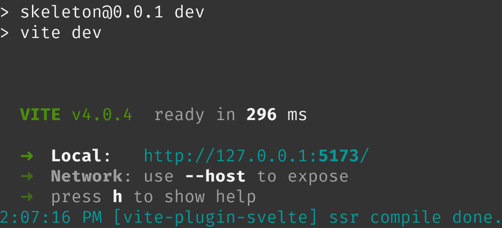

# 初始设置和项目结构

我现在已经开发了近十年的网络应用程序，自从我开始以来，这个领域发生了巨大的变化。为了参考这一点，我自从 JavaScript 在主流浏览器中支持得如此糟糕，以至于 jQuery 成为了构建交互式前端体验的既定标准以来，就开始构建网站了。但随着时间的推移，我们看到越来越多的浏览器愿意支持 ECMAScript 标准，那些不支持的标准已经消失（再见了，Internet Explorer）。JavaScript 随后重新成为了一种可行的语言。随着 Node.js 的兴起，开发者终于可以在单一编程语言中构建整个应用程序，包括前端和后端。JavaScript 已经接管了网络开发世界，并牢固地确立了其地位。

随着技术的成熟，开发体验也日益完善。随着 SvelteKit 1.0 的到来，我们开发者得到了一个直观的体验，允许我们将前端和后端逻辑结合起来，让我们不禁想问：“我们以前是如何做到这一点的？”在我们深入那个体验之前，我们需要先了解一些事情。

首先，我们将介绍使用 SvelteKit 开发应用程序的先决条件。然后，我们将继续介绍如何安装 SvelteKit，并讨论项目通常的结构。从那里，我们将构建一个“Hello, World!”应用程序，以便我们可以看到一切的实际操作。

总结来说，我们将在本章讨论以下主题：

+   先决条件

+   安装 SvelteKit

+   SvelteKit 的项目结构

+   “Hello, World!”

在覆盖所有这些材料之后，你应该能够合理地设置一个新的 SvelteKit 应用程序用于你的下一个项目。

# 技术要求

本章的完整代码可在 GitHub 上找到：[`github.com/PacktPublishing/SvelteKit-Up-and-Running/tree/main/chapters/chapter01`](https://github.com/PacktPublishing/SvelteKit-Up-and-Running/tree/main/chapters/chapter01)

# 先决条件

为了充分利用这本书并确保你记住提供的信息，建议你在阅读时与材料一起工作。将显示的命令和代码输入到你的项目中，但也请随意进行实验。为了有效地进行这项工作，你需要一台运行 Windows、macOS 或基于 Linux 的操作系统以及访问终端或命令行界面的计算机。大多数能够运行上述操作系统的最新版本的现代计算机硬件应该能满足你的需求。具体来说，你需要一个至少有 1 GB RAM 和至少 1.6 GHz 处理器的系统。这应该足以用于使用 SvelteKit 进行开发，尽管性能可能会因操作系统而异。

就像许多其他 Web 开发项目一样，你还需要一个网络浏览器。建议使用最新版本的 Firefox、Chrome 或 Safari。你还需要安装 Node.js。建议使用与标准 Node.js 安装一起提供的最新 `npm`。你可以用 `yarn` 代替 `npm`，但可能更简单直接使用 `npm`。如果你担心性能，`pnpm` 也可以使用。

最后需要的工具是一个文本编辑器或通过 `ext install svelte.svelte-vscode` 安装扩展，然后按 *Enter*。

总结来说，你需要以下内容：

+   基于 macOS、Windows 或 Linux 的计算机

+   现代网络浏览器（Firefox、Chrome 或 Safari）

+   终端访问权限

+   Node.js 18+ LTS

+   包管理器（`npm` 随 Node.js 一起安装）

+   文本编辑器/集成开发环境（推荐使用 Svelte 扩展）

# 安装 SvelteKit

首先，打开你的终端或命令行界面，导航到一个你愿意开始新项目的目录。从那里，我们将运行三个简单的命令。第一个将创建一个新的 SvelteKit 项目，并会有各种提示来初始化应用程序，第二个将安装依赖项，第三个将启动我们的开发服务器：

```js
npm create svelte@latest
npm install
npm run dev
```

当运行第一个命令时，你会看到几个提示。其中第一个会询问你是否要安装 `create@svelte`，你应该回答 `y` 表示是。当被提示选择一个目录来安装项目时，请保持选项为空以使用当前目录（或者如果你愿意，也可以指定目录）。然后你会被询问要使用哪个模板。我们将主要使用 **骨架项目** 选项，但请随时在另一个目录中尝试 **SvelteKit 示例应用**。

下一个提示与 **TypeScript**（**TS**）的使用有关，SvelteKit 对其有很好的支持。然而，为了使本书的焦点保持在 SvelteKit 本身，并吸引那些可能还不熟悉 TS 的开发者，我们将使用纯 JavaScript。因此，为了正确地跟随本文，你应该选择 **否**。如果你对 TS 感到足够自信，那么当然可以选择 **是**。务必选择 **是** 以启用 ESLint 和 Prettier 支持，因为它们很可能为你节省麻烦并进一步改善你的开发体验。还建议包括支持的测试包，但本书不会涵盖测试策略。

在使用 `npm install` 安装项目依赖后，我们运行 `npm run dev` 来启动我们的开发服务器。命令的输出应该类似于 *图 1**.1* 中所示。



图 1.1 – 展示 Vite 开发服务器的输出

注意 Vite 启动我们的开发服务器有多快。尽管这是一个骨架应用，其他打包工具可能需要几秒钟的时间，而 Vite 在一秒内就准备好了。如终端中显示的输出所示，可以通过在浏览器中导航到 `http://localhost:5173/` 来查看网站。如果您想从除开发机器以外的设备访问网站，例如在移动设备上，那么您可以在 `package.json` 项目文件中找到的相应 `npm` 脚本后附加 `–-host`。在 `scripts` 条目下，新命令将看起来像 `"dev": "vite dev –-host"`。

我们刚刚介绍了 SvelteKit 的安装过程。到现在为止，你应该能够轻松地安装自己的基于 SvelteKit 的项目。我们已经介绍了 `create@svelte` 包中的各种提示如何让你根据喜好自定义项目。现在，让我们看看一个典型的 SvelteKit 项目是如何结构的。

# SvelteKit 的项目结构

安装新的 SvelteKit 项目后，在您首选的编辑器中打开项目目录。在该文件夹中，您会注意到在 JavaScript 应用程序的根项目文件夹中常见的文件，如 `package.json`、`.gitignore` 和 `README.md`，以及与 SvelteKit 相关的配置文件（`svelte.config.js`）和 Vite（`vite.config.js`）。您还会注意到三个子文件夹：`static/`、`tests/` 和 `src/`。以下几节将详细探讨它们。

## static/

这个文件夹是放置静态资源的地方，例如 `robots.txt`（为搜索引擎网站爬虫提供的指南）、静态图像，如 favicon，甚至全局 CSS 样式表。这些文件应该能够“原样”提供服务。位于此文件夹中的文件将作为如果它们存在于项目根目录中一样，对应用程序逻辑可用，即 `/robots.txt`。您也可以通过在文件路径前加上 `%sveltekit.assets%` 来访问它们。请注意，如果这里的文件被更改，您可能需要手动刷新页面以查看更改。在某些情况下，您甚至可能需要重新启动开发服务器，因为 Vite 对缓存有强烈的看法。您不应尝试以编程方式访问此目录中包含的文件。相反，路径应该在包含这些资产的地方“硬编码”。

## tests/

从逻辑上讲，Playwright 包（在我们说“是”的各种提示中包含）的测试位于此处。要运行 Playwright 浏览器测试，请使用 npm 脚本 `npm run test`。Vitest 的单元测试将与您的源代码一起包含。例如，如果您包含了一个名为 `utilities.js` 的文件，那么它的单元测试将作为 `utilities.test.js` 与它一起存在。Vitest 是 Vite 开发者提供的包，它使基于 Vite 的应用程序的简单测试成为可能。**测试驱动开发**（**TDD**）是一种确保代码按预期执行的优秀实践。然而，这超出了本书的范围。

## src/

您将在大多数时间里在这个文件夹中工作，因为这是 SvelteKit 应用程序核心逻辑所在的地方。现在应该注意一些文件和目录：

+   `routes/`

+   `lib/`

+   `app.html`

### 路由/

需要注意的第一个子文件夹是 `src/routes/`。这个目录将包含管理 SvelteKit 文件路由机制所需的大部分文件。它的同级文件夹 `src/params/` 将稍后介绍，但到目前为止，假设与您的应用程序路由管理相关的逻辑主要位于此处。作为一个简短的例子，如果您想添加一个静态的“关于”页面，那么您可以通过创建包含适当标记和文本的 `src/routes/about/+page.svelte` 来实现。

### lib/

Svelte 组件和各种其他实用工具可以放置在 `src/lib/` 子文件夹中。这个文件夹可能不在骨架项目模板中，所以您需要自己添加它。它将在 SvelteKit 示例应用中展示。通过将组件放在这里，您可以在稍后的 `import` 语句中轻松引用它们，因为 `$lib/` 别名将在整个应用程序中可用。

### app.html

还有更多文件将在稍后介绍，但到目前为止，最后的提及是 `app.html`。这个文件作为您应用程序构建的基础。当打开时，您会注意到它包含对 `%sveltekit.head%` 的引用，SvelteKit 使用它来注入各种脚本和链接标签，以及 `%sveltekit.body%`，它用于注入为应用程序生成的标记。

回顾一下，`static/` 目录包含不经常更改的文件，`tests/` 目录包含 Playwright 包中的测试，而 `src/` 目录包含您项目的源代码。您创建的大多数 Svelte 组件和其他实用工具都可以放在 `src/lib/` 中，以便通过 `import` 语句中的 `$lib/` 别名轻松访问。如果您想向应用程序 URL 添加新路由，可以在 `src/routes/` 中相应名称的目录内创建一个 `+page.svelte` 文件。最后，您的应用程序需要一个基础来构建。这就是 `app.html` 的作用。我相信您已经迫不及待地想要最终构建一些东西了，所以让我们开始吧。

# Hello World 应用程序

现在我们已经对在全新初始化的 SvelteKit 项目中查看的内容有了一定的了解，似乎构建一个“Hello, World!”应用程序是合适的。我们将首先在编辑器中打开`src/routes/+page.svelte`文件。在这个阶段，它应该只包含基本的 HTML 代码：

```js
<h1>Welcome to SvelteKit</h1>
<p>Visit <a href="https://kit.svelte.dev">kit.svelte.dev</a> to read the documentation</p>
```

由于此文件直接位于`src/routes/`目录中，而不是子目录中，因此它作为 URL 的根路由（即`/`）在浏览器中可用。如果我们要在路由目录中创建一个新的文件夹（即`src/routes/hello/`），并在其中放置另一个`+page.svelte`文件（即`src/routes/hello/+page.svelte`），那么我们就会使`/hello`路由作为有效的 URL 对我们的应用程序可用。我们将在后面的章节中介绍更高级的路由技术，但到目前为止，只需知道要添加新路由，你需要在`routes`目录中创建一个使用所需路由名称的文件夹，以及一个`+page.svelte`文件。

Svelte 组件

熟悉 Svelte 的读者会注意到`+page.svelte`文件扩展名是 Svelte 组件的扩展名。这是因为**它就是一个** Svelte 组件！因此，我们可以调整其中的 HTML，使用`<style>`标签自定义外观，在`<script>`标签内编写 JS，并导入其他 Svelte 组件。如果你对 Svelte 组件不熟悉，建议在继续之前至少学习基础知识。可以查看*Allessandro Segala*的《Svelte 3 Up and Running》或访问官方 Svelte 网站([`svelte.dev`](https://svelte.dev))获取更多信息。

让我们对`src/routes/+page.svelte`文件进行一些修改，看看发生了什么。将`<h1>`标签的内部文本更改为`Hello, World!`，如下所示：

```js
<h1>Hello, World!</h1>
```

多亏了 Vite，我们在浏览器中的页面在保存后立即更新。如果你的设置中有双显示器，一个显示代码，另一个显示浏览器，你将很快看到**热模块替换**（**HMR**）是多么有价值。我们做出的更改都是好的，但如果用户不能更改文本，这并不是一个真正的“Hello, World!”应用程序。为了一个真正的“Hello, World!”示例，我们需要显示一些由用户提供的文本。以下代码展示了这一点：

```js
<script>
  let name = 'World';
</script>
<form>
  <label for="name" >What is your name?</label>
  <input type="text" name="name" id="name" bind:value={name} />
</form>
<h1>Hello, {name}!</h1>
```

这个简单的 Svelte 组件创建了一个名为`name`的变量，默认值为“`World`”。从那里，HTML 给我们一个基本的表单，将文本输入值绑定到我们的变量，并在 HTML `<h1>`标签中输出文本。多亏了 Svelte 的响应性和文本输入值与`name`变量的绑定，提供的文本会立即显示，即使在输入时也是如此。


图 1.2 – “Hello, World!”组件的输出

# 摘要

在本章中，我们讨论了一些开始使用 SvelteKit 所需的先验知识和工具。你可能已经拥有一台运行着强大操作系统的计算机，并且安装了浏览器。你可能甚至已经安装了带有 `npm` 软件包管理器的最新 LTS 版本的 Node.js。我们还简要介绍了通过安装 Svelte 特定扩展来准备你的编辑器。

我们继续介绍了 SvelteKit 的安装过程。安装过程中提供的提示使得设置新的 SvelteKit 项目变得简单，并且可以轻松地根据开发者的喜好进行定制。

在项目安装之后，我们从高层次上审视了 SvelteKit 的项目结构。虽然 `tests/` 和 `static/` 目录相当直接，但 `src/` 文件夹中存在一些细微差别。例如，将各种 Svelte 组件和其他实用工具放在 `src/lib/` 文件夹中可以帮助项目避免变得难以导航。位于那里的组件也可以通过 `$lib/` 别名轻松地在应用程序代码中访问。

我们还创建了一个基本的“Hello, World!”应用程序。它展示了 SvelteKit 如何使从头开始构建应用程序变得简单。

在下一章中，我们将介绍一些你可能需要在 SvelteKit 和 Vite 中调整的各种配置选项，以便根据你的需求进行定制。

# 资源

+   Node.js: [`nodejs.org`](https://nodejs.org)

+   NVM: [`github.com/nvm-sh/nvm`](https://github.com/nvm-sh/nvm)

+   SvelteKit: [`kit.svelte.dev`](https://kit.svelte.dev)

+   VS Code: [`code.visualstudio.com/`](https://code.visualstudio.com/)
