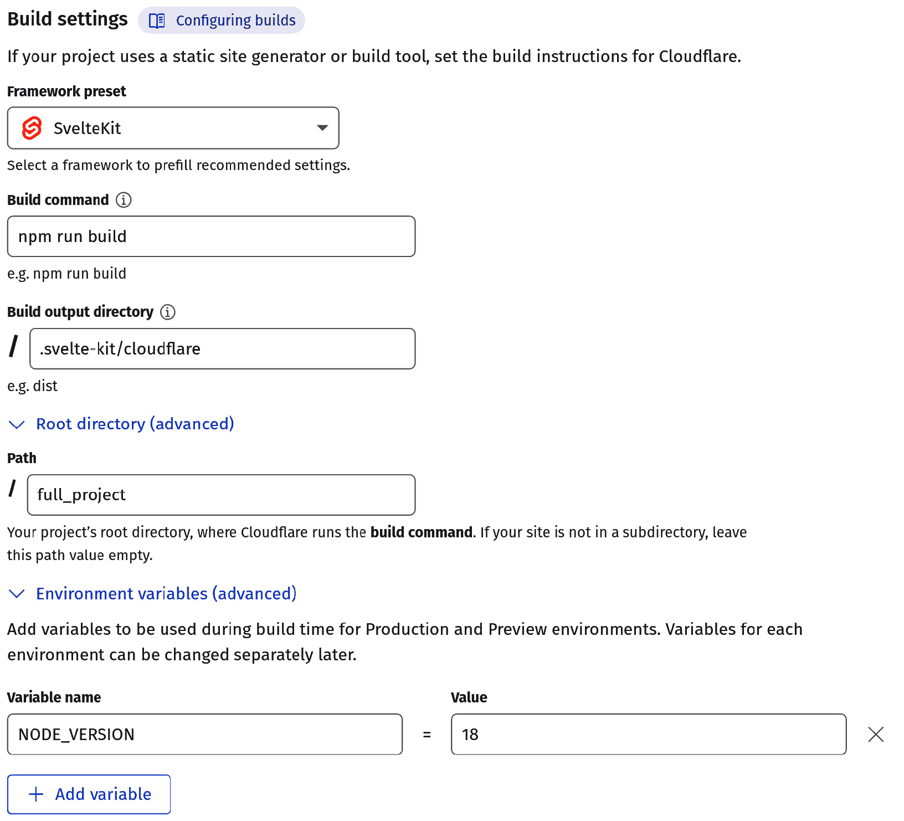

# 构建和适配器

在前四章中，我们花费了大量时间讨论各种路由技术。从简单的路由到可以渲染为静态 HTML 并加快我们应用速度的页面，再到更复杂的策略，通过使用正则表达式确保数据是预期的类型。虽然这些技术代表了 SvelteKit 的核心功能，但它们并不是全部。SvelteKit 中另一个有用的特性是它能够通过适配器在几乎任何环境中运行。在我们深入探讨各种适配器和它们的配置之前，我们将分析创建 SvelteKit 应用程序生产构建所涉及的过程。

首先，我们需要解决如何为生产环境构建我们的应用程序。Vite 使这一步变得简单，然后我们将转向如何使用不同的适配器调整不同环境的构建。虽然每个适配器都有自己的要求，但讨论它们所有很快就会变得重复。相反，我们将专注于三个不同的适配器，它们各自适合独特的环境。

本章将涵盖以下主题：

+   创建构建

+   适配应用

一旦完成，你将能够构建和部署你自己的应用程序到多种平台类型，包括静态主机、Node.js 以及众多无服务器环境。

# 技术要求

本章的完整代码可在 GitHub 上找到：[`github.com/PacktPublishing/SvelteKit-Up-and-Running/tree/main/chapters/chapter08`](https://github.com/PacktPublishing/SvelteKit-Up-and-Running/tree/main/chapters/chapter08)。

# 创建构建

在其他关于 Web 开发框架的书籍中，关于创建应用程序生产构建的部分通常要到书的最后才出现。但鉴于 SvelteKit 和 Vite 使这一过程变得如此简单，实际上没有等待的理由。我相信你急于尽快让你的应用程序可用，所以让我们直接进入正题。

到目前为止，我们只在我们开发环境中工作过我们的应用程序。本质上，当我们运行`npm run dev`命令时，Vite 在本地机器上启动了一个开发服务器。要关闭开发服务器，我们使用*Ctrl* + *C*。为了准备我们应用程序的生产构建，我们可以使用提供的`npm`脚本：

```js
npm run build
```

如果你打开项目的`package.json`文件，你会注意到这个特定的脚本运行了`vite build`命令。它确实做了它听起来像的事情，通过启动 Vite 的构建过程，这涉及到 Rollup 的打包过程、打包静态资源以及运行配置的适配器。命令完成后，你会在终端中看到各种文件及其大小。如果有任何构建错误，它们将在这里显示。

默认情况下，完全构建的应用程序将被输出到 `.svelte-kit/` 目录。要更改此目录，我们可以打开 `svelte.config.js` 文件，并将首选的目录名称传递给 `config.kit.outDir` 选项。当打开 `build` 文件夹时，您会注意到构建的应用程序结构与我们的源代码不同。这当然是出于设计考虑，并且根据我们使用的适配器而有所不同。为了确认我们的生产构建工作正常，我们可以使用以下命令进行预览：

```js
npm run preview
```

运行后，Vite 将提醒我们应用程序可以访问的新 URL 和端口。我们可以在那里查看和使用应用程序，就像运行我们的开发服务器时一样。不同之处在于，文件更改不会自动更新，因为用于运行此版本应用程序的文件需要在每次构建时重新生成——除非在 `vite.config.js` 项目中设置了 `build.watch`。

在运行我们应用程序的第一个官方构建之后，在开始讨论适配器之前，有一些事情需要注意。首先，回想一下*第四章*，我们在根目录的 `+layout.js` 文件中介绍了 `ssr`。只需记住，预渲染发生在应用程序构建过程中。因此，在预渲染页面上发生的任何 `fetch()` 请求都会在构建时发生。我们可以通过简单更改我们的 `fetch` 示例来确认这一点。在我们之前设置 `ssr = false` 的地方，现在将其更改为 `prerender = true;`：

src/routes/(site)/fetch/+page.js

```js
const key = 'DEMO_KEY'; // your API key here
export const prerender = true; // change this line
export function load() {
  const pic = fetch(`https://api.nasa.gov/planetary/apod?api_key=${key}`)
    .then(response => {
      console.log('got response');
      return response.json();
    });
  return {pic};
}
```

一旦我们在这个特定路由上启用了预渲染，我们就可以继续重新构建应用程序。现在，当我们打开我们的 `build` 文件夹时，我们应该看到位于 `.svelte-kit/output/prerendered/pages/fetch.html` 路径的文件。打开此文件后，我们将看到图像元素以及从 NASA API 拉取的所有其他数据，这些数据以静态 HTML 的形式显示。这证实了预渲染发生在构建过程中。这对于开发者在为生产环境准备应用程序时需要非常注意的事情。

在构建您的应用程序时，还有一些其他的特点需要注意：

+   禁用 `csr` 和 `ssr` 将导致渲染一个空白的页面。

+   依赖于表单操作的页面无法进行预渲染，因为页面依赖于 HTTP `POST` 请求。

+   使用 `url.searchParams.` 的页面也无法进行预渲染。

+   基于路由中的动态参数加载数据的页面可以进行预渲染；然而，SvelteKit 需要观察这些端点的链接才能进行预渲染。

如演示所示，为生产环境准备应用程序相当简单。Vite 快速打包依赖项，甚至提供了预览应用程序的方法。尽管如此，在打包应用程序之前，还有一些事情需要考虑。在下一节中，我们将查看一些常用的适配器以及它们如何为预期的环境生成特定的构建。

# 适配应用程序

现在我们已经知道了如何构建我们的应用程序，我们可以探索一些将应用程序转换为特定环境的适配器。在我们整个项目开发过程中，我们一直在使用`@sveltejs/adapter-auto`包。到目前为止，我们没有遇到任何问题，但如果我们想要构建并部署我们的应用程序到真实的生产环境，我们需要更加具体。虽然`adapter-auto`很好，但它不接受任何配置选项，并且仅与 Cloudflare Pages、Vercel、Netlify 和 Azure Static Web Apps 兼容。如果我们想在 Node.js 服务器或其他地方托管我们的应用程序，我们需要使用不同的适配器。让我们在下一节中探索一些可用的不同选项。我们将查看的适配器如下：

+   `adapter-node`

+   `adapter-cloudflare`

+   `adapter-static`

这个列表并不全面，因为 SvelteKit 项目支持许多其他环境。同时，SvelteKit 社区继续为各种平台创建和发布适配器。在构建自己的适配器之前，请务必检查 Svelte 社区资源。

## adapter-node

首先，我们将从`adapter-node`开始，因为大多数 Web 开发者至少对 Node.js 环境有些熟悉。可以通过运行以下命令来安装此适配器：

```js
npm install -D @sveltejs/adapter-node
```

安装后，我们可以通过将其导入到我们的`svelte.config.js`文件中并相应地指定适配器来将其添加到我们的项目中：

svelte.config.js

```js
import adapter from '@sveltejs/adapter-node';
const config = {
    kit: {
        adapter: adapter(),
        alias: {
            db: '/src/db.js',
            img: '/src/lib/images'
        }
    },
};
export default config;
```

与之前一样，这个配置的不同之处在于它导入的是`adapter-node`而不是`adapter-auto`。

一旦更换了适配器，我们就可以通过在终端中运行`npm run build`来为 Node.js 环境构建应用程序。默认情况下，此适配器将构建的应用程序输出到`build/`目录。

到目前为止，在这个项目中，我们只包含了一个依赖项，那就是 `bcrypt`。如果我们没有包含这个依赖项，我们甚至不需要进行下一步。但是，由于找到不使用其他依赖项的项目似乎很少见，所以我们最好还是涵盖这一点。为了确保我们的 Node.js 生产环境能够访问所有必需的依赖项，我们需要安装它们。我们通过将 `package.json` 和 `package-lock.json` 复制到 `build/` 目录来实现这一点。为了确保我们的构建能够成功运行，我们将模拟自动化部署。我们可以通过将整个 `build/` 目录（现在也包括 `package.json` 和 `package-lock.json`）复制到机器上的另一个位置来实现这一点。一旦完成，我们就可以在相同的目录中使用 npm 的 clean install 命令来下载所需的生成依赖项。这是自动化部署和持续集成环境的推荐安装方法。我们不需要开发依赖项，因为 SvelteKit 现在已经打包成纯 JS，所以命令看起来是这样的：

```js
npm ci --omit dev
```

在构建所在的同一目录下运行此命令将下载所需的依赖项。

然后，我们可以使用以下命令启动应用程序：

```js
ORIGIN=http://0.0.0.0:3000 node build
```

在这种情况下，`build` 是我们希望 Node.js 定位的目录名称。我们还指定了 `ORIGIN` 环境变量，以便 `adapter-node` 可以正确确定应用程序的 URL。如果没有这个，SvelteKit 会阻止任何 `POST` 请求，作为对 `0.0.0.0:3000` 的保护措施。要更改 IP 地址或监听端口，我们可以在运行 `node build` 之前设置这些环境变量。例如，在 `127.0.0.1:8000` 上启动应用程序将看起来像这样：`HOST=127.0.0.1 PORT=8000 ORIGIN=http://127.0.0.1:8000` `node build`。

为了进一步自定义构建，此适配器提供了以下选项：

+   `out` – 一个字符串，指定构建应该输出的目录。默认为 `build`，且不应在末尾包含 `/` 字符。

+   `precompress` – 一个默认为 `false` 的布尔值，控制是否使用 `gzip` 和 `brotli` 对资源和预渲染页面进行压缩。

+   `envPrefix` – 一个字符串值，指定应用于环境变量的前缀，这在你的托管提供商不提供标准环境变量访问（如 `HOST` 或 `PORT`）时非常有用。设置此值将允许你创建自己的环境变量。

+   `polyfill` – 一个默认为 `true` 的布尔值，允许你指定构建是否应该包含添加了在旧版 Node.js 版本中不可用功能的 polyfills。

在我们刚刚讨论的所有内容之后，你应该能够将你的 SvelteKit 应用程序部署到几乎任何 Node.js 环境中。如果目标环境限制了你的控制权限，你应该能够使用各种选项自定义构建。由于 Node.js 环境如此普遍，不解释`adapter-node`背后的某些功能以及它如何简化你的部署过程将是一个巨大的错误。

## adapter-cloudflare

虽然`adapter-node`在运行 Node.js 应用程序时很棒，但还有一些适配器允许我们无需管理、配置或维护服务器即可部署。例如，Vercel、Netlify 和 Cloudflare 等平台都提供这些服务，并赋予开发者比以往任何时候都更快地交付代码的能力。为了演示目的，让我们看看部署到 Cloudflare Pages 有多简单。

首先，我们将像安装其他包一样安装适配器：

```js
npm i -D @sveltejs/adapter-cloudflare
```

完成后，我们可以更改我们的`svelte.config.js`以反映新的适配器。同样，我们只需要导入新的适配器：

svelte.config.js

```js
import adapter from '@sveltejs/adapter-cloudflare';
const config = {
    kit: {
        adapter: adapter(),
    }
};
export default config;
```

在深入探讨之前，重要的是要注意，我们迄今为止构建的应用程序`bcrypt`包之前，我们的应用程序将无法构建，因为`bcrypt`广泛使用了 Node.js API。为了成功构建和部署应用程序，我们需要做一些更改。

如果你不想在你的应用程序中做出这些更改，你可以在每章开头列出的*技术要求*部分下找到这本书的代码仓库的分支创建一个分支。在那个仓库中，有一个标记为`cloudflare`的分支，其中包含了所有必要的更改。在创建分支时，请确保选择`cloudflare`分支。至于必要的更改，让我们先简要地考察一下：

1.  使用`npm uninstall`命令卸载`bcrypt`。

1.  如下代码片段所示，在`src/routes/(app)/login/+page.server.js`中移除对`bcrypt`的引用。

1.  将`src/lib/users.json`中的密码更改为纯文本值：

src/routes/(app)/login/+page.server.js

```js
import users from '$lib/users.json';
export const actions = {
  login: async ({request, cookies}) => {
    const form = await request.formData();
    const exists = users.filter(user => user.username === form.get('username'));
    const auth = exists.filter(user => user.password === form.get('password'));
    if(!exists.length || !auth.length) {
      return {msg: 'Invalid login!'};
    }
    cookies.set('identity', auth[0].identity, {path: '/'});
    return {msg: 'success!'}
  }
}
```

这个`+page.server.js`的新版本只是简单地移除了对`bcrypt`包的引用，并改为将`password`字段中提供的文本与`src/lib/users.json`文件中的纯文本值进行比较。**从安全角度来看，这有多么糟糕是毋庸置疑的，我信任你永远不会在这个** **特定演示** **之外这样做**。

现在我们已经移除了所有需要 Node.js 的依赖项，我们可以继续将我们的部署到 Cloudflare。首先，我们应该登录到 Cloudflare 账户，导航到这里的`cloudflare`。通常，这将是`main`分支。

从那里，我们可以设置几个选项。Cloudflare 通过询问我们是否使用框架来简化下一步，而我们确实在使用框架。从**框架预设**下拉菜单中选择**SvelteKit**将自动填充**构建命令**和**构建输出目录**字段。更多信息请参见*图 8.1*：



图 8.1 – Cloudflare Pages 项目设置

由于我们尝试部署的项目源代码位于 Git 仓库的子目录中，我们必须在**环境变量**部分指定该目录的`NODE_VERSION`。尽管 SvelteKit 只需要 Node.js 16.14 或更高版本，但我们指定了版本 18，因为这也是 SvelteKit 当前的最新长期支持版本，也是本书开发过程中使用的版本。一旦所有内容都填写正确，你就可以保存并部署项目了！

Cloudflare 将检查你的代码并尝试构建它。如果一切顺利，你将获得一个指向你应用程序的 URL。为了参考，我们迄今为止创建的应用程序版本可在[`sveltekit-up-and-running.pages.dev/`](https://sveltekit-up-and-running.pages.dev/)上找到。将更新部署到应用程序就像将代码推送到项目仓库的适当分支一样简单。

如你所见，一旦在无服务器平台如 Cloudflare Pages 上设置好，部署 SvelteKit 应用程序几乎可以毫不费力。Vercel 和 Netlify 适配器有类似的过程，你可以在空闲时探索。虽然我们的特定项目遇到了一个包含的依赖项需要 Node.js 的轻微问题，但这个例子希望展示了使用正确的适配器可以简化部署。

## adapter-static

尽管我们之前只遇到了一个小的适配器问题，但我们肯定会遇到`adapter-static`的问题。原因在于这个适配器旨在仅在可以托管静态内容的平台上使用——也就是说，在这些平台上不存在服务器后端逻辑。如果你有一个可以提供静态 HTML、CSS 和 JS 的主机，你可以使用这个适配器在那里托管整个 SvelteKit 应用程序。一个常见的例子是 GitHub pages，但 Cloudflare 和其他许多也支持这种方法。托管静态应用程序的好处是速度更快，因为没有服务器后端需要与之通信。

由于我们无法在我们的项目中使用`adapter-static`，我们不会尝试在我们的现有项目中安装它。但这是一个值得讨论的适配器。就像其他适配器一样，它可以通过以下命令轻松安装：

```js
npm install -D @sveltejs/adapter-static
```

再次强调，它可以在 `svelte.config.js` 中导入。此适配器与其他适配器不同，因为它预渲染整个应用程序。它能够做到这一点，因为我们将在应用程序最低级别的布局中插入 `export let prerender = true;`。在每种情况下，这将是 `src/routes/+layout.js`。

为了自定义此适配器生成的构建，我们提供了一些选项。这些选项通过 `svelte.config.js` 传递给适配器：

+   `pages` – 一个默认为 `build` 的字符串值，它确定预渲染页面将被输出到何处。

+   `assets` – 一个默认为 `pages` 提供的值的字符串值，它确定静态资源应该输出到何处。

+   `fallback` – 一个字符串值，指定当全局禁用 SSR 时使用的回退文件。全局禁用 SSR 将启用 `index.html`、`200.html` 或 `404.html`。

+   `precompress` – 一个布尔值，确定是否应该使用 `brotli` 和 `gzip` 压缩算法压缩文件。

+   `strict` – 一个布尔值，防止应用程序在预渲染时某些端点不存在时构建。如果你的应用程序使用了仅在特定情况下存在的页面，禁用此功能可能很有用。

如果你有兴趣亲自尝试 `adapter-static`，考虑使用 `skeleton` 模板创建一个新的 SvelteKit 应用程序。你可以尝试使用 *演示应用程序*，但会遇到服务器路由无法预渲染的问题。这些可以通过删除来解决以使其工作，但如果你的目标是简单地了解静态适配器的工作原理，从 `skeleton` 模板部署可能会更容易。再次强调，构建静态应用程序的步骤相当简单：

1.  使用 `npm install -``D @sveltejs/adapter-static` 安装适配器。

1.  在 `svelte.config.js` 中导入适配器。

1.  通过在 `src/routes/+layout.js` 中添加 `export let prerender = true;` 确保应用程序完全可预渲染。

1.  运行 `npm run build` 命令！

一旦你的应用程序构建完成，你可以简单地将其复制到任何可以提供静态文件的服务器上。当然，某些主机可能有它们自己的要求，所以请务必阅读它们的文档。

通过与 SvelteKit 一起工作是一种了解它的好方法。如果你还没有个人网站，可以考虑使用 SvelteKit 静态适配器来创建一个。这不仅不需要数据库或后端，而且几乎可以部署到任何托管提供商。如果你想知道从哪里开始，Josh Collinsworth 使用静态适配器创建了一个出色的项目。它允许用户使用 Markdown 添加博客文章，同时仍然作为一个静态网站存在。这意味着可以在 GitHub Pages 等平台上免费托管。你可以在本章末尾的 *资源* 部分找到 Josh 项目的链接。虽然我们的项目以及许多其他项目无法使用 `adapter-static`，因为它们不是可预渲染的，但这个特定适配器在生成静态网站方面的价值是显而易见的。

# 摘要

在了解了 SvelteKit 构建过程的工作原理后，我们观察了如何在本地预览我们的构建。我们还探讨了页面选项如何影响我们的构建。我们学习了构建过程，并看到如何通过选择正确的适配器来调整我们的应用程序以适应各种平台。我们构建的应用程序最适合 Node.js 环境，但我们也已经看到将其部署到 Cloudflare Pages、Netlify 或 Vercel 等平台是多么简单。通过使用正确的适配器和开发策略，我们甚至可以将我们的应用程序转变为静态网站。现在你已经看到了如何为不同的生产环境准备你的应用程序，你可以继续发布你的 SvelteKit 应用程序到野外。

在下一章中，我们将学习如何通过使用钩子（hooks）来操作整个应用程序中的请求。我们还将讨论如何利用这些钩子来帮助管理错误。因为没有任何应用程序是完美的，所以我们将探讨 SvelteKit 如何让我们在出现问题时自定义用户体验。

# 资源

+   *Svelte Society* – 一个提供许多社区维护的 Svelte 相关项目，包括适配器的中心资源：[`sveltesociety.dev/`](https://sveltesociety.dev/)

+   *Cloudflare Workers 如何工作*：[`developers.cloudflare.com/workers/learning/how-workers-works`](https://developers.cloudflare.com/workers/learning/how-workers-works)

+   由 Josh Collinsworth 编写的 *SvelteKit Blog Starter*：[`github.com/josh-collinsworth/sveltekit-blog-starter`](https://github.com/josh-collinsworth/sveltekit-blog-starter)
