# *第一章*：了解 Google Classroom

**Google Classroom** 是由 Google 提供的 **学习管理系统**（通常缩写为 **LMS**）。它为学生提供了一个中心位置进行沟通、分享资源、提出问题和创建作业。在一个日益数字化的世界中，Google Classroom 有助于促进当今数字学习者的在线学习。与许多新应用程序一样，Google Classroom 具有独特的视觉和感觉。由于您设置物理教室的方法与您的教学方法一样独特，Google Classroom 开始时是一个空白画布。在我们能够将学生添加到 Google Classroom 之前，您需要为您的物理课程创建在线课程。

首先，您将熟悉 Google Classroom 中所有内容的位置。作为教室的教师，您将能够访问学生看不到的选项，并允许您更改设置，例如学生在 Google Classroom 中可以做什么。您将能够从这个 *教师* 视角添加学生到教室，创建公告和作业，并上传课程材料。但首先，您需要创建和设置您的第一个课程。

在我的课程中，我倾向于在创建课程之前花大部分时间思考在线课程的结构。作为习惯性生物，通过 Google Classroom 建立在线期望，类似于我们亲自做的事情，将帮助我们和我们的学生知道该转向哪里。我在规划在线课程时问自己的一些问题包括：*学生如何提问？* *何时提问是合适的？* *他们从哪里找到资源？* *他们如何被解散？* 通过在开始时建立这种结构，当晚上 7:30 有学生向您提问时，您会感到不那么内疚。

在本章中，我们将涵盖以下主题：

+   创建您的第一个 Google Classroom

+   在 Google Classroom 中导航

+   个性化您的虚拟教室

+   管理您课程中的资源

+   邀请额外的教师

+   从 Google Classroom 的主页访问课程

    注意

    在这本书中，**Class** 指的是 Google Classroom 的课程，而 **class** 指的是实体教室。

# 创建您的第一个 Google Classroom

首先，打开 Google Chrome 并导航到 [`classroom.google.com/h`](https://classroom.google.com/h)。

选择合适的网络浏览器

虽然 Google Classroom 在任何网络浏览器中都可以访问，但 Google Chrome 网络浏览器被构建为与 Google 的所有其他应用程序兼容。因此，一些功能可能在其他网络浏览器中不兼容或无法正常工作。如果您的计算机上未安装 Google Chrome，请考虑与您的学校 IT 员工讨论。

如果这是您第一次使用**Google Workspace for Education**账户打开 Google Classroom，它将要求您确认您的电子邮件账户，然后选择是否将**教师**或**学生**角色分配给您的账户。请确保正确选择教师角色，否则您的账户将被设置为学生账户。除非您的角色是 Google Classroom 中的教师，否则您将无法创建或管理班级。

以下截图显示了选择教师角色的情况：

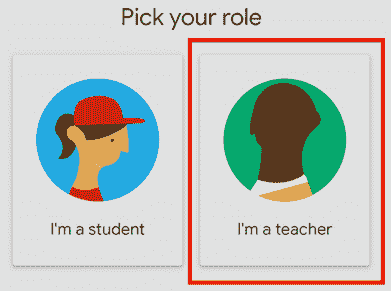

图 1.1 – 选择您的角色

注意

如果您的账户设置为学生账户，您需要联系您的 IT 部门，以便他们可以将您的 Google Classroom 角色更改为教师角色。

使用个人 `@gmail.com` 账户或**Google Workspace for Business**账户将不会有**选择您的角色**页面。相反，所有用户都将能够创建 Google Classroom 中的班级。

另一种访问 Google Classroom 的方法是使用应用程序启动器。如果 IT 部门已启用此功能，请点击另一个 Google 应用程序（如**Gmail**）右上角的蜂巢形图标，以查看是否可用**Classroom**图标。

这在以下截图中有说明：

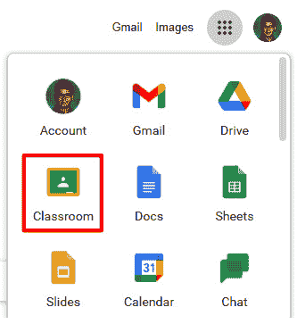

图 1.2 – App Launcher 中的 Classroom 应用程序

选择教师角色后，下一页将指向右上角的加号符号 **+** 以创建您的第一个班级，如下面的截图所示：

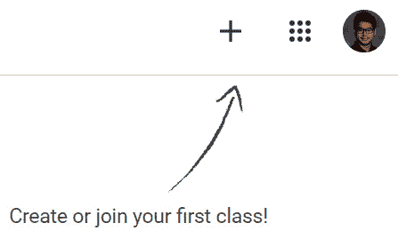

图 1.3 – 创建您的第一个班级

当您点击加号符号 **+** 时，将出现一个菜单，供您选择是创建班级还是加入班级。点击**创建班级**以创建您的第一个班级。

注意

作为教师，您可以通过点击**加入班级**并填写班级代码来以学生身份加入另一个教师的班级。这些说明在*第二章*，*邀请学生进入他们的虚拟教室*中有详细说明。

将会出现一个对话框，让您为班级命名并提供节次号。虽然**班级名称**字段是必填的，但**节次**号、**科目**和**教室**字段是可选的。根据您的学校政策，某些班级可能已经具有可以在此处添加的节次号。

在加拿大，许多中学和高中使用节次号作为时间表安排，这也是为该字段填写的一个选项。由于学生也会看到节次号，因此使用**时间表**节次号对他们来说将更加适用。虽然**科目**和**教室**字段可能有所帮助，但这些字段在 Google Classroom 中默认不可见。

以下截图提供了班级信息的概述：

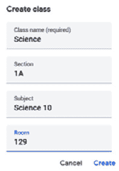

图 1.4 – Google Classroom 中班级的信息

一旦填写了这些字段并点击**创建**按钮，您将进入 Google Classroom 中的新班级，如下面的截图所示：

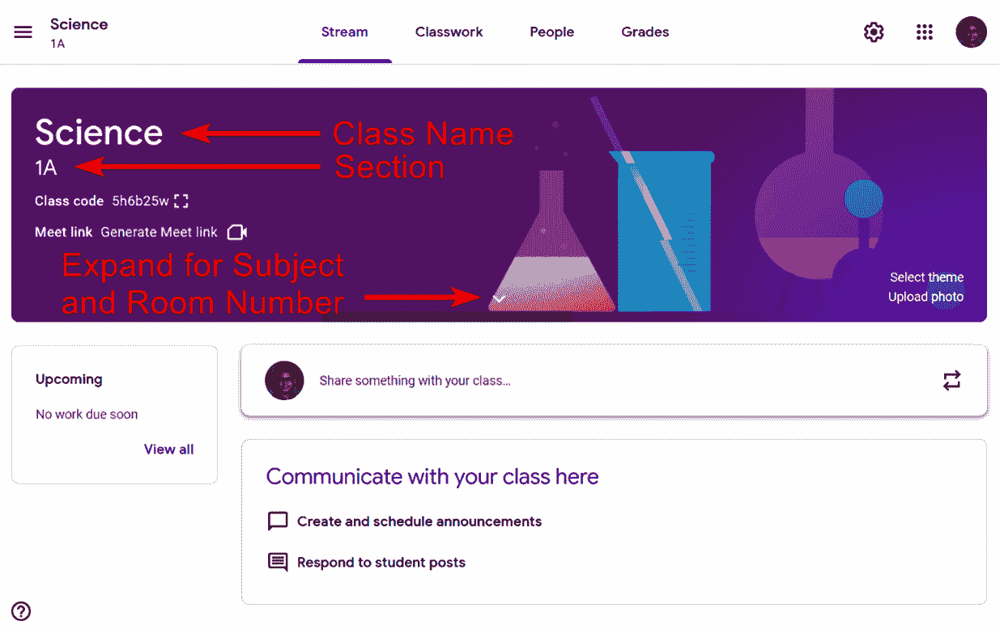

图 1.5 – 班级信息

现在班级已创建，在下一节中，您将探索这个在线班级的不同功能。

# 在 Google Classroom 中导航

现在您已经在 Google Classroom 中设置了第一个班级，您可以看到其不同的部分——横幅、菜单、侧边栏和内容区域，如下面的截图所示：

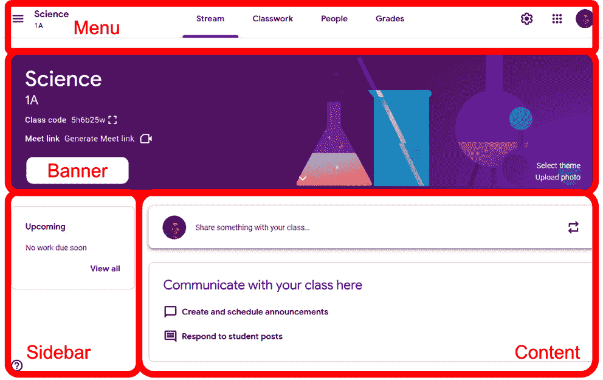

图 1.6 – Google Classroom 班级部分

让我们逐一查看这些部分，如下所示：

+   标题栏显示横幅图片、班级名称、班级和**班级代码**以及 Google **Meet 链接**功能。标题栏是学生进入 Classroom 时首先看到的，这使他们能够快速识别他们正在访问的哪个班级。学生的视图略有不同——**班级代码**字段和更改主题的链接缺失。

+   菜单允许教师和学生切换 Google Classroom 的不同部分。菜单有以下子部分：

    **流**部分是公告、新作业的通知、讨论问题和**作业**部分中的材料出现的地方。如何在**流**部分创建公告在本节中详细说明，*第三章*中介绍，*发送您的第一个公告*。

    **作业**部分是找到资源、如投票等问题和作业的地方。有关在此部分组织和管理功能的详细信息，请参阅*第四章*中介绍，*使用问题开始在线讨论*，以及*第五章*中介绍，*分发和收集作业*。

    **人员**部分显示所有管理和所有注册在班级中的学生的列表。教师可以从本部分给学生发电子邮件并更改 Google Classroom 中的学生相关设置。本节的功能在第*第二章*中介绍，*邀请学生进入他们的虚拟教室*。

    **成绩**部分显示**作业**部分中找到的问题和作业的分数。此页面将所有问题和作业分数组织成表格，方便查看。本节的功能在*第六章*中介绍，*快速评分书面作业*。

+   侧边栏在**流**部分显示即将到来的作业，在**作业**部分显示**主题**列表。

+   内容区域显示班级中的当前部分。

现在我们已经熟悉了创建 Google Classroom 的主要功能，现在是时候设置班级并开始添加内容了。

# 个性化您的虚拟教室

与教师在学校开放前有几天时间准备他们的教室一样，您想在学生被邀请之前花一些时间向您的在线教室添加信息。这些是您可以在 Google Classroom 中执行的任务：

+   更改教室的主题

+   上传横幅图片

## 更改教室的主题

教室的横幅是您班级最突出的部分。当学生到达时，它为学生营造了一种氛围。Google Classroom 会自动应用一个适合常见科目班级名称的主题。这就是为什么主题横幅在前一节中为**科学**课程创建了实验室设备。

主题还会改变教室中标题和图标的颜色。要更改您的教室主题，请按照以下步骤操作：

在横幅图片的右下角点击**选择主题**，如下面的截图所示：

图 1.7 – 选择主题链接

1.  选择所需的 Google Classroom 提供的横幅图片。教室内的颜色将改变以匹配横幅。点击如下截图所示的**选择班级主题**按钮：

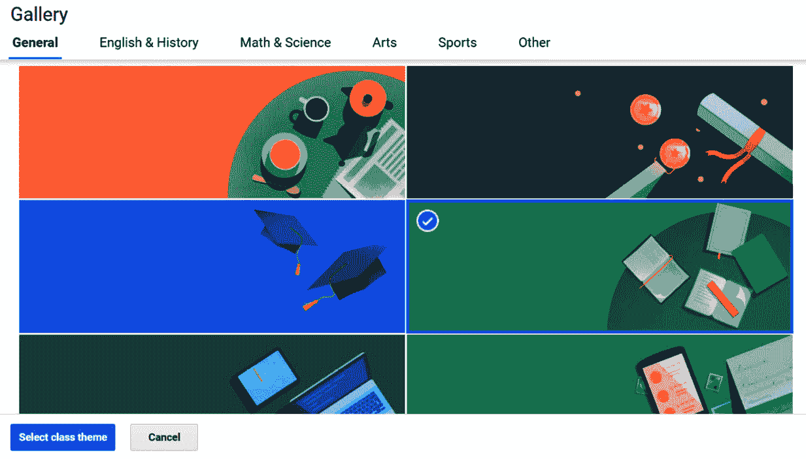

图 1.8 – 主题画廊

这是您的新主题班级：

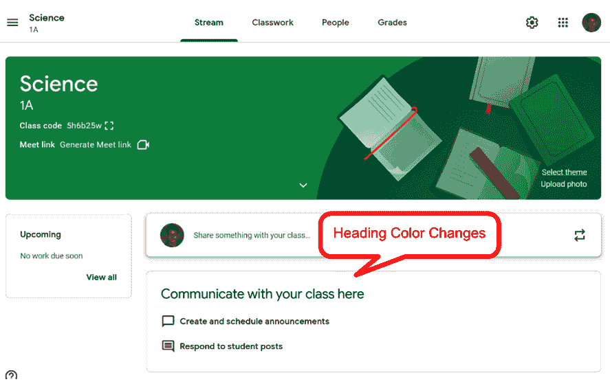

图 1.9 – 标题颜色变为与主题匹配

Google Classroom 还提供几个类别，以帮助您找到适合您班级的横幅。只需在对话框中选择一个标签，即可查看每个类别中可用的横幅，如下面的截图所示：

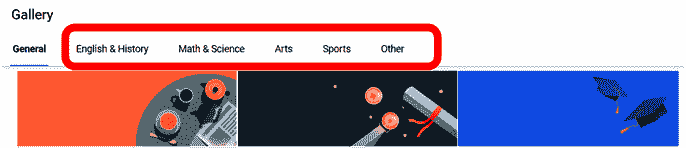

图 1.10 – 主题画廊中的类别

尝试不同的主题

如果这是您第一次尝试使用 Google Classroom，在选择班级主题之前，尝试不同的主题。横幅图片中最突出的颜色将建议主题将使用哪些颜色作为背景和菜单的颜色。

## 上传横幅图片

使用 Google Classroom 内部找到的图片的另一种选择是上传您自己的图片。以下步骤将指导您上传横幅图片：

1.  在横幅图片的右下角点击**上传图片**，如下面的截图所示：

    

    图 1.11 – 上传图片链接

1.  点击如下截图所示的**从您的电脑选择照片**按钮：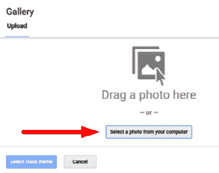

    

    图 1.12 – 上传图片对话框

1.  在文件资源管理器中，选择所需的图像并点击**打开**按钮，如下截图所示：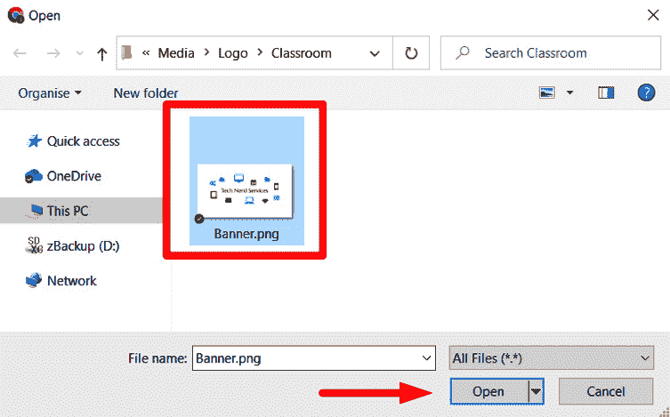

    图 1.13 – 在文件资源管理器中选择图像

1.  如果图像太大，可以通过调整框架大小来裁剪它，并将其移动到图像上的所需位置。然后，点击如下截图所示的**选择班级主题**按钮：

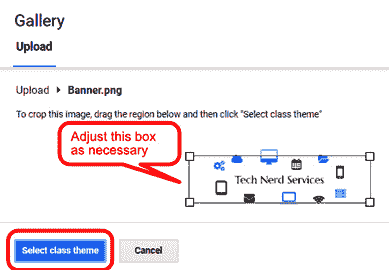

图 1.14 – 裁剪图像

以下截图显示了在上一步骤中上传图像后班级的外观：

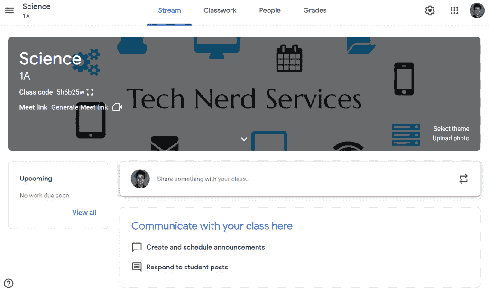

图 1.15 – 自定义图像主题的截图

班级网页的强调颜色会改变以匹配横幅颜色。该颜色在班级的链接、标题和图标中显示。在撰写本文时，无法自定义此强调颜色。

选择合适的图像

当涉及到您的横幅图像时，大小很重要。Google Classroom 只会使用至少 800 x 200 像素的像素维度的图像。横幅上的文本始终为白色。较浅色的图像，如前例中的图像，将被变暗以确保文本的可读性。

一旦您选择了合适的主题来个性化您的 Google Class，现在您可以开始添加资源。

# 管理班级中的资源

学生和共同教师将能够在**流**部分的**作业**部分找到与 Google Classroom 相关的其他 Google 应用链接以及与教室相关的资源。要导航到该部分，请点击菜单中的**作业**标签，如下截图所示：

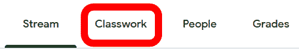

图 1.16 – 作业标签

使用您新创建的网站，**作业**标签将是空的。在**作业**部分的顶部，有一些图标和链接到与该班级关联的其他 Google 应用，如下截图所示：

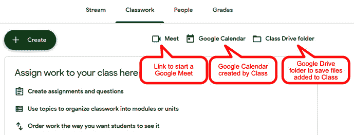

图 1.17 – 与班级链接的 Google 应用链接

此部分是您分发文件、提问和布置作业的地方。许多这些功能将在后面的章节中探讨。在本节中，您将创建一个主题并向主题添加文件。如果您已经有课程大纲和其他数字格式的文件，通过将那些文件添加到本节可以轻松填写此部分。

## 将文件和资源添加到您的教室

在 Google Classroom 中，您有两个区域可以添加文件——**Stream** 部分和 **Classwork** 部分。上传到 **Stream** 部分的文件用于短期用途，例如公告或工作表，而上传到 **Classwork** 部分的文件与课程持续时间相关，例如课程大纲。因为学生将在整个课程期间访问这些文件，所以有组织地添加主题将帮助他们更容易地找到材料。

注意

虽然您不必创建主题即可将文件和其他材料添加到 **Classwork** 部分，但如果学生可以轻松找到他们需要的文件，他们将会更频繁地使用 **Classwork** 部分。

### 在 Classwork 中创建主题

要创建一个主题，请按照以下步骤操作：

1.  点击 **Create** 按钮，然后选择 **Topic**，如图所示：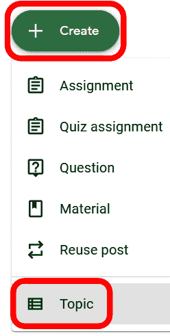

    图 1.18 – 创建菜单中的主题选项

1.  将会出现一个对话框。输入 **主题** 名称并点击 **Add** 按钮，如图所示：

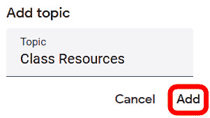

图 1.19 – 创建主题

主题现在将出现在 **Classwork** 部分中，如图所示：

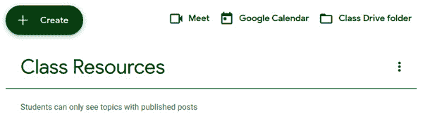

图 1.20 – Classwork 中的主题截图

### 从 Google Drive 添加文件

可以从 Google Drive 添加文件或从您的计算机上传。此外，您还可以链接 YouTube 上的视频和链接网站。在本节中，您将按照以下步骤从 Google Drive 添加文件到 **Classwork** 部分：

1.  在 **Classwork** 部分中，点击 **Create** 按钮，然后选择 **Material**，如图所示：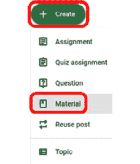

    图 1.21 – 创建菜单中的材料字段

1.  将会出现一个对话框。在 **标题** 字段中为资源命名。然后，点击 **Add** 按钮，并选择 **Google Drive**，如图所示：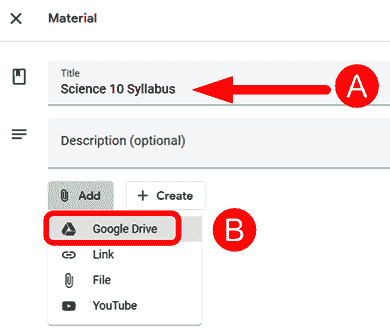

    图 1.22 – 材料字段中所需的信息

1.  在 **Google Drive** 对话框中，选择你的文件并点击 **INSERT** 按钮，如图所示：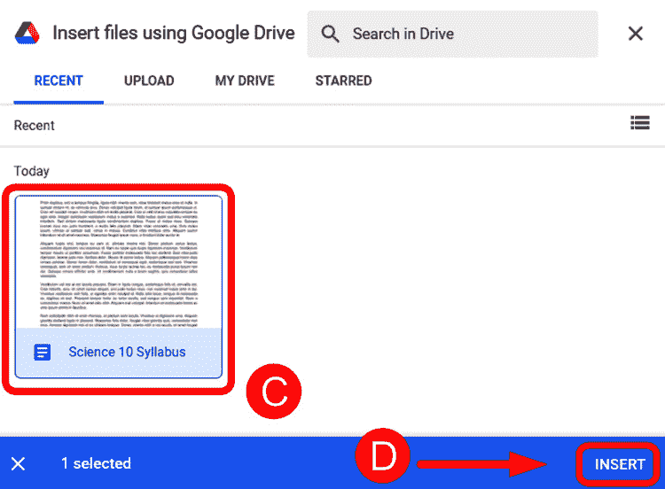

    图 1.23 – 在 Google Drive 中选择文件

    如果您看不到所需的文件，您可能需要在如图所示的 **MY DRIVE** 选项卡中找到它：

    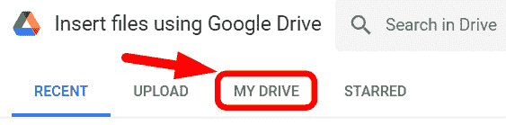

    图 1.24 – Google Drive 对话框中的 MY DRIVE 选项卡

1.  在**主题**下拉菜单中，选择所需的主题。然后，点击**发布**按钮，如下面的截图所示：

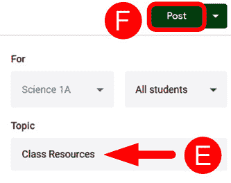

图 1.25 – 选择主题并发布材料

添加多个文件

如果您想以相同的标题添加更多文件，只需重复前面的步骤并从 Google Drive 选择另一个文件添加。

您的文件现在将可供学生和共同教师使用。添加的材料将作为帖子显示在**作业**部分，如下面的截图所示：

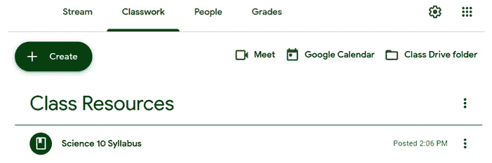

图 1.26 – 作业部分中材料的截图

### 从您的电脑添加文件

如果您不经常使用 Google Drive 或者电脑上还有许多文件，直接从电脑上传文件的步骤与从 Google Drive 添加文件类似。这些步骤在此列出：

1.  在**作业**部分创建一个**材料**帖子。

1.  为**材料**添加一个标题，并在**添加**下拉菜单中选择**文件**而不是**Google Drive**，如下面的截图所示：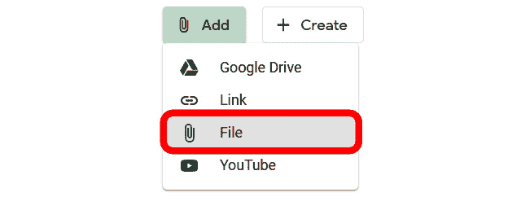

    图 1.27 – 材料帖子添加菜单中的文件选项

1.  点击**浏览**按钮打开电脑的 Windows 文件资源管理器，如下面的截图所示：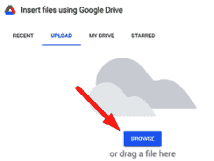

    图 1.28 – 上传对话框

1.  在 Windows 文件资源管理器中查找并打开文件，如下面的截图所示：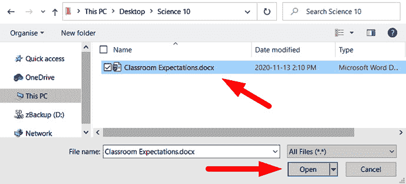

    图 1.29 – 在 Windows 文件资源管理器中选择文件

1.  文件将自动上传到 Google Drive 并显示在**材料**部分，如下面的截图所示：

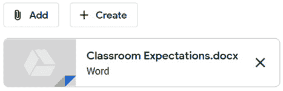

图 1.30 – 材料部分中文件显示的截图

### 从互联网添加资源

要添加 YouTube 视频或网站链接，请点击每个项目的相应图标。您需要**统一资源定位符**（**URL**）才能将它们添加到**关于**页面，如下面的截图所示：

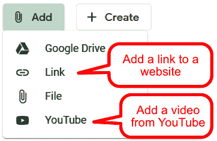

图 1.31 – 使用超链接的添加菜单选项

目前无法轻松将 Google Drive 文件夹添加到 Google Classroom。一个简单的解决方案是使用 Google Drive 的**获取链接**共享功能，并将其作为链接添加到 Classroom。此功能在以下截图中有说明：

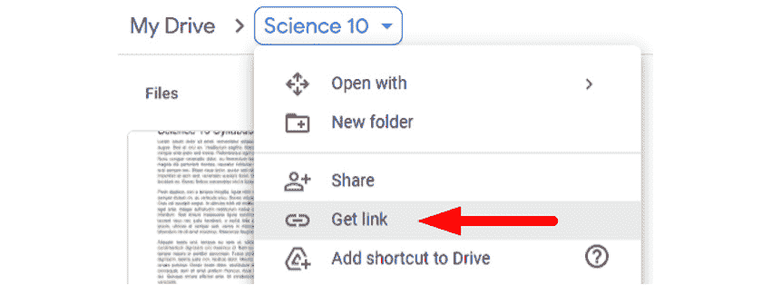

图 1.32 – Google Drive 文件夹的获取链接选项

在将材料添加到你的班级后，你可能决定重新排列它们的顺序。

## 在你的班级中重新排列材料

要更改班级中材料的顺序，请按照以下步骤使用拖放操作将材料（和其他帖子类型）拖放到所需顺序：

1.  将鼠标悬停在要移动的材料上，如下面的截图所示：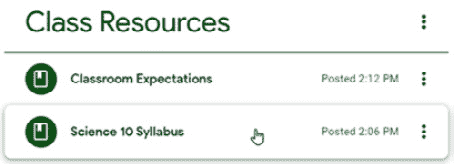

    图 1.33 – 将鼠标悬停在帖子上方

1.  点击并拖动材料到所需位置。材料帖子将缩小成一个小的矩形。当你拖动帖子时，其他帖子会移动以腾出空间，如下面的截图所示：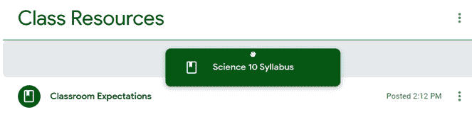

    图 1.34 – 点击并拖动帖子

1.  释放鼠标按钮将展开所选帖子到其原始大小。

## 在你的班级中存储文件

每次你将文件上传到 Google Classroom 时，文件都会存储在 Google Drive 中。上传到帖子内的文件，如材料，将保存在 Google Drive 的默认文件夹**我的驱动器**中。在 Google Drive 中移动或重命名文件不会影响 Google Classroom 对文件的链接。当学生开始提交作业文件时，它们将在**班级驱动器文件夹**功能中可用。可以在**作业**部分找到文件夹的图标和链接，如下面的截图所示：

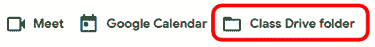

图 1.35 – 在作业选项卡中的班级驱动文件夹超链接

上传的文件将显示在 Google Drive 应用中，如下面的截图所示：

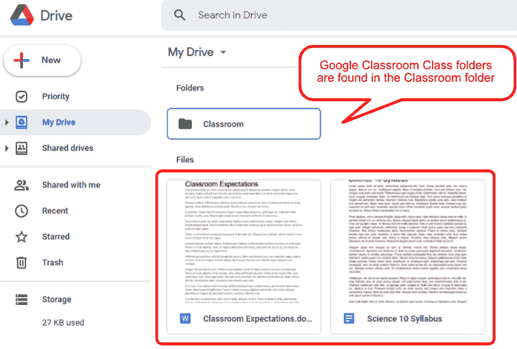

图 1.36 – 上传到 Google Drive 的文件截图

这些文件可以在 Google Drive 应用中的文件夹内进一步组织。然后，在随后的班级中，你可以直接从 Google Drive 添加文件到你的班级。在 Google Drive 中组织文件也将帮助与其他教授相同科目的教师共享资源。实际上，当与其他教师共享我的资源时，我经常共享**Google Drive**文件夹，并邀请他们加入 Google Classroom 中的相关班级。

# 邀请额外教师

你可能与需要访问 Google Classroom 班级的同事分担教学责任。通过邀请其他教师，这些教师将能够做任何你可以做的事情，除了*删除班级*。

注意

确保你邀请的任何合教教师都熟悉 Google Classroom，因为他们可以更改和删除内容，而且他们所做的一切**没有**记录的历史。

要邀请另一位教师加入你的班级，请按照以下步骤操作：

1.  在**人员**部分，点击**教师**标题下的**邀请教师**图标，如下面的截图所示：![图 1.37 – 添加合教教师的图标

    ![图 1.37 – B16846.jpg

    图 1.37 – 添加共同教师的图标

1.  使用教师的名字或电子邮件地址搜索教师。选择账户然后点击以下截图所示的**邀请**按钮：

![图 1.38 – 邀请教师对话框

![图 1.38 – 邀请教师对话框

图 1.38 – 邀请教师对话框

邀请的教师将在**教师**部分以灰色显示，直到教师接受邀请，如下面的截图所示：

![图 1.39 – 在“人员”标签页中邀请教师的截图

![图 1.39 – B16846.jpg

图 1.39 – 在“人员”标签页中邀请教师的截图

现在您的第一节课已经准备好，您可以根据需要应用本章中的技术创建额外的课程。如果您教小学生，同事们通常会为特定科目创建课程；如果您教中学生，每个班级通常在 Google Classroom 中有自己的课程。

通常，课外活动如俱乐部或体育团体会使用 Google Classroom 中的课程与学生沟通。因此，查看和管理您在 Google Classroom 中的所有课程是必要的。

# 从 Google Classroom 主页访问课程

Google Classroom 的主页显示您作为教师或学生所在的全部课程。课程以卡片形式排列在页面上。下次您进入 Google Classroom 时，您将首先到达主页，您可以在其中选择所需的课程，如下面的截图所示：

![图 1.40 – Classroom 课程仪表板

![图 1.40 – B16846.jpg

图 1.40 – Classroom 课程仪表板

您作为学生注册的课程将在课程卡片上显示教师的图片。

注意

要在主页上重新排列课程，请拖放课程卡片。

当您在教室中时，可以通过点击横幅左上角的汉堡菜单图标切换到不同的课程，如下面的截图所示：

![图 1.41 – 汉堡菜单

![图 1.41 – 汉堡菜单

图 1.41 – 汉堡菜单

将出现菜单，您可以从其中选择所需的课程，如下面的截图所示：

![图 1.42 – 仪表板菜单部分

![图 1.42 – 仪表板菜单部分

图 1.42 – 仪表板菜单部分

菜单分为您正在教授的课程和您作为学生注册的课程。此外，您可以通过此菜单返回 Google Classroom 主页，查看 Google Classroom 日历，访问存档课程，以及更改设置。

# 摘要

您现在已创建您的第一个课程，并在添加学生之前个性化了它。然后您向课程中添加了信息和材料，以及邀请了共同教师。

创建课程后，您通过使用 Google Classroom 中的各种主题和图案更改了教室的主题。此外，您上传了一张新图片作为主题。

然后，你将课程资源添加到了**作业**部分，其中上传了来自 Google Drive 和你的电脑的文件。最后，你邀请了另一位教师加入课程。

现在课程已经设置完毕，是时候邀请学生了。在下一章中，我们将学习学生如何访问 Google Classroom，以及如何邀请学生加入你的教室。
