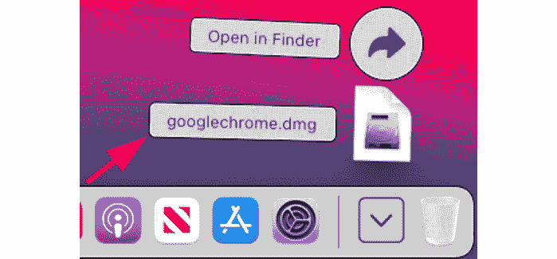

# *第二章*：邀请学生加入他们的虚拟教室

学期伊始，你的实体教室和 Google Classroom 已经设置完毕，准备好迎接学生进入，并开始学习。虽然学生只需简单地走进你的实体教室，有时手里拿着学校地图，但在你的虚拟教室中，学生必须从电脑或移动设备加入教室。正如我们在*前言*中提到的，Google Classroom 在电脑或移动设备易于获取或在线环境中表现卓越。此外，如果学生可以从自己的个人设备访问该工具，他们使用该工具的频率将会更高。

作为教师，你可能需要指导一个由不同类型的电脑、平板电脑和智能手机组成的学生群体安装和设置 Google Classroom。本章提供了针对几种不同类型设备的说明。我们将探讨邀请学生加入 Google Classroom 以及在课堂上管理这些学生的各种方法。

本章的部分内容是从**自带设备**（**BYOD**）的背景下编写的，在这种背景下，学生可能将各种设备带到课堂上，教师则作为课堂的技术支持。有些部分可能看起来重复，例如在 Windows 上安装 Google Chrome，然后在 macOS 上安装。如果你是第一次使用 Google Classroom，请参考与你的设备相关的部分，当学生需要支持时使用其他部分。

在本章中，我们将涵盖以下主题：

+   在学生设备上设置 Google Classroom

+   允许学生使用班级代码加入

+   管理你的班级学生

# 在学生设备上设置 Google Classroom

与所有 Google 的应用程序一样，Google Classroom 可以在任何连接到互联网的电脑或移动设备上访问。然而，并非每个学生都会从同一种设备访问 Google Classroom。因此，能够帮助你指导学生设置 Google Classroom 非常重要。

邀请学生在学期初加入 Google Classroom 是最佳时机。在课程的前几天，你将使学生适应你的课堂期望，并让学生熟悉课程的课程大纲。将学生设备设置过程轻松整合到这一过程中，使学生能够在学期初准备好使用 Google Classroom，从而减少后来出现技术问题的可能性。

选择最佳时机邀请学生加入 Google Classroom

通常，我建议在学期开始时邀请学生加入 Google Classroom，并确保他们的所有设备都得到正确设置。然而，这并不意味着必须在第一天就完成。在加拿大的高中，学生通常有两周的时间更换课程和调整时间表。因此，在大多数这些变化完成之前邀请学生加入 Google Classroom 可能更有益。这可能会节省你在学期进展过程中进行大量手动更改的时间。

当学生设置他们的设备时，让他们在他们会最频繁使用的设备上设置 Google Classroom。如果你的学校已经有一个计算机实验室、移动笔记本电脑或 Chromebook 车，你的学生就不需要设置这些设备。对于拥有大量个人笔记本电脑、平板电脑和智能手机的学生群体，将课堂时间用于设置他们的个人设备将增加学生对 Google Classroom 的使用。

此外，学生使用他们自己的平板电脑和手机的另一个巨大优势是，iOS 和 Android 上的 Google Classroom 应用会向这些设备提供推送通知。因此，鼓励你的学生使用他们的智能手机上的 Google Classroom 应用，这样他们就会在 Google Classroom 上发布通知或作业时始终得到通知：

![img/Figure_2.1_B18646.jpg]

图 2.1 – Classroom 应用通知

这样，你就不必担心学生检查学校发放的电子邮件以获取这些通知。

## 在电脑和 Chromebook 上设置 Chrome

由于 Google Classroom 以及 Google 的教育 G Suite 套件仅需要网络浏览器，所有运行 Microsoft Windows、Apple macOS 或 Google 的 Chrome OS 的笔记本电脑都已经可以访问 Google Classroom。虽然 Microsoft Windows 使用 Microsoft Edge（或较旧的 Internet Explorer），而 Apple macOS 使用 Safari，但 Google 开发和维护了自己的网络浏览器——**Google Chrome**。

使用 Google 的网络浏览器确保与 Google Classroom 的最大兼容性。Google 的 Chrome OS 可以在已经安装并设置好 Google Chrome 的 Chromebook 上找到；然而，学生使用的个人笔记本电脑可能没有安装 Google Chrome。

注意

Google 的 Chromebook 最容易设置，因为无论它们是个人 Chromebook 还是学校 Chromebook，都已经安装并设置好了 Google Chrome。

Google Chrome 可以在没有管理员权限的 Windows 或 macOS 电脑上安装。因此，如果一个学生在他们的个人设备上没有管理员账户，学生仍然可以安装 Google Chrome。

### 在 Microsoft Windows 上安装 Google Chrome

要在 Microsoft Windows 上安装 Google Chrome，请按照以下说明操作：

1.  打开另一个网络浏览器，例如**Microsoft Edge**：![Figure 2.2 – Microsoft Edge icon]

    ![img/Figure_2.2_B18646.jpg]

    图 2.2 – Microsoft Edge 图标

1.  在地址栏中，导航到[`www.google.com/chrome/`](https://www.google.com/chrome/)。

1.  点击**下载 Chrome**按钮：

    图 2.3 – 下载 Chrome 按钮

1.  窗口底部将出现一个弹出窗口。点击**运行**按钮。网页也将指导您完成必要的步骤：

    图 2.4 – Microsoft Edge 下载菜单

1.  Windows 的**用户账户控制**将要求**管理员**权限。本节可能需要密码。

1.  将会弹出一个对话框，显示下载和安装 Google Chrome 的进度。

1.  安装完成后，Google Chrome 将自动启动：

图 2.5 - Google Chrome

在桌面上将出现一个**Google Chrome**标志：

图 2.6 – Google Chrome 图标

### 在 Apple macOS 上安装 Google Chrome

在 Apple macOS 上安装 Google Chrome 与在 Windows 上安装类似。以下说明概述了在 macOS 上安装 Google Chrome 的步骤：

1.  打开另一个网络浏览器，例如**Safari**：

    图 2.7 – Apple Safari 图标

1.  在地址栏中，导航到[`www.google.com/chrome/`](https://www.google.com/chrome/)：

    图 2.8 – Apple Safari 的地址栏

1.  点击**下载 Chrome**按钮。

1.  将会弹出一个对话框，询问您是否要安装英特尔芯片版本或苹果芯片版本。截至 2020 年 11 月，苹果在其电脑上切换到使用自己的芯片。在撰写本文时，大多数苹果电脑仍然使用英特尔芯片。您可以通过**检查要安装的 Chrome 版本**下的屏幕说明来确定哪个下载是正确的。您可能需要使用的是**带有英特尔芯片的 Mac**按钮：

    图 2.9 – Chrome 版本安装对话框

1.  macOS 可能会显示一个对话框，要求用户确认下载。这里显示了对话框的图片。如果出现，请点击**允许**按钮：

    图 2.10 – macOS 安全对话框

1.  双击在 Dock 中出现的文件。文件名为 `googlechrome.dmg`：

    图 2.11 – macOS Dock 中的下载文件夹

1.  macOS 将验证并打开程序。

1.  将会弹出一个对话框，以便您复制 `Applications` 文件夹。点击并拖动 `Applications` 文件夹：

图 2.12 – 将 Chrome 复制到 Applications 文件夹的窗口

Google Chrome 现在可在 `应用程序` 文件夹中访问。

#### 在没有管理员权限的情况下安装 Chrome

如果学生没有管理员账户的密码，他们仍然可以在 macOS 上安装 Google Chrome。然而，他们无法将 Google Chrome 复制到 `应用程序` 文件夹。相反，他们可以将 **Google Chrome** 图标拖动到另一个位置，该位置学生账户有权限保存文件。一个位置是学生账户的桌面。

#### 将 Google Chrome 快捷方式添加到 Dock

为了快速访问 Google Chrome，请将 `应用程序` 文件夹拖动到 Dock。

注意

学生第一次启动 Google Chrome 时，会出现几个对话框。这些对话框确认打开的是从互联网下载的文件，并询问学生是否希望将 Google Chrome 设置为默认浏览器（在另一个程序中点击链接时浏览器会打开）。

### 设置 Google Chrome

Google Chrome 安装完成后，必须将其链接到学生的账户，以便任何书签、Google Chrome 应用和扩展都与个人电脑同步。要完成 Google Chrome 的设置，请按照以下步骤操作：

1.  启动 **Google Chrome**。

1.  点击浏览器右上角的用户图标：

    图 2.13 – Google Chrome 中的用户图标

    注意

    如果学生在他们的电脑上已经安装了 Chrome，他们可能还使用个人账户开启了同步功能。在这种情况下，学生可以选择退出他们的个人账户或将学校账户配置文件添加到 Chrome 中。下面的图中显示了 **添加** 按钮，位于 **其他人** 部分的底部。

1.  在对话框内部，点击 **开启同步…**：

    图 2.14 – 用户对话框

1.  在第一屏输入所需的电子邮件地址并然后输入密码进行登录。每个屏幕都有一个 **下一步** 按钮，以便你可以继续登录过程：

    图 2.15 – Google 账户登录屏幕

1.  如果 Google Chrome 显示了一个标题为 **将 Chrome 数据链接到该账户？** 的另一个对话框，请点击 **链接数据** 按钮：

    图 2.16 – 链接账户对话框

1.  将会出现一个 **开启同步？** 对话框。启用此功能将在多个设备上同步 Google Chrome。学生是否启用此功能由他们自己决定：

    图 2.17 – 开启同步？对话框

1.  用户图标现在将显示用户的个人照片。如果没有设置个人照片，则将显示用户名字的首字母：

图 2.18 – Google Chrome 中的用户个人照片

## 在平板和手机上安装 Classroom 应用

许多学生可能还需要在平板和手机上设置 Google 应用的帮助。除了从不同的应用商店下载应用外，在 Android 和 Apple iOS 平板和手机上安装 Google Classroom 的方式相同。为了使 Google Classroom 正常运行，还需要额外的 Google 应用。

以下步骤概述了在 Android 或 iOS 上安装 Google Classroom 的过程：

1.  在移动设备上打开应用商店。对于 Android，应用商店称为**Play Store**（左侧）；对于 iOS，应用商店称为**App Store**（右侧）：

    图 2.19 – Google Android 和 Apple iOS 的应用管理器

1.  在 Apple iOS 的 App Store 底部点击搜索图标或在 Android 的屏幕顶部搜索框中搜索`Google Classroom`：

    图 2.20 – 在 Google Android 和 Apple iOS 应用管理器中进行搜索

1.  点击应用旁边的**安装**按钮。在 iOS 上，您需要点击**获取**然后点击**安装**。您可能还需要输入用户的 Apple ID 密码：

    图 2.21 – Google Classroom 的安装按钮

1.  第一次打开应用时，点击**打开**按钮。之后每次打开，找到并点击设备主屏幕上的应用：

    图 2.22 – Google Classroom 的打开按钮

1.  点击**开始使用**按钮：

    图 2.23 – 移动设备上 Google Classroom 的起始屏幕

1.  如果平板或手机已经关联了另一个 Google 账户，将显示一个 Google 账户列表。如果学校账户在列表中，请选择学校账户；否则，在 Android 上选择**添加账户**，在 iOS 上选择**添加另一个账户**：

    图 2.24 – Google Classroom 中添加另一个账户选项

1.  输入用户名和密码，完成任何后续页面，例如接受显示的**服务条款**，以完成设置。

1.  对于 Apple iOS 设备，将弹出一个对话框询问 Google Classroom 是否可以发送通知。点击**允许**按钮：

图 2.25 – Apple iOS 通知对话框

要有效地使用 Google Classroom，还需要在移动设备上安装额外的 Google 应用。只需遵循这里显示的相同步骤来安装这些 Google 应用。以下图列出了可以与 Google Classroom 应用集成的 Google 应用：

![图 2.26 – Google 应用列表

![图片 2.26]

图 2.26 – Google 应用列表

对于安卓设备（如平板和手机），许多这些额外的应用已经预装。

指导学生使用教室投影仪

当指导学生安装 Google Classroom 和其他 Google 应用时，将移动设备连接到教室投影仪可以帮助学生在安装过程中。安卓设备可能内置了屏幕投射工具，如 MHL 或 Miracast，而 iOS 设备可以使用 HDMI 转换器直接连接到投影仪或使用第三方软件如 AirServer。中学生和高中生很可能已经在他们的移动设备上安装应用方面有经验。因此，在投影仪上显示需要哪些应用，很可能是确保学生安装所有必要应用所必需的。

现在学生已经拥有了在他们的电脑和移动设备上使用 Google Classroom 所需的应用，是时候让学生加入你的 Google Classroom 了。

# 允许学生使用班级代码加入

学生可以使用班级代码、邀请链接或你手动邀请学生加入特定的 Google Classroom 课程。班级代码是由字母和数字组合而成，用于识别 Google Classroom 中的唯一课程，而邀请链接是互联网超链接。任何拥有学校电子邮件的学生，如果他们能访问班级代码或邀请链接，都可以加入你的教室。

注意

学生可以使用任何设备加入教室。此外，一旦学生在某个设备上加入了你的教室，他们将从任何其他设备（只要他们使用学校电子邮件登录）访问你的教室。

## 使用班级代码加入教室

使用以下步骤指导学生加入你的教室：

1.  在笔记本电脑或 Chromebook 上，打开 Google Chrome 并在地址栏中导航到 [`classroom.google.com/h`](https://classroom.google.com/h)。在平板或智能手机上，点击**教室**应用：![图 2.27 – 在桌面和移动设备上打开 Google Classroom

    ![图片 2.27]

    图 2.27 – 在桌面和移动设备上打开 Google Classroom

1.  点击或轻触页面右上角的**+**图标。在移动设备上，**+**图标出现在屏幕右下角：![图 2.28 – 桌面和移动设备上添加新班级的加号符号

    ![图片 2.28]

    图 2.28 – 桌面和移动设备上添加新班级的加号符号

1.  输入老师提供的**班级代码**，然后点击**加入**按钮：![图 2.29 – 班级代码对话框

    ![图片 2.29]

    图 2.29 – 班级代码对话框

1.  学生将立即进入您的 Google Classroom 班级，班级将出现在他们 Google Classroom 应用的首页上：

图 2.30 – 学生在桌面和移动设备上查看 Google Classroom 的截图

### 显示班级代码

Google Classroom 可以以大字体显示**班级代码**。如果您的班级配备了交互式白板、投影仪或连接到计算机的电视，您可以将**班级代码**显示出来，以便学生可以轻松看到。让我们看看：

1.  在横幅中，点击**班级代码**旁边的全屏图标：

    图 2.31 – 班级横幅中的全屏图标

1.  **班级**页面会变暗，并会弹出一个对话框，其中**班级代码**被放大。此对话框的右下角还有一个全屏图标，以便您可以进一步放大**班级代码**：

    图 2.32 – 放大后的班级代码对话框中的全屏图标

1.  点击对话框中的全屏图标将放大对话框，使其填充整个网页窗口，如下所示：

图 2.33 – 完全放大的班级代码对话框截图

在您的实体教室中显示班级代码

学期开始时，在您的教室中显示您的班级代码，以便稍后添加到教室中的任何学生都可以轻松加入。白板或公告板的一个角落是这种用途的理想位置。

使用班级代码是学生可以自行注册班级的唯一方法。对于课外活动，如俱乐部和体育活动，教师可以创建管理这些活动的班级。在这种情况下，在公告板上或其他校内通讯中张贴**班级代码**是学生注册的简单方法！

## 使用邀请链接邀请学生加入您的班级

如果您有像小学生这样的学生，他们在正确输入一系列数字和字母方面有困难，发送一个他们可以点击的邀请链接可能是一个更容易的解决方案。使用以下步骤查找邀请链接：

1.  在**流**中，点击班级横幅中**班级代码**数字旁边的全屏图标：

    图 2.34 – 班级横幅中的全屏图标

1.  点击**复制邀请链接**：

    图 2.35 – 班级代码对话框中的复制邀请链接图标

1.  现在链接已经复制，您可以通过学校的通讯系统将链接发送给学生。我的部门使用内部数字公告板向学生和家长发布消息；然而，仅仅通过电子邮件发送链接给学生也能让学生通过邀请链接加入班级。

## 修改班级代码和邀请链接

当所有学生都已加入您的教室后，您可以通过重置或禁用**班级代码**数字和**邀请链接**来防止其他学生加入您的班级。重置两者将生成新的代码和超链接供学生使用以加入您的教室。此更改不会影响已在本教室内的学生。

禁用**班级代码**数字和**邀请链接**将阻止学生加入班级；然而，您仍然可以通过访问班级的**人员**选项卡手动邀请学生，这将在本章后面展示。要重置或禁用**班级代码**数字和**邀请链接**，请按照以下说明操作：

1.  在 Classroom 中，点击右上角的设置齿轮：![Figure 2.36 – Settings gear in Google Classroom

    ![img/Figure_2.36_B18646.jpg]

    图 2.36 – Google Classroom 中的设置齿轮

1.  滚动到**常规**部分，并点击**管理邀请代码**的下拉菜单。选择**关闭**或**重置**：

![Figure 2.37 – The manage invite codes dropdown menu

![img/Figure_2.37_B18646.jpg]

图 2.37 – 管理邀请代码的下拉菜单

您可以显示**班级代码**的全屏对话框，或者也可以从设置中复制所需的**邀请链接**！

在移动设备上管理班级代码和邀请链接

Google Classroom 应用程序也在班级**流**的顶部显示设置齿轮，您可以在其中复制、重置或禁用**班级代码**和邀请链接。轻触**班级代码**或邀请链接将自动复制它们。您可以通过访问**学生邀请设置**旁边的菜单而不是**管理邀请代码**来重置或禁用它们。

现在我们已经看到了学生如何加入您的班级的各种方法，让我们来探讨如何管理他们。

# 管理您班级中的学生

所有学生的完整班级名单可以在您的教室的**学生**页面找到。在这里，您可以更改教室内的学生，以及向个别学生或整个班级发送电子邮件。

## 手动邀请学生加入您的班级

当学生在学期末加入您的班级，或者学生遇到困难无法使用**班级代码**或**邀请链接**加入时，您可以手动邀请学生加入您的班级。您应该将此方法作为最后的手段，因为手动添加几十个学生到班级既繁琐又耗时。按照以下说明手动邀请学生加入您的班级：

1.  在 Google Classroom 中，从主菜单点击**人员**标签页，然后点击**学生**标题下的**邀请学生**图标：

    图 2.38 – 邀请学生图标

1.  输入你想邀请的学生名字或电子邮件地址。Google 会自动完成你的 Gmail 的**我的联系人**和任何目录，如学区员工和学生目录中的任何联系人。从**搜索结果**区域选择所需的学生：

    图 2.39 – 在搜索结果中找到的学生联系

1.  重复**步骤 2**来邀请其他学生。一旦所有学生都已选择，点击**邀请**链接：

    图 2.40 – 邀请链接

    注意

    在可能的情况下，使用电子邮件地址而不是学生的名字。大型地区可能会有几个学生有相同的首尾名。在我学校，几年前有一个叫 Michael Zhang 的学生。有几起邮件没有发送到正确收件人的事件。

1.  一旦你邀请了学生，学生将显示为灰色，直到他们接受邀请：

    图 2.41 – 尚未加入课堂的邀请学生

1.  学生需要通过点击电子邮件邀请中的链接或在电脑/Chromebook（左侧）或移动设备（右侧）上登录 Google Classroom 并点击或轻触**加入**按钮来接受邀请：

图 2.42 – Google Chrome 和课堂应用中的加入按钮

另一种可能需要手动邀请学生加入你课堂的罕见情况是，如果学生退出了课程。学生可以从 Google Classroom 的主页自行退课。截至写作时，没有方法可以禁用此功能：

图 2.43 – 在“课堂仪表板”中的退课选项

## 从你的教室中移除学生

当学生从你的课程中退课时，你还需要在 Google Classroom 中将其移除。虽然这不是强制性的，但如果学生仍然注册在你的课程中，他们仍然会通过 Google Classroom 收到公告和作业。按照以下步骤移除学生：

1.  在 Google Classroom 中，点击**人员**标签页：

    图 2.44 – “人员”标签页

1.  点击学生旁边的复选框。（如果你需要移除多个学生，也可以选择其他学生。）然后，点击**操作**下拉菜单：

    图 2.45 – 在人员标签中选择学生

1.  选择**移除**选项：

图 2.46 – 操作菜单中的“移除”选项

## 在您的教室中给学生们发邮件

当您需要与个别学生或小组成员沟通时，您可以直接从 Google Classroom 发送邮件。然而，当您需要与全班沟通时，Google Classroom 有一个**公告**功能。这个**公告**功能将在*第三章*“发送您的第一个公告”中讨论。

要从 Google Classroom 给学生们发邮件，请遵循上一节中的步骤。不要选择**移除**，而是选择**邮件**；将出现一个新的邮件窗口，地址为所选学生。

如果您正在给单个学生发邮件，您可以在**人员**标签旁的每个学生的咖喱菜单中找到一个可以使用的邮件选项，如图所示：

图 2.47 – 学生的菜单

# 摘要

如果这是您第一次邀请学生加入您的虚拟教室，本章中的步骤可能看起来有些令人畏惧。然而，根据以往的经验，今天的中学生和高中生已经对技术有了熟练的理解，并且会迅速完成这些任务。当我用 Google Classroom 教学时，高中生的设置过程只需要大约 15 分钟。本章为您提供了那些从未使用过 Google Classroom 的学生的工具，随着时间的推移，这部分学生将会减少。

您现在可以在 Windows 或 Apple 电脑上安装 Google Chrome，以及指导学生在他们移动设备上安装 Google Classroom 和其他 Google 应用。您可以通过显示**班级代码**数字来允许学生加入您的课程，以及根据需要通过邀请链接或通过 Google Classroom 手动邀请或移除学生。最后，您可以直接从 Google Classroom 给学生们发邮件。

本章建议您只单独或以小群体形式给学生们发邮件。在下一章中，您将探索使用**公告**功能与全班沟通。
