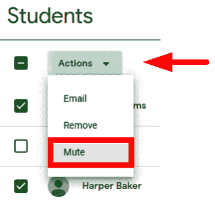

# 第三章：*第三章*：发送您的第一个公告

现在您的在线教室已在 Google Classroom 中设置，并且学生已注册到他们的班级，您可以使用 Google Classroom 的功能与学生进行沟通。在您的教室中与学生沟通的最简单形式之一是发送**公告**。在 Google Classroom 中的公告就像给班级发送一封电子邮件（实际上，当您创建公告时，学生也会收到一封包含必要信息的电子邮件）。

对于公告，您可以从您的计算机或 Google Drive 添加文件，甚至可以添加指向网站或 YouTube 视频的链接，就像我们在*第一章*中讨论的**作业**中的**材料**帖子一样，*了解 Google Classroom*。学生甚至可以直接从教室的**流**中回复您的公告。**公告**是一种出现在此**流**中的帖子。在 Google Classroom 中使用公告而不是发送电子邮件也使得将来更容易找到公告并在其他班级中使用它们。

在本章中，我们将涵盖以下主题：

+   发送和接收公告

+   公告的组成部分

+   回复公告

+   编辑公告

+   重复使用公告

+   在流中授权和管理学生

# 创建公告

公告出现在教室的**流**顶部。每当新的**公告**帖子或**作业**通知添加到**流**中时，它们将被添加到**流**的顶部。因此，**流**中的较旧帖子将被移到**流**的下方，但它们不会被删除。

要创建公告，请转到所需的教室并按照以下步骤操作：

1.  点击**流**顶部的框。在点击之前，字段将显示**向您的班级发布公告**：

    图 3.1 – 创建公告框

1.  将您的公告输入到字段中。在您输入消息之前，字段将显示**向您的班级发布公告**。在文本字段的底部将出现富文本格式按钮，用于加粗、斜体、下划线和项目符号文本：

    图 3.2 – 公告框

    注意

    在本书的后期制作中，所有帖子都添加了富文本格式。虽然上面的图像在印刷前已更新，但本书中**公告**、**问题**、**作业**和**材料**帖子中的所有其他图像在其文本字段中都没有富文本格式按钮。

1.  如果您想同时将此公告发布到多个班级，请点击班级名称以选择额外的班级：

    图 3.3 – 班级下拉菜单

1.  当您准备好发布时点击**发布**按钮：

    图 3.4 – 发布按钮

1.  在确认对话框中点击**发布**按钮：

图 3.5 – 确认对话框

如果您还没有准备好发布公告，可以通过点击**发布**按钮旁边的下拉菜单并选择**保存草稿**来将其保存为草稿：

图 3.6 – 选择保存草稿

Google Classroom 将草稿放置在**流**的顶部：

图 3.7 – 公告草稿保存位置

虽然将帖子保存为草稿是准备课程的有用方式，但在某些情况下，您可能希望安排在特定日期和时间发布帖子。

## 安排发布公告的时间

教师可以安排 Google Classroom 发布帖子的时间。此功能允许您设置公告、问题、作业、材料或测验，并在课程适当的时间发布它们。利用此功能的简单示例是将**问题**帖子作为**课前立即进行**发布，然后在课程中途发布另一个**问题**或**作业**帖子以评估学生的理解，最后以包含练习问题的**作业**帖子结束课程。要安排帖子，从**发布**按钮的下拉菜单中选择**安排**，如图所示：

图 3.8 – 选择日程安排

以下截图显示了您必须使用的对话框，用于设置 Google Classroom 发布帖子时的日期和时间。点击**日程安排**按钮确认发布时间并保存帖子：

图 3.9 – 安排公告对话框

就像草稿一样，安排的帖子出现在**已保存公告**部分，位于**流**上方。

## 公告中的高级功能

公告可以传达比简单文本消息更多的信息。公告的一些附加功能包括以下内容：

+   从您的计算机附加文件

+   从 Google Drive 附加文件

+   包含 YouTube 视频

+   包含一个网站链接

    何时将资源添加到流或关于部分

    您可能已经注意到，这些选项也存在于 *第一章* 中描述的 **材料** 帖子中，*了解 Google Classroom*。在 **作业** 部分的 **材料** 而不是在特定帖子中添加文件，表示所包含的资源是为 **流** 中的特定帖子而不是为整个班级。帖子会比在 **作业** 部分更快地向下移动。因此，**流** 中附加的资源是为短期任务，而 **作业** 部分中附加的资源是为整个课程。

以下图表显示了创建公告时，许多这些功能在公告对话框中的位置：

图 3.10 – 公告帖子选项概览

我们将在以下章节中查看这些功能的每个部分。

### 从您的电脑附加文件

当您从电脑附加文件到帖子时，学生查看公告时将可以访问该文件。按照以下步骤在创建公告时从电脑附加文件：

1.  点击公告对话框中的 **添加** 菜单，然后选择 **文件**：

    图 3.11 – 添加菜单中的文件选项

1.  点击对话框的 **浏览** 按钮：

    图 3.12 – 上传对话框

1.  导航到目标文件并点击 **打开** 按钮：

    图 3.13 – 文件资源管理器对话框

1.  点击 **创建公告** 对话框中的 **发布** 按钮，如图所示：

图 3.14 – 附加文件的公告

注意

要添加多个文件，在点击 **发布** 按钮之前，重复前面的步骤以添加更多文件。

上传的文件将存储在 Google Drive 的 **我的驱动器** 文件夹中，就像在 **作业** 页面上上传的文件一样。

### 从 Google Drive 附加文件

从 Google Drive 附加文件与从您的电脑附加文件类似。步骤如下：

1.  点击公告对话框中的 **添加** 菜单，然后选择 **文件**：

    图 3.15 – 添加菜单中的 Google Drive 选项

1.  导航到 Google Drive 中的目标文件。选择文件后，然后点击对话框底部的 **插入** 链接：

    图 3.16 – 从 Google Drive 插入文件

1.  点击 **创建公告** 对话框中的 **发布** 按钮，以发布公告。

### 包含 YouTube 视频

当您在**添加**下拉菜单中点击**YouTube**选项时，将出现**YouTube**对话框。从**插入视频**对话框中，您可以搜索并添加特定的视频：

图 3.17 – 搜索 YouTube 视频

如果您已经在 YouTube 上保存了视频，另一种方法是复制 YouTube 地址并将其粘贴到**URL**选项卡的字段中：

图 3.18 – 插入视频的 URL 选项卡

一旦添加了 YouTube 视频文件，它将出现在帖子的底部，就像上一节中文件附件的位置一样。

在帖子中包含视频文件

初看之下，Google Classroom 似乎不会播放已保存到您电脑上的视频。然而，Google Drive 使用内置的视频播放器，如 YouTube。因此，您可以将视频文件附加到帖子中，学生将能够观看视频。Google Drive 的文件大小限制为 5 太字节，可以播放`WebM`、`mpeg4`、`mp4`、`3gpp`、`mov`、`avi`、`mpegps`、`wmv`、`flv`和`mts`视频文件。

### 包含网站链接

在我们继续之前，让我们快速看看如何在帖子中包含网站链接。在**添加**下拉菜单中点击**链接**选项后，将出现一个对话框。粘贴 URL 并点击**添加链接**，如图下截图所示：

图 3.19 – 添加链接对话框

链接和网页的小缩略图将出现在帖子的底部。

由于可以将这么多资源添加到**公告**帖子中，因此很容易在包含所有必要的附件之前发布帖子。（对我来说，这几乎每周都会发生。）下一节将指导您如何编辑已发布的帖子。

# 在流中修改公告

一旦帖子发布到**流**中，您可能需要对其进行更改或直接删除公告或其他类型的帖子。每个帖子都有一个包含三个点的垂直线，表示可以对帖子执行的操作菜单：

图 3.20 – 公告帖子中的烤肉串菜单

从此菜单中，您将对**流**中的公告（或任何其他类型的帖子）执行以下操作：

+   **置顶**将公告放置在**流**的顶部。

+   **编辑**将允许您修改公告。

+   **删除**将从**流**中删除帖子以及与帖子相关的所有评论和附件。

+   **复制链接**将提供到帖子的直接链接。当您需要将学生发送到**流**中较下方的公告时，此功能最有用。

教师和助教可以移动到顶部、编辑和删除彼此的帖子。

使用置顶功能强调特定帖子

将特定帖子保持在**流**的顶部将有助于提醒学生注意重要通知。这些通知可能包括全校性活动、截止日期和郊游表格的提醒。

## 重复使用之前创建的通知

您的班级可能学习速度不同。因此，您可能有一个需要与学习速度较快的班级相同帖子的班级。而不是重新输入或复制粘贴该信息，Google Classroom 提供了一个功能，可以从一个班级复制整个帖子并在另一个班级重新发布。按照以下步骤重复帖子：

1.  在您希望重新发布之前的通知的班级中，点击**宣布给您的班级**框右侧的**重复帖子**图标：

    图 3.21 – 重复帖子图标

1.  点击包含之前创建的帖子的班级：

    图 3.22 – 选择将重复使用帖子的班级

1.  选择所需的帖子并点击**重复**按钮。附件默认复制到新帖子中：

图 3.23 – 选择要重复使用的帖子

**创建通知**对话框将出现，其中包含从之前的帖子中填写的信息。您可以在新班级发布通知之前进行更改。（显示了一个**科学**班级正在重复之前创建的**科学**帖子。）

当您通过任何这些方法创建通知时，将向共同教师和学生发送电子邮件通知。在高中教学时，有我教授的面对面课程、教授相同科目的其他教师班级、体育或俱乐部等课外活动，以及用于全校性通知的所有员工班级。由于有这么多班级，我的电子邮件收件箱很容易被 Google Classroom 的通知淹没。

在下一节中，我们将探讨如何管理 Google Classroom 发送的电子邮件。

# 管理通知电子邮件通知

默认情况下，当您将通知（或任何其他类型的帖子）发布到**流**时，学生将收到电子邮件通知：

图 3.24 – 通知的电子邮件提醒

这些电子邮件包含 Google Classroom 中帖子的标题和链接。学生接收通知的另一种方式是通过他们智能设备上的 Google Classroom 应用。

教师将收到更多的电子邮件通知。额外的通知示例包括学生在通知或其他帖子中发表评论、发送关于作业的私人消息，或者当计划中的通知发布时。学生和教师可以选择自定义他们想要接收的电子邮件通知。

## 禁用所有电子邮件通知

如果你或你的学生不希望收到在 **流** 中发布的任何助教或学生帖子时的电子邮件通知，你可以在 Google Classroom 中如下禁用电子邮件通知：

1.  在 Google Classroom 中，点击汉堡菜单按钮：

    图 3.25 – 汉堡菜单

1.  滚动到菜单底部并点击 **设置** 图标：

    图 3.26 – 设置齿轮

1.  在 **通知** 部分中，关闭 **接收电子邮件通知** 的开关：

图 3.27 – 接收电子邮件通知开关

注意

尽管图标相同，但汉堡菜单中的设置齿轮影响 Google Classroom 应用，而每个班级顶部的设置齿轮提供单个班级的设置。

另一种到达设置屏幕的方法是点击电子邮件通知底部的 **退订** 链接，如下截图所示：

图 3.28 – 电子邮件通知中的退订链接

点击此链接将用户带到类似于 *图 3.27* 所示的屏幕。在这里，我们可以关闭接收电子邮件通知的开关。

## 禁用某些班级的电子邮件通知

有许多情况下，教师可能以助教或学生的身份注册班级。例如包括测试学生在 Classroom 中看到的内容、团队教学以及与其他教师或监督教师的合作。

在这些情况下，你可能希望接收你教授的班级的通知，但想禁用其他班级的通知。指定你想要接收通知的班级可以在禁用所有电子邮件通知的同一菜单中找到。

在 Google Classroom 设置的 **通知** 部分中，点击 **班级通知** 下拉箭头以展开该部分：

图 3.29 – 展开部分的下拉箭头

点击你班级旁边的开关以关闭该班级的通知：

图 3.30 – 每个班级的开关以启用或禁用电子邮件通知

## 自定义电子邮件通知

在您可以启用或禁用电子邮件通知的相同**通知**设置区域，还有额外的开关可供您选择接收哪种类型的电子邮件通知。选项包括是否在有人对帖子发表评论或邀请您作为合教或学生加入班级时接收电子邮件通知。请务必探索这些设置，以确定您希望在 Google Classroom 中接收哪些事件的电子邮件通知，以及哪些事件您不希望接收。

注意

在撰写本文时，自定义 Google Classroom 中哪些事件会向您发送电子邮件通知将适用于所有已启用通知的班级。

作为教师，管理通知将有助于减少发送到您收件箱的电子邮件数量。一些学校使用 Google Classroom 班级来管理课外活动，如体育和俱乐部，这导致教师每年拥有许多班级。

在不更改您的通知设置的情况下，每天接收数十封电子邮件变得容易，这将会使您的收件箱满溢。现在我们已经查看了一种与已发布帖子进行沟通的形式，在下一节中，我们将探讨帖子评论中的另一种通信功能。

# 评论公告

一旦帖子发布到**流**中，学生和合教将能够对公告进行评论。这些评论促进了讨论，类似于在您在课堂上提供口头公告后，学生向您提问。此外，在其他类型的帖子中，如**问题**和**作业**，学生可以使用此评论功能来回复帖子中的特定问题。为了让学生能够对帖子进行评论，他们必须遵循以下步骤：

1.  在**流**中，点击帖子底部的**添加班级评论…**行：

    图 3.31 – 添加班级评论字段

1.  将出现一个文本输入框供学生输入。指导学生在他们完成评论后点击**帖子**图标：

图 3.32 – 帖子图标

注意

帖子上的评论对班级中的每个人都是可见的。在 Google Classroom 中不当使用评论功能可能会损害学习环境。在本章的后续部分，在*静音学生*部分，您将学习如何管理滥用评论系统的学生。

如以下截图所示，学生在**流**中评论帖子并不需要花费太多时间。学生们经常会回应其他学生的评论并引导讨论，而不需要教师提供过多的额外输入：

图 3.33 – 公告帖子的评论线程

小贴士

使用在线讨论可以是害羞或内向的学生利用一个他们可能感觉更安全的环境进行交流的绝佳方法。

当有多个评论时，Google Classroom 会将**流**中的评论折叠以节省空间。要展开帖子的所有评论，点击**评论**标题：

![图 3.34 – 评论标题

![图 3.34 – 图 3.34_B16846.jpg]

图 3.34 – 评论标题

## 回复评论

随着更多学生和教师在帖子中评论，更多的人可以对特定帖子进行评论。在帖子中回复特定评论会自动将该用户添加为提及。然而，该评论出现在线程底部，而不是直接在回复的评论下方：

![图 3.35 – 被评论提到的学生

![图 3.35 – 图 3.35_B16846.jpg]

图 3.35 – 被评论提到的学生

要回复评论，当您将鼠标悬停在评论上时，点击出现的回复图标。然后，继续像通常一样撰写您的评论：

![图 3.36 – 评论的回复图标

![图 3.36 – 图 3.36_B16846.jpg]

图 3.36 – 评论的回复图标

## 管理评论

由于评论是即时发布的，学生评论可能需要管理和监控。有几个工具可以帮助教师控制哪些学生可以评论。

### 编辑和删除评论

教师和评论的创建者可以编辑和删除评论。被删除的评论会立即从**流**中移除，但作为教师，您将能够查看被删除的评论和帖子。要编辑或删除评论，点击三个垂直点以显示您可以执行的操作：

![图 3.37 – 评论的烤肉菜单

![图 3.37 – 图 3.37_B16846.jpg]

图 3.37 – 评论的烤肉菜单

注意

您只能编辑自己的评论。由其他教师或学生创建的评论在烤肉菜单中只会显示**删除**。如果评论有回复，它们将作为评论保留在帖子中。

如果您需要在**流**中查看已删除的帖子评论，请打开班级设置中**显示已删除项**的开关。

点击班级顶部的设置齿轮：

![图 3.38 – 班级的设置齿轮

![图 3.38 – 图 3.38_B16846.jpg]

图 3.38 – 班级的设置齿轮

在**常规**部分，点击**显示已删除项**旁边的开关：

![图 3.39 – 显示已删除项开关

![图 3.39 – 图 3.39_B16846.jpg]

图 3.39 – 显示已删除项开关

有时，学生可能会发布多个需要删除的评论。与其不断监控评论，不如撤销特定学生的评论权限。

### 静音学生

如果有学生在**流**中特别不适当，您可以禁用该学生回复其他同学作业、帖子或评论的能力。要静音或取消静音学生，点击评论的三个垂直点菜单以显示静音操作：

    

    

![图 3.45 – 人员部分学生名称旁边的静音图标备注静音学生可能会阻碍 **流** 中的课堂讨论。使用评论功能的替代方法是发布一个问题，这将在 *第四章* *使用问题开始在线讨论* 中讨论。## 在流中禁用评论尽管 Google Classroom 中有所有这些评论管理功能，您可能决定您的班级尚未准备好使用此功能，或者您更喜欢学生不在 **流** 中评论。可以通过以下步骤完全禁用评论功能：1.  在 Google Classroom 中，点击课程顶部的 **设置** 齿轮：

    

    图 3.47 – 流帖子及评论设置菜单

1.  在**流**中选择所需的发布和评论权限级别。

您可以随时更改学生对**流**的访问级别。作为一种课堂管理手段，您可以根据需要暂时启用或禁用评论（或反之），这取决于您的需求和学生的行为。

# 摘要

本章为您提供了在班级**流**中发布帖子的基础知识。虽然我们只讨论了**公告**帖子，但**公告**帖子中可以找到的许多功能，例如附加文件、链接和 YouTube 视频，对所有其他帖子类型都是可用的。随着您继续使用 Google Classroom，**流**将成为您和您的学生查看大多数公告、作业和讨论的中心位置，从而在组织和评估方面节省时间。

您现在可以在 Google Classroom 中创建**公告**帖子，将资源附加到帖子中，并在其他班级中重用帖子。此外，您还可以对帖子进行评论，并通过删除单个评论、静音学生或完全禁用评论功能来管理学生的评论。

对于您希望禁用评论或更愿意使用其他方式与学生互动的情况，您可以使用**问题**帖子类型的附加功能。我们将在下一章中探讨这一点。
