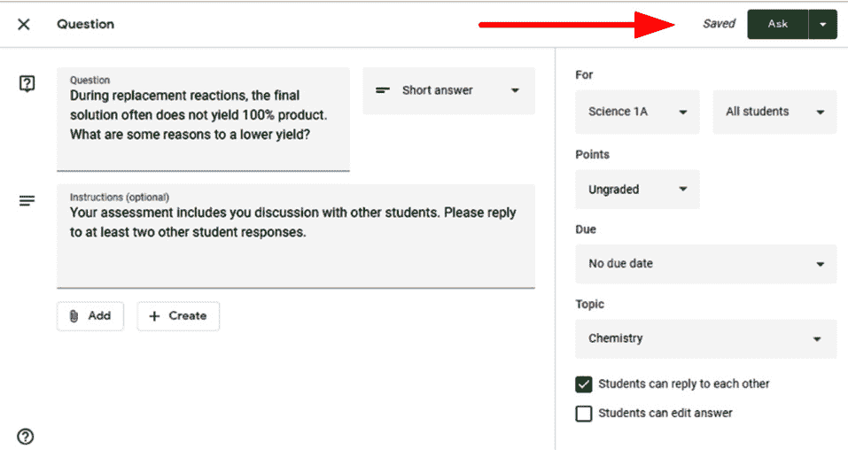

# *第四章*：用问题开始在线讨论

2018 年，Google Classroom 经历了一次重大的布局变更。**作业**部分被添加，为教师和学生提供了一个单独的页面来查看所有材料、问题和作业。每种类型的帖子都有不同的功能集，允许教师以不同的方式与学生沟通。虽然上一章讨论了公告以及学生如何对公告进行评论，但你可能会遇到需要记录谁对帖子做出了回应甚至评分该回应的情况。这种情况的一个例子是，你想要进行类似于课堂讨论的对话，但通过 Google Classroom 进行。

通过 Google Classroom 进行讨论有几个优点。在 Instagram 和 Snapchat 的一代中，许多学生可能会觉得通过在线工具进行沟通很舒服。此外，学生不必身处同一地点就能参与讨论。在我教书的时间里，有时学生会在关键的讨论日缺席，无法进行评估。此外，学生可以有时间来制定他们的回答，而不是在讨论中被突然提问。因此，由于它的熟悉性和较低的失败率，学生倾向于在网上而不是在面对面课堂上讨论事情。

重要 – 线上或线下讨论

在线上和课堂讨论的使用之间需要保持微妙的平衡。过分偏爱某一种讨论形式可能会降低另一种讨论的有效性。考虑结合这两种讨论方式。一些结合线上和课堂讨论的方法包括在网上提出一个讨论问题，然后在第二天课堂上提出一个后续问题，或者课堂上讨论不同的主题，然后在线上继续讨论。

问题帖子的另一种用途是快速检查学生的理解。在阿尔伯塔省，教师使用形成性评估来衡量学生在学习下一个概念之前是否理解了当前的概念。由于问题帖子允许学生用简短的句子回答或回答多项选择题，Google Classroom 中的一个问题可以显示大多数学生是否理解了当前的课程内容。

在本章中，你将学习如何使用**作业**部分中的问题帖子创建简答题和多项选择题，然后回复和评分学生的回答。

本章我们将涵盖以下主题：

+   创建一个问题

+   创建简答题

+   回复学生的回答

+   创建多项选择题

+   评分一个问题

    重要

    Google Classroom 将学生对问题帖子的回答称为答案。然而，由于作者的教学理念，本章将把它们称为回答。

# 创建一个问题

与不同类型的帖子一样，许多功能，如附加文件，使用与公告和材料帖子相同的步骤。但是，问题和作业等帖子有附加功能。如果您不是按章节顺序阅读这本书，请参阅上一章*第三章*“发送您的第一条公告”中找到的附加功能。

您可以通过在**创建**按钮下选择**问题**选项来在**作业**部分创建问题，如下面的截图所示：

图 4.1 – 作业部分中的问题选项

## 问答帖子中未在公告帖子中找到的附加功能

下面的截图显示了创建问答帖子时出现的对话框：

图 4.2 – 问答帖子的主要部分

有三个字段在公告帖子中只有一个。此外，问答帖子有影响问题类型和学生在问题中如何相互交流的问题选项：

+   **问题**字段是您写入问题的位置。它只允许您包含文本，而不包含格式。（如果您需要在问题中包含图片，可以使用附件功能。）

+   **说明**字段是您可以写入额外步骤或问题期望的地方。例如，您可能希望指示学生必须回复另一位学生的回答。

+   **分数**字段是您可以更改问题评估价值的地方。分数仅是数字，但如果不需要，可以禁用。

+   **截止日期**字段允许您指定学生必须提交回答的日期。此字段包括选择特定时间和日期的选项。

问题（和作业）不需要截止日期。在**截止日期和时间**下拉菜单中，点击日期旁边的**X**以禁用截止日期：

图 4.3 – 取消帖子的截止日期

虽然不是必需的，但为问题和作业设置截止日期会将事件添加到与 Google Classroom 链接的 Google 日历中。在*第八章*“让家长了解情况”中，您将学习如何允许家长查看日历。

**主题**下的问题选项取决于问题类型——简答题或多选题。每个后续部分都将探讨这些选项。

# 创建简答题

简答题类型是默认问题类型。根据问题选项的设置，简答题类型可以执行两个不同的任务：学生协作或教师评估。**学生可以互相回复**的问题选项允许教师确定学生是否可以看到并回复其他同学的回答。通过禁用此选项，只有教师（和助教）将能够看到回答并单独评估每个学生的回答。然而，通过启用此选项，学生可以互相回复对方的回答，通过在线讨论鼓励学生协作。

简答题的第二种选项是**学生可以编辑答案**。通过启用此选项，学生可以在提交后编辑他们的回答。如果禁用此选项，则在确认学生的提交之前将显示如下警告提示：

图 4.4 – 学生的提交确认对话框

小贴士 – 允许学生编辑的时间

通常，最好禁用此选项。在作业帖子中阻止学生更改他们的提交是不可用的，这将在下一章中讨论。即使他们无法编辑他们的提交，学生也可以向他们的回答添加私人评论。在在线协作中，学生能够回复自己的回答。因此，使用私人评论和回复可以在未来需要引用时保持回答不变。

学生将能够看到作业值是多少分。虽然学生在提交答案后可以更改此值，但将其更改为适当的数字或未评分将减少未来的混淆。

在填写所有必要的字段并设置适当的问题选项后，点击**提问**按钮将发布问题，如下所示：

图 4.5 – 完成问题帖的“提问”按钮

**作业**中的问题以问号图标显示，您将能够看到有多少学生回答了问题以及何时截止。以下截图显示了这一点：

图 4.6 – 问题帖的教师视图

修改问题帖，如编辑和删除，需要与公告帖相同的步骤。请参考上一章，*第三章*，*发送您的第一个公告*，以获取步骤。

当发布一个提问帖（或**作业**部分中的任何其他帖子）时，流中会显示通知，如下所示：

图 4.7 – 在 Class Stream 中的问题帖子通知

在**作业**中发布的帖子如何在 Stream 中显示可以在**班级**设置中更改。作业通知默认显示简化的通知，但可以显示所有详细信息附件或完全隐藏。

学生将在 Stream 中看到相同的通知；然而，他们在**作业**部分查看问题帖子的视图将略不同于教师的视图。

## 学生视图

学生将只能看到问题，并将能够直接在帖子中回答问题并提交他们的回答。如果学生点击 Stream 中的通知，他们将被引导到完整的问题帖子，在那里他们可以提交他们的回答。然而，如果学生点击**作业**部分的问题，他们必须点击**查看问题**按钮才能回答问题：

图 4.8 – 作业部分的问题帖子

在问题帖子内部，学生可以查看说明并在右侧列的答案框中输入他们的回答。当学生准备好提交他们的回答时，他们将点击**提交**按钮：

图 4.9 – 问题帖子的答案框和提交按钮

学生提交答案后，如果启用了问题选项，他们将能够看到有多少其他学生回复了他们的回答，以及查看其他学生的回答。在答案框中，将出现一个按钮来**查看同学答案**。此外，在问题帖子的顶部将出现**同学答案**和**你的答案**标签页：

图 4.10 – 查看同学回答的按钮和标签页

以下是一个问题帖子的**同学回答**部分的截图：

图 4.11 – 问题帖子的同学回答页面

Google Classroom 利用多个 Google 应用与学生进行沟通。不仅 Google Classroom 会发送电子邮件，因为这个问题有一个截止日期，而且它还会在截止日期在 Google 日历上创建一个事件来提醒学生。此外，当学生进入 Google Classroom 的 Stream 时，侧边栏中的第一个框，如下面的截图所示，将包含问题：

图 4.12 – 带截止日期的即将发布的帖子

学生在截止日期后仍然可以提交回答。问题帖子将在帖子的顶部显示一个**缺失**指示器，如下所示：

图 4.13 – 未提交帖子的缺失指示器

一旦提交回答，帖子将指示该问题回答迟了：

图 4.14 – 帖子提交迟的指示器

在撰写本文时，没有方法可以阻止学生提交迟交作业。此外，一旦截止日期过去，Stream（*图 4.12*）中的即将发生事件框不再显示帖子，无论任务是否已提交。

# 回复学生回答

教师和学生可以回复学生的回答。回复回答不同于在“作业”中对帖子进行评论。评论问题帖子是关于问题内容的。例如，学生可能评论问题以询问截止日期是否可以延长。回复回答仅关于那个人的回答。一旦进入“学生答案”页面，教师和学生将以相同的方式回复学生回答。由于上一节演示了学生如何导航“同学答案”页面，以下步骤将指导教师如何回复学生的提问回答：

1.  在“作业”部分，通过点击标题展开问题帖子，然后点击“查看问题”。下一页将显示所有学生的回答：

    图 4.15 – 问题帖子的“查看问题”按钮

1.  点击回答下方的“回复”图标：

    图 4.16 – 学生回答下方的“回复”图标

1.  输入回复并点击帖子图标：

图图 4.17 – 帖子图标

回复现在在帖子下方可见：

图 4.18 – 对学生问题回答的回复

在问题帖子中，教师将看到“学生答案”标签页，而学生看到的是“同学答案”标签页。除了标签页的名称不同外，主要区别是教师能够为学生回答分配分数，这一点将在本章后面解释：

图 4.19 – 教师视图中的“学生答案”标签页

如果回复变得太多，请点击学生回答下方直接显示的回复计数以折叠该回答的所有回复：

图 4.20 – 折叠回复按钮

# 创建多项选择题

问题帖子可以是简答题或多项选择题。要切换到默认选项简答题和多项选择题之间，请使用问题选项中的第一个下拉菜单，如图所示：

图 4.21 – 多项选择选项

每个问题只能有一个多项选择题。*第七章*，*使用 Google Forms 创建多项选择和填空题*，展示了如何创建包含多个多项选择题的作业帖子。选择**多项选择**选项后，将在问题选项下方出现单选按钮。要添加更多多项选择选项，请点击列表中的**添加选项**：

图 4.22 – 向问题帖子添加另一个多项选择选择器

多项选择题只有一个选项：**学生可以看到班级摘要**。复选框位于问题帖子的**主题**部分下方。学生在提交结果后，结果将在帖子中显示。以下是一个默认启用的此选项的示例：

图 4.23 – 学生回答的班级摘要

在前面的截图上，左侧较深的灰色部分在视觉上表示选择该选项的次数，而右侧的数字表示选择该选项的学生总数。

小贴士 – 当即时反馈不好时

在我的教学过程中，我发现禁用即时反馈比让学生立即查看班级摘要提供了更有意义的反馈。使用即时反馈时，快速完成问题的学生无法在不刷新 Google Classroom 的情况下看到其余的结果，而落后于他人的学生可以等待并查看大多数学生选择了什么，然后相应地选择。相反，我发现在大多数学生完成问题后揭示摘要效果更好。点击已发布的多项选择题帖子的标题将转到响应摘要。关于此页面的更多内容将在下一节中介绍。

对于多项选择题，将问题的主体放在问题帖子的**说明**部分而不是标题中，允许学生在**作业**页面上看到整个主体。然后，学生可以在不打开问题帖子的情况下回答问题。以下截图显示了在作业中查看问题时标题和说明的示例：

图 4.24 – 在作业中查看问题时问题帖子的标题与说明

在填写所有必要的字段并设置适当的问题选项后，点击**提问**按钮将发布问题。一旦学生回答了问题帖子，您就可以批改他们的回答。

# 评分问题

问题帖允许教师跟踪哪些学生回答了问题，并为这些回答分配成绩。使用以下步骤来分配成绩：

1.  在**作业**部分，通过点击标题展开问题帖，然后点击**查看问题**。下一页将显示所有学生的回答：

    图 4.25 – 问题帖的查看问题按钮

1.  如果需要，在菜单中点击**点数**下拉菜单以更改问题的分数：

    图 4.26 – 问题帖点值下拉菜单

    当问题或作业帖的总点数发生变化时，Google Classroom 会通知已经评分的学生，但它不会提供一个选项来调整已经评分的问题以适应新的总点数。因此，您将不得不返回并更改所有之前评分的问题，以适应新的总点数：

    

    图 4.27 – 更新问题帖的点值

    重要

    对于问题和作业帖，总点数必须是一个数值。在加拿大，许多小学使用字母成绩体系来评估学生。如果您的系统类似，一种解决方案是将字母成绩与数值相关联。例如，A 等级将是 4 点，B 等级是 3 点，依此类推。

1.  将成绩分配给学生右侧的列。继续为所有学生分配成绩，直到所有学生都被评分：

    图 4.28 – 成绩列

    Google Classroom 根据问题是否提交来排序学生。但是，您可以通过使用学生名单上方的下拉菜单来更改学生名单的排序，按学生的名字或姓氏排序：

    

    图 4.29 – 按状态排序的下拉菜单

1.  当给学生们分配成绩时，学生旁边的复选框将被勾选。要将已评分的问题返回给学生，请点击菜单中的**返回**按钮。Google Classroom 只会通知那些复选框被勾选的学生：

    图 4.30 – 返回给选定的学生

    重要

    学生们将无法看到您确定的分数，直到您返回问题或作业。然而，他们可以立即看到您写的任何私人注释。

1.  将会弹出一个对话框，列出所有将返回已评分问题的学生。还有一个添加私人注释的行。每个学生将分别收到私人注释：

图 4.31 – 使用私人注释返回成绩

重要

如果您想使用**私人评论**功能提供个别反馈，您必须逐个返回作业。

可以将问题帖子的回复返回给未提交回复的学生。我经常将未提交的问题和作业帖子返回，以便我可以给每个未完成帖子要求的学生发送私人消息。即使问题帖子已经被返回，学生仍然可以提交问题帖子。

当您完成所有学生提交的评分后，您可以将评分从 Google Classroom 导出到电子表格中。点击学生回答上方的设置齿轮，并选择**将这些评分作为 CSV 下载**：

图 4.32 – 将问题评分下载为 CSV 文件

另外两个选项，**将所有评分复制到 Google Sheets** 和 **将所有评分作为 CSV 下载**，将导出班级内所有问题和作业的评分。根据您的**学生信息系统**（**SIS**），从 Google Classroom 导出的 CSV 文件可能很容易导入您学校的 SIS。

重要

在撰写本文时，Google Classroom 已经内置了与 Infinite Campus、Skyward 2.0、Capita SIMS、Follett Aspen 和 Aeries SIS 的同步功能。如果 Google Classroom 可以与第三方 SIS 同步，将评分类别添加到您的问题和作业帖子中可能会改善您的评分和报告工作流程。这些步骤可以在 *第九章*，*根据您的学科进行定制* 的开头找到。

## 留下问题未评分

评分问题时，还有一个选项是不分配分数值。如果在创建问题时没有将分数更改为未评分，也可以在分数下拉菜单中更改。在返回问题时，你仍然可以使用私人评论提供反馈：

图 4.33 – 在分数下拉菜单中选择未评分

## 查看返回的评分

一旦问题被返回给学生，他们就可以查看评分和私人评论。学生可以通过点击电子邮件通知中提供的链接或在流中点击问题帖子的标题来访问已返回的问题。此外，作业中的问题帖子在右上角也会指示问题已被返回：

图 4.34 – 作业中已评分的问题帖子及返回指示符

学生的答案页面将在问题标题下方显示评分。私人评论将出现在右侧列的底部：

图 4.35 – 学生查看返回的评分和私人评论的视图

学生可以在问题返回后添加一个后续的私人评论。这个私人评论线程类似于学生亲自跟进论文作业。

# 摘要

问题帖子提供了几个工具，这些工具增强了您使用 Stream 进行课堂讨论的能力。它允许您轻松跟踪哪些学生回答了提出的问题，并对这些回答进行评分。当将问题帖子整合到您的教学中时，它们可以用来增强课堂讨论，以及促进学生课外讨论。

您现在可以在课堂的 Stream 中创建简答题和多选题帖子，指定截止日期，并对问题进行评分和反馈。学生现在可以回复彼此的回答和您的反馈。评分、学生回答和反馈都存储在帖子中，可以在**作业**页面上轻松找到。

本章没有探索 Google Classroom 中评分的所有功能。一些功能，例如学生如何查看所有问题和作业的评分，以及教师如何在类似电子表格的视图中查看学生的评分和作业，将在第五章*作业的发放和接收*中探讨，届时将查看更多学生的评分。

在下一章中，我们将探讨最后一种帖子类型：作业帖子。使用这种类型的帖子，学生可以通过提交文档来回答。
