# *第六章*：快速评分书面作业

现在你有了学生的文件，是时候评分它们了。标记作业是教师必须面对的必要之恶。在一天中永远没有时间标记所有学生提交的作业。因此，我们教师也有不断的家庭作业，那就是我们在家里标记作业。幸运的是，Google Classroom 和其他 Google 应用有助于减少评分和返回作业所需的时间。不仅如此，这还减少了你在教室内的纸张使用，从而降低了你的环境影响。

本章将重点介绍评分书面作业，而下一章将重点介绍创建和评分多项选择题、数字回答题和填空题。

到本章结束时，你将能够做到以下事项：

+   为**作业**帖子分配分数

+   在**作业**帖子中发布私密评论

+   在 Google 文档中创建注释并给出建议

+   在评论库中保存和使用注释

+   回复、解决和管理 Google 文档的注释

+   使用版本历史记录监控 Google 文档中的学生进度

+   使用评分标准创建和评分作业提交

+   使用平板电脑标记作业提交

+   查看所有学生的作业和分数

这样一个内容丰富的章节，让我们直接进入吧！

# 使用评分工具分配分数

作业提交的 Google Classroom 网页与您用于问题帖子提交的相同页面，您在*第四章*，“使用问题开始在线讨论”中学到了。查看该章节以获取有关如何更改作业分数以及其他技巧的详细步骤。作业有一个额外的页面，可以在其中分配分数 – **评分工具**。要使用评分工具分配和返回作业，请按照以下步骤操作：

1.  在**作业**部分，点击**作业**帖子标题，然后点击**查看作业**：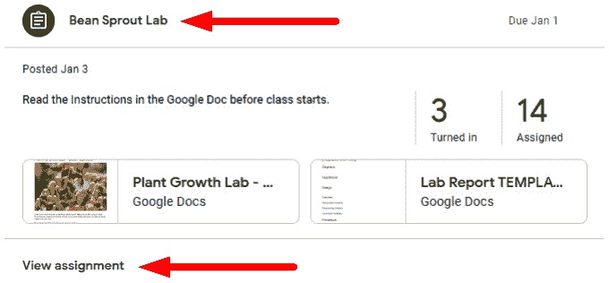

    图 6.1 – 在作业部分打开作业帖子

1.  在作业的**学生作品**页面的主要部分，点击学生的作业缩略图以在评分工具中查看文档：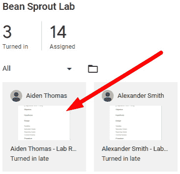

    图 6.2 – 学生作业提交缩略图

    备注

    兼容的文档，如 Google Docs 或媒体文件，将在评分工具中打开。所有其他文件将下载到您的计算机。

1.  在右侧侧边栏中为学生的作业分配分数：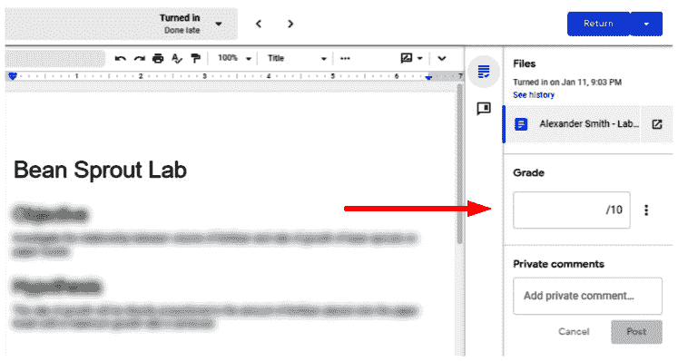

    图 6.3 – 评分工具中的评分字段

1.  当你准备好返回作业时，点击评分工具右上角的**返回**按钮：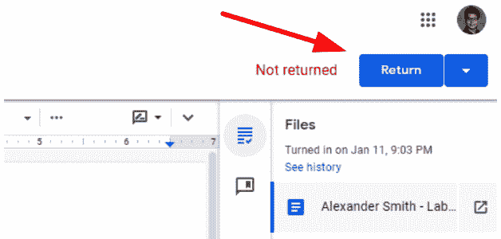

    图 6.4 – 评分工具中的返回按钮

1.  将会出现一个对话框以确认作业正在返回：

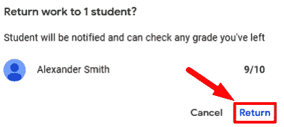

Figure 6.5 – 确认对话框

如果您想返回多个作业，请点击**返回**按钮旁边的下拉菜单，并选择**返回多个提交**。确认对话框将在每个学生的名字旁边有复选框，以选择要返回哪个学生的作业：

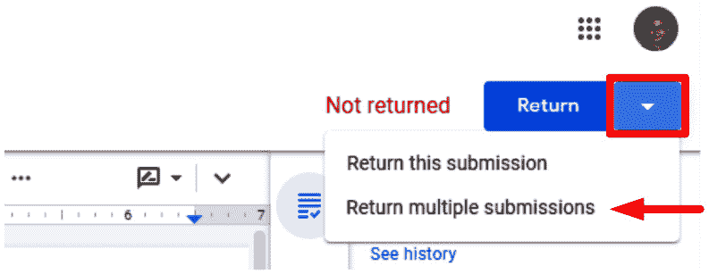

Figure 6.6 – 返回多个提交选项

在返回多个作业时添加私人评论

当在评分工具中返回多个作业时，没有字段可以输入针对所有选中学生的私人评论，就像在**作业**帖子中的学生工作页面上有的一样。通常，我在返回作业时会回到**作业**帖子，以便我可以为每个学生添加最后的私人评论。

在**返回**按钮旁边的下拉菜单中，还有一个选项，**返回此提交**，它执行与**返回**按钮相同的功能。

一旦作业已返回，就像**问题**帖子一样，学生将收到电子邮件通知，并能够在 Google Classroom 中看到反馈。在下一节中，我们将看到我们如何提供作业的反馈。

# 通过私信和评论提供反馈

通常，教师被鼓励在给出成绩之外提供有意义的反馈，以便学生能够获得指导以改进他们的工作。您可以通过评分工具中的私信和提交的 Google Docs 中的评论提供书面反馈。

**私人消息**是对整个作业的反馈。它们类似于在论文或实验报告的结尾写几句话。在评分工具中，有一个字段可以添加私人消息。一旦消息被写好，点击发送图标就会发布消息。在这里，学生将收到电子邮件通知，并可以回复私人消息：

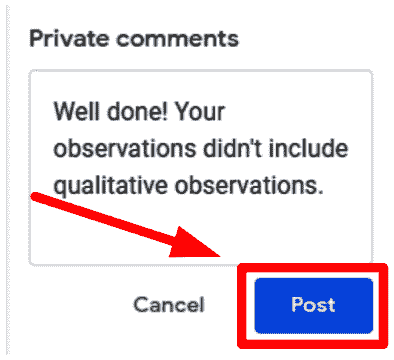

Figure 6.7 – 评分工具中的私人评论部分

不要延迟！立即发布私人评论！

私信不会保存。因此，请记住立即发布它们。如果您关闭评分工具页面或导航到另一个学生的作业提交，您将丢失当前学生的任何未发布的**私人评论**。

## 在学生文件中添加注释

虽然您可以为作业添加私人评论，但也可以直接在 Google 文档的内容中添加评论。您可以在 Google 文档、Google 幻灯片、Google 表格和图像文件中添加评论。这种反馈方法允许您突出显示作业的特定部分进行评论。在打开 Google 文档提交（或在评分工具中打开）时，使用以下步骤从评分工具中添加评论到 Google 文档：

1.  在评分工具中，如果学生的 Google 文档没有打开，请在右侧侧边栏的**文件**部分选择**Google 文档**。

1.  在 Google 文档中，突出显示您希望评论的内容：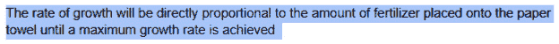

    图 6.8 – 为评论突出显示文本

1.  在 Google 文档的右侧边缘将出现一个添加评论的图标。点击此图标以打开**评论**对话框：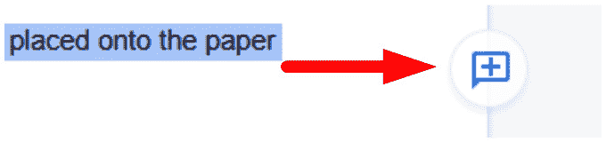

    图 6.9 – 添加评论图标

    开始评论的其他方法是通过点击工具栏中的图标来添加评论，或者通过转到**插入**菜单：

    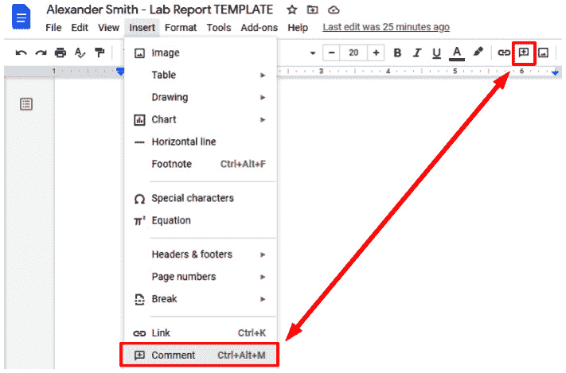

    图 6.10 – 替代添加评论按钮

1.  输入您的评论并点击**评论**按钮：

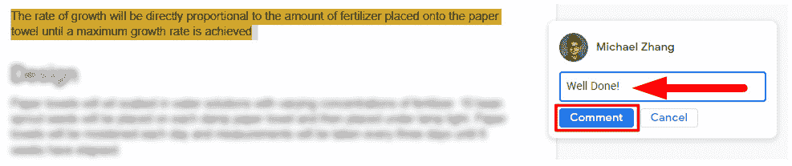

图 6.11 – 添加评论对话框

当评论发布时，它将浮现在评论附近的右侧边缘，此时评论将被突出显示为浅黄色，如下面的截图所示：

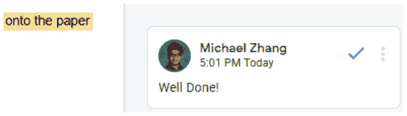

图 6.12 – 已发布的帖子

将评论与文本对齐

当附近有许多评论时，评论框可能不会与评论的文本对齐。点击突出显示的文本或评论框，它们将对齐。

### 在评论中提及用户

当多个学生正在处理单个 Google 文档时，可以指明评论是针对哪个用户的。然后，该学生将收到一封电子邮件，表明他们在评论中被提及。要引用用户，请在 `@` 或 `+` 符号（例如，`@mzhang2@gtrainerdemo.technerdservices.com`）后立即输入他们的电子邮件地址。在评论中提及学生（或另一个用户）的更简单方法是，以 `@` 或 `+` 符号开头，然后立即输入用户的名字。然后，将出现一个下拉列表，您可以从中选择电子邮件地址：

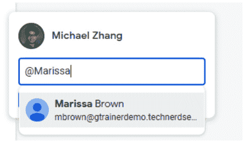

图 6.13 – 在评论中提及另一个用户

## 使用评论库

如果您像我一样，有多个反复使用的评论，从**评论库**中保存和检索评论将大大节省时间。在撰写本文时，**评论库**还很简单，无法对评论进行分类或为作业指定单个评论。然而，有一个搜索功能，有助于在需要时找到特定的评论。

### 在评论库中创建评论

按照以下步骤在**评论库**中创建一个**评论**：

1.  在评分工具中，点击**评论库**图标：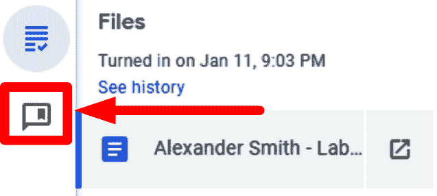

    图 6.14 –评论库图标

1.  点击**+ 添加到银行**按钮：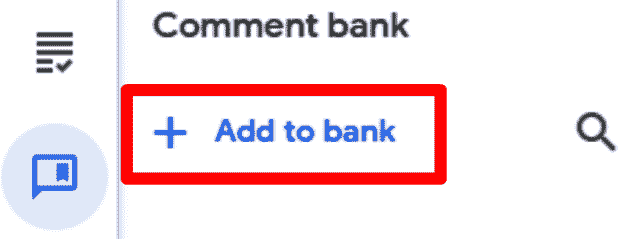

    图 6.15 – 添加到银行按钮

1.  将会出现一个**添加评论**对话框。输入评论并点击**添加**按钮：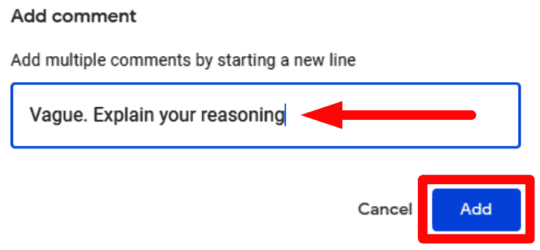

    图 6.16 – 添加评论对话框

1.  评论现在将出现在**评论库**侧边栏中：

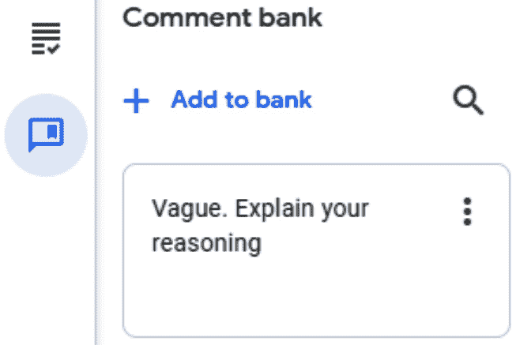

图 6.17 – 已保存到评论库的完成评论

如果您已经在 Google Doc 中写好了评论，在评分工具中，点击评论的横线菜单，将有一个选项将评论添加到**评论库**。

在评论库中编辑和删除评论

**评论库**中的每个评论都有一个包含复制评论到剪贴板、编辑评论或删除评论选项的横线菜单。另一个用于编辑和删除评论的页面可以在[`classroom.google.com/g/cm`](https://classroom.google.com/g/cm)找到。

### 在评论库中选择评论

在**评论库**中选择评论以将其放置在 Google Doc 评论中的方法有几个。在**评论库**中找到所需评论的最简单方法是，将鼠标光标悬停在所需评论上，然后点击在评论框中出现的复制图标，如下面的截图所示：

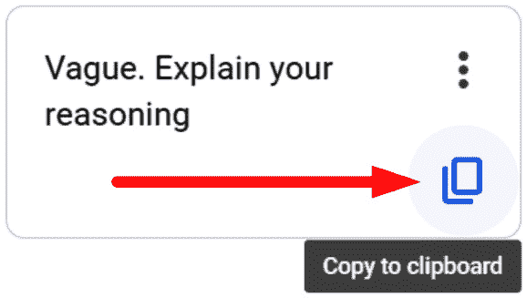

图 6.18 – 在评论库中的评论内的复制图标

现在评论文本已被复制，可以将其粘贴到 Google Doc 的评论中。然而，当有许多评论存储在`#`符号和评论中的文字时，我发现这种方法既繁琐又耗时。然后，将出现一个下拉菜单，其中包含在**评论库**中找到的匹配评论：

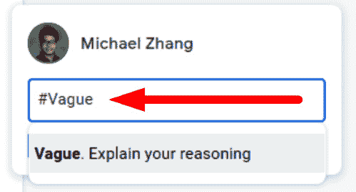

图 6.19 – 添加评论时搜索评论库

使用此方法从**评论库**中选择一个评论后，*#*符号将从评论文本中消失。

注意

**评论库**与评分工具的私人消息部分配合不佳。虽然可以从**评论库**复制和粘贴评论到私人消息，但以 *#* 符号开始的消息将不会搜索**评论库**。

## 回复和解决评论

谷歌文档中的评论功能允许任何具有编辑权限的人回复文档内的评论。作业返回后，学生可以回复您的评论。要回复评论，请按照以下步骤操作：

1.  通过点击高亮的评论或评论框本身来选择评论：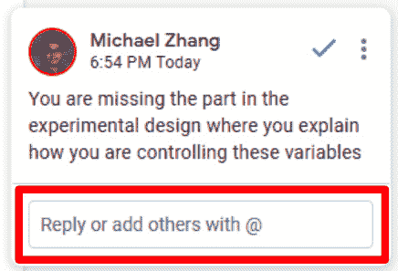

    图 6.21 – 带有 @ 字段的回复或添加他人

1.  输入您的回复并点击**回复**按钮：

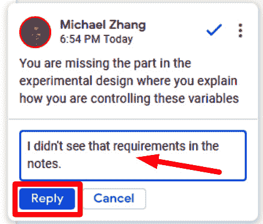

图 6.22 – 插入文本和回复按钮

默认情况下，文档的所有者和评论的作者将收到回复的电子邮件通知。

如果不再需要评论，可以通过解决评论来隐藏它。要解决评论，请点击以下截图中的评论复选标记图标：

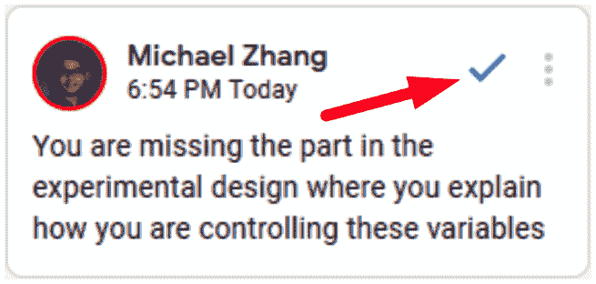

图 6.23 – 标记为已解决按钮

根据您的教学法，可能需要在课堂上或在评论中指导学生解决他们已处理的评论。当评论被解决时，您将收到一封电子邮件通知，说明反馈评论已被处理，并且作业已准备好重新评估。

## 管理谷歌文档中的评论

当您在谷歌文档中处理多个评论时，在单个位置查看所有评论可以节省您滚动整个文本的时间。在谷歌文档中，所有评论，包括已解决的评论，都可以在**评论历史**部分找到。要查看此**评论历史**，请点击谷歌文档右上角的评论图标：

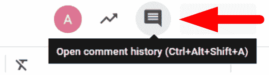

图 6.24 – 评论历史图标

如果您在评分工具中且看不到评论图标，请通过点击图标来展开谷歌文档菜单，以显示工具栏末尾的菜单：

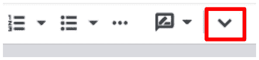

图 6.25 – 显示菜单图标

在评论历史的最上方，有一个**通知**菜单，您可以选择是否接收所有评论、您评论的回复或都不接收的电子邮件通知。在**通知**菜单旁边，还有一个添加评论的图标。这里展示了这两个图标的截图：

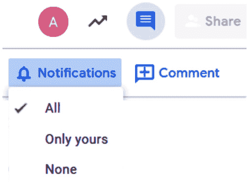

使用版本历史监控学生进度

注释历史随后会滚动显示在 Google Doc 中找到的所有注释。点击任何注释线程将滚动文档，直到找到注释的位置。在注释历史中，学生和教师可以查看和创建新的回复。以下截图是注释在注释历史中显示的示例：

图 6.26 – 通知和添加注释按钮

链接到注释的有用性

![图 6.27 – 注释历史中的注释对学生文件提出建议更改图 6.29 – 工具栏中的编辑模式图标和菜单每个注释都有一个下拉菜单，可以选择编辑、删除、解决或链接到注释。 (如果你在评分工具中，还有一个选项可以将注释添加到**注释库**。) 因为下拉菜单的三角形图标很容易被忽略，所以这里有一个菜单的截图：图 6.28 – 注释的下拉菜单如果注释已被解决，则下拉菜单将有一个选项重新打开而不是解决注释。![图 6.29 – 工具栏中的编辑模式图标和菜单对于像大学学期论文或国际学士学位文凭项目的扩展论文这样的长篇论文，将注释链接起来是一个隐藏的宝藏。此注释功能链接创建了一个直接链接到注释的网址。在多次场合，我已将注释链接通过电子邮件发送给学生和合作者，以便他们可以轻松地导航到电子邮件引用的论文部分。## ![图 6.27 – 注释历史中的注释另一种添加注释的方法是建议对文本进行修改。Google Docs 会记录你对文档所做的更改。这种方法非常适合为论文、实验报告和其他长文档中的句子结构、冗长性和简洁性提供反馈。建议功能类似于 Microsoft Word 中的**跟踪更改**功能。要在 Google Doc 中启用建议模式，请点击编辑图标并选择**建议**，如图下截图所示：![图 6.28 – 注释的下拉菜单![图 6.28 – 注释的下拉菜单图 6.27 – 注释历史中的注释现在，当你开始在文档中写作时，它会显示更改并添加注释：![图 6.29 – 工具栏中的编辑模式图标和菜单![图 6.28 – 注释的下拉菜单图 6.30 – 文本中的建议更改## ![图 6.30 – 文本中的建议更改根据你正在处理的作业类型，有时你可能想要对作业的完成过程以及结果提供反馈。一个例子是确定学生在处理数据以计算更准确的结果后是否修改了从调查中收集的数据。正式称为**修订历史**，版本历史在添加内容时对 Google 文档进行快照。它是一个数字纸迹，允许你和你的学生查看文档的先前版本。虽然这让我感到难过，但学生偶尔会在作业上作弊。如果你怀疑学生提交的书面作业的真实性，检查文档的修订历史可能有助于了解学生是否将预制的作业复制粘贴到文档中。要激活**版本历史**，在**文件**菜单中选择**版本历史**，然后点击**查看版本历史**选项，如图下所示：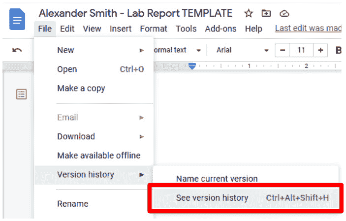

图 6.31 – 文件菜单中的版本历史选项

如果学生在 Google Docs 中编写作业，右侧边栏中将有几个版本，你将看到学生在该版本中添加的突出显示的文本。以下截图显示了学生完成的 Google 文档的**版本历史**区域示例：

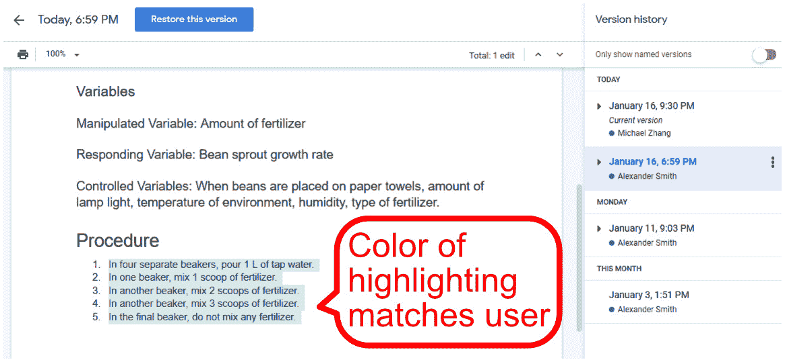

图 6.32 – Google 文档选定版本的更改

如果学生复制了作业，将只有两个修订版可用 – 一个空白文档和一个完整文档。

从 Microsoft Word 复制粘贴

如果 Google 文档的**版本历史**只有一个版本，学生可能会声称作业是在 Microsoft Word 中完成的，然后复制粘贴到 Google 文档中。如果是这种情况，自 2016 年以来，Microsoft Word 和其他 Office 产品也具有**版本历史**功能。如果学生还提交了 Microsoft Word 文件，那么其**版本历史**可以在**文件** | **信息**中找到。

对于较小的作业，**版本历史**可以显示文档的更细粒度更改。每个版本都可以展开为子版本，以显示内容中的较小更改增量。

若要获取 Google 文档中学生活动的更详细记录，可以使用名为**Draftback**的 Google Chrome 扩展程序来可视化 Google 文档中的所有更改。你将在*第九章*，*根据您的学科进行定制*中学习如何安装此扩展程序。

## 使用原创性报告避免剽窃

Google Classroom 不是用来捕捉学生作弊行为的，而是提供了一个工具来检测和预防 Google Doc 中的剽窃。原创性报告通过将学生作品与在线资源（包括书籍的数字版本）进行比较来检查真实性。这些报告会识别出与其它在线资源相关的作业部分。原创性报告还可以帮助学生了解剽窃，因为他们可以在提交作业之前运行报告。

在学生的视角中，作业的 **你的工作** 部分有一个 **运行** 按钮，如下面的截图所示：

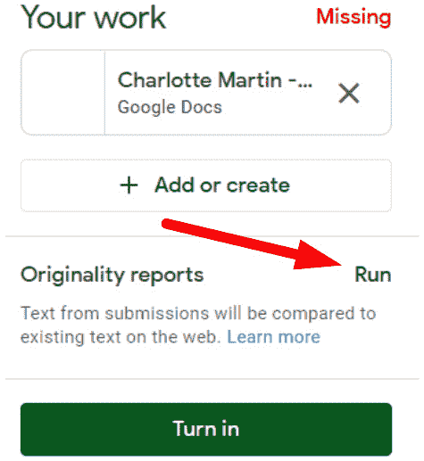

图 6.33 – 学生使用的原创性报告运行按钮

要启用 **原创性报告**，请点击 **作业** 帖子侧边栏底部的 **检查剽窃（原创性）** 复选框：

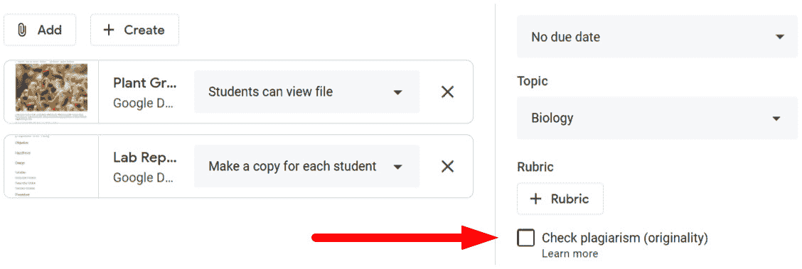

图 6.34 – 作业帖子中的检查剽窃（原创性）按钮

企业优势

一个 Google Classroom 课程只能在前五次作业中使用 **原创性报告**。每次启用此功能时，都会弹出一个对话框，显示剩余的使用次数。如果你的组织使用 Google Workspace for Education Enterprise，则此限制将被取消。

一些十年级教师用于第一次作业的策略是在学生提交作品后启用原创性报告。（在我所在的学校体系中，十年级是高中的开始。）然后，他们可以构建一个微型课程，让学生看到作业是否被原创性报告标记。随后的作业将启用 **原创性报告**，以便学生在提交作品之前检查其作业是否包含剽窃。

要查看原创性报告，请点击评分工具中文件下的 **检查剽窃链接（原创性）** 按钮。如果学生在提交作业之前启用了 **原创性报告**，它将显示原创性报告是否已标记任何问题：

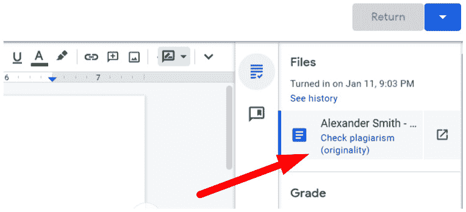

图 6.35 – 评分工具中的原创性报告链接

以下是一个原创性报告截图，其中存在严重的剽窃：

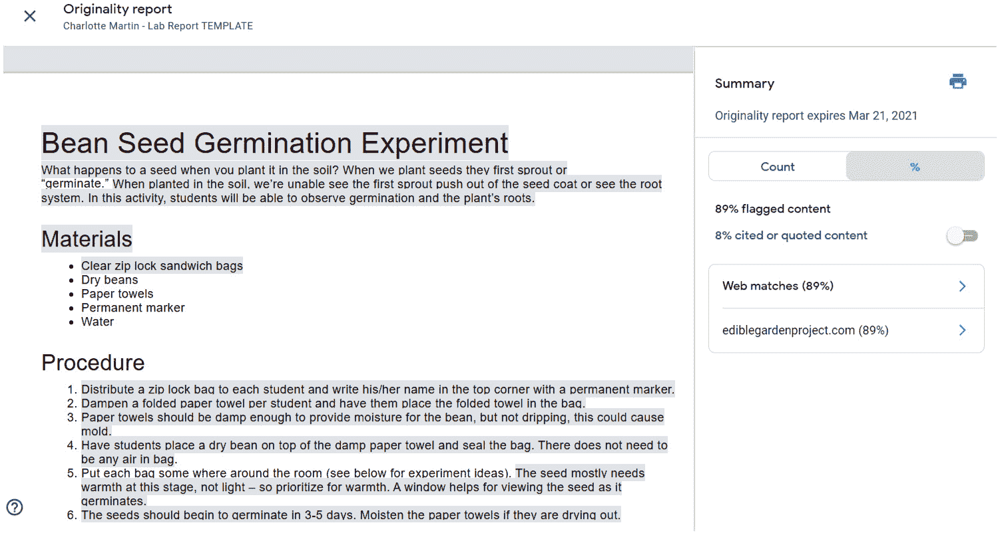

图 6.36 – 样本原创性报告

注意

Google 继续改进这一功能。到 2021 年中，它增加了一个功能，可以检测到即使提交中包括已更改成符号（如 **a** 或 **e**）的字母，也能检测到相似性。未来，**原创性报告**还将与其他组织内的 Google Docs 进行比较，以检测是否存在剽窃其他提交的情况。

现在，你知道如何在私信和评论中分配成绩和发布反馈。虽然这些工具是有效的评估实践，但许多作业通过评分标准标准化评估，我们将在下一节中探讨。

# 使用评分标准评分作业

当你评分长文档，如论文和实验报告时，你可以使用评分标准来为学生提供反馈。在 Google 教室中，可以为单个作业创建评分标准。本节将概述如何使用评分标准创建和评估作业。

小贴士

通常，我仍然会在作业的 Google 文档说明中包含评分标准，因为学生提供反馈时，在 Google 文档中查看评分标准比在 Google 教室的作业帖子中更容易。

## 在评分工具中创建评分标准

你可以在创建作业帖子时创建评分标准，或者你可以在发布后将其添加到作业帖子中。通常，我发现自己在之后添加它，因为评分标准已经在作业说明的 Google 文档中了。要为作业创建评分标准，执行以下步骤：

1.  无论你是在创建新的作业帖子时创建评分标准，还是在编辑之前创建的作业帖子时创建评分标准，请点击右侧侧边栏的**主题**部分下方的**+ 评分标准**按钮。然后，点击**创建评分标准**：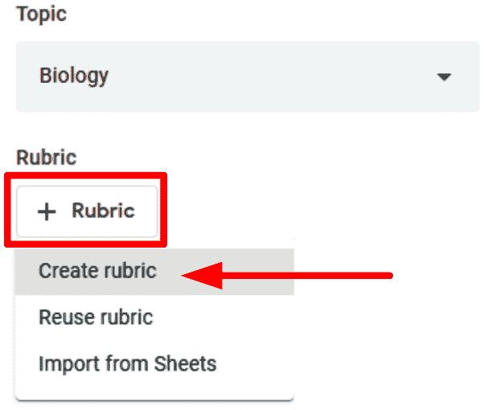

    图 6.37 – 作业帖子中的创建评分标准选项

1.  默认情况下，评分标准将启用评分功能，其中评分标准中的每个标准都值一定数量的分数，并且分数按降序排列。根据需要设置每个属性：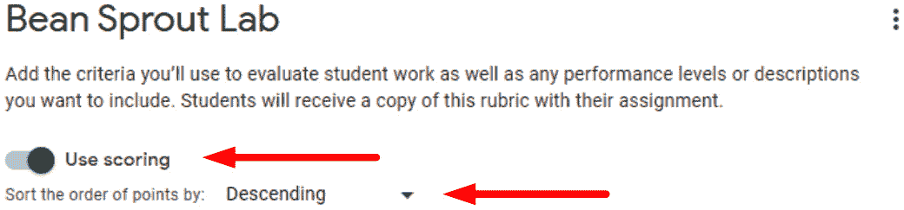

    图 6.38 – 评分和评分顺序设置

    注意

    在学生提交评估后，可以更改是否启用评分。但是，如果评分被禁用，并且一些学生的作业已经被评分，那些作业的评分标准评估分数将会丢失。

1.  输入**标准标题**和**标准描述**属性。标准是评分标准的行。在科学实验报告中，这些通常是报告的章节，如观察、计算等。另一方面，在英语论文中，这些标准通常是论文的组成部分，如观点、语法和连贯性：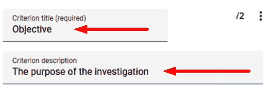

    图 6.39 – 标准标题和描述字段

1.  为标准的第一级输入**分数**、**等级标题**和**描述**属性。等级是评分标准的列。通常，这些列代表已授予的分数或如**典范**、**熟练**、**合格**和**有限**这样的描述词：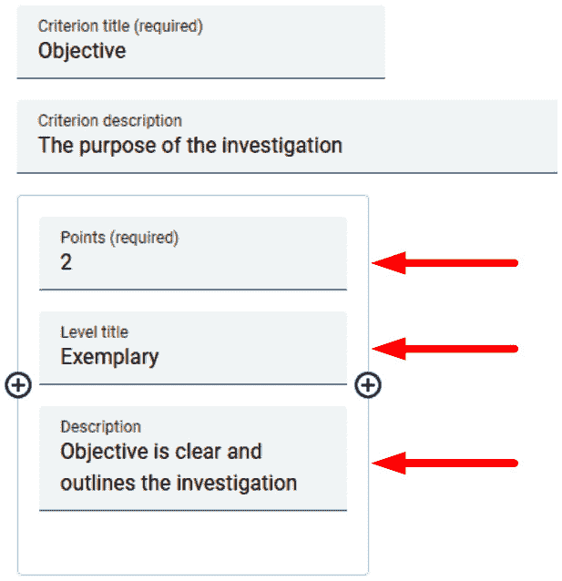

    图 6.40 – 标准等级的分数、标题和描述

1.  点击等级旁边的**+**按钮添加额外的等级。继续添加等级，直到标准完整：

    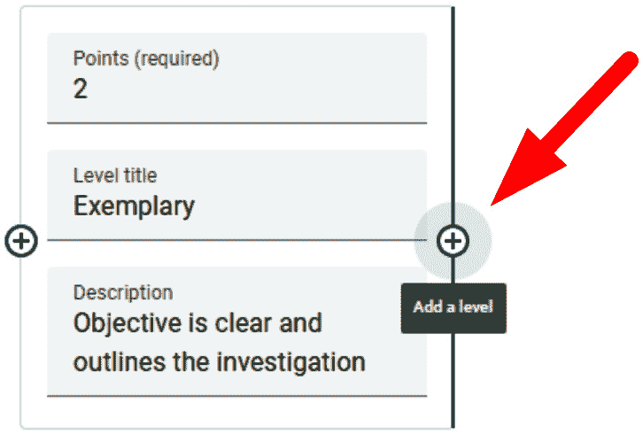

    图 6.41 – 向标准添加等级

1.  使用**+ 添加标准**按钮继续添加标准，直到评分标准完整：

    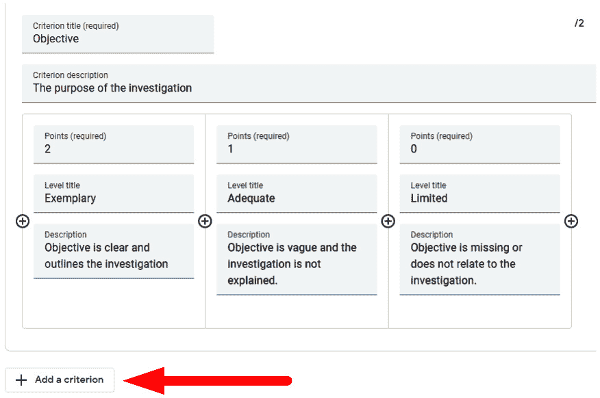

    图 6.42 – + 添加标准按钮

    要重新排列、复制或删除标准，请使用标准右上角的小横幅菜单：

    

    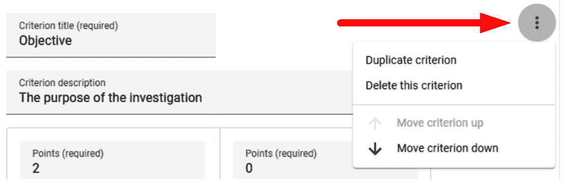

    图 6.43 – 标准的烤肉串菜单

1.  点击页面右上角的**保存**按钮：

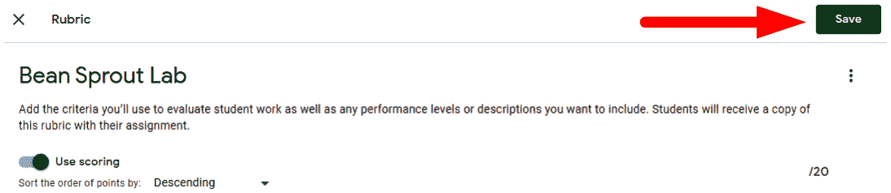

图 6.44 – 评分标准的保存按钮

评分标准将出现在右侧边栏中，指示标准数量和总分：

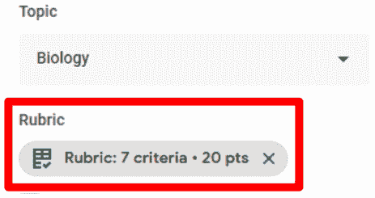

图 6.45 – 作业帖子中的评分标准图标和信息

注意

你可能会注意到评分标准的总分与作业的总分不匹配，作业的总分是**10**。下一节将演示评分标准和作业分数之间的行为。

点击**作业**帖子中的标准图标将在对话框中打开评分标准，其中可以查看标准、等级和分数：

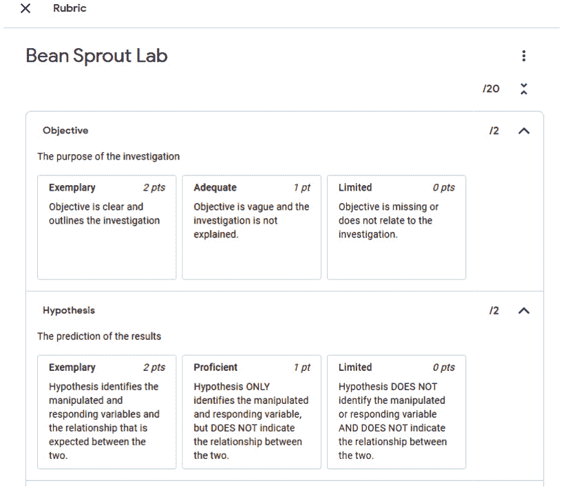

图 6.46 – 包含评分标准摘要的对话框

注意

此对话框中的烤肉串菜单提供了编辑、删除和导出此评分标准的选项。

学生可以在**作业**帖子说明中查看标准。在那里，评分标准将出现在作业说明下方，以及任何**作业**帖子的附件，如以下截图所示。学生可以展开整个评分标准或单个标准：

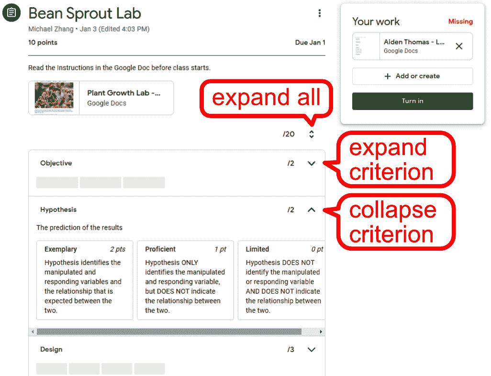

图 6.47 – 带有评分标准的作业帖子学生视图

有其他创建评分标准的方法，可以重用之前创建的评分标准或从 Google Sheets 导入模板。你将在本章后面的*从其他作业帖子中重用评分标准*部分学习如何这样做。

## 使用评分标准评分作业

在评估使用评分标准的作业学生提交时，大部分评分将在评分工具中进行。右侧栏将评分标准夹在分配分数和留下私人评论之间。每个标准都折叠成一个灰色框，以表示评分标准的每个级别。点击一个标准的标题将展开它，以便你可以查看每个级别的文本。以下是在评分工具中的评分标准的截图：

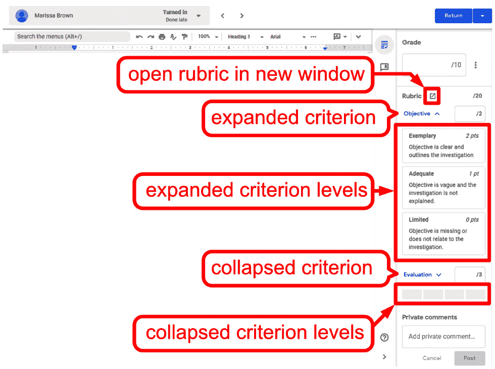

图 6.48 – 评分工具中的评分标准

要在评分工具中使用评分标准进行评分，请为每个标准点击适当的级别，无论是展开的还是折叠的。选中的级别将以蓝色突出显示：

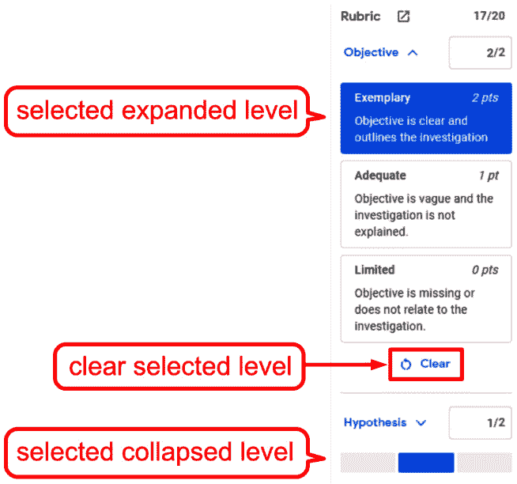

图 6.49 – 选择和取消选择标准级别

如果评分标准使用分数，标准分数将累积在评分标准的顶部。如果评分标准的总分与作业的总分不同，作业分数将自动从评分标准分数调整为作业分数。例如，**17/20**将调整为**8.5/10**，如以下截图所示：

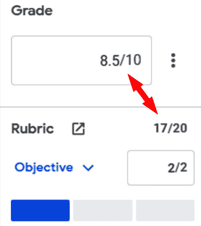

图 6.50 – 评分标准点转换为作业点

注意

使用评分标准评分后，可以随后调整分数。在先前的例子中，如果你的教学方法不使用部分分数，那么分数可以改为**8**或**9**。然而，对评分标准的任何更改都将重新计算评分。

在使用评分工具进行标记时，有效地使用其所有功能可以显著加快评分过程。通常，我会打印一份评分标准的副本以供参考，然后使用评论库中的评论，从评分标准中选择级别，然后在私人评论中写上一句或两句来评分和提供反馈。然后，在评分工具中，我会转到下一个学生并重复此过程。虽然这看起来有些令人畏惧，但通过在**评论库**和作业评分标准（以及一个活泼的 Spotify 播放列表和一杯有趣的饮料）上稍作准备，评分过程可以变得愉快。

## 从另一个作业帖子中重用评分标准

就像重用帖子一样，可以重用评分标准。要重用评分标准，请执行以下步骤：

1.  不论是在创建新的**作业**帖子时重用评分标准，还是在编辑先前创建的**作业**帖子时重用评分标准，请在右侧栏的**主题**部分下方点击**+ 评分标准**按钮。然后，点击**重用评分标准**：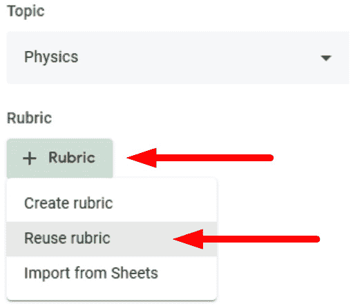

    图 6.51 – 在作业帖子中重用评分标准选项

1.  将会出现一个对话框。在顶部的下拉菜单中，选择具有所需评分标准的**作业**帖子的班级：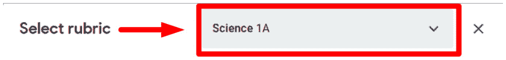

    图 6.52 – 在重复使用评分标准对话框中的班级下拉菜单

1.  选择**作业**帖子，然后点击**选择**按钮：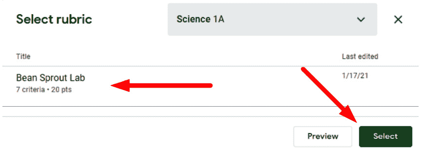

    图 6.53 – 包含评分的作业帖子

    注意

    点击对话框中的**预览**按钮将在另一个对话框中打开所选评分标准的概览视图。

1.  评分标准将出现在右侧侧栏的**评分标准**部分。如果需要，点击评分标准以开始编辑它：

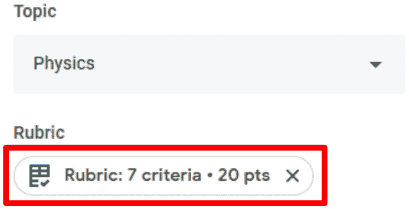

图 6.54 – 作业帖子中的评分图标和信息

通过重复使用评分标准，随着时间的推移，你将能够重复使用先前课程和班级的评分标准，同时只需进行轻微的修改。

## 使用 Google Sheets 创建评分标准

很可能，你已经在 Microsoft Word 或 Google Docs 的表格或 Microsoft Excel 或 Google Sheets 的电子表格中有了评分模板。而不是重写所有这些评分标准，你可以将 Google Sheet 作为评分标准导入。要导入 Google Sheet，它必须包含正确格式的信息。

要开始，创建一个包含分数评分标准的 Google Sheets 复制([tns.tips/gclass-points-rubric](http://tns.tips/gclass-points-rubric))或无分数评分标准的复制([tns.tips/gclass-rubric](http://tns.tips/gclass-rubric))。在以下步骤中，我们将使用分数评分标准：

1.  打开 Google Chrome 并在地址栏中导航到 [tns.tips/gclass-points-rubric](http://tns.tips/gclass-points-rubric)：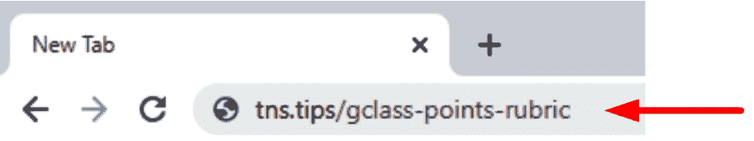

    图 6.55 – 包含评分短链接的地址栏

1.  点击**复制**按钮：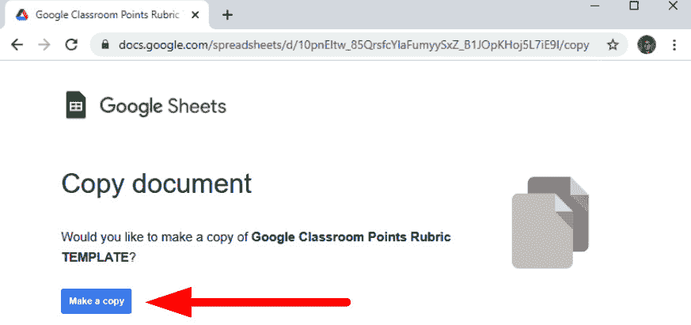

    图 6.56 – Google Sheets 模板的复制按钮

1.  模板的一个副本将在你的 Google Drive 中打开并保存。

1.  如果需要，将`标准标题`复制并粘贴到`级别描述`中，以添加更多标准：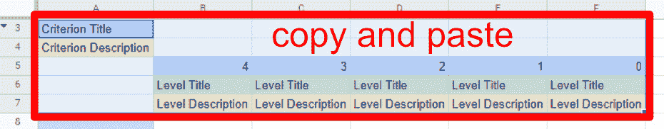

    图 6.57 – 可复制粘贴的模板部分

1.  替换每个标准的`标准标题`、`标准描述`、`分数`、`级别标题`和`级别描述`部分：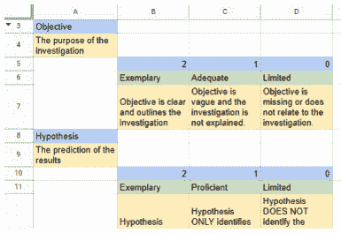

    图 6.58 – 填写评分模板

    注意

    对于带有分数的评分标准，一个标准的不同级别不能有相同的分数值。对于不带分数的评分标准，两个级别的标题不能相同。

1.  在编辑模式下打开**作业**帖子并选择**从表格导入**：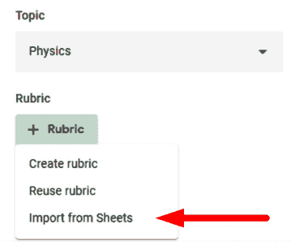

    图 6.59 – 作业帖子中的从表格导入选项

1.  从 Google Drive 中选择 Google 表格并点击**添加**按钮：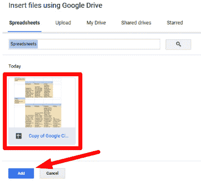

    图 6.60 – Google Drive 对话框中的添加按钮

1.  保存新转换的评分标准：

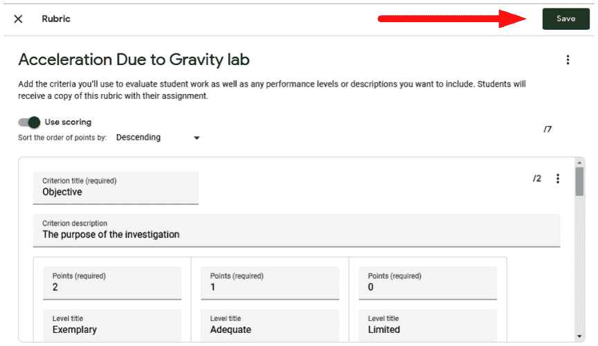

图 6.61 – 从 Google 表格转换的评分标准

评分标准、评论和私信都是使用台式机或笔记本电脑进行的反馈活动。然而，苹果 iPad 和 Android 平板电脑等平板电脑为学生提供反馈功能。

# 使用平板电脑提供书面反馈

关于使用圆圈、箭头和涂鸦来标记学生作业的能力有一些话要说。使用带笔的平板电脑，如配备 Apple Pencil 的苹果 iPad 或配备 S-Pen 的三星 Galaxy Tab S 平板电脑，与使用第三方硅笔尖触控笔的平板电脑相比，体验更加愉快。

在撰写本文时，此功能对 Windows 电脑不可用。以下步骤包括从三星 Galaxy Tab S6 拍摄的截图。步骤在苹果 iPad 上类似：

1.  打开 Google **Classroom**应用：

    图 6.62 – Android 上的 Classroom 应用

1.  点击班级：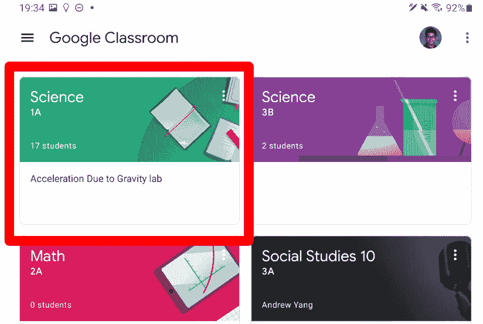

    图 6.63 – Classroom 应用中的班级

1.  点击应用底部的**作业**部分：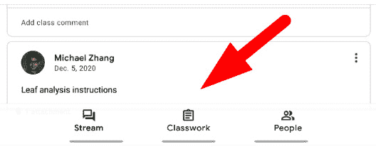

    图 6.64 – Classroom 应用底部的班级部分

1.  点击**作业**帖子：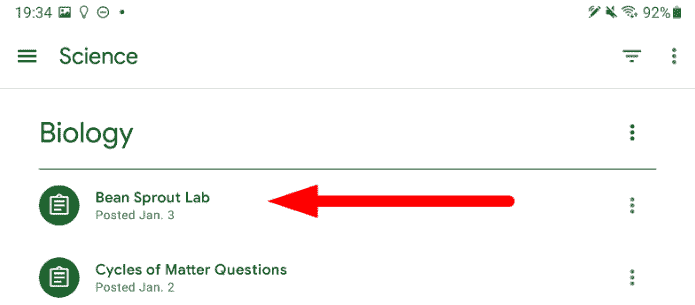

    图 6.65 – Classroom 应用中的作业帖子

1.  点击学生的名字以查看他们的作业文件：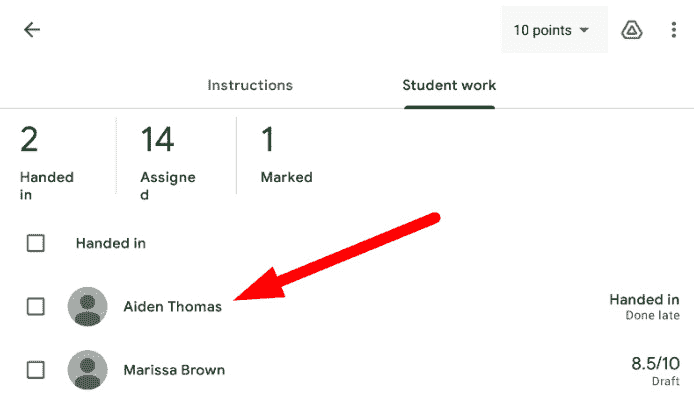

    图 6.66 – 学生在学生作业页面

1.  点击 Google 文档：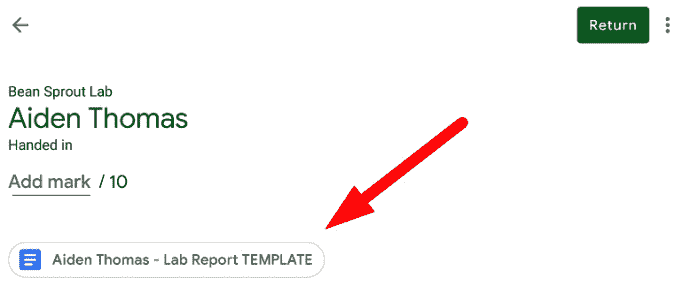

    图 6.67 – Google 文档文件提交

1.  点击工具栏中的铅笔图标以编辑文档：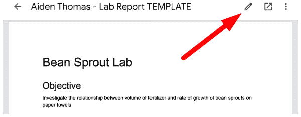

    图 6.68 – Google 文档预览中的编辑图标

1.  标记 Google 文档。使用应用底部的编辑工具栏更改您的笔设置：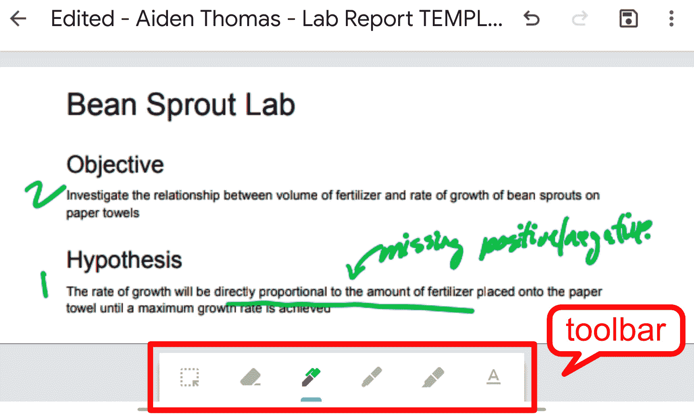

    图 6.69 – 应用底部的编辑工具栏

1.  完成后，点击工具栏中的保存图标：

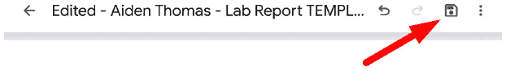

图 6.70 – 应用工具栏中的保存图标

Google Classroom 将保存包含你已做的注释的 PDF 文件，并将其附加到作业的提交中：

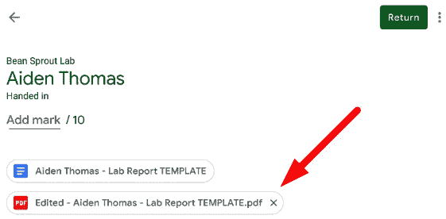

图 6.71 – 带有注释的提交附件 PDF

要添加更多注释，请打开 PDF 文件。这种提供反馈的方法最接近传统的笔和纸，而且携带起来也相当轻便！

# 查看所有学生的成绩

在接收和评分作业时，你通常会想查看学生成就的概述。传统上被称为成绩册或成绩单，Google Classroom 有一个名为 **成绩** 的标签页，你可以在这里查看班级成绩册，如下所示：

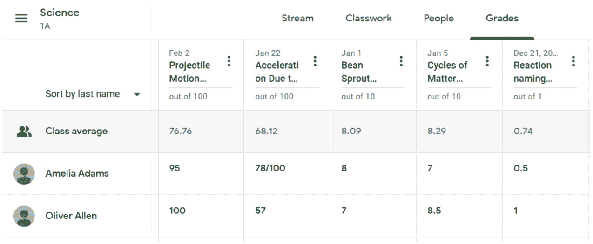

图 6.72 – Google Classroom 中的成绩页面

在这个成绩册中，每个作业都有一个烤肉串菜单，其中包含编辑、删除或返回所有提交的选项。对于每个学生，你可以修改任何作业的成绩；查看任何作业，这将打开评分工具；或返回作业提交：

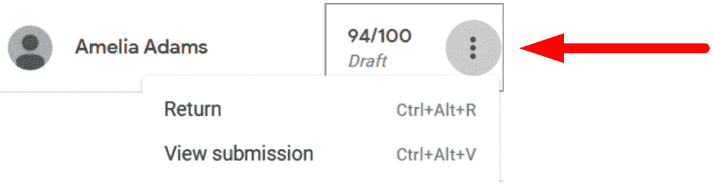

图 6.73 – 单个学生作业提交的烤肉串菜单

Google 正在努力将 Google Classroom 与广泛的 **学生信息系统**（**SIS**）集成，以便轻松地将成绩导入其他工具。如果你的学区正在使用兼容的 SIS，请前往 *第九章*，*根据你的学科进行定制*，获取设置加权类别的额外步骤。

# 摘要

在本章中，你了解了 Google Classroom 中的评分和作业反馈功能。然后，你通过 Google Docs 中找到的注释和建议功能增强了这些功能。接下来，你学习了 Google Docs 的 **版本历史**，你可以使用它来查看 Google 文档的先前快照。

本章的后半部分重点介绍了使用评分标准进行评分。在这里，你学习了如何使用评分标准创建和评分作业。还探讨了通过重用或导入 Google 表格来创建评分标准的其他方法。

最后，我们学习了如何使用带笔的平板电脑和 Google Classroom 应用来标记学生的提交，这会在 Google 文档中创建你的注释的 PDF 文件。这类似于传统的纸质批改技术。

因为本章探讨了多种提供书面作业反馈的方法，所以花时间评估哪种方法最适合你的评估工作流程是很重要的。你不需要使用每种方法来提供有效的反馈，通常情况下，少即是多。在用你偏好的方法评估了几份作业之后，这个过程会变得更加自然和直观。

在下一章中，我们将探讨如何使用 Google 表单创建多项选择题、数字题和填空题。这些表单随后可以被转换成 Google Classroom 可以评分的测验。
