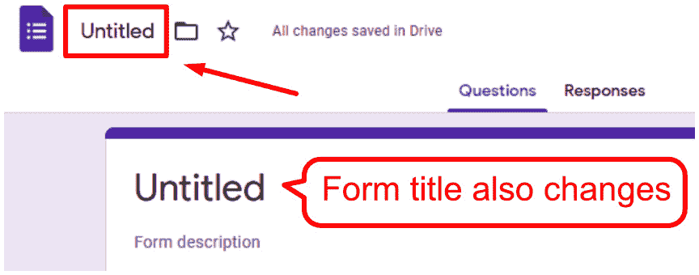
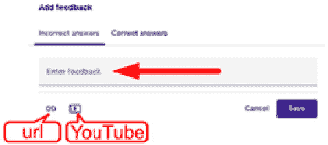

# *第七章*：使用 Google 表单创建多项选择和填空测验

现在我们已经探讨了使用带有评分标准的书面作业，Google 表单的**测验**功能将帮助评分多项选择题、填空题和数字题。首先，您需要创建作业并在 Google Classroom 中部署。Google Forms 的应用程序在 Google 教育工作空间中允许您创建在线调查，您可以用作作业。结果可以在 Google 表单中找到，或者链接到 Google 表格。

在使用 Google 表单进行作业的测验后，您可能决定也将其用于考试。然而，尽管 Google 表单提供了创建评估的方法，Google Classroom 允许您轻松地将它分发给您的学生，但维护评估安全性的工具有限。只有在学生使用注册在学校网络中的 Chromebook 时，才能确保 Google 表单的安全性。

因此，如果您选择使用此工具进行总结性评估，您将需要确定一个适当的安全级别。（通常，没有阻止学生在完成远程表单时打开新标签页搜索答案或给同学发消息。）例如，在我的教室里，我调整了桌子的布局，以便在总结性评估期间在教室后面留出空间。此外，一些学校的实验室有一个包含监控学生桌面软件的教师桌面。无论您选择哪种方法，都要采取预防措施，以确保在线评估学生结果的真实性。

Google 表单是一个功能丰富的 Google 应用程序，要完全探索其功能，需要一本自己的书。因此，本章中您将探索的各种功能将专注于创建和评估多项选择和填空作业。然而，一旦您熟悉了 Google 表单，您会发现它有更多的应用。例如，在我的学校，我与行政部门合作创建表格，收集来自员工、学生和家长的利益相关者的调查数据。

最近，为了我们学校的年度开放日，我创建了一个表格，以指导潜在学生选择他们的第一年课程（COVID-19 大流行阻止了注册期间的面对面咨询）。此外，在我们学校的主要筹款活动中，我开发了一个 Google 表单，让学生记录捐赠，以便比以往任何时候都能更快地生成报告。在校园环境中使用 Google 表单的可能性是无限的！

在本章中，您将探索以下主题：

+   使用 Google 表单创建作业

+   在 Google Classroom 中分配 Google 表单

+   创建 Google 表单作业时的技巧和窍门

    注意

    Google 表单的测验功能侧重于易用性而非功能。在本书的前一版中，本章探讨了第三方插件 **Flubaroo**，它需要更多的设置，但提供了诸如从列表中选择多个项目时给予部分分数等额外功能。在撰写前一版时，测验功能是新的，并且没有本章所探讨的功能。

# 创建 Google 表单

虽然可以从 Classroom 创建 Google 表单测验，但这些步骤将从 Google 表单应用开始，以便您可以创建适用于更广泛目的的 Google 表单。

由于 Google 表单不如 Gmail 或 Google 日历知名，它可能不会立即在应用启动器中可见。要创建 Google 表单，请按照以下说明操作：

1.  在应用启动器中，在启动器内向下滚动并点击地址栏中的 `forms.google.com`。

1.  点击 **空白** 模板以创建一个新的 Google 表单：

    图 7.2 – 表单应用中的空白表单缩略图

1.  要命名 Google 表单，请点击左上角的 **未命名** 并输入名称。这将更改表单的名称。如果需要，您可以点击表单标题以在之后更改标题：

    图 7.3 – 表单文件名和标题

1.  可选地，您可以直接在表单标题下方添加 **描述**：

图 7.4 – 表单描述字段

注意

我经常使用描述来提供进一步的说明或信息，例如时间限制、是否允许使用词典或其他参考书籍，甚至学生可以找到与作业相关的信息的网站地址。

## 向 Google 表单添加问题

默认情况下，每个新的 Google 表单都会在表单中插入一个多项选择题卡：

1.  为了访问选项，请点击 **未命名问题** 旁边的白色区域中的任何位置：

    图 7.5 – 非活动问题卡

    问题将展开形成一个问题卡，您可以在其中更改问题：

    

    图 7.6 – 活动问题卡

1.  在 **未命名问题** 行中输入问题主体。然后点击 **选项 1** 创建一个字段以将其更改为选择：

    图 7.7 – 多选题选择器

1.  要添加更多选择器，请点击当前选择器下方的 **添加选项** 文本或简单地按键盘上的 *Enter* 键开始下一个选择器。

由于问题卡上的选项数量众多，以下截图提供了这些选项的简要描述：

图 7.8 – 问题卡功能

每个选项的描述如下：

1.  **问题标题**：多项选择题的题干。

1.  **移动选项指示器**：将鼠标悬停在选项上，将显示此指示器，您可以点击并拖动以重新排序您的选项。

1.  **问题选项**：包含随机化选项顺序等高级设置。

1.  **移动问题指示器**：点击并拖动此指示器，您可以在作业中重新排序您的问题。

1.  **问题标题图像图标**：点击此图标将在标题文本下方添加图像。

1.  **问题类型下拉菜单**：您可以选择多种类型的问题：简答题、段落、多项选择、复选框、下拉菜单、线性量表、多项选择网格、日期和时间。然而，并非所有类型都适用于测验功能。

    注意

    Google Forms 的测验功能将学生的答案与答案键进行匹配。它无法有效地评分句子或段落形式的答案。唯一提供自动评分的问题字段是简答题、多项选择、复选框、下拉菜单、多项选择网格和复选框网格。

1.  **问题选择器图像图标**：此图标仅在选择器处于活动状态或鼠标悬停在选择器上时出现。点击此图标将为选择器上传图像。图像仍需要在选择器中包含文本。

1.  **删除选项图标**：删除多项选择题选项。

1.  **复制问题按钮**：Google Forms 将复制当前问题。

1.  **删除问题按钮**：删除问题卡。

1.  **必答问题开关**：当此选项启用时，学生必须回答给定的问题才能完成作业。

1.  **更多选项菜单**：根据问题类型，此部分将提供选项以启用问题标题字段下方的问题提示字段、创建非线性多项选择作业以及验证输入到特定字段中的数据。

一旦您完成问题的编辑，您可以使用侧边菜单向您的作业添加更多问题。您还可以向作业添加部分标题、图像、YouTube 视频和附加部分。以下截图提供了图标的简要说明：

图 7.9 – Google Forms 内容菜单

要创建一个*填空题*，请使用简答题类型。在编写问题题干时，使用下划线来指示问题中的空白位置。在使用 Google Forms 时，您可能需要调整填空题的措辞。以下是一个填空题的示例：

图 7.10 – 样本填空题

识别您的学生

确保包括学生姓名的字段。此外，Google 表单在 *齿轮* 图标中的设置中还有一个选项，可以自动收集受访者的电子邮件。我通常启用自动电子邮件收集，以便我可以确认在 Google 表单中提交的姓名与完成它所使用的电子邮件账户相匹配。

如果你教授第二语言或化学等科学课程，请查看 *第九章*，*根据你的主题自定义*，以获取有用的提示和第三方插件，这些插件可以为你的表单添加功能。

## 更改 Google 表单的主题

一旦你在 Google 表单中添加了所有问题，你就可以改变 Google 表单的外观和感觉。要更改作业的主题，请按照以下步骤操作：

1.  在 Google 表单右上角点击调色板图标：

    图 7.11 – 自定义主题图标

1.  对于颜色，从 **主题颜色** 部分选择所需的颜色。然后 **背景颜色** 部分将建议匹配的新颜色。如果你想使用自定义颜色，点击 **主题颜色** 部分的加号图标：

    图 7.12 – 添加自定义颜色图标

1.  将出现一个颜色网格，你可以在此选择颜色和阴影。或者，如果你知道特定颜色的十六进制代码，你可以在 **Hex** 字段中输入它：

    图 7.13 – 自定义颜色选项

    注意

    虽然可以自定义主题颜色，但 Google 表单不提供使用应用提供的颜色以外的颜色自定义背景颜色的选项。

1.  如果你想要添加标题图片，点击 **HEADER** 部分的 **选择图片** 按钮：

    图 7.14 – 添加标题图片按钮

1.  当选择主题图片时，你可以通过点击左侧侧边栏中的适当类别来缩小可见的主题图片类型：

图 7.15 – 主题图片类别

截图未显示的其他类别包括 **派对**、**仅限儿童**、**婚礼**、**夜晚外出**、**运动和游戏**、**旅行**和 **其他**。

另一个选项是将自己的图片作为主题上传。点击顶部的 **上传** 选项卡，浏览图片或使用 **照片** 选项卡从 Google 相册中选择一个图片。

注意

当添加标题图片时，Google 表单将覆盖当前的颜色主题以匹配标题图片。你之后仍然可以调整主题和背景颜色。

Google 表单在课堂中的应用非常广泛。凭借上述功能，您可以在 Google 表单中添加图片和视频。此外，结合 Google Classroom 作业，您可以将 Google 文档和 Google 表单添加到同一作业中。一个应用示例是在 Google Classroom 中创建一个作业，要求学生首先观看附带的 YouTube 视频，然后在 Google 表单中回答问题。然后，Google 表单将评分作业，您可以通过电子邮件将学生的成绩发送给他们。

## 将 Google 表单转换为测验

使用 Google 表单测验模板简化了评分 Google 表单的设置。然而，只有简答题、多项选择题、从列表中选择、下拉菜单和网格问题这些题型是 Google 表单可以自动评分的。因此，它不允许段落问题。

无法自动评分的问题类型仍然可以为每个问题分配分数。有人将不得不评估并手动输入每个提交收到的分数。由于本章从非测验 Google 表单开始，要将 Google 表单转换为测验，请按照以下步骤操作：

1.  点击设置齿轮：

    图 7.16 – 设置齿轮图标

1.  点击**测验**部分：

    图 7.17 – 表单设置中的测验选项卡

1.  点击**将此设置为测验**开关：

    图 7.18 – 将此设置为测验开关

1.  第一个测验选项确定学生是否可以在任何设备上访问测验，或者只能在已注册的学校 Chromebook 上访问。当锁定模式启用时，学生无法使用其他应用程序，一些扩展和快捷键被禁用，如果学生在完成测验（未提交）或打开另一个标签页时提前关闭测验，您将收到一封电子邮件：

    图 7.19 – 测验锁定模式开关

1.  其他测验选项设置 Google 表单在提交后是否自动向学生发送电子邮件以及他们将收到什么信息。例如，学生可以查看表单内的问题的正确答案。以下是一个所有可用选项的截图：

    图 7.20 – 表单测验选项

1.  点击对话框底部的**保存**按钮以保存更改。

    总结性评估设置

    每当我创建一个记录学生成绩的评估时，我会将测验设置更改为在人工审查后发布成绩，并取消选中所有学生可以看到的设置（错过的问题、正确答案和得分）。然后，当学生的成绩发布时，他们收到的电子邮件将只包含他们的成绩。

## 在 Google 表单中创建答案键

现在，Google 表单是一个测验，每个问题卡将有一个新的链接，称为答案键，位于卡片底部。使用以下说明将答案键添加到多项选择、下拉或复选框问题卡：

1.  点击问题卡底部的**答案键**链接：

    图 7.21 – 答案键链接

1.  在卡片右上角为问题分配分值（我经常忘记这一步）：

    图 7.22 – 问题的分值

1.  点击正确的答案：

    图 7.23 – 选择问题的正确答案

    您可以选择多个选项；然而，Google 表单答案键对某些问题类型有不同的评分方式。对于多项选择或下拉问题，任何正确选项都会将答案标记为正确；然而，复选框问题需要所有选择才能将答案标记为正确。

1.  点击**完成**按钮将保存答案并返回问题卡。当问题卡展开时，正确答案旁边将出现勾号：

图 7.24 – 试题卡中的正确选项指示

对于简答题，答案键允许您输入正确答案。可能存在多个正确答案，以便您考虑学生可能输入信息的多种方式。例如，学生可能选择将单词大写，或者他们可能不小心在单词后添加了空格。

答案键不会调整这些差异。因此，为了最小化学生在提交答案后的修正，输入多个相同答案的版本可以帮助表单正确评分学生的回答。以下是一个问题的可能正确答案示例：

图 7.25 – 简答题的多个正确答案

注意

本章的“创建 Google 表单作业时的技巧和窍门”部分将包括减轻此问题的策略。

### 提供答案反馈

答案键还可以自动为学生提供反馈。问题反馈可能包括文本、网页链接，甚至 YouTube 视频。如果问题类型是 Google 表单可以自动评分的类型，则根据学生是否正确回答问题，可以提供不同的反馈。要添加问题反馈，请按照以下步骤操作：

1.  在问题卡的答案键部分，点击**添加答案反馈**：

    图 7.26 – 添加答案反馈链接

1.  在对话框中，默认选项卡是**错误答案**。根据需要添加文本、网站链接和/或 YouTube 视频：

    图 7.27 – 反馈对话框

1.  如果需要，点击**正确答案**选项卡以添加当问题正确时的不同反馈：

    图 7.28 – 正确答案选项卡

1.  点击**保存**按钮以保存更改：

图 7.29 – 完成问题反馈

对于无法自动评分的题目卡（例如段落题），反馈将自动提供给每位学生。在章节的后面，在*评分 Google 表单测验*部分，将探索提供个人反馈等附加功能。

注意

在使用此方法自动提供反馈时请小心。如果测验设置为立即返回学生的成绩，他们将立即看到反馈。学生可能能够通过电子邮件提供的反馈识别他们正确提交的问题。

# 在 Google Classroom 中分配 Google 表单

在将 Google 表单分配给学生之前，请先预览它。通过这种方式，您可以在将作业发送给学生之前发现任何错误，并且在您稍后评分时更容易找到。点击 Google 表单右上角的眼睛形状预览图标以进入实时表单：

图 7.30 – 预览实时表单图标

用所有正确答案填写表格。为了稍后找到这个条目，我通常在名称字段中输入`KEY`，并在电子邮件字段中输入我的电子邮件地址。一旦您确认 Google 表单的行为符合预期（特别是发布成绩时），它就可以在 Google Classroom 中分配了。

在 Google Classroom 中，一旦学生提交了 Google 表单，Google Classroom 将自动将该作业标记为已提交。因此，如果您要向作业添加多个文件，请最后添加 Google 表单，并避免向单个作业添加多个 Google 表单。要将 Google 表单添加到作业中，请按照以下步骤操作：

1.  在**作业**部分，通过选择**作业**来创建作业帖子。*不要*选择**测验作业**：

    图 7.31 – 在作业部分创建作业

    选择**测验作业**将创建一个带有空白 Google 表单测验的作业帖子。因为测验已经创建，所以使用常规作业帖子。

    注意

    虽然可以使用测验作业创建评估，但通过协作，我发现教师倾向于首先创建评估，然后将其添加到 Google Classroom 作业中。这种操作顺序使得在 Google Drive 中组织评估以及创建和管理多个评估版本变得更加容易。

1.  从 **Google Drive** 添加文件：

    图 7.32 – 添加 Google Drive 文件

1.  选择 Google 表单并点击 **插入** 按钮：

    图 7.33 – Google Drive 对话框

    默认情况下，作业启用 **成绩导入**。此功能将 Google 表单链接到作业，以便自动将 Google 表单的结果导入 Google Classroom。此过程将覆盖 Classroom 作业中的分数，以 Google 表单的总分数为准：

    

    图 7.34 – 作业帖子中的成绩导入开关

    此功能还限制每个学生只能有一个响应，收集电子邮件地址，并限制响应为您的域中的用户。在 Google 表单中更改这些功能中的任何一项都将禁用 **成绩导入**。

1.  添加任何其他信息并分配作业。如果作业使用 Google 表单测验，则不需要额外步骤。

一旦学生完成 Google 表单，它就准备好进行评估和返回。

## 评分 Google 表单测验

学生提交的作业和成绩可以在 Google Forms 应用中找到。要查看 Google 表单的响应，请点击 Forms 应用顶部的 **响应** 选项卡：

图 7.35 – Google Forms 应用中的响应选项卡

**响应** 选项卡还将显示当前 Google 表单提交的数量。在 **响应** 页面中，还有三个额外的选项卡 – **摘要**、**问题** 和 **个人**。许多评估评分工具，如 Scantron 和 SmarterMarks，都有类似的评估统计分解。因此，许多这些选项卡可能都很熟悉。

**摘要** 选项卡提供了结果的概述，包括平均值、中位数和范围。它还提供了图表和表格来查看学生分数和每个问题的答案频率。以下图中显示了 **摘要** 选项卡的形象：

图 7.36 – Google 表单响应摘要页面

**问题** 选项卡提供了关于每个问题的详细信息。一次只能查看一个问题，页面提供了按钮来更改特定响应是否正确以及每个响应的分数值。以下图中显示了 **问题** 选项卡的形象：

![图 7.37 – Google 表单响应问题页面![图 7.37 – 发布分数按钮图 7.37 – Google 表单响应问题页面**个人** 选项卡提供了查看每个学生提交的视图。在此视图中，每个问题响应都有一个 **添加单个反馈** 按钮：![图 7.38 – 添加单个反馈按钮![图 7.38 – 添加单个反馈按钮图 7.38 – 添加单个反馈按钮点击此按钮将打开一个对话框，您可以在其中添加文本、网站链接和 YouTube 视频。此部分还可以为不自动评分的问题类型分配分数，例如段落问题。这些问题在分配分数之前看起来是错误的。任何对单个提交分数的更改都必须保存：

图 7.40 – 概述页面上的“发布分数”按钮

点击此按钮将弹出一个对话框，您可以在其中撰写消息并选择哪些学生可以收到他们的结果：

![图 7.41 – 发布分数对话框![图 7.41 – 发布分数对话框图 7.41 – 发布分数对话框第二个发布分数的位置是在响应的 **个人** 页面顶部的 **发布分数** 按钮，如下所示：![图 7.42 – 个人页面上的“发布分数”按钮![图 7.42 – 个人页面上的“发布分数”按钮图 7.42 – 个人页面上的“发布分数”按钮点击此按钮将弹出与 **概述** 页面上的 **发布分数** 按钮相同的对话框。然而，默认情况下将只选择当前学生，而不是所有学生。## 链接 Google 电子表格来自 Google 表单的响应也可以链接到 Google 电子表格（通常称为 **Google 表格**）。链接到 Google 表格有几个优点，例如用于统计分析的电子表格公式（适用于正态分布的课程）、自定义图表，以及仅通过 Google 表格共享响应而不是整个 Google 表单。要将 Google 表格链接到 Google 表单，请从 Google 表单的 **响应** 页面开始：1.  点击 Google 表格图标：![图 7.43 – Google 表格图标    ![图 7.43 – Google 表格图标    图 7.43 – Google 表格图标 1.  选择是否创建一个新的 Google 表格或将响应添加到现有的 Google 表格：![图 7.44 – Google 电子表格目标对话框![图 7.44 – Google 电子表格目标对话框图 7.44 – Google 电子表格目标对话框注意如果创建链接的 Google 电子表格，它将在 Google Drive 中与 Google 表单位于同一文件夹中。重新组织 Google 表单或 Google 电子表格的位置不会破坏链接。通常，创建一个新的 Google 电子表格是主要选择。然而，在某些情况下，例如当向不同班级发布类似的 Google 表单时，将所有响应放在一个 Google 电子表格中可以提高工作效率。数据从 Google 表单传输到 Google 电子表格，但反之则不然。因此，对 Google 电子表格中字段（如分数列）的任何更改都不会影响 Google 表单。此外，Google 电子表格中的任何自定义更改都将被 Google 表单覆盖。例如，如果您正在更新 Google 电子表格中的分数，然后按下 Google 表单中的**发布分数**按钮，Google 表单将重新填充分数列的数据。一旦电子表格被链接，电子表格上的**表单**菜单将提供选项跳转到实时 Google 表单并编辑它，如图所示：

图 7.45 – Google 电子表格中的表单菜单

通过 Google 表单收集并通过 Google 电子表格处理的数据应用非常广泛（它们远远超出了本书的范围）。下一节提供了一些额外的建议和高级功能，以改进您的工作流程。

# 创建 Google 表单作业时的技巧和窍门

现在您已经创建了 Google 表单并使用测验功能进行了评分，Google 表单中有几个额外的设置对课堂很有益。以下是在为您的学生创建 Google 表单作业和考试时可以使用的 10 个技巧和窍门：

1.  如果学生需要重新提交 Google 表单测验，请从**响应**的**个人**页面删除第一个提交：

    图 7.46 – 删除响应图标

    注意

    如果您有一个链接的电子表格，删除一个响应不会从电子表格中删除该提交。

1.  您可以选择是否让任何人都能访问 Google 表单，或者将其限制在学校区域内用户。用于更改此设置的下拉菜单位于 Google 表单的设置齿轮中。务必点击设置弹出窗口底部的**保存**按钮：

    图 7.47 – 将 Google 表单限制为组织内的用户

1.  默认情况下，学生可以多次提交谷歌表单。谷歌表单测验将在**响应**部分显示学生的所有提交，并且谷歌课堂将在第一次提交后将作业标记为已提交。虽然此功能可能允许学生在重做作业时有机会获得更高的分数，但你可能希望防止学生重新提交谷歌表单，例如，如果你将谷歌表单用作测验。在设置齿轮中，你可以勾选**限制为 1 个响应**旁边的复选框（需要登录）：![Figure 7.48 – 设置齿轮中的限制为 1 个响应复选框

    ![img/Figure_7.48_B16846.jpg]

    ![Figure 7.48 – 设置齿轮中的限制为 1 个响应复选框

1.  谷歌表单可以混排问题的顺序。此功能可以防止学生复制同学的答案，因为学生能跟随另一个学生屏幕的可能性较低。通过检查**展示**部分下方的**混排问题顺序**旁边的复选框，当学生完成作业时，谷歌表单将混排部分的顺序。问题需要创建在单独的部分中：![Figure 7.49 – 混排问题顺序设置

    ![Figure_7.49_B16846.jpg]

    ![Figure 7.49 – 混排问题顺序设置

    当使用此选项时，让谷歌表单自动收集学生的用户名，否则**姓名**和**电子邮件**字段将在作业中的其他问题中混排。

    使用媒体混排问题

    对于需要学生查看图片、视频或其他媒体并回答多个问题的题目，使用页面部分来分隔问题，以便谷歌表单混排页面部分而不是每个单独的问题。

1.  与混排问题顺序类似，您还可以混排多项选择题中的选项。在问题卡的更多选项菜单中，选择**混排选项顺序**：![Figure 7.50 – 问题卡菜单中的混排选项顺序

    ![img/Figure_7.50_B16846.jpg]

    ![Figure 7.50 – 问题卡菜单中的混排选项顺序    注意    混排问题和混排多项选择题选项都不会影响测验模板。**响应**部分和链接的谷歌电子表格以不受谷歌表单内混排影响的列显示每个问题的结果。1.  多项选择和下拉问题类型的一个特点是具有特定的选择可以让学生跳转到不同的题目。例如，如果学生选择更正选择器，他们将跳转到更难的题目，但如果他们答错题，他们将跳转到更简单的题目。您需要在每个问题自己的部分中创建每个问题，并在问题卡的更多选项菜单中选择**根据答案跳转到部分**。然后，每个选择器将有一个下拉菜单来选择学生将导航到的下一个位置。您甚至可以有一个选择器来提交 Google 表单：

    图 7.51 – 使用多项选择题的非线性测验

1.  在简答题中的**响应验证**可以确认输入是否与特定的模式匹配，例如电子邮件或 URL。此功能位于问题卡的更多选项菜单中：

    图 7.52 – 问题卡菜单中的响应验证

    使用**响应验证**也会减少学生输入错误答案的机会。对于数值响应问题的一个简单解决方案是将**响应验证**设置为检查输入是否为数字。

1.  **响应验证**的另一个应用是保护您的 Google 表单。在简答题的数据验证设置中，将验证类型更改为**正则表达式**，以匹配模式。模式字段将是密码。为确保密码准确无误，请以**^**开始密码，并以**$**结束。两个符号之间的任何内容都将作为密码。例如，**^Cookies$**的正确密码是 Cookies。将问题设置为必填问题，并将其放置在 Google 表单开头的单独部分中。用户必须输入正确的密码才能继续：

    图 7.53 – 样本密码问题卡

    我已经为测验和考试保护了我的 Google 表单，这样学生就不能提前开始。这也防止了不在课堂上的学生访问 Google 表单。一旦测验或考试完成，我在 Google 表单的**响应**选项卡的**接受响应**中禁用。

    如果您选择在您的 Google 表单中使用此功能，您将无法混排问题顺序，因为这样密码部分可能不是学生首先看到的第一个部分。

1.  在表单提交后，您可以更改确认页面上的文本。如果您在此部分放置一个 URL，学生将能够点击它。确认页面设置位于**设置**的**演示**部分：

    图 7.54 – 设置中的演示选项卡

1.  谷歌表单也包含附加组件！您可以探索额外的第三方附加组件，这些组件可以增强您的表单。要打开**附加组件**，请点击谷歌表单更多选项菜单中的**附加组件**：

图 7.55 – 在烤肉串菜单中找到的附加组件选项

我听说过很多关于谷歌表单评估因为设置不当而出现问题的故事。例如，一位老师不小心给了所有学生编辑谷歌表单测验的权限。学生们不仅拥有了测验的所有正确答案，还修改了许多问题。由于这个错误，老师不得不重新安排时间并创建一个新的评估。遵循一些这些技巧和窍门可能有助于您在使用谷歌表单时避免这些问题。

# 摘要

在本章中，您已经学习了如何创建谷歌表单，将其转换为测验，创建答案键，在谷歌课堂中分配它，并评分它。使用谷歌表单和谷歌表格增强谷歌课堂展示了谷歌教育工作区中的应用程序如何相互交互，为您提供强大的工具。谷歌表单不仅允许您创建和分配多项选择题和填空题，现在您还有关于打乱问题顺序、为表单设置密码以及确保学生只提交一次谷歌表单的提示。

使用谷歌表单，您的谷歌课堂作业可以包括非线性的问题顺序，为学生提供多次展示他们理解的机会，即时反馈和自动评分。最初这个章节是为了节省在评分多项选择题和填空题上的时间，现在已经提供了工具来扩展您可以给学生布置的作业类型。谷歌课堂不再只是管理作业，它还可以管理测验和考试。

在谷歌课堂中，通过谷歌文档和上一章中的评分工具以及这一章中的谷歌表单和谷歌表格进行评分后，在下一章中，我们将探讨谷歌日历和谷歌站点如何帮助轻松地在谷歌课堂中与家长沟通信息。
