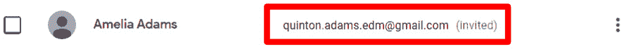

# *第八章*：让家长保持知情

Google Classroom 在组织教师和学生之间的信息方面表现出色。然而，家长和监护人在这种沟通中也是重要的利益相关者。Google Classroom 可以向作为守护者邀请的家长发送电子邮件摘要。这种方法必须由学校或地区的 IT 部门启用。如果您的学校或地区使用其他与家长沟通的方法，他们可能会因为其固有的安全风险而禁用此功能。（例如，我目前所在学校的雇主禁用了 Google Classroom 的守护者电子邮件，以便在内部系统中对电子邮件进行验证过程。）

如果您的学校不允许使用守护者电子邮件，通过使用 Google Calendar，您仍然能够通知家长关于 Google Classroom 中的重要截止日期。在*第一章*“了解 Google Classroom”中，我提到在 Google Classroom 中创建的每个班级都有一个用于问答和作业截止日期的 Google Calendar。本章将探讨如何在 Google Classroom 和班级的 Google Calendar 中使用守护者电子邮件来与家长和监护人沟通。

注意

在本章的剩余部分，*家长*将指代家长和监护人。

在深入探讨这个主题之前，每个学区在向家长提供信息的方式上都有所不同。因此，您可能需要根据您在本章中找到的信息来调整，以最好地适应您所在学区的在线资源。例如，在我所在的学区，管理员、教师、家长和学生都包括在一个旨在利益相关者之间沟通的内部网络中。

不仅有关课堂的具体信息，学校还可以将重大事件和截止日期的公告发布到这个内部网站上。我也曾在只通过学校网站与家长沟通的学校区工作过。因此，本章将探讨使用守护者电子邮件功能和两种不同的方法来通过 Google Calendar 让家长保持知情：使用 Google Calendar 网站和使用 Google Sites 创建一个特定于班级的网站。

在本章中，我们将涵盖以下主题：

+   启用并邀请家长接收来自 Google Classroom 的通知

+   激活 Google Calendar 的共享并确定其网站 URL

+   创建 Google Site 并将 Google Calendar 嵌入网页中

# 邀请家长接收守护者电子邮件

守护者电子邮件为家长提供即将到来的作业截止日期和通知的每日或每周电子邮件摘要，同时突出显示在 Google Classroom 上尚未提交的未完成作业。要启用并邀请家长接收守护者电子邮件，请按照以下步骤操作：

1.  点击设置齿轮：

    图 8.1 – Google Classroom 的设置齿轮

1.  在 **通用** 部分，点击 **监护人摘要** 的开关：

    图 8.2 – 通用部分中的监护人摘要开关

1.  将出现一个对话框请求确认。它还将有一个复选框以在其他所有课程中激活监护人电子邮件：

    图 8.3 – 监护人摘要对话框

1.  点击 **保存** 按钮保存并退出设置：

    图 8.4 – 设置的保存按钮

1.  在 **人员** 页面的 **学生** 列表中，点击 **邀请监护人**：

    图 8.5 – 学生列表中的邀请监护人按钮

1.  在对话框中，输入家长的电子邮件并点击 **搜索结果**：

    图 8.6 – 邀请监护人对话框

1.  如果需要，添加额外的监护人电子邮件，然后点击 **邀请** 按钮：

    图 8.7 – 邀请监护人对话框中的邀请按钮

1.  邀请的电子邮件地址将显示在监护人名字旁边，直到家长接受邀请，如下所示：

    图 8.8 – 已邀请但未确认的监护人电子邮件

1.  一旦家长接受邀请，家长的名字将显示在电子邮件地址的下方，如下所示：

图 8.9 – 已确认监护人电子邮件

注意

如果家长使用的是未与 Google 帐户关联的电子邮件，他们将被重定向到一个可以将其非 Google 电子邮件链接到帐户的创建页面。

要让家长访问他们的电子邮件通知设置，请指导他们访问 Google Classroom 网站 ([`classroom.google.com/gs`](https://classroom.google.com/gs))。Google Classroom 将显示学生并允许他们选择每天、每周或根本不接收电子邮件通知。以下是一个监护人设置的示例：

图 8.10 – 监护人摘要设置

接下来，我们将探讨如何手动向监护人发送电子邮件。

## 手动向监护人发送电子邮件

监护人电子邮件允许教师向班级内的所有监护人发送电子邮件。在 **学生** 列表顶部出现一个新的 **向所有监护人发送电子邮件** 按钮，如下所示：

图 8.11 – 学生列表中的“向所有监护人发送电子邮件”按钮

此外，学生列表中每个学生的旁边都有三个点的菜单，包含发送学生监护人电子邮件、邀请其他监护人或删除当前监护人的选项。以下截图显示了此菜单的示例：

图 8.12 – 从学生列表中给单个学生的监护人发送电子邮件

使用监护人电子邮件是与家长联系的最简单方法之一。一旦他们注册，家长将继续收到摘要电子邮件。此外，他们只需注册一次。因此，如果家长在孩子的早期学校生涯中注册监护人电子邮件，他们将在孩子的整个学校生涯中继续收到摘要电子邮件。

# 通过 URL 共享 Google 日历

如果在您的学区中不可用，将班级的 Google 日历共享作为监护人电子邮件的替代方案。如果您的学区已经有一个连接学校和家长的网页或内部网，这种方法可能是最简单的部署方式。由于家长已经有了访问学校信息的网站，因此他们在学校网站上找到您的日历链接是最容易的。

在我们包含该链接之前，我们必须确保通过以下步骤使与您的教室关联的日历对公众公开：

1.  在**作业**部分，点击**Google 日历**按钮：

    图 8.13 – Google 日历按钮

1.  在左侧边栏中，您将看到一个日历列表。将鼠标悬停在与您的 Google Classroom 课程同名的日历上，然后点击 Kebab 菜单：

    图 8.14 – 日历 Kebab 菜单

    如果在**我的日历**标题下没有看到日历列表，请点击标题旁边的侧向三角形，如图所示：

    

    图 8.15 – 我的日历的展开图标

1.  点击**设置和共享**：

    图 8.16 – 设置和共享选项

1.  在**访问权限**部分，勾选**公开可用**旁边的复选框。此选项旁边的下拉菜单也应为**查看所有事件详情**：

    图 8.17 – 公开可用复选框

1.  将会弹出一个警告框。点击**确定**按钮以确认：

    图 8.18 – 日历共享警告框

1.  点击**获取可共享链接**按钮：

    图 8.19 – 日历链接按钮

1.  将出现一个包含日历链接的对话框。点击**复制链接**按钮：

    图 8.20 – 日历链接对话框

1.  将链接分发给家长。当他们点击链接时，它将在 Google 日历中打开一个对话框以添加日历，如下所示：

图 8.21 – 添加日历到 Google 日历的对话框

现在您有了日历链接，您可以将其发送给管理您学校网站的人，或者将其添加到学校内部网络。在我的学区内部网络中，我在**作业**部分包含链接。我创建了一个持续到年底的作业，然后包含一条消息和日历链接。消息通常解释给家长，他们可以点击日历链接在 Google 日历中查看孩子在我班的重要日期。

根据前面的说明，日历链接需要家长拥有 Google 账户。作为对家长的解释的一部分，我提供了不使用 Google 产品的家长的额外说明。我在日历设置的**集成日历**部分找到了一个额外的日历 URL。以下图中显示的公共 URL 将日历显示为网页，无需账户即可查看：

图 8.22 – 日历网站地址

下面是一个在互联网浏览器中显示的日历示例：

图 8.23 – Google 日历网页

Google 日历网页尚未更新。下一节将探讨如何将课堂日历嵌入到 Google Sites 网站上。不仅日历看起来更现代，您还可以在网站上添加其他内容。

# 创建 Google 日历网站

如果您的学区没有方便的在线与家长沟通的方法，您可以使用 Google Sites 为家长创建一个网站，以便他们访问您的课程信息。Google Sites 是一个所见即所得的网站编辑器，允许您在不使用代码的情况下创建网站。虽然将单个日历的链接发送给学生可能满足您的需求，但 Google Sites 允许您自定义 Google 日历，在单个页面上显示多个日历，并使其他 Google 应用的内容可供家长访问。

Google Sites 的其他用途包括为课堂内容提供一个更永久的位置。我学校的几位教师仍然在使用 Google Classroom 可用之前创建的课程 Google Site，因此学生和家长可以访问所有课程内容。

由于本书专注于 Google Classroom，本节将提供将 Google Classroom 日历添加到 Google 网站的步骤。Google Sites 中还有许多其他功能，这些功能超出了本书的范围。

使用以下步骤创建 Google 网站并将 Classroom 的 Google 日历添加到其中：

1.  在应用程序启动器中点击“网站”图标。如果没有图标，请打开 Google Chrome 并导航到 [`sites.google.com/new`](https://sites.google.com/new)：

    图 8.24 – 应用程序启动器中的网站图标

1.  在“新建网站”部分点击“空白”模板：

    图 8.25 – Google Sites 中的空白模板图标

1.  为 Google 网站命名。左上角的名字是网站的文件名，可以与横幅上的标题不同，横幅是家长和其他网站访问者将看到的内容：

    图 8.26 – 网站文件名和标题

1.  在右侧边栏中，滚动到默认的“插入”选项卡下的“日历”选项：

    图 8.27 – 侧边栏中的日历选项

1.  在侧边栏中会出现 Google 日历列表。选择与 Classroom 课程链接的日历：

    图 8.28 – Google 日历列表

    注意

    要将多个 Google 日历合并为单个日历，请选择多个日历。

1.  在侧边栏底部点击“插入”按钮：

    图 8.29 – 添加 Google 日历的插入按钮

1.  使用日历周围的蓝色点调整其大小：

    图 8.30 – 框架调整大小标记

1.  默认情况下，Google Sites 以议程视图模式插入 Google 日历。要更改此默认视图和其他日历设置，请点击日历的设置齿轮：

    图 8.31 – 日历设置齿轮

1.  将会出现日历设置对话框。您可以调整这些设置以满足您的偏好。这些步骤将更改“查看模式”为“月份”。不要忘记点击“完成”按钮以保存更改：

    图 8.32 – 日历设置中的查看模式

1.  您的 Google Classroom 日历现在在 Google 网站上可见，如下所示。最后一步是使 Google 网站可见，以便家长和公众可以查看该网站：

图 8.33 – 包含 Google 日历的完整 Google 网站的预览

现在我们已经创建了一个网站，让我们看看我们如何可以共享这个网站。

## 共享 Google 网站

要使 Google 网站对公众可见，请按照以下步骤操作：

1.  点击 **发布** 按钮：

    图 8.34 – 发布按钮

1.  网址是网站 URL 的结尾。虽然以后可以更改它，但任何已将页面添加到书签的利益相关者都需要更新他们的书签。如有必要，请更新网址，然后点击 **管理** 链接：

    图 8.35 – 发布网站对话框

1.  另一个对话框将出现。在 **链接** 部分，点击 **更改** 链接：

    图 8.36 – 网站共享对话框

1.  **链接**部分将展开。点击 **已发布** 网站的下拉菜单，选择 **公开**：

    图 8.37 – 已发布网站可见性下拉菜单

1.  点击 **完成** 按钮以保存更改：

    图 8.38 – 设置 Google 网站共享设置

1.  在 **发布您的网站** 对话框中，将出现一个新的复选框。虽然这是可选的，但我通常在 **搜索设置** 下勾选此复选框。点击 Google 网站的 **发布** 按钮：

    图 8.39 – 搜索设置复选框

1.  使用链接图标复制网站 URL 以分发给家长：

    图 8.40 – Google 网站链接图标

1.  当任何人点击链接时，他们将被发送到您的 Google 网站，如下所示：

图 8.41 – 已发布 Google 网站的截图

现在您已添加了班级日历并发布了 Google 网站，您可以从侧边栏添加更多内容。尝试添加部分标题、文本、图片、Google 文档、YouTube 视频，等等！许多教师使用 Google 网站来存储他们每年都在使用的除了 Google 课堂之外的内容。

# 摘要

通过监护人电子邮件和 Google 日历，您学生的家长将能够查看您班级中的问题和作业帖子。虽然实施这些功能之一可能看起来设置起来很耗时，但它发生在年初或学期初，并且全年维护很少。现在您能够邀请家长或监护人接收电子邮件通知，您可以通过 URL 或 Google 网站与家长共享 Google 课堂日历。

家长将能够积极参与到孩子的作业和评估中。现在，家长可以在谷歌教室中查看帖子，在那里您可以管理和评分他们的作业，这样就将教室的许多管理和行政方面统一起来，以便您能专注于教学。

下一章将探讨谷歌教室和第三方应用中的其他功能，这些功能可以增强您在谷歌教室内的活动。
