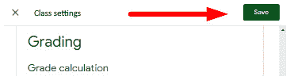

# 第九章：*第九章*：根据您的学科进行定制

欢迎来到谷歌课堂。在这里，您将了解如何设置谷歌课堂并在您的教室中有效地部署它…

您已经被抓到了，不是吗？

如果您是直接跳到本章的，您并不孤单。即使您一直在使用谷歌课堂和谷歌教育工作空间，我也鼓励您从本书的开头开始。在接近结尾的地方加入意味着错过了使用谷歌课堂和与其他谷歌应用程序结合实施的有价值的技巧和窍门。本章涵盖了一些额外的工具，以帮助满足特定学科的需求。它们将更像是对蛋糕上糖霜的点缀。因此，从本章开始可能无法为您提供有效实施谷歌课堂所需的资源。

本章的格式与本书的其他部分有所不同，因为它将展示并引用我和我的同事们在课堂上使用的一些应用程序。对于那些谷歌课堂往往无法有效实施的主题，有时只能限制在谷歌教育工作空间的功能之内。在这里，我们将探讨英语、社会科学、第二语言、科学和数学的本地功能和第三方应用程序。谷歌正在继续开发谷歌课堂的成绩册功能，本章也将探讨这一功能。

其中一些额外功能来自第三方扩展或谷歌文档插件。由于本章的重点是提供几个学科的建议，因此只会探索一些应用程序的某些方面。如果您对第三方功能感兴趣，请花时间探索扩展或插件的完整功能。本章将向您展示如何在谷歌文档中添加谷歌 Chrome 扩展和插件。此外，它还将探讨如何删除不需要的第三方插件。

本章将涵盖以下主题：

+   设置作业的加权类别

+   管理英语和社会研究书面作业的引用

+   使用谷歌文档中的**特殊字符 – 点击粘贴**插件为第二语言课程添加带重音的字母

+   在谷歌文档中插入数学和科学方程式

+   删除 Chrome 网络商店扩展和谷歌文档插件

# 谷歌课堂中的加权类别

在过去一年左右的时间里，谷歌对课堂的增量更新中纳入了来自常见**学生信息系统**（**SISes**）的功能，如第六章中首次展示的班级作业和成绩概述，*瞬间评分书面作业*。在撰写本文时，谷歌已经开始将谷歌课堂与无限校园和天空等 SISes 链接起来，还有更多即将到来。

然而，由于其目前兼容性有限，我教育社区中的教师很少使用评分功能，因为他们的班级评分由一个独立的 SIS 程序管理。但是，如果 Google Classroom 与您的 SIS 接口，设置评分和类别权重可以在您的工作流程中节省时间。

注意

要获取兼容的 SIS 程序的最新列表以及将 Google Classroom 连接到您的 SIS 的说明，请访问 Google 的支持页面，[`support.google.com/edu/classroom/answer/9356588`](https://support.google.com/edu/classroom/answer/9356588)。

要设置**按类别加权**评分，请按照以下步骤操作：

1.  在 Classroom 中，点击设置齿轮：

    图 9.1 – Google Classroom 中的设置齿轮

1.  在**评分**部分，从**总体评分计算**下拉菜单中选择**按类别加权**：

    图 9.2 – 在课程设置中总体评分计算的下拉菜单

1.  在**评分**部分的底部点击**添加评分类别**按钮：

    图 9.3 – 为按类别加权设置添加类别按钮

1.  填写**评分类别**和**百分比**字段：

    图 9.4 – 示例评分类别

1.  继续添加评分类别，直到它们的百分比总和达到 100%：

    图 9.5 – 类别百分比总和为 100%

1.  点击**保存**按钮：

图 9.6 – 保存课程设置的按钮

在**评分**部分，还有一个开关，允许学生查看他们的总体评分。要启用此功能而不使用**按类别加权**，必须将**总体评分计算**下拉菜单设置为**总分数**。

一旦您启用了类别权重，每次您创建**问题**或**作业**帖子时，右侧边栏将有一个**评分类别**下拉菜单，如下所示：

图 9.7 – 问题或作业帖子中的评分类别

您可能选择设置评分类别的另一个原因是让学生在 Google Classroom 中看到准确的评分。然而，您的地区可能已经有一项政策，规定向相关利益相关者传达评分的频率。因此，在两个独立的成绩册中不断更新可能会感觉重复且价值不大。

# 在 Google Docs 中引用参考文献

随着信息的日益丰富，正确引用来源的教学正在向更年轻的学生传授。英语和社会研究课程需要更多的带引用的写作。Google Docs 提供了 **引用** 功能，可以添加内联和文档末尾的引用。

此外，EasyBib 参考文献创建器增加了搜索作品引用而不是手动输入信息的能力。

## 使用引用功能

**引用** 功能允许学生在 Google Docs 中输入和保存引用。然后，当学生撰写论文时，他们可以直接从引用侧边栏插入引用。此外，此功能将内联和文档末尾的引用格式化为与 MLA、APA 和芝加哥等格式相匹配。要输入引用源，请遵循此处给出的步骤：

1.  在 Google 文档中，从 **工具** 菜单中选择 **引用**。**引用** 将在右侧侧边栏中打开：

    图 9.8 – Google 文档工具菜单中的引用选项

1.  在 **引用** 中，从下拉菜单中选择引用格式：

    图 9.9 – 引用格式下拉菜单

1.  点击 **+ 添加引用源** 按钮：

    图 9.10 – + 添加引用源按钮

1.  按照引用源类型的提示操作。当选择 **源类型** 和 **访问方式** 字段时，将出现 **作者**、**标题**、**出版社** 等附加字段：

    图 9.11 – 新引用的示例字段

1.  当所有需要的字段都已填写后，点击侧边栏底部的 **添加引用源** 按钮：

图 9.12 – 新引用的确认按钮

注意

Google Docs 的 **引用** 工具会保存引用，无论添加的信息多少。因此，学生在保存之前仍需要指导哪些字段必须填写。

要向作品添加内联引用，将鼠标悬停在侧边栏的引用源上，然后单击 **引用** 按钮：

图 9.13 – 插入内联引用引用的引用按钮

每个已保存的引用源的凯巴菜单允许用户编辑或删除源：

图 9.14 – 引用源的凯巴菜单

当所有引用源都已添加且论文完成时，点击 **引用** 侧边栏底部的 **插入参考文献** 将参考文献添加到 Google 文档中。

## 使用 EasyBib 创建引用

该工具允许用户搜索作品并自动填写引用格式的信息。此外，由于**引用**工具文本字段中没有任何一个是必需的，参考文献页面可能是不完整的。最后，该工具不会标记引用来源中的输入错误。

**Imagine Easy Solutions 的 EasyBib 参考文献创建器扩展程序解决了 Google Docs 内置**引用**工具的许多问题。虽然它确实提供了行内引用，但它允许用户搜索作品并自动填写引用格式的信息。

按照以下步骤启用和使用 EasyBib Google 文档扩展程序：

1.  在 Google 文档中，从**扩展程序**菜单中选择**获取扩展程序…**：

    图 9.15 – Google 文档扩展程序菜单中的“获取扩展程序”选项

1.  由于 EasyBib 是一个流行的扩展程序，您可能可以通过滚动查看可用应用程序来找到它。如果是这样，点击它以查看有关应用程序的更多信息。否则，在搜索字段中搜索 EasyBib：

    图 9.16 – 扩展程序市场中的 EasyBib 卡

1.  点击**安装**按钮（它非常大）：

    图 9.17 – 扩展程序的安装按钮

1.  将会弹出一个对话框以确认扩展程序的安装。点击**继续**按钮：

    图 9.18 – 扩展程序安装确认框

1.  另一个对话框将出现以确认将 Google 账户链接到扩展程序。您可能需要重新输入您的 Google 账户密码：

    图 9.19 – 账户确认框

1.  最后一个对话框将显示 EasyBib 请求与 Google Docs 连接的权限。点击**允许**按钮，弹出窗口将关闭：

    图 9.20 – 扩展程序权限确认框

1.  在 Google 文档的**扩展程序**菜单中，点击**EasyBib 参考文献创建器**子菜单下的**管理参考文献**：

    图 9.21 – 启动扩展程序

1.  在 EasyBib 侧边栏中搜索引用。找到后，点击所需来源旁边的**选择**按钮：

    图 9.22 – 搜索并选择引用来源

1.  在 EasyBib 中继续添加参考文献。这些资料将被存储，直到它们准备好添加到文档的末尾。准备好后，点击**将参考文献添加到文档**按钮，位于**样式**下拉菜单下方：

图 9.23 – 在 Google Doc 中插入参考书目

备注

如果 EasyBib 在应用或其网站[www.easybib.com](http://www.easybib.com)中找不到合适的来源，可以正确格式化来源。

当处理引用时，我经常听到老师们教学生使用 Google Docs 的`引用`工具，但学生只填写标题和作者。

## Google Sheets 和 Slides 中的附加组件

Google Sheets 和 Forms 提供了大量用于数据收集和处理的附加组件。Google Slides 的附加组件包括与第三方软件（如 Pear Deck 和 Slido）的集成，以及为幻灯片添加新功能。在各自的应用中探索这些附加组件。

第三方附加组件，如 EasyBib，可以在许多 Google 应用中为您和您的学生添加更多功能。即使您在课堂上不使用引用，也可能有一个附加组件适用于您的教学法。

# 在 Google Docs 中添加带重音的字母

当学习第二语言，如法语或西班牙语时，一个额外的挑战是正确插入带重音的字母。由于大多数学校没有为第二语言提供特殊的键盘布局，历史方法包括记忆键组合或在网上查找字符映射来添加一个*è*。

虽然存在许多扩展和附加组件，但**特殊字符 – 点击粘贴**Chrome 扩展是一个简单的方法，可以在任何键盘布局中插入带重音的字母。

要将此扩展添加到 Google Chrome 或 Chrome OS，请使用以下说明：

1.  在 Google Chrome 或 Chromebook 上，打开一个新标签页并点击书签栏中的**应用**图标：

    图 9.24 – 书签栏中的应用按钮

1.  点击屏幕中央的**Web Store**图标：

    图 9.25 – 应用页面上的 Web Store 图标

1.  在搜索栏中，搜索**特殊字符 – 点击粘贴**。

1.  在**扩展**部分，点击扩展的标题：

    图 9.26 – Web Store 中的扩展卡

1.  将会出现一个弹出窗口。点击**添加扩展**按钮：

    图 9.27 – 安装确认框

1.  安装后，全功能栏旁边将出现特殊字符的图标：

    图 9.28 – 全功能栏中的扩展图标

    在 Chrome 中，扩展隐藏在扩展图标中。要将扩展固定到全功能栏，点击扩展图标，然后点击扩展旁边的固定按钮：

    

    图 9.29 – 全功能栏中的扩展菜单

1.  要插入特殊字符，点击特殊字符，然后将其粘贴到文本字段或 Google Doc 中：

图 9.30 – 样本扩展菜单

注意

**特殊字符 – 点击并粘贴**由 Benjamin Jones 创建。

Chrome 扩展程序类似于附加组件，其中有许多工具，将 Google Chrome 转变为不仅仅是浏览器。（本书中的一些图片是使用 **Nimbus Capture** 扩展程序拍摄的）。如果你找到了合适的附加组件和扩展程序，探索扩展程序几分钟可以为你节省大量的时间。

# 在 Google Docs 中插入数学和科学方程式

数学与其他学科相比更具挑战性。通过方程式、图表和图形，在 Google Docs 中创建或让学生创建与数学相关的内客可能是一个挑战。Google Docs 内置的方程式编辑器对数学和科学文档非常有用。

要在 Google Docs 中创建方程式，请按照以下说明操作：

1.  在 Google 文档中，在 **插入** 菜单中选择 **方程式**：

    图 9.31 – Google 文档插入菜单中的方程式选项

1.  插入点周围的蓝色矩形表示方程式编辑器处于活动状态。此外，一个方程式工具栏出现在默认工具栏下方：

图 9.32 – 方程式工具栏

方程式工具栏中有五个菜单：

1.  如 α 这样的希腊字母

1.  如 ± 这样的杂项操作

1.  如 ≥ 这样的关系

1.  如分数和平方根这样的数学运算

1.  箭头

    3. 从方程式工具栏插入特殊格式和符号以完成方程式。这里展示了直线斜率的方程式示例：

图 9.33 – 样本数学公式

注意

在使用方程式编辑器时，最好先从格式设置开始，如分数和下标，然后再添加文本，因为它们不会格式化之前输入的文本。相反，格式按钮将在适当格式中创建字段以填充。

在 Google Docs 中使用方程式编辑器的另一个示例是创建化学和生物学的平衡方程式：

图 9.34 – 样本化学方程式

方程式工具可以创建格式良好的方程式；然而，界面一开始可能看起来有些令人困惑。编写几个方程式之后，过程会变得更容易。如果你正在教学生如何创建方程式，请计划更多的时间。

在尝试所有扩展和附加组件的过程中，你最终可能不会使用其中的一些。下一节将探讨如何通过删除它们来清理 Chrome 浏览器。

# 删除扩展和附加组件

随着你继续探索不同的 Chrome 扩展程序和 Google Docs 插件，你可能会尝试一些并决定不再使用。保留这些未使用的插件可能会减慢 Google Chrome 和 Chrome OS 的速度。为了在使用 Google Apps 时保持最佳性能，尽可能删除这些未使用的扩展程序和 Google Docs 插件。

要删除扩展程序，在 omnibar 中的扩展程序上右键单击，并选择**从 Chrome 中移除…**，如图所示：

![图 9.35 – 扩展程序的上下文菜单

![img/Figure_9.35_B16846.jpg]

图 9.35 – 扩展程序的上下文菜单

在 Google Docs 中删除插件需要几个步骤：

1.  在 Google Docs 中，在**添加插件**菜单中选择**管理插件**：![图 9.36 – Google 文档的“添加插件”菜单中的“管理插件”选项

    ![img/Figure_9.36_B16846.jpg]

    图 9.36 – Google 文档的“添加插件”菜单中的“管理插件”选项

1.  将鼠标光标悬停在扩展程序上，并单击 Kebab 菜单：![图 9.37 – 扩展程序的 Kebab 菜单

    ![img/Figure_9.37_B16846.jpg]

    图 9.37 – 扩展程序的 Kebab 菜单

1.  从 Kebab 菜单中选择**卸载**：![图 9.38 – 插件的 Kebab 菜单中的“卸载”选项

    ![img/Figure_9.38_B16846.jpg]

    ![图 9.38 – 插件的 Kebab 菜单中的“卸载”选项

1.  将会出现一个对话框以确认卸载。单击**卸载应用**按钮以确认：

![图 9.39 – 扩展程序卸载的确认框

![img/Figure_9.39_B16846.jpg]

图 9.39 – 扩展程序卸载的确认框

使用较少的插件和扩展程序，将更容易找到你需要的工具。偶尔（即每年一次）审查你的插件和扩展程序可以帮助确保只有相关的插件保持安装。

# 摘要

第三方扩展程序和插件允许你自定义 Google Classroom 作业，以更好地适应你特定的学科领域。本章探讨了将功能添加到 Google Chrome 和 Google Docs 核心组件的几种不同方法，以增强你的 Google Classroom 体验。本章不仅提供了在课堂上使用的第三方插件示例，还提供了你探索和发现新功能和功能的步骤。Google Apps for Education 是一个不断变化的系统。随着它的改进，继续探索 Google 带给这个应用套件的新变化非常重要。

如果你的课堂是面对面的，这本书的这里是一个很好的停止点。接下来的两个章节将介绍 Google 的在线视频会议工具 Google Meet 以及成功在线课堂体验的策略。我希望这本书能赋予你探索、实验和与 Google Classroom 共同成长的力量。正如我们教导学习是终身的，我们也需要践行我们所宣扬的，并跟随学生学习的不断变化的环境，以有意义的方式调整我们的教学方法，使他们能在我们的话语中找到相关性。

对于那些在在线环境或线上线下混合课堂中教学的您，请前往下一章探索谷歌会议**。
