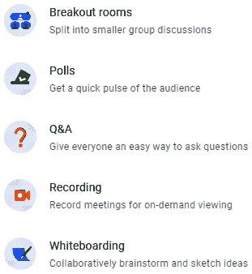

# 第十章：*第十章*：使用 Google Meet 在线授课

2020 年初，世界卫生组织宣布新型冠状病毒爆发为全球大流行。从那时起，公司纷纷转向在家和在线运营。世界各地的学校也不例外。希望到你阅读这一章的时候，COVID-19 只会在历史档案中提及，但它却是推动全球向在线教学和学习工具转变的催化剂。**Google Meet**，一个于 2017 年推出的视频会议应用，从最多 30 位参会者且功能有限的会议发展到成为一个大规模的通信工具。

从 2021 年起，Google Meet 可以举办最多 250 人的在线视频会议，以及最多 100,000 名仅限观看的嘉宾。在撰写本文时，谷歌已经宣布了今年晚些时候在 Google Meet 中推出的一些新功能。由于突然转向在线教学和学习，Google Meet 现在已成为 Google Classroom 的一个重要组成部分。本章将重点介绍启用 Google Meet 并概述 Google Meet 的功能，而下一章将提供在线教学的策略。

到本章结束时，你将能够做到以下几点：

+   在 Google Classroom 中开启 Google Meet。

+   加入会议并指导学生加入会议。

+   更改设置，如音频和视频输入、学生网络摄像头布局和主持人控制。

+   在屏幕上共享内容。

+   发布问答和投票，并将学生置于分组讨论室中。

+   录制会议。

# 在 Google Classroom 中启用和管理 Google Meet

由于 Classroom 中的每节课都不需要视频会议，因此 Google Meet 默认是禁用的。要启用唯一的 Google Meet 链接，请点击此处所示的班级 **Stream** 横幅中的 **生成 Meet 链接** 按钮：

图 10.1 – 生成 Meet 链接 URL

将出现一个对话框，其中包含一个生成 Meet 链接的按钮，如下所示。它显示了 Meet 链接和一个开关，用于启用或禁用学生的 Meet 链接：

图 10.2 – 生成 Meet 链接对话框

保存 **Meet 链接** 设置后，Meet 链接将出现在 **Stream** 横幅中，教师和学生可以点击链接开始会议：

图 10.3 – 流中横幅中的 Meet 链接

在移动设备上，Google Meet 图标将出现在流的最上方：

图 10.4 – Classroom 移动应用中的 Meet 链接图标

安卓和 iOS 设备也必须在设备上安装 Google Meet 应用才能使用 Google Meet。

重要

虽然桌面和移动端的用户界面相似，但也有一些细微差别。为了简化，本章的其余部分将使用来自台式计算机或笔记本电脑的截图。

## 更改 Meet 链接

Google Classroom 中的 **Meet 链接**使用会议昵称，而不是其 ID。如果没有当前与昵称关联的 Google Meet，Google Meet 将创建一个新的会议。虽然 **Meet 链接**和 **Meet ID** 都是 10 位字母组合，但 Meet ID 会随着每次新会议而改变。以下截图说明了 **Meet 链接**和 Meet ID 之间的区别：

图 10.5 – Meet 链接昵称与 Meet ID 地址

此功能用于提高安全性，以便共享 Google Meet ID 只会影响单个 Google Meet 会话。然而，也可以共享 **Meet 链接**，这可能会导致意外的复杂情况。在紧急在线教学的最初几个月，许多学生会入侵不同学校的同学的 Google Meet，导致会话中发生混乱（当时，Google Meet 无法禁止用户）。

生成 Google Meet 链接后，此处显示的 **Class Settings** 将包含一个 **Meet** 部分，其中包括一个下拉菜单来 **复制**或**重置**Meet 链接，以及一个开关来隐藏 Meet 链接供学生查看：

图 10.6 – 班级设置中的 Meet 设置

# 开始使用 Google Meet

影响在线教学质量的因素有很多。下一章，*第十一章*，*成功在线课程的策略*，将探讨一些超出 Google Meet 的概念，这些概念有助于在线教学。无论如何，每次会议通常都需要音频、视频和会议控制设置。

## Google Meet 音频和视频设置

当从内置摄像头和麦克风的设备（如笔记本电脑、Chromebook 或移动设备）加入会议时，Google Meet 会检测并选择集成硬件。然而，台式计算机在使用 Google Meet 之前可能需要麦克风、扬声器和摄像头外围设备。

实际上，许多笔记本电脑和 Chromebook 设置使用外围设备，通常通过 USB 连接，以增强视频会议体验。因为这些外围设备大多与台式机或笔记本电脑环境相关，所以这些说明将专注于这些设备。要调整音频和视频设置，请使用以下说明：

1.  在 Classroom 中，点击横幅中的 **Meet 链接**。

    成为会议的第一位

    管理员可以在 Google Workspace for Education 中禁用学生账户创建 Google Meet。因此，在上课前几分钟开始会议很重要，以便学生能够准时加入。如果学生尝试创建会议，他们将被带到显示他们无法创建会议的页面。

    如果这是您第一次启动 Google Meet，浏览器将弹出一个对话框，请求访问计算机的音频和视频设备权限。

1.  在 Google Meet 大厅中，点击预览窗口下方的**检查音频和视频**按钮：

    图 10.7 – “检查音频和视频”按钮

1.  将会出现一个包含麦克风、扬声器和摄像头下拉菜单的对话框。一旦选择了所需的设备，请点击**下一步**按钮：

    图 10.8 – 音频和视频设备对话框

    小贴士

    在可能的情况下，从同一设备选择麦克风和扬声器源以减少可听到的回声和反馈。例如，选择耳机的麦克风和扬声器。

1.  对话框将提供录制一段简短片段，以便您可以检查设置。点击**开始**按钮开始录制或点击右上角的**X**退出：

    图 10.9 – 测试音频和视频设备设置

1.  可选地，点击**更改背景**按钮来调整网络摄像头的背景。网络摄像头预览将展开，提供选项以模糊背景，使网络摄像头看起来更具电影感，或用图像替换背景：

    图 10.10 – 视频背景设置

    **更改背景**功能对计算机的要求很高。因此，只有具备足够硬件规格的计算机才能更改背景。

    注意

    在撰写本文时，无法上传个人图片作为背景；然而，Google 正在添加此功能。

1.  一旦调整了音频和视频设置，请点击**立即加入**按钮：

图 10.11 – Meet 大厅中的“立即加入”按钮

这里显示的许多设置在 Google Meet 中会被记住，这样你就不需要每次在相同设备上开会时重复选择设备或更改背景设置。

重要

一些功能，如**更改背景**，在移动设备上不可用。

### Google Meet 大厅的额外设置

虽然上一节中的步骤概述了加入会议的最常见方法，但在 Google Meet 大厅中还有针对特定目的的额外设置：

图 10.12 – Meet 大厅设置

1.  **音频和视频静音**：在进入会议之前，用户可以选择静音麦克风或相机。

1.  **使用手机加入**：允许网络连接不可靠的用户通过手机以音频方式加入会议。

    重要

    使用**使用手机加入**功能时要小心，因为可能会产生长途费用。一些学区甚至完全禁用此功能。

1.  **投射此会议**：允许将会议的视频和音频显示在 Google Chromecast 兼容设备上。此功能非常适合允许一小群人观看会议，同时麦克风靠近演讲者。

1.  **向 Google Meet 展示**：允许在设备（即程序）上展示内容，而无需任何其他交互。此功能允许向会议中的其他人提供高质量的视频展示，并允许观众听到计算机音频。此功能通常与会议中的第二台设备一起使用，以与会议观众互动。此功能的主要功能是减少展示的视频延迟。

1.  **凯巴布菜单**：虽然此菜单中的许多选项已移动到通用界面，例如**更改背景**和**选择音频和视频设备**，但它还包含**启用内部直播流**、**开启字幕**、**报告问题或滥用**以及**更改传入和传出视频流的视频分辨率**等选项。

    内部直播流

    Google Meet 仅支持单个会议中的最多 250 个用户。然而，有时会议可能被广播给大量观众。内部直播流允许最多 100,000 名观众观看会议。观众与参与者不同，因为他们不能与聊天或其他会议功能互动。它为观众生成一个单独的 URL 以加入。

## Google Meet 会议控制

加入会议后，将出现许多按钮。以下图将简要介绍 Google Meet 界面。其中一些功能将在本节后面进行详细说明：

图 10.13 – Google Meet 工具栏

1.  **会议信息对话框**：作为会议的创建者，此对话框将显示 Google Meet 的信息和邀请其他人加入会议的选项。随后的参与者进入会议时将不会看到此对话框。

1.  **麦克风控制**：静音或取消静音麦克风。

1.  **相机控制**：开启或关闭相机。

1.  **启用实时字幕**：Google Meet 将以英语、法语、德语、葡萄牙语或西班牙语显示实时字幕。

1.  **举手**：向会议中的其他人开启一个视觉指示器，表明你有话要说。

1.  **现在展示**：将网页浏览器标签页、程序窗口或整个桌面屏幕展示给会议的其他参与者和观众。

1.  **烤肉串菜单**: 包括投射会议、打开数字白板、开始/停止录制会议、更改布局、更改背景、更改音频和视频设备等附加选项。

1.  **结束通话**: 离开会议。主持人也可以为所有参与者结束会议。

1.  **会议信息**: 包含与（**1**）中的对话框相同的信息。

1.  **显示所有人**: 查看所有参与者的列表。会议主持人可以锁定参与者摄像头、静音麦克风并将参与者从会议中移除。

1.  **与所有人聊天**: 查看并向所有参与者发送聊天消息。

1.  **活动**: 增强的功能，如分组讨论室、投票和问答。

1.  **会议安全**: 一种常见的主持人设置，用于管理谁可以进入会议以及谁可以共享屏幕或发送聊天消息。

### 使用主持人控制保护会议

如果你是一个会议的创建者，会议安全的盾形图标将会出现。当 COVID-19 大流行开始时，这个盾形图标及其设置尚不存在。社交媒体上充斥着学生“Zoom-bombing”会议、分享不适当图像以及通过聊天中的无关对话分散大家注意力的故事，这些故事在教师社区中广泛传播，成为常见的在线教学噩梦故事。

随着时间的推移，通过**会议安全**图标（和**Meet 设置**），主持人控制为教师提供了更多对在线课堂的控制。主持人能够禁用屏幕共享（将在本章后面探讨）和参与者的聊天框，并要求所有参与者请求主持人加入会议才能被允许进入会议。以下图显示了**会议安全**下所有开关的截图：

图 10.14 – 会议安全设置

当**快速访问**被禁用时，潜在参与者将看到一个写着**请求加入**的按钮，而不是**立即加入**：

图 10.15 – Meet 大厅中的请求加入按钮

会议的主持人是谁？

会议创建者是会议的主持人。在撰写本文时，尚无方法将主持人控制权转移到其他参与者或添加共同主持人。在 Google Workspace for Education 中，某些用户组，如教师，可以在管理员级别设置，以便该组内的任何人都可在会议中获得主持人控制权。在许多学区，学生无法创建自己的会议，以防止学生意外获得教师主持的会议的控制权。主持人的其他术语包括会议创建者或组织者。

Google Meet 用来保护会议的其他策略包括防止用户不断请求加入会议（当有未知人员每隔几秒就请求加入时，请尝试专注于教学）。在两次未回答的请求之后，所有进一步的请求都将被静音。

使用会议安全与出勤

并非所有 Google Workspace for Education 的层级都会向教师发送包含 Google Meet 出勤数据的电子表格。此外，您的**学生信息系统**（**SIS**）可能要求在课程开始时而不是结束时进行出勤记录。在这些情况下，您可以在出勤之前启用**快速访问**，然后在出勤后禁用它，以免错过有人迟到进入会议的情况。

Google Meet 实施的最后一道保护措施是移除当前参与者。为了更好地保护会议，任何被从会议中移除的参与者除非主持人手动邀请他们重新加入会议，否则无法再次进入。此功能与之前讨论的 Meet 链接结合使用，意味着参与者可以从由 Google Classroom 生成的会议中移除，但会自动被允许进入下一场会议。

在下一节中，有移除和邀请参与者加入会议的说明。

### 管理会议中的参与者

作为会议的主持人，您有权邀请、静音学生的音频以及从会议中移除学生（和其他参与者）。所有设置都可以在**人员**侧边栏中找到，该侧边栏通过点击**显示所有人**按钮显示：

图 10.16 – 顶部工具栏中的显示所有人按钮

您将看到一个所有参与者的字母顺序列表，其中每个参与者旁边都有一个麦克风指示器和下拉菜单，可以选择将参与者锁定在屏幕上或从会议中移除。这里显示了侧边栏的图像：

图 10.17 – 人员侧边栏

**人员**侧边栏的顶部有静音所有人（除主持人外）的按钮；添加人员到会议，这也是重新添加已被从会议中移除的参与者的方法；以及主持人控制，其设置与**会议安全**图标相同。

锁定参与者

锁定参与者将整个 Google Meet 窗口填充为参与者的摄像头画面。用户不能为他人锁定参与者。此功能有许多应用，从确保演讲者在在线/现场混合课程中可见，到在总结性评估期间检查摄像头，再到当教师多次加入会议以使用不同的摄像头时显示正确的摄像头画面。

### 摄像头瓷砖设置

当鼠标悬停在参与者的摄像头预览图上时，会出现用于固定（**A**）、静音（**B**）和移除参与者（**C**）的按钮，如图所示：

图 10.18 – 参与者预览图设置

当鼠标悬停在您自己的摄像头预览图上时，一些按钮有所不同。有固定预览图（**A**）、从布局中移除预览图（**B**）和最小化预览图（**C**）：

图 10.19 – 当前用户摄像头预览图设置

从布局中移除您的预览图将放置一个较小的预览图。此图可拖动到会议的任何角落。布局的示例如下：

图 10.20 – 当前用户摄像头和麦克风的预览

当最小化您的预览图时，它将折叠到工具栏中，该工具栏也可以移动到任何角落。

现在学生（和其他参与者）在会议中可见，下一节将探讨如何通过不仅仅是对着摄像头讲课来与会议成员互动。

# 在 Google Meet 中吸引学生

随着学生的加入，Google Meet 将选择一个布局，自动显示最多九个参与者，直到您切换到侧边栏布局，其中显示当前发言的参与者。然而，您可以在 **自动**、**平铺**、**聚光灯**和 **侧边栏** 之间自定义布局。Google Meet 将保存您的偏好设置以供后续会议使用。

要更改 Meet 布局，请按照以下步骤操作：

1.  点击菜单栏并选择 **更改布局**：

    图 10.21 – 在菜单中更改布局选项

1.  点击所需布局的单选按钮：

图 10.22 – 更改布局对话框

在 **更改布局** 菜单中，您可以调整屏幕上显示的参与者数量。当参与者数量超过最大预览图数量时，只有会议中发言的最新预览图可见。在管理我的在线课程时，我将此设置更改为可能的最大数值，以便我可以看到所有学生。

重要

许多学生会在可能的情况下关闭他们的摄像头。关于在线课堂期望的考虑将在最后一章，*第十一章*，*成功在线课堂的策略*中讨论。当学生的摄像头关闭时，他们的账户个人资料图片将替换预览图中的摄像头视图。

现在我可以看到所有我的学生，他们有两种沟通方式——通过电脑麦克风进行口头交流，以及通过聊天。与面对面课程类似，学生在课程中大声提问的情况很少。在学生口头提问之前，他们可以使用**举手**功能，这将在学生的网络摄像头中显示一个指示器，并在侧边栏中显示一个**举手**部分，如下面的截图所示：

图 10.23 – 人员标签页中的**举手**部分

一旦学生完成发言，他们可以放下手，或者在会议的**举手**部分由主持人来做。

聊天默认开启，允许所有用户相互交流。在撰写本文时，无法与特定参与者进行聊天；然而，**活动**部分的**问答**功能允许学生直接向会议主持人提问。要打开聊天，请点击会议中的**与所有人聊天**图标，或者如果侧边栏已经打开，点击侧边栏顶部的图标，如下面的截图所示：

图 10.24 – 侧边栏中的聊天标签页

前面的截图还显示了禁用聊天的开关和底部用于发送聊天的文本框。

聊天中的表情符号 😮🎉🎉😎

向学生展示如何将表情符号插入聊天是一种在聊天中传达情感的好方法。要打开表情符号菜单，请点击聊天文本框，然后使用 Windows 的键盘快捷键 *⊞*+ *.* 或 macOS 的 *⌘* + *Alt* + *Space*；或者您可以在 ChromeOS 中右键点击文本框，并在上下文菜单中选择表情符号。

在设置好查看和与参与者沟通的基本功能后，很多时候仅仅看到老师的脸是不够的。

## 向学生展示屏幕

向 Google Meet 参与者展示屏幕有几种不同的方式。在探讨这些变化之前，请留意您展示的内容质量。例如，当展示文档屏幕时，字体大小可能对您阅读来说是足够的，但对其他参与者来说可能太小。

此外，某些在 Google Meet 中的展示方法可能会扭曲或不同步音频和视频（或完全省略音频）。考虑在 Google Classroom 提前分享一些这些资源，而不是仅仅依赖展示屏幕功能向学生和其他参与者传播信息。

在会议中展示电脑屏幕、程序窗口或 Chrome 标签页，请使用会议中的**显示**按钮。会出现一个菜单，可以选择展示整个屏幕、程序窗口或浏览器标签页，如下所示：

图 10.25 – 显示菜单

在向 Google Meet 参与者演示内容时，每个选项都有其优缺点。

### 演示计算机屏幕或程序窗口

演示计算机屏幕和演示程序窗口在功能上是相同的。当您选择整个屏幕时，以下对话框要求您选择屏幕：

图 10.26 – 分享整个屏幕对话框

注意

即使您的计算机只有一个屏幕，您在点击**分享**按钮之前也必须选择屏幕。

另一方面，演示程序窗口将弹出一个选择单个窗口的选项：

图 10.27 – 分享应用程序窗口对话框

在演示时，Google Meet 将显示一个窗口，显示内容：

图 10.28 – 会议布局中的当前窗口

屏幕底部还将有一个小横幅指示屏幕或窗口正在演示：

图 10.29 – 操作系统桌面底部的横幅通知

演示计算机屏幕更容易管理，因为演示者看到的屏幕内容与会议的参与者看到的内容相同。然而，它也是最不安全的，因为计算机通知或窗口切换可能会向参与者显示敏感信息。我听说过几个故事，讲述的是教师忘记他们在演示屏幕，而在整个班级观看的情况下检查电子邮件或记录分数。

仅演示窗口可以解决这个问题，但如果演示者使用多个不同的程序，这会更加繁琐。每当演示者想要更改程序窗口时，他们都需要停止演示当前窗口，然后演示新的窗口。是否演示整个屏幕或窗口取决于演示者对窗口管理和安全性的偏好。无论是演示整个屏幕还是演示窗口，都不会共享桌面音频。

因此，如果您通过像 Windows Media Player 这样的程序播放视频，参与者将无法听到音频。为了向参与者播放音频或视频，演示者需要展示一个浏览器标签页。

### 演示 Google Chrome 标签页

如**演示**菜单中所述，演示**标签页**最适合视频和动画：

图 10.30 – 演示标签页

无论您使用的是 YouTube 还是 Spotify，这种展示形式将侧重于减少延迟。使用这种方法在标签页之间切换也更容易。浏览器中的每个标签页都将包含一个标题，用于停止展示该标签页或从展示的标签页切换到当前的一个：

图 10.31 – 选项卡展示设置工具栏

如果您的大多数教学工具都来自 Google Workspace for Education 应用程序、网站和在线应用程序，这种方法将是最有效的。

Google Chrome 不仅仅是一个网络浏览器。您可以使用 Google Chrome 播放视频和音频文件。Chrome 可以原生播放`webm`、`mp4`和`ogg`视频格式以及`wav`、`mp3`和`acc`音频文件。要在 Chrome 中播放这些文件中的任何一个，只需将文件拖放到 Google Chrome 中，就会在新标签页中打开一个媒体播放器：

图 10.32 – 在 Google Chrome 中打开视频或音频文件

转换视频和音频文件

有许多程序和在线工具可以将视频和音频文件从一种格式转换为另一种格式。Windows Media Player 和 Apple iTunes 可以将音频 CD 转换为`mp3`格式，而 Handbrake 程序可以将视频转换为`mp4`格式。

通过在会议中展示内容，参与者可以轻松地跟随演示、文档和其他内容。然而，决定针对哪种类型的内容采用哪种展示形式的心理疲劳可能会让演讲者感到疲惫。另一个可能的替代方案可以简化展示过程。

### 仅展示给会议

Google Meet 提供了仅展示会议的选项。在接待区有一个展示选项：

图 10.33 – Meet 接待区的展示按钮

点击此选项将弹出一个菜单，用于展示标签页、整个屏幕或程序应用程序窗口。在此模式下，选择**Chrome 标签页**或**您的整个屏幕**将共享桌面音频：

图 10.34 – 展示时共享音频复选框

因为这种模式只展示，所以它不会与会议参与者互动。以这种方式向会议展示内容只会发送展示的内容到会议中。它不会接收任何内容。因此，发送的内容通常具有更高的视频和音频质量。

为了让演讲者与参与者互动，他们需要使用一个单独的设备加入会议。这种设置需要两个设备，但因为它只需要一个设备用于展示内容，另一个设备用于与参与者互动，所以可能更容易管理。在我的教室里，我的设置包括一台 Windows 台式电脑，用于展示内容，然后是一台 Chromebook，用于与我学生互动。

Windows 电脑总是有一个屏幕显示，这样我就不用担心音频是否被正确发送，然后我有 Chromebook，内置麦克风和摄像头，用于面对面交流（我的设置还有一个第三台电脑，但那将在下一节中解释）。当使用大量媒体内容时，拥有两个独立的设备对于确保流畅的在线教学和学习体验至关重要。

## 在 Jamboard 上书写

从上一节中介绍的使用屏幕共享的说明对 Google Slides 和其他演示软件都适用；然而，有许多情况下你可能想在屏幕上绘制。Google 的 Jamboard 是一个在线白板，你可以绘制、添加便利贴和添加图片。其他人也可以在 Jamboard 上协作，添加他们自己的内容。要创建 Jamboard，点击羊排菜单并选择**白板**：

图 10.35 – 羊排菜单中的白板选项

将会弹出一个对话框，询问是否创建一个空白 Jamboard 或使用你 Google Drive 中已保存的一个。打开 Jamboard 后，所有功能都在左侧面板中，如下所示：

图 10.36 – Jamboard 功能

1.  笔

1.  橡皮擦

1.  选择和移动

1.  便利贴

1.  图片

1.  形状

1.  文本

1.  激光笔

1.  添加页面

为了让学生看到 Jamboard，它需要在会议中展示，或者学生可以点击发送到他们收件箱的链接。一旦创建，Jamboard 文件将可在 Google Drive 中找到。通过屏幕共享和使用 Jamboards，你现在可以向学生分享广泛的内容。这些功能适用于任何 Google 账户。

下一节将探讨 Google Workspace for Education 账户可用的其他功能。

## 增强的参与功能

只有 Google Workspace for Education 和 Google Workspace for Business 的高级版本包含以下功能。个人 Gmail 账户没有这些功能。这些增强功能包括** breakout rooms**、**投票**和**问答**，位于底部栏的**活动**按钮中：

图 10.37 – Meet 侧边栏中的活动按钮

在深入了解每个功能之前，并非所有功能都在移动应用中可用。因此，在大量使用这些功能之前，请确保所有学生都在使用 Windows、macOS 或 ChromeOS 电脑，而不是 iOS 和 Android 应用。

### 将参与者分成更小的分组，使用 breakout rooms

**房间**允许学生和其他参与者分开到不同的会议中。这个功能非常适合小组工作和协作。这些个人会议由教师监督，教师可以移动学生从一个会议到另一个会议，加入个人会议，并结束所有房间。

要设置房间，请按照以下步骤操作：

1.  点击**活动**菜单中的**房间**：

    图 10.38 – 活动菜单中的房间选项

1.  点击**设置房间**按钮：

    图 10.39 – 设置房间按钮

1.  Google Meet 会自动创建多个房间，并将所有参与者随机分配到这些房间中。点击侧边栏底部的**打开房间**按钮：

    图 10.40 – 房间设置

1.  参与者将收到一个弹出窗口，要求他们加入各自的房间：

    

图 10.42 – 房间主持人控制

个性化支持房间

并非每个学生都需要在房间中。通常，在课程结束后，我会邀请请求一对一支持的学生进入房间，其余的学生则留在主会议中。

在每个房间的顶部，都有一个横幅，包含指向教师或组织者**寻求帮助**和**返回主通话**的链接：

图 10.43 – 房间横幅

重要：

如果一个房间中的参与者离开了房间，他们可以使用 Classroom 中的 Meet 链接返回主会议。

在关闭房间时，所有房间中的横幅将开始倒计时：

图 10.44 – 房间横幅和警告倒计时

将会弹出一个对话框，将参与者重定向回主会议。教师可以第二次点击**关闭房间**按钮，立即关闭分组房间，而无需等待 30 秒倒计时完成。

### 使用投票功能进行投票和即时反馈

投票允许您在会议期间快速提出多项选择题。我经常使用此功能进行形成性评估。创建投票涉及以下步骤：

1.  在**活动**菜单中，点击**投票**功能：![Figure 10.45 – 活动菜单中的投票选项]

    ![Figure_10.45 – B16846.jpg]

    Figure 10.45 – 活动菜单中的投票选项

1.  点击**开始投票**按钮：![Figure 10.46 – 开始投票按钮]

    ![Figure_10.46 – B16846.jpg]

    Figure 10.46 – 开始投票按钮

1.  填写问题主体和选项。然后点击**启动**按钮。要提前创建投票，请点击**保存**按钮。投票将保留在菜单中，直到按下**启动**按钮才对会议参与者可见：

![Figure 10.47 – 投票问题主体、选项和保存按钮]

![Figure_10.47 – B16846.jpg]

Figure 10.47 – 投票问题主体、选项和保存按钮

参与者将在**活动**标签页上看到一个指示器，表明有一个新的投票：

![Figure 10.48 – 新活动指示器]

![Figure_10.48 – B16846.jpg]

Figure 10.48 – 新活动指示器

他们将能够点击一个选项，并使用**投票**按钮提交：

![Figure 10.49 – 回答投票]

![Figure_10.49 – B16846.jpg]

Figure 10.49 – 回答投票

作为会议组织者，您将能够看到结果，并可以选择向参与者展示结果。当我让学生选择何时进行单元考试时，我会向他们展示投票结果的一个例子。虽然您将能够看到谁投了什么票，但显示投票结果并不会显示哪些学生投了哪个选项。它只显示最终计票结果。

### 使用问答功能将问题集中在一个地方

虽然聊天功能在所有会议中都是可用的，但过于活跃的聊天可能会淹没问题。**问答**功能将所有问题集中在一个地方。**问答**功能必须在参与者提问之前开启。要开启此功能，请点击**活动**标签页中的**问答**部分：

![Figure 10.50 – 活动标签页中的问答选项]

![Figure_10.50 – B16846.png]

Figure 10.50 – 活动标签页中的问答选项

将会有一个**开启问答**按钮来启用此功能。然后，所有会议参与者可以通过点击**+ 提问**按钮并填写此菜单中的问题字段来提问：

![Figure 10.51 – 问答菜单中的 + 提问按钮]

![Figure_10.51 – B16846.jpg]

Figure 10.51 – 问答菜单中的 + 提问按钮

当有人提问时，其他参与者可以通过点击点赞图标来对问题进行点赞。*图 10.51*显示了一条有两个点赞的帖子。每个参与者可以选择查看所有问题、仅查看自己的问题或按最古老、最新或最多点赞的问题排序。主持人可以选择按**所有问题**、**未回答**、**已回答**或**隐藏**进行排序，如下所示：

图 10.52 – 排序和过滤问题选项

作为组织者，教师还可以将问题标记为隐藏，这样所有其他参与者就不再能看到问题；将问题标记为已回答；以及删除问题：

图 10.53 – 主持人控制问题设置

组织者还可以按**未回答**、**已回答**和**隐藏**对问题进行排序。通常，当我回答完一个问题后，我会将其标记为已回答并标记为隐藏。然后，相关学生将能够看到我已经回答了这个问题，但其他学生将不再在问题列表中看到这个问题。我特别喜欢使用这个功能来跟踪参与情况，看看是否有学生频繁要求去洗手间。

使用所有这些与学生互动的方法，当有人缺席时，他们可能会错过一个优秀的在线学习环境。对于缺席的学生，一个让他们真实体验课程的可能解决方案是录制会议。

但在点击录制按钮之前，下一节将探讨一些必要的信息和决策因素，以避免潜在问题。

# 记录会议时的注意事项

在会议中，烤肉串菜单有一个**录制会议**按钮：

图 10.54 – 在烤肉串菜单中的录制会议选项

在 Google Workspace for Education 中，只有非学生可以开始录制。（然而，在 Google Workspace 的商业版本中，任何人都可以开始录制。）当会议被录制时，一个`mp4`视频文件将被添加到会议创建者的 Google Drive 中，并与开始录制的人共享。当启用录制时，Google Chat 文本也会作为单独的文件被记录。只有开启录制的那部分会议会被保存。组织外的参与者将收到会议正在录制的通知。

在录制会议时，活跃的演讲者和展示的内容都会被记录。录制还将包括活跃演讲者的姓名。由于保存了大量的敏感信息，请考虑以下问题。有些人可能需要咨询学校区内的各个部门。

## 这段录音如何反映在我身上？

当分享视频文件时，几乎没有保护措施可以防止视频在公共空间，如社交媒体上进一步发布。因此，请记住，无论是课程内容还是相关内容，都可能对您的教学方法产生负面影响，并可能被用作反对您教学实践的证据。这种恐惧通常足以阻止许多教师录制会议。

## 您的学校部门有哪些政策？

确保您确保录制学生会议是允许的。Google Meet 的录制包含大量学生的识别画面，他们的名字以及他们加入您课堂的地点。在 COVID-19 大流行期间，在线教学激增。其中一个意想不到的结果是教师对学生的家庭情况有了更多的了解。

互联网上充满了关于教师录制学生屏幕的故事，其中学生的背景包括穿着不当的父母、使用非法材料的家庭成员，或学生在街上使用他人的 Wi-Fi。不用说，录制学生网络摄像头可能会在学生的摄像头发生意外情况时给教师带来意想不到的麻烦。

由于这些可能的后果，当 COVID-19 大流行期间在线教学开始时，我的学校部门对所有教师传达了一项严格的**禁止录制学生**的政策。

## 录制是否必须是实时的？

虽然本章主要讨论了在 Google Meet 中使用学生和其他与会者，但只有组织者可以录制。组织者仍然可以共享他们的屏幕来展示幻灯片和其他补充内容。仅由教师录制会议的额外好处是，相同的视频可以用于多节课。

一个缺点是，这个录音必须在上课之前制作，这意味着更多的准备工作。然而，为缺席的学生提供课程视频的好处可能超过了制作视频的额外工作。甚至可能出席的学生也会再次观看预先录制的视频，以澄清他们对课程部分的理解。从个人角度来看，我从 2014 年开始录制课程课程，并发现它们对我的教学方法非常有价值。

# 摘要

Google Meet 将 Google Classroom 提升到了实体教室之上。通过与 Classroom 的集成、展示内容的能力以及参与工具，教师可以为所有年龄段的学生提供活跃和吸引人的在线学习体验。尽管 Google 继续添加功能和改进 Google Meet，但本章探讨了撰写时所有可用的功能。如果您没有看到某个功能，请务必检查您的账户是否有权访问该功能。

此外，由于 COVID-19 大流行显著加快了其开发时间表，这个应用的用户界面变化仍然很常见。实际上，整个章节不得不因为最近的界面变化而进行修订。此外，以下图示表明**白板**和**录制**功能可能移动到**活动**标签页：

图 10.55 – 新的“活动”菜单，包含录制和白板功能

因此，如果应用看起来与您不同，请探索按钮和菜单以查看新功能。

现在，您可以从 Google Classroom 中启用并开始 Google Meet，测试您的麦克风和摄像头，在您的屏幕上展示内容，使用数字白板，管理学生，并通过分组讨论室、投票和问题与他们互动。到您阅读这本书的时候，可能会有更多功能帮助教师管理他们的在线课堂（快了，分配会议主持人！）。一些已确认的即将推出的功能可能已经可用，例如固定多个用户、视频流调整以及用视频替换背景。尽管了解 Google Meet 的工作原理，但仍有一些想法、概念和需要考虑的事项会影响在线教学的有效性。

下一章将探讨一些策略，以便您能够找到在线教学的成功之道。
