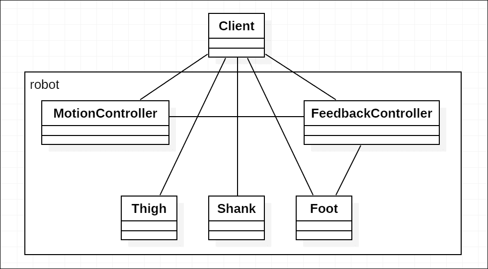

# 第四章 结构型设计模式

当创建型模式在灵活创建对象方面发挥作用时，结构型模式另一方面则是关于对象组合的模式。在本章中，我们将讨论适合不同场景的结构型模式。

如果我们仔细观察结构型模式，它们可以分为 *结构型类模式* 和 *结构型对象模式*。结构型类模式是与“相关方”本身玩弄的模式，而结构型对象模式则是将碎片编织在一起的模式（如组合模式）。这两种结构型模式在一定程度上相互补充。

本章我们将探讨以下模式：

+   **组合**：使用原始和组合对象构建树状结构。一个很好的例子就是构成完整页面的 DOM 树。

+   **装饰器**：动态地为类或对象添加功能。

+   **适配器**：提供了一个通用接口，并通过实现不同的具体适配器与不同的适配器协同工作。例如，可以考虑为单一的内容管理系统提供不同的数据库选择。

+   **桥接**：将抽象与其实现解耦，并使两者可互换。

+   **外观**：为复杂子系统的组合提供了一个简化的接口。

+   **享元**：共享被多次使用的无状态对象，以提高内存效率和性能。

+   **代理**：作为代理，在访问它管理的对象时承担额外的责任。

# 组合模式

同一类的对象可能因其属性或甚至特定的子类而有所不同，但一个复杂对象可能不仅仅有普通属性。以 DOM 元素为例，所有元素都是 `Node` 类的实例。这些节点形成树结构来表示不同的页面，但与根节点相比，这些树中的每个节点都是完整且统一的：

```js
<html> 
  <head> 
    <title>TypeScript</title> 
  </head> 
  <body> 
    <h1>TypeScript</h1> 
     
  </body> 
</html> 

```

前面的 HTML 表示一个 DOM 结构，如下所示：


所有的前面对象都是 `Node` 的实例，它们实现了组合模式中 *组件* 的接口。其中一些节点（如本例中的 HTML 元素，除了 `HTMLImageElement`）有子节点（组件），而其他则没有。

## 参与者

组合模式实现的参与者包括：

+   **组件**：`节点`

    定义接口并为组合对象实现默认行为。它还应包括访问和管理实例子组件的接口，以及可选的对其父组件的引用。

+   **组合**：包括一些 HTML 元素，如 `HTMLHeadElement` 和 `HTMLBodyElement`

    存储子组件并实现相关操作，当然也包括其自身的行为。

+   **叶节点**：`TextNode`，`HTMLImageElement`

    定义原始组件的行为。

+   **客户端**：

    操作组合及其组件。

## 模式范围

当对象可以并且应该递归地作为形成树结构的组件进行抽象时，适用组合模式。通常，当需要形成某种结构作为树时，这会是一个自然的选择，例如视图组件的树、抽象语法树或表示文件结构的树。

## 实现

我们将创建一个表示简单文件结构并具有有限组件类型的组合体。

首先，让我们导入相关的节点模块：

```js
import * as Path from 'path'; 
import * as FS from 'fs'; 

```

### 注意

模块 `path` 和 `fs` 是 Node.js 的内置模块，请参阅 Node.js 文档以获取更多信息：[`nodejs.org/api/`](https://nodejs.org/api/).

### 注意

我个人的偏好是，如果命名空间（同时不是函数）的首字母大写，这可以减少与局部变量的冲突机会。但 JavaScript 中命名空间的一种更流行的命名风格并不这样做。

现在，我们需要对组件进行抽象，比如 `FileSystemObject`：

```js
abstract class FileSystemObject { 
  constructor( 
    public path: string, 
    public parent?: FileSystemObject 
  ) { } 

  get basename(): string { 
    return Path.basename(this.path); 
  } 
} 

```

我们使用 `抽象类`，因为我们不期望直接使用 `FileSystemObject`。定义了一个可选的 `parent` 属性，以便我们可以访问特定对象的上级组件。还添加了 `basename` 属性，作为获取路径基本名的辅助工具。

`FileSystemObject` 预期应该有子类，即 `FolderObject` 和 `FileObject`。对于 `FolderObject`，它是一个可能包含其他文件夹和文件的组合体，我们将添加一个 `items` 属性（获取器），它返回它包含的其他 `FileSystemObject`：

```js
class FolderObject extends FileSystemObject { 
  items: FileSystemObject[]; 

  constructor(path: string, parent?: FileSystemObject) { 
    super(path, parent); 
  } 
} 

```

我们可以在 `constructor` 中初始化 `items` 属性，以实际存在于给定 `path` 的文件和文件夹：

```js
this.items = FS 
  .readdirSync(this.path) 
  .map(path => { 
    let stats = FS.statSync(path); 

    if (stats.isFile()) { 
      return new FileObject(path, this); 
    } else if (stats.isDirectory()) { 
      return new FolderObject(path, this); 
    } else { 
      throw new Error('Not supported');
    } 
  }); 

```

你可能已经注意到我们正在使用不同类型的对象来形成 `items`，同时我们也在将 `this` 作为新创建的子组件的 `parent` 传递。

对于 `FileObject`，我们将添加一个简单的 `readAll` 方法，该方法读取文件的所有字节：

```js
class FileObject extends FileSystemObject { 
  readAll(): Buffer { 
    return FS.readFileSync(this.path); 
  } 
} 

```

目前，当文件夹对象被初始化时，我们从实际的文件系统中读取文件夹内的子项。如果我们希望按需访问此结构，这可能不是必要的。我们实际上可以创建一个获取器，仅在访问时调用 `readdir`，这样对象就会像真实文件系统的代理一样操作。

## 后果

组合模式中的原始对象和组合对象都共享组件接口，这使得开发者可以更容易地使用较少要记住的事物构建组合结构。

它还使得使用像 XML 和 HTML 这样的标记语言来表示极其复杂的对象成为可能，具有极大的灵活性。组合模式还可以通过递归渲染组件来简化渲染。

由于大多数组件都兼容拥有子组件或成为其父组件的子组件，我们可以轻松地创建与现有组件配合得很好的新组件。

# 装饰器模式

装饰器模式可以动态地向对象添加新功能，通常不会损害原始功能。装饰器模式中的“装饰器”一词与 ES-next 装饰器语法中的“装饰器”一词确实有一些相似之处，但它们并不完全相同。作为短语，经典的装饰器模式差异更大。

经典的装饰器模式与组合一起工作，简而言之，就是创建作为装饰工作的组件的装饰器。由于组合对象通常递归处理，装饰器组件会自动处理。因此，您可以选择它要做什么。

继承层次结构可能如下所示的结构：


装饰器是递归应用的，如下所示：


装饰器正确工作有两个先决条件：装饰器所装饰的上下文或对象的认识，以及应用装饰器的能力。组合模式可以轻松创建满足这两个先决条件的结构：

+   装饰器知道它装饰的内容，作为 `component` 属性

+   装饰器在递归渲染时应用

然而，实际上并不需要采用组合结构来在 JavaScript 中获得装饰器模式的好处。由于 JavaScript 是一种动态语言，如果您能调用装饰器，您就可以向对象添加任何您想要的内容。

以 `console` 对象下的 `log` 方法为例，如果我们想在每次日志前添加时间戳，我们可以简单地用带有时间戳前缀的包装器替换 `log` 函数：

```js
const _log = console.log; 
console.log = function () { 
  let timestamp = `[${new Date().toTimeString()}]`;
  return _log.apply(this, [timestamp, ...arguments]);
}; 

```

当然，这个例子与经典的装饰器模式关系不大，但它为在 JavaScript 中实现这种模式提供了一种不同的方法。特别是借助新的装饰器语法：

```js
class Target { 
  @decorator 
  method() { 
    // ... 
  } 
} 

```

### 注意

TypeScript 提供了装饰器语法转换作为一项实验性功能。要了解更多关于装饰器语法的知识，请查看以下链接：[`www.typescriptlang.org/docs/handbook/decorators.html`](http://www.typescriptlang.org/docs/handbook/decorators.html)。

## 参与者

经典装饰器模式实现的参与者包括：

+   **组件**：`UIComponent`

    定义可以装饰的对象的接口。

+   **具体组件**：`TextComponent`

    定义具体组件的附加功能。

+   **装饰器**：`Decorator`

    定义对要装饰的组件的引用，并管理上下文。使组件符合适当的接口和行为。

+   **具体装饰器**：`ColorDecorator`, `FontDecorator`

    定义额外的功能，并在必要时暴露 API。

## 模式范围

装饰器模式通常关注对象，但由于 JavaScript 是基于原型的，装饰器可以通过它们的原型很好地与对象的类一起工作。

装饰器模式的经典实现可能与其他我们稍后将要讨论的模式有很多共同之处，而函数式装饰器似乎共享较少。

## 实现

在这部分，我们将讨论装饰器模式的两种实现。第一个将是经典的装饰器模式，通过包装符合 `UIComponent` 接口的新类来装饰目标。第二个将是使用新装饰器语法编写的装饰器，它处理目标对象。

### 经典装饰器

让我们从定义要装饰的对象的轮廓开始。首先，我们将 `UIComponent` 定义为一个抽象类，定义其抽象函数 `draw`：

```js
abstract class UIComponent { 
  abstract draw(): void; 
} 

```

然后是一个扩展了 `UIComponent` 的 `TextComponent`，以及其文本内容为 `Text` 类：

```js
class Text { 
  content: string; 

  setColor(color: string): void { } 
  setFont(font: string): void { } 

  draw(): void { } 
} 

class TextComponent extends UIComponent { 
  texts: Text[]; 

  draw(): void { 
    for (let text of this.texts) { 
      text.draw(); 
    } 
  } 
} 

```

接下来要定义装饰器的接口，以便装饰 `TextComponent` 类的实例对象：

```js
class Decorator extends UIComponent { 
  constructor( 
    public component: TextComponent 
  ) { 
    super(); 
  } 

  get texts(): Text[] { 
    return this.component.texts; 
  } 

  draw(): void { 
    this.component.draw(); 
  } 
} 

```

现在我们已经有了具体的装饰器。在这个例子中，`ColorDecorator` 和 `FontDecorator` 看起来很相似：

```js
class ColorDecorator extends Decorator { 
  constructor( 
    component: TextComponent, 
    public color: string 
  ) { 
    super(component); 
  } 

  draw(): void { 
    for (let text of this.texts) { 
      text.setColor(this.color); 
    } 

    super.draw(); 
  } 
} 

class FontDecorator extends Decorator { 
  constructor( 
    component: TextComponent, 
    public font: string 
  ) { 
    super(component); 
  } 

  draw(): void { 
    for (let text of this.texts) { 
      text.setFont(this.font); 
    } 

    super.draw(); 
  } 
} 

```

### 注意

在上述实现中，`draw` 方法中的 `this.texts` 调用了在 `Decorator` 类上定义的 getter。在这个上下文中，`this` 理想情况下应该是 `ColorDecorator` 或 `FontDecorator` 的实例；它访问的 `texts` 最终将是其 `component` 属性中的数组。

### 注意

如果我们有嵌套装饰器，这可能会更有趣或更令人困惑。如果你后来感到困惑，试着画一个示意图。

现在是真正组装它们的时候了：

```js
let decoratedComponent = new ColorDecorator( 
  new FontDecorator( 
    new TextComponent(), 
    'sans-serif' 
  ), 
  'black' 
); 

```

在这个例子中，装饰器的嵌套顺序并不重要。因为无论是 `ColorDecorator` 还是 `FontDecorator` 都是一个有效的 `UIComponent`，它们可以很容易地插入并替换之前的 `TextComponent`。

### 使用 ES-next 语法装饰器

经典装饰器模式有一个限制，可以通过装饰的嵌套形式直接指出。这也适用于 ES-next 装饰器。看看下面的例子：

```js
class Foo { 
  @prefix 
  @suffix 
  getContent(): string { 
    return '...'; 
  } 
} 

```

### 小贴士

`@` 字符后面的表达式评估为装饰器。虽然装饰器是一个处理目标对象的函数，但我们通常使用高阶函数来参数化装饰器。

现在我们有两个装饰器 `prefix` 和 `suffix` 装饰了 `getContent` 方法。乍一看，它们似乎是平行的，但如果我们打算在返回的内容上添加前缀和后缀，就像名字所暗示的那样，这个过程实际上将是递归的，而不是像经典实现那样平行。

为了让装饰器像我们预期的那样与其他元素协作，我们需要小心处理：

```js
function prefix( 
  target: Object, 
  name: string, 
  descriptor: PropertyDescriptor 
): PropertyDescriptor { 
  let method = descriptor.value as Function; 

  if (typeof method !== 'function') { 
    throw new Error('Expecting decorating a method'); 
  } 

  return { 
    value: function () { 
      return '[prefix] ' + method.apply(this, arguments); 
    }, 
    enumerable: descriptor.enumerable, 
    configurable: descriptor.configurable, 
    writable: descriptor.writable 
  }; 
} 

```

### 注意

在当前的 ECMAScript 装饰器提案中，当装饰一个方法或属性（通常使用 getter 或 setter）时，你会接收到一个作为属性描述符的第三个参数。

### 注意

想了解更多关于属性描述符的信息，请查看以下链接：[`developer.mozilla.org/en-US/docs/Web/JavaScript/Reference/Global_Objects/Object/defineProperty`](https://developer.mozilla.org/en-US/docs/Web/JavaScript/Reference/Global_Objects/Object/defineProperty)。

`suffix` 装饰器将与 `prefix` 装饰器类似。所以我会在这里保存代码行。

## 后果

装饰器模式的关键是能够动态地添加功能，并且通常期望装饰器之间能够友好地协同工作。装饰器模式的这些期望使其能够非常灵活地形成定制对象。然而，对于某些类型的装饰器来说，实际上要很好地协同工作可能会有困难。

考虑用多个装饰器装饰一个对象，就像实现示例的第二部分，装饰顺序是否重要？或者装饰顺序应该重要吗？

一个正确编写的装饰器应该始终能够工作，无论它在装饰器列表中的位置如何。通常，*更受欢迎*的是，装饰的目标在装饰器以不同顺序装饰时几乎表现出相同的行为。

# 适配器模式

适配器模式将现有的类或对象与另一个现有的客户端连接。它使得原本设计不兼容的类能够相互协作。

适配器可以是 *类* 适配器或 *对象* 适配器。类适配器扩展了适配者类，并公开了与客户端一起工作的额外 API。另一方面，对象适配器不扩展适配者类。相反，它将适配者存储为依赖项。

类适配器在需要访问适配者类的受保护方法或属性时很有用。然而，在 JavaScript 世界中，它也有一些限制：

+   适配者类需要可扩展性

+   如果客户端目标是除了纯接口之外的抽象类，没有使用 *mixin*，你不能使用相同的适配器类扩展适配者和客户端目标。

+   一个具有两组方法和属性的单一类可能会让人感到困惑

由于这些限制，我们将更多地讨论对象适配器。以浏览器端存储为例，我们假设我们有一个与具有正确签名（例如，通过 AJAX 在线存储数据的存储）的存储对象一起工作的客户端。现在我们希望客户端能够与 IndexedDB 协作以实现更快的响应和离线使用；我们需要为 IndexedDB 创建一个适配器来获取和设置数据：


我们将使用 Promise 来接收异步操作的结果或错误。如果您还不熟悉 Promise，请查看以下链接以获取更多信息：[`developer.mozilla.org/en-US/docs/Web/JavaScript/Reference/Global_Objects/Promise`](https://developer.mozilla.org/en-US/docs/Web/JavaScript/Reference/Global_Objects/Promise)。

## 参与者

参与者包括：

+   **目标**：`Storage`

    定义与客户端一起工作的现有目标接口

+   **适配器**：`IndexedDB`

    未设计成与客户端一起工作的实现

+   **适配器**：`IndexedDBStorage`

    符合目标接口并与适配器交互

+   **客户端**

    操作目标

## 模式范围

当现有的客户端类没有设计成与现有的适配器一起工作时，可以应用适配器模式。它专注于应用不同客户端和适配器组合时的独特 *适配器* 部分。

## 实现

从 `Storage` 接口开始：

```js
interface Storage { 
  get<T>(key: string): Promise<T>; 
  set<T>(key: string, value: T): Promise<void>; 
} 

```

### 注意

我们使用泛型定义了 `get` 方法，这样如果我们既没有指定泛型，也没有将返回的 Promise 的值类型进行类型转换，那么值的类型将是 `{}`。这可能会在类型检查后失败。

在 MDN 上找到的示例的帮助下，我们现在可以设置 IndexedDB 适配器。访问 `IndexedDBStorage`：[`developer.mozilla.org/en-US/docs/Web/API/IndexedDB_API/Using_IndexedDB`](https://developer.mozilla.org/en-US/docs/Web/API/IndexedDB_API/Using_IndexedDB)。

IndexedDB 实例的创建是异步的。我们可以将打开操作放在 `get` 或 `set` 方法中，这样数据库就可以按需打开。但为了简化，让我们创建一个 `IndexedDBStorage` 实例，它已经有一个打开的数据库实例。

然而，构造函数通常没有异步代码。即使它们有，也不能在完成构造之前对实例应用更改。幸运的是，工厂方法模式与异步初始化配合得很好：

```js
class IndexedDBStorage implements Storage { 
  constructor( 
    public db: IDBDatabase, 
    public storeName = 'default' 
  ) { } 

  open(name: string): Promise<IndexedDBStorage> { 
    return new Promise<IndexedDBStorage>( 
      (resolve, reject) => { 
      let request = indexedDB.open(name); 

      // ... 
    }); 
  } 
} 

```

在 `open` 方法的 Promise 解析器内部，我们将完成异步工作：

```js
let request = indexedDB.open(name); 

request.onsuccess = event => { 
  let db = request.result as IDBDatabase; 
  let storage = new IndexedDBStorage(db); 
  resolve(storage); 
}; 

request.onerror = event => { 
  reject(request.error); 
}; 

```

现在我们访问 `IndexedDBStorage` 的实例时，可以假设它有一个已打开的数据库并且准备好进行查询。要更改或从数据库获取值，我们需要创建一个事务。以下是方法：

```js
get<T>(key: string): Promise<T> { 
  return new Promise<T>((resolve, reject) => { 
    let transaction = this.db.transaction(this.storeName); 
    let store = transaction.objectStore(this.storeName); 

    let request = store.get(key); 

    request.onsuccess = event => { 
      resolve(request.result); 
    }; 

    request.onerror = event => { 
      reject(request.error); 
    }; 
  }); 
} 

```

方法 `set` 类似。但默认情况下，事务是只读的，我们需要明确指定 `'readwrite'` 模式。

```js
set<T>(key: string, value: T): Promise<void> { 
  return new Promise<void>((resolve, reject) => { 
    let transaction = 
      this.db.transaction(this.storeName, 'readwrite'); 
    let store = transaction.objectStore(this.storeName); 

    let request = store.put(value, key); 

    request.onsuccess = event => { 
      resolve(); 
    }; 

    request.onerror = event => { 
      reject(request.error); 
    }; 
  }); 
} 

```

现在我们可以有一个可以替换之前客户端使用的存储。

## 后果

通过应用适配器模式，我们可以填补原本无法协同工作的类之间的差距。在这种情况下，适配器模式是一个相当直接且容易想到的解决方案。

但在其他场景中，如 IDE 扩展的调试 *适配器*，适配器模式的具体实现可能更具挑战性。

# 桥接模式

桥接模式将客户端操作的抽象与功能实现解耦，并使得添加或替换这些抽象和实现变得容易。

以一组 *跨 API* UI 元素为例：


我们有一个名为`UIElement`的抽象，它可以访问`UIToolkit`的不同实现，以便基于 SVG 或画布创建不同的 UI。在前面的结构中，*桥接*是`UIElement`和`UIToolkit`之间的连接。

## 参与者

桥接模式的参与者包括：

+   **抽象**：`UIElement`

    定义客户端将要操作的对象的接口，并存储对其实现者的引用。

+   **精细抽象**：`TextElement`，`ImageElement`

    扩展抽象以包含特定的行为。

+   **实现者**：`UIToolkit`

    定义了一个通用实现者的接口，该接口最终将执行在抽象中定义的操作。实现者通常只关心基本操作，而抽象将处理高级操作。

+   **具体实现者**：`SVGToolkit`，`CanvasToolkit`

    实现实现者接口并操作低级 API。

## 模式范围

尽管抽象和实现者解耦使桥接模式能够与多个抽象和实现者一起工作，但大多数情况下，桥接模式只与单个实现者一起工作。

如果你仔细观察，你会发现桥接模式与适配器模式极为相似。然而，适配器模式试图使现有类协作并专注于适配器部分，而桥接模式则预见到了差异，并为扮演适配器角色的抽象提供了一个深思熟虑且通用的接口。

## 实现

在我们讨论的示例中，一个有效实现可能并不简单。但我们仍然可以轻松地勾勒出其骨架。

从与桥接概念直接相关的实现者`UIToolkit`和抽象`UIElement`开始：

```js
interface UIToolkit { 
  drawBorder(): void; 
  drawImage(src: string): void; 
  drawText(text: string): void; 
} 

abstract class UIElement { 
  constructor( 
    public toolkit: UIToolkit 
  ) { } 

  abstract render(): void; 
} 

```

现在我们可以扩展`UIElement`以获得具有不同行为的精细抽象。首先是`TextElement`类：

```js
class TextElement extends UIElement { 
  constructor( 
    public text: string, 
    toolkit: UIToolkit 
  ) { 
    super(toolkit); 
  } 

  render(): void { 
    this.toolkit.drawText(this.text); 
  } 
} 

```

以及具有类似代码的`ImageElement`类：

```js
class ImageElement extends UIElement { 
  constructor( 
    public src: string, 
    toolkit: UIToolkit 
  ) { 
    super(toolkit); 
  } 

  render(): void { 
    this.toolkit.drawImage(this.src); 
  } 
} 

```

通过创建具体的`UIToolkit`子类，我们可以设法与客户端一起管理所有内容。但是，由于这可能导致我们现在不想接触的繁重工作，我们将通过在这个示例中使用指向`undefined`的变量来跳过它：

```js
let toolkit: UIToolkit; 

let imageElement = new ImageElement('foo.jpg', toolkit); 
let textElement = new TextElement('bar', toolkit); 

imageElement.render(); 
textElement.render(); 

```

在现实世界中，渲染部分也可能是一项繁重的工作。但由于它是在相对较高层次上编写的，它以不同的方式折磨你。

## 后果

尽管在上面的示例中抽象（`UIElement`）和适配器接口（`Storage`）的名称完全不同，但在静态组合中它们扮演着相似的角色。

然而，正如我们在模式范围部分提到的，桥接模式和适配器模式的目的不同。

通过解耦抽象和实现者，桥接模式为系统带来了极大的可扩展性。客户端不需要了解实现细节，这有助于构建更稳定的系统，因为它形成了一个更健康的依赖结构。

另一个桥接模式可能带来的好处是，通过正确配置的构建过程，它可以在对精炼抽象或具体实现者进行更改时减少编译时间，因为编译器不需要知道桥的另一端的信息。

# 外观模式

外观模式组织子系统并提供统一的更高层接口。一个可能您熟悉的例子是模块化系统。在 JavaScript（当然也包括 TypeScript）中，人们使用模块来组织代码。模块化系统使得项目更容易维护，因为一个干净的项目结构可以帮助揭示项目不同部分之间的相互联系。

一个项目被其他项目引用是很常见的，但显然引用其他项目的项目并不关心也不应该关心其依赖项的内部结构。因此，可以引入一个外观为依赖项目提供一个更高层的 API 并暴露对其依赖项真正重要的内容。

以机器人为例。构建机器人和其组件的人需要分别控制每个部分并让它们同时协作。然而，想要使用这个机器人的人只需要发送简单的命令，比如“行走”和“跳跃”。

为了最灵活的使用，机器人“SDK”可以提供诸如`MotionController`、`FeedbackController`、`Thigh`、`Shank`、`Foot`等类。可能如下图所示：



但当然，大多数想要控制或编程这个机器人的人并不想了解这么多细节。他们真正想要的不是一个包含所有功能的复杂工具箱，而是一个能够遵循他们命令的完整机器人。因此，机器人“SDK”实际上可以提供一个控制内部组件并暴露更简单 API 的外观：


不幸的是，外观模式给我们留下了一个如何设计外观 API 和子系统的开放问题。正确回答这个问题并不容易。

## 参与者

当涉及到它们的类别时，外观模式的参与者相对简单：

+   **外观**：`Robot`

    定义一组更高层的接口，并使子系统协作。

+   **子系统**：`MotionController`、`FeedbackController`、`Thigh`、`Shank`和`Foot`

    实现它们自己的功能，并在必要时与其他子系统进行内部通信。子系统是外观的依赖项，它们不依赖于外观。

## 模式范围

外观通常充当连接更高层系统和其子系统的枢纽。外观模式的关键在于在依赖项应该或不应该关心的依赖项之间划一条线。

## 实现

考虑放置一个具有左右腿的机器人，我们实际上可以添加一个名为 `Leg` 的另一个抽象层来管理 `Thigh`、`Shank` 和 `Foot`。如果我们打算将运动和反馈控制器分别分配给不同的腿，我们也可以将这两个添加到 `Leg` 中：

```js
class Leg { 
  thigh: Thigh; 
  shank: Shank; 
  foot: Foot; 

  motionController: MotionController; 
  feedbackController: FeedbackController; 
} 

```

在我们向 `Leg` 添加更多细节之前，让我们首先定义 `MotionController` 和 `FeedbackController`。

`MotionController` 应该根据一个值或一组值来控制整个腿。在这里，我们将其简化为一个角度，以免被这个不可能的机器人分散注意力：

```js
class MotionController { 
  constructor( 
    public leg: Leg 
  ) { } 

  setAngle(angle: number): void { 
    let { 
      thigh, 
      shank, 
      foot 
    } = this.leg; 

    // ... 
  } 
} 

```

`FeedbackController` 应该是一个 `EventEmitter` 的实例，用于报告状态变化或有用的事件：

```js
import { EventEmitter } from 'events'; 

class FeedbackController extends EventEmitter { 
  constructor( 
    public foot: Foot 
  ) { 
    super(); 
  } 
} 

```

现在，我们可以使 `Leg` 类相对完整：

```js
class Leg { 
  thigh = new Thigh(); 
  shank = new Shank(); 
  foot = new Foot(); 

  motionController: MotionController; 
  feedbackController: FeedbackController; 

  constructor() { 
    this.motionController = 
      new MotionController(this); 
    this.feedbackController = 
      new FeedbackController(this.foot); 

    this.feedbackController.on('touch', () => { 
      // ... 
    }); 
  } 
} 

```

让我们把两条腿放在一起来勾勒出机器人的骨骼：

```js
class Robot { 
  leftLegMotion: MotionController; 
  rightLegMotion: MotionController; 

  leftFootFeedback: FeedbackController; 
  rightFootFeedback: FeedbackController; 

  walk(steps: number): void { } 
  jump(strength: number): void { } 
} 

```

我省略了 `Thigh`、`Shank` 和 `Foot` 类的定义，因为我们实际上不会让机器人行走。现在，对于只想通过简单的 API 让机器人行走或跳跃的用户，他们可以通过具有所有连接的 `Robot` 对象来实现。

## 后果

Façade 模式松散了客户端和子系统之间的耦合。尽管它并没有完全解耦它们，因为你可能仍然需要与子系统定义的对象一起工作。

Façade 模式通常将客户端的操作转发到适当的子系统，甚至进行大量工作以使它们协同工作。

在 Façade 模式的帮助下，系统和系统内部的关系和结构可以保持清晰和直观。

# Flyweight 模式

Flyweight 模式中的轻量级对象是一个无状态对象，它可以被多次共享于对象或类之间。显然，这表明 Flyweight 模式是一种关于内存效率的模式，也许如果对象的构建成本高昂，它还可能影响性能。

以绘制雪花为例。尽管真实的雪花各不相同，但当我们试图将它们绘制到画布上时，我们通常只有有限数量的样式。然而，通过添加诸如大小和变换等属性，我们可以使用有限的雪花样式创建一个美丽的雪景。

由于轻量级对象是无状态的，理想情况下它允许同时进行多个操作。当处理多线程内容时，你可能需要小心。幸运的是，JavaScript 通常单线程，并且如果所有相关代码都是同步的，它将避免这个问题。如果你的代码是异步的，你仍然需要在详细场景中小心处理。

假设我们有一些 `Snowflake` 类的轻量级对象：


当下雪时，它看起来会是这样：


在上面的图片中，不同风格的雪花是使用不同属性渲染的结果。

我们通常会有样式和图像资源被动态加载，因此我们可以使用 `FlyweightFactory` 来创建和管理轻量级对象。

## 参与者

Flyweight 模式最简单的实现有以下参与者：

+   **F****lyweight**：`Snowflake`

    定义 flyweight 对象的类。

+   **Flyweight factory**：`FlyweightFactory`

    创建和管理 flyweight 对象。

+   **客户端**。

    存储目标的状态并使用 flyweight 对象来操作这些目标。

在这些参与者中，我们假设可以通过具有不同状态的 flyweight 来完成操作。有时，拥有允许自定义行为的`具体 flyweight`类也会很有帮助。

## 模式范围

Flyweight 模式是提高内存效率和性能努力的成果。实现关注实例的无状态性，通常客户端负责管理不同目标的具体状态。

## 实现

在雪花示例中，使 Flyweight 模式有用的原因是具有相同风格的雪花通常共享相同的图像。图像是消耗加载时间和占用显著内存的部分。

我们从一个假的`Image`类开始，它假装加载图像：

```js
class Image { 
  constructor(url: string) { } 
} 

```

在我们的例子中，`Snowflake`类只有一个`image`属性，这是一个将被许多要绘制的雪花共享的属性。由于实例现在是无状态的，需要从上下文中获取参数进行渲染：

```js
class Snowflake { 
  image: Image; 

  constructor( 
    public style: string 
  ) { 
    let url = style + '.png'; 
    this.image = new Image(url); 
  } 

  render(x: number, y: number, angle: number): void { 
    // ... 
  } 
} 

```

为了便于访问，flyweights 由一个工厂管理。我们将有一个`SnowflakeFactory`，它缓存了具有特定风格的创建的雪花对象：

```js
const hasOwnProperty = Object.prototype.hasOwnProperty; 

class SnowflakeFactory { 
  cache: { 
    [style: string]: Snowflake; 
  } = {}; 

  get(style: string): Snowflake { 
    let cache = this.cache; 
    let snowflake: Snowflake; 

    if (hasOwnProperty.call(cache, style)) { 
      snowflake = cache[style]; 
    } else { 
      snowflake = new Snowflake(style); 
      cache[style] = snowflake; 
    } 

    return snowflake; 
  } 
} 

```

准备好构建块后，我们将实现客户端（`Sky`），它将下雪：

```js
const SNOW_STYLES = ['A', 'B', 'C']; 

class Sky { 
  constructor( 
    public width: number, 
    public height: number 
  ) { } 

  snow(factory: SnowflakeFactory, count: number) { } 
} 

```

我们将用随机位置的随机雪花填充天空。在此之前，让我们创建一个辅助函数，该函数生成一个介于 0 和最大值之间的数字：

```js
function getRandomInteger(max: number): number { 
  return Math.floor(Math.random() * max); 
} 

```

然后完成`Sky`的`snow`方法：

```js
snow(factory: SnowflakeFactory, count: number) { 
    let stylesCount = SNOW_STYLES.length; 

    for (let i = 0; i < count; i++) { 
        let style = SNOW_STYLES[getRandomInteger(stylesCount)]; 
        let snowflake = factory.get(style); 

        let x = getRandomInteger(this.width); 
        let y = getRandomInteger(this.height); 

        let angle = getRandomInteger(60); 

        snowflake.render(x, y, angle); 
    } } 

```

现在我们可能在天空中有成千上万的雪花，但只创建了三个`Snowflake`实例。你可以通过存储雪花的状态并动画化下雪来继续这个例子。

## 后果

Flyweight 模式减少了系统中涉及的对象总数。作为直接结果，它可能节省相当多的内存。当 flyweights 被处理大量目标的客户端使用时，这种节省变得更加显著。

Flyweight 模式也将额外的逻辑引入到系统中。何时使用或何时不使用此模式，从这个角度来看，又是开发效率与运行时效率之间的一种平衡游戏。尽管大多数时候，如果没有充分的理由，我们会选择开发效率。

# 代理模式

代理模式适用于程序需要了解或干预访问对象的行为时。代理模式有几个详细场景，我们可以通过它们的不同目的来区分这些场景：

+   **远程代理**：具有操作远程对象接口的代理，例如远程服务器上的数据项

+   **虚拟代理**：一种管理需要按需加载的昂贵对象的代理

+   **保护代理**: 控制对目标对象访问的代理，通常它验证权限并验证值

+   **智能代理**: 在访问目标对象时执行额外操作的代理

在适配器模式的部分，我们使用了工厂方法 `open`，该方法异步创建对象。作为权衡，我们必须让客户端在对象创建之前等待。

使用代理模式，我们现在可以按需打开数据库并同步创建存储实例。


### 注意

代理通常用于具有已知方法和属性的单一对象或对象。但是，通过 ES6 提供的新的 `Proxy` API，我们可以通过了解正在访问哪些方法或属性来执行更有趣的操作。请参阅以下链接获取更多信息：[`developer.mozilla.org/en-US/docs/Web/JavaScript/Reference/Global_Objects/Proxy`](https://developer.mozilla.org/en-US/docs/Web/JavaScript/Reference/Global_Objects/Proxy)。

## 参与者

代理模式的参与者包括：

+   **代理**: `IndexedDB` Storage

    定义接口并实现操作以管理对主题的访问。

+   **主题**: `IndexedDB`

    要由代理访问的主题。

+   **客户端**: 通过代理访问主题。

## 模式范围

尽管与适配器模式具有相似的结构，但代理模式的关键在于干预对目标对象的访问，而不是适配不兼容的接口。有时它可能会改变特定方法的结果或某些属性的值，但这可能是为了回退或异常处理目的。

## 实现

与纯适配器模式的示例相比，在这个实现中我们将有两个不同之处。首先，我们将使用构造函数创建 `IndexedDBStorage` 实例，并在需要时打开数据库。其次，我们将为 `get` 和 `set` 方法添加一个无用的权限检查。

现在我们调用 `get` 或 `set` 方法时，数据库可能已经打开，也可能没有。Promise 是表示可能悬而未决或已解决的值的绝佳选择。考虑以下示例：

```js
let ready = new Promise<string>(resolve => { 
  setTimeout(() => { 
    resolve('biu~'); 
  }, Math.random() * 1000); 
}); 

setTimeout(() => { 
  ready.then(text => { 
    console.log(text); 
  }); 
}, 999); 

```

当第二次超时触发时，很难判断 Promise `ready` 是否已解决。但整体行为很容易预测：它将在大约 1 秒后记录 `'biu~'` 文本。通过将 Promise 变量 `ready` 替换为方法或 getter，它将能够在需要时才开始异步操作。

因此，让我们从创建数据库打开 Promise 的 getter 开始重构 `IndexedDBStorage` 类：

```js
private dbPromise: Promise<IDBDatabase>; 

constructor( 
  public name: string, 
  public storeName = 'default' 
) { } 

private get dbReady(): Promise<IDBDatabase> { 
  if (!this.dbPromise) { 
    this.dbPromise = 
      new Promise<IDBDatabase>((resolve, reject) => { 
      let request = indexedDB.open(name); 

      request.onsuccess = event => { 
        resolve(request.result); 
      }; 

      request.onerror = event => { 
        reject(request.error); 
      }; 
    }); 
  } 

  return this.dbPromise; 
} 

```

现在第一次我们访问属性 `dbReady`，它将打开数据库并创建一个 Promise，该 Promise 将在数据库打开时得到解决。为了使 `get` 和 `set` 方法能够正常工作，我们只需要将我们已实现的内容包装在一个 `then` 方法中，该方法跟随 `dbReady` Promise。

首先针对 `get` 方法：

```js
get<T>(key: string): Promise<T> { 
  return this 
    .dbReady 
    .then(db => new Promise<T>((resolve, reject) => { 
      let transaction = db.transaction(this.storeName); 
      let store = transaction.objectStore(this.storeName); 

      let request = store.get(key); 

      request.onsuccess = event => { 
        resolve(request.result); 
      }; 

      request.onerror = event => { 
        reject(request.error); 
      }; 
    })); 
} 

```

紧接着是更新后的 `set` 方法：

```js
set<T>(key: string, value: T): Promise<void> { 
  return this 
    .dbReady 
    .then(db => new Promise<void>((resolve, reject) => { 
      let transaction = db
         .transaction(this.storeName, 'readwrite'); 
      let store = transaction.objectStore(this.storeName); 

      let request = store.put(value, key); 

      request.onsuccess = event => { 
        resolve(); 
      }; 

      request.onerror = event => { 
        reject(request.error); 
      }; 
    })); 
} 

```

现在我们终于有了`IndexedDBStorage`属性，它可以真正地替换支持该接口的客户端。我们还将添加一个简单的权限检查，使用一个描述读和写权限的普通对象：

```js
interface Permission { 
  write: boolean; 
  read: boolean; 
} 

```

然后，我们将分别对`get`和`set`方法添加权限检查：

```js
get<T>(key: string): Promise<T> { 
  if (!this.permission.read) { 
    return Promise.reject<T>(new Error('Permission denied')); 
  } 

  // ... 
} 

set<T>(key: string, value: T): Promise<void> { 
  if (!this.permission.write) { 
    return Promise.reject(new Error('Permission denied')); 
  } 

  // ... 
} 

```

当你思考权限检查部分时，可能会回想起装饰者模式，装饰者可以用来简化所写的代码。尝试使用装饰器语法自己实现这个权限检查。

## 后果

代理模式的实现通常可以被视为对特定对象或目标的操作封装。这种封装很容易增加，而不会给客户端带来额外的负担。

例如，一个工作的在线数据库代理可以做的不仅仅是充当一个普通的代理。它可能本地缓存数据和更改，或者在客户端不知情的情况下按计划同步。

# 摘要

在本章中，我们学习了结构型设计模式，包括组合、装饰者、适配器、桥接、外观、享元和代理。再次我们发现这些模式之间高度相关，甚至在某种程度上相似。

例如，我们将组合模式与装饰者模式混合，适配器模式与代理模式结合，比较了适配器模式和桥接模式。在探索的过程中，我们有时会发现，如果我们考虑到编写**更好的代码**，我们的代码最终以我们所列出的类似模式结束，这仅仅是一个自然的结果。

以适配器模式和桥接模式为例，当我们试图使两个类合作时，会出现适配器模式；当我们计划提前连接不同的类时，就会使用桥接模式。尽管这些模式之间没有实际的线条，但模式背后的技术通常是有用的。

在下一章中，我们将讨论行为模式，这些模式有助于形成算法和分配责任。
