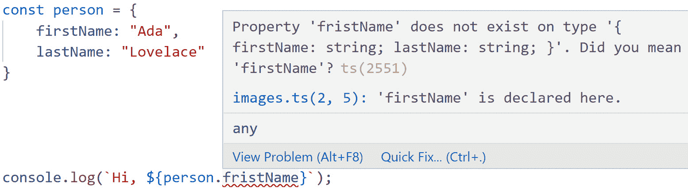
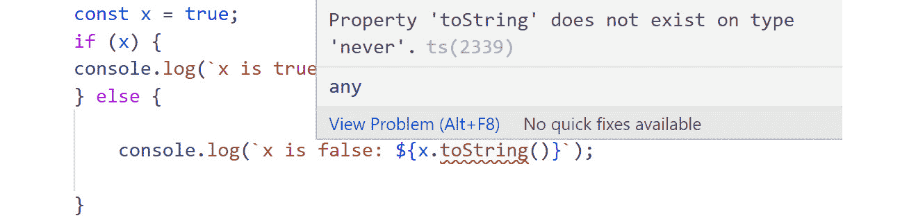

# 1. TypeScript 基础知识

概述

在本章中，我们将简要说明 JavaScript 开发环境中存在的问题，并确切了解 TypeScript 是如何帮助我们编写更好、更易于维护的代码的。本章将首先帮助你设置 TypeScript 编译器，然后教授基础知识。此外，我们将开始我们的类型之旅，因为它们是 TypeScript 的核心特性——这就在其名称中。最后，你将能够通过创建自己的库来测试你新获得的语言技能。

# 简介

在过去的几十年里，在线应用程序的世界已经发生了巨大的变化。随着它的发展，基于 Web 的应用程序不仅在规模上增长，而且在复杂性上也增长。原本被认为是核心应用程序逻辑与用户界面之间的中介语言 JavaScript，现在正以不同的视角被看待。它是开发 Web 应用程序的事实上的语言。然而，它并不是为构建具有许多移动部件的大型应用程序而设计的。TypeScript 随之而来。

TypeScript 是 JavaScript 的超集，它提供了 JavaScript 所缺乏的大量企业级特性，例如模块、类型、接口、泛型、管理异步等。它们使我们的代码更容易编写、调试和管理。在本章中，你将首先了解 TypeScript 编译器的工作原理，编译是如何发生的，以及如何设置编译器选项以满足你的需求。然后，你将直接深入 TypeScript 的类型、函数和对象。你还将学习如何在 TypeScript 中创建自己的类型。最后，你可以通过尝试创建自己的字符串库来测试你的技能。本章作为一个发射台，可以帮助你启动你的 TypeScript 之旅。

## TypeScript 的演变

TypeScript 是由微软设计的一种专用语言，其单一目标是——使人们能够编写更好的 JavaScript。但为什么这会成为问题呢？为了理解这个问题，我们必须追溯到网络脚本语言的根源。

在最初，JavaScript 被设计为仅允许在网络上实现基本级别的交互性。

注意

JavaScript 最初是在 1995 年由布兰登·艾奇（Brendan Eich）为在 Netscape Navigator 中使用而开发的。

它并不是专门设计为在网页内运行的主体语言，而是一种在浏览器和插件（如在该网站上运行的 Java 小程序）之间的粘合剂。重负载应该由插件代码来完成，JavaScript 提供一层简单的互操作性。JavaScript 甚至没有任何方法可以使其访问服务器。JavaScript 的另一个设计目标是它必须易于非专业开发者使用。这意味着该语言必须对错误非常宽容，并且在语法上相当宽松。

几年来，JavaScript（或者更准确地说，ECMAScript，因为它已经被标准化）实际上就是在做这项任务。但随着越来越多的网页出现，越来越多的网页需要动态内容。突然之间，人们需要使用大量的 JavaScript。网页变得越来越复杂，现在它们被称为 Web *应用程序*。JavaScript 通过 AJAX 获得了访问服务器甚至其他网站的能力，并出现了一个完整的生态系统，这些库帮助我们编写更好的 Web 应用程序。

然而，该语言本身仍然缺少许多大多数语言都具备的功能——主要是针对专业开发者的功能。

注意

其中一些最常讨论的功能包括缺少模块/命名空间支持、类型检查表达式、更好的作用域机制以及更好的异步功能支持。

由于它是为小规模使用而设计的，因此构建和维护用 JavaScript 构建的大型应用程序非常麻烦。另一方面，一旦它被标准化，JavaScript 就成为了在浏览器内部实际运行代码的*唯一*方式。因此，2000 年代流行的一种解决方案是创建一个仿真层——一种工具，允许开发者使用他们喜欢的语言开发应用程序，该应用程序将原始源代码作为输入，并输出等效的 JavaScript 代码。这样的工具被称为*转译器*——它是“translator”（翻译器）和“compiler”（编译器）两个词的组合。虽然传统的编译器将源代码作为输入，并输出可以在目标机器上直接执行的机器代码，但转译器基本上是将源代码从一种语言翻译成另一种语言，特别是翻译成 JavaScript。然后，生成的代码在浏览器上执行。

注意

实际上，代码是在浏览器内部编译的，但这又是另一个故事。

当时存在两组显著的转译器——一组是从现有语言（C#、Java、Ruby 等）转译而来，另一组是从专门设计来简化 Web 开发的语言（CoffeeScript、Dart、Elm 等）转译而来。

注意

你可以在[`packt.link/YRoA0`](https://packt.link/YRoA0)看到一份全面的列表。

大多数转译器的主要问题在于它们不是针对 Web 和 JavaScript 本地的。生成的 JavaScript 代码令人困惑且不符合语言习惯——看起来像是机器写的而不是人写的。这本来是可以的，但生成的混乱代码实际上是正在执行的代码。因此，使用转译器意味着我们必须放弃调试体验，因为我们无法理解实际正在运行的内容。此外，生成的代码文件大小通常很大，而且往往包括一个巨大的基础库，在我们可以运行转译后的代码之前需要加载。

基本上，到 2012 年，有两个选择——使用纯 JavaScript 编写大型 Web 应用程序，所有这些缺点都存在，或者使用转换器编写大型 Web 应用程序，编写更好、更易于维护的代码，但我们的代码实际上运行的平台上被移除。

然后，TypeScript 被引入。

注意

可以在[`channel9.msdn.com/Events/Build/2012/3-012`](https://channel9.msdn.com/Events/Build/2012/3-012)找到介绍性讲座的视频。

## TypeScript 的设计目标

它背后的核心思想，事后看来似乎相当明显。为什么不直接用另一种语言替换 JavaScript，而是添加缺失的功能呢？为什么不以这种方式添加它们，以便在转换步骤中可以非常合理地移除它们，这样生成的代码不仅看起来和感觉是惯用的，而且相当小且性能良好？如果我们能够添加诸如静态类型这样的功能，但以可选的方式，这样我们就可以根据需要使用多少？如果我们开发时所有这些功能都存在，我们就可以拥有良好的工具和良好的环境，同时我们仍然能够调试和理解生成的代码？

TypeScript 的设计目标，如最初所述，如下所示：

+   扩展 JavaScript 以方便编写大型应用程序。

+   创建一个 JavaScript 的严格超集（即，任何有效的 JavaScript 都是有效的 TypeScript）。

+   增强开发工具支持。

+   生成在任何 JavaScript 执行环境中运行的 JavaScript。

+   TypeScript 和 JavaScript 代码之间的轻松迁移。

+   生成干净、惯用的 JavaScript。

+   与未来的 JavaScript 标准保持一致。

听起来像是一个天方夜谭的承诺，最初的反应有些冷淡。但随着时间的推移，当人们真正尝试并开始在现实应用中使用它时，好处变得明显。

注意

作者关于 TypeScript 的讲座，这是第一个由非微软员工向全球播出的讲座，可以在[`www.slideshare.net/sweko/typescript-javascript-done-right`](https://www.slideshare.net/sweko/typescript-javascript-done-right)找到。

TypeScript 成为主要玩家的两个领域是 JavaScript 库和服务器端 JavaScript，其中类型检查的严格性和正式模块的引入使得代码质量更高。目前，所有最受欢迎的 Web 开发框架要么是原生用 TypeScript 编写的（如 Angular、Vue 和 Deno），要么与 TypeScript 有紧密的集成（如 React 和 Node）。

# TypeScript 入门

考虑以下 TypeScript 程序——一个简单的添加两个数字的函数：

```js
Example 01.ts
1 function add (x, y) {
2    return x + y;
3 }
Link to the example on GitHub: https://packt.link/P9k6d
```

不，这不是一个玩笑——这是真实的 TypeScript。我们只是没有使用任何 TypeScript 特定的功能。我们可以将此文件保存为`add.ts`，并使用以下命令将其编译为 JavaScript：

```js
tsc add.ts
```

这将生成我们的输出文件，`add.js`。如果我们打开它并查看内部内容，我们可以看到生成的 JavaScript 代码如下：

```js
Example 01.js
1 function add(x, y) {
2     return x + y;
3 }
Link to the example on GitHub: https://packt.link/mTfWp
```

是的，除了一些间距外，代码是相同的，我们完成了第一次成功的转换。

## TypeScript 编译器

当然，我们将在示例中添加更多内容，但让我们花一点时间分析一下发生了什么。首先，我们给文件添加了`.ts`文件扩展名。所有 TypeScript 文件都有这个扩展名，它们包含我们应用程序的 TypeScript 源代码。但是，即使我们的代码是有效的 JavaScript（如本例所示），我们也不能直接在浏览器中加载`.ts`文件并运行它们。我们需要使用名为“TypeScript 编译器”的工具或简称`tsc`来编译/转换它们。这个工具的作用是将 TypeScript 文件作为参数，生成 JavaScript 文件作为输出。在我们的例子中，我们的输入是`add.ts`，输出是`add.js`。`tsc`编译器是一个非常强大的工具，它有很多我们可以设置的选项。我们可以使用此命令获取选项的完整列表：

```js
tsc --all
```

最常见且最重要的选项如下：

+   `–outFile`：使用此选项，我们可以指定要生成的输出文件名。如果没有指定，它将默认为与输入文件相同的名称，但带有`.js`扩展名。

+   `–outDir`：使用此选项，我们可以指定输出文件的位置。默认情况下，生成的文件将与源文件位于同一位置。

+   `–types`：使用此选项，我们可以指定在源代码中允许的附加类型。

+   `–lib`：使用此选项，我们指定需要加载的库文件。由于 JavaScript 有不同的执行环境，默认库也不同（例如，浏览器 JavaScript 有一个`window`对象，而 Node.js 有一个`process`对象），我们可以指定我们想要的目标。我们还可以使用此选项允许或禁止特定的 JavaScript 功能。例如，`array.include`方法是在`es2016` JavaScript 版本中添加的。如果我们假设该方法将是可用的，那么我们需要添加`es2016.array.include`库。

+   `–target`：使用此选项，我们指定要针对的 ECMAScript（即 JavaScript）语言的版本。也就是说，如果我们需要支持旧版浏览器，我们可以使用`ES3`或`ES5`值，这将编译我们的代码为可以在相应地支持 JavaScript 语言 3 和 5 版本的任何环境中执行的 JavaScript 代码。另一方面，如果我们知道我们将在一个超现代环境中运行，比如最新的 Node.js 运行时，我们可以使用`ES2020`目标，甚至`ESNEXT`，这是 ECMAScript 语言的下一个可用版本。

+   还有更多选项；然而，我们在这里只讨论了其中的一些。

## 设置 TypeScript 项目

由于 TypeScript 编译器有很多选项，而我们又需要使用其中很多选项，每次转换文件时指定所有选项会很快变得繁琐。为了避免这种情况，我们可以将默认选项保存在一个特殊文件中，该文件将由 `tsc` 命令访问。生成此特殊文件（名为 `tsconfig.json`）的最佳方式是使用带有 `--init` 选项的 `tsc` 本身。因此，导航到您想要存储 TypeScript 项目的文件夹，并执行以下命令：

```js
tsc --init
```

这将生成一个包含最常用选项的 `tsconfig.json` 文件。其余选项已注释掉，因此如果我们想使用其他一组选项，我们可以简单地取消注释所需的选项。如果我们忽略注释（其中包含有关选项的文档链接），我们得到以下内容：

```js
{
  "compilerOptions": {
    "target": "es5",
    "module": "commonjs",
    "strict": true,
    "esModuleInterop": true,
    "skipLibCheck": true,
    "forceConsistentCasingInFileNames": true
  }
}
```

您可以看到 `tsconfig.json` 文件中的每个选项都有一个对应的命令行开关，例如 `module`、`target` 等。如果指定了命令行开关，则具有优先级。然而，如果没有定义命令行开关，则 `tsc` 会查找目录层次结构中的最近 `tsconfig.json` 文件，并采用那里指定的值。

## 练习 1.01：使用 tsconfig.json 和 TypeScript 入门

在这个练习中，我们将看到如何使用 `tsconfig.json` 文件来命令 TypeScript。我们将看到如何创建 TypeScript 文件并将它们转换为 JavaScript，这取决于我们指定的选项：

注意

请确保您已安装**Visual Studio**（**VS**）Code，并按照**前言**中提到的安装步骤进行操作。本练习的代码文件可以在此处找到：[`packt.link/30NuU`](https://packt.link/30NuU)。

1.  创建一个新的文件夹，并在其中打开一个新的终端，然后执行以下命令：

    ```js
    tsc --init
    ```

1.  验证文件夹内是否已创建一个新的 `tsconfig.json` 文件，并且其目标值是 `es5`。

1.  在其中创建一个名为 `squares.ts` 的新文件。

1.  在 `squares.ts` 文件中，创建一个名为 `squares` 的函数：

    ```js
    function squares(array: number[]) {
    ```

1.  使用 JavaScript `map` 函数和箭头函数参数从输入参数创建一个新数组：

    ```js
        const result = array.map(x => x * x);
    ```

1.  从函数中返回新的数组：

    ```js
        return result;
    }
    ```

1.  保存文件，并在文件夹中运行以下命令：

    ```js
    tsc squares.ts
    ```

1.  验证文件夹中是否有一个名为 `squares.js` 的新文件，其内容如下：

    ```js
    function squares(array) {
        var result = array.map(function (x) { return x * x; });
        return result;
    }
    ```

    这里，我们可以看到转换步骤做了几件事情：

    - 它从 `array: number[]` 参数中移除了类型注解，将其转换为 `array`。

    - 它将 `const result` 变量声明更改为 `var result` 声明。

    - 它将箭头函数 `x=>x*x` 转换为普通函数 `function (x) { return x * x; }`。

    虽然第一个是 TypeScript 特定的代码，第二个和第三个是 TypeScript 向后兼容性的示例——箭头函数和 `const` 声明都是 JavaScript 特性，这些特性是在语言 ES6 版本中引入的。

1.  在文件夹中运行以下命令：

    ```js
    tsc --target es6 squares.ts
    ```

    这将覆盖 `tsconfig.json` 文件中的设置，并将 TypeScript 代码转换为与 `ES6` 兼容的 JavaScript。

1.  验证 `squares.js` 文件的内容现在如下所示：

    ```js
    function squares(array) {
        const result = array.map(x => x * x);
        return result;
    }
    ```

    你可以注意到，与第 8 步的结果相比，现在 `const` 关键字和箭头函数仍然完好无损，因为指定的目标环境原生支持它们。这是 TypeScript 的一个极其重要的特性。有了这个特性，即使我们不使用 TypeScript 提供的丰富类型系统，我们也可以编写最现代版本的 JavaScript 代码，并且 TypeScript 会无缝地将我们的代码转换为顾客实际可以消费的版本。

## 类型及其用途

我们已经提到 TypeScript 的类型系统是其区别于其他语言的特征，因此让我们更深入地了解一下。JavaScript 被称为弱类型语言。这意味着它不对定义的变量及其值施加任何规则。例如，假设我们定义一个名为 `count` 的变量并将其设置为 `3` 的值：

```js
let count = 3;
```

没有任何东西阻止我们将该变量设置为字符串、日期、数组或基本上任何对象的值。以下所有赋值都是有效的：

```js
count = "string";
count = new Date();
count = false;
count = [1, 2, 3];
count = { key: "value" };
```

在几乎所有场景中，这并不是我们真正希望的行为。此外，由于 JavaScript 无法在编写代码时知道变量包含的是字符串还是数字，它无法阻止我们尝试，例如，将其转换为小写。我们无法知道该操作是否成功或失败，直到我们实际尝试运行代码的那一刻。

让我们看一个以下示例：

```js
let variable;
if (Math.random()>0.5) {
    variable = 3;
} else {
    variable = "String";
}
console.log(variable.toLowerCase());
```

这段代码将输出 `"String"` 或抛出 `variable.toLowerCase is not a function` 错误。确定这段代码是否会出错的唯一方法就是实际运行它。简而言之，在弱类型语言中，虽然值本身有类型，但变量另一方面却没有。它们只是取当前持有的值的类型。因此，任何关于变量上是否可以执行方法的检查，例如 `variable.toLowerCase()`，只能在我们有实际值时进行，也就是说，当我们运行代码时。再次强调，这对于小型应用程序来说相当不错，但对于大型应用程序来说可能会变得繁琐。相比之下，强类型语言对值和它们所居住的变量的类型规则进行强制执行。这意味着语言本身可以在你编写代码时检测到错误，因为它对你的代码正在发生的事情有更多的信息。

因此，在一个大型软件产品中，（在大多数情况下）我们不希望变量具有不同类型的值。因此，我们希望能够以某种方式说明“这个变量必须是数字，如果有人试图在其中放入非数字的内容，则引发错误。”

这就是 TypeScript 作为一种强类型语言发挥作用的地方。我们可以使用两种方法来将变量绑定到类型。更简单的一种方法是将我们想要的类型直接注解到变量上，就像这样：

```js
let variable: number;
```

代码中的 `: number` 部分被称为 *类型注解*，我们正是这样做的——说“这个变量必须是一个数字，如果有人试图在其中放入不是数字的东西，就抛出一个错误。”

现在，如果我们尝试将一个数字赋值给这个变量，一切正常。但是，当我们尝试将一个字符串赋值给变量时，我们会收到一个错误信息：


图 1.1：赋值错误类型时的错误信息

这种类型的注解是明确的，并且是 TypeScript 特有的。另一种方法是将一个值赋给一个变量，让 TypeScript 发挥其魔法。这种魔法被称为 *类型推断*，这意味着 TypeScript 将尝试根据提供的值猜测变量的类型。

让我们定义一个变量并用一个值来初始化它，就像这样：

```js
let variable = 3;
```

现在，如果我们尝试将一个字符串赋值给这个变量，TypeScript 将会抛出一个错误：


图 1.2：赋值错误类型时的错误信息

从错误信息中，我们可以看到 TypeScript 正确推断出的变量的类型——`number`。实际上，在大多数情况下，我们甚至不需要添加类型注解，因为 TypeScript 强大的类型推断引擎将正确推断出变量的类型。

# TypeScript 和函数

TypeScript 的另一个巨大好处是自动函数调用检查。假设我们使用了我们第一个 TypeScript 文件中的函数：

```js
function add (x, y) {
    return x + y;
}
```

即使没有任何类型注解，TypeScript 仍然对这个函数有一些信息——即它接受两个，且恰好两个参数。

与此相反，JavaScript 不强制实际参数的数量必须符合定义的参数数量，因此以下所有调用在 JavaScript 中都是有效的调用：

```js
add(1, 2); // two arguments
add(1, 2, 3); // three arguments
add(1); // one argument
add(); // no arguments
```

在 JavaScript 中，我们可以用一个比参数多的参数个数、少的参数个数，甚至没有任何参数的方式来调用一个函数。如果我们提供的参数多于所需的，额外的参数将被简单地忽略（并存储在神奇的 `arguments` 变量中），如果我们提供的参数少于所需的，额外的参数将被赋予 `undefined` 的值。因此，本质上，前面的调用将被相应地转换为以下形式：

```js
add(1, 2); // no changes, as the number of arguments match the number of parameters.
add(1, 2); // the third argument is ignored
add(1, undefined); // the second parameter is given a value of undefined
add(undefined, undefined); // both parameters are given a value of undefined
```

在第三和第四种情况下，函数的返回值将是特殊的数值 `NaN`。

TypeScript 对此问题采取了根本不同的方法。一个函数只能使用有效的参数调用——无论是数量还是类型。因此，如果我们用相同的代码，但这次是在 TypeScript 文件中编写，我们将得到适当的错误信息。对于有额外参数的情况，我们将在额外参数上得到错误信息：

![图 1.3：使用错误数量的参数的错误信息——参数过多]

参数——参数过多

![图片 B14508_01_03.jpg]

![图 1.3：使用错误数量的参数的错误信息——参数过多]

对于参数数量过少的情况，错误信息会显示在方法本身上：

![图 1.4：使用错误数量的参数的错误信息]

参数数量——在这个例子中参数过少

![图片 B14508_01_04.jpg]

![图 1.4：使用错误数量的参数的错误信息——参数过少]

在这种情况下，我们会收到通知，指出缺少了一个必需的参数，以及该参数的名称和类型。请注意，在 JavaScript 中，有一个常见的技巧，即方法可以接受可变数量的参数，可以接受可选参数，或者如果未指定参数，则提供一些默认值。所有这些情况（以及更多）都由 TypeScript 正确处理。

注意

关于如何使用 TypeScript 编写此类方法的详细信息包含在第三章“函数”中。

当然，参数检查不仅适用于参数的数量，也适用于参数的类型。我们希望`add`函数只与数字一起工作——例如，将布尔值和对象相加是没有意义的。在 TypeScript 中，我们可以这样注释我们的函数：

```js
function add (x: number, y: number) {
    return x + y;
}
```

这将导致编译器不仅检查参数数量是否与参数数量匹配，还要验证用于参数的类型是否实际有效。由于 JavaScript 无法检查这一点，添加一个布尔值和一个对象实际上是调用我们`add`方法 JavaScript 等价物的有效调用。此外，由于 JavaScript 尽可能地宽容，我们甚至不会得到运行时错误——调用将成功，因为 JavaScript 会将这两个值都强制转换为共同的字符串表示形式，然后尝试（并成功）将这两个值相加。

让我们将以下对函数的调用解释为 JavaScript 和 TypeScript：

```js
const first = { property: 'value'};
const second = false;
const result = add(first, second);
```

这段 JavaScript 代码虽然不合逻辑，但却是有效的。如果运行，它将产生 `[object Object]false` 的结果，这在任何上下文中都不会有用。

将相同的代码解释为 TypeScript，将产生以下编译类型错误：

![图 1.5：VS Code 上的错误信息]

![图片 B14508_01_05.jpg]

![图 1.5：VS Code 上的错误信息]

我们还可以注释函数的返回类型，在参数列表之后添加类型注释：

```js
function add (x: number, y: number): number {
    return x + y;
}
```

通常情况下并不需要这样做，因为 TypeScript 实际上可以从给定的返回语句中推断出返回类型。在我们的例子中，由于`x`和`y`是数字，`x+y`也将是数字，这意味着我们的函数将返回一个数字。然而，如果我们确实注释了返回类型，TypeScript 也会强制执行该合约：


在任何情况下，无论是显式注释返回类型还是推断，函数的类型都将应用于调用函数产生的任何值。因此，如果我们将返回值赋给某个变量，该变量也将具有`number`类型：


此外，如果我们尝试将返回值赋给已知不是数字的变量，我们会得到适当的错误：


让我们再谈谈 TypeScript 及其类型系统的一个优点。如所见，本章中的截图并没有显示实际的编译器错误信息——它们是从代码编辑器内部（VS Code，这是一个用 TypeScript 编写的编辑器）获取的。

我们甚至不必实际编译代码。相反，我们在编写代码时得到了错误信息——这是其他强类型语言（如 C#或 Java）的开发者所熟悉的经验。

这是因为 TypeScript 编译器的设计，特别是其语言服务 API。这使得编辑器能够轻松地使用编译器来检查代码，以便我们得到一个良好且直观的 GUI。此外，由于所有编辑器都将使用相同的编译器，因此不同编辑器之间的开发体验将相似。这与我们最初的情况形成了鲜明对比——完全编写、加载并实际执行 JavaScript 代码，以了解它是否有意义。

注意

近年来，一些编辑器已经开始在 JavaScript 代码上使用 TypeScript 语言服务 API，因此 TypeScript 甚至提高了纯 JavaScript 的开发体验。

简而言之，使用 TypeScript 将 JavaScript 开发中最普遍的痛点之一——不一致且有时甚至不可能的工具支持——转变为更简单、更方便的体验。在我们的案例中，我们只需要在调用`add`函数时打开一个括号，我们就会看到以下内容：


我们可以看到一个参数列表，显示该函数（可以由另一位开发者定义，位于另一个文件中）接受两个数字，并返回一个数字。

## 练习 1.02：在 TypeScript 中使用函数

在这个练习中，我们将定义一个简单的函数，并看看我们如何可以和不可以调用它。我们将开发的函数将是一个字符串实用函数，用于将字符串缩短为片段。我们基本上会在给定的长度之后截断文本，但要注意不要将单词截成两半。如果字符串长度超过最大长度，我们将在末尾添加省略号（`…`）：

注意

这个练习的代码文件可以在以下位置找到：[`packt.link/BHj53`](https://packt.link/BHj53)。

1.  创建一个名为`snippet.ts`的新文件。

1.  在`snippet.ts`中，定义一个名为`snippet`的简单函数：

    ```js
    function snippet (text: string, length: number) : string {
    ```

1.  检查文本是否小于指定的长度，如果是，则返回它未更改：

    ```js
        if (text.length < length) {
            return text;
        }
    ```

1.  如果文本长度超过最大长度，我们需要添加省略号。我们能够显示的最大字符数是指定的长度减去省略号的长度（因为它也占用空间）。我们将使用`slice`字符串方法从文本中提取这么多字符：

    ```js
        const ellipsis = "...";
        let result = text.slice(0, length - ellipsis.length);
    ```

1.  我们将使用`lastIndexOf`找到截止点之前的最后一个单词边界，然后结合到那个点的文本和省略号：

    ```js
        const lastSpace = result.lastIndexOf(" ");
        result = `${result.slice(0, lastSpace)}${ellipsis}`;
    ```

1.  从函数返回结果：

    ```js
        return result;
    }
    ```

1.  在函数之后，创建几个使用不同参数类型的函数调用：

    ```js
    // correct call and usage
    const resultOne = snippet("TypeScript is a programming language that is a strict syntactical superset of JavaScript and adds optional static typing to the language.", 40);
    console.log(resultOne);
    // missing second parameter
    const resultTwo = snippet("Lorem ipsum dolor sit amet");
    console.log(resultTwo);
    // The first parameter is of incorrect type
    const resultThree = snippet(false, 40);
    console.log(resultThree);
    // The second parameter is of incorrect type
    const resultFour = snippet("Lorem ipsum dolor sit amet", false);
    console.log(resultFour);
    // The result is assigned to a variable of incorrect type
    var resultFive: number = snippet("Lorem ipsum dolor sit amet", 20);
    console.log(resultFive);
    ```

1.  保存文件并在文件夹中运行以下命令：

    ```js
    tsc snippet.ts
    ```

1.  验证文件没有正确编译。您将从编译器那里获得关于找到的错误的具体信息，并且编译将以以下消息结束：

    ```js
    Found 3 errors.
    ```

1.  注释掉或删除除了第一个之外的所有调用：

    ```js
    // correct call and usage
    var resultOne = snippet("TypeScript is a programming language that is a strict syntactical superset of JavaScript and adds optional static typing to the language.", 40);
    console.log(resultOne);
    ```

1.  保存文件并再次编译：

    ```js
    tsc snippet.ts
    ```

1.  验证编译成功结束，并且在同一文件夹中生成了一个`snippet.js`文件。在`node`环境中使用以下命令执行它：

    ```js
    node snippet.js
    ```

    您将看到一个如下所示的输出：

    ```js
    TypeScript is a programming language...
    ```

在这个练习中，我们开发了一个简单的字符串实用函数，使用了 TypeScript。我们看到了 TypeScript 的两个主要优势。一方面，我们可以看到代码是符合 JavaScript 语法的 – 我们可以利用现有的 JavaScript 知识来编写函数。从*步骤 3*到*步骤 6*，函数的实际主体在 JavaScript 和 TypeScript 中完全相同。

接下来，我们看到 TypeScript 会确保我们正确地调用函数。在*步骤 7*中，我们尝试了五种不同的函数调用方式。最后四种调用是错误的 – 在 JavaScript 或 TypeScript 中它们都会导致错误。重要的区别是，使用 TypeScript，我们立即得到了关于使用无效的反馈。在 JavaScript 中，错误只有在实际执行代码时，我们或客户端才会看到。

# TypeScript 和对象

JavaScript 的一个优点是其对象字面量语法。在有些语言中，为了创建一个对象，我们必须做很多前期工作，比如创建类和定义构造函数，但在 JavaScript 中，以及 TypeScript 中，我们只需将对象作为字面量创建。所以，如果我们想创建一个具有 `firstName` 和 `lastName` 属性的 `person` 对象，我们只需要编写以下内容：

```js
const person = {
    firstName: "Ada",
    lastName: "Lovelace"
}
```

JavaScript 使得创建和使用对象变得很容易，就像任何其他值一样。我们可以访问其属性，将其作为参数传递给 `methods`，从函数中接收它作为 `return` 值，等等。由于 JavaScript 的动态特性，很容易向我们的对象添加属性。如果我们想向对象添加一个 `age` 属性，我们可以简单地写出以下内容：

```js
person.age = 36;
```

然而，由于类型宽松，JavaScript 对我们的对象一无所知。它不知道我们对象的可能属性是什么，以及哪些方法和不能将其用作参数或返回值。所以，比如说我们犯了一个拼写错误，例如，写出如下内容：

```js
console.log("Hi, " + person.fristName);
```

JavaScript 会愉快地执行此代码并输出 `Hi undefined`。这并不是我们想要的，并且只有在代码在浏览器中实际运行时才会可见和可检测。使用 TypeScript，我们有几种选项来解决这个问题。所以，让我们用 TypeScript 重新编写我们的 `person` 对象：

```js
const person = {
    firstName: "Ada",
    lastName: "Lovelace"
}
console.log(`Hi, ${person.fristName}`);
```

此代码将被编译器立即标记为无效，即使我们没有添加任何类型信息：



![图 1.10：TypeScript 编译器推断对象的类型从错误信息中，我们可以看到 TypeScript 编译器为我们对象的类型推断了什么——它认为其类型由两个属性组成，`firstName` 类型为 `string` 和 `lastName` 类型为 `string`。根据这个定义，没有名为 `fristName` 的另一个属性的位置，所以我们收到了一个错误。注意注意到建议 `你是指 'firstName' 吗？` 以及到 `person` 类定义的链接。由于拼写错误很常见，类型推断算法试图检测并提供对常见拼写错误的建议。因此，再次强调，我们仅通过使用 TypeScript 就检测到了代码中的错误，而无需编写任何额外的代码。TypeScript 通过分析对象的定义并从中提取数据来实现这一点。它将允许我们编写如下代码：```jsperson.lastName = "Byron";```但它不会允许我们编写将 `lastName` 设置为数字的代码：

图 1.11：将 lastName 分配为错误类型时的错误信息

有时候，我们对对象的形状比 TypeScript 更了解。例如，TypeScript 推断出我们的类型只有 `firstName` 和 `lastName` 属性。所以，如果我们用 `person.age = 36;` 在 TypeScript 中设置年龄，我们会得到一个错误。在这种情况下，我们可以显式地定义我们对象的类型，使用 TypeScript 接口。我们可以使用的语法如下：

```js
interface Person {
    firstName: string;
    lastName: string;
    age? : number;
}
```

使用这段代码，我们定义了一个抽象 – 一个某些对象需要满足的结构，以便能够被当作 `Person` 对象对待。注意 `age` 变量旁边的问号（`?`）。这表示该属性实际上是可选的。一个对象不一定要有 `age` 属性才能成为 `Person` 对象。然而，如果它有 `age` 属性，该属性必须是数字。另外两个属性（`firstName` 和 `lastName`）是必需的。

使用这个定义，我们可以使用以下方式定义和使用我们的对象：

```js
const person: Person = {
    firstName: "Ada",
    lastName: "Lovelace"
}
person.age = 36;
```

我们可以将接口用作函数参数和返回类型的类型注解。例如，我们可以定义一个名为 `showFullName` 的函数，它将接受一个人员对象并在控制台显示全名：

```js
function showFullName (person: Person) {
    console.log(`${person.firstName} ${person.lastName}`)
}
```

如果我们用 `showFullName(person)` 调用这个函数，我们会在控制台看到它将显示 `Ada Lovelace`。我们还可以定义一个函数，它将接受两个字符串，并返回一个符合 `Person` 接口的新对象：

```js
function makePerson (name: string, surname: string): Person {
    const result = {
        firstName: name,
        lastName: surname
    }
    return result;
}
const babbage = makePerson("Charles", "Babbage");
showFullName(babbage);
```

我们需要指出的一件重要的事情是，与其它语言不同，TypeScript 中的接口是结构性的，而不是名义性的。这意味着，如果我们有一个满足接口“规则”的特定对象，那么这个对象可以被认为是该接口的值。在我们的 `makePerson` 函数中，我们没有指定 `result` 变量是 `Person` 类型 – 我们只是使用了一个具有 `firstName` 和 `lastName` 属性的对象字面量，这些属性都是字符串。由于这足以被认为是人，代码可以编译并正常运行。这对类型推断系统来说是一个巨大的好处，因为我们可以在不显式定义它们的情况下进行大量的类型检查。事实上，省略函数的返回类型是很常见的。

## 练习 1.03：与对象一起工作

在这个练习中，我们将定义一个简单的对象，它封装了一个带有几个属性的书籍。我们将尝试访问和修改对象的数据，并验证 TypeScript 根据推断或显式规则来约束我们。我们还将创建一个函数，该函数接受一个书籍对象并打印出书籍的详细信息：

注意

这个练习的代码文件可以在以下链接找到：[`packt.link/N8y1f`](https://packt.link/N8y1f)。

1.  创建一个名为 `book.ts` 的新文件。

1.  在 `book.ts` 中，定义一个简单的接口 `Book`。我们将为书籍的作者和标题添加属性，为书籍的页数添加可选属性，以及一个表示我们是否已阅读这本书的布尔值：

    ```js
    interface Book {
        author: string;
        title: string;
        pages?: number;
        isRead?: boolean;
    }
    ```

1.  添加一个名为`showBook`的函数，该函数将显示书籍的作者和标题到控制台。它还应显示书籍是否已被阅读，即`isRead`属性是否存在：

    ```js
    function showBook(book: Book) {
        console.log(`${book.author} wrote ${book.title}`);
        if (book.isRead !== undefined) {
            console.log(`  I have ${book.isRead ? "read" : "not read"} this book`);
        }
    }
    ```

1.  添加一个名为`setPages`的函数，该函数将接受一本书和页数作为参数，并将书的`pages`属性设置为提供的值：

    ```js
    function setPages (book: Book, pages: number) {
        book.pages = pages;
    }
    ```

1.  添加一个名为`readBook`的函数，该函数将接受一本书并将其标记为已阅读：

    ```js
    function readBook(book: Book) {
        book.isRead = true;
    }
    ```

1.  创建几个满足接口的对象。你可以，但不必，用我们创建的接口注释它们：

    ```js
    const warAndPeace = {
        author: "Leo Tolstoy",
        title: "War and Peace",
        isRead: false
    }
    const mobyDick: Book = {
        author: "Herman Melville",
        title: "Moby Dick"
    }
    ```

1.  添加一个调用书籍上方法的代码：

    ```js
    setPages(warAndPeace, 1225);
    showBook(warAndPeace);
    showBook(mobyDick);
    readBook(mobyDick);
    showBook(mobyDick);
    ```

1.  保存文件并在文件夹中运行以下命令：

    ```js
    tsc book.ts
    ```

1.  验证编译是否成功结束，并在同一文件夹中生成了一个`book.js`文件。使用以下命令在`node`环境中执行它：

    ```js
    node book.js
    ```

    你将看到如下所示的输出：

    ```js
    Leo Tolstoy wrote War and Peace
      I have not read this book
    Herman Melville wrote Moby Dick
    Herman Melville wrote Moby Dick
      I have read this book
    ```

在这个练习中，我们创建并使用了接口，这是一个纯 TypeScript 结构。我们用它来描述我们将使用的对象的形状。在没有实际创建任何特定形状的对象的情况下，我们能够使用 TypeScript 的工具和类型推断的全部功能来创建几个操作给定形状对象的函数。

之后，我们实际上创建了一些具有所需形状的对象（无论是否明确声明）。我们能够将这两种类型的对象作为函数的参数使用，并且结果与我们所声明的接口一致。

这演示了添加一个接口如何使我们的代码在编写和执行时更加安全。

# 基本类型

尽管 JavaScript 是一种弱类型语言，但这并不意味着值没有类型。JavaScript 开发者可以使用几种原始类型。我们可以使用`typeof`运算符来获取值的类型，该运算符在 JavaScript 和 TypeScript 中都可用。让我们检查一些值并查看结果：

```js
const value = 1234;
console.log(typeof value); 
```

上述代码的执行将在控制台写入字符串`"number"`。现在，考虑另一个片段：

```js
const value = "textual value";
console.log(typeof value); 
```

上述表达式将在控制台写入字符串`"string"`。考虑以下片段：

```js
const value = false;
console.log(typeof value); 
```

这将在控制台输出`"boolean"`。

所有的前述类型都被称为“原始类型”。它们直接嵌入到执行环境中，无论是浏览器还是服务器端应用程序。我们总是可以根据需要使用它们。还有一个只有一个值的额外原始类型，那就是 `undefined` 类型，其唯一值就是 `undefined`。如果我们尝试对 `undefined` 调用 `typeof`，我们将收到字符串 `"undefined"`。除了原始类型之外，JavaScript 和 TypeScript 还有两种所谓的“结构化”类型。分别是对象，即包含数据的自定义代码片段，和函数，即包含逻辑的自定义代码片段。这种数据和逻辑之间的区别并不是一个明确的界限，但它可以是一个有用的近似。例如，我们可以使用对象字面量语法定义一个具有一些属性的对象：

```js
const days = {
    "Monday": 1,
    "Tuesday": 2,
    "Wednesday": 3,
    "Thursday": 4,
    "Friday": 5,
    "Saturday": 6,
    "Sunday": 7,
}
```

对 `days` 对象调用 `typeof` 操作符将返回字符串 `"object"`。如果我们有一个之前定义的 `add` 函数，我们也可以使用 `typeof` 操作符：

```js
function add (x, y) {
    return x + y;
}
console.log(typeof add);
```

这将显示字符串 `"function"`。

注意

JavaScript 的最新版本增加了 `bigint` 和 `symbol` 作为原始类型，但它们只在特定场景下才会遇到。

## 练习 1.04：检查 typeof

在这个练习中，我们将看到如何使用 `typeof` 操作符来确定值的类型，并且我们将调查这些响应：

注意

本练习的代码文件可以在以下链接找到：[`packt.link/uhJqN`](https://packt.link/uhJqN)。

1.  创建一个名为 `type-test.ts` 的新文件。

1.  在 `type-test.ts` 文件中，定义几个具有不同值的变量：

    ```js
    const daysInWeek = 7;
    const name = "Ada Lovelace";
    const isRaining = false;
    const today = new Date();
    const months = ["January", "February", "March"];
    const notDefined = undefined;
    const nothing = null;
    const add = (x:number, y: number) => x + y;
    const calculator = {
        add
    }
    ```

1.  使用数组字面量语法将所有变量添加到一个包含数组中：

    ```js
    const everything = [daysInWeek, name, isRaining, today, months, notDefined, nothing, add, calculator];
    ```

1.  使用 `for..of` 循环遍历所有变量，并对每个值调用 `typeof` 操作符。在控制台上显示结果，包括值本身：

    ```js
    for (const something of everything) {
        const type = typeof something;
        console.log(something, type);
    }
    ```

1.  保存文件，并在文件夹中运行以下命令：

    ```js
    tsc type-test.ts
    ```

1.  编译完成后，你将有一个 `type-test.js` 文件。使用以下命令在 `node` 环境中执行它：

    ```js
    node type-test.js
    ```

    你将看到以下输出：

    ```js
    7 number
    Ada Lovelace string
    false boolean
    2021-04-05T09:14:56.259Z object
    [ 'January', 'February', 'March' ] object
    undefined undefined
    null object
    [Function: add] function
    { add: [Function: add] } object
    ```

特别注意 `months` 和 `nothing. typeof` 变量的输出，它们对于数组和 `null` 值都会返回字符串 `"object"`。还要注意，`calculator` 变量是一个对象，其唯一的属性实际上是一个函数；也就是说，我们有一个对象，其数据部分实际上是一段逻辑。这是可能的，因为函数在 JavaScript 和 TypeScript 中是一等值，这意味着我们可以像处理常规值一样操作它们。

## 字符串

单词和文本是任何应用程序的一部分，就像它们是日常生活的一部分一样。在 JavaScript 中，它们由`string`类型表示。与 C++或 Java 等其他语言不同，JavaScript 中的字符串不是作为由更小部分（字符）组成的类似数组的对象来处理的。相反，字符串是 JavaScript 的一等公民。此外，JavaScript 字符串原生支持 Unicode，因此我们不会遇到像西里尔文或阿拉伯文这样的字符问题。就像在 JavaScript 中一样，要在 TypeScript 中定义一个字符串，我们可以使用单引号(`'`)或双引号(`"`)。当然，如果我们以单引号开始字符串，我们必须以单引号结束，反之亦然。我们还可以使用一种特殊的字符串定义类型，称为*模板字符串*。这些字符串由反引号字符(``` ` ``)分隔，并支持对 Web 开发非常重要的两个特性——换行和嵌入表达式。它们在所有支持 ES2015 的环境中得到支持，但 TypeScript 能够编译到任何 JavaScript 目标环境。

在字符串内部使用嵌入表达式和换行，使我们能够生成漂亮的 HTML，因为与字符串连接不同，我们能够使用嵌入表达式来获得对生成输出的更清晰视图。例如，如果我们有一个具有`firstName`和`lastName`属性的`person`对象，并且我们想在`<div>`标签内显示一个简单的问候语，我们必须编写如下代码：

```js
const html = "<div class=\"greeting\">\nHello, " + firstName + " " + lastName + "\n</div>";
```

从这段代码（它可以变得更加复杂）中，很难看出实际会写什么以及在哪里写。使用模板字符串可以将它转换为以下形式：

```js
const html = `<div class="greeting">
    Hello, ${firstName} ${lastName}
</div>";
```

为了输出`firstName`和`lastName`的值，我们必须用括号(`{}`)将它们括起来，并在其前加上美元符号(`$`)。我们不仅限于变量名，还可以有整个表达式，包括条件运算符(`?:`)。

## 数字

数字是世界的 重要方面。我们用它们来量化我们周围的一切。值得注意的是，你在日常生活中会遇到两种相当不同的数字类型——整数和实数。这两种数字之间的一种区别是，整数是没有小数部分的数字。这些通常来自计数；例如，城镇中的人数。另一方面，实数可以有分数部分。例如，一个人的体重或身高通常是一个实数。

在大多数编程语言中，这两种类型的数字至少用两种不同的原始类型来表示；例如，在 C#中，我们有一个名为`int`的整数类型和一个名为`float`的实数类型。

在 JavaScript 中，以及 TypeScript 中，它们确实是相同的原始类型。这个原始类型简单地称为 `number`。在底层，它是一个 64 位浮点数，完全实现了 IEEE 754 标准。这个标准是为实数指定的，这导致了一些在 JavaScript 中特有的奇怪现象。例如，在大多数环境中，除以零会导致错误。在 JavaScript 和 TypeScript 中，除以零会导致一些特殊的数字，例如 `Infinity` 或 `NaN`。此外，JavaScript 中没有整数除法这个概念，因为除法总是使用实数进行。

然而，即使所有内容都存储为浮点实数，JavaScript 保证所有仅使用整数算术可以进行的操作都将被精确执行。一个著名的例子是将 `0.1` 加到 `0.2` 上。在所有符合标准的 JavaScript 引擎中，我们得到的结果是 `0.30000000000000004`，这是因为底层类型的有限精度。我们保证的是，如果我们正在添加整数，我们永远不会得到小数结果。引擎确保 `1+1=2`，没有小数余数。所有整数操作都是完全安全的，但前提是结果在指定的范围内。JavaScript 定义了一个特殊的常量（`Number.MAX_SAFE_INTEGER`），其值为 `9007199254740991`（带数字分组，表示为 `9.007.199.254.740.991`），超过这个值我们可能会遇到精度和舍入错误。

## 布尔类型

布尔类型是最简单，同时也是最常用且最有用的原始类型之一。这种数据类型恰好有两个值，`true` 和 `false`。有用的地方在于，如果一个变量的这种类型没有特定的值，那么它自动具有另一个值，因为这是唯一可能的另一个选项。在理论上，这是合理的，但在 JavaScript 中，有很多可能导致错误的情况。由于它没有类型信息，它不能保证某个变量实际上持有布尔值，这意味着我们总是必须小心我们的布尔检查。

TypeScript 完全解决了这个问题。比如说，我们定义一个变量为布尔类型，无论是使用类型注解还是类型推断，如下所示：

```js
let isRead = false;
```

我们可以绝对确信变量将始终具有两种可能值之一。

## 数组

除了访问社交网站和玩电子游戏之外，计算机之所以受欢迎，其中一个原因就是它们能够对整个值集合运行相同的处理算法，无论需要多少次，都不会感到无聊或出错。为了能够做到这一点，我们需要以某种方式将数据组织成一系列相似的值，我们可以一次访问一个。在 JavaScript 中，处理此类数据的主要机制是数组。JavaScript 使用数组字面量语法创建数组具有极其简单的接口。我们只需列出元素，用括号（`[ ]`）包围，就得到了一个数组：

```js
const numbers = [1, 2, 3, 4, 5];
```

我们可以使用索引来访问该数组：

```js
console.log(numbers[3]) // writes out 4, as arrays in JavaScript are //…0-based
numbers[1] = 200; // the second element becomes 200
```

这使得使用 `for` 循环遍历元素并使用单一代码块处理所有元素变得很容易：

```js
for (let index = 0; index < numbers.length; index += 1) {
    const element = numbers[index];
    console.log(`The element at index ${index} has a value of ${element}`);
}
```

我们也可以使用 `for..of` 循环来遍历值，以下代码片段将计算数组中所有数字的总和：

```js
let sum = 0;
for (const element of numbers) {
    sum += element;
}
```

与 JavaScript 中的任何事物一样，它没有机制来强制数组中的所有项目都满足我们之前提到的“相似性”要求。因此，我们无法阻止我们向定义的数字数组中添加字符串、布尔值、对象，甚至函数。所有这些都是有效的 JavaScript 命令，将成功执行：

```js
numbers[1] = false;
numbers[2] = new Date();
numbers[3] = "three";
numbers[4] = function () { 
    console.log("I'm really not a number");
};
```

在几乎所有情况下，拥有具有不同类型的数组元素对我们来说都没有好处。数组的主要好处是我们可以将相似的项目分组在一起，并使用相同的代码处理所有这些项目。如果我们有不同的类型，我们就失去了这个优势，所以我们甚至可以不使用数组。 

在 TypeScript 中，我们可以限制类型，使得数组只允许其元素具有单一类型。数组有一种被称为 *复合* 或 *泛型* 的类型。这意味着当我们指定数组的类型时，我们实际上是间接指定的，通过另一个类型。

在这种情况下，我们通过数组元素的类型来定义数组的类型，例如，我们可以有一个元素为数字的数组，或者一个元素为字符串的数组。在 TypeScript 中，我们通过编写元素类型并在类型名称后附加括号来表示这一点。所以，如果我们需要我们的 `numbers` 数组只接受类型为 `number` 的值，我们将表示如下：

```js
let numbers: number[];
```

更好的是，如果我们初始化数组，我们可以省略类型注解，让 TypeScript 推断值：


图 1.12：TypeScript 推断数组中元素的类型

如前所述，TypeScript 不会让我们使用与数组元素类型不匹配的 `push` 方法，也不会允许将元素设置为无效值。

表示数组类型的另一种等效方法是使用泛型类型语法。在这种情况下，我们可以使用`Array`类型，并在尖括号中指定实际元素的类型：

```js
let numbers: Array<number>;
```

泛型类和方法将在第九章“泛型和条件类型”中详细介绍。

这里的好处是，我们可以确信，如果一个数组声称具有某种类型的元素，它确实会有那种类型的元素，我们可以处理它们而不用担心引入了不兼容的元素。

## 元组

在 JavaScript 中，数组的一个常见用法是分组数据——就像对象一样，但不需要（且没有）属性名带来的麻烦（和好处）。例如，我们可以创建一个`person`数组而不是创建一个`person`对象，按照惯例，我们将使用第一个元素来保存名字，第二个元素来保存姓氏，第三个元素来保存年龄。我们可以使用以下方式定义这样的数组：

```js
const person = ["Ada", "Lovelace", 36];
console.log(`First Name is: ${person[0]}`);
console.log(`Last Name is: ${person[1]}`);
console.log(`Age is: ${person[2]}`);
```

在这种情况下，尽管我们使用的是相同的结构——一个数组——但我们不是用它来分组未知数量的无关数据，而是用它来分组已知数量的相关数据，这些数据可以是不同的类型。这种数组被称为*元组*。再次强调，JavaScript 没有机制来强制执行元组的结构，因此在我们的代码中我们可以做很多在语法上是有效的，但在语义上却是无意义的。我们可以在数组中添加第四个元素，我们可以将第一个元素设置为数字，第三个元素设置为函数，等等。

使用 TypeScript，我们可以正式定义元组内部所需的数据元素的数量和类型，使用如下语法：

```js
const person: [string, string, number] = ["Ada", "Lovelace", 36];
```

`[string, string, number]`声明告诉 TypeScript 我们打算使用一个包含三个元素的元组，前两个元素将是字符串，第三个将是数字。TypeScript 现在有足够的信息来强制执行结构。因此，如果我们编写代码来在元组的第一个元素上调用`toLowerCase`方法并将第三个元素乘以 10，这将有效，因为第一个操作对字符串是有效的，第二个操作对数字是有效的：

```js
console.log(person[0].toLowerCase());
console.log(person[2] * 10);
```

但如果我们尝试以相反的顺序执行操作，两次调用都会出现错误：


图 1.13：TypeScript 在执行错误操作时的错误

此外，如果我们尝试访问定义范围之外的一个元素，也会出现错误：


图 1.14：TypeScript 在访问定义范围之外的元素时

### Schwartzian 转换

数组有一个有用的排序函数，我们可以用它来对数组中的对象进行排序。然而，在排序过程中，会对相同的对象进行多次比较。例如，如果我们对一个包含 100 个数字的数组进行排序，比较两个数字的方法平均会被调用超过 500 次。假设我们有一个`Person`接口，如下定义：

```js
interface Person {
    firstName: string;
    lastName: string;
}
```

如果我们想获取某人的全名，我们可能会使用如下函数：

```js
function getFullName (person: Person) {
    return `${person.firstName} ${person.lastName}`;
}
```

如果我们有一个名为`persons`的`Person`对象数组，并想按全名对其进行排序，我们可能会使用以下代码：

```js
persons.sort((first, second) => {
    const firstFullName = getFullName(first);
    const secondFullName = getFullName(second);
    return firstFullName.localeCompare(secondFullName);
})
```

这将按不高效的方式对`persons`数组进行排序。如果我们有 100 个`Person`对象，这意味着我们有 100 个不同的目标调用`getFullName`函数。但如果比较函数的调用超过 500 次，那么就意味着对`getFullName`函数的调用超过 1000 次，所以至少有 900 次调用是多余的。

注意

关系变得更糟：对于 10,000 个人，我们将有大约 25 万的冗余调用。

我们的方法既快又简单，但如果需要一些昂贵的计算，简单的排序可能会减慢我们的应用程序。

幸运的是，有一种简单的技术称为 Schwartzian 转换，可以帮助我们解决这个问题。这项技术有三个部分：

+   我们将把数组中的每个元素转换成一个包含两个元素的元组。元组的第一个元素将是原始值，第二个将是排序函数的结果（口语中称为 Schwartz）。

+   我们将根据元组的第二个元素对数组进行排序。

+   我们将转换每个元组，丢弃排序元素，并取原始值。

我们将在下面的练习中使用这项技术。

## 练习 1.05：使用数组和元组创建对象的高效排序

在这个练习中，我们将使用 Schwartzian 转换来排序并打印预定义的程序员数组。每个程序员对象将是上一节中定义的`Person`接口的一个实例。

我们希望根据全名对程序员进行排序，这可以通过上一节中的`getFullName`函数来计算。

为了实现 Schwartzian 转换，我们将采取以下步骤：

我们将使用数组的`map`方法来将程序员转换成`[Person, string]`类型的元组，其中第一个元素是实际的程序员，第二个元素是全名字符串。

我们将使用数组的`sort`方法对元组进行排序，使用每个元组的第二个元素。

我们将再次使用`map`方法将元组转换回程序员的数组，只需取第一个元素并丢弃第二个元素。

让我们开始：

注意

这个练习的代码文件可以在以下链接找到：[`packt.link/EgZnX`](https://packt.link/EgZnX)。

1.  创建一个名为`person-sort.ts`的新文件。

1.  在文件中，为`Person`对象创建接口：

    ```js
    interface Person {
        firstName: string;
        lastName: string;
    }
    ```

1.  创建一个获取给定人员全名的函数：

    ```js
    let count = 0;
    function getFullName (person: Person) {
        count += 1;
        return `${person.firstName} ${person.lastName}`;
    }
    ```

    我们将使用`count`变量来检测函数的总调用次数。

1.  定义一个人员数组，并添加一些具有`firstName`和`lastName`属性的几个对象：

    ```js
    const programmers: Person[] = [
        { firstName: 'Donald', lastName: 'Knuth'},
        { firstName: 'Barbara', lastName: 'Liskow'},
        { firstName: 'Lars', lastName: 'Bak'},
        { firstName: 'Guido', lastName: 'Van Rossum'},
        { firstName: 'Anders', lastName: 'Hejslberg'},
        { firstName: 'Edsger', lastName: 'Dijkstra'},
        { firstName: 'Brandon', lastName: 'Eich'},
        // feel free to add as many as you want
    ];
    ```

1.  定义一个简单直接的排序函数：

    ```js
    // a naive and straightforward sorting function
    function naiveSortPersons (persons: Person[]): Person[] {
        return persons.slice().sort((first, second) => {
            const firstFullName = getFullName(first);
            const secondFullName = getFullName(second);
            return firstFullName.localeCompare(secondFullName);
        })
    }
    ```

1.  使用 Schwartzian 转换并定义一个函数，该函数将接受人员数组并返回（排序后的）人员数组：

    ```js
    function schwartzSortPersons (persons: Person[]): Person[] {
    ```

1.  使用数组的`map`函数将每个元素转换为一个元组：

    ```js
        const tuples: [Person, string][] = persons.map(person => [person, getFullName(person)]);
    ```

1.  使用标准的`sort`方法对元组的`tuples`数组进行排序：

    ```js
        tuples.sort((first, second) => first[1].localeCompare(second[1]));
    ```

    我们应该注意，`sort`函数接受两个对象，在我们的情况下，两个元组，我们根据`getFullName`调用的结果按第二个元素对元组进行排序。

1.  将排序后的元组数组转换为所需的格式——只是一个`person`对象的数组——通过取每个元组的第一个元素，丢弃 Schwartz：

    ```js
        const result = tuples.map(tuple => tuple[0]);
    ```

1.  最后三个步骤是 Schwartzian 转换的三个部分。

1.  从函数返回新的数组：

    ```js
        return result;
    }
    ```

1.  添加一行代码，调用我们定义的数组上的`naiveSortPersons`函数：

    ```js
    count = 0;
    const sortedNaive = naiveSortPersons(programmers);
    ```

1.  输出排序后的数组和计数变量。

    ```js
    console.log(sortedNaive);
    console.log(`When called using the naive approach, the function was called ${count} times`);
    ```

1.  添加一行代码，调用我们定义的数组上的`schwartzSortPersons`函数：

    ```js
    count = 0;
    const sortedSchwartz = schwartzSortPersons(programmers); 
    ```

1.  输出`sorted`数组和`count`变量。`count`变量应该与数组中的项目数量相同，在我们的例子中是 7。没有优化，该方法将被调用 28 次：

    ```js
    console.log(sortedSchwartz);
    console.log(`When called using the Schwartzian transform approach, the function was called ${count} times`); 
    ```

1.  保存并编译文件：

    ```js
    tsc person-sort.ts
    ```

1.  验证编译是否成功，并在同一文件夹中生成一个`person-sort.js`文件。在`node`环境中使用以下命令执行它：

    ```js
    node person-sort.js
    ```

    你将看到如下所示的输出：

    ```js
    [
      { firstName: 'Anders', lastName: 'Hejslberg' },
      { firstName: 'Barbara', lastName: 'Liskow' },
      { firstName: 'Brandon', lastName: 'Eich' },
      { firstName: 'Donald', lastName: 'Knuth' },
      { firstName: 'Edsger', lastName: 'Dijkstra' },
      { firstName: 'Guido', lastName: 'Van Rossum' },
      { firstName: 'Lars', lastName: 'Bak' }
    ]
    When called using the naive approach, the function was called 28 times
    [
      { firstName: 'Anders', lastName: 'Hejslberg' },
      { firstName: 'Barbara', lastName: 'Liskow' },
      { firstName: 'Brandon', lastName: 'Eich' },
      { firstName: 'Donald', lastName: 'Knuth' },
      { firstName: 'Edsger', lastName: 'Dijkstra' },
      { firstName: 'Guido', lastName: 'Van Rossum' },
      { firstName: 'Lars', lastName: 'Bak' }
    ]
    When called using the Schwartzian transform approach, the function was called 7 times 
    ```

我们可以轻松地检查输出的值是按照全名排序的。我们还可以注意到输出末尾的 7，那是`getFullName`函数调用的总次数。由于程序员数组中有 7 个项目，我们可以得出结论，该函数对每个对象只调用了一次。

我们可以改用以下代码直接对程序员数组进行排序：

```js
programmers.sort((first, second) => {
    const firstFullName = getFullName(first);
    const secondFullName = getFullName(second);
    return firstFullName.localeCompare(secondFullName);
});
console.log(count);
```

在这种情况下，对于这个数组，`getFullName`函数的执行次数将是 28 次，是优化版本的 4 倍。

## 枚举

通常我们有一些具有预定义值集的类型，没有其他值是有效的。例如，有四个且只有四个基本方向（东、西、北、南）。一副牌中只有四种不同的花色。那么，我们如何定义一个应该具有这种值的变量呢？

在 TypeScript 中，我们可以使用`enum`类型来实现这一点。定义枚举的最简单方法如下：

```js
enum Suit {
    Hearts,
    Diamonds,
    Clubs,
    Spades
}
```

然后，我们可以定义并使用此类变量，TypeScript 将帮助我们使用它：

```js
let trumpSuit = Suit.Hears;
```

TypeScript 会推断`trumpSuit`变量的类型为`Suit`，并且只允许我们访问这四个值。任何尝试将其他内容赋值给该变量的操作都将导致错误：


图 1.15：TypeScript 推断 trumpSuit 的类型

到目前为止，我们遇到的所有类型都是 TypeScript 增强的 JavaScript 类型。与这些不同，枚举是 TypeScript 特有的。在底层，`Suit`类实际上编译成一个具有如下值的对象：

```js
{
  '0': 'Hearts',
  '1': 'Diamonds',
  '2': 'Clubs',
  '3': 'Spades',
  Hearts: 0,
  Diamonds: 1,
  Clubs: 2,
  Spades: 3
}
```

TypeScript 会自动将零开始的数字分配给提供的选项，并添加反向映射，因此如果我们有选项，我们可以得到值，但如果我们有值，我们也可以映射到选项。我们还可以显式设置提供的数字：

```js
enum Suit {
    Hearts = 10,
    Diamonds = 20,
    Clubs = 30,
    Spades = 40
}
```

我们也可以使用字符串而不是数字，语法如下：

```js
enum Suit {
    Hearts = "hearts",
    Diamonds = "diamonds",
    Clubs = "clubs",
    Spades = "spades"
}
```

这些枚举被称为基于字符串的枚举，它们编译成如下对象：

```js
{
  Hearts: 'hearts',
  Diamonds: 'diamonds',
  Clubs: 'clubs',
  Spades: 'spades'
}
```

## Any 和 Unknown

到目前为止，我们已经解释了 TypeScript 推断的工作原理及其强大之处。但有时我们实际上希望拥有 JavaScript 的“任何事都可以”的行为。例如，如果我们确实需要一个变量有时会包含字符串有时会包含数字怎么办？以下代码将引发错误，因为我们试图将字符串赋值给 TypeScript 推断为数字的变量：

```js
let variable = 3;
if (Math.random()>0.5) {
    variable = "not-a-number";
}
```

这是在 VS Code 中显示的代码及其错误信息：


图 1.16：TypeScript 推断变量的类型

我们需要做的是以某种方式暂停对该特定变量的类型推断。为了能够做到这一点，TypeScript 为我们提供了`any`类型：

```js
let variable: any = 3;
if (Math.random()>0.5) {
    variable = "not-a-number";
}
```

这种类型注解将`variable`变量恢复到 JavaScript 的默认行为，因此涉及该变量的所有调用都不会被编译器检查。此外，大多数包含`any`类型变量的调用都会推断出相同类型的返回值。这意味着`any`类型具有高度传染性，即使我们在应用程序的单一位置定义它，它也可以传播到很多地方。

由于使用`any`实际上否定了 TypeScript 的大部分好处，因此最好尽可能少地使用它，并且仅在绝对必要时使用。它是使用 TypeScript 的 opt-in/opt-out 设计的一个强大工具，这样我们就可以逐步将现有的 JavaScript 代码升级到 TypeScript。 

有时使用的一个场景是`any`的动态性和 TypeScript 的静态性相结合——我们可以有一个元素可以是任何内容的数组：

```js
const everything: any[] = [ 1, false, "string"];
```

从 3.0 版本开始，TypeScript 还提供了一种具有动态语义的另一种类型——`unknown`类型。虽然仍然是动态的，但它对可以执行的操作有更多的限制。例如，以下代码将使用`any`编译：

```js
const variable: any = getSomeResult(); // a hypothetical function //with some return value we know nothing about
const str: string = variable;  // this works, as any might be a //string, and "anything goes";
variable.toLowerCase();        // we are allowed to call a method, //and we'll determine at runtime whether that's possible
```

另一方面，带有 `unknown` 类型注解的相同代码会导致以下结果：


![图 1.17：TypeScript 编译器错误信息`unknown` 类型基本上是反转了断言和证明责任。使用 `any` 时，流程是这样的，因为我们不知道它不是字符串，所以我们可以将其视为字符串。使用 `unknown` 时，我们不知道它是否是字符串，因此不能将其视为字符串。为了对 `unknown` 执行任何有用的操作，我们需要显式地测试其值并根据该值确定我们的操作：```jsconst variable: unknown = getSomeResult(); // a hypothetical function with some return value we know nothing aboutif (typeof variable === "string") {    const str: string = variable; // valid, because we tested if the value inside `variable` actually has a type of string    variable.toLowerCase();}```## Null 和 UndefinedJavaScript 的一个具体特性是它有两个表示没有值的独立值：`null` 和 `undefined`。这两个值之间的区别在于 `null` 必须被显式指定——所以如果某物是 `null`，那是因为有人将其设置为 `null`。另一方面，如果某物的值为 `undefined`，通常意味着该值根本未设置。例如，让我们看看以下定义的 `person` 对象：```jsconst person = {    firstName: "Ada",    lastName: null}````lastName` 属性的值已被显式设置为 `null`。另一方面，`age` 属性根本未设置。因此，如果我们打印它们，我们会看到 `lastName` 属性的值为 `null`，而 `age` 属性的值为 `undefined`：```jsconsole.log(person.lastName);console.log(person.age);```我们应该注意，如果我们有一个对象中有可选属性，它们的默认值将是 `undefined`。同样，如果我们有一个函数中有可选参数，参数的默认值也将是 `undefined`。## NeverTypeScript 中还有一个特定的“非值”类型，那就是特殊的 `never` 类型。此类型表示永远不会发生值的类型。例如，如果我们有一个函数，函数的末尾不可达且没有返回语句，其返回类型将是 `never`。这样的函数示例如下：```jsfunction notReturning(): never {    throw new Error("point of no return");}const value = notReturning();````value` 变量的类型将被推断为 `never`。`never` 另一个有用的场景是我们有一个无法为真的逻辑条件。作为一个简单的例子，让我们看看以下代码：```jsconst x = true;if (x) {    console.log(`x is true: ${x.toString()}`);}```条件语句始终为 `true`，因此我们总会看到控制台中的文本。但如果我们给这段代码添加一个 `else` 分支，分支内的 `x` 的值不能为 `true`，因为我们处于 `else` 分支中，但不能是任何其他值，因为它被定义为 `true`。因此，实际推断的类型是 `never`。由于 `never` 没有任何属性或方法，这个分支将抛出编译错误：

图 1.18：使用 never 类型导致的编译器错误

## 函数类型

我们将要查看的 JavaScript 的最后一个内置类型实际上并不是数据的一部分——它是一段代码。由于函数在 JavaScript 中是一阶对象，因此在 TypeScript 中也是如此。就像其他类型一样，函数也有类型。函数的类型比其他类型要复杂一些。为了识别它，我们需要所有参数及其类型，以及返回值及其类型。让我们看看以下定义的 `add` 函数：

```js
const add = function (x: number, y: number) {
    return x + y;
}
```

为了完全描述函数的类型，我们需要知道它是一个接受一个数字作为第一个参数，另一个数字作为第二个参数并返回一个数字的函数。在 TypeScript 中，我们将它写成 `(x: number, y: number) => number`。

# 创建自己的类型

当然，除了使用 JavaScript 中已经可用的类型之外，我们还可以定义自己的类型。我们有几种选择。我们可以使用 JavaScript 的 `class` 规范来声明自己的类，包括属性和方法。一个简单的类可以用以下方式定义：

```js
class Person {
    constructor(public firstName: string, public lastName: string, public age?: number) {
    }
    getFullName() {
        return `${this.firstName} ${this.lastName}`;
    }
}
```

我们可以创建此类对象并使用它们的方法：

```js
const person = new Person("Ada", "Lovelace");
console.log(person.getFullName());
```

另一种形式化我们复杂结构的方法是使用一个接口：

```js
interface Person
{
    firstName: string;
    lastName: string;
    age?: string;
}
```

与将编译为 JavaScript 类或构造函数（取决于编译目标）的类不同，接口是 TypeScript 独有的结构。在编译时，它们会进行静态检查，然后从编译后的代码中删除。

如果实现类层次结构，类和接口都是有用的，因为这两种结构都适合扩展和继承。

另一种方法是使用类型别名，使用 `type` 关键字。基本上，我们可以将用作类型别名的名称放入 TypeScript 中几乎任何可用的东西。例如，如果我们想为原始的 `number` 类型提供一个别名，例如 `integer`，我们可以始终这样做：

```js
type integer = number;
```

如果我们想给一个用于存储人的元组 `[string, string, number?]` 命名，我们可以用以下方式别名它：

```js
type Person = [string, string, number?];
```

我们也可以在类型别名的定义中使用对象和函数：

```js
type Person = {
    firstName: string;
    lastName: string;
    age?: number;
}
type FilterFunction = (person: Person) => boolean;
```

我们将在第四章“类和对象”、第五章“接口和继承”和第六章“高级类型”中更详细地探讨 `class`、`interface` 和 `type` 关键字的复杂性和细节。

## 练习 1.06：创建计算器函数

在这个练习中，我们将定义一个计算器函数，它将接受操作数和操作作为参数。我们将设计它以便于扩展额外的操作，并利用这种行为来扩展它：

注意

本练习的代码文件可以在以下位置找到：[`packt.link/dKoCZ`](https://packt.link/dKoCZ)。

1.  创建一个名为 `calculator.ts` 的新文件。

1.  在 `calculator.ts` 中，定义一个枚举，其中包含我们想要在代码中支持的运算符：

    ```js
    enum Operator {
        Add = "add",
        Subtract = "subtract",
        Multiply = "multiply",
        Divide = "divide",
    }
    ```

1.  定义一个空的（目前）`calculator`函数，它将是我们的主要接口。该函数应接受三个参数：我们要操作的数字以及一个操作符：

    ```js
    const calculator = function (first: number, second: number, op: Operator) {
    }
    ```

1.  为执行两个数字计算的函数创建一个类型别名。此类函数将接受两个数字作为参数并返回一个数字：

    ```js
    type Operation = (x: number, y: number) => number;
    ```

1.  创建一个可以存储多个`[Operator, Operation]`类型元组的空数组。这将是我们字典，其中存储所有我们的方法：

    ```js
    const operations: [Operator, Operation][] = [];
    ```

1.  创建一个满足`Operation`类型的`add`方法（你不需要显式引用它）：

    ```js
    const add = function (first: number, second: number) {
        return first + second;
    };
    ```

1.  创建一个包含`Operator.Add`值和`add`函数的元组，并将其添加到`operations`数组中：

    ```js
    operations.push([Operator.Add, add]);
    ```

1.  对减法、乘法和除法函数重复*步骤 6*和*步骤 7*：

    ```js
    const subtract = function (first: number, second: number) {
        return first - second;
    };
    operations.push([Operator.Subtract, subtract]);
    const multiply = function (first: number, second: number) {
        return first * second;
    };
    operations.push([Operator.Multiply, multiply]);
    const divide = function (first: number, second: number) {
        return first / second;
    };
    operations.push([Operator.Divide, divide]);
    ```

1.  实现一个`calculator`函数，使用`operations`数组通过提供的`Operator`找到正确的元组，然后使用相应的`Operation`值进行计算：

    ```js
    const calculator = function (first: number, second: number, op: Operator) {
        const tuple = operations.find(tpl => tpl[0] === op);
        const operation = tuple[1];
        const result = operation(first, second);
        return result;
    }
    ```

    注意，只要一个函数具有所需类型，即它接受两个数字并输出一个数字，我们就可以将其用作操作。

1.  让我们测试一下计算器。编写一些代码来调用`calculator`函数，并传递不同的参数：

    ```js
    console.log(calculator(4, 6, Operator.Add));
    console.log(calculator(13, 3, Operator.Subtract));
    console.log(calculator(2, 5, Operator.Multiply));
    console.log(calculator(70, 7, Operator.Divide));
    ```

1.  保存文件，并在文件夹中运行以下命令：

    ```js
    tsc calculator.ts
    ```

1.  验证编译是否成功完成，并在同一文件夹中生成一个`calculator.js`文件。使用以下命令在`node`环境中执行它：

    ```js
    node calculator.js
    ```

    你将看到输出如下所示：

    ```js
    10
    10
    10
    10
    ```

1.  现在，让我们尝试通过添加模运算来扩展我们的计算器。首先，我们需要将此选项添加到`Operator`枚举中：

    ```js
    enum Operator {
        Add = "add",
        Subtract = "subtract",
        Multiply = "multiply",
        Divide = "divide",
        Modulo = "modulo"
    }
    ```

1.  添加一个名为`modulo`的`Operation`类型函数，并添加一个相应的元组到`operations`数组中：

    ```js
    const modulo = function (first: number, second: number) {
        return first % second;
    };
    operations.push([Operator.Modulo, modulo]);
    ```

1.  在文件末尾添加一个调用`calculator`函数的调用，该函数使用`Modulo`运算符：

    ```js
    console.log(calculator(14, 3, Operator.Modulo));
    ```

1.  保存并编译文件，并使用以下命令运行生成的 JavaScript：

    ```js
    node calculator.js
    ```

    你将看到如下所示的输出：

    ```js
    10
    10
    10
    10
    2
    ```

注意，当我们通过模运算功能扩展计算器时，我们根本就没有改变`calculator`函数。在这个练习中，我们看到了如何使用元组、数组和函数类型来有效地设计一个可扩展的系统。

## 活动一.01：创建用于处理字符串的库

你的任务是创建一系列简单的函数，这些函数将帮助你执行一些常见的字符串操作。其中一些操作已经在标准 JavaScript 库中得到支持，但你将使用它们作为一个方便的学习练习，既包括 JavaScript 内部机制，也包括 TypeScript 作为一门语言。我们的库将包含以下函数：

1.  `toTitleCase`：这将处理一个字符串，并将每个单词的首字母大写，但将其他所有字母转换为小写。

    此函数的测试用例如下：

    ```js
    "war AND peace" => "War And Peace"
    "Catcher in the Rye" => "Catcher In The Rye"
    "tO kILL A mOCKINGBIRD" => "To Kill A MockingBird"
    ```

1.  `countWords`：这将计算字符串中不同单词的数量。单词由空格、连字符（`-`）或下划线（`_`）分隔。

    此函数的测试用例如下：

    ```js
    "War and Peace" => 3 
    "catcher-in-the-rye" => 4 
    "for_whom the-bell-tolls" => 5
    ```

1.  `toWords`: 此函数将返回字符串中所有的单词。单词由空格、破折号（`-`）或下划线（`_`）分隔。

    此函数的测试用例如下：

    ```js
    "War and Peace" => [War, and, peace] 
    "catcher-in-the-rye" => [catcher, in, the, rye] 
    "for_whom the-bell-tolls"=> [for, whom, the, bell, tolls]
    ```

1.  `repeat`: 此函数将接受一个字符串和一个数字，并返回重复该次数的相同字符串。

    此函数的测试用例如下：

    ```js
    "War", 3 => "WarWarWar" 
    "rye", 1 => "rye"
    "bell", 0 => ""
    ```

1.  `isAlpha`: 如果字符串仅包含字母字符（即，字母），此函数将返回`true`。此函数的测试用例如下：

    ```js
    "War and Peace" => false 
    "Atonement" => true 
    "1Q84" => false
    ```

1.  `isBlank`: 如果字符串为空，即仅由空白字符组成，此函数将返回`true`。

    此函数的测试用例如下：

    ```js
    "War and Peace" => false 
    "         " => true 
    "" => true
    ```

    在编写函数时，请确保考虑参数的类型和返回值的类型。

    注意

    此活动的代码文件可以在以下位置找到：[`packt.link/TOZuy`](https://packt.link/TOZuy)。

以下是一些帮助你创建前面函数的步骤（请注意，实现每个函数的方法有多种，因此将这些步骤视为建议）：

1.  创建`toTitleCase`函数：为了更改每个单词，我们首先需要获取所有单词。你可以使用`split`函数将单个字符串转换成单词数组。接下来，我们需要从单词的其余部分`slice`掉第一个字母。我们可以使用`toLowerCase`和`toUpperCase`方法来分别创建小写和大写。在得到所有单词正确的大小写后，我们可以使用`join`数组方法将字符串数组转换成单个长字符串。

1.  创建`countWords`函数：为了获取单词，我们可以将原始字符串根据任意一个分隔符（`" "`, `"_"`, 和 `"-"`）的出现进行分割。幸运的是，`split`函数可以接受一个正则表达式作为参数，我们可以利用这一点。一旦我们有了单词数组，我们只需计算元素的数量。

1.  创建`towards`函数：此方法可以使用与前面相同的方法。我们不需要计数单词，只需返回它们即可。请注意此方法的返回类型。

1.  创建`repeat`函数：创建一个具有所需长度的数组（使用`Array`构造函数），并使用数组的`fill`方法将每个元素设置为输入值。之后，你可以使用数组的`join`方法将值连接成一个长字符串。

1.  创建`isAlpha`函数：我们可以设计一个正则表达式来测试这一点，但我们也可以使用字符串的`split`方法将字符串拆分成单个字符。一旦我们有了字符数组，我们可以使用 map 函数将所有字符转换为小写。然后我们可以使用 filter 方法返回不在"a"和"z"之间的字符。如果没有这样的字符，则输入仅包含字母，因此我们应该返回 true。否则，我们应该返回 false。

1.  创建`isBlank`函数：创建此类函数的一种方法是通过反复测试第一个字符是否为空，如果是，则移除它（`while`循环最适合这种情况）。这个循环会在遇到第一个非空字符或当它耗尽第一个元素时（即输入为空时）中断。在前一种情况下，字符串不是空的，因此我们应该返回`false`；否则，我们应该返回`true`。

    注意

    该活动的解决方案可以通过此链接找到。

# 摘要

在本章中，我们回顾了 TypeScript 出现之前的世界，并描述了 TypeScript 实际上旨在解决的问题和问题。我们简要概述了 TypeScript 在底层是如何运行的，了解了`tsc`编译器，并学习了如何使用`tsconfig.json`文件来控制它。

我们熟悉了 TypeScript 和 JavaScript 之间的差异，并了解了 TypeScript 是如何从我们提供的值中推断类型的。我们学习了 TypeScript 中不同原始类型是如何处理的，最后，我们学习了如何创建自己的类型来构建大型、企业级 Web 应用程序的基本构建块。掌握了基础知识后，你现在可以进一步深入研究 TypeScript，下一章将教你关于声明文件的内容。
