# 2. 声明文件

概述

本章将引导你开始使用 TypeScript 的声明文件。你将学习如何使用声明文件，包括如何从头开始构建自己的声明文件，然后在外部库中使用类型。到本章结束时，你将能够从头开始创建声明文件，实现创建声明文件的常见开发模式，并在与第三方 NPM 代码库合作时进行类型检查。

# 简介

在本章中，你将了解 TypeScript 声明文件。声明文件使 TypeScript 能够获取有关函数或类结构的更多信息。

为什么理解声明文件的工作原理很重要？从技术上讲，声明文件直接针对 TypeScript 变得如此流行的核心动机。使用 TypeScript 的一个常见理由是它指导开发者通过应用程序的过程。让我们通过一个真实世界的案例研究来探讨这个问题。

在纯 JavaScript 中，如果我们开始使用一个我们之前从未使用过的日期格式化代码库，例如 **Moment JS**，我们首先需要查阅文档以了解我们可以传递给 Moment JS 函数的数据类型。当与一个新库合作时，确定需求，例如每个函数需要多少个函数参数以及每个参数需要的数据类型，是一项繁琐的工作。

然而，使用声明文件时，TypeScript 会通知文本编辑器库中每个函数的要求。因此，我们不必仅仅依赖文档和 Google 搜索，文本编辑器本身就会告诉开发者如何使用每个函数。例如，借助 TypeScript 的帮助，文本编辑器会告诉我们 Moment JS 格式函数接受零到一 个参数，并且可选参数需要是一个字符串。声明文件使得这一切成为可能。

# 声明文件

每当我们被要求编写额外的样板代码时，我们的第一个问题是：为什么这样做很重要？考虑到这一点，在我们开始创建和管理声明文件之前，让我们首先分析声明文件在开发过程中的作用。

我们最初使用 TypeScript 的全部原因是为了给我们的应用程序提供一个基于类型的指定结构。声明文件通过允许我们定义程序的形状来扩展这一功能。

在本节中，我们将探讨两种处理声明文件的方法。第一种方法是从头开始创建我们的声明文件。这是一个很好的起点，因为它提供了对声明过程如何工作的洞察。在第二部分，我们将看到如何将类型集成到第三方 NPM 库中。

注意

声明文件在编程世界中不是一个新概念。相同的原理已经在上个世纪的编程语言，如 Java、C 和 C++ 中使用了数十年。

在我们进入本章的示例项目之前，让我们看看构成 TypeScript 声明文件的核心元素。考虑以下代码，它将一个字符串值赋给一个变量：

```js
firstName = "Kristine";
```

上述 TypeScript 代码将生成一个编译警告，指出 `Cannot find name 'firstName'`，这在以下截图中可以看到：

![Figure 2.1：TypeScript 无法找到变量声明时的编译错误]

![img/B14508_02_01.jpg]

图 2.1：TypeScript 无法找到变量声明时的编译错误

这个错误显示，因为每次我们尝试给变量赋值时，TypeScript 都会寻找变量名定义的位置。我们可以通过使用 `declare` 关键字来修复这个问题。以下代码将纠正我们在上一个案例中遇到的错误：

```js
declare let firstName: string;
firstName = "Kristine";
```

如以下截图所示，使用 `declare` 关键字后，编译警告消失了：

![Figure 2.2：TypeScript 中定义变量的示例]

![img/B14508_02_02.jpg]

图 2.2：TypeScript 中定义变量的示例

现在，这可能看起来不是什么大问题，因为我们可以通过简单地定义一个 `let` 变量，例如以下内容，来达到相同的目的：

```js
let firstName: string;
firstName = "Kristine"
```

在 Visual Studio Code 编辑器中查看上述代码时，不会生成错误。

那么，使用 `declare` 的目的是什么？随着我们构建复杂的模块，声明过程允许我们以无法通过简单地定义一个变量的方式来描述我们模块的完整结构。现在你已经了解了声明文件的作用以及基本语法，让我们在接下来的练习中从头开始创建一个声明文件。

## 练习 2.01：从头创建声明文件

在这个练习中，我们将从头开始创建一个声明文件。我们将声明文件约定、导入，然后使用已声明的文件。假设你正在开发一个需要用户使用电子邮件、用户角色和密码等凭证注册自己的网络应用程序。这些凭证的数据类型将在我们创建的声明文件中声明。如果用户未能输入正确的凭证，则不允许用户登录。

注意

此练习的代码文件可以在以下位置找到：[`packt.link/bBzat`](https://packt.link/bBzat)。

执行以下步骤以实现此练习：

1.  打开 Visual Studio Code 编辑器。

1.  创建一个新的目录，然后创建一个名为 `user.ts` 的文件。

1.  启动 TypeScript 编译器，并使用以下终端编译命令监视文件的变化：

    ```js
    tsc user.ts ––watch
    ```

    以下截图显示了命令在终端中的外观：

    ![Figure 2.3：使用 watch 标志运行 TypeScript 编译器]

    ![img/B14508_02_03.jpg]

    图 2.3：使用 watch 标志运行 TypeScript 编译器

    目前可以留这个文件为空。我们很快就会开始构建我们的实现。现在让我们创建我们的声明文件。

1.  在我们程序的根目录下创建一个名为`types/`的目录，然后在其中创建一个名为`AuthTypes.d.ts`的文件。

    我们的项目目录现在应该看起来像这样：

    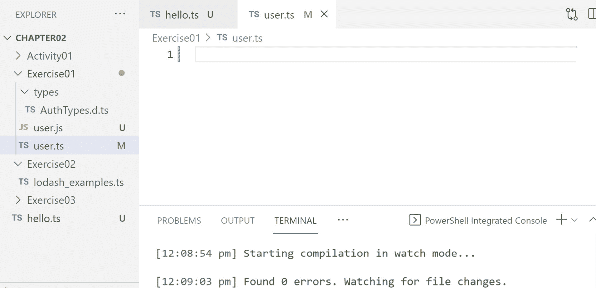

    图 2.4：AuthTypes 文件结构

    注意

    传统上，声明文件被保存在一个名为`types/`的单独目录中，然后由它们定义的模块导入。使用`.d.ts`文件扩展名而不是`.ts`作为声明文件的扩展名也是标准约定。

1.  在新的声明文件中，定义我们的`AuthTypes`模块的形状。在文件顶部使用`declare`关键字。这告诉 TypeScript 我们即将描述`AuthTypes`模块应该如何结构化：

    ```js
    declare module "AuthTypes" {
        export interface User {
            email: string;
            roles: Array<string>;
        }
    }
    ```

    在前面的代码中，可能有一段语法与您习惯的写法不同，那就是我们将模块名用引号括起来。当我们实现程序时，您会看到如果我们去掉引号，我们就无法导入模块。在模块内部，我们可以放置任何数量的导出，我们希望模块拥有的。需要记住的一个重要概念是，声明文件不包含任何实现代码；它们只是描述了模块中使用的元素的类型和结构。以下截图给出了代码的视觉表示：

    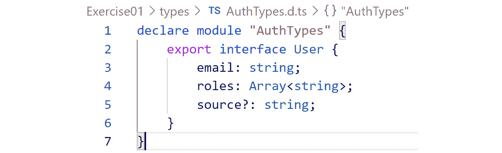

    图 2.5：AuthTypes 接口

    编译器消息表明导入应该成功，因为到目前为止没有出现任何错误。

    在这一步，我们导出一个用户界面，它定义了两个数据点：电子邮件和角色。就数据类型而言，`email`属性需要是一个字符串，而`roles`需要是一个填充字符串的数组。这样的类型定义将确保任何使用此模块的人如果尝试使用不正确的数据结构，会立即得到通知。

    现在我们已经定义了`AuthTypes`模块，我们需要将其导入到我们的 TypeScript 文件中，以便我们可以使用它。我们将使用引用导入过程将文件引入我们的程序中。

1.  前往`user.ts`文件，并添加以下两行代码：

    ```js
    /// <reference path = "./types/AuthTypes.d.ts" />
    import auth = require("AuthTypes");
    ```

    编辑器中的代码看起来可能像这样：

    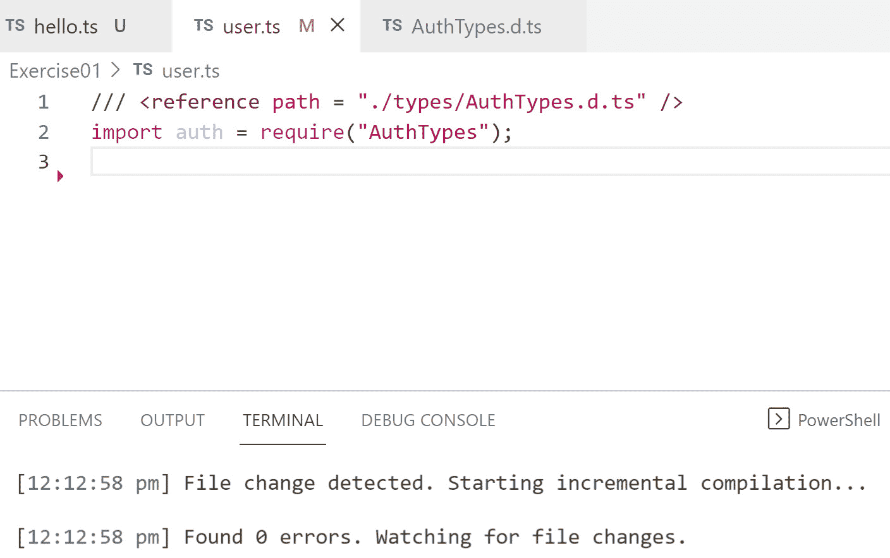

    图 2.6：导入声明文件

    前面的代码中的第一行将使`AuthTypes.d.ts`对我们的程序可用，第二行导入模块本身。显然，您可以为导入语句使用您喜欢的任何变量名。在这段代码中，我们导入`AuthTypes`模块并将其存储在`auth`关键字中。

    导入我们的模块后，我们现在可以开始构建程序的实现了。我们将从定义一个变量并将其分配给我们在声明文件中定义的用户界面类型开始。

1.  将以下代码添加到 `user.ts` 文件中：

    ```js
    let jon: auth.User;
    ```

    `user.ts` 文件的更新代码将看起来像这样：

    ```js
    /// <reference path = "./types/AuthTypes.d.ts" />
    import auth = require("AuthTypes");
    let jon: auth.User;
    ```

    我们在这里所做的是相当令人印象深刻的。我们实际上在单独的文件中创建了自己的类型/接口，导入它，并告诉 TypeScript 编译器我们的新变量将是 `User` 类型。

1.  使用以下代码，通过添加以下代码帮助 `jon` 变量的 `email` 和 `roles` 实际值：

    ```js
    jon = {
        email: "jon@snow.com",
        roles: ["admin"]
    };
    ```

    在放置了必需的形状后，程序可以正确编译，你可以执行任何你需要做的任务。

1.  创建另一个 `User` 并看看我们如何处理可选属性。将以下代码添加到添加用户 `alice` 的详细信息：

    ```js
    let alice: auth.User;
    alice = {
        email: "alice@snow.com",
        roles: ["super_admin"]
    };
    ```

    现在，让我们假设我们有时会跟踪用户是如何找到我们的应用的。并不是所有用户都会有这个属性，所以我们需要在不破坏其他用户账户的情况下将其设置为可选。你可以通过在冒号前添加问号来标记一个属性为可选。

1.  在声明文件中添加 `source` 属性：

    ```js
    declare module "AuthTypes" {
        export interface User {
            email: string;
            roles: Array<string>;
            source?: string;
        }
    }
    ```

1.  使用 `source` 值 `facebook` 更新我们的 `alice` 用户：

    ```js
    /// <reference path = "./types/AuthTypes.d.ts" />
    import auth = require("AuthTypes");
    let jon: auth.User;
    jon = {
        email: "jon@snow.com",
        roles: ["admin"]
    };
    let alice: auth.User;
    alice = {
        email: "alice@snow.com",
        roles: ["super_admin"],
        source: "facebook"
    }
    ```

    注意，即使没有 `source` 值，`jon` 变量仍然工作得很好。这有助于我们为程序构建灵活的接口，这些接口定义了可选和必需的数据点。

1.  打开终端并运行以下命令以生成 JavaScript 文件：

    ```js
    tsc user.ts
    ```

    现在，让我们看看生成的 `user.js` 文件，如下面的截图所示：

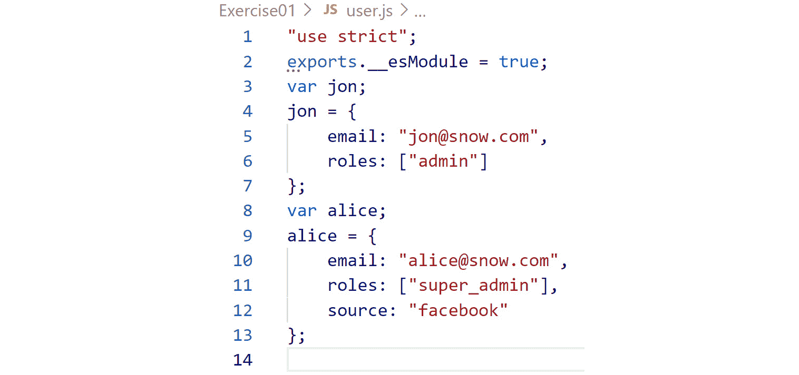


图 2.7：未添加到生成的 JavaScript 代码中的声明文件规则

嗯，这很有趣。在生成的 JavaScript 代码中，实际上没有提到声明文件。这让我们知道，当涉及到声明文件和 TypeScript 时，这是一个非常重要的知识点：声明文件仅用于开发者的利益，并且仅由 IDE 利用。

当涉及到程序中渲染的内容时，声明文件完全被绕过。考虑到这一点，希望声明文件的目标变得更加清晰。你的声明文件越好，IDE 理解你的程序以及你自己和其他开发者与你代码合作就会越容易。

## 异常

让我们看看当我们不遵循接口规则时会发生什么。记住在之前的练习中，我们的接口需要两个数据元素（`email` 和 `roles`），并且它们需要是 `string` 和 `Array<string>` 类型。所以，看看当我们不使用以下代码实现适当的数据类型时会发生什么：

```js
jon = {
    email: 123
}
```

这将生成以下编译器错误，如下面的截图所示：

![图 2.8：TypeScript 显示对象的必需数据类型]

![图片 B14508_02_08.jpg]

图 2.8：TypeScript 显示对象的必需数据类型

这非常有帮助。想象一下，你正在使用一个之前从未使用过的库。如果你使用的是纯 JavaScript，这个实现将静默失败，并迫使你挖掘库的源代码以查看它需要什么结构。

这种编译器错误是有意义的，在现实生活中的应用中，例如以下代码的`AuthTypes`：

```js
jon = {
    email: "jon@snow.com"
}
```

我们可以看到编译器会将错误信息移动到`jon`变量名。如果你悬停在它上面，或者查看终端输出，你将看到以下屏幕截图中的错误：

![图 2.9：TypeScript 显示对象的必需属性]

![图片 B14508_02_09.jpg]

图 2.9：TypeScript 显示对象的必需属性

这是一个极其有用的功能。如果你是新手开发者，这可能看起来不是什么大问题。然而，这种类型的信息正是 TypeScript 继续受到欢迎的精确原因。像这样的错误信息立即提供了我们需要的信息，以便修复错误并处理程序。在前面的屏幕截图中，信息告诉我们程序无法编译，因为我们缺少一个必需的值，即`roles`。

现在我们已经从头开始构建了自己的声明文件，是时候继续前进，看看其他库是如何利用声明文件的。

# 第三方代码库

根据你构建的应用程序类型，你可能永远不需要构建自己的声明文件。然而，如果你使用 TypeScript 并与第三方模块一起工作，你需要了解声明文件是如何工作的，因为这样你就可以无缝地与外部库一起工作。

## DefinitelyTyped

让我们暂时回到过去。当 TypeScript 最初开发时，将类型集成到 JavaScript 应用程序中的想法引起了极大的兴奋。然而，开发者开始感到沮丧，因为他们虽然用类型构建程序，但每次他们导入外部库，如 lodash，他们都被迫编写没有类型签名和几乎没有任何 IDE 指导的代码。

实际上，这意味着每次我们调用外部库中的函数时，我们都没有很高的信心认为我们正在正确地使用它。

幸运的是，开源社区已经有了答案，并创建了 DefinitelyTyped 库。DefinitelyTyped 是一个非常大的仓库，包含成千上万的 JavaScript 代码库的声明文件。这意味着像`react`、`lodash`以及几乎所有其他流行的库都有完整的声明文件，我们可以在 TypeScript 程序中使用。

注意

想了解更多关于 DefinitelyTyped 的信息，请访问[`definitelytyped.org`](https://definitelytyped.org)。

## 分析外部声明文件

在我们学习如何导入和使用外部库中的类型之前，让我们先看看它们的样子：

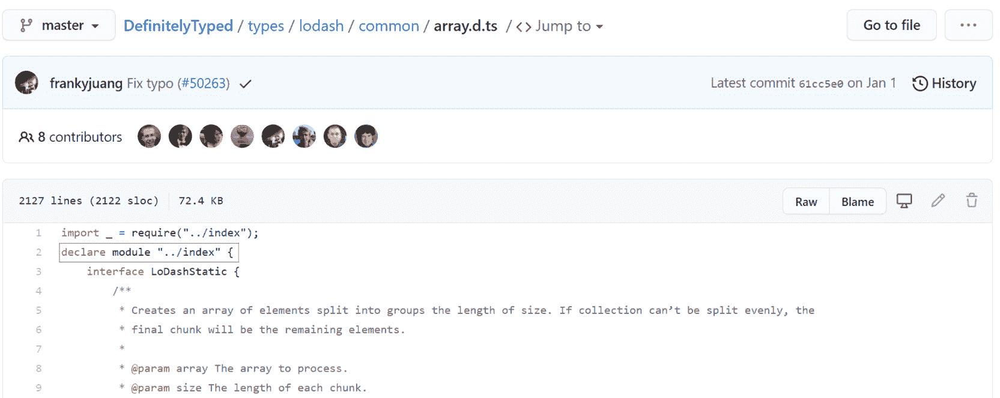


图 2.10：DefinitelyTyped 使用声明文件的示例

在前面的屏幕截图中，如果你查看数组数据结构的`lodash`声明文件，你会看到单个声明文件超过 2,000 行长。这可能会让人有些畏惧，所以让我们试着简化它。

注意

`lodash`是一个提供与对象、字符串、数组等一起工作的功能的实用库。如前所述的屏幕截图所示，`lodash`库的数组数据结构声明文件可以在这里找到：[`github.com/DefinitelyTyped/DefinitelyTyped/blob/master/types/lodash/common/array.d.ts`](https://github.com/DefinitelyTyped/DefinitelyTyped/blob/master/types/lodash/common/array.d.ts)。

你会很高兴地知道，前面声明文件中的元素与我们*练习 1.01*中构建的完全一样：*从头开始创建声明文件*。它从声明一个`module`实例开始，然后从这个点开始，列出使用数组数据结构的每个元素的接口。实际上，如果你剖析代码，你会看到`lodash`为库中的每个函数提供了三个接口。你不必知道这些接口的作用；然而，当你构建自己的代码库时，意识到你可以提供所需数量的接口是有帮助的。

现在我们来看看`last`函数的接口：

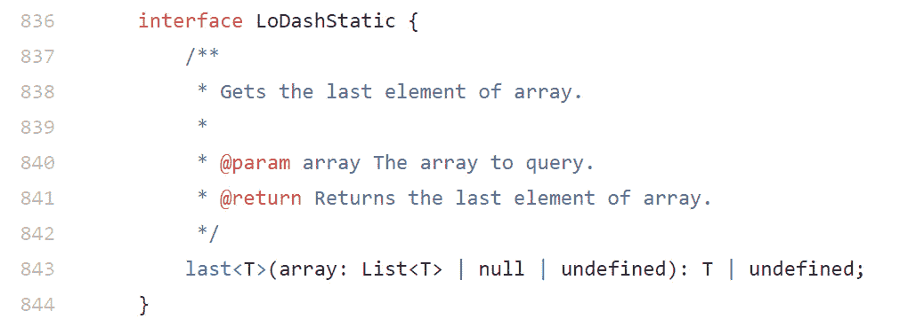


图 2.11：lodash 实现接口的方式

这是一个很好的函数来查看，因为当我们到达本节的示例时，我们会使用它。你可以看到接口的大部分实际上是一个注释。如果你以前从未见过这种语法，它使用的是 JSDoc 语法。这非常有帮助，因为像 Visual Studio Code 这样的 IDE 会直接将注释、参数和返回类型拉入 IntelliSense 界面。这意味着当我们开始使用`lodash`工作时输入`last`函数时，IDE 会自动拉入注释数据，这样我们就可以轻松地阅读如何使用该函数。

之后，这个声明相当基础。它只是简单地描述了最后一个函数的形状，具体来说，它接受一个值列表作为参数，然后返回`T`或`undefined`。不用担心所有关于`T`的引用；你将在第八章*泛型*中了解到它代表什么。现在，只需知道这意味着它正在返回一个值。

按照我们从头创建声明文件的相同模式，在下一节中，让我们创建一个新的 TypeScript 项目，并通过一个实际例子来了解为什么需要类型。

## 练习 2.02：使用外部库创建类型

在这个练习中，我们将安装类型并将我们的类型与外部库集成。我们还将探索一个场景，其中我们将检查当传递给函数的错误类型参数时函数的行为。为此练习，您需要从一个空目录开始。

注意

本练习的代码文件可以在此处找到：[`packt.link/k7Wbt`](https://packt.link/k7Wbt)。

执行以下步骤以实现此练习：

1.  打开 Visual Studio Code 编辑器。

1.  在您的计算机上创建一个空目录，并运行以下命令以创建一个新的 NPM 项目：

    ```js
    npm init -y
    ```

    前面的代码将生成一个 `package.json` 文件。

1.  要安装 Lodash 库，打开终端并输入以下命令：

    ```js
    npm i lodash
    ```

    前面的命令安装了 Lodash 库。`package.json` 文件现在应该看起来像这样，其中 `lodash` 已安装到依赖列表中：

    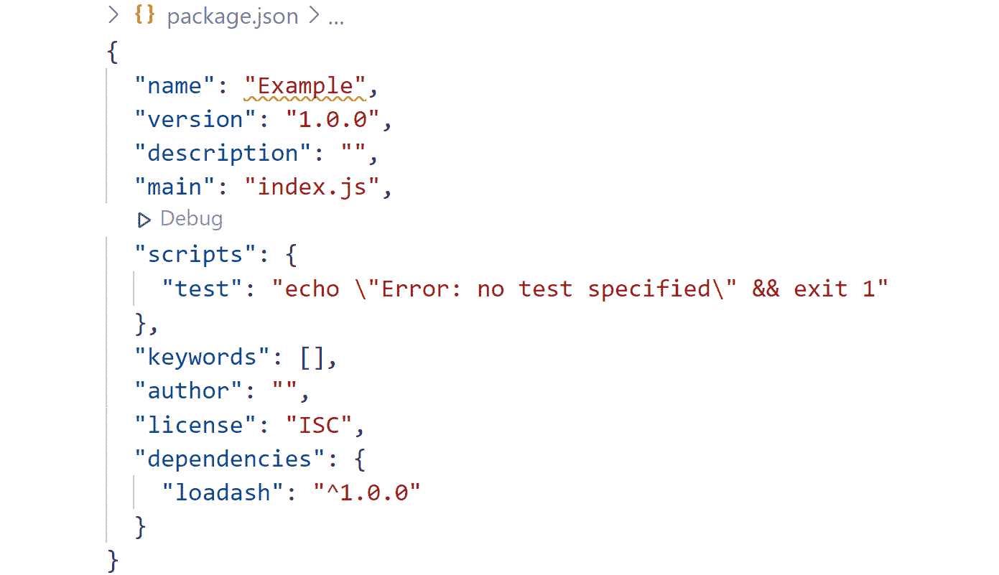

    

    图 2.12：生成的 package.json 文件

1.  在该目录中创建一个名为 `lodash_examples.ts` 的文件，启动 TypeScript 编译器，并让它监视更改。在新的 `.ts` 文件中，添加以下代码：

    ```js
    import _ = require("lodash");
    const nums = [1, 2, 3];
    console.log(_.last(nums));
    ```

1.  在终端中运行前面的程序，输入以下命令：

    ```js
    tsc lodash_examples.ts
    node lodash_examples.js
    ```

    控制台生成了 `3` 的输出，如下面的截图所示：

    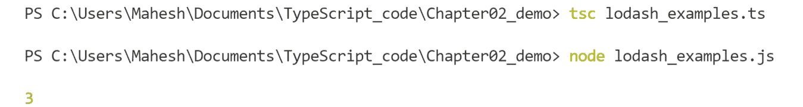

    

    图 2.13：运行生成的 lodash_example.js 程序

1.  创建另一个名为 `number` 的变量，并将其赋值为 `10`。然后我们将这个数字作为参数传递给 Lodash 库的 `_.last()` 函数。编写以下代码来完成此操作：

    ```js
    import _ = require("lodash");
    //const nums = [1, 2, 3];
    //console.log(_.last(nums));
    const number = 10;
    console.log(_.last(number));
    ```

    由于我们已经查看过声明文件，我们知道最后一个函数期望一个数组或某种类型的列表。然而，现在让我们假装我们没有这个信息，这是我们第一次使用 Lodash 库。

    注意

    The Lodash 库的 `last` 函数也可以与字符串一起使用，因为它将字符串中的字符视为字符集合。例如，`_.last("hey")` 将返回 `"y"`，因为它是字符串中的最后一个字符。

1.  在终端中运行前面的程序，输入以下命令：

    ```js
    tsc lodash_examples.ts
    node lodash_examples.js
    ```

    执行前面的命令时，将生成以下输出：

    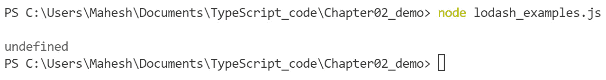

    

    图 2.14：将错误的参数传递给最后一个函数时会发生什么

    在如此小的程序中，这似乎是一个微不足道的问题。然而，在一个大系统中，当我们期望一个实际值时却得到了一个未定义的值，可能会很耗时，因为我们需要花费更多的时间进行调试。

    为了解决这个问题，让我们利用 DefinitelyTyped 仓库并引入 `lodash` 类型。如果你将鼠标悬停在文件顶部的 `import` 语句上，你甚至还会看到以下警告和建议，如下面的截图所示：

    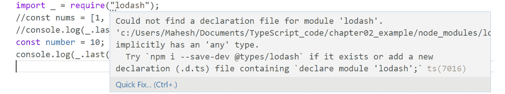

    图 2.15：TypeScript 推荐从 DefinitelyTyped 安装 Lodash 类型

    这非常有帮助。警告本身就告诉我们如何安装库的类型。

1.  按照建议，在终端中运行以下命令来安装 `lodash` 类型：

    ```js
    npm install @types/lodash
    ```

    注意

    每次你看到以 `@types/` 开头的 `install` 命令时，这意味着 NPM 将从 DefinitelyTyped 仓库中提取。

    如果你运行该命令，`import` 语句中的警告应该会自动消失。但更重要的是，你现在应该看到 IDE 正在抱怨我们尝试将数字传递给 `last` 函数的那一行代码。如果你将鼠标悬停在单词 `number` 上，你应该会看到以下截图所示的错误：

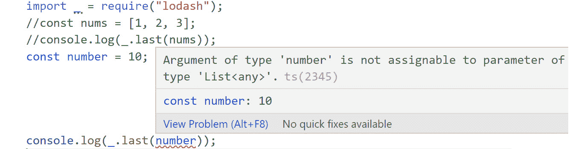

图 2.16：IntelliSense 显示与最后一个函数一起使用的正确类型

从前面的截图可以看出，`last` 函数不会接受任何 `number` 类型的参数。它接受一个数组或列表作为参数。因此，让我们想象我们正在构建一个现实世界的应用程序，并尝试使用 `last` 函数。如果我们使用原生 JavaScript，我们可能直到我们或甚至用户在运行程序时遇到错误才会意识到我们的错误。然而，通过利用 TypeScript 和 DefinitelyTyped，如果我们尝试以错误的方式使用函数，程序甚至无法编译。

## 使用 DefinitelyTyped 的发展流程

现在你已经看到了如何安装和使用类型，我们将通过一个完整的发展流程来展示，这样你就可以观察到使用类型的优势。如果没有将类型集成到外部库中，我们就必须具备对该库的先验知识，或者翻阅文档以发现正确的用法。

然而，有了类型，我们将看到在处理像 `lodash` 这样的库时，过程会多么流畅。让我们在下一节解决一个练习，以便更好地理解这一点。

## 练习 2.03：创建棒球阵容卡应用程序

在这个练习中，我们将创建一个棒球阵容应用程序，其中我们有一个从 API 获取的球员名字数组，然后我们在应用程序中有一个名为 `lineupOrder` 的常量变量。我们的阵容卡应用程序需要将 API 中的名字与 `lineupOrder` 配对：

注意

这个练习的代码文件可以在以下链接找到：[`packt.link/01spI`](https://packt.link/01spI)。

1.  打开 Visual Studio Code 编辑器。

1.  创建一个名为 `lodash_newexamples.ts` 的文件，并添加以下代码，其中我们有一个数组变量 `playerNames` 和一个列表 `lineupOrder`：

    ```js
    import _ = require("lodash");
    const playerNames = [
        "Springer",
        "Bregman",
        "Altuve",
        "Correa",
        "Brantley",
        "White",
        "Gonzalez",
        "Kemp",
        "Reddick"
    ];
    const lineupOrder = [1, 2, 3, 4, 5, 6, 7, 8, 9]; 
    ```

    这正是使用 Lodash 库中的 `zip` 函数的完美情况。让我们假设我们已经听说过 `zip` 函数，但还不完全清楚如何使用它。首先，在同一个文件中编写以下代码：

    ```js
    _.zip()
    ```

1.  在输入前面的代码后，将光标放在括号之间。你将直接从 DefinitelyTyped 获得有关如何使用该函数的指导，如下面的截图所示：![图 2.17：IntelliSense 在 lodash 中使用 zip 函数的指导]

    ![图片 B14508_02_17.jpg]

    图 2.17：IntelliSense 在 lodash 中使用 zip 函数的指导

    注意

    从前面的截图，我们可以看到 `zip` 函数接受两个参数。两个参数都需要是 `ArrayLike`，这意味着它们需要作为某种集合的功能。此外，该函数将元素分组并返回分组集合。因此，无需查阅 `lodash` 文档，我们就能在构建程序时利用类型定义。它为我们提供了在处理函数时所需的指导。

    现在我们来测试一下。我们知道 `zip` 函数接受两个数组。所以，让我们提供 `playerNames` 和 `lineupOrder` 数组。

1.  向文件中添加以下代码，为 `zip` 函数提供两个数组 `playerNames` 和 `lineupOrder`：

    ```js
    console.log(_.zip(lineupOrder, playerNames));
    ```

    如果运行前面的代码，你会看到 `zip` 函数确实做了它所说的。它将元素分组并返回我们需要的确切数据结构。渲染的阵容卡看起来可能像以下截图所示：

![图 2.18：从 lodash 正确运行 zip 函数]

![图片 B14508_02_18.jpg]

图 2.18：从 lodash 正确运行 zip 函数

在完成此过程时，你可以看到 DefinitelyTyped 如何允许你直接扩展第三方库中的类型，以便你可以在程序中获得类型指导。

## 活动 2.01：构建热图声明文件

在此活动中，你将构建一个名为 `heat map log system` 的 TypeScript 应用程序，用于跟踪棒球投球数据并确保数据完整性。你将利用 TypeScript 声明文件来构建程序的类型系统。从那时起，你将导入 Lodash 库，并通过实现来自 DefinitelyTyped 的类型定义来向程序添加类型检查。

步骤如下：

1.  访问以下 GitHub 仓库并下载包含规范和配置元素的 activity 项目：https://packt.link/vnj1R。

1.  创建一个名为 `heat_map_data.ts` 的文件。

1.  在文件上运行 TypeScript 编译器并观察更改。

1.  创建一个声明文件并定义一个名为 `HeatMapTypes` 的模块，并导出名为 `Pitcher` 的接口。

1.  为 `Pitcher` 模块定义三个属性：`batterHotZones`、`pitcherHotZones` 和 `coordinateMap`。

1.  所有三个属性的数据结构应该相同，即 `Array<Array<number>>`，但 `coordinateMap` 应该是可选的。

1.  然后，将声明文件导入到 `heat_map_data.ts` 文件中。接着，创建并导出一个名为 `data` 的 `let` 变量，并将其分配给 `Pitcher` 类型。

1.  添加符合声明规则的数据，确保嵌套数组中的一个与 `batterHotZones` 和 `pitcherHotZones` 属性中的一个是相同的。

1.  创建一个名为 `findMatch` 的新函数，该函数接受 `batterHotZones` 和 `pitcherHotZones` 数组，并使用 `lodash` 函数 `intersectionWith` 返回相同的嵌套数组。您需要导入在最初运行 `npm install` 时安装的 Lodash 库。最后，将 `findMatch` 的值存储在声明文件中定义的 `coordinateMap` 属性中。

    该活动的预期输出将是一个类似以下的嵌套数组：

    ```js
    [[10.2, -5], [3, 2]]
    ```

    注意

    该活动的解决方案可以通过此链接找到。

# 摘要

在本章中，我们介绍了如何在 TypeScript 中使用声明文件。我们分析了声明文件如何帮助 IDE 指导程序的结构。我们看到了结构化声明文件的示例。将声明文件导入 TypeScript 文件有助于开发周期。我们学习了如何将对象分配给在声明文件中定义的自定义类型。它将类型指导注入到 IDE 的 IntelliSense 过程中。我们还了解了 DefinitelyTyped 以及如何利用它为第三方库添加类型，并像有类型的程序一样与之协作。

在掌握了所有关于声明文件的知识后，在下一章中，我们将深入探讨在 TypeScript 中使用函数。我们将使用类型定义一个函数，在一个模块中构建一系列函数，构建一个执行特定任务的函数类，并探索单元测试。
