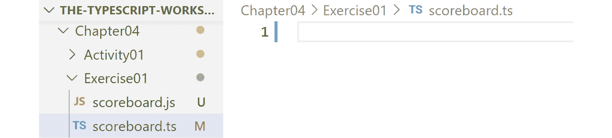
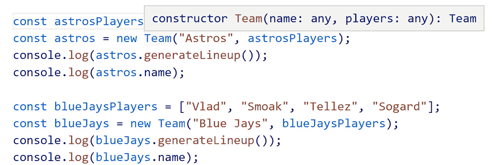
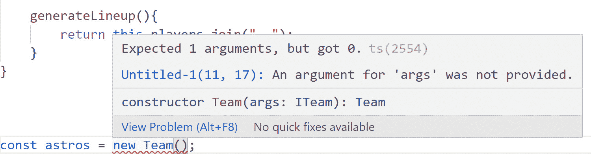
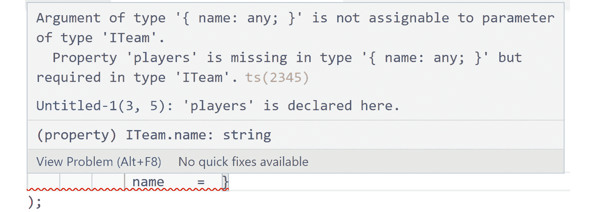
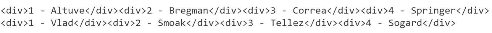
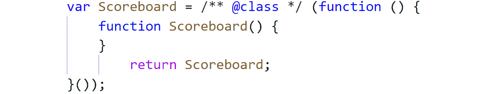
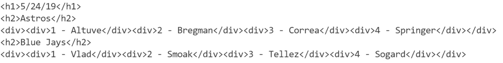

# 4. 类和对象

概述

在本章中，你将学习如何定义类并实例化它们以创建对象。你还将学习如何使用接口定义可以传递给类的数据类型。到本章结束时，你将能够构建一个包含数据属性、构造函数、方法和接口的基本类。你将能够创建接受多个对象作为参数的类，以构建动态行为，并自信地使用 TypeScript 生成 HTML 代码。

# 简介

**面向对象编程**（**OOP**）自 20 世纪 60 年代以来一直存在，许多流行的编程语言都采用了它，包括 **Java**、**Ruby** 和 **Python**。在 OOP 出现之前，开发者通常遵循过程式编程风格。采用过程式编程的语言，其执行过程是从代码文件顶部到底部的。最终，开发者开始希望将整个过程和数据封装起来，以便它们可以在程序的不同部分和不同时间被调用。这就是面向对象编程诞生的原因。

从一个高层次的角度来看，面向对象编程允许程序将数据和行为一起封装，以创建完整的系统。因此，与过程式程序从上到下运行代码不同，面向对象程序允许你创建代码蓝图并建立程序运行的规则，然后你可以从应用程序的其他部分调用这些蓝图。

如果现在还不明白，请不要担心——我们将在本章中详细讲解如何在 TypeScript 中处理面向对象编程。我们将从学习面向对象编程的基本构建块——**类**和**对象**开始。

在前面的章节中，我们涵盖了广泛的主题，包括声明变量的各种方法、如何处理高级类型、别名、联合类型和断言，以及如何检查类型。你已经为你的 TypeScript 技能集增添了相当多的知识。

在本章中，我们将使用 TypeScript 构建一个计分板应用程序，并在过程中学习类和对象。如果你对面向对象编程或它如何应用于 TypeScript 没有任何先前的知识或熟悉度，请不要担心。如果你对类和对象有一些经验，那么你可以跳过本章后面的一些更高级的内容——尽管你仍然可能从这些关键概念的复习中受益。

# 什么是类和对象？

在我们构建类之前，让我们退一步，了解类是如何工作的。你可以把类想象成一个蓝图。它为我们想要构建的东西建立了一个结构，并在其中包含了一些行为。现在，类本身并不做任何事情。它仅仅是一个蓝图。为了与之交互，我们必须执行一个称为**实例化**的过程。

实例化是将一个类转换成我们可以使用的实际类的对象的过程。让我们通过一个例子来进一步了解实例化。想象一下你正在建造一栋房子，就像一个好的建筑商一样，你有一张你想要建造的蓝图。这个蓝图就像我们的类。房子的蓝图只是一套规则、属性和行为。房子的蓝图定义了诸如面积、房间数量、浴室数量以及管道走向等元素。技术上，蓝图只是一套打印出来或存储在计算机上的规则；它不是房子本身，或者在这个例子中，不是程序本身。为了创建房子，有人需要拿走蓝图并实际建造房子，编程也是如此。

类本身除了为程序建立规则外，什么都不做。为了使用类，我们需要创建该类的实例或对象。所以，回到建筑比喻，你可以将实例化想象为拿走房子的蓝图并建造它。

让我们看一下下面的代码片段，以了解如何在 TypeScript 中出现类和对象：

```js
class Person {
    name:string;
    constructor(name) {
        this.name = name;
    }
    read() {
        console.log(this.name+ "likes to read.");
    }
}
const obj = new Person("Mike");
obj.read();
```

让我们逐一分析前面代码中的每个元素，以便你可以在脑海中形成与 TypeScript 中类和对象相关的关键术语的模型，然后我们将进行一个深入练习，你将看到如何处理每个元素：

+   `class Person {}` 创建或定义一个类。

+   `name: string;` 创建类属性。

+   `constructor()` 允许你在创建对象时执行设置工作。

+   `read()` 是一个允许你在类中实现自定义行为的方法。

+   `const obj = new Person("Mike");` 从一个类创建一个对象并将其存储在变量中，以便可以使用它。

+   `obj.read();` 在一个对象上调用一个方法。在这个例子中，它会在控制台输出值 `Mike 喜欢阅读`。

在下一节中，我们将解决一个练习，其中我们将构建我们的第一个 TypeScript 类。

## 练习 4.01：构建你的第一个类

在这个练习中，我们将构建一个名为 `Team` 的类，并在其中添加一个名为 `generateLineup` 的行为或方法。我们还将创建这个类的对象并访问其方法。执行以下步骤以实现此练习：

注意

本练习的代码文件可以在此处找到：[`packt.link/UJXSY`](https://packt.link/UJXSY)。

1.  打开 Visual Studio Code 编辑器。

1.  创建一个新的目录，然后创建一个名为 `scoreboard.ts` 的新文件。你将在它上面运行 TypeScript 编译器以生成一个 JavaScript 文件。在 TypeScript 编译器中添加以下命令以生成 JavaScript 文件：

    ```js
    tsc scoreboard.ts
    ```

    执行此命令后，将生成一个 `scoreboard.js` 文件，如下面的截图所示：

    

    图 4.1：TypeScript 记分板和生成的 JavaScript 文件

1.  现在，创建一个名为 `Team` 的类，然后利用实例化过程创建该类的对象。在 `scoreboard.ts` 文件中编写以下代码以创建一个类：

    ```js
    class Team {
    }
    ```

    目前，这只是一个空的类，没有任何功能。让我们通过向类中添加一些行为来修复它。我们可以通过定义函数来添加行为。对于我们的 `Team` 类，我们将生成一个阵容，因此我们定义了一个名为 `generateLineup` 的函数，它不接受任何参数。

    注意

    从语法角度来看，请注意我们正在使用 `class` 关键字。`class` 是 TypeScript 和 JavaScript 中的一个保留字，它告诉编译器我们即将定义一个类。在这种情况下，我们正在调用 `Team` 类。

1.  编写以下代码在类内部定义一个 `generateLineup()` 函数：

    ```js
    class Team {
        generateLineup() {
            return "Lineup will go here…";
        }
    }
    ```

    如您所见，类中的函数，也称为方法，在语法上与 JavaScript 中的标准函数相似。现在，我们的 `generateLineup` 方法仅返回一个字符串。在本章的后面部分，我们将看到如何在此方法中实现动态行为。

    一旦我们创建了一个类并定义了其行为，我们就可以创建一个对象。为了创建 `Team` 类的对象，我们在 `Team` 类名称前调用 `new` 关键字，并将其分配给一个变量。在这种情况下，我们将实例化的对象存储在一个名为 `astros` 的变量中。

1.  添加以下代码以创建 `Team` 类的对象：

    ```js
    const astros = new Team();
    ```

    注意，在前面的代码中，我们在 `Team` 类名称后面也添加了括号，模仿我们在 TypeScript 中调用函数的方式。

    在所有这些准备就绪后，我们现在可以使用 `astros` 变量来调用其上的 `generateLineup` 方法。

1.  添加以下代码以调用 `generateLineup` 方法：

    ```js
    console.log(astros.generateLineup());
    ```

1.  在终端中，输入以下命令以生成 JavaScript 代码并运行：

    ```js
    tsc scoreboard.ts
    node scoreboard.js
    ```

    一旦运行前面的命令，终端将显示以下输出：`阵容将在这里…`

因此，我们已经创建了我们第一个类，然后从那里，我们使用了这个类，这个蓝图，然后通过实例化来创建一个对象。从那个点开始，我们能够调用类内部的函数。现在我们已经创建了一个类并使用其对象来访问其方法，在下一节中，我们将探讨 **构造函数** 的概念。

## 使用构造函数扩展类行为

在上一节中，我们为 TypeScript 中的类建立了语法。在我们开始之前程序的下一阶段之前，让我们退一步，讨论我们将要使用的一个元素，称为构造函数。如果您以前从未使用过构造函数，这个概念可能会令人困惑。

回到我们的蓝图/房屋类比，如果一个类就像房屋的蓝图，而对象是创建的房屋，那么构造函数就是去建材店购买建造房屋所需材料的过程。构造函数在创建对象时自动运行。通常，构造函数用于执行以下操作：

+   设置属性数据，这是我们即将探讨的内容。

+   运行任何设置过程。这包括调用外部 API 获取数据和与数据库通信。

    注意

    更多关于构造函数的内容将在*第八章*，*TypeScript 中的依赖注入*中介绍。

## `this`关键字

`this`关键字的含义是指当前正在执行的类的实例。它能够访问创建的对象的数据和行为。假设我们在一个类中有以下代码：

```js
constructor(name){
    this.name = name;
}
```

在前面的代码中，如果`this.name`是指向类的实例和`name`属性，那么构造函数中的`name`参数代表什么？为了在我们的类中使用数据，我们需要一个机制将数据传递到对象中，这就是构造函数参数的作用。那么，为什么我们需要将`this.name`赋值为`name`？这似乎是多余的；然而，这对于理解 TypeScript 类中的变量作用域工作方式是有帮助的。我们需要将传递给对象的值赋给`this.attributeName`，这样类中的其他方法就可以访问这些值。如果我们只是将值传递给构造函数而没有执行`this.name`的赋值，类中的其他方法就无法访问`name`值。现在，让我们在下一个练习中扩展程序的行为，我们将探索类的属性。

## 练习 4.02：定义和访问类的属性

在这个练习中，我们将向我们在上一个练习中创建的`Team`类添加属性。我们将使用构造函数来定义和访问对象的属性。按照以下步骤实现这个练习。

注意

在这个练习中，我们将继续本章前面用`Team`类所做的操作，所以请确保将其作为起点。这个练习的代码文件可以在以下位置找到：[`packt.link/Diuyl`](https://packt.link/Diuyl)。

我们首先在`Team`类的顶部列出属性名称，然后通过传递`name`参数使用`constructor`函数设置值。从那里，我们将`this.name`的值设置为传递给构造函数的值：

1.  编写以下代码以创建一个`constructor`函数：

    ```js
    class Team {
        name: string;
        constructor(name) {
          this.name = name;
        }
        generateLineup() {
          return "Lineup will go here …";
        }
    }
    ```

    当我们创建`astros`对象时，`this`关键字代表被创建的对象。

1.  创建另一个对象来查看`this`关键字在多个对象中的工作方式。将以下代码添加到`scoreboard.ts`文件中，以创建`Team`类的对象：

    ```js
    const astros = new Team();
    console.log(astros.generatLineup());
    const bluJays = new Team();
    console.log(blueJays.generateLineup());
    ```

    在前面的代码中，我们创建了一个名为 `blueJays` 的另一个 `Team` 类对象。从那里，我们在该对象上调用 `generateLineup` 方法。当我们说 `this.name` 时，我们指的是类的实例。这意味着当我们对第一个对象说 `this.name` 时，我们指的是 `astros` 对象。然后，对于我们创建的新对象，`this.name` 指的是 `blueJays` 对象。

    我们的 `generateLineup` 方法可以访问 `name` 的值，因为我们已经在构造函数中对其进行了赋值。

1.  通过编写以下代码将值传递给对象的构造函数：

    ```js
    const astros = new Team("Astros");
    console.log(astros.generateLineup());
    const blueJays = new Team("Blue Jays");
    console.log(blueJays.generateLineup());
    ```

    注意

    如果你被问到 TypeScript 中参数和参数的区别，参数是你放在类中函数声明内的内容。参数是你传递给对象或函数的内容。

    为了将参数传递给一个类，你可以像上面那样传递它们，此外，当我们执行 `this.name = name` 这样的赋值操作时，这意味着当创建一个对象时，它也可以调用数据值。

1.  编写以下代码以调用相关数据值：

    ```js
    const astros = new Team("Astros");
    //console.log(astros.generateLineup());
    console.log(astros.name);
    const blueJays = new Team("Blue Jays");
    //console.log(blueJays.generateLineup());
    console.log(blueJays.name);
    ```

1.  在终端中，键入以下命令以生成 JavaScript 代码并运行：

    ```js
    tsc scoreboard.ts
    node scoreboard.js
    ```

    一旦运行前面的命令，终端将显示以下输出：

    ```js
    Astros
    Blue Jays
    ```

如你在上一步的代码中所见，当我们调用 `astros.name` 时，它输出传递给实例化对象的名字值。当我们把名字值 `Blue Jays` 传递给新对象时，新值将在终端中打印出来。

我们现在能够理解类和对象的基本工作原理。我们还学习了如何通过构造函数将数据传递给对象。现在是时候扩展这些知识，看看我们如何将类型直接集成到我们的类中。

尽管当前实现有效，但我们没有充分利用 TypeScript 提供的关键优势。事实上，当前实现非常接近你用纯 JavaScript 构建类的方式。通过在类中使用类型，我们可以精确地定义如何处理代码，这将有助于使我们的代码更易于管理和扩展。

一个现实世界的例子是使用 TypeScript 的 React 应用程序与纯 JavaScript 相比。开发者遇到的最常见的错误之一是将错误类型的数据传递给类或方法，导致用户出现错误。想象一下，不小心将一个字符串传递给需要一个数组的类。当用户尝试访问与该类关联的页面时，他们不会看到任何数据，因为传递给方法的数据是错误的。

当你在 React 类中使用 TypeScript 和类型时，文本编辑器不会允许程序编译，因为它会向你解释每个类和过程需要的数据类型。在下一节中，我们将解决一个练习，我们将把不同的类型集成到我们的类中。

## 练习 4.03：将类型集成到类中

在这个练习中，我们将在我们的`Team`类中添加另一个名为`players`的属性。这个参数接受字符串数组。按照以下步骤来实施这个练习：

注意

我们将继续在之前的练习中用我们的`Team`类完成的工作，所以请确保将其作为起点引用。本练习的代码文件可以在以下位置找到：[`packt.link/tbav7`](https://packt.link/tbav7)。

1.  打开`scoreboard.ts`文件。

1.  在`Team`类内部，声明另一个名为`players`的属性，它接受字符串数组。编写以下代码来声明`string`数组：

    ```js
    players: string[]; 
    ```

1.  通过添加`name`和`players`参数来更新`constructor`函数。将`name`和`players`参数的值分别设置为`this.name`和`this.players`。编写以下代码来更新我们的`constructor`函数：

    ```js
    constructor(name, players){
        this.name = name;
        this.players = players;
    }
    ```

1.  更新`generateLineup()`方法，使其连接将传递给对象的玩家名称。此方法将返回一个普通字符串。以下是更新后的`generateLineup()`方法的代码：

    ```js
    generateLineup(){
        return this.players.join(", ");
    }
    ```

1.  创建两个玩家数组，即`astrosPlayers`和`blueJaysPlayers`。将四个玩家名称分配给每个数组，并将这些数组作为`Team`类对象的第二个参数传递。编写以下代码来完成此操作：

    ```js
    const astrosPlayers = ["Altuve", "Bregman", "Correa", "Springer"];
    const astros = new Team("Astros", astrosPlayers);
    console.log(astros.generateLineup());
    console.log(astros.name);
    const blueJaysPlayers = ["Vlad", "Smoak", "Tellez", "Sogard"];
    const blueJays = new Team("Blue Jays", blueJaysPlayers);
    console.log(blueJays.generateLineup());
    console.log(blueJays.name);
    ```

1.  现在，在终端中，键入以下命令以生成 JavaScript 代码并运行它：

    ```js
    tsc scoreboard.ts
    node scoreboard.js
    ```

    一旦运行前面的命令，终端将显示以下输出：

    ```js
    Altuve, Bregman, Correa, Springer
    Astros
    Vlad, Smoak, Tellez, Sogard
    Blue Jays
    ```

我们现在已经将类型集成到我们的`Team`类中。如果你能在控制台中查看传递给类的名称，这意味着你正在正确地使用类及其类型。在下一节中，我们将学习为什么需要**接口**以及它们是如何有用的。

# TypeScript 接口

我们将在下一章深入探讨 TypeScript 接口。但到目前为止，只需知道接口允许你在创建对象时描述传递给类的数据。在前面的练习代码中，如果我们将鼠标悬停在 Visual Studio Code 中的`Team`类上，我们会得到以下消息：



图 4.2：模糊的 IntelliSense 指导

如您在前面的截图中所见，Visual Studio Code 编辑器的 IntelliSense 表示 `players` 参数使用的是 `any` 数据类型。它在这里没有提供任何使用提示，这也开始说明了为什么我们需要接口，因为现在 `players` 数组可以是任何东西。它可以是字符串，也可以是对象，等等。这实际上破坏了使用 TypeScript 的主要好处之一。理想情况下，我们的程序应该是声明式的，以至于我们知道应该将什么类型的数据传递给我们的函数和类。我们将利用接口来实现这一点。定义接口的方式是先使用 `interface` 关键字，然后是接口的名称。在 TypeScript 社区中，常见的约定是以大写字母 `I` 开头，后面跟着为该接口构建的类的名称。

一旦我们创建了接口并更新了构造函数，我们将建立一个定义我们的参数和类型的方法。这将破坏使用旧参数语法创建的任何先前创建的对象，因为之前的参数不再与我们的新接口匹配。在下一节中，我们将完成一个练习，其中我们将构建一个接口。

## 练习 4.04：构建接口

在这个练习中，我们将构建一个接口并设置需要传递给我们的函数和类的数据类型。执行以下步骤以实现此练习：

注意

我们将继续在 `Team` 类中执行我们在上一个练习中完成的工作，所以请确保将其作为起点。此练习的代码文件可以在以下位置找到：[`packt.link/FWUA6`](https://packt.link/FWUA6)。

1.  打开 `scoreboard.ts` 文件。

1.  创建一个名为 `ITeam` 的接口，并使用与对象相同的键/值语法列出属性和数据类型。编写以下代码以创建接口：

    ```js
    interface ITeam{
        name: string;
        players: string[];
    }
    ```

1.  在我们的 `Team` 类内部，修改 `constructor` 函数中的参数列表，以便将数据作为一个 `ITeam` 类型的单个对象传递。编写以下代码以完成此操作：

    ```js
    constructor(args: ITeam){
        this.name = args.name;
        this.players = args.players;
    }
    ```

    注意在前面的代码中，我们不是单独列出每个参数，而是声明了创建 `Team` 对象所需的精确结构。从那时起，我们从 `args` 参数中调用 `name` 和 `players` 值，因为我们的参数列表现在已经被重构为使用单个参数。

1.  通过编写以下代码创建 `Team` 类的对象：

    ```js
    const astros = new Team();
    ```

    现在请注意，当我们悬停在括号上时，它表示期望一个参数但得到了零个。查看以下截图以查看消息：

    

    图 4.3：IntelliSense 列出类所需的参数

1.  让我们更新创建对象的方式。在`name`属性中开始输入。编写以下代码来创建对象：

    ```js
    const astros = new Team({
        name
    })
    ```

    添加`name`参数后，我们将看到以下错误：

    

    图 4.4：IntelliSense 描述创建对象所需的数据类型

    如果你将鼠标悬停在`name`属性上，你可以看到 TypeScript 正在帮助我们理解我们需要传递的其他参数，因为`players`属性缺失。所以，这已经为我们提供了关于我们的类应该如何工作的更多信息。

1.  现在，传递两个属性`name`和`players`的值，并更新两个对象`astros`和`blueJays`的值。编写以下代码来完成此操作：

    ```js
    const astrosPlayers = ["Altuve", "Bregman", "Correa", "Springer"];
    const astros = new Team({
        name: "Astros",
        players: astrosPlayers
    });
    console.log(astros.generateLineup());
    console.log(astros.name);
    const blueJaysPlayers = ["Vlad", "Smoak", "Tellez", "Sogard"];
    const blueJays = new Team({
        name: "Blue Jays",
        players: blueJaysPlayers
    });
    console.log(blueJays.generateLineup());
    console.log(blueJays.name);
    ```

1.  现在，在终端中，键入以下命令以生成 JavaScript 代码并运行它：

    ```js
    tsc scoreboard.ts
    node scoreboard.js
    ```

    运行前面的命令后，以下输出显示在终端中：

    ```js
    Altuve, Bregman, Correa, Springer
    Astros
    Vlad, Smoak, Tellez, Sogard
    Blue Jays
    ```

我们现在已经建立了一个接口，并设置了需要传递给我们的函数和类的数据类型。尽管我们得到了与之前练习相同的结果，但我们现在清楚需要传递给我们的函数和类的是哪种类型的数据。

使用接口和基于对象的参数与类一起使用的另一个巨大好处是，参数不需要按特定顺序排列。你可以按你想要的任何顺序传递键，类仍然可以正确解析它们。如果你使用标准的参数名称，你总是需要知道传递参数到类和函数的顺序。

# 在方法中生成 HTML 代码

现在我们已经学会了如何构建接口，并且有能力传递数据，再加上 IntelliSense 的帮助，我们知道传递的数据类型，我们实际上可以生成一些 HTML。看到我们编写的代码生成自己的代码很有趣。我们选择包含这个示例的部分原因是因为这非常接近你在构建 React JS 或 Angular 应用程序时将使用的过程。在它们的内核中，标准 React 应用程序的目标是利用 JavaScript/TypeScript 代码来渲染可以呈现给用户的 HTML 代码。

在下一节中，我们将完成一个练习，在这个练习中我们将生成 HTML 代码并在浏览器中查看。

## 练习 4.05：生成和查看 HTML 代码

在这个练习中，我们将通过清理一些代码来生成一些 HTML。我们将移除`name`属性和接口。按照以下步骤实现这个练习：

注意

我们将继续使用`Team`类完成之前练习中执行的工作，所以请确保将其作为起点进行参考。本练习的代码文件可以在以下链接找到：[`packt.link/Bz5LV`](https://packt.link/Bz5LV)。

1.  打开`scoreboard.ts`文件。

1.  在`Team`类中，声明`players`数组并创建一个`constructor`函数。编写以下代码以实现此功能：

    ```js
    players: string[];
    constructor(players){
        this.players = players;
    }
    ```

1.  通过编写以下代码来更新`generateLineup()`函数：

    ```js
    generateLineup(): string{
        const playersWithOrderNumber = 
          this.players.map((player, idx) => {
            return `<div>${idx + 1} - ${player}</div>`;
        });
        return playersWithOrderNumber.join("");
    }
    ```

    `map`函数是一个有用的迭代工具，它遍历球员数组。您可以将其作为执行某种操作的函数传递。在前面的代码中，行` `<div>${idx + 1} – ${player}</div>`表明在每次迭代中，每个球员的数据都被 HTML 代码包裹。此外，每个返回的元素都存储在一个新的数组`playersWithOrderNumber`中。

    注意

    注意我们为`generateLineup`方法声明的返回类型。这意味着我们正在告诉 TypeScript 编译器该方法将始终返回一个字符串值。之所以如此重要，是因为如果应用程序的任何其他部分调用此方法并尝试执行不适用于字符串数据类型的任务，它们将得到一个清晰的错误和建议如何修复它。

1.  现在，在终端中，输入以下命令以生成 JavaScript 代码并运行它：

    ```js
    tsc scoreboard.ts
    node scoreboard.js
    ```

    运行前面的命令后，终端中显示以下输出：

    

    图 4.5：显示两支球队球员阵容的输出

    在前面的输出中，您将看到我们得到的是打印出两支球队球员阵容的 HTML。

    但我们不要就此止步。让我们看看在浏览器中这看起来是什么样子。

1.  将生成的代码保存到名为`index.html`的 HTML 文件中，并在浏览器中查看。浏览器中将显示以下输出：

图 4.6：在浏览器中查看生成的 HTML 代码

注意

您可能根据默认浏览器得到不同的图像；然而，显示的文本将与前面的截图中所列的相同。

您可以看到，我们为两支球队都有一套完整的球员阵容。然而，我们还没有格式化页面上的文本，因此除非您能访问代码，否则很难确定球员所属的球队。随着我们在本章的进展，我们将增强这个页面，添加更多信息并进行格式化。

注意，我们可以将对象本身传递给另一个类，该类将为我们将它们组合在一起并生成完整的得分板。在下一节中，我们将学习如何与多个类和对象一起工作。

## 多个类和对象的工作

在本节中，我们将学习如何创建一个结合其他类以提供更高级行为的类。这个概念之所以重要，是因为你将在许多不同类型的应用程序中需要实现这种类型的行为。例如，如果你正在构建一个 React 应用程序中的联系表单，你可能需要为 API、表单元素、表单验证和其他表单功能创建类，使它们协同工作。在下一节中，我们将查看一个将类结合起来的练习。

## 练习 4.06：组合类

在本练习中，我们将创建一个 `scoreboard` 类，它将允许我们传入对象并处理它们的数据和行为。这将使我们能够使用从其他类（如我们的 `Team` 类）创建的实例化对象。然后，我们将添加一些其他行为，以生成一个完整的分数板，展示阵容和数据。执行以下步骤以实现本练习：

注意

我们将使用之前练习中完成的 `Team` 类继续我们的工作，所以请确保将其作为起点进行引用。本练习的代码文件可以在以下位置找到：[`packt.link/UY5NP`](https://packt.link/UY5NP)。

1.  打开 `scoreboard.ts` 文件。

1.  创建一个 `Scoreboard` 类，列出三个属性，即 `homeTeam`、`awayTeam` 和 `date`。在这里，`homeTeam` 和 `awayTeam` 将是 `Team` 类型，而 `date` 将是 `string` 类型。编写以下代码以完成此操作：

    ```js
    class Scoreboard{
        homeTeam: Team;
        awayTeam: Team;
        date: string;
    }
    ```

    在前面的代码中，注意我们如何能够调用 `Team` 类。这是因为当我们创建一个类时，我们能够将这个类当作 TypeScript 中的类型来处理。因此，TypeScript 现在知道我们的 `homeTeam` 和 `awayTeam` 数据属性必须是 `Team` 对象。`date` 属性将代表分数板的日期。如果我们尝试传递 `string`、`array` 或任何其他 `Team` 对象，程序将无法编译。

1.  现在我们知道了我们的分数板需要的数据类型，让我们为它创建一个接口。编写以下代码以创建接口：

    ```js
    interface IScoreboard{
        homeTeam: Team;
        awayTeam: Team;
        date: string;
    }
    ```

    这与我们在 `ITeam` 接口中实现的方式类似，但有一个很好的转折。因为我们的 `homeTeam` 和 `awayTeam` 属性与基本数据类型（如 `string` 或 `number`）不相关联，所以我们让接口知道这些值必须是 `Team` 类的对象。

1.  现在，在终端中，输入以下命令以生成 JavaScript 代码并运行：

    ```js
    tsc scoreboard.ts
    ```

    当执行前面的命令时，将创建 `scoreboard.js` 文件。

1.  打开 `scoreboard.js` 文件，你将在开头看到以下代码：

    图 4.7：生成的 JavaScript 代码显示接口仅由文本编辑器使用

    在前面的屏幕截图中，我们实际上在这里做的事情几乎就像是为这个类的一个小型声明文件。我们正在定义类的形状。如果你记得，那些接口和那些声明文件不会编译成 JavaScript。你可以通过查看前面屏幕截图中的生成的 JavaScript 代码来确认这一点。

    现在我们已经定义了接口，我们实际上已经定义了`Scoreboard`类的形状。

1.  现在我们实现一个`constructor`函数，允许`Scoreboard`类在创建新对象时知道期望的参数。编写以下代码以完成此操作：

    ```js
    constructor(args: IScoreboard){
        this.homeTeam = args.homeTeam;
        this.awayTeam = args.awayTeam;
        this.date = args.date;
    }
    ```

    在此基础上，我们`Scoreboard`类中的任何函数都可以使用这些值。

1.  现在让我们在`Scoreboard`类中创建一个名为`scoreboardHtml()`的函数。编写以下代码以完成此操作：

    ```js
    scoreboardHtml(): string{
        return `
        <h1>${this.date}</h1>
        <h2>${this.homeTeam.name}</h2>
        <div>${this.homeTeam.generateLineup()}</div>
        <h2>${this.awayTeam.name}</h2>
        <div>${this.awayTeam.generateLineup()}</div>
        `;
    }
    ```

    在前面的代码中，我们有一个`<h1>`标题标签用于`date`，以及一个包含团队名称的`<h2>`标题标签。这很好，因为尽管`Scoreboard`类对`Team`类一无所知，但 IDE 可以让我们知道我们可以访问名称值。最后，我们能够调用`Team`函数。因此，在`<div>`标签包装器内部，我们调用`Team`的`generateLineup()`函数，我们知道从之前返回的是 HTML 元素列表。注意，此函数始终返回一个字符串，并且我们使用反引号以便可以使用字符串字面量，这些可以是动态的。

    注意

    在 TypeScript 和 JavaScript 中，字符串字面量可以写在多行，而引号不允许这样做。

1.  使用`name`属性和`constructor`函数更新`Team`类。编写以下代码以完成此操作：

    ```js
    name: string;
    players: string[];
    constructor(name, players){
        this.name = name;
        this.players = players;
    }
    ```

1.  要查看最终的记分板，首先创建两个团队对象，然后创建`Scoreboard`类对象，然后将日期和我们的两个团队对象传递给它。编写以下代码以完成此操作：

    ```js
    const astrosPlayers = ["Altuve", "Bregman", "Correa", "Springer"];
    const astros = new Team("Astros", astrosPlayers);
    //console.log(astros.generateLineup());
    const blueJaysPlayers = ["Vlad", "Smoak", "Tellez", "Sogard"];
    const blueJays = new Team("Blue Jays", blueJaysPlayers);
    //console.log(blueJays.generateLineup());
    const todaysGame = new Scoreboard({
        date: "5/24/19",
        homeTeam: astros,
        awayTeam: blueJays
    });
    console.log(todaysGame.scoreboardHtml());
    ```

1.  现在，在终端中，键入以下命令以生成 JavaScript 代码并运行：

    ```js
    tsc scoreboard.ts
    node scoreboard.js
    ```

    一旦运行前面的命令，终端将显示以下输出：

    

    图 4.8：生成的 HTML 代码

1.  将此代码添加到 HTML 文件中，并在浏览器中查看。您将看到我们有一个完整的记分板，如下面的截图所示：

图 4.9：浏览器中生成的代码

最后，我们结合了两个类，即`Scoreboard`和`Team`。在`Scoreboard`类中，我们创建了`Team`类型的属性并添加了一些有助于生成包含两队阵容的完整记分板的操作。

到目前为止，我们已经介绍了 TypeScript 中的类和对象，并且有了这些知识，我们准备进入下一节的代码活动，我们将创建一个用户模型。

## 活动 4.01：使用类、对象和接口创建用户模型

在这个活动中，你将构建一个用户身份验证系统，模拟 TypeScript 应用程序如何将登录数据传递给后端 API 以注册和登录我们的棒球比分卡应用程序。这包括构建多个 TypeScript 类并将类和对象组合在一起来模拟身份验证功能。按照以下步骤实现此活动：

1.  访问 GitHub 仓库并下载包含规范和配置元素的 activity 项目：[`packt.link/vJxBm`](https://packt.link/vJxBm)。

1.  打开 Visual Studio Code 编辑器。

1.  创建一个名为 `auth.ts` 的文件。

1.  在文件上运行 TypeScript 编译器并观察更改。

1.  创建一个 `Login` 类，它接受一个包含字符串属性 `email` 和 `password` 的对象。

1.  创建一个名为 `ILogin` 的接口，它定义了 `email` 和 `password` 属性。

1.  将它作为参数传递给构造函数。

1.  创建一个 `Auth` 类，它接受一个包含 `user` 和 `source` 属性的对象。

1.  创建一个名为 `IAuth` 的接口，它定义了 `user` 和 `source` 属性，并将其作为构造函数参数传递。让 `user` 属性为 `Login` 类型，`source` 属性为 `string` 类型。

1.  向 `Auth` 类添加一个 `validUser()` 方法，如果 `email` 等于 `admin@example.com` 并且 `password` 等于 `secret123`，则返回 `true`。

1.  确保你可以从实例化的 `Auth` 对象中访问 `source` 属性，并且它是一个字符串。

1.  通过首先检查有效用户然后检查无效用户来测试用户模型。

    预期的输出应该看起来像这样：

    ```js
    Validating user...User is authenticated: true
    Validating user...User is authenticated: false
    ```

    注意

    此活动的解决方案可以通过此链接找到。

# 摘要

首次学习面向对象开发模式可能是一项具有挑战性的任务。在本章中，你学习了面向对象开发，如何在 TypeScript 中定义类，如何实例化类并创建对象，如何在一个类中将数据和函数结合起来以封装完整的行为集，如何利用接口来定义可以传递给 TypeScript 类的数据，以及最后如何将对象传递给各种类型的类。

你现在也基本了解了身份验证系统的工作原理以及如何使用 TypeScript 生成 HTML 代码。

现在你已经基本了解了 TypeScript 中类和对象的工作原理，在下一章中，你将学习如何处理类继承的概念，并更深入地了解接口。
