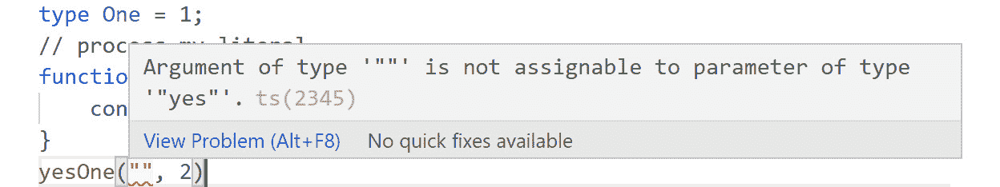

# 6. 高级类型

概述

本章将向你介绍高级类型。你将从高级类型的基础——类型别名、字符串和数字字面量开始。这将帮助你更好地理解，当你承担更复杂的概念，如联合类型时。你还将学习如何将类型组合起来构建更复杂的类型，例如交集。使用高级类型，本章将教你如何编写易于你自己和任何与你一起工作或继承项目的人理解的代码。到本章结束时，你将能够通过将原始类型，如字符串、数字和布尔值，与对象相结合来构建高级类型。

# 引言

在上一章中，我们讨论了接口和继承。你看到了它们如何允许扩展和建模你的类。接口给你的类提供了结构，继承允许你扩展并基于现有代码进行构建。

随着网络应用程序变得越来越复杂，能够对这种复杂性进行建模变得必要，TypeScript 通过高级类型使这一点变得简单。高级类型允许你将作为现代网络开发者将要处理的数据建模为复杂的数据。你将能够从原始类型中创建更复杂的类型，创建出条件性和灵活性的类型。这将使你能够编写易于理解的代码，因此也更容易与之工作。作为一名正在工作的开发者，你可能会遇到一个由 API 提供的需要集成到你的应用程序中的数据集。这些数据集可能很复杂。例如，Google 的 Cloud Firestore 是一个基于文档的实时数据库，可以在对象中嵌套对象。使用高级类型，你可以创建一个与 API 返回的数据完全一致的类型。这将为你提供更多的代码上下文，从而反过来使你和你团队的工作更容易。你还可以通过构建更简单的类型并将它们堆叠起来来构建更复杂的类型。

在本章中，我们将介绍高级类型的基础——类型别名和类型字面量。一旦我们学会了如何构建类型，我们就会继续学习更高级的概念，包括交集、联合和索引类型。所有这些概念都将帮助你学习如何使用高级类型为代码添加上下文和抽象复杂性。

# 类型别名

**类型别名**允许你声明对任何类型的引用——无论是高级类型还是原始类型。别名通过允许我们更简洁地表达来使我们的代码更容易阅读。别名允许你，作为开发者，一次性声明你的类型并在整个应用程序中重用它。这使得处理复杂类型变得更容易，并使你的代码更易于阅读和维护。

假设，例如，我们正在开发一个社交网络应用程序，我们需要为用户提供一个管理员用户类型，以便他们可以管理他们创建的页面。此外，我们还需要定义一个网站管理员用户。在基本层面上，他们都是管理员，因此类型之间会有一些共性。使用类型别名，我们可以创建一个如 *图 6.1* 所示的管理员类型，包含管理员用户将拥有的常见属性，并在创建我们的网站管理员和用户管理员类型时在此基础上构建。别名允许你隐藏代码的复杂性，这将使代码更容易理解。这里有一个将 `Admin` 别名分配给代表典型管理员共同属性的复杂 `type` 对象的图示。我们还有一个别名 `One` 的例子，它被分配给一个类型 `number`，这是一个原始类型：


图 6.1：别名分配复杂管理员类型别名

考虑以下代码片段：

```js
// primitive type assignment
type One = number;
```

在前面的例子中，我们创建了一个别名 `One`，它可以被用作任何数字的类型，因为它被分配为数字类型。

现在，考虑以下代码片段：

```js
// complex (object assignment)
type Admin = {
    username: string,
    email: string,
    userId: string,
    AllowedPages: string   
};
```

在这里，我们创建了一个 `Admin` 别名，并将其分配给代表典型管理员共同属性的对象，在这个例子中。正如你所看到的，我们创建了一个对 `type` 对象的引用，我们现在可以在我们的代码中使用它，而无需每次都实现该对象。

如前图和代码片段所示，类型别名的工作方式与变量赋值类似，除了为原始类型和/或对象创建了一个引用。然后，这个引用可以作为数据模板使用。这将允许你利用强类型语言的所有好处，例如代码补全和数据验证。

在我们进行关于类型别名的第一个练习之前，我们将查看一些原始和复杂赋值的例子。

假设你正在开发一个类方法，该方法只接受数字作为参数。你想要确保当你的方法被使用时，只传递数字作为参数，如果传递了其他类型，则向用户显示正确的错误消息。

首先，我们需要使用以下语法创建一个数字类型别名：

```js
type OnlyNumbers = number;
```

`type` 关键字后面跟着别名 `OnlyNumbers`，然后是 `number` 类型。

现在我们可以构建一个只接受数字作为参数的方法的类，并使用类型别名来强制执行我们的规则：

```js
// instance of numbers only class
class NumbersOnly {
    count: number
    SetNumber(someNumber: OnlyNumbers) {
        this.count = someNumber
    }
}
```

现在，让我们实例化我们的类，并将一些参数传递给我们的方法，以查看我们的代码是否工作。

对于这个例子，让我们尝试将字符串作为参数类型分配：

```js
// class instance
const onlyNumbers = new NumbersOnly;
// method with incorrect arguments
onlyNumbers.SetNumber("15");
```

在前面的代码片段中，我们提供了错误的`string`类型参数，这将导致警告，因为我们的方法`SetNumber`期望一个数字。此外，通过为你的类型别名提供有意义的名称，如`onlyNumbers`，你可以使你的代码更容易阅读和调试。对于这个例子，有问题的代码部分被突出显示，当你悬停在错误上时，你会得到一个非常有用的错误消息，告诉你问题是什么以及如何解决它：


图 6.2：VS Code 中的错误消息

假设你的 IDE 提供了正确的支持，这是这种情况。如果你没有 IDE 支持，你将在代码编译时看到错误消息。

这是一个简单的用例，但随着你的应用程序变得更大，时间过去了一些，或者你在一个大型团队中工作，这种类型安全对于编写无错误的代码至关重要。

让我们考虑另一个例子：假设你正在开发一个在线商店应用程序，你需要使用一个不是由你创建的类。如果创建这个类的人使用了类型并且使用了描述性的名称，那么你使用这段代码会更容易。

现在，让我们用正确的参数类型编辑第一个例子：

```js
// method with correct arguments
onlyNumbers.SetNumber(15);
```

在前面的代码片段中，我们提供了正确的`number`类型参数，并且你的类方法没有问题地接收了参数。

现在，让我们考虑一个复杂的别名赋值。

例如，我们想要创建一个新的函数，该函数接受一个用户对象作为类型参数。我们可以将对象作为函数参数内联定义，如下所示：

```js
// function and type definition  
function badCode(user: {
    email: string,
    userName: string,
    token: string, 
    lastLogin: number
}) {}
```

在前面的代码片段中，代码创建了一个函数，该函数接受一个用户作为参数，但类型是在函数本身中定义的。虽然这可以工作，但假设你在代码的几个地方使用这个对象，那么你将不得不每次都定义这个对象。这非常低效，作为一个好的开发者，你不想重复代码。这种工作方式也会导致错误；它会使你的代码更难处理和更新，因为代码中每个`User`类型的实例都需要更改。类型别名通过允许你一次性定义你的类型，从而解决了这个问题，我们将在下面的代码片段中演示。

正如我们定义了我们的原始类型一样，我们也定义了我们的`User`类型。我们使用`type`关键字，但现在我们将它映射到一个代表我们的`User`类型的对象模板。现在我们可以使用`User`别名，而无需每次需要定义`User`类型时都重新声明该对象：

```js
// object / complex type User
type User = {
    email: string,
    userName: string,
    token: string, 
    lastLogin: number
};
```

正如你所见，我们创建了一个带有别名`User`的类型。这允许你在整个代码中只对这个对象类型进行一次引用并重用它。如果我们没有这样做，我们就必须直接引用该类型。

现在，你可以使用你的`User`类型构建一个新的函数：

```js
// function with type alias
function goodCode(user: User){}
```

如您所见，此代码更加简洁易懂。所有关于`User`类型的代码都在一个位置，当对象发生变化时，所有别名都会更新。在接下来的练习中，你将实现我们到目前为止所学的知识来构建你自己的类型别名。

## 练习 6.01：实现类型别名

在这个练习中，我们将使用我们对类型的了解来构建一个创建产品的函数。例如，假设你正在开发一个购物应用程序，当库存管理员将产品添加到库存中时，你需要将此产品推送到你的产品数组中。这个练习演示了类型别名如何通过允许你一次性定义你的`Product`模型并在整个代码中重用它来发挥其作用。

现在，在一个实际的库存管理应用程序中，你可能有一个前端页面，允许用户手动输入产品名称和相关信息。为了这个练习的目的，让我们假设你想要添加的产品命名为`Product_0`到`Product_5`，并且所有产品的价格都是 100，而每种产品添加到库存中的数量是 15。

这可能并不真正反映库存管理应用程序中的实际场景，但请记住，我们的关键目标是使用类型别名。所以现在，一个简单的`for`循环来完成上述任务就足够了：

注意

本章中所有文件都可以通过在终端中运行`npx ts-node filename.ts`来执行。本练习的代码文件可以在以下位置找到：[`packt.link/EAiHb`](https://packt.link/EAiHb)。

1.  打开 VS Code 并创建一个名为`Exercise01.ts`的新文件。

1.  创建一个原始类型别名，`Count`，它属于`number`类型。`Count`将用于跟踪产品的数量：

    ```js
    //primitive type
    type Count = number;
    ```

1.  创建一个对象类型别名，`Product`，它属于`type`对象。重用`Count`来定义产品的数量。`Product`类型别名将用于定义我们添加到库存中的每个产品。属性在所有产品中是通用的：

    ```js
    // object type 
    type Product = {
        name: string,
        count: Count, //reuse Count
        price: number,
        amount:number,
    }
    ```

1.  声明一个`products`变量，其类型为数组类型的`Product`：

    ```js
    // product array
    const products_list: Product[] = [];
    ```

    为了让我们能够使用`Product`类型，它首先在前面代码中被分配给一个变量，`product_list`变量是一个`Product`类型的对象数组。

1.  创建一个函数，用于向数组中添加产品。重用`Product`类型别名来验证输入参数：

    ```js
    // add products to product array function
    function makeProduct(p : Product ) {
        products_list.push(p); // add product to end of array
    }
    ```

1.  使用`for`循环创建`Product`类型的产品对象并将它们添加到`products`数组中：

    ```js
    // use a for loop to create 5 products
    for (let index = 0; index < 5; index++) {
        let p : Product = {
            name: "Product"+"_"+`${index}`,
            count: index,
            price: 100,
            amount: 15
        }//make product
        makeProduct(p);
    }
    console.log(products_list);
    ```

1.  通过在正确的目录中执行`npx ts-node Exercise01.ts`来编译并运行程序。你应该获得以下输出：

    ```js
     [
      { name: 'Product_0', count: 0, price: 100, amount: 15 },
      { name: 'Product_1', count: 1, price: 100, amount: 15 },
      { name: 'Product_2', count: 2, price: 100, amount: 15 },
      { name: 'Product_3', count: 3, price: 100, amount: 15 },
      { name: 'Product_4', count: 4, price: 100, amount: 15 }
    ]
    ```

在这个练习中，你创建了两个类型别名，这反过来又创建了对你实际类型的引用。

这允许你减少复杂性并使你的代码更易于阅读，因为现在你可以提供具有额外上下文的名字，例如 `Product` 和 `products_list`。如果我们不使用别名来编写此代码，在练习中每次使用别名的地方，你都必须直接定义对象或类型。这在这个简单的函数中可能不是什么大问题，但请记住，构建一个类或大型项目你需要多少代码。

随着我们继续深入到更复杂的类型结构，这些知识将变得极其宝贵。在下一节中，当我们介绍类型字面量时，我们将继续构建我们的知识。

# 类型字面量

**类型字面量**允许你基于特定的字符串或数字创建一个类型。这本身可能不是非常有用，但随着我们继续到更复杂类型，如联合类型，它们的使用将变得明显。字面量很简单，所以我们不会花太多时间在它们上面，但当你进入下一阶段时，你需要理解字面量的概念。

让我们先创建我们的字符串和数字字面量。

我们将从一个字符串字面量开始：

**Example01.ts**

```js
1 // string literal  
2 type Yes = "yes";
Link to the preceding example: https://packt.link/96IlD. 
```

之前的代码创建了一个 `Yes` 类型，它只接受特定的字符串 `"yes"` 作为输入。

同样，我们可以创建一个数字字面量：

```js
3 // number literal
4 type One = 1;
```

在这里，我们创建了一个数字字面量类型 `One`，它只接受 `1` 作为输入。

在前一个示例中观察到的基本语法相当简单。我们以 `type` 关键字开始，然后是我们的新字面量的名称（别名），接着是字面量本身，如前一个语法所示。我们现在有了 `yes` 字符串和数字 `1` 的类型。

接下来，我们将构建一个将利用我们新类型的函数：

```js
5 // process my literal 
6 function yesOne(yes: Yes, one: One ) {
7     console.log(yes, one);
8 }
```

我们已经将函数参数转换为我们的字面量类型，并且由于我们的类型是字面量，只有 `"yes"` 字符串或数字 `1` 将被接受作为参数。我们的函数不会接受其他参数。假设我们传递了 `""` 和 `2` 作为参数（`yesOne("", 2)`）。你会在 VS Code 中注意到以下警告：



图 6.3：传递错误参数时 IDE 显示的警告

现在，假设我们传递了 `"yes"` 和 `2` 作为参数。再次，你会得到以下警告：


图 6.4：传递无法分配的参数时显示的错误

以下是一些你可能期望的错误消息示例，如果你提供了错误的参数。错误消息很清晰，并确切地告诉你如何解决错误。正如你所看到的，尽管我们传递了一个字符串和一个数字，我们仍然得到了类型错误。这是因为这些参数是字面量；它们只能与自身完全匹配。

现在，让我们尝试传递正确的参数：

```js
9 // function with the correct arguments 
10 yesOne("yes", 1);
```

一旦提供了正确的参数，函数就可以无任何问题地调用，如下所示输出：

```js
yes 1
```

在我们继续介绍交集类型之前，让我们快速完成一个简单的练习，以巩固我们对字符串和数字字面量的知识。

## 练习 6.02：类型字面量

现在我们对字面量有了更好的理解，让我们通过一个小练习来巩固我们所学的内容。在这里，我们将创建一个函数，该函数接受一个字符串字面量并返回一个数字字面量：

注意

本练习的代码文件可以在此处找到：[`packt.link/hHgNa`](https://packt.link/hHgNa)。

1.  打开 VS Code 并创建一个名为`Exercise02.ts`的新文件。

1.  创建一个字符串字面量类型`No`，并将其值设置为字符串`"no"`。同时，创建一个数字字面量并将其值设置为 0：

    ```js
    type No = "no"
    type Zero = 0
    ```

1.  编写一个函数，该函数接受`"No"`字面量并将其打印到控制台：

    ```js
    function onlyNo(no: No):Zero {
        return 0;
    }
    ```

1.  输出函数调用的结果：

    ```js
    console.log(
        onlyNo("no")
    )
    ```

    这将产生以下输出：

    ```js
    0
    ```

字面量本身并不是非常有用，但与更复杂的类型结合使用时，它们的有用性将变得明显。目前，你需要了解如何创建字面量，这样你就可以在本书的后面部分使用它们。在下一节中，我们将继续介绍交集类型。到目前为止我们所完成的所有工作都将有助于我们使用类型别名和字面量。

# 交集类型

**交集类型**允许你结合类型以形成一个新类型，该类型具有组合类型的属性。这在以下情况下很有用：你有一个现有的类型，它本身并不能定义你需要的一些数据，但它可以与另一个现有类型结合使用。这类似于多类继承，因为子对象可以有一个或多个父对象，从中继承其属性。

假设你有一个名为`A`的类型，它具有姓名和年龄属性。你还有一个名为`B`的类型，它具有身高和体重属性。在你的应用程序中，你发现需要一个人员类型：你想要跟踪用户的姓名、年龄、身高和体重。你可以通过交集类型`A`和`B`来形成一个`Person`类型。你可能会问，为什么不直接创建一个新的类型呢？好吧，这让我们回到了想要成为优秀的程序员和优秀的程序员保持 DRY（不要重复自己）的原则。除非一个类型在你的应用程序中真正独特，否则你应该尽可能重用代码。此外，还有集中化。

如果你需要修改`Person`类型的任何类型代码，你只需在`A`或`B`中做出更改即可。这也有一点限制，因为可能存在类型`A`被多个对象使用的情况，如果你做出更改，它将破坏应用程序。使用交集，你可以简单地创建一个带有更改的`C`类型，并更新你的`Person`类型。你还可以合并具有共同属性的类型。

考虑这样一种情况，你有一个 `name` 属性在 `A` 中，也在 `B` 中。当类型相交时，你现在将只有一个 `name` 属性；然而，合并的属性不仅要在名称上相同，还应该是同一类型，否则类型将无法合并，并导致错误。

如果这还不清楚，让我们看看一个属性，`age`。这可以在一个类型中是数字，在另一个类型中是字符串。唯一能够相交这些类型的方法是使属性通用，因为它们都需要是字符串或数字。

想象一下，作为一个电子商务项目的一部分，你需要构建一个购物车对象，该对象从 `Product` 对象和 `Order` 对象中继承属性。

下面的图显示了每个对象的基本属性以及使用 `Product` 和 `Order` 对象形成的新 `Cart` 对象的属性：

![图 6.5：显示购物车对象属性的图]


图 6.5：显示购物车对象属性的图

在图中，我们有父对象 `Product` 和 `Order`，它们组合形成一个具有其父对象所有属性的子对象 `Cart`。请注意，我们可以有超过两个父对象在交集中，但为了解释的方便，我们将坚持两个，这样你可以更快地掌握这个概念。在接下来的示例中，我们将通过代码创建我们的新 `Cart` 类型，并展示一个基本的使用案例。

想象你正在开发购物应用程序。你需要创建一个对象来建模你将推送到购物车的产品数据。我们已经有了一个用于产品数据的 `Product` 类型。`Product` 类型包含了我们在网页上显示产品正确信息所需的大部分内容。然而，我们在结账时缺少一些必需的属性。我们将通过不创建新的产品类型来解决这个问题，而是创建一个只包含我们需要的属性的 `Order` 类型：`orderId`、`amount` 和 `discount`，其中 `discount` 是可选的，因为它并不总是适用。

下面是声明 `Product` 类型的代码：

```js
Example02.ts
1 // product type
2 type Product = {
3     name: string, 
4     price: number,
5     description: string
6 } 
7 
8 // order type
9 type Order = {
10     orderId: string,
11     amount: number,
12     discount?: number 
13 }
Link to the preceding example: https://packt.link/DZ7Iz
```

在前面的代码片段中，我们创建了父类型名称 `Product` 和 `Order`。现在我们需要将它们合并。这将创建我们需要的类型来建模购物车数据：

```js
14 // Alias Cart of Product intersect Order
15 type Cart = Product & Order;
```

我们通过将别名 `Cart` 分配给我们的 `Product` 和 `Order` 类型，并在两个类型之间使用 `&`，如前面的代码片段所示来构建我们的购物车对象。我们现在有一个新的合并类型 `Cart`，我们可以用它来建模购物车数据：

```js
16 // cart of type Cart
17 const cart: Cart = {
18     name: "Mango",
19     price: 400,
20     orderId: "x123456",
21     amount: 4,
22     description: "big sweet, full of sugar !!!" 
23 }
```

前面的例子展示了使用 `Cart` 类型声明的购物车对象。正如你所见，我们可以访问所有属性，并且可以省略那些可能不总是适用的可选属性，例如 `discount`。

如果我们没有提供所有必需的属性，IDE 会给出一个非常有用的错误信息，告诉我们如何修复问题：


图 6.6：缺少必需属性时显示的错误信息

现在，让我们在控制台中输出我们的新购物车对象：这将显示以下输出：

```js
{
  name: 'Mango',
  price: 400,
  orderId: 'x123456',
  amount: 4,
  description: 'big, sweet, and full of sugar !!!'
}
```

在下一节中，你将通过执行一个练习来获得创建交集类型的一些实际经验，在这个练习中，你将构建一个原型用户管理系统。

## 练习 6.03：创建交集类型

你正在开发一个电子商务应用程序；你被分配了构建用户管理系统的任务。在应用程序需求中，客户列出了他们期望将与系统交互的用户配置文件类型。你将使用类型交集来构建你的用户类型。这将允许你构建可以组合成更复杂类型并分离关注点的简单类型。这将导致更不易出错且支持更好的代码。在此，我们命名我们将构建的用户类型，并提供它们功能的概述：

+   `_id`、`email` 和 `token`。

+   `accessPages` 和 `lastLogin`。`accessPages` 是一个字符串数组，表示此用户可以访问的页面，而 `lastLogin` 将帮助我们记录管理员用户的激活。

+   `lastBackUp` 和 `backUpLocation`。`lastBackUp` 将告诉我们系统上次备份的时间，而 `backUpLocation` 将告诉我们备份文件存储的位置。

+   **超级用户**：此用户是管理员和用户类型的交集。所有用户都需要基本用户的属性，但只有管理员用户需要管理员属性。在此，我们使用类型交集来构建我们需要的必要属性。

+   `Backup` 用户类型和 `Basic` 用户类型。再次，我们可以将此用户类型所需的必要复杂性纳入我们的基本用户中，以便其能够正常工作。

    注意

    本练习的代码文件可以在此处找到：[`packt.link/FVvj5`](https://packt.link/FVvj5)。

1.  打开 VS Code 并创建一个名为 `Exercise03.ts` 的新文件。

1.  创建一个基本的 `User` 类型：

    ```js
    // create user object type
    type User = {
        _id: number;
        email: string;
        token: string;
    }
    ```

    这将是我们将用作应用程序中其他用户类型基础的类型。因此，它具有所有用户都将需要的常见用户属性。

1.  为需要执行管理员功能的用户创建一个 `Admin` 用户类型：

    ```js
    // create an admin object type
    type Admin = {
        accessPages: string[],
        lastLogin: Date
    }
    ```

1.  为负责备份应用程序数据的用户创建一个 `Backup` 用户类型：

    ```js
    // create backupUser object type
    type Backup = {
        lastBackUp: Date,
        backUpLocation: string
    }
    ```

1.  使用你的 `User` 和 `Admin` 类型，在 `Admin` 交集处声明一个 `User` 类型的 `superuser` 对象。添加所需的属性。为了创建超级用户，你必须为 `User` 和 `Admin` 的属性提供值，如下面的代码块所示：

    ```js
    // combine user and admin to create the user object
    const superUser: User & Admin = {
        _id: 1,
        email: 'rayon.hunte@gmail.com',
        token: '12345',
        accessPages: [
            'profile', 'adminConsole', 'userReset'
        ],
        lastLogin: new Date() 
    }; 
    ```

    在实际应用程序中，此代码可能位于登录函数中，返回的值可能来自登录时的 API。

1.  通过将别名 `BackUpUser` 分配给 `User` 和 `Backup` 的交集来构建 `BackUpUser` 类型：

    ```js
    // create BackUpUser type
    type BackUpUser = User & Backup
    ```

1.  声明一个 `backUpUser` 对象，其类型为 `BackUpUser` 并添加必要的属性：

    ```js
    // create backup user
    const backUpUser: BackUpUser = {
        _id: 2,
        email: 'rayon.backup@gmail.com',
        token: '123456',
        lastBackUp: new Date(),
        backUpLocation: '~/backup'
    };
    ```

1.  在控制台输出你的 `superUser` 和 `backupUser` 对象：

    ```js
    // console out superUser props
    console.log(superUser);
    // console out backup user props
    console.log(backUpUser);
    ```

    这将打印以下输出：

    ```js
    {
      _id: 1,
      email: 'rayon.hunte@gmail.com',
      token: '12345',
      accessPages: [ 'profile', 'adminConsole', 'userReset' ],
      lastLogin: 2021-02-25T07:27:57.009Z
    }
    {
      _id: 2,
      email: 'rayon.backup@gmail.com',
      token: '123456',
      lastBackUp: 2021-02-25T07:27:57.009Z,
      backUpLocation: '~/backup'
    }
    ```

在前面的练习中，你使用了基于 `User`、`Admin` 和 `Backup` 类型的 `superUser` 和 `backupUser` 交集来构建两个用户类型。使用交集允许你保持核心用户类型简单，因此可以用作大多数用户数据的模型。只有当需要建模特定用户情况时，`Admin` 和 `Backup` 才与 `User` 交集。这是关注点的分离。现在，对 `User`、`Backup` 或 `Admin` 所做的任何更改都将反映在所有子类型中。现在，我们将探讨联合类型，这是一种类型功能。然而，与交集不同，当类型合并时，联合类型提供 `OR` 功能。

# 联合类型

使用 `or` 类型功能而不是 `and` 类型功能，这在交集类型中是常见的情况。这类似于 JavaScript 中的三元运算符，其中你正在组合的类型由 `|` 管道分隔。如果这让你感到困惑，随着我们继续到示例，一切都会变得清晰。我们还将探讨类型守卫，这是一个在应用联合类型中将发挥重要作用的模式。首先，考虑以下联合类型的视觉表示：

![图 6.7：联合类型赋值的说明

![img/B14508_06_07.jpg]

图 6.7：联合类型赋值的说明

在前面的图中，我们有一个联合类型赋值的基本图，其中 `Age` 可以是 `number` 或 `string` 数据类型。你可以有超过两个选项的联合类型和非原始类型。这为你提供了编写更动态代码的选项。在接下来的示例中，我们将扩展之前提到的年龄示例，并构建一个基本的联合类型。

假设你正在开发一个需要验证某人年龄的应用程序。你想要编写一个函数，该函数将处理存储在数据库中作为数字的年龄和作为字符串从前端传入的年龄。在这种情况下，你可能会倾向于使用 `any` 作为类型。然而，联合类型允许我们通过不使用 `any` 来创建错误向量来处理这种场景：

```js
Example03.ts
1 // basic union type
2 type Age =  number | string;
Link to the preceding example: https://packt.link/EHziL.
```

首先，我们创建一个联合类型 `Age`，它可以具有 `number` 或 `string` 数据类型，如前面的语法所示。我们将我们的 `Age` 别名分配给由管道 `|` 分隔的类型。我们可以有超过两个选项，例如 `"number" | "string" | "object"`：

现在我们创建一个函数，它将使用前面代码片段中所示的新类型 `Age`：

```js
3  function myAge(age: Age): Age {
4      if (typeof age === "number") {
5          return `my age is ${age} and this a number`;
6      } else if (typeof age === "string"){
7          return `my age is ${age} and this a string`;
8      } else {
9          return `incorrect type" ${typeof(age)}`;
10     }
11 }
```

`myAge` 函数接受 `Age` 类型作为参数，并使用 `if …else` 循环返回一个格式化的 `Age` 类型字符串。我们还在使用类型守卫模式，`typeof`，它允许你检查你的参数类型。这种类型检查在使用联合类型作为参数时是必要的，因为你的参数可以是几种类型之一，在这个前面的代码片段中，是字符串或数字。每种类型都需要用不同的逻辑进行处理。

联合类型也可以是对象；然而，在这种情况下，`typeof` 将不会非常有用，因为它只会返回类型，而这个类型始终是 `object`。为了解决这类情况，你可以检查你的对象是否有任何独特的属性，并以此方式应用你的逻辑。随着我们在下一节中完成练习，我们将看到这方面的示例。

现在，让我们回到示例。为了确保我们的函数按预期工作，我们通过调用它们并使用不同的参数类型（数字和字符串）来控制台输出结果：

```js
console.log(myAge(45));
console.log(myAge("45"));
```

这将导致以下输出：

```js
my age is 45 and this a number
my age is 45 and this a string
```

假设你传递了一个错误的参数：

```js
console.log(myAge(false));
```

你将看到以下错误信息：

```js
error TS2345: Argument of type 'boolean' is not assignable to parameter of type 'Age'.
```

## 练习 6.04：使用 API 更新产品库存

在以下练习中，我们将通过添加 API 扩展我们的库存管理示例 *Exercise 03*。这将允许远程用户通过 API `PUT` 或 `POST` 请求添加和更新我们的库存。

由于更新和添加产品的过程非常相似，我们将编写一个方法来处理这两个请求，并使用联合类型允许我们的方法接受这两种类型并保持类型安全。这也意味着我们可以编写更少的代码，并将所有相关代码封装到一个方法中，这将使我们或任何其他正在开发应用程序的开发者更容易找到和解决错误。

你可以使用 `any` 类型，但这样你的代码就会变得类型不安全，这可能导致错误和不稳定的代码：

注意

这个练习的代码文件可以在以下位置找到：[`packt.link/Qvx6D`](https://packt.link/Qvx6D)。

1.  打开 VS Code 并创建一个名为 `Exercise04.ts` 的新文件。

1.  创建三个类型，`Product`、`Post` 和 `Put`，以及你将需要的基对象，如下所示：

    ```js
    type Product = {
        name: string,
        price: number,
        amount: number,
    }
    type Post = {
        header: string,
        method: string,
        product: Product
    }
    type Put = {
        header: string,
        method: string,
        product: Product,
        productId: number
    }
    ```

    我们首先创建一个产品类型，这将帮助我们定义在 `Put` 或 `Post` 请求中产品数据将采取的格式。我们还定义了 `Put` 和 `Post`，它们略有不同，因为 `Put` 请求需要更新已存在的记录。请注意，`Put` 有 `productId` 属性。

1.  创建一个联合类型 `SomeRequest`，它可以是要么 `Put` 类型，要么 `Post` 类型：

    ```js
    type SomeRequest =  Post | Put
    ```

    与联合类型匹配的数据可以是联合中的任何类型。请注意，联合类型并不组合类型；它们只是尝试将数据匹配到联合中的某个类型，这为你，开发者，提供了更多的灵活性。

1.  创建一个 `Product` 类型的数组实例：

    ```js
    const products: Product[] = [];
    ```

1.  构建一个处理函数，该函数处理`SomeRequest`类型的请求：

    ```js
    function ProcessRequest(request: SomeRequest ) {
        if ("productId" in request) { products.forEach(
                (p: Product, i: number) => {
                   products[request.productId] = {
                       ...request.product
                   };});        
        } else {
            products.push(request.product);
        }}
    ```

    此函数将接收`Put`或`Post`类型的请求，并将附加的产品添加或更新到`products`数组中。为了知道它应该更新还是添加，它首先检查产品是否有`productId`参数。如果有，我们将遍历`Products`数组，直到找到匹配的`productId`参数。然后，我们使用扩展运算符使用请求中的数据更新产品数据。如果产品没有`productId`参数，我们则只需使用数组附加的`push`函数将新产品添加到数组中。

1.  声明`apple`和`mango`对象为`Product`类型，如下所示：

    ```js
    const apple: Product = {
        name: "apple",
        price: 12345,
        amount: 10
    }; 
    const mango: Product = {
        name: "mango",
        price: 66666,
        amount: 15
    };
    ```

    在真实的 API 中，数据将由用户通过请求发送提供，但为了本练习的目的，我们为您硬编码了一些数据来操作。

1.  声明`postAppleRequest`和`putMangoRequest`对象为`Post`和`Put`类型：

    ```js
    const postAppleRequest : Post = {
        header: "zzzzz",
        method: 'new',
        product: apple,
    };
    const putMangoRequest : Put = {
        header:"ggggg",
        method: 'update',
        product: mango,
        productId: 2
    };
    ```

    在前面的代码中，我们已定义我们的`POST`和`PUT`对象。我们将产品对象作为请求的有效负载附加。请记住，函数不是检查产品对象，而是检查请求类型，这将告诉函数它是`POST`还是`PUT`。

1.  调用处理函数，并传递`postAppleRequest`和`putMangoRequest`作为参数，如下面的代码片段所示：

    ```js
    ProcessRequest(postAppleRequest);
    ProcessRequest(putMangoRequest);
    ```

    在正常的 API 中，当用户发起`PUT`或`POST`请求时，会调用`ProcessRequest`方法。然而，我们只是在模拟 API 并自行进行调用。

1.  输出控制台结果：

    ```js
    console.log(products)
    ```

    您将看到以下输出：

    ```js
    [
      { name: 'apple', price: 12345, amount: 10 },
      <1 empty item>,
      { name: 'mango', price: 66666, amount: 15 }
    ]
    ```

    在前面的输出中，我们现在可以看到传递给我们的方法的产品。这意味着我们使用联合类型编写的模拟 API 代码按预期工作。

联合类型，例如交集类型，在构建应用程序时为开发者提供了更多的功能性和灵活性。在前面的练习中，我们能够编写一个函数，该函数接受两种不同类型的单个参数，并根据类型检查模式或类型守卫应用逻辑。在下一节中，我们将继续探讨更多代码灵活性的主题，即索引类型。

# 索引类型

索引类型允许我们创建具有关于它们可能持有的属性数量灵活性的对象。假设您有一个定义错误消息的类型，该消息可以超过一个类型，并且您希望随着时间的推移添加更多类型的消息的灵活性。由于对象具有固定数量的属性，因此每当有新的消息类型时，我们都需要修改我们的消息代码。索引类型允许您使用接口定义您的类型签名，这为您提供了具有灵活数量的属性的能力。在下面的示例中，我们将在代码中扩展这一点：

```js
Example04.ts
1 interface ErrorMessage  {
2    // can only be string | number | symbol
3    [msg: number ]: string;
4     // you can add other properties once they are of the same type
5     apiId: number
6 }
Link to the preceding example: https://packt.link/IqpWH
```

首先，我们创建我们的类型签名，如前文代码片段所示。这里有一个属性名和类型，即索引 `[msg: number]` 后跟值类型。`msg` 参数的名称可以是任何名称，但作为一个优秀的程序员，你应该提供一个在类型上下文中有意义的名称。请注意，你的索引只能是一个数字、字符串或符号。

你也可以向你的索引添加其他属性，但它们必须与索引具有相同的类型，如前文代码片段所示，`apiId: number`。接下来，我们通过类型转换使用你的类型，现在我们可以拥有一个具有所需属性数量的错误信息对象。随着消息列表的增长，我们不需要修改类型。我们保持灵活性，同时保持代码的类型化，这使得代码易于扩展和支持：

```js
7  // message object of Index type ErrorMessage
8  const errorMessage: ErrorMessage  = {
9       0: "system error",
10      1: "overload",
11      apiId: 12345
12 };
```

现在，我们控制台输出新对象，以确保一切正常：

```js
// console out object
console.log(
    errorMessage
);
```

运行文件后，你将得到以下输出：

```js
{ '0': 'system error', '1': 'overload', apiId: 12345 }
```

如果我们尝试给一个属性名赋予错误类型，例如字符串，我们会得到你可能期望的错误信息：


图 6.8：显示类型错误的输出

然而，你可以使用数字字符串，例如，代码将像以前一样运行，输出也将相同：

```js
14 // message object of Index type ErrorMessage
15 const errorMessage: ErrorMessage  = {
16    '0': "system error",
17     1: "overload",
18    apiId: 12345 };
```

你可能会认为这不会工作，因为值是字符串，但它会被转换为数字字面量。使用数字字面量转换为字符串的方式也可以工作。接下来在我们的练习中，我们将模拟索引类型的实际应用，构建一个简单的系统来处理错误信息。

## 练习 6.05：显示错误信息

在这个练习中，我们将构建一个系统来处理错误信息。我们还将重用我们在示例中创建的 `ErrorMessage` 索引类型。这个练习中的代码有些人为设计，但将有助于你更好地理解索引类型：

注意

这个练习的代码文件可以在以下位置找到：[`packt.link/ZkApY`](https://packt.link/ZkApY)。

1.  打开 VS Code 并创建一个名为 `Exercise05.ts` 的新文件。

1.  如果你还没有创建，请从我们的示例中创建 `ErrorMessage` 类型接口：

    ```js
    interface ErrorMessage  {
        // can only be string | number | symbol
        [msg: number ]: string;
        // you can add other properties once they are of the same type
        apiId: number
    }
    ```

1.  根据以下示例，构建一个 `errorCodes` 对象，其类型为 `ErrorMessage`：

    ```js
    const errorMessage : ErrorMessage = {
        400:"bad request",
        401:"unauthorized",
        403:"forbidden",  apiId: 123456,
     };
    ```

1.  根据以下示例创建一个错误代码数组 `errorCodes`：

    ```js
    const errorCodes: number [] = [
        400,401,403
     ];
    ```

1.  遍历 `errorCodes` 数组并在控制台输出错误信息：

    ```js
    errorCodes.forEach(
        (code: number) =>  {
            console.log(
                errorMessage[code]
            );
        }
    );
    ```

    运行文件后，你将获得以下输出：

    ```js
    bad request
    unauthorized
    forbidden
    ```

索引类型允许你在类型定义中具有灵活性，如前文练习所示。如果你需要添加新的代码，你不需要更改你的类型定义；只需将新的代码属性添加到你的 `errorCode` 对象中。索引类型在这里之所以有效，是因为尽管对象的属性不同，但它们都具有相同的基本结构——一个数字属性（键）后跟一个字符串值。

现在你有了高级类型的构建块，你可以完成以下活动。这些活动将利用你在本章中学到的所有技能。

## 活动六.01：交集类型

想象你是一名正在为定制卡车网站开发卡车构建功能的开发者。你需要让来到网站的客户能够构建各种卡车类型。为此，你需要通过组合两个类型`Motor`和`Truck`来构建自己的交集类型`PickUptruck`。然后你可以使用你的新类型`PickUpTruck`，该函数返回类型并使用`PickUpTruck`交集类型验证其输入。

注意

此活动的代码文件可以在此处找到：[`packt.link/n4tfL`](https://packt.link/n4tfL)。

以下是一些帮助你完成此活动的步骤：

1.  创建一个`Motor`类型，它将包含一些你可能单独或与其他类型组合使用的通用属性，用于描述车辆对象。你可以使用以下属性作为起点：`颜色`、`车门`、`车轮`和`四驱`。

1.  创建一个具有卡车通用属性的`Truck`类型，例如`双排座`和`绞盘`。

1.  将两个类型相交以创建一个`PickUpTruck`类型。

1.  构建一个返回我们的`PickUpTruck`类型并接受`PickUpTruck`作为参数的`TruckBuilder`函数。

1.  在控制台输出函数返回值。

1.  一旦完成活动，你应该获得以下输出：

    ```js
    {
      color: 'red',
      doors: 4,
      doubleCab: true,
      wheels: 4,
      fourWheelDrive: true,
      winch: true
    }
    ```

    注意

    此活动的解决方案通过此链接提供。

## 活动六.02：联合类型

一家物流公司要求你在他们的网站上开发一个功能，允许客户选择他们希望包裹如何运输的方式——通过陆路或空运。你决定使用联合类型来实现这一点。你可以创建自己的联合类型，称为`ComboPack`，它可以是指`LandPack`或`AirPack`类型。你可以为你的包裹类型添加你认为将通用的任何属性。同时，考虑使用一个类型字面量来识别你的包裹是空运还是陆运，以及一个可选的标签属性。然后你需要构建一个类来处理你的包裹。你的类应该有一个方法来识别你的包裹类型，该方法接受`ComboPack`类型的参数，并使用你的字面量属性来识别包裹类型并添加正确的标签，`空运货物`或`陆运货物`。

注意

此活动的代码文件可以在此处找到：[`packt.link/GQ2ZS`](https://packt.link/GQ2ZS)。

以下是一些帮助你完成此活动的步骤：

1.  构建`LandPack`和`AirPack`类型。确保有一个字面量来识别包裹类型。

1.  构建一个联合类型`ComboPack`，可以是`LandPack`或`AirPack`。

1.  创建一个`Shipping`类来处理你的包裹。确保使用你的字面量来识别你的包裹类型，并使用正确的标签修改你的包裹。

1.  创建两个`AirPack`和`LandPack`类型的包裹对象。

1.  实例化你的`Shipping`类，处理你的新对象，并在控制台输出修改后的对象。

    注意

    此活动的解决方案通过此链接展示。

## 活动六.03：索引类型

既然你已经很好地将运输选项整合到网站中，公司现在需要你添加一个功能，允许他们的客户跟踪其包裹的状态。对于客户来说，他们有权限随着公司的发展以及运输方式的变化添加新的包裹状态非常重要，他们希望有这种灵活性。

因此，你决定构建一个索引类型，`PackageStatus`，使用`status`属性的接口签名，其类型为`string`，值为`Boolean`类型。然后，你将构建一个包含一些常见包裹属性的`Package`类型。你还将包括一个`packageStatus`属性，其类型为`PackageStatus`。你将使用`PackageStatus`来跟踪你的包裹的三个状态：`shipped`、`packed`和`delivered`，设置为`true`或`false`。然后，你将构建一个类，该类在初始化时接受`Package`类型的对象，包含一个返回`status`属性的方法，以及一个更新并返回`status`属性的方法，该方法接受`status`作为字符串和`Boolean`作为状态。

更新你的包的方法也应该返回你的`packageStatus`属性。

注意

此活动的代码文件可以在此处找到：[`packt.link/2LwHq`](https://packt.link/2LwHq)。

以下是一些帮助你完成此活动的步骤：

1.  使用具有`status`属性为`string`类型和`Boolean`类型值的接口，构建你的`PackageStatus`索引类型。

1.  创建一个包含`PackageStatus`类型属性和一些典型包裹常见属性的`Package`类型。

1.  创建一个类来处理你的`Package`类型，该类在初始化时接受`Package`类型，有一个方法返回你的`packageStatus`属性，以及一个更新并返回`packageStatus`属性的方法。

1.  创建一个名为`pack`的`Package`对象。

1.  使用你的新`pack`对象实例化`PackageProcess`类。

1.  在控制台输出你的`pack`状态。

1.  更新你的`pack`状态，并在控制台输出你的新`pack`状态。

    预期的输出如下：

    ```js
    { shipped: false, packed: true, delivered: true }
    { shipped: true, packed: true, delivered: true }
    ```

    注意

    此活动的解决方案可以通过此链接找到。

# 摘要

在本章中，我们介绍了高级类型，这些类型允许您超越基本类型。随着应用变得更加复杂，前端承担更多功能，您的数据模型也将变得更加复杂。本章向您展示了 TypeScript 高级类型如何让您能够实现强类型，这将帮助您开发更干净、更可靠的应用程序。我们涵盖了高级类型的构建块——类型别名和字面量，然后通过一些实际示例、练习和活动，我们继续探讨了交集、联合和索引类型。

您现在拥有了创建复杂类型的能力，这将使您能够构建适用于现代应用的类型，并编写得到良好支持和可扩展的代码。达到这一点后，您现在拥有了应对像 Angular2 和 React 这样的 Web 框架的工具。您甚至可以在 Node.js 服务器端使用 TypeScript。高级类型还有很多内容，这个主题在实现上相当广泛、复杂和抽象。然而，在本章中，您已经获得了开始使用高级类型构建应用程序所需的所有技能。
