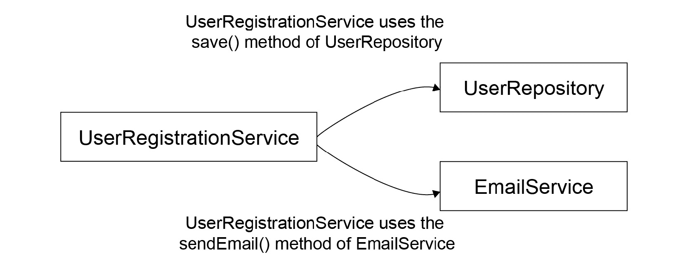
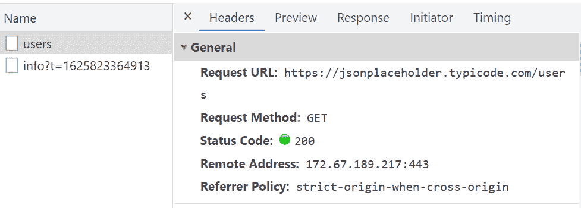

# 8. TypeScript 中的依赖注入

概述

本章向您介绍 TypeScript 中的 **依赖注入**（**DI**）。它演示了如何实现 DI 设计模式。您还将看到一些 DI 模式的常见用例，包括来自 Angular 和 Nest.js 等库的用例。本章将教会您如何构建一个简单的 Angular 应用程序，该程序使用 DI。您还将学习 InversifyJS 的基础知识以及如何在您的 TypeScript 应用程序中使用它。到本章结束时，您将能够使用 InversifyJS 构建一个利用 DI 的计算器应用程序。

# 简介

设计模式是一种通用的、可重复的解决软件设计中常见问题的方法。它不仅仅是您可以粘贴并用于您自己的代码的代码，而是一种编写代码的指南。它通常与任何特定语言无关，因此给定的模式可以从一种语言转换到另一种语言，其实现根据所需的语言和环境进行更改。

设计模式通常可以用于许多不同的场景，并帮助您解决许多不同的问题。例如，如果您想确保只有一个活动连接到数据库，您可能想使用 Singleton 设计模式，它基本上确保只有一个实例存在，或者如果您想编写一个 ORM 工具（一个对象关系映射工具，用于抽象数据库），允许使用多个数据库，您可能想使用 Adapter 设计模式，它允许 ORM 工具使用“通用语言”与多种类型的数据库驱动程序进行通信。

使用设计模式可以加快开发速度，因为它们通过数十年的先前使用在各种问题中得到了实战检验。此外，如果在一个团队中工作，与常规方法相比，解释给定的解决方案更容易。设计模式充当一种“通用语言”。

注意，当开始学习设计模式的概念时，可能很难理解它们，您可能会发现使用它们解决问题比不使用它们更困难。这是因为很难确定特定的设计模式是否适合给定的问题，尤其是当您没有使用它的经验，或者不完全理解该模式或问题时。还有一些模式比其他模式更容易理解（例如，Singleton 模式比 Adapter 模式更容易理解）。

此外，如果你刚开始使用设计模式，其有用性可能直到项目生命周期的后期才会显现，那时你可能实际上想要添加你最初没有考虑到的功能，或者只是修复一些错误。最后，需要注意的是，并不是所有问题都可以通过设计模式来解决，使用错误的设计模式可能会带来比解决的问题更多的问题。同样，并不是每个问题都需要设计模式——你可以在“Hello World”程序中添加尽可能多的模式，但它们的有用性是可疑的。因此，重要的是退一步，看看使用它是否真的适合你试图解决的问题。

# 依赖注入设计模式

依赖注入（DI）是一种技术，其中一个对象提供另一个对象的依赖。对象的依赖是指为了在应用程序中执行其操作所需的任何东西。在深入解释 DI 之前，让我们通过一个例子来尝试理解前定义中的基本元素。

假设我们有两个类：

![图 8.1：简单的类依赖关系

![img/B14508_08_01.jpg]

图 8.1：简单的类依赖关系

如前图所示，类 A 使用了类 B 的一些属性/方法。因此，我们可以说`ClassB`是`ClassA`的依赖。

让我们看看一个更实际的例子（尽管是简化的）。大多数网站，无论是社交媒体网站、政府网站提供的服务，还是电子商务平台，都需要用户注册才能使用网站提供的服务。想象一下，你正在开发这样一个网站。你需要一个`UserRegistrationService`类来收集用户详细信息，将它们保存到数据库、文件或其他存储库中，然后向用户发送一封电子邮件，告知他们注册成功。

你网站处理注册流程的方法可能看起来像这样：

```js
class UserRegistrationService {
    registerUser(email: string, password: string) {
        // TODO: process registration
        // TODO: send registration success email
    }
}
```

此服务有两个主要职责——将用户的详细信息保存到持久存储中，并向他们发送电子邮件。目前，你不必关心这些详细信息是存储在数据库中、SaaS 中还是文件中。同样，你也不必关心注册电子邮件是自动化的还是手工完成的。因此，我们只想得到一些`UserRepository`和一些`EmailService`，如图所示：

```js
interface User {
    email: string;
    password: string;
}
interface UserRepository {
    save(user: User): Promise<User>;
}
interface EmailService {
    sendEmail(to: string, subject: string, body?: string): Promise<void>;
}
```

如前所述，我们不在乎它们的实现，甚至不关心创建它们；我们希望别人来做这件事，因此我们的`UserRegistrationService`实现可能看起来像这样：

```js
class UserRegistrationService {
    constructor(
        private userRepository: UserRepository,
        private emailService: EmailService
    ) {}
    async registerUser(email: string, password: string){
        await this.userRepository.save({
            email,
            password,
        });
        await this.emailService.sendEmail(email, 'Welcome to my website!');
    }
}
```

注意，我们不知道`UserRepository`或`EmailService`的实际实现是什么；我们只知道它们的结构。

现在，如果我们改变用户保存的方式，例如，决定从文件迁移到 MySQL 数据库，或者如果我们改变我们的电子邮件提供商从 Mailchimp 到 SendGrid，`UserRegistrationService`类保持不变，并且只要任何实现都符合相同的`UserRepository`和`EmailService`接口（例如，具有相同的结构——相同的方法签名，相同的参数等），并且提供与之前描述相同的函数性，它应该仍然像以前一样正常工作。

例如，在以下代码片段中，注意基于文件和基于 MySQL 的实现都实现了`UserRepository`，这是`UserRegistrationService`所知道的唯一东西。

基于文件的实现如下：

```js
// FileUserRepository.ts
import * as fs from 'fs';
class FileUserRepository implements UserRepository {
  save(user: User): Promise<User> {
    return new Promise((resolve, reject) => {
      fs.appendFile('users.txt', JSON.stringify(user), err => {
        if (err) return reject(err);
        resolve(user);
      });
    });
  }
}
```

基于 MySQL 的实现如下：

```js
// MySqlUserRepository.ts
import mysql from 'mysql';
class MySqlUserRepository implements UserRepository {
  connection = mysql.createConnection({
    // connection details
  });
  save(user: User): Promise<User> {
    return new Promise((resolve, reject) => {
      return this.connection.query(
        `INSERT INTO users (email, password)
        VALUES (?, ?)`,
        [user.email, user.password],
        (err, data) => {
          if (err) return reject(err);
          resolve(data);
        }
      );
    });
  }
}
```

简单来说，DI 允许我们将*什么*与*如何*分开。依赖类只需要知道如何与*用户仓库*交互——通过调用一个名为`save`的方法，该方法接受一个`User`类型的单个参数），以及与*邮件发送者*交互——通过调用一个名为`sendEmail`的方法，该方法接受两个参数；一个*收件人*电子邮件地址，为`string`类型，第二个参数为电子邮件的主题，也为`string`类型，以及一个可选的第三个参数用于电子邮件的正文（也为`string`类型）。

然后，这些服务可以处理*应该（实际上）做什么*的部分——将用户的详细信息保存到文件、MySQL 数据库或完全不同的地方，然后自动使用 SaaS 服务发送电子邮件，排队等待稍后手动发送，或做任何其他事情。

回到依赖关系图，在这个例子中，依赖关系如下：



图 8.2：UserRegistrationService 依赖关系

在这里使用依赖注入（DI）的另一个好处是它简化了从依赖关系中单独测试我们的实现。例如，当测试`UserRegistrationService`的`registerUser`方法时，我们只想测试`registerUser`方法；我们不在乎其在生产中依赖项的行为（我们将单独测试这些）。我们可以在测试时用任何实现来模拟它们，使它们按我们的意愿行事。记住，DI 的整个目的就是我们不关心依赖项做什么以及它们是如何做的，只要它们符合约定的接口——在这个例子中是`UserRepository`和`EmailService`。以下是我们在代码中测试`registerUser`方法的方式：

```js
interface User {
  email: string;
  password: string;
}
test('User registration', async () => {
  const mockUserRepository: UserRepository = {
    async save(user: User) {
      return user;
    },
  };
  const mockEmailService: EmailService = {
    async sendEmail(to: string, subject: string, body?: string) {},
  };
  const userRegistrationService = new UserRegistrationService(
    mockUserRepository,
    mockEmailService
  );
  await userRegistrationService.registerUser(
    'example@domain.com',
    'super-secret-password'
  );
  expect(mockUserRepository.save).toHaveBeenCalled();
  expect(mockEmailService.sendEmail).toHaveBeenCalled();
  // ...
});
```

尽管前面的例子只展示了类，但依赖项可以是任何类型——类、函数、普通对象，甚至是简单的常量（取决于语言和特定实现）。

例如，如果`UserRegistrationService`需要常数，例如，用于与用户密码散列的盐，它也会在构造函数中提供，作为另一个参数，如下所示：

```js
import * as bcrypt from 'bcrypt';
class UserRegistrationService {
  constructor(
    private userRepository: UserRepository,
    private emailService: EmailService,
    private passwordHashSalt: string
  ) {}
  async registerUser(email: string, password: string) {
    const hashedPassword = await bcrypt.hash(password, this.passwordHashSalt);
    await this.userRepository.save({
      email,
      password: hashedPassword,
    });
    await this.emailService.sendEmail(email, 'Welcome to my website!');
  }
}
```

注意

以下章节将使用装饰器，这些装饰器在*第七章*中有所介绍。请在继续之前确保您已经阅读并理解了它们，因为装饰器是所有接下来介绍的 DI 库构建的基础的重要组成部分。

与 DI 相关的另一个概念是`UserRepository`抽象，它覆盖了`MySqlUserRepository`实现），在 IoC 中，关注的是让消费者决定组件/库应该做什么。例如，在我们上面的`UserRegistrationService`实现中，我们使用了 IoC，因为我们允许指定用户详情的发送方式以及消费者发送电子邮件的方式。在应用程序的情况下，它可以决定是否想要使用`FileUserRepository`或`MySqlUserRepository`，而在测试代码中我们决定它们都应该不执行任何操作。这也是在消费者（测试代码）级别做出的决定。

总结来说，DI 关注的是让一个类了解实现之上的抽象，而 IoC 的关注点在于让消费者决定应该使用哪些实现。

一些流行的框架，无论是前端还是后端，都将 DI 作为其框架的核心部分——最流行的是前端开发中的 Angular 和后端开发中的 Nest.js。DI 使得构建在这些框架之上的应用程序非常健壮和灵活，尤其是在大型应用程序中，因为 DI 的性质允许将类的创建（以及其他依赖项）与其使用分离。

## Angular 中的 DI

另一个实际的现实世界中的 DI 例子可以在 Angular 框架中找到——这是一个使用 TypeScript 构建前端应用程序的现代框架。Angular 有一个自己的 DI 库实现。此外，Angular 框架本身以及基于它的应用程序，都严重依赖于这个 DI 实现。

让我们看看一个简单的 Angular 应用程序，看看 DI 如何使构建易于维护、可扩展的应用程序变得简单。

一个 Angular 应用程序由几个`NgModule`组成，每个`NgModule`通常是应用程序的一个逻辑部分——这可以是功能、UI 组件库或其他任何东西。每个`NgModule`可以有两种类型的“东西”：

1.  声明（`Component`和`Directive`）

1.  提供者（通常是`Service`）

*声明*构成了应用程序的 UI，例如`WelcomeMessageComponent`类（如下面的片段所示），它接受`name`作为输入（使用`@Input`装饰器，这有点像向函数或类的构造函数传递参数，只是针对组件），并在 HTML `h1`标签（用于显示主要标题的 HTML 标签）中显示它：

```js
import { Component, Input } from '@angular/core';
@Component({
    selector: 'welcome-message',
    template: `
        <h1>Welcome {{ name }}!</h1>
    `,
})
export class WelcomeMessageComponent {
    @Input() name: string;
}
```

上述代码将产生以下输出：


图 8.3：将"John"传递给名称输入时的 WelcomeMessageComponent 渲染输出

提供者通常是服务，它们持有应用程序的主要逻辑，通常用于与 UI 无关的任何事物。

例如，你可以有一个`UsersService`类，它负责从后端获取用户列表，如下所示：

```js
import { Injectable } from '@angular/core';
import { Observable, of } from 'rxjs';
export interface User {
    name: string;
}
@Injectable()
export class UsersService {
    getUsers(): Observable<User[]> {
        return of([
            { name: 'Alice' },
            { name: 'Bob' },
            { name: 'Charlie' }
        ]);
    }
}
```

前面的代码中有一个`UsersService`类，它只有一个方法——`getUsers()`，该方法返回一个静态的`User`对象数组。请注意，我们用`of()`包装我们的静态数组，它接受一个静态值并将其包装在一个`Observable`中，这样我们就可以稍后更改此方法的行为，使其异步返回数据（例如，从远程端点，如我们将在下一节中看到）。

注意

可观察对象是一个异步的数据流，基本上允许数据在“发布者”和“订阅者”之间传递。这些数据可以是一次性操作，例如使用 HTTP 调用，可以有多个发射（例如，按顺序每秒发射从 1 到 10 的递增数字），甚至可以是无限的（例如，每次用户点击特定的按钮时都会发射一个事件）。它是观察者模式的一部分。

然后，我们将在`UsersList`组件中使用`UsersService`，该组件以列表形式显示用户，如下所示：

```js
import { Component } from "@angular/core";
import { Observable } from "rxjs";
import { UsersService, User } from "./users.service";
@Component({
  selector: 'users-list',
  template: `
    <ul>
      <li *ngFor="let user of (users$ | async)">
        {{ user.name }}
      </li>
    </ul>
  `
})
export class UsersListComponent {
  readonly users$: Observable<User[]>;
  constructor(private usersService: UsersService) {
    this.users$ = usersService.getUsers();
  }
}
```

在这里，我们创建了一个简单的组件，`UsersListComponent`，它显示用户列表，它从`UsersService`获取用户，该服务在创建时通过 Angular DI 注入到其中。

一旦服务被注入，我们就调用`getUsers()`并将返回的`Observable`存储在`users$`成员变量中，这样我们就可以稍后从模板中访问它，该模板利用`async`管道告诉 Angular 订阅`Observable`并在其基础值变化时更新模板：


图 8.4：运行应用程序的输出

我们不会深入探讨 Angular 的模板引擎或变更检测机制——这些本身都是两个很大的主题——但你可以参考 Angular 文档以获取更多相关信息。相反，让我们专注于 DI 方面的情况——注意我们在`UsersListComponents`构造函数中请求了一个`UsersService`对象；我们没有指定我们想要获取服务的特定实例，等等，只是我们想要一个。这非常强大，因为它将如何以及在哪里实例化此服务的逻辑卸载到一个专门的地方（`NgModule`），并打开了很多可能性。我们可以更容易地测试组件（通过提供一个假的`UsersService`），甚至可以在运行时用另一个实现替换`UsersService`。

Angular 提供者也可以要求其他提供者；例如，我们可以有一个通用的 HTTP 客户端服务，该服务知道如何进行 HTTP 调用，然后将其注入到我们的 `UsersService` 中，这样我们的 `UsersService` 就可以专注于更高级别的细节，例如端点，它需要使用该端点来获取用户信息。实际上，Angular 内置了一个这样的 HTTP 服务，称为 `HttpClient`。您可以使用它，并使用真实的实现来修复我们之前为用户创建的模拟实现，如以下示例所示：

```js
import { Injectable } from '@angular/core';
import { HttpClient } from '@angular/common/http';
import { Observable } from 'rxjs';
export interface User {
    name: string;
}
@Injectable()
export class UsersService {
    constructor(private httpClient: HttpClient) {}
    getUsers(): Observable<User[]> {
        return this.httpClient.get<User[]>('/api/users');
    }
}
```

在这里，我们请求一个 `HttpClient` 并使用其 `get()` 方法向我们的网站中的 `/api/users` 端点发起一个 `GET` 请求，该端点应返回一个 `User` 对象数组——即具有名为 `name` 的 `string` 类型属性的对象。

这通过调用外部端点而不是返回静态的用户列表，用更贴近现实世界的用例替换了我们之前使用的模拟实现。

再次注意，我们再次请求了一个 `HttpClient` 接口。我们不在乎它是如何实现的（这可能涉及使用 `XMLHttpRequest`、`fetch` 或甚至另一个底层库），只要它符合 `HttpClient` 接口即可。

你可能已经注意到，我们从 `HttpClient` 请求的路径是相对路径。如果我们的后端与前端位于同一域名下（例如，[`example.com`](https://example.com) 是我们的网站，[`example.com/api/users`](https://example.com/api/users) 将返回用户信息），则这种方式是可行的。然而，如果我们想将后端迁移到不同的服务器，这将破坏我们的网站。在下一个练习中，我们将通过使用 Angular 的依赖注入机制并添加 `HttpInterceptor` 来解决这个问题。

`HttpInterceptor` 是 Angular 提供的一个接口，我们可以实现它来“钩子”或甚至更改网络请求，无论是在请求的途中（请求）还是在返回的途中（响应），在任何其他消费者“看到”响应之前。这将适用于应用程序中任何使用 `HttpClient` 的地方，而无需在其他使用 `HttpClient` 的服务中进行任何更多的代码修改。

注意

本节讨论的示例是我们下一个练习的基础。

## 练习 8.01：向 Angular 应用添加 HttpInterceptor

在这个练习中，我们将向我们在上一节中构建的现有 Angular 应用程序添加 `HttpInterceptor`，以便我们的后端服务可以位于与前端应用程序不同的域名上。这使得两个应用程序可以完全且非常容易地分离，而无需对应用程序的其他部分进行任何额外更改。以下是完成此练习的步骤：

注意

在开始之前，请确保在`exercise-starter`目录中运行`npm install`。本练习的代码文件可以在此处找到：[`packt.link/avWRA`](https://packt.link/avWRA)。此存储库包含两个文件夹，`exercise-starter`和`exercise-solution`。前者包含您可以使用来与该练习一起编码的模板文件，而后者包含本练习的最终代码，供您参考。

1.  从本节中已编写的应用程序开始克隆。这可以在[`packt.link/JAgZ7`](https://packt.link/JAgZ7)找到。

1.  在新的文件`api-http.interceptor.ts`中创建一个名为`ApiHttpInterceptor`的类，并将其保存在`exercise-starter/src/app/interceptors/`文件夹中。此文件实现了`HttpInterceptor`接口（从`@angular/common/http`导入）。务必使用`@Injectable`装饰器标记它，以便 Angular 知道它是一个可以在 DI 中使用的服务：

    ```js
    import { HttpEvent, HttpHandler, HttpInterceptor, HttpRequest } from '@angular/common/http';
    import { Injectable } from '@angular/core';
    import { Observable } from 'rxjs';
    @Injectable()
    export class ApiHttpInterceptor implements HttpInterceptor {
      intercept(req: HttpRequest<any>, next: HttpHandler): Observable<HttpEvent<any>> {
        throw new Error('Method not implemented.');
      }
    }
    ```

    当任何`HttpClient`发起请求时，Angular 将调用`ApiHttpInterceptor`的`intercept()`方法。我们获取请求（`req`）和`HttpHandler`（`next`），当我们完成时需要调用它们，以便 Angular 调用链中的任何其他`HttpInterceptor`。

1.  更新代码以更改 URL 路径：

    ```js
    import { HttpEvent, HttpHandler, HttpInterceptor, HttpRequest } from "@angular/common/http";
    import { Injectable } from "@angular/core";
    import { Observable } from "rxjs";
    @Injectable()
    export class ApiHttpInterceptor implements HttpInterceptor {
        intercept(req: HttpRequest<any>, next: HttpHandler): Observable<HttpEvent<any>> {
        if (!req.url.startsWith('/api/')) {
          return next.handle(req);
        }
        const relativeUrl = req.url.replace('/api/', '');
        const newRequest = req.clone({
    url: `https://jsonplaceholder.typicode.com/${relativeUrl}`
        });
        return next.handle(newRequest);
      }
    }
    ```

    上述代码检查 URL 路径。对于每个请求，如果它是一个以`/api`开头的相对路径，代码会将其更改。它是通过查看`HttpRequest`的`url`属性来做到这一点的。如果 URL 不以`/api`开头，您不需要做任何事情，只需使用原始请求调用`next.handle()`。否则，使用新的 URL 克隆原始请求，然后使用新的请求调用`next.handle()`。这是实际发送出去的请求。我们在这里使用[`jsonplaceholder.typicode.com`](https://jsonplaceholder.typicode.com)，这是一个免费服务，它有一些预定义的端点，我们可以用来获取测试数据。在实际应用中，这将是你后端服务的端点。

    最后，我们还需要在我们的`AppModule`中注册此拦截器，以便它知道要注入到`HttpClient`中的拦截器。我们通过添加我们创建的提供者`ApiHttpInterceptor`来实现这一点，并告诉 Angular 在查找`HTTP_INTERCEPTORS`时使用它——这是 Angular 在通过`HttpClient`服务进行网络请求时请求所有所需拦截器的 DI 符号。

1.  打开位于`exercise-starter/src/app`文件夹中的`app.module.ts`文件，并使用此处提供的代码进行更新：

    ```js
    import { HttpClientModule, HTTP_INTERCEPTORS } from '@angular/common/http';
    import { NgModule } from '@angular/core';
    import { BrowserModule } from '@angular/platform-browser';
    import { AppComponent } from './app.component';
    import { ApiHttpInterceptor } from './interceptors/api-http.interceptor';
    import { UsersListComponent } from './users-list.component';
    import { UsersService } from './users.service';
    import { WelcomeMessageComponent } from './welcome-message.component';
    @NgModule({    
      imports: [BrowserModule, HttpClientModule],
      declarations: [AppComponent, WelcomeMessageComponent, UsersListComponent],   
      providers: UsersService, { HTTP_INTERCEPTORS list (notice the bold line).
    ```

1.  在`exercise-starter`目录中运行`npm start -- --open`来运行新应用程序。您的默认浏览器应该在`http://localhost:4200`打开，并且您应该看到一个包含 10 个用户的列表：

（而不是 [`localhost:4200/users`](http://localhost:4200/users)）的请求：



图 8.6：对用户端点的请求

注意，这里的 `UsersService` 完全没有改变（你可以想象如果我们有几十个这样的服务，会有什么好处），但它仍然按照预期工作。

本节和练习中解释的所有代码只是 DI 在 Angular 中应用的几个示例。然而，还有更多。你可以将任何值注册为依赖项进行注入（不仅仅是类）。你可以控制提供者的实例化，使其在整个应用程序中为单例，为每个 `NgModule` 或甚至每个 `Component` 实例创建一个新实例。你还可以通过工厂和更多复杂逻辑来创建它们。你只是刚刚触及了 Angular 提供的非常强大的 DI 库的表面。

## Nest.js 中的依赖注入

另一个值得关注的框架，其架构也深受 Angular 影响，是 Nest.js，它也大量使用了依赖注入（DI）。Nest.js 是一个用于使用 Node.js 和 TypeScript 构建后端应用的框架。与 Angular 类似，Nest.js 也拥有 `Modules`（相当于 Angular 的 `NgModule`）和 `Providers`。它还包含 `Controller`，用于处理来自客户端的请求并返回响应。这些与 Angular 的组件类似——两者都是用户所看到的。在 Angular 中，`Component` 和 `Directive` 构成了 UI，而在 Nest.js 中，`Controller` 构成了可消费的 API。

我们不会深入探讨 Nest.js 的架构，但这里有一个简单的例子，展示了它如何利用依赖注入（DI）：

```js
import { Controller, Get, Param } from '@nestjs/common';
import { HelloService } from './hello.service';
@Controller('hello')
export class HelloController {
  constructor(private helloService: HelloService) {}
  @Get(':username')
  async getByUsername(@Param('username') username: string) {
    const message = await this.helloService.getHello(username);
    return { message };
  }
}
```

这是一个简单的 "Hello World" 控制器，对于 `/hello/foo` 的 `GET` 请求，将返回 `{ message: "Hello foo" }`。控制器是在给定前缀下的端点容器（因此在这种情况下，任何以 `"/hello"` 开头的请求都将最终到达这个控制器），而 `@Get` 装饰器围绕 `getByUserName()` 函数告诉 Nest.js 当对给定路径执行 `GET` 方法时调用该方法（方法/装饰器的路径将与控制器的路径连接）——在这种情况下是 `"/hello/:username"`（以 `:` 开头的任何内容都是动态内容的占位符。在这种情况下，`:username` 是占位符，我们可以通过使用 `Param` 装饰器来获取它，给它占位符的名称）。

注意，我们通过 DI 在构造函数中获取 `HelloService`，类似于 Angular。我们还从 `Param` 装饰器中获取用户名参数，这也利用了背后的 DI 来获取当前的 `Request` 对象。最后，框架负责为我们创建 `HelloService` 和 `HelloController`；我们不需要自己这样做。这就像在 Angular 中一样，使得测试 `HelloController` 变得容易，因为你可以只是用模拟实现来伪造 `HelloService`，以断言或修改控制器的行为。这是一个非常简单的例子，但你可以想象将 `HelloService` 替换为类似认证服务或数据库访问的 ORM 工具。

在下一节中，我们将介绍 InversifyJS - TypeScript（以及 JavaScript）应用程序的 IoC 容器。与仅适用于前端或仅适用于后端的 Angular 或 Nest.js 不同，它们都是框架，规定了应用程序的架构将是什么（至少在某种程度上），InversifyJS 是一个通用库，它只做 IoC，并允许你在任何应用程序中使用 DI。

# InversifyJS

InversifyJS 是 TypeScript（以及 JavaScript）应用程序的 IoC 容器（控制反转，DI 是其一部分）的一个实现。它是众多实现之一，正如我们上面所看到的，一些框架自带自己的 DI 解决方案，例如 Angular 或 Nest.js。

注意

InversifyJS 之外的其他通用项目替代方案包括 `TypeDI`、`TSyringe` 以及 `typescript-ioc`。

InversifyJS 的基本思想，与其他大多数 IoC 容器的实现一样，是有一个地方定义所有功能的具体实现，而应用程序的其余部分只依赖于抽象（例如，接口）。这大大减少了耦合度，将一个实现更改为另一个实现不会影响整个应用程序或需要大量的代码更改。

注意

耦合度是指两个组件（通常是类）之间整合/依赖的紧密程度，也就是说，如果我们改变其中一个，另一个在没有对其做出相应更改的情况下崩溃的可能性有多大？两个组件之间整合/连接得越紧密，它们的耦合度就越高，反之亦然。

理想情况下，改变一个类不应该需要改变其他类。在这种情况下，这些类被认为是解耦的（或松耦合的）。

要使 InversifyJS 运作，我们首先需要添加 `typeof` 和 `instanceof` 操作符。

此外，由于 InversifyJS 通过装饰器工作，您需要通过在项目的 `tsconfig.json` 文件中将 `experimentalDecorators` 和 `emitDecoratorMetadata` 设置为 `true` 来启用它们（注意粗体行）：

```js
{
    "compilerOptions": {
        "target": "es5",
        "lib": ["es6", "dom"],
        "types": ["reflect-metadata"],
        "module": "commonjs",
        "moduleResolution": "node",
        "experimentalDecorators": true,
        "emitDecoratorMetadata": true
    }
}
```

注意

为了使 InversifyJS 正常工作，还有一些额外的要求，但所有现代浏览器和 Node.js 版本都应该能够使用它而无需进一步的多重填充。有关更多详细信息，请访问以下链接：[`github.com/inversify/InversifyJS/blob/master/wiki/environment.md`](https://github.com/inversify/InversifyJS/blob/master/wiki/environment.md)。

就像 Angular 和 Nest.js 的 DI 容器（分别对应`NgModule`和`Module`）一样，InversifyJS 也需要知道如何解析依赖。这通常在单个位置配置，通常在项目的根目录下名为`inversify.config.ts`的文件中。

注意

这是推荐的做法，但此文件可以放在任何地方，命名为任何名称，或者拆分为多个文件；例如，为了分离不同功能或域的类的注册，类似于 Angular 中的`NgModules`或 Nest.js 中的`Modules`。

此文件应该是应用程序中唯一存在耦合的地方。应用程序的其余部分应仅依赖于抽象。

这些抽象通常会是接口，但你也可以依赖于一个特定的实现，或者一个`类`（然后可以注入一个兼容的子类）。

此外，由于 TypeScript 中的接口仅在编译时存在（见*第七章*，*继承和接口*），InversifyJS 也需要一个运行时抽象令牌来知道要解析什么。

## 练习 8.02：使用 InversifyJS 的“Hello World”

在这个练习中，我们将使用 InversifyJS 创建一个简单的“Hello World”应用程序。我们将实现典型用例的所有基本构建块。按照以下步骤实现此练习：

注意

此练习的代码文件可以在[`packt.link/bXSTd`](https://packt.link/bXSTd)找到。

1.  首先，在`src`文件夹中创建一个名为`logger.interface.ts`的新文件，使用`interface`创建我们日志记录器的抽象。这是消费者稍后将要引用的内容：

    ```js
    export interface Logger {
        log(message: string): void;
    }
    ```

1.  接下来，为`Logger`创建一个具体实现。当消费者稍后需要`Logger`时，他们将获得此实现注入的代码：

    ```js
    import { injectable } from "inversify";
    import { Logger } from "./logger.interface";
    @injectable()
    export class ConsoleLogger implements Logger {
        log(message: string) {
            console.log(message);
        }
    }
    ```

    注意，`ConsoleLogger`实现了`Logger`。这确保了我们编写了一个与消费者期望兼容的实现，并且它们在运行时不会出错。此外，`@injectable`装饰器用于向 InversifyJS 指示此实现可以作为依赖项使用，并且也可以注入到其他依赖项中。这是我们让 InversifyJS 意识到`ConsoleLogger`是它应该知道的东西的方式。

1.  在`src`文件夹中创建一个名为`types.ts`的新文件。然后，定义一个注入令牌，消费者可以在以后依赖它来请求 InversifyJS 在运行时注入其背后的任何实现：

    ```js
    export const TYPES = {
        Logger: Symbol.for("Logger"),
    };
    ```

    在这个练习中，我们将坚持使用推荐的创建一个`TYPES`对象的方法，该对象解析为每个类型的`Symbol`（在 TypeScript 的大多数 DI 库中需要使用注入令牌，因为接口在运行时不存在，所以 InversifyJS 不能依赖于它们）。

    注意

    如果你的目标环境不支持**symbols**，你可以改用普通字符串。只需确保不要为多个类型注册相同的字符串。

1.  在`src`文件夹中创建一个名为`ioc.config.ts`的新文件。然后，使用以下代码配置 IoC 容器：

    ```js
    import { Container } from "inversify";
    import { ConsoleLogger } from "./console-logger";
    import { Logger } from "./logger.interface";
    import { TYPES } from "./types";
    console-logger, logger.interface, and types) together:
    ```

1.  在`src`文件夹中创建一个名为`main.ts`的新文件，为 logger 创建一个消费者。注意，我们使用`@inject`装饰器来告诉 InversifyJS 我们想要`Logger`类型：

    ```js
    import "reflect-metadata";
    import { inject, injectable } from "inversify";
    import { container } from "./ioc.config";
    import { Logger } from "./logger.interface";
    import { TYPES } from "./types";
    @injectable()
    class Main {
        constructor(@inject(TYPES.Logger) private logger: Logger) {}
        run() {
            this.logger.log('Hello from InversifyJS!');
        }
    }
    // Run the app:
    const main = container.resolve(Main);
    main.run();
    ```

    注意

    接口类型注解只是为了 TypeScript 能够对`logger`实例进行类型检查，但由于接口仅在编译时存在，这在运行时是不相关的，传递给`@inject`的参数才是关键。

1.  现在，通过在父目录中执行`npm start`来运行应用。你应该在你的控制台看到以下输出：

    ```js
    Hello from InversifyJS!
    ```

当然，对于这样一个简单的例子，最好只使用一行代码如下：

```js
console.log('Running');
```

然而，在更复杂的应用中，甚至在简单的应用中，DI 可以帮助，特别是如果应用预计将积极维护，不断添加功能和修复错误。

在下一个活动中，你将负责创建一个更复杂的应用来展示 DI 如何帮助我们开发应用，同时保持最佳实践以使应用易于维护。

## 活动 8.01：基于 DI 的计算器

作为 TypeScript 开发者，你的任务是创建一个计算器。像任何计算器一样，你需要你的应用能够执行四个基本的数学运算：加法(+), 减法(-), 乘法(*)和除法(/)。

注意

为了保持简单并专注于 DI，你不会添加对其他操作符（例如，幂(^)）的支持，也不会支持运算符的优先级，因此你的计算器将只从左到右遍历表达式并执行相关操作。例如，表达式(`13+5*3-7`)将得到`47`，而不是数学上正确的`21`。

要完成这个活动，你必须实现 InversifyJS 并利用 IoC 来提供计算器可以操作的计算运算符。

你可以从入门项目开始，按照这里提供的高级步骤逐步构建。这项活动将挑战你在本章以及之前章节中开发的所有技能。因此，如果你在实现或代码中遇到任何问题，可以自由地查看解决方案进行调试。

注意

此活动基于最后一节，即 InversifyJS，因此在继续进行之前，请确保您完全理解它。您可以在[`packt.link/Pt3Vq`](https://packt.link/Pt3Vq)找到活动启动器和解决方案。`activity-starter`文件夹包含您可以用于与该活动一起编码的模板文件。`activity-solution`文件夹包含代表此活动解决方案的文件。

执行以下步骤以实现此活动：

1.  您将不得不从创建计算器的基本构建块开始——通过接口定义的运算符。

1.  然后，创建加法、减法、乘法和除法运算符。

    对于前面的两个步骤，请注意，您需要创建必要的抽象接口和注入令牌。

1.  实现一个使用 InversifyJS 的运算符的计算器类。此文件代表您的应用程序。您可能需要映射所有表达式部分并解析它们。为此，您可以参考位于`src/utils`文件夹中的`maths.ts`文件，该文件创建并导出两个这样的函数——`tryParseNumberString`和`tryParseOperatorSymbol`。

1.  配置 IoC 容器（位于`src/ioc.config.ts`文件中），以便当`Calculator`请求`TYPES.AddOperator`等时，它可以接收`AddOperator`、`SubtractOperator`等。您可以通过使用 barrels 进一步简化`ioc.config.ts`文件。相关代码可以在`operator/index.ts`文件中找到。您可以使用上述文件中的代码来配置并简化您的 IoC 容器。

1.  创建`main.ts`文件，该文件将启动您的计算器。

    在解决前面的步骤之后，预期的输出应如下所示：

    ```js
    result is 150
    ```

1.  **附加步骤：**

    作为附加内容，假设您想要对计算器中执行的操作进行一些报告。您可以轻松地添加日志记录（基于控制台和文件），而无需太多更改：

1.  对于基于控制台的日志记录，您需要通过依赖注入（DI）添加一个日志记录器，计算器将在每次表达式评估时写入该日志记录器。您可以按照以下步骤进行操作。首先，您需要定义`Logger`接口。然后，创建基于控制台的`Logger`实现。接下来，创建一个注入令牌并将其注册到我们的容器中。然后，在主计算器应用程序的代码中使用该日志记录器。

1.  现在，假设我们想要将基于控制台的日志记录器替换为基于文件的日志记录器，这样它就可以在运行之间持久化，以便我们可以跟踪计算器的评估历史。

1.  要做到这一点，您首先需要在`src/logger`文件夹中创建一个新文件，创建一个实现`Logger`的`FileLogger`类。然后，您需要在用于基于控制台的日志记录的`ioc.config.ts`文件中进行单行更改。

    对于基于控制台的日志记录，使用以下命令：

    ```js
    container.bind<Logger>(TYPES.Logger).to(ConsoleLogger);
    ```

    对于基于文件的日志记录，使用以下命令：

    ```js
    container.bind<Logger>(TYPES.Logger).to(FileLogger);
    ```

    然而，请注意，您必须正确地在所有文件中导入所有`Logger`接口。

    基于控制台的日志记录器的输出如下：

    ```js
    [LOG] Calculated result of expression:13*10+20 is 150
    ```

    基于文件的记录器的输出如下：

    ![图 8.7：将应用程序更改为使用基于文件的记录器后，activity-starter/src/tmp/calculator.log 文件中的最终输出]

    

图 8.7：将应用程序更改为使用基于文件的记录器后，activity-starter/src/tmp/calculator.log 文件中的最终输出

注意

您可以通过这个链接找到这个活动的解决方案。

这个活动的解决方案（`activity-solution`）还包括针对所有内容的单元测试，因此您可以了解当使用 IoC 时测试是多么简单，以及检查您的实现是否通过测试。此外，`activity-solution`还包括一个创建`ConfigurationService`的文件，该服务为`FileLogger`提供动态的`loggerPath`，包括内存中的实现或基于环境变量的实现。

在 InversifyJS 方面还有更多内容需要探讨。然而，本章提供了一个良好的起点。我们鼓励您查看官方文档，以了解更多它所能提供的内容，并查看更多示例，包括工厂、容器模块和中间件。然而，这些主题超出了本章的范围。

# 摘要

本章首先通过解释如何实现依赖注入设计模式以及通过一系列用例向您展示，使您了解了 TypeScript 中依赖注入的基础知识。您还学习了如何使用依赖注入构建基本的 Angular 应用程序。

本章还介绍了 InversifyJS 的一些基础知识，并解释了如何在应用程序中使用它。您已经看到，在不破坏其他消费者的代码的情况下添加或更改依赖项是多么容易，以及 IoC 和 DI 如何以非常简单的方式替换一种实现为另一种实现，对所有消费者来说都是如此。

当然，关于这个主题的内容远不止本章所涵盖的。然而，本章为在 TypeScript 中使用依赖注入（DI）提供了一个良好的起点。在下一章中，你将学习 TypeScript 中的泛型。
