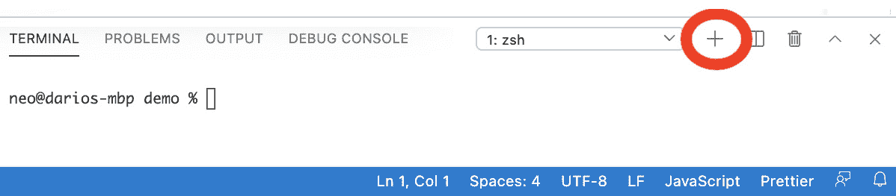

# *第三章*：浏览网站

我们已经为本书的其余部分奠定了基础。在*第一章* *Puppeteer 入门*中，我们学习了浏览器自动化和无头浏览器。*第二章* *自动化测试和测试运行器*是关于自动化测试和测试运行器。现在是时候更实际一些了。在本章中，我们将学习关于 UI 测试，但是在现实世界中。

在接下来的章节中，我们将选择一个用 Vue.js 制作的开源网站进行测试，但我们也将浏览许多其他公共网站。我希望你学习到可以帮助你测试任何框架的网站的技术。

我还想与你分享一些工具，这样你就可以带着一个完整的工具箱完成这本书。在本章中，我们将学习如何将我们的代码推送到 GitHub 并使用 GitHub Actions 运行测试。

在上一章中，我们创建了一个测试项目，并运行了一些测试，但没有过多关注我们使用的 Puppeteer API。在本章中，我们将再次创建一个测试项目，但这次我们将更深入地了解 Puppeteer 在每个 API 上能提供什么。

本章我们将涵盖以下主题：

+   介绍本章的测试网站

+   创建 Puppeteer 浏览器

+   浏览网站

+   使用响应对象

+   持续集成简介

到本章结束时，我们将测试一个真实网站，将其推送到 GitHub，并自动运行我们的测试，学习许多新的 API。让我们看看本章我们可以使用哪些测试网站。

# 技术要求

你可以在 GitHub 仓库（[`github.com/PacktPublishing/ui-testing-with-puppeteer`](https://github.com/PacktPublishing/ui-testing-with-puppeteer)）下的`Chapter3`目录中找到本章的所有代码。我们将把`Chapter3`作为所有演示的基础路径。在`Chapter3`目录内，你会找到三个子目录：

+   `vuejs-firebase-shopping-cart`包含测试网站。

+   `init`是你可以用来跟随本章的目录。

+   `demo`包含本章的最终代码。

# 介绍本章的测试网站

在本章中，我们将测试一个用 Vue.js 制作的网站。Thang Minh Vu ([`me.coddeine.com/`](https://me.coddeine.com/))编写了一个很好的 Vue.js 示例：**vuejs-firebase-shopping-cart** ([`github.com/ittus/vuejs-firebase-shopping-cart`](https://github.com/ittus/vuejs-firebase-shopping-cart))。

小贴士

当你在 GitHub 或任何其他类似 GitHub 的网站上寻找项目时，你需要注意该项目使用的许可证。代码是开源的并不意味着你可以随意使用它。本项目使用的是**MIT 许可证**，这是最宽松的许可证之一。这个许可证基本上表明你可以无限制地使用代码，包括但不限于使用、复制、修改、合并、发布、分发、再许可和/或销售软件副本，并允许软件提供者这样做。

由于我们不希望你处理 firebase 设置，我在 GitHub 上分叉了这个项目（在 GitHub 上创建了一个副本），移除了所有的 firebase 代码。你可以在这个章节中使用的代码的基本结构在`init`目录中找到。你只需要在基本文件夹中运行`npm install`，然后在`vuejs-firebase-shopping-cart`文件夹中运行以下命令。

```js
> cd init
> npm install
> cd vuejs-firebase-shopping-cart/
> npm install
> npm run build
> npm run serve
```

在终端中，你应该已经收到了成功消息和网站现在运行的 URL：


网站运行中

现在我们应该在端口`8080`上运行一个不错的网站。


示例网站运行中

我们需要两个终端来完成这个项目。在一个终端中，我们将运行网站。在第二个终端中，我们将启动我们的测试。

如果你正在使用 VS Code，请注意**终端**标签页有一个加号按钮。如果你点击那个按钮，将创建一个新的终端。你可以通过按钮左侧的选择列表在终端之间切换。



新终端选项

让我们使用之前使用的相同命令在一个终端中运行网站：

```js
> cd vuejs-firebase-shopping-cart 
> npm run build
> npm run serve
```

你应该得到类似以下的内容：

```js
DONE  Compiled successfully in 5523ms                     
1:42:33 PM
  App running at:
  - Local:   http://localhost:8080/ 
  - Network: http://192.168.86.64:8080/
  Note that the development build is not optimized.
  To create a production build, run npm run build.
```

现在让我们在另一个终端中运行测试：

```js
npm test
```

在这里，你应该得到类似以下的内容：

```js
> mocha --timeout 30000 --reporter=list
   Login Page Should have the right title: 3ms
  1 passing (875ms)
```

在上一章中，我们没有过多关注我们如何使用 Puppeteer。我们只知道如果我们执行`browser = await puppeteer.launch();`，我们会得到一个新的浏览器。如何？不知道。好吧，现在是时候更深入地了解 Puppeteer 是如何工作的了。

# 创建 Puppeteer 浏览器

`launch`函数的签名不是`launch()`，而是`launch(options)`。由于 JavaScript 给予我们的自由度，我们可以直接不传递那个参数，`launch`函数将获取`options`作为`undefined`。

## 使用 Puppeteer.launch 函数

根据官方文档，以下是 Puppeteer 7 支持的`Puppeteer.launch`的所有选项（[`github.com/puppeteer/puppeteer/blob/v7.0.0/docs/api.md#puppeteerlaunchoptions`](https://github.com/puppeteer/puppeteer/blob/v7.0.0/docs/api.md#puppeteerlaunchoptions)）：

+   `product`: 要启动哪个浏览器。在这个时候，这将是`chrome`或`firefox`。

+   `ignoreHTTPSErrors`: 在导航期间是否忽略 HTTPS 错误。当你想自动化具有无效或缺失 SSL 证书的网站时，此选项将变得很有用。这将防止 Chromium 在这些情况下返回无效证书页面。

+   `headless`: 是否以无头模式运行浏览器。默认为 `true`，除非 `devtools` 选项为 `true`。

+   `executablePath`: 运行浏览器可执行文件的路径，而不是捆绑的 Chromium。

+   `slowMo`: 通过指定的毫秒数减慢 Puppeteer 操作。这很有用，可以让你看到正在发生的事情。

+   `defaultViewport`: 为每个页面设置一致的视口。默认为 800x600 视口。`null` 禁用默认视口。视口是一个具有以下属性的对象：

    a) `width`: 以像素为单位的页面宽度。

    b) `height`: 以像素为单位的页面高度。

    c) `deviceScaleFactor`: 指定设备缩放因子。

    d) `isMobile`: 是否考虑 `meta viewport` 标签。

    e) `hasTouch`: 指定视口是否支持触摸事件。

    f) `isLandscape`: 指定视口是否处于横幅模式。

+   `args`: 传递给浏览器实例的附加参数。

+   `ignoreDefaultArgs`: 如果为 `true`，则不使用 `puppeteer.defaultArgs()`。如果提供了一个数组，则过滤掉给定的默认参数。

+   `handleSIGINT`: 在按下 *Ctrl +C* 时关闭浏览器进程。

+   `handleSIGTERM`: 在接收到 `SIGTERM` 信号时关闭浏览器进程。

+   `handleSIGHUP`: 在接收到 `SIGHUP` 信号时关闭浏览器进程。

+   `timeout`: 等待浏览器实例启动的最大时间（以毫秒为单位）。默认为 `30000`（30 秒）。传递 `0` 将禁用超时。

+   `dumpio`: 是否将浏览器进程的 `stdout` 和 `stderr` 管道连接到 `process.stdout` 和 `process.stderr`。

+   `userDataDir`: 用户数据目录的路径。

+   `env`: 指定对浏览器可见的环境变量。

+   `devtools`: 是否为每个标签自动打开 DevTools 面板。如果此选项为 `true`，则 `headless` 选项将设置为 `false`。

+   `pipe`: 通过管道连接到浏览器而不是 WebSocket。默认为 `false`。

+   `extraPrefsFirefox`: 可以传递给 Firefox 的附加首选项。

这是一份很长的列表，我知道。但我不想只写我认为有趣的特性。我想让你全面了解 `launch` 选项。现在，让我们谈谈你需要了解的选项。

## 无头模式

我认为 `headless` 选项是最常用的。记得我告诉过你我们要使用无头浏览器吗？我不会说我骗了你，但我确实骗了你。无头模式是默认模式，但实际上，你可以通过将 `headless` 设置为 `false` 来启动浏览器，这被称为 *"有头模式"*。有头模式在调试自动化代码时很有用，因为你将看到浏览器中的情况。我敢打赌这将是默认的本地设置。这就是你可以在有头模式下启动浏览器的方式：

```js
const browser = await puppeteer.launch({ headless: false });
```

这行代码将启动一个几乎看起来像正常浏览器的浏览器。


Headful 模式下的浏览器

如你所见，这是一个完整的运行中的浏览器。唯一的区别是，你将看到一个横幅，上面写着“Chrome 正在被自动化测试软件控制。”如果有人问你，不，你不能移除那个横幅。我相信，在互联网上到处都是钓鱼和黑客活动的情况下，告诉潜在的用户浏览器后面有一个应用程序在控制和监控浏览器活动是很重要的。

## 用户数据目录

`userDataDir`，在启动浏览器之前，Puppeteer 将创建一个新的目录。然后当浏览器关闭时，它将删除它。这意味着会话或我们存储在 cookies 中的任何内容都不会在测试运行之间保留。

在 UI 测试中，我们可能想要使用这个选项来检查网站是否如预期地使用了本地存储（例如，cookies）。网站是否记得登录用户？购物车是否被保留？

## 可执行路径

`executablePath`选项在 UI 测试中并不常见。大多数测试将使用 Puppeteer 下载的浏览器运行。尽管如此，这个选项在任务自动化或抓取时使用得很多，当你想要使用你通常使用的浏览器，或者在某些持续集成环境中，你想要运行已经下载的浏览器时。

如我们在*第一章*中看到的，“使用 Puppeteer 入门”，Puppeteer 保证与特定版本的 Chromium 兼容。在 Puppeteer 7.0.0 的情况下，Chromium 版本是 90.0.4403.0。这并不意味着它不能与任何其他版本一起工作，但它没有保证。

提示

如果你是一名 macOS 用户，Chrome 可执行文件将位于应用程序包`Google Chrome.app`内部。例如，`/Applications/Google Chrome.app/Contents/MacOS/Google Chrome`。

如果我们想要使用我们通常使用的确切相同的浏览器，仅使用`executablePath`选项是不够的。请记住，如果我们不传递一个，Puppeteer 将创建一个新的用户数据目录。我们需要传递浏览器使用的用户数据目录。在 Windows 中应该是`%LOCALAPPDATA%\Google\Chrome\User Data`，在 Mac 中是`~/Library/Application Support/Google/Chrome`，在 Linux 中是`~/.config/google-chrome`。如果你想双重检查这个值，你可以使用你的浏览器导航到`chrome://version/`。在那里你会看到当前的**配置文件路径**。你需要从 MacOS 中删除默认目录。

提示

如果你打算使用自己的浏览器，你可以安装 puppeteer-core 而不是 Puppeteer。puppeteer-core 不会下载浏览器，这样可以加快安装时间并节省磁盘空间。

## 默认视口

如果你尝试了 headful 模式，你可能看到如下内容：


无默认视口的 Headful 模式

不，网站没有出问题。如果我们不传递 `defaultViewport`，Puppeteer 将默认为 800x600 的视口。如果你想知道视口是什么，根据维基百科，“视口是整个文档的可视部分。”

视口是 UI 测试的一个重要组成部分。用户体验专家和设计师会付出很大的努力，试图为用户使用设备提供最佳体验。前端开发者使用 CSS 断点来确定根据视口大小显示哪种布局。Rico Sta. Cruz 在他的博客文章 *我应该使用哪些媒体查询断点？* ([`ricostacruz.com/til/css-media-query-breakpoints`](https://ricostacruz.com/til/css-media-query-breakpoints)) 中发布了这个出色的断点列表：

+   移动设备在竖屏模式下：从 320px 到 414px。

+   移动设备在横屏模式下：从 568px 到 812px。

+   竖屏表格：从 768px 到 834px。

+   横屏表格：从 1024px 到 1112px。

+   笔记本电脑：从 1366px 到 1440px。

+   桌面显示器：1680px 到 1920px。

你不需要很多设备来测试这个。只需打开一个浏览器并更改窗口大小。


](img/Figure_3.06_B16113.jpg)

Packtpub.com 使用的不同断点

如果你查看那张截图，你会看到该网站根据视口显示或隐藏不同的元素。在大的视口中，它会显示一个大的搜索栏，假设是桌面体验。当它检测到小的视口，假设是移动设备，它会隐藏搜索栏并显示汉堡按钮。

在编写我们的测试时，我们需要考虑所有这些变化。

小贴士

而不是试图猜测视口大小，询问你的前端团队他们使用哪些断点。但请记住，许多错误正是在这些精确的断点出现的，测试断点，并检查它们是否合适。

当我们讨论移动仿真时，我们将在*第八章*“环境仿真”中更深入地探讨这个话题。这里有一个最后的技巧。如果我们传递 `null`，视口将适应窗口大小，就像在正常浏览器中预期的那样。

## 产品

你是说我们可以用 Puppeteer 自动化 Firefox 吗？是的，我们可以。尽管这仍然是实验性的。这是“实验性”的官方定义：“目前官方对 Firefox 的支持是实验性的。与 Mozilla 的持续合作旨在支持常见的端到端测试用例，开发者期望跨浏览器覆盖。Puppeteer 团队需要用户的反馈来稳定 Firefox 支持，并将缺失的 API 提到我们的注意。”我的非官方定义是：“它使用 Firefox 的夜间构建版本，长期支持似乎没有保证。”

声明除外，如果你想启动 Firefox 浏览器，你首先需要安装 Puppeteer 并设置 `PUPPETEER_PRODUCT` 变量：

```js
PUPPETEER_PRODUCT=firefox npm install puppeteer@7.0.0
```

然后你可以将 Firefox 设置为产品：

```js
browser = await puppeteer.launch({ product: 'firefox' });
```

## 浏览器参数

`args` 选项是一个可以传递给浏览器的参数或 **标志** 的数组。有超过 1,400 个标志 ([`www.hardkoded.com/ui-testing-with-puppeteer/chrome-flags`](https://www.hardkoded.com/ui-testing-with-puppeteer/chrome-flags))。涵盖所有 1,400 个标志是不可能的。

`--no-sandbox` 是最常见的标志。根据官方文档：*为了保护主机环境免受不受信任的网页内容的影响，Chrome 使用多层沙盒。为了正确工作，主机应首先配置。*

这里的关键短语是 *"主机应首先配置。"* 你可能需要创建一个具有正确权限的用户，以便在更受限的环境中（如使用 `–no-sandbox` 标志）使用 Puppeteer，这将绕过沙盒系统。

其他常见标志如下：

+   `--window-size` 用于设置窗口大小。

+   `--proxy-server` 和 `--proxy-bypass-list` 用于设置代理设置。

另有一个选项称为 `extraPrefsFirefox`。您可以使用此属性来设置 Firefox 标志。希望您不需要处理这些标志太多。

## 移动选项

`deviceScaleFactor`、`isMobile`、`hasTouch` 和 `isLandscape` 将帮助我们设置移动仿真。我们将在 *第八章* *环境仿真* 中更深入地介绍这些选项。

如您所见，`puppeteer.launch()` 远不止这些，还有许多其他功能供您继续挖掘。

## 实践中的选项

现在我们来看看如何在现实世界中应用这些新特性。我们现在可以做的第一件事，以及你应该从现在开始做的，是从配置文件中加载选项对象。记住，我们拥有的配置类是 JavaScript 代码。我们可以在其中添加一个名为 `launchOptions` 的属性，并将其传递给 `launch` 函数。如果你不想填充它，你甚至不需要这样做，但它将存在，随时可以使用。

您的配置文件将看起来像这样：

```js
module.exports = ({
    local: {
        baseURL: 'http://localhost:8080/',
        launchOptions: { headless: false }
    },
})[process.env.TESTENV || 'local'];
```

现在，当我们使用 `local` 配置运行这些测试时，它将以全屏模式启动浏览器。下一步是将此选项传递给 `launch` 函数：

```js
before(async() => {
    browser = await puppeteer.launch(config.launchOptions);
});
```

现在我们尝试编写一个真实的测试。我们想测试在关闭浏览器后登录操作是否被持久化。

这些是步骤：

1.  使用用户数据目录打开浏览器。

1.  检查我们是否已注销（检查登录按钮是否显示 **登录**）。

1.  登录。

1.  检查我们是否已登录（检查注销按钮是否显示 **注销**）。

1.  关闭浏览器。

1.  打开浏览器。

1.  我们应该已经登录。

我们将无法在其他测试中重用我们正在使用的浏览器，因为我们需要创建自己的用户数据目录：

```js
it('It should persist the user', async() => {
    const userDataDir = fs.mkdtempSync('profile');
    const options = config.launchOptions;
    options.userDataDir = userDataDir;
    let persistentBrowser = await puppeteer.launch(options);
    let persistentPage = await persistentBrowser.newPage();
    let loginModel = new LoginPageModel(persistentPage, config);
    await loginModel.go();
    (await loginModel.logState()).should.equal('Login');
    await loginModel.login(config.username, config.password);
    (await loginModel.logState()).should.equal('Logout');
    await persistentBrowser.close();
    persistentBrowser = await puppeteer.launch(options);
    persistentPage = await persistentBrowser.newPage();
    loginModel = new LoginPageModel(persistentPage, config);
    await loginModel.go();
    (await loginModel.logState()).should.equal('Logout');

    await persistentBrowser.close();
    deleteFolderRecursive(userDataDir);
});
```

这个测试比其他测试要长，因为我们需要创建两次浏览器、页面和模型。忽略 `loginState` 和 `login` 函数的工作原理。我们将在接下来的章节中介绍这些函数。

非常令人印象深刻，所有这些功能都可以隐藏在单行代码中。现在让我们看看如何提高我们的导航技能。

# 在网站中导航

如果你看看如何在浏览器中导航到不同的页面，基本上有四种方式：

+   你在地址栏中输入 URL 或使用书签。

+   你使用浏览器函数来后退、前进或重新加载页面。

+   你在页面上点击元素。

+   你正在浏览的网站将重定向到另一个页面。

`goto` 函数模拟了第一个选项，即导航到网站。我们使用它来导航到我们想要测试的页面：

```js
await this.page.goto(this.config.baseURL + 'login');
```

现在，猜猜看？`goto` 的签名不是 `goto(url)`，而是 `goto(url, options)`。你会发现这个模式反复出现——一个具有一个或多个必需参数（或没有）的函数，然后是一组额外选项。

幸运的是，`goto` 期望的选项并不像我们在 `launch` 选项中看到的那样多。它只有三个选项：

+   `timeout`: 最大导航时间（以毫秒为单位）。

+   `waitUntil`: 当何时认为导航成功。

+   `referrer`: 引用者头部值。

让我们逐一分析这些选项。

## 超时

你会在许多函数中看到 `timeout` 参数。Puppeteer 将超时分为两组：**导航超时**和**通用超时**（这不是官方名称；我只是这样命名，以便更容易理解这些概念）。

如果我们想在所有导航调用中设置默认超时，我们可以在配置文件中创建一个属性并在每个地方使用它。这听起来是个不错的想法，但有一个更好的解决方案。我们可以在配置文件中使用一个属性，但不是将它们传递给每个函数，而是调用 `page.setDefaultTimeout(timeout)` 或 `page.setDefaultNavigationTimeout(timeout)`。

`page` 对象将存储传递给这些函数的超时时间，并将其用作默认值。

重要提示

如果你没有向函数传递超时时间，也没有设置默认超时，Puppeteer 将将超时设置为 30 秒（30,000 毫秒）。

如果我们在本地测试网站，等待 30 秒来加载页面听起来好像很多。让我们将时间减少到 5 秒。我们可以在配置文件中添加一个新的属性：

```js
local: {
    baseURL: 'http://localhost:8080/',
    timeout: 5000,
},
```

然后，我们可以使用默认超时来设置该值：

```js
page.setDefaultTimeout(config.timeout);
```

小贴士

你不需要 `await` `setDefaultTimeout` 或 `setDefaultNavigationTimeout`，因为它们不是 `async`。

下一个选项是 `goto` 中最有趣的一个选项。

## waitUntil

你可能会想，“等待什么？”想象一下，当你执行类似 `await page.goto('https://www.packtpub.com/')` 的操作时，Puppeteer 会在命令发送到浏览器后立即解析 `promise`。你运行的下一个命令将得到一个空页面，因为它需要一些时间才能准备好使用。我敢打赌你在等待页面加载时看到过白屏。你必须 **等待** 页面准备好。


空页面

等待页面准备就绪在浏览器自动化中是关键。我看到的大多数 Stack Overflow 问题都与这个问题相关：你怎么知道页面已经准备好了？我希望当你完成这本书时，你能掌握这个主题。在*第五章*，“等待元素和网络调用”，我们将探讨许多技术来回答这个问题，但`page.goto`给我们提供了这个第一个工具：`waitUntil`选项。

`waitUntil`支持四个选项：

第一个选项，也是默认选项，是`load`。如果你传递`load`（或没有选项），当`load`事件触发时，`promise`将被解析。根据 Mozilla 的说法，`load`事件在整个页面加载时触发，包括所有依赖资源，如样式表和图像。

第二个选项是`domcontentloaded`，它依赖于`DOMContentLoaded`事件。根据 Mozilla 的说法，`DOMContentLoaded`在初始 HTML 文档已完全加载和解析时触发，无需等待样式表、图像和子框架完成加载。

最后两个选项与网络相关。`networkidle0`将在过去 500 毫秒内没有更多网络连接时解析承诺。另一方面，`networkidle2`将在过去 500 毫秒内不超过 2 个网络连接时解析承诺。

哪个更好？一般来说，默认选项就足够好，而且相当安全。如果你在**DOM**加载后有很多**AJAX**调用，并且你想等待页面停止从服务器加载数据，你可能需要切换到网络选项。我们将在*第五章*，“等待元素和网络调用”中了解更多关于这一点。

### 什么是 AJAX 调用？

AJAX 调用变得如此流行，以至于许多开发者停止了将它们称为 AJAX 调用。你也可能听到这被称为“调用端点”或“调用（REST）API”。

但基本上，它是对服务器进行的一个异步调用，用于获取更多数据或将数据发送到服务器。别担心，我们将在*第五章*，“等待元素和网络调用”中深入探讨这一点。

### 什么是 DOM？

**文档对象模型**（**DOM**）是浏览器基于服务器发送的 HTML 或由 JavaScript 创建的 HTML 构建的对象表示。

记住，一个 HTML 页面不过是通过网络发送的文本文件。浏览器加载这个文本，构建模型（DOM）表示，然后浏览器引擎渲染这个 DOM。在那个时刻，浏览器可以说发生了`load`事件。

这带我们来到了最后一个选项：引用者。

## 引用者

引用者是一个浏览器发送到服务器的 HTTP 头，告知服务器请求该资源的页面。

你可以查看，如果你去[`www.packtpub.com/`](https://www.packtpub.com/)，打开开发者工具，并在网络标签下检查任何 CSS 文件。


来源网址

有趣的事实，HTTP 头被称为`referer`是因为 HTTP 规范中的一个错误。

你什么时候会用到这个选项呢？嗯，这个选项并不常见，但有些页面可能会根据来源网址改变行为。一些网站可能会将其用作验证：“只有从该网站进入时，此页面才能进行导航。”你可以通过使用`referer`选项强制这种情况。

在本节开头，我们提到其他类型的导航是浏览器返回、前进和重新加载的功能。Puppeteer 为所有这些动作提供了一个 API：

+   `page.goBack(options)`

+   `page.goForward(options)`

+   `page.reload(options)`

这些函数的行为与`page.goto`相同。你不需要传递一个网址，因为它可以从动作本身推断出来。`goBack`和`goForward`基于浏览历史，而`reload`将使用相同的网址。

另一个区别是，它们不支持`referer`选项，因为它将使用第一次导航中使用的相同的来源网址，因为这些操作是过去重复执行的导航。

但这还不是全部；`goto`隐藏了一个惊喜。好吧，它并不是隐藏的；它是文档化的。接下来我们需要了解的是，`goto`有一个返回值。它返回一个`response`对象。

# 使用响应对象

响应是网络中的一个重要概念。对于浏览器发送到服务器的每个请求都有一个相应的**响应**。

`goto`返回一个`response`是有意义的。它发起了一个请求，结果是相应的响应。

我们可以用响应做很多事情。我们不会在本章中涵盖所有功能。但这些都是我们可以用作`goto`动作响应的最相关函数。

## 获取响应网址

如果我知道我想要去的网址，为什么还要知道网址呢？

服务器可能会将你重定向到另一个页面。例如，如果你在隐身/私密模式下打开浏览器并导航到[`mail.google.com/`](https://mail.google.com/)，你会看到服务器将你重定向到[`accounts.google.com/signin`](https://accounts.google.com/signin)。

我不是说你应该总是检查响应网址以防万一，但你必须知道你正在测试的网站可能会那样表现。一个常见的场景是登录检查。你导航到一个页面，如果响应网址是登录页面，你执行登录操作，然后你可以返回到上一个页面并继续测试。

## 获取响应状态码

每个响应都有一个 HTTP 状态码。它告诉你服务器如何响应你的请求。状态码被分为五个类别。这些是根据维基百科的定义（[`en.wikipedia.org/wiki/List_of_HTTP_status_codes`](https://en.wikipedia.org/wiki/List_of_HTTP_status_codes)）：

**1xx 信息响应**：*请求已接收，正在继续处理*。你不需要处理这些。

**2xx 成功**：*请求已成功接收、理解并被接受。* 所有 2xx 代码之间有一些差异，但您必须知道的是，2xx 代码意味着一切顺利。状态码 **200** 是最常见的。

**3xx 重定向**：*为了完成请求，需要采取进一步的操作。*

当服务器想要重定向用户时，这不是服务器操作，而是浏览器需要执行的操作。服务器告诉浏览器：“你请求了 [`mail.google.com/`](https://mail.google.com/)，但你必须转到 https://accounts.google.com/signin。” 浏览器需要获取新的 URL 并执行另一个请求。

最常见的状态码是 **301 – 永久重定向** 和 **302 – 临时重定向**。**301** 告诉浏览器旧的 URL 不再使用，浏览器应始终使用新的 URL。**302** 是最常用的。它告诉浏览器应暂时跳转到新的 URL。这就是登录场景的情况。

**4xx 客户端错误**：*请求包含语法错误或无法满足。*

4xx 代码被称为 *"是你的错"* 错误。请求中存在某些问题。4xx 代码列表非常庞大。对于这些场景，我认为大家最熟悉的代码是闻名世界的 **404**，它告诉您资源 **未找到**。您可能遇到的其它错误是 **401 – 未授权** 和 **403 – 禁止访问**，它们与安全问题相关。

**5xx 服务器错误**：*服务器未能满足显然有效的请求。*

5xx 代码被称为 *"是服务器的错"* 错误。最常见的是 **500**，这意味着服务器已失败。我希望您永远看不到这个，但如果您尝试抓取一个网站并得到 **503**，这意味着 **服务器不可用**，这意味着服务器开始拒绝您的请求或您使服务器关闭。

函数 `response.status()` 将返回与响应关联的状态码。

如果您只想知道响应是否成功，有一个快捷方式：`response.ok()`。此函数将在状态码在 200 到 299 之间时返回 true。

让我们通过实现以下测试来测试这些功能：“管理员页面应将您重定向到登录页面”。在 `test` 目录中，您会发现我们有一个 `admin.tests.js` 文件，我们可以在这里放置我们的管理员页面测试。为了测试重定向，我们可以这样做：

```js
it('Should redirect to the login page', async() => {
  const response = await pageModel.go();
  response.status().should.oneOf([200, 304]);
  response.url().should.contain('login');
});
```

最终状态可以是 `response.url()` 来获取该响应的 URL。

如果我想检查我是否有效地从管理员页面重定向了？

嗯，这有点棘手。我们提到每个响应都与一个请求相关联。Puppeteer 使用`response.request()`函数公开这一点。我们不会立即深入研究`request`对象，但你现在需要知道的是，请求包含了一个请求经过的所有重定向的列表。Puppeteer 使用`redirectChain()`函数来表示它们。有了这个，我们就有了整个重定向映射。


重定向链

这可能听起来很复杂，但一旦你开始尝试，你就能理解这个概念。最终的代码将看起来像这样：

```js
it('Should redirect to the login page', async() => {
  const response = await pageModel.go();
  response.status().should.equal(200);
  response.url().should.contain('login');
  response.request().redirectChain()[0].response().status().should.equal(302);
  response.request().redirectChain()[0].response().url().should.contain('admin');
});
```

我们从 Puppeteer 的`launch`函数和导航中学到了很多。正如我在本章开头提到的，我还想分享一些可以添加到你的工具箱中的工具。让我们谈谈持续集成。

# 连续集成简介

如果有一个工具可以保证不会有一行代码破坏你正在测试的功能，那岂不是很好？

这就是**持续集成**（**CI**）的含义。持续集成是在将更改引入代码库之前运行测试代码的实践。Atlassian 给出了一个很好的定义（[`www.atlassian.com/continuous-delivery/continuous-integration`](https://www.atlassian.com/continuous-delivery/continuous-integration)）：**持续集成**（**CI**）*是自动化将多个贡献者的代码更改集成到单个软件项目的实践。它是 DevOps 的最佳实践之一，允许开发者频繁地将代码更改合并到中央仓库中，然后运行构建和测试。在集成之前，使用自动化工具来断言新代码的正确性。*

让我们回顾一个理想的流程：

1.  我们将代码库存储在源代码控制仓库中。它可能是 GitHub、Gitlab、Bitbucket，或者是一个本地服务器，该服务器托管一个 Git 服务器。

1.  开发者从主代码库中创建一个新的分支。

1.  我们在那个分支上做了一些更改。

1.  然后，它创建一个拉取请求或合并请求。开发者请求他们的更改被审查并合并到主代码库中。

1.  其他开发者将审查更改，但持续集成过程也将在该分支上运行。

1.  如果开发者批准更改并且持续集成运行成功，代码将准备好合并到主代码库中。

这听起来像是一个理想的世界，对吧？尽管生活不会总是那么完美，我们可以实现这一点。如果你在开始新项目时实施这个工作流程，那么遵循它将会很容易。在一个持续的项目中实施所有这些将会更具挑战性。我的建议是逐步进行这些更改，不要过多地影响生产力。

市场上有很多持续集成工具。大多数都有入门级的免费层和一些付费层。你将在它们之间看到的以下主要区别：

+   对私有仓库的支持：一些持续集成工具只提供免费层用于公共仓库。

+   并行运行的数量：如果你有一个相当大的团队，同时打开了多个 Pull Requests，这将非常重要。

+   计算能力：他们可能会在更高等级上提供更好的虚拟机。

+   报告：你将找到不同类型的报告。

这些是 2021 年最受欢迎的持续集成工具；还有很多其他的，但这些都是你会在周围看到的：

+   Travis CI

+   Circle CI

+   AppVeyor

+   Jenkins

+   GitHub Actions

我们将使用 GitHub Actions 测试我们的代码，仅仅因为我们只需要一个 GitHub 账户，我们就可以从我们的仓库做所有事情。

首先，让我们在 GitHub 上创建一个新的仓库。如果你没有 GitHub 账户，你可以在[`github.com/join`](https://github.com/join)创建一个。一旦你有了账户，你可以在 https://github.com/new 创建一个仓库。

![创建新的仓库

![img/Figure_3.10_B16113.jpg]

创建新的仓库

这里一个重要的事情是要选择`.gitignore`模板，这样我们就不提交`node_modules`文件夹。

一旦创建了仓库，你就可以使用**代码**按钮获取 Git URL。

![Git 远程 URL

![img/Figure_3.11_B16113.jpg]

Git 远程 URL

我们现在将把这个 Git 仓库克隆到一个新的文件夹中，把我们的工作代码复制到那里，并将其**推送到**GitHub：

```js
> git clone https://github.com/kblok/ch3-demo.git
> cd ch3-demo
```

注意，你需要使用**你的**Git URL，而不是我的。

接下来，我们需要把我们的当前代码复制到那个文件夹中。确保你在复制这些项目时删除任何额外的`git`文件夹。之后，我们需要运行这三个命令来提交我们的代码并将其推送到 GitHub：

```js
> git add .
> git commit -m "First commit"
> git push origin
```

现在是设置 CI 的时候了。GitHub actions 中的 CI 任务位于`.github/workflows`目录内的 YAML 文件。这是我们需要的步骤：

+   检出分支。

+   构建网站。

+   构建测试包。

+   启动网站。

+   运行测试。

以下示例并不假装是 GitHub Actions 中运行 Puppeteer 测试的规范方式。有许多不同的实现方式。让我们在`.github/workflows`目录内创建一个名为`test.yml`的 YAML 文件（你可以选择任何名称）。文件看起来像这样：

```js
name: CI
on:
  push:
    branches:
      - master
  pull_request:
    branches:
      - master
jobs:
  test:
    name: Test
    runs-on: ubuntu-latest
    steps:
    - uses: actions/checkout@master
    - name: Install Web Dependencies
      working-directory: ./vuejs-firebase-shopping-cart
      run: npm install
    - name: Install Test Dependencies
      env:
        PUPPETEER_SKIP_CHROMIUM_DOWNLOAD: 'true'
      run: npm install
    - name: Run Site Test Code
      uses: mujo-code/puppeteer-headful@master
      env:
        TESTENV: 'CI'
        CI: 'true'
      with:
        args: sh ./.github/workflows/test.sh
```

+   首先，我们说的是我们想要何时运行这个操作。然后，我们设置这个操作在每次`master`分支上运行。但也会在每次`master`分支上运行。这意味着在 Pull Request 合并后也会运行。

+   `- uses: actions/checkout@master`将检出我们的代码。

+   在`- name: 安装 Web 依赖`下，我们构建网站。

+   在`- name: 安装测试依赖`下，我们构建测试项目。

+   在`- name: 运行网站测试代码`下，我们使用 shell 文件`test.sh`运行网站和测试，这个文件很简单，如下所示：

    ```js
    cd ./vuejs-firebase-shopping-cart
    npm run serve & npx wait-on http://localhost:8080
    cd ..
    npm test
    ```

正如你所见，我在运行测试之前正在等待`npm run serve`打印出 http://localhost:8080。

你会发现我们正在使用`uses: mujo-code/puppeteer-headful@master`。在虚拟机中运行浏览器可能具有挑战性。这些虚拟机有许多限制。你需要找到可以帮助你在虚拟机中启动浏览器的食谱。

在这种情况下，`mujo-code/puppeteer-headful`为我们留下了一个可以使用的浏览器。这就是为什么我们设置环境变量`PUPPETEER_SKIP_CHROMIUM_DOWNLOAD: 'true'`，这样当我们运行`npm install`时，Puppeteer 不会下载浏览器，因为我们将使用现有的一个。

由于我们将使用现有的浏览器，并且我们将在受限环境中运行它，我们需要一组新的启动选项。这就是为什么我设置了环境变量`TESTENV: 'CI'`，并在配置文件中添加了一个新的设置：

```js
CI: {
        baseURL : 'http://localhost:8080/',
        username: 'admin@gmail.com',
        password: 'admin',
        launchOptions: { 
            executablePath: process.env.PUPPETEER_EXEC_PATH,
            headless: true,
            args: ['--no-sandbox'],
        },
        timeout: 5000,
    },
```

我将可执行文件路径设置为环境变量`PUPPETEER_EXEC_PATH`，这是由`mujo-code/puppeteer-headful`设置的。

在设置好所有这些之后，您将开始在您的拉取请求中看到构建。假设一个开发者来创建一个更改颜色的拉取请求。


一个更改代码片段的拉取请求

如果您转到**检查**选项卡，您将看到所有操作及其状态。在这种情况下，我们可以看到我们的测试运行正确：


拉取请求中的构建结果

在那里，您将找到所有构建细节，包括所有测试结果。但这些结果也会传播到 GitHub 上的其他页面。您将能够在拉取请求的主页上看到构建结果，甚至在拉取请求列表中。


拉取请求主页面上的构建结果

在那里，您将看不到全部细节，但它会为您提供快速查看，以便您知道拉取请求是否准备好合并。

我知道这可能会让人感到不知所措。把这当作一个想法，看看它看起来是什么样子，可能有哪些可能性，以及您在设置所有这些时可能会遇到的挑战。这并不容易，但值得付出努力。

# 摘要

正如您所看到的，我们开始深入探索 Puppeteer API。我们了解了在启动浏览器时我们可以使用的所有不同选项。我们还学习了如何导航网站，以及我们从一个页面跳转到另一个页面时拥有的不同选项。我们还看到了之前未提及的新对象，例如`Response`和`Request`类。

我希望您觉得持续集成部分很有价值。在云中运行测试有很多工具和不同的方法。这是您工具箱中必须添加的一个基本工具。

在下一章中，我们将更加实用。我们将看到如何与页面交互，从 CSS 选择器到鼠标和键盘模拟。
