# 第四章：*第四章*：与页面交互

感谢*第三章*，“网站导航”，我们现在知道如何打开浏览器以及我们启动浏览器和创建新页面所拥有的所有不同选项。我们还了解了如何导航到其他页面。我们学习了 HTTP 响应以及它们与请求的关系。

本章讨论的是交互。在 UI 测试中，模拟用户交互是至关重要的。单元测试中有一个名为** Arrange-Act-Assert**（**AAA**）的模式。这个模式强制测试代码遵循特定的顺序：

+   Arrange – 准备上下文。

+   Act – 与页面交互。

+   Assert – 检查页面反应。

在本章中，我们将学习如何在页面上查找元素。我们将了解开发团队如何改进他们的 HTML，以便你能够轻松地找到元素。但如果无法更改页面 HTML，我们还将探讨另一组工具来查找所需的元素。

一旦我们找到了一个元素，我们就会想要与之交互。Puppeteer 提供了两组 API：一组是动作函数，如点击、选择或输入。然后我们有一组模拟函数，如鼠标事件或键盘模拟。我们将涵盖所有这些函数。

本章将介绍一个我们尚未提及的新对象：**元素句柄**。

到本章结束时，我们将把另一个工具添加到我们的工具箱中：Visual Studio Code 调试工具。

本章我们将涵盖以下主题：

+   HTML、DOM 和 CSS 简介

+   查找元素

+   使用 XPath 查找元素

+   与元素交互

+   键盘和鼠标模拟

+   与多个框架交互

+   使用 Visual Studio Code 调试测试

到本章结束时，你将能够模拟大多数类型的用户交互。但首先，我们需要打下基础。让我们来谈谈 HTML、**文档对象模型**（**DOM**）和 CSS。

# 技术要求

你可以在 GitHub 仓库（[`github.com/PacktPublishing/UI-Testing-with-Puppeteer`](https://github.com/PacktPublishing/UI-Testing-with-Puppeteer)）的`Chapter4`目录下找到本章的所有代码。请记住在该目录下运行`npm install`，然后进入`Chapter4/vuejs-firebase-shopping-cart`目录并再次运行`npm install`。

如果你想在遵循本章的同时实现代码，你可以从`Chapter3`目录中留下的代码开始。

# HTML、DOM 和 CSS 简介

如果你不知道 CSS，你就找不到元素；如果你不理解**DOM**和**HTML**，你就不会理解 CSS。因此，我们需要从基础知识开始。

我敢打赌你已经听说你可以用 HTML、CSS 和 JavaScript 来构建网站。你可能正在使用不同的服务器端技术。你的前端可能使用像 React 或 Angular 这样的酷技术来实现。但最终，结果将是一个基于 HTML、CSS 和 JavaScript 的页面。

**HTML** 是页面的内容。如果你访问任何网站，打开 **开发者工具**，然后点击 **元素** 选项卡，你将看到页面的内容。你会看到页面的标题。如果你是一个新闻网站，你将看到那里的所有文章。如果你访问一篇博客文章，你将看到那篇文章的文本。

没有使用 **CSS**，HTML 页面看起来就像记事本中写的文本。CSS 不仅带来了颜色和字体，它还是给页面提供结构的框架。

有趣的事实

Firefox 内置了一个工具可以禁用页面上的所有样式。如果你转到 **查看** | **页面样式** 并点击 **无样式**，你将看到没有 CSS 的生活会是怎样的。

最后一个部分是 JavaScript。JavaScript 为页面带来了行为。一旦浏览器解析了 HTML 并构建了 DOM，它就允许我们操作并赋予页面生命。

但是，正如我之前提到的，我们需要回到基础，回到网络的基石。让我们从 HTML 开始。

## HTML

**HTML** 代表 **超文本标记语言**：超文本是因为 HTML 本身不是内容；HTML 包含内容。标记是因为它使用标签来赋予内容意义。语言是因为，尽管许多开发者不同意，并且对此感到愤怒，但 HTML 是一种语言。

如果我们将 HTML 文件作为数据结构来读取，我们可以说 HTML 是 XML 的 **宽松** 版本。因此，为了更好地理解 HTML，我们需要查看 XML 的基础知识。

这些是 XML 内容的基本元素：

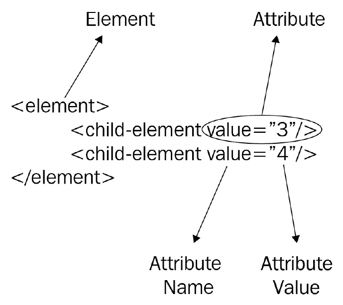

XML 内容

如果你看看这张图，你几乎已经知道了你需要了解的关于 XML 的所有内容。好吧，也许我在夸张。但这就是想法：

+   你有元素，这些元素表示为 `<ElementName>`。在我们的例子中，我们有 `element>` 和 `<child-element>`。

+   元素可能具有属性，这些属性表示为 `AttributeName=" AttributeValue"`。在我们的例子中，我们有 `value="3"` 和 `value="4"`。

+   元素可能包含其他元素。你可以看到我们在主 **element** 中有两个 **child-element** 元素。

+   一个元素通过 `</ElementName>` 结束（闭合），或者用 `/>` 结尾而不是 `>`。

XML 解析器对这些规则非常严格。如果你正在尝试解析的 XML 内容违反了其中任何一条规则，解析器将认为整个 XML 无效。无论是缺少闭合元素还是没有引号的属性，解析器都将无法评估 XML 内容。

但是我们会发现，在解析 HTML 内容时，浏览器并不那么严格。让我们看看以下 HTML：

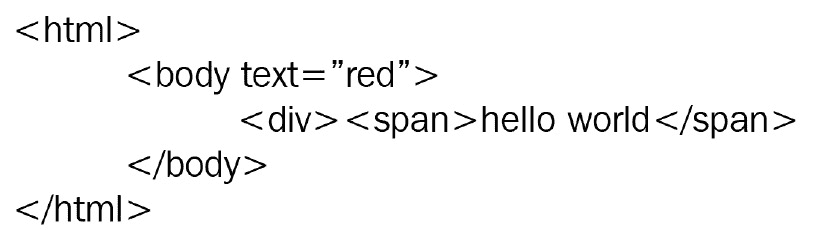

一个损坏的 HTML

这简单的 HTML 会在浏览器中用红色打印出 *Hello World*。

这是不是有效的 XML？不是。正如你所见，`<div>` 元素没有闭合。但这是不是有效的 HTML？是的。

重要提示

浏览器试图渲染 *损坏的* HTML 的行为并不意味着你应该轻视它。你可能已经听到开发者说，某个特定的错误是由于 *缺少关闭的 div*。例如，如果 HTML 损坏了，比如缺少关闭的 `div`，浏览器将尝试猜测渲染该 HTML 的最佳方式。浏览器在尝试修复损坏的 HTML 时所做的决定可能会导致页面按预期工作，或者整个页面布局损坏。

另一个有趣的概念是，XML 规范并没有给元素赋予意义。元素名称、属性以及从该内容产生的信息取决于谁编写了 XML 以及谁在阅读它。

HTML 是具有意义的 XML。在 *1993* 年，被称为万维网发明者的 *Tim Berners-Lee* 决定，主要元素将被称为 `HTML`，并且它将包含一个 `BODY`。他决定图像将用 `IMG` 元素表示，段落将是 `P` 元素，等等。多年来，浏览器和网页开发者遵循并改进了这一惯例，最终形成了我们今天所说的 HTML5。作为社区的一员，我们一致同意 HTML 元素的意义。

我们达成共识，如果我们添加具有值 `red` 的 `text` 属性，我们将得到红色的文本，等等。HTML 中有多少种元素类型？很多！好消息是，你不需要知道所有这些。

知识越多，你将越有效率。然而，这些是在页面上最常见到的元素。

### 文档结构元素

每个 HTML 文档都将包含在一个 `<html>` 元素内部。这个 HTML 元素将有两个子元素。你将找到的第一个元素是 `<head>`。在这个 `<head>` 元素内部，你可以找到元数据元素，例如 `<title>`，它包含页面标题，以及许多 `<meta>` 元素，它们包含标准 HTML 不支持的元数据。许多网站使用 `<meta>` 来强制页面在社交媒体上的显示方式。你将找到的第二组元素是 `<link>` 元素，包括 CSS 文件，以及 `<script>` 文件，包括 JavaScript 代码。尽管脚本元素被接受在头部，但大多数网站会在页面底部添加它们的脚本元素以实现更快的渲染。

你将找到的第二个元素是 `<body>` 元素。页面本身将在这个元素内部。

### 文本元素

然后我们有基本的文本元素。

`<h1>`、`<h2>`、`<h3>`、`<h4>`、`<h5>` 和 `<h6>` 是标题。如果你有一个文本编辑器，你可能已经看到有很多级别的标题和副标题。

`<p>` 将表示段落。然后你可能会发现 `<span>` 元素，它有助于在段落中样式化文本的一部分。

另一种文本元素是`<label>`。这些标签与输入控件相关联，例如单选按钮，为该控件提供上下文。例如，单选按钮或复选框没有文本；它只是一个勾选或单选。你需要标签来为它们提供上下文：

![Radio buttons with labels]

![img/Figure_4.3_B16113.jpg]

带标签的单选按钮

这个 HTML 有三个标签。*Huey*为第一个单选选项提供上下文，*Dewey*为第二个，*Louie*为最后一个。

我们将要查看的最后一种文本元素是列表元素。列表以父元素表示，`<ul>`用于无序列表或`<ol>`用于有序列表，以及`<li>`元素。你将在菜单栏中看到很多这样的元素。

### 动作元素

HTML 中有两种主要的动作元素。`<a>`锚点，也称为链接，最初是为了带你到另一个页面而设计的，但如今它不仅仅局限于这一点，它还可以在页面内触发动作。

第二个元素是`<button>`，尽管它最初是为了通过 HTTP POST 请求将数据发送到服务器而设计的，但现在它被用于许多其他类型的动作：

重要提示

那些只使用按钮和链接来执行操作的日子已经过去了。由于大多数 HTML 元素都支持点击事件，你会发现一些页面将元素显示为按钮，但实际上，那些按钮是 HTML 元素，例如**DIVs**。

![Links and buttons at packtpub.com]

![img/Figure_4.4_B16113.jpg]

packtpub.com 上的链接和按钮

许多时候，你不会注意到链接和按钮之间的区别。例如，在[packtpub.com](http://packtpub.com)网站上，搜索按钮是一个`button`元素，而购物车按钮实际上是一个`anchor`。

你的大部分自动化代码将涉及点击这些动作元素。

### 容器元素

容器元素的作用是分组元素，主要用于布局和样式目的。最受欢迎的元素是`DIV`。`DIV`是什么？它可以是一切：项目列表、弹出窗口、页眉，等等。它用于创建元素组。

曾经是容器元素之王的元素是`TABLE`。正如其名称所暗示的，表格代表一个网格。在`TABLE`元素内部，你可以有`TR`元素代表行，`TH`元素代表表头单元格，`TD`元素代表行内的列。我提到这是容器元素之王，是因为社区现在已经从表格转向了`DIVs`，这是由于性能问题、对更复杂布局的需求以及响应性问题。但你在一些使用网格样式显示信息的网站上仍然可能会看到一些表格。

`<header>`用于网站页眉，`<footer>`用于页脚，`<nav>`用于导航选项，`<articles>`用于博客文章，等等。这些元素的目的在于帮助外部工具（如屏幕阅读器、搜索引擎甚至同一浏览器）理解 HTML 内容。

### 输入元素

我们需要了解的最后一批元素是输入元素。最常见的输入元素是多功能的`input`元素。根据`type`属性，它可以是`"text"`、`"password"`、`"checkbox"`、`"file"`（上传）等等；列表继续到总共 22 种类型。

然后我们有下拉列表的`select`元素和表示下拉列表项的`option`元素。

当然，我们不应该忘记``元素。没有图片的网站是无法想象的。

重要提示

你现在看到的输入并不都是这些元素之一。为了使输入更用户友好或更美观，你会发现开发者可能会基于许多其他元素构建输入。例如，你可能会找到一个下拉列表，它不是选择元素，而是一个输入元素，加上一个箭头按钮，点击它会显示一个浮动列表。这种控件使网站更美观，但自动化更具挑战性。

HTML 不仅有已知的元素列表，还有已知的属性列表。这些是你最常看到的属性：

+   `id`: 识别一个唯一元素。它是`DOM`（我们将在下一节中讨论`DOM`）中的元素 ID。

+   `class`: 包含应用于元素的 CSS 类。它接受多个 CSS 类，用空格分隔。

+   `style`: 分配给元素的 CSS 样式。

HTML 不会限制你可以添加到元素中的属性。你可以添加任何你想要的属性，例如，`defaultColor="blue"`。一个惯例是使用`defaultColor`是一个有效的属性，而一般惯例使用`data-default-color="blue"`代替。

我们感兴趣的另一组属性是`role="treeitem"`和`aria-expanded="true"`。

在过去的几段中，DOM 被提到了几次。让我们来谈谈 DOM。

## DOM

DOM 是你可以使用 JavaScript 与之交互的 HTML 接口。根据 MDN([`www.hardkoded.com/ui-testing-with-puppeteer/dom`](https://www.hardkoded.com/ui-testing-with-puppeteer/dom))，它是*构成网页上文档结构和内容的对象的数据表示*。我们为什么要关心这个？因为我们将要使用相同的工具来自动化我们的页面。

在上一节中，我们提到一个元素可能有一个 ID。你会发现[`www.packtpub.com/`](https://www.packtpub.com/)上的搜索输入框具有 ID 搜索，因此你可以使用`document.getElementById('search')`在 JavaScript 中获取该元素。

你可能想知道：我如何知道按钮的 ID？或者我如何检查 ID 是否有效？记得我们讨论过开发者工具吗？

可以通过点击 Chrome 右上角的三点来打开开发者工具，然后转到**更多工具** | **开发者工具**。你还可以在 Windows 中使用*Ctrl* + *Shift* + *J*快捷键，或在 macOS 中使用*Cmd* + *Option* + *I*快捷键：

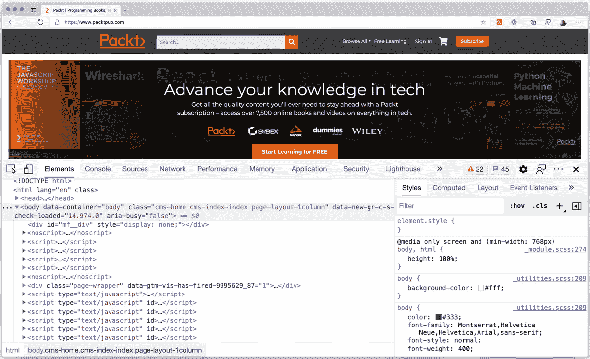

开发者工具

如果你右键点击页面上的任何元素，例如搜索按钮，你会找到 **检查** 选项，它将在 **元素** 标签中选中该元素。在那里，你将能够看到该元素的所有属性：

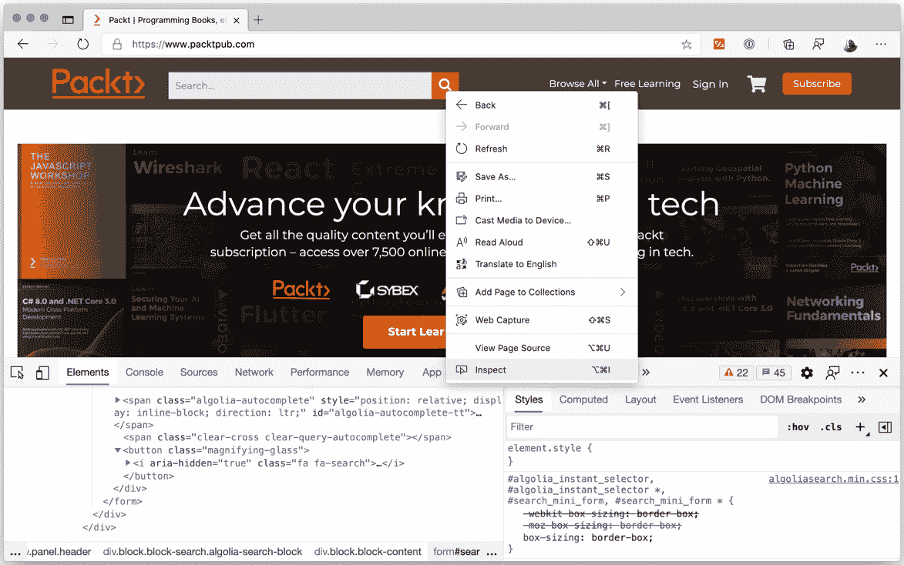

检查选项

你还会经常使用的一个标签是 **控制台** 标签，在那里你可以运行 JavaScript 代码。如果你在 **元素** 标签中，并按下 *Esc* 键，你将得到位于 **元素** 下的 **控制台** 标签。从那里，你将能够测试你的代码：

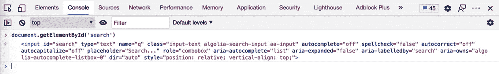

控制台标签

你还会经常使用的一组功能是 `document.querySelector` 和 `document.querySelectorAll`。第一个函数返回与 CSS 选择器匹配的第一个元素，而第二个函数返回与 CSS 选择器匹配的元素列表。因此，我们需要了解一些 CSS 选择器。

## CSS 选择器

你不需要学习 CSS 就能理解如何设置页面样式，但你应该掌握如何在页面上查找元素。我们可以使用大约 60 种不同的选择器([`www.w3schools.com/cssref/css_selectors.asp`](https://www.w3schools.com/cssref/css_selectors.asp))来查找元素。我们不会在这里涵盖所有 60 种，但让我们来看看最常见的选择器：

+   通过元素名选择：

    选择器：`ElementName`。

    示例：`input` 将选择 `<input>` 元素。

+   通过类名选择：

    选择器：`.ClassName`。

    示例：`.input-text` 将选择包含 `input-text` 类的任何元素。

    如果你查看 [`www.packtpub.com/`](https://www.packtpub.com/) 上的搜索输入，其类属性为 `class="input-text algolia-search-input aa-input"`。此选择器不会检查类属性是否等于 `input-text`。它必须包含它。

+   通过 ID 选择：

    选择器：`#SomeID`。

    示例：`#search` 将选择具有 `search` ID 的元素。在这种情况下，它确实检查了等式。

+   通过属性选择：

    选择器：`[attribute=value]`。

    示例：`[aria-labelledby= "search"]` 将选择具有 `aria-labelledby` 属性且值为 `search` 的元素。这是一个使用 ARIA 属性进行自动化的优秀示例。

此选择器不仅限于等式检查（`=`）。你可以使用 `[attribute]` 来检查元素是否包含属性，无论其值如何。你还可以使用许多其他运算符。例如，你可以使用 `*=` 来检查属性是否包含值，或者使用 `|=` 来检查它是否以某个值开头。

### 组合选择器

CSS 的好处在于你可以组合所有这些选择器。你可以使用 `input.input-search[aria-labelledby=" search"]` 来选择具有 `input-search` 类和 `aria-labelledby` 属性且值为 `search` 的输入。

你也可以查找子元素。CSS 允许我们“级联”（这就是*CSS*中的*C*代表的意思）选择器。你可以通过添加由空格分隔的新选择器来搜索子元素。让我们以以下选择器为例：

```js
form .algolia-autocomplete input
```

如果你倒着读，它会选择一个具有`algolia-autocomplete`类的元素内部的`input`，而这个元素位于一个`form`元素内部。注意，我说的是一个具有`algolia-autocomplete`类的元素内部的`input`。这不需要是输入元素的直接父元素。

如果你想要严格检查父子关系，你可以用`>`而不是空格来分隔选择器：

```js
.algolia-autocomplete > input
```

这个选择器将寻找一个直接父元素是具有`algolia-autocomplete`类的元素的`input`。

可能你会想，我为什么要知道所有这些信息？我只是想用 Puppeteer 开始工作！让我告诉你一些事情：你有一半的时间会在开发者工具中度过，你代码中最频繁出现的元素将会是 CSS 选择器。你对 HTML、DOM 和 CSS 了解得越多，你在浏览器自动化方面的技能就会越熟练。

但现在是我们回到 Puppeteer 世界的时候了。

# 查找元素

现在是我们应用到目前为止所学的一切的时候了。我们需要掌握选择器，因为我们的 Puppeteer 代码将主要关于查找元素和与它们交互。

让我们把电子商务应用中的登录页面恢复回来：

![登录页面

![img/Figure_4.8_B16113.jpg]

登录页面

如果我们要测试登录页面，我们需要找到这三个元素：**电子邮件输入框**、**密码输入框**和**登录按钮**。

如果我们右键点击每个输入并点击**检查元素**菜单项，我们会找到以下内容：

+   电子邮件的 ID 是`email`。

+   密码的 ID 是`password`。

+   登录是一个具有`btn`和`btn-success`CSS 类，以及`style=" width: 100%;"`样式的`button`元素。

Puppeteer 提供了两个从页面获取元素的功能。`$(selector)`函数将运行`document.querySelector`函数，并返回匹配该选择器的第一个元素，如果没有找到元素则返回`null`。`$$$(selector)`函数将运行`document.querySelectorAll`函数，返回匹配该选择器的元素数组，如果没有找到元素则返回空数组。

如果我们想在`LoginPageModel`类中使用这些新功能来实现`login`函数，查找登录输入将会很容易：

```js
const emailInput = await this.page.$('#email');
const passwordInput = await this.page.$('#password');
```

小贴士

要找到登录按钮，你可能认为你可以使用`btn-success`选择器，你确实可以，但你不应该使用用于样式化按钮的类，因为如果开发团队更改了样式，它们可能会在未来发生变化。你应该尝试选择一个 CSS 选择器来克服设计变化。

让我们重新评估我们的登录按钮。如果您寻找`button`元素，您会发现您在该页面上有五个按钮，所以`button`选择器不起作用。但是，我们可以看到登录按钮是唯一具有`type="submit"`属性的按钮，因此我们可以使用`[type=submit]`CSS 选择器来找到这个元素。

但`[type=submit]`选择器太通用。例如，开发者可能会在工具栏中添加一个具有`submit`类型的按钮，这会破坏我们的代码。但我们可以看到登录按钮位于 ID 为`login-form`的表单中。因此，现在我们可以创建一个更稳定的选择器。所以，我们可以在登录函数中这样查找登录按钮：

```js
const loginBtn = await this.page.$('#login-form [type=submit]');
```

现在我们有了测试登录页面所需的一切。但我们不会立即与登录页面交互。让我们转到主页并找到一些更复杂的场景：

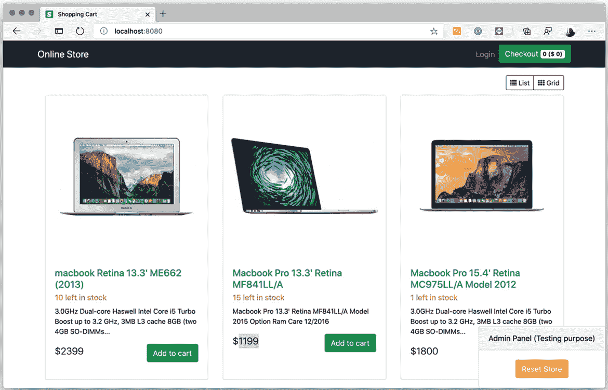

主页

假设我们想要测试**Macbook Pro 13.3' Retina MF841LL/A**产品库存剩余 15 件，价格为$1,199。

首先，一些建议：最好将这些测试代码放在测试金字塔的底层。您可以测试发送这些值的 API 或向数据库发出查询的函数。

但让我们尝试将其作为一个 UI 测试来解决这个问题：

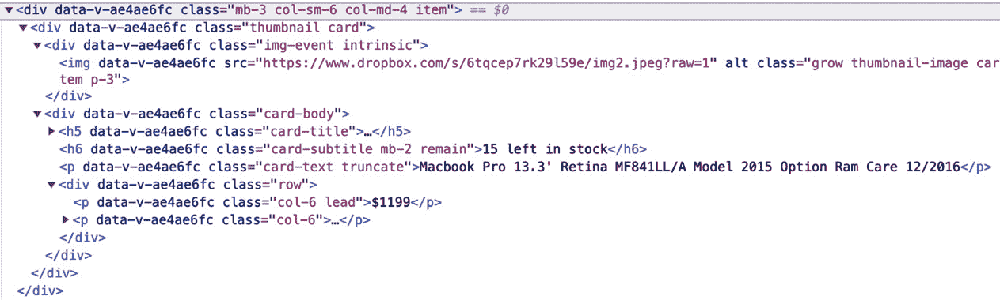

产品 HTML

如果我们查看 HTML，没有东西能帮助我们找到列表中的产品，即使我们能够找到产品，也很难找到该`div`元素内部的元素。

这里就是开发团队和 QA 团队之间协作变得有价值的地方。开发者如何帮助 QA 团队？使用 data-属性。您的团队可以使用`data-test-`属性来帮助您找到所需的元素：


带有 data-test 属性的 HTML

如您在 HTML 中看到的，使用这些新属性查找元素将容易得多。这就是我们如何获取测试产品 ID `2`的值：

```js
const productId = config.productToTestId;
const productDiv = await this.page.$(`[data-test-product-id="${productId}"]`);
const stockElement = await productDiv.$('[data-test-stock]');
const priceElement = await productDiv.$('[data-test-price]');
```

通过这四行代码，我们能够找到我们新测试所需的三个元素：产品容器以及包含库存和价格的元素。

在这段代码中，有几个需要注意的地方：

+   首先，记住不要在代码中硬编码值。这就是为什么我们要从我们的配置文件中获取产品 ID。

+   第二，请注意，我们使用`productDiv.$`而不是`page.$`来获取`stockElement`和`priceElement`。这意味着*传递给该函数的 CSS 选择器将在元素的上下文中进行处理*。

    如果我们使用`page.$$('[data-test-stock]')`，我们会得到许多元素，因为每个产品都有一个`data-test-stock`元素，但因为我们使用`productDiv.$('[data-test-stock]')`，我们将在`productDiv`内部得到元素。这是一个重要的资源。

+   这里要强调的最后一件事是，我们的开发团队给了我们 `data-test-stock` 元素中库存数量的信息。当我们需要测试库存时，这会很有用。但请注意，我们不需要使用属性的值，在这种情况下是 15，来获取元素。传递属性作为选择器就足够了。

如果我们没有机会添加这些属性怎么办？还有一个资源——尝试使用 XPath 查找这些元素。

# 使用 XPath 查找元素

XPath 是一种查询类似 XML 文档的语言。记得我们说过 HTML 是一种放松版的 XML 吗？这意味着我们可以使用某种 XML 查询语言，如 XPath，来遍历 DOM。

在深入探讨 XPath 选择器之前，如果你想尝试 XPath 查询，Chrome DevTools 包含了一组可以在开发者工具中使用的函数 `$x`，它期望一个 XPath 表达式并返回一个元素数组：

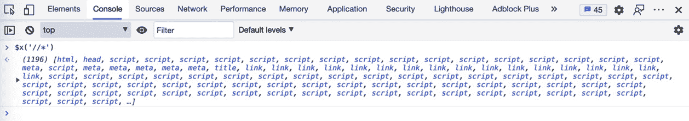

在 Chrome 开发者工具中测试 XPath

如果你打开 `$x('//*')` 来测试 `//*` 选择器。

为了更好地理解 XPath 表达式，你需要将你的 HTML 视为 XML 内容。我们将从这个相同的根节点开始遍历这个 XML 文档，即 HTML 属性。

### 从当前节点选择

选择器：`//`。这意味着“从当前节点，给我所有内容，无论位置。”

示例：`$x('//div//a')` 将会从根节点返回文档中所有的 `div` 元素，无论位置如何，以及那些 `div` 中的所有 `a` 元素，无论位置如何。

你对“无论位置”的部分感到困惑吗？好吧，现在让我们看看根选择器。

### 从根节点选择

选择器：`/`。这意味着“从当前节点，给我所有直接子元素。”

示例：如果我们使用 `$x('/div//a')`，我们将得到没有结果，因为没有 `div` 是根对象的子元素。唯一有效的根选项将是 `$x('/HTML')`，因为 HTML 元素是唯一一个位于主要根对象下的元素。但我们可以做的是 `$x('//div/a')`，这意味着“给我所有 `div` 元素，并从那里获取那些 `div` 的直接子元素 `a`。”

### 选择所有元素

选择器：`*`。这意味着“给我所有元素。”

示例：当我们说“所有元素”时，它将基于前面的选择器。`$x('/*')` 将只会获取 HTML 元素，因为这表示“所有直接元素”。但 `$x('//*')` 将会给你页面上所有的元素。

### 通过属性过滤

选择器：`[@attributeName=value]`。

示例：`$x('//div[@class="card-body"]')` 将会获取所有类属性等于 `card-body` 的 `div` 元素。这看起来可能和 CSS 中的类选择器相似，但实际上并不相同，因为这个选择器在 `div` 有多个类时将不会工作。

到目前为止，这似乎就像 CSS，只是语法不同。XPath 有什么如此强大的地方？好吧，让我们来看看一些强大的工具。

事实上，我们用来过滤属性的语法是，实际上，是表达式，也称为谓词。这给了我们不仅使用`@attributeName`选项，还可以检查许多其他事情的机会。

### 通过文本过滤

选择器：`[text()=value]`。

示例：`$x('//div[text()="Admin Panel (Testing purpose)"]')`将返回所有内容为文本*Admin Panel (Testing purpose)*的`div`元素。你甚至可以使其更通用，使用如下，`$x('//*[text()="Admin Panel (Testing purpose)"]')`，这样你就不必关心它是一个`div`还是其他类型的元素。

这个函数是人们使用 XPath 的主要原因之一。

### 包含文本

选择器：`[contains(text(), value)]`。

示例：*通过文本过滤*可能很棘手。文本可能在其内容前后有一些空格。如果你尝试使用此命令选择页面上的网格按钮，`$x('//*[text()= "Grid"]')`，你将不会得到任何结果，因为该元素在单词前后有一些空格。这个`contains`函数可以帮助我们在单词前后有空格，或者当单词是更大文本的一部分时。这就是我们如何使用此函数的方式：`$x('//*[contains(text(),"Grid")]')`。

有许多更多的函数。Mozilla 列出了所有可用的函数列表（[`www.hardkoded.com/ui-testing-with-puppeteer/xpath`](https://www.hardkoded.com/ui-testing-with-puppeteer/xpath)）。

我们可以使用 XPath 进行非常复杂的查询。让我们看看我们的最后一个例子。我们想要所有价格超过 2,000 美元的元素：

`$x('//div[@class="row"]/p[1][number(substring-after(text(), "$")) > 2000]')`

哇，让我们看看我们在做什么：

+   使用`//div[@class="row"]`，我们获取具有`row`类的`DIVs`。

+   使用`p[1]`，我们获取第一个`p`元素。我们在这里可以使用位置过滤器。

+   我们使用`text()`获取文本。

+   由于价格以美元符号开头，我们使用`substring-after`将其删除。

+   我们使用`number`将文本转换为数字。

+   那么，我们可以检查那个数字是否大于 2,000。

XPath 还有一个特性使其成为一个强大的工具。与 CSS 选择器不同，你可以使用`..`通过 XPath 选择父元素。

如果我们想返回价格超过 2,000 美元的产品整个主`div`，我们可以使用以下方法：

`$x('//div[@class="row"]/p[1][number(substring-after(text(), "$")) > 2000]/../..')`

我们如何在 Puppeteer 中使用 XPath 表达式？你已经知道了如何做：我们有一个`$x`函数。

让我们回到我们的测试：*我们想要测试 Macbook Pro 13.3' Retina MF841LL/A 库存剩余 15 件，价格是 1,199 美元*。

如果唯一找到该产品的方法是使用产品名称呢？我们可以这样做：

```js
const productName = config.productToTestName;
const productDiv = (await this.page.$x(`//a[text()="${productName}"]/../..`))[0];
const stockElement = (await productDiv.$('//h6'))[0];
const priceElement = (await productDiv.$(' //div[@class="row"]/p[1]'))[0];
```

记住 `$x` 返回一个元素数组。在这种情况下，我们知道它们总是会返回一个元素，所以我们取第一个。

同样地，我们不应该过分依赖设计类来使用 CSS 选择器。我们应尽量避免在 XPath 选择器中过度依赖 HTML 结构。在这段代码中，我们假设了几件事情：

+   我们假设股票是一个 `h6` 元素。

+   我们假设价格将是第一个 `p` 元素。

如果设计团队决定使用 `div` 而不是 `h6` 来使库存看起来更好，如果他们把价格包裹在一个 `div` 元素中以提高移动导航，那么你的测试将会失败。

我们学习了如何从页面获取元素，但重要的是要知道，`$`、`$$` 和 `$x` 函数并不返回 DOM 中的元素。它们返回称为 **元素句柄** 的东西。

元素句柄是对页面上的 DOM 元素的引用。它们是一个指针，帮助 Puppeteer 向浏览器发送命令，引用现有的 DOM 元素。它们也是我们与这些元素交互的几种方式之一。

# 与元素交互

让我们回到我们的登录测试。我们已经有了需要的三个元素：用户输入、密码输入和登录按钮。现在我们需要输入电子邮件和密码，然后点击按钮。

## 在输入元素上输入

`ElementHandle` 类有一个名为 `type` 的函数。其签名是 `type(text, [options])`。这次 `options` 类并不大。它只有一个 `delay` 属性。延迟是 Puppeteer 在字母之间等待的毫秒数。这对于模拟真实用户交互非常有用。

我们的测试的第一部分看起来是这样的：

```js
const emailInput = await this.page.$('#email');
await emailInput.type(user, {delay: 100});
const passwordInput = await this.page.$('#password');
await passwordInput.type(password, {delay: 100});
```

在这里，我们正在寻找电子邮件和密码元素，然后模拟用户在这些输入上输入。

现在，我们需要点击按钮。

## 点击元素

`ElementHandle` 类还有一个名为 `click` 的函数。我敢打赌你已经明白了这个模式。其签名是 `click([options])`。你可以简单地调用 `click()`，这样就能完成任务。但我们也可以使用三种可用的选项：

+   `button`：这是一个包含三个有效选项的字符串：“left”、“right”或“middle”。

+   `clickCount`：默认值为 `1`，但你也可以模拟一个没有耐心的用户多次点击同一个按钮，所以你可以通过传递 `4` 来模拟用户点击元素四次。

+   `delay`：这个延迟不是点击之间的时间，而是鼠标按下动作和鼠标抬起之间的时间（以毫秒为单位）。

在我们的情况下，我们不需要使用这些选项：

```js
const loginBtn = await this.page.$('#login-form [type=submit]');
await loginBtn.click();
```

通过这两行代码，我们终于完成了我们的 `login` 函数。我们找到了登录按钮，然后点击它。

## 在下拉列表中选择选项

现在这个网站有一个下拉列表，一个 HTML 中的 `SELECT` 元素，用于在网格视图和列表视图之间切换：

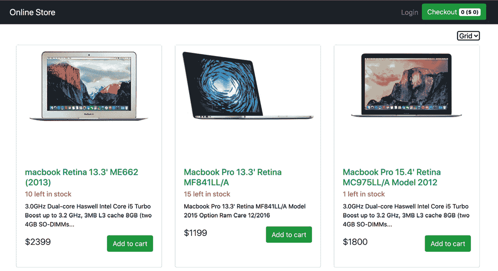


带有新开关选项的网站

如你所猜，选择选项的函数被称为`select`，其签名是`select(…values)`。如果`select`元素有`multiple`属性，它是一个值列表。

我们需要了解的下一个关于这个函数的信息是，`select`期望的值不是你在`option`中看到的文本，而是值的`option`。我们可以通过检查元素来看到这一点：

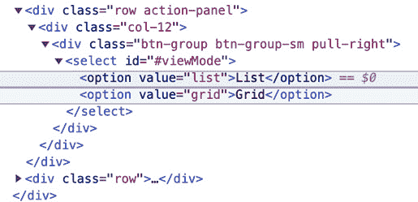

下拉列表选项

在这种情况下，我们很幸运，因为值几乎与可见文本相同，但并不完全相同。如果我们想选择网格项，我们需要使用`grid`，而不是`Grid`。

如果我们将`option`切换到列表模式，我们可以看到元素被添加了`list-group-item`类：

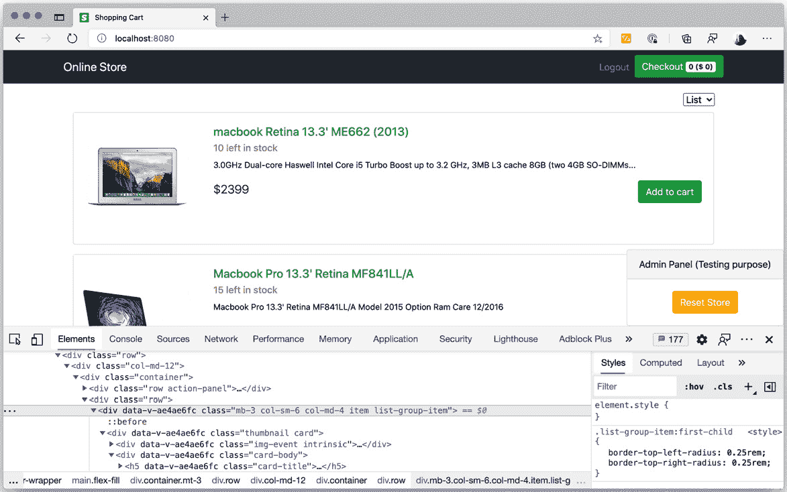

列表模式下的 HTML

这就是我们可以测试这个功能的方法：

```js
var switchSelect = await page.$('#viewMode');
await switchSelect.select('list');
expect(await page.$$('.list-group-item')).not.to.be.empty;
await switchSelect.select('grid');
expect(await page.$$('.list-group-item')).to.be.empty;
```

每次我们需要与元素交互时都使用`await`和`page.$`需要很多样板代码。想象一下，如果我们有八个输入要填写，那会很多。这就是为什么`Page`和`Frame`（如果你正在处理子框架）都有大多数元素处理函数，但它们期望一个选择器作为第一个参数。

因此，假设我们有一段这样的代码：

```js
var switchSelect = await page.$('#viewMode');
await switchSelect.select('list');
```

这可能就像这样简单：

```js
await page.select('#viewMode', 'list');
```

你会发现诸如`page.click(selector, [options])`、`page.type(selector, text, [options])`以及许多其他交互函数。

我们已经涵盖了最常见的用户交互。但我们可以更进一步，尝试模拟用户如何使用键盘和鼠标与页面交互。

# 键盘和鼠标模拟

尽管你将能够通过输入或点击元素来测试最常见的场景，但还有一些其他场景，你需要模拟用户如何使用键盘和鼠标与网站交互。让我们以 Google 电子表格为例：

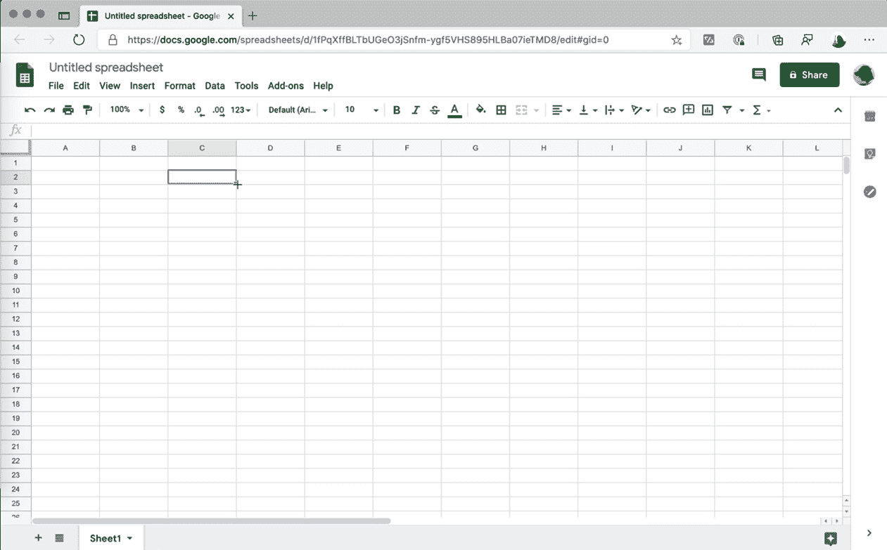

Google 电子表格

Google 电子表格页面有很多键盘和鼠标交互。你可以使用键盘箭头在单元格间移动，或者通过鼠标拖放来复制值。

但这不必那么复杂。假设你在 GitHub.com（http://GitHub.com）的 QA 团队工作，并且你需要测试主页上的搜索框。

由于 GitHub.com 是为开发者设计的，而开发者出于某种奇怪的原因讨厌使用鼠标，开发团队在网站上添加了许多快捷键。我们想要创建一个测试来检查这些快捷键是否按预期工作：

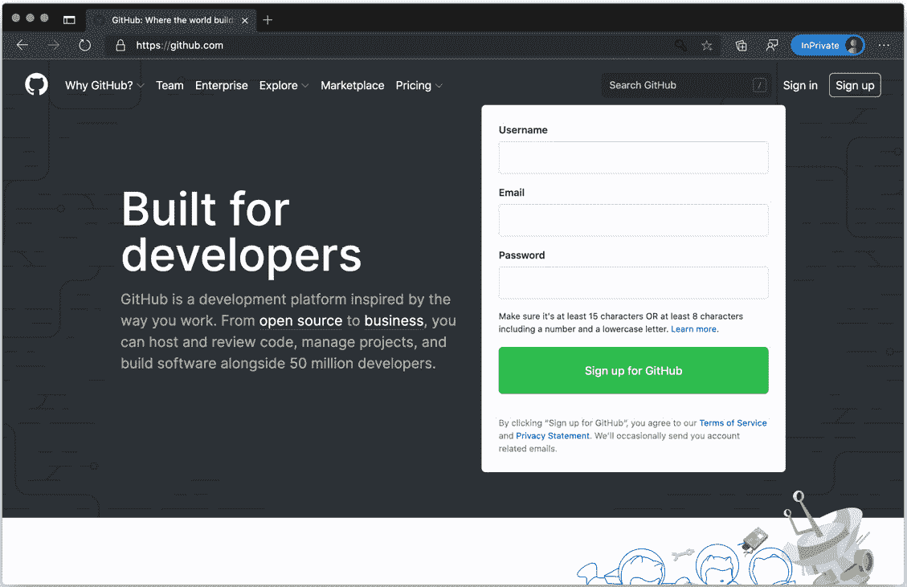

GitHub.com 首页

正如我们所见，搜索输入的快捷键是**/**。因此，我们需要做以下操作：

+   按下斜杠。

+   输入仓库名称。

+   然后按*Enter*。

我们将使用`Page`类公开的`Keyboard`类作为属性。

第一步是按下斜杠。为了做到这一点，我们将使用，你猜对了，`press`函数。该函数的签名是`press(key, options)`。关于`press`的第一个需要了解的事情是，它是对两个其他函数的快捷方式——`down(key, options)`和`up(key)`。正如你所见，你可以得到几乎完整的键盘模拟。

注意，第一个参数不是`text`而是`key`。你可以在这里找到支持的完整键列表：[`www.hardkoded.com/ui-testing-with-puppeteer/USKeyboardLayout`](https://www.hardkoded.com/ui-testing-with-puppeteer/USKeyboardLayout)。在那里，你可以找到诸如*Enter*、*Backspace*或*Shift*之类的键。`press`函数有两个可用选项：首先，如果你分配了`text`属性，Puppeteer 将创建一个具有该值的输入事件。它将像宏一样工作。例如，如果键是`p`且文本是`puppeteer`，当你按下`p`时，你将在输入元素中得到`puppeteer`。我从未找到这个参数的用法，但它确实存在。`down`函数也有这个选项。第二个选项是`delay`，它是键按下和键释放动作之间的时间。

官方的 Puppeteer 文档([`www.hardkoded.com/ui-testing-with-puppeteer/keyboard`](https://www.hardkoded.com/ui-testing-with-puppeteer/keyboard))有一个完美的例子：

```js
await page.keyboard.type('Hello World!');
await page.keyboard.press('ArrowLeft');
await page.keyboard.down('Shift');
for (let i = 0; i < ' World'.length; i++) {
  await page.keyboard.press('ArrowLeft');
}
await page.keyboard.up('Shift');
await page.keyboard.press('Backspace');
```

让我们分析一下这段代码：

+   它输入**Hello World!**。光标在感叹号之后。

+   它按下左箭头键。记住，`press`是`key down`和`key up`。所以现在光标在感叹号之前。

+   然后，使用`down`，它按下*Shift*键，但并没有释放这个键。

+   然后，它多次按下左键，使光标到达“Hello”单词之后。但由于*Shift*键仍然被按下，“World”文本被选中。

+   然后，它使用`up`释放了*Shift*键。

+   当你按下*退格*键并且有文本被选中时，会发生什么？你将移除整个选择，留下文本**Hello!**。

现在，我们可以去测试[GitHub.com](http://GitHub.com)的主页：

```js
const browser = await puppeteer.launch({headless: false, defaultViewport: null});
const page = await browser.newPage();
await page.goto('https://www.github.com/');
await page.keyboard.press('Slash');
await page.keyboard.type('puppeteer')
await page.keyboard.press('Enter');
```

如果我们回到我们的登录示例，我们可以测试通过按下*Enter*而不是点击登录按钮来登录。或者，如果控件之间的导航很重要，你可以通过按下*Tab*从用户输入跳转到密码，然后到登录按钮。

你想玩井字棋吗？让我们用鼠标来玩。

在`Chapter4`文件夹中，你会找到一个`tictactoe.html`文件，其中包含一个用**React**制作的简单的井字棋游戏：

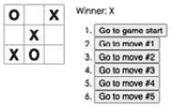

井字棋游戏

如果我们将页面视为一个画布，其中窗口的左上角是坐标**(0;0**)，而右下角是坐标**(窗口宽度, 窗口高度**)，那么鼠标交互就是将鼠标移动到**(X;Y**)坐标并使用鼠标按钮之一进行点击。Puppeteer 提供了以下功能。

使用 `mouse.move(x, y, [options])` 移动鼠标。这个 `move` 函数中可用的唯一选项是 `steps`。使用 `steps`，你可以告诉 Puppeteer 你希望向页面发送多少次 `mousemove` 事件。默认情况下，它将在鼠标移动动作结束时发送一个事件。

就像键盘一样，你有 `up`/`down` 和 `press` 函数，对于鼠标，你有 `up`/`down` 和 `click`。

鼠标有一个键盘没有的额外动作，那就是 `wheel`。你可以使用 `mouse.wheel([options])` 来模拟鼠标滚动。这个选项有两个属性：`deltaX` 和 `deltaY`，它们可以是正数或负数，表示 CSS 像素中的滚动值。

让我们回到我们的井字棋游戏。我们将进行一个简单的测试：玩家 1 将使用第一行，玩家 2 将使用第二行，所以玩家 1 将在三步之后获胜。由于这是一个画布，我们需要知道哪些坐标需要点击。

我们可以使用开发者工具的样式部分来获取这些坐标。如果我们查看 body，我们会看到一个 20 像素的边距，这将使 `(20;20)` 成为起点：

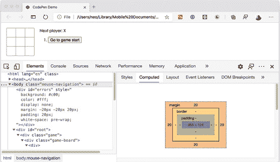

Body margin

我们还知道每个方块是 32 像素 x 32 像素，所以方块的中间应该是 *delta + (32 / 2)*。让我们测试一下：

```js
const startingX = 20;
const startingY = 20;
const boxMiddle = 16;
// X turn 1;
await page.mouse.click(startingX + boxMiddle, startingY + boxMiddle);
// Y turn 1;
await page.mouse.click(startingX + boxMiddle, startingY + boxMiddle * 3);
// X turn 2;
await page.mouse.click(startingX + boxMiddle * 3, startingY + boxMiddle);
// Y turn 2;
await page.mouse.click(startingX + boxMiddle * 3, startingY + boxMiddle * 3);
// X turn 3;
await page.mouse.click(startingX + boxMiddle * 5, startingY + boxMiddle);
expect(await page.$eval('#status', status => status.innerHTML)).to.be('Winner: X');
```

因此，我们知道井字棋网格从坐标 (`20`,`20`) 开始，从这里我们可以通过简单的数学计算找到画布中的正确坐标。第一个框将在坐标 (`startingX + boxMiddle; startingY + boxMiddle`) 处点击。如果我们想点击第二行，将是三个中间方块，`startingX + boxMiddle * 3`，以此类推，直到我们知道我们有一个赢家。

不要担心最后的 `$eval`。我们很快就会到达那里。

但这不仅仅适用于游戏。许多现代 UI 可能需要一些鼠标交互，例如，可悬停下拉菜单或菜单。我们可以在 *W3Schools* 网站上看到一个例子 ([`www.w3schools.com/howto/howto_css_dropdown.asp`](https://www.w3schools.com/howto/howto_css_dropdown.asp))：

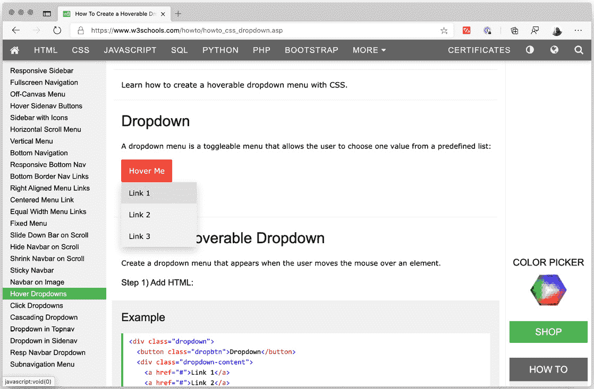

可悬停下拉菜单

要能够点击下拉菜单中的任何项目，我们首先需要将鼠标悬停在按钮上，然后链接到选项：

```js
await page.goto("https://www.w3schools.com/howto/howto_css_dropdown.asp");
const btn = await page.$(".dropbtn");
const  box = await btn.boundingBox();
await page.mouse.move(box.x + (box.width / 2), box.y + (box.height / 2));
const  option = (await page.$x('//*[text()="Link 2"]'))[0];
await option.click();
```

如您所见，我们不需要猜测 `boundingBox`，它返回位置 (*x* 和 *y*) 以及元素的大小（宽度和高）。

有没有更简单的方法？是的，我们可以简单地使用 `await btn.hover()`，这将悬停在元素上。我想给你一个完整的例子，因为有时 UI 组件对鼠标位置非常敏感，所以你需要将鼠标放在精确的位置才能得到期望的结果。

是时候进行一个附加环节了。让我们谈谈调试。

# 使用 Visual Studio Code 进行调试测试

许多开发者认为调试是最后的手段。其他人会在他们的代码中充满 `console.log` 消息。我认为调试是一个生产力工具。

*调试是通过逐步运行应用程序来尝试找到错误的过程。*

我们有两种在调试模式下启动测试的方法。第一种选项是从 **终端** 标签创建一个 **JavaScript 调试终端**。这将创建一个新的终端，就像我们之前做的那样，但在这个情况下，当你从该终端运行命令时，Visual Studio 将启用调试器：

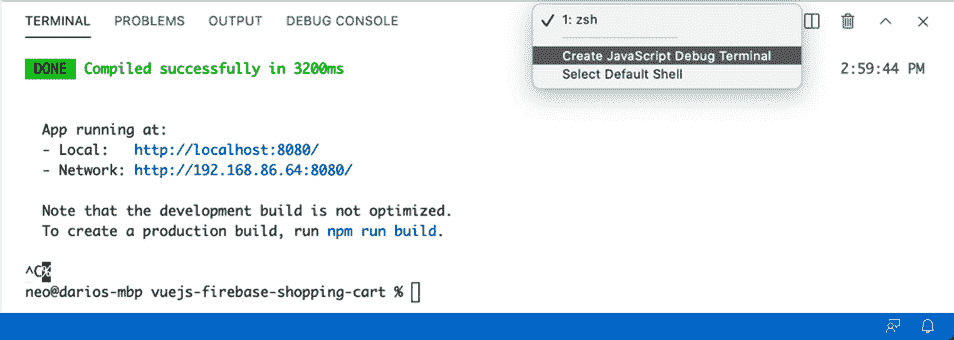

从终端进行调试

第二种选项是转到 `launch.json` 文件。你也可以在 `.vscode` 文件夹内手动创建该文件：

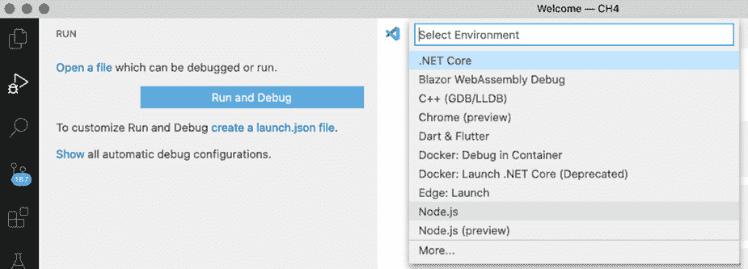

从运行标签创建 launch.json

一旦我们有了文件，我们就可以创建一个新的配置，这样我们就可以在终端中运行 `npm run test`：

```js
{
    "version": "0.2.0",
    "configurations": [
        {
            "name": "Test",
            "request": "launch",
            "runtimeArgs": [
                "run",
                "test"
            ],
            "runtimeExecutable": "npm",
            "skipFiles": [
                "<node_internals>/**"
            ],
            "type": "pwa-node"
        },
    ]
}
```

哪一个最好？嗯，如果你将在这个项目上工作很多天，创建 `launch.json` 文件会更有效率；一旦创建，你只需按 *F5*，就会进入调试模式。终端选项只是更容易启动。

一旦你设置好了一切，就是创建你想要调试器停止的行的 **断点**，然后就是利用 Visual Studio Code 提供的所有工具：

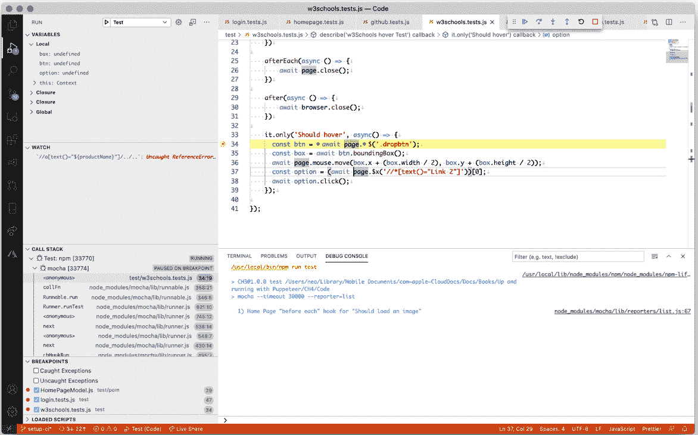

Visual Studio Code 调试模式

在那里，你会找到以下内容：

+   在行号左侧，你会找到断点。你可以通过点击行号左侧来创建或删除断点。

+   你可以在窗口的左下角找到完整的断点列表。从那里，你可以暂时禁用断点。

+   在窗口的右上角，你会找到调试操作：暂停、播放、进入/退出和停止按钮。

+   在左侧面板中，你会找到两个有用的部分：变量，你可以自动获取当前作用域中所有变量的值。下一个面板是观察，你可以添加你想要在运行代码时查看的变量或表达式。

# 摘要

这一章内容很多。我们以对 HTML、DOM 和 CSS 的简要但完整的介绍开始这一章。这些概念对于创建高质量的测试至关重要。然后，我们学习了大量的 XPath，虽然它不是一个非常流行的工具，但它非常强大，将帮助你面对 CSS 选择器不足的情况。

在本章的第二部分，我们介绍了与页面交互的最常见方法。我们不仅学习了如何与元素交互，还涵盖了键盘和鼠标模拟。

希望你喜欢工具部分。使用 Visual Studio Code 进行调试是添加到你的工具箱中的好工具。

在下一章中，我们将等待一些事情。在网络上，事情需要时间。页面需要时间加载。页面上的某些操作可能会触发网络调用。下一章很重要，因为你将学习如何让你的测试更加稳定。
