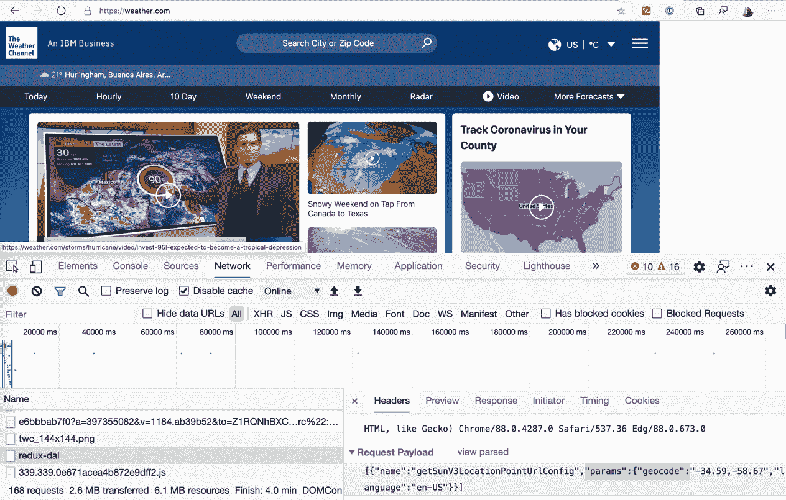
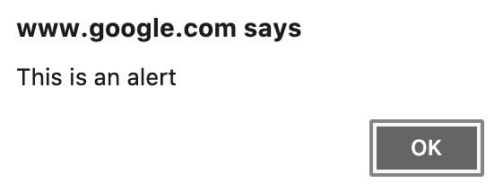

# *第五章*：等待元素和网络调用

我不会说我老了，但我在 90 年代末开始上网。所以是的，我老了。当时，有时你需要等待超过一分钟才能加载一个页面。你可能正在想，“如果你打开了 10 个标签页，那就无法使用了。” 好吧，浏览器当时没有标签页！下载一个单独的 MP3 文件可能需要一个小时。

在 2000 年代初，网络进入了企业界，我们开始使用网站开发商业应用。但那是一个来自 IT 部门的决策。旧的终端应用难以更新和引入新功能，桌面应用难以分发。Web 应用是 IT 部门的解决方案，给用户留下了速度慢且不友好的 Web 应用。

开发者当时尽力使用他们拥有的工具。页面主要是通过 ASP 3.0 或 PHP 等工具在服务器端生成的。AJAX 用于小任务，例如根据国家选择加载状态列表，而无需重新加载整个页面。

在 2000 年代后期，谷歌推出了 *Gmail*，向世界展示了网络应该如何看起来。但对于开发者来说，这个门槛太高了。对于仅仅尝试构建 CRUD 页面的开发者来说，开发这类应用是不可想象的。

现在，我们的网络看起来不同了。开发者现在能够为更直接的场景创建丰富的体验。

但在这些年里，有一件事没有改变：**你必须等待**。

你必须等待网站加载、数据刷新、新页面打开、表单提交。你必须等待。

等待正确的时机采取行动是避免不稳定测试的关键。不稳定测试有时通过，有时失败。你必须将不稳定测试视为一个错误，不是在应用中，而是在你的测试中。不稳定测试会带来许多问题：

+   他们是浪费时间。没有人愿意将带有红色测试的拉取请求合并。因此，他们会反复运行测试，直到所有测试都变为绿色。

+   不稳定的测试是虚假的警报。假设开发者不知道测试是不稳定的。他们可能会尝试寻找一个不存在的错误。

+   不稳定测试损害了测试的声誉。声誉的损失始于跳过一次不稳定测试。如果你有更多不稳定测试，团队可能会将你的测试移动到夜间流程。如果你的测试持续不稳定，它们可能会从 CI 流程中移除。你失去了，你的团队也失去了。

等待正确的时机采取行动是制作稳定 UI 测试的关键。

在本章中，我们将学习 Puppeteer 提供的工具，以便在正确的时间采取行动。我们还将学习不同的技术和方法，以便你知道如何等待页面准备就绪、输入可见或请求被发起，以及其他许多事情。

本章将讨论**等待**，这是网络自动化的一个关键主题。我还想向你展示一个 Puppeteer 录制器，这样你就可以在你的工具箱中添加一个额外的工具。在本章中，我们将涵盖以下主题：

+   等待页面加载

+   等待元素

+   等待网络调用

+   等待页面事件

+   奖励：无头录制器

让我们从开始讲起。你是如何知道页面已经加载完成的？

# 技术要求

你可以在 GitHub 仓库（[`github.com/PacktPublishing/UI-Testing-with-Puppeteer`](https://github.com/PacktPublishing/UI-Testing-with-Puppeteer)）的`Chapter5`目录下找到本章的所有代码。请记住在那个目录下运行`npm install`，然后进入`Chapter5/vuejs-firebase-shopping-cart`目录再次运行`npm install`。

如果你想要在遵循本章内容的同时实现代码，你可以从`Chapter4`目录中留下的代码开始。

# 等待页面加载

在*第三章*中，我们讨论了通过网站导航。我们涵盖了诸如`goto`、`goBack`、`goForward`和`reload`等函数。这些函数中的一个选项是`waitUntil`选项。这个选项将帮助我们确定我们调用的函数何时会解决。让我们快速回顾一下。我们有四个选项：

+   `domcontentloaded`，它依赖于`DOMContentLoaded`事件。

+   `load`：如果你传递这个选项，当`load`事件被触发时，`promise`将被解决。

+   `networkidle0`将在过去 500 毫秒内没有更多网络连接时解决`promise`。

+   `networkidle2`将在过去 500 毫秒内没有超过 2 个网络连接时解决`promise`。

让我们看看这些选项如何与内容丰富的网站，如[`shop.mango.com/gb`](https://shop.mango.com/gb)一起工作。我们将看到根据使用的哪个`waitUntil`，哪些内容已经准备好了：


芒果主页

需要最早解决的选项是`DOMContentLoaded`：


DOM 内容加载

那个页面根本就没有准备好。这意味着`DOMContentLoaded`就毫无用处了吗？嗯，在这个情况下确实是这样的。如果你用同样的方法来处理维基百科，页面非常直接，它会自动准备好：


维基百科中的 DOM 内容加载

返回芒果页面。等待`load`事件给我们带来了页面的所有内容：


页面加载后

背景视频还没有准备好。订阅弹出窗口也没有出现。但是，如果我们想要与菜单栏交互，使用登录操作，或者测试 cookie 横幅，页面就已经准备好了。

很难找到一个页面，其中`networkidle0`和`networkidle2`的行为不同，以至于你必须在这两者之间选择。在这种情况下，我们将得到一个几乎完整的页面：


使用 networkidle0 和 networkidle2 的页面

视频尚未播放，因此如果你想要截图或生成 PDF 文件，正如我们将在*第七章*中看到的，*使用 Puppeteer 生成内容*，这还不够。但我们可以说是准备好的进行测试。

那么，哪个更好？我们应该安全起见，始终使用`networkidle0`吗？难道那不应该成为默认设置吗？

这是我们需要找到平衡的地方。我们可以在操作之间等待 10 秒钟，这样就不会有任何不可靠的测试。但是，如果你有 1,000 个测试（记住，你将有超过 1,000 个测试），每个测试有 10 个操作，这意味着整个测试套件将需要近 14 个小时才能运行。

*为了减少不可靠性，我们需要在等待时间过长和过快之间找到平衡。*

有时候从服务器获取 DOM 就足够了。如果我们正在测试维基百科，我们的链接会在`DOMContentLoaded`事件中为我们准备好。如果我们想测试我们的主页，并且等待`DOMContentLoaded`，图片可能还没有准备好，但我们会从服务器获取股票和价格值。我们不需要更多。

设置正确的`waitUntil`将使你的代码更不可靠，但除非你测试一个像维基百科这样的简单网站，否则这还不够。

使你的代码最稳定的有效方法是等待我们想要与之交互的元素。

# 等待元素

在对元素进行操作之前，你需要确保两件事：首先，该元素确实存在，它存在于 DOM 中；其次，你可以对该元素进行操作。换句话说，它对用户是可见的。让我们看看我们如何等待我们的元素准备好。

你应该在某种网络调用之后等待选择器。你`跳转`到一个页面，等待选择器，然后进行操作。你点击一个按钮，等待选择器，然后进行操作。

在某些情况下，你需要等待的选择器很容易找到。在我们的登录页面上，我们需要等待用户名输入。在其他情况下，例如我们的主页，我们可能需要等待包含所有产品的`div`元素。这稍微复杂一点，但仍然直接。

但如果我们想测试 Mango 的时事通讯弹出窗口呢？也许弹出窗口的 HTML 已经在页面上，但它不可见。这就是我开始考虑等待作为一种艺术的地方。这不仅仅是自动化一个页面。这不仅仅是关于工具。你需要找到正确的选择器，使你的自动化代码稳定。

我们有两个函数可以帮助我们等待元素：`waitForSelector`和`waitForXPath`。这两个函数具有相似的签名。`waitForSelector(selector, [options])`期望一个 CSS 选择器和`options`对象。`waitForXPath(XPath, [options])`期望一个 XPath 表达式和`options`对象。

这些是在`options`参数中可以设置的可用属性：

+   `timeout`：我们将在所有等待函数中找到这个选项。我们不希望我们的测试卡住。这是导致测试不可靠的另一个原因。如果达到超时时间，承诺将被拒绝。如果我们没有传递超时，函数将使用通过`page.setDefaultTimeout(timeout)`设置的超时。如果没有使用`setDefaultTimeout`，它将默认为**30 秒**。

+   `visible`：如果`visible`设置为 true，Puppeteer 不仅会检查元素是否存在于 DOM 中，还会检查它是否可见。我们可能需要在我们的新闻通讯弹出窗口中使用它。默认情况下不会执行此检查。同样，这取决于你的场景，你可能想要检查或不要检查。

+   `hidden`：如果`hidden`设置为 true，Puppeteer 将检查元素是否不可见或元素是否不在 DOM 中。这个选项在处理加载动画时很有用。你知道当加载动画隐藏时页面正在读取。[Twitter.com](http://Twitter.com)是一个很好的例子：


Twitter.com 上的加载动画

`waitForSelector`和`waitForXPath`都会返回一个可以解析为以下内容的承诺：

+   `ElementHandle`：这个元素句柄将是最终匹配 CSS 选择器或 XPath 的元素。

+   空值：当`hidden`设置为 true，且元素未在 DOM 中找到时。

有四种等待元素的方法。这并不是关于哪个是最好的。这些方法将帮助你在不同的场景中。

## 等待一个等待函数

你可以在`stackoverflow.tests.js`文件中找到本节使用的代码。

如果我们访问 Stack Overflow ([`stackoverflow.com/questions`](https://stackoverflow.com/questions))，我们会发现页面右侧有职位发布。但正如我们所见，这是在页面加载之后加载的。


在加载时列出和在加载后列出

假设我们想测试页面默认有一个职位列表。

我们可以使用`$$`获取`LI`元素，然后检查列表是否为空：

```js
const jobs = await page.$$('.jobs li');
expect(jobs).not.be.empty;
```

实际上，在良好的网络环境下，这通常能起作用，但它也可能变得不可靠。我们需要做的是在检查列表之前等待元素加载。我们可以做的是在调用`$$`之前调用`waitForSelector`函数：

```js
await page.waitForSelector('.jobs li');
const jobs = await page.$$('.jobs li');
expect(jobs).not.be.empty;
```

如我之前提到的，`waitForSelector`返回一个`ElementHandle`。它使用`document.querySelector`。这就是为什么我们不能使用`waitForSelector`的结果。

但如果我们想检查标题是否是 `waitForSelector` 函数：

```js
const title = await page.waitForSelector('#hireme .header .grid--cell.fl1');
expect(await title.evaluate(e => e.innerText)).to.contain('job');
```

我想这是第二次使用 `evaluate` 函数了。耐心——这将在下一章中到来。

如果你想知道为什么我们没有在职位列表示例中使用 `waitForSelector` 的结果，结果是 `waitForSelector` 使用 `document.querySelector` 来评估 CSS 表达式。这将使 `waitForSelector` 只返回一个项目。

与 `waitForXpath` 一样，这也会发生。与 `$x` 不同，它返回一个元素数组。`waitForXpath` 只会返回一个元素。

`waitForSelector` 和 `waitForXPath` 大多数时候都能帮到你，但还有其他我们可能需要考虑的场景。例如，我们可能需要检查网络调用。我们可能想要等待一个请求被发送或响应被接收。让我们看看如何完成这个任务。

# 等待网络调用

在 *第三章* 中，*浏览网站*，我们讨论了 **请求** 和 **响应**。每次页面导航都是从向页面发送请求开始的。服务器随后处理该请求并发送响应。该响应通常是包含需要请求的资源的一个 HTML 页面。服务器将再次处理这些请求并发送多个响应。

但这还不算全部。现代应用程序会根据用户操作向服务器发送请求。以 *Google Maps* 为例：用户移动鼠标，页面就需要请求新的地图图片，而无需重新加载整个页面。

我们不在 *Google Maps* 团队工作，但许多用户报告说，主页有时在登录后不会加载产品图片。因此，我们可以编写一个测试来检查 *它应该加载一个图片*。哦……你以为我们要测试 *Google Maps*？不是这次，抱歉。

在这种情况下，我们可以使用 `waitForResponse(urlOrPredicate, [options])`。让我们来分解这些参数：

+   `urlOrPredicate` 可以是一个包含我们想要等待的 URL 的字符串。但它也可以是一个函数。这个函数应该期望一个响应，这将是你想要检查并返回一个真值的结果。

+   在这个函数中，我们唯一的选择是 `timeout`。这个属性的条件与 `waitForSelector` 中的相同：如果没有传递，Puppeteer 将使用 `page.setDefaultTimeout(timeout)`，如果没有使用该函数，默认为 30 秒。

让我们编写我们的测试。我们需要登录并等待产品图片。为了完成这个任务，我们将使用 **Arrange, Act, Await** 方法。

## Arrange, Act, Await

这个名字来源于我们之前在 *第四章* 中讨论的 arrange, act, assert 模式，*与页面交互*。

使用这种模式，我们试图防止**竞态条件**，这是异步编程中常见的问题，也是不稳定的原因。异步编程中的竞态条件是指你试图同时执行两个或多个任务，其中一个任务的速度（太快或太慢）导致另一个任务永远无法完成。

让我们以这个测试为例：

```js
await loginModel.go();
await loginModel.login(config.username, config.password);
await page.waitForResponse(config.productImage);
```

首先，注意一点。我们没有使用断言。`waitForResponse`承诺解决的事实就足以让我们知道测试是成功的。

这里还有一个重要的概念是`waitForResponse`的行为与`waitForSelector`不同。当我们使用`waitForSelector`时，函数会在我们等待的元素已经在 DOM 中时解决。但与`waitForResponse`不同，如果我们等待的响应已经发生，我们的`waitForResponse`将会超时。

我们那里的代码存在不稳定的隐患。如果我们的服务器在登录后响应页面过快，图片可能在我们等待之前就已经被发送了。为了解决这个问题，我们需要先获取承诺，然后再等待它。这就是我们如何修改代码的方式：

```js
await loginModel.go();
const promise = page.waitForResponse(config.productImage);
await loginModel.login(config.username, config.password);
await promise;
```

注意，我们不是在等待`waitForResponse`返回的承诺，而是将那个承诺赋值给一个变量。我们调用`waitForResponse`，保留那个承诺，然后采取行动（登录）。之后，我们等待那个承诺，希望它在登录操作完成后某个时刻被解决。你可以在这个`login.tests.js`文件中找到这个测试。在那里，测试被命名为`Should load image after login`。

就像我们使用`waitForResponse`一样，我们也可以使用`waitForRequest`。

如果我们想要检查浏览器是否向服务器发送请求，我们会使用`waitForRequest`而不是`waitForResponse`。因为这个函数也期望一个函数作为参数，我们可以检查不仅 URL，还可以请求的内容。

假设我们在天气频道([`weather.com/`](https://weather.com/))工作。我们想要检查浏览器是否发送了我们的位置。我们发现页面正在调用`redux-dal`。我们想要等待那个请求，解析`params`对象。



天气频道

我们将使用**火速发射，无需关注**的方法来解决这个问题。

## 火速发射，无需关注

你可以在本节中使用的代码在`weather.tests.js`文件中找到。

当我们调用一个返回承诺但又不等待该承诺，甚至不关心该承诺结果的函数时，我们称之为“火速发射，无需关注”。这是一个军事术语，指的是一种发射后无需进一步引导的导弹。在我们的情况下，我们的“导弹”是承诺，我们发射了它们，但我们不关心它们的结局。

让我们看看火速发射的方法会是什么样子：

```js
const promise = page.waitForRequest(r => r.url().includes('redux-dal'));
page.goto('https://weather.com/');
const request = await promise;
const json = JSON.parse(request.postData());
expect(json[0].params.geocode).not.be.empty;
```

这里有很多新事物需要学习。

我们触发并忘记`goto`操作。我们调用`goto`，但不会等待它完成。执行触发并忘记意味着我们不会关心 promise 是否解析或失败。在这种情况下，我们关心`request` promise。如果`goto`失败，`waitForRequest`将失败，测试将失败。

我们在这里可以看到的第二个新功能是，我们正在使用谓词等待一个请求，一个期望请求并返回一个真值的函数：`r => r.url().includes('redux-dal')`。

我们在这里可以学到的最后一件事是，我们正在使用由`waitForRequest` promise 解析的请求。一旦我们得到请求，我们使用`postData`提取负载，解析它，并评估内容。

我们必须处理的最后一个网络调用功能是`waitForNavigation`。想象一下`waitForNavigation`是`goto`函数没有 URL 参数的形式。它是`waitForNavigation([options])`。选项与`goto`相同。我们可以使用这个函数等待由我们执行的一个操作触发的导航。

以 Packtpub 网站（[`www.packtpub.com/`](https://www.packtpub.com/)）为例。我们想要搜索一本书，按*Enter*键，然后等待页面跳转到结果页面。

对于这个测试，我们将使用我们的第四种方法：`Promise.all`。

## Promise.all

你可以在`packpub.tests.js`文件中找到本节使用的代码。

根据场景，`Promise.all`可以是 Act, Arrange, Await 的快捷方式。实际上，我会保留后者用于更复杂的场景，并在需要同时等待两个任务时使用`Promise.all`。

我们的测试代码将使用`Promise.all`看起来像这样：

```js
await page.goto('https://www.packtpub.com/');
const search = await page.$('#search');
await search.type('Puppeteer');
await Promise.all([
    page.waitForNavigation(),
    search.press('Enter')
]);
const textResult = await page.$eval('[data-ui-id="page-title-wrapper"]', e => e.innerText);
expect(textResult).to.be.equal(`Search results for: 'Puppeteer'`);
```

第一部分相当直接。我们访问网站，获取搜索输入，并输入“Puppeteer”。但是，我们会在同一个`await`语句中等待两个 Promise。我们等待导航完成和`press`函数。

虽然在`Promise.all`内部得到一个竞争条件会很奇怪，但我感觉在`all`函数的第一个参数中添加`wait`函数会更安全。

正如我在*第一章*中提到的，*使用 Puppeteer 入门*，`Promise.all`将等待所有 Promise 完成。它也会在任何一个 Promise 失败时立即解析。

现在我们知道了如何等待元素和网络调用。但让我告诉你一个小秘密：`waitForRequest`和`waitForResponse`只是页面提供的请求和响应事件的包装器。Puppeteer 会创建一个 Promise，开始监听一个事件，然后在满足条件时解析 Promise。好消息是我们可以使用这种方法等待许多其他事件。

# 等待页面事件

事件是当某个事情发生时类发送的消息。作为消费者，你可以在`Chapter5`目录下的`page-event-demos.js`文件中找到这些事件。要运行这个演示，你只需要运行`node page-event-demos.js`。

这就是如何在没有`waitForResponse`的情况下监听响应：

```js
page.on('response', response => 
  console.log('Response URL: ' + response.url()));
await page.goto('https://www.packtpub.com/');
```

在第一行，我们表示我们想要监听`response`事件，当新的响应到达时，我们想要在控制台打印 URL。然后，我们调用`goto`函数，所有的响应都将开始写入控制台。

使用箭头（`=>`）是编写单行函数的简单方法。但是，如果你打开一个括号，你可以编写更复杂的函数，如下所示：

```js
page.on('response', response => {
  if(response.request().resourceType() === 'image') {
    console.log('Image URL: ' + response.url());
  }
});
await page.goto('https://www.packtpub.com/');
```

如果你想要重用函数，你可以将其传递到那里：

```js
const listenToImages = response => {
  if(response.request().resourceType() === 'image') {
    console.log('Image URL from function: ' + response.url());
  }
};
page.on('response', listenToImages);
```

正如你所见，我们可以创建一个函数，将其分配给一个变量——在这个例子中，是`listenToImages`——然后将其传递给`page.on`函数。如果你传递一个函数，你将能够移除那个监听器：

```js
page.removeListener('response', listenToImages);
```

`removeListener`函数将`listenToImages`函数从`response`事件中分离。

你需要给你的工具箱添加一个新功能。你可以使用`once`来监听一个事件，只发生一次：

```js
page.once('response', r => console.log(r.url()));
```

`once`将你的函数附加到事件上，并在第一个事件到达时立即将其移除。请注意，`once`不会评估你函数的结果。你将无法阻止`once`在第一个事件到达时立即移除你的监听器。

我们现在可以尝试创建自己的`waitForResponse`函数。我们将使用我们在*第一章*中提到的方法，*使用 Puppeteer 入门*：*履行我们的承诺*。我们可以创建一个承诺，然后当等待的条件满足时，我们将解决它：

```js
await loginModel.go();
const promise = new Promise(resolve => 
  page.on('response', r => {
    if (r.url() === config.productImage) {
      resolve(r);
    }
  }));
await loginModel.login(config.username, config.password);
await promise;
```

在这段代码中，我们创建了一个承诺，当`resolve`函数被调用时，它将被解决。在函数内部，我们附加到响应事件，当 URL 匹配时，我们调用`resolve`传递那个响应。

在这种情况下，使用`waitForResponse`函数会更简单。但是，有些事件没有`waitFor`函数，你需要使用这种方法来等待它们。让我们看看我们有哪些页面事件可用。

## 关闭事件

当页面关闭时，会触发`close`事件。如今，弹出窗口并不常见，主要是因为它们对移动设备不友好。但我们仍然可以找到一些情况。例如，当你想要将账户添加到现有的*Gmail*账户时。


Gmail 中的弹出窗口

你需要监听该页面的`close`事件，以了解向导过程是否完成。

但这又引出了另一个问题。你如何到达那个页面？如果我们正在测试*Gmail*页面并点击**创建账户**链接，我们如何获取弹出窗口？

## 弹出事件

当页面打开新标签页或窗口时，将触发`popup`事件。我们可以这样做：

```js
const [newPage] = Promise.all([
  new Promise(resolve => page.once('popup', resolve)),
  page.click('someselector')
]);
```

我们在这里可以学到的一个新东西是`promise.all`返回所有响应的数组。因为我们只关心第一个承诺的响应，所以我们创建了一个只有一个元素的数组`[newPage]`。

如果你想要监听新页面，无论是什么触发了新页面，你也可以监听浏览器事件。

## 目标创建事件

当在浏览器内部创建一个新的目标（页面）时，会触发`targetcreated`事件。我们可以做如下操作：

```js
const [newPage] = Promise.all([
  new Promise(resolve => browser.once('targetcreated', resolve )),
  page.click('someselector')
]);
```

在大多数情况下，这将以与`popup`事件相同的方式工作。但了解你也有这个工具可用是好的。

让我们回到页面事件。

## 控制台事件

`console`事件将在浏览器控制台打印新行时被触发。与`response`事件以包含所有信息的`response`对象一样，`console`事件将给我们一个带有以下函数的消息类：

+   使用`text()`函数传递文本消息。

+   `type()`，它将帮助我们识别消息的类型。最常见类型有：'log', 'debug', 'info', 'error,' 和 'warning'。

+   `location()`，给出消息的来源。

+   由于`console.log`可以期望对象作为参数，我们可以使用`args()`函数访问这些元素句柄。

你可以使用此事件来检查测试过程中没有 JavaScript 错误。

## 对话框事件

`dialog`事件很重要，因为对话框会停止页面的执行。有许多类型的对话框，每种都需要我们以不同的方式做出反应。我们可以使用`type()`函数知道对话框类型。让我们看看不同的对话框类型以及我们如何对它们做出反应。

### 警告类型

`Alert`是一个只有`dialog.accept()`的对话框：



警告

### 确认类型

`Confirm`是一个带有`dialog.accept()`或`dialog.dismiss()`来取消的对话框：


确认

### 提示类型

`prompt`对话框在当今并不常见。它类似于`confirm`对话框，但会提示输入，你可以通过传递一个字符串给`accept`函数来通过：


提示

### `beforeunload`类型

你会看到`beforeunload`，询问你是否想要在不保存更改的情况下离开网站。它的工作方式与`confirm`对话框相同。你可以以与`prompt`对话框相同的方式与这个对话框交互：


卸载前对话框

让我们以一个新的工具来结束这一章：**无头记录器**。

# 无头记录器

无头记录器是由*Checkly*（[`www.checklyhq.com/`](https://www.checklyhq.com/)）开发的 Chrome 扩展。此扩展将记录你在页面上的操作，并根据这些操作生成 Puppeteer 代码。我认为这是一个获取 Puppeteer 测试初稿的绝佳工具，并从这里开始编写最终代码。

你可以通过访问 Chrome Web Store（[`chrome.google.com/webstore`](https://chrome.google.com/webstore)）并搜索`Headless Recorder`来下载此扩展：


无头记录器

一旦安装，你将在浏览器右上角找到一个**记录器图标**。从那里，你将有一个**记录按钮**，它将开始捕获你在页面上执行的所有操作：


记录选项

一旦你完成测试操作的执行，你点击**停止**，你将得到几乎可以使用的代码：


无头记录器结果

我说几乎准备好了，因为录音机无法猜测你的真实意图。它只是一个指南。正如你所见，有选择器，例如 `.mb-3:nth-child(1) > .thumbnail > .card-body > .row > .col-6 > .btn.` 录音机不知道你点击某个链接背后的意图是什么。但这是一个好的开始，并且当你的测试需要多个步骤时，它可以帮助你。

# 摘要

在本章中，我们学习了易失性测试的概念，并看到了许多技术和工具来防止在我们的测试套件中存在易失性测试。

当我们在学习这些等待工具时，我们甚至没有注意到就看到了许多页面事件。现在你不仅可以等待选择器和网络调用，还可以处理对话框和弹出窗口。

最后的部分很短，但正如承诺的那样，我们现在在工具箱中又多了一个工具，一个无头记录器。

在下一章中，我们将深入了解更高级的工具，并学习如何在浏览器中执行 JavaScript。
