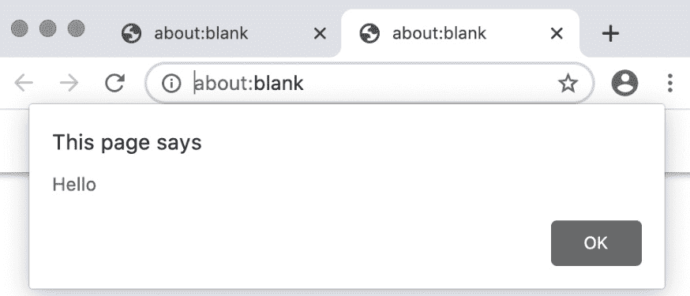
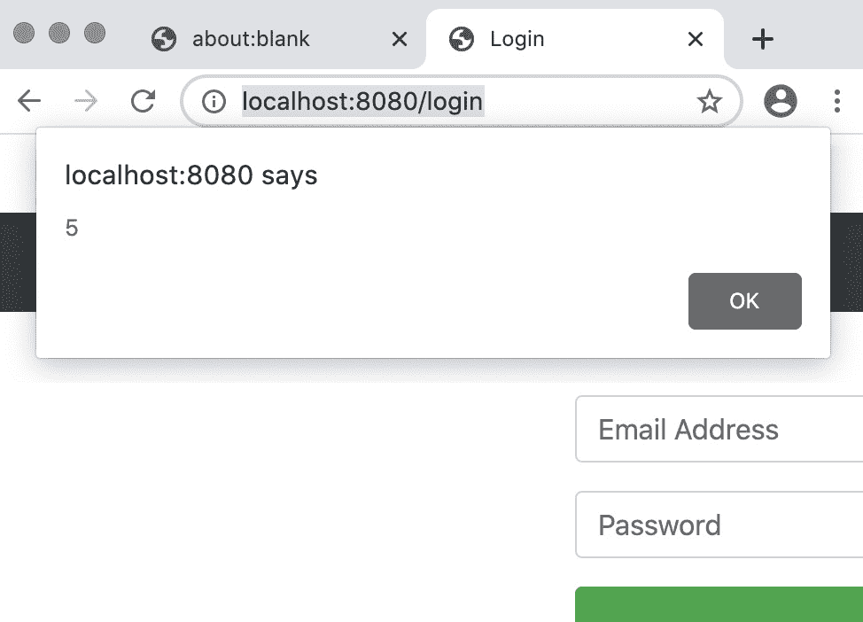
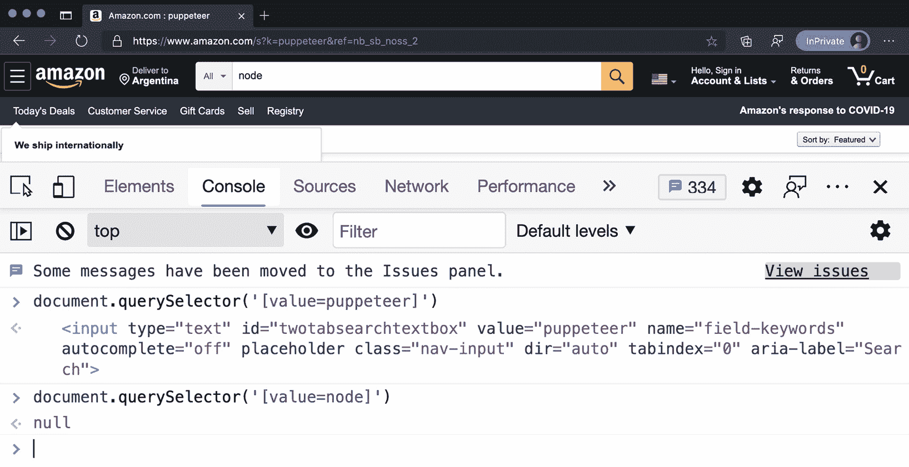
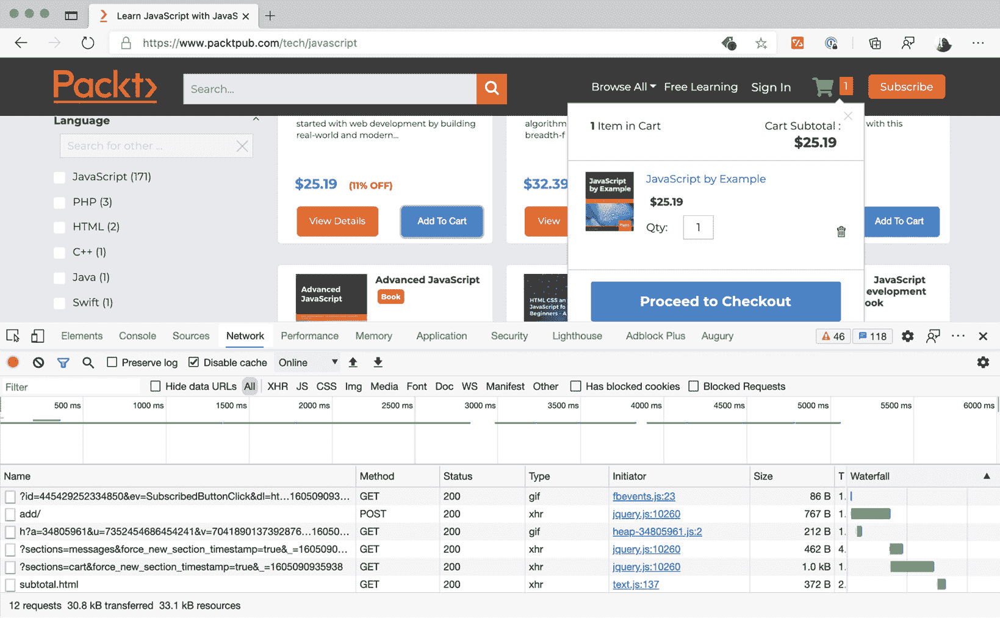
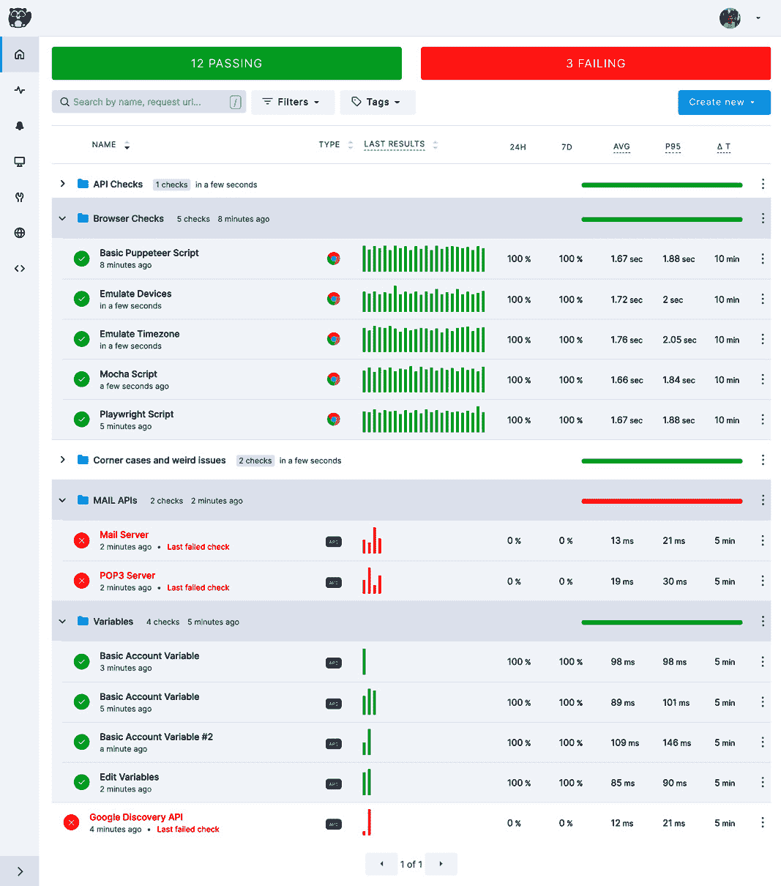
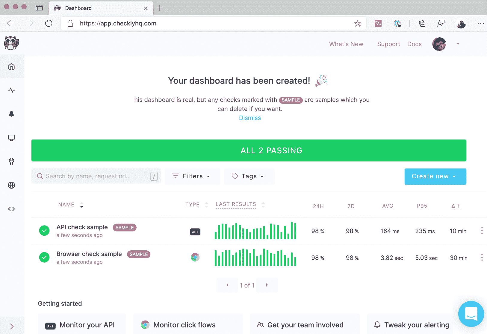
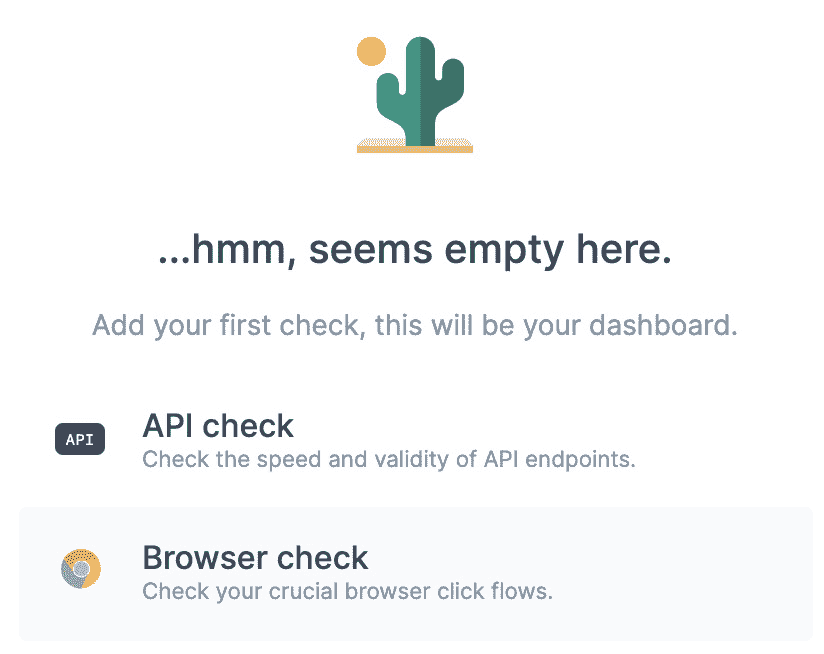
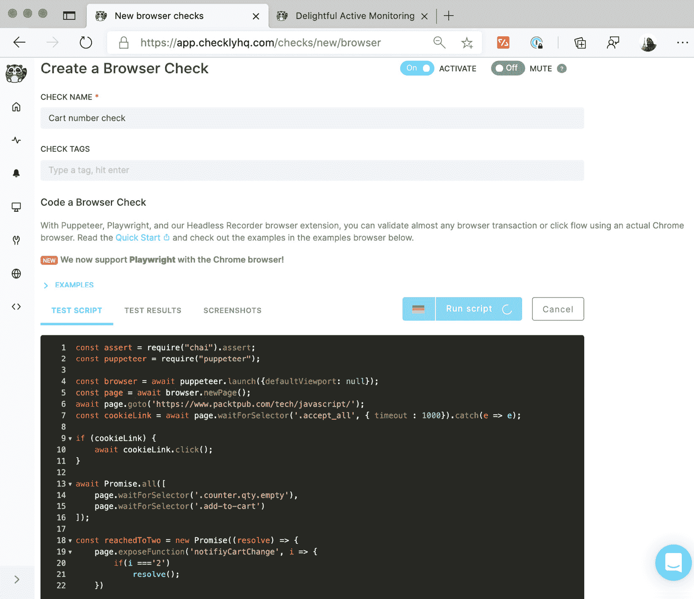

# *第六章*：执行和注入 JavaScript

在过去的几章中，我们学习了大多数基本 Puppeteer 功能，从正确创建浏览器和页面，到查找元素并与它们交互。

现在是时候深入了解更强大的工具了。在本章中，我们将了解 Puppeteer 如何让我们能够在浏览器中执行 JavaScript 代码。

这听起来可能像是一种黑客手段或最后的手段工具。有时确实是。但这也是一个可以帮助我们执行 Puppeteer API 未提供的操作的工具。

在 Node 端执行和浏览器中执行的代码之间的通信有时可能很棘手。我们将学习如何高效地与双方进行通信。

正如我们在上一章中所做的那样，我们将向我们的工具箱中添加另一个工具。我们将在*Checkly*上运行我们的代码。

本章我们将涵盖以下主题：

+   执行 JavaScript 代码

+   使用 JavaScript 代码操作句柄

+   等待函数

+   展示本地函数

+   使用 Checkly 运行我们的检查

到本章结束时，你将能够通过执行 JavaScript 代码从你正在自动化的页面中获得更多。

# 技术要求

你可以在 GitHub 仓库（[`github.com/PacktPublishing/UI-Testing-with-Puppeteer`](https://github.com/PacktPublishing/UI-Testing-with-Puppeteer)）的`Chapter6`目录下找到本章的所有代码。请记住，在那个目录上运行`npm install`，然后进入`Chapter6/vuejs-firebase-shopping-cart`目录并再次运行`npm install`。

如果你想在遵循本章内容的同时实现代码，你可以从`Chapter5`目录中留下的代码开始。

让我们开始吧。

# 执行 JavaScript 代码

你可能会问的第一个问题是：“我为什么要运行 JavaScript 代码？Puppeteer 不应该给我所有我需要的 API 吗？”嗯，是的，也不完全是。

在探讨不同的可能用例之前，让我们看看这个功能是如何工作的。

## JavaScript 中的变量作用域

使 JavaScript 如此灵活的一点是函数是一等公民。你可以声明函数，将它们分配给变量，并将它们作为参数传递。你甚至可以从其他函数中返回函数，就像这个例子一样：

```js
function getFunc() {
    let word = 'world'; 
    return function() {
        console.log('Hello ' + word);
    }
}
getFunc()();
```

那段代码很有趣。`getFunc`返回另一个函数。当我们执行`getFunc()()`时，我们正在调用`getFunc`返回的函数。

这段代码将在控制台打印出`'Hello world'`。有趣的部分在于，`getFunc`返回的函数能够在其作用域内保持变量`word`。

你甚至可以做一些更复杂的事情，例如，将一个参数传递给`getFunc`，然后在`getFunc`将返回的函数内部使用该参数：

```js
function getFunc(name) {
    return function() {
        console.log('Hello ' + name);
    }
}
getFunc('world')();
getFunc('mars')();
```

这段代码将打印出`'Hello world'`和`'Hello mars'`。这被称为`getFunc`，在第一种情况下，返回的函数将与字符串`'world'`捆绑在一起，在第二种情况下，与`'mars'`捆绑在一起。

我们不会深入探讨这个功能的内部。但你需要知道，**这并不是 Puppeteer 中函数的工作方式**。

让我们尝试在 Puppeteer 中使用闭包：

```js
const browser = await puppeteer.launch({headless: false, defaultViewport: null});
const page = await browser.newPage();
const name = 'world';
await page.evaluate(() => alert('Hello ' + name));
browser.close();
```

在这种情况下，我们有一个传递给`evaluate`函数的函数，该函数正在使用变量`name`，该变量在我们刚刚创建的函数的作用域内。但这就是我们得到的结果：



Puppeteer 中的变量作用域

如你所见，名称没有传递到 alert 中。对我们这些开发者来说，一个重大问题是代码看起来很好。如果你看代码，代码是完美的。它与我们的先前的例子没有太大不同。但那里有些不同的地方。一旦你理解了这一点，你将能够回答 Stack Overflow 上的许多问题。

首先，`page.evaluate`的签名是`page.evaluate(pageFunction[, ...args])`，其中`pageFunction`可以是字符串或函数。第二个参数是传递给`pageFunction`的可选值列表。

你可以传递`evaluate`函数。表达式是像你可以在 DevTools 控制台中编写的语句一样的东西。例如，一个简单的字符串，返回`document`对象的`URL`属性：

```js
console.log(await page.evaluate('document.URL'));
```

`page.evaluate`会将表达式`document.URL`发送到浏览器，浏览器将评估它。一旦浏览器评估了表达式，它将把它发送回 Puppeteer，`page.evaluate`将返回结果。在这种情况下，`about:blank`。

当你想评估简单的表达式时，表达式是完美的。但你可以使用 JavaScript 函数达到相同的结果：

```js
console.log(await page.evaluate(() => document.URL));
```

如你所见，传递表达式更为直接，但你可以使用函数编写更复杂的代码，而且，同样重要的是，你将获得代码编辑器的自动完成功能。

这里的关键概念是使用`page.evaluate` `toString()`将函数放入变量中。让我们试试看：

```js
console.log((() => alert('Hello ' + name)).toString());
```

这将在控制台中打印出函数的字符串值：

```js
() => alert('Hello ' + name)
```

如果 Puppeteer 接收这个函数，使用`toString`将其转换为字符串，并发送到浏览器，那么`name`变量的值在这个过程中就会丢失。

当你将函数发送到浏览器上下文中进行评估时，你需要确保函数使用的所有值已经在浏览器中或作为参数传递。这就是我们可以修复我们代码的方法：

```js
const browser = await puppeteer.launch({headless: false, defaultViewport: null});
const page = await browser.newPage();
const name = 'world';
await page.evaluate((n) => alert('Hello ' + n), name);
browser.close();
```

如我们所见，我们将`name`变量作为`evaluate`函数的`args`参数的一部分传递。现在 Puppeteer 知道它必须序列化该函数并也发送`args`。现在浏览器将能够执行该函数，并传递这些参数。

小贴士

注意我将变量名重命名为`n`。这不是必需的，但这个做法将帮助你避免这类作用域错误。现在你，以及你的 IDE，都知道在`alert`函数中使用的`n`变量是该函数传递的参数。

这个`evaluate`函数不仅可在`page`和`frame`类中使用，也可在`JSHandle`和`ElementHandle`类中使用。让我们探索一下，一旦我们在 Puppeteer 中获得了`ElementHandle`或`JSHandle`，我们如何执行 JavaScript 代码。

# 使用 JavaScript 代码操作控件

我们在*第四章*中讨论了`ElementHandle`，*与页面交互*。让我们回顾一下这个概念。`ElementHandle`是我们代码中的一个变量，指向我们正在自动化的页面内的`DOM`元素。现在，我们需要知道`ElementHandle`实际上是一个**JSHandle**。

与`ElementHandle`是一个指向浏览器中元素的变量，`document.URL`和 DOM 元素，如`document.activeElement`是一个 DOM 元素有视觉表示，那只是全部。因此，我们可以说`ElementHandle`（一个 DOM 元素）也是一个`JSHandle`（一个 JavaScript 变量）。继承 101。

我们之前使用像`$`或`$x`这样的函数来获取`ElementHandles`。现在我们也可以使用`evaluateHandle`，它的工作方式与`evaluate`相同，但 Puppeteer 知道我们想要一个指向浏览器中变量的指针，一个句柄，因此它将返回一个对象，该对象将代表浏览器中的那个变量。

让我们回到我们的登录测试。我们获取密码输入的方式很简单：

```js
const passwordInput = await this.page.$('#password');
```

但是，让我们想象一下，开发者想要创建一个超级安全的动态创建元素的登录。但是，他们告诉我们他们正在将密码输入存储在`window.passwordInput`变量中。我们可以使用`evaluateHandle`获取该输入：

```js
const passwordInput = (await page.evaluateHandle(() => window.passwordInput)).asElement();
```

在那里，`evaluateHandle`将返回一个`JSHandle`，我们可以使用`asElement`函数将其转换为`ElementHandle`。如果你必须找到无法使用 CSS 选择器或 XPath 选择器找到的元素，你现在有了第三个工具：你可以使用一个 JavaScript 函数。

`evaluateHandle`函数不仅限于 DOM 元素或简单变量。你还可以返回，甚至创建对象以供以后访问。你将在`Chapter6/demos.js`文件中找到此代码：

```js
const counter = await page.evaluateHandle(() => {
    window.counter = { count: 2}; 
    return window.counter;
});
await counter.evaluate((c, inc) => c.count += inc, 3);
await page.evaluate(() => alert(window.counter.count));
```

如果你运行这个，你会看到这个结果：



评估结果

在第一个`evaluateHandle`中，我们创建一个具有`count`属性的对象，将其分配给`window`对象中的`counter`属性，然后返回该对象。

通过使用`window`对象，我们清楚地表明我们正在使用一个全局变量。如果我们在这个函数内部声明一个变量，我们将在执行函数后丢失它。尽管这不是一个好的做法，但我们可以通过将`window.counter`改为`counter`来将`counter`声明为全局变量：

```js
const counter = await page.evaluateHandle(() => {
    counter = { count: 2}; 
    return counter;
});
```

在第二步中，我们学习如何使用`evaluate`函数，但在这个`JSHandle`的上下文中。该函数的工作方式与`page`类中的`evaluate`函数相同。但在这里，它将`JSHandle`作为第一个参数传递：

```js
await counter.evaluate((c, inc) => c.count += inc, 3);
```

如你所见，该函数期望两个参数：`c`和`inc`。但我们只传递了`3`，这是第二个参数`inc`，因为第一个参数`c`是我们的`JSHandle`。

我们也可以有一个没有额外参数的函数。例如，我们可以在函数中硬编码`3`：

```js
await counter.evaluate(c => c.count += 3);
```

你也可以将`JSHandle`对象作为参数传递给`page`类的`evaluate`函数。所以，这将等同于前面的例子：

```js
await page.evaluate(c => c.count += 3, counter);
```

这为我们打开了使用 Puppeteer 可以做很多事情的大门。让我们看看一些例子。

## 从元素获取信息

检查页面对动作的反应是非常关键的。例如，如果你向购物车添加一个项目，你希望检查项目数量是否增加。

如果我们看看我们的`HomePageModel`类，这就是我们解决`getStock`函数的方法，它帮助我们检查股票价格：

```js
async getStock(productName) {
    const productDiv = (await this.page.$x(`//a[text()="${productName}"]/../..`))[0];
    const stockElement = (await productDiv.$x('./h6'))[0];
    return await stockElement.evaluate(e => e.innerText);
}
```

我们使用这段代码来学习 XPath 表达式。在前两行中，我们正在获取产品`div`，然后从那里获取`stock`元素。之后，我们使用`evaluate`函数来获取该元素的文本。

我认为这些功能应该成为 Puppeteer API 的一部分。但与此同时，你可以开始构建你的实用函数。我们可以从一个返回`innerText`值的通用函数开始：

```js
async getInnerText(el) { 
    return await el.evaluate(el => el.innerText);
}
```

这个函数将期望一个元素作为参数，并返回`innerText`属性。`innerText`属性返回`DOM`元素的文本内容，包括所有后代元素。但你也可以为其他常见属性创建新的实用函数：

+   `innerHtml`返回元素内的 HTML 内容。

+   `outerHTML`返回包括元素本身的 HTML 内容。

+   如果你想要获取输入元素的`value`，你需要使用`value`和`innerText`。

你可以在 MDN 网站上查看元素属性的完整列表（[`www.hardkoded.com/ui-testing-with-puppeteer/element`](https://www.hardkoded.com/ui-testing-with-puppeteer/element)）。你还会发现一些元素具有特定的属性。例如，当类型是复选框时，输入框有`disabled`或`checked`属性。

如果你不想与`ElementHandles`打交道，你也可以使用`page.$eval`。这个函数的签名是`page.$eval(selector, pageFunction[, ...args])`。页面将使用选择器获取`ElementHandle`，然后执行`evaluate`，传递`pageFunction`和`args`。

在这个前提下，我们可以替换在`LoginPageModel.js`文件中的`logState`函数内的这一行：

```js
return await this.page.evaluate(() => document.querySelector('#navbarTop .nav-link').innerText);
```

用更简单的代码行：

```js
return await this.page.$eval('#navbarTop .nav-link', el => el.innerText);
```

这行代码更容易阅读，因为你在一边有选择器，另一边有要执行的函数。注意，`pageFunction`必须始终将元素作为第一个参数。

但使用`evaluate`函数不仅是为了获取信息。我们还可以改变页面行为，对元素进行操作。

## 对元素进行操作

您可以使用`evaluate`函数从元素中获取值并对这些元素进行操作，以便您可以**强制**特定的场景。

这可能听起来像黑客式的方法，但有时到达特定场景所需的步骤不值得付出努力。这就像那些烹饪电视节目，他们在烘焙蛋糕，突然他们拿出一个已经烤好的蛋糕，然后向你展示如何添加奶油。

这些类型的快捷方式不仅节省了您的时间，还减少了在需要等待许多事情发生才能采取行动的长时间过程中可能出现的潜在问题。

我们将学习的第一项操作是强制执行`click`操作。等等，Puppeteer 中不是有`click`函数吗？我们确实有`click`函数。`click`函数的好处是它模拟了用户点击。但为了实现真正的模拟，被点击的元素需要是可见的并且可操作的（可点击的）。有时我们不想冒元素隐藏导致测试失败的风险。我们可以采取捷径，使用`click`函数强制点击：

```js
await el.evaluate(el => el.click());
```

在这里，我们不是调用`el.click()`，而是在浏览器内部调用`click`函数。

与属性一样，这种方法不仅适用于`click`函数。您可以使用它强制`blur`事件或使用`setSelectionRange`函数在输入框中选择文本。

您不仅可以通过函数对元素进行操作。您还可以设置属性。例如，您可以通过编程方式禁用登录页面上的电子邮件输入。让我们看看这是如何实现的：

```js
const emailInput = await page.$('#email');
await emailInput.evaluate(e => e.disabled = true);
```

在这里，我们获取元素，然后设置禁用属性。使用这个方法，您也可以设置元素的`innerText`。例如，您可以将一个非常长的产品描述更改为查看页面如何对长产品标题做出反应。

有时，我们想要测试的是“黑客式”的方法。我们的网站是否准备好应对聪明的用户？

## 执行服务器规则

随着丰富网络应用程序的兴起，出现了一种新的不良做法：**仅在客户端编写业务规则**。

我们首先需要在服务器上编写重要的业务规则，然后是客户端。假设在我们的购物车应用程序中，我们需要验证用户是否有权进行购买。我们编写了那个业务规则，但我们所做的只是添加了一个"`is-disabled`" CSS 类到结算按钮上。如果我是聪明的用户，我就可以打开开发者工具，移除那个类，然后点击按钮。如果我们服务器上没有相同的规则，用户可能会轻易绕过我们的业务规则。

我们可以编写自己的“应在服务器上验证”测试。让我们获取复选框，移除 CSS 类，然后尝试点击它：

```js
const checkoutBtn = (await page.$x('//button[contains(text(),"Checkout")]'))[0];
checkoutBtn.evaluate(el => el.classList.remove('is-disabled'));
await checkoutBtn.click();
```

在这里，我们获取结算按钮，然后以编程方式移除`is-disabled` CSS 类。这将启用按钮，然后我们可以点击它。之后，我们应该进行一些验证，以检查业务规则是否在服务器端得到执行。

当我们无法使用 CSS 选择器或 XPath 表达式找到元素时，`evaluate` 函数也可以帮助我们。

## 使用 JavaScript 查找元素

我们可以使用 CSS 选择器在 90%以上的情况下找到 `DOM` 元素，如果使用属性选择器，则更多。XPath 表达式帮助我们覆盖另外 9%的情况。但是，还有 1%的情况我们需要更详细的方法。例如，有些属性没有以 CSS 选择器可以工作的方式暴露出来。让我们以输入文本的情况为例。



亚马逊中的输入框

如果输入框被渲染为单词 puppeteer（这里的渲染指的是它在 HTML 内容中有值），属性选择器 `[value=puppeteer]` 将会起作用。但如果值变为，例如，*node*，则 `[value=node]` 选择器将不会工作，而第一个选择器 `[value=puppeteer]` 仍然会返回一个 `DOM` 元素。

一些属性没有作为 HTML 属性暴露，因此我们无法在 CSS 选择器或 XPath 表达式中使用它们。例如，`IMG` 元素有一个名为 `naturalWidth` 的属性。这个属性将返回图像的原始大小。使用这个属性，我们可以编写一个测试来检查我们主页上的所有图像是否正在加载。如果一个图像的 `naturalWidth` 为 0，这意味着该图像没有加载。你可以在 `Chapter6/test/homepage.tests.js` 文件中的测试 `'Should load all images'` 中找到此代码：

```js
const images = await page.evaluateHandle(() => 
  Array.from(document.querySelectorAll('IMG')).filter(e => !e.naturalWidth));
(await images.evaluate(e => e.length)).should.equal(0);
```

在这个测试中，我们使用 `document.querySelectorAll('IMG')` 获取所有的 IMG 元素。然后我们需要将其包裹在 `Array.from` 中，这样我们就可以过滤这些元素。然后我们调用 `filter` 函数，要求具有 `naturalWidth` 值的元素：`!e.naturalWidth`。

这里有一些重要的事情需要你注意。我们使用 `evaluateHandle` 执行的函数返回一个元素列表。但 `evaluateHandle` 将返回一个元素句柄。它将返回指向浏览器中该数组的指针。因此，如果我们需要获取该数组的 `length`，我们需要调用 `evaluate` 并请求 `length` 属性。

这种情况下，你需要找到一个平衡点。有时拥有一个大的 `evaluate` 函数但一次性完成所有操作会更简单。在这种情况下，这可以通过一个异步调用来解决：

```js
(await page.evaluateHandle(() => 
  Array.from(document.querySelectorAll('IMG')).filter(
    e => !e.naturalWidth).length)).should.equal(0);
```

现在我们正在一次性完成所有操作。我们查询图像，过滤它们，并检查长度。

我们已经学习了如何执行 JavaScript 代码以及如何操作元素，但还有更多。我们还可以将 JavaScript 代码用作等待函数。

# 等待函数

我们在*第五章*，“等待元素和网络调用”中学习了关于许多等待函数的内容。我们学习了等待网络事件、等待`DOM`元素可见或隐藏。我们还涵盖了我们可以等待的许多页面事件。但就像 CSS 选择器不能涵盖所有情况，XPath 表达式也不能涵盖所有其他场景一样，等待函数也是如此。

有一些场景我们需要更多。现在我们有`waitForFunction`。

这是`waitForFunction`函数的签名：`page.waitForFunction(pageFunction, options, ...args)`。

第一个参数是`pageFunction`。它的工作方式与`evaluate`函数相同。它可以是 JavaScript 函数；它也可以是字符串；它可以期望参数，等等。

第三个参数`args`是可以发送给函数的参数。这是一个可选的值列表。

我没有忘记第二个参数。第二个参数是`options`参数。`options`对象有两个设置：

+   第一个属性是，正如你所猜到的，是`timeout`。它与我们看到的*第五章*中不同等待函数的默认值相同：默认为 30 秒，然后你可以使用`page.setDefaultTimeout(timeout)`更改或覆盖该值。

+   第二个属性是很有趣的一个：`polling`选项。这个选项决定了 Puppeteer 将执行我们的函数的频率。我们有三种可能的选择：

    a) 默认选项是`raf`。`requestAnimationFrame`。根据 Mozilla，*`requestAnimationFrame`方法告诉浏览器你希望执行动画，并请求浏览器在下次重绘之前调用指定的函数来更新动画。该方法接受一个回调作为参数，在重绘之前调用* ([`www.hardkoded.com/ui-testing-with-puppeteer/raf`](https://www.hardkoded.com/ui-testing-with-puppeteer/raf))。这是你可以使用的最频繁的轮询。

    b) 可用的第二个选项是`mutation`。这个选项将使用`MutationObserver`。根据 Mozilla，*`MutationObserver`接口提供了监视 DOM 树变化的能力* ([`www.hardkoded.com/ui-testing-with-puppeteer/MutationObserver`](https://www.hardkoded.com/ui-testing-with-puppeteer/MutationObserver))。

    c) 最后一个选项是一个`number`。这个数字将是一个函数执行的毫秒间隔。

当我们谈论使用 JavaScript 查找元素时，我们提到有许多场景 CSS 选择器或 XPath 表达式不足以满足需求。但我认为，有时`evaluateHandle`或`waitForFunction`调用比复杂的 XPath 表达式更容易阅读。

让我们以 Packt 购物车为例：



Packt 购物车

当我们向购物车添加新书时，购物车数量不会立即更新。如果我们查看**网络**标签，会看到一个网络调用到“**添加**”端点，然后购物车才会更新。

我们可以通过多种方式等待项目数量更新。我们可以等待项目列表通过 CSS 选择器更新。我们也可以等待带有 URL“**添加**”的网络响应。但我们也可以简单地等待数字变化。

这里还有一个挑战。当我们向购物车添加一个项目时，我们需要将其关闭。但是弹出窗口正在移动。好消息是`waitForFunction`可以等待动画完成。

重要提示

我以为这会是一个简单的例子，结果却相当复杂。但我认为这很好。你将在现实生活中遇到这类问题，你需要解决它们。

我将逐个解释测试部分。你将能够在`packpub.tests.js`文件中看到整个测试。

我们需要解决的第一件事，而且不幸的是，这是我们今天经常看到的事情，是 Cookies 通知。让我们看看我们如何使用 Puppeteer 等待通知横幅：

```js
await page.goto('https://www.packtpub.com/tech/javascript/');
const cookieLink = await page.waitForSelector('.accept_all', { timeout : 1000}).catch(e => e);
if (cookieLink) {
    await cookieLink.click();
}
```

我们首先要做的是访问我们想要测试的页面。然后我们可能会，也可能不会，看到 Cookies 横幅。问题是 Cookies 横幅可能需要一点时间才能显示。因此，我们等待`'.accept_all'`选择器，即`.catch(e => e)`。如果我们最终得到了那个 Cookies 按钮，我们就点击它。

一旦关闭了 Cookies 横幅，我们需要等待页面准备好进行操作。我们不在乎页面使用哪个客户端库，但似乎需要一点时间才能准备好操作。我发现的一件事是，当购物车准备好时，它将设置购物车按钮的类为`empty`。另一件事是我们知道的是`add-to-cart`类。我们可以添加一个`Promise.all`并等待这两个条件：

```js
await Promise.all([
    page.waitForSelector('.counter.qty.empty'),
    page.waitForSelector('.add-to-cart')
]);
```

这个步骤很简单。我们需要等待选择器`.counter.qty.empty`，这是空购物车按钮，以及`.add-to-cart`，这是**添加到购物车**按钮。

接下来，我们需要设置我们的等待承诺：

```js
const cartIsOnePromise = page.waitForFunction(() => document.querySelector('.counter.qty .counter-number').innerText.trim() === '1');
const cartIsTwoPromise = page.waitForFunction(() => document.querySelector('.counter.qty .counter-number').innerText.trim() === '2');
```

这看起来很复杂，但实际上并不复杂。我们设置了两个承诺。第一个承诺将在购物车计数器的文本（使用`innerText`属性）等于 1 时解决。我们希望在我们点击第一个产品后，在某个时间点解决。在那里，我添加了一个`trim`函数，这样我们就移除了任何额外的空格。

第二个承诺与第一个相同。但它将在购物车数量等于 2 时解决。

现在我们有了我们的等待承诺，是时候点击第一个产品了：

```js
const addToCartButtons = await page.$$('.add-to-cart');
await addToCartButtons[0].click();
```

在这里，我们正在获取所有的**添加到购物车**按钮并点击第一个。

现在我们来到了有趣的部分。我们需要等待结账弹出窗口出现并完成其华丽的动画：

```js
await page.waitForFunction(async () => {
    const element = document.querySelector('.block-minicart');
    let currentHeight = element.getBoundingClientRect().height;
    let stopMovingCounter = 0;
    await new Promise((resolve) => {
        const stoppedMoving = function() {
            if (element.getAttribute('style') !== 'display: block;') {
                setTimeout(stoppedMoving, 20);
            }
            if(element.getBoundingClientRect().height > 0 && currentHeight === element.getBoundingClientRect().height) {
                stopMovingCounter++;
            } else {
                stopMovingCounter = 0;
                currentHeight = element.getBoundingClientRect().height;
            }       
            if(stopMovingCounter === 10) {
              resolve();
            }
            setTimeout(stoppedMoving, 20);
        };
        stoppedMoving();
    });
    return true;
});
```

真的很吓人，对吧？让我们分析这个函数，因为它是一个实用的方法。

我们的 `wait for` 函数需要在结账弹出窗口可见且停止移动时解决。我们如何知道它已经停止移动了呢？嗯，我们可以每 20 毫秒检查一次元素的高度，如果在 10 次检查后高度保持不变，我们可以假设它已经停止移动。

我们首先做的事情是获取元素，使用 `getBoundingClientRect` 获取初始高度，并将计数器设置为 `0`。

一旦我们有了这个，我们将 `await` 一个承诺，但这个承诺将在浏览器内部解决。在这个承诺内部，我们将创建一个名为 `stoppedMoving` 的函数，并调用它。

在那个函数内部，我们首先会检查元素是否可见。如果不是，我们将在 20 毫秒后再次调用该函数。

然后我们检查当前高度。如果高度已改变，我们重置计数器，并重新开始。如果过去 10 次没有改变，我们将通过调用 `resolve()` 解决承诺。

我们在那里做的最后一件事是在 20 毫秒后调用相同的函数。最终，该函数将被解决，或者由于 `waitForFunction` 超时而失败。

**这里的数字是相对的。你不需要等待 20 毫秒或等待 10 次。你可以选择适合你示例的数字。**

一旦我们知道弹出窗口已打开且没有移动，我们可以使用以下代码关闭它：

```js
await page.click('#btn-minicart-close');
```

就像调用 `click` 一样简单，我们传递了关闭按钮的选择器。

现在，我们可以等待购物车数量更新为 1：

```js
await cartIsOnePromise;
```

在这里，我们正在等待我们之前构建的承诺。当我们到达这里时，承诺可能已经解决；我们不在乎。如果承诺已经解决，`await` 将立即解决。如果没有，我们将等待。

最后，我们点击第二个产品并等待第二个承诺：

```js
await addToCartButtons[1].click();
await cartIsTwoPromise;
```

在这里，我们抓取了列表中的第二个产品，点击了它，并等待购物车数量变为 2。同样，我们不在乎那个承诺是否已经解决。

如果所有承诺都已解决，就没有什么可以断言的了。我们知道一切按预期工作。

我打赌你在这一节之后需要休息一下。一旦你准备好了，我们将看到我们可以用函数做的一件事。我们将让浏览器在 Node 端调用函数。

# 暴露本地函数

使用 Puppeteer，你不仅可以执行浏览器内的代码，还可以从浏览器调用回你的 Node 应用。`exposeFunction` 函数允许我们在浏览器中注册 Node 函数。

这是 `exposeFunction` 的签名：`page.exposeFunction(name, puppeteerFunction)`：

+   第一个参数是 `name`。这将是浏览器内的函数名。

+   `puppeteerFunction` 是一个函数，其风格和功能与我们在这章中学到的所有函数相同。

当从 `MutationObserver` 调用时，这个特性非常完美。

例如，我们不必反复执行函数，等待结账柜台的变化，我们可以创建一个`MutationObserver`来通知我们当 HTML 节点中的值发生变化时。让我们看看代码会是什么样子：

```js
let observer = new MutationObserver(list => console.log(list[0].target.nodeValue));
observer.observe(
  document.querySelector('.counter.qty .counter-number'), 
  {
    characterData: true, 
    attributes: false, 
    childList: false, 
    subtree: true
  });
```

在这段代码中，我们声明了一个观察者，它期望一个`callback`函数。那个`callback`函数的第一个参数将是一个突变列表。那个突变有一个`target`对象，我们可以从那里获取`nodeValue`。如果你想了解突变记录的完整属性列表，可以访问 Mozilla 文档([`www.hardkoded.com/ui-testing-with-puppeteer/MutationRecord`](https://www.hardkoded.com/ui-testing-with-puppeteer/MutationRecord))。

那个观察者不会做太多。我们需要告诉它观察特定元素的变化，在我们的例子中，是一个具有选择器`.counter.qty .counter-number`的元素。因此，我们调用`observe`，传递`counter`元素，作为第二个参数，我们将告诉`observe`函数我们想要监听哪些变化。在这种情况下，我们只关心`characterData`变化，并且我们还想监听`subtree`（子元素）的变化。这意味着文本变化。

因此，现在，我们可以复制我们之前的测试，并将`cartIsOnePromise`和`cartIsTwoPromise`替换为类似以下内容：

```js
const reachedToTwo = new Promise((resolve) => {
    page.exposeFunction('notifyCartChange', i => {
        if(i ==='2') 
            resolve();
    })
});
await page.evaluate(() => {
    let observer = new MutationObserver(list => notifiyCartChange(list[0].target.nodeValue));
    observer.observe(
        document.querySelector('.counter.qty .counter-number'), 
        {
            characterData: true, 
            attributes: false, 
            childList: false, 
            subtree: true
        });
});
```

我们创建一个承诺，`reachedToTwo`。在承诺构造函数中，我们将公开一个名为`'notifyCartChange'`的函数。我们将公开的函数期望一个参数，如果参数等于`'2'`，我们将解决承诺。

那个`exposeFunction`函数将允许我们使用`evaluate`调用在声明的`MutationObserver`内部调用`notifiyCartChange`。

对于最后一步，我们将旧的`await`替换为新的承诺：

```js
await reachedToTwo;
```

如果一切如预期进行，`notifyCartChange`将被调用两次，一次是值`'1'`，然后是值`'2'`，第二次调用将解决我们在测试末尾添加的`reachedToTwo`承诺。

这可能听起来像是愚蠢的、过于复杂的代码，但想象一下你可以用`exposeFunction`和`MutationObserver`做什么。你可以通过监听传入的变化来测试聊天应用，以及许多其他复杂的场景。

在结束这一章之前，是时候在我们的工具箱中添加另一个工具了。

# 使用 Checkly 运行我们的检查

这是一个我想展示给你的额外工具，你不应该错过尝试它的机会。*Checkly* ([`www.checklyhq.com/`](https://www.checklyhq.com/))是一个可以帮助你监控网站的平台。以下截图显示了*Checkly*网站：



Checkly 网站

一旦你在*Checkly*中创建了一个账户，你将能够上传你的测试（或检查），*Checkly*将每隔一定时间运行这些检查，并返回报告。首先，它会报告检查是否通过，其次，它会报告运行所需的时间。

你还将能够测试你的网站 API，而无需运行浏览器。这是巨大的。这就像拥有你自己的、个人的质量守卫。

让我们去 [`www.checklyhq.com/`](https://www.checklyhq.com/) 开始我们的试用。按照以下步骤开始使用 *Checkly*：

1.  一旦你输入你的电子邮件、电话号码和账户名称，你将获得一个包含一些示例的第一个仪表板，如下所示：

    Checkly 仪表板

1.  你现在可以删除这两个示例，创建你自己的购物车测试。我们可以创建一个浏览器测试：

    新的测试对话框

1.  现在，给你的检查命名为 "购物车号检查"。你可以从 `Chapter6/checkly.js` 文件中复制代码：



第一次检查

注意，我们在这里留下了浏览器和页面创建。一旦我们复制了代码，我们就可以点击 **运行脚本** 按钮来检查代码是否正确。最后，我们需要选择我们的数据中心位置，点击 **保存检查**，我们就会有一个平台自动检查我们网站的运行状况。

如果你的团队能够承担得起，*Checkly* 将带你进入下一个层次。现在，是时候总结一下了。

# 摘要

我们在本章中介绍了 Puppeteer 最强大的功能之一。大多数网络自动化工具都允许你以某种方式运行 JavaScript 代码，但 Puppeteer 使其变得超级容易实现。

我们在本章开始时讨论了一些基本的 JavaScript 概念。我们学习了变量作用域和闭包。这有助于我们理解变量和闭包在 Puppeteer 中的工作方式（或工作不正常的方式）。如果你了解了这些差异，你将能够回答 Stack Overflow 上 20% 的 Puppeteer 问题。

然后，我们学习了 `JSHandles` 和 `ElementHandles`。你不会看到社区中大量使用这些类，但如果你知道如何使用它们，它们将非常有帮助，现在你知道了。

`waitForFunction` 完成了我们的 "等待" 工具箱。你将大量使用那个等待函数。我们还学习了如何使用 `MutationObserver` 暴露函数和监听 HTML 变化。在 UI 测试中，暴露函数和监听 HTML 变化并不常用，但它是网络爬取的一个优秀工具，这是我们将在 *第九章* "爬取工具" 中讨论的一个大主题。

通过本章，我们已经完成了 Puppeteer 的基础知识。你现在拥有了开始进行端到端测试所需的大部分工具。

我希望你对 *Checkly* 的兴奋程度和我第一次看到这个平台时的感觉一样。*Checkly* 是一个仪表板，它不仅可以帮助 QA 团队，还可以帮助开发团队。它将帮助你的团队发现问题和甚至发现改进网站性能的新机会。

在下一章中，我们将看到一些自动化工具中你不会期望的功能。我们将看到如何使用 Puppeteer 生成内容。
