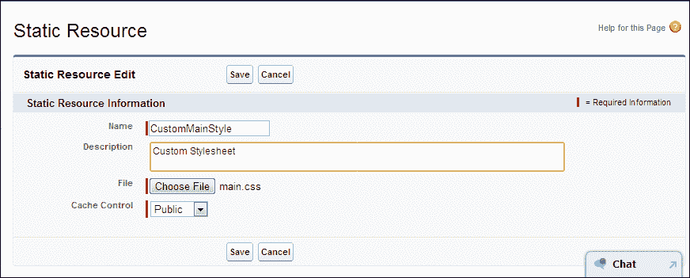
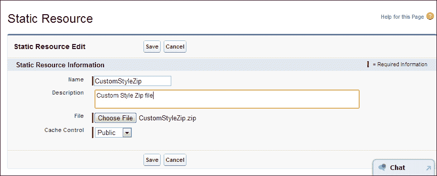

# 第三章. Visualforce 和标准 Web 开发技术

通过结合本地的 Visualforce 标记和标准 Web 开发技术，可以用于构建 Force.com 应用程序的丰富 UI。然而，Visualforce 的 HTML 渲染比较复杂，并且有多种方式可以通过使用额外的资源如 CSS 和 JavaScript 来改变 Visualforce 生成的默认 HTML。

本章讲解如何使用 CSS、JavaScript、jQuery 和 HTML5 等标准 Web 开发技术来开发 Visualforce 页面。本章还包括了 CSS、JavaScript 和 jQuery 静态资源的用法。以下主题将在本章中介绍：

+   样式化 Visualforce 页面

+   在 Visualforce 页面中使用 JavaScript

+   在 Visualforce 页面中使用 jQuery

+   HTML5 和 Visualforce 页面

让我们构建丰富的用户界面。

# 样式化 Visualforce 页面

我们使用 Visualforce 页面来完成简单的 UI 需求和复杂的 UI 需求。在实现复杂场景的情况下，仅使用 Salesforce 的标准样式无法满足这些需求。我们可以通过使用自己的样式表或样式来自定义 Visualforce 页面的外观和感觉。

许多标准 Visualforce 组件都有`style`和/或`styleClass`属性。我们可以使用这两个属性之一通过 CSS 来定制页面，这允许我们更改组件的默认样式（宽度、高度、颜色和字体）。Visualforce 中有两种样式类型，如下所示：

+   Salesforce 样式

+   自定义样式

## Salesforce 样式

Salesforce 标准页面有可以在 Visualforce 页面中使用的标准样式。当我们使用标准 Visualforce 组件，如`<apex:inputField>`、`<apex:pageBlock>`、`<apex:pageBlockTable>`和`<apex:detail>`时，它们会获得 Salesforce 提供的默认样式。`<apex:page>`或`<apex:apgeBlock>`组件中的`tabStyle`属性可以指定特定对象标签的样式。这将改变前面组件的颜色方案。当我们使用标准控制器时，Visualforce 页面组件会继承相关对象的样式。当我们使用自定义控制器时，我们可以通过在`<apex:page>`标签上使用`tabStyle`属性来使用 Salesforce 任何标准标签的样式。

## 自定义样式

我们可以通过使用自定义样式来扩展 Salesforce 样式。可以通过使用`style`和/或`styleClass`属性将自定义样式添加到 Visualforce 页面中。`style`属性和`styleClass`属性在大多数 Visualforce 组件中都是可用的。`style`属性允许你添加内联自定义 CSS 语句。`styleClass`属性允许你通过在 CSS 文件中指定的类名来添加自定义样式。

在以下示例中，示例 Visualforce 页面通过`style`和`styleClass`属性添加了自定义样式：

```js
<apex:page >
<style>
    .sample {font-weight: bold;}
</style>
<apex:outputText value="This text is styled via style attribute" style="font-weight: bold;"/> <br/>
<apex:outputText value="This text is styled via styleClass attribute" styleClass="sample"/>
</apex:page>
```

在前面的示例中，我们在 Visualforce 页面上实现了 CSS。但是，如果我们要在多个位置使用相同的样式，我们必须将特定的 CSS 文件添加到每个 Visualforce 页面中。我们可以使用静态资源来解决这个问题。这是将自定义样式绑定到 Visualforce 标记的另一种方式。

静态资源通过 **设置** 屏幕上传到 Force.com 平台。Force.com 平台允许我们上传图像、样式表、JavaScript 和存档（`.zip` 和 `.jar` 文件）。以下是我们上面 Visualforce 页面使用的样式表（CSS 文件名：`main.css`）：

```js
.sample {font-weight: bold;}
```

让我们看看如何将这个样式表上传到静态资源中。资源名称是 `CusomMainStyle`，它必须是唯一的。可以通过以下路径创建资源：

**您的姓名** | **设置** | **开发** | **静态资源** | **新建**



使用静态资源存储 CSS 文件

我们可以在 Visualforce 页面中如下引用 `CustomMainStyle` 静态资源。可以使用 `<apex:stylesheet>` 标签包含样式表。资源名称用于在 Visualforce 页面中引用静态资源，如下面的代码所示：

```js
<apex:page>
<apex:stylesheet value="{!$Resource.CustomMainStyle}"/>

<apex:outputText value="This text is styled via styleClass attribute via static resources" styleClass="sample"/>
</apex:page>
```

### 小贴士

如果您想完全删除 Salesforce 标准样式，您必须将 `<apex:page>` 标签上的 `standardStylesheets`、`sidebar` 和 `showHeader` 属性设置为 false 值。如果您停止加载标准 Salesforce 样式表，您可以减小 Visualforce 页面的尺寸：

```js
<apex:page sidebar="false" showHeader="false" standardStylesheets="false">
</apex:page>
```

我们之前提到，Force.com 平台允许我们将存档文件（如 ZIP 和 JAR 文件）作为静态资源上传。在这种情况下，ZIP 文件可以包含图像、CSS 文件和 JavaScript 文件等资源。在这种情况下，我们可以通过使用 `URLFOR` 函数引用 ZIP 文件内的单个资源。`URLFOR` 函数有两个参数。第一个参数是静态资源的名称，我们在上传静态资源时提供。第二个参数是 ZIP 文件中特定文件的路径。以下示例中使用的静态资源是一个包含 `main.css` 样式表的目录 `CustomStyleZipFolder` 的 ZIP 文件。



将 zip 文件作为静态资源上传

```js
<apex:page >
<apex:stylesheet value="{!URLFOR($Resource.CustomStyleZip,'/CustomStyleZipFolder/main.css')}"/>

<apex:outputText value="This text is styled via styleClass attribute via static resources" styleClass="sample"/> <br/>

<apex:outputText value="Following image is loaded via css class"/> <br/>
<apex:outputPanel styleClass="imageCls">

</apex:outputPanel>

<apex:outputText value="Following image is loaded directly from static resource"/> <br/>
<apex:image value="{!URLFOR($Resource.CustomStyleZip,'/CustomStyleZipFolder/images/sfLogo.png')}" width="100" height="50"/>

</apex:page>
```

对于静态资源，存在一个特殊场景，您可以使用文件的相对路径。这允许我们以相对方式引用存档内的其他内容。例如，`Main.css` 文件具有以下样式：

```js
.sample {font-weight: bold;}
.imageCls {background:url(images/sfLogo.jpg) no-repeat top left;
      width: 100px;
          height: 100px;
          display: block; 
      }
```

在前面的样式代码中，图像的路径需要相对于 `Main.css` 文件指定。在这种情况下，我们准备了 `CustomStyleZipFolder` 目录，其中包含 `Main.css` 文件和 `images` 文件夹。在这里，`Images` 中存在的 `sfLogo.jpg` 图像在 `Main.css` 中被引用。

然后，我们只需将 `Main.css` 文件包含到 Visualforce 页面中。我们不需要担心样式表中的相对路径，因为静态资源包含样式表和图像。

### 小贴士

单个静态资源的最大大小为 5 MB。组织中静态资源的最大大小为 250 MB。

# 在 Visualforce 页面中使用 JavaScript

JavaScript 是 Visualforce 页面的关键浏览器技术之一。JavaScript 为在 JavaScript 对象、HTML 元素和 Visualforce 控制器之间进行通信提供了框架。我们可以在 Visualforce 页面中使用 JavaScript 库以及一些 Visualforce 组件（如 `<apex:actionFunction>`、`<apex:actionSupport>`、`<apex:commandButton>`、`<apex:commandLink>`）等。JavaScript 代码可以在 Visualforce 页面中编写，并且可以通过使用静态资源将其包含在 Visualforce 页面中。这是在 Visualforce 页面中包含 JavaScript 库的最佳方法。我们可以使用 `<apex:includeScript>` 组件从静态资源中包含 JavaScript 库。例如：

```js
<apex:includeScript value="{!$Resource.MyJSFile}"/>
```

## 在 JavaScript 中访问 Visualforce 组件

当我们在 JavaScript 代码中引用 Visualforce 组件时，ID 属性就派上用场。每个 Visualforce 组件都有一个 ID 属性。要使用 JavaScript 引用特定组件，必须指定该组件的 ID 属性，并且它用于将两个组件绑定在一起。当页面渲染时，此 ID 属性是特定组件 DOM ID 的一部分。ID 属性也必须是唯一的。以下代码片段展示了使用 `id` 属性绑定两个组件的方法：

```js
<apex:outputLable value="Label Name" for="item"/>
<apex:inputField id="item" value="{!item__c.Name}">
```

以下示例提供了一个在 Visualforce 页面中处理 JavaScript 的方法思路。此页面已实现通过 JavaScript 修改复选框来更改选择列表的值。JavaScript 代码包含在 `<script>` 标签内。JavaScript 函数有两个参数。第一个参数是触发事件的元素（`input`），第二个参数是目标选择列表字段的 DOM ID (`id`)。`{!$Component.inputStatus}` 表达式获取由 `<apex:inputField id="inputStatus" value="{!order.Status__c}"/>` 组件生成的 HTML 元素的 DOM ID：

```js
<apex:page controller="OrderStatusUpdate" id="pageId">
    <script type="text/javascript">
        function updateStatus(input,id) {

            if(input.checked){
                document.getElementById(id).value="Processing";
                //alert(document.getElementById(id).value);
            }else{
                document.getElementById(id).value="New";
                //alert(document.getElementById(id).value);
            }
        }
    </script>
    <apex:form id="formId">
    <apex:pageBlock id="pageBId">
        <apex:pageBlockTable id="tableId" value="{!Orders}" var="order">
            <apex:column value="{!order.Name}"/>
            <apex:column value="{!order.Customer__c}"/>
            <apex:column id="checkId" headerValue="Status">
                <apex:inputField id="inputStatus" value="{!order.Status__c}" />
            </apex:column>
            <apex:column headerValue="Started Processing" >
                <apex:selectCheckboxes onclick="updateStatus(this,'{!$Component.inputStatus}');" >

                 </apex:selectCheckboxes>
            </apex:column>

        </apex:pageBlockTable>
    </apex:pageBlock>
    </apex:form>

</apex:page>
```

以下代码是前面 Visualforce 页面相关控制器类的代码。它按照以下方式检索现有订单：

```js
public with sharing class OrderStatusUpdate {

    public List<Order__c> Orders{get;set;}

    public OrderStatusUpdate(){
        Orders = new List<Order__c>();
        Orders = [SELECT id, Name, Customer__c, Status__c, Planned_Delivery_Date__c, Delivered__c FROM Order__c LIMIT 1000];
    }
}
```

### 小贴士

**下载示例代码**

您可以从您在 [`www.packtpub.com`](http://www.packtpub.com) 的账户中下载您购买的所有 Packt 书籍的示例代码文件。如果您在其他地方购买了此书，您可以访问 [`www.packtpub.com/support`](http://www.packtpub.com/support) 并注册，以便将文件直接通过电子邮件发送给您。

## Apex 控制器的 JavaScript 远程调用

JavaScript 远程调用是提供对 APEX 控制器中某些方法支持的过程，这些方法将通过 JavaScript 调用。此功能使我们能够实现使用标准 Visualforce Ajax 组件无法完成的复杂和动态行为。JavaScript 远程调用在 Spring '11 作为开发者预览版发布。自 Summer '11 版本发布以来，JavaScript 远程调用提供了对更多返回数据类型的支持。此外，响应中不再重复引用相同的对象。JavaScript 远程调用有三个主要部分：

+   用于调用远程方法的 JavaScript 代码

+   Apex 控制器中的远程方法

+   Visualforce 页面中的回调函数（用 JavaScript 编写）

要使用 JavaScript 远程调用，您的请求必须采用以下形式：

```js
[<namespace>.]<controller>.<method>([params...,] <callbackFunction>(result, event)  
{  
// callback function logic  
}, {escape:true});  
```

以下代码的描述如下：

+   `namespace`：这是您的组织命名空间。如果类来自已安装的包，则此为必需项。

+   `controller`：这是您的 Apex 控制器的名称。

+   `method`：这是您正在调用的 Apex 方法的名称。

+   `params`：这是您方法接受的参数的逗号分隔列表。

+   `callbackFunction`：这是处理控制器响应的函数的名称。它返回调用的状态和方法结果。

+   `escape`：这指定了您的响应是否应该被转义（默认为 `true`）或不应转义（`false`）。

远程方法必须以 `@RemoteAction` 注解开始，如下所示：

```js
@RemoteAction
global static String getItemId(String objectName) { ... }
```

远程方法可以作为参数具有以下数据类型：

+   Apex 原始数据类型（String、Integer 等）

+   集合（Set、List、Map）

+   sObject（标准对象和自定义对象）

+   用户定义的 Apex 类和接口

远程方法可以返回以下数据类型：

+   Apex 原始数据类型（String、Integer 等）

+   sObjects（标准对象和自定义对象）

+   集合（Set、List、Map）

+   用户定义的 Apex 类和枚举

+   `SelectOption`

+   `PageReference`

+   `SaveResult`

+   `UpsertResult`

+   `DeleteResult`

### 提示

远程方法必须通过名称和参数数量唯一标识。例如，我们不能编写具有相同方法名称、相等参数数量但不同参数类型的远程方法。

以下示例展示了如何在 Visualforce 页面和 Apex 控制器中使用 JavaScript 远程调用：

```js
<apex:page controller="JavaScriptRemotingController" id="pageId">
  <script type="text/javascript">
function updateStatus(input,id) {
var inputStatus=id;
JavaScriptRemotingController.doStartShipping(inputStatus,function(result,event){

},{escape:true});
}</script>

 <apex:form id="formId">
    <apex:pageBlock id="pageBId">
        <apex:pageBlockTable id="tableId" value="{!Orders}" var="order">
            <apex:column value="{!order.Name}"/>
            <apex:column value="{!order.Customer__c}"/>
            <apex:column id="checkId" headerValue="Status">
                <apex:inputField id="inputStatus" value="{!order.Status__c}" />
            </apex:column>
            <apex:column headerValue="Started Processing" >
                <apex:selectCheckboxes onclick="updateStatus(this,'{!order.Id}');">                    
                 </apex:selectCheckboxes>
            </apex:column>

        </apex:pageBlockTable>
    </apex:pageBlock>
    </apex:form>
</apex:page>
```

这是相关的 Apex 控制器：

```js
global with sharing class JavaScriptRemotingController {

    public List<Order__c> Orders{
        get{
         Orders = new List<Order__c>();
        Orders = [SELECT id, Name, Customer__c, Status__c, Planned_Delivery_Date__c, Delivered__c FROM Order__c LIMIT 1000];
        return Orders;
        }
        set;
    }

    public JavaScriptRemotingController(){

    } 

@RemoteAction
global static Item__c doStartShipping(String para){
    Order__c updateOrder;        
    try{
       updateOrder=[SELECT id, Name, Customer__c, Status__c, Planned_Delivery_Date__c, Delivered__c FROM Order__c Where Id =: para];        
       updateOrder.Status__c = 'Shipping';
           update updateOrder;   
    }catch(DMLException e){
         ApexPages.addMessages(e);
         return null;   
    }        
return null;
}
}
```

# 在 Visualforce 页面中使用 jQuery

jQuery 是一个开源的 JavaScript 库，它允许我们实现 HTML 的客户端脚本。jQuery 被设计成能够通过引入新的插件来扩展主要库，从而引入各种新功能。它还允许我们导航文档、选择 DOM 元素、创建动画、事件处理以及开发 Ajax 应用程序。

当我们开发 Visualforce 页面时，jQuery 可以用来简化 UI 开发。例如，jQuery 用于简化 DOM 操作并访问 UI 元素库，以及简化移动设备的 Ajax 技术和技术。

以下示例展示了我们之前示例的 jQuery 版本。这用于解释 Visualforce 中的 JavaScript 代码。本例使用 `Order__c` 标准控制器。此页面需要带有订单 ID 的 ID 参数：

[`c.ap1.visual.force.com/apex/JQueryExample?id=a02900000086Hlr`](https://c.ap1.visual.force.com/apex/JQueryExample?id=a02900000086Hlr)

此页面渲染订单详情页面。我们使用 jQuery 来满足我们的需求。因此，Visualforce 页面需要包含 jQuery 库以实现 jQuery 实现。在以下示例中，我们使用了主 jQuery 库的在线参考：

```js
  <apex:includeScript value="https://ajax.googleapis.com/ajax/libs/jquery/1.7.2/jquery.min.js" />
```

您还可以使用静态资源来包含 jQuery 库。用法与 JavaScript 和 CSS 示例相同。

### 提示

还有其他具有相同默认全局变量名（`$`）的 JavaScript 库。如果我们也使用相同的全局变量名，客户端将会有冲突。我们的 jQuery 函数将无法工作。为了消除这种冲突，我们可以使用 `jQuery.noConflict()` 并将其分配给另一个全局变量，然后在我们的 jQuery 代码中使用这个新全局变量。

```js
<apex:page StandardController="Order__c" id="pageId">
  <apex:includeScript value="https://ajax.googleapis.com/ajax/libs/jquery/1.7.2/jquery.min.js" />

  <script type="text/javascript">  
      j$ = jQuery.noConflict();
      j$(document).ready(function() {
          j$('.checkBox').click(function () {          
              j$('.inputStatus').val('Processing');         
          });

      });        
    </script>
    <apex:form id="formId">
    <apex:pageBlock id="pageBId">
        <apex:pageBlockSection id="pBlockSection">
            <apex:outputField value="{!Order__c.Name}"/>
            <apex:outputField value="{!Order__c.Customer__c}"/>
            <apex:inputField styleClass="inputStatus" value="{!Order__c.Status__c}" />           
            <apex:pageBlockSectionItem id="pbSectionItem">
                <apex:outputLabel value="Mark as Started Processing"></apex:outputLabel>
                <apex:selectCheckboxes styleClass="checkBox" >                    
                 </apex:selectCheckboxes>
            </apex:pageBlockSectionItem>
        </apex:pageBlockSection>
    </apex:pageBlock>
    </apex:form>
</apex:page>
```

### 提示

如果我们没有为特定组件使用 `id` 属性，Visualforce 将使用动态生成的 `id`，例如，`j_id0, j_id0:j_id1`。考虑一个例子，我们已指定 `<apex:inputField id="inputOne"/>` 的 `id` 属性。但我们没有为 `inputOne` 的父组件指定任何 `id` 属性。我们可以使用 jQuery 选择这样的组件。这被称为部分选择器。例如：`j$('[id*= inputOne]')`

# HTML5 和 Visualforce 页面

HTML5 是 HTML 的新标准。HTML 的前一个版本是 HTML 4.01。HTML5 具有新功能，如新元素、新属性、视频和音频支持、2D/3D 图形支持、完整的 CSS3 支持、本地存储、本地 SQL 数据库支持，以及具有网页应用功能。有了这些功能，我们可以减少对外部插件的依赖。还有更多标记来替代脚本。HTML5 具有更好的错误处理机制。

当涉及到 Force.com 开发时，我们可以使用 HTML5 进行 Visualforce 页面开发，并开发移动网页应用。在 Force.com 平台上，HTML5 在开发基于网页的移动应用中起着重要作用。例如，最近 Salesforce 发布了 touch.salesforce.com，它使用了 HTML5。

默认情况下，Visualforce 页面使用 HTML 4.01 转换的 `docType`。自 Winter '12 版本以来，Visualforce 页面支持在 `<apex:page>` 标签中更改 `docType` 属性。在一个纯 HTML5 页面中，必须在页面顶部指定 `<!DOCTYPE html>` 标签。`<apex:page>` 的 `docType` 属性实现了这一要求。

以下是在`<apex:page>`组件上`docType` Visualforce 属性的示例用法：

```js
<apex:page docType="html-5.0"><!-- HTML5 --></apex:page>
<apex:page docType="html-4.0.1-transitional"><!-- HTML 4.0.1 Transitional --></apex:page>
<apex:page docType="xhtml-5.0.1-strict"><!-- XHTML 5.0.1 Strict--></apex:page>
```

以下示例是一个使用 HTML5 实现拖放功能的 Visualforce 页面。这里有一个矩形和一个引用自静态资源的图片。我们可以将图片拖入矩形中：

```js
<apex:page docType="html-5.0" sidebar="false" showHeader="false"  standardStylesheets="false" cache="true" >

<html>
<head>
<style type="text/css">
#div1 {width:400px;height:400px;padding:10px;border:1px solid #aaaaaa;}
</style>
<script>
function allowDrop(ev)
{
ev.preventDefault();
}

function drag(ev)
{
ev.dataTransfer.setData("Text",ev.target.id);
}

function drop(ev)
{
ev.preventDefault();
var data=ev.dataTransfer.getData("Text");
ev.target.appendChild(document.getElementById(data));
}
</script>
</head>
<body>

<p>Drag the Salesforce logo into the rectangle:</p>

<div id="div1" ondrop="drop(event)" ondragover="allowDrop(event)"></div>
<br/>


</body>
</html>
</apex:page>
```

# 摘要

在本章中，我们熟悉了本地 Visualforce 标记和标准 Web 开发技术的结合使用。我们看到了如何通过使用 CSS、JavaScript、jQuery 和 HTML5 在 Force.com 平台上构建丰富的 UI。我们还学习了 CSS、JavaScript 和 jQuery 静态资源的用法。
