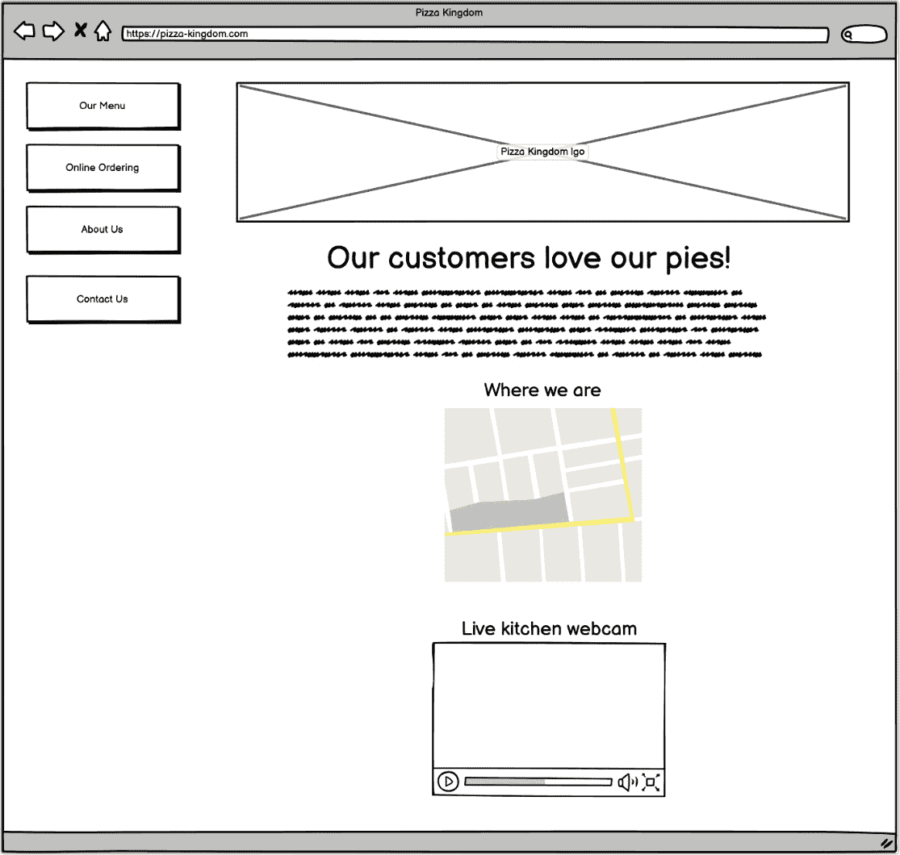

# 1

# 那么，你想要成为一名网页开发者，对吧？

Facebook. Wikipedia. CNN. Reddit. Ars Technica. Amazon. Instagram. ESPN. YouTube. Google. 网络真的吞噬了整个世界，不是吗？

每天有成千上万的人访问成千上万的网站。有些人是为了玩游戏，有些人是为了了解世界正在发生什么，有些人是为了让我们知道他们在忙什么（以及他们的猫在忙什么！），还有些人是为了与世界就各种话题进行交流。银行、医学、农业、社会、育儿、锻炼、食品和文化——几乎每个行业和每个你能想到的兴趣都在这个庞大的网站迷宫中有代表。

但谁创造了我们所有人（虚拟地）现在都聚集的这些数字空间？谁操纵着支撑这一切的技术来创造下一个伟大的网站？好吧，如果你正在阅读这本书，那么猜猜看？你已经迈出了成为答案的第一步——那就是你！

在这本书之外，还有许多更多的步骤，但正如人们所说：千里之行，始于足下。这本书的目标是为你提供一个路线图，详细说明成为网页开发者（无论那是什么——我们很快就会谈到！）需要采取的步骤。同时，它将为你提供在技术上的成功旅程所需理解的技术基础的第一层。

不要误解：这本书不会教你所有你需要知道的技术知识——一本书永远做不到这一点——但当你读到结尾时，你会在脑海中拥有这些知识的起点，并且你会对下一个你应该攀登的山峰有一个清晰的画面。

在本章中，基本目标是让你了解什么是网页开发者，以及成为其中一员需要什么。当然，理解这一点对于你的整个旅程至关重要，因为追求一个你并不真正理解的职业是没有太多意义的。特别是在一个即使是看似简单的事物也可能有广泛定义的领域，拥有基础的知识是非常重要的。

因此，在本章中，我们将涵盖以下主题：

+   究竟什么是网页开发者？

+   成为不同类型的网页开发者需要具备哪些条件？

+   网页开发者可能每天会执行哪些类型的任务？

+   网页开发者典型的一天工作内容是什么？

# 究竟什么是网页开发者?!

当我们问“什么是网页开发者？”这个问题时，明显的答案是那些开发网站的人。但这个答案过于简单化，并没有真正涵盖所有内容。此外，实际上并没有一个单一、被广泛接受的定义，但关于这个主题有很多变体。

如果你问我——通过阅读这本书，你多少已经做到了！——我的回答会是，网页开发者是程序员、编码者或软件开发者。所有这些术语基本上可以互换，它们仅仅指的是那些创建计算机软件的人，其中网站就是其中一种类型。

无论我们是在谈论网络开发还是其他类型的软件开发，唯一真正的统一原则是，你必须能够进行逻辑思考，这转化为能够编写计算机将遵循的指令（即代码），以便在网页浏览器中生成一个网站。基本上，网络开发是一种软件*工程*形式，尽管并非所有的软件工程都是网络开发（因为并非所有的软件都在网络上运行）——所以，你实际上是在走向成为一名软件工程师的旅程，而你的软件恰好运行在网络上。

但这不仅仅是编写代码！网络开发者还必须是一名图形艺术家。他们必须是可用性专家。他们必须是业务分析师。他们必须是作家和校对员。他们必须是网络工程师。他们还必须做更多的事情。换句话说，他们必须是全能的。这份工作不仅仅是编写代码；其中还有很多其他的东西，随着我们继续前进，我们将一一探讨。

这引发了一个观点，你有时会从那些不太熟悉网络开发者所涉及内容的人那里听到：他们说网络开发在某些方面*比其他类型的软件开发更容易*。好吧，让我立刻打消你的这种想法，因为这离真相相差甚远。事实上，虽然这并不总是正确的，但可以有力地论证，网络开发通常比非网络开发更难，仅仅是因为涉及到的所有事情，其中一些是网络开发特有的（或者至少在非网络开发中更为重要）。在这里，我指的是像网络这样的东西，因为网络本质上是在网络上运行的，而并非所有的软件都是这样，以及在网络开发中，作为开发者的你实际上并不真正控制运行环境。例如，用户可以随意调整他们的浏览器窗口大小，或者改变网页的缩放或字体，而你的代码必须适应并处理这些决定（这在桌面开发中也是真实的，但在网络开发中这是一个*更大的问题*）。

说了这么多，让我来缓解你心中可能升起的任何恐惧：虽然确实有很多东西要学习，但简单的事实是，网络开发是从一些相对基本的概念开始的，并从这里逐步构建。此外，完全没有必要一次性学习所有东西。不，你可以在不知道任何给定时刻“需要”学习的所有内容的情况下，成为一个非常出色的网络开发者。这是一个需要“学会学习”的关键领域，能够边走边学，一点一点地解决问题是至关重要的。事实上，一个人根本不可能知道所有的事情，当你完成这本书的时候，你会非常清楚地理解这一点。换句话说：无论看起来多么令人畏惧，我保证你*会到达那里*！

让我们更深入地探讨一下成为网页开发者意味着什么，以及从流程角度来看构建网站是什么样的，至少在非常高的层面上。

## 深入探讨成为网页开发者和构建网站

通常情况下，一切始于 **利益相关者** 或客户——本质上，是你为谁创建网站的人。当然，那个利益相关者也可能是你自己。无论如何，某个地方总有人有一些关于网站的构想。

这个网站可能是我们所说的 **宣传册网站**（或“宣传册网站”），这是一种更多或更少只是静态（不变）内容的网站。你有没有检查过你最喜欢的当地比萨店的网站？很可能，它除了提供一些关于餐厅的信息、菜单和一些用于下单的联系方式之外，没有更多内容（当然，有些可能会有在线订购，但让我们假设你的当地地方不够豪华到有这个功能）。这样的网站通常被认为是宣传册网站，因为它们在某种程度上是公司营销宣传册的数字版本。它们大部分不是交互式的；它们的目的是简单地传达信息给你。

我的个人网站位于 [zammetti.com](http://zammetti.com)，如图 *图 1.1* 所示，就是一个这样的宣传册网站。它除了传达关于我的信息之外，没有做太多其他的事情，这就是重点：


图 1.1：一个简单的宣传册网站——我的个人网站

然而，客户可能有一个宏伟的想法，下一个 Twitter（或 X，如现今所知），或者可能是 Gmail 或 Bing。这些网站与宣传册网站截然不同，因为它们高度交互式，意味着它们为访客执行功能。它们的目的是完成任务。这类网站通常被称为 **网络应用程序**。

这是一个微妙的不同之处，它们之间的界限可能会变得非常模糊。但作为一个一般性的指导原则，如果一个网站非常交互式，并且可以在用户的请求下执行功能，那么很可能，它是一个网络应用程序。这样说，重要的是要记住，网络应用程序仍然是一个网站。

无论如何，利益相关者都有那个愿景，而你作为网页开发者的第一份工作就是倾听他们，并理解他们试图实现的目标。这听起来可能很简单，但请相信我，这并不总是那么容易！通常，这个想法会非常模糊，而且/或者他们可能无法清楚地表达出来，他们将依赖你来解释他们的言语。本质上，你需要弄清楚他们头脑中的想法，有时甚至他们自己也不知道！

然后，你需要将那种理解映射到一个技术解决方案上——也就是说，实际上构建一个网站。这个过程通常会是迭代的，这意味着你会构建一些东西，展示给利益相关者，得到反馈，然后进行修改，经历几次这样的循环。这是非常典型的，而且绝对没有问题。我甚至可以说，不这样做将是罕见的例外。

但在那个阶段，你实际上*建造*了什么？好吧，你可能很惊讶地发现，在大多数情况下，你不会立即编写任何代码或进行任何编程。相反，第一步通常是创建我们所说的“低保真度原型”。或者，更简单地说：草图！

如果你是一个艺术型的人，你可能用手来绘制这些，但如果你像我一样——一个连直线都画不直的人——你会寻找专门为此目的而设计的工具。这里有很多选择，比如 Canva 和 Figma。甚至 Adobe Photoshop——一个图形编辑程序——也经常被用于这个目的。

另一个相当受欢迎的工具，碰巧也是我最喜欢的工具，是 Balsamiq Wireframes。使用它，你可以制作出如图*图 1.2*所示的插图：



图 1.2：使用 Balsamiq Wireframes 创建的比萨店网站示例

注意在那个原型中——我们称之为这种低保真度图表——事物并没有完全对齐，中间没有实际的文字，只是有些填充物来说明文字*将会*在那里？在这个阶段，你实际上并不关心诸如颜色、布局、字体选择、详细文字、图形以及其他使网站完整的事物。你试图做的只是确定整体结构，确保你从高层次上理解客户想要什么，并以他们能理解的形式展示出来，这样他们就可以回答“是的，你明白了！”或者“不，回到画板”（尽管你希望得到介于两者之间的东西，比如“好吧，很接近了，我们只需要调整这些一两个相对较小的问题”）。

下一个阶段通常是原型设计，有时也称为概念验证（尽管这通常只适用于交互式网站，因为目的是证明功能）。这通常将涉及实际开发和实际编程，但以非常快速和草率的方式进行。事实上，你在这个阶段可能会丢弃你完成的工作的一部分。

你在这里可能并不一定追求完美，但肯定需要深入了解细节。例如，当用户点击“在此处下单”按钮时，应该看到什么？在草图阶段，你可能会给客户一个第二版草图，上面说的并不多，只是“点击按钮时将出现订单表单。”但是，在原型阶段，你需要在一定程度上构建那个订单表单屏幕。它从风格或功能上讲，仍然不需要 100%完整，但你必须*开始*制作一个实际的订单表单，并让它*开始*看起来和*看起来*像它真正工作时的样子。

在这个阶段，用户交互通常是“模拟”的，这意味着它们是伪造的，但以一种让客户看起来真实的方式。例如，如果你需要能够将披萨和其他食品添加到购物车中，那么有快速且低成本的方法来实现这一点，这些方法可以让客户真正体验订购过程，但无需投入大量时间和精力来真正构建这一功能，这需要更多的时间和精力。

一旦他们开始使用它——你很可能会经历几个迭代周期——这时才是真正开始构建网站的时候。这是你开始编写真正有效、最终形式的代码的时候。你需要开始收集图形，可能从头开始创建它们，并在对齐、颜色、字体以及网页中所有风格方面确保布局稳固。你需要编写使订单表单真正工作的代码，这可能包括也可能不包括在服务器上编写代码（我们稍后会详细讨论）。所有那些只是为了向利益相关者表达想法而以粗略形式放入草图和原型的想法，现在必须巩固成一个真正的产品。

从一个想法，有时是一个非常模糊的想法，到建立一个完整的网站，无论是宣传册网站还是完整的网络应用程序，这真是一项相当冒险的任务。这需要大量的时间，有时还需要极大的耐心，以及逐渐微调事物的能力。本质上，你是在将粘土塑造成一个美丽的花瓶。这并不总是容易的；有时粘土塔甚至可能倒塌，你不得不重新开始，但这就是网络开发者的工作，简而言之！

在这一点上，我想再次重申我之前提到的观点，尽管这一切可能看起来令人望而生畏，但你不必害怕！我们将一步一步地前进，共同建立起你需要的基础。我们在这里所做的只是从 10,000 英尺的高度审视事物，并且没有期望你了解一切，而且这基本上将始终是你在这一领域工作的情形。

话虽如此，我希望你认为这一切听起来都很有趣！但有趣只是其中的一部分——那么，就业市场怎么样？网络开发者真的受欢迎吗？好吧，让我们来看看！

# 网络开发者有多受欢迎？

如果你现在上网，你会看到一些关于网络开发——以及更广泛的软件开发——是否处于危险中的辩论。那么，我们是否仍然受欢迎？一旦人工智能开始对我们产生影响，我们还会继续受欢迎吗？ChatGPT 及其竞争对手是否会以极短的时间和极低的成本完成我们做的工作？在这方面确实有很多悲观情绪，所以这是一个合理的问题。

我们当然可以整天辩论这个问题，很多人确实在这么做。如果你想知道我的看法，很简单：人工智能不会取代我们的工作。不过，它将会成为一个所有网络开发者都必须使用的不可或缺的工具。但我在这里跑题了，我们会在本书的后面部分讨论 AI 工具。

目前来说，简单的回答是，是的，网络开发者现在绝对很受欢迎，我认为至少在接下来的 10-20 年内这种状况不太可能改变（可能甚至更长）。当然，随着时间的推移，这份工作会有些变化，因为软件开发总是这样（它是一个变化极其迅速的领域），但如果你愿意跟上，我认为你不需要担心自己不受欢迎。

实际上，如果你想看看一些支持这个断言的硬数据，请看看*图 1.3*，这是一张美国劳工统计局职业展望手册页面讨论网络开发者的截图（[网络开发者](https://www.bls.gov/ooh/computer-and-information-technology/web-developers.htm)）：


图 1.3：美国劳工统计局职业展望手册页面讨论网络开发者

你在 BLS 网站上会发现，预计到 2032 年，网络开发者的就业机会将增长 16%（截至撰写本文时——这个数字在你阅读本文时可能会改变）。有趣的是，两年前的预测增长率是 13%，这告诉我们需求正在*增加*，这对任何进入这个领域的人来说都是好消息。事实上，这种预测的增长速度几乎超过了所有其他领域。

所以，是的，说我们很受欢迎可能还是低估了！

这种需求主要是由电子商务网站和移动开发推动的。那些是什么？

好吧，一个**电子商务网站**，其中“e”代表“电子”，是一个人们买卖商品或进行其他通常被认为是“商业”活动的地方。亚马逊和 eBay 可能是最知名的电子商务网站，但你的银行网站也是一个，甚至你之前看过的那个当地比萨店网站可能也是。电子商务网站通常更侧重于**进行**商业活动，所以如果你可以从比萨店网站上订购食物，那么这个比萨店的网站就是一个电子商务网站；然而，如果它只是谈论餐厅，那么它可能是一个宣传册网站（有时候这个界限可能有点模糊）。无论如何，由于商业活动都是关于企业的，而企业某种程度上统治着世界（无论这是好事还是坏事），你可以看到为什么需求只会不断增加。

当然，这不仅仅关于电子商务网站。社交媒体是另一个巨大的类别，其中有很多工作可以找到，当然还有许多其他类别的网站。但无论网站的类型如何，它往往都归结于背后的企业或其他类型的组织（非营利组织、政府等）。随着这些实体继续将在线存在优先于非互联网存在（因为人们现在普遍期望在互联网上生活），这种需求趋势线只会持续上升。

移动开发是一个完全不同的类别，但事实是，如今很多移动开发也是网络开发。你知道你在 iPhone 或三星 Galaxy 手机上运行的应用程序吗？其中许多是我们所说的“原生”应用程序，这意味着它们是为那些特定平台编写的。然而，许多应用程序使用与构建网站相同的网络技术，并且这个趋势可能会增长。为移动设备创建网站或网络应用程序会带来独特的挑战，但技能集是相同的，所以那里的增长意味着网络开发的增长。

事实上，对于世界上的许多地方来说，网站更多地是通过移动设备而不是典型的桌面机器（尽管笔记本电脑有点灰色地带，但它们更像是桌面机器而不是移动智能手机）来访问的。网络开发通常以“移动优先”的方式进行，这意味着你让你的网站在智能手机上看起来和功能正确，然后调整它以便在桌面上也能很好地工作。

从这次讨论中，你可以看到网络开发有多种形式，使其成为一个不断扩大的主题，随着时间的推移只会变得更加广泛。作为网络开发者，你需要掌握许多不同的学科，包括云计算、网络安全、数据分析、搜索引擎优化等等。如果你不知道这些是什么意思，不用担心——你会在本书结束时了解！不过，这里的相关点是，由于你需要至少对这一长串事物有所了解，熟练的网络开发者变得越来越有价值。一旦你掌握了这些技能，你将这些技能用于他人的需求只会增长，因为该领域的不断演变意味着你的学习能力——以及能够证明这一点的能力——将是你最宝贵的资产。

## 给我看看钱！

好的，太好了，我已经说服你，网络开发者需求旺盛，并且将持续保持需求旺盛，我们甚至可能会看到需求的增长。但这听起来有点*困难*，不是吗？这最好是有价值的，对吧？!

嗯，确实是！根据我之前提到的 BLS 网站，截至 2022 年 5 月，中位收入为 78,580 美元。我可以告诉你，这个数字比 2020 年高，而且在此之前已经持续上涨了一段时间。这不算差！

但还有更好的！随着你不断进步和积累经验，你不会对发现自己的收入潜力上升感到惊讶。我将根据你的工作经验年限给你一个非常粗略的职业发展路径：

+   你可能一开始的薪资在 5 万到 6 万美元之间（但请记住，所有这些数字都受到许多因素的影响，所以你的起薪可能实际上更低或更高）

+   三年后，你很可能期望在 7 万到 8 万美元的范围内

+   五年后，你很可能达到或接近 10 万美元

+   到了第十年，你几乎肯定能超过 10 万美元，可能更多，大约在 13 万到 14 万美元之间，你很可能即将，或者已经，晋升到高级/领导职位

+   15 年后，你可能看到 150,000 美元或更高

之前的数字是非**FAANG**职位——也就是说，任何不被视为 FAANG 公司的公司。当然，这会引发一个问题：什么是 FAANG 公司？！FAANG 是一个缩写，代表**Facebook, Amazon, Apple, Netflix, and Google**，我将在第九章中详细介绍，但现在的重点是，我们用这个术语指的是“最大的、薪酬最高的硅谷公司”。如果你在这些类型的公司中获得职位，那么你可以期待比这里提到的数字多得多的收入。但无论你是否在 FAANG 公司工作，在这个领域都有很大的机会实现财务上的成功。

因此，到目前为止，你一定垂涎欲滴，对吧？那些山里有金子，你只需要获得挖掘它的技能。但让我们稍微放慢脚步，提出一个可能很难但至关重要的一个问题：这是否是一个适合你的领域？

# 但是，网页开发的工作适合你吗？

你有没有偶然听说过“任何人都能编程”的咒语？这是我们喜欢说的话，在基本意义上，*确实是*如此。对于有学习动力的人来说，在网页开发领域没有什么是根本无法学会的。它不像棒球，你必须能够击中每小时 95 英里的快速球，或者像篮球，你必须能够做出跳投，这两者都需要大量的身体技巧。而且，它也不像宇航员，你必须有完美的视力和不屈的意志去爬上并乘坐一个巨大的、爆炸的蜡烛进入轨道！不，这里没有真正的身体要求，天生的才能或与生俱来的能力是你必须拥有的。只要你有了动力，你就能学会你需要的一切。

让我们来看看一个成功的网页开发者通常会需要的某些关键特征。

## 你必须是一个解谜大师

话虽如此，网页开发——以及软件开发总体上——在某种程度上是一种持续的解谜练习。你所做的一切都将围绕着解决问题。你是如何让客户的标志在网页上正确显示的？你是如何让他们的联系表单发送电子邮件的？你是如何让网站对残疾人可访问的？这些都是需要解决的问题，需要完成的谜题。

在这个领域茁壮成长的人有一些特定的品质，一些是固有的，但大多数可以通过经验随着时间的推移而发展。

## 创意最大化

在网页开发中，也涉及相当大的创意。很少有正确或错误的方法去做事情，很少有解决问题的明确方法，也很少有经典正确的答案。因此，你通常需要有一定的创意才能产生令人满意的结果。你必须接受你所被要求做的事情——这可能是相当一般性的，有时可能并不明确定义——并找出如何将其变为现实，通常是通过引入你自己的创意解释。

而且这不仅仅是你看到屏幕上的内容，创意和艺术性的概念在这里显然更适用。不，编写*代码*中也有创意和艺术性：你是如何构建它的？你需要哪些组件，以及你是如何让它们相互作用的？

但尽管网页开发是一个充满创造力的领域，你可以有很大的自由按照自己的方式做事，但它并不是完全的无政府状态！我们称之为“最佳实践”，指的是在特定情况下之前已经应用过的解决方案，通常为许多人带来了积极的结果。但最终，建造网站与建造桥梁不同，例如，因为社会已经建造了许多桥梁，因此我们每次都知道如何建造。我们知道什么有效，什么无效，因此我们在建造时遵循经过验证的建筑技术。虽然最佳实践在网页开发中为我们提供了一些这样的东西，但它往往比你想象的要少，这也为大量的创造力打开了大门。

换句话说：虽然建造桥梁无疑是科学和艺术的结合，但在大多数情况下，科学部分将是更大的部分。在软件开发，尤其是网页开发中，情况通常正好相反。

## 关注细节，为了乐趣和利润

因此，网页开发者必须喜欢解决问题，并且必须具有创造力。他们还必须具备严谨的细节关注力。当我说到，有时你会因为试图让某物工作而拔掉头发，最终发现它之所以不工作，是因为某个数字、字母或符号出了问题。你越关注细节，你拔掉所有头发的时间就越长！


图 1.4：网页开发者经常诅咒，但总是对着无生命物体

## 单独或团队合作，都同样重要

网页开发者必须擅长独立工作，同时也能与他人很好地合作。正如我之前提到的，与客户和利益相关者打交道是与他人合作的一个明显例子，但有很大可能性你不会是唯一开发网站的人。

你当然在某些情况下可能会独自工作，但更常见的情况是你会有合作伙伴。你可能负责构建网站的某个部分，而其他人则负责另一部分，然后你必须确保所有部分都能协同工作。能够沟通、协作、规划和执行是关键要求。

软技能，换句话说，也是网页开发者另一个关键要求。无论以书面形式还是口头形式，无论是否技术性，能够清晰、精确地表达你的想法是一项你必须掌握的技能。

## 跟上时代

你会反复听到这一点，但学会学习，并适应变化，是成为一名网页开发者需要掌握的顶级技能之一。这个领域的变革速度既令人惊叹，又令人兴奋……但同时也非常令人沮丧！当你学会一项技能并对其感到自信时，它可能就会过时，并被其他东西所取代。

这导致了一个被称为“冒充者综合症”的问题，几乎每个人都会遇到。这就是你感觉自己像是一个冒充者，一个不知道自己在做什么的人，即使你实际上知道。尽管我已经从事这类工作很长时间了，但有时它仍然会影响到我。技术的不断更新导致了这种感觉，因为你总是在不得不面对新事物。不幸的是，没有银弹可以用来处理冒充者综合症。但能够边学边用，并随着时间的推移证明自己能够做到，可能是减轻其影响的一种唯一方法。

跟踪领域的变化有时是一项全职工作，如果你喜欢发现过程，那就更有帮助了。如果你喜欢学习新事物，有时喜欢处于边缘，那么网页开发可能会让你笑很多。

## 随遇而安

你必须有一个厚脸皮才能成为一名网页开发者，因为总会有人有意见需要你倾听并采取行动。无论是客户还是老板，你必须愿意接受反馈，不要把它当作个人攻击，并愿意根据你听到的内容修改你的工作。正如作家们喜欢说的：你必须愿意杀死你的孩子。在网页开发中，这可能意味着尽管你认为你构建的网站看起来很酷，但如果客户有不同的看法，你必须愿意放弃并重新开始。

## 找到你需要的东西

作为一名网页开发者，你将花费大量时间做一些看似不是网页开发的事情。当然，我谈到了与他人沟通的事情，但在这里，我谈论的是研究和构思你将要构建的东西，无论是网页布局、背后的代码等等。你会惊讶于网页开发者花费大量时间只是盯着空中，想象着事情！但是，除此之外，你必须能够找到信息并将其综合到你的思考中。你必须知道去哪里获取你绝对会有的所有问题的答案。

你知道如何在网页上水平垂直居中一个`div`元素吗？你知道这些词的意思吗？不知道？好吧，你最好知道去哪里查找这些信息！你知道 React 的`useEffect()`函数的函数签名是什么吗？不知道？我希望你能找到答案，否则你会遇到麻烦！你今天必须使用 Vue（你对它一无所知）而不是你通常使用的 React 吗？太好了——你将不得不做一些研究，不是吗？

所有这些的要点是，成为一名网页开发者意味着你需要拥有很多技能和品质，而不仅仅是纯粹的技术知识。实际上，技术技能只是容易的部分。如果你不享受这一切的挑战，那么网页开发领域可能并不适合你。你必须接受挑战，接受疯狂！如果你这样做，我认为，抛开金钱不说，你将从从中获得的成就感中享受到很多乐趣。没有什么比解决困扰你一段时间的问题，并在屏幕上看到最终工作起来的感觉更令人欣慰了。这是令人满意的。即使你所构建的东西对你来说并没有根本的兴趣，第一次看到它工作起来感觉也非常不错！

因此，在这个领域，除了金钱之外，确实有回报，但我认为你了解你要进入的是什么领域是公平的。肯定会有一些日子，你会对着无生命的物体尖叫和喊叫。你将感受到冒名顶替综合症一直存在，并不得不与之抗争。几乎每天都会介绍一些你必须接受并利用的新事物。但如果这是一个让你兴奋的挑战，那么网页开发可能正是你需要的！

## 耐心和应对失败

除此之外，你还需要具备的两个技能，或者说素质，是耐心和应对失败的能力。你需要耐心去研究和学习，这是显而易见的，但你在构建网站时也需要耐心，因为需要时间来确保所有细节都正确。你经常会不得不多次检查，一点一点地调整，才能使其恰到好处。

这与应对失败的概念相吻合。每次你编写代码时，都存在它第一次没有正确工作的风险。事实上，你几乎可以保证它不会！你可以让这影响到你，这样你就会有一个非常糟糕的经历，而且不会取得好的进展，或者你可以学会接受事情不工作只是过程的一部分，并且必须继续努力。

在某种程度上，你必须善待自己。在开发网站的过程中，你将会有很多小小的失败，你将不得不不为此自责，因为这是过程的一部分。但这是网页开发，以及实际上软件开发通常的独特之处：你可以多次出错，并逐渐将其纠正得更接近正确，而没有任何真正的后果。这不像设计建筑，如果你一开始就出错，整个项目可能就会崩溃，浪费大量时间、金钱，甚至可能危及生命。不，如果你的代码第一次没有正确工作——而且，再次强调，这很可能——这并不会造成真正的伤害。当然，这会浪费一点时间，但仅此而已。

因此，耐心和能够处理失败也是成为一名网页开发者需要具备的关键品质，通过结合它们，你就能得到对自己宽容的理念。实际上，学会不把每一行不正确的代码都视为失败，这才是关键。这只是旅程的一部分，每次都是，而且完全没问题！

你会注意到我没有列出作为网页开发者需要具备的品质之一，那就是很多进入这个领域的人都在思考的问题：是否需要大学学位。那么，让我们接下来谈谈这个问题！

# 你需要学位吗？

在所有关于进入网页开发领域的问题中，你是否需要上大学并获得大学学位——通常是一个计算机科学学位——可能是最复杂的问题之一。如果你看看在这个领域取得成功所需的全部技能，似乎显而易见的答案应该是肯定的，你确实需要学位。但现实情况却大不相同。

让我简单介绍一下我自己。截至写作本文时，我 51 岁。我作为一名专业开发者已经工作了 28 年，在那之前我还做过超过 5 年的咨询工作。我以某种形式编程已经大约 45 年了——是的，我真的从大约 6 岁就开始了！这一直是我一生的热情，而且我有一个漫长而富有成果的职业生涯，这在某种程度上只是一个额外的奖励。

但你知道我缺少什么吗？没错：一个大学学位。

我确实上过一段时间大学，但由于个人原因，在大约离学位还有两年的时候我不得不辍学了。后来我稍作休息，又去上了一些课，打算拿到那个学位。但那时我主要是出于职业发展的考虑，简单地说，事实是：没有学位并没有阻止我进入这个领域，也从未阻碍过我。

现在，我不想给人留下任何错误的印象：如果我从一开始就完成了学位，我的道路可能更容易——当然也更短——而且我一开始就能赚得比现在更多的钱。我还花了很长时间相信，没有那张挂在墙上的纸，没有人会给我机会，所以我甚至都没有尝试。

那是一个错误。

事实上，在这个领域，如果你能证明你懂得自己的东西，那么学位不会阻止你入门。一开始可能意味着收入会少一些，也可能意味着你的职业发展有一个天花板——我可能永远没有机会获得首席执行官级别职位（CEO、CIO 等）——但你可以肯定，没有学位也能找到一份有报酬的工作。这完全取决于你的能力展示——即使你有计算机科学学位，虽然这表明你可能有一个相当坚实的基础，正如我们之前讨论的，你仍然需要在工作中进行大量的学习。拥有学位表明你有很多优点，但这并不一定意味着你拥有成为优秀网页开发者所需的知识的一小部分。

要明确的是，一些公司确实认为拥有学位非常重要，甚至有些公司会将其作为一项试金石，这意味着如果你没有学位，你的简历可能会立即被扔进垃圾桶。虽然在我的经验中，这可能是例外而不是规则，但这确实是一个硬性要求。说实话，这很遗憾，因为这意味着这些公司在没有充分理由的情况下，错过了一些可能非常优秀的候选人。但，最终，这是他们的选择，作为求职者，你对此无能为力。如果你遇到这样的情况，你只能笑对人生，并相应地调整你的搜索策略。

因此，总结一下：不，拥有学位并不是成为网页开发者的必要条件——在大多数情况下，没有学位也不是一个决定性的因素，我就是最好的证明！当然，这并不意味着没有学位没有好处，但这主要取决于你自己的目标和期望的道路。如果你认为学位很重要，那么无论如何，都应该去获得一个。如果你在每个阶段都希望最大化你的收入，那么是的，一个学位可能会有帮助。如果你梦想着最终能乘坐公司飞机并在首席执行官办公室管理一切，那么是的，你可能需要学位。但你可以肯定，作为一个没有学位的网页开发者，只要你投入时间和精力，让自己成为那些好公司不愿意错过的对象，即使墙上没有那张装帧好的证书。

现在你已经对成为网页开发者所需的能力、学位等方面有所了解，让我们来看看典型的工作日可能是什么样的。

# 考察一个网页开发者典型的一天

现在你已经对网页开发者是什么以及成为其中一员需要什么有所了解，下一个合乎逻辑的问题（记住，我们这里很重视逻辑！）就是网页开发者典型的一天是什么样的？你知道的，除了狂热的英雄崇拜之外！


图 1.5：是的，我们网页开发者就是这样酷！

这是一个复杂的问题，因为涉及许多变量。但如果我们思考一下我和我合作的那些人每天做的事情，就会开始出现一个非常粗略和普遍的结构，这个结构似乎适用于*大多数*网页开发者*大多数*时间。让我们看看这会是什么样子。

## 网页开发者的职责

首先，有一些常见的任务，你会在大多数日子里完成：

+   *编码*：好吧，我相信这不会让你感到惊讶！你显然会花很多时间编写代码来实际制作网站。但根据不同的日子，有时这将是大部分时间所在，有时它最终会成为最少花费时间的地方。

+   *会议*：就像蒙提·派森和他们的西班牙宗教审判片段一样，没有人能逃脱会议。这可能是与利益相关者回顾前一天的工作。也可能是与其他开发者协调。也可能是与你的经理讨论下一步要做什么任务。但无论是什么原因，会议肯定是你日常生活的一部分。

+   *版本控制*：这是一个我稍后会深入探讨的话题，但简而言之，版本控制是确保你的工作安全，避免丢失的方法，也是在你需要时能够回到之前工作版本的方式。这不仅仅是这些，但这就是从宏观角度看的。

+   *测试*：一旦你编写了代码，你当然需要确保它工作正常，因此测试将成为你工作的重要组成部分。有时你会与其他人合作进行测试，有时你会自己进行测试（而且有多个测试类型和级别，但这将是稍后讨论的话题）。

+   *文档*：编写各种形式的文档是一件重要的事情，不仅对你自己，也对他人来说都很重要。这可能包括解释你正在构建的内容的设计文档，或者为最终用户编写的使用文档，仅举两个例子。

+   *任务管理*：你参与的每个项目都会被分解成许多不同的部分，因为超过一定程度的复杂性——一个你可以很快达到的水平——项目就太大，不能一次性完成。这些部分将成为任务，管理这些任务对于管理项目来说变得很重要。这通常以任务管理系统的形式出现，比如 Jira，你将会有工单——本质上就是任务——需要处理，并且随着你处理任务，你需要更新任务的状态。

+   *部署*：一旦你有准备好的代码，或者甚至只是用于测试的代码，你必须将其放置在其他人可以访问的地方。这被称为“部署”代码，虽然这不一定是你每天都会做的事情，但它可能是一个频繁发生的事件。

+   *代码审查*：当你与其他人合作时，审查彼此的工作并不罕见。他们可能会发送他们的更改并要求你测试它们，或者只是阅读代码并寻找问题，反之亦然。

+   *研究*：花时间探索新技术或找出如何有效地使用它们，这将是作为网页开发者工作的一部分。构建**概念验证**（**PoC**）代码是这种研究的一种常见表现。PoC 与原型非常相似，因为它可能是也可能不是后来被塑造成最终形式的代码，并且绝对不是一开始就按照这样的目的编写的。关键的区别——虽然我事先会说明这是一个很细的界限——是，当你不确定某件事是否真的可行时，你想要证明这个想法，这时通常使用 PoC 这个术语，而原型则意味着你基本上知道它是可行的，你只是想要在真正开始之前制作一些人们可以查看和尝试的东西。

## 一个典型的一天

好的，这些都是你每天（几乎）都需要做的事情。但是，一个典型的一天是什么样的呢？再次强调，这是一个非常概括性的描述。没有两个开发者的日子是完全相同的，即使是同一个开发者，他们的日子也可能有很大的变化。但是，作为一个粗略的概括，这很可能与你大多数日子所经历的情况相差不远：

+   *8:00 am*：到达办公室或开始远程工作。检查电子邮件和 Slack/Discord/Teams 消息，并回顾可能发生的任何问题。

+   *8:30 am*：每日站立会议。这是一个简短的团队成员会议，你提供你的当前状态、前一天做了什么、今天计划做什么以及可能遇到的任何障碍。它被称为站立会议，因为通常是以站立的形式进行的，目的是确保会议只持续几分钟。

+   *9:00 am*：回顾并优先处理当天的任务，并在任务管理系统中根据需要更新它们。

+   *9:30 am*：深入编码。这可能意味着开发新功能、修复错误或审查他人的代码，现在是时候真正加油干，做一些工作了！

+   *11:00 am*：与利益相关者开会讨论项目。你可能向他们展示你最近完成的工作，或者只是讨论下一步和需求。

+   *12:00 pm*：午餐休息。这也是与同事社交的好时机。虽然你绝对没有必须与同事成为朋友的义务，但与他们友好相处确实能让你有更好的工作体验，所以不要忽视你这一天中的这部分时间！

+   *1:00 pm*：继续编码。这通常是一天中集中精力处理更复杂任务的好时机，因为大多数人在这段时间精神状态较好（当然，这并不适用于所有人，你需要找出适合自己的方式，并相应地安排你的日程）。

+   *下午 2:30*: 参加一个会议来规划未来的工作。许多公司使用所谓的敏捷方法，我们将在未来的章节中详细介绍。但简而言之，这是一种管理项目的方法，强调小批量生产力，称为冲刺，并允许团队自我管理（大部分情况下）。为了使这成为可能，进行冲刺规划和待办事项整理（本质上，是优先处理已知未来工作的行为）的会议相当频繁。

+   *下午 3:00*: 回到编码，也许这次会专注于单元测试（开发者对大型系统的小部分进行的小型、高度集中的测试，以确保它们单独工作正确）或调试（修复不完全工作的代码）。

+   *下午 4:00*: 更新文档，将你当天所做的更改保存在版本控制系统中以备安全，并开始规划第二天的工作。

+   *下午 5:00*: 开始为一天画上句号，或者根据当天的情况部署代码。

+   *下午 6:00*: 离开，出门，无论你更喜欢用哪个短语来表示“现在是时候忘记这个地方，享受一下乐趣了”，因为工作与生活的平衡至关重要，你应努力不把工作带回家。一旦你离开，就尽可能把它抛诸脑后，享受你的生活。

我必须再次强调，这是一个非常粗略且非常概括的概述。你的日子可能看起来与这个大不相同。你可能需要参与其他任务，对于其中一些，你可能几乎不做任何事情。有些日子，你可能将 99%的时间花在编码上，而其他日子，你可能几乎连一行代码都写不出来。即使前一天的工作结构很典型，日子肯定会有所波动，你需要接受这一点。但这个概述不应该与大多数环境中的大多数日子的事实相差“太远”。

虽然我之前至少暗示过这一点，但确实有一个关键技能，我认为任何网页开发者绝对需要具备，那就是逻辑思维。

# 理解一项真正无价的能力：逻辑思维

我已经讨论过作为网页开发者你需要具备的几种技能和能力，毫无疑问，它们都很重要。但在这其中，我认为最突出的还是逻辑思维。我之前也说过这一点，但让我们更详细地谈谈为什么它如此关键。

逻辑思维能力是我们作为网页开发者所做事情的核心，因为最终我们是在告诉计算机做什么。正如俗话所说，计算机会**精确地**做你告诉它们做的事情（当然，随着人工智能的加入，这种情况每天都在变得越来越不真实，我们当然都希望这种情况不会改变，它们不会对我们发动类似天网的攻击！）。除此之外，计算机会做得非常快——快到连你都无法理解，如果你告诉它们做错事，那么它们也会非常快地做错！

因此，你能够组织你的思路并正确指导计算机以获得所需的结果是至关重要的。这意味着能够从事实 A 开始，逻辑地推断出事实 B 是什么，然后想出如何到达那里，重复几千次，最后你可能会得到一个可以工作的网站或软件。换句话说：步骤的逻辑顺序，以及确定在代码执行时的条件下，你可以从步骤 B 分支到步骤 C，或者从步骤 B 分支到步骤 D，这是关键所在。

这就是所有这一切背后的理念，但我们可以将其进一步细分为子类别，因为逻辑有序的思考并不是一个单一的具体技能；它实际上是几个广泛技能类别的融合。

## 问题解决

能够解决问题是一种需要逻辑思维和理解能力的技能。对期望的结果有一个清晰的了解，并看到达到它的逻辑步骤，这是确定在那一系列步骤中问题出现在哪里，然后如何修复它的必要条件。

当然，“问题”不仅仅意味着某件事没有按预期工作！当你是第一次从头开始构建某件事时，需要关注实现目标所需的步骤，这也是一个问题。能够将复杂任务分解成可管理的部分是优秀逻辑思维者的标志。

我还应该指出，你应该能够在前进的过程中调整你的思考并获取新的事实，因为这在项目进展过程中几乎**总是**会发生。用一句著名的军事名言来概括：没有开发项目能够在实际开发过程中幸存，这意味着无论你的思考多么逻辑和看似完整，几乎没有人从头到尾 100%正确。你必须适应那些“哦，我没想到它会这样”的时刻，这些时刻几乎是不可避免的。

## 可扩展性

在构建软件时，无论是网站还是其他类型的软件，一个主要担忧是它是否能够扩展，也就是说，随着时间的推移，它是否能够处理更多的使用量。一个网站一次只能处理这么多用户，这是由许多因素决定的，包括网络、托管它的服务器，当然还有代码本身。能够进行逻辑思考将使你能够看到扩展性受限的地方。例如，如果你的代码经常从数据库中读取数据，你可能考虑缓存数据，这意味着将其存储在一个可以比数据库更快访问的位置。

扩展性的另一个方面是能够随着时间的推移改变代码。逻辑思考将使你能够以这种方式组织代码，使得未来的更改更容易，并且不会破坏现有的功能。这可能意味着抽象层（一种编码概念，试图通过一个可以比两个部分更容易更改的层将系统的两个部分分开），或者可能是一个插件机制（以标准方式添加新代码的能力，而无需更改现有代码），或者有无数其他可能性。

## 团队协作

这可能并不明显，但与他人互动时的逻辑思考可能非常重要，因为它帮助你理解他们所说的话，即使他们的言辞可能并不清楚。这在与其他开发者互动时尤其重要。如果你都进行逻辑思考，这几乎可以是一种神奇的经历！你甚至可能会发现自己完成了对方的（技术）想法。

## 用户体验

用户体验的概念是一个很大的关注点。网站是否易于使用？其功能对大多数人来说是否明显？它是否设计得让用户难以犯错？如果他们确实犯了错，是否容易从中恢复？界面是否几乎神奇地预见了用户的需求？所有这些以及更多都是用户体验（UX）的方面，在这些方面逻辑思维肯定是一个重要因素。

这尤其正确，因为用户体验（UX）往往基于可量化和可观察的事实。例如，用户研究就会发挥作用，你观察用户如何使用你的网站，看看他们在哪里会遇到困难（并让他们具体告诉你）。你通常会发现，他们的心智模型，即他们的头脑告诉他们事情应该如何工作的方式，并不总是与现实相符，你需要逻辑地分析他们的期望与你的构建之间的差异，并找出如何使它们更接近。

## 错误处理

任何类型的软件都是考虑到“故障模式”来设计的。故障模式是你所编写的代码可能失败的方式，你可以事先确定。例如，也许你的网站需要向另一个网站请求横幅广告，但如果那个远程系统没有响应怎么办？你的代码必须预测并处理那种可能性，而不会在用户面前让整个网站崩溃和燃烧。这是你在编写代码时就知道可能发生的事情，所以你编写代码来处理那种特定的故障模式。能够进行逻辑思考将允许你找到那些可能的故障模式并为它们编写代码，从而产生更可靠的代码和更好的用户体验。

## 安全

如你所知，安全在当今时代至关重要。似乎没有一天我们不会听到某个网站发生的一些重大数据泄露事件。安全非常难以做到正确，但没有逻辑思维基本上是不可能的。

然而，奇怪的是：威胁行为者——或者人们通常所说的黑客——工作的方式是进行非常逻辑的思考，但却是非常出乎意料的方式。你看，他们知道你的网站如何处理其安全令牌，例如。他们非常逻辑地理解它。然后，他们会把逻辑抛到窗外，开始尝试一些看似纯粹疯狂的事情，有时甚至如此！不幸的是，对于开发者来说，他们通常会以这种方式发现我们安全中的漏洞。或者有时他们会采取一系列单独看没问题但结合起来突然导致安全漏洞的逻辑步骤。

你唯一的希望是能够匹配他们逻辑思考和跳出思维定势的能力。但除非你能做到前者，否则你无法做到后者！

## 测试

与安全一样，测试需要逻辑思维，因为你要尝试确保你的代码按照预期处理事情，同时也处理当条件不完全正确时的情况。例如，如果你有一段代码用于除以两个数字，你当然会测试 10 除以 2 是否等于 5。这将是一个测试。但你还会进行另一个测试，测试如果你尝试 10 除以 0 会发生什么。代码那时会做什么？除了你需要以某种有意义的方式编写代码来处理那种情况之外，你还需要测试那种处理，而逻辑思维正是让你能够想出那些测试的方法。

## 数据流

数据流的概念很简单，就是数据如何在你的代码或系统的不同部分之间移动。如果你有一些描述一个人的数据——比如他们的名字、年龄和电话号码——这些数据可能需要在代码中移动以执行与之相关的各种功能。这被称为“数据流”，一个例子可以在*图 1.6*中看到：


图 1.6：程序不同部分之间的数据流示例

*图 1**.6* 展示了我为我的早期书籍之一编写的一个应用程序中组件之间的数据流——你现在不需要理解这一点；这只是提供一个数据流可能看起来像什么的例子。能够逻辑地思考数据如何通过你的代码的各个部分是关键。

而当数据可以在系统之间或可能不在同一台物理机器上运行的系统部分之间移动时，这一点尤为重要，无论是数据库还是其他代表你执行某些功能并返回结果的远程系统。

## 资源管理

无论你编写任何类型的软件，你都需要考虑资源利用。实际上，如果你获得了计算机科学学位，你将非常熟悉诸如大 O 符号之类的事物，它旨在允许量化这种资源利用。

计算机只能做这么多工作。它受许多因素的影响，例如它的**中央处理单元**（**CPU**）有多快，它有多少内存以及内存有多快，它的网络连接有多快以及可以通过它传输多少数据，其存储设备的效率，等等。你编写的代码以不同的程度使用所有这些资源，你必须考虑到这些资源来有效地设计代码。这意味着不仅确保你不会试图使用比你拥有的更多的资源，而且还要充分利用你运行的系统的全部潜力。

而这一切都需要逻辑思维来理解资源随时间如何被利用。

## 调试

当我们编写软件时，我们会有故障模式，正如我之前提到的。此外，我们还有错误，它们基本上是我们*没有*预料到的故障模式。用户在期望数字的地方输入字母，然后我们的代码试图对其进行数学运算可能就是这样的例子之一。以逻辑、有序的方式思考可以提高你系统地逐步通过代码以识别问题的能力。


图 1.7：错误——它们会一直咬你！

另一种方法是“试错”方法，你看到某些东西出了问题，几乎随机地做出改变，然后看看结果是什么。诚然，有时你还是会这样做，因为你可能没有所有你需要的信息来逻辑地解决问题。但逻辑思考的能力将帮助你避免这种情况，这在大多数情况下是有帮助的，因为试错通常效率较低。

作为旁白，你知道我们称之为“bug”的这些未预见的故障模式最初是从有人移除*实际的*虫子开始的吗？这可以追溯到 1946 年，一个名叫 Grace Hopper 的女士。当时，计算机的工作方式与今天大不相同。其中一种很大的不同是，它们不是使用晶体管——小型的电子元件——而是使用继电器。继电器本质上是一个小开关，与墙上开关类似，但关键的区别在于当通电时，开关可以移动。这些继电器今天的作用与晶体管相同：它们在我们的系统中代表 0 和 1（其中 0 表示没有电流流动，1 表示有电流流动）。这可能听起来不可能，但就是从这样一个简单的原则出发，你可以构建一个复杂的计算机系统。

但你也能从这些简单的基石中找到一些有趣的问题！一天晚上，Grace 发现她正在工作的计算机给出了错误的结果。她开始追踪这个问题（当然是用逻辑思维！）以找出问题所在。她最终找到了：其中一个继电器里有一只死去的蛾子。当通电时，蛾子阻止了继电器关闭，这意味着计算机将其视为 0 值而不是 1。这个事件的报告实际上将问题的原因列为继电器中的“虫子”；因此，一个现在广为人知的计算机术语就这样诞生了！这也是“调试”这个术语的由来！

## 文档

在编写各种文档时需要逻辑思维，因为如果不按逻辑编写，没有人会理解它，而且几个月后那个人可能就是你！

其中一部分是能够进入你用户的思维中，从某种意义上说。你必须理解他们将如何使用你创建的东西，然后你必须编写文档，预测他们的问题并提供他们需要的答案。

当然，为用户编写的文档只是文档的一种类型，实际上这是一种你可能永远不需要编写的类型，这取决于你工作的环境（在我公司，我们有一个团队专门负责这项任务，所以当我与他们合作时，他们主要对此负责）。你的代码中也可能嵌入文档，或者至少应该是这样的！这种类型的文档被称为**注释**，它解释了代码的预期用途，以及编写过程中可能出现的任何复杂问题，这些问题可能在以后需要有人了解。你为可能需要在未来某天处理代码的其他开发者编写这些注释，但你也为你自己编写它们，因为相信我，你绝对不可能记得几个月前编写的代码中的所有细节！在代码中直接有解释非常重要，而且这些注释必须清晰易懂，否则它们就不会有很大的价值（如果写得不好，它们实际上可能是*有害的*，因为它们可能会引导开发者走向错误的方向），所以逻辑思维在这里也非常有用！

## 适应性

正如我提到过几次，你正在寻求进入一个不断变化的领域，新技术不断涌现。但这里有一个小小的秘密：这些“新”技术的绝大多数实际上只是旧想法的重新组合，对其进行包装——是的，也许还略有进步——并将它们作为新事物呈现。

当你拥有一些技术知识和经验，并看到“新”的热门事物时，你也会开始看到它如何与之前的内容相关。你会更快地连接起这些点，这意味着你将能够更快、更有效地适应新事物。

## 决策

在做决策时进行逻辑思考可能是一个显而易见的事情，但值得提一下，因为决策可以以各种形式和规模出现。例如，你应该为给定的代码块使用哪种设计模式？或者你应该如何构建你的**CSS**（**层叠样式表**，我们稍后会详细介绍，但简而言之，它允许你将颜色、字体和定位等应用到网页上的元素），以便使其可重用且易于维护？作为网页开发者，你的生活将是一系列大小不一的决策，你越能够逻辑地思考你所拥有的选项以及选择每个选项的后果，你将越成为一个更好的决策者。

## 沟通

最后，所有形式的简单沟通都极大地得益于逻辑思维能力。就像文档一样——毕竟，它也是一种沟通形式——你越能清晰地表达你的思想，你将越是一个好的沟通者。这可以是技术沟通，也可以不是。例如，管理一个项目有时是一项艰巨的任务，能够逻辑地讨论当前和未来的状态是使项目可行的一项关键能力。

## 那都是很好的，但逻辑思维可以学习吗？

说到逻辑思维，我最后要说的就是尝试回答你现在头脑中可能存在的逻辑问题：你能*学习*如何进行逻辑思考，还是这仅仅是一种纯粹的天赋能力，你或者有或者没有？直截了当地说：是的，我相信这是一种你可以学习的技能，尽管这需要努力，同时，我也认为有些人比其他人更自然地拥有这种能力。或者，也许更精确地说，无论你有多少先天的逻辑思维能力，都可以随着时间的推移得到加强和提升。

我们已经讨论了很多成为网络开发者所需的东西，但事实上，“网络开发者”这个术语可以意味着几件不同的事情。没错，真的有几种不同类型的网络开发者！现在让我们谈谈这一点。

# 探索不同类型的网络开发者

成为网络开发者并不意味着只做一件事。好吧，至少不一定。有各种变体。这归结为三个主要类别，一个“网络开发者”可以落入其中：前端、后端和全栈网络开发者。

但在我们真正讨论这三者之间的区别之前，你必须至少对网络、互联网以及在其之上的万维网是如何运作的有一个初步的了解，所以让我们来看看这一点，这样你就有必要的基础来理解这三个类别。

## 互联网和万维网的基础（非常基础）

在我们深入探讨这一点之前，我必须确保你对这个被称为万维网的东西有一个基本的了解，万维网是万维网的简称（顺便说一句，这就是网站地址中的“www”的来源，例如[www.google.com](http://www.google.com)）。它在一个高级别上是如何工作的。

首先，重要的是要意识到互联网并不等同于万维网。诚然，多年来它对大多数人来说已经意味着同一件事，但严格来说，这并不正确。**万维网**只是互联网的一个组成部分，而互联网本身是由大量通过网络连接在一起的计算机组成的，类似于*图 1.8*所示。8*：


图 1.8：一个（小型）网络结构的示例（互联网是百万倍于此！）

网络是一个组成部分，但还有一些其他的是 Usenet（新闻组）、POP3/IMAP/SMTP（电子邮件）、Gopher（这实际上已经不存在了，但它曾是网络的先驱），以及一些现在基本上已经无关紧要的其他东西。所有这些都在**互联网**上连接，但网络有点特别，因为正如我提到的，它已经变成了互联网的同义词，因为现在几乎所有的互联网活动都是通过网络进行的。

但是，就我们在这里的目的而言，这些都只是历史和学究式的知识。重要的是当你将网站地址输入浏览器地址栏时会发生什么。主要需要理解的是，你的电脑正在连接到另一个外部的电脑，我们称之为`google.com`，你的电脑连接到由谷歌拥有的电脑。那个服务器返回构成谷歌网站的代码到你的浏览器，然后浏览器使用这些指令在屏幕上显示页面。

当你开发一个网站时，有一些代码在浏览器中运行，但也有一些代码在服务器上运行，这些代码产生了浏览器执行的代码。从某种意义上说，这种二分法就是两种类型的网络开发者发挥作用的地方：前端开发者和后端开发者。

## 硬币的两面——前端和后端开发者

前端开发者编写浏览器执行的代码。他们处理诸如**HTML**（超文本标记语言的缩写）、CSS 和 JavaScript（从现在起我将简称为 JS，这是一种浏览器理解的编程语言）等问题。我们将在接下来的章节中深入探讨这些内容，但就目前而言，关键要理解的是，这些基本上是网络的三个支柱。它们在很大程度上是浏览器知道如何与之交互的，它们是所有网站构建的基础的三种技术。

现在，因为我不想让你感到困惑，这里有一个所有这些技术的示例：

```js
<!DOCTYPE html>
<html>
  <head>
    <meta charset="UTF-8">
    <meta name="viewport" content="width=device-width,initial-scale=1">
    <title>A very simple example of Web technologies</title>
    <style>
      .description {
        padding-top: 40px;
        font-weight: bold;
      }
    </style>
    <script>
      function start() {
        setInterval(function() {
          const red = Math.floor(Math.random() * 256) + 1;
          const green = Math.floor(Math.random() * 256) + 1;
          const blue = Math.floor(Math.random() * 256) + 1;
          document.getElementById("myHeading").style.color =
            `#${red.toString(16)}${green.toString(16)}${blue.toString(16)}`;
        }, 250);
      }
    </script>
  </head>
  <body onLoad="start();">
    <h1 id="myHeading">Fisher Price's My First Website&trade;</h1>
    <hr />
    <div class="description">This is a very simple example that shows HTML, CSS, and JS</div>
  </body>
</html>
```

别担心，你现在根本不需要理解任何这些代码（或者它所使用的数学）——但到这本书的结尾时你就能做到了！现在的目标只是简单地给你提供一个完整、可工作的网站示例，这个示例可能对你这个读者来说有点乐趣。

实际上，为了获得完整的体验，打开一个文本编辑器，比如记事本，输入代码，将其保存为名为`test.html`的文件，然后双击它以在浏览器中打开。当然，结果可能没有什么值得大书特书的，但确实是一个完整的网站，并且它确实以非常基本的方式展示了那三种关键技术。

相比之下，后端开发者编写在服务器上执行的代码。你可能需要处理许多不同的技术。目前最受欢迎的包括 Java、Node、PHP 和.NET，但这远非详尽的列表。后端开发者专注于这些技术，而且大部分情况下并不直接关心最终出现在你屏幕上的内容，至少不像前端开发者那样直接。相反，他们更多地处理诸如数据库、云计算层（我们稍后会涉及）、缓存、应用服务器、会话管理、身份验证、授权（证明你是谁以及你被允许做什么）等方面。

一些开发者专注于这两个领域中的任何一个，并让其他人做方程式的另一边。在一些组织中，可能会有整个团队致力于客户端/服务器划分的每一侧，而且他们很少会直接见面（当然，他们必须沟通和合作，但除了他们必须集成工作的地方，他们基本上是独立运作的）。

## 然后，嗯，硬币的第三面——全栈开发者！

与此相反，也存在全栈开发者，这意味着处理前端和后端编码的网页开发者。我认为现在说有更多全栈开发者而不是专业开发者是合理的，而且确实对于全栈开发者来说，工作机会似乎也更多。然而，显然这需要学习更多并且能够做更多。

在下一章中，我将更详细地介绍这些角色，特别是全栈开发者角色，但这些描述只是大致的轮廓，可以这么说。

## 另一种对网页开发者进行分类的方法

除了前端与后端以及全栈的分类之外，另一个往往将网页开发者区分开来的因素是，你是某个地方的全职员工，还是“零工经济”的一员。

成为全职员工意味着在其他任何工作中都意味着的那样：你为某人工作，通常每周大约 40 小时。你将受他人摆布，你的客户、利益相关者本质上就是你的老板。他们会告诉你要建造什么，你当然会有意见，但最终由他们决定做什么，以及如何完成，这在一定程度上取决于他们。

成为全职员工有一些明显的优势。首先，工作稳定。你知道你每周或每两周都会收到工资，而且你很可能会拿薪水，这样收入就会保持稳定。像医疗保险这样的福利通常由公司处理（这也可以是负面的，取决于他们提供的内容，但至少你会有选择，而无需自己出去获取）。像 401K 计划、奖金和利润分享可能也是你总薪酬的一部分。

另一条职业道路是成为一名顾问、承包商或自由职业者，这些都或多或少是同一回事：你为某个人工作一段固定的时间，然后转到另一份工作。这条道路对许多人来说很有吸引力，因为它意味着更多的自由，以及接触到更多技术和更多样化的工作。有些人发现这非常刺激和有回报。一般来说，由于你可以设定自己的收费标准，如果有人愿意支付这个价格，那么这可能会比你在一个全职工作中能得到的要多得多。

但也有需要注意的负面因素。记得我提到过医疗保险吗？嗯，那将是你的问题；你必须出去，找到适合你的保险，并购买它。你需要担心每个月支付账单，而不是像全职工作那样直接从你的工资中扣除。此外，你还得自己处理和支付税款。这种独立工作可能比常规工作更令人沮丧，因为客户有时会对待承包商不如对待他们的正式员工那么友好（这显然取决于客户——有些客户绝对出色，只要你为他们做好工作，就会几乎像对待家人一样对待你！）。

最终，你选择哪条道路，无论是常规的全职工作还是自由职业方式，完全取决于你。你必须权衡利弊，并决定对你来说什么才是最重要的。注意，无论你选择哪种方式，你仍然可以选择专注于前端或后端，或者成为一名全栈开发人员（尽管如果你决定成为一名专业自由职业者，这可能会比全职工作限制你的机会更多，所以你可能也需要考虑这一点）。

了解有哪些类型的网络开发人员以及我们如何对网络开发人员的工作进行分类，这对确定无疑是有帮助的，因为它允许你根据你感兴趣的角色调整你的学习内容。考虑到这一点，让我们谈谈除了自学之外，你可能采取的其他一些方法来达到你的学习目标。

# 与他人一起学习，并从中学习

我已经多次提到过自学这个概念，至少是它的基本概念。在所有领域，仅靠自学是不足以找到工作的，但这是一个肯定可以，甚至随着时间的推移是必要的领域，因为你永远无法完全停止学习。

但在本节中，我想指出这并不是你唯一的选择。你需要弄清楚自己的个人学习风格，因为并不是每个人都能以相同的方式有效地学习。有些人可以阅读这本书，从中获得他们所需的一切。其他人可以观看 YouTube 上的大量视频，从中受益匪浅。还有一些人*需要*在教室环境中学习，他们*必须*有可以互动和提问的人。所有这些都是有效的学习方式，你永远不应该为自己的学习风格感到羞愧。相反，一旦你了解了它，就接受它，寻找适合它的选项，以最大限度地有效利用你的学习时间。

但如果你确定自学——无论采取何种形式——不是最适合你的，那么除了正规教育之外，这里还有一些你可以考虑的更多选项。

## 训练营

除了大学这种明显的选项之外，现在还有其他的学习机会可供人们选择，其中最著名的就是训练营。训练营本质上是一种相对较短——与大学相比——但非常密集的课程或一系列课程。它们通常持续 3-6 个月，但可能更短或更长。训练营的目标是快速教授你所需的知识，以便你能够尽可能快地进入职业生涯。这些对于某些人来说是个不错的选择，尽管可能不是每个人。


图 1.9：一个训练营，一个不会一直对你大喊大叫的军士长！

首先，训练营通常最适合那些已经有一定技术知识的人。虽然不是不可能，但要从几乎零技术知识直接通过训练营学习到足以在这个领域找到工作的知识是非常困难的。但是，如果你已经有一些知识，训练营可以快速有效地在此基础上建立。

然而，训练营并不是免费的。它们的费用可能相差很大，从几百美元到几千美元不等。这就是自学的一个优点：虽然有很多付费选项，但也有大量的免费资源。尽管如此，有一个人引导你，有一个人在你学习过程中可以提问，这也是训练营的一个好处。

对于已经工作的开发者来说，训练营也是一个可行的选择。你可能需要转换方向——比如从前端转向后端——并迅速提升技能。训练营对于这种情况来说可能非常理想，尤其是如果你的当前雇主愿意承担费用的话。

如你所料，训练营的质量参差不齐。如果你进入了一个好的训练营，你肯定会物有所值，并且能快速学到很多东西。但有可能你选择的训练营并不好，只会给你一个非常表面的理解。如果你已经是一名开发者，只是在学习一项新技能（尽管当你为此付费时这仍然不是理想的情况），这可能不是一个大问题，但对于那些期望从训练营中找到有偿首次就业的人来说，这是一个更大的风险。所以，在你报名之前，一定要做好研究。尽可能多地阅读评论，并尝试找到经历过的人，以获得直接的看法。训练营有价值，但它们也不是万能的。

## 个性化接触

你可以采取的另一种方法是寻找一位导师。

在 20 世纪 80 年代初，当我开始学习为老式的 Commodore 64 计算机编写的汇编语言（这是一种特别不愉快的编程语言）时，我有书籍和杂志文章可以阅读，但总觉得不够。我通过这种方式解决了很多问题，但我从未能够做到我在当时的视频游戏和其他程序中看到的那种更复杂的事情。当我找到一个特别善良的、能够做到这些事情的大孩子，并收我为徒时，这种情况发生了改变。我的学习几乎一夜之间呈指数级加速，不久之后，我开始创造出我以前认为永远不可能做到的事情。

现在寻找导师很困难，但并非不可能。这需要你与那些知道你想要学习什么的人取得联系，并接近他们，希望有人会表现出像我之前遇到的那个孩子一样的善意。这确实是一个很大的请求；我们这些人都非常忙碌，为别人抽出时间不是一件小事。但偶尔，你会遇到愿意这样做的人，这可以是一个很大的帮助。

当你还没有进入该领域时，你将如何遇到这样的人呢？好吧，有一种方式——稍后我会更详细地介绍——那就是聚会，或者我们以前称之为：用户组。有一些网站会给你列出你所在地区的此类活动，并且他们通常允许任何人参加。在那里，你会遇到各种类型的技术人员和不同经验水平的人。如果你是一个外向的人，这是一个认识他们、了解他们，并最终可能请求某人成为你的导师的绝佳机会。再次强调，这不是你可以*期望*从别人那里得到的东西——你当然不能对任何说“不”的人发火——但有些人确实喜欢教授他人的过程。这也是我写了这么多本书的主要原因之一。如果你能找到具有这种心态的人，那么你就找到了一个很好的资源，你不必害羞地去利用它。

## 在职学习

我要提到的最后一件事是在职培训。Web 开发不像一个贸易领域，你有时可以找到作为学徒的入门级职位，你将从零开始学习这门手艺。有时会有一些与这些相关的 Web 开发实习，但它们相当罕见，通常是为刚从学校毕业的学生准备的——除此之外，软件开发中的入门级工作，你不需要事先知道任何东西，几乎是不存在的。

相反，你将从第一天开始就需要了解一些东西。当然，这并不是说你必须知道*所有*东西——当然，你作为一项日常工作当然会学到东西——只是你不能在没有至少基础知识的条件下进入。

所有这些的底线，无论你是在考虑训练营、导师制，甚至如果你能找到的话，实习，都要始终在你能够的时候利用他人的知识。倾听他们，向他们学习，并尽可能从他们的经验和专业知识中获得尽可能多的好处。在其他的学习旅程中，除了课堂设置之外，其他人可以成为宝贵的资源，所以不要错过利用他们的机会。

# 介绍路线图

最后，在这本书的每一章中，都将开始于一个像*图 1.10*中可以看到的图表： 


图 1.10：路线图

如你所见，目前它显示的并不多。它所显示的是中心起点——**Web 开发者**——以及关键的技能**逻辑思维**（在左侧），这可能是 Web 开发者真正需要的基础能力。随着我们继续阅读本书，每个方块都将被揭示，展示成为 Web 开发者所需的关键技能。

注意

虽然与主题有些偏离，但可能值得指出的是，这种类型的图表，通常被称为思维导图或有时称为创意径向图，在开发所有类型的软件时都经常看到，包括网站。它显示了更大概念各部分之间的关系，无论这个概念是像这里的 Web 开发者，还是一个网页（中心点可能是用户首次来到网站时看到的屏幕），或者可能是展示系统的不同组件以及它们如何相互连接。所以，在这里看到它并能够理解它本身就是一个有用的技能要学习！

# 摘要

在本章中，你对 Web 开发领域进行了简要的介绍。在这里，你形成了一个关于这份工作包含什么、需要哪些技能以及通常哪些人擅长这份工作的心理图像。

我们讨论了如何确定它是否适合你，包括你喜欢单词谜，因为这在很大程度上就是这份工作的全部内容！如果你觉得这很有趣，就像我一样，那么你将热爱这个领域！

我们还开始构建一个知识体系的基础，我们可以在此基础上继续前进，并学习了逻辑思维是一个关键要求，正如学习新事物的能力一样。你第一次看到了一些真正的代码，并且希望你在真实的网络浏览器中玩过它，看到了它的实际应用。虽然它并不宏伟，但我希望它至少让你对即将到来的内容感到兴奋。

此外，你瞥见了网络开发者典型的一天，并对不同类型的网络开发者（以及这些类型之间的重叠）有了了解。也许你甚至开始考虑你更倾向于前端/后端哪一边（尽管要准备好，因为从现在开始，你将体验到两者！）。

事实上，在下一章中，我们将更深入地探讨前端开发者和后端开发者之间的差异，以及两者在全栈开发者这一职位中的交集。这是一个值得进一步探讨的话题——我希望你会觉得它既有趣又富有启发性——这正是我们接下来要走的路！
