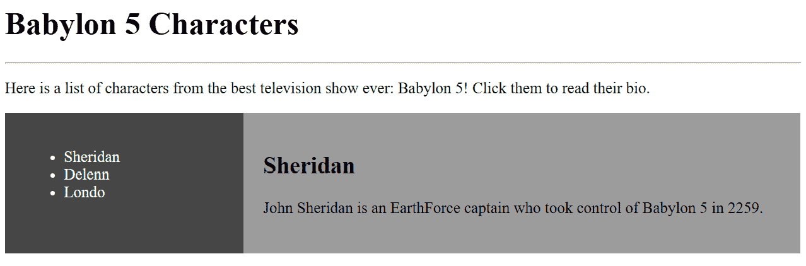
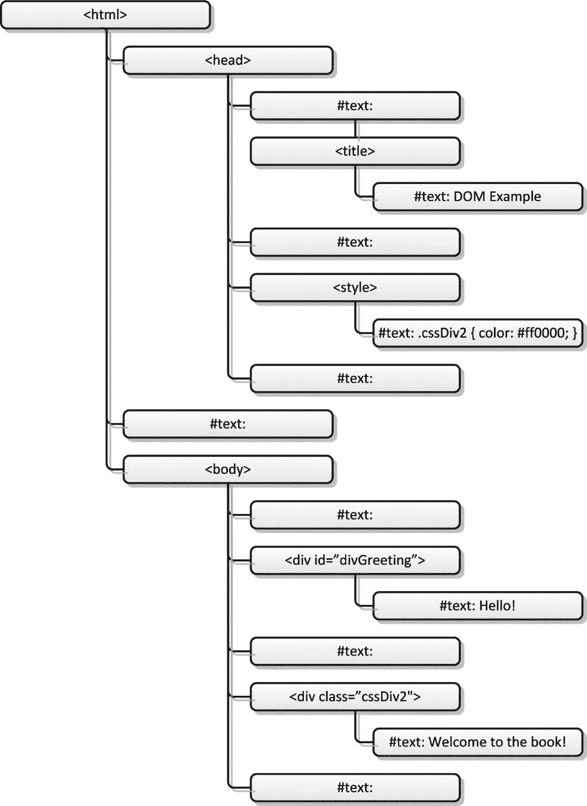
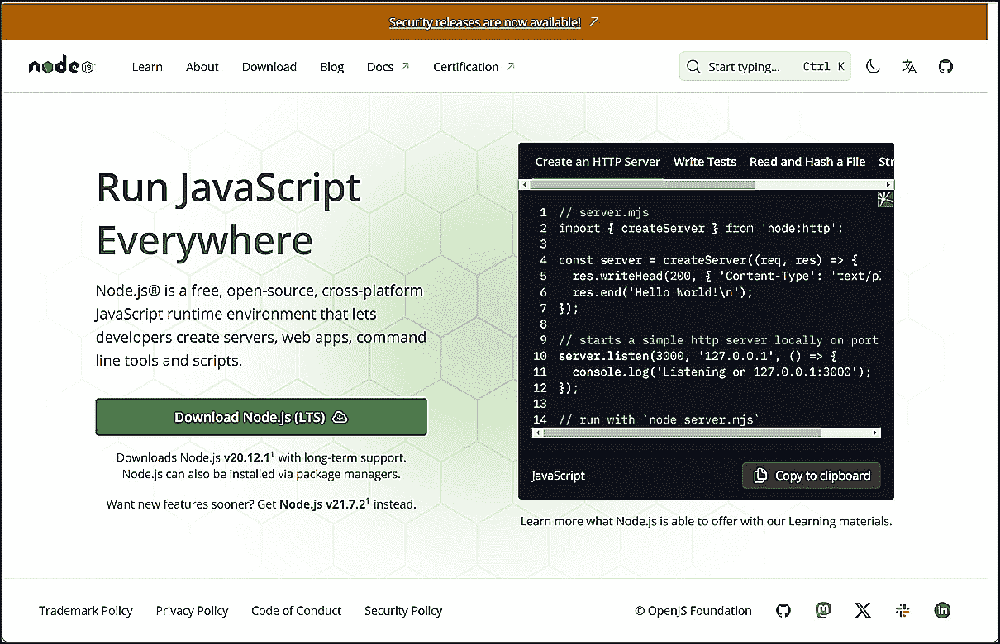
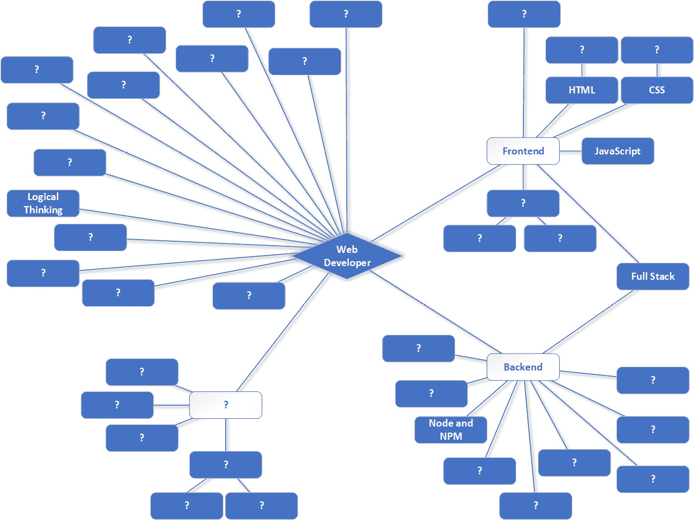

# 2

# 桥梁建设——客户端（前端）与服务器（后端）开发

现在，我想深入探讨在*第一章*中引入的想法——即网络开发者是软件开发者——然后讨论你可能会遇到的各种职位（你可能会被惊讶地发现“网络开发者”可能是*最不常见*的！）。

在这个过程中，我将开始介绍构建这个技术基础所需的一些概念，例如更详细地了解 HTML、CSS 和 JavaScript，什么是事件处理器，什么是 DOM，介绍服务器端编程思想如 Node，最后看看你在这个领域可能会遇到的某些职位名称。

因此，在本章中，我们将涵盖以下主题：

+   理解客户端（前端）

+   理解服务器（后端）

+   定义网络开发者类型和职位名称

# 技术要求

GitHub 是一个在线服务——个人使用免费——你可以在这里存储你的代码，并且可以选择与全世界分享。GitHub，正如名字所暗示的，使用 Git 源代码仓库，或称为 SCM（源代码管理）软件。我们稍后会详细介绍这一点，但就目前而言，只需知道 GitHub 是你放置东西的地方，以及访问他人提供的内容即可。这些“东西”，通常是代码，被放入仓库，或简称 repos。现在，你可以把 repo 想象成你电脑上的一个目录。

对于这本书，请访问此处：[`github.com/PacktPublishing/Web-Development-Career-Master-Plan`](https://github.com/PacktPublishing/Web-Development-Career-Master-Plan)。这是你将找到这本书所有源代码的仓库。在此阶段，花几分钟时间在那里为自己创建一个账户并下载代码，以便从这个点开始准备。在创建账户并访问这本书的仓库后，你可以通过点击大绿色的**代码**按钮来下载代码；从那里，你可以下载一个包含仓库所有内容的 ZIP 文件。

# 理解客户端（前端）

当一个开发者说**前端**时，他们通常指的是网站的客户端。*好吧，那很好*，你可能会说，但这意味着什么呢？

在*第一章*中，我向你展示了一个非常简单的网页示例。该页面使用三种主要技术构建：HTML、CSS 和 JavaScript。这三种技术是网络浏览器最终理解的所有内容。在那章中，我还解释了 HTML 代表超文本标记语言，但我没有解释它的含义。为了做到这一点，我们必须逐字分解。

## 解构 HTML

为了解释 HTML，我将跳过第一个词，超文本（我们稍后会回到它）。现在，让我问你一个问题。想象一下，我在一张纸上写了以下内容：

*“如果找到我的狗贝蒂，请归还！*”

然后，我把那张纸给了招牌制造商，我想让他们在招牌上把那段文字做成红色。我会如何指导他们这样做？

我可能会有很多种方法来做这件事，但无论我选择哪种形式，我会称这个指令为什么？嗯，有一个术语可以提供答案：**标记**。我们可能会写一些像这样的事情：

*“RED -> 请归还我的狗贝蒂* *如找到！”*

我们可以这样说，那个 `RED->` 文本“标记”了内容，并为理解你的标记语言的人提供了一个指令——使这个变红。如果你事先已经同意了这种语言，那么你就可以通过这种方式传达你想要发生的事情。

另一种说法是，`RED->` 文本是 **元数据**。元数据是一个常见的编程概念，用最简单的术语来说，就是描述其他数据的数据。我们希望底层数据——标牌上的文本——是红色的，因此我们需要一些其他数据来描述该数据的颜色。

HTML 是一种标准化的元数据语言，这就是“标记”中的 M 的来源。其理念是，要在屏幕上显示的内容以各种方式标记，以告诉浏览器如何显示它或对它进行操作。

在 HTML 中，标记内容是通过使用 **标签** 来完成的，并且它们具有一个常见的格式：

```js
<some-known-tag-type>xxx</some-known-tag-type>
```

当你需要标记一些内容时，你必须首先创建一个 *开始* 标签。你可能看到的例子包括 `<body>`、`<div>`、`<p>` 和 `<span>`。`<>` 字符内的文本决定了标签的类型，这提供了你标记的意义。然后，接下来是你要标记的内容（在这个例子中，用 `xxx` 来表示它可能是任何东西）。在该内容的末尾，你添加一个 *结束* 标签，它与开始标签相同，但在标签名称前有一个 `/`。每个开始标签都必须有一个匹配的结束标签，形成一个标签对（或者有时被称为 *块*）；否则，你可能会遇到问题，通常表现为页面没有按照你预期的样子显示在屏幕上。此外，请注意，一些标签可以是 *自闭合* 的，例如 `<hr/>`，这实际上是将开始和结束标签合并在一起。不过，这样的标签并不多。

说到“不多”，存在一组有限的、浏览器能够理解的标准化 HTML 标签。和大多数事情一样，你不必试图记住它们所有，而且有些你可能会很少使用。此外，随着时间的推移，一些标签会被弃用，这意味着它们不再被使用，或者至少不应该被使用。但是，网络浏览器喜欢保持向后兼容性，这意味着旧网站应该在新的浏览器中仍然有效，所以弃用的标签往往会持续一段时间，有时甚至很多年。以下是一个例子：

```js
<b>I really like pie!</b>
```

`<b>` 标签已经很久以前就被弃用了，不应该再被使用，但你仍然会在最新的浏览器中找到它仍然有效。它可以使文本加粗，但它被弃用是因为这项工作可以用 CSS 更好地完成。

在我们继续前进之前，让我明确一点：标签名称不区分大小写。你可以写成 `<body>`，`<BODY>`，`<Body>`，甚至 `<BoDy>`，只要你喜欢，浏览器都会很好地处理它们。话虽如此，大多数开发者倾向于将它们全部写成小写，这也是我将在整个文档中使用的惯例。值得注意的是，软件开发中有许多东西是区分大小写的——例如 CSS 和 JavaScript——但 HTML 不是，至少就标签名称而言不是。使用哪种惯例并不那么重要，但保持一致性至关重要。当你进入专业环境时，这将是对你的一种很大期望，所以这是一个我强烈建议你养成的习惯。

现在，让我们看看网页的基本结构。

### HTML 文档的结构

当我们编写 HTML 时，我们创建了一个被称为 HTML 文档的东西。这个文档是一个文件，通常带有 `.html` 或 `.htm` 扩展名。它是一个纯文本文件，可以在任何文本编辑器中编辑，例如 Windows 上的记事本——不需要任何特殊工具。HTML 文档有一个标准的结构，从高层次来看，看起来像这样：

```js
<html>
    <head>
    </head>
    <body>
    </body>
</html>
```

HTML 文档本身是通过以 `<html>` 标签开始并以其对应的结束标签 `</html>` 结束来创建的。这些标签之间的所有内容代表它们所标记的内容，在这种情况下是整个 HTML 文档本身。在这里，你可以看到关于 HTML 的一个新事实：标签可以是其他标签的内容。我们说这些标签是“嵌套”的，或者说它们是其他标签的“子标签”。

在代码中，我们有一个 `<head>` 标签和一个 `<body>` 标签嵌套在 `<html>` 标签内，因此它们是 `<html>` 标签的子标签（并且由此可以反过来，可以说 `<html>` 标签是 `<head>` 标签的父标签）。

注意

从现在开始，除非有明确的原因，否则我不会列出结束标签。你应该假设存在一个结束标签，就像这里的 `</head>` 和 `</body>` 一样，除非另有说明。

`<head>` 标签定义了 HTML 文档的两个部分之一：头部。这个部分包含不显示在屏幕上的内容。它更像是浏览器可以用各种方式使用的信息。例如，当我们学习 CSS 时，你会看到它通常被放在文档的头部。JavaScript 代码也是如此。你可能会在头部看到其他标签，例如 `<title>`，它提供了你将在浏览器顶部看到的标题，或者 `<meta>`，它向浏览器提供了有关页面的一些元数据（例如，当你查看你已收藏的网站时通常看到的图标可以在这里定义）。然而，这些都并非必需，因此我没有在这里展示。从技术上讲，头部本身也不是必需的，但始终包含它是良好的实践，即使你什么也不放进去。

`<body>` 标签定义了文档的主要部分——包含将在屏幕上显示的内容的部分。而且——你猜对了——文档的这个部分就叫做主体！你可以放在那里的最简单的内容就是纯文本。你不需要以任何特殊的方式标记它；浏览器会直接以原样显示它。

但真正的威力开始显现，是在你开始在正文中使用其他 HTML 标签的时候。让我们来看一个更高级的例子：

```js
<html>
  <head>
    <title>Babylon 5 Characters</title>
    <style>
      * { box-sizing: border-box; }
      #nav {
        float: left;
        width: 30%;
        height: 300px;
        background: #606060;
        color: #ffffff;
        padding: 20px;
      }
      #characterBio {
        float: left;
        padding: 20px;
        width: 70%;
        background-color: #b0b0b0;
        height: 300px;
      }
    </style>
  </head>
  <body>
    <h1>Babylon 5 Characters</h1>
    <hr />
    <p>Here is a list of characters from the best television show ever: Babylon 5! Click them to read their bio.</p>
    <div id="nav">
      <ul>
        <li>Sheridan</li>
        <li>Delenn</li>
        <li>Londo</li>
      </ul>
    </div>
    <div id="characterBio">
      <h2>Sheridan</h2>
      <p>John Sheridan is an EarthForce captain who took control of Babylon 5 in 2259.</p>
    </div>
  </body>
</html>
```

这里发生的事情还有很多，但让我们从最基本的部分开始，一步一步地来，在这个过程中介绍一些新的标签和概念。别担心——实际情况并没有看起来那么糟糕！

### 头部

我们从之前的 `<html>` 标签开始，然后是一个 `<head>` 标签来定义文档的头部。在头部内部，我们有一个 `<title>` 标签，它定义了文档的标题（通常在浏览器标题栏中看到，也是你为该网站创建书签时的文本）。`<style>` 标签是我们放置 CSS 的地方，它告诉浏览器我们希望内容如何显示——但现在我们会跳过这一点。

HTML 文档的头部包含有关文档的元数据——在浏览器中不可见的内容（除了标题，通常在浏览器窗口的标题栏中显示）。然而，这些内容可能会影响显示效果，比如通过导入 JavaScript 来创建内容，或者我提到的 CSS，但我们会稍后再讨论这一点。你有时会在头部找到实际的 `<meta>` 标签，就像你在*第一章*中看到的例子一样，来定义文档使用的字符集、视口（基本上就是浏览器窗口）的大小以及更多。但关键点是，这些都不是旨在明确显示的内容。这就是文档主体的作用。

### 主体

在 `</head>` 标签之后，我们有了开头的 `<body>` 标签；这是我们开始显示内容的地方。这个内容从 `<h1>` 标签开始，它用于标记文本作为标题。有几个 `<h>` 标签，从 `<h1>` 到 `<h6>`。你可以把这些想象成写一本书的大纲：`<h1>` 标签是你的顶级主题，`<h2>` 标签是 `<h1>` 标签下的子部分，以此类推，数字越大，文本越小。

在标题下方是 `<hr>` 标签，这是一个罕见的自闭合标签。这个标签在标题下方画一条线，或者说是水平线。

接下来是一个`<p>`标签，代表段落。其中的文本将一直显示，直到它太宽以至于浏览器窗口无法显示，此时它将流到下一行，依此类推。任何在`</p>`标签关闭之后的内容都将自动在新的一行下面开始。这在构建网页时是一个常见的范式：我们主要关注定义像这样的水平部分，而`<p>`只是实现这一点的众多方式之一。

接下来的`<div>`标签是创建水平部分的另一种方式，这可能是最常见的方式。`<p>`和`<div>`之间的区别在于语义。这里的术语*语义*指的是标签的含义，它定义了标签内内容的用途和角色。`<p>`标签的目的是表示“这是一个段落，一段文本”，而`<div>`则没有这样的固有含义。但在实践中，它们的功能相同，并提供相同的视觉结果，所以在很多情况下，使用哪个并不重要。

### 标签属性

不论差异如何，这个`<div>`标签提供了一个新事物的例子：`id`。这给标签赋予了一个名称，我们可以在代码中稍后使用这个名称来对该标签（或*元素*，当我们谈论网页上的成对标签及其所有内容时，我们倾向于这样称呼）进行操作。 

属性总是以`name=value`的形式存在。因此，在这里，`id`是属性的名称，而`nav`是赋予它的值。请注意，在编程的一般情况下，当我们有一个不是数字的字符序列时，我们实际上称之为字符串，并且几乎总是用引号括起来。

### 回到标记

回到标记，这里的`<div>`标签定义了我们的导航部分，因此有`id`值。嵌套在这个`<div>`内部的是另一个常用的标签，用于生成项目的项目符号列表，即`<ul>`。这代表`<ol>`，它生成一个列表，列表中的每个项目都会自动编号。列表中的任何一种类型的每个项目都将放入一个`<li>`，或列表项，标签中。

在适当地关闭`<li>`和`<div>`标签之后，我们遇到了另一个`<div>`标签，这个标签定义了一个我们称之为`characterBio`的区域。这就是我们将展示所选角色的传记信息的地方。这个页面的想法是用户可以点击一个角色并查看他们的传记。然而，请注意，它并不像这里这样完整，这是有意为之。我们将在稍后在此基础上添加交互性。

在`characterBio` `<div>`标签内部，我们有一个`<h2>`标签，用来显示比普通文本稍大的角色名字，但并不像顶部的主`<h1>`标题那样大。然后我们还有一个`<p>`标签，其中包含角色的生物文本。

最后，我们关闭`<body>`和`<html>`标签，我们就有一个完整的网页了！

在您选择的网页浏览器中打开该文件后，您应该看到*图 2*.1 中所示的内容：



图 2.1：我们 HTML 的结果（是的，我是个大粉丝！）

好的，我之前承诺过我们会回到 HTML 的超级文本部分，现在让我履行这个承诺吧！

## 那个超文本部分怎么样？！

HTML 中的术语**超文本**指的是一个 HTML 文档能够链接到另一个文档或它所依赖的资源的能力。正是这些链接构成了网络。这些链接可以通过几种方式创建，并且它们在很大程度上归结为一些新的标签：

+   `<a>`：这个标签创建了一个指向另一个页面的显式链接。有了它，你可以写出以下内容：

    ```js
    <a href="https://www.google.com">Go to Google</a>
    ```

    与大多数标签一样，你有一个打开标签和关闭标签对，中间有一些内容。在这种情况下，内容是用户将在屏幕上看到的文本，并且可以点击的文本。`href`属性（简称 HTML 引用）提供了点击时导航到的 URL。

+   ``：这是在页面上显示图片的方式（至少是最简单的方式）：

    ```js
    
    ```

    这个标签有点好奇，因为没有关闭的`</img>`标签，而且你也不需要自己关闭它（实际上，如果你这样做，一些浏览器可能无法正确显示图片）。无论如何，只要图片文件`company_logo.png`与 HTML 文档位于同一位置，当页面渲染时就会显示出来——也就是说，显示在屏幕上。或者，你可以在`src`属性（简称“源”）中指定一个完整的 URL，这允许你从其他位置显示图片。

+   `<script>`和`<link>`：这些允许你链接到 JavaScript 文件和 CSS 文件，分别（技术上，`<link>`允许你链接到其他类型的文件，但 CSS 文件通常是它的用途）：

    ```js
    <script type="text/javascript" src="img/my_code.js"></script>
    <link rel="stylesheet" type="text/css" href="styles.css" />
    ```

    在`<script>`标签的情况下，你将始终有一个关闭的`</script>`标签，其中没有内容介于它和打开标签之间。`type`属性指定了语言，尽管在这个时代，它几乎永远不会是除了`text/javascript`之外的其他内容。

    对于`<link>`标签，`rel`定义了 HTML 文档与其所链接的文件之间的关系，并且像`<script>`标签的`type`属性一样，尽管它支持其他值，但它几乎总是`stylesheet`。这些天，`type`属性也几乎总是`text/css`，你已经知道`href`是什么了。

    注意，与`<script>`不同，`<link>`标签将始终是自闭合的，如下所示。与``标签一样，你可以指定一个与 HTML 文档位于同一位置的文件，如下所示，或者你可以指定一个完整的 URL 来链接到其他地方的文件，无论是整个其他服务器，甚至是你自己无法控制的资源。

    当你像这样链接到 JavaScript 或 CSS 文件时，我们说该文件正在被**导入**，我们称这些文件为**外部**脚本或**外部**样式表。我们可以将它们与定义在`<style>`块中的样式表进行比较，这是内部的，因为它直接嵌入到 HTML 文档中。对于 JavaScript 的`<script>`块也是如此。

虽然有其他方式链接到其他 HTML 文档和资源，但这些无疑是最常见的。

到目前为止，你已经听我提到了 CSS 几次，那么让我们跳转到这个主题，看看它究竟是什么！

## CSS 剖析

我不会对你撒谎：**CSS**，即**层叠样式表**，可能会有些困难。并不是它背后的基本概念很难——它们相当简单——但是内容很多，有时即使是经验丰富的开发者也会遇到困难。然而，就像我们一直在讨论的每一件事一样，如果你一点一点地学习，不试图一次性学习所有内容，那么这是你可以处理的！

在开始时，CSS 相对简单易懂。如果 HTML 大致代表了你的房屋结构——墙壁、墙体内的梁、屋顶、地基等等——那么 CSS 就像是后来到来的画家，让它变得漂亮！对于你的 HTML 文档中的每个元素，你都可以使用 CSS 告诉浏览器应用哪些样式。

假设你的文档体中有以下 HTML 代码：

```js
<h1>Luke Skywalker</h1>
<div id="relatives">Anakin, Padme, Leia</div>
<p class="friends">Obi-Wan, Han, Chewie</p>
```

现在，假设我想将伟大的绝地大师的名字设置为红色，他亲戚的名字设置为绿色，他朋友的名字设置为蓝色。我可以通过在文档的`<style>`标签内编写以下 CSS 来实现：

```js
h1 { color: red; }
#relatives { color: green; }
.friends { color: blue; }
```

这一小段 CSS 展示了你需要内化的大多数核心概念，从选择器的概念开始。简单来说，你写的每一行 CSS 都将应用于页面上的一个或多个元素，而它将应用于哪个元素则由选择器决定。在这里，我展示了三种最常见的选择器——标签选择器、ID 选择器和类选择器：

+   标签选择器适用于特定类型的所有元素或标签。在这里，通过编写`h1 { color: red; }`，我表示我想让页面上的所有`h1`标签都被设置为红色。

+   一个 ID 选择器，如`#relatives { color: green; }`所示，表示具有 ID 为`relatives`的元素应该被设置为绿色。由于`id`属性用于标识具有特定名称的元素，因此在一个页面上只能有一个具有给定 ID 的元素（如果你不小心重复使用了 ID，那么在阅读 HTML 时最后出现的元素将拥有该 ID，所以你可以想象，如果出错，这可能是某些隐蔽错误的来源）。

+   类选择器——例如，`.friends { color: blue; }`——表示任何具有`class`属性值为`friends`的元素将被设置为蓝色。你可以将其应用于任意多个元素。

这三行代码中的每一行都定义了我们所说的`color`来使文本着色。给定类的选择器是开大括号前的文本。在这三个案例中，它是什么类型的选择器取决于我们开始的字符。如果我们以哈希(`#`)开头，这意味着它是一个 ID 选择器。如果我们以点(`.`)开头，这意味着它是一个类选择器。如果它只是 HTML 标签的名称，开头没有特殊字符，那么它就是一个标签选择器。

但样式是如何定义的呢？我们通过将样式属性设置为期望的值来定义样式，其中颜色是大量可能属性之一。有一些属性与排版相关（`font-size`、`font-family`和`font-weight`），一些与在页面背景中放置内容相关（`background-color`和`background-image`），一些用于在事物周围放置边框（`border-color`、`border-radius`和`border-style`），用于设置元素大小的属性（`width`和`height`），用于更改元素几何形状的属性（`transform`），用于隐藏和显示元素的属性（`display`和`visibility`），以及用于更改元素位置的属性，从它通常渲染的位置（`left`、`top`、`position`和`z-index`）。这还远非详尽的列表。我只是快速数了一下，目前看起来有超过 200 种不同的样式属性可用。哇！

当我们谈论 CSS 时，*样式表*部分是相当显而易见的，您刚刚也看到了：这三个样式类及其相应的选择器组成了一个样式表。但*级联*部分又是什么呢？好吧，当您对一个给定元素的应用样式属性有多个样式时，它就派上用场了。这可能发生在您链接到多个样式表（因为无论您是否在`<style>`标签中也有自己的样式，您都可以这样做）或者多个样式类匹配的情况下。例如，假设我将`h1`样式类选择器更改为`p`选择器。在这种情况下，哪个类——以及由此延伸的颜色——将适用？文本会因为与`<p>`标签的匹配而变成红色，还是因为类名匹配而变成蓝色？

答案由一个级联算法决定，其中算法是一种作为代码片段实现的程序，用于解决特定问题或执行特定任务。这个算法使用的级联规则在实践中可能相当复杂，但简而言之，以下情况发生：

+   生成一个可能应用于该元素的任何选择器的列表。

+   这些选择器按照其重要性的顺序排序，这基本上意味着那些在其他人之后定义的选择器具有优先权，尽管其他因素也可能产生影响。

+   选择器是基于 `<p>` 标签选择的，但还有一个是基于 `id` 值应用的，因为 `id` 值在文档中是唯一的，所以它被认为更具体，因此它将覆盖基于元素是 `<p>` 标签而应用的值。

+   根据样式定义出现的顺序做出最终决定，这基本上与基于重要性的决定相同，但稍微直接一些。

这涵盖了 CSS 的基础知识，但如我之前所说，CSS 可能很难，因为它有很多内容。所以，肯定比我说的还要多，对吧？确实如此，我会在接下来的内容中至少触及一些。

### 其他 CSS 功能

CSS 可以做的不仅仅是改变颜色：

+   有一些属性可以用来定义页面的布局，例如。使用这些属性，你可以将页面划分为一个网格，然后定义各种元素应该位于该网格的哪些方块中。

+   你还可以使用 CSS 来使页面在浏览器窗口大小变化时“重排”。这允许你拥有一个针对较小移动设备屏幕以及较大桌面屏幕优化的页面布局，而无需编写任何代码。

注意

CSS 通常不被认为是代码——它更像是 HTML，因为它是一种元数据。然而，考虑到 CSS 今天的强大功能和其可能变得多么复杂，我认为我们现在正处于代码和非代码之间的灰色地带。

+   CSS 还提供了可以让你以各种方式在页面上动画化元素的属性。你可以使用 CSS 单独使页面交互式，而无需编写任何代码（或者至少是*明显*的代码）。你可以使元素在用户悬停时增长，在点击时旋转，等等。

+   除了在 `<style>` 块中定义你的样式，通常在 HTML 文档的 `<head>` 区域，你还可以在给定的元素本身上定义 CSS *内联* ——也就是说，在该元素上：

    ```js
    <div style="font-size:40pt;">Luke Skywalker rules!</div>
    ```

    `style` 属性在大多数元素上都是可用的，它允许你仅对该特定元素应用样式。回到层叠的概念，这种类型的样式将（几乎）总是优先于在 `<style>` 块中定义或在外部样式表中链接的任何样式。

除了常见的内联样式之外，其余的都是更高级的主题，而且由于这里的目的是只给你一个 CSS 的基本概念，我不会深入探讨它们。但我希望你知道它们存在。我说 CSS 可能很难时，并不是在开玩笑！CSS 有很多内容，它已经变得非常强大。但前一部分描述的是核心概念。

现在我们已经了解了 HTML 和 CSS，让我们深入到真正的、*明确无误*的编程领域：JavaScript！

## 拆解 JavaScript

如果你把 HTML 视为房子的蓝图，把 CSS 视为房子的装饰，那么你可以把 JavaScript 视为当你按下按钮时使车库门打开的东西，或者当你拉动开关时天花板风扇和灯光亮起的东西。

HTML 和 CSS 是我们所说的 *声明性* 语言，这意味着你写下你想要发生的事情，浏览器就会去实现。例如，如果你写下 `<hr>`，浏览器就会知道你想要在屏幕上有一条线。如果你在样式表中写下 `color:red`，它就会知道你想要应用该类选择器的元素变成红色。

相比之下，JavaScript 是我们所说的 *命令性* 语言。这意味着你必须告诉计算机在每一步要做什么。你不能像 HTML 和 CSS 那样简单地声明你的意图——你必须具体详细地说明浏览器（以及计算机）必须做什么。大多数人可能会倾向于说 JavaScript 是真正的编程，而 HTML 和 CSS 不是。这到底是不是真的有点值得商榷，但 JavaScript 的本质是不变的：你必须为计算机编写指令，它会按照你的指示去做，不会多做也不会少做。

### 展示 JavaScript

作为例子，让我们在我们之前查看的代码中添加一行，就在最后一个 `<div>` 标签之后：

```js
<button type="button" onClick="document.getElementsByTagName('h1')[0].style.color='yellow';">Click Me</button>
```

这段代码展示了几个方面。首先，有一个新的 HTML 标签：`<button>`。正如其名所示，它允许我们在页面上添加按钮，用户可以点击它们来执行某些操作。`type` 属性允许我们选择三种按钮类型之一：`button`、`reset` 或 `submit`。后两种在表单的上下文中使用，表单是另一个 HTML 元素，代表一系列输入字段，例如，在网站上创建账户时填写个人信息。然而，基本的 `button` 类型是一种更通用的类型，它不必与表单相关联，就像这里的情况一样。

前面的代码还向我们展示了一个新概念：*事件处理器*。事件处理器是响应某些事件执行的 JavaScript 代码片段，这是页面上发生的事情。这可能是在这里用户点击按钮，或者我们可能想要在页面首次加载时执行某些代码，这也可以通过事件处理器来实现。在这里，我们想要处理的具体事件被称为“click”，由于事件处理器是响应事件执行的，所以我们说它们是在该事件执行时发生的，这就是为什么我们用 `onClick` 来指定这个事件处理器。

事件处理器可以是内联的，也可以是元素外部的。当它是外部的时候，它可能位于页面上的某个 `<script>` 块中（或者可能是一个我们导入的外部 JavaScript 文件）。然而，在这里它是内联的。`onClick` 属性的值仅仅是当点击事件发生时我们想要执行的 JavaScript 代码。让我们具体看看那段代码：

```js
document.getElementsByTagName('h1')[0].style.color='yellow';
```

这展示了 JavaScript 中的几个关键概念，首先是对象。对象简单地说就是一组被视为单一单元的数据。例如，想想你自己：你有一个名字，一个姓氏，年龄，电话号码等等。如果我们把所有这些信息都存储在计算机的内存中，我们可以在我们的代码中把这一组信息称为`BookReader`。如果我们只想从这一组信息中获取名字，我们可能会写`BookReader.firstName`。点号代表我们告诉 JavaScript 我们想要一个单一的信息——一个`BookReader`。

在前面的代码中，`document`就是这样一组信息。碰巧的是，这是浏览器为我们创建的，用来表示 HTML 文档本身，以及所有放入其中的东西，以及关于它的所有信息。我们可以用这个对象做很多事情。例如，我们可以向它提出关于我们文档的问题。我们可以通过调用**方法**来实现这一点。方法是一个附加到对象上的 JavaScript 函数。但是，我听到你在问，“什么是函数？”让我们现在就讨论这个问题，因为它是一个很好的问题！

### 理解函数

但你可能会问：“什么是**函数**？”嗯，函数就是一段我们给它起名字的 JavaScript 代码。我们这样做是为了能够执行那段 JavaScript 代码，可能很多次，通过它的名字来*调用*它。

每次你调用 JavaScript 函数时，它都有以下形式：

```js
function_name(arguments)
```

函数名是我们分配给那段 JavaScript 代码的名字，参数是可选的，是函数完成其工作所需的信息片段。当它们存在时，我们说它们被*传递*给函数。

函数可以是它们自己的独立事物。一个例子是如果你写下以下内容：

```js
<button type="button" onClick="alert('hello');">Click Me</button>
```

在这里，`alert()`函数在浏览器中自动存在，它就像独自漂浮在那里一样。

然而，函数也可以被*附加*到对象上，这只是一个说法，意思是对象的某个特定属性是一个指向函数的引用。在我们的代码中，`getElementsByTagName()`就是这样一种函数，所以我们说它是附加到它所附加的对象上的方法。请注意，当我们像这样在文本中提到函数的名字时，通常会在括号中包含一个空集合，这是我在整本书中会使用的惯例。

这个方法允许我们要求`document`对象给我们一个 HTML 文档中所有`<h1>`标签的列表，这就是为什么将`'h1'`作为参数传递给方法的原因。在这里，`'h1'`必须用引号括起来——在这种情况下是单引号（在大多数情况下可以互换使用）——因为它是一个所谓的`1234`，尽管我们不需要单引号，因为那不会是一个字符串，而是一个数字，数字不需要被引号括起来。

`getElementsByTagName()`方法返回一个值，就像函数可以做到的那样。它返回的值可以是许多不同的事物，但在这个例子中，它返回的是所谓的**数组**。数组简单地说就是一系列值。这些值可能是字符串、数字或对象（甚至可以是函数，但这是一个更高级的话题）。数组允许我们通过一个*索引*来获取它的值，即数组中的位置。

虽然在谈论数组时，我略过了另一个可能在某些方面是 JavaScript（以及编程的一般）中最重要的概念，那就是**变量**。现在让我们来谈谈这个，这样你就能更好地理解数组是什么。

### 理解变量

简单来说，变量是命名的东西，它们指向计算机内存中的某个位置。

例如，假设我们有一个名字列表：Frank、Traci、Andrew 和 Ashley。我们可以把它们放在一个数组中，就像`getElementsByTagName()`返回的那种类型。这允许我们通过使用它的索引来访问每个名字：Frank 在位置 0（因为数组总是从 0 开始计数，而不是像你预期的 1），Traci 在位置 1，Andrew 在位置 2，Ashley 在位置 3。

那么做所有这些的代码是什么样的呢？其实很简单：

```js
var myArray = [ "Frank", "Traci", "Andrew", "Ashley" ];
```

在这里，我们创建了一个名为`myArray`的变量。那么它指向的那个内存，就是我所说的变量本质上是什么？坦白说，那不是我们的问题！计算机将为我们处理这个问题。我们只需要知道，当我们想要访问这些数据时，我们会使用`myArray`。

在`myArray`之前的单词`var`被称为`var`，代表变量。我们在这里说的是，“嘿，JavaScript，我在这里声明了一个名为`myArray`的变量。”然后它会为我们找到一些内存，并确保`myArray`指向它。

声明一个变量意味着向计算机介绍它，但还有一个相关的概念叫做*定义*，或者*定义*一个变量。变量的定义是可选的；你可以声明一个变量而不定义它（也就是说不给它一个起始值），然后稍后给它一个值。但通常我们会同时看到声明和定义，就像这里的情况一样。等号就是这样做的：它说，“嘿，计算机，`myArray`的值等于这个。”

此外，请注意，在 JavaScript 代码行末尾放置分号是可选的，但养成这个习惯是个好习惯。这样，我们可以清楚地看到一条语句（即对计算机的一个指令）在哪里结束，以及下一条语句从哪里开始（而且也有一些非常微妙但幸运的是非常罕见的情况，如果不放置分号可能会引起问题，尽管这种情况很少，但通过良好的习惯完全避免这种可能性是更好的）。

我们给出的值是一个数据数组，我们通过将我们想要放入数组中的值用方括号括起来来表示。如果我们只是定义一个字符串作为另一个例子，那么它们就不需要了，对于数字或对象也是如此（对象使用大括号代替括号，但这更高级，所以我们现在先不考虑它）。例如，这里有一个字符串的例子：

```js
var myString  = "Hello";
```

这里有一个数字的例子：

```js
var myNumber = 123;
```

如您所见，它有相同的基本格式：`var`关键字，后面跟着变量的名称，然后（可选地）一个等号和要放入变量的初始值。

回到我们的数组，一旦数组被声明和定义成这样，我们可以通过写下以下内容来访问名称：

```js
myArray[2]
```

这将从数组中索引 2 的位置获取值，这将是一个`Andrew`，因为，再次强调，数组从 0 开始。

现在你有了基础，让我们看看之前的事件处理器代码中的所有内容是如何运作的。

### 更好地理解事件处理器

带着这个知识，让我们回到之前的事件处理器代码：

```js
document.getElementsByTagName('h1')[0].style.color='yellow';
```

因此，这里我们调用的是`document`对象的`getElementsByTagName()`方法，要求它返回页面上的所有`<h1>`标签。这个方法返回一个数组，我们可以通过括号来访问数组的元素。因为我们知道在这个数组中我们只会得到一个标签，因为我们页面上只有一个`<h1>`标签，所以索引总是 0。这个结果是对那个标签的引用，然后我们可以访问它的属性。属性可以是读取的*或者*写入的（在大多数情况下），在这种情况下，我们正在写入一个：`style`。这对应于应用于该标签的样式表，一开始使它变成红色。然而，我们想要将颜色改为黄色，以便我们可以设置`color`属性的值。

你可以写`myH1Tag.style.color`的原因是因为一个对象的属性可以指向其他对象。这被称为*嵌套*，你可以嵌套到你需要的深度。我们称这种对象的嵌套为*层次结构*。在这里，`myH1Tag`是一个对象。在这种情况下，`style`属性指向另一个对象。最后，`color`是那个嵌套对象的属性。你有时会在 JavaScript 中看到长链的 XXX.YYY…代码，当你钻入嵌套对象的层次结构时。但不管层次结构有多深，你看到的每个 XXX.YYY 只是意味着“对象 XXX 的 YYY 属性。”

有时候，像那样的事件处理器这样的单行代码可能很难理解，因为实际上正在执行多个步骤，而且往往很难跟踪每一个步骤，尤其是在你很久没有阅读 JavaScript 代码的情况下。可能通过将单个步骤分解成单独的行来重写代码会更有意义，如下所示：

```js
var tagsArray = document.getElementsByTagName('h1');
var myH1Tag = tagsArray[0];
myH1Tag.style.color = 'yellow';
```

现在，你可以更清楚地看到代码正在执行的三步离散操作：获取 `<h1>` 标签的列表，并声明一个名为 `tagsArray` 的变量来指向它（这是通过方法调用返回的数组定义的），然后获取该数组的第一个元素，并创建一个名为 `myH1Tag` 的变量来引用它，最后将其 `color` 样式属性设置为黄色。

我知道这需要吸收很多信息，尤其是如果你之前从未做过任何编程的话。但是，好消息是：你已经接触到了 JavaScript 和编程背后的许多基本概念！随着你通过这本书的进展，你将学到更多，但这对现在来说是一个很好的开始。

到目前为止，我们需要讨论另一个与 JavaScript、HTML 和 CSS 都密切相关的话题，那就是 DOM。

## 创建 DOM

**DOM**，即**文档对象模型**，是浏览器解析 HTML 文档的具象结果。当我们说某个东西——在这个例子中是浏览器——读取一些数据——在这个例子中是 HTML 文件——并以某种方式处理它时，我们就是这样称呼的。它是一组存储在计算机内存中的对象集合，代表该文档。

让我们考虑以下 HTML 文档：

```js
<html>
  <head>
    <title>DOM Example</title>
    <style>
      .cssDiv2 { color: #ff0000; }
    </style>
  </head>
  <body>
    <div id="divGreeting">Hello!</div>
    <div class="cssDiv2">Welcome to the book!</div>
  </body>
</html>
```

当浏览器解析该文件时，它会生成一个 DOM，如图 *图 2.2* 所示：



图 2.2：DOM 的图形表示

你所看到的是一个位于底部的 `<html>` 框，在概念上就像一棵树的树干。从它“生长”出来的每一件事都是一根树枝，然后任何没有东西生长出来的框就像一片叶子（在树语中我们称之为 *节点*）。所以，你可以看到从 `<html>` 出发的一根树枝通向 `<head>` 和 `<body>`，因为它们是 `<html>` 的直接子元素。

你还会注意到图中有一个写着 `#text:` 的框，它是 `<html>` 的子元素；你会在整个图中看到更多这样的框。这些代表 HTML 文档中不包含在任何标签内的文本内容。

为了理解这一点，看看源 HTML 代码。看到哪些行是缩进的吗？嗯，造成这种缩进的空格也成为 DOM 树中的一个元素，这就是那些 `#text:` 框的内容。对浏览器来说，这些空格是和标签内任何内容一样有效的内容，即使它们可能不会在页面上显示。一般来说，HTML 文档中的任何空白都不会在屏幕上渲染，至少不会超过一个空格字符（换句话说，多个空格字符会合并成一个空格字符）。当然，有方法可以使多个空格显示出来，但像缩进这样的东西通常默认是不会显示的。

除了这些，基本想法是每个标签及其内容都成为 DOM 树中的元素或节点，更复杂的 HTML 将产生更复杂的树结构。但正是这棵树允许 CSS 和 JavaScript 做它们的事情，更不用说浏览器本身了。当你需要通过 JavaScript 获取 DOM 节点的引用来对其进行操作时，浏览器会咨询这棵树来为你找到它。当你需要指定一个 CSS 选择器来应用样式类时，浏览器会使用这棵树来完成其工作。稍后，你会了解到 DOM 可以在最初渲染后通过 JavaScript（以及 CSS）进行更改，当这种情况发生时，浏览器将相应地更新树（可能添加新的分支或节点，或者删除其他节点，具体取决于更改的内容）。DOM 使所有这些成为可能。

作为一名网页开发者，你通常不会直接处理 DOM，在这个意义上，你不会看到像之前那样的图表，至少不是完全那样。但它始终存在，无处不在，允许浏览器——以及通过扩展 HTML、CSS、JavaScript，最终是你！——做它们的事情。因此，了解它是什么以及如何在你的脑海中构思它是很重要的。

现在你已经有机会了解 HTML、CSS、JavaScript 和 DOM，让我们谈谈当用户在浏览器的地址栏中输入一个地址并按下 *Enter* 键时会发生什么，因为这是理解的关键概念。而且其中还有更多内容超出了表面现象！

## 理解客户端-服务器模型

当你作为用户在浏览器的地址框中输入一个地址并按下 *Enter* 键时，首先发生的事情是浏览器向 **域名服务器** (**DNS**) 发出请求。DNS 服务器是由诸如 **互联网服务提供商** (**ISPs**) 或大公司等实体维护的特殊类型的计算机。DNS 服务器的唯一任务是充当电话簿，将人类友好的 URL（如 google.com）映射到 IP 地址（例如，192.158.1.232）。

一个 **互联网协议** (**IP**) 地址是每个连接到网络的机器所分配的唯一地址。它就像你手机的电话号码：如果有人知道它，他们就可以连接到你。但你不会想要记住 192.158.1.232 是 google.com 的地址——如果你愿意，那就是电话号码。因此，相反，DNS 服务器提供这种映射，使我们人类更方便。 

一旦 DNS 服务器响应了 IP 地址，浏览器就能够连接到与该 IP 地址对应的服务器，并请求 URL 中指定的 HTML 文档。如果没有指定（如 google.com），则返回默认文档。

浏览器随后读取那个 HTML 文件并解析它，从中创建 DOM。然后，它为 HTML 文档中引用的每个资源单独发出请求，例如在``标签中引用的图像、在`<link>`标签中引用的外部样式表，或在`<script>`标签中引用的外部 JavaScript 文件。换句话说，它向服务器请求所有使该网页正常工作并正确显示所需的东西。

一旦所有这些资源都被检索到，浏览器就会将内容渲染到屏幕上，你就可以看到一个可以查看的网页了！

现在，尤其是在 JavaScript 的混合使用中，这可能并不是结束。当用户在网页上执行各种操作时，例如点击按钮或滚动，JavaScript 代码可以对这些操作做出响应，并且这些代码可能会对 DOM——以及你在屏幕上看到的内容——进行更改，或者它可能会向服务器发出请求。这些请求可能是获取随后在页面上显示的数据，或者可能是一个请求整个新的 HTML 文档，这将替换当前显示的内容。在这些情况下，我们称之为*导航*从一个页面到另一个页面。

我已经提到了几次服务器这件事，你知道它是一台响应你请求的计算机，但还有更多。那么，让我们稍微深入一点，好吗？

# 理解服务器（后端）

如我之前所述，客户被认为是等式的**前端**；**后端**是我们对*服务器*这一概念的理解。服务器这个词有两个含义——一个是物理的，另一个不是。

当从网络中心的角度来看待事物时，服务器是一台物理计算机，与客户端运行的计算机分开。它们通过网络进行通信。

然而，服务器也是一种在物理计算机上运行的软件形式，正是这种软件回答了客户端的请求。换句话说，当我们说“网页服务器”时，这可能意味着客户端连接的物理机器，以便它可以查看网页，这可能意味着在物理计算机上运行的软件，它响应网页的请求，或者它可能意味着两者的结合。

因为服务器在某种情况下至少是一种软件，这也意味着客户端和服务器可以运行在同一个物理机器上，正如你将在下一节中看到的。

这种服务器软件有各种不同的形状、类型和大小，包括用于创建它的编程语言。**Java**、**Python**、**.NET**、**Node**和**PHP**是编写服务器软件的常见语言。每种语言都有其优点和缺点。Java、Python 和.NET 是非常健壮的语言，提供了大量的预编代码，你可以使用这些代码来节省你自己编写代码的时间。Node 和 PHP 也是如此，但 Node 是一个允许你在服务器上使用 JavaScript 的平台，而 PHP 是一种语言。

无论你使用什么语言，无论你在什么平台上构建，你都需要提供处理给定类型请求的代码。为了演示这一点，我想使用 Node 编写一个非常简单的服务器。我认为这是展示给你看的最合适的选择，因为我们之前稍微了解了一些 JavaScript，所以它可能不会像其他人那样陌生。

## Node 入门

要开始，你需要安装 Node 本身。幸运的是，这非常简单！在你的浏览器中转到[nodejs.org](http://nodejs.org)，你会看到一个类似于*图 2.3*所示的页面：



图 2.3：Node.js（或仅 Node）的主页

从这里，点击写着**下载 Node.js (LTS)**的大绿色按钮。这将下载一个安装程序，然后你可以运行它来安装 Node。

注意，你也可以通过以下链接下载最新版本，该链接位于以“想要更快地获得新功能？”开头的句子中。区别在于，按钮为你提供的是 LTS（长期支持）版本，这通常意味着它更稳定，因为其中包含的新功能可能尚未完全准备好使用。然而，对于我们在这里的目的来说，这不应该有任何区别，尽管值得注意的是，我确实倾向于在我的机器上安装最新版本。所以，如果你遇到代码无法按预期工作的问题，并且你安装了 LTS 版本，请尝试使用最新版本，看看是否可以工作。

安装程序完成后，打开命令提示符并输入以下命令：

```js
node --version
```

你应该会看到以下输出：

```js
v18.18.2
```

数字可能不同——这是我写的时候的情况——但它应该与网页上说的相匹配。然而，如果你得到这样的数字，这意味着**Node**已安装并准备好使用。

## 使用 NPM 创建项目

要开始创建服务器，我们将使用与 Node 配合使用的工具，即**NPM**。这代表**Node 包管理器**，是一个用于管理包的工具，这些包是我们可以在我们的代码中使用的现有代码集合。

创建服务器的第一步是创建一个目录来存放我们的项目代码，也许可以叫它`simple-server`，导航到它，并输入以下命令：

```js
npm init
```

此命令告诉 NPM 你想要开始，或*初始化*，一个新的项目。你将遇到一系列问题。对于我们在这里的目的来说，只需简单地按*Enter*键回答每一个问题，直到它最终询问你是否确定。再按一次*Enter*键确认，然后查看目录的内容。

你应该找到一个单独的`package.json`文件。此文件包含 NPM（以及通过扩展 Node）与你的项目一起工作所需的所有元数据。到目前为止，其内容应该是这样的：

```js
{
  "name": "simple-server",
  "version": "1.0.0",
  "description": "",
  "main": "index.js",
  "scripts": {
    "test": "echo \"Error: no test specified\" && exit 1"
  },
  "author": "",
  "license": "ISC"
}
```

如果有一些小的差异，不必过于担心，但它应该大致看起来像这样。正如你所看到的，这里的元数据是从那些问题的答案中提取的，或者更具体地说，是从 NPM 为你提供的默认值中提取的。

## 编写服务器

到目前为止，你已经准备好了一个可以启动的项目，但还没有任何代码。让我们来解决这个问题！为此，在`package.json`所在的目录中创建一个名为`index.js`的文件，并将以下代码放入其中：

```js
const http = require("http");
const server = http.createServer(function(inRequest, inResponse) {
  inResponse.end("Hello from your first Node server!");
});
server.listen(80);
```

保存该文件后，在命令提示符中，输入以下命令：

```js
node index.js
```

在这一点上，你不会看到任何东西，但只要你没有看到任何错误，那么服务器正在运行。要测试它，请打开你的网页浏览器，在地址栏中输入[`localhost`](http://localhost)，然后按*Enter*。一旦你这样做，你应该会看到一个表示**来自你的第一个** **Node 服务器**！的问候。

你刚刚创建了一个服务器！

为了稍微解释一下代码……首先，我们需要使用 Node 提供的内置包——`http`包。`require()`函数告诉 JavaScript 使该包对我们的代码可用。这只是一个函数调用，这意味着它会返回一些东西给我们，在这种情况下，它是对该包的引用，然后我们将其存储在`http`变量中。请注意，在这里，我使用`const`而不是`var`，除非你*知道*你以后需要更改该变量中存储的值。如果你遵循这个建议，你会避免很多讨厌的 bug，相信我！当你知道你以后需要更改值时，你可以使用`var`和`let`，它们是等效的。它们并不相同，但解释它们之间的差异需要涉及到一些其他的话题，这些话题在这个早期阶段最好跳过。

在导入`http`包之后，我们可以调用它的`createServer()`方法，正如其名称所暗示的，它为我们创建了一个服务器。在这里，你可以看到 JavaScript 的另一个关键特性：函数是一等公民，这意味着它们可以被当作值来处理，就像字符串和数字一样。这意味着我们可以将它们作为参数传递给其他函数，这正是这里所做的事情。

`createServer()`的参数是一个函数，每当有请求进入服务器时都会执行。这个函数可以完成任何需要的服务请求。在这种情况下，我们只是用一个简单的问候来响应。为了做到这一点，我们必须调用`inResponse`对象的`end()`方法，当请求进入时，这个方法会被传递给我们的函数。这是服务器为客户端生成的响应，所以通过调用`end()`，我们可以同时告诉服务器“这是响应的结束”，并且“这是要返回给客户端的内容”。

我们最后需要做的就是启动服务器，这通过调用其`listen()`方法来完成。我们必须告诉它要监听哪个端口，在这种情况下是`80`。在这里，端口是一个网络结构，代表在物理服务器机器上运行的程序。你可以在单个物理服务器上运行多个软件程序，所有这些程序都在监听请求。然而，为了知道客户端应该与哪个程序通信，每个软件程序都必须分配一个监听端口，然后客户端必须指定要连接的端口。

注意，当你将`http://localhost`输入到你的浏览器中时，你并没有指定端口。这是因为，默认情况下，网站总是使用端口 80。本质上，浏览器在 URL 的末尾为你附加了`:80`（[`localhost:80/`](http://localhost:80/)），你应该将其附加到 URL 的末尾（所以是 http://localhost:80），并尝试一下以证明它工作：你应该仍然看到问候语。我还应该指出，**localhost**是一个特殊的名称，它始终意味着“我正在运行的机器。”

我希望你们能同意，出人意料的是，使用 Node 创建一个工作着的——尽管非常简单——服务器所需的代码量很少。这也是 Node 成为服务器端开发如此受欢迎的选择之一的原因，除此之外，对于全栈开发者来说，这意味着他们可以在客户端和服务器端使用相同的语言，这通常会使得生活变得容易一些。

现在你已经看到了前端和后端开发的一些代码，让我们谈谈这些词的含义，以及它们如何扩展到你在现实世界中可能遇到的职位名称。

# 定义网络开发者的类型和职位名称

当你想到我在*第一章*中提到的三种类型的网络开发者时，你将开始对每个人所做的工作类型有一个很好的感觉。在这里，我想主要谈谈全栈角色，但首先让我们简要地谈谈其他两个。

## 前端开发者

前端开发者主要关注屏幕上显示的内容。他们的关注点包括用户界面设计（屏幕布局和一切看起来如何）、用户体验（用户如何与网站互动，确保它对用户来说工作良好），以及我们所关注的 HTML、CSS 和 JavaScript 等前端技术。

他们执行的任务包括将线框图解释并转化为功能性的网页。他们还关注性能以及搜索引擎能否高效地找到网站。

现代前端开发者经常会使用各种框架来完成他们的工作。例如 Angular、React 和 Vue，这些我们将在稍后更详细地探讨。这些框架的目标是增强 HTML、CSS 和 JavaScript 这三个核心支柱技术，并在一定程度上使您不必直接编写它们。目标是让开发者用更少的代码产生更多的成果，或者在某些情况下编写更健壮、更容易理解的代码。正如我之前提到的，我们将在稍后详细讨论这些内容。

## 后端开发者

与之相比，后端开发者不必太担心用户浏览器上的屏幕内容。相反，他们的主要关注点是等式中的服务器端发生的事情。后端开发者的核心工作是诸如数据库和数据建模、安全性、为前端提供 API 以及实现应用程序的核心逻辑。

后端开发者使用一套完全不同的技术，其中涉及到像 Python、Java 和 PGP 这样的技术。然而，有一个选项——Node——允许他们在服务器上编写 JavaScript，就像在客户端一样，因此可能会有一些重叠。

现代后端开发者通常也会使用框架，尽管在这里，我们经常看到 Django 和 Spring Boot 这样的名字。

## 全栈开发者

相反，全栈开发者既擅长前端开发方法和技术，也擅长后端开发方法和技术。他们必须是一个多面手，既不专注于前端也不专注于后端。

全栈开发者与集成密切相关——也就是说，构建前端和后端之间的桥梁，并确保数据在这两者之间正确流动。因为他们知道所有部件是如何组合在一起的，因为，嗯，*他们构建了所有这些部件*！

成为全栈开发者意味着需要学习更多，但也意味着你对潜在雇主具有更大的价值。当然，有些环境需要专家，无论是前端专家还是后端专家。但全栈开发者往往是更多网络开发职位的一部分。

要在脑海中形成一个涵盖前端和后端的整个系统的图像可能很困难，但与此同时，以其他方式履行你的职责可能更容易。这是因为当你理解所有部件如何相互作用时，你将比一个专家有更全面的视角，更容易看到问题。

最终，在职场中，没有绝对的正确答案。有些人坦率地更喜欢前端而不喜欢后端工作，有些人则正好相反。然后，我们中的一些人喜欢同时做两者的挑战。随着你的进步，你必须自己决定哪条路适合你。

然而，无论你决定走哪条路，让我们谈谈你可能遇到的某些职位名称，它们如何映射到这些类别，以及它们的意义。

## 理解职位名称

虽然你确实可能会看到“Web 开发者”的职位启事，但在这个时候，我希望你开始意识到*头衔*有些含糊不清，并且肯定是不完整的。它是否意味着专注于前端开发的人？或者它是否意味着从事更多后端开发的人？而且，更糟糕的是，同一个头衔在不同的公司之间可能甚至意味着完全不同的事情！

为了试图弄清楚这一点，让我们看看在招聘启事中可能会找到的一些常见职位名称列表，并尝试至少大致定义它们在大多数地方可能意味着什么：

+   *程序员/计算机程序员*：这是一个通用头衔，一些公司可能会用它来表示他们需要能够用各种语言编程的人——或者可能是在一种特定的语言（例如 Java 程序员）中。通常，这个头衔意味着这不是一个 Web 开发职位，但这远非规则。尽管如此，它通常意味着一个人正在从事嵌入式系统或可能国防工业等方面的工作。

+   *工程师/软件工程师*：这是另一个通用头衔，在大多数情况下意味着与程序员相同，但通常暗示着更高的职位。虽然提到程序员的职位列表可能倾向于表明这是一个更基础的职位，但带有工程师字样的职位可能表示需要以前的经验。这些头衔也倾向于意味着非 Web 开发。

+   *高级软件工程师/高级软件开发者*：一旦你有一些经验，更高层次的开发职位再次不太可能是针对 Web 开发的。在高级水平上，你将需要承担更大的挑战，并能够更独立地工作。

+   *开发主管/团队主管/技术主管*：一旦你有合适的经验和证明的知识，你通常会发现自己进入了一个“主管”职位。在这个角色中，你将需要在技术方向上起到指导作用，通常作为更年轻团队成员的导师。当然，你仍然会编码，但你的大部分时间将用于编写文档来指导他人的工作。这些头衔并没有说明它们是否与 Web 开发相关；它们在软件开发树的两个分支上应用得相当平等。

+   *首席软件工程师*：任何带有“首席”字样的职位名称通常意味着这个人已经在这个行业里待了很长时间，并被视为一个指导者。你可能会同时参与多个项目，作为他人的力量倍增器，并参与更多关于应该或不应该开发什么以帮助业务的战略讨论。

+   *测试工程师/质量保证工程师*：这些角色与之前提到的任何角色都不同，但它们是相关的。这类工作更侧重于构建测试，实际上大部分还是意味着编写代码，但具体是编写测试其他代码的代码。例如，当传入 2 和 3 时，`addNumbers()`函数是否返回 5？你可以编写调用该函数并确认其返回值的代码，从而测试该函数。为了明确，*所有*开发者都会这样做，但有一类人一直在做，并且做得更深入。与此相关的是质量保证工程师，他们是那些让我们开发者感到头疼的必要人物！他们会尝试将 ABC 输入只应接受数字的字段中，看看系统是否会崩溃。一些开发者后来会转向这类工作，反之亦然，所以这里有一个明显的关系。

+   *网页开发者/网页设计师*：啊，是的，这个你应该知道！有时候，一个职位发布可能会只列出这个头衔，这很困难，因为它告诉你你将从事网页开发，但并没有说明是前端、后端还是全栈。根据我的经验，我可以说它通常意味着全栈，但这并不是绝对的保证。

+   *前端开发者*：有时候，雇主会具体说明是前端开发，这样你就知道你将做什么了：写大量的 HTML、CSS 和 JavaScript！

+   *后端开发者*：同样，后端职位告诉你它是网页开发，并且告诉你你将从事服务器代码的开发，但具体你会使用哪些技术并没有说明，这实际上意味着你可能需要使用不止一种技术。

+   *全栈开发者*：最后，我们来说说那个古老的“全栈”头衔，这意味着你将需要了解一些关于所有事情的知识。我必须强调，在大多数情况下，你不需要一开始就成为所有领域的专家。但你会被期望能够边学边进步，这既是令人兴奋的，也是令人恐惧的！

+   *系统分析师/计算机系统分析师*：就像测试和质量保证的头衔一样，任何带有“分析师”字样的头衔都是另一回事，但它们是相关的。分析师主要专注于与利益相关者交谈，确定他们的需求。工厂主说“我需要这条装配线更有效率”很容易，但那是什么意思，如何实现，如何将其转化为软件解决方案的蓝图？这就是分析师的用武之地。他们深入了解涉及的业务流程，真正理解它们，并将其转化为软件方法，无论这意味着基于网络的软件与否。他们通常不会详细定义软件将如何编写，但他们将定义系统的整体流程以及各个部分如何组合在一起。随着时间的推移，开发者有时会变成分析师，也可能反过来。

+   *架构师/系统架构师/企业架构师/软件架构师/首席架构师*：包含“架构师”一词的职位是指那些更专注于大型软件系统结构的人。他们将定义系统的各个部分，它们将如何交互，选择实现它们的技术，并绘制出软件开发者可以用来构建他们所设计内容的文档。因此，架构师职位是开发者经过一段时间后的自然发展路径，只要他们具备必要的才能。如果你认为分析师和架构师之间存在很多重叠，这在很大程度上是正确的。关键的区别在于，分析师更多地从业务角度看待事物，而架构师则从技术角度看待。分析师和架构师是紧密合作的。因此，他们会为开发者制定蓝图，以便开发者可以开发出他们所设计的内容。架构师有时也会编码，但随着职位的提升，这种情况越来越少。

+   *技术经理/工程经理*：我将要讨论的最后一类是通常位于执行层之前的管理层级。在这里，我指的是技术经理，有时也被称为工程经理。正如其名所示，这些是管理职位，你将几乎不会亲自进行实际开发，无论是网页开发还是其他类型的开发。你将花费更多的时间在人力资源管理事务上，参加讨论方向的会议，以及与团队一起实施这些方向。虽然这些是管理职位，但你仍需对技术保持敏感，这意味着你需要有丰富的经验可以借鉴。当然，技术经理有时仍会参与实际开发或与之相关的任务，但这不再是他们日常工作的主要焦点。

再次强调，这些头衔在任何一个地方都没有明确的定义，它们也不是你可能会遇到的唯一头衔。例如，问 100 个人什么是技术经理，你可能不会得到 100 个不同的答案，但你可能会得到不止一个！请注意，这是一个基于我多年经验和在线研究的大致指南，因此它不仅应该能给你提供一个可能看到的职位头衔的概览，还能告诉你它们的意义，它们之间的关系，以及你通过这些职位进行职业发展的可能路径。

我还想指出，从程序员到经理的晋升并不是理所当然的！你在旅途中每个步骤都必须对自己诚实，并决定对你来说什么最重要。几年前，我有一个经理自愿减薪，以便他们可以回到“仅仅”是程序员的身份，因为他们喜欢这份工作的这一方面，但不喜欢管理方面。那很好！并不是每个人都想成为经理、架构师或甚至是一个领导。无论你有什么头衔，不喜欢日常的工作比任何头衔甚至可能随之而来的金钱都更重要。

现在，让我们触及一个最后的主题，那就是我们在阅读这本书的过程中将构建的路线图。我们还有几个方框要揭露，就像 Vanna White 一样！

# 检视路线图

本章结束后，我们现在可以揭示我们网络开发者路线图上的更多几个方框：



图 2.4：路线图，填入了一些更多的方框

除了**逻辑思维**，我们还揭示了**前端**和**后端**方框，以及它们的子项**HTML**、**CSS**、**JavaScript**、**Node**和**NPM**。我们还揭示了**全栈**，它从**前端**和**后端**方框分支出来。我们正朝着网络开发者宾果游戏大步前进！

# 摘要

本章我们覆盖了很多内容！我们深入探讨了前端开发，包括 HTML、CSS 和 JavaScript——网络的基石，为每个提供了基础性知识。你还了解了页面如何链接到其他页面和资源，以及你感受到了网页浏览器如何加载和渲染页面，包括 DOM 是什么。然后，你看到了后端，看到了一个简单的 Node 示例，并发现了它如何与前端交互。

之后，我们谈了更多关于网络开发者是什么以及这个定义如何与前一章中讨论的前端和后端联系起来。最后，我们更多地讨论了全栈意味着什么以及它能为你的职业生涯带来的好处。

在下一章中，我们将探讨一些可能被认为是网络开发者“基础”知识的其他事物，在继续构建你需要成功的技术基础的同时，我们将在此基础上建立你在本章中看到的内容。
