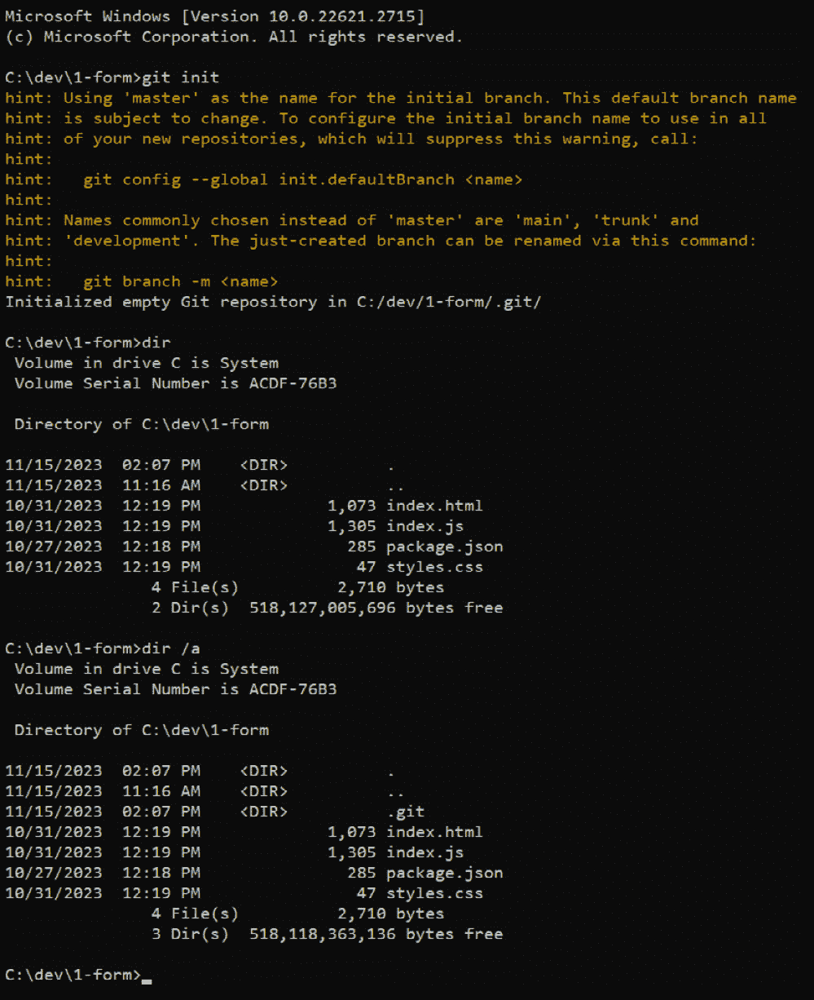

# 管理、安全和协作代码

在过去的两章中，我们花了很多时间查看实际代码，让你熟悉网络开发的细节。很明显，你大部分的时间可能会花在“玩弄位元”，正如我们这些软件极客喜欢说的！

但你也看到了，这不仅仅是*编写*代码那么简单。在本章中，我们将探讨更多“非编写代码”的事情，包括源控制（如何跟踪代码的变化）、操作系统（特别是 Linux）、**集成开发环境**（**IDE**）（帮助你在一个统一的应用程序中编写代码的工具）、安全，甚至一些常见的语言，这些语言对于网络开发者来说经常被用到。

在本章中，我们将简要介绍以下“非代码”主题：

+   控制代码 - 版本控制系统

+   像黑客一样思考 - 保护网络

+   在一个地方完成所有工作 - 集成开发环境

+   理解操作系统 - Linux

# 技术要求

就像上一章一样，我将假设你已经从 GitHub 下载了本书的源代码，正如在*第二章*的“技术要求”部分中概述的那样。对于本章，我们还将处理 `ch-03/2-spa` 目录中的代码。

你还需要做的一件事是安装 Git。为此，请访问 [`git-scm.com`](https://git-scm.com) 并找到适合您系统的下载包。我将把这留作你的练习，但没什么不寻常的，所以我知道你能处理它。

# 控制代码 - 版本控制系统

好吧；所以，你已经花了几小时编写代码——也许你构建了一个小巧的用户注册页面，例如。就像黑手党的人可能会说：如果代码出了问题，那真是太遗憾了，不是吗？当然，一定有保护你代码的方法，而且确实有：**版本控制**。

让我先从告诉你我们这些老古董是如何做版本控制的开始。

我们会不时地在项目目录中创建一个新的目录，并给它起一个像“HTML_complete_8-6-1991_1-30pm”这样的名字。然后，我们会把项目中的所有文件复制到里面。我们会继续工作在项目上，也许稍后我们还会创建另一个名为“JS_complete_8-6-1991_4:30pm”的目录，再次将所有项目文件复制进去。

想想看。在我完成项目的 HTML 代码时，我实际上备份了项目所有文件当前的状态。当 JavaScript 完成时，我又做了另一个副本。我所拥有的就是项目文件的历史记录。后来，如果我在处理 JavaScript 时犯了一个错误，发现它突然不工作了，我可以回到那些目录之一，并将 JavaScript 与它最后一次工作时的状态进行比较。

虽然这很丑陋且完全手动，但这本质上是一种源代码控制，或者通常称为**版本控制**（很明显的原因：每个目录代表代码的一个过去版本）。

此外，我们经常，通常在一天结束时，将所有这些目录复制到某个中央服务器上，一个始终得到适当备份的服务器。这提供了一层保护：即使我们的电脑硬盘损坏，我们也会在服务器上有一个代码副本。如果我们正在编码，并且最近没有创建新的版本目录，我们可能会丢失一些工作，但比丢失一切要好。至少在最坏的情况下，我们可以回到最后保存的版本。

它是一个很好的系统，因为它提供了历史记录和一定程度的保护，但因为是手动操作，所以很容易出错。此外，它并不十分健壮。例如，如果我们需要将一个文件与之前的版本进行比较，我们该如何操作？当时，这“简单”到“将两个文件并排放置在屏幕上，逐个检查，试图找出变化。”这不是一个好的方法。然后还有其他你可能想要做的事情，比如在代码旁边记录你的进度。当然，你可以创建一个`notes.txt`文件并保存它，但同样，这也是一个手动过程，而且它因开发者而异，因为没有人会使用相同的目录命名约定和方法。

当然，现在，几十年后，肯定有更好的答案，对吧？确实如此：**源代码管理**（SCM）。

## 介绍 SCM

这就是软件配置管理（SCM）发挥作用的地方。我们所说的 SCM 系统，或者说版本控制系统，是一种软件，它会自动记录项目文件随时间的变化。SCM 为你提供了查看项目历史、比较文件、召回特定版本的文件、为你的更改添加注释等功能。

他们还做了在那些丑陋的手动源代码控制时代难以做到的事情：他们允许多个开发者同时处理同一份代码。他们通过跟踪每个贡献者的更改并管理合并过程来实现这一点。合并是指你有两个文件副本，分别来自两个人（通常是——尽管也可能是同一个人）的更改，你需要将这些更改合并成一个文件的规范版本。当你是一个单独的开发者在一个项目上工作时，这种情况不太可能发生，但在团队开发中，这是一个至关重要的关注点。

SCM 被认为是软件开发的基础工具，这意味着在一个专业环境中，你几乎总是使用 SCM。如今，一个单独的开发者不使用 SCM 的情况甚至变得不寻常，因为能够回溯到过去，从某种意义上说，查看文件在各个时间点的样子，具有巨大的价值。

SCM 有几个关键点：

+   *版本跟踪*：源代码管理（SCM）记录了存储库中每个文件所做的每个更改的历史，或简称为“repo”，这是描述你的项目目录的另一种方式（它并不完全相同，但从概念上讲，你现在可以这样思考）。它不仅记录了文件的内容，还包括了谁更改了它以及何时进行更改，通常还包括开发者对更改的一些注释。这有助于跟踪项目进度，了解代码库是如何演变的，当然也为你提供了一个回滚更改的方法。

+   *回滚*：这仅仅是当发现问题（或者你只是决定后续的更改可以被丢弃）时，能够检索文件先前版本的能力。

+   *协作*：多个开发者可以同时在同一代码库上工作。源代码管理（SCM）系统管理来自不同人的更改并将它们合并，允许在没有覆盖彼此贡献的情况下进行协作工作。

+   *分支*：有时，开发者可能需要做一些实验性的工作。为了避免这些实验破坏现有的可能良好的代码，他们可以创建一个分支，这实际上是在创建分支时项目的副本。然后开发者进行他们的工作，将更改保存到该分支，同时不触及良好代码。最终，如果实验证明是成功的，它可以合并到良好代码中，使其成为主项目代码的永久部分。

+   *冲突解决*：当两个文件的副本合并时，有时可能会发生冲突——例如，如果两个开发者修改了同一行代码。当这种情况发生时，源代码管理（SCM）可以提醒试图合并代码的开发者存在需要手动解决的冲突（通常意味着决定更改应该来自哪个文件），然后完成合并。

+   *安全性*：源代码管理（SCM）充当一种备份。如果项目文件损坏，可以从 SCM 系统中恢复。

现在你已经知道了什么是源代码管理（SCM），让我们来谈谈你在源代码管理系统中拥有的选项。

## 接受错误的选择——Git 就是！

好吧，我就直接说重点了：现在你几乎在源代码管理（SCM）系统选择上没有选择，它将是一种叫做 Git 的东西。

现在市面上有几种源代码管理（SCM）系统；如 Mercurial、CVS、Subversion、Bitbucket 和 Perforce 等名字你可能听说过。但简单的事实是，整个行业几乎已经完全围绕 Git 聚集，Git 是由创建了 Linux 操作系统的人创建的：林纳斯·托瓦兹。Git 是在 2005 年为那些在 Linux 内核上工作的人构建的，以便他们能够更容易地协作。

Git 与其他许多 SCM 系统相比，有些独特之处在于它是*分布式的*。这意味着每个开发者都有一个 Git 仓库的完整副本，包括所有更改的完整历史记录。这在其他大多数 SCM 系统中是不寻常的，因为它们是*集中的*，意味着有一个代码的权威副本，以及与之相关的所有历史记录，开发者只能在他们的机器上获取代码副本来工作，而不会得到完整的历史记录。分布式 SCM 的好处是它们不需要像集中式 SCM 那样始终连接到中央服务器（尽管需要注意的是，在*大多数*情况下，即使使用 Git，也存在一个集中副本——只是你不需要像使用其他 SCM 系统那样始终与之保持连接）。

Git 因其许多原因而变得流行，但其中一个重要原因是速度和性能。与其他 SCM 相比，合并更改有时可能需要相当长的时间。我们这里不是在说几个小时，但即使在工作日中，几秒钟的累积也会产生影响。Git 从一开始就非常优化速度，大多数操作几乎瞬间完成。Git 性能赢得大多数开发者青睐的关键方式之一是分支。Git 进行分支的方式在大多数其他 SCM 系统中是根本不同的，并且更加轻量。例如，在 Subversion 中创建分支可能需要几秒钟，甚至几分钟，如果分支的内容足够大，而 Git，无论内容大小，几乎都是瞬间的。

由于 Git 迅速获得了大量人气——并且到目前为止，它是软件开发界的既定标准 SCM——每个人都开始将其集成到其他工具中。因此，现在，今天，你几乎可以在所有开发者工具中使用 Git，其中一些我们将在本章后面讨论。它有一个非常大的社区和支持系统，所以无论何时你在 Git 中遇到问题，你都不会有问题获得帮助。

Git 可以从命令行（相对）简单地使用，许多开发者会告诉你这是使用 Git 的*最佳*方式。我不是那些开发者之一。但我确实认为你应该从这里*开始*，所以这正是我们现在要做的！

## 开始使用 Git

我们在这里要做的，是将上一章的项目（更具体地说，是源代码下载中`ch-03/2-spa`目录下的 SPA 版本）添加源代码控制。这允许你开始对代码进行修改，并让 Git 为你跟踪和管理这些更改，为你提供所有 SCM（源代码管理）带来的好处（例如，以后能够回退到之前的版本）。

你需要做的第一件事是复制项目目录。然后，在其内部查找`.git`目录：

+   如果你找到了，就继续删除它

+   如果你没有看到它，那没关系——你可以继续进行

这个目录是 Git 创建的用于存储它执行工作所需信息的目录。如果您从 GitHub 获取了这本书的源代码，那么它可能包含那个目录。然而，由于我们在这里要执行的操作将导致创建该目录，您需要确保您从一个没有任何 `.git` 目录的干净状态开始。

完成这些操作后，转到命令提示符并输入以下命令：

```js
git –-version
```

按*Enter*键并确保您得到一个类似于`git version 2.42.0.windows.2`（版本可能不同，如果您在 Mac 或 Linux 上，则不会显示`windows`，但您应该明白这个意思）。只要发生这种情况，您就可以使用 Git 了。

到此为止，导航到您创建的项目目录的副本，让我们将这个项目置于源代码控制之下！

## 使用最常用的 Git 命令

在基本级别上使用 Git（这在大多数日子里都是您所需要的）并不太困难，并且归结为可能是一打常见的命令。现在，让我们通过使用上一章中的一个项目目录——比如说 `ch-03/2-spa` 目录——来运行这些命令。现在启动命令提示符并导航到该目录。

### 设置新仓库（或克隆现有仓库）

要设置新仓库，第一步是告诉 Git 您希望当前目录成为一个 Git 仓库：

```js
git init
```

您应该看到类似于*图 4.1*1*所示的内容：



图 4.1：初始化 Git 仓库

注意，在执行 `git init` 命令后，我列出了目录，但没有看到可见的 `.git` 目录，这是 Git 创建的用于存储有关您仓库的所有元数据的目录。这是因为它是隐藏的。因此，要查看它，您必须执行 `dir /a`。这确认了 Git 已经完成了它的工作，我们现在有一个仓库了。

Linux 和 Mac 用户注意事项

在这本书的整个过程中，因为我主要是一个 Windows 用户，所以我主要写了以 Windows 为中心的书籍。在大多数情况下，您在 Linux 或 Mac 机器上看到和做的将是一样的。但是，在少数情况下，Windows 和 Linux 或 Mac 之间会有所不同。一个例子是，虽然 `dir /a` 在 Windows 上有效，但在 Linux 或 Mac 下，您将使用 `ls -a` 代替。

当然，您可能并不总是从开始一个项目和相应的仓库。如果您开始处理别人的项目，您很可能会做被称为**克隆**他们仓库的事情。这意味着将他们的仓库复制到您的本地机器上。为此，您可以使用这个命令代替：

```js
git clone <url>
```

这将为您初始化仓库的结果相同：当前目录变成一个 Git 仓库，并包含一个隐藏的 `.git` 目录。

初始化现有仓库和克隆现有仓库之间的主要区别在于，克隆还会将仓库中的所有文件复制到当前目录中。然而，在初始化一个空仓库后，仓库中没有任何文件（尽管它们可能物理上存在于目录中——但 Git 还没有意识到它们）。

### 添加文件

仅创建一个仓库并没有做什么。在这个阶段，Git 甚至还没有意识到目录中的任何文件，或者你可能稍后添加的任何文件。你必须告诉 Git 你想要它跟踪的每个文件。为此，你可以使用 `git` `add` 命令：

```js
git add <file>
```

例如，在我们的项目中，目前应该有四个文件：`index.html`、`index.js`、`package.json` 和 `styles.css`。因此，为每个文件执行 `git add` 命令，并执行以下四个命令：

```js
git add index.html
git add index.js
git add package.json
git add styles.css
```

此外，仅作为一个例子，如果你使用了一个错误的名字，输入以下命令：

```js
git add badName.txt
```

输出应该像*图 4*.2*中所示：


图 4.2：添加项目文件，加上一个错误！

如你所见，我也尝试添加了一个不存在的文件，你可以看到 Git 提醒我们这一点。此外，请注意 Git 为 `package.json` 文件提供的警告。这取决于你的操作系统，无论如何，这不应该对我们有很大影响，但 Git 让我们知道它将做什么是很好的。

通常，没有错误或警告意味着命令成功。这是 Linux 命令中常见的模式，你需要记住这一点。Git 与 Linux 开发内在相关，如前所述，因此它以这种方式工作是有意义的。

### 检查状态

为了确保 Git 现在知道我们的文件，我们可以要求它提供当前状态：

```js
git status
```

此命令显示更改的状态。在*图 4*.3*中，你可以看到所有四个文件都**需要提交**。这意味着它们位于 Git 仓库的一个特殊区域，称为**暂存区**。简单来说，这就是 Git 已知的更改，但尚未提交——也就是说，尚未成为仓库的永久部分——存储的地方：


图 4.3：状态，包括暂存区的内容

### 提交更改

我们如何将更改从暂存区移动到仓库本身？这很简单：我们提交它们！

提交更改可以使用 `git` `commit` 命令：

```js
git commit -m "<commit message>"
```

你必须提供一条与提交一起的消息，这应该是对更改的一些有意义的描述。如果你正在开发一个新功能，并且此代码实现了它，那么你可能想说“这些更改实现了 *X* 变更。”但由你决定—— whatever makes sense. 你可能会输入如下内容，我认为这是一个足够合理的消息：

```js
git commit -m "Adding initial files to repo"
```

在*图 4*.4*中，你可以看到该命令的结果：


图 4.4：将我们的项目文件提交到仓库

你还可以看到我再次执行了 `git status`，现在暂存区中没有文件，正如预期的那样。

### 查看提交历史

要查看你仓库中发生的提交列表，执行 `git` `log` 命令：

```js
git log
```

此命令显示当前分支的按时间顺序的提交历史。我很快会谈到分支，但现在您只需要知道 Git 默认创建一个`master`分支，除非您告诉它否则，所有的工作都会放在那里。请注意，`master`有时被称为`main`，这取决于您使用的 Git 版本或可能覆盖 Git 的工具。无论您看到哪个名称，它都意味着相同的意思。

在**图 4**.5*中，您可以查看该命令的输出结果：


图 4.5：git log 命令的实际操作

但如果您想查看哪些文件被更改了呢？默认情况下，`git log`只会列出发生的提交，包括消息、日期/时间和谁提交了它。但这就是另一个命令`git show`发挥作用的地方。在**图 4**.5*中，我在执行`git log`命令之后执行了它，那里显示了我作为那次提交的一部分添加到仓库中的文件列表。如果您省略了`–name-only`选项，它还会显示那些文件的每个内容，以及作为那次提交的一部分它们的变化（显然，当我们添加文件时，从不在仓库中到在仓库中，从 Git 的角度来看，整个文件都发生了变化）。

顺便问一下，`–name-only`选项后面的那个`e0b60a5e`是什么东西？那是一个哈希值，在这个上下文中，它是与提交相关联的唯一标识符。更确切地说，它是哈希值的前 8 个字符——您可以在`git log`和`git show`输出的`commit`词后面看到完整的哈希值。8 个字符几乎总是足够保证 Git 可以找到唯一的哈希值（原因涉及到密码学和高级数学，所以您必须相信这是几乎不可能的，两个提交的哈希值相同），这是我们需要的所有内容（尽管如果您愿意，您可以输入完整的哈希值）！

### 删除文件和恢复已删除的文件

如果您可以向 Git 仓库添加文件，那么当然您也可以删除它们，而且确实可以！要删除文件，Git 提供了`rm`命令：

```js
git rm <file>
```

与添加文件一样，`git rm`只影响暂存区。要删除文件，您需要再次执行`git commit`以使更改在仓库中永久化。

但而不仅仅是这样做，我想向您展示另一个重要的东西：恢复已删除的文件。在**图 4**.6*中，我已经删除了一个文件，但在那之后我还做了一些其他的事情（注意，您应该从上到下、从左到右阅读，因为这是一系列连续的事件，但我不得不将屏幕截图分成两半以适应这里）：


图 4.6：删除和恢复文件

首先，我列出了目录以查看文件。接下来，我执行了`git status`命令以确保没有暂存更改。然后，我使用`git rm styles.css`删除了`styles.css`文件，立即列出目录以确认它已被删除，然后再次执行`git status`命令以查看它已被标记为已删除。在这个时候，删除操作是*暂存的*，但它还没有从仓库中永久删除。

由于这个事实，还有时间保存文件！首先，我们需要告诉 Git 忽略暂存区的删除操作。这可以通过以下命令完成：

```js
git restore –-staged <file>
```

然而，当你再次列出目录时，你会发现文件仍然不存在。我们必须现在告诉 Git 物理恢复文件，因为之前的命令只是告诉它我们不再想删除它。所以，执行以下命令就能解决问题：

```js
git restore <file>
```

但你必须先执行带有`–-staged`选项的上一条命令。Git 有时可能会有些令人困惑，确实如此，大部分的困惑都源于这种双重提交过程：首先，你告诉 Git 你想要做出的更改（你将它们暂存），然后你对仓库做出更改（你提交它们）。

即使你提交了删除操作，仍然有方法恢复文件。你必须使用`git log`命令回顾历史，找到你想要的版本，然后使用另一个命令来恢复它：

```js
git checkout <commit hash>
```

这将把文件恢复到你的项目中，此时你可以根据需要重新提交它。

### 创建分支

当你在 Git 中工作时，你有时会想要工作在可能或可能不会最终进入你的仓库的某些代码上。也许你正在实验，不想冒破坏你良好、有效代码的风险。在这种情况下，你可以创建一个新的*分支*，你可以将其视为仓库中所有代码的完全独立的副本。你给分支起一个名字，然后通过这样做，你可以切换到不同的分支，这会改变你的更改存储的位置（或者换句话说，哪个代码副本受到影响）。一个分支（你的代码副本）的更改不会影响任何其他分支，除非你明确告诉 Git 你想让它们影响。

要创建分支，使用以下命令：

```js
git branch <branch name>
```

这将创建一个新的分支，而你的`master`分支（Git 默认创建并使用的分支）保持原样。在这个时候，分支是你之前正在工作的分支的副本。在我们的例子中，这是`master`分支，因为我们只有一个分支。

### 切换分支

为了确保你的更改进入新分支，你必须切换到它。你可以在任何时间点通过简单的命令来切换到分支：

```js
git checkout <branch name>
```

现在，你添加和提交的任何文件都将进入命名的分支。包括`master`在内的任何其他分支都不会受到影响。所以，你可以自由地实验，确信你之前的代码是安全可靠的。

### 合并

然而，最终，一旦你的实验分支工作正常，你可能会想要将代码从你的实验分支推送到 `master` 分支。这就是合并的作用。合并简单地说就是从一个地方取走更改并将其放入另一个地方。在 Git 的情况下，这些地方是分支。

假设你在一个名为 `experiment` 的分支上工作。你在这段代码上工作了一段时间，使其工作正常，现在你想要将这些更改合并到你的 `master` 分支中。你首先切换到 `master` 分支，然后执行以下命令：

```js
git merge <branch>
```

假设 `<branch>` 是 `experiment`，那么该分支的更改将被合并到 `master`。新文件将被复制进来，已删除的文件将被移除，现有文件的更改将在 `master` 中进行。最终，`experiment` 分支中的所有内容，包括所有与你可能做的所有提交相关的历史记录，现在也将出现在 `master` 中。

如果你愿意，你现在可以删除 `experiment` 分支，因为你不再需要它：

```js
git branch -d experiment
```

为了明确起见，虽然分支不是我会称之为高级主题的东西——因为它确实很常见——但它是一个完全**可选**的主题，你永远**不必**使用分支。这就是为什么我没有展示这些命令的例子——如果你需要，你可以了解它们。

在使用 Git 时，开发者倾向于采用一种特定的**工作流程**，这意味着他们如何与 Git 交互并推进工作。虽然一些 Git 工作流程非常强调分支，但其他工作流程则积极避免使用分支。一些工作流程规定所有工作都应该在小的“功能”分支上完成，然后合并到 `master`。另一些则说工作应该在 `master` 上完成，但每个发布都应该从 `master` 创建一个新的分支。还有一些工作流程说 `master` 应该始终是唯一的分支，而**标签**——Git 的一个功能，在概念上允许你在给定的时间点创建仓库的命名副本——是前进的方式。

在任何情况下，只要你知道什么是分支——你现在知道了！——你应该准备好处理你遇到的任何工作流程。而且，当你独自在一个项目上工作时，你可以自由地实施任何你喜欢的流程，或者保持简单，始终只处理 `master`。无论如何，你都会得到版本控制的好处。

我们需要讨论的最后一个话题与你在使用远程仓库时的情况有关。

### 推送和拉取更改

到目前为止，你只处理了本地仓库，这意味着它就在你的机器上。这是好事，因为它提供了版本控制和跟踪，但它不允许其他人与你一起工作，也不能保护你免受机器硬件故障的影响。为了处理这两个问题，你通常会处理远程仓库。

从本质上讲，远程仓库与本地仓库没有区别，只是它可以通过网络访问。如果你一直在跟随，那么在某种程度上，当你从 GitHub 获取这本书的代码副本时，你已经处理了一个远程仓库。但你很可能只下载了仓库中的文件副本，它实际上已经不再是一个 Git 仓库（如果没有隐藏的`.git`目录，那就是这种情况）。

当你与远程仓库一起工作时，无论你是自己创建它还是克隆别人的，你都需要考虑两个新的概念：推送和拉取。

当你对你本地的仓库进行更改时，即使它是别人远程仓库的副本，这也只会影响你的本地副本。要将你的提交更改推送到远程仓库，你必须将更改**推送到**它：

```js
git push <remote> <branch>
```

这个命令将你的提交更改发送到远程仓库。`remote`值是远程仓库的名称，通常情况下会是`origin`。`branch`值是你想要从本地仓库中推送到远程仓库的分支。

这很好，但如何从远程仓库获取新的更改呢？要从远程仓库获取更改，你需要**拉取**它们：

```js
git pull <remote> <branch>
```

这个命令将远程服务器上的更改合并到你的工作目录中。与推送类似，`remote`值通常会是`origin`，而`branch`是你想要将更改合并到本地仓库中的哪个分支。

只需要这两个命令，你就可以与远程仓库交互，允许你和他人同时工作在代码上。但那个远程仓库会住在哪里呢？有很多选择，包括自己托管，但最受欢迎的一个你已经见过：GitHub！

## GitHub – Git，但更友好

**GitHub**对于 Git 来说，就像电脑对于电力一样。虽然电力和 Git 是实际工作的，但你可能更愿意与电脑和 GitHub 交互！正如你在上一节中看到的，你可以在命令行上使用 Git，但你可能已经注意到这不是最愉快的体验。而且请相信我，你看到的只是基础……它会变得更糟！

但 GitHub 通过提供一种更用户友好的方式来与 Git 一起工作来解决这一问题。GitHub，正如你访问这本书的代码时可能看到的那样，是一个基于网络的平台，开发者在这里存储和管理他们的项目，并且可以选择将其提供给全世界。它是建立在 Git 之上的，虽然 Git 负责跟踪项目中文件变更的繁琐细节，但 GitHub 提供了一个用户友好的界面来与之交互，以及许多额外功能，例如错误跟踪、任务管理、为开发者提供的社会化网络功能，甚至可以托管项目，如网站（称为 **GitHub Pages**）。将 Git 想象为引擎盖下的引擎，GitHub 则是围绕它构建的汽车，比单独的引擎提供更舒适和功能丰富的驾驶体验（哇，想象一下有人在路上骑着汽车引擎的画面，是不是很有趣？）。

GitHub 允许你克隆一个仓库，在本地工作，然后将更改推送到它（前提是你有权限这样做，这是它在 Git 之上添加的附加功能之一）。GitHub 还提供 **Actions**，这是仓库所有者可以设置在发生各种事件时执行的代码片段。例如，可能有一个动作在有人向仓库推送时构建项目，然后部署项目的新的版本，比如一个网站，所有人都可以访问。

GitHub 为仓库添加了一个问题跟踪器，这样你的项目的用户就可以提交错误报告，而你也可以跟踪和管理他们解决问题的进度。

GitHub 还提供了一个在线代码编辑平台，所以如果你想的话，可以在 GitHub 上完全完成一个项目。许多开发者喜欢他们的工具在本地机器上，他们只是将 GitHub 用作远程仓库，但如果你选择，它可以做更多的事情。

GitHub 甚至提供 AI 功能，即 CoPilot。这是一个可以在你键入时提供实时编码建议的功能，为你节省时间，甚至可能解决你原本可能会卡住的问题。它是通过在 GitHub 上的仓库上训练 AI 来实现的，因此你实际上获得了使用 GitHub 的每个人的综合知识、智慧和经验。

我可以继续说，因为 GitHub 不仅仅是一个 Git 仓库的托管者——它更像是一个开发者工作的中心枢纽。但它的好处在于，你可以从开始时浅尝辄止，然后完全投入其中，或者只留下脚趾头。你完全可以根据自己的意愿决定在 GitHub 中走多远。我还应该指出，GitHub 有替代品。但简单的事实是，GitHub 几乎是王者。它被比任何竞争对手都要多的开发者使用。在你继续你的网络开发者旅程的过程中，你几乎肯定会以某种方式与 GitHub 打交道，这只是一个程度的问题。

我假设你已经下载了这本书的代码，这意味着你已经创建了一个 GitHub 账户。但如果你还没有，现在就是时候了！无论如何，我强烈建议你花些时间在 GitHub 上玩玩。我会建议创建一个仓库，添加一个或两个文件，并在 GitHub 上本身编辑它们。然后，练习在本地机器上克隆仓库，再次编辑和添加文件，然后将更改推送到 GitHub，看看这些更改是如何显示在那里的。我认为你很快就会看到 GitHub 的价值，并欣赏它在过程中如何使 Git 的一些粗糙边缘变得平滑。

现在你已经了解了如何使用 Git 管理源代码，让我们谈谈一个不同的主题，这是每个开发者编码时都必须时刻牢记的主题：安全。

# 以黑客的思维思考——保护网络

创建安全的网站需要大量的时间、精力和对多个层面的细致关注。“深度安全”是一个常见的短语，意味着你不仅仅是要锁上门——你还需要一个安全摄像头、一只看门狗和窗户上的栅栏来保护你的家。同样，编写安全的代码也是其中的一部分，确保你的服务器能够抵御攻击。这是一个极其广泛的话题，而且它在过去几年中变得越来越重要。我们确实都看到了近年来发生的所有安全漏洞，我们中的大多数人可能以某种方式受到了个人影响。不幸的是，这些东西并不容易做对。

但一切始于编写安全的代码，而要做到这一点，你必须了解黑客——或者我们专业人士称之为“威胁行为者”——在代码中寻找以利用的某些类型的事物。好吧，他们通常不是在查看你的代码本身；他们是在查看你的网站，试图推断你的代码是如何编写的，然后寻找其中的弱点。

## 常见漏洞

好消息是，如今，利用——黑客可以利用来突破你安全性的弱点——基本上可以分为几个广泛的类别。

### SQL 注入

如果不了解 SQL 是什么，这很难解释。但是，为了给你一个简略版……SQL 是一种特殊语言，允许你从数据库中获取数据。例如，如果你的数据库包含一个支票账户列表，你可能会通过执行`select * from checking_accounts` SQL 语句来获取这些账户的列表。

**SQL 注入**攻击基于这样的语句，以及开发者并不总是安全地编写它们的现实。当他们不这样做时，它允许威胁行为者通过表单中的巧妙值来修改这些语句。通过这样做，他们就能够访问他们不应该能够访问的数据。幸运的是，这是一个容易避免的问题：只需要开发者编写以特定方式使用 SQL 语句的代码。

### 跨站脚本（XSS）

XSS 是攻击者使用的一种技术，允许他们将恶意脚本（我们这里指的是 JavaScript）注入其他用户查看的内容中，可能窃取数据或冒充用户。这个漏洞是一个很好的例子，说明了为什么安全性如此困难：您可能认为这需要有人能够访问您的服务器来修改您的代码，但事实并非如此。相反，通过巧妙地使用电子邮件（在电子邮件中通常可以嵌入链接和其他网络内容），允许某人嵌入他们的恶意脚本，然后可以启动一个网络浏览器访问您的合法网站，该脚本随后能够像它属于您的网站一样执行其恶意行为。

这里的主要观点是，攻击者通常会间接地攻击您的网站，以您最初甚至都不理解的方式。 “像黑客一样思考”需要您对网络上的事物有良好的理解，然后才能以他们从未打算达到漏洞的方式连接事物，有时，这些连接的事物可能距离攻击目标有数步之遥。

您可以采取措施从发送到服务器的任何内容中移除可能危险的内容，并且您可以通过特殊方式编码输出，即使某些内容意外通过，在到达用户的浏览器时也不会产生预期效果。例如，在接收用户数据时，您可以查找任何 JavaScript 关键字实例并将它们删除，因为这通常不是您希望允许出现在用户输入中的内容。为了安全起见，您需要在服务器端执行此操作，因此您会运行所有用户输入通过一个清洗函数，该函数查找这些关键字或其他可能有问题字符串，如`<script>`，并将它们删除。您还希望在输出端执行相同操作，这意味着您发送到浏览器的任何数据都应该类似地被清洗，以防通过其他方式（例如，将数据加载到您的数据库中）意外地进入您的数据（当这种情况发生时，被称为存储型 XSS 攻击，因为恶意内容以某种方式被存储，并在返回浏览器时可能产生影响）。

### 跨站请求伪造 (CSRF)

CSRF 是一种欺骗用户浏览器执行某些不受欢迎的操作并使其看起来像是用户合法操作的方法。这有多种形式，其中一种更常见的方式是当网站使用 cookie（存储在用户浏览器上的小信息块）来识别该用户。如果有人能够窃取该 cookie，他们就可以有效地冒充合法用户。想象一下窃取一个用户的银行网站的 cookie——攻击者可以在真实用户意识到之前将所有钱转走。

如果不采取某些预防措施，窃取 cookies 并不像听起来那么困难（cookies 有各种安全设置，开发者应该正确设置以使它们更难被窃取）。使用 CSRF 令牌也很常见，这是一个随着每个请求而变化的唯一随机字符串。这样，即使有人偷走了你的 cookies，没有 CSRF 令牌，他们也无法做任何事情。CSRF 的其他变体需要其他缓解措施，但这取决于具体情况。

除了针对这些特定攻击的防御措施之外，还有一些基本的编码实践可以帮助你避免安全问题。

## 安全编码实践

当你编写代码时，你应该牢记几个关键点。这样做不仅能帮助你避免之前提到的问题，还能避免更多的问题。

### 实施安全的身份验证

你应该始终实施强大的密码策略，并在可能的情况下使用**多因素认证**（**MFA**）来保护用户账户。MFA 意味着用户必须通过多个因素来证明自己，其中因素是你是谁、你知道什么以及你有什么。例如，登录一个网站可能需要用户名（你是谁）、密码（你知道什么），以及可能发送到你的手机上的一次性代码（你有什么）。虽然攻击者可能设法窃取你的密码（你的用户名通常不是敏感信息），但他们不太可能同时拥有你的手机，所以通过要求多个因素，你现在已经保护了该网站。

### 使用加密

除非你有非常充分的理由不这样做，否则你应该始终使用 HTTPS，以确保浏览器和服务器之间传输的数据被加密。（我能想到的现在不使用 HTTPS 的唯一好理由是在开发过程中在你的机器上工作，因为使用 HTTPS 比简单的 HTTP 涉及更多的配置，你可能不想在开发过程中处理这些问题。）

这可以避免一种称为**中间人攻击**（**MITM**）的攻击形式。在这种攻击中，攻击者可能会控制你的数据在发送到服务器时通过网络的路由器。在这种情况下，他们可以查看这些数据，这些数据可能包括你的用户名和密码，如果你没有多因素认证（MFA），他们就可以随意登录。加密使得他们只能看到一串乱码。

### 正确处理错误

当你编写代码时，几乎每种语言都有处理错误条件的方法。这很重要，因为当这些错误发生时，它们可能会泄露关于你网站底层架构的信息，甚至可能允许威胁行为者偷偷将代码片段注入你的代码中，然后在你的代码上下文中执行。为了避免这种情况，你应该始终确保显示给用户的错误消息尽可能少地透露你的技术栈信息，并且你应该始终尝试使用你选择的语言提供的错误处理机制，以便没有任何东西“泄露出去”，也就是说，威胁行为者可以利用它来对付你。

### 执行代码审查并进行稳健的测试

定期审查代码以发现漏洞，并执行安全测试，包括渗透测试和静态代码分析。

静态代码分析工具在执行代码之前检查你的代码，寻找经常表示安全问题的模式。静态分析可以发现其他问题，而不仅仅是安全问题。它可以发现可能导致错误的逻辑错误，并指出你的代码没有按照可接受标准编写的位置。

渗透测试，通常简称为 pen testing，涉及人员（被称为“白帽”黑客）在获得你同意的情况下积极尝试攻击你的网站！他们试图通过例如寻找你使用的技术线索，然后搜索已知漏洞的方式来绕过你的安全措施。他们还可以根据代码的工作方式寻找代码中的缺陷，这使他们能够突破你的安全防线。

这两种方法都很有价值，因为它们能指出你可能自己忽略的问题，然后你可以进行纠正。这样积极主动的做法让你有机会在坏人介入之前修复这些发现！

### 实施最小权限原则

这通常是在操作系统级别而不是代码级别，但有时，它确实会渗透到代码级别。无论如何，理念是你应该只授予执行特定任务所必需的权限给特定用户，以减少如果发生安全漏洞可能造成的潜在影响。记得我们之前讨论过 Linux 中的 root 用户吗？嗯，如果威胁行为者能够以 root 用户身份获得访问权限，他们就有了王国的钥匙——他们可以做任何事情。然而，如果他们只能以对文件和目录只有有限访问权限的用户身份进入你的服务器，那么即使他们已经突破你的安全防线，他们能造成的损害也是有限的。

### 设置安全头信息

服务器可以在对浏览器的响应上设置各种头信息，称为**内容安全策略**（**CSP**）头信息，以及 X-Frame-Options 和 Strict-Transport-Security 头信息。这些告诉浏览器它们可以对服务器返回的内容执行什么操作。正确配置这些头信息可以限制威胁行为者在你的网站上能做的事情，在某些情况下甚至可以完全消除某些类型的漏洞（好吧，“完全”这个词在网络安全方面说起来永远不是什么好事，但它确实让坏人更难，而这基本上是所有这些的总体目标——让它们难以做到，基本上不值得他们花时间）。

### 定期更新

你几乎总是应该使用最新版本的诸如语言、库和服务器软件等，因为它们往往已经针对之前发现的安全问题进行了修补。新的问题总是可能被发现，因此这是一项持续的任务。

### 验证输入

当你从客户端获取数据时，你必须始终假设它包含安全漏洞。从服务器的角度来看，客户端永远不可信！因此，我们做一些事情，比如清理输入数据，这意味着确保所有输入数据都符合特定标准，以防止格式不正确的数据进入系统，这可能导致漏洞。例如，如果你有一个用于输入用户年龄的表单字段，它应该是一个数字。即使你在页面上有 JavaScript 确保这一点，威胁行为者也有其他方法让那些数据不是数字。当服务器接收到它时，如果它假设它是一个数字——如果它假设客户端是可信的——那么非数字数据可能会悄悄进入，并且可能存在利用这些数据的方法。因此，你的服务器代码*必须*验证客户端发送的确实是预期的数字。永远不要，永远不要信任客户端！如果你从这个整个部分中记住什么，记住这一点，因为它单独就能帮助你避免许多，如果不是大多数安全漏洞。

### 编码输出

想象一下，你有一个网站从远程服务获取股票行情数据。进一步想象，你将那些数据存储在你的数据库中并向用户展示。现在，你的网站可能代码编写得非常完美，因此它会清理从用户那里获取的所有数据。太好了！但是，你从那个远程服务获取的数据怎么办？他们是否像你一样很好地完成了他们的工作？也许没有！

在这种情况下，你可能会在你的数据库中以 JavaScript 代码的形式存储恶意内容，然后当你将这段 JavaScript 渲染到页面上时，它可以在你的页面上下文中执行，就像是你自己编写的，但执行的是坏人的命令。这被称为存储 CSS 攻击，因为恶意代码被存储在某个地方，通过“后门”悄悄进入。为了避免这种情况，你需要对发送给客户端的数据进行编码，移除可能导致漏洞的某些内容。

这种编码的实现方式因许多因素而大相径庭——太多以至于无法在此详细说明。但一般来说，它涉及用被认为是安全的其他字符或字符序列替换某些字符或字符序列。举一个例子，如果用户可以提交包含文本 `alert(1)` 的数据，并且它被保存在你的数据库中，然后后来在页面上使用，那么这段 JavaScript 代码将像你亲自编写的那样执行。为了处理这种情况，你可能需要将 `(` 和 `)` 字符分别编码为 `&#40;` 和 `&#41;`，这些是特殊序列，将确保代码不会执行。

### 安全地管理配置

在代码中需要某些敏感信息是很常见的。例如，你的代码可能需要用户名和密码来连接到数据库。如果你将此信息嵌入到代码中，那么任何能够看到代码的人现在都有了这些凭据。这可以通过安全地存储这些凭据来避免，通常是在一些专门为这种敏感信息设计的特殊系统中。然后，你的代码只在需要时从该系统请求凭据，并且它们只在服务器内存中短暂存储。

### 监控文件上传

如果你的应用程序允许文件上传，确保对文件进行恶意软件扫描，并对文件类型和大小进行严格控制。例如，如果你正在构建一个人们可以展示他们相册的网站，你将希望实施代码以确保只上传图形文件。此外，你可能还希望有代码来确保没有大于可能 10 Mb 的文件被上传。这样，你可以阻止用户上传可能包含恶意软件的大型可执行文件，这些恶意软件可能被用来攻击你的服务器。

### 正确安全地存储数据

经常出现的情况是需要存储用户凭据——通常是用户名和密码。你可能认为将它们存储在服务器上的数据库中是安全的，但这并不是真的。有人可能能够访问那个数据库。如果你将它们存储在文件中而不是数据库中，情况可能也是如此。

不，你必须安全地存储这些数据。你在这个情况下会如何做？你可能认为你可以加密密码并存储它，对吧？**加密**是我们取一个值并生成另一个看起来像乱码的值，但这个乱码可以用来在给定另一个值——密钥——的情况下重新生成原始值。换句话说，加密是一个双向函数：一种方式是使用密钥值加密一些数据，另一种方式是使用密钥解密它（将其转换回原始数据）。

这看起来很安全，对吧？即使有人得到了你的数据库，他们也只能看到密码的乱码（通常不需要以任何方式保护用户名）。这是真的……除非他们也得到了你的加密密钥！考虑到你的代码需要密钥来解密密码并检查用户输入是否正确，这可能并不难。

在这种情况下，你应该做的是对密码进行哈希处理。与加密不同，加密是双向的，`abc123`（这不是一个好的密码，但请配合我继续这个例子！）如果我们对那个密码进行哈希处理，我们可能会得到一个哈希值`z9x8`。所以，我们永远不能从`z9x8`中得到`abc123`，但如果我们给哈希函数输入`abc123`，我们总是会得到`z9x8`。

这很有用，因为如果我们把`z9x8`存储在我们的数据库中，这意味着即使有人偷走了它，他们也无法得到真正的密码。但我们的服务器代码仍然可以验证用户！它只需要做的是，在用户登录时，对用户输入的密码进行哈希处理。如果我们得到的哈希值与数据库中存储的哈希值匹配，那么我们就知道他们输入了正确的密码。

哈希和加密之间的区别是开发者经常出错的地方，在我的经验中，这个场景是知道区别是安全登录系统与不安全登录系统之间的区别。

通过采用这些（以及其他）实践，网络开发者可以显著减少攻击面——所有可能被攻击者利用的安全路径——从而防御不断演变的网络威胁格局。

更多关于哈希的内容

哈希不仅用于密码和安全。你之前在讨论 Git 时看到了它们的使用。那里的哈希工作方式相同——提交的内容通过哈希函数运行以生成哈希值——但在 Git 中，它不是用于安全，而是用于唯一标识一个提交，因为哈希值将唯一对应于提交的内容，因为不存在其他字符组合可以产生相同的哈希值（严格来说，这并不完全正确，但两个不同的输入字符串产生相同哈希值的概率——我们称之为哈希冲突——在统计上如此之低，以至于我们可以认为这是真的）。

现在，让我们转换一下话题，谈谈在许多情况下将成为你日常处理最多的开发工具：集成开发环境（IDEs）。

# 在一个地方完成所有工作——集成开发环境（IDE）

在*第一章*中，我向你展示了一些非常基础的 HTML，并建议如果你使用 Windows 系统，可以将它输入到记事本这样的纯文本编辑器中。长期以来，就是这样——只有纯文本编辑器。过了一段时间，它们变得更加高级。例如，一些编辑器可以识别各种编程语言并提供颜色编码，使它们更容易理解，或者它们可以识别 JavaScript 中的函数，并在旁边显示一个列表。它们开始不仅仅只是纯文本编辑器——换句话说，它们开始意识到文本的*内容*。

在那之后不久，又发生了一次新的演变：集成开发环境（IDE）。这些软件为开发者提供了全面的设施。你几乎可以说 IDE 是一个对正在编辑的文本非常*敏感*的文本编辑器。它理解你在做什么，并以多种方式帮助你。IDE 通过将编写软件时涉及的大部分常见活动组合到一个应用程序中，提高了你的生产力。你在工作的地方保持不变，并且所有你需要的东西都在你的指尖，而不是需要跳转到几个窗口或界面来完成工作。

一个 IDE 通常包括以下内容：

+   *代码编辑器*：我的意思很明显，对吧？！但这是一个专门用于编写和编辑编程源代码的文本编辑器，通常包括诸如语法高亮、代码格式化和代码导航等功能。

+   *编译器或解释器*：一些编程语言在运行之前需要转换为其他语言。这听起来很奇怪，但这是真的！这个过程被称为*编译*，通常使用*编译器*来完成。那些*可以直接运行*的语言则使用*解释器*。然而，无论需要哪种工具，你都必须以某种方式与之交互，通常是一个独立的命令行界面。但有了集成开发环境（IDE），所有这些功能都内置其中，并通过 IDE 界面进行控制，因此你永远不需要离开它，这是 IDE 的一个关键优势。

+   *调试器*：调试器是一个工具，它通过允许执行代码的逐行执行、在任何时刻查看变量的状态或跳过代码段以便你能够专注于特定区域等方式，帮助你测试和调试代码。任何值得拥有的 IDE 都会内置一个强大的调试器。

+   *构建自动化*：一旦你编写完代码并测试和调试了它，你通常需要创建某种类型的包，当你想将应用程序分发给他人时，底层操作系统或运行时环境将使用这个包。我们说，这就是你“构建和打包”应用程序的时候，IDE 提供了自动化这个通常手动过程的方法。

+   *源代码管理（SCM）*：IDE 几乎肯定知道如何与 Git 和其他源代码管理系统（SCM）一起工作，并且它们通常会提供一种更直观的方式来使用它们。有些人非常偏爱这种方法，而不是命令行——我就是其中之一——因为它允许您不必记住一大堆命令和选项，而是更抽象地与代码和 SCM 一起工作。

+   *可扩展性*：任何好的集成开发环境（IDE）都将有一些机制来扩展其功能，无论是称为插件、扩展还是其他什么。通过这种方式，您可以添加对新语言或工具的支持。

集成开发环境（IDE）有各种各样的形状和大小。有些是免费的，有些需要付费，有些只是带有一些附加功能的良好文本编辑器，而有些可以做很多事情，以至于如果您要求它们，它们似乎可以驾驶航天飞机！

在接下来的小节中，我们将探讨几个最受欢迎的集成开发环境（IDE）。当您阅读有关它们的内容并查看示例截图时，请注意它们的相似之处：它们通常都有一个用于编辑源代码的中心区域，周围环绕着几个小的工具窗口或区域。这基本上是 IDE 的目的：在中心提供一个坚实的、内容感知的文本编辑器，并围绕它提供上下文感知的工具（https://code.visualstudio.com）来帮助您完成工作。

## VS Code

VS Code（https://code.visualstudio.com）可能是今天最受欢迎的 IDE。它来自微软，被宣传为免费、轻量级、跨平台（这意味着它可以在 Windows、Mac、Linux 上运行，甚至可以在网络上运行！）源代码编辑器，内置对 JavaScript、TypeScript（我们将在后面的章节中介绍）和 Node 的支持。它通常是一个相当基础的 IDE，但通过丰富的扩展生态系统，它可以非常容易地扩展，以支持其他语言、运行时、工具和技术，因此您可以使其完成几乎所有您需要的任务。

开发者倾向于喜欢 VS Code，因为它“不会妨碍他们”。有些人发现一些其他 IDE 的功能“有点太多”，信不信由你！毕竟，最终，一切都归结于您所编写的代码，所以一个占用您查看代码空间的环境有时可能不是您想要的。至少默认情况下，VS Code 在专注于您的代码方面做得很好，但您可以根据需要稍后添加功能。

*图 4.7* 展示了 VS Code，但请注意，这目前是我的设置，所以您看到的内容比默认设置要多，因为我已经安装了许多扩展（您可以通过左侧图标数量来判断——默认情况下，只有几个这样的图标，但我添加的一些扩展也添加了图标在那里）：


图 4.7：VS Code

话虽如此，但请注意代码周围并没有太多东西。只有代码、左侧的项目目录列表和右侧的命令提示符。默认情况下，命令提示符甚至不会显示。这就是“不挡你的路”的意思，你可以将其与 Eclipse 或 IntelliJ IDEA 进行对比，我在稍后展示它们时，它们默认会显示更多内容。

## Visual Studio

**Visual Studio** (https://visualstudio.microsoft.com) 在某种意义上是 VS Code 的“大哥”，而且恰好也是微软的产品。它比 VS Code 诞生早很多年（可能现在甚至几十年）。从历史上看，Visual Studio 主要用于处理微软的语言，如 .NET 和 C#，但多年来，它已经扩展到几乎涵盖所有技术，无论这些技术是否来自微软。微软提供了一种稍微有限制的免费社区版，以及一个功能齐全的版本，该版本附带付费订阅模式（在撰写本文时，这可能低至约 500 美元，高至约 6000 美元）。

Visual Studio 以前曾是一种笑话，因为它非常沉重、非常慢，而且往往不如你编写原始代码时希望的那样稳定。但现在，它已经成为一个非常受尊重和好评的 IDE，很多人对其赞不绝口。

*图 4**.8* 展示了 Visual Studio 的外观。与 VS Code 不同，我对我的 Visual Studio 安装并没有做太多的定制，所以全新安装看起来不会与这个有很大不同：


图 4.8：Visual Studio

我提到 Visual Studio 是 VS Code 的“大哥”。我的意思是 Visual Studio 包含更多的功能，至少在开箱即用的情况下。它拥有更强大的调试功能，可以更无缝地与各种类型的服务器协同工作，甚至可以实时调试 Windows 原生应用程序。VS Code 自诞生以来，已经缩小了这一差距，尤其是在安装了正确的扩展之后，但 Visual Studio 仍然在开箱即用的情况下功能更丰富。

## Eclipse

**Eclipse** (https://www.eclipse.org/ide) 可能是市面上最著名的 IDE。它是一个免费（尽管捐赠非常受欢迎！）且开源的 IDE，历史上主要用于 Java 开发，但就像 Visual Studio 一样，它随着时间的发展已经变得无所不能。

虽然 Eclipse 相对较老，但我并不是在贬低它，只是说它已经存在很长时间了。就像 Visual Studio 一样，它并不是一开始就受到如此好评。多年来，它的性能显著提高，用户界面的相对简单性和一致性也有所提升，现在很多人都非常喜欢 Eclipse。

*图 4**.9* 展示了 Eclipse 在实际操作中的样子：](https://www.jetbrains.com/idea)


图 4.9: Eclipse

## IntelliJ IDEA

IntelliJ IDEA（或简称 IDEA）(https://www.jetbrains.com/idea)是由 JetBrains 公司开发的一个 IDE。这是另一个主要为了特定技术——在这个案例中是 Java——而开始的 IDE，但它迅速发展，能够处理几乎所有其他的事情。这是我个人最喜欢的，因为它出色的性能、稳定性和极端的可扩展性。JetBrains 提供免费社区版，以及付费的高级版本。

值得注意的是，社区版与这里列出的其他版本相比，有一些更显著的限制，尤其是 Web 开发方面有所局限。幸运的是，付费许可证的成本并不高（截至本文写作时，第一年为 169 美元，第二年为 135 美元，之后每年为 101 美元，针对个人开发者的许可证），而且*绝对*物有所值，因为它将强大的功能交到了你的手中。当然，它更适合组织（每年 599 美元），所以这取决于你需要哪种许可证。

在任何情况下，*图 4**.10* 展示了 IDEA 的样子，至少在我的情况下，其中激活了相当多的扩展：


图 4.10: IntelliJ IDEA

这绝对不是一份详尽的列表，但我想这些四个在写作时可能是最受欢迎的。

现在，让我们转换话题，触及另一个你应该了解的主题，那就是操作系统——更具体地说，是 Linux。

# 理解操作系统——Linux

因此，你编写代码，并安全地编写它，将其置于版本控制之下。但当部署代码的时候——也就是说，将其放置在运行的地方——你该怎么办呢？这个问题没有单一的答案，因为你可以如何以及在哪里运行你的代码是一个有无数答案的问题。但有一点是肯定的：它们都将涉及某种形式的操作系统。

虽然截至本文写作时，Windows 仍然是世界上最受欢迎的桌面操作系统，但当我们谈到服务器时，情况就完全不同了。虽然你也会发现很多基于 Windows 的服务器，但大多数服务器都运行 Linux。

**Linux** 是由 Linus Torvalds 于 1991 年编写并首次发布的开源操作系统。Linux 的基本架构基于 Unix 操作系统，该操作系统最初于 1971 年发布，尽管它的历史——以一种稍微不同的形式——可以追溯到 20 世纪 60 年代。从某种意义上说，Linux 的历史也是互联网的历史，因为它的使用与互联网同步增长。它因其稳健性和灵活性而成为服务器基础设施的骨干，为网站和在线服务提供动力，并且也是**免费/开源软件**（**FOSS**）运动的典范，无疑是迄今为止最大和最知名的开放源代码项目。

Unix，因此 Linux，是稳定的、通常安全的、免费的，这使得它在许多用途中都相当受欢迎。它基于模块化和可重用性的原则，这意味着它可以有针对性地调整和重新组织。正是这种特性使其具有灵活性，并导致了数百（如果不是数千）个发行版——或称*distros*——它们只是 Linux 的变体，不同的系统库集合和调整过的内核等。不同的发行版有不同的重点。有些被构建成专门的服务器；有些针对桌面机器；有些具有非常小的内存和硬件要求，使其成为小型嵌入式系统的理想选择；有些针对音乐家；有些针对科学家……等等。

现在，让我们从高层次上了解一下 Linux 的一些基本概念，包括其整体结构、您可能会遇到的一些最常见命令，以及安全在 Linux 中的作用。

## Linux 的结构

Linux 的基本结构可以理解为一系列层，一层叠在另一层之上。从最底层开始，我们有以下内容：

+   *内核*：一种主要负责管理硬件资源（如 CPU、内存和外设）的软件。

+   *文件系统*：任何操作系统都需要包含文件系统——信息在存储设备上的存储结构。Linux 支持许多不同的文件系统，但大部分情况下，它抽象了差异，以便您可以像对待任何其他文件系统一样对待任何文件系统。

+   *Shell*：用户用于与内核交互的界面。在大多数情况下，默认情况下，这是一个命令行界面（即使是具有 GUI 的 Linux 发行版，也始终有一个可用的命令行界面）。

+   *实用程序*：用于管理系统的小型软件工具。这些只是具有非常小、明确目的的小程序——例如创建用户、管理文件、查看系统资源使用情况等。

+   *应用程序*：用户级程序，如浏览器和文字处理器。

Linux 发行版将内核与各种软件捆绑在一起，包括实用程序和应用程序，以创建完整的操作系统。这些软件提供了您可以在 Linux 命令行中执行的基礎命令，默认情况下，这是您与操作系统交互的方式。

## 基础命令

虽然您可以在 Linux 命令行中执行数百条命令，但您经常使用的命令集要小得多。这个命令集将取决于您要做什么，但一些最重要且最常用的命令肯定包括以下内容：

+   `ls`：列出目录内容

+   `cd`和`pwd`：更改目录（在文件系统中导航）和打印工作目录（告诉您在文件系统中的位置）

+   `grep`: 在文件中搜索文本

+   `cp`和`mv`：复制文件或目录，移动文件或目录

+   `rm`：删除文件或目录

+   `sudo`：以其他用户身份执行命令

+   `mkdir`：在当前工作目录中创建新目录

+   `man`：查看手册页（各种命令的说明）

+   `chmod`：更改文件和目录权限

+   `touch`：创建新文件或更新现有文件的最后访问和修改日期/时间

+   `ps` 和 `kill`：查看系统上当前正在运行的过程信息，并在需要时停止（杀死）它们

+   `less` 和 `more`：检查文件内容（`more` 是一个功能相当基础的程序，提供了相当基本的查看功能，而 `less` 提供了更高级的功能，例如双向滚动、强大的搜索和更多用户交互性）

这绝对不是一个详尽的列表，也不是试图成为。还有很多其他的命令，也许找到它们最好的地方是 *Man 页面存储库*：[`www.unix.com/man-page-repository.php`](https://www.unix.com/man-page-repository.php))。

但是，在所有这些命令中，`man` 可能是你要记住的最重要的一个。这是因为它是一个可以给你提供关于 *其他* 命令信息的命令！例如，如果你忘记了 `cp` 命令的语法——语法是指命令的形式和结构以及你可能需要提供给它的任何信息——你只需执行 `man cp` 来获取这些信息，就像你在 *图 4.11* 中看到的那样：


图 4.11：执行 man cp 的输出

在这里，你可以看到你提供了有关如何使用该命令的信息，包括其目的的简要描述、一些语法示例以及它支持的各个选项。对于这个命令，页面上给出的信息比静态图像中看到的要多，但在实际使用 `man` 时，你可以继续滚动文档，对于某些命令来说，文档可能相当长，而对于其他命令来说则相当短——这完全取决于命令是什么以及它能做什么。

## 安全性和你需要知道的 Linux 一个“奇怪”事实

Linux 在其核心是非常注重安全的。它也是一个多用户系统。每个文件和目录都属于特定的用户和用户组，一个不拥有文件或不在适当组中的用户无法访问它。Linux 有一个强大的权限系统，也就是说用户或组对文件或目录的各种权利。例如，你可以给用户读取文件的权利但不允许编辑它。运行文件的能力——假设它是一种程序——是其自身的权利，这意味着你可能能够读取和编辑程序文件但不能执行它。

权限也是分层的，这意味着你可以被授予对目录的权限，这些权限默认情况下会向下过滤到其下的目录和文件（尽管你也可以更改特定文件或子目录的权限）。这允许对各种用户的访问权限进行非常细粒度的控制，使得他们在同一系统上工作而不会相互冲突变得安全。

所有这些安全问题的例外是特殊的 root 用户。这个用户在某种程度上是机器的神。root 用户可以随时对任何文件或目录做任何事情。始终存在 root 用户账户，尽管有时可能没有人能使用它。这是必要的，因为有些操作对于 Linux 本身来说非常核心，其他用户*不应该*能够执行它们。至少，它们应该非常有限。在这种情况下，Linux 提供了临时“切换”到 root 用户的能力，这意味着你作为一个普通用户，可以执行一个特定的命令，就像你是 root 用户一样，前提是你已被授予执行该操作的特殊权限。这允许在需要时将高级系统管理任务提供给用户，但以一种非常严格控制的模式。

我已经多次提到文件，你肯定知道什么是文件，因为它们与其他任何操作系统没有区别，但当你第一次接触 Linux 时，会发现一个有点奇怪的事实——Linux 中的一切都是文件。当我说是（几乎）一切时，我的意思确实是这样的。

在 Linux 中，“一切皆文件”意味着操作系统允许你以处理实际文件相同的方式处理那些不是文件的事物。换句话说，这是 Linux 将输入和输出到诸如硬盘、调制解调器、键盘、打印机和其他系统资源及设备视为通过文件系统暴露的数据流，就像它们是该文件系统上的文件一样。

这种做法的后果是，不仅可以通过命令行或其他程序使用文件操作（如读取和写入）与实际文件进行交互，还可以与目录、系统信息、硬件设备以及一些系统进程进行交互。例如，访问打印机等设备可能涉及向代表打印机的文件写入数据，这将导致打印机在纸上物理打印这些数据。或者你可能从代表系统内存使用的文件中读取，以查看你有多少空闲内存。这种设计使得编程和资源管理更加统一和简单，因为你不需要使用任何特殊方法来处理硬件设备和系统资源，你可以使用与常规文件相同的所有命令和实用程序。

既然你对 Linux 有了（非常）广泛的了解，让我们来谈谈为什么对于一个网络开发者来说了解 Linux 甚至很重要。

## 网络开发者的 Linux

由于 Linux 在服务器上被广泛使用，这意味着了解 Linux 对于网络开发者来说是一笔宝贵的财富。现在，为了清楚起见，了解 Linux 和 *真正了解* Linux 是两回事。网络开发者可能不需要像服务器管理员那样成为一个冷酷的 Linux 专家；这些人必须对系统及其操作有非常深入的了解，而这需要大量的时间和经验。当然，作为一个网络开发者，你了解得越多越好，但你可以从一些基础知识开始慢慢学习，这样你就不会迷失方向。

幸运的是，在 Linux 中入门相当容易。有几个网站允许你在浏览器中运行 Linux，或者将你连接到服务器上的 Linux 实例，然后你可以通过浏览器与之交互。无论哪种方式，你都会在浏览器中获得一个命令行界面，无需在你的机器上安装 Linux！

在这里像这样玩 Linux 的一个好选项是 [`bellard.org/jslinux`](https://bellard.org/jslinux)。在这里，你可以选择几个发行版，并在浏览器中运行它们，正如你在 *图 4.12* 中可以看到的。12*：


图 4.12：在浏览器中运行的 Alpine Linux，由 JavaScript/Linux 提供

我强烈建议花些时间在这里玩玩——你不可能造成任何伤害！为了让你开始学习一些基础知识，首先执行以下命令：

```js
cd /
```

`cd` 命令代表 *更改目录*。在这里，你正在导航到 **根目录**，它是系统上所有其他目录的父目录。

要查看该目录的内容，请执行以下命令：

```js
ls -lha
```

`ls` 命令的缩写是 *list*，即 *列出目录内容*。在这里，`-lha` 选项中的每一个都告诉 `ls` 你希望以特定的方式显示列表。`l` 选项告诉它你想要一个长列表，这意味着它会显示更多细节。`h` 选项告诉它你希望所有数字以更易于阅读的形式显示（例如，文件大小为 4k 而不是 4,096），而 `a` 选项告诉它不要隐藏以点开头的条目，这表示隐藏的文件和目录。

接下来，使用以下命令导航到你的主目录，这是每个 Linux 用户默认获得的目录：

```js
cd ~
```

波浪字符是一个特殊的字符，Linux 知道这意味着你想要进入你的主目录。通常，当你使用 `cd` 命令时，你必须指定完整的目录路径，要么从根目录开始，要么从当前目录开始。但是导航到你的主目录是一件如此常见的事情，以至于 Linux 提供了这个有用的快捷方式。

然而，波浪号并不是真正的目录路径——它只是一个快捷方式。要查看真正的路径，请使用以下命令：

```js
pwd
```

`pwd`命令代表*打印工作目录*。你看到的值始终是`/home/<你的用户名>`。你的用户名通常由机器管理员确定（在在线 Linux 游乐场的情况下，当 Linux 启动时，几乎肯定会创建一个用户）。当然，如果你自己设置了 Linux，那么你将在设置过程中选择用户名。

接下来，让我们创建一个文件：

```js
touch my_file
```

再次执行目录列表（这次可能只需执行`ls`而不带任何选项以查看差异）现在你会看到一个名为`my_file`的新文件。在 Linux 中编辑文件和将内容放入文件的方法有很多，所以让我们尝试最简单的方法：

```js
echo "hello there" > my_file
```

引号中的字符串将被写入文件（*回显*到它）。要查看这一点，你可以像这样列出文件的内容：

```js
cat my_file
```

`cat`命令代表*连接*，但它也用于打印到标准输出，即命令提示符所在的屏幕。因此，`cat my_file`会将文件内容输出到屏幕，当你这样做时，你应该会看到其中的引号字符串。

我要讨论的最后一件事是用户和权限。之前我提到，Linux 系统的每个用户都会得到一个家目录。系统上的每个唯一用户不仅会有一个家目录，还会有一个用户账户。Linux 及其基础 Unix 本质上是多用户系统，正是这些用户账户以及它们拥有的权利使得系统可以被共享。除非你明确允许，否则系统上的其他用户不允许触摸你的家目录的内容。

如果你再次使用`-lha`选项列出目录内容，你会在数据的第二列和第三列看到一些内容，分别是文件的所有者和主要组名。文件所有者的含义应该是显而易见的：它将是你的*用户名*！由于你创建了文件，所以你拥有它，你可以随意处理它。然而，同一用户组的任何人（由第三列表示），也可以访问该文件。

组是用户在 Linux 中组织以便更容易管理的一种方式。当你创建文件时，组可能正好与你的用户名相同。这意味着在这个特定的 Linux 系统中，默认情况下，为每个用户创建一个与用户名相同的组。由于没有人会在这个组中，这意味着文件真正只能由用户访问。从某种意义上说，这意味着在这种情况下组是不相关的。

如果你想要将所有权赋予另一个用户，有一个命令可以做到这一点：

```js
chown <new_owner_username> my_file
```

`chown`命令代表更改所有者。执行后，你将无法再自己访问该文件，因为命令中指定的用户名将拥有它（你通常不会在主目录中这样做，但你绝对可以）。

你不能允许特定用户编辑你的文件的能力，但你所能做的是给组中的任何人这样的能力：

```js
chmod g+w my_file
```

`chmod`命令，简称“更改模式”，意味着更改某物的访问模式或权限。这个命令可以接受多种形式的广泛选项，但在这个例子中，`g+w`仅仅意味着向主要组（`g`）添加（`+`）写（`w`）权限。之后，该组中的任何人都可以编辑文件。

我之前说过，默认情况下只有你自己能编辑你的文件，但这并不完全正确。你也应该知道，Linux 系统中始终有一个名为 root 的用户。从某种意义上说，这是机器的神。root 用户可以随时做任何事情，root 用户账户是为机器的管理员（们）准备的。

然而，即使是管理员也经常以普通、非 root 用户身份登录系统，这意味着他们没有特殊权限。这是一个重要的安全原则，称为最小权限原则。这意味着用户应该拥有完成其职责所需的权利，而无需更多。然而，管理员需要更大的权利，所以他们允许的是**临时提升**他们的权限。

要执行特权命令，他们必须使用一个特殊的命令：

```js
sudo
```

`sudo`命令代表“超级用户执行”，意思是“嘿，Linux，如果允许的话，我想以 root 用户身份执行这个命令。”系统会维护一个列表，列出每个用户可以使用`sudo`执行的命令，这样做等同于以 root 用户登录时执行该命令，但仅限于执行命令所需的时间。这就是关键。请注意，你可能无法在一个在线 Linux 沙盒中实验`sudo`，但这是一个需要了解的重要概念，因为即使是非管理员也常常可以通过`sudo`获得一定程度的提升权限，这在 Linux 上完成工作通常是必需的。

说到这里，我们可以说我们已经涵盖了这一章的“非代码”主题。

# 回顾路线图

本章结束后，我们现在可以在我们的网络开发者路线图中展示一些更多的方块：


图 4.13：路线图，填入了一些更多的框

好吧，现在内容开始变得丰富起来，不是吗？这一章揭示了**源代码控制**、**安全性**和**Linux**这些框。它还建立了一些其他内容，包括网络和开发者工具。我们正在稳步前进！

# 摘要

在本章中，我们提到了几个对网络开发者来说非常重要的主题，但它们并不直接涉及编写代码。这包括源代码管理（SCM）——主要是以 Git 的形式，Linux，安全的编码实践和集成开发环境（IDE）。你看到了源代码管理是如何成为你网络开发工作流程的关键组成部分，IDE 是如何使你的工作变得更容易，思考在编写代码时从底层考虑安全性是多么重要，以及 Linux 是如何统治所有操作系统的，一个操作系统去寻找它们，一个操作系统将它们全部带来，并在黑暗中将它们束缚（抱歉，我是个极客——我忍不住要引用《指环王》的廉价引用！）。

在下一章中，我们将继续探讨一些延续本章主题的内容——也就是说，一些你可能需要了解但并非直接与代码相关的话题（当然，最终它们都以某种形式与代码有关）。这包括著名的术语“云”，虚拟机、容器，DevOps（无论那是什么！），Python，图形设计，用户体验（UX）和响应式设计。让我们继续把这块巨石推上山，好吗？
