# 理解用户体验、部署选项和 DevOps

在本章中，我们将讨论一些其他的“随机”主题，但这些随机性实际上分为两类：你网站的外观、感觉和功能，以及一些部署它以实际运行的选择。诚然，它们是两个不同的齿轮，但它们结合在一起，因为你希望你构建的任何网站看起来都很好，工作得也很好，但显然，如果你不能构建并最终部署到其他人可以访问的地方，那就不会是这样的情况。

在这里，你将了解如何使你的网站对尽可能广泛的受众既吸引人又实用。这些是重要的考虑因素，因为用户会被看起来好的网站所吸引。然而，如果网站不能被他们有效使用，那么外观好看也就不那么重要了，所以两者都是关键考虑因素。

然后，你将了解**虚拟机**（**VMs**）、容器和云，这些都涉及到你的网站在哪里以及如何运行的问题，因为人们必须能够访问它！这些选项提供了你将网站上线供全世界看到时所需的灵活性和稳定性。

最后，你将了解一些关于 DevOps 的知识，这是管理这些部署的现代方法，以及如何从源代码构建你的网站到最终形式。这很重要，因为随着网站变得更加复杂，保持一切井然有序并确保你为客户提供高质量结果的难度也在增加，而 DevOps 可以帮助你做到这一点。

因此，本章将涵盖以下主题：

+   理解使网站看起来漂亮的原因 – 图形设计

+   确保它不仅看起来好，而且对每个人来说都工作得很好 – **用户体验**（**UX**）

+   虚拟化世界 – 虚拟机和容器

+   保持你的思维在云端 – 云服务提供商

+   恢复控制权 – DevOps

+   审查路线图

# 技术要求

在本章的后面部分，我们将讨论一些被称为虚拟机（VMs）和容器的东西。作为这部分讨论的一部分，我将向你展示一些基本的容器功能。为了跟上，你需要做两件事。

首先，前往[`www.virtualbox.org`](https://www.virtualbox.org)下载并安装 Oracle VirtualBox。这是一个允许你运行虚拟机（无论它们是什么！）的程序。

一旦安装完成，请前往[`www.osboxes.org/ubuntu`](https://www.osboxes.org/ubuntu)下载 23.10 Ubuntu Linux VirtualBox 镜像。只需准备好这些，稍后使用即可！

最后，我们将简要介绍 Python，这是开发者经常使用的另一种编程语言。为此，你需要在你的系统上安装它，以便可以玩转示例代码。要做到这一点，请前往[`www.python.org`](https://www.python.org)下载并安装适合你系统的版本。

你还想要确保已经下载了这本书的源代码包（如*第三章*中所述）以及准备好的`ch05/1-python`目录。

# 理解是什么让网站看起来漂亮——平面设计

好的，所以你已经建立了一个能够正常工作的网站。这当然是一个值得骄傲的成就，但它看起来怎么样？它是否吸引人？它是否赏心悦目？它是否是一件艺术品？回答这些问题需要深入到平面设计的领域。但是，尽管我使用了“艺术”这个词，它却出人意料地科学！

**平面设计**，用最简单的术语来说，是将某些技术和关于人类心理学甚至生理学的知识应用于创建视觉内容，这些内容传达信息，并以一种被认为对许多人来说视觉上令人愉悦的方式传达。它结合创造力和技术，通过各种视觉手段传达思想，在品牌建设、市场营销和媒体制作中发挥着至关重要的作用。

平面设计师——以及经常发现自己扮演这一角色的网页开发者——使用各种工具和软件来创建视觉构图（在我们的案例中，是网页开发工具），这当然包括 HTML、CSS，甚至**JavaScript**（**JS**）。虽然平面设计*确实*根植于艺术，但一个好的设计通常会考虑平衡、对比和层次等原则，以确保有效的沟通。这就是我提到的“科学”部分。

尽管平面设计在很大程度上是关于视觉吸引力的——本质上，屏幕上的内容是否看起来令人愉悦——但它也包含了一个可用性的元素。**可用性**指的是用户在使用给定的人机界面（在这里，“工具”可以指一个网站）时高效完成工作的能力。那个想法涉及到一个叫做**UX**的东西——这个话题将在下一节中讨论，但它围绕着诸如用户是否能够高效地导航网站、网站在功能方面是否满足他们的期望以及更多类似的问题。

作为可用性的一个例子，如果你在浅绿色的背景上有浅黄色的文字，这可能会让用户难以阅读，使网站的可用性降低。另一个例子是动画背景，这在当今的互联网上非常流行。它们看起来很棒，但如果你没有正确考虑你放在它们上面的内容，那么你可能会让用户感到困惑，甚至可能让他们感到恶心。在这些情况下应用平面设计原则可以帮助你使设计看起来很好，同时保持良好的可用性。

让我们来看看构成平面设计的几个关键领域。

## 理解关键平面设计领域

平面设计涉及几个领域，包括以下内容：

+   **排版设计**：这包括有效字体选择、行宽和间距等因素，目的是使内容易于阅读和视觉上吸引人。

+   **布局和印刷设计**：这全部关于在空间中有效地安排视觉元素，确保负空间（空白区域）的使用令人愉悦，以更好地突出内容，以及元素的有效对齐，使用户扫描内容更容易。

+   **品牌和标志设计**：适当的品牌和标志设计为公司或产品创造了一个视觉身份。这也包括色彩选择。

+   **动态图形**：并非所有图形都是静态的，尤其是在当今的互联网上。添加动画元素可以极大地提升设计，但提升和分散注意力之间的界限很微妙，这种平衡必须保持。

虽然图形设计技术和工具不断演变，以及用于实现设计的技术的演变，但图形设计的核心始终如一：信息的视觉传达，有效且美观，对于网络来说，它还在很大程度上决定了网站对用户的易用性，意味着减少用户在实现目标时的挫败感和分心。

存在一系列称为格式塔原理的原则，可以指导你在图形设计工作中的职责，我们现在将探讨这些原则。

## 理解格式塔原理

**格式塔原理**是一套关于人类如何感知视觉元素的心理理论。它们解释了为什么某些元素会被感知为属于一个群体或以某种方式相关联。这些原则通常应用于图形设计，以增强理解和组织。以下列出这些原则：

+   **邻近性**：彼此靠近的元素通常被认为是有关系的或被分组在一起。在网页图形设计中，相关的按钮或菜单项通常放置在一起，以视觉上传达它们在功能上的相关性。在*图 5.1*中，注意你的大脑如何将左边的十二个方块、右上角的三个方块和中间的三个屏幕分组在一起：

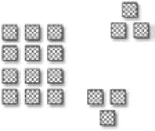

图 5.1：格式塔邻近性原理

+   **相似性**：与邻近性一样，当物体看起来相似时，我们在心里将它们分组。这可能是形状、大小或颜色的相似。在*图 5.2*中，你的大脑倾向于将深色方块分组在一起，即使它们并不立即相邻：

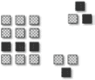

图 5.2：格式塔相似性原理

以另一个例子来说，在网站上调整图标或按钮的大小，可以给人一种相关功能的感觉，并允许用户构建一个心理模型，即“看起来像这样的东西是按钮，我可以点击它们”，这有助于使网站更易用。

注意

**心智模型**是一个常用术语，指的是用户在他们心中形成的理解——无论是对是错——关于他们正在看什么以及他们正在做什么。用户在使用应用程序或网站时，会建立起关于它做什么、如何做、为什么以及预期行动结果的心智模型。我们的任务是确保用户建立的心智模型通过图形设计原则与现实相符。

+   **封闭性**: 我们的大脑倾向于填补缺失的信息以形成一个完整的图像。当我们观察视觉元素的复杂排列时，这一点就会发挥作用。我们的思维倾向于从它们中感知到一个单一、可识别的图案。在*图 5.3*中的例子中，尽管线条断裂，你的思维仍然感知到一个五边形：


图 5.3: 格式塔封闭性原则

这可能完全正常，甚至可能是所希望的，但它有时会导致混淆，因此你必须在设计中小心避免这种情况，除非这正是你想要的。

+   **封装**: 封装原则描述了人类视觉感知将元素组合在一起形成整体的倾向，尤其是在它们被某种类型的边界包围时，即使它们在其他方面是分离的。当我们看到一组由实线边界或甚至只是轮廓包围的元素时，我们会将它们视为一个单一的、统一的群体，几乎就像一个离散的形状，而不管它们的物理位置如何。*图 5.4*中的例子会让你的大脑潜意识地将大正方形内的三个小正方形组合在一起，尽管它们并不相邻：

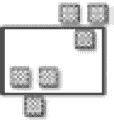

图 5.4: 格式塔封装性原则

+   **连续性**: 我们的眼睛会跟随路径、线条或曲线，通常更喜欢看到它们沿着既定的方向继续，而不是突然改变。这个原则在引导用户注意力的特定方向上非常有用！在*图 5.5*中，你的思维在某种程度上得到了安慰，因为你潜意识地期望随着你向下移动，盒子会变大，正如它们所做的那样：

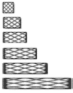

图 5.5: 格式塔连续性原则

例如，以我们之前工作过的注册页面为例，所有输入字段都垂直排列在页面下方，形成一条单线。用户的眼睛可以轻松地跟随这条线。如果其中一个字段突然对齐到页面的右侧，这可能会对用户造成干扰，而且从视觉上看可能也不会很好。

+   **图与底**：我们本能地将物体感知为前景（图）或背景（底）。这有助于设计师强调某些元素，但你必须确保你在正确的时间强调正确的元素，否则可能会让用户感到困惑。*图 5.6* 展示了一个例子，说明你的大脑倾向于将大矩形内部的盒子视为比外部的盒子更“突出”，即使你并没有有意识地意识到这一点：

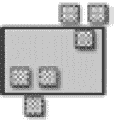

图 5.6：格式塔图与底原则

+   **连接性**：通过统一视觉属性（如线条或颜色）连接的元素被视为比未连接的元素更相关。这在网络上通常作为分组框实现——围绕元素的小标题周围的框。在 *图 5.7* 中，两个连接组中形状的不同并不阻止你的大脑认为它们是连接的：

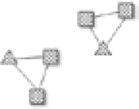

图 5.7：格式塔连接性原则

+   **共同命运**：朝同一方向移动的元素被视为相关或分组。例如，协同移动的动画可以表明它们是同一动作或概念的组成部分，或者即使元素以杂乱无章的方式移动或对齐，它们在我们看来仍然似乎被分组。*图 5.8* 展示了你的大脑将顶部的盒子视为连续线的一部分，而底部的盒子作为另一条连续线的一部分，尽管它们在空间或对齐上并不一致，但这是因为它们似乎以一致的方向或向共同命运移动：

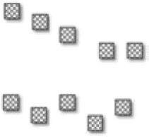

图 5.8：格式塔共同命运原则

这些原则帮助设计师——以及我们这些网页开发者——创建易于用户理解和处理的视觉设计。通过了解人类如何自然地分组和分离视觉信息，我们可以创建更有效、直观和和谐的图形设计布局，对我们来说这意味着网站。

屏幕上的元素看起来很好，并且根据图形设计原则组织得很好，这些都是用户能够有效使用你的网站的因素，但还有更多。现在让我们进入用户体验（UX）的领域！

# 确保它不仅看起来很好，而且对每个人来说都工作得很好——用户体验（UX）

在上一节中，我们简要讨论了图形设计，并提到图形设计在所谓的用户体验（UX）中扮演着一定的角色。现在让我们更详细地探讨这个话题。

UX 指的是人与产品、系统或服务互动的整体体验，特别是在使用过程中的易用性和愉悦性。它关注他们对产品的感知，最终目标是让他们在使用你生产的产品之前、使用过程中以及使用之后都感到满意。

UX 是一个迭代的过程，在这个过程中，你研究、规划、测试，然后根据每次迭代的结果，改进人们与产品互动的各种接触点，试图逐步接近那些目标。这并非关于猜测；它往往非常科学。你可以猜测哪些产品特性会让用户感到高兴，但这些猜测——应该基于研究——只是起点。然后你需要将产品展示给人们，观察他们如何与之互动，获取他们的反馈，然后根据这些反馈调整产品。

UX 并非仅仅是网页开发或计算机相关的事物。实际上，关于 UX 最著名的书籍之一，唐·诺曼的《日常事物的设计》，几乎完全没有提到计算机，更不用说网站了——它更多地讨论了茶壶和汽车上的转向信号！这是因为 UX 适用于人类与任何技术或更广泛地说，任何物体互动的方式。但是，在数字设计的具体背景下，UX 专注于用户在网站或应用程序中的旅程。因此，让我们更深入地探讨这个话题。

## UX 的关键概念

这里是一些构成 UX 的关键概念：

+   **可用性**：这关乎界面的用户友好性和直观性。它包括诸如学习容易程度（用户是否能够在不阅读文档的情况下发现应用程序的工作方式？）、使用效率（用户能否以最少的步骤完成任务？）、记忆度、错误频率、严重程度以及他们从错误中恢复的容易程度，以及整体用户满意度。

+   **交互设计**：这涉及到设计交互式数字产品、环境、系统和服务。它关乎创建具有深思熟虑行为的界面。你绝对不希望在任何软件产品中让用户感到惊讶。如果他们点击按钮，按钮会做什么应该是显而易见的；他们不应该需要猜测。交互设计在很大程度上定义了这一概念。

+   **用户研究**：通过调查、访谈和可用性测试（通常，你会实际观察用户如何与你的网站互动，寻找他们是否在导航时感到沮丧等问题）等方法了解用户的需求、动机和行为。这项研究为设计决策提供信息，尤其是在你迭代设计时。

+   **信息架构（IA）**：这是关于有效且可持续地构建、组织和标记内容。良好的信息架构有助于用户找到信息并完成任务。信息架构的一个常见工具是**卡片分类**练习。假设您有一个网站需要涵盖的几个主题，其中一些是其他主题的子主题。为了组织这些，您可能会在每个主题上写一个实际的卡片，然后将顶级主题排成一行，然后将子主题放在它们下面。

+   **内容策略**：这涉及到规划、创建、交付和管理内容。内容应该对用户相关且有用，您应该尽量减少可能只是混淆他们或阻碍他们的无关内容。在图形设计中，负空间的概念很重要，即知道何时不在屏幕上放置某些内容。有时空白空间是有价值的，但同样，当信息不会帮助用户实现主要目标时，不提供信息也可能有价值。苹果公司是这方面的绝佳例子：它倾向于最小化用户可用的选项。这可能会让一些高级用户感到沮丧，但对于典型用户来说，这实际上有助于他们，因为通过不过度加载选项来避免**分析瘫痪**的现象。这不仅适用于选项，也适用于信息。

+   **用户反馈**：持续收集用户反馈对于用户体验的迭代改进至关重要。当然，在最初设计和构建网站时，获取反馈以便在过程中进行更改是有帮助的。然而，在网站上线后，寻求用户反馈不应停止。总有改进的空间，但您不应盲目行事。听取用户的意见是获取您需要的信息以基于数据进行改进的好方法。用户反馈可以是直接的——例如用户可以填写的调查——或者间接的——例如通过查看有关用户点击帮助链接频率等指标的度量。如果您发现每个访问您网站的用户都在寻找帮助，或者更糟糕的是，在做一些有意义的事情之前就放弃了网站，那么这种反馈可能是在告诉您，您的网站可能不像您想象的那么易于使用。因此，分析和性能数据是这一方面的一个方面。

+   **原型设计和线框图**：这些是用户体验设计中的基本工具。原型设计是指创建产品的初步模型，这可能是一个低保真草图或一个高保真交互模型。线框图是基本的布局，概述了网页或应用中页面元素、功能和导航的大小和位置。我们在第一章中讨论了这一点，但在这里再次提及是为了理解它与用户体验的关系。这些是您对整体设计的早期“猜测”，您希望尽可能早地向用户展示，以便开始必要的迭代。

+   **用户画像**：这些是为了代表可能使用服务、产品、网站或品牌的不同用户类型而创建的虚构人物。用户画像帮助设计师和开发者了解用户的需求、体验、行为和目标。用户画像是什么样的？以下是一个例子：

    ```js
    Persona 1: Mike, a small business owner
    Name: Mike Nelson
    Occupation: Owner of a coffee shop
    Demographics: 27 years old, lives in San Francisco. Married with two children, 3 and 6\. Has a generally middle-class income level. Opened the shop 2 years ago after getting married.
    Mike's Story: Mike was working at a large financial firm, but felt he didn't have enough free time for things important to him, including starting a family. So, he decided to quit his job and use his accumulated savings to open the shop. While some consider it silly, owning a coffee shop had been his dream since his college days (probably owing to how much time he spent in coffee shops during those years!)
    Mike's Challenges: Mike has poor accounting skills and is having difficulty keeping the company's books. In fact, even relatively simple questions like how much net profit he has every month are difficult for him to determine. He is spending too much time on these difficulties.
    What Mike Needs: Mike is looking for a product – in the form of a web-based application – that can handle the analysis of his income and expenditures and can automatically supply the information he needs. He would like to see things categorized so he knows, for example, how much he is spending on coffee grounds versus filters.
    ```

    使用这样的用户画像，可以做出设计决策来解决客户面临的挑战。例如，基于迈克的挑战，我们可能希望创建尽可能少地展示信息的设计，以防止迈克感到不知所措。此外，考虑到他的需求，我们开始了解界面将是什么样子；在这种情况下，我们很可能需要一些视觉隐喻来展示信息类别，可能每个类别都有一个标签，或者可能是可以展开和折叠的各个部分。

+   **旅程映射**：这涉及到创建用户与产品交互的视觉表示。它有助于理解和解决用户在整个旅程中的需求和痛点。与卡片分类一样，这通常以大版图上的纸张形式出现，使用绳子和图钉。这些纸张上可能有手绘的各种屏幕草图，然后绳子显示用户如何从一个屏幕或功能移动到下一个。当然，这不必采取这种形式——有些人更喜欢在图形或流程图程序中工作，并全部数字化处理——但低保真方法通常用于速度和确保你不会专注于任何技术方面。这里的关注点不应考虑技术，至少不应超过绝对必要的程度。你专注于逻辑流程，不再关注其他。

+   **跨平台一致性**：确保在各种平台和设备上提供一致的用户体验，这包括保持功能和设计的统一性。换句话说，你通常希望网站在 Windows 机器上和在 Mac 机器上看起来一样，而且通常不希望桌面机器上有的功能在手机上没有（当然，该功能的形态可能会有所不同）。当然，有时会有例外——有些时候，让事物在一个平台上看起来或功能上与另一个平台不同是有意义的——但它们往往只是例外。

+   **情境设计**：这是基于对用户在实际环境中如何与产品互动的理解来进行设计。这通常涉及观察用户如何真正使用你的产品，而不是在实验室环境中，因为有时会有你之前没有意识到的考虑因素。举一个例子，你可能会发现你的工厂控制系统用户必须戴着笨重的手套使用你的系统。这可能会影响你的设计，需要屏幕上的按钮比通常要大得多，以便更容易点击。如果没有在他们的自然环境中观察他们，你就不会知道这一点（这意味着在开始设计任何东西之前进行这项研究是有帮助的）。

+   **可用性测试**：定期与真实用户进行测试，以获取对设计和功能性的反馈，这对于迭代设计过程至关重要。你永远不希望假设你的设计是完美的；你希望尽可能多地测试这些假设，并根据你发现的内容进行修改。有许多形式的可用性测试：

    +   在测试你的设计时，将摄像头对准用户。

    +   在一个可用性实验室中设置，可以观察用户的行为，例如通过眼动追踪（以确定用户实际看什么以及他们注视什么）以及其他观察他们在行动中的表现。

    +   进行用户访谈，你只需与用户坐在一起，询问他们关于其体验的问题（有时在他们玩你的网站时进行；有时在之后进行）。调查和焦点小组也可以考虑在这里。

    还有其他几种形式，每种都有不同的目标和重点，但所有这些都有一个共同的目标，即验证你的设计决策是否符合真实的用户体验。

+   **设计思维**：一种涉及与用户共情、定义问题、构思解决方案、原型设计和测试的问题解决方法。作为设计师，很容易基于你喜欢的和认为最优的东西做出决定，但这并不总是对用户最好的。研究和测试在这个过程中扮演着重要角色，但还涉及到更大的思维模式。你必须克服做出假设和基于自己思考做出决定的冲动。最终，一切都是为了用户，这就是“以用户为中心的设计”这个术语的由来。用户是重点；他们是中心，你所做的一切都应该基于他们。

+   **伦理和隐私**：在设计时考虑伦理影响和隐私问题，尤其是在处理用户数据时。这可以有多种形式，但一个例子是简单地隐藏密码。你肯定见过当你在输入密码时，只有星号出现。这样做是为了防止有人站在你身后看到你的密码。这是一个简单的小例子，但它表明设计在隐私方面发挥着作用。

+   **交互动画**：微妙的动画可以通过提供反馈、展示因果关系，并为交互添加一层光泽和专业性来改善用户体验。我们在图形设计部分讨论了这一点，但鉴于它与可用性的关系，值得单独指出，因为动画可能是一个有争议的话题。过多的动画实际上会令用户烦恼和沮丧，甚至可能让他们感到恶心，而太少的动画则往往会导致设计不如使用恰到好处的动画那样令人愉悦。考虑到所有这些，这就是为什么使用动画来反映交互如此重要，以至于它成为一个关键主题。

+   **视觉设计**：尽管与 UX 不同，视觉设计（事物看起来如何）会影响 UX。它包括字体、配色方案和布局。实际上，这意味着与图形设计相同，但值得注意这个术语，因为你可能会在各个时候听到它。

将这些 UX 方面融入你的工作中可以极大地提高你开发或设计的软件产品的质量和用户满意度。在你作为网络开发者的角色中，将 UX 原则融入你的开发流程可以显著提高最终产品的有效性、效率和用户满意度。

虽然在某些组织中，可能会有一个完全独立的团队负责用户体验（UX），但这并不总是如此，即使如此，作为一个开发者，你对这些概念有所了解也是非常合理的，至少可以更好地与这样的独立团队进行接口。

如果你只从所有这些中记住一件事，那就让它成为：用户是这一切的核心！你必须基于他们的需求、他们的愿望以及让他们快乐的因素来做出设计决策。而且你需要基于良好的研究和测试来做出这些决策，而不是基于假设。

另一个在 UX 中扮演角色的主题是可访问性。

## 考虑可访问性

在某种程度上，可访问性是 UX 的另一个方面，但它是一个足够大的问题，可以成为一个单独的主题。

在数字设计的背景下，**可访问性**指的是使你的网站和应用尽可能由尽可能多的人使用，包括那些有残疾的人的做法。这包括广泛的情况，包括视觉、听觉、身体、言语、认知、语言、学习和神经系统的残疾。

这里有一些需要考虑的关键点：

+   **网络内容可访问性指南（WCAG）**：这是由**万维网联盟（W3C）**（[`www.w3.org/WAI/standards-guidelines/wcag`](https://www.w3.org/WAI/standards-guidelines/wcag)）发布的一系列网络可访问性指南的一部分，包括一系列使网络内容更具可访问性的建议。它们包括许多你可以遵循的点，以帮助使你的网站对具有不同需求的各个用户群体更加可访问。

+   ``. Someone who is blind and is using a screen reader will have the alt text read out to them, providing a description of the logo.

+   **键盘导航**：确保网站上的所有交互元素都可以通过键盘控制来访问和使用，这对于无法使用鼠标的用户至关重要。这通常很容易实现，在很大程度上是自动完成的，多亏了网络浏览器。然而，你需要记住的是相对简单的事情，比如表单中元素的顺序。除非你做错了什么，否则 HTML 表单应该默认可以通过键盘导航。但如果你没有将表单的元素按照逻辑顺序排列，可能会使得大多数用户需要通过键盘访问的元素变得更加困难。例如，在一个需要输入个人姓名的注册表单中，你很可能不希望将姓氏放在表单的末尾，中间有 10 个其他字段，而姓氏字段在顶部。

+   **视觉设计**：这包括考虑颜色对比以帮助色盲或视觉障碍用户，以及确保文本大小和间距可调整。其中一些又因为网络浏览器而免费提供，除非你编写了阻碍的糟糕代码。但也有一些设计元素发挥作用——比如使用与背景颜色搭配良好的颜色来显示文本，仅举一个简单的例子。

+   **字幕和文本脚本**：为视频内容提供字幕，为音频内容提供文本脚本，对于听力受损或听力障碍的用户至关重要。

+   **一致的导航**：在整个网站上保持导航的一致性，有助于认知障碍用户更好地理解和交互内容。当然，这对没有残疾的用户也是有益的，尽管区别在于，有残疾的人可能无法使用你的网站，而没有残疾的人可能只是不喜欢使用你的网站。前者更糟糕，但后者也不见得更好！

+   **错误识别和说明**：确保错误被清楚地识别，并提供说明以帮助用户理解如何完成任务，例如填写表格。首先，你绝对不希望冒犯你的用户，所以像错误消息的措辞这样的简单事情是一个因素。例如，写“需要输入名字”可能比“你没有输入名字”更好。但不仅如此，你还想确保你的错误消息和说明尽可能简洁地清楚地描述需要做什么。这比听起来要难，而且良好的用户研究在这里非常有帮助。

+   **法律合规性**：在许多地区，存在关于数字可访问性的法律要求，例如美国的**美国残疾人法案**（ADA）。这意味着我们在这里讨论的不仅仅是好的；在许多情况下，它是法律上**必要**的。

将可访问性融入你的软件开发和设计流程不仅扩大了你的用户群，而且反映了你对包容性和法律合规性的承诺。作为一名软件开发者/架构师，从项目一开始就考虑可访问性可以显著提高你应用程序的可用性和覆盖范围。

在用户体验的背景下，我想讨论的最后一个话题是，它经常与为移动设备设计（尽管不是唯一）相关，那就是响应式设计。

## 与响应式设计一起弯曲

另一个与用户体验相关但通常被视为一个独立概念的话题是响应式设计。今天，在全球范围内，人们通过手机等移动设备访问网站的人数往往比坐在办公桌前的大型显示器上的台式电脑要多。因此，采取以移动设备为先的设计策略通常是一个好主意——也就是说，设计你的网站使其在小尺寸设备上看起来和工作得很好，然后**再**增强其在更大屏幕上的表现。这就是响应式设计发挥作用的地方。

**响应式设计**是一种网站设计方法，其目标是创建提供最佳观看体验的网站，这意味着它易于阅读和导航，最小化调整大小、平移和滚动，适用于从大型台式电脑显示器到小型手机的广泛设备。虽然有一些特定的技术组件，但它更多地关乎基本方法，甚至是一种心态。它基于这样一个事实：如今，世界上很大一部分人口使用的是较小的移动设备来访问互联网，而不是通常配备大屏幕的台式电脑。

响应式设计的关键方面包括以下内容：

+   **流动网格**：网站的布局可以使用称为灵活网格的 CSS 结构。它们会自动适应观看者的屏幕大小，根据需要重新排列内容或重新排列。这也意味着，而不是设计固定宽度的布局，页面上的元素尺寸使用相对单位，如百分比，而不是绝对单位，如像素。

+   **灵活的图片**：响应式设计中的图片也是流动的。它们的尺寸使用相对单位来防止它们超出其包含元素显示。这确保了图片不会突然占据屏幕的大量空间，从而将更重要的内容推离原位。

+   **媒体查询**：CSS 媒体查询允许页面根据设备的特征使用不同的 CSS 样式规则，最常见的是浏览器的宽度。我很快会给出一个例子。

+   **从移动端开始设计**：这里的理念是您应该首先为小屏幕设计，然后根据需要添加更多功能和内容以适应大屏幕。这确保了从开始就为移动用户提供可访问性。

+   **断点**：在响应式设计中，断点用于定义网站布局应如何改变以适应不同的屏幕尺寸。常见的断点设置为适用于移动设备、平板电脑和桌面宽度。断点和媒体查询通常一起工作，断点通常部分通过媒体查询实现。

+   对于文本大小，使用`em`或`rem`，这些是 CSS 中可用的替代单位（例如，与`px`和`pt`相比——CSS 中有许多单位可用于更高级的使用场景）。

+   **触摸与鼠标**：开发者应该意识到，一些用户将使用以触摸为主要交互方式的设备——例如智能手机——而桌面电脑更常使用鼠标。触摸交互有不同的需求，与鼠标交互不同。一个常见的例子是，按钮通常需要更大，以便于触摸交互。

+   **性能优化**：响应式网站需要在具有不同能力和连接速度的各种设备上加载。虽然许多用户将拥有现代、高性能的智能手机，但这并不总是如此。有些人可能拥有性能不足的设备，运行速度较慢。因此，优化图像、最小化 CSS 和 JS（通过各种工具减小其大小）以及利用如懒加载等技术（即图像和其他内容只有在用户滚动到足够远的位置以便它们可见时才加载），可以帮助提高所有用户的性能，尤其是那些使用较弱设备的用户。

+   **测试**：响应式设计必须在多个设备和浏览器上测试，以确保兼容性和可用性。这可能包括物理设备测试、模拟器和可以同时模拟许多不同设备和配置的在线网站。

在用户期望无论在手机、平板电脑、笔记本电脑还是桌面上都能获得无缝体验的网页环境中，响应式设计至关重要。对于网页开发者来说，理解响应式设计的原则对于创建在所有设备上都易于访问和用户友好的网络应用程序至关重要。

### 展示响应式设计

为了在非常简单的层面上展示响应式设计，请看这个 HTML 页面：

```js
<html>
  <head>
    <title>Simple Responsive Design Example</title>
    <style>
      .container {
        display: grid;
        grid-template-columns: repeat(3, 1fr);
        gap: 10px;
      }
      @media (max-width: 600px) {
        .container { grid-template-columns: 1fr; }
      }
    </style>
  </head>
  <body>
    <div class="container">
      <div style="background-color:#b0b0b0;">Column 1</div>
      <div style="background-color:#b0b0b0;">Column 2</div>
      <div style="background-color:#b0b0b0;">Column 3</div>
    </div>
  </body>
</html>
```

为了分解这个过程，让我们首先看看`<body>`内容。正如您所看到的，它是一个包含在单个`<div>`元素内的三个`<div>`元素。外部的`<div>`元素被分配了`container`样式类，而所有三个内部的`<div>`元素都有一个内联样式，以赋予它们灰色背景颜色。

我们在这里做的是构建一个包含三个内容框的页面。也许第一个是导航菜单，第二个是主要内容，第三个可能是用于一些广告（因为似乎世界上每个网站今天都必须有广告，不幸的是！）这是一个相当典型的网站布局。

现在，在大型屏幕上，我们希望将此内容以三列的形式显示，如图*图 5.9*所示：

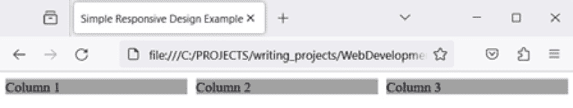

图 5.9：我们的网页以三列布局

然而，在较小的设备上（特别是宽度小于 600 像素的屏幕上），我们希望此内容可以包裹，使得所有三个框“堆叠”在一起，如图*图 5.10*所示：

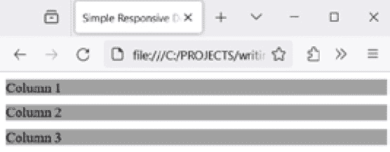

图 5.10：我们的网页，现在“堆叠”使得框实际上变成了行

当你在大型屏幕上调整浏览器窗口大小时，这也会发生。当你使窗口变小时，内容应自动重新布局，如图*图 5.10*所示，我鼓励你现在实际操作一下，看看会发生什么。

是 CSS 负责这种内容的重新排列，所以现在让我们来看看。

首先，我们有`container`类定义，它应用于我们的`<div>`元素。这使用了一个名为`display`的 CSS 特性来`grid`，告诉浏览器这个`<div>`元素内的内容应该以网格形式布局，这意味着我们将在其中有一些行和列。设置`grid-template-columns`指定我们想要列，而`repeat(3, 1fr)`值指定我们想要三个大小相等的列。`repeat()`语句允许我们指定多个元素的风格，而`fr`单位是一个灵活的单位，允许我们定义每个列占总可用空间的多少。所以`1fr`意味着将有三个列，每个列应该获得总空间的一个相等部分，因此浏览器将在它们之间平均分配空间。最后，`gap`属性简单地告诉浏览器在列之间放置多少空间，如果有。总的来说，这定义了我们想要我们的三个框默认使用的网格布局。

这是响应式方程的第一部分。第二部分是`@media`语句，它是一个`max-width`部分。换句话说，这个媒体查询内的样式只会在浏览器窗口宽度小于`600`像素时应用。这意味着我们定义了一个`600`像素的宽度：我们希望页面的布局——更具体地说——`<div>`容器——在我们达到`600`像素宽时改变。

在 600 像素以下，应用于`<div>`容器的样式会覆盖`container`类本身定义的`grid-template-columns`值，将其设置为`1fr`。由于这次没有使用`repeat()`，我们将只得到一个列，而`1fr`现在意味着总空间中的一份应该分配给它，但由于只有一个列，所有空间都被它占用，这导致盒子内部相互包裹。

你可以定义尽可能多的断点，并且你可以使用媒体查询根据其他条件应用样式，但谈到响应式设计，几乎总是要使用这样的宽度。

## 渐进增强的进展

网站是否可访问还可能受到超出你控制范围的因素影响，例如浏览器的功能甚至用户的连接性。我们讨论过，如今许多用户使用手机等小型设备来访问网站，这有时意味着浏览器功能较弱。即使浏览器功能齐全，想象一下用户在乘坐火车时尝试访问网站的场景。在这种情况下，他们的连接速度可能比在家时慢得多，而且可能也不稳定。

这种类型的担忧正是被称为**渐进增强**的网页开发方法发挥作用的地方。这是这样一个理论：你应该从一个骨架设计开始，然后在根据连接速度和浏览器功能等因素访问时对其进行增强。

一个简单的例子可能从以下简单的标记开始：

```js
<html>
  <head>
    <title>Progressive Example</title>
  </head>
  <body>
    <form action="/handleForm" method="post" id="myForm">
      Email: <input type="text" id="email" name="email">
      <button type="submit">Subscribe</button>
    </form>
    <div id="myDiv" style="color:red;"></div>
  </body>
</html>
```

这是一个完整、功能性的——尽管非常简单——网站，可能允许用户订阅你的通讯。它几乎在任何设备上的任何浏览器上都能正常工作。然而，如果我们想确保电子邮件地址是有效的形式呢？这用 JS 很容易做到，但如果浏览器根本不支持 JS 或者用户禁用了它怎么办？我们需要确保页面即使在没有 JS 的情况下也能工作，但在 JS 可用时工作得更好。这正是渐进增强发挥作用的地方（这是`ch-5`目录中的`progressive.html`文件）：

```js
<html>
  <head>
    <title>Progressive Example</title>
  </head>
  <body>
    <form action="/handleForm" method="post" id="myForm">
      Email: <input type="text" id="email" name="email">
      <button type="submit">Subscribe</button>
    </form>
    <div id="myDiv" style="color:red;"></div>
  </body>
  <script>
    document.getElementById("myForm").addEventListener("submit", function(event) {
      const email = document.getElementById("email").value;
      if (!email.includes("@")) {
        document.getElementById("myDiv").innerHTML = "Email must contain @";
        event.preventDefault();
      }
    });
  </script>
</html>
```

现在，当页面完全加载时，`<script>`块会执行。在其中，我们通过`document.getElementById()`获取表单的引用，然后对返回的 DOM 节点调用`addEventListener()`。这为表单的`submit`事件添加了一个事件监听函数，当用户点击`email`字段时触发。然后它会检查是否包含`@`符号。虽然这绝对不是对电子邮件地址有效性的完整测试，但对于这个简单的例子来说已经足够好了。如果没有`@`符号，那么在`myDiv` `<div>`元素中会显示错误消息。最后，调用`event.preventDefault()`阻止表单提交（传递给函数的`event`对象包含函数被调用的所有事件信息——在这个例子中是表单提交，并提供了一些与之交互的函数，包括`preventDefault()`函数来终止默认操作，在这个例子中就是将表单发送到服务器）。

这是一件好事，因为当你可以在不涉及服务器的情况下在浏览器中捕获像这样的简单错误时，这是一种更有效的方法。但是，由于浏览器会忽略它们不理解的内容，包括如果 JS 不可用时的`<script>`块，所以它存在是没有害处的。如果 JS 不可用，那么你仍然有一个功能性的表单（并且假设电子邮件地址将在服务器上进行有效性检查）。但是当 JS 可用时，页面会增强以在浏览器中进行电子邮件地址验证。这就是渐进增强的基本理念。

响应式设计实际上是一种渐进增强的形式，因为显示可以根据屏幕大小进行变化，为所有用户提供功能。响应式设计和渐进增强都涉及到可访问性，因为可访问性的基本理念就是使网站可访问。如果表单提交*依赖于*JS 的运行，那么当 JS 不可用时，页面就会损坏，因此这些用户无法访问。通过渐进增强，我们确保一切大致以相同的方式工作。

渐进增强的理念也引出了另一个被称为**渐进式 Web 应用**（**PWAs**）的概念，这正是我们现在要讨论的内容。

## PWAs

到目前为止讨论的所有想法都引出了一个最终的前端主题：**PWAs**。

PWAs 是一种通过使用常见的 Web 技术（如 HTML、CSS 和 JS，这些技术可能或可能不使用各种库，你将在下一章中探索它们）来编写更高级的网站——实际上是 Web 应用的方式。它们旨在在任何使用标准兼容 Web 浏览器的平台上运行。PWAs 具有几个定义性的特性和优势：

+   **响应式**：PWAs 应适应任何形态，无论是桌面、移动、平板，还是尚未开发或处于早期阶段的设备（比如虚拟现实设备？）

+   **渐进式增强**：应用程序的核心功能应该适用于所有用户，无论他们的浏览器和操作系统功能如何，但随后使用渐进式增强为功能更强大的平台上的用户提供更好的体验。

+   **连接独立性**：使用一个名为**服务工作者**的特殊 JS 代码片段，PWA 即使在用户离线时也能工作。这是通过在客户端存储资源（HTML、CSS、JS、图片等）并在用户无法连接到网络时使用这些存储的版本（称为**缓存**）来实现的。

+   **类似应用的体验**：PWA（渐进式 Web 应用）常常给人一种更像桌面应用（我们称之为原生应用）而不是网站的感觉。这主要是因为像操作系统生成的其他警报一样出现的警报、能够使用通常在网站上无法使用的硬件设备，以及更复杂的交互（例如多窗口）等因素。

+   **新鲜感**：虽然服务工作者允许离线访问，但它们还提供了一种机制，在在线时更新那些缓存的资源。这确保了 PWA 拥有最新的代码，因此对用户来说看起来是*新鲜的*。

+   **安全性**：PWA 只能通过 HTTPS 连接提供服务。这防止了窃听并确保内容未被篡改。

+   **可发现性**：由于在构建 PWA 时必须提供一些特殊的配置文件，因此浏览器和操作系统将它们识别为应用程序，而不仅仅是网站。这正是它们能够被安装的原因。

+   **可安装性**：用户可以在他们的手机主屏幕上添加应用程序，或者在 PC 或 Mac 的桌面/开始菜单上添加，而无需通过应用商店。只需像访问任何其他网站一样访问一个 URL，只要网站提供一些必要的组件（服务工作者和一个名为清单文件的配置文件，主要是），浏览器和操作系统就会将其视为可安装的应用程序，就像你可能安装的任何其他应用程序一样。

+   **可链接性**：由于 PWA 本质上仍然是一个网站——只是功能更强大——这意味着它可以通过 URL 轻松共享，无需复杂的安装。通常，访问设置为 PWA 的网站将触发一个请求，询问你是否想要安装它。之后，它看起来就像你手机或电脑上安装的任何其他应用程序一样。

对于软件开发者来说，构建 PWA 涉及创建一个响应式 Web 应用程序，该应用程序包括一个清单文件和一个服务工作者——清单文件向浏览器提供有关应用程序的信息（例如名称、作者、图标和描述），而服务工作者通过缓存和更新资源来启用推送通知、后台数据同步和离线功能等特性。PWA 弥合了 Web 应用和原生应用之间的差距，提供了原生应用的 UX 和功能，以及 Web 的覆盖范围和可访问性。

构建一个 PWA（渐进式 Web 应用）并不复杂，但它确实涉及一些可能很棘手的步骤，尤其是在处理仅需要通过 HTTPS 工作的需求时。正因为如此，我这里不会演示如何构建一个，因为这绝对是一个更高级的话题。虽然 PWA 在当今相当流行，但它们并不被普遍支持，也不是你绝对需要知道的东西。实际上，你可能根本不需要构建一个。如果你需要，那么本节应该已经为你理解基础知识奠定了基础，你可以在需要的时候再进行探索。

所以，是的——确保你的网站看起来不错，遵循良好的用户体验（UX）实践，以便对用户来说功能齐全，这一点非常重要。实现响应式设计通常是其中的一部分，使用渐进式概念也可以为用户提供更高效的使用体验。PWA（渐进式 Web 应用）是之后的另一个潜在层次。

但如果你没有将你的网站放在那些用户可以访问的地方，那么这一切都不会很重要。虽然这可以简单到将你的代码放在一个物理服务器上，但在当今这个时代，这并不一定是最好的答案。而且，不管怎样，这绝对不是*唯一*的答案。沿着这个思路，另一个在部署网站时起到作用的观念是虚拟化，通过虚拟机（VMs）和容器来实现，这正是接下来要讨论的主题！

# 虚拟化世界——虚拟机和容器

在上一章中，你通过一些在线 Linux 沙盒（你*确实*做了那件事，对吧？）对 Linux 进行了一些操作。你是否停下来想过这些网站是如何做到这一点的？你实际上是在登录一个运行 Linux 的机器，但肯定不可能为每个可能同时进行相同操作的用户都有一个物理服务器，对吧？很可能答案是否定的。相反，他们最可能使用虚拟机或容器来实现这一神奇的功能。

**虚拟机（VMs）和容器**是两种不同但相关的技术，用于创建高效、隔离的应用程序运行环境。它们都有相同的基本目标，即虚拟化一个环境。

但“虚拟化”是什么意思？为了解释这一点，你必须考虑计算机通常是如何工作的。

通常，你有一些硬件——显然，像主板、CPU、内存、各种用于组件之间通信的总线等。这些都是物理的东西——电子和所有这些。

然后，在硬件之上，你有一个操作系统或 OS。它可能是 Windows，也可能是 Linux，或者可能是 macOS 等等。敏锐的读者可能会意识到还有一个叫做*固件*的东西，这是一种永久嵌入在硬件中的软件。你可以把它看作是硬件的一部分，因为这就是它所在的地方。大部分情况下，它是硬件加上以操作系统形式存在的软件，当然，然后是所有在之上运行的应用程序，这又是更多的软件。

现在，**虚拟化**本质上意味着将所有这些——硬件、软件/固件，所有的一切——都在计算机中模拟出来。通过一些非常巧妙的编码，我们可以在软件中模拟出一个计算机，甚至可以模拟到硬件层面。这种工作原理远远超出了本书的范围，但幸运的是，这实际上并不重要！我们只需简单地为此魔法存在而感到高兴。

这种做法的好处，可能也是最大的好处，就是这种虚拟化计算机——它与运行它的计算机（通常称为*宿主*）完全分离。如果你在宿主机上创建一个文件，通常情况下，它无法从运行在虚拟机上的计算机中访问，反之亦然。如果你在虚拟机上安装了一些软件，它对宿主机没有任何影响。这实际上就像你有两台不同的计算机；它们彼此隔离。

虚拟化这种计算机的方式不止一种，其中两种最常见的是虚拟机和容器。它们都力求实现相同的基本目标——在另一个计算机内部模拟计算机——但它们在方法和架构上存在显著差异。现在让我们来谈谈这两种，看看它们如何比较和不同，以及为什么我们可能选择其中一种而不是另一种。

## 理解虚拟机（VMs）

虚拟机正是我刚才描述的。从架构上看，虚拟机不仅包括应用程序和提供用户可能需要的功能的必要二进制文件和库，还包括一个完整的操作系统，我们通常称之为*客户机*。

虚拟机运行在物理服务器上，并由**虚拟化程序**（如 VMware 的 ESXi、Microsoft 的 Hyper-V 或 Oracle 的 VirtualBox）管理。虚拟化程序实际上是一个管理虚拟机的程序，管理诸如它们对底层物理硬件的访问等问题。由于一个物理机上可以运行多个虚拟机，并且这些机器在某种程度上需要使用和共享真实的物理硬件，因此虚拟化程序管理这种共享并确保没有冲突。

虚拟机非常适合运行需要完整操作系统（OS）的应用程序，确保完全隔离，或者在不同类型的操作系统上运行应用程序。例如，如果你通常使用 Windows 机器，但想尝试 Linux，你可以使用你喜欢的 Linux 版本创建一个虚拟机，它将作为一个独立的窗口出现，正如你可以在*图 5.11*中看到的那样。然后你可以在 Linux 中安装软件，完全独立于你的 Windows 宿主机：

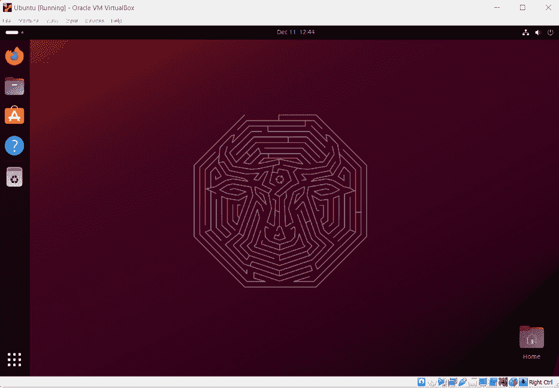

图 5.11：在 Windows 11 上运行在 VirtualBox 虚拟机中的 Ubuntu Linux

虚拟机非常兼容，因此可以运行你喜欢的几乎所有操作系统。实际上，你甚至可以运行那些在你的物理机上不再工作的旧操作系统，这为运行遗留应用程序或需要特定操作系统环境的应用程序提供了解决方案，而你通常不希望将这些应用程序运行在你的计算机上。

每个虚拟机都有自己的虚拟硬件集合（CPU、内存、硬盘等），包括存储设备，实际上是从你的物理存储中划分出来的。这可能导致宿主机上更高的存储需求。例如，如果你的计算机中有一个 500GB 的硬盘，你想要创建一个具有 100GB 硬盘的 Linux 虚拟机，这意味着你将失去 100GB 的物理硬盘空间给虚拟机。

虚拟机由于需要支持独立的操作系统和虚拟硬件配置，因此需要更多的管理开销。记住——你现在实际上要处理不止一台计算机了！当你第一次创建虚拟机时，它是“裸机”的，这意味着它就像一台没有任何东西的物理计算机。然后你必须自己安装操作系统（这意味着你需要为其获取适当的许可证）。稍后，当需要更新时，你需要在你的宿主机上执行这些操作，这还包括你可能需要执行的任何其他操作。这仅仅是需要你进行更多的管理，就像拥有两台物理机器一样。

现在的虚拟机提供了出色的性能，考虑到它们正在模拟一个完整的计算机，甚至到硬件级别，这有点令人惊讶。为了实现这一点，有很多技巧被使用，比如有效共享物理硬件。但不管怎样，在足够强大的宿主机上，你应该只会注意到在客户机上的微小性能差异。事实上，如果你最大化一个虚拟机运行的窗口，你应该会发现很难判断它此时不是物理机器。

现在，让我们在 VirtualBox 中设置一个 Ubuntu Linux 虚拟机，以便进行实验。

## 使用虚拟机

根据本章的*技术要求*部分，你应该已经安装了 VirtualBox，并且应该已经下载了 Ubuntu Linux 的副本。现在，要在 VirtualBox 中设置虚拟机，点击**机器**菜单，然后点击**新建**按钮。你应该会看到一个类似于*图 5.12*所示的对话框，在那里你可以输入一个名称，选择一个文件夹来存储所有虚拟机文件，并选择正确的类型和版本（**Linux**和**Ubuntu**，很可能是 Ubuntu 的 64 位版本）：

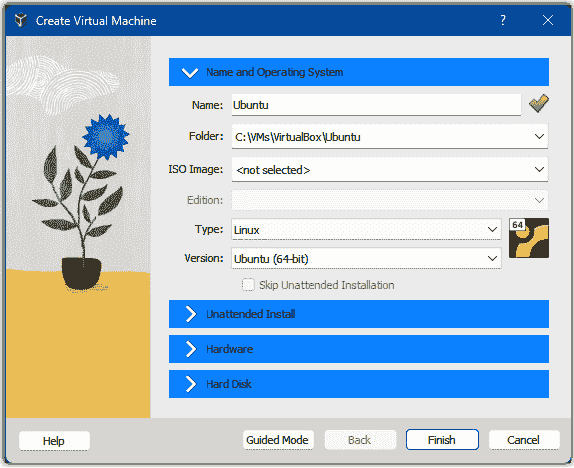

图 5.12：在 VirtualBox 中设置 Ubuntu

然后，你需要告诉 VirtualBox 使用你下载的 VDI 文件。**VDI**代表**虚拟磁盘镜像**，它是一个存储存储设备内容的文件，如硬盘，直到字节级别，因此它是该设备的精确字节复制。为此，点击底部的**硬盘**部分，选择**使用现有的虚拟硬盘文件**，然后点击下拉菜单旁边的图标，该菜单中显示为**空**。然后你会看到*图 5.13*所示的对话框。点击**添加**并添加你之前下载的 VDI 文件。确保它被高亮显示，然后点击**选择**：

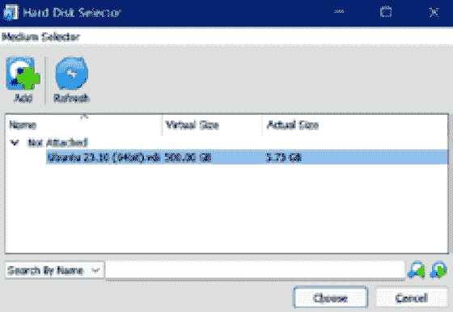

图 5.13：将 VDI 添加到 VirtualBox

那个对话框将会关闭，你将回到*图 5.12*的对话框。那里的所有默认值都应该没问题，所以你可以直接点击**完成**。你现在有一个 Ubuntu 虚拟机了！

现在你只需要点击`osboxes.org`)。当你尝试时，你会意识到，这就像你在那个窗口中连接到了另一台不同的计算机一样，这当然是虚拟机的全部意义。你可以运行各种应用程序并安装新的应用程序——你可以在真实计算机上做的任何事情都可以在这个虚拟机中完成。

正如我之前提到的，虚拟机只是虚拟化猫皮的一种方式。另一种极其流行的方式是容器，所以现在让我们来看看它们。

## 理解容器

容器与虚拟机不同，因为它们不是整个计算机的模拟，尽管你可能会被误导以为它们是。在许多情况下，你可以登录到容器中，并在其中做所有在虚拟机或物理机器上能做的事情。它们通过在宿主操作系统的底层隔离容器内部和宿主外部的内容来实现这一点。

**容器**主要是一个 Linux 设施，因为它们依赖于 Linux 内核中某些底层功能（整个 Linux 操作系统构建在其之上的核心代码）。你也可以在 Windows 上运行容器，但那里实际上是通过使用一个对你来说透明的 Linux 虚拟机来实现的！

但无论如何，容器的基本架构是这样的：容器将应用程序及其依赖项（如库、二进制文件等）打包在一起，但共享宿主系统的操作系统内核。而内核在虚拟机内部是模拟的，而容器使用的是宿主操作系统实际运行的内核。

就像虚拟机一样，容器虽然共享内核和其他系统资源，但它们与宿主操作系统是隔离的。操作系统本身会自动处理这种隔离，所以从我们的用户角度来看，它看起来像是一个虚拟机，而虚拟机当然看起来像一台物理机器。

容器相对于虚拟机有几个优点：

+   首先，因为它们没有模拟整个机器，所以它们明显更快。这在启动时尤为明显。虚拟机必须像真实计算机一样经历完整的操作系统启动周期，而容器则不需要，因此它们几乎可以立即启动。它们还使用较少的宿主资源，因为，再次强调，它们没有模拟整个计算机。

+   其次，容器提供了一个更一致的环境。想想我们之前章节中提到的，能够给开发者一个`package.json`文件，他们可以使用它运行`npm install`来获取应用程序需要的所有依赖项。这确实很方便，但如果他们安装的 Node 版本与您不同怎么办？而且如果那个版本恰好有一个您没有的 bug 怎么办？那个开发者可能会发现，您的项目在他的机器上无法工作，但在您的机器上可以工作。容器通过捆绑您的代码及其依赖项，甚至包括 Node 这样的东西来解决这个问题。如果您给那个开发者一个容器，您就可以确保他们的环境与您的环境匹配，这样您就可以知道您的代码将能够工作。

容器是一个通用的术语，指的是操作系统的功能。但您通常不会直接与这个功能交互，因为它，用温和的话说，不是一个愉快的体验。相反，您几乎肯定会使用某种软件，这种软件是围绕该功能的包装。目前最受欢迎的这种包装软件是 Docker。事实上，它如此受欢迎，以至于人们通常称之为*Docker 容器*而不是仅仅容器。现在让我们就 Docker 下的容器进行一些讨论，并看看它们在实际中的应用！

## 使用容器

为了玩转容器，我们实际上将使用您全新的 Ubuntu 虚拟机（VM）！您看，由于容器需要 Linux，而且我不知道您通常使用什么操作系统，我至少可以确信您在这个时候在 VirtualBox 中运行了 Ubuntu，这样我知道您有一个可用的 Linux 机器，尽管是虚拟的！

在您的虚拟机（VM）内部，您首先需要启动终端应用程序。这将带您进入命令提示符。接下来，您需要使用以下命令安装 Docker：

```js
sudo apt install docker.io
```

当提示确认安装时，请确认，然后根据您的网络连接速度，等待一分钟左右。一旦安装完成，执行以下命令：

```js
sudo docker
```

您将看到帮助文档的提示。现在，您已经准备好启动容器了！

正如讨论编程中的任何看似相关内容时的惯例，我们将从启动一个“Hello, World!”容器开始。幸运的是，Docker Hub，这是一个由 Docker 背后的公司运营的公共镜像仓库网站，恰好有这样一个镜像可供使用！我们可以将镜像拉取到本地机器上，并使用它来创建一个容器，这一切都只需要一个简单的命令：

```js
sudo docker run hello-world
```

继续执行该命令，几秒钟后，您应该会看到类似*图 5.14*的界面欢迎您：

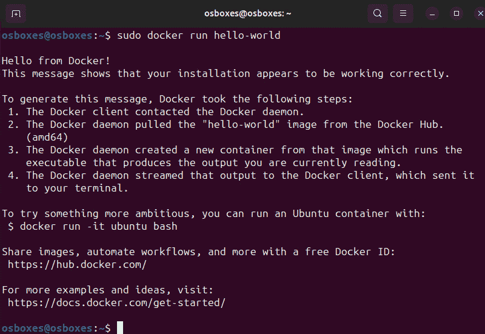

图 5.14：您的第一个 Docker 容器！

实际上发生的情况是，首先，Docker 将在您的系统上寻找名为 `hello-world` 的镜像。当您创建一个容器时，您始终从一个称为镜像的蓝图开始。镜像几乎总是从一个操作系统开始，然后在其上添加一些内容，最终形成最终的镜像。您可以将镜像视为在特定时间点的操作系统文件系统的快照，但它不是您宿主操作系统的快照；它是构建镜像层层的步骤结果的快照，就像您亲自执行这些命令一样。然后 Docker 从该镜像创建一个容器。如果您愿意，可以基于单个镜像运行多个容器，就像您可以从相同的蓝图建造多座房屋一样。

如果指定的镜像尚未存在于您的系统上，Docker 将调用 Docker Hub 并寻找您请求的名称的镜像，如果找到（或者如果您没有找到，则给出错误）。从那时起，新的容器可以基于该镜像创建，而无需再次从 Docker Hub 请求。

现在您已经创建了第一个容器，让我们简要地看看一些您可能需要与容器一起使用的最常见命令。

## 学习基本的 Docker 命令

`docker` 程序是您进入 Docker 本身的接口，它提供了许多不同的命令来控制 Docker。让我们看看一些例子。

### 列出镜像

您如何知道系统上有哪些可用的镜像和容器？嗯，这很简单：

```js
sudo docker images
```

这将列出之前下载到您系统上的所有镜像，您可以从这些镜像创建容器。

### 列出容器

对于列出容器，同样简单：

```js
sudo docker ps
```

基于 Linux 的 `ps` 命令建模，此命令显示您的容器，但它只显示正在运行的容器。`hello-world` 容器完成工作后，会立即关闭。因此，您不会看到它通过此命令运行。其他容器将继续运行，并且会通过此命令显示；这完全取决于容器打算做什么。

然而，容器在某种意义上仍然存在，您可以通过在之前的命令中添加一个选项来查看它：

```js
sudo docker ps -a
```

### 启动（和停止）容器

如果您想再次启动容器，可以运行以下命令：

```js
sudo docker start <container_id_or_name>
```

然而，对于这个 `hello-world` 容器，当您这样做时，将不会发生任何事，容器会立即退出。它似乎只在初次运行时显示有用的信息。

您也可以使用此命令停止正在运行的容器：

```js
sudo docker stop <container_id_or_name>
```

作为一个小插曲，此时你可能意识到，快速输入 Docker 生成的容器 ID 可能会变得很烦人（而且，此外，你也看到我写过`<container_id_or_name>`，这意味着你可以做些除了使用默认 ID 之外的事情）。幸运的是，Docker 还为每个容器生成一个名称，正如你在`ps`输出中看到的那样（而且看到它吐出什么内容通常很有趣！）。然而，自己给它起个名字会更友好，你可以使用以下选项：

```js
docker run --name MyAwesomeContainer hello-world
```

现在，你应该能看到一个指定名称的容器，然后你可以用它来与之交互。

你还应该意识到，当使用 ID 时，你可以输入部分 ID，从开头开始输入足够多的字符以使其唯一。前几个字符通常就足够了。然而，在我看来，提供名称是更好的、更简单的方法，因为你不太可能不小心对错误的容器做了什么（至少在理论上是这样！）。

### 删除容器和镜像

你可能想在某个时候清理这些容器，为此有一个命令：

```js
sudo docker rm <container_id_or_name>
```

如果容器正在运行，Docker 不会让你删除它，直到你停止它。同样，你可以这样删除镜像：

```js
sudo docker rmi <image_id_or_name>
```

就像容器一样，Docker 不会允许你删除被容器使用的镜像，无论它是否正在运行，所以你需要先清理容器。

### 搜索镜像

虽然我认为通过网页访问 Docker Hub 查找镜像要容易得多，你可以在[`hub.docker.com`](https://hub.docker.com)做到这一点，但你也可以直接从命令行搜索镜像：

```js
sudo docker search hello-world
```

这会返回一个包含`hello-world`字符串的许多镜像的列表。

### 连接到容器

有时候，你可能想将容器当作虚拟机来对待，并登录到它们，假设它是一个持续运行的容器。为了展示这一点，我们需要一个会持续运行的容器，所以让我们使用`nginx`：

```js
sudo docker run -d -p 8080:80 --name my_nginx nginx
```

`-d`选项“断开”了终端会话与容器的连接，这导致它在后台运行（假设容器内部的内容不会立即退出）。你将返回到命令提示符，但容器将继续运行。`-p`选项用于暴露网络端口。在这里，我们说的是容器内部的`8080`端口应该暴露为主机网络接口上的`80`端口。

一旦执行此命令，执行`sudo docker ps`，你应该会看到第一次运行的容器。

现在，有一个容器正在运行，我们可以继续连接到它：

```js
sudo docker exec -it my_nginx /bin/bash
```

在这里，你可以看到一些东西。首先，`-i`选项保持系统的`STDIN`输入流打开，以便与之交互。`-t`选项分配一个新的伪终端会话（从本质上讲，这意味着一个 Linux 命令提示符）。最后的`/bin/bash`是一个在容器启动后执行的命令，在这种情况下指定了一个 Linux `bash`命令提示符。这三个选项的组合意味着你“进入”了容器。

你看到的命令提示符是容器内部的命令提示符。你可以执行一些`bash`命令（例如，`ls`），你应该会注意到你所看到的内容与你的宿主操作系统不同（尽管如果你使用的是 Ubuntu，那么看起来可能非常相似）。执行`exit`命令，你将返回到实际的宿主虚拟机的命令提示符。

### 查看容器日志

最后，即使没有连接到容器，你也可以查看容器内部产生的日志：

```js
docker logs my_nginx
```

在这里，“日志”包括任何被路由到标准输出的内容，除非容器内部进行了特定的配置。

现在你对虚拟机（VMs）和容器（containers）有了大概的了解，让我们来看看它们之间的关键区别，以及在你决定使用哪一种时需要问自己的问题。

## 虚拟机和容器之间的关键区别以及如何选择

虚拟机和容器之间有几个区别，这些区别通常会影响决定使用哪一种：

+   **性能**：容器通常比虚拟机更快、更高效。在考虑它们启动速度时这一点无疑是正确的，但它们运行时也是如此。记住——虚拟机是在模拟整个计算机，而容器不是，这种模拟会消耗宿主机的处理器时间和内存利用率，所有这些都会影响虚拟机和宿主机的性能。

+   **开销**：在某种程度上，这是性能的另一个方面，但它足够不同，值得单独指出。由于每个实例都需要完整的操作系统，虚拟机在 CPU、内存、存储和其他系统资源方面有更多的开销。容器更直接地共享宿主机的资源，因此虽然它们确实有一定的开销，但通常比虚拟机低得多。

+   **便携性**：容器在不同机器之间具有高度的便携性，只要它们运行相同的操作系统内核。换句话说，容器内的文件必须与宿主机的内核兼容，只要它们兼容，容器就可以在任何机器上运行。对于虚拟机来说，情况并非如此，这意味着它们比容器更具便携性，因为你可以在一个 Linux 宿主机上运行 Windows 虚拟机，在一个 Windows 宿主机上运行 macOS 虚拟机，或者任何你想要的组合。

+   **安全性**：虚拟机提供了更多的隔离，这可以有益于安全性，而容器在大多数情况下提供了足够的隔离，但需要谨慎管理以确保安全性。虚拟机的完全隔离可以提供一个更安全的环境，因为一个虚拟机的妥协不会直接威胁到其他虚拟机。鉴于容器共享主机操作系统的内核，应该很明显，至少存在一些安全问题的可能性，内核本身的漏洞可能会影响所有容器。然而，在实践中，只要你的主机机器是最新的，并且你的容器配置得当，它们在安全方面相当安全。

+   **管理和编排**：虚拟机通常使用相当高级的管理工具进行管理，例如 VMware vCenter 或 Microsoft System Center，这些工具提供了对多个虚拟机的集中管理。容器通常更多地从命令提示符进行管理，尽管当然也有图形管理工具。虚拟机管理工具允许轻松部署、控制和扩展虚拟机。扩展意味着如果虚拟机需要更多资源，它可以在运行时进行扩展。对于容器，答案通常是简单地创建更多实例的特定容器，并在它们之间平衡工作。这被称为编排，这也是更高级的工具如 Kubernetes 发挥作用的地方。这是一个 Google 产品，它允许对容器进行更灵活的控制——例如更有效地分组以处理负载。这是一个非常强大的工具，但它也比容器本身复杂得多。

+   **快速部署和扩展**：我在上一个要点中提到了这一点，但这是一个重要的观点：因为容器启动非常快且更轻量级，所以容器可以快速、轻松地启动、停止和复制，这使得它们非常适合动态、可扩展的环境。相比之下，虚拟机启动需要更长的时间，并且使用更多的主机资源。这意味着对于一台特定的服务器，你几乎肯定可以运行比虚拟机更多的容器，所以如果你在你的新网站上开始获得大量新用户，你可以创建更多的容器来更快、更轻松地处理流量，并且比使用虚拟机有更少的资源需求。

总结来说，虽然虚拟机和容器之间确实存在重叠，但每个都有其独特的优势和劣势。虚拟机提供了完整的隔离和完整的操作系统环境，这使得它们适合需要完整操作系统或不同操作系统类型的应用程序。但这使得它们在资源需求方面更重。

容器由于不是完整的运行操作系统，因此更轻便、更高效，对于需要便携性和快速扩展的应用程序来说非常理想。我甚至可以说，今天，通常更安全地假设你将比虚拟机更频繁地使用容器来部署应用程序或网站（如果你不是要在服务器上简单地运行代码，我们通常称之为*裸机*）。特别是在你预计你的负载需求（使用你网站的用户的数量）可能会迅速增加的情况下，容器通常是更好的选择（虚拟机也可以扩展，但过程效率较低）。另一方面，如果你主要关心绝对的安全性，并且/或者需要与同一物理机上可能运行的任何其他东西完全隔离，那么虚拟机是一个非常不错的选择。

现在你已经对容器和虚拟机有了一些了解，让我们谈谈你可能最终会运行它们的地方（或者只是运行“裸露”的应用程序，根本不使用虚拟机或容器），那就是云。

# 保持头脑清醒——云服务提供商

有些人喜欢陈词滥调地说，云只是意味着在别人的电脑上运行你的代码。我的意思是，这并不*完全错误*！但其中还有更多。

**云**指的是云计算，它是指通过互联网提供各种服务，包括数据存储、服务器、数据库、网络和软件（即：你的网站和应用程序）。云计算允许灵活的资源（这意味着你可以在需要时获得所需的一切），更快的创新（因为你不需要自己构建和配置服务器和服务），以及规模经济（因为云背后的基础设施成本被分摊到所有使用它的人身上）。你通常只为使用的云服务付费，这有助于降低运营成本，更有效地运行基础设施，并根据业务需求的变化进行扩展。

假设你*不想*使用云。这可能意味着你必须购买自己的硬件，设置它，并配置操作系统及其上的所有服务（数据库、邮件服务、用户身份验证服务、Web 服务器等等）。然后，你必须将代码放在上面并运行它，确保整个系统是安全的。然后，如果你的网站变得非常受欢迎，开始获得更多流量，你可能需要添加硬件来扩展容量或重新配置服务以处理额外的负载。最终，你可能需要添加整个服务器，并配置网络以实现负载均衡。

使用云服务，这些担忧都是自动的，或者至少可以通过更新云服务提供商提供的控制面板网站上的某些设置来改变。你更改一些设置，点击一个按钮，突然你就有更多的内存、更多的带宽和更多的 CPU 可用于处理扩展的负载。这是一件更容易做的事情。而且成本节约是显著的：当你自己构建服务器时，你必须猜测负载，通常最好是超额购买。如果你认为一个配备单核 3 GHz CPU 的服务器将足够，你可能一开始就想购买一个双核机器，以便有增长的空间。但是，如果你没有增长，现在你实际上已经浪费了钱。在云上，当你看到你需要第二个 CPU 时，你可以添加它，这样你就不会为不需要或可能不需要一段时间的 CPU 付费。

## 介绍云服务提供商

现在，有许多不同的云服务提供商，但最大的是 **Amazon Web Services** (**AWS**), **Microsoft Azure** 和 **Google Cloud Platform** (**GCP**)。Oracle 也有一个相当受欢迎的云服务，IBM 和一些其他较小的玩家也是如此，但亚马逊、微软和谷歌无疑是巨头。最终，尽管如此，他们都有相同的基本提议：在你的基础设施上运行你的代码，只使用你需要的部分。

听到大多数人将互联网与谷歌公司联系在一起，而谷歌的云服务，坦白说，并不像 AWS 和 Azure 那样受欢迎，这可能会让人感到惊讶。AWS 和 Azure 是截至本文撰写时最受欢迎的两个云服务提供商，几乎毫无疑问。事实上，当人们今天谈论“云”时，他们几乎肯定是指这两个提供商之一。他们在使用和市场份额方面比其他所有服务都要大得多。

然而，不管怎样，所有云服务提供商都提供了一大堆不同的服务，具有很高的稳定性。当然，这不是免费的：如果你不小心，使用公共云可能会相当昂贵。在网上找到关于人们因为他们的网站一夜之间变得超级受欢迎而醒来发现巨大的 AWS 账单的恐怖故事并不困难。在使用它们时，你绝对需要谨慎。幸运的是，所有好的云服务提供商都提供了控制支出的方法。例如，在 AWS 上，你可以配置账户的支出限制，这样你就不会突然收到一个改变你生活的账单。

然而，这不仅仅是这样：你必须考虑云是否真的是特定用例的正确答案。有时，它显然是：例如，当你知道你的负载需求将会高度变化时。在这种情况下，只使用你需要的容量是非常吸引人的。显然，自己设置云服务提供商提供的各种服务的复杂性可能会让人感到压倒，并且在这种情况下可能会非常昂贵。

但有时，拥有自己的硬件既便宜又简单，特别是如果你对未来的负载有很好的了解。而且如果你正在构建的东西不需要云提供的大部分功能，那么自己动手可能更有意义。

这不是简单的微积分，许多许多因素都会影响到这样的决策，其中许多因素与项目本身密切相关。我并不是试图提供一个用于此类决策的清单，因为这几乎是一项不可能完成的任务。相反，我只是想指出，是否选择云服务是一个你需要根据每个项目的独特需求来做出的决策。云服务当然有好处，但也有不利之处。

更复杂的是，云服务并不是单一的东西，无论它是谁的云。实际上，你需要熟悉三种类型的云。现在让我们来谈谈它们。

## 理解云类型

云可以是公有、私有或混合：

+   **公有云**：这些是通过公共互联网提供的云服务，对任何愿意付费的人开放。公有云通常包括 AWS、Azure 和 GCP 等服务。它们在由提供商提供、维护和完全控制的数据中心中运行。

+   **私有云**：这是仅由单个企业或组织使用的服务器基础设施，使其仅对内部开发团队可用。这通常由那些希望或需要更高控制水平的大型公司完成，特别是在像银行这样的领域，监管机构规定了更严格的敏感数据控制水平。

+   **混合云**：结合了公有云和私有云，通过技术手段实现数据和应用程序的共享。想象一下，在你的私有云上运行你的网站，然后通过连接到公有云中的数据库服务来节省一些费用（数据库软件在大规模上往往相当昂贵）。

除了这三种类型之外，云服务还可以细分为几个关键服务。现在让我们看看其中的一些。

## 识别关键服务

云服务有多种类型，但它们往往以“**aaS**”结尾，这是“**as a Service**”的缩写。当你自己搭建服务器，并且需要在其上运行数据库时，你需要安装数据库软件并对其进行配置。相比之下，**数据库即服务**（**DBaaS**），是指云服务提供商为你提供预配置的数据库服务。当然，为了满足你的需求，你仍需要进行一定程度的配置，但基本的数据库软件是你不必担心的。从你的角度来看，它只是你使用的一项服务，就像有线电视（嗯，还有人在用有线电视吗？！）

你可能会遇到的一些其他“aaS”服务——但肯定不是全部，因为似乎每周都会出现一个新的——包括以下内容：

+   **基础设施即服务（IaaS）**：这是一种提供基本计算资源的服务，例如虚拟机（VM）、网络和存储。一个例子是 AWS 的**弹性计算云（EC2**）。这可以大致理解为有人为您设置服务器，然后您可以随心所欲地使用它。

+   **平台即服务（PaaS）**：这项服务通过互联网提供硬件和软件工具。从概念上讲，它在 IaaS 之上，因为它通常包括操作系统以及安装在其上的软件。

+   **软件即服务（SaaS）**：这项服务通过互联网以订阅方式提供软件应用程序。一个例子是微软的 Office 365，您可以通过互联网使用微软的所有 Office 应用程序。

+   **容器即服务（CaaS）**：这为运行任何类型容器的运行环境提供支持。

+   **灾难恢复即服务（DRaaS）**：这是一种可以用来备份您的重要数据并在必要时恢复它的服务。

正如我所说，还有许多其他的“aaS”服务，每个云服务提供商都将提供不同的选项。为了使问题复杂化，不同的提供商甚至不会总是对术语达成一致！例如，*CaaS*在不同的云服务提供商中可能并不总是指*容器即服务*。但话虽如此，这个列表中的服务通常相当一致，并且可能是您最常看到的服务。

不论名称如何，当您使用云服务时，您可能只使用一项服务，或者使用多项服务。例如，AWS 在撰写本文时，有 200 多项服务可供使用。但这也是云服务的另一个优势：您可以按需混合匹配服务，在过程中添加和删除。这就是汉堡王模式：您想怎么来就怎么来！

云计算的灵活性与其创新能力相结合，使其成为现代 IT 基础设施的基石，对于企业保持竞争力和敏捷性在快速发展的数字领域中至关重要。

但您可能根本不需要云服务。好吧，差不多吧。让我们来谈谈所谓的无服务器技术。

## 谁需要云服务甚至服务器？——无服务器

软件开发领域最近的一个发展是所谓的**无服务器**技术。这实际上仍然是一种云服务，但它与传统的云服务有很大的不同。一般来说，任何云服务都意味着有一些软件一直在运行。即使没有人使用它，它仍然在运行，尽管在非常低的水平上，因为云可以在这种情况下缩小操作规模以节省资源，并最终为您节省金钱。

但是，对于某些应用程序来说，您甚至不需要这些服务！

想象一下，如果你想编写一个可以解决数学方程式的应用程序。根据你到目前为止所学的内容，你可以想象创建一个网页，你可以输入一个数学方程式并将其提交给服务器端代码来解决方程式并返回结果。你可以进一步想象编写一些 Node 代码来完成这项工作。而且根据你到目前为止所学的内容，你甚至对代码的大致样子有一些了解，至少在高级层面上。最终，你将有一个 JS 函数，你的 Node 服务器会调用它来解决方程式。

但是，如果我说有一种方法可以在云中实现这个功能，并且像服务器一样调用它，你会怎么想？嗯，这正是无服务器架构的精髓！

从概念上讲，你可以将无服务器架构视为仅在请求到来时启动 Node 服务器，让它调用该函数，返回结果，然后立即关闭。但这一切发生得如此之快，以至于你甚至感觉不到——对你来说，服务器似乎一直在运行。

但是，更好的是，虽然代码并不复杂，正如你所看到的，如果你甚至不需要编写服务器代码，那不是更好吗？如果你只需要编写解决方程式的函数，那不是更好吗？

这就是无服务器架构的精髓！

AWS Lambda 就是这样一种无服务器服务。使用它，你可以编写函数，不仅限于 JS，还可以使用一系列其他语言。这些函数可以像在服务器上运行一样被调用。Lambda 负责所有的基础设施，换句话说，就是所有你需要自己编写的服务器代码。你只需专注于所需的逻辑，让 Lambda 处理其余部分。而且，最好的是，由于没有代码一直在运行等待请求，如果你的函数没有被调用，你就不需要支付任何费用。只有在它们被调用时，你才会根据它们使用的资源数量支付费用。所以，如果你编写的是快速、高效的代码，那么运行无服务器架构的成本会更低。

当然，无服务器架构并不是所有应用程序都适用的模型。但是，对于那些适用的情况，它可以非常有意义。

云是一个广泛的话题，你可能需要也可能不需要深入研究，这取决于你的需求。但我想讨论的最后一个话题几乎涵盖了我们之前讨论的所有内容，因为无论你是自己搭建服务器还是使用云服务提供商，你显然都需要做一些事情，比如将代码构建成可执行的形式并部署它，所有这些以及更多，都属于 DevOps 的范畴。

# 恢复控制权 - DevOps

信息技术（IT）的世界，其中网络开发只是其中一部分，是一个有趣的领域，因为技术和方法总是来来去去。还经常发生的事情是我们重复自己！有人有一个好主意；它变得流行，但最终被其他东西取代。然后，在某个时候，有人又有了一个好主意变得流行，但那些经历过上一个好主意的人通常意识到新的好主意实际上只是旧的好主意略作更新并穿上新衣服！

在早期，开发者做所有的事情。我们编写代码，然后我们就是那些将其部署到服务器上的人，这意味着将其安装到运行它的服务器上（无论是我们自己建造的服务器，还是由外部供应商提供的服务器，或者是云服务器）。这只是开发过程的一部分。然后我们担心诸如监控网站问题并处理这些问题之类的事情。

然而，过了一段时间，许多组织开始采取不同的方法，通过将一些职责分离出来并分配给除了开发者之外的其他团队，通常称为运维团队。在那个阶段，开发者仍然编写代码，但在部署的时候，另一个团队会负责。像监控这样的任务可能由一个完全不同的团队处理，并且处理出现的问题至少从特定的支持团队开始（尽管开发者最终仍然经常需要介入）。

现在，摆锤又开始向另一边摆动了，因为开发者通常在部署和支持以及运行一个实时网站的所有其他关注点中都有所参与，所以我们又重复了自己，尽管有一些不同。这次“新衣服”是指一种叫做 DevOps 的东西。

**DevOps** 是一套将软件开发（**Dev**）和 IT 运维（**Ops**）相结合的实践，旨在缩短开发周期并提供软件或网站的持续交付，同时仍然提供高质量的输出（通常意味着相对于更新速度，更少的错误或其他问题）。DevOps 因其强调软件开发人员和 IT 专业人员之间的协作、自动化和集成而著称。它通常涉及自动化和简化集成和部署流程的工具，旨在提高和加快交付。这种方法在敏捷软件开发背景下尤其相关，这是一种在许多阶段构建软件的方法，每个阶段都交付预期整体的一部分，同时允许在开发过程中进行更改。它可以显著提高软件生产和维护的效率和品质。

## 理解 DevOps 的关键方面

在高层次上，有几个关于 DevOps 的关键点：

+   **文化转变**：DevOps 强调心态的转变，鼓励开发和运维团队之间的协作。这打破了隔阂，营造了一种快速、频繁且更可靠地构建、测试和发布软件的文化。

+   **自动化**：DevOps 严重依赖自动化来加速软件开发和部署流程。这包括代码部署、测试、基础设施配置、监控等。任何可以自动化运行且几乎不需要人工干预的事情，DevOps 通常都会寻求去实现。

+   **持续集成和持续交付 (CI/CD)**：这些是 DevOps 的核心实践。**CI** 指的是将来自多个贡献者的代码更改自动集成到单个软件项目中的过程。**CD** 是这一过程的扩展，其中软件可以随时发布到生产环境。基本思想是，当开发者将代码推送到 Git 时，自动化会看到新的代码，并构建软件或网站，将其部署到测试环境。通常，此时会运行自动测试，开发者会收到失败的警报，以便他们可以纠正问题。如果没有发现任何问题，并且如果一切配置得当，新的代码可以立即部署到生产环境，供最终用户立即使用。

+   **监控和反馈**：对应用程序及其性能的持续监控至关重要，尤其是在大量自动化和快速部署的情况下。它有助于早期发现问题，并根据用户反馈和系统级测试实时改进产品。例如，如果部署了新的代码，并且你设置了监控来提醒你错误开始发生，你可以在用户意识到问题之前采取行动。

+   **工具和技术**：一般来说，DevOps 以及特别是 CI/CD，都带来了一系列新的工具来使这一切成为可能。例如 Jenkins 和 GitLab 这样的名字出现，它们是运行所谓的 **流水线** 的平台。流水线实际上只是指一些知道如何自动构建、测试和部署代码的脚本。当然，容器在所有这些过程中都扮演着重要角色。例如，构建和部署代码的 CI/CD 流水线可能涉及流水线自动创建一个临时容器来进行构建。其他产品，如 Ansible 或 Puppet，也经常被使用。这些是用于管理环境配置的工具，通常是服务器。例如，CI/CD 流水线可能会执行一个 Ansible 任务，该任务负责确保生产服务器的配置满足应用程序的需求。进入 DevOps 需要学习许多新的工具和技术，而不仅仅是设计网站和编写代码所需的那些。

+   **微服务架构**：许多 DevOps 团队为了使管理代码更容易，会采用微服务架构。这是一种构建应用程序和网站的方式，将它们分解成许多更小的部分，每个部分都为更大的应用程序提供所需的服务。例如，你可能会创建一个在登录时验证用户的微服务。你也可能创建另一个处理注册新用户的微服务。而不是将这两个服务作为网站的一部分进行打包，你相反可以部署它们作为独立的程序，然后网站再使用这些程序。这允许你在不触及登录验证服务的情况下升级注册服务。这种架构非常适合 DevOps 方法，因为自动化这些较小的部分通常更容易。权衡的是，让所有这些部分协同工作有时可能具有挑战性，并且确实会使追踪问题变得更加困难。但是，好处往往超过了任何负面影响，包括你可以更容易地扩展服务以应对不断增长的需求，而不是尝试扩展一个单一的大型——**单体**，正如它们所知——应用程序。它还可以帮助团队更快地推出功能，因为添加新服务或更新单个服务而不触及其他代码的风险更小。

## 确定 DevOps 的好处（以及一些负面影响）

DevOps 有几个好处。

其中之一是增加部署频率的能力（因为一切都是自动化的，在大多数情况下会简单地比人工快得多）。实施 CI/CD 管道的团队通常会几天或几周内发布更改，而没有使用 DevOps 思维的团队可能需要几周或几个月才能发布。甚至有些公司每天部署代码，如果没有 DevOps，这几乎是不可能的——假设他们想要一个稳定的产品。

更快的**上市时间**（**TTM**）是另一个关键好处。由于一切自动化，团队可以更多地专注于编写代码，而不是担心代码最终如何部署和运行。

DevOps 通常也能降低新版本发布的失败率，至少在正确实施的情况下是这样的。这主要是因为测试通常被集成到 CI/CD 管道中，并且假设测试足够稳健，你可以相当有信心地保证新代码不会破坏任何东西，因此你可以有信心更快地发布。

通常，作为网络开发者的你可能会发现，DevOps 实践不仅使开发过程更加流畅，而且还能提高软件维护和部署的整体质量和响应速度。

当然，生活中很少有事情都是完美的！即使是最好的想法也往往有一些缺点，DevOps 也不例外。

当你精心开发的自动化突然失败时，可能会非常令人沮丧。也许它依赖于一个编译代码的服务，而这个服务可能因为某些原因而宕机。突然之间，你的管道失败，也许它们没有提供足够详细的错误信息，以至于无法立即看到问题所在。也许管理员升级了 Jenkins，新版本有一个导致你的管道在某些非常难以调试的方式中中断的 bug。或者，也许有很多团队同时运行管道，突然之间，你的管道需要 2 小时而不是 5 分钟。也许仅仅是因为难以编写管道脚本以完全满足你的需求，因为它有一些你在艰难中发现限制。

所有这些都是在我的工作中遇到的事情，这只是冰山一角。

如我之前提到的，微服务架构有很多好处，但出问题时进行故障排除绝对不是其中之一。当你有由几个不同团队维护的服务时，情况会变得更糟。现在，你不仅要弄清楚哪个服务出了问题，而且还要与那个团队接口，让他们纠正问题，而这并不总是像你希望的那样顺利。

但是，最终，大多数开发者倾向于认为 DevOps 的好处远远超过了任何负面影响。

现在你对 DevOps 已经有了一些了解，让我们来谈谈在 DevOps 环境中经常使用的一种技术：Python。

## 不仅仅是 HTML、CSS 和 JS——Python

**Python**是一种高级、解释型编程语言，以其可读性和简单性而闻名。由 Guido van Rossum 开发并于 1991 年首次发布，Python 已成为世界上最受欢迎的编程语言之一。其关键特性包括以下内容：

+   **易于学习**：Python 具有简单明了的语法，类似于英语语言，这使得大多数人可以快速掌握

+   **动态类型**：变量可以根据分配的值改变其类型

+   **内存管理**：自动内存管理和垃圾回收

+   **广泛的标准库**：包含用于各种任务的模块的大标准库

+   **跨平台**：在多个操作系统上运行，如 Windows、macOS 和 Linux

+   **解释型**：代码逐行执行，这使得调试更容易

+   **多范式**：支持面向对象、命令式和函数式编程风格

+   **可扩展性**：可以通过 C/C++扩展以用于性能关键任务

+   **可嵌入性**：可以嵌入到 C/C++程序中以提供脚本功能

+   **社区**：一个庞大且活跃的社区支持开发并提供众多模块和库

Python 被用于各种领域，如网站开发、数据科学、**人工智能**（**AI**）、**机器学习**（**ML**）、网络等。其框架如 Django 和 Flask 在网站开发中很受欢迎，而库如 NumPy、Pandas 和 TensorFlow 在科学计算和 AI 中被广泛使用。

它也是 DevOps 领域中的一种流行语言。你经常会发现用 Python 编写的各种脚本，然后从 CI/CD 管道或其他自动化工具中执行。它绝对不是 DevOps 的必需品，有时会使用其他语言和设施来代替它，但肯定在 DevOps 圈中是一个流行的选择。

让我们看看一些基本的 Python 示例代码，以便给你一些关于它是什么样的概念。

### 检查一些简单的 Python

Python 是一种广泛的语言，至少和 JS 一样复杂，而且可能更复杂，说实话。关于 Python 已经有整本书的论述，所以不可能在一章中教你关于 Python 的所有内容。但我至少想给你一些关于它的外观和功能的尝鲜。为此，我将向你展示一个承认是人为编造的例子，你可能会将其作为网站 CI/CD 管道的一部分来编写。我认为，鉴于你迄今为止对 JS 的了解，即使不深入研究其细节，你也会觉得 Python 很容易理解，这也是它变得如此受欢迎的原因之一。

因此，请查看 `build_and_deploy.py` 文件的内容：

```js
import os
import shutil
import datetime
def make_index(source_path):
    current_time = datetime.datetime.now().strftime("%Y-%m-%d %H:%M:%S")
    head = '<head><link rel="stylesheet" href="styles.css"></head>'
    with open(os.path.join(source_path, 'index.html'), 'w') as file:
        file.write(f"<html>{head}<body>{current_time}</html>")
    print("index.html created")
def deploy(source_path, deploy_path):
    if os.path.exists(deploy_path):
        print("Deleting existing deployment")
        shutil.rmtree(deploy_path)
    shutil.copytree(source_path, deploy_path)
    print("Website deployed")
# Execution begins here
source_path = "src"
deploy_path = "live"
make_index(source_path)
deploy(source_path, deploy_path)
```

首先，导入了一些库供我们的 Python 脚本使用：用于操作操作系统和文件系统的 `os` 和 `shutil` 库，以及 `datetime` 以便我们可以获取当前的日期和时间。

接下来，定义了两个名为 `make_index()` 和 `deploy()` 的函数（这就是 Python 中 `def` 关键字的意思）。`make_index()` 函数将一个名为 `index.html` 的文件写入 `src` 目录（写入的目录作为 `source_path` 传入），而 `deploy()` 负责创建我们的最终部署目录（在这个人为编造的例子中，我们假设它是一个网络服务器用来提供内容的地方）。

在 `make_index()` 函数内部，定义了一个名为 `current_time` 的变量，其值由 `datetime.datetime.now()` 函数返回，该函数由导入的 `datetime` 库提供。`strftime()` 函数允许我们指定我们想要的日期和时间的格式——在这种情况下，是一个形式为 `YYYY-MM-DD HH:MM:SS` 的字符串（例如，`2023-12-10 18:10:53`）。

接下来，定义了一个名为 `head` 的变量，它包含我们 HTML 文档 `<head>` 部分的 HTML。在其中，导入了 `styles.css` 文件，你会在 `src` 目录中找到它。其中的样式配置很简单：`body { color : #ff0000; }`，使 `<body>` 部分中的所有文本都变为红色。

之后，将`index.html`文件写入，并将`head`的值插入其中，从而在我们的 HTML 文档中创建一个适当的`<head>`部分。因为写入文件的`file.write()`函数中传递的字符串是以`f"`开头的，所以我们可以在其中使用替换令牌，就像`{head}`一样。Python 会自动将`head`变量的值插入其中。另一个替换令牌`{current_time}`也做同样的事情，因此当页面加载时（好吧，当我们构建网站时的当前时间），我们会看到当前的日期和时间。

最后，当我们运行脚本时，`print()`语句会在控制台回显一个状态信息。

在`deploy()`函数内部，它首先检查网站是否已经通过检查`deploy_path`参数指定的`live`目录来确认是否已部署。如果是，则使用`shutil.rmtree()`函数来删除该目录，并通过`print()`函数显示相应的状态信息。然后，无论目录是否被删除，都会使用`shutil.copytree()`函数来创建部署目录。更具体地说，它会将`src`目录（由`source_path`参数指定）的内容复制到部署目录中。最后，再次使用`print()`函数显示状态信息。

当你运行此脚本时，执行实际上是从你看到的注释下面的部分开始的，该注释以井号符号开始。首先，定义源目录和部署目录为`source_path`和`deploy_path`变量。然后调用`make_index()`，这将导致`index.html`文件被写入到`src`目录中。最后，调用`deploy()`，这将确保我们有一个全新的名为`live`的部署目录，其中包含`index.html`和`styles.css`文件。现在我们实际上在`live`目录中拥有一个完整的网站——尽管非常简单——如果 Web 服务器指向该目录，网站将对访客可用。

最后，为了运行脚本，假设你已经安装了 Python，你只需在命令提示符下执行此命令：

```js
py build_and_deploy.py
```

`py`命令应该在安装 Python 后可用。试一试！

如我之前提到的，Python 远不止这个简单示例所展示的。然而，它演示了许多关键概念，包括变量、函数、库、注释、条件和 Python 脚本的基本结构。而且这个示例展示了你可能在 CI/CD 管道中执行的内容。想象一下，如果每次你向 Git 推送新代码时，这个脚本都会自动执行，这是 CI/CD 管道通常执行的操作。

这样，你就可以将新代码自动部署到实时 Web 服务器上，供全世界的人查看。这就是 DevOps 和 Python 结合的力量！

# 检查路线图

哎，我们正迅速前进，揭示出无数的方块！这是更新的 Web 开发者路线图：

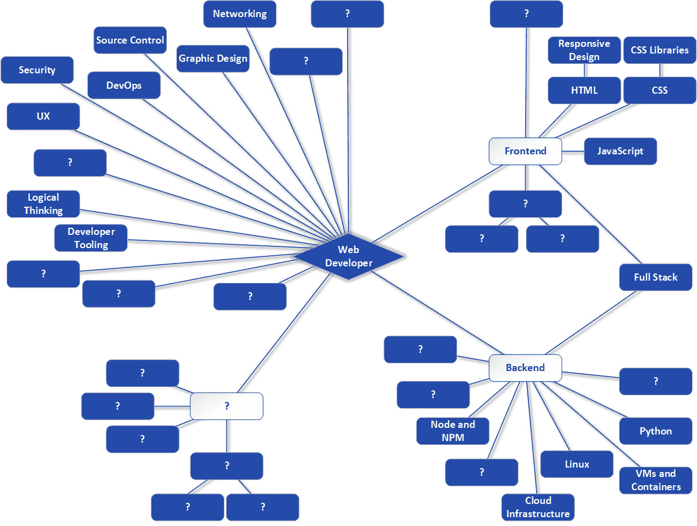

图 5.15：填入更多框的路线图

这次，你揭开了**图形设计**、**DevOps**、**UX**、**Python**、**虚拟机和容器**以及**云基础设施**这些框。这是一个很大的进展！让我们继续前进，不久我们就会全部揭示它们。

# 摘要

在本章中，我们涵盖了几个独特的领域。首先，你查看了一些前端关注点，包括图形设计、可用性和响应式设计，以了解为什么它们很重要以及它们如何在你进行网页开发的过程中为你带来好处。然后，我们转向服务器端，简要讨论了虚拟机和容器，以了解它们是如何用来运行你的代码的。接着，你对云进行了了解，并学习了它是什么。最后，我们简要讨论了 DevOps，以了解这种流行的开发方法如何增强我们交付高质量代码的能力。作为那次讨论的一部分，你了解了 Python，并对其进行了小小的尝试，以了解它提供了什么，特别是与 DevOps 相关的内容。

在下一章中，我们将回到前端，关注一些今天使用的一些最大的框架，看看它们如何为你提供开发上的优势，并允许你在减少努力的同时交付更健壮的网站。
