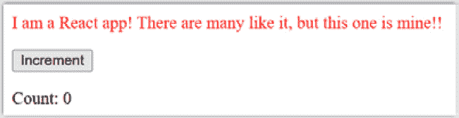
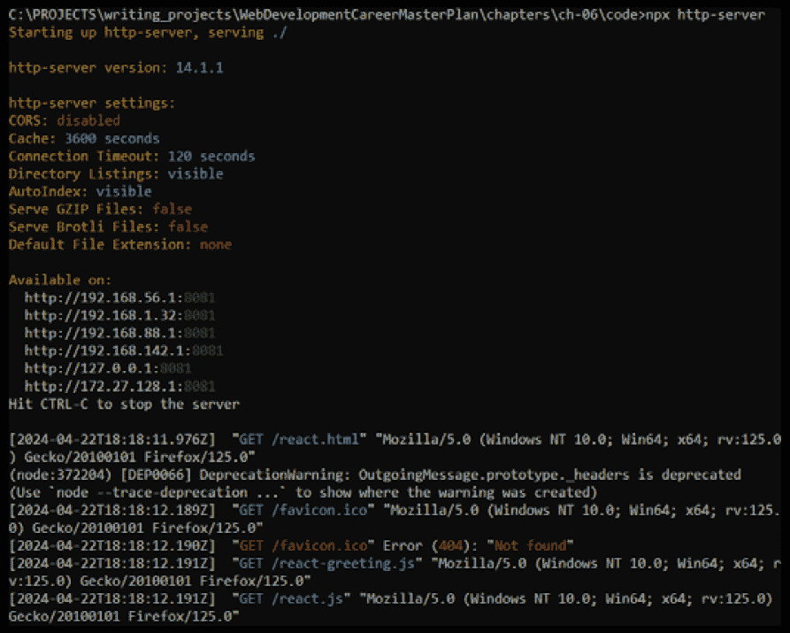
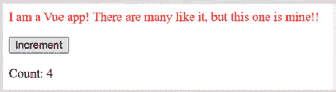
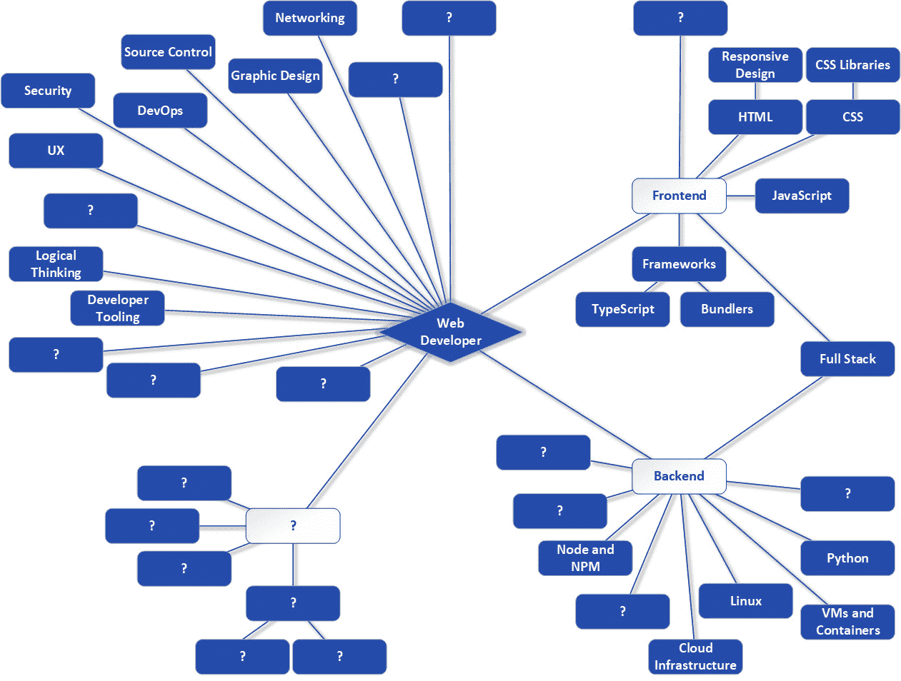

# 6

# 探索现代前端开发

好吧，前两章在很大程度上专注于后端。当然，我们当然也触及了一些非后端的内容，但主要还是集中在后端。在本章中，我们将全力以赴地回到前端。

就前端而言，到目前为止我们走到了哪里？嗯，您已经很好地了解了 HTML、CSS 和 JavaScript，这些都是网络开发的基础。每个网络开发者都需要了解这些才能有效。

但如果我说，在大多数现代网络开发中，您可能不会以您迄今为止看到的形式使用它们，您会怎么想？实际上，在某些情况下，您可能几乎不会使用它们。这听起来是不是有点奇怪且矛盾？

然而，这在很大程度上是现实！

在本章中，我们将探讨一些建立在 HTML、CSS 和 JavaScript 之上，有时扩展它们的技术，最终达到一个您不再使用纯 HTML、CSS 和 JavaScript 工作的地方。这些包括如 React、Angular 和 Vue 这样的框架，以及 Bootstrap 和 Tailwind 这样的前端工具包，还有**TypeScript**（**TS**）。您还将看到它们在向客户交付内容方面具有许多优势。

到最后，您将很好地理解为什么这种远离纯 HTML、CSS 和 JavaScript 的趋势如此流行且有益。

因此，我们将在此处涵盖以下主要主题：

+   抽象化基础知识

+   面向现代前端框架

+   提升 CSS 功能

+   转译和数据处理

+   打包和部署——打包器

# 技术要求

对于本章，您需要从 GitHub 下载源代码包。由于我预计您已经安装了 Node（以及 npm），所以这就足够了！您所需的一切都将位于`ch-06`目录中，随时可用。

# 抽象化基础知识

很久以前，在一个遥远的互联网上，开发网站有点痛苦。您知道，长期以来，浏览器的工作方式并不完全相同。您可能会编写一些 HTML 代码，在 Netscape Navigator 中看起来很棒，但然后在 Internet Explorer 中看起来就不对了。或者，您可能会编写一些在 Internet Explorer 中运行完美的 JavaScript 代码，但然后在 Opera 中引发了错误。而 CSS 则需要各种技巧才能在浏览器之间实现大致相同的效果。

现在，我们倾向于编写符合标准的内容，这些标准是浏览器遵循的、关于 HTML、JavaScript 和 CSS 如何工作的明确指南。只要您编写的内容符合标准，并且浏览器正确地实现了这些标准，您编写的内容几乎总是可以在主要浏览器中保持一致。

但这并非一直如此，远非如此。

在标准成为主流之前，开发者认为使用纯 HTML、JavaScript 和 CSS 构建网站并不总是最佳体验。在那个阶段，他们开始在 HTML、JavaScript 和 CSS 之上编写抽象层。这些以各种 JavaScript 库的形式出现，实际上为你创建 HTML、JavaScript 和 CSS。它们这样做是智能的，意味着如果它们看到你在 Internet Explorer 中运行，它们知道如何为它输出正确的代码，但然后在 Netscape 浏览器中运行时可以输出正确的代码（如果你从未听说过 Netscape，请不要担心——它是一个在互联网早期非常流行的已停用的浏览器——也就是说，在 20 世纪 90 年代末和 21 世纪初）。

这些抽象的目标主要是三方面的：

+   其中之一是它们允许你编写更少的代码！如果你可以调用一个函数来生成一个带有按钮和一些文本的 UI，按钮可以展开和折叠，那么你就不必编写那么多的代码——远比你可能出错的自定义 HTML、CSS 和 JavaScript 要少得多。

+   基于前面的观点，编写更少的代码意味着你可以更快地交付结果。不必自己编写所有那些展开/折叠代码可以节省时间，客户通常都喜欢这一点。

+   第三大关键好处是共享代码往往更健壮。如果你使用别人写的代码，而且有很多人也在使用它，那么代码很可能非常可靠，没有错误，性能良好，并且通常没有问题。

在抽象领域，jQuery 曾经是最大的名字之一，而且在某些地方至今仍然是。可以争辩说，没有 jQuery，一个提供了一系列旨在跨所有支持浏览器工作的函数的 JavaScript 库，万维网今天可能不会成为现在这个样子。

例如，在纯 JavaScript 中，你可以使用以下代码获取 DOM 节点的引用：

```js
const node = document.getElementById("mySpecialDiv");
```

如果你页面上有一个`<div id="mySpecialDiv">`元素，那么`node`变量将引用它，你可以以各种方式操作它。虽然这在今天是一个常见的、完全跨浏览器的功能，但并非总是如此。在某个时刻，你可能不得不为不同的浏览器编写不同的代码，而且有人必须确定在需要时执行哪种代码。

但是，随着 jQuery 的出现，你可以编写类似以下这样的代码：

```js
const node = $("#mySpecialDiv");
```

`$()`函数——是的，`$`在 JavaScript 中是一个有效的函数名，尽管它看起来不像你之前见过的任何函数名，而且它只是一个单个的非字母数字字符——是由 jQuery 提供的（如果你将 jQuery 导入到你的页面中，那只是一个 JavaScript 文件，所以这很容易做到），并且它处理了浏览器可能存在的任何差异。有了 jQuery，那行代码在所有支持的浏览器中都能正常工作，你不必担心一个浏览器如何处理事情与另一个浏览器相比，因为 jQuery 为你处理了所有这些。

jQuery 是一个库，而且是一个小库。但在这个语境下，“库”这个词是什么意思？与通常在软件开发中（当然包括 Web 开发）广泛讨论的框架和工具包相比，它意味着什么？我们可以这样分解：

+   **库**是一组可以写成任何语言的函数和可调用例程。使用库时，你掌握着应用程序的流程和结构，你只在需要时使用库。你的代码总是调用库。

+   另一方面，**框架**为你的应用程序提供整体结构。你必须将你的代码放入框架规定的结构中（根据框架作者的思维方式，这种结构的刚性程度有所不同）。框架的代码控制着流程，在各个点上根据各种事件调用你的代码。

+   **工具包**是一组针对特定领域的工具或组件。最常见的情况下，工具包指的是用户界面组件——比如按钮、网格、进度条以及其他你可能在用户界面中看到的元素。实际上，根据我的经验，你很少在其他语境下看到“工具包”这个词，除了在构建界面时。

这三者之间的区别最终主要取决于谁控制得更多。如果你的代码在调用其他代码，那么你的代码在控制，那么其他代码很可能是库或工具包。相反，如果其他代码大多数时候在调用你的代码，那么其他代码控制得更多，那么有很大可能是框架。

当然，这是一个边缘性的学术讨论：在开发网站时，我们通常不需要太担心某物是库、框架还是工具包。了解它们之间的区别是值得的，但最终，只要某个东西能帮助我们完成工作，那么它可以是它想成为的任何东西！

但是，话虽如此，也值得指出的是，这些术语之间有一些重叠，甚至有一定的可互换性。你很容易在网上找到关于*X*或*Y*是库还是框架（工具包通常更明显）的辩论。它们是什么并不那么重要，重要的是它们能为你做什么。

现在，让我们来认识一下目前最受欢迎的前端框架中的三个：React、Angular 和 Vue。

# 面对现代前端工具

今天，在 Web 开发中存在一些分歧。有一群 Web 开发者喜欢“纯 vanilla”方法，这意味着你使用 HTML、CSS 和 JavaScript，就像你之前看到的那样。另一方面，还有另一群人认为在更高层次的抽象中存在更好的答案。他们认为，由于它们可以做到像 jQuery 库那样平滑浏览器差异，或者像 MUI 工具包那样通过提供丰富的预制小部件来构建界面，因此库、框架和工具集有很多好处。两种方法都有优点和缺点，而且没有公认的正确答案。

然而，提出“纯 vanilla 团队”现在是较小的群体并不疯狂，而且普遍的观点是，在大多数情况下，使用现代库、框架和工具集是更好的选择。当然，即使你只使用这些工具，你*仍然*需要知道 HTML、CSS 和 JavaScript。这是基础知识。这些现代工具基于它们构建，并扩展它们，但很少完全取代它们（你可以找到一些这样的工具，但它们往往是少数）。

因此，你到目前为止所学的绝对不是徒劳的努力——这是*必需的*，以便能够理解像 React 这样的东西。

React 独占鳌头

可能看起来我给 React 的关注比其他任何东西都要多，这是故意的：React 在写作时，是相当广泛的前端工具中最受欢迎的。你很可能在大多数环境中都会使用它。它也是最具争议性的，而且在许多方面看起来与其他工具相似。虽然它们都不同，但它们有足够的共同哲学，我认为如果你理解 React，那么当你需要使用其他东西时，React 的知识将为你提供足够的基础，以便足够容易地学习其他工具。

## 面对 React

**React** 来自我们的朋友 Facebook（或者我们的敌人——似乎每个人都对 Facebook 有意见，而且往往非常极端，很少中立）。React 是一个专注于构建网站用户界面的库，其他方面则很少涉及。在开发圈子里，关于 React 是否是一个框架，有一些争议，但鉴于其创造者称其为库，我认为我们可以合理地采用这种说法！

React 的潜在目标是使你在任何给定时刻都能轻松地推理出界面的状态和结构。你屏幕上看到的是 UI 显示的底层数据——状态——的函数。它是通过组件实现的，组件本质上是无状态的界面部分。当你组合大量组件时，你最终得到的是整体界面，以及一个由数据支持的网站或 Web 应用程序。

React 使用一个称为虚拟 DOM（VDOM）的概念来有效地完成所有这些。当你用 React 编写代码时，你并不直接与 VDOM 交互，但它始终存在。React 在幕后使用它来使一切工作，那么它究竟是什么呢？

你之前已经接触过 DOM 了，这是浏览器从你的标记中创建的元素树，它既可以通过代码也可以通过事件进行操作。当发生这样的变化时，浏览器必须执行大量工作，这在性能上可能是密集和昂贵的。有些变化不会影响页面的流程或结构，因此成本较低。例如，改变现有文本的颜色就属于这一类。但是，像在页面上插入一个新的`<div>`元素这样的变化会改变流程——DOM 的结构——因此，浏览器在重新绘制屏幕之前必须重新计算很多内容。DOM 处理所有这些，根据变化类型和程度，可能会导致界面反应迟缓、缓慢，无法立即响应用户交互，这不是一个好现象。

为了解决这个问题，React 引入了 VDOM 的概念。这是一个概念上位于真实 DOM 之上但用 JavaScript 实现的二级 DOM。当 React 中发生需要更新屏幕的事件时，而不是立即直接操作真实 DOM，VDOM 将被更改。这允许 React 进行调解和管理变化，以便在最终在真实 DOM 上执行时更加高效。

React 使用所谓的 diffing 算法，这是一种比较 VDOM 和真实 DOM 并收集差异列表的代码。然后 React 能够做出明智的决定，关于对真实 DOM 需要做出的最小更改集，并且可以执行诸如将它们全部批量处理（这通常比逐个处理更有效）或推迟到没有其他事件发生，通常试图最小化对真实 DOM 需要发生的变化的数量。一般来说，如果一切做得正确，这种方法可以比直接操作真实 DOM 提供更好的性能。

### 一个简单的 React 示例

让我们直接进入一个 React 示例：



图 6.1：无论多么简陋——一个（非常）简单的 React 示例

这个例子展示了一个友好的问候和一个点击时增加计数的按钮。它很简单，但足以演示基础知识。我们需要创建三个文件——`react.html`、`react.js` 和 `react-greeting.js`——这些文件可以在下载包的 `ch-06` 目录中找到。

让我们从 `react.html` 开始（稍后也会处理其他两个文件）：

```js
<html>
  <head>
    <title>Simple React Example</title>
    <script src="img/react.development.js"></script>
    <script src="img/react-dom.development.js"></script>
    <script src="img/babel.min.js"></script>
  </head>
  <body>
    <div id="root"></div>
    <script type="text/babel" src="img/react-greeting.js"></script>
    <script type="text/babel" src="img/react.js"></script>
  </body>
</html>
```

要运行这个，你需要将其放在一个 web 服务器上；否则，你可能会遇到与 `react.development.js` 脚本相关的问题，如果 `unpkg.com` 域不允许来自除 `unpkg.com` 以外的域的请求，这可能会成为一个问题。

现在，实际上在这个案例中，这并不是一个问题，因为 `unpkg.com` 是浏览器中所谓的 `react.html`，也就是说，它不会允许来自 `file://` 方案的 JavaScript 导入。当一个网站托管在 web 服务器上时，使用的方案是 `http://` 或 `https://`，正如我们之前讨论过的。但是当你只是从本地文件系统中加载一个文件时，浏览器会使用 `file://` 方案，而今天的大多数浏览器都会有 CORS 规则，如果内容不是来自本地文件系统，则不允许将其导入到页面中。

为了解决这个问题，我们需要将文件放在 web 服务器上，这样就会使用 `http://` 方案，然后请求就会工作。你可以用很多种方法来做这件事，但其中最简单的一种是使用 `http-server` 包，这是一个 Node 包，它实现了一个简单的可执行程序形式的 web 服务器，你不需要编写任何代码。你只需运行它，它就会启动一个 web 服务器，使得你运行它的目录中的文件可以通过浏览器默认访问。

因此，为了设置环境，你需要创建一个 npm/Node 项目，这你已经知道如何做了：

```js
npm init
```

你需要在 `ch-06` 目录中这样做（你会发现它已经被完成了；我只是带你走过我已经走过的步骤）并选择所有默认选项。然后，将 `http-server` 包添加为开发依赖项：

```js
npm install --save-dev http-server
```

现在，进入 `ch-06` 目录并启动服务器，如下所示：

```js
npx http-server
```

在这个阶段，你将能够访问 `react.html` 文件，如下所示：

```js
http://localhost:8081/react.html
```

你应该在控制台中看到类似 *图 6.2* 中所示的内容：



图 6.2：http-server 已启动并运行，正在服务文件

现在你已经运行起来了，让我们来看看 HTML 文件，看看发生了什么。

首先，我们有三个已经被导入的 JavaScript 文件：

+   `react.development.js` 是 React 本身，开发部分表示这是一个适合开发的版本。还有一个非开发版本，它适用于你真正部署网站时，区别在于版本将减小大小并在称为**最小化**的过程中混淆。这个过程不仅减小了大小，而且还将代码转换成更高效的形式，但同时也更难调试。一旦你的网站完全使用开发版本运行，那就没问题了，更重要的是要有一个更高效的版本在运行。

+   `react-dom.development.js` 是 React 用来与浏览器本身交互的辅助库。两者都是使用 React 的必要条件。

+   `babel.min.js` 是 Babel 的浏览器版本。这是一个我将在后面的*转换和数据类型*部分讨论的主题，但简而言之，它是一个可以将一种形式的代码转换为另一种形式的库。在这种情况下，它将把称为 JSX 的内容转换为普通的 JavaScript。

虽然这并不是我们这里主要关注的内容，但如果我不提一下你看到的这些 URL，那我就失职了。正如我之前提到的，这三个文件来自[unpkg.com](http://unpkg.com) CDN。这是一个流行的网站，托管了各种库、框架和工具包。它托管了在 npmjs.org 上可以找到的所有内容，这也是 npm 获取你安装的所有内容的地方。你使用它的方式是指定一个通用的 URL 形式：

```js
unpkg.com/<package>@<version>/<file>
```

这样，你可以获取任何你想要的任何版本，而不需要本地安装它。这不仅可能更快，因为像这样的 CDN 将在世界各地有多个服务器，并将请求路由到最近的那个服务器以提高速度，而且它还使得像这样的示例或真实项目能够快速轻松地启动运行，因为你不必担心自己获取依赖项。这只是工具箱中需要了解的另一个工具。

#### 我们的第一个组件 – RootComponent

在完成三个导入后，它只是一个简单的 HTML `<body>`，其中包含一个单独的`<div>`。这是 React 创建我们的应用的地方，它将生成 HTML 并将其插入（以及 CSS 和 JavaScript）。但应用是在第二个文件中定义的，即`react.js`文件，它紧随`<div>`之后导入。没有它，我们只会得到一个空白页面！所以，让我们现在看看它：

```js
const RootComponent = () => {
  const [ count, setCount ] = React.useState(0);
  return (
    <div>
      <GreetingComponent textColor="red" />
      <button onClick={() => setCount(count + 1)}>
        Increment
      </button>
      <p>Count: {count}</p>
    </div>
  );
}
ReactDOM.render(<RootComponent />, document.getElementById("root"));
```

每个 React 应用都以一个单一的根组件开始。有时它可能只是唯一的组件，但这并不完全利用 React 的强大功能，即通过多个组件构建界面。

组件可以采取几种不同的形式，但在这里，我专注于新的形式，这在当今通常被认为更好：函数式组件。简而言之，你有一个使用箭头符号定义的 JavaScript 函数，其中变量引用 `RootComponent`。该变量成为你可以稍后使用的标签，正如你很快就会看到的。

任何 React 组件的职责是返回页面显示的 HTML。使用函数式组件，你只需从函数本身返回该标记。你如何返回标记完全取决于你，但最常见的形式如下所示：JSX。

#### JSX

在我们的根组件的函数内部，你返回组件的标记，可以是任何你想要的 HTML。但你可能正在看这段代码，觉得有些不对劲，你是对的：这不是有效的 JavaScript！

相反，这是一种名为 JSX 的另一种语言，它是 JavaScript 的扩展版本，其中你可以嵌入 HTML。这听起来可能有些奇怪，但它使得代码更加简单。没有 JSX，这里看到的内容需要几十行相对复杂的 JavaScript 代码来构建函数返回的 HTML。相反，有了 JSX，我们只需编写（一种形式的）HTML，之前导入的 Babel 将将其转换为调用 React 函数以生成此组件的 HTML、CSS 和 JavaScript 的 JavaScript 代码。

返回的标记相当简单。它只是一个包含 `<GreetingComponent>` 元素（无论是什么——我们很快就会了解到）、一个 `<button>` 元素和一个 `<p>` 元素的 `<div>` 元素。该 `<button>` 元素有一个 `onClick` 处理器，但那里的语法与之前看到的不同。在 JSX 中，HTML 标签属性的值必须用大括号括起来，而不是像之前看到的那样用引号。该值是一个 JavaScript 函数，当被调用时，会调用 `setCount()` 函数，并将 `count` 变量的值加一后传递给它。在 `<p>` 元素内部，有一些静态文本，然后是一个 JSX 表达式。与之前提到的插值字符串一样，JSX 允许你将 JavaScript 表达式的值插入到要返回的标记中。以下是 `count` 变量的值。

现在，我在这里跳过了一两个东西，所以让我们现在谈谈它们，从 `return` 语句之前的那个实现我们组件中所谓的状态的代码行开始。

#### 组件状态

React 组件可以——但不必——有状态。这只是说它内部有数据的一种花哨说法。一般来说，状态不能从组件外部触摸。在组件中实现状态有许多许多选项，但关键的事情与 React 本身的名字相符。

React 这个名字来源于你用它构建的 UI 是 *响应式* 的，这意味着数据变化时它会改变，无论是由用户交互触发的还是不是。例如，由于这个应用程序显示了一个计数器和用于增加它的按钮，我们希望在用户按下按钮时屏幕上的计数器值被更新。在一个使用纯 JavaScript、HTML 和 CSS 的 Web 应用程序中，你可以想象当按钮被点击时执行的代码，该代码增加一个 JavaScript 变量，然后使用 DOM 方法更新屏幕。但是，使用 React，其中许多事情都是自动发生的，并且它基于状态的概念。

当组件的状态——其内部的数据——发生变化时，React 将销毁该组件并重新创建它，这意味着你编写的函数将再次执行以产生新的标记，该标记将使用新的状态数据。换句话说，Web 应用程序 *响应* 变化，无需你直接在代码中更新屏幕。

因此，React 必须知道组件的内部状态数据，因为它必须监控这些变化，以便知道何时销毁和重新创建组件。因此，我们通常不能（通常）只在那里使用普通的 JavaScript 变量，因为 React 不会知道它们。相反，我们必须以让 React 意识到它们的方式创建这些变量，这正是调用 `React.useState()` 所做的。

我们传递给它任何我们想要的 JavaScript 值——在这个例子中，只是一个数字——然后 `React.useState()` 返回一个值，这个值包含两件事：我们新状态变量的当前状态，以及一个用于更新它的函数。实际上，正是这个更新函数让 React 意识到变化：每次我们调用它时，React 就知道我们组件的状态已经改变，并且它可以决定组件是否需要被销毁并重新创建。

由于我们想要引用那个调用返回的两个东西，我们使用 JavaScript 的一种能力，即 `const [ count, setCount ]` 这部分是用于的。当执行时，它会导致创建两个变量，一个名为 `count`，另一个名为 `setCount`。`count` 变量获取我们在状态中设置的当前值，即 0，而第二个获取对 `update` 函数的引用。解构赋值是一种允许你将值从数组复制到数组或从对象复制到对象的特性。没有它，你需要编写的代码来从 `React.useState(0);` 返回的数组中获取值将如下所示：

```js
const state = React.useState(0);
const count = state[0];
const setCount = state[1];
```

解构赋值只是编写代码的一种更简洁的方式。

有这些变量可用，我们现在可以在 `<button>` 元素上编写 `onClick` 处理器：调用 `setCount()` 函数，传入状态变量的新值，即 `count+1`。

React 将决定组件应该被销毁并重新创建，因此我们的函数将被再次调用，并返回新的标记。这次，注意在`<p>`内部是`{count}`表达式。这意味着我们的状态变量`count`的当前值将被插入，所以第一次点击按钮后，屏幕上会显示 1。重要的是要理解状态变量在组件销毁和重新创建之间保持不变。因此，当组件被重新创建时，调用`React.useState()`返回的不会是 0，尽管传递给它的值是 0，因为 React 已经知道这个状态变量，并在第一次调用`React.useState()`时已经用默认值创建了它。所以，它会返回当前值，而不是默认值。它不会重新创建组件的状态——换句话说，无论组件被销毁和重新创建多少次，它都会被保留。

这里代码的最后一行——调用`ReactDOM.render()`——是创建我们界面的关键。这类代码通常被称为*引导加载*，意味着这是工作开始的地方，或者更通俗地说，是一切启动的地方。我们传递给它的是将成为我们应用根组件的 React 组件，然后是它应该插入的 DOM 节点的引用。回顾一下 HTML，你会认出具有 ID 为 root 的`<div>`元素。无论这个根组件返回什么标记，都会插入到这个`<div>`中。

那么，关于`<GreetingComponent>`是怎么回事呢？这并不是一个真正的 HTML 标签！好吧，它*可能*是——毕竟，你不知道所有的 HTML 标签——但它不是，而且它与它有关的是，它是我创建的另一个 React 组件，它负责显示问候语。

#### 添加另一个组件——GreetingComponent

你会注意到`GreetingComponent`是在`react.js`之前导入到`react.html`中的。这很重要，因为它必须在`react.js`中引用它之前导入；否则，当在`react.js`中引用它时，我们会得到一个关于它未定义的 JavaScript 错误。

那么，那个组件的代码是什么样的呢？它相当简单，位于`react-greeting.js`文件中，这是三个导入到`index.html`文件中的第三个：

```js
const GreetingComponent = ({textColor}) => {
  return (
    <div>
      <p style={{ color: textColor }}>I am a React app! There are many like it, but this one is mine!!</p>
    </div>
  );
}
```

这次，不需要状态，所以只是一个返回语句返回一些普通的 HTML。真正值得注意的是 style 属性值。通常，这可能是`"color:red;"`这样的东西，但由于我们的组件是用 JSX 编写的，所以这不会起作用。相反，我们需要使用花括号语法，然后列出要设置的样式属性，这仅仅是文本颜色设置为红色。

但我似乎忽略了一些东西，不是吗？那个`textColor`是什么意思？这涉及到 React 的另一个核心概念，即 props。

#### 表扬

Props 是组件之间传递信息的基本机制。Props 总是从父组件到子组件工作，意味着在我们的例子中，根组件可以向`GreetingComponent`传递信息，因为它是根组件的子组件，但反之则不然。

Props 是您为自定义组件创建的标签上的属性，这就是为什么您可以编写`<GreetingComponent textColor="red" />`。由于`GreetingComponent`函数的签名中有一个带有`textColor`属性的 object，这足以让 React 知道这是一个有效的 prop，可以被传递给`GreetingComponent`。在函数内部，您可以像访问任何 JavaScript 变量一样访问`textColor`变量，因此我们可以将其插入到 style 属性中，如所示代码。这样，我们的父组件（`RootComponent`）就可以告诉`GreetingComponent`文本的颜色。

组件可以像您需要的那么简单或复杂，可以拥有您需要的属性数量（或完全没有），并且可以有状态（或没有）。但 React 以及几乎所有现代前端框架的整个要点是从许多小的组件中组合您的 UI。这使得测试它们变得更容易，并允许您使用可以多次重用的组件构建复杂的界面，随着项目的进展节省时间。

尽管 React 非常整洁，但有时它可能还不够，这就是所谓的元框架发挥作用的地方。

### 元框架

**元框架**是一种增强其他框架的框架，有时会结合多个框架（或库或工具包）。它建立在另一个框架或平台之上，提供更多功能，通常以自动代码生成的方式提供。

简而言之，元框架试图通过提供智能默认配置和功能，如读取纯文本文件并从中生成完整网站的能力等方式来节省您的时间。它们可以节省大量的时间和精力，主要的权衡是开发者控制度略有降低。

有许多元框架，但其中最受欢迎的是 Next，它是建立在 React 之上的。

您必须记住，React 是一个非常简单的库。它提供了组件必须遵循的基本结构，状态和 props，以及所有 React 应用和组件都会经历的良好定义的生命周期。然而，构建更复杂的 Web 应用通常需要更多的功能，所有这些都可以逐步添加到 React 中。

因此，您可以使用像 Next 这样的工具，它一次为您添加了许多功能，包括初始项目设置。Next 在 React 之上添加的一些关键功能如下：

+   *服务器端渲染（SSR）*：Next 允许 React 组件在服务器上渲染，提高初始加载时间并**优化搜索引擎排名**（**SEO**，即尽可能在搜索引擎结果中排名靠前）。

+   *静态站点生成（SSG）*：您可以在构建时而不是在运行时预渲染页面，这对于性能和 SEO 来说非常好。

+   *基于文件的路由*：Next 使用基于文件系统的路由机制。页面会根据指定目录中文件的名称自动进行路由。这为您的网站自动提供了一种常见的结构和导航模型。

+   *API 路由*：这允许您在 Next 应用程序中创建 API 端点。这对于使用统一代码库构建全栈应用程序非常有用。

+   *零配置*：Next 无需太多设置即可直接使用，但对于更复杂的需求，它也高度可配置。

+   *自动代码拆分*：Next 自动将代码拆分为可管理的块，仅加载当前页面所需的代码，这提高了性能。

+   *内置 CSS 和 Sass 支持*：Next 内置了对 CSS 和 Sass（CSS 的扩展形式）的支持，允许您直接将样式导入到组件中。

+   *图像优化*：Next 包含自动图像优化，以获得更好的性能。

Next 添加了所有这些功能，甚至更多，从而为您节省了手动添加所有这些功能的麻烦。因此，它是一个典型的元框架，利用了许多其他库和框架来提供这些能力。

现在，让我们看看 React 的一个竞争对手，另一个相对较小的库，它迅速获得了大量关注：Vue。

## 了解 Vue

**Vue**，由 Evan You 创建，并于 2014 年首次发布，是一个用于构建用户界面和单页应用的 JavaScript 库。它被设计为可增量采用，这意味着它可以轻松地集成到已经使用 jQuery 或其他库的项目中，或者当与现代化工具和支持库结合使用时，可以用于构建更复杂的应用程序。

Vue 的核心特性如下：

+   *响应式和可组合的视图层*：Vue 的核心关注点在于视图层——即用户界面。它通过简单的模板语法提供了一种将数据渲染到 DOM 的响应式方式，这意味着它就像 React 一样，知道何时在状态变化时重新绘制页面的一部分，并且您构建的组件使用基于简单字符串的标记生成方法。

+   *组件化架构*：Vue 鼓励使用组件来构建 UI。Vue 中的每个组件本质上都是一个具有数据、方法和生命周期事件的可重用实例。

+   *指令*：Vue 使用称为指令的特殊属性来为现有的 HTML 元素提供附加功能——例如，`v-if` 用于条件渲染和 `v-on` 用于处理事件。

+   *过渡效果*：Vue 提供了在 DOM 中插入、更新或删除元素时应用过渡动画效果的方法。

+   *Vue CLI*：这是一个用于脚手架（生成 Vue 应用程序的基本骨架）的命令行工具。它提供了一系列的构建设置以供开始，并且高度可配置。

+   *Vue 路由器*：Vue 的官方路由器。它与 Vue 核心深度集成，使得使用 Vue 构建单页应用（SPAs）和管理屏幕间的导航变得非常容易。

+   *学习容易*：Vue 的学习曲线通常被认为比其他库要平缓。其直观的语法和优秀的文档使其对初学者来说易于上手。

+   *灵活性*：Vue 的设计允许它根据项目需求变得简单或复杂。它可以被插入到现有项目中，或者从头开始构建整个项目。

+   *性能*：Vue 轻量级且提供良好的性能。它的小巧体积和高效的变更检测机制使其运行速度快。

+   *社区支持*：尽管比一些竞争对手年轻，但 Vue 拥有一个充满活力且不断增长的社区，提供了许多学习资源，以及广泛的第三方插件和组件。

Vue 非常适合那些刚开始接触现代 JavaScript 框架的人，以及构建复杂、大规模应用程序的开发者。它的简单性与强大功能相结合，使其成为初学者和经验丰富的开发者中流行的选择。

让我们简要看看 Vue 应用程序的实际运行情况，从 `vue.html` 开始：

```js
<html>
  <head>
    <title>Simple Vue Example</title>
    <script src="img/vue.js"></script>
  </head>
  <body>
    <div id="app">
      <example-component></example-component>
    </div>
    <script src="img/vue.js"></script>
  </body>
</html>
```

这与之前提到的 React 示例看起来应该不会有太大的不同。类似于那个示例，我们有一个单独的 `<div>` 元素；Vue 构建的界面将在这里。然而，与 React 不同，只需要一个导入：`vue.js` 中的 Vue 本身。

但是，与 React 不同，我们必须在那里放置一些内容，即我们的根组件。我创建了一个名为 `example-component` 的自定义组件，因此我可以在那里放置 `<example-component>` 自定义标签。

然后导入 `vueApp.js` 文件，其中包含该自定义组件：

```js
Vue.component("example-component", {
  data: function () {
    return {
      message: "I am a Vue app! There are many like it, but this one is mine!!",
      count: 0,
      color: "red"
    }
  },
  template: `
    <div>
      <p :style="{color}">{{message}}</p>
      <button v-on:click="count++">Increment</button>
      <p>Count: {{count}}</p>
    </div>`
});
new Vue({ el: "#app" });
```

使用 Vue，没有 JSX（React 也可以不使用 JSX – 只是这样做更简单），我们调用 `Vue.component()` 函数来定义一个自定义组件。我们将其名称作为第一个参数传递，然后传递一个定义组件的 JavaScript 对象。

我们可以通过定义一个返回具有我们想要的任何状态数据的 `data` 属性（作为字段）的函数来拥有内部状态数据，就像在 React 中一样。Vue 会像 React 一样监控这个状态，以便在状态变化时根据需要更新界面，使一切变得响应式。

但与返回标记的 React 函数不同，Vue 组件必须提供一个定义该组件生成的标记的 `template` 字符串。在这里，我使用了 JavaScript 字符串插值，以便 `template` 字符串可以跨越多行，这样我就可以从状态数据对象中插入元素。

输出与 React 示例非常相似，如图 *图 6**.3* 所示：



图 6.3：经过几次按钮点击后的 Vue 示例

然而，这次，消息的颜色是在状态中直接定义的，而不是传递给子组件。`:style`属性语法，特别是那个开头的分号，对于 Vue 能够识别我们想要在生成的 HTML 中输出`color`值是必要的。没有它，你会发现生成的 HTML 中没有样式属性，文本不会变成红色。然后，`{{message}}`标记的作用是将消息文本插入到返回的字符串中。

`<button>`元素使用 Vue 指令`v-on`来定义点击处理器。与 React 不同，我们可以直接更改——或者像计算机科学界喜欢说的那样，*变异*——`count`值，因为 Vue 智能地将其挂钩，所以知道在看到这段代码时该做什么。请注意，这比 React 的等效版本要短。当前`count`的值通过`{{count}}`插入，给我们带来了与 React 版本大致相同的结果。

此外，与 React 一样，我们必须引导我们的应用程序，但在这里也稍微简单一些。我们创建一个新的`Vue`对象，将其传递给现有 HTML 元素的 ID，以便将根组件插入其中（`el`代表元素，`#app`类似于 CSS 选择器，用于找到 ID 为`app`的`<div>`元素），就这样！Vue 会为我们处理其余的事情。

因此，你已经看到了纯 HTML/CSS/JSS，你已经看到了 React，现在你也看到了 Vue。当然，这并不是你的唯一选择。还有元框架，但还有其他框架可以作为你的前端开发一站式商店，其中最大的可能是 Angular。

## 遇见 Angular

**Angular**是一个免费的、开源的 Web 框架，用于构建单页 Web 应用程序。它由 Google 开发并维护，此外还有更大的个人和公司社区。Angular 的第一个版本，即 Angular 2.0，于 2016 年 9 月 14 日发布。它是之前名为 AngularJS 的框架的完全重写。虽然它们有相似的名字，但它们相当不同，被视为完全不同的两件事（即使没有其他原因，因为使用 AngularJS 编写的应用程序很少能与 Angular 一起工作）。

Angular 自创建以来经历了许多快速更新，其中一些比其他一些更引人注目。例如，Angular 4 于 2017 年 3 月 23 日发布，Angular 5 随后于 2017 年 11 月 1 日发布，后者带来了对渐进式 Web 应用的支持等改进。Angular 6 于 2018 年 5 月 4 日发布，专注于工具链（你用来构建 Angular 应用程序的命令行工具，这是它所做的大事之一，有些人会说这是它的吸引力所在），以及未来开发的简便性。后续版本继续定期添加功能和改进。

Angular 以几个关键特性而闻名。一个是双向数据绑定，这是一种将屏幕上的 UI 组件与数据绑定在一起的方式。本质上，UI 组件中的更改会导致数据发生变化，反之亦然，自动进行，这导致开发者大多数情况下需要编写的代码更少，同时保持响应性。依赖注入是另一个关键能力。这允许框架创建代码中的对象，并将其提供给应用代码，而不是让应用代码自己创建它们。

与 React 和 Vue 类似，Angular 采用基于组件的架构，允许使用可重用组件和高效的开发实践。然而，Angular 的结构往往更复杂。虽然 React 组件通常是 HTML、JavaScript 和 CSS 的组合，但 Angular 应用通常会将其拆分为单独的文件，因此一个组件将由多个源文件组成，而不是（通常）像 React 或 Vue 那样只有一个。

Angular 由于其强大的特性和可扩展性，通常用于大型“企业”级 Web 应用。Angular 几乎为开发者提供了构建此类应用所需的一切，都在一个屋檐下。这与像 React 或 Vue 这样的轻量级库形成对比，在这些库中，你通常需要根据需要添加其他库。例如，让你的客户端代码与你的服务器端代码通信通常意味着需要添加一个库，如 Axios，这是一个开源的通信库，到你的 React 或 Vue 应用中。相比之下，Angular 提供了这种功能（你不必*必须*使用它，但 Angular 的一个主要吸引力就是只有一个依赖项需要处理，因此大多数 Angular 开发者都会倾向于使用它）。

那么，Angular 与 React 和 Vue 有何不同？让我们看看一些关键亮点：

+   *核心哲学*：Angular 是一个完整的框架，对应用的结构有强烈的看法，并且如前所述，理论上在一个地方提供开发者可能需要的所有东西。React 和 Vue 是专注于 UI 组件的库，这让你有更多的自由来使用其他库来处理应用的不同方面。

+   *语言*：Angular 使用 TypeScript（TS），这是我们稍后将要讨论的语言，但简而言之，它是 JavaScript 的扩展版本，增加了一些关键特性，主要是强类型。虽然你也可以用 TypeScript 开发 React 和 Vue 应用，很多人确实这样做，但 Angular 要求使用它（好吧，至少在你超越非常基础的示例领域时）。

+   *数据绑定*：如前所述，Angular 具有双向数据绑定，这意味着 UI 中的更改会自动反映在应用状态中，反之亦然。React 和 Vue 使用单向数据流，其中 UI 通过状态更改进行更新，这使得它更可预测，但需要更多的样板代码来更新状态。

+   *学习曲线*：Angular 的全面性使得其学习曲线比 React 和 Vue 更陡峭，而 React 和 Vue 由于其简洁性和对 UI 的关注，开始时更为直接。

+   *性能*：虽然 Angular 在整体性能上表现良好，但由于 React 的虚拟 DOM 系统和 Vue 的简洁性，React 和 Vue 往往具有更好的性能。

无论你是在谈论 Angular、React 还是 Vue，三者各自都有其强大的地方，选择通常取决于你项目的具体需求和偏好。

让我们快速看一下我们的计数器示例的 Angular 版本。与 React 和 Vue 类似，我们从一个普通的 HTML 文件开始：

```js
<html>
  <head>
    <title>Simple Angular Example</title>
    <script src="img/angular.min.js"></script>
    <script src="img/angular.js"></script>
  </head>
  <body ng-app="app">
    <root-component></root-component>
  </body>
</html>
```

到目前为止，这种基本形式应该开始看起来熟悉了！Angular 在最基本层面上，只需要导入一个 `angular.min.js` 文件。使用 Angular，应用将被渲染到的元素（换句话说，根组件将被渲染到的元素）通常是 `<body>` 元素本身。

在 `<body>` 标签上，你可以看到 Angular 与 React 和 Vue 不同之处，并且这种情况很多，那就是使用 `ng-app` 的例子。

你看，当一个使用 Angular 的页面加载时，Angular 代码会遍历 HTML 并查找这些指令，将它们（以及通常整个标签）转换为 Angular 需要的其他 HTML 标记。在这里，`ng-app="app"` 将 `<body>` 元素标识为包含 Angular 应用。Angular 包含许多用于执行许多任务的指令，其中一些包括创建重复的标记部分（`NGFor`）、根据某些逻辑条件添加或删除元素（`NGIf`），以及使用双向数据绑定将事物绑定在一起（`NGModel`）。

一旦我们为应用标记了 `ng-app` 指令的容器元素，我们就可以开始在其内部使用自定义组件，而 `<root-component>` 元素正是这样一个自定义根组件。与 React 和 Vue 类似，所有组件都将直接或间接地成为根组件的子组件。以下是该组件的代码，包含在导入的 `angular.js` 文件中：

```js
var app = angular.module("app", []);
app.component("rootComponent", {
  template: '<p style="color:{{textColor}}">{{message}}</p><button ng-click="count=count+1">Increment</button><p>Count: {{count }}</p>',
  controller: function($scope) {
    $scope.message = "I am an Angular app! There are many like it, but this one is mine!!";
    $scope.count = 0;
    $scope.textColor = "red";
  }
});
```

第一行创建了一个名为 `app` 的 Angular 模块。模块允许我们更逻辑地将代码组织成离散的单元。第一个参数只是模块的名称，通常为 `app` – 如此所示 – 代表应用本身的模块。第二个参数，一个空数组，表示此模块不依赖于其他模块，它们通常会有，但在这个简单的例子中不会。

接下来，定义了一个名为 `rootComponent` 的组件。您在这里可以看到的方法可能是最简单的——即使用传递给 `app.component()` 的对象的 `template` 属性作为第二个参数。这个值定义了组件的 HTML 结构。它应该与之前提到的 Vue 示例看起来没有太大区别。再次强调，可以根据组件的状态将标记插入到标记中，Angular 也有这个概念。第一个 `<p>` 元素的 `style` 属性使用 Angular 的数据绑定来根据作用域中的 `textColor` 属性设置其颜色，这本质上与 React 中的状态相同。

`controller` 函数定义了组件的行为。`$scope` 参数是 Angular 依赖注入的一个例子，当组件创建时，框架会自动创建并注入到控制器中。`controller` 函数在 `$scope` 上设置了三个属性：`message`、`count` 和 `textColor`。这些属性随后在组件渲染时用于组件的模板中。

在 Angular 应用中使用此组件时，您必须使用自定义的 `<root-component>` HTML 元素。请注意，Angular 会自动以这种方式更改所有组件的名称，以便您最终拥有一个一致的命名模式来命名您的自定义组件。当 Angular 运行时，它将用指定的 `template` 内容替换此元素，控制器将管理组件的行为，例如当用户点击按钮时，将触发组件的重新渲染，并更新 `count` 属性的 `scope` 值。

这是一个 Angular 构建 UI 的声明式方法的简单示例，其中您定义您想要的内容，然后让框架处理 DOM 操作和数据绑定。这次，我将节省一些纸张，不会在页面上放置截图，因为它看起来与 React 和 Vue 示例没有太大区别。但这是故意的：这个练习是为了向您展示以三种方式完成的相同基本示例，以便您可以进行比较和对比。

我认为重申这一点很重要，那就是这几乎是 Angular 可以达到的最简单程度。一个功能更全面的 Angular 应用在许多方面将明显更复杂，并且将使用 TS 编写，我们将在本章后面讨论。到目前为止，我们已经讨论了 JavaScript 库和框架，所以让我们转换一下话题，谈谈如何以类似的方式增强 CSS，以提供更强大的功能集。

# 提升 CSS 功能

虽然 React 和 Angular 等库和框架如今通常是主流，并且通常涵盖了 HTML、CSS 和 JavaScript 的各个方面，但仍然有方法可以增强这些技术，例如使用 jQuery 来增强 JavaScript，同时完全保留其他两个不变。CSS 也可以通过使用 CSS 库来增强，这些库可能只是一个导入的样式表文件，也可能是一个结合 CSS 和 JavaScript 的工作组合，根据你简单的配置动态生成 CSS。

与 Angular 等框架结合使用这样的 CSS 库并非不可能，甚至也不一定不寻常，尽管随着这些框架功能的增强，这种情况变得越来越少见。但无论你是单独使用它们还是与其他东西结合使用，让我们来看看其中最受欢迎的两个：Bootstrap 和 Tailwind。

## 检查 Bootstrap

**Bootstrap** 被宣传为一个前端工具包，用于开发响应式和以移动设备为先的网页。它提供了一系列 HTML、CSS 和 JavaScript 工具，用于创建网站和 Web 应用。Bootstrap 包含预设计的组件，如按钮、表单、导航栏、模态框等，这些组件可以轻松定制。使用 Bootstrap 很简单，如下例所示：

```js
<html>
  <head>
    <title>A simple Bootstrap example</title>
    <link rel="stylesheet" href="https://cdn.jsdelivr.net/npm/bootstrap@5.3.3/dist/css/bootstrap.min.css">
    <script src="img/bootstrap.bundle.min.js"></script>
  </head>
  <body>
    <div class="container">
      <h2>My First Bootstrap Example</h2>
      <button type="button" class="btn btn-info" data-bs-toggle="collapse" data-bs-target="#text">Show Text</button>
      <div id="text" class="collapse">
        It was the dawn of the third age of mankind, ten years after the Earth/Minbari war. The Babylon Project was a
        dream given form. Its goal: to prevent another war by creating a place where humans and aliens could work out
        their differences peacefully. It's a port of call, home away from home for diplomats, hustlers, entrepreneurs,
        and wanderers. Humans and aliens wrapped in two million, five hundred thousand tons of spinning metal, all alone
        in the night. It can be a dangerous place, but it's our last best hope for peace. This is the story of the last
        of the Babylon stations. The year is 2258\. The name of the place is Babylon 5.
      </div>
    </div>
  </body>
</html>
```

只需导入一个 Bootstrap CSS 文件，可选的（尽管通常是）还可以导入一个 JavaScript 文件。

一旦完成，你用 Bootstrap 做的大部分事情就是应用样式类，例如 `container`，表示你想要一个根据屏幕可用宽度调整大小的容器，正如第一个 `<div>` 元素所示。`btn` 类将一个普通的 `<button>` 元素转换成 Bootstrap 控制的按钮，这意味着你可以进一步对其应用样式，例如 `btn-info`，这会给我们一个带有圆角的蓝色按钮，比典型的浏览器提供的按钮要好看一些。

这使得 Bootstrap 能够识别这个按钮，然后我们可以通过使用 `data-*` 属性来附加行为。每次你在标签上看到 `data-*`，那都是其他东西可能依赖的定制数据。你可以随时添加这样的 `data-*` 元素，并且它们对你的标记的显示没有影响，至少不是直接的影响。浏览器简单地忽略它们，因为它们是为了你，而不是为了它。

但是当 Bootstrap 在元素上看到这些属性时，它知道你想要对它做些什么。在这种情况下，`data-bs-toggle` 告诉它你想要按钮展开和折叠内容部分，即这里具有 `text` ID 的部分，然后在 `data-bs-target` 属性中命名。跟随按钮的 `<div>` 元素具有 `text` ID，并且还应用了 Bootstrap 的 `collapse` 样式类。结果是，我们无需自己编写任何 JavaScript 或 CSS，就可以点击按钮来展开和折叠 `<div>` 中的内容。

Bootstrap 不仅仅是一个 CSS 库。虽然它确实包含了许多可以直接使用的 CSS 样式，还提供了组件（如这个示例中看到的按钮和可折叠容器），以及用于布局的各种其他类型的容器，包括响应式设计的断点，甚至还有 JavaScript 辅助函数。它还支持扩展，你可以添加插件来扩展其功能，添加主题来全面改变其组件的外观和感觉。Bootstrap 还支持自定义，你可以覆盖大多数样式，并且可以轻松地改变结果的外观。

所有这些因素使得 Bootstrap 在很长时间内都备受青睐，并且它使用起来相当简单，同时提供了相当多的功能。但它的受欢迎程度正在逐渐下降，这在很大程度上是因为使用 Bootstrap 构建的网站都倾向于看起来很相似，因为 Bootstrap 提供的组件在很大程度上定义了网站的外观和感觉，而人们通常不喜欢这样。尽管 Tailwind 并非一个完全的替代品，但这个新出现的 Tailwind 已经迅速获得了开发者的关注。

## 检视 Tailwind

**Tailwind** 被宣传为一个以实用类为先的 CSS 框架，用于快速构建自定义设计。与其他 CSS 框架不同，如 Bootstrap，它提供了预定义的组件，Tailwind 只提供低级别的实用类，这使得开发者可以更轻松地构建完全自定义的设计，而无需离开 HTML。

Tailwind 比 Bootstrap 提供了更多的样式类，这其实也是它的一个特点。与 Bootstrap 不同，在 Tailwind 中，你不会直接在 `<button>` 元素上使用 `btn` 类，而是可能会写成这样：

```js
<html>
  <head>
    <title>A simple Tailwind example</title>
    <link href="https://cdn.jsdelivr.net/npm/tailwindcss@2.0.1/dist/tailwind.min.css" rel="stylesheet">
  </head>
  <body class="bg-gray-100">
    <div class="container mx-auto p-4">
      <h2 class="text-2xl font-bold mb-4">My First Tailwind Example</h2>
      <button id="toggleButton" class="bg-blue-500 hover:bg-blue-700 text-white font-bold py-2 px-4 rounded"
        onClick="document.getElementById('text').classList.toggle('hidden')">
        Show Text
      </button>
      <div id="text" class="mt-4 hidden">
        It was the dawn of the third age of mankind, ten years after the Earth/Minbari war. The Babylon Project was a
        dream given form. Its goal: to prevent another war by creating a place where humans and aliens could work out
        their differences peacefully. It's a port of call, home away from home for diplomats, hustlers, entrepreneurs,
        and wanderers. Humans and aliens wrapped in two million, five hundred thousand tons of spinning metal, all alone
        in the night. It can be a dangerous place, but it's our last best hope for peace. This is the story of the last
        of the Babylon stations. The year is 2258\. The name of the place is Babylon 5.
      </div>
    </div>
  </body>
</html>
```

这个示例与 Bootstrap 的示例等效，但你可以看到一些关键的不同之处。首先，Tailwind 只需要我们导入一个样式表，而不是 JavaScript 文件，也没有 jQuery 依赖。通常来说，有更少的东西需要导入是件好事，但这里有一个代价：我们没有像 Bootstrap 那样的自动展开/折叠功能，我们必须自己编写一些 JavaScript 来实现这一点。这是在 `<button>` 元素上。响应 `onClick` 事件时，我们通过调用 `document.getElementById()` 获取文本内容的引用，它返回一个 DOM 节点。这个节点应用了一系列的类，通过调用 `toggle()` 方法并传递一个类的名称，根据当前状态添加或删除该类。

这里还有另一个需要注意的地方，这也是 Tailwind 的一个标志，那就是应用到 `<button>` 元素上的所有样式类（这同样适用于其他元素，但让我们专注于 `<button>`）。这些是 Tailwind 的实用样式类。与 Bootstrap 中的单个 `btn` 类相比，它包含了按钮的所有样式，你只需应用你想要的实用类：

+   `bg-blue-500` 类为按钮提供了蓝色背景色

+   `hover:bg-blue-700` 类定义了一个悬停伪样式，当鼠标悬停时使其变为不同的蓝色阴影

+   `text-white` 类使文本变为白色，而 `font-bold` 使其加粗

+   `py-2` 类在顶部和底部应用填充

+   `px-4` 类在按钮中的文本左右两侧应用填充

+   `rounded` 类使按钮具有圆角

正如你所见，你对按钮的外观有更多的精细控制。例如，你可以轻松地将文本设置为红色，或者改变填充量。使用 Bootstrap，你需要覆盖它提供的样式，但使用 Tailwind，你总是能得到你想要的结果。有更多的样式类需要处理——很多——但默认情况下，你拥有更多的控制和灵活性，这意味着使用 Tailwind，你的网站更有可能不会像其他使用 Tailwind 的网站那样看起来一样。

现在，让我们转向另一个主题，这个主题在很大程度上定义了大多数人认为的现代网络开发，那就是转译的概念，特别是使用一个名为 Babel 的工具。

# 转译和数据类型

JavaScript 在很多方面都是一门有趣的语言，它非常灵活，相对容易学习。然而，虽然对一些人来说很有趣，但对另一些人来说，他们会告诉你这是一场绝对的噩梦！对于后者，投诉主要归结为一件事：

```js
let myVar = "abc";
myVar.toUpperCase();
myVar = 123;
myVar.toUpperCase();
```

这是一段完全有效的 JavaScript 代码，但也是会导致错误的代码。为什么？是什么原因呢？！

首先，`myVar` 变量被赋予了一个值为 `abc` 的字符串。然后，我们调用该字符串上的 `toUpperCase()` 方法，这是一个所有 JavaScript 字符串都有的方法，用于将其转换为大写。之后，`myVar` 的值被更改为 `123`，这是一个数字。错误发生在第二次调用 `toUpperCase()` 方法时，因为该方法在数字上不可用。

我们遇到的问题与编程中的一个概念有关，称为 **数据类型**。这是指一个变量持有某些数据，通常，我们需要在我们的代码中明确声明它的数据类型。语言通常需要知道这一点，因为并非所有操作都适用于所有类型的数据。如前所述，你不能将数字转换为大写，因为这没有像字符串那样有逻辑意义。因此，只要语言知道变量持有的数据类型，它就可以主动通知我们可能在数据类型方面犯的错误。

在这个例子中，问题在于 JavaScript 是一种被称为 *动态类型* 的语言（有时称为松散类型），这意味着变量的类型可以随意更改。这与 *静态类型* 语言（或强类型）相反，例如 Java，你必须编写如下代码：

```js
String myVar = "abc";
myVar.toUpperCase();
myVar = 123;
myVar.toUpperCase();
```

现在，错误将出现在第三行。在 Java 中，当声明 `myVar` 时，我们必须为它指定一个类型——`String`——这样 Java 就知道 `myVar` 只能包含字符串。代码甚至无法到达对 `toUpperCase()` 的第二次调用，因为尝试将 `myVar` 设置为 `123` 将导致错误。

但关键点是：*这个错误将在编译时发生*。你看，JavaScript 不需要编译——也就是说，从源代码转换成计算机可以执行的形式。相反，源代码本身就会被执行。JavaScript 只有一个运行时，这意味着代码运行时。

与此相反，Java 需要编译，这是将源代码转换成另一种形式（在 Java 的情况下，这种形式被称为**中间语言**，或简称**IL**）以便计算机可以执行的时候。这对于本次讨论来说并不特别重要，但重要的是，当我们尝试编译代码时，第三行的错误会被捕获。换句话说，*我们甚至无法尝试执行它，因为 Java 编译器甚至不会生成 IL*。它会在编译过程中发现错误，并在它走到那一步之前告诉我们。这一切都会发生在你的开发周期中。

相比之下，你只有在真正运行 JavaScript 代码时才会发现错误。如果你很幸运，这意味着在开发过程中。但如果那段代码在开发过程中没有被执行呢？也许它在一个很少使用的函数中。现在，猜猜谁会发现错误？答案是 *你的用户* 当他们在你的实时网站上遇到那行代码时！

这个问题，主要是导致创建了一个名为 **transpiler** 的东西的原因。transpiler 就像编译器一样，它将代码从一种形式转换成另一种形式。但编译器将源代码转换成可执行形式，而 transpiler 则将一种源代码形式转换成另一种形式。

Transpilers 可以帮助解决的另一个大问题是运行时环境中的差异（在 JavaScript 的情况下通常意味着一个网络浏览器）。Transpilers 可以为你平滑这些差异。例如，假设 Google Chrome 支持字符串上的 `toUpperCase()` 方法，但也许你会发现 Firefox 不支持（别担心——它们都支持它！）。你当然可以编写一些像这样的代码：

```js
if (running_in_chrome) {
  myVar.toUpperCase();
} else {
  myOwnFunctionToDoUpperCase(myVar);
}
```

你随后需要弄清楚如何确定你的代码是在 Chrome 还是 Firefox 中运行（给 `running_in_chrome` 变量一个 `true` 或 `false` 的值），因此你必须自己编写 `myOwnFunctionToDoUpperCase()` 的代码，它执行 `toUpperCase()` 的等效操作。在这种情况下，这并不是什么大问题，但你可以想象并不是所有情况都这么简单。这种技术被称为 **polyfill**：编写允许你在不支持现代浏览器功能的浏览器中使用现代浏览器功能的代码。

编译器本质上为你做这项工作。使用编译器，它会看到使用了`toUpperCase()`函数，认识到它不会在你指定的浏览器中工作，并自动添加必要的填充。这样，它将生成可以在所有浏览器上工作的 JavaScript。是的，它是在将 JavaScript 转换为 JavaScript，但输出侧是修改过的 JavaScript。

然而，现在让我们谈谈最著名的编译器之一，尤其是在 Web 开发领域：Babel。

## 介绍 Babel

Babel 是一个 JavaScript 编译器，它允许你今天使用下一代 JavaScript。它将新的 JavaScript 代码形式转换为与旧浏览器或环境（如 Node）向后兼容的版本。关键特性包括转换语法（例如，将`() => { }`形式的函数转换为原始的`function xxx() { }`形式），填充目标环境中缺失的功能，以及源代码转换（通常是应用特定的编码标准，使所有源代码看起来相同）。Babel 在 Web 开发中被广泛使用，以确保广泛的兼容性，同时利用最新的 JavaScript 特性，同时保持对旧平台的支持。

关于 Babel 的一些关键点如下：

+   *插件和预设*：Babel 的功能可以通过插件进行扩展。例如，JSX 可以通过插件来支持。预设本质上是将许多不同的配置选项组合成一个单一选项。例如，`@babel/preset-env`预设将提供对现代浏览器的支持，而无需配置每个可用的选项。

+   *配置*：Babel 可以通过创建`.babelrc`文件或在一个`package.json`文件中添加 babel 部分来进行配置。此配置指定了要使用的预设和插件，以及其他可用的选项。

+   *与构建工具的集成*：Babel 被 Webpack、Rollup 和 Vite 等打包器所使用。Babel 提供了这些打包器提供的许多功能（当然，不是全部，当然）。

+   *社区和生态系统*：Babel 有一个庞大的社区和生态系统，提供了许多第三方插件和工具。这使得它成为一个多才多艺的工具，可以适应许多不同的项目需求。

Babel 在确保开发者可以在不牺牲兼容性的情况下使用最新的 JavaScript 特性方面发挥着至关重要的作用，使其成为现代 Web 开发的基石。

尽管 Babel 非常有用且功能强大，你可能已经注意到它并没有解决类型问题。尽管 Babel 能为你做很多事情，JavaScript 仍然是弱类型语言。为了解决这个问题，我们需要看看另一种叫做 TS 的东西，以及它提供的编译器，它可以替代 Babel（尽管 Babel 也可以处理 TS！）。

## 介绍 TS

TypeScript，简称 TS，是微软的产品。它是一种编程语言，是 JavaScript 的超集，这意味着它为 JavaScript 添加了新功能，最重要的是静态类型。这有助于在开发早期捕获错误。你需要将其转换为纯 JavaScript，以便它可以在任何支持 JavaScript 的地方运行。由于其强大的工具和使代码更易于维护和理解的特性，TS 在大型项目中很受欢迎，但当然不仅仅适用于大型企业项目！

虽然 TypeScript 不仅仅是关于静态类型，但它还有其他好处：

+   *接口和类*：TypeScript 支持 **面向对象编程**（**OOP**）概念，如接口和类，这使得结构化复杂系统并强制代码不同部分之间的契约变得更加容易。这是一个更高级的话题，本书中不会涉及，但这是 TypeScript 支持的重要特性（尽管 JavaScript 本地支持类，但 TypeScript 在这方面增强了很多）。

+   *高级类型*：TypeScript 包含高级类型，如枚举、元组和泛型，这使得代码更加精确和灵活（这些也是本书中未涉及的高级话题）。

+   *类型推断*：TypeScript 通常可以推断类型，减少了显式注释代码的需求。这意味着你不必 *总是* 指定类型，因为 TypeScript 通常可以自己确定正确的类型。

+   *与 JavaScript 的兼容性*：TypeScript 是 JavaScript 的超集，所以任何有效的 JavaScript 代码也是有效的 TypeScript 代码。如果你有一个现有的 JavaScript 代码库并希望将其转换为 TypeScript，这将使渐进式采用变得更加容易。你不需要一次性完成，这对于大型代码库来说非常有帮助。

+   *工具*：TypeScript 为大型项目提供了强大的工具，如自动完成、导航和重构，这得益于其在 IDE 和其他开发者工具中的高度支持。

现在，让我们看看 TypeScript 在实际中的应用。

### 一个简单的 TypeScript 示例

要开始使用 TypeScript，第一步是安装 TypeScript 编译器（实际上是一个转换器）。为此，首先在一个新的 npm 项目中使用 `npm init`，然后安装 TypeScript 本身：

```js
npm install --save-dev typescript
```

如前所述，这已经在 `ch-06/typescript` 目录中完成。在同一个目录中，你会找到一个名为 `example.ts` 的文件。要编译它，执行以下命令：

```js
npx tsc example.ts
```

`tsc` 命令是 TypeScript 编译器。它将生成一个 `example.js` 文件，将我们的 TypeScript 代码转换为纯 JavaScript。然后你可以使用 Node 运行那个 JavaScript 文件（你无法用 TypeScript 文件这样做——试试看吧！）：

```js
node example.js
```

现在，让我们看看 `example.ts` 中的代码。这是我们实际的 TypeScript 源代码：

```js
class Person {
  name: string;
  age: number;
  constructor(inName: string, inAge: number) {
    this.name = inName;
    this.age = inAge;
  }
  speak(wisdom: string) {
    console.log(`Hello! My name is ${this.name} and I am ${this.age} years old. A bit of wisdom for you: ${wisdom}.`);
  }
}
let p: Person = new Person("Xander", 36);
p.speak("Man has not evolved an inch from the primordial slime that spawned him");
```

我们首先做的是创建一个类。这是我在前面提到的 OOP 的一部分，简单来说，一个类是一个蓝图。它定义了一个我们可以创建实例的东西。在这里，我们有一个`Person`类。类通常在字段中持有某种数据，这里有两个：`name`和`age`。这也是你第一次看到一些数据类型的使用：字段名和分号后面的部分是那个字段的类型。所以，我们说`name`字段必须是`string`类型，`age`字段必须是`number`类型。

接下来，我们需要向类中添加一个函数。在这种情况下，它是一个名为`constructor()`的特殊函数。构造函数是一个类中的函数，每次我们创建该类的实例时都会执行（在大多数情况下，你可以有多个类的实例）。这个特定的函数接受两个参数，`inName`和`inAge`。在这里，同样有类型——被称为`inName`，如果我们编译这段代码，将会得到一个错误。在函数内部，`name`和`age`字段的值被设置为传递进来的值（分别是`inName`和`inAge`）。在字段名前写`this`意味着我们正在设置稍后创建的类的实例的值。

接下来，我们添加另一个函数，这个函数名为`speak()`。这个函数将输出一个简单的字符串，告诉我们这个人的名字、年龄以及我们稍后提供的智慧。这仅仅使用了基本的字符串插值来输出字段的值，再次使用`this`来引用。

现在，我们已经定义了`Person`类，但仅凭它本身并不能做什么。我们必须通过创建一个或多个该类的实例来利用这个类。这是类定义结束后的第一行代码。在这里，定义了一个名为`p`的变量，并给它应用了`Person`类型的类型注解。要创建类的实例，我们使用`new Person()`代码作为变量的值，并向它传递`name`和`age`值。这执行了`constructor()`函数，现在我们有一个通过`p`变量引用的`Person`对象，其中`name`字段值为“Xander”，`age`字段值为 36。

最后，我们想让 Xander 说话，所以我们调用`p`上的`speak()`方法，并通过`console.log()`（一部老电影《杰基尔与海德：再次在一起》中的机智对白——去看看，很有趣！）传递给他要展示的智慧。

现在，让我们看看编译那个 TS 代码的结果是什么，在创建的`example.js`文件中：

```js
var Person = /** @class */ (function () {
    function Person(inName, inAge) {
        this.name = inName;
        this.age = inAge;
    }
    Person.prototype.speak = function (wisdom) {
        console.log("Hello! My name is ".concat(this.name, " and I am ").concat(this.age, " years old. A bit of wisdom for you: ").concat(wisdom, "."));
    };
    return Person;
}());
var p = new Person("Xander", 36);
p.speak("Man has not evolved an inch from the primordial slime that spawned him");
```

嗯，这看起来有点不同，不是吗？差异始于第一行。由于类可能不被运行此代码的浏览器（或 Node 版本）原生支持，`tsc`使用了一个叫做**IIFE**（立即调用的函数表达式）的技巧。这是一个巧妙的小技巧，你创建一个函数（一个匿名函数，因为它没有名字），然后立即调用它，同时将执行包裹在括号中。以下是这种技术在纯 JavaScript 中的基本形式，没有所有前面的代码来混淆问题：

```js
(function() {
  // Do something
}());
```

我们这样做的原因是，括号内部的所有内容都创建了我们所说的`Person`对象，然后返回它，这个返回值被分配给外部的`Person`变量。如果我们不返回它，那么它将无法被括号外的代码访问。结果是，在 JavaScript 中与在 TS 中定义类等效，但正如你所见，这需要更多的代码。

顺便说一下，`example.js`代码中的`/** @class */`行是给某些工具（其中一些将在下一章讨论）的一个提示，这些工具可以帮助它完成其工作。它们是标记——也就是说，提供一些元数据的标记。在这种情况下，它们在告诉它这是一个类。

在 IIFE 内部，你可以看到` speak()`函数是如何被添加到`Person`函数中的。这是 JavaScript 中你可以做到的一件事，因为函数是对象。每个对象都有一个原型，从概念上讲，它与 OOP 中的类相同：它是一个蓝图，所有实例都由此而来，所以原型上有的任何东西，它的所有实例都会有。所以，通过`Person.prototype.speak`代码，我们是在说我们想要给`Person`的所有实例添加一个名为`speak`的东西，而我们想要`speak`的是我们分配给它的函数。

然后，在` speak()`函数内部，你可以看到`tsc`是如何用`concat()`函数替换我们的字符串插值标记的，这是 JavaScript 提供的一个用于将字符串拼接在一起的函数。由于字符串插值是 JavaScript 的一个相对较新的特性，它可能还不会被某些浏览器或 Node 版本支持。`tsc`默认知道这一点，并通过使用`concat()`来填充它们。

注意，在这段代码中已经移除了所有的类型注解。这是因为它们在纯 JavaScript 中会是语法错误，而且无论如何，它们也不再需要了。记住，TS 的整个目的就是在编译时捕获数据类型错误，所以一旦代码编译（实际上是通过转译）成 JavaScript，它们就不再有任何作用了。

从这个相对简单的例子中，你可以对 TS 有一个感觉。你可以看到它只是 JavaScript 的一个扩展，包括构建类和用类型注解注解事物。

现在是时候看看我们为什么要这样做，以及当你有一个数据类型问题时会发生什么。所以，在代码的最后一行之后，添加这一行：

```js
p = "abc";
```

然后，再次执行 `npx tsc example.ts`；你应该会看到一个错误信息，告诉你错误的具体位置。这就是 TypeScript 的一个重要特点：当你的网站上线时，这种错误不会发生，并且由于 `tsc` 给出的信息，关于错误的内容不会有任何神秘感。这是一个很大的好处，这也是为什么 TypeScript 迅速成为现代网站代码编写的事实标准。现在越来越少看到人们编写“裸”JavaScript。

TypeScript 是一个比这里展示的更健壮的语言，但要详细说明所有这些内容需要更多的页面。与这本书的主题一样，我并不是试图教你 TypeScript 的每一个细节——我只是介绍这个概念，并给你一些理解的基础。

既然你已经了解了转译器和 TypeScript，让我们看看一类可以同时利用两者的工具，即打包器。

# 打包并部署 - 打包器

曾经，网页开发很简单。你会创建一些 HTML、CSS 和 JavaScript 文件，将 CSS 和 JavaScript 文件导入到你的页面中，然后就可以开始了。然而，过了一段时间，事情变得复杂得多。这个 JavaScript 文件依赖于那个，也许你使用的某个库的部分内容甚至并不需要，那么为什么还要在你的页面上加载它呢？

当你的项目超出一个或两个源文件时，如果你想在确保网站性能最优的同时保持一定的理智，那么事情会迅速变得复杂。

管理所有这些复杂性正是打包器发挥作用的地方。

打包器的总体目的——它通常只是一个命令行界面工具——是简化并优化将你的开发代码转换为生产就绪包的过程。这通常涉及将多个 JavaScript 文件合并成一个单一的 JavaScript 文件，其中移除了所有不必要的代码。这也可以包括合并 CSS 文件、将图片转换为 JavaScript 结构、将 TypeScript 和 JSX 转译为 JavaScript 等更多操作。

以下是打包器对现代网页开发重要的几个关键原因：

+   *处理依赖关系*：现代网站和应用经常使用各种库、框架和工具包。打包器高效地管理这些依赖关系，确保你的应用需要的所有内容都包含在最终的构建工件中，并且没有任何不必要的冗余增加了最终产品的体积。

+   *模块打包*：JavaScript 已经发展到使用模块，这是一种更好地组织代码的方式，但浏览器对模块系统的支持程度各不相同。打包器可以将用不同格式编写的模块组合成一个文件，或者几个通用的文件。我们称这些文件为**包**，但最终，它们只是 JavaScript 文件，尽管在某些情况下它们可以包含除了 JavaScript 之外的内容——例如，图像和 CSS 文件可以转换成 JavaScript 的形式，这样在您的网站加载时，只需要请求一个文件，而不是多个如果这些是单独的文件的话。

+   *性能优化*：打包器会压缩和压缩您的代码，这减少了用户加载时间。这包括摇树（记住这个想法！），将代码分割成更小的块以实现更快的加载，以及优化资产加载，如图片和样式表。

+   *开发效率*：打包器通常带有诸如热重载等特性，这允许您在不进行完整页面重新加载的情况下实时查看更改。这加快了开发和调试速度。它们通常还包括一个内置的开发服务器，这可以节省您设置 Web 服务器（就像您之前看到的那样简单）。

+   *转译支持*：它们还与 Babel 等工具集成，允许您使用更多现代 JavaScript 特性，这些特性在所有浏览器中尚未得到支持，从而确保兼容性。

+   *环境变量*：打包器允许您根据您是在开发还是生产环境中使用不同的设置或配置。换句话说，只需在配置文件中设置一个变量，打包器就可以知道执行您只想在最终、准备投入实际使用的成品中完成的步骤。

打包器通过构建一个*依赖图*来工作。这是一种说法，即它扫描您的项目中的所有源文件，并确定哪些代码依赖于其他代码。然后它使用一种称为*摇树*的技术来去除不需要的代码。这就像当你去砍圣诞树时，他们把树放在那些摇树的机器里，这样任何松散的树枝等都会掉下来。通过摇树，可以安全地移除未使用的代码。

此过程的输出是一个或多个高度优化的 JavaScript 文件，其中只包含您的网站工作所需的内容。这意味着文件将加载得更快，因为要传输的网络内容更少，浏览器可以更有效地使用它们，因为它要处理的代码更少。此外，CSS 甚至图像可以嵌入到这些 JavaScript 文件中，这意味着当您的 HTML 页面加载时，需要发出的请求更少，从而进一步提高了性能。

当今的打包器中，有一些响当当的大牌，包括 Webpack、Rollup 和 Vite。它们都有着相同的基本目标，并且工作方式相似，但它们之间也存在一些差异。

在这个阶段，Webpack 可以说是村里的长者，它是首批打包器之一（尽管不是第一个：这个荣誉属于 2011 年的 Browserify），而且在写作时无疑是成功和知名度最高的。你通过 JSON 文件来配置它，告诉它你的项目结构以及当你打包项目时你希望它执行的操作。它提供大量插件来扩展其功能。例如，`HtmlWebpackPlugin` 可以帮你省去编写 HTML 文件的麻烦，它会自动为你创建。`ImageMinimizerWebpackPlugin` 可以压缩图片，使它们体积更小，从而加快加载速度。大约有 30 个官方插件，以及可能由 Webpack 用户社区创建的另一打左右。它是一个功能齐全的打包器，几乎可以做任何打包器应该做的事情。

但由于 Vite 和 Rollup 等竞争对手的出现，Webpack 逐渐失去了青睐。这两个工具都试图在配置更简单、整体上更容易理解（Webpack 有时在心理上可能难以跟上）以及通常更快、更轻量级方面超越 Webpack。所有这些工具都提供了一个插件生态系统、基本的模块打包功能，以及在你编码时作为你的开发服务器的能力。它们都可以进行所谓的 **代码拆分**，即将你的代码分割成逻辑单元，你可以在需要时才加载，而不是一开始就加载所有内容（可能还不需要，甚至可能永远不需要）。

虽然这三个都服务于相同的基本目的，并且有很多共同之处，但它们也存在差异（并且显然我要在这里说的是：我在这里谈论的是一些宽泛的概括）：

+   *全面性*：虽然 Vite 和 Rollup 提供了很多相同的功能，但 Webpack 由于其历史原因，通常会提供更多一些。Webpack 是一个功能齐全的打包器，除了打包之外，还处理广泛的任务（如资产管理和服务器端渲染）。

+   *配置*：Webpack 以高度可配置而闻名，但这可能很复杂，令人不知所措。Vite 和 Rollup 通常更简单，有时简单得多。它们通过提供智能默认值来实现这一点，这意味着你使用这些工具时，通常不需要自己编写太多的配置，与 Webpack 相比要少得多。

+   *构建时间*：与 Vite 和 Rollup 相比，Webpack 通常会有更慢的构建时间，尤其是项目规模越大时。

+   *开发体验*：Vite 和 Rollup 支持**热模块替换**（**HMR**），比 Webpack 做得更好，这意味着当你使用这些工具进行开发时，代码更改时你可以拥有更好的体验，因为重新加载东西将主要被自动处理。虽然 Webpack 也能做这些，但 Vite 和 Rollup 在这方面通常做得更好，尤其是在更现代的代码库中。

+   *输出效率*：Vite，尤其是 Rollup，在优化输出包方面通常比 Webpack 做得更好。

+   *开销*：Vite 和 Rollup 不像 Webpack 那样包含许多内置功能，这导致开销更小，但可能需要更多手动设置来完成复杂任务。它们在很大程度上是 80/20 的工具，这意味着它们可以非常容易地完成你需要的 80%的工作，但最后 20%可能相当困难（而 Webpack 则相对而言总是更困难）。

虽然打包器在现代网络开发中非常常见，但它们是一个稍微高级一点的话题，因为它们总是可选的。首先，你可能根本不需要它们提供的东西。其次，即使你需要，你也可以简单地编写诸如 shell 脚本、批处理文件或简单的 Python 或 Node 脚本，以更符合你需求的方式完成它们所做的工作。然而，它们确实提供了现代 Web 开发者需要的许多功能和能力，这也是为什么它们在近年来变得如此受欢迎的原因。

总结来说，打包器是一个好东西，因为它们处理了现代网络开发的复杂性，优化了性能，并提升了开发体验，使得构建复杂且高效的网站和 Web 应用变得更加容易。

# 检查路线图

现在方块的神秘感正在迅速消失，不是吗？！*图 6.4*显示了更新的 Web 开发者路线图：



图 6.4：路线图，填入了一些更多的盒子

这次，你已经揭开了**框架**、**TypeScript**和**打包器**的盒子。现在剩下不多了吧？哇哦！

# 总结

在本章中，我们查看了一些工具，从广义上讲，它们构成了我们所说的*现代*网络开发。这包括 React 和 Vue（以及 jQuery，尽管那个不再被认为是现代的），Angular 这样的框架，以及 Next 这样的元框架。我们还查看了一些 CSS 工具，特别是 Bootstrap 和 Tailwind。所有这些都被证明在尽可能少写代码以完成任务、提高交付速度和最终产品的健壮性方面提供了很多好处。

我们还讨论了 TS 和 Babel，你学习了数据类型在现代开发中的好处，但代价是需要进行转译。

最后，我们讨论了一些现代构建工具，例如打包器和打包器，以及它们如何帮助你部署所需的代码，并消除构建应用程序的许多繁琐工作。

在下一章中，我们将回到服务器端，并讨论一些除了 Node 之外你可能选择用于构建服务器端代码的其他技术。这包括 PHP、Python（稍微多一点）、Java 及其流行的 Spring Boot 框架，以及.NET。我们还将讨论一些在服务器端非常重要的通用主题，包括数据库和称为 REST API 的东西。

快速吃点小吃和喝点东西（酒精或非酒精完全取决于你！）然后直接回到这里，继续阅读下一章的精彩内容！
