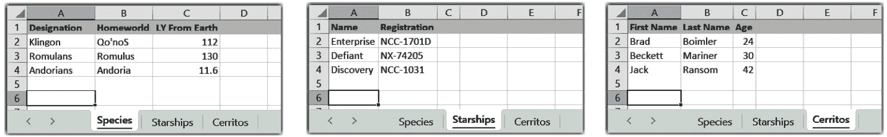
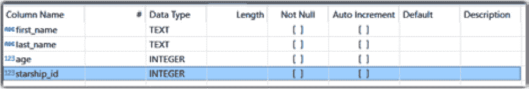
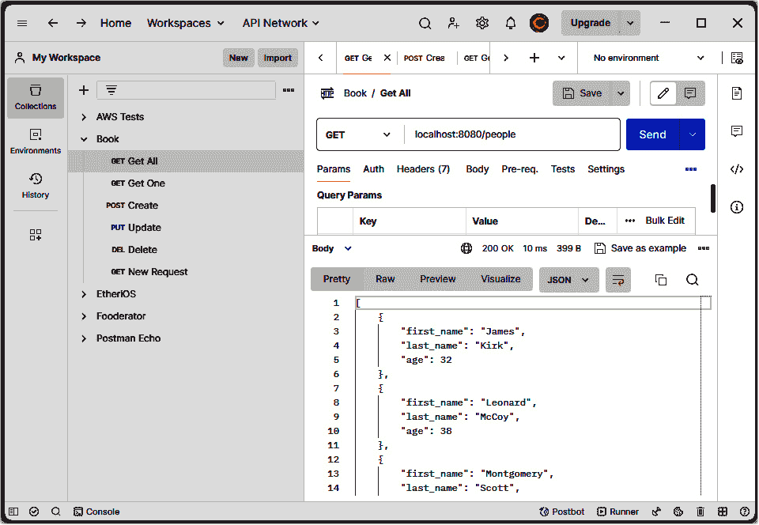
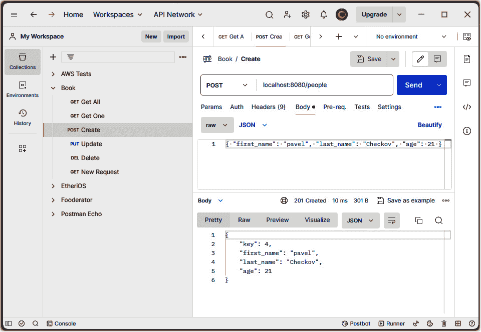
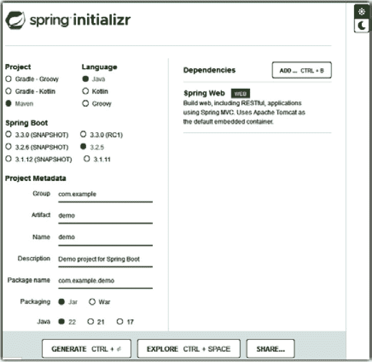
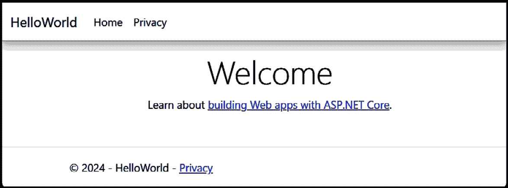
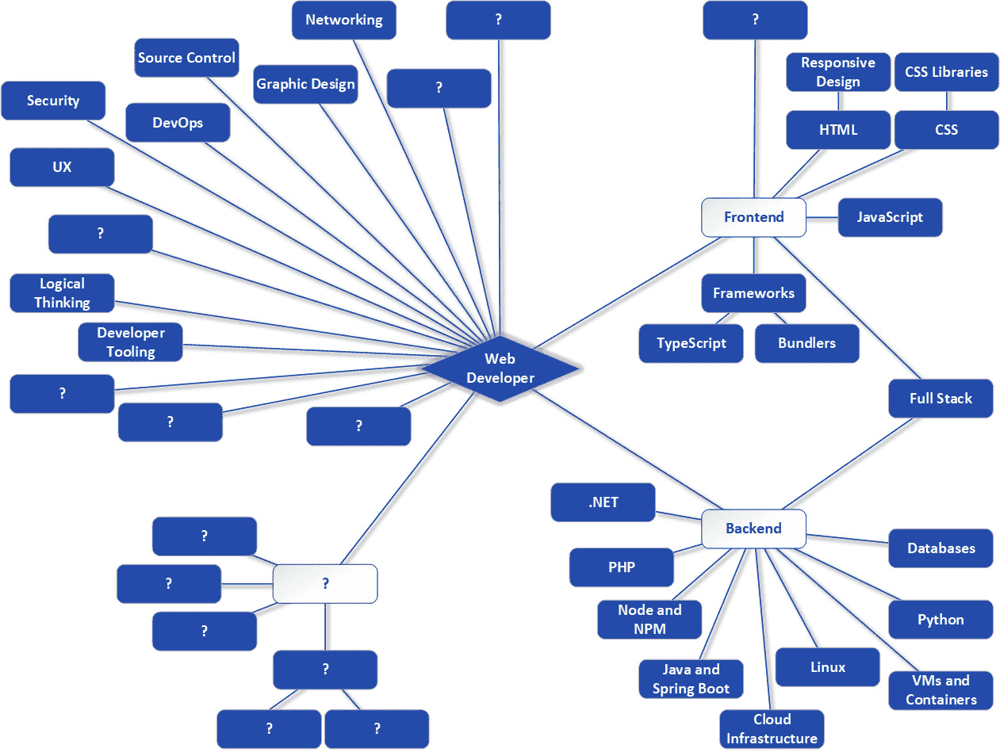

# 第七章：从前端到后端 - 更多关于后端工具和技术

在上一章中，我们主要关注前端。在本章中，我们将回到后端，并探讨一些其他的服务器端技术和概念。一个完整的网站或网络应用程序很少只有客户端 - 它几乎总是需要某种服务器来与之交互 - 因此，即使你最终决定专注于某一侧，了解这两者如何结合在一起对成为一名网络开发者也是有利的。

在本章中，我们将探讨可能是最重要的服务器端概念：数据。你将了解数据是如何存储和访问的，以及你将理解可以在数据上执行的基本操作。你将看到多种存储数据的方式，然后你将学习如何构建一个客户端可以使用来访问这些数据的设施。

当然，了解如何处理数据显然很重要，因为没有数据，一个网站可能不会有多大用处，但了解如何以一致的方式向客户端暴露数据（在这个上下文中，“客户端”通常意味着基于浏览器的应用程序）也很重要，因为它不仅允许你的应用程序或网站使用数据，还可能允许其他人以他们自己的方式使用数据，这是一项很棒的灵活性。

你还将了解一些构建服务器端代码的不同技术，除了你已看到的 Node 之外。这包括 Java、PHP、.NET，甚至一些 Python 选项。了解各种选项很重要，这样你就可以在构建服务器端代码时做出明智的决定（你可能会发现这个决定在很大程度上取决于个人偏好和先验知识，这通常是可以接受的）。

因此，在本章中，我们将涵盖以下主题：

+   抓住问题的核心 - 数据

+   使用 REST、Node 和 Express 构建网络 API

+   回到未来 - SSR

+   在服务器端使用 PHP

+   使用 Java 和 Spring Boot 进行构建

+   介绍.NET

+   使用 Python 网络应用程序框架

+   检查路线图

# 技术要求

如往常一样，你将想要这本书的代码下载包，以及`ch-07`目录中找到的代码。

但具体到这一章，你需要安装一个名为 Postman 的工具，稍后我们将用它来测试我们的后端代码。尽管在撰写本文时你可以不注册就下载这个工具，但你可能无论如何都会想要一个账户，因为它提供了扩展的功能。因此，请访问[`www.postman.com`](https://www.postman.com)，注册并下载 Postman 桌面应用程序。该应用程序适用于你使用的任何操作系统，所以你不太可能遇到安装上的麻烦。

你还需要安装.NET SDK，你可以从这里获取：[`dotnet.microsoft.com`](https://dotnet.microsoft.com)。这是微软提供的一个平台，用于开发各种应用程序，包括 Windows 原生应用程序和 Web 应用程序。这同样是一个标准安装程序，所以你 shouldn't have too much trouble – just grab the latest version available. Once you install it, go to Command Prompt and execute the `dotnet --version` command to confirm it’s ready to go.

最后，你还需要安装最新的 Java JDK，你可以从这里获取：[`www.oracle.com/java/technologies/downloads`](https://www.oracle.com/java/technologies/downloads)。Java 是目前使用最广泛的编程语言和平台之一，我们稍后会对其进行探讨。版本在这里并不重要，所以只需获取最新的版本（截至本文写作时为 21）。安装完成后，转到命令提示符并确保`java -–version`返回正确的版本。请注意，如果你遇到 JDK 或.NET SDK 无法正常工作的问题，你可以在它们各自的网站上找到安装帮助。

# 抓住问题的关键——数据

大多数网站或 Web 应用程序都需要某种类型的数据才能执行它们设计的目的。这当然不是一个令人震惊的声明。如果没有可供显示拍卖的数据，eBay 将无法工作。没有（大量）数据，Google 将无法进行搜索。没有支持数据，CNN 将无法展示最新的新闻标题。

但这些数据是如何存储的，又是如何被使用的呢？

到目前为止，你所看到的一切基本上都是静态的，这意味着它不会改变。页面在你创建它时是什么样子，它就会一直是那个样子。哦，可能会有一些微小的动态交互——比如当你将鼠标悬停在其上时按钮会突出显示——但这并不是我提到的那些网站产生的动态内容。那只能通过数据来实现。

网站可以使用的存储数据的方式有很多。可能最简单的方式是将数据存储为服务器上的纯文本文件。这些文件可以被读取——例如，可能使用基于 Node 的代码——并且它们的内 容可以在请求时用来创建动态响应。

简而言之，这正是我们在这里讨论的：当客户端（通常是 Web 浏览器）请求时，在服务器上动态创建响应，并将它们返回给用户进行显示。

虽然纯文本文件可以工作，但更常见的方法是某种形式的**数据库**。数据库通常是一段运行在服务器上的软件，与你的 Web 服务器软件以及你的应用程序代码分开，用于存储数据并能够响应对数据的请求（或写入数据）。虽然在某些情况下，网络浏览器可以直接访问这样的数据库软件，但更常见的是有一些服务器端代码来这样做，然后使用这些数据来生成响应。这更常见的原因仅仅是安全性：你的代码可能受到对数据库滥用的保护，而直接给用户访问数据库的权限则很可能缺乏这种保护。

有几种不同类型的数据库，但对你这个初出茅庐的 Web 开发者来说，最相关的两种是**关系型数据库**和**NoSQL 数据库**。我们先来谈谈关系型数据库。

## 关系型数据库

关系型数据库在概念上看起来与电子表格非常相似——比如说，Microsoft Excel。在电子表格中，你有行和列。它们相交的地方是单元格，在单元格中，你通常会有一些数据。在 Excel 电子表格中，你也可以有多个工作表，通常用于存储不同类型的数据。*图 7.1*展示了这些概念：



图 7.1：一个 Excel 电子表格，展示了多个工作表以模拟数据库和表

如果你已经理解了电子表格的基本结构，那么要理解关系型数据库，你实际上只需要改变一些词汇！

Excel 中的整个电子表格在概念上就是我们所说的*数据库*，而电子表格中的每一张表在那个数据库中被称为*表*。在数据库软件中，如果你需要的话，通常可以拥有多个数据库。这可能会让人困惑，因此为了消除歧义，我们倾向于说*数据库服务器*与普通的*数据库*：

+   数据库服务器指的是运行在服务器上（如 Oracle MySQL、PostgreSQL 和 MS SQL Server 等）的软件，它包含数据库并提供与数据交互的基本功能

+   术语*数据库*——与上述的数据库服务器不同——指的是为特定目的而实际收集的表集合，可能每个服务器上托管一个网站，但所有这些都生活在数据库服务器软件中

在数据库表中，你定义有哪些列——你想要存储关于表中每一行数据的哪种类型的数据——然后你就有数据本身的那一行。如果你把每一行数据——我们通常称之为**记录**——看作是一种实体，比如说一个人或一个银行账户，那么列实际上描述了你想要存储的关于每个实体的信息。

例如，假设你想要创建一个数据库表来存储一些关于人的信息。我们将非常缺乏创意，所以我们将称这个表为`People`。也许对于每一行数据——它将是一个人实体——你想要存储他们的名字、姓氏和年龄。结果，你可能会得到一个看起来像*图 7.2*的数据库表：


图 7.2：`People`表的结构

注意

作为补充，你可能永远不会存储一个人的年龄，因为显然一年后那个年龄就不会正确了。相反，你可能会存储他们的出生日期，并在需要时从那个日期计算他们的年龄。但在这里，我尽量让这个例子尽可能简单。

对于每一列，你必须告诉数据库将存储什么类型的数据。每个数据库都会以不同的方式指定每列的数据类型，但它们都与你所知道的内容相关。在这里，你可以看到`first_name`和`last_name`是字符串（在这个特定的数据库中，它们的数据类型是`TEXT`），而`age`是一个数字（数据类型为`INTEGER`）。在这里需要更改的另一项术语是，我们通常将数据库中的一个单一数据元素称为字段，而不是像电子表格中的单元格那样。但它们仍然是相同的基本东西：它是行中对应给定列的值。

在定义了基本的表结构之后，我们可以在其中存储一些数据行；也许这些数据（是的，这些确实是系列开始时的实际年龄——我做了研究！）：

```js
FIRST NAME, LAST NAME, AGE
James, Kirk, 32
Leonard, McCoy, 38
Montgomery, Scott, 43
```

但我们实际上如何存储这些数据呢？这就是结构化查询语言的概念发挥作用的地方，这是我们接下来要讨论的。

### 介绍 SQL

**结构化查询语言**（**SQL**）是一种用于与关系数据库交互的特殊语言。它允许我们使用一种通常容易理解的形式来请求数据，试图让它看起来更像 JS 而不是编程语言。

举例来说，让我们直接用一个例子开始，假设你想要从我们的`People`表中获取所有三条记录。对应的 SQL 语句会是这样的：

```js
SELECT * FROM People;
```

就这些了！你将得到一个记录列表，每个记录都包含每个人的名字、姓氏和年龄。这显示了最基本的 SQL 语句类型：`SELECT`语句。我们告诉它我们想要从每条记录中获取什么数据（在这种情况下，星号表示所有），然后我们必须说明从哪个表获取记录。

如果我们只想获取姓氏，我们会执行以下操作：

```js
SELECT last_name FROM People;
```

如果我们只想获取姓氏和年龄，我们可以执行以下操作：

```js
SELECT last_name, age FROM People;
```

如果我们只想获取超过 40 岁的人呢？这就是`WHERE`子句发挥作用的地方：

```js
SELECT * FROM People WHERE age > 40;
```

现在，我们将只获取一条记录——蒙哥马利·斯科特，因为这是唯一一条`age`值大于`40`的记录。

在这里，`SELECT` 语句如此类许允许其他功能，包括对返回的数据进行排序、以各种方式过滤，以及许多可以用来操作返回数据的函数（例如，将名称转换为大写，也许）。但最终，获取数据的基本能力才是关键所在。

当然，检索数据很棒，但如果我们要添加一个人呢？这也可以通过 SQL 完成，使用一个 `INSERT` 语句：

```js
INSERT INTO People (first_name, last_name, age) VALUES ('Pavel', 'Chekov', 21);
```

我们必须提供要插入数据的表名，然后列出要插入的字段，然后是每个字段的值。执行该语句后，表中将有四行数据。

关于更改现有数据呢？这也可以使用 SQL 的 `UPDATE` 语句来完成：

```js
UPDATE People SET age=50 WHERE last_name='Kirk';
```

再次强调，我们必须指定我们更改数据的表，然后指定要更改的字段。

当然，如果我们想更新多个字段，也是可以的：

```js
UPDATE People SET first_name='Jim', age=50 WHERE last_name='Kirk';
```

`WHERE` 子句在这里实际上是可选的，但如果不提供它，结果将是**所有**表中的记录都将被更新，因为没有限制它影响的记录。因此，在处理 SQL 时，确保你的数据更改语句只更改你打算更改的记录是很重要的。

你需要了解的 SQL 语句的最终形式是用于删除数据：

```js
DELETE FROM People WHERE age < 30;
```

再次强调，你必须指定要操作的表，然后指定一些 `WHERE` 子句来确定要删除的记录。与 `UPDATE` 语句一样，`WHERE` 子句是可选的，所以除非你真的打算删除表中的所有记录，否则请务必包括正确的标准来匹配记录！

这些当然是可能的最基本的 SQL 语句——随着你进入更高级的使用案例，SQL 可以变得相当复杂——但如果你理解这四种类型语句背后的基本思想，那么你将很好地开始理解更高级的使用案例。

现在，其中一个更高级的使用案例是当表之间有直接关系时，这就是关系型数据库中“关系”一词的由来，所以让我们接下来谈谈这个。

### 在关系型数据库中引入关系

如你所知，数据库中可以有多个表。例如，除了 `People` 表之外，我们现在添加一个 `Starships` 表，如图 *7.3* 所示：


图 7.3：Starships 表的结构

目前，这两个表之间没有真正的关联，也没有任何东西将它们联系在一起。有时这没问题，但如果我们想知道每个人服务的飞船是哪一艘？我们可以通过修改 `People` 表来实现，如图 *7.4* 所示：



图 7.4：People 表的结构，现在包含 starship_id 列

现在，已经添加了`starship_id`列，并且假设每行数据中该字段中的值与`Starships`表中记录的`id`值之一相匹配，我们实际上已经连接了这两个表，现在至少可以间接地告诉每个人在哪个星球飞船上服役。换句话说，我们在这些表之间创建了一个*关系*，这使得现在成为一个真正的*关系型*数据库。

但这对我们的 SQL 查询有什么影响呢？嗯，它们的工作方式与之前相同，但现在我们有一些新的能力在我们的指尖，因为我们可以根据关系同时查询两个表中的数据：

```js
SELECT p.first_name, p.last_name, p.age, s.starship_name FROM People p, Starships s WHERE s.id = p.starship_id;
```

现在，我们将为每个返回的记录获取四条数据：每个人的名字、姓氏和年龄，以及他们服役的星球飞船。但我们需要指定我们正在从两个表查询并将数据组合在一个结果集中，这个概念被称为`p`代表`Person`表，`s`代表`Starships`表。

然后，我们将这些名称用作查询中所有列名称的前缀（再次，以确保 SQL 确切知道我们想要哪些字段）。

最后，我们必须在这里提供一个`WHERE`子句。它表示对于`People`表中的每个记录（因为它是`FROM`子句中表列表中的第一个），在`Starships`表中找到一个与`People`表中的`starship_id`值匹配的`id`值的记录。并且由于我们在字段列表中返回`s.starship_name`，我们最终得到了来自`People`表每个人的数据，以及他们服役的星球飞船的名称。

这实际上是关系型数据库的主要点：能够根据它们之间的一些关系返回来自两个或更多表的数据组合。这里的关系是`id`字段，所以当它们匹配时，两个表的数据就组合在一起，并作为查询结果的一部分返回。连接是一个广泛的话题，可能会很快变得相当复杂（它涉及到集合理论的数学概念），所以我们在这里不会详细讨论。但基本概念始终相同：你的查询通过基于一个或多个匹配条件将多个表的数据组合起来，并将它们作为一个单一的数据记录列表返回。

注意

如果你想要更深入地了解各种连接类型以及如何编写它们，一个好的参考资料可以在这里找到：[`learnsql.com/blog/sql-joins-types-explained`](https://learnsql.com/blog/sql-joins-types-explained)。

即使从这个简单的例子中，我相信你也能开始看到关系型数据的强大之处。你可以有一个学生列表和一个单独的班级列表，并且能够编写一个查询来获取每个学生参加的班级列表。或者，你可能有银行账户列表和每个账户的所有者列表分别在不同的表中，但在需要时能够将它们联系起来。

然而，为什么要这样做呢？关系型数据库的主要目标之一是不要重复数据（或者更精确地说，尽可能少地重复数据——这个过程被称为`People`表本身，在每一行数据上。这对我们的目的来说效果是一样的。但是，如果星际飞船的名字改变了，那么我们就需要相应地更新`People`表中的所有记录。如果我们有两组表并且像这样连接它们，那么你只需要在`Starships`表中更改名字——在一个地方，一个记录——实际上，在查询时，它对每个服务在该飞船上的人（即当时）都会自动更改。这是一种更逻辑地处理数据的方式，因为星际飞船的名字在逻辑上并没有与一个人绑定——它们实际上是独立的实体，而且在存储空间（在某些情况下，性能也有所提高，但这很大程度上取决于具体情况，实际上可能会有相反的效果）方面也更有效率。

在这个阶段，你可能想知道如果你正在处理的数据本身不是关系型的，你会怎么做。还有，如果你想要存储的数据形式不像你迄今为止所看到的表格那样具体，你会怎么做？嗯，对于这种情况，还有一种可能更适合的数据库类型——NoSQL 数据库。

## NoSQL 数据库

简而言之，NoSQL 数据库实际上是指任何不使用 SQL 来操作数据的存储数据机制（我们通常称之为*数据存储*）。这包括以下类型的数据库：

+   `"first name"`，该键的值是`"Frank"`。这几乎是 NoSQL 中最简单的类型了，它用于数据非常简单的情况。你可能听到的这种类型的常见名称包括 Redis 和 DynamoDB，这两个产品提供了键值数据库存储。

+   **图数据库**：这些数据库相对较新，专门用于具有（通常很多）实体之间定义良好的连接的数据类型。一个例子可能是一个社交网络：你是一个实体，你可能有很多朋友，他们也可能有很多朋友，以此类推。虽然这些类型的关系可以在关系型数据库中建模，但图数据库可能更合适，尤其是当你需要*遍历图*时，这意味着从一个实体开始，跟随其连接到某个远程实体。你可能听到的这种类型的常见名称包括 Neo4j 和 Amazon Neptune。

+   **宽列存储**：这种数据库类型主要用于需要分析特别大的数据集的情况。它们通过将数据列存储在行中来工作，这允许优化每个实体中许多字段上的复杂查询。这种类型的例子包括 Apache Cassandra 和 Google Bigtable。

还有一种称为**文档数据库**的第四种类型——我把它从列表中省略了，因为虽然所有前面的类型都是 NoSQL 数据库，但事实是，当有人说 NoSQL 数据库时，十有八九他们指的是文档数据库。

在文档数据库中，数据存储在对象中，通常是 JSON 对象，尽管不一定是。你已经见过几次 JSON 了：当你初始化一个项目时，`npm`生成的`package.json`文件。但存储在其中的数据格式是**JSON**，代表**JavaScript 对象表示法**。有趣的是，尽管它肯定是在 JS 的背景下发明的，但现在它经常被用于这个背景之外，因为它相对简单且易于处理。归根结底，它只是一个字符串，可以轻松解析并以各种方式使用。

其中一种方式是作为一个文档存储在文档数据库中，比如 MongoDB，它是文档数据库中当之无愧的最大品牌（CouchDB 也是一个流行的品牌）。例如，如果我们想在 MongoDB 中存储之前提到的`People`表中的数据，我们最终会得到四个独立的文档，可能看起来像这样：

```js
{ first_name: "James", last_name: "Kirk", age: 32 }
{ first_name: "Leonard", last_name: "McCoy", age: 38 }
{ first_name: "Montgomery", last_name: "Scott", age: 43 }
```

与其作为表中的行不同，每一个都是独立的对象——一个文档——存储在**集合**中，这大致对应于关系型数据库表。

关系型数据库和文档数据库之间有一个很大的区别。假设我想存储一个昵称，但只针对莱纳德·麦科伊。在关系型数据库中，我需要在表中添加一个`nickname`列，并且每一行都需要有一个昵称（当然，对于没有昵称的人来说，它可以是空的）。然而，在文档数据库中，我可以简单地这样写麦科伊的文档：

```js
{ first_name: "Leonard", last_name: "McCoy", age: 38, nickname: "Bones" }
```

其他文档没有`nickname`字段并不重要；这是完全有效的。你看，数据库的结构，包括表中的字段，被称为**模式**。由于表中的所有数据行都共享相同的列，因此表本质上定义了所有行的模式。

但在文档数据库中，定义模式的是文档本身。实际上，是**你**作为开发者（！），但重点是每个文档在某种程度上可以有自己的模式。

这有几个好处。其中一个好处是，使用文档数据库通常可以更快、更轻松地开发，因为与关系型数据库不同，你不必一开始就做对一切。在关系型数据库中，你必须考虑你想存储的数据，并且你必须在开始时构建具有适当列和数据类型的表（虽然你可以在表创建后更改表的结构，但这有时会带来限制，有时甚至不可能，即使可能，也需要时间和精力）。

另一个好处是，随着你的开发，当你意识到需要在新文档上使用稍微不同的模式时，你不必一定修改现有的数据。只要你的代码理解可能的不同，你就可以有效地处理文档的两个版本。

现在，一个常见的误解是，NoSQL 数据库，特别是文档数据库，没有关系数据。当然，*可能* 是这样，但使用文档数据库并不意味着你的数据 *不能* 有关系。可能公平地说，*大多数情况下* 它不会有关系，如果它确实有关系，那么可能更合适使用关系数据库。但一个不会否定另一个。

NoSQL 数据库确实提供了执行所有基本 CRUD 操作的机制，包括查询相关数据。这里我不会详细介绍这些，因为它们可以从数据库到数据库有很大的不同。然而，鉴于它是最受欢迎的 NoSQL/文档数据库，这里有一个来自 MongoDB 的例子，以便你有一个大致的了解：

```js
db.users.find({ "age": 38 })
```

这在 SQL 中相当于以下操作：

```js
select * from People where age=38;
```

就像 SQL 一样，随着文档的复杂度增加，这样的语句可能会变得相当复杂，如果它们之间存在关系，等等。但简而言之，这就是你如何处理它们，而且根据你的需求和服务器端基础设施，这些代码可以用多种语言编写。

所有这些数据库讨论最终导致最后一个一般性话题，但我要警告你，在阅读下一节之前，你可能需要花一点时间停止咯咯笑，因为接下来会有一些 CRUD！

## 基本 CRUD 操作

我知道，我知道——这听起来很脏，但我发誓这是一个真正的术语！首字母缩略词 **CRUD** 代表 **创建（Create**）、**读取（Read**）、**更新（Update**）和**删除（Delete**），它定义了你可以对数据进行的基本操作，无论是在关系数据库中还是不是。你当然可以执行以下操作：

+   创建数据，就像使用一个 `insert` SQL 语句一样

+   读取数据，就像使用一个 `select` SQL 语句一样

+   更新数据，就像使用一个 `update` SQL 语句一样

+   删除数据，就像使用一个 `delete` SQL 语句一样

即使只是为了能够与其他开发者进行有意义的对话，了解这些术语也是很有价值的，即使你每次说这些术语时可能会自己笑出声！而且这些操作在代码中的实现方式并不重要；重要的是，从概念上讲，它们是你以任何形式处理数据的唯一方式。

但是，当然，这些操作如何实现 *在其他方面* 也是很重要的。这些 CRUD（哈哈）操作通常是构建所谓的 Web API 的基础，这些 API 是可以从远程系统调用的函数集合。当涉及到构建 Web API 时，今天最常见的方法是使用另一个首字母缩略词（这个领域充满了首字母缩略词，如果不是别的的话）：REST。这就是我们接下来要调查的下一个东西。

# 使用 REST、Node 和 Express 构建 Web API

在我们谈到 REST 之前，先让我们一般地谈谈 API。

**API**是**应用程序编程接口**。这可以简单地是一组函数，程序或库为其他代码使用提供的。API 可以是位于调用它的代码所在同一台机器上的代码，或者 API 可以通过网络公开，例如互联网和万维网。在后一种情况下，我们称之为 Web API、远程 API，有时也称为云 API。所有这些术语的含义相同，即：可以通过网络调用的函数，而且它们在以这种方式构建时往往具有语言和甚至技术无关性，这意味着一个 JS 客户端可以调用用 C 构建的 Web API，或者用 Python 编写的代码可以调用用 PHP 构建的 Web API，等等。

结构化和构建这样的 Web API 有非常多方法，有很多不同的技术和模式可以用来构建它们，也有很多不同的形式。然而，在尝试了多种不同的选择之后，有一种方法脱颖而出，那就是 REST。

## 介绍 REST

在其核心，**REST**，即**表示状态转移**，只是以（相对）一致的方式结构化 HTTP 请求的一种方法。

Web 本身使用 REST 原则。例如，当你在浏览器中输入一个 URL 时，你是在请求一个基于唯一 URL 的资源，无论这个资源是一个 HTML 页面、一张图片，还是以 JSON 形式（在谈论 REST 服务时最常见）的一些数据。这就是万维网基本上是，这就是 REST 实际上也是！然而，现代的 REST 概念对这一基本想法进行了细化，使其更加明确。

我们所说的 RESTful 服务，即使用 REST 构建的 Web API，以明确的方式定义了标准 HTTP 方法的意义——例如`GET`、`POST`、`PUT`和`DELETE`——这样它们就有特定的含义。例如，使用`GET`发出的请求意味着检索资源。`PUT`（通常）意味着更新某些现有资源，而`POST`（通常）意味着创建一个新资源。`DELETE`当然字面上意味着删除一个现有资源。当然，我们是在谈论某个服务器上的数据。

将构成缩写词*REST*的单词分解开来有助于理解它：

+   词语*representational*指的是当你从 API 请求数据时，你得到的是一些资源的*表示*，这种表示是以你可以消化在代码中的形式，但并不是资源本身。例如，虽然一个支票账户资源可能以某种二进制形式存储在服务器上的数据库中，这种形式对客户端来说像是乱码，但你可以用诸如 JSON 这样的东西来表示该账户，JSON 本质上只是具有特定格式的纯文本，任何客户端都可以使用。

+   “状态”这个词指的是资源的当前状态。换句话说，当你请求一个支票账户的表示形式时，你得到的是它在请求时的表示形式。

+   “转移”这个词字面意思是将那种表示形式通过网络传输。

所以，把这些放在一起：REST API 是一种将服务器上存储的资源表示形式在当前状态下传输，或者以某种方式允许更新当前状态或删除资源的 API。

那是理论；现在，让我们从更实际的角度来看一下 REST。

## 实践中的 REST

当你与 REST API 一起工作时，你可能会有一个指向服务器上资源的 URL——比如说，一个支票账户：

[`my-awesome-web-api.com/checking-accounts/1234`](https://my-awesome-web-api.com/checking-accounts/1234)

如果你向那个 URL（它不是一个真实的 URL，但让我们假装它是）发起`GET`请求，它将返回给你账户编号为 1234 的支票账户的表示形式。这种表示形式可能有多种形式，但使用 RESTful API 时最常见的是 JSON。所以，你可能会得到如下所示的响应：

```js
{ account_number: 1234, balance: 546.32, date_opened: "12-15-2017" }
```

如果你想要获取所有账户的列表，那么你只需从 URL 中删除`/1234`部分（很可能是这样），你很可能会得到一个对象表示形式的数组。

现在，如果你想更新那个账户的余额（显然，在这个讨论中我们忽略了安全问题！），你通常会使用相同的 URL 发起请求，但这次使用 HTTP `POST`方法，并在请求体中提供一些 JSON 数据，如下所示：

```js
{ new_balance: 771.10 }
```

API 的确切语义——你得到的数据格式和你为更新传递的数据——会因服务而异，但这里的基本思想是 HTTP 方法的意义以及 JSON 在两种情况下都被用来表示支票账户的事实。一些 API 可能要求你发送回从`GET`请求中接收的确切表示形式，其中要更新的字段具有新值；而其他 API 可能只需要更新字段，就像我这里展示的那样。

注意一个关键点，即 URL 本身就是识别我们正在操作的资源——在这个例子中是支票账户——的标识符。这就是为什么它不需要包含在发送的 JSON 中（很可能——再次强调，语义可能因服务而异）。

同样地，要删除那个账户，你还是会使用相同的 URL，但现在使用 HTTP `DELETE`方法。这种变化就足以让服务器端代码识别你想要做什么，因为在这个对话中，HTTP 方法本质上是一个动词，描述了你对 URL 指向的资源想要执行的操作。

要创建一个新账户，这会变得有点棘手。虽然我们知道我们需要使用`PUT`方法，但显然 URL 上没有现有的检查账户号码可以放置，那么在这种情况下 URL 看起来像什么？答案是这又取决于 API 的语义。有些人会让你在账户号码的位置放置诸如`/add`或`/addNew`之类的路径。有些人可能不需要任何东西，只需将`PUT`方法视为你想要添加账户的信号。

这引出了一个重要的观点，我在整个讨论中通过使用模糊术语暗示过：有 REST，或者 RESTful，还有 REST-like。这意味着一些开发者会非常严格地遵循 REST 原则（成为 RESTful）。这样做的问题在于，有时你将不得不在 API 的设计中做出妥协，而这些妥协并不是最优的。例如，有些人说之前描述的`/add`模式不是“正确”的 REST，但他们通常没有很好的答案来解释“正确”的答案是什么。

相比之下，你可以更加灵活一些，设计你的 API 使其成为 REST-like，这意味着你遵循定义 REST 的*大多数*架构指南，但允许其中有一定的可互换性。几乎总会有一些情况，事情并不像你希望的那样完美地符合 REST 模型。即使是 HTTP 方法的含义也可能存在争议。虽然`GET`和`DELETE`几乎从未被争论过，但一些开发者说，`POST`应该用于更新而不是`PUT`，等等。

没有一个标准的“你必须遵循这些 REST 规则，否则会有麻烦！”的规则，任何人都可以指向。REST 不是一套指南；它是一个架构原则，这些通常没有明确的规则可以遵循。

因此，我的建议是偏向于 REST-like。只要你在使用具有一致意义的 HTTP 方法，并且只要你在使用 URL 来标识要处理资源，那么你大约已经完成了 90%的“正确”REST。如果你还使用 JSON 来表示这些资源，那么这可能会让你达到大约 98%。

所以，这就是 REST 的本质，但你是如何构建一个 RESTful Web API 的呢？让我们看看一种你多少熟悉的方法：Node 和 Express。

## 构建你的第一个 REST API

我们将像往常一样，使用 NPM 初始化一个新的项目。然后，我们将使用现在熟悉的`npm install –save express`命令添加 Express 作为依赖项。这为我们编写 RESTful API 奠定了基础。

让我们以我们之前的星舰人员数据库为例，创建一个 API，它将允许我们添加人员、删除人员、更新人员，当然，查询人员。为了简化问题，我们的“数据库”（在这里简单地说是指数据集合，而不是之前讨论的正规数据库）将只是 JS 变量，因为我们现在专注于 API 部分，而不是数据库部分。我会将代码分解成易于消化的小块，但完整的文件是下载包中 `ch-07/rest` 目录下的 `restAPI.js`，它开始如下：

```js
const express = require(`express`);
const app = express();
app.use(express.json());
```

当然，我们需要导入 Express 本身并创建一个 Express 应用程序，然后添加一些中间件来处理请求中发送的 JSON。这些内容你在*第三章*中已经看到了。

之后，我们在 JS 变量中创建我们的“数据库”：

```js
let people = { };
people[1] = { first_name: `James`, last_name: `Kirk`, age: 32 };
people[2] = { first_name: `Leonard`, last_name: `McCoy`, age: 38 };
people[3] = { first_name: `Montgomery`, last_name: `Scott`, age: 43 };
let nextKey = 4;
```

首先，创建一个空对象并将其分配给 `people` 变量。

接下来，我们在数据库中添加之前在数据库讨论中看到的三个船员，每个都是一个 JS 对象。

这里需要注意的是，JS 对象是所谓的**关联数组**。这是一种将值映射到键的数据结构。在 JS 对象中，字段名是键。这允许我们使用数组括号符号来访问这些字段（键名与值相关联，我们可以使用数组符号来访问它们，因此称为*关联数组*）。

而有趣的是，在 JS 中，对象的字段名可以是数字，所以我在这里使用了数字作为键。这允许我简单地通过递增 `nextKey` 变量（你在最后一行定义的）来为每个新添加的人员创建一个唯一的键。

因此，当该代码执行时，它会产生一个具有以下结构的 JS 对象：

```js
People = {
  1: { first_name: `James`, last_name: `Kirk`, age: 32 },
  2: { first_name: `Leonard`, last_name: `McCoy`, age: 38 },
  3: { first_name: `Montgomery`, last_name: `Scott`, age: 43 }
}
```

然后，我们可以使用键值（`1`、`2` 或 `3`）来访问对象中的人，以访问特定人员的对象。本质上，键作为人员的标识符，这允许我们通过该标识符请求人员。

数据库定义好后，我们可以在我们的 API 中设置第一个函数，这将是一个用于创建新人员的 `POST` 请求：

```js
app.post(`/people`, (inRequest, inResponse) => {
  const { first_name, last_name, age } = inRequest.body;
  const key = nextKey;
  nextKey = nextKey+ 1;
  people[key] = { key, first_name, last_name, age };
  inResponse.status(201).send(people[key]);
});
```

正如你在*第三章*中看到的，我们使用 Express 设置了路由，其中路由对应于 URL，我们调用应用程序对象上对应于路由应响应的 HTTP 方法的适当方法来完成此操作。这里，我们最终得到一个可以发送的 URL，如 [`localhost:8080/people`](http://localhost:8080/people)，这将触发此代码。

在函数内部，我们的中间件已经解析了传入的 JSON，其形式如下：

```js
{ "first_name": "Pavel", "last_name": "Checkov", "age": 21 }
```

单个值将被提取并添加到`inRequest.body`对象中。我们可以使用 JS 解构符号（如*第六章*中解释的那样）将值放入单独的变量中。从那里，我们取`nextKey`的值作为新对象的键，并确保我们增加它，以便下一次创建时得到一个新的键。然后，我们只需添加一个包含请求中接收到的数据的新对象，在刚刚创建的键下。

创建我们的 Web API 的最终一步是返回一个响应，因为没有它的话，这并不会有什么用处！但是，这里还有“正确”的 REST API 设计的一个方面：返回码也应该有一些意义，就像 HTTP 方法一样。

你可以在这里返回一个 HTTP 200 状态码（或响应码），因为 200 表示“OK”，或者“操作成功。”然而，代码 201 表示“已创建”，这似乎更适合像这样的对象创建函数。关于哪个更合适可能会有争议，但关键是要确保你的函数与响应码的意义保持一致。

无论你做出什么选择，它们都应该始终是合理的！虽然 200 或 201 是有意义的，但例如 500 就不合适，因为这个代码表示内部服务器错误（你可以在这里看到代码列表及其含义：[`developer.mozilla.org/en-US/docs/Web/HTTP/Status`](https://developer.mozilla.org/en-US/docs/Web/HTTP/Status))。

除了响应码之外，你返回的内容也是一个重要的考虑因素。而且，风险是听起来像一张破唱片，你可能会发现关于各种操作应该是什么样子的争论。但是，当创建像这样的资源时，一个好的做法是返回新的资源本身，因为调用者可能想要一个它的副本，尤其是如果包含了标识符，就像这里一样。这允许调用者拥有他们需要的所有信息——关键——以便稍后无需再次查询 API 即可删除或更新资源。

接下来，让我们看看一个获取所有人列表的函数：

```js
app.get(`/people`, (inRequest, inResponse) => {
  inResponse.status(200).json(Object.values(people));
});
```

是的，这只是一行简单的代码！我们只需要返回一个状态码 200（对于一个`GET`操作来说这是合理的，在我看来没有比这更好的了），这是一个 JSON 表示的值——`people`对象中每个人的对象。

我们将要编写的下一个函数是用来获取一个单独的人：

```js
app.get(`/people/:key`, (inRequest, inResponse) => {
  const key = inRequest.params.key;
  inResponse.status(200).json(people[key]);
});
```

当你定义 HTTP 请求的 URL 时，在这里通过再次调用`app.get()`，你可以为给定的 HTTP 方法有多个处理程序，但每个处理程序的 URL 必须不同，否则 Express 将不知道你想使用哪一个。在这里，通过添加`:key`元素，我们使 URL 不同。这是一个 Express 将填充并使它可在`inRequest.params`对象上可用的令牌。如果客户端向`/people`发出`GET`请求，那么之前定义的`app.get()`路由处理程序将执行，但如果他们改为向`/people/1`发出请求，那么这个函数将执行，URL 中的`1`值将成为`inRequest.params.key`的值。

这允许我们将值放入`key`变量中，然后我们可以使用它来访问`people`中的正确人员对象，并将其作为 JSON 发送给调用者，以满足请求。

注意

我应该利用这个机会指出，我非常简单化地编写了这段代码，为了实现这个目标，我忽略了一件事，那就是错误检查。例如，如果调用者传递了一个在`people`中不存在的`key`变量，会发生什么？按照现在的编写方式，他们将不会收到任何响应（或者，实际上，一个空响应——但这不是调用者期望的；这是重点）。你很可能想检查这种条件，并返回不同的状态码，比如 404 Not Found，也许在响应中还有一个字符串说它没有被找到（这也是那些可辩论的 REST 决策之一——有些人认为 HTTP 响应代码就足够了；其他人总是希望无论发生什么，函数都能返回`some`响应）。

好的，太好了——我们可以创建人员，我们可以获取所有人的列表，甚至可以获取一个特定的人员，那么更新现有人员怎么办？下一个是：

```js
app.put(`/people/:key`, (inRequest, inResponse) => {
  const key = inRequest.params.key;
  const { first_name, last_name, age } = inRequest.body;
  people[key] = { key, first_name, last_name, age };
  inResponse.status(200).send(people[key]);
});
```

URL 与获取人员的 URL 相同，这在逻辑上是合理的，因为在这两种情况下，调用者都需要指定我们正在处理哪种资源。但是，当然，我们需要不同的 HTTP 方法，所以这次使用`app.put()`来注册此路由的处理程序。在处理程序函数内部，我们将保持简单，并始终更新目标资源中的所有字段（通过创建一个新对象来实现）而不是挑选它们。这意味着调用者必须始终发送所有数据，即使是不变字段。然后，只需创建一个新的对象，用发送的数据填充它，将其分配给`people`对象中的适当键，并返回一个合适的响应。

由于没有 HTTP 响应代码能更清楚地表示更新成功，所以我选择了普通的 200（OK），这次只返回了`key`变量，因为调用者已经有效地在其当前状态中拥有数据的副本（可以说，甚至不需要发送回`key`变量，但在这个案例中，我更喜欢有`something`返回）。

我们必须编写的最后一个路由是用于删除人员：

```js
app.delete(`/people/:key`, (inRequest, inResponse) => {
  const key = inRequest.params.key;
  delete people[key];
  inResponse.status(200).send(key);
});
```

是的，就这么简单！这次，我们使用`app.delete()`，因为这是使用此功能所需的 HTTP 方法。我们从 URL 中获取`key`变量，并使用 JS 的`delete`关键字，它从对象中删除一个字段，以删除指定的人。最后，发送一个 HTTP 200 响应代码，以及被删除的`key`变量（再次，因为我认为不只是一个空响应更合适，但这将是你自己工作中需要做出的决定）。

有了这个，我们就有了我们需要的所有 Web API 功能。现在，我们只需要启动 Express 服务器，从而使我们的 API 变得活跃：

```js
app.listen(8080, () => {
  console.log(`API is up and running on port 8080`);
});
```

我们在端口`8080`上运行它，一切正常。

现在，你当然可以离开并编写一些代码，比如一些在浏览器中运行的 JS 代码，以调用这个 API。但在你这样做之前，作为一个想要成为优秀的 Web 开发者，你可能需要测试一下，对吧？你有很多选择，但我接下来要特别谈谈一个非常受欢迎的选项：Postman。

## 使用 Postman 测试 API

一旦你有一个 API 正在运行，测试它可以通过多种方式完成，但许多开发者使用的一种方式是名为 Postman 的工具。这是一个 GUI 桌面应用程序，允许你向任何你需要的东西发送各种 HTTP 请求，包括你现在应该在机器上运行的 API。使用 Postman，你可以定义请求，包括它们使用的 HTTP 方法、使用的 URL 以及与它们一起发送的任何数据，并且你可以通过点击按钮来触发这些请求。Postman 可以显示响应，甚至可以将原始响应重新格式化，使其更容易阅读。

例如，测试从我们的模拟数据库检索所有人的`GET`操作很容易：

1.  启动 Postman 并在必要时登录。

1.  如果你还没有工作区，创建一个（它可能会默认为你创建一个）。

1.  在左侧，你应该看到一个**集合**标签。集合只是逻辑上相关的请求的组。使用你将在**集合**标签旁边看到的**+**按钮创建一个新的集合，并给它起一个你喜欢的名字（我创造性地把它叫做**书**）。

1.  点击集合，使其高亮显示，此时你应该在名称右侧看到一个带有三个点的菜单。点击菜单，然后选择**添加请求**选项。你应该看到一个新请求被添加，在右侧，应该出现一个新的标签，其中包含请求的所有详细信息；Postman 应该自动将焦点放在请求的名称上，以便你可以在那里输入任何你想要的。

1.  确保在下拉菜单中选择请求名称下方的**GET**方法。

1.  在方法右侧的框中，最初应该显示为**输入 URL**，输入以下 URL：[localhost:8080/people](https://localhost:8080/people)。

1.  然后，你应该能够点击**发送**按钮来发送请求，并且结果应该出现在底部的**响应**部分。

*图 7.5* 展示了所有这些操作完成正确时的样子：



图 7.5：Postman，包含一个书集合，添加了一个 Get All 请求，并成功返回了 Get All 响应

然后，你可以添加一个请求来测试创建新人员。这和开始时在集合中创建新请求的流程相同；然而，这次，方法将是 `POST` 主体内容以发送。它将只是某些 JSON，可能如下所示：

```js
{ "first_name": "Pavel", "last_name": "Checkov", "age": 21 }
```

在 **Body** 选项卡的右侧，你还需要选择数据类型为 **JSON**。完成这些后，你应该能够触发请求并获得有效的响应，如图 *图 7.6* 所示：



图 7.6：Postman，显示一个成功的 Create 响应

作为练习，请继续添加更新和删除人员的请求。记住，在这些情况下，URL 需要包含末尾的键（例如，如果 4 是从创建调用返回的键，那么可能是类似 [localhost:8080/people/4](https://localhost:8080/people/4) 的内容）。稍作尝试，创建一个人，然后进行 **Get All** 操作以查看它已被添加，然后可能更新一个人并为此特定人员进行 **Get** 操作以查看更新，最后删除那个人，然后进行最终的 **Get All** 操作以查看他们已被移除。

这只是使用 Postman 的基本操作；它具有比这更多的功能：

+   你可以编写脚本来执行多个请求，以更全面地测试你的目标

+   你可以包括 cookie、头部以及 HTTP 请求允许的所有其他好东西

+   你可以为需要安全凭证的 API 提供安全凭证

+   你可以模拟浏览器发送表单而不是发送 JSON

+   你可以测试 GraphQL 服务器，这是一种你可以以安全的方式直接将数据库暴露给客户端，并且根据他们自己的特定需求查询数据的方法。

+   你可以设置证书以能够测试 HTTPS 端点

简而言之：如果是通过 HTTP/HTTPS 完成的，那么你几乎肯定可以用 Postman 完成。这是一个伟大的工具，它允许你在编写所有客户端代码之前测试你的服务器端代码。

但除了开发期间，另一个可以使用像 Postman 这样的工具的情况是，如果你的代码对于客户端到服务器的特定请求不起作用。问题可能出在客户端代码或服务器代码中。你怎么知道是哪一个呢？一个很好的开始方法是完全从方程中移除一个或另一个。如果你使用 Postman 测试你的 Web API 并发现出现问题，那么你就发现了问题一定在服务器端，因为客户端没有参与。好吧，公平地说，随着你经验的积累，你会发现这个说法并不总是像看起来那样具体！但至少这是一个通向正确道路的一般稳健方法。

现在你已经对数据库和 Web API 有了一些了解，让我们谈谈之前已经触及但还有更多话要说的话题，那就是“经典”Web 与“现代”（基于 SPA 的，主要是）Web 的比较，以及旧的就是新的，在某种程度上，以 SSR 的形式。

# 回到未来——SSR

在*第三章*中，我们讨论了 SPA 以及它们如何导致不同的 Web 开发模型。我们讨论了这种新模型与经典模型的不同，在经典模型中，页面上的每一次交互都会导致对服务器的请求，服务器生成一个全新的 HTML 页面来显示。而新模型则依赖于 JS：客户端向服务器请求数据，客户端代码随后对其进行处理，最常见的是以某种形式显示它。

当我们查看 React、Vue 和 Angular 时，我们看到了初始 HTML 文档基本上是空的，最终在浏览器中显示的所有内容都是由客户端机器上的 JS 即时创建的。

然而，有趣的是，正如这个领域中的许多事物一样，摆锤正在稍微向相反方向摆动，这一次是以**SSR**的形式，它代表**服务器端渲染**。使用 SSR，网页在服务器上渲染并返回给浏览器。

但等等——这难道不是在 SPAs 之前就存在的事情吗？!

是的。是的，确实如此。车轮转动，不是吗？

但正如你可能猜到的，SSR 和仅在 Web 服务器上拥有静态 HTML 页面之间还是存在区别的。

使用 SSR 时，通常只有第一次请求会生成新的 HTML 页面。服务器将一个本质上为 HTML 页面的模板合并一些数据，然后返回最终的 HTML 给客户端。然而，有趣的是，其中一些工作实际上可以通过在服务器上执行 JS 而不是在浏览器中执行来完成。实际上，服务器就像一个网络浏览器，尽管它不显示 HTML。你甚至可以使用 React、Vue 和 JS 等库在服务器上渲染内容。服务器生成最终的 HTML 文档，就像浏览器通过执行 JS 一样，并将其完整地返回给浏览器。这通常（实际上几乎总是）包括所有必要的 CSS 和 JS，它们都嵌入在 HTML 文档中。

客户端发生的后续操作可能会导致调用服务器以生成整个新的 HTML 文档，在这种情况下，SSR 就像经典模型一样。但更常见的是，在初始页面加载后，事情开始像 SPA 一样运作，即服务器被调用以获取数据，然后以某种方式在客户端渲染或使用这些数据。我们最终得到一种混合的方法。

你可能会问，为什么有人想这样做？有几个很好的理由：

+   **性能**：特别是当我们谈论网站最初加载速度时，性能是一个关键指标。通过使用服务器来完成这项工作——这些服务器在大多数情况下比客户端机器更强大，并且更接近它们所需的数据——返回完整的文档可以比返回 HTML 文档（然后创建新的请求以获取资源，如 JS、CSS 和图像文件，然后使用 JS 渲染内容）明显更快。

+   **搜索引擎优化（SEO）**：这是在网站上包含搜索引擎用于对您的网站进行排名的内容的艺术。正确调整此内容可以使您在搜索结果中更快地显示出来，这对于公共网站来说是一个关键考虑因素。对于仅作为 SPA 运行的网站，该内容仅在请求时存在于客户端机器上，因此搜索引擎更难索引您的网站，您也更难进行 SEO。但是，使用 SSR 时，由于服务器返回的是完整的 HTML 文档而不是几乎空的文档，因此您可以启动 React、Vue 或 Angular 应用程序，搜索引擎“看到”更多内容可以索引，当 SEO 做得正确时，这会导致搜索结果中的排名更高。

+   **更好的设备支持**：因为大多数渲染完整 HTML 的繁重工作都在服务器上完成，这允许较弱的客户端设备有更好的体验。例如，全球仍在使用的旧手机，通常在渲染完整的 HTML 页面（从其角度来看是静态的）方面会比在手机上运行大量复杂的 JS 来动态生成 HTML 要容易得多。

大多数现代框架现在都支持 SSR。实际上，在某些情况下，这可以像在配置文件中切换一个开关一样简单，突然间，你会发现你的初始 HTML 文档已经在服务器上被渲染了。尽管在许多方面，比如经典的模型，这个模型到现在已经有 30 多年历史了，SSR 相对较新。好吧，有点新：它实际上在 2010 年左右就被引入到一些现代框架中，而在网络开发中，10 年真的不算长！但它在开发者心智份额方面开始崭露头角，因为它已经成为现代框架的一个更标准的部分。

但它仍然是一个可选的东西。没有 SSR 也能做 SEO 吗？是的，可以，尽管这可能更具挑战性。例如，你有时会发现你可能需要在你的静态 HTML 页面中包含一些不可见的内容，当它到达浏览器时会被移除——但然后，你会发现搜索引擎似乎已经发现了这样的伎俩，所以它可能不会像你希望的那样有效，或者在某些情况下根本不起作用。而且，你的用例可能根本不值得使用 SSR，因为它确实使事情复杂化，每次你在网络开发中增加复杂性时，你都必须进行成本效益分析，以决定它是否值得。

另一种可能性是使用服务器端技术来渲染你的初始 HTML 文档（以及处理后续的数据请求），这在某种程度上实际上是一种 SSR（服务器端渲染）的形式，但你在其中拥有更细粒度的控制。当然，这可以用 Node 来实现，但还有其他选择，这正是我们接下来要讨论的内容。

# 在服务器端使用 PHP

你可以使用许多服务器端技术；你不仅限于 Node 和 JS。其中一种技术——实际上是最古老的之一——是 PHP。PHP 首次出现在 1995 年（尽管花了几年时间才开始流行），PHP 被称为*预处理器*。本质上，它是对 Web 服务器的一种扩展，对请求的资源进行某种操作。

在 PHP 的情况下，这种操作是执行嵌入在 HTML 文件中的 PHP 语言编写的代码。该文件被赋予`.php`扩展名，当请求时，该扩展名会告诉 Web 服务器需要将该文件交给 PHP 预处理器，允许它对其进行转换，然后返回转换的输出给调用者。

这可能听起来有点复杂，但我认为一个简单的例子会使其变得清晰（你可以在`ch-07/php`目录下的`hello_world.php`文件中找到这个例子）。像往常一样，在编程中，让我们使用一个“Hello, world！”的例子：

```js
<html>
  <head>
    <title>A simple PHP example</title>
  </head>
  <body>
    <?php
      echo "Hello, World!";
    ?>
  </body>
</html>
```

正如你所见，它是一个简单的 HTML 文档，直到你看到那个看起来很奇怪的`<?php`。这标志着 PHP 代码块的开始，而`?>`则关闭该块。在这两者之间的任何内容都必须用 PHP 编写。当这个文件从一个安装了 PHP 的 Web 服务器请求时，Web 服务器看到`.php`扩展名，并将文件交给 PHP 处理器。处理器会寻找任何这样的 PHP 代码块（你可以有任意多个），并执行其中的代码。无论代码的输出是什么，如果有输出的话，它将替换最终输出中的块。

因此，在这种情况下返回给浏览器的将是以下内容：

```js
<html>
  <head>
    <title>A simple PHP example</title>
  </head>
  <body>
    Hello, World!
  </body>
</html>
```

正如你所见，这里已经不再有任何 PHP 代码。取而代之的是，通过`echo`语句输出的文本替换了它。这是一种许多服务器端技术中常见的做法，“在特殊块中执行一些代码，并用其结果替换它”，这意味着客户端不需要了解任何关于 PHP 的知识；所有这些都由服务器处理。客户端只知道它会收到一个 HTML 文档；它不知道服务器是如何生成它的，但 PHP 和类似的技术为我们开发者提供了一个非常简单的方法，将动态内容嵌入到其他静态资源中，而无需任何复杂的基础设施或代码，例如与 Node/Express 应用程序相比。

PHP 是一种强大且功能丰富的语言，就像 JS 一样，并且有许多库支持它，这使得它可以轻松地与数据库交互，调用远程系统，操作图像，以及真正地做任何有用的服务器端语言会做的事情。随着时间的推移，它已经发展成为一个具有现代语言开发者所期望的所有特性的现代语言。

为了让你对 PHP 有更深的了解，让我们实现一个用 PHP 做得很常见的事情，或者说是任何服务器端技术：处理表单的提交。

首先，我们将创建一个简单的表单（`form.html`）：

```js
<html>
  <head>
    <title>PHP Form</title>
  </head>
  <body>
    <form action="form.php" method="post">
      Your Name: <input type="text" name="username"><br>
      <input type="submit">
    </form>
  </body>
</html>
```

正如你所见，它只是一个简单的 HTML 表单，你之前已经见过。我们允许用户输入他们的名字并提交表单；仅此而已。表单提交的目标是`form.php`，我们将在下一部分创建它：

```js
<?php
  $username = $_POST["username"];
  echo "Hello, " . $username . "!";
?>
```

在这里，我们通过从请求中获取 `username` 变量并使用它构造一个字符串来构建一个纯文本响应。PHP 中的变量以 `$` 符号开头，`$_POST` 变量是 PHP 提供的一个变量，它将保存通过 POST 请求提交的任何数据的值。我们唯一需要担心的是 `username`，所以我们最终得到一个包含用户在表单中提交的任何值的 `$username` 变量。然后，使用 `echo` 创建输出，在 PHP 中，点号用于表示字符串连接，因此我们构建一个如 `"Hello, Frank!"` 的字符串并将其返回给客户端（注意，我们不需要构建一个完整的 HTML 文档，因为浏览器完全能够显示这样的纯文本响应）。

PHP 相对简单直接，但开辟了众多可能性。然而，它绝不是唯一可用的此类选项。另一个在有些情况下更为流行的选项是 Java，特别是为其提供的 Spring Boot 库。现在让我们快速看一下这个。

# 使用 Java 和 Spring Boot 进行构建

现在，Java 和 Spring Boot 在某种程度上是相辅相成的，因为 Spring Boot 是人们现在使用 Java 编写应用程序最流行的方式，但 Spring Boot 没有 Java 就无法存在。所以，让我们从 Java 开始，然后讨论一些与之相关的可以帮助你构建 Web 应用程序的事情，最后到达 Spring Boot。我认为一旦你阅读完这一节，你将很好地理解这些部分是如何相互配合的。

## 介绍 Java

**Java**，我会在一开始就告诉你它与 JS 没有任何关系，除了有相似的语言语法，并且是现在已解散的 Sun Microsystems 的产品，现在由 Oracle 拥有，并且它可能是所有语言和平台中最广泛使用之一。它在企业环境中特别受欢迎，在这些环境中，稳定性、灵活性——以及如果出现问题，公司会起诉，坦白说——是首要考虑的因素。

Java 的流行基于其“一次编写，到处运行”的原则。它是最早允许一段代码（无需任何修改）在不同的硬件平台和操作系统上运行的编程语言之一。在 Java 之前有几种方法可以实现这一点，但没有一种像 Java 那样简单。

Java 通过引入**JVM**，即**Java 虚拟机**来实现这一点。从概念上讲，它与您已经遇到的虚拟机类似，但它并不是一个完整的机器模拟。相反，它是对一个人工机器的模拟，这个机器在现实世界中并不存在。它最终成为编译代码的目标。换句话说，Java 不是将代码编译成可以在本地机器上运行的格式，而是编译成可以在 JVM 代表的虚拟机器上运行的中间格式。JVM 也不是像虚拟机那样的机器和操作系统的封装；它只是机器，上面运行着编译后的 Java 代码，并且是唯一运行在它上面的东西（或多或少）。

Java 还附带了一个非常广泛的标准的库和成千上万的函数供您使用，经过实战检验且非常稳固。这意味着您有一个很好的基础可以在此基础上构建，甚至在您考虑添加任何第三方库之前，Java 当然支持第三方库。

当您使用 Java 时，您通常会与它的**JDK**或**Java 开发工具包**交互。JDK 是**SDK**（软件开发工具包）的一种特定形式。SDK 是一组用于与特定开发平台或语言一起工作的工具，而 JDK 是针对 Java 的 SDK。您安装一个 JDK，或者实际上通常只需展开存档而不真正安装它，然后使用其命令行工具编译代码、调试代码以及执行您可能想要用 Java 代码做的所有其他事情。

## 编写 Java 应用程序

那么 Java 代码看起来是什么样子呢？这里可能是你可以编写的最简单的 Java 应用程序（这是位于`ch-07/java`目录中的`HelloWorld.java`文件）：

```js
public class HelloWorld {
    public static void main(String inArgs[]) {
        System.out.println("Hello from your first Java
                            app!");
    }
}
```

这被称为 Java *应用程序*，它表明 Java 中的所有内容都是以一个类开始的，这是在`class`关键字之前带有`public`关键字和名称的基本概念，被称为访问修饰符，它告诉 Java 这个类可以从哪里使用。`public`访问修饰符意味着任何其他 Java 代码都可以使用它。

类中可以包含很多东西，但这个类只包含一件事情：一个名为`main()`的函数（或方法，因为它是类中的函数）。该方法也有`public`访问修饰符，所以任何其他 Java 代码都可以调用这个方法（相比之下，一个方法可以是私有的，这意味着只有类中的其他代码可以使用它）。

`static`关键字表示可以在不首先创建`HelloWorld`类的新实例的情况下调用`main()`方法（这通常是我们在类上所做的——从它们创建对象实例，但在这个例子中，我们只想能够执行方法，所以我们可以使用`static`来跳过这个要求）。

`void` 关键字表示该方法不会返回任何内容。

此方法接受一个字符串数组作为参数，并且当运行时，如果提供了任何选项，它将来自我们传递给它的命令行（我们这里不需要，但我提到这一点，因为 Java 需要它来使 Java 应用程序工作）。

`main()`函数中的`System.out.println()`语句——它是里面唯一的代码——是一个将文本输出到控制台的方法。

你必须首先编译这个应用程序，这是使用 Java 编译器完成的：

```js
javac HelloWorld.java
```

这将生成一个`HelloWorld.class`文件。`.class`文件是实际上在 JVM 上运行的文件，你现在可以轻松地这样做：

```js
java HelloWorld
```

注意，`javac`是 Java 编译器，而普通的`java`实际上是 JVM。JVM 将在当前目录中查找名为`HelloWorld.class`的文件，假设你已经编译了`HelloWorld.java`，然后会在其中查找`public static void main()`方法（它必须是这个**确切**的方法签名），这是 Java 应用程序必须包含以使其可运行的标准方法。找到后，它将执行该方法，文本应该输出到控制台。

Java 应用程序很棒，你可以用它们做几乎任何事情，但当我们谈论使用 Java 进行 Web 开发时，我们很少用纯 Java 应用程序来做。在 Web 开发中，比应用程序更高的步骤是 JSP 和 servlets。

## 介绍 JSP 和 servlets

与 PHP（以及你稍后将在.NET 中看到的`.cshtml`文件）一样，Java 提供了一种名为**JSP**或**Java Server Pages**的模板语言。这允许你在 HTML 文件中嵌入 Java 代码。一个简单的例子如下：

```js
<html>
  <head>
    <title>Hello World JSP</title>
  </head>
  <body>
    <% out.println("Hello World!"); %>
  </body>
</html>
```

任何在`<% %>`块内的代码都是 Java 代码，并且将像 PHP 一样被执行。

当请求 JSP 时，它将由 JVM 处理，会发生的事情是生成一个名为**servlet**的东西。servlet 是一个特殊的 Java 类，知道如何响应 HTTP 请求。但 servlet 不能单独工作。相反，它们必须作为**Java Web 应用程序**的一部分运行，该应用程序在**应用服务器**上运行。应用服务器管理 Web 应用程序，处理其生命周期事件，并充当 Web 服务器。当它第一次看到对这个 JSP 的请求时，它将生成一个 servlet 类，然后执行它（后续请求可以立即执行）。

为我们的 JSP 生成的 servlet 代码可能看起来像这样：

```js
import java.io.*;
import javax.servlet.*;
import javax.servlet.http.*;
public class GeneratedServlet extends HttpServlet {
    public void _jspService(HttpServletRequest request,
        HttpServletResponse response)
            throws IOException, ServletException {
        response.setContentType("text/html");
        PrintWriter out = response.getWriter();
        out.println("<html>");
        out.println("<head>");
        out.println("<title>Hello World JSP</title>");
        out.println("</head>");
        out.println("<body>");
        out.println("Hello World!");
        out.println("</body>");
        out.println("</html>");
    }
}
```

很可能还有其他方法来处理 servlet 生命周期中的各种事件，但这是基本概念，你可以看到`_jspSevice()`方法，它是 servlet 中的主要方法，从我们的 JSP 中输出 HTML。当然，JSP 中的更复杂 Java 代码会导致 servlet 中的代码更复杂。

你也可以直接编写 servlet；你不必从 JSP 开始。事实上，虽然没有 servlet，JSP 无法使用，但 servlet 确实可以在没有 JSP 的情况下使用。

注意，我没有在代码包中包含所有这些的完整示例，原因有两个。

首先，设置一个可工作的 Java Web 应用远不止这些，从需要安装和运行应用服务器（它管理 JSPs、servlets 以及它们所属的 Web 应用，以及称为**Java 企业版**（或简称**JEE**）的东西）开始。虽然 Java 本身带有强大的标准库，但 JEE 在此基础上进行了显著扩展，提供了现代 Web 应用所需的大量高级功能。虽然 Java 提供了基本的数据结构和算法，但 JEE 增加了 JSPs、servlets、数据库访问以及一大堆其他“高级”功能。

其次，我想为下一部分节省空间，我已经为 Spring 和 Spring Boot 的主题提供了一个工作示例，因为现在 Spring 和 Spring Boot 的话题可能比从头开始使用 JSPs 和/或 servlets 以及 JEE 构建 Java Web 应用更重要，这就是我们接下来要探讨的内容。

## 介绍 Spring 和 Spring Boot

**Spring** 无疑是 Java 中最受欢迎的第三方库。它为 Java 提供了极其庞大的功能列表：包括安全、简化的数据库功能、高级 Web 应用架构、REST 服务构建和消费、任务调度等等。

然而，它最著名的可能是其**依赖注入**（或简称**DI**）框架。DI 的理念是，而不是您的代码构建各种类型的对象，更好的做法是让某个高级实体将它们注入到您的代码中。这样做有很多原因，但最大的可能是测试。如果您有一些代码用于建立数据库连接，然后您想测试这段代码，您可能需要连接到一个单独的测试数据库。而不是将这构建到代码中，您可以选择让测试框架建立连接，知道如何为测试数据库而不是真实数据库建立连接，并将连接注入到您的代码中。这样，您测试的代码无论连接到哪个数据库都是相同的。

Spring 因其 DI 框架而闻名，但在此之后它迅速发展，几乎包含了您可以用 Java 做的任何事情。事实上，现在它如此全面，以至于很多人认为 Spring 是 Java 的核心，尤其是 JEE。虽然 Spring 在底层仍然需要 JEE，但在使用 Spring 时，如果您愿意，几乎可以忽略 JEE，转而使用 Spring 的功能。

在 Spring 的基础上，出现了名为 Spring Boot 的东西。简而言之，**Spring Boot**是一个框架，它帮助您启动（设置）并开发基于 Spring 的 Java 应用，通常是 Web 应用。Spring Boot 通过以下方式实现：

+   这简化了设置和配置 Spring 应用的过程。

+   **独立运行**：Spring Boot 应用是独立的，可以直接使用 Java 运行，这使得构建和测试 Spring 应用变得更加容易。

+   **默认配置**：Spring Boot 提供了一套默认配置，以便快速设置项目，同时也提供了覆盖这些设置进行自定义的选项。这意味着你不需要进行太多的前期配置就可以使 Spring Boot 应用程序工作，但你可以根据需要覆盖默认设置。

+   **内嵌服务器**：Spring Boot 应用程序直接包含 Tomcat、Jetty 或 Undertow 应用程序服务器，因此你不需要将应用程序部署到应用程序服务器。Spring Boot 为你提供了一个可运行的单元，除了 Java 本身之外不需要任何其他东西来工作。

+   **功能丰富**：开箱即用的 Spring Boot 支持广泛的数据访问、安全和云服务，使其成为各种应用的通用工具。

现在我们用 Spring Boot 构建一个简单的 Hello World Web 应用程序，看看需要哪些步骤。

## 一个简单的 Spring Boot Web 应用程序

开始 Spring Boot 应用程序最简单的方法是访问[`start.spring.io`](https://start.spring.io)，让其他人为你做这项工作！这是一个由 Spring 和 Spring Boot 的创建者提供的网站，可以为你生成一个基本的 Spring Boot 应用程序。

你可以在*图 7.7*中看到这个网站。如果你想亲自尝试，选择你在这里看到的选项（包括在右侧添加**Spring Web**依赖项，否则该项目将无法工作！）。



图 7.7：带有创建示例项目选项的 Spring Initializr 网站

一旦你点击包含你的启动项目的`.zip`文件。解压该存档，进入目录中的命令提示符（如果你输入了截图中所显示的确切内容，该目录将被命名为`demo`），然后执行以下命令：

```js
mvnw spring-boot:run
```

你会看到很多东西快速闪过，只要它不以某种错误结束，实际上并不重要。但是，为了给你一些概念……`mvnw`命令代表的是 Maven，这是一个 Java 构建工具。它知道如何将你的项目构建成一个可运行的单元。你知道，真正的 Java 应用程序很少只有一个需要编译的`.java`文件。通常，需要各种第三方库，大量的源文件需要编译，以及其他必须以各种方式包含的文件。与其自己弄清楚如何做所有这些，只要遵循标准结构并提供一些配置文件，那么 Maven 就会知道如何构建你的项目，为你获取所有依赖项，并处理所有那些令人讨厌的细节。

通常，用于 Maven 的命令只是简单的`mvn`。但是，为了使其工作，Maven 必须已经安装并且在你的路径中。为了避免自己动手做这件事，`mvnw`是一个 Maven *包装器*。这些文件知道如何使用 Maven，而无需你首先安装它。当你第一次运行该命令时，包装器将下载必要的 Maven 文件，所有 Maven 运行所需的一切，然后它将开始构建项目，在过程中下载所有依赖项。

最后，它将运行项目，启动 Spring Boot 提供的服务器。然后你可以在浏览器中访问它，地址为[`localhost:8080`](http://localhost:8080)。然而，如果你立即这样做，你会看到一个“Whitelabel Error Page”屏幕。这是因为我们没有提供任何代码来处理默认路由，Spring Boot 不会为我们做这件事！

为了修复它，我们需要在父项目目录下的`src/main/java/com/example/demo`目录中添加一个名为`HelloController.java`的文件，并将以下内容放入其中：

```js
package com.example.demo;
import org.springframework.web.bind.annotation.GetMapping;
import org.springframework.web.bind.annotation.
    RestController;
@RestController
public class HelloController {
    @GetMapping("/")
    public String index() {
        return "Hello, world!";
    }
}
```

这是一个处理指定 URL 请求的控制器类。在这种情况下，`@GetMapping("/")`行告诉 Spring Boot 在接收到域名之后没有其他内容的 URL 时执行此方法（其中`localhost`是我们的域名）。

这个声明，加上`@RestController`行，就是所谓的`@RestController`注解告诉 Spring Boot 这个类处理 HTTP 请求（它通常用于构建 REST API，但鉴于对 URL 的简单`GET`请求仍然是一种 RESTful 操作，它适用于这个用例），Spring Boot 将维护 URL 和控制器之间的映射，并在请求到来时将请求传递给适当的控制器。

被`@GetMapping`注解的方法随后执行并返回我们的问候字符串——这里没有任何花哨的地方。实际上，这几乎就是 Spring Boot 应用能变得这么简单的原因，但它很好地展示了基本思想。

Spring Boot，以及 Spring 和 Java 本身，功能如此广泛，可以做很多事情，以至于你不可能一次性全部学会；你必须随着需要引入新概念，并在过程中学习，这一点你可能会记得，是成为一名网络开发者的一个重要核心要求！

现在你已经看到了一些 PHP 和 Java，让我们来看看另一种服务器端编码的选择，这次来自我们的朋友微软：.NET。

# 介绍.NET

虽然 Java 在企业领域占据主导地位，但并非唯一的选择。微软有一个名为 .NET 的竞争对手。与 Java 类似，它是一个庞大而分散的平台，几乎涵盖了开发者所需的所有基础功能。它可以处理数据库访问和网络通信，并且可以用来构建 RESTful API 以及其他基于服务器的设施。它可以用于 **人工智能** (**AI**) 应用，并且通过 **公共语言运行时** (CLR) 或 **CLR** 提供对几种不同语言的支持，这在概念上类似于 Java 的 JVM。

就像 Java 一样，虽然 .NET 确实用于桌面开发——实际上比 Java 更多——但它已经主要成为服务器领域的一部分，并且是微软 Azure 云中的主要支持语言/平台。而且尽管 .NET 最初主要是 Windows 技术，但目前它也正式支持 Linux 和其他操作系统。

.NET 通常与微软的 Visual Studio IDE 一起使用。实际上，在实践中，你可能找不到不使用它的 .NET 开发者！但最终，它不是必需的，因为 .NET 提供了一个类似于 Java 的 SDK，你可以仅从命令行与之交互，并且就我们的目的而言，这里我们不会使用 Visual Studio。

## 生成 Hello World 网页应用

假设你已经安装并配置了 .NET SDK，它使得构建 Hello World 应用程序比其他选项更容易，因为它直接内置在 .NET 中！你所需做的只是为你的项目创建一个目录并执行此命令：

```js
dotnet new mvc -n HelloWorld
```

你将得到一个名为 `HelloWorld` 的新目录，其中将包含一个完全功能性的 Hello World 应用程序！要运行它，导航到该新目录并执行以下命令：

```js
dotnet run
```

你当然会在 `ch-07/dotnet/HelloWorld` 目录中找到一个已经构建好的项目，但自己从头创建和运行它是一个很好的练习。一旦你做到了，你就可以通过 http://localhost:5262 访问该页面。

从查看 *图 7.8* 可以看出，它比前例中的简单“Hello, World!”页面内容更多（这就是为什么我在这里展示它，而未展示其他页面）。不幸的是，因此，这个“简单”示例背后的代码比 PHP 或 Java 版本都要多——太多以至于无法一一介绍：



图 7.8：Hello World 应用的 .NET 版本

但是，为了避免让你一无所获，涉及的主要三个文件可能是 `Program.cs`、`HomeController.cs` 和 `Index.cshtml`（.NET 还会创建许多其他文件，但那些是关键文件）。这些文件是我们将在接下来的三个小节中要查看的内容。

`.cs` 扩展名表示这些是 C# 源文件，其中 C# 是你可以在 .NET 中使用的语言之一，而且是最常用的一个（几乎排除了所有其他语言，我甚至可以说）。通过扩展，`.cshtml` 表示一个嵌入 C# 代码的 HTML 文件，就像 `.php` 文件可以嵌入 PHP 代码一样。

### 服务器启动点

这是 `Program.cs` 文件，它是设置服务器的起点：

```js
var builder = WebApplication.CreateBuilder(args);
builder.Services.AddControllersWithViews();
var app = builder.Build();
if (!app.Environment.IsDevelopment())
{
    app.UseExceptionHandler("/Home/Error");
    app.UseHsts();
}
app.UseHttpsRedirection();
app.UseStaticFiles();
app.UseRouting();
app.UseAuthorization();
app.MapControllerRoute(
    name: "default",
    pattern: "{controller=Home}/{action=Index}/{id?}");
app.Run();
```

如果你自己生成此应用程序，你的版本可能因 SDK 的版本而略有不同，但应该大体相同。从它可以看出，C# 看起来与所有你见过的语言都很像，这是可以预料的，因为它们都基于 C 语言的语法和结构（例如，JS 和 C# 之间有很大的差异，但它们看起来足够相似，并且共享足够的概念，即使你以前从未见过基于 C 的特定语言，你也能理解正在发生的事情）。

与使用 Node 和 Express 构建服务器类似，你构建一个 `app` 对象，在这种情况下使用一个名为构建器的工具，这是一段知道如何为你构建 `app` 对象的代码（我知道，很明显，对吧？）。之后，添加中间件以执行诸如处理错误（`UserExceptionHandler`）、服务静态文件（`UseStaticFiles`）以及设置路由到控制器（`MapControllerRoute`）等任务。

### 控制器

控制器是一段处理特定请求的代码，而 `HomeController.cs` 文件就在这里发挥作用，因为它处理我们的主要“主页”路由：

```js
using System.Diagnostics;
using Microsoft.AspNetCore.Mvc;
using HelloWorld.Models;
namespace HelloWorld.Controllers;
public class HomeController : Controller
{
    private readonly ILogger<HomeController> _logger;
    public HomeController(ILogger<HomeController> logger)
    {
        _logger = logger;
    }
    public IActionResult Index()
    {
        return View();
    }
    public IActionResult Privacy()
    {
        return View();
    }
    [ResponseCache(Duration = 0, Location =
        ResponseCacheLocation.None, NoStore = true)]
    public IActionResult Error()
    {
        return View(new ErrorViewModel { RequestId =
            Activity.Current?.Id ??
                HttpContext.TraceIdentifier });
    }
}
```

这部分是一个 **MVC** 应用程序，代表 **模型-视图-控制器**。这是一种应用程序架构模式——换句话说，一种组织应用程序的方式——它试图将视图（通常是 HTML 文件或类似的东西）从模型（本质上意味着数据）和控制器（将其他两个绑定在一起）中分离出来。这三个通常作为独立的代码单元实现，就像这里的情况一样，但它们一起工作，为给定 URL 的客户端生成响应。这样做的原因是，如果你想更改，比如说，你的数据库，你可以这样做而不必触及视图或控制器层；只需按需更改模型层即可。

注意，在这个例子中，实际上并没有模型层，这是可以的：即使省略了视图或模型，你仍然可以有一个更多或更少的 MVC 架构（控制器始终存在，而且通常不会没有视图层，但如果你不需要数据，那么你不需要模型层，这实际上使其成为一个 MV 架构，但我们仍然倾向于称之为 MVC，我想只是因为开发者有时会很奇怪！）。

### 视图

最后，由 `Index.cshtml` 文件生成视图：

```js
@{
    ViewData["Title"] = "Home Page";
}
<div class="text-center">
    <h1 class="display-4">Welcome</h1>
    <p>Learn about
        <a href="https://learn.microsoft.com/aspnet/core">
            building Web apps with ASP.NET Core</a>.</p>
</div>
```

而且这是三者中最简单的一个！就像 PHP 和 JSP 一样，本质上它是一个模板，其中`${ }`块代表在渲染时执行的 C#代码。其余的都是纯 HTML。

虽然 PHP、Java 和 .NET 不是唯一的选择。你还可以考虑在前面章节中看到的一种：Python。让我们看看 Python 如何被用来构建 Web 应用程序。

# 使用 Python Web 应用程序框架

在*第五章*中，你遇到了 Python，我们讨论了它如何在 DevOps 环境中被使用。然而，Python 的应用场景远不止于此。当然，你也可以为各种目的编写独立的 Python 应用程序。但除此之外，Python 还可以作为你的网站和 Web 应用程序的后端平台。

正如你所见，当使用 Node 开发服务器端代码时，开发者有两个主要路径。一个是仅使用 Node 内置功能构建服务器代码，这可能适合小型项目。然而，对于大型项目，大多数开发者更喜欢使用库或框架，如 Express 来增强他们的开发过程。

类似地，Python 提供了从头开始构建服务器的所有基本要素。但与 Node 一样，许多开发者选择使用更全面的解决方案，即框架，以避免编写大量的重复性基础代码，其中之一就是 Django。

## Django

**Django**是一个旨在简化开发的框架；Django 通过提供各种预构建的默认值来减轻开发负担，显著减少了开发者需要编写的基代码量。Django 以其类似于 Angular 的方式而闻名，即它试图包含大多数，如果不是所有，典型开发者完成工作所需的功能。

为了让你对 Django 应用程序可能的样子有一个简要的了解，你需要首先创建一个目录来托管你的项目（你可以在下载包中的`ch-07/python`找到它），然后安装 Django 本身：

```js
pip install django
```

在 Python 的世界里，`pip`在 Node 世界中所扮演的基本角色与`npm`类似，负责安装和处理包，这个特定的命令全局安装 Django 包，意味着它可以从任何地方使用。之后，我们可以使用 Django 提供的命令来创建一个新的 Django 项目：

```js
django-admin startproject helloworld_project
```

当你在执行时，你会在当前目录下得到一个`helloworld_project`目录，然后你需要导航到该目录进行下一步操作。

使用 Django，一个项目可以托管多个应用程序，但我们现在只需要一个，而且也有一个命令可以创建它：

```js
python manage.py startapp hello
```

`manage.py`文件是 Django 提供的一个脚本，用于在项目及其应用程序上执行各种设置和管理任务。执行该命令后，你会在`helloworld_project`目录内找到一个名为`hello`的目录。

下一步是创建一个视图，这在概念上类似于 Express 应用中的路由：它将响应到特定 URL 的请求。为此，进入 `hello` 目录，打开那里创建的 `views.py` 文件，并在注释行下面添加以下内容：

```js
# Create your views here.
from django.http import HttpResponse
def hello_world(request):
    return HttpResponse("Hello, World!")
```

这提供了一个函数，当我们在配置的 URL 上发出请求时，它将执行并返回一个简单的文本响应。

接下来，你需要告诉 Django 使用这个视图。这需要两个步骤。

首先，在 `helloworld_project` 目录中，你会发现一个自动创建的目录，其名称也是 `helloworld_project`。我知道——名字很混乱，但这就是 Django 的做法：你得到一个与项目目录相同的名称的目录。在这个内部 `helloworld_project` 目录中，打开 `urls.py` 文件。在里面，你会找到一些说明性注释和一些代码行。这里需要做两件事。首先，在现有的导入下面添加一个新的导入：

```js
from django.urls import include
```

这添加了一个名为 `include` 的包，这是我们完成后续操作所必需的。

然后，在定义 `urlpatterns` 数组的行中，在已经存在的 `/admin` 之后添加一个新条目：

```js
path('hello/', include('hello.urls')),
```

这实际上设置了一个到 `hello` 应用的路由，并告诉 Django 在其 `hello.urls` 文件中查找路由。

那个文件是使一切工作的最后一步。你需要在 `hello` 目录下创建一个 `urls.py` 文件，内容如下：

```js
from django.urls import path
from . import views
urlpatterns = [
    path('', views.hello_world, name='hello_world'),
]
```

这在 `hello` 应用本身中设置了一个路由到我们创建的视图。

到目前为止，你的第一个 Django 应用应该已经准备好了！方便的是，Django 包含一个内置的 Web 服务器用于测试，你现在可以启动它来尝试你的应用：

```js
python manage.py runserver
```

你应该会发现你的应用可以响应到 [`localhost:8000/hello`](http://localhost:8000/hello) 的请求。

对于这样一个简单的示例，可能看起来 Django 涉及的内容很多，但随着应用变得更加复杂，它通过提供的高级功能开始发挥更大的作用，尽管它也可能需要这种类型的设置，但它往往有更好的**投资回报率**（**ROI**），这意味着好处值得成本。

但如果你觉得 Django 不适合你，另一个流行的框架 Flask 可能更适合。

## Flask

与 Django 一样，**Flask** 是另一个流行的 Python Web 框架，其 Hello World 示例要简单得多，它从安装 Flask 开始：

```js
pip install flask
```

接下来，为你的项目创建一个目录（你可以取任何你喜欢的名字），并在其中创建一个 `app.py` 文件，如下所示：

```js
from flask import Flask
app = Flask(__name__)
@app.route('/')
def hello_world():
    return 'Hello, World!'
```

猜猜看？实际上，你现在就已经完成了！你现在可以运行 Flask 提供的开发服务器，就像 Django 一样：

```js
flask run
```

然后，你可以通过 [`localhost:5000`](http://localhost:5000) 访问该应用。

显然，Flask 要简单得多，为什么任何理智的人会选择 Django 呢？！

答案是它们服务于不同的目的：

+   Django 正在努力成为尽可能全面的存在。它提供了与数据库、安全、内置管理应用、处理会话和认证的功能、模板引擎、高级 URL 路由以及更多。

+   相反，Flask 是所谓的 **微框架**。Flask 被设计得更加轻量级，并且简单地不做 Django 那么多事情，这意味着你需要根据需要添加其他库。

它们各有优缺点，这大概就像比较 React 或 Vue 与 Angular 的情况：前两者设计上功能较少，但小框架的灵活性更高，因为你可以选择如何提供特定功能。

# 检查路线图

好吧，这又少了一些，不是吗？在 *图 7**.9* 中，你可以看到更新的 Web 开发者路线图：



图 7.9：填入更多框的路线图

通过本章，你揭开了 **数据库**、**Java 和 Spring Boot**、**PHP** 和 **.NET** 的模块。看看吧——整个后端部分现在已经完全揭露了！

# 摘要

在本章中，你了解了许多服务器端技术，从数据库开始。你学习了关系型数据库和非关系型数据库之间的区别，在这个过程中，你对 SQL 语言也有了一定的了解。然后，你学习了如何通过 REST 接口公开这些数据，这可能是目前提供 Web API 最常见的方式（哦，顺便说一下，你也学习了什么是 Web API，不是吗？）。

之后，你看到了一些用于构建服务器端代码的服务器端技术，包括 Java 和 Spring Boot、PHP、.NET 以及一些 Python Web 框架，如 Django 和 Flask。我们为它们都提供了代码示例，以便你了解如果你选择它们可能会涉及什么，我们还谈到了在选择一个而不是另一个时需要考虑的决策点——你了解到在很大程度上，这取决于个人偏好以及你最有经验的领域！

在下一章中，我们将从某种意义上结束这本书的技术部分，并探讨一些替代的编码方法，在某些情况下，是一些试图使 Web 开发减少开发的工作的尖端技术。这包括人工智能、**内容管理系统**（**CMS**）和其他所谓的“无代码”替代方案。
