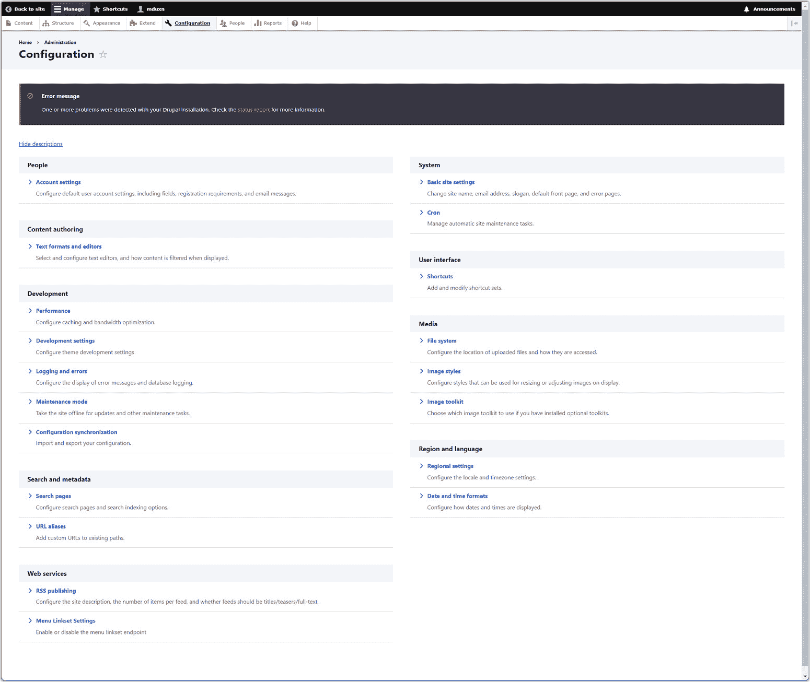

# 8

# 编写更少的代码 – CMS、无代码解决方案和生成式 AI

开发者本质上是一群懒惰的人。我知道这听起来很奇怪，但请听我说！我们总是在寻找写更少代码的方法。有时，这样做有很好的理由：如果有人已经投入了大量时间和精力编写了一个库，比如加密数据，那么我们为什么还要浪费时间重新发明这个轮子呢？在大多数情况下，我们可能不应该这样做。

相反，我们总是在寻找自动化任务、为我们生成代码或以其他方式帮助我们摆脱困境的工具！当然，我之前说我们很懒惰时是在开玩笑。不，这更多的是关于我们时间的有效利用。毕竟，如果你需要，你可以用螺丝刀把钉子敲进一块木头里，但使用实际的锤子要快得多，也有效率得多。就像在木工中一样，选择适合工作的正确工具是网络开发的关键。

因此，在讨论了编写代码的几个章节之后，我们现在将讨论如何避免这样做——或者至少尽可能最小化它，并使用工具更有效地编写代码！尤其是当有人按小时付给你时，你应该始终尽可能优化你的时间；有工具可以做到这一点，这就是本章要介绍的内容，从 CMS 的概念开始，包括 WordPress 和 Drupal。

我们接下来将转向所谓的“无代码解决方案”，这些平台允许您以更直观的方式构建网站。最后，我们将讨论目前正在发生的**人工智能**（**AI**）革命如何进一步增强您无需编码（至少不是那么多的）就能创造的能力。

因此，在本章中，我们将涵盖以下内容：

+   介绍 WordPress

+   了解 Drupal

+   完全放弃编码——“无代码”解决方案

+   利用人工智能

# 介绍 WordPress

我们将要讨论的第一件事被称为**内容管理系统**（**CMS**）。CMS 是一种软件，允许用户在无需具备技术知识（或至少尽可能减少它）的情况下创建、管理和更改网站上的内容。

一个典型的内容管理系统（CMS）将允许用户在网站上创建页面，通常就像在 Microsoft Word 或任何现代文字处理程序中创建文档一样，以直观的方式进行。例如，它们将允许您将图片拖放到适当的位置，围绕它们添加文本，在页面上绘制部分，以及其他不编写代码就能创建页面的方式。然后，CMS 通常会提供发布该内容的能力，使其对访客可见，并提供管理功能，以便您可以删除页面、重新组织它们、修改它们，以及其他维护它们的方式。您可以使用 CMS 创建一个完整的网站，其复杂程度与创建 Word 文档大致相同。

一个 CMS 甚至可以提供更高级的功能。例如，它们可以让你在页面上拥有一个评论区，访客可以相互社交互动。它们可以提供连接到流行的社交媒体网站的方法，接受用户的上传，实施调查以获取用户的反馈，以及许多其他功能。

现在有许多 CMS，但最流行的可能是 WordPress。**WordPress**是一个开源的 CMS，特别以其易用性、灵活性和庞大的社区而闻名，该社区贡献了插件和主题，可以让你轻松扩展其功能。WordPress 最初是一个博客平台，但现在已经发展到支持广泛的网站类型，包括电子商务、作品集和商业网站。几乎你可以想到的任何事情都可以用 WordPress 完成，因为它特别以其可定制性而闻名。

在*图 8**.1*中，你可以看到在安装 WordPress 时，使用基本默认选项自动创建的网站：


图 8.1：从基本 WordPress 安装生成的默认网站

由于其用户友好的界面和广泛的文档，它对初学者和高级开发者都是一个很好的选择。许多开发者会在 WordPress 上构建网站，但非技术用户也可以同样使用它。

接下来，让我们看看 WordPress 的一些主要功能。

## **主要功能**

WordPress 提供的一些最重要的功能包括以下内容：

+   **主题和插件**：WordPress 有数千种主题和插件可供选择，使用户能够在不涉及 HTML、CSS 和 JavaScript 的情况下增强其网站的功能和外观。主题控制视觉呈现，而插件添加了如联系表单、用户调查、消息表单和电子商务功能等特性。

+   **SEO**：WordPress 网站往往在搜索引擎中排名很高，因为它们提供 SEO 友好的功能和插件，如 Yoast SEO，以优化内容。它产生的网站在设计上本身就倾向于 SEO。

+   **用户友好**：WordPress 拥有直观的仪表板界面，易于导航，使得内容管理和网站管理变得简单。你需要的一切都可以在一个地方找到，并以易于理解的方式呈现。

+   **社区**：拥有庞大的全球社区，WordPress 拥有广泛的论坛、教程和资源，用于故障排除和学习。你永远不会孤立无援，试图自己解决问题；帮助总是只需几个按键的距离。

+   **更新**：WordPress 团队经常更新他们的代码以确保安全和功能，确保软件保持最新、稳定和安全。

+   **适用范围**：WordPress 被博客作者、小型企业和甚至大公司广泛使用，这证明了它作为一个网站平台的多样性和可靠性。

您可以在*图 8.2*中看到的仪表板界面是您与 WordPress 交互的主要方式。它允许您控制其所有功能，了解 WordPress 的全面性是值得一看的。当然，请记住，您在其中看到的内容可能因安装而异，具体取决于您安装了哪些插件。


图 8.2：WordPress 仪表板的全部辉煌

还需要注意的是，WordPress 不仅仅是一件事，不仅仅是一块软件。它分为两个版本，服务于不同的需求，并且对开发者的要求与您不同：

+   **WordPress.org** ([wordpress.org](http://wordpress.org)): 您可以在这里找到免费使用的开源软件。要使用它，您需要有一个服务器来运行它，并且很可能会需要购买自己的域名。它提供了对所有插件和主题的完全定制访问，包括免费和付费的。这个版本非常适合那些想要完全控制他们网站的功能和设计，并且不介意管理自己的服务器和上面软件的人。

+   **WordPress.com** ([wordpress.com](http://wordpress.com)): 这是一个商业服务，提供使用 WordPress 创建的网站托管服务。使用这个版本，您不需要自己的服务器，也不需要自己安装 WordPress；所有这些都将由他们为您管理。您只需购买一个计划，就可以立即开始构建您的网站，但除此之外，它还提供了与自托管相同的所有功能。

那是功能角度，但 WordPress 建立在什么技术上呢？让我们简要谈谈这一点。

## 理解技术视角

从技术角度来看，WordPress 是一个强大且灵活的内容管理系统，具有以下技术特性：

+   **PHP**: WordPress 是用 PHP 编写的。它处理服务器端执行，并提供 WordPress 提供的所有功能，包括在实时网站上无缝更新 WordPress 本身的能力，而无需停机。

+   **MySQL**: MySQL 是最受欢迎的开源关系型数据库之一，WordPress 使用 MySQL 来存储实际的用户生成内容、设置和用户数据。

+   **插件**: 插件架构允许在不更新到全新版本 WordPress 的情况下扩展功能。通过它，您可以模块化地添加自定义功能和功能，而无需更改 WordPress 的核心代码。

+   **主题**: WordPress 的表现层由主题控制，这些主题是 PHP、HTML、CSS 和 JavaScript 文件的集合，它们协同工作以定义网站的视觉布局和样式。

+   **循环**: 这是 WordPress 的一个基本部分，负责处理每个帖子并显示其内容，允许动态内容。例如，显示从数据库中拉取并通过主题显示的新博客帖子就是循环的主要内容。循环的基本结构如下：

    ```js
    <?php if (have_posts()) :    while (have_posts()) : the_post();      // Display post content     endwhile;endif;?>
    ```

    `have_posts()`函数将确定是否有要显示的帖子。如果有，`while`循环开始。在该循环中，对于每个帖子，调用`the_post()`函数以获取帖子的数据。然后，使用主题的模板文件与帖子的数据结合使用。这些数据被插入到模板中特定的标签位置，结果是为每个帖子生成要显示的 HTML。

+   **REST API**: WordPress 提供了一个强大的 REST API，为开发者提供了一个接口，可以通过发送和接收 JSON 对象远程与 WordPress 站点交互，使 WordPress 成为无头 CMS 选项。这意味着您可以在 WordPress 中存储和管理内容，但如果需要，也可以通过自定义代码来显示它。

+   **动作**: 这些是在执行过程中或在特定事件发生时 WordPress 核心执行的操作（基本上是代码片段）。插件可以指定在这些点执行的动作，提供在特定事件发生时增强 WordPress 的方法，例如，当用户发表评论时。

+   **过滤器**: 这些是在数据保存或发送到浏览器之前允许修改数据的代码片段。这对于在不更改核心文件的情况下自定义 WordPress 的功能至关重要。例如，过滤器可以用于自动执行诸如更改内容格式（可能是突出显示关键短语）、在您的内容下方放置相关帖子或截断文本以确保它始终以美观的方式适应页面等操作。

+   **安全措施**: WordPress 内置了诸如定期更新之类的安全措施。但由于它是一个流行的在线内容平台，因此经常成为攻击的目标。因此，通常通过插件、安全托管和网站管理的最佳实践来加强安全性。例如，一些插件可以监控黑客攻击并提醒您，而其他插件可以强制执行用户的密码策略，以促进更安全的密码。

+   **多站点功能**: WordPress 允许从单个 WordPress 安装运行多个站点。这允许高效地使用服务器资源：您不需要为每个 WordPress 站点构建单独的服务器，因为一个服务器可以处理多个站点。

+   **兼容性和标准**: WordPress 始终努力遵循 W3C 设定的网络标准，确保与不同浏览器和设备的兼容性，并为有障碍人士提供可访问性。

从开发者的角度来看，WordPress 提供了用户友好界面和广泛的定制性之间的平衡，使其既适合初学者也适合经验丰富的开发者。但它的真正吸引力**不是**编写代码。使用**所见即所得**（**WYSIWYG**）界面允许开发者和非开发者 alike 快速轻松地拖放内容。不过，了解这一点也很不错，那就是对于更高级的使用案例，有方法你可以以更传统的开发者方式与 WordPress 交互。无论如何，作为一个初出茅庐的网页开发者，我认为你应该对 WordPress 的技术结构有一个大致的了解。

虽然 WordPress 不是镇上唯一的流行 CMS，但让我们现在看看它的另一个主要竞争对手，在街头被称为 Drupal。

# 了解 Drupal

Drupal 是另一个流行的开源 CMS，以其健壮性和灵活性而闻名。由于其特别适合复杂的大型网站和应用，因此备受青睐。

你可以在**图 8.3**中看到，当你使用基本默认选项安装 Drupal 时，Drupal 创建的示例网站。3：


图 8.3：由基本安装的 Drupal 创建的默认网站

在某种程度上，Drupal 更是一个以开发者为中心的 CMS，因为设置和使用它需要比 WordPress 更多的技术知识。WordPress 从核心设计就是用户友好的，并且面向非技术用户，而 Drupal 则不是，至少没有达到同样的程度。其中一个关键原因在于，WordPress 提供托管选项，而 Drupal 则没有。如果你想使用 Drupal，你需要在自己的服务器上设置自己的实例，这需要更多的技术知识。

此外，WordPress 是开箱即用的 WYSIWYG，而 Drupal 则不是。Drupal 提供了一个更有限的界面来创建和维护内容，本质上只是一个可以应用一些格式的文本编辑器。使用 Drupal 创建完整的网站需要直接编辑内容，而不是像 WordPress 那样简单地拖放元素。尽管如此，Drupal 可以通过插件扩展，使其在这方面与 WordPress 达到更多或更少的相似性。再次强调，Drupal 更倾向于开发者，虽然你并不是在编写代码，但它比 WordPress 的视觉内容创建方法更接近。

在**图 8.4**中，你可以通过查看管理控制台中的**配置**选项卡来开始了解 Drupal 比 WordPress 更技术性的方面，这是众多相对复杂的屏幕之一，拥有许多更多技术导向的选项。



图 8.4：Drupal 管理控制台的配置选项卡

让我们接下来看看 Drupal 的一些关键特性。

## **关键特性**

考虑 Drupal 的一些关键点包括以下内容：

+   **PHP**：与 WordPress 一样，Drupal 是用 PHP 编写的，这使得它灵活且可扩展。

+   **数据库集成**：虽然 WordPress 仅支持 MySQL，但 Drupal 支持多种数据库，包括 MySQL、PostgreSQL、SQLite 和 MariaDB，用于存储内容和设置。它是通过数据库抽象层实现的，这意味着一个 API，Drupal 代码就是针对这个 API 编写的，然后它将 Drupal 函数调用转换为特定数据库的调用。

+   **模块化和可扩展性**：Drupal 不是使用插件来扩展其功能，而是使用模块。名称不同，但基本理念相同。社区贡献了数千个模块，可用于各种功能，包括 WordPress 提供的一切。

+   **主题**：与 WordPress 类似，Drupal 使用主题来定义网站的样式和感觉。Drupal 的主题可以通过 HTML、CSS 和 JavaScript 编码进行高度定制。

+   **内容结构**：以其强大的内容结构能力而闻名，Drupal 允许创建具有自定义属性和字段的多个内容类型。在 Drupal 的世界里，不仅仅是网页；你需要任何类型的内容，无论是视频、图片、PDF 文件、Excel 电子表格等等。

+   **访问控制**：Drupal 提供高级用户角色和权限系统，为不同类型的用户提供细粒度的访问控制。由于 Drupal 以其强大的安全功能而闻名，它通常被选用于政府和企业网站。它还提供深入的安全报告和定期更新。

+   **性能和可扩展性**：Drupal 从一开始就是为了性能和可扩展性而设计的，能够高效地处理大量数据和流量。它具有内置的缓存功能，并且可以与外部缓存系统集成，适用于高流量网站。

+   **社区和生态系统**：Drupal 有一个活跃的开发者、设计师和内容经理社区，通过论坛、文档和活动提供广泛的支持。

+   **以 API 为第一的方法**：Drupal 支持*无头*或*解耦*架构，这意味着前端（用户看到的部分）与后端（内容存储的地方）是分离的，这允许在内容交付方面有更大的灵活性。

+   **多语言功能**：Drupal 自带广泛的多语言功能，允许轻松进行内容翻译和网站本地化。

+   **版本更新**：与 WordPress 可以无缝更新不同，Drupal 的版本更新是重大的，通常需要相当大的努力才能从一个主要版本迁移到另一个。

Drupal 特别适合复杂、数据驱动的网站以及需要大量内容组织的网站，如社区平台、在线商店和公司网站。其陡峭的学习曲线对初学者来说可能具有挑战性，但为经验丰富的开发者提供了强大的解决方案。

由于更注重开发者导向，你可能想象从技术角度来看，关于 Drupal 还有很多可以说的，而且你是对的，这正是我们接下来要讨论的。

## 理解技术视角

从技术角度来看，Drupal 因其强大的架构、先进的定制能力和对可扩展性和安全性的强烈关注而脱颖而出。以下是一些关键技术点：

+   **模块化**：Drupal 的架构高度模块化，允许进行广泛的定制。核心功能可以通过自定义模块进行扩展或覆盖。

+   **钩子系统**：Drupal 采用钩子系统，允许模块与核心交互，修改或扩展其行为，而无需修改核心文件。

+   **性能**：如前所述，Drupal 具有广泛的缓存机制（如页面缓存和块缓存）来提高性能。它还支持与外部缓存系统（如 Varnish 和 Memcached）的强大集成，以进一步提高性能。

+   **主题化**：Drupal 使用 Twig 模板引擎，这是一个灵活、安全且快速的模板引擎，用于实现其主题。Drupal 的主题天生具有响应性，确保网站在各种设备上都能良好运行。

+   **以 API 为首要方法**：Drupal 支持 RESTful API，允许实现前端与后端分离的无头或解耦架构。实际上，它就是这样内部实现的，这意味着 Drupal 在概念上就是这样分离的。

+   **安全性**：Drupal 提供了一套复杂的基于角色的访问控制（RBAC）系统，允许详细的权限和用户管理，通常被认为更健壮且更适合大型企业的需求。

+   **质量保证**：Drupal 包括一个全面的测试框架，支持单元测试、功能测试和集成测试，并强制执行严格的编码标准，有助于提高代码的整体质量和可维护性。

+   **分类系统**：Drupal 拥有一个高度复杂的分类系统，能够实现内容的复杂分类和标签化。

+   **本地化支持**：Drupal 在核心中集成了强大的多语言和本地化功能，使其适合国际和多语言网站。

+   **配置管理**：Drupal 拥有一个复杂的配置管理系统。它允许开发者轻松管理和将配置更改从开发环境转移到生产环境，这对于复杂和大规模网站开发是一个关键特性。在某种程度上，它是内置的 DevOps！

+   **视图模块**：Drupal 最强大的功能之一是视图模块，它允许用户创建、管理和显示内容列表。与 WordPress 通过插件实现类似功能不同，视图模块在 Drupal 的最新版本中已集成到核心中。

+   **块系统**：Drupal 的块系统是另一个关键特性。它允许在页面上特定区域块中放置内容和其它元素，提供了广泛的布局定制。

+   **APIs**：Drupal 不仅作为一个 CMS，还作为一个框架，允许开发者在它之上构建自定义应用程序。它提供了一系列 API，用于不同的功能，如数据库管理、主题和用户管理。

总结来说，Drupal 在某种程度上是一个开发者的 CMS。而 WordPress 虽然可能仍需要一些技术知识，但更多地关注最终用户。

但最近，一个新的小家伙出现了，它将 WordPress 的愿景提升到了一个新的水平，那就是无代码解决方案的领域，这是我们通往网络开发者专业知识的下一站！

# 完全放弃编码——“无代码”解决方案

虽然像 WordPress 这样的 CMS（内容管理系统）——以及程度较低的 Drupal——可以非常用户友好，WordPress 的情况下甚至可以由非技术用户使用，但还有另一类工具将这一概念推进了一大步，进入了无代码解决方案的领域。WordPress 确实非常接近无代码解决方案，有些人甚至可能争论说它**实际上**就是一个无代码解决方案，尤其是 WordPress.com 这一部分。

但真正的无代码解决方案真正提升了这一范式，并成为**任何人**都可以使用，几乎不需要任何技术知识的工具。

**无代码解决方案**是允许用户在不需编程技能的情况下构建和管理应用程序和网站的工具。这些解决方案旨在易于使用，通常使用拖放界面和预构建模板，并且通常向非技术用户提供一个视觉开发环境。

这些解决方案使网络应用和网站开发民主化，使商业专业人士、企业家和爱好者能够创建数字内容。虽然你当然可以用它们创建强大的网络应用，但更常见的是用它们构建静态网站。这很大程度上归因于它们通常采用的视觉开发范式：在视觉构建工具中表达静态内容比动态交互要容易得多（尽管并非不可能，要清楚这一点）。

无代码解决方案在小型企业、初创公司和大型组织中的非技术用户中特别受欢迎。它们可以用来构建网站、移动应用和内部业务应用程序，甚至可以用来自动化业务工作流程。

需要注意的是，无代码解决方案通常不是你自己安装的东西，它们本身也不是软件本身。几乎总是，它们是你可以访问的网站，提供你所需的所有功能集中在一个地方。你不需要担心服务器、域名，当然，也不需要担心编程或其他任何事情，因为这些解决方案是全面的，包括托管。你将在那里建立你的网站，点击一下按钮，它就会立即在互联网上可用。

这些无代码解决方案的关键方面包括以下内容：

+   **用户界面（UI）**: 无代码解决方案通常具有图形用户界面（GUI），允许用户通过视觉操作元素来构建应用程序和网站。这可能包括将文本框、按钮和图像等组件拖放到画布上。

+   **定制**: 虽然无代码解决方案提供的定制选项比手动编码少，但许多这些解决方案提供了一系列模板和模块，可以根据特定需求进行定制。用户通常可以自定义其结果的外观和感觉，再次以视觉驱动的方式，无需编码。

+   **集成**: 许多无代码解决方案提供一键式与其他软件和服务的集成。这使用户能够将他们的无代码解决方案与现有的工具和系统连接起来，例如数据库、CRM 系统或电子邮件服务器。

+   **数据处理和分析**: 许多无代码解决方案提供内置的工具用于数据管理、分析和报告。用户可以创建表单、管理数据库，并可视化数据，而无需编码。这个特性对于需要收集有关其网站访问情况的见解的企业特别有用，或者对于处理数据，但缺乏复杂数据处理技术专长的企业。

+   **协作**: 无代码解决方案通常强调协作，允许多个用户同时在一个项目上工作。这可能包括版本控制、基于角色的访问和实时编辑，但比 GitHub 等工具提供更用户友好的模型。

+   **响应式设计**: 大多数无代码解决方案自动确保生成的结果是响应式的，这意味着它们将适应不同的屏幕尺寸，从桌面到智能手机。在当今的多设备环境中，这一点至关重要。

+   **市场**: 一些无代码解决方案提供市场，用户可以找到额外的插件或扩展，这些插件或扩展是由解决方案提供商或第三方开发者创建的。这些附加组件可以扩展基础平台的功能。

+   **社区和支持**: 无代码解决方案的兴起导致了充满活力的用户社区的诞生，人们在这里分享技巧、模板和最佳实践。大多数解决方案还提供强大的客户支持和教育资源，以帮助用户最大化解决方案的潜力。

+   **跨平台**：无代码解决方案可以从任何设备使用，无论硬件规格、操作系统或其他考虑因素。这使得它们对更多人来说更容易获取。

+   **安全和合规性**：任何好的无代码解决方案都会考虑到安全性，并遵守行业标准合规法规。最终，如何实施这些解决方案将由用户决定，但应该提供确保安全性的工具。

+   **经济影响**：通过使更多人能够构建网站和 Web 应用程序，无代码解决方案正在降低科技世界的进入门槛，可能导致更多创新和经济增长，尤其是在技术采用之前受限的行业。

要开始了解这种解决方案的样子，请看看*图 8.5**。这是 GoDaddy 的设计师界面，它是一个流行的无代码解决方案。在其中，你可以看到只需点击一个元素，就在右侧提供了一个编辑器，你可以轻松地更改所有 sorts of 参数（这是为我从一个在线蜡烛店起始模板生成的网站）。


图 8.5：GoDaddy 设计师界面在实际操作中的效果（无论如何，在印刷页面上能有的“效果”也就这样了！）

无代码解决方案的主要优势是速度和效率。由于不需要定制编程，它们通常创建得更快。这也使它们更具成本效益，因为不需要（通常是昂贵的）网络开发者。所有这些都有助于赋予非开发者权力，让那些没有编码技能的人参与到开发过程中。

以 GoDaddy 的网页设计师为例，它允许采用完全基于视觉的方法进行设计，这是一种用户可以拖放组件并在页面上进行编辑的范式，可以根据需要编辑每个组件的详细信息，而无需编写代码。

当然，当涉及到无代码解决方案时，并不全是玫瑰和彩虹。一方面，随着组织的需求增长和演变，无代码解决方案的限制可能会变得明显，因为它们可能在某个时候无法提供你所需要的灵活性。虽然它们在快速部署和验证想法方面非常出色，但过渡到更可定制的基于代码的解决方案可能对于扩展和复杂定制是必要的。话虽如此，大多数好的无代码解决方案会随着你一起成长一段时间，并为你的在线旅程提供肥沃的土壤。

另一方面，无代码解决方案使你依赖于该解决方案的提供商。虽然当你自己托管硬件时并非如此，但无代码解决方案确实倾向于更深入地绑定你，如果需要的话，可能很难离开它们。当然，这对许多人来说可能不是问题，但至少这是一个需要意识到的潜在问题。

无代码解决方案代表了技术领域的一次重大转变，使得应用程序和网站开发更加易于访问，并通过允许非编码人员产生以前需要定制开发的结果，从而改变了科技行业的传统动态。

现在让我们谈谈无代码运动中的一些最大名字。

## 介绍一些流行的无代码解决方案

在网络开发领域，一些流行的无代码解决方案因其易用性和强大的功能而获得了广泛的认可。以下是一些值得注意的例子：

+   **Wix**：Wix 的方法与 GoDaddy 非常相似，再次提供了一套无需编码的视觉设计工具。它可能比 GoDaddy 略微不太用户友好，但如果有的话，这种差异并不剧烈。

+   **Squarespace**：因其简洁、专业设计的模板而受到青睐，非常适合用于作品集、博客和企业网站。它提供强大的设计选项和电子商务功能。

+   **Weebly**：一款用户友好的解决方案，具有拖放工具，非常适合小型企业和在线商店。它集成了电子商务功能并提供各种设计模板。

+   **Shopify**：主要专注于电子商务，Shopify 允许用户无需编码即可创建在线商店。它提供广泛的电子商务工具、模板，并与众多支付网关和其他服务集成。

+   **Carrd**：专注于单页网站，Carrd 是创建个人资料、着陆页和简单作品集的简单、轻量级工具。

+   **Bubble**：虽然它比网站更专注于网络应用程序，但 Bubble 是一款强大的无代码工具，允许通过可视化编程界面开发复杂、数据驱动的网络应用程序。

这些解决方案因其易用性、多样化的设计选项以及满足各种需求的能力而脱颖而出。

但如果连拖放和可视化构建器对某人来说都太多，那该怎么办？好吧，有一种东西像其他东西一样突然出现在场景中，可能提供了一个答案，那就是人工智能。

# 利用人工智能

人工智能并不新鲜。它自 1956 年以来以各种形式存在，但 2023 年是其一个分水岭，我们看到了该领域创新的突然爆发。

现在许多无代码解决方案都在增加人工智能功能。GoDaddy 和 Wix 都集成了**人工设计智能**，或称为**ADI**。这是一种通过自动根据用户对一系列问题的回答创建网站来简化设计过程的 AI 形式。这种方法特别适合那些想要拥有专业外观的网站，而不需要投入太多时间或技术技能的人。你只需回答一系列问题，例如你的网站是关于什么的，它位于哪里，以及任何关于它的关键点，这些平台就可以根据这些回答创建网站，虽然这不是一个完整且现成的结果，但可以作为你设计工作的良好起点。

当然，这样的事情并非没有局限性。依赖 ADI 意味着网站可能缺乏独特性，因为 AI 的创造力还远不如人类，用户可能会发现设计相对有限，与竞争对手相比，因为任何 AI 都必须有护栏，即它能够产生的限制。虽然能够通过简单的描述生成网站非常强大（我甚至可以说很酷！），但它并不提供太多的创意自由，并且缺乏某些高级功能，例如有效地集成第三方应用的能力。

这款由人工智能驱动的无代码解决方案最适合那些需要快速搭建简单、整洁、专业的网站，且不打算深入研究定制化或高级功能的企业或个人。它特别用户友好且价格合理，提供多种定价方案，包括免费选项，使其成为小型企业或初创企业家的实用选择。

但这只是更通用概念的一个具体例子，这个概念真正席卷了全球，你作为网页开发者也可以以其他方式使用它，这个概念被称为生成式人工智能。让我们更深入地探讨一下。

## 生成式人工智能

如果你大部分时间都在 2023 年躲在岩石下，那么你可能没有听说过生成式人工智能。当然，AI 本身并不新，它以各种形式存在，自 1956 年以来就有，但 2023 年是一个转折点，当生成式 AI 的标志性产品 ChatGPT 出现时。

**生成式 AI**是一种能够创建新内容的 AI 类型，无论是文本、图像、编程代码、音乐，甚至是整个网站。它是通过首先摄入大量数据，并在某种程度上从中学到东西来做到这一点的。这些数据可以包括书籍、现有的音乐、GitHub 上的源代码以及各种类型的文档。AI 可以理解这些数据中的模式和结构，然后使用它来生成新的（可以说是）原创输出。例如，像 ChatGPT 这样的生成式 AI 可以撰写新闻文章，创作音乐作品，或创建一个以前从未存在过的图像。正如你可能已经注意到的，生成式 AI 有潜力彻底改变网站——以及许多其他事物——的建设方式，提供新的效率、定制和创造性的水平。

关于这种 AI 是如何工作的，不涉及所有复杂的数学和概念，主要组件是摄入我提到的所有数据的结果：被称为**模型**的东西。它是以**神经网络**形式对所有数据的复杂表示。神经网络本质上是一种专门构建的算法，能够识别模式，这与人类大脑的工作方式相似。当你向 ChatGPT 提问时，它使用复杂的统计方法遍历这个模型，找到与它在遍历的每一步中统计上认为逻辑上可能跟随的模式相匹配的模式。最后，它们输出模型统计上认为最有可能回答所提请求的东西。

有许多不同的模型，它们是从许多不同的数据集中训练出来的。GPT 是 ChatGPT 的基础（实际上是一个 UI 和该模型的组合），专门用于文本内容。另一个模型 DALL-E 是在大量图像上训练的，并能够从中生成新的图像。一个模型训练的数据越多——假设数据质量足够高——它在满足请求时的生产力和准确性就越高。

在**图 8.6**.6 中，你可以看到 ChatGPT（[`chat.openai.com`](https://chat.openai.com)）的界面看起来是什么样子，我在这里进行了一些关于编程的讨论，以便给你一个这样的互动可能是什么样的概念。


图 8.6：与 ChatGPT 的对话，当今最杰出的生成式 AI 解决方案

在左侧，你可以看到我与 ChatGPT 的聊天历史（不要介意其中一些愚蠢的对话；这东西既有趣又实用！）。在右侧是当前的对话，你可以看到它能够生成一些示例代码来回答我的问题。聊天持续了一段时间，我提出了澄清问题，并要求使用特定的库来举例。这次交流对我正在工作的项目非常有帮助。

但 ChatGPT 和其他类似生成式 AI 模型可以做得更多。各种模型可以用于特定目的，并且这些工具可以集成到其他产品中，扩展其功能。以下是一些有趣的应用列表，你可以在当今世界找到它们在网站开发中的应用：

+   **原型和线框图**：生成式 AI 工具可以快速生成网站原型和线框图，使设计师能够比其他方式更快地可视化和完善他们的想法。

+   **自动设计创建**：生成式 AI 可以根据用户偏好或预定义标准生成网站布局和设计——甚至可以生成它之前生成的原型和线框图！一些大型无代码解决方案开始整合这些功能，效果令人难以置信。

+   **文案生成**：生成式 AI 可以用于为网站创建文本内容。例如，它可以生成针对网站受众的产品描述、博客文章或营销文案，从而节省人类的时间和精力（坦白地说，这基本上就是所有这些的通用主题）。

+   **视觉资产创建**：生成式 AI 可以生成符合网站主题和需求的视觉资产，如图片、图标甚至动画。

+   **代码生成**：生成式 AI 可以生成构建网站所需的实际代码，特别是对于标准组件。这可以显著加快开发过程，尽管可能需要人类开发者的监督和细化，这是任何生成式 AI 模型的一个常见主题。我将在下一节中对此进行更多介绍。

+   **SEO 优化**：AI 可以分析搜索引擎算法，并提出或实施 SEO 策略以实现更好的排名，包括关键词优化、元标签和内容结构。例如，它可以分析你希望网站排名更高的搜索结果中的顶级结果，然后查看可以对你的网站进行哪些更改以实现该目标。

+   **个性化**：AI 可以在实时为个别访客个性化网站体验。它可以根据用户行为、偏好和互动改变布局、内容和推荐。这与前面的点不同，因为在这里我们不是在谈论使用 AI 来构建网站；相反，我们是在谈论代表用户运行的 AI，因为他们实际上正在使用网站。

+   **UI 和 UX 优化**：与个性化一样，AI 可以在网站上线后分析用户交互数据，以提出改进 UI/UX 设计的建议。这可能以在从使用你网站的用户收集的数据上训练模型的形式出现，然后你可以从模型中提取关于改进事项的建议。

将生成式 AI 和其他形式的先进 AI 系统集成到 Web 开发工具和解决方案中仍在不断发展。我们仍在探索如何使用这些新技术和工具。尽管如此，随着 AI 技术的进步，它似乎很可能会成为 Web 开发过程的一个基本组成部分，提供更复杂和直观的网站构建方式。我个人并不认为它会取代 Web 开发者，但 Web 开发者肯定需要理解和适应这些工具，将它们整合到他们的工具箱中。在我看来，那些不这样做的人可能会被落下，所以，即使只是为了自私的“我想有工作能力”的视角，了解 AI 的进步并跟上它们如何被用来使您成为一个更有效的 Web 开发者也是非常重要的。

我想讨论的这个主题的最后一个领域是您如何可以使用生成式 AI 工具来编写代码，其中一个特别的方法是：GitHub Copilot。

## GitHub Copilot

虽然使用生成式 AI 生成整个网站或网站内容，或将其用作帮助构建和增强网站的工具的想法是上一节的重点，但在这里我想谈谈使用它来编写代码的想法：换句话说，继续作为 Web 开发者，但使用工具使这项工作更容易、更高效。虽然 ChatGPT 可以用这种方式使用，因为它非常擅长为您生成代码或帮助您调试代码，但当你使用集成了 Microsoft 的 GitHub Copilot 的优质 IDE 时，这些能力会提升到另一个层次。

**Copilot**实际上是由 GPT 模型驱动的，这个模型与 ChatGPT 使用的模型相同（或者至少是几个可用模型中的一个）。但模型基于的训练数据是 GitHub 上的所有内容（好吧，至少是至少没有明确禁止用于此目的的内容）。

它允许两个关键功能：

+   您写出的代码能够自动补全的能力

+   从注释生成代码的能力

您可以在以下链接中找到如何在您特定的 IDE（它支持大多数 IDE）上安装 Copilot 的信息：[`docs.github.com/en/copilot`](https://docs.github.com/en/copilot)。然后，当您输入代码时，Copilot 可以提供补全建议。

让我告诉你，它有时会变得非常出色！因为它了解您项目中的代码，以及 GitHub 上托管的所有仓库，它能够提供在您编写的代码中具有意义的建议——上下文相关的建议，而不仅仅是来自他人代码的随机胡言乱语。

*图 8.7* 展示了 Copilot 在 IntelliJ IDEA 中的自动完成功能。在这里，你可以看到它为我建议了一行代码，这行代码是基于我已经写的内容构建的。由于屏幕上存在而打印页上不存在的颜色，所以这在打印页上看起来有点难看，但所有在突出显示的`return`语句之后的代码都是由 Copilot 建议的。我现在只需要按下*Tab*键接受建议，代码就会被插入到我的编辑器中。


图 8.7：使用 Copilot 的注释转代码功能的示例

微软称 Copilot 为“你的 AI 编程伙伴”。结对编程是一种两个开发者坐在一起一起编码的想法。一个人可能控制键盘，或者它可能在他们之间传递，你们以对的方式编写代码，两个大脑一起工作，希望和谐！如果你看过电影《环太平洋》，它就像允许两个飞行员控制巨型机器人 Jaegers（用来与哥斯拉（巨型怪物）战斗）的 Drift 一样，共享心理压力。有了 Copilot，你的伙伴在某种程度上是所有在 GitHub 上发布代码的开发者！

除了那些自动完成建议之外，Copilot 还有另一个绝招。如果你用普通的语言写一些描述函数的注释，Copilot 就可以为你生成那个函数！当你看到它在实际操作中的表现时，这真的很令人惊讶。

*图 8.8* 展示了 Copilot 在 IntelliJ IDEA 中的使用情况。在这里，你可以看到它根据我的注释为我建议了一个函数的实现，用于在数组中搜索对象。我所做的就是输入注释，按*Enter*键，然后等待一会儿，Copilot 生成你看到的代码。我现在只需要按下*Tab*键接受建议，代码就会被插入到我的编辑器中。


图 8.8：使用 Copilot 的注释转代码功能的示例

到写作的时候，第三个功能——聊天——正在变得普遍可用。这把 ChatGPT 的机制直接集成到了 Copilot 中。现在，你可以与 Copilot 就你遇到的某些棘手的编程问题进行来回讨论，或者请求关于某事的文档，生成代码或测试用例，帮助你进行调试。虽然 ChatGPT 也能做这些，但将其集成到你的 IDE 中，并且能够立即了解你正在做什么，这是一个变革性的变化。然而，与 ChatGPT 不同，Copilot 中的聊天只能回答关于编码的问题；它设计上不像 ChatGPT 那样通用。

好消息是：你可以免费试用 Copilot！微软提供了一个相当慷慨的免费试用期，之后 Copilot 将收取象征性的费用（截至写作时，个人用户每月 10 美元）。我个人觉得这完全值得这笔开销。

现在，这一切听起来可能都很不错，但关于 Copilot，有一个很大的警告，实际上对于任何生成式 AI 都是一样的：*你不能盲目地信任它们*！生成式 AI 模型是出了名的会“产生幻觉”，也就是说，它们会编造一些基本上是胡言乱语的东西。当然，我们实际上是在要求 AI 编造东西，但我们期望这些内容是有效的，但它们并不总是这样。同样，这些模型产生的答案有时也是事实错误的。它们有时只是弄错了。通常，这是因为训练数据有缺陷，有时是因为支撑它们的复杂数学导致错误的答案。

查看图 *8.9* 了解一个例子。当我在工作中试图解决一个问题的时候，我询问了有关 JavaScript 日期的问题，而它给出的答案并不正确。尽管我指出了这一点，AI 也进行了纠正，但如果我没有一些基础的知识，我可能就不会注意到这一点，我可能会走上错误的道路，浪费时间和精力。所以，你必须留意这些事情，而不仅仅 100%地依赖它们，这正是我要表达的观点。


图 8.9：ChatGPT 出错

因此，你不能将它们的答案视为绝对真理；你必须自己思考和验证。这意味着生成式 AI 要求你对与它讨论的主题已经有一些了解，这意味着像 Copilot 这样的工具——它专门用于编写代码——对于不懂得如何编码的人来说可能不会那么有帮助。如果你看到一些你认为不正确的东西，有趣的是你可以挑战 AI，这时它通常会纠正自己，就像你在图 *8.9* 中看到的那样。

无论是对是错，能够与这些事物进行持续对话的能力，正是你开始看到最大好处的时候。你可以提出一个问题，得到一个答案，然后要求对那个答案进行扩展。你可能会在答案中看到一些你以前从未听说过的内容，并且能够进一步证明。作为一个个人轶事，这曾经发生在我身上，当时我正在询问如何用 Java 做某事。我坦白地说，我不记得我试图解决的问题是什么，但重点是 ChatGPT（在我开始使用 Copilot 之前我使用的工具）提供了一个解决方案——这个解决方案效果很好——但使用了我在以前从未见过的语言特性。我能够就那个特性提出后续问题，并得到了很好的解释。然后我能够提出另一个后续问题，要求一个例子，并得到了它。所有这些都让我相信，我比如果只是谷歌搜索并阅读一些文章，对那个特性的理解要好得多。

你不应该低估——毫无羞耻地——一个接一个地问问题，即使你认为其中一些问题是“愚蠢”的。尤其是在你作为网络开发者的早期旅程中，你会有很多问题，这些问题可能很难通过像谷歌这样的搜索引擎得到答案，而且你可能不好意思向别人询问，即使你有可以询问的人。好吧，首先，你真的不应该感到尴尬，因为我们都是从不知道一切的地方开始的，提问是学习的途径！但我理解：我们都是人，有时我们觉得自己在问愚蠢的问题。

好吧，ChatGPT 或 Copilot 永远不会评判你！你可以不断地问它你需要问的任何问题，不断地要求它提供不同的例子或不同的解释，它会一直尝试，直到你需要它这样做。你可以用它随着时间的推移建立你的知识，不断地走偏锋，而它永远不会对你感到厌倦或烦恼。这是我们作为一个社会以前从未拥有的能力，它真的可以具有变革性。

因此，我强烈建议你开始使用这些生成式 AI 工具，无论是 ChatGPT 还是 Copilot，或者无论这些话被写下来之后出现什么其他工具。正如我所说，不要完全信任它们，因为它们**确实**会出错，但根据我的经验，它们做得足够好，以至于好处远远超过了任何负面影响。

虽然有些人担心这种新型 AI 工具和无代码解决方案最终可能会夺走我们的工作，但至少对我来说，相反的情况可能会发生：这些工具将成为网络开发者必须接受并学会有效使用的必要工具。

嘿，如果他们最终变成了天网并派出终结者追捕我们所有人，至少我们在那之前会建成一些很棒的网站，对吧？

# 检查路线图

当我们结束这本书的技术部分时，你发现了一些更多的事项。在 *图 8*.10 中，你可以看到更新后的网络开发者路线图：


图 8.10：包含更多填充框的路标

通过本章，你发现了 **CRM**（这完成了路线图中的 **前端** 部分！），**无代码解决方案** 和 **生成式 AI**。这可能看起来并不多，但嘿，这些都是相当酷的话题，不是吗？

# 摘要

在本章中，我们讨论了一些允许你无需编写代码或至少最小化编写代码的工具体验。你看到了如何使用 WordPress 和 Drupal 等工具，即使是非技术用户也能至少在一定程度上创建网络内容。你还看到了来自 GoDaddy 或 Wix 等公司的无代码服务如何完全消除网络开发者的需求……尽管你也看到了这些工具如何让你成为一个更有效的网络开发者，从而（我相信！）逆转了这一观念。

在下一章中，这本书的最后一部分即将开始，我们将完全放下技术内容，专注于其他问题，比如职业发展、技能增长以及如何找到你的第一份网络开发者工作。毕竟，那才是最终目标，我们将用几章内容一起探讨如何实现这一目标！

# 第三部分：获得和保持工作以及职业发展

在本部分的最后，我们将主要脱离特定技术的知识，开始探讨在网页开发领域找到工作所需具备的条件。我们将讨论什么是 FAANG 公司，为什么你可能或可能不想考虑它们，以及在这个领域你可能会期望什么样的薪资。

我们将深入探讨如何构建简历和作品集，以及典型的网络开发者面试可能包含的内容。我们将讨论如何准备面试，你可能会遇到的一些常见问题以及如何应对它们。

我们还将讨论工作与生活的平衡，以及它在保持理智的同时在网页开发领域成功发展的关键重要性！

本部分包括以下章节：

+   *第九章*，*找到你的第一份工作*

+   *第十章*，*作为网络开发者发现高质量工作的关键*

+   *第十一章*，*回顾软技能（它们让你难以否认）*

+   *第十二章*，*职业发展*
