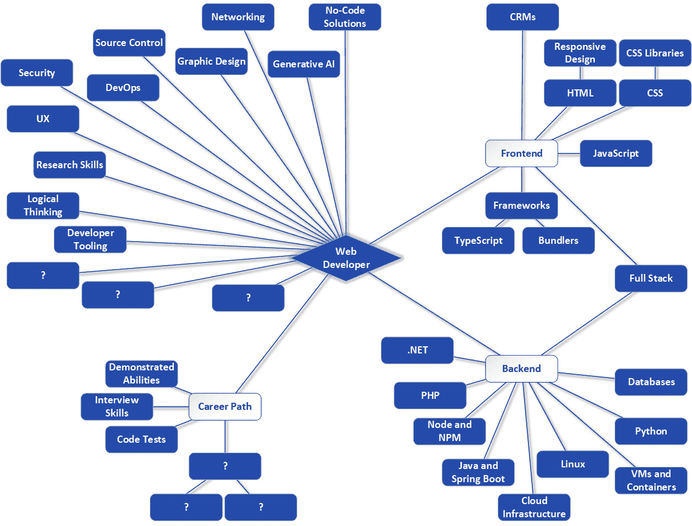

# 第九章：找到你的第一份工作

好吧，所以，你已经花费了很多时间和精力学习网页开发的技能方面。你已经编写了一些代码，现在你认为你已经准备好下一步：找到你的第一份工作，开始你的网页开发职业生涯。但你怎么实际上*做到*这一点呢？!

我年纪足够大，记得过去找工作意味着查看实体报纸上的招聘广告（唉，我讨厌这么说！），但如今，人们很少通过这种方式找到工作。即使那样，一旦找到工作机会，申请、面试以及最终获得工作的过程通常不仅仅是一次与经理的简单交谈，尤其是在网页开发领域。你可能需要让不止一个人印象深刻，才能成为一名受雇的网页开发者。

我在这个领域也足够老，经验也足够丰富，我自己也经历过几次面试，也许更重要的是，我*主持*了数百次面试。这意味着我了解坐在桌子的两边是什么感觉——我知道作为候选人有多么可怕，也知道进行一次好的面试有多么困难（说真的，它看起来只是提问，但做得好且公平似乎比看起来要难得多）。我将把所有这些知识和经验融入到本章中，希望对你有所帮助！

考虑到这一点，本章将为您提供寻找网页开发工作机会所需的知识，如何申请这些职位，面试可能是什么样的，如何有效地准备和应对它们，以及一些我认为重要的其他主题，例如工作与生活的平衡。

本章将涵盖以下主题：

+   理解 FAANG 与非 FAANG 的分歧

+   利用网络成为网页开发者！

+   精炼你的简历，使其光彩照人

+   拥有仓库、作品集和样品展示

+   理解典型的网页开发者面试

+   应对常见的面试问题

+   记住，工作并非一切

# 理解 FAANG 与非 FAANG 的分歧

我在*第一章*中简要提到了 FAANG，但让我们更深入地探讨，并涉及一些相关观点。

如果你现在上网查看 Reddit 上几个最受欢迎的 subreddit，或者在其他许多人们聚集讨论如何获得 IT 领域工作的网站上，你很快就会遇到一个常见的术语，即这个领域只有一个目标和一种进入方式，而这个术语就是 FAANG。它是什么意思，为什么人们如此关注它？

**FAANG**代表**Facebook, Amazon, Apple, Netflix, and Google**。它最初在股市圈子中用来指代最大、最知名的技术股票。如今，你可能会看到几个其他的缩写，例如**FAAMG**（**Facebook, Amazon, Apple, Microsoft, and Google**）、**MAMAA**（**Meta, Apple, Microsoft, Amazon, and Alphabet**）和**MATANA**（**Microsoft, Apple, Tesla, Alphabet, Nvidia，和 Amazon**）。

我们让股票分析师去确定他们认为哪个缩写对他们所在的领域最有意义，但对于开发者来说，FAANG 通常被用来指代最大的、薪酬最高的、最适合职业发展的公司。这更多是关于从技术就业的角度来看，哪些公司受到好评。即使它们不是五家列出的公司之一，一些公司仍然可以被认为是“FAANG 公司”。例如，Airbnb、三星、甲骨文、Adobe、思科、高通、eBay 和 Uber 可能被一些人视为 FAANG 公司。

在线，你会看到很多关于加入 FAANG 公司的讨论——无论这个缩写代表的是哪些具体公司——讨论着哪些公司将来会在你的简历上看起来最好。或者讨论着那些最优秀和最聪明的人倾向于工作的公司。或者讨论着那些你将拼尽全力工作但会在财务和声望上得到回报的公司，因为其他开发者几乎会对你抱有敬畏之情。或者以上所有情况！

为了明确：是的，这类公司通常支付得很好。是的，这些公司在简历上看起来也很不错。是的，在那里工作将会具有挑战性但也很值得，因为你将和许多顶尖工程师以及最新的技术一起工作，你将参与一些可能会影响很多人生活的激动人心的产品。但它们并不是对每个人都最好的选择，而且很可能对刚开始的人来说也不是最佳选择。然而，你如何为自己做出这个决定呢？让我们来谈谈这个问题。

## 调整你的 FAANG 期望

我之前所说的都是很好的内容，很容易理解为什么这么多开发者对在这样公司工作的机会感到兴奋。但我看到很多在网上讨论的人在做关于 FAANG 的一个大错误：他们认为这是成名和致富的唯一途径，他们认为没有其他地方可以工作，你可以做令人兴奋的工作。有些人也犯了一个错误，认为仅仅拥有计算机科学学位就足以让你进入这样的公司。

以上都不是真的。其他地方也有很好的机会，而且大多数机会比在 FAANG 公司更容易获得。

坦白说：作为一名初级开发者，你在任何 FAANG 或类似 FAANG 的公司被雇佣的机会相当低。这些公司在寻找的是顶尖人才，更重要的是，那些能够*证明*自己是顶尖人才的人。你可能现在是最好的开发者，但如果你没有成绩记录，那么在 FAANG 公司被雇佣可能并不是完全不可能，但这绝对不是你应该依赖的事情。即使是有丰富经验和成功记录的人，往往也发现很难在这样的公司找到工作，因为面试过程非常严格（这个问题我将在本章后面更详细地讨论）。

但不要让这打击了你的热情！正如我所说，FAANG 公司之外还有许多很好的机会——这些职位往往更容易获得。虽然在一个 FAANG 公司工作会增强你的简历，但在非 FAANG 公司工作通常会为你提供一个更温和的进入专业 IT 世界的方式。许多公司也在使用最新的技术，所以你几乎有同样多的机会在工作中学习，但压力和期望会小一些，因为你被安置在 FAANG 公司时的情况。

然而，这并不是严格意义上的 FAANG 与非 FAANG 的对立。除了 FAANG 与非 FAANG 之外，还有另一个需要关注的界限，那就是科技公司与非科技公司之间的界限。

## 比较科技公司与非科技公司

科技公司是那些生产产品——特别是科技产品——并将其销售给客户的公司。苹果公司就是一个很好的例子。他们创造了 iPhone、iPad 和 MacBook 等许多其他小工具，这些都是科技产品。他们的整个焦点就是制造这些产品并开发其中的技术。因此，技术是他们所做事情的核心，因为本质上*就是*产品。

相比之下，以富国银行为例。他们是一家金融公司，因此支票账户、信用卡和共同基金等都是他们的产品。但是，为了使这些产品成为可能，需要大量的技术，只是这些技术并不是他们直接销售的产品。技术是他们核心产品提供的基础。在这样的公司，你作为开发者可能会创建一个用于对账日账户活动的系统，但这个系统并不是销售给客户的产品——很可能客户甚至都不知道它的存在。富国银行是一家非科技公司，因为虽然技术是他们所做事情的关键组成部分，但那并不是最终产品。

FAANG 公司往往是科技公司（当然，有些人可能会模糊这条界限，但作为一个广泛的概括，这是正确的）。而且，我认为很明显，科技公司对他们的技术人员的要求往往更高，因为这是由他们生产的产品的需求所决定的。

从所有这些中得出的结论是，在寻找你的第一份工作时，我的建议是首先寻找非技术、非 FAANG 职位。我不想给你一个错误的印象，认为这会很容易得到——无论你有什么样的经验，在 IT 行业找到第一份工作都将是一个挑战——但它将比在科技公司，尤其是 FAANG 公司更容易得多。它们将允许你积累经验，并建立你的记录，到那时，你可以更有效地针对科技公司甚至 FAANG 公司，并提高你获得此类职位的成功机会。

当然，这并不是说你应该完全忽视这样的科技公司。绝对不是！如果出现了一个好机会，那么无论如何，都应该抓住它！但你需要设定现实的目标，并根据这些目标调整你的求职策略，非科技公司往往是更好的选择。

到目前为止，你已经了解了什么是 FAANG，以及科技公司与非科技公司之间的区别。现在，让我们谈谈如何寻找工作机会，无论你想要申请哪种类型的公司。

# 利用网络成为一位网页开发者！

成为一位网页开发者意味着能够使用网络，那么从寻找网页开发者工作开始可能再合适不过了！今天，在网上找到工作可能比其他任何方式都更常见。幸运的是，因为这种情况很常见，所以它已经变得相当容易。首先，有许多专门从事求职的网站。

## 使用求职网站

网上列出职位空缺的网站并不缺乏，许多网站都会使申请过程变得简单快捷。当然，作为一般规则，你可能想坚持使用最知名的网站。截至本文撰写时，以下是一些网站，不分先后顺序：

+   *Indeed* ([indeed.com](http://indeed.com))：通常，这是最大的网站，覆盖了大多数行业。

+   *CareerBuilder* ([careerbuilder.com](http://careerbuilder.com))：这个网站，像许多这样的网站一样，提供的不只是职位列表，还包括职业建议博客和薪资信息。

+   *ZipRecruiter* ([ziprecruiter.com](http://ziprecruiter.com))：ZipRecruiter 对求职者和雇主都很有帮助，拥有许多出色的功能，包括简历数据库，这样雇主就可以自己搜索合适的候选人。

+   *Monster* ([monster.com](http://monster.com))：Monster 是目前求职网站中的资深人士之一，但它仍然是一个功能强大、易于使用的职位搜索引擎网站。

+   *Glassdoor* ([glassdoor.com](http://glassdoor.com))：Glassdoor 有些独特，因为它不仅提供职位列表，还有来自现任员工的匿名反馈，这让你可以很好地了解在特定公司工作的可能情况。

+   *LinkedIn* ([linkedin.com](http://linkedin.com))：我稍后会具体谈谈 LinkedIn，但可以这么说，它在寻找工作中可以提供很大的帮助，但方式与其他网站略有不同。

+   *Dice* ([dice.com](http://dice.com))：Dice 是一个仅限美国的科技特定网站，所以虽然它不像其他网站那样普遍适用，但如果你在美国，它对你作为一个潜在的网页开发者来说非常合适。

+   *Upwork* ([upwork.com](http://upwork.com))：这个网站有些不同：如果你想从事自由职业工作，这个网站将帮助你与那些想要雇佣开发者完成单个项目的人匹配。这可以在赚钱和寻找更稳定的工作的同时积累一些经验。

对于第一次尝试进入这个领域的人来说，找到适合的工作可能会很困难。但我给出的建议是不要过于限制自己。一开始，你会有一种自然的倾向，通过入门级职位或指定较低技能水平的职位进行筛选，因为这样似乎更有可能获得这样的职位。但是，虽然你绝对不应该申请每一个列出的职位，尤其是那些列出很多你一无所知的技能的职位，但不要害怕申请那些似乎略超出你能力范围的职位。通常，你可以在面试中给人留下深刻印象（我们稍后会谈到！），这可能会让人们给你一个机会，知道他们可能需要对你进行一些培训。目前，你真正无法触及的职位和那些如果你有机会就能成长起来的职位之间有一条很细的界限。最终，关键是你不要对自己过于低估。

回到这些网站本身，这些网站提供的不仅仅是职位列表，还有很多其他的东西。它们可以帮助你写一份好的简历，给你提供求职建议，让你对公司有更深入的了解，甚至可以根据你（和潜在的雇主）设定的标准主动为你匹配职位。所有这些都有助于你的求职过程。

但这些网站并不是求职的全部。还有另一种方法，是的，这需要你投入更多的时间和精力，但有时可能会引导你走向你可能会错过的路径，那就是直接访问各种公司的网站。

## 直接访问公司网站

世界上大多数公司都有自己的网站，其中许多公司在那里发布职位列表。重要的是要记住，公司网站上可能会有不在主要求职网站上发布的职位列表，或者这些职位可能不会在那些网站上出现，直到稍后。因此，你可能会在数百或数千人甚至还没有意识到这个机会之前就开始行动，这让你在竞争中占据优势！

因此，首先要做的是找到你可能想要为其工作的公司。这通常意味着一些在线搜索，通常是在你所在地区或合理的通勤距离内的公司。当然，如果你愿意搬迁，那么你的机会就会增加（我的第一份 IT 工作是在美国的一个不同州，需要搬迁）。你将需要进行一些研究，了解公司的情况，并可能从像 Glassdoor 这样的网站上获取一些“内部”信息，以确定你是否可能想要在那里工作。

作为这项研究的一部分，探索他们的网站。你很可能会在那里找到一些职位发布的链接，也许是在他们的**人力资源部**（**HR**）部分。如果找不到，你至少可以找到一些可以让你联系公司并询问空缺职位的电话号码或电子邮件地址。但让我们假设你在网上找到了职位发布。

到那时，你将想要仔细审查列出的职位，并决定哪些适合你。再次强调，虽然你不应该申请每一份工作，但也不要过于害羞。通常情况下，职位列表是由那些可能没有完全或正确理解职位要求的人力资源人员撰写的。例如，职位列表可能列出了大量的技术技能（语言和技术），但实际上可能只需要其中的一小部分。也可能确实不需要这些子集——如果你能证明你的学习能力，那么即使没有列出所有技能，你也可能被雇佣。

这个技巧——说实话，这是一个很难实现的技巧——是绕过人力资源部，直接接触到那些最终决定是否向你发出工作邀请的技术人员。这无论你的初始联系是从公司网站开始还是通过求职网站开始都是适用的。如果你能成功做到这一点，那么你就有机会给人留下深刻印象，而这最终也是目标。

到目前为止，我们已经介绍了两种主要的找工作策略。然而，当你试图在这个领域找到第一份工作时，你可能更难利用第三种策略，尽管你不应该完全放弃它，那就是建立人脉。

## 建立人脉

进入这个领域可能会很有挑战性，但一旦你进入并积累了一些经验，找到下一份工作或晋升到下一个职位就会变得容易一些。明确地说，这永远不会变得“容易”，但确实会变得“容易”一些。使事情变得更容易的不仅仅是经验，还有你在旅途中遇到的人。有句著名的话说，重要的不是你知道什么，而是你认识谁，虽然这句话可能没有表面上看起来那么绝对，但其中确实有真理。

在你从事行业工作的过程中，你会遇到很多人——同事、经理以及你在其他团队中互动的人。如果你与他们建立关系，那么当你寻找另一份工作时，他们将成为你的资产（希望是自愿的，但你永远不知道）。当这些人跳槽到其他公司，而你与他们保持联系时，他们就成了你的“内线”——你可以去找他们了解工作机会，也许是在它们公开之前，或者只是更快地将你的简历放入人力资源系统。

这就是你的**人脉**，建立这样的人脉被称为**建立人脉**。好消息是这不需要特殊技能：你只需要与人交谈！我想这可能对某些人来说可能是一种特殊技能，但如果需要的话，任何人都可以学会。 

注意，这并不意味着你需要经常参加球赛和孩子们的独奏音乐会！我的意思是，交朋友也很好，但这是一个**专业**网络，所以我们的意思是保持联系人的信息，确保它是有效的，也许偶尔发送一封“嗨，你好吗？”的问候邮件来维持关系。

一些网站也可以帮助你做这件事，但其中有一个网站脱颖而出——领英。我之前提到过，但值得进一步讨论，因为它更多地是关于建立人脉，而不是找工作——尽管由于前者，它也证明了对后者非常有用！

一旦你加入领英，你将在那里建立你的个人资料，包括教育背景、工作经验和技术技能等，但有用的地方在于你可以让其他人认可你的技能，从而向世界展示你所知道的一切，并且这不仅仅是你在宣称自己擅长这些事情。然后，你可以与认识的人或熟悉的公司建立联系。领英会根据你的个人资料数据和地理位置为你推荐人脉。然后，你将与这些人**建立联系**——假设他们也愿意——这开始构建一个你与之相连的人脉网络。

你可以做的最有帮助的事情之一就是与招聘人员建立联系。一旦你开始完善你的领英（LinkedIn）个人资料，你很快就会收到来自招聘人员的连接邀请。这些人工作的目的就是帮助人们找到工作。这并不是出于他们的好心：招聘人员通常是由雇主支付报酬来做这件事，有时也可能是员工支付，但他们确实是为了得到报酬。他们会查看你的个人资料（和简历），并努力寻找与你匹配的工作列表。他们有时可以访问尚未公开的工作列表，这使他们成为宝贵的资产。招聘人员——至少是那些好的招聘人员——通常会帮助你为面试做些准备，给你提供针对你面试的特定工作的建议和指导。如果你没有被录用，他们可以从公司那里得到反馈，然后利用这些反馈帮助你下次表现得更好。

当然，就像大多数事情一样，并不是所有的招聘人员都一样，也不是所有都特别出色。所以，你必须依靠你的直觉来处理他们。除非你真的非常舒服，否则不要签署任何东西！你不想发现自己因为签署了独家合同而只与一个招聘人员绑定，例如（幸运的是，这种策略并不常见）。一个好的招聘人员会像一个好的汽车销售员一样：稳固且有帮助，但不会过于强硬。这是一种“当你看到它时你会知道它是坏的”的情况。

你还可以有一种方法开始构建你的网络，即使你是这个领域的初学者，而且这通常也是免费的（在大多数情况下），同时也很有趣且富有教育意义！我所说的是用户组和聚会这个领域。

## 用户组和聚会

建立网络在理论上很好，但如果你还没有进入这个行业，这可能是一个挑战。你可以克服这种困难的一种方法就是参加用户组和聚会（用户组通常被视为一个较老的术语，而聚会则是它的更常见的现代版本，但它们的意思是相同的）。

在世界各地，你可以找到技术专业人士，或者只是爱好者，他们会有会议来讨论各种技术话题。你通常可以在这样的会议上找到专业开发者——有时甚至是知名人士——他们会就某个特定主题进行演讲。这可能是一篇关于如何更有效地使用虚拟机的文章，或者可能是关于 React 的介绍。当然，这是一种很好的学习方式，但更好的是有机会与人见面。

这些会议通常会伴随着一些披萨和小吃，几乎总是会有一个前后可以自由交流的时段。如果你是一个外向的人，你可以在会议前简单地走到人们面前自我介绍。不过，在演讲之后会更容易一些，因为你可以开始讨论你刚刚听到的内容。

这也是一个窃听可以非常有用的环境！即使你保持沉默，仅仅听到人们的讨论也能提供有价值的见解。你可能会听到一些新技术正在席卷世界。或者你可能会听到一些你从未听说过的公司中人们有趣的工作方式。甚至你可能会听到一些关于某人在他们的公司里找不出人来填补职位的八卦。这可能对正在找工作的人来说是一块金块般的信息！

你可以用来了解聚会的其中一个主要网站，讽刺的是，它叫做 Meetup ([meetup.com](http://meetup.com))。在这里，你可以搜索你感兴趣的主题，按地理位置搜索，这样你就不必走得太远，你还可以注册不同的群体，以获取即将举行的活动信息。有时在这里会发生对话——通常是在某个特定事件之后——这也可以提供很好的信息。这是一个免费的网站，所以我强烈建议你加入。

然而，你应该意识到，一些聚会可能会有一些（通常非常小的）费用。当你意识到有人必须支付食物、举办地点的空间以及可能还有某位演讲者的费用时，这是可以理解的。顺便说一句，虽然通常会有赞助商（赞助聚会的目的明确是为了寻找他们试图填补职位的候选人！），但这并不总是如此。所以，如果你被要求支付几美元的入场费，请不要感到惊讶——这通常是一小笔钱（我想我在参加的数百次聚会中最多被要求支付过 5 美元）——你可以把它看作是你在求职过程中的一个小投资。

## 坚持不懈是关键

在你求职的过程中，需要记住的是，在当今的市场中，无论你选择哪条路径寻找机会，事情可能都不会那么容易。

很遗憾，当你提交简历或以其他方式联系潜在雇主时，得不到任何回复的情况也并不少见。你可以理解这一点——当公司收到数百份简历时，不可能回复每个人说“不”——但这是你必须理解的事情；否则，可能会感到沮丧。

很遗憾，即使经历了整个面试过程，也可能得不到任何回复，甚至没有“我们决定选择其他人”的礼貌电话。你可能认为人们至少会告诉你决定是拒绝的，这样你就不会无所事事地等待，但这种情况通常并非如此（实际上，没有回复的情况可能更常见）。

很不幸，在找到合适的工作之前，需要尝试成百上千次的情况也并不少见。尤其是对于那些没有任何工作经验的人来说，找到第一份工作并非易事。

正因如此，保持希望、始终保持积极态度并坚持不懈直到最终出现合适的机会并且所有努力都得到回报是非常重要的。在撰写本文时，市场对新人的进入稍微有些艰难。这并非不可能，但你确实需要耐心并继续努力，即使看起来你似乎在原地踏步。你最终会成功的，但这可能需要一些时间（然后，你可能会一出门就找到理想的工作——你永远不知道，所以坚持不懈是一个重要的品质）。

好吧，所以，你已经去了一些求职网站，直接查看了公司网站，并且通过参加一些聚会建立了人脉。现在，是时候申请职位了。这通常都是从相同的步骤开始的，那就是你的简历，所以我们现在就来谈谈这个。

# 精炼你的简历，使其光彩照人

简历——或者如果你在美国之外，是**简历**（**CV**），可以说是你就业的护照。当你申请工作时，它几乎总是人们首先看到你的东西，而在成功获得这份工作时，它只是众多因素之一，如果它没有很好地展示，它可能会在最初就扼杀机会。

构建一份好的简历在很大程度上取决于遵循一些常见的指南，然后突出那些让你独一无二的事情。让我们首先谈谈这些指南。

## 构建一份扎实的简历

在线和其他地方有很多关于如何撰写一份优秀简历的建议，但我认为你会发现以下项目几乎是通用的：

+   *保持简洁*：尤其是当你有很多经验时，你自然想要把所有东西都写进去，最终可能会写出五到六页的简历来描述你做过的所有事情。但你必须抑制这种冲动，因为这几乎总是适得其反，你应该将简历限制在一到两页。记住，简历的目标本质上是打开大门。如果你做到了这一点，你将在面试过程中有时间详细说明。然而，在此之前，你想要避免任何可能让人忽略你的简历的事情，而过于冗长通常被列为其中之一。超过大约两页的简历通常会被直接扔进垃圾桶，甚至没有人看一眼。这可能看起来不公平——而且可能确实不公平——但这却是现实，所以你必须应对它。

+   *清晰的布局*：你可能会认为越独特的简历越好，所以你可能倾向于玩一些疯狂的设计决策。对于某些职位发布，这可能是有帮助的——例如，如果你申请的是图形设计师。但一般规则是，你应该尽量保持简单。使用清晰、专业、易于阅读的字体。使用清晰、描述性、通常较短的标题来表示简历的主要部分。使用项目符号来表示列表。一般来说，不要在整体布局上过于创新。

+   *使用关键词*：在许多公司，你的简历将首先通过一个自动筛选过程，它通常会在人类查看之前就被淘汰。这通常是通过寻找关键词来完成的。例如，如果一个空缺职位是为具有 React 技能的前端开发者，那么没有 React 的简历可能会立即被淘汰。因此，在你的简历中投入一些努力，使用与你要申请的特定职位相匹配的关键词，或者如果你没有申请特定职位（也许你只是想将简历投递到你特别想工作的公司，而不知道他们是否有空缺），那么尽量使用尽可能多的准确关键词。这是因为下一个要点。

+   *不撒谎或夸张*：坚持事实！你可能会侥幸地在这里或那里说谎或夸大其词，但如果被发现，这将摧毁你获得职位的任何机会。即使你被雇佣了，这也可能对你造成伤害，至少在声誉方面。明确地说，描述你所做的事情尽可能积极与对其不诚实之间是有区别的！简历在某种程度上是一项销售工作，所以使用尽可能积极的语言是正常且被鼓励的。但请遵循一个简单的规则：如果某事不是真的，或者如果你在受到质疑时无法证实它，那么你不应该将其放在简历上。

+   *校对*：在将简历发送给任何人之前，请多次检查语法和拼写，并使用所有可用的工具来帮助这一过程！有些人可能会忽略一些小错误，不会因此对你产生偏见，但其他人可能会因此直接取消你的资格。无论如何，这都是一个不好的印象：当你试图获得工作时，你想要展示的是对细节的关注，而这从一份在拼写和语法方面无懈可击的简历开始。在将简历发送到任何地方之前，也让其他人阅读你的简历，因为第二（或第三或第四）双眼睛总是好事。

+   *避免无关信息*：过去人们建议在简历上放一些个人爱好之类的信息，因为这表明你工作之外也有生活，你可能不是一个刻板的人。始终记住，人们喜欢与那些周围让人愉快的人共事，他们与工作之外的人有共同点，因为这为他们提供了社交的共同基础和接触点。但简历并不是展示这种信息的地方，所以现在的观点是在面试期间和面试之后，如果一切顺利的话，再展示这类信息。

+   *联系方式*：你会惊讶地发现，你经常会收到一些看起来不错的简历，但随后发现上面没有关于联系候选人的信息！这是错失机会的明确方式，所以请确保这些信息是存在的，并且是最新更新的。

+   *使用专业语言*：你正在申请工作，希望一切顺利的话，这将意味着你处于一个专业沟通的语境中。因此，在简历中避免使用俚语或非正式用语。再次强调，这些用语在适当的时间和场合也是有其位置的，因为你的个性和特质在面试过程中也会发挥作用，有时稍微不那么正式可能是个好事。但简历并不是展示这种风格的地方。

+   *突出成就*：你想要尽可能具体地描述你所做和完成的事情，如果你有支持它们的指标，那就更好了。如果你构建了一个每月能为你雇主节省 10,000 美元的系统，那么你想要说的是这一点。当然，如果你还没有任何工作经验，那么这会变得更加困难。但几乎总是有“一些东西”：你是否为开源项目做出了贡献以获得经验？你是否建立了一个个人网站？你是否编写了一个游戏？你是否在大型零售店担任过库存管理员？成就不一定必须直接与你要进入的领域相关（尽管当然最好是相关的）——你只需要知道如何推销它。我将在下一节中对此进行更多讨论。

+   *量身定制*：最后，尽可能为你要申请的工作定制你的简历。如果你知道一家公司在寻找在 AWS 进行云开发的人，那么你可能想要强调你在云服务提供商方面的经验，即使它不是 AWS。如果你申请的公司提供共同基金服务，那么你可能想要更详细地描述你在银行担任出纳员的时间，因为这与金融行业相同。再次强调，不要对任何事物撒谎，但考虑到你申请的地方的简历比提交到处都一样的通用简历要好（有时，你将不得不这样做，但每次你可以定制简历时，都这样做）。

你可能还会考虑聘请专业的简历撰写服务，例如 TopResume ([topresume.com](http://topresume.com))。他们将会——以一定的费用——与你合作，为你制作一份顶级的简历。他们知道所有最佳实践，他们知道公司在简历中寻找什么，他们也知道所有能让你的简历脱颖而出，或者至少尽可能降低被忽视的几率的技巧和窍门。如果你不擅长制作一份好的简历，那么这样的服务可能值得考虑。但是，如果你自己能胜任，那么你可以省下一些钱。这类服务通常提供不同的套餐，从对你自己制作的简历进行基本审查到全程指导你完成写作过程，甚至有时帮助你提交简历。只有你自己才能决定这样的服务是否适合你，所以做一些研究，看看你的想法。

现在，让我们谈谈你目前所处的状况，即你在该领域几乎没有或没有任何实际工作经验。

## 突出你所拥有的

当你能描述过去 20 年在专业网页开发中完成的数十个高调项目时，那当然很棒，但没有人是从这里开始的。在行业内找到第一份工作将需要其他东西。

理论上这个技巧很简单，但在实践中很难：你必须建立你所拥有的任何东西，即使它与直接相关的内容无关。

我的意思就是我之前暗示过的。比如说，你可能还没有做过任何网络开发，至少没有为报酬而做。但也许你曾经是沃尔玛、塔吉特或另一个大型零售商的库存人员。你如何谈论这段经历，使其变得相关？

好吧，库存人员必须具备一定程度的组织能力。他们必须能够确定正确的产品放置在正确的位置上。他们可能需要能够下订单来补充库存，既不过度购买也不短缺购买。他们需要高效地补充货架，无论是从时间上还是从完成后的外观上。

换句话说，他们必须注意细节，并制定一个行动计划以有效地达到既定目标。所以，当你描述那项工作经验时，可以说这样的话！

谈论你所拥有的任何工作经验并不欺骗。同样，如果你建立了一个个人网站，你可以通过描述所使用的技术、你是如何从线框图到原型再到最终产品的过程，以及你如何有效地实施 SEO 来提高搜索排名来谈论它。

或者也许你离开学校的时间并不长。如果是这样的话，你是否完成过一些特别复杂的作业？如果是的话，那么你可以谈论这些，同时注意包括你学到了什么以及你必须克服哪些困难才能成功完成它们。

你应该专注于你培养的技能。这通常在无论你是否拥有工作经验的情况下都是正确的，但如果你没有，它就变得更加重要，因为你在这方面不会有太多的选择。专注于你精通或有过经验的编程语言和技术，无论这种经验的形式或程度如何。

你还应该关注“软技能”，比如团队合作、问题解决和适应性。同样，寻找任何可以突出这些技能的地方。如果你在学校里参与过团队项目，那么这就是团队合作的一个话题。如果你作为库存人员，当别人辞职时不得不接管商店的多个区域，那么这就是适应性的一个好例子，你可以这样谈论它。尽管这可能并不总是以不显得过于牵强的方式与网络开发联系起来，所以请小心处理这一点。

这里的基本观点是，在没有大量的可展示的网页开发工作经验的情况下，你必须寻找自己和工作、生活经历中的积极方面，并以一种方式表达它们，这样它们就能展示出一些潜在雇主可能会觉得吸引人的东西。冒着重复的风险，不要在你说的话中撒谎，因为那根本不值得潜在的负面后果。但是，提升自己和你的能力，用言语推销自己，这并不撒谎——这只是良好的推销技巧！

自然地，拥有一些可以展示的网页开发作品几乎总是比仅仅华丽的语言要好，并且几乎总是比后者更有分量。幸运的是，这是一个你可以在没有专业工作经验的情况下获得此类经验并展示作品的地方，这就是诸如仓库、作品集和样本等东西出现的原因。

# 拥有可以展示的仓库、作品集和样本

当你第一次出去寻找网页开发工作的时候，你几乎肯定没有一段长长的记录来展示你的能力。你可能有一些可以展示的东西——你可能建立了一个个人网站，或者也许你免费为当地的教堂建立了一个网站。但你没有以前的工作可以指出来并说“看，这展示了我能做什么。”因此，为了给自己提供最好的被雇佣的机会，你将想要制作一些东西，并让人们可以看到它们。

## 建立网站

正如我刚才提到的，个人网站通常是人们首先创建的东西，他们这样做是为了特别展示他们的能力。这样的项目的优点在于，一切都取决于你！你可以决定它的外观、工作方式、你用来构建它的技术等等。然而，这确实是一个你应该在你准备好时承担的项目。明确地说，它不需要是史上最好的网站，但它确实*应该是你当时能构建的最好的网站*。你想要能够指向它并说，“这就是我现在能做的。”

虽然这是一个好的开始，但也要寻找为他人建立网站的机会。经常有非营利组织非常愿意免费为他们建立网站。这为他们提供了所需的服务，同时让你有机会学习。但与个人网站不同，现在你必须满足“客户”的需求，这展示了另一组潜在雇主希望看到的能力，因为他们实际上将成为你的客户，如果你被雇佣的话。

对于大多数情况，建立网站不会让人看到你的代码，至少不是源代码，也不是后端代码。这就是 GitHub 仓库可以发挥作用的地方。

## 建立 GitHub 仓库

另一件你应该做的事情是建立 GitHub 仓库（或几个）。关于这一点，网上有一些争议，因为你会遇到一些人永远不会查看这些仓库，但有些人会——最终，如果你在寻找入门级职位，潜在的雇员可能会查看他们能找到的任何东西来评估你的技能。

如果他们选择查看，拥有 GitHub 仓库可以让面试官看到你是如何编写代码的。他们几乎不会非常严格地看待它，因为任何招聘入门级职位的雇主都必须现实地设定他们的期望。但是，看到一个人编写整洁的代码（格式良好）、注释良好，并且看起来逻辑结构合理，可以让他们对你思考过程有所了解。

你应该在你的仓库中放入什么内容呢？简单的回答是任何东西！当我第一次被雇佣时，我没有大学学位，也没有任何可以指点的经验，除了我做过的一些兼职工作。所以，我提供给面试官查看的代码包括我编写的一些视频游戏，一些我自己编写的的小工具，以及一些为一些旧的**公告板系统**（**BBSs**，在互联网之前出现）编写的演示。这是一家金融公司的面试，所以这些内容与我将要做的工作没有任何相关性。但是，展示给面试官的是我能够编写代码，并且能够以他们认为合理的方式编写代码。几个月后，他们直言不讳地告诉我，所有这些都帮助我得到了这份工作。

所以，你编写的任何代码，只要确保它是按照良好的编码实践编写的，就是你仓库中的优质内容。它与你要申请的行业无关——它更多的是对面试过程的输入。

但是，这不仅仅是关于代码，对吧？在一定程度上，它也关乎事物的艺术方面，创造性方面。这通常就是作品集的目的。

## 构建样本作品的集子

在与艺术相关的职位或其他创造性工作中，在面试期间展示作品集并不罕见。对于艺术家来说，这通常是一本包含你绘画页面的书，展示你能做什么，你能创造什么。

好吧，网络开发是艺术的一部分，尤其是在前端方面！因此，作品集对你来说可能也具有一定的价值。然而，它可能不会像艺术家那样是一本实体书（尽管我敢打赌，现在许多艺术家也不再使用实体书了！）。它可以是展示你构建的网站的 URL。

作品集和 GitHub 仓库之间可能存在一些重叠。你的仓库也可能实际上就是你的作品集，因为 GitHub 提供的一项功能是托管网站。你可以在 GitHub 仓库中放置一个网站，并使其作为一个可工作的网站提供。

不论如何，这里的重点与其说是技术方面，不如说是艺术方面（尽管当然可能存在重叠）。看到你的代码并且写得很好是一回事，但看到屏幕上实际的内容，看到网站是什么，看到你遵循了良好的设计原则，例如，则是另一回事。或者看到你创造的东西在美学上令人愉悦。这正是作品集的作用所在。

所有这些的底线是寻找证明你能做什么的方法，展示你的能力。在努力获得第一份工作时，你可能需要有点创造性，并且需要主动。当你有几年的实际工作经验并可以描述你为其他雇主所做的工作时（尽管通常你不能展示它，因为在大多数情况下它是专有的），但这并不是一个优势，你仍然需要提供尽可能多的证据，用更好的词来说，就是让人愿意冒险雇佣你。制作一些东西，把它们放在网上——包括代码——并利用所有这些来证明你值得雇佣，即使没有那么长的记录！

到目前为止，你可能会找到一些职位发布，提交了你的简历，准备好了你的 GitHub 仓库、作品集和样本，并且在理论上已经准备好面试了。现在，让我们来看看面试以及成功通过面试所涉及的内容。

# 理解典型的网络开发者面试

实际上并没有一个典型的网络开发者面试——面试之间有很大的差异，人们进行面试的方式也很多，所以一般来说没有两个是完全相同的——但确实有一些常见的模式，一些你更有可能经历的事情。我们可以将这些事情分组，并说它们代表了我们可以称之为典型网络开发者面试的内容。

## 理解结构

大多数面试都涉及多个环节的活动。这些环节可能由一个人或多人进行，可以是单独的或小组形式。它们可能发生在一天之内，也可能分布在几天内。

### 初审环节

在第一轮中，你很可能会遇到对你的简历的审查，你将需要回答关于以前项目和经验的问题。这些问题通常会深入询问以确保你简历上列出的内容准确无误（例如，通过要求你描述一个特定项目中所列出的特定技术是如何使用的），并试图判断你对这些主题了解的深度。你可能得到的问题例如：“哦，我看到你在这个项目中使用了 MongoDB，你能告诉我你设计了什么样的数据结构吗？”或者“你是如何在那数据库中实现分片的？”

在这个阶段，直接回答问题，尽量不要过多地发表评论。你可能会发现你的紧张情绪开始发作，开始胡言乱语，或者如果不是因为紧张，那么可能是因为你认为更长的回答必然更好。尽量避免这种情况，但也避免回答得太短。你不想让人觉得你在胡言乱语，但你也不想让人觉得你不知道你所声称知道的东西，或者你对它的了解不够深入（除非你明确地说“是的，我使用过 MongoDB，但我并没有深入研究，所以不能声称自己是这方面的专家”，如果这是真的，这是一个合理的回答）。

### 技术轮

经过这一轮之后，你可能会被问到一些技术问题。这里我指的是类似于“如果你知道元素的 ID，你可以在 JavaScript 中使用什么函数来获取 DOM 节点的引用？”这样的问题。这些问题是直接的，旨在测试你的知识。这些问题的答案，希望对你申请的工作是相关的，尽管这并不一定有保证。

我处理这类问题的建议是尽可能回答，但如果你确实不知道某件事，那么就说出这一点。尽管如此，也要尽量减轻打击。对于上一个问题，你可能会说：“对不起，那是我以前没有遇到过的事情，但如果有几分钟时间在网上搜索，我知道我能够找到那个答案，因为我知道 DOM 节点是文档对象模型中 HTML 元素的 JavaScript 表示，我使用过 JavaScript，所以这应该只是快速研究的问题。”这告诉面试官你确实拥有他们所寻找的基本知识，但你可能只是对特定的函数感到困惑，或者那是一个你从未使用过的东西，没有人期望知道每一个细节。

在这一轮中，你可能会被要求在白板上编码（这是几乎每个人都讨厌的事情！）。例如，面试官可能会要求你用 Python 在白板上编写一个冒泡排序算法。请放心，大多数面试官并不期望你在这里做到完美！即使你的解决方案接近正确，通常这也足够了。

你可以在这里做的最好的事情是在工作中“大声思考”。在工作过程中，将你头脑中的内部对话用语言表达出来。这样做有两个好处。首先，它让面试官能够洞察你的思维过程，这对你是好事，因为即使你的解决方案最终没有成功，他们也能听到你至少是在正确的轨道上，即使尝试失败，你也能得到一些分数。其次，这有助于缓解你的紧张情绪，因为在这种情况下大声说出来往往能让你的身体释放一些压力。

也不必害怕纠正自己！如果你开始走错路并意识到这一点，说出像“哦，等等，那不会工作，因为*X*；我需要做*Y*”这样的话是非常好的。

### 了解你轮

大多数面试在这一轮之后会变得更加轻松，这时它变得有点更个人化，在性质上更加自由。在这里，你正在被评估是否适合公司文化，坦白说，就是看看你是否是人们愿意与之互动的人。在这里，目标仅仅是友好、开放和诚实。然而，尽量不要过于开放。你在这个阶段不需要透露所有的内心秘密，也不需要谈论你可能有的每一个不寻常的爱好。你无法以任何具体的方式为这一轮做准备，除了尽可能练习成为一个亲切的人。

这也是你通常有机会询问一些关于工作和公司的问题的时候。我将在“处理常见面试问题”部分讨论这个问题，但到目前为止，可以说的是，你应该尝试准备一些问题来提问。一个特别好的问题是简单地问“告诉我一些关于这里的文化；在这里工作的感觉如何？”或者类似的问题。这表明了你的兴趣，会给对方一个机会说一些话，减轻你的压力，并且可以让你获得一些宝贵的见解，了解接受那份工作可能对你日常生活的意义。

### 作业轮

你可能会遇到另一轮是带回家的作业，有时也可能是现场作业。在两种情况下，你都会被要求做一些事情，一些小项目来展示你的能力。这些并不像我所描述的其他轮次那么常见，但一些公司确实会这样做。你通常会被分配一个与工作相关的任务，然后你会被允许访问工作站（或者你可能被允许使用自己的设备）。在大多数情况下，你将拥有更多或更少的自由来决定你使用什么工具以及如何构建作业（你可能会被给出一些一般性的参数，比如“我们希望你能用 React 来构建这个”）。在大多数情况下，你工作的时候不会被监控，但一些公司可能会有人在你旁边监督。

这里没有真正的技巧——你只需要尽力而为！选择你最熟悉的工具和技术，专注于编写清晰、干净的代码，并且能够很好地展示——大多数时候，这就会发生，你将不得不向面试官展示你的结果。他们可能会问一些关于你为什么这样做的问题，所以请确保你能为每一个决定做出合理的解释。

我必须提醒你注意这些类型的作业：不要让任何人利用你！你的时间是宝贵的，有些公司可能会通过给你不合理的作业来利用这一点，这些作业可能需要几个小时才能完成。一些特别不道德的公司甚至可能会通过给你一个他们需要完成的作业来试图从你那里得到免费的工作！你必须依靠直觉来判断什么合理，什么不合理。我的一个一般性规则是，如果你认为你可以在一个小时内或更短的时间内完成作业，那么这可能是合理的。如果你认为需要更长的时间，那么你可能想这样说：“很抱歉，但我认为完成这个作业将花费我大量的时间，因此我不舒服。你们能给我其他不需要花太多时间的事情吗？”

一些公司可能也愿意为你完成作业所花费的时间付费。这并不常见，我可以说你大概不应该期待这种情况，但一旦发生，那总是令人愉快的。在这种情况下，你可能对所需时间有更大的容忍度。我还要说，除非你感觉面试进行得很好，你对公司提供的机会感到兴奋，否则你不应该接受一个时间较长的作业。如果你对一家公司只有一半的兴趣，那么花 6 个小时编码一个登录页面可能就没有意义了。

既然你对面试可能的样子有了一些了解，让我们谈谈一些你可以做的准备编程面试的一般性事情，除了我在本节中给出的建议。

## 准备编程面试

编程面试，或者更一般的技术面试，可能是一个非常压力山大的事件。用最简单的话来说，这主要取决于你是否知道这些内容，以及你是否能够证明你确实知道。当我面试人们时，这是我最主要寻找的东西，因为无论他们是否具备该职位所需的技能，我试图填补的空缺才是最重要的。这并不是**所有**重要的事情，远非如此，但它是最重要的事情。

一个**不重要**的事情，矛盾的是，就是候选人是否能够脱口而出所有答案。首先，我们工作的领域里这是实际不可能的。其次，这是一个研究和使用参考资料是必须的领域。是的，有一些事情我期望每个候选人都能脱口而出。例如，如果我试图雇佣一个前端开发者，我当然会期望他们能告诉我一些关于 CSS 盒模型的事情。如果我雇佣一个 Java 开发者，我会期望他们能告诉我字符串池化是什么。

但我并不期望的是，例如，他们能告诉我 JavaScript 字符串对象上所有可用的方法，或者他们知道特定数组方法所需的参数。这些是我期望人们在需要时查找的事情（你倾向于只记住你使用最多和最近的东西，所以人们可能会知道一些这类东西，但不会全部知道）。因此，作为候选人，你可以在面试中稍微放松一下，因为面试官不会期望你什么都了如指掌。

但与此同时，了解尽可能多的知识并能够展示你的能力同样重要。

面试官经常尝试通过让你解决编码挑战的网站来评估这一点。其中最著名的两个是 HackerRank ([hackerrank.com](http://hackerrank.com)) 和 LeetCode ([leetcode.com](http://leetcode.com))。你可能会在面试中被要求完成这些挑战。这些挑战通常以任务的形式出现，要求你编写一些小段代码，然后平台会确认代码是否正确运行。从理论上讲，你编写代码的方式本身并不重要——重要的是它要有指定的结果，所以他们通常不是在寻找特定的解决方案，只是需要*可行的*解决方案（然而——遗憾的是——他们有时可能会有些挑剔）。

好消息是，这些网站在面试之外也对你们开放，它们是准备使用它们的面试以及不使用它们的面试的绝佳方式，而且也是一般学习编写代码的好方法。我强烈建议你们使用这些网站。完成挑战，熟悉它们的工作方式以及它们对解决方案的要求。这样，如果你在面试中遇到它们，这不会是你第一次遇到。

更普遍地说，学习**数据结构和算法**（**DS&A**）是一个重要的步骤。如果你之前从未听说过这些术语，让我来解释一下。

简单来说，**数据结构**是存储数据的标准方式。例如，数组就是一种数据结构——几乎每种编程语言都内置了这种结构。你可以使用语言的基本功能来构建更高级的结构——比如列表（本质上是一种更健壮的数组形式）、栈（类似于数组，但元素只能以定义良好的特定方式进入或退出）和映射（将键与值关联起来，允许你通过键查找值）。这些都是一些最简单的例子。

而术语**算法**只是指一种复杂的方式，即一组用于执行特定任务的编程指令。例如，你可以用许多方法对数据进行排序，可以选择许多不同的算法。有些算法如果数据已经基本有序，效果会更好，而有些算法可能会在排序大量数据时减慢速度，还有一些算法可能会使用更多的 CPU 资源来完成工作。了解这些不同的算法及其权衡，你可能会在面试和工作中被期望知道。

但在特定的面试中，你可能会被要求实现一个双向链表。然而，了解双向链表是什么以及何时何地应用它，比了解如何自己实现它更重要——在大多数情况下，在工作中你不会自己实现它，而是会使用现成的版本。虽然了解如何反转二叉树是有价值的，因为那可能是你会在白板上被要求做的事情，但了解二叉树是什么以及为什么我们使用它们，并能够解释这一点，则更有价值，因为那才是你在工作中需要的东西。像 HackerRank 和 LeetCode 这样的网站在很大程度上是基于要求你实现这样的数据结构与算法解决方案，因此更广泛地研究这些资源将帮助你应对这些网站及其测试。

寻找更多关于 DS&A 的信息

数据结构与算法的主题非常广泛，除了一般性内容外，它超出了这本书的范围。然而，为了更深入地了解，你可以考虑一些资源，比如麻省理工学院的开放课程网站([`ocw.mit.edu`](https://ocw.mit.edu))，它提供了来自著名的麻省理工学院的免费课程和互动内容；哈佛大学的*CS50：计算机科学导论*材料([`pll.harvard.edu/course/cs50-introduction-computer-science`](https://pll.harvard.edu/course/cs50-introduction-computer-science))；还有老牌的 YouTube！只需搜索“数据结构与算法”，你就能找到大量优质内容（务必选择那些获得大量点赞的内容，因为至少根据观众社区的判断，这*往往*意味着质量）。

现在，让我们看看你在技术面试中将要面临的最大挑战之一，这不仅仅是技术知识本身，那就是应对整个过程的压力！

## 应对压力

我已经提到过几次，面试可能会是压力很大的情况。大多数人并不特别适应可能感觉像是在被审问。没有神奇的解决方案能让大多数面试变得容易，但了解进入面试时可以期待什么，并有一些应对策略是有帮助的。现在让我们看看其中的一些：

+   *准备*：显然，学习和了解你的知识是关键。花些时间复习基础知识——当你被问到基本且简单的问题时，你可能会感到困惑，但你却忘记了，这种情况每个人都会遇到！此外，确保你熟悉工作描述中提到的任何特定技术，即使你对它们没有太多（或没有）经验。我可以告诉你，在我第一次面试时，我被问到了关于 Visual FoxPro 的问题。我以前从未使用过它，但因为它列在了工作描述中，我在面试前买了一本关于它的书并阅读了它。结果，我能够回答一些面试官后来告诉我没有人能回答的问题。

+   *进行模拟面试*：如果你有朋友或家人愿意这样做，让他们扮演面试官，对你进行一轮考验！一些网站可以帮助你进行模拟面试，包括 Pramp ([pramp.com](http://pramp.com)) [interviewing.io](http://interviewing.io)（这是网站名称和网址！），甚至 HackerRank 和 LeetCode 也提供一些这样的功能。这些可能比你的朋友或家人更好，因为你可能对朋友和家人有点过于放松，而这里的目的是在比实际面试更受控的环境中*不要感到舒适*。

+   *正念技巧*：在面试前进行呼吸练习或冥想可以帮助你平静心情，进入良好的心态。

+   *转变你的视角*：记住，面试是双向的。你也在评估这家公司是否适合你。这可以在情感上给你一种小小的权力感，这可以避免你感到不知所措。

+   *保持积极*：无论你认为面试进行得如何，从一开始就专注于从经验中学习。如果你坐在那里想“我这次面试砸了！”那么花点时间问问自己到底出了什么问题。显然，在面试过程中，你不可能面无表情地坐着，考虑问题！但你可以潜意识地处理问题，无论这让你能够即时调整还是仅仅考虑下次做得更好的方法，它都可以更积极地重新定义正在发生的事情。

+   *面试后分析*：无论结果如何，当你完成时，一定要反思哪些做得好，哪些可以改进以备下次使用。这是前一个点的延伸，但它更专注于学习经验和改进，而不是在面试中帮助你。

下一步要考虑的是给面试官留下的印象，以及你可以做些什么来确保这是一个积极的印象。

## 展现最好的自己

在你通过面试过程，无论它以何种形式进行时，始终记得以专业和友好的方式展示自己。微笑，进行眼神交流，并保持专注。不要让其他事情进入你的脑海，因为在这个时刻，只有面试才是最重要的。

确保你的着装也要成功。即使你知道公司的环境是休闲装，面试时也要穿专业装（我建议即使你被明确告知可以休闲装，也要这样做，尽管这可能有些争议）。我们这里不是在谈论燕尾服，甚至也不是西装领带或昂贵的套装。在大多数环境中，休闲裤和衬衫对男女都是可以接受的。

确保你的仪容整洁无瑕。这关乎向大多数人展示一个积极的自我形象。你永远无法确定别人会如何反应，但你无法控制这一点——你只能控制自己。确保你不显得邋遢是你能够控制的。

这会让你显得专业、专注，并且有良好的细节思考能力，这正是你在争取那些事情重要的职位时想要传达的，就像在软件开发中那样。

但无论你准备得多充分，仍然完全有可能遇到一个糟糕的面试官。鉴于这种情况，让我们谈谈如果你发现自己处于这种不受欢迎的境地时，你可能能做些什么。

## 保护自己

到头来，接受面试是困难的。但进行面试也同样困难。这可能看起来不应该如此，但事实确实如此。提出好问题很难。评判人很难。确保公平也很难。这是一项需要时间培养和发展的技能，不幸的是，在这一点发生之前，许多人并不擅长。因此，作为候选人，你应该尽你所能采取保护自己的措施。

例如，你可能会遇到一个不想在那里面试的面试官。也许他们自己有很多工作要做，感觉没有时间进行面试。他们可能会分心，比如不断查看手机。结果，他们可能会草率地完成面试，最终没有给你一个公平的机会。在这种情况下，你实际上能做的事情并不多。你最好的选择是保持友好，并尽量提供简洁但仍然有意义的答案。注意不要离题，因为这可能会使情况变得更糟。另一方面，如果他们感觉到你在尊重他们的时间，他们的态度可能会改变。

或者你可能遇到一些人，他们不知道如何构建好的问题。他们可能会问你非常开放性的问题（有时可能是故意为之，但通常不是），或者基于高度主观意见的问题（在某些情况下，这些问题可能是有效的）。他们可能会问一些措辞混乱的问题，或者你认为没有真正有效答案的问题。在这种情况下，你最好能做的事情是请求澄清（当然，要礼貌和尊重）。通过确认你的理解，确保你能尽可能好地理解被问的问题。“好吧，所以我认为你问我的是 JavaScript 中的闭包是如何工作的，对吗？”这是一个很好的问题，可以确保你理解了被问的问题。

你可能会偶尔遇到一个面试官，他们更感兴趣的是用他们所知道的知识来给你留下深刻印象，或者以其他方式让你感到威胁。处理这种情况没有简单的答案，但通常归结为相信自己并保持自信。确保保持良好的眼神交流和稳定的姿势，因为身体语言在面试中确实很重要。如果你感觉到他们试图用他们的知识来给你留下深刻印象，那就让他们这样做吧！他们可能确实有很多可以教你的东西，所以你不妨注意并保持积极的态度，将其视为增长知识的机会。

被问到不相关的问题是在面试中经常遇到的问题之一。对他们来说，当然，这些问题是相关的，但可能并不是以一个有意义的 way。处理这些问题时，首先请求澄清，因为也许这些问题确实以你尚未看到的方式相关。如果不是，尽你所能将对话引导回与该职位相关的你的技能和能力。而且，始终记住，如果一个问题让你觉得冒犯或不合时宜，你有权拒绝回答。如何最好地做到这一点是棘手的，但我会选择像“很抱歉，我不舒服回答这个问题”这样的说法，然后就此打住。

除了压力、可能表现不佳的面试官和需要了解你的技术材料之外，还有一些相当常见的问题你可能会遇到，因此在进入面试前有一个应对策略是个好主意，所以现在让我们来处理一些这些问题。

# 应对常见面试问题

除了技术角度之外，在面试过程中，一些非技术问题也常常被问到，而且至少其中一些是非常常见的。它们可能以不同的方式被问起，但无论如何，它们基本上归结为同一个基本问题。在这里，我将尽可能地将它们概括，并讨论你应该如何回答这些问题（当然，根本点是你总是想要诚实地回答它们）。

注意，这绝对不是一份详尽无遗的清单。我所做的是，通过一些研究，结合我在桌子的两边积累的个人经验，找出可能是最流行的 10 个这样的问题。自然地，你必须准备好应对其他问题，或者确实没有任何问题！在面试中，你被问到这样的问题的可能性并不是一定的，当然，这些问题也不是一定的。但它们足够常见，我认为它们值得指出，而且如果其他什么都没有，它们至少应该让你开始思考这样的问题，这应该有助于你为可能出现的任何其他问题做好准备。

## 介绍一下你自己

这是一个完全开放的问题，你可以从很多方面来回答。但主要的是，你应该专注于你的职业旅程，突出相关的经验和成就。当你没有多少（或根本没有）职业经验时，突出你能做到的一切。例如，如果你非常热衷于为开源项目做贡献，那么当然要提到这一点。如果你喜欢编写游戏，也可以稍微谈谈。

通常，尽量传达你对这个领域、技术和学习的热情。你可以稍微谈谈你的个人生活，但尽量与职业生活联系起来。谈论你的爱好本身并没有什么不妥——当然，除非它们可能被认为是不适当的——但可能不是面试官想听的内容。他们想听的是你是什么样的一个人，你将能够胜任你正在面试的职位，所以尽你所能专注于这一点。

## 你为什么想在这里工作？

这可以看作是一个有点狡猾的问题，因为对我们所有人来说，明显的答案都是“因为我需要赚钱，而你这里有个空缺！”但在现实中，这是一个展示这不仅仅是你（即使如此）的又一次普通工作面试的机会。为了做到这一点，展示你已经对公司进行了一些研究。谈谈公司的使命如何与你的价值观相符，以及你多么希望成为实现这一使命成功的一部分。

正如我多次说过的，这里不要撒谎。如果你的价值观与公司的价值观不一致，你可能一开始就不应该申请那里。但如果公司的使命并没有完全激发你的兴趣，你仍然可以说些像“我喜欢解决问题和构建复杂的事物，这家公司的使命将给我一个机会来运用这些技能。”但如果你对公司一点研究都没有，你就不能说这样的话。

## 你最大的优势是什么？

回答这个问题的关键是选择与你要申请的职位相关的优势，并且能够给出例子来证明这些优势。

例如，对于一个网页开发者的职位，你应该考虑那些能够展示你解决问题能力、将粗糙的设计转化为成品的能力、你的创造力和学习新事物的能力等优势。这可以通过，例如，讲述一个你在设计和构建个人网站或编写游戏时需要学习新技能的项目故事来实现。

如果你已经做了研究并且知道该公司使用云服务提供商，你可能想在实验 Microsoft Azure 的时间上多加一些关注，即使你构建的东西并不特别。然后，用这个具体的例子说一些更普遍的事情，比如你之前从未使用过 Azure，所以你必须边做边学，在这个过程中，你必须解决如何设置身份验证等问题。

## 你最大的弱点是什么？

这是一个人们通常喜欢以“狡猾”的方式尝试回答的问题。例如，你可能会说有时你会如此专注于你所做的事情，以至于工作的时间比应该的要长，因为这会让你看起来很投入。换句话说，你可能会试图将负面变成正面。当然，如果做得恰当，这**可以**有效。然而，有很大可能性你会显得不真诚或狡猾，这是你在面试中无论如何都想避免的事情。

相反，既然我们都不是完美的，试着找到自己真正的弱点，并诚实地展示它。当然，你可能不想选择一个**太大**的弱点（例如，“我每次有机会都喜欢把办公用品带回家！”可能不是你的最佳选择）。你可能不想说你经常喜欢开车撞进咖啡馆！但通常并不难找到一些不是巨大的弱点。你可能会说“我有时会发现自己不知道某事时会暂时感到恐慌”，这是我们所有人都会经历的事情。

然后——这是关键——谈谈你如何在这个领域努力提升自己。也许你可以说“为了尝试应对那种恐慌，我一直在积极寻找那些会强迫我处理新技术的情况，以便我可以努力克服它。”这表明你是诚实的、内省的，并且愿意根据需要做出改正。

## 你认为自己五年后会是什么样子？

这又是一个那些没有正确或错误答案的开放式问题。关键在于你**必须**有一个答案。

你可能不应该在回答中过于夸张。如果你心里想的是“我想成为 CEO！”这完全没问题，但那可能不是最好的回答。

首先，这可能会被认为是不现实的——大多数人通常倾向于在他们雇佣的人身上看重这一特质——甚至可能会让你被嘲笑（即使只是默默地）。设定宏伟的目标是好事，但目标与你现在所在的位置之间有很多步骤，人们希望看到你没有看得太远，也没有不切实际。

其次，这个答案可能意味着你将尽快寻找晋升或甚至离开公司的机会，以实现你的职业目标。从他们的角度来看：为什么投入所有的时间和精力来雇佣你，培训你，让你熟悉并准备好在他们需要填补的职位上投入生产力，只是为了看到你在第一个机会出现时转到另一个职位（无论是转到另一家公司还是转到同一家公司的另一个职位）？从他们的角度来看，那将是大量的浪费时间和精力，这取决于你在那个职位上的时间长短。

因此，你需要在雄心勃勃和不那么雄心勃勃之间找到平衡，这样他们就不会认为你不会想要做他们雇佣的工作，而且在你得到合理的**投资回报率**（**ROI**）之前，他们会失去你。因为记住，从他们的角度来看，你是一个非常宝贵的投资！

你还应该尝试将你的职业目标与公司的机会相一致，这同样来自研究。说“5 年后，我希望成为团队领导”是可以的，因为这表明你有雄心，但那些雄心可能会让你在那里待一段时间，而且这也不是一个不切实际的目标。他们可能会欣赏这样的目标，因为这可能表明你将努力工作并产生良好的结果，以促进你的职业发展，但你的努力将一直帮助他们。如果你被雇佣，展示双赢的局面是一个值得记住的目标！

## 我们为什么要雇佣你？

对于这类问题，你想要解释你如何为公司做出贡献，以及你的技能和经验如何与工作要求相匹配。显然，对于一个网页开发职位，明确说明你如何学习了 HTML、CSS 和 JavaScript，以及你如何将它们用于构建真正的网站，是关键。

你还想要表现出对这个职位的热情，尽管不要过度到听起来像是做作的程度。例如，“我喜欢网页开发中固有的挑战，我相信我的技能将使我能够有效地为你完成这项工作”可能是一个不错的起点。

## 描述一个你面临的挑战以及你是如何克服它的

这是一个相对容易回答的问题，因为，让我们面对现实，我们都有需要克服的挑战——并且希望我们都克服了它们！在这里，我们谈论的是与工作相关的挑战，无论是在工作中还是在工作之外。

一定要使用具体的例子，并专注于你的问题解决方法和最终结果。你讨论的挑战——一两个就足够了——可以是大的或小的，只要它们能展示你如何有效地处理它们。也许你可以谈谈你花几个小时与某些 CSS 斗争，以使网站布局恰到好处。或者可能是你的 PC 表现异常，你必须进行大量研究和注册编辑来解决问题。任何能展示你能够应对问题、克服困难、研究、学习和推理的事情都是重要的。

注意，你通常不希望在这里讨论任何个人挑战。然而，作为一个寻找入门级职位的人，这可能就是你所拥有的全部。也许你的车坏了，你必须处理这个问题。或者可能有一场糟糕的暴雨，你的屋顶漏水，你必须拼凑一个临时的修补来防止你的房子被淹。只要你能突出你如何克服这些挑战，以及你如何处理它们，以及你处理它们的思考过程，那么即使这是你唯一拥有的答案，它们也可以是合适的。

## 你如何处理压力或压力？

这个问题与上一个问题紧密相连，因为当我们面对技术挑战时，我们也会面临一定程度的压力和紧张。你如何处理这些情况是潜在雇主想要了解的。

回答这个问题的方式就像上一个问题一样：提供具体困难的情景，并解释它们是如何以及为什么让你感到紧张的。然后，解释你用来应对它们的任何应对机制。也许你经常使用各种呼吸练习。或者你的回答可能是你寻求比你更有知识的人的帮助。任何能展示你知道如何处理压力，不会在压力下崩溃的事情都是这里所寻找的。

你还可能想要提及你使用的任何主动压力管理技巧，在这个领域，稍微透露一些个人信息可能是可以接受的。例如，如果你喜欢钓鱼因为它能放松心情，那么提及这一点是可以的。然而，记住，主要的目标是展示你将在工作中能够做什么以及如何处理，因此尝试将你的回答与工作环境联系起来将是有帮助的。

## 你对薪资有什么期望？

这始终是一个困难的问题，并引出了更大的谈判话题，这是许多人都不舒服的。为了帮助回答这个问题，确保在面试前研究行业标准和规范，以便你有现实的期望（我在前几章中提到了这一点，但这个数据是不断变化的，所以你将在面试前进行一些研究）。

你需要诚实地表达你想要什么，但也要有一定的谈判空间。在薪酬方面，雇主通常有一定的灵活性，但这将取决于许多因素，其中一些是你无法控制的。所以，避免说“嗯，我知道网页开发者可以赚*X*，所以我想要这个。”相反，可以说“嗯，根据我的研究，*X*到*Y*的范围似乎是常态，所以我正在寻找这个范围内的东西。”只是确保这个范围的低端是一个你会满意的数字，因为雇主自然希望接近这个范围的低端。

最终，是否接受任何工作机会取决于你，你可以对这个答案非常坚定，或者非常灵活。如果你把价格定得过高，超出了他们的舒适区，那么坦白说，你本来就不可能得到这个职位，所以虽然一定的灵活性是好的，但也不允许自己被压价。

## 你对我们有什么问题吗？

最后，我们来到一个通常在大多数面试中最后提出的问题，你应该通过研究来准备这个问题。你想要准备好两到三个好问题。如果你没有任何问题，那么这通常意味着缺乏兴趣或参与度，这是你绝对不希望在面试中表现出来的。

你可以询问诸如团队结构、公司文化如何、你所在职位的典型工作日会是什么样子，或者如果你有具体的研究结果，可以询问具体的项目。你可以询问工作与生活的平衡（这将在下一部分讨论！）以及公司未来可能参与的项目。

但是，不要过分！如果你问太多问题，或者需要长时间深入回答的问题，那么你可能会被认为不尊重面试官的时间。所以，问两到三个问题是很好的经验法则，假设这些问题都可以在一两分钟内回答。而且，根据答案提问是可以的，但再次提醒，不要占用面试官太多的时间。

假设你通过大量的努力和准备，成功获得了第一份网页开发者工作。恭喜！我想讨论的最后一点是工作与生活的平衡理念。

# 记住，工作并非一切

本章的重点是帮助你找到工作，让你在网页开发领域获得有偿就业。但正如荷马·辛普森所说，“只工作不玩耍，荷马会变成什么什么。”当然，这是一个幽默的引用，指的是著名的电影《闪灵》，其中主要角色因为过度专注于工作而发疯（嗯，也可能与他所住的旅馆里的鬼魂有关，但在这里我们暂时不考虑这一点！）。

所以，虽然这一节不是关于找到第一份工作，但我认为它关乎一个重要的考虑因素，你应该始终牢记在心，即使在你寻找第一份工作的过程中：工作与生活的平衡。

疲劳过度在任何“知识工作者”行业，包括 IT 行业（可能在任何行业中普遍存在，但对于知识工作者来说似乎是一个更大的问题）都可能是一个大问题。当你热爱解决问题和创造事物时，这一点尤其正确，因为你可能会为了这些目标而工作更长、更努力，因为你完全沉浸在你所做的事情中。你有时会听到“进入状态”或“进入心流”的说法，这确实是一个真实存在的事情。建立你正在工作的心理模型需要时间，任何干扰都会让你退步，但这也意味着一旦你进入心流状态，你往往会稍微忘记周围的世界。

要明确的是，在某种程度上，这并没有什么错！热爱你所做的事情，享受工作，这并没有什么错。全神贯注于你所做的事情，这也没有什么错。

## 过度热爱你的工作

但很容易走得太远，尤其是在“紧急关头”来临时，那时它就变得危险了。这就是你的工作与生活平衡有时会失衡的地方。

当涉及到开发项目时，你有时会遇到“死亡行军”这个词。这意味着有一个即将到来的截止日期必须满足，你有时会看到人们工作很长时间。你有时会看到人们每天工作 12 小时或 14 小时，每周 7 天，以完成这个日期。

简单来说，这是危险的，而且也是事与愿违的。你不能长时间保持大脑处于高速运转状态，否则你的生产力会急剧下降。即使情况不是这样，人类是情感生物，将如此多的注意力集中在工作上，而忽视其他生活方面，最终会导致不良后果。

当你刚开始时，这是一件很难做的事情，因为你并不完全理解为什么它可能如此具有破坏性，而且你也想表现得很好，换句话说。你不想看起来像那个不付出额外努力的开发者。你被雇佣了，现在你必须产出，如果这意味着加班，那就这样吧——人们自然会有这样的心态。

但是我强烈建议你抵制这种冲动，并在必要时进行反击。除非你明确地想要这样，否则不要让工作成为你的生活。有些人确实想要将生活、饮食和睡眠都投入到工作中。如果你是这样的人，那么就忽略我这里所说的，继续前进！但这种情况通常不是大多数人。大多数人希望在工作和生活之外拥有自己的生活，有时你必须为此而奋斗。

明确一点，偶尔的额外几个小时不应该太大问题。有时，这是必要的。特别是如果你的生产系统出现了重大问题，即世界用来进行商业活动的那套系统，你可能需要投入额外的时间和精力来纠正方向，换句话说。但即使在这种情况下，好的公司也会为你支付时间——如果不是金钱上的，至少会允许你，例如，第二天早点离开来平衡一下。而且你也不应该害羞地要求这样做。

## 识别不良公司

不幸的是，并非所有公司都很好，所以你不能期望它，但这就是这次谈话的这一部分在求职过程中确实有一些影响：始终记住，你正在面试潜在的雇主，就像他们正在面试你一样！

询问关于工作/生活平衡的问题，并评估他们的回答。有时，可能会有一些不良情况的暗示……比如“嗯，我们希望每个人都在这里付出必要的努力”，或者类似的话，可能表明一个不重视工作/生活平衡的环境。为什么？因为不同的人对“必要”的定义不同。当然，每个雇主都希望员工付出坚实的努力，这是完全合理的。但期望你总是超出预期可能并不合理。所以，你必须弄清楚他们的意思。

你可以通过在类似情况下进行更多探询并自己做出决定来实现这一点，因为这里没有绝对的东西，没有总是会是红旗的明确声明（除了像“我们总是期望每个人都每周工作超过 40 小时”这样的明显事情，但这种情况很少那么明显！）。公司确实经常在面试中说出来他们的工作/生活平衡不足，有时是以微妙的方式——这是关键点——你应该始终寻找这样的线索并进行探询。例如，问“你们的工程师多久需要在周末加班？”可能是一个你可以问的探询问题。如果答案是“非常罕见，只有在极端紧急情况下”，那就与“嗯，这取决于我们的截止日期有多紧张”这样的回答大不相同。前者通常是合理的，但后者，至少在我看来，可能会表明一个管理不善的公司，并期望开发者经常填补空缺。这很可能不会是一个愉快的工作环境。

将这与你自己对该公司的调查结合起来，你可以得出一个有效的结论。像 Glassdoor（[glassdoor.com](http://glassdoor.com)）这样的网站对此很有帮助，因为你可以在这里找到来自公司实际员工的匿名反馈，这可以为你提供关于在那里工作的可能性的可靠见解。

在你求职的早期阶段，你可能会倾向于忽视这些担忧，但我恳求你不要这样做！你不想一年后发现自己讨厌这份工作，因为你总是不得不工作很长时间，这会消耗你的非工作时间。这会导致你迅速过度劳累。所以，不要害怕在面试过程中提出深入的问题——在面试前后做一些研究，并相信你的直觉。如果某个机会让你犹豫，那么无论你多么需要一份工作，可能最好继续寻找。在我看来，工作与生活的平衡太过重要，不能牺牲。

# 检查路线图

随着我们结束这本书的技术部分，你还有几个项目尚未揭开。在*图 9*.*1*中，你可以看到更新后的网页开发者路线图：

图 9.1：包含更多填充框的路标

通过本章，你开始揭开**职业路径**分支，以及**展示能力**、**面试技巧**和**代码测试**方块。在下一章中，我们应该能够完成整个**职业****路径**分支！

# 摘要

在本章中，我们讨论了在网页开发世界中找到第一份工作。我们探讨了 FAANG 这个术语，它的含义以及它如何影响你的求职过程。我们查看了一些在线寻找职位空缺的方法，以及如何准备一份优秀的简历以备申请。我们还讨论了 Git 仓库、作品集和样本，以展示和证明你的能力。然后，我们讨论了面试，它们可能的样子，如何应对它们，以及如何回答一些常见的问题，通常为面试体验做准备。最后，我们讨论了保持工作与你的非工作时间平衡的重要性，以避免过度劳累。

在下一章中，我们将讨论在你找到第一份工作之后会发生什么，以及你可以做些什么来确保你的成功。我们将探讨优秀开发者的良好习惯，以及你在该领域积累经验时应注意的事项，以帮助建立你的职业生涯。
