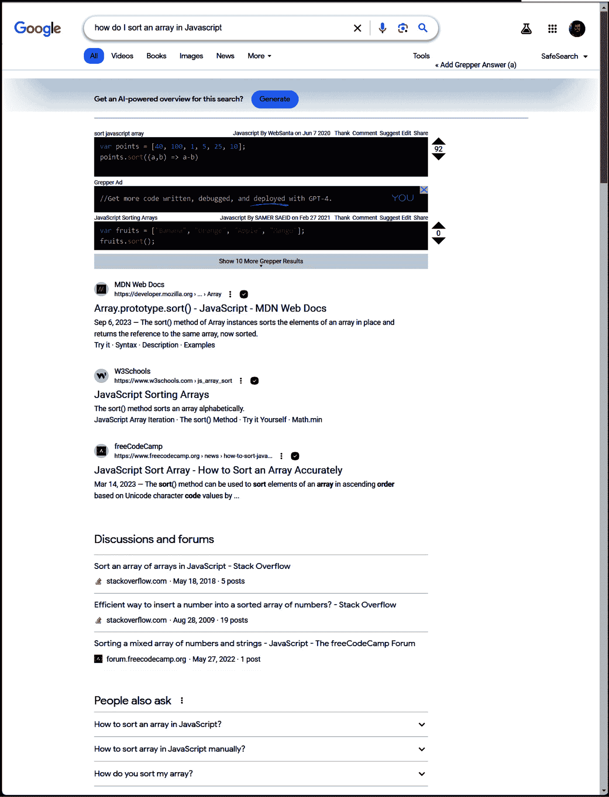
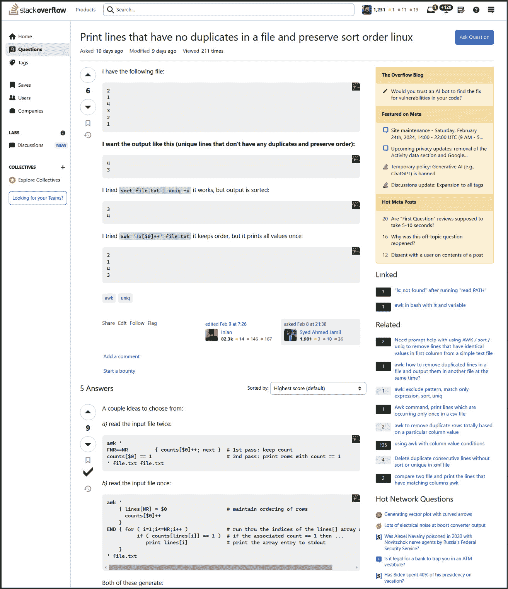
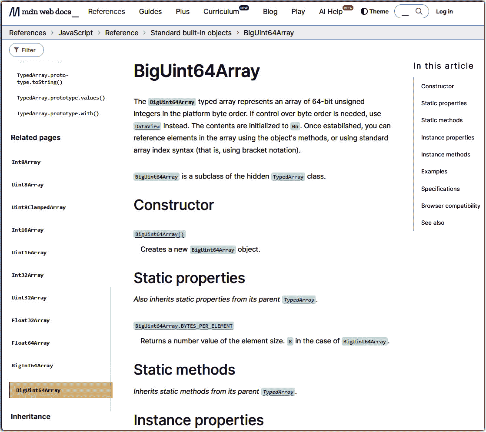
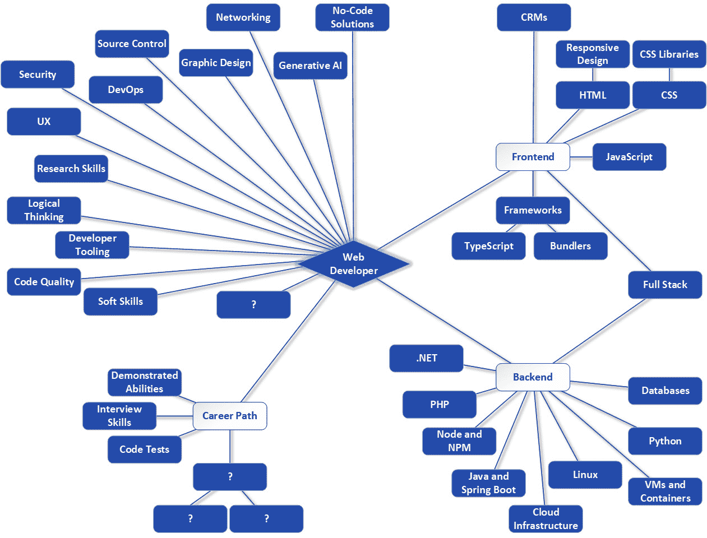

# 10

# 作为网络开发者，发现高质量工作的关键

学习编码并找到网络开发职位是好事，但一旦你做到了这一点，你就应该开始思考你可以做些什么来确保你表现良好。而且不仅仅是表现良好，还要随着时间的推移继续提高你的表现，如果你愿意，还可以帮助你向上攀登成功的职业阶梯。

我在谈论诸如关注细节、学习有效地使用搜索引擎和其他在线工具、如何有效地使用那些不专注于生成代码而是确保你编写代码的质量的开发者工具，以及你的多任务处理能力。这些都是任何人都可以学习和了解的事情，无论你的经验水平如何，而且随着时间的推移，这些应该成为习惯（即使过了一段时间后你不再有意识地思考它们）。

这些技能之所以重要，是因为目标是始终以高质量的标准工作，并始终产出稳固的结果，但又不至于让自己过度劳累。你的老板会希望你这样做，但如果你对自己的工作感到自豪，那么让老板满意（相对而言）就会变得容易。

因此，在本章中，我们将涵盖以下主题：

+   小事也要上心

+   锻炼你的 Google-Fu

+   识别 MVP 网站

+   工具的使用——其他需要了解和使用的工具

+   多任务处理（就像风中的 CPU 一样！）

# 小事也要上心

你可能听说过“小事不用太在意”这句话。这里的观点是不要因为担心那些影响较小或你无法做太多的事情而让压力积累。然而，在前面几章中，我提出了关注细节是优秀开发者关键属性的观点。“小事也要上心”，正如我所说的，这正是网络开发的核心。

注重细节是一个重要的技能，需要你在自己身上培养，因为虽然大错误会导致大问题，但小疏忽有时也可能演变成重大问题，尽管不一定有同样的紧迫性。

因此，在这个领域，你确实需要小事也要上心，但这里的短语并不是关于管理压力——而是关于尽可能详尽和准确地完成工作，考虑到尽可能多的因素，无论大小。这是制作尽可能稳健、高效和零缺陷工作的关键技能。

仔细审查代码、深思熟虑系统架构，并确保你的设计满足当前和未来的需求，这是我们最感兴趣做好并给予适当关注细节的事情。

例如，假设你正在构建一个涉及存储用户信息的网站。这涉及到将信息写入关系型数据库。你可能会决定用户表的关键——唯一标识用户的列——应该是每个人的名字和姓氏的组合。这乍一看似乎是合理的，事实上，它至少在一段时间内会运行得很好。但如果两个同名同姓的人——这种情况在现实生活中确实可能发生——尝试注册会发生什么呢？由于数据库设计中相对小的错误，新用户可能因为姓名冲突而无法注册。或者更糟糕的是，根据代码的编写方式，系统可能会将两个人的数据混合在一起。具有讽刺意味的是，当我写下这些话的时候，我正在处理一个情况，我的保险公司不知何故将我和我父亲的账户混合在一起，因为我们有相同的名字和姓氏。你不会认为这样的事情真的会发生，但你大错特错了！

因此，学会关注细节很重要。这也可能很困难，因为，尤其是在你职业生涯的早期，你不会有太多经验可以依据。在那个阶段，你能做的只是尝试思考各种场景，模拟它们，并尽可能多地寻找陷阱。经验并不是成功的保证，也并非总是需要的。逻辑思考——这是我多次提到的一个观点——最终才是关键。当然，你拥有的经验越多，你将能够更好地进行逻辑思考，因为你有更多的信息可以依据，但这并不是关注细节的全部。

如果你过于专注于项目的细节，你也需要稍微小心一点，因为正如俗话所说，你有时可能会因为树木而忽略了森林。你始终需要关注大局，并保持对细节所努力实现的总体目标和目标的视野。找到正确的平衡是必要的，而这主要来自于实践。你必须做这些事情，锻炼这些心理肌肉，以便随着时间的推移正确地建立它们。

当谈到注意力时，最重要的考虑因素可能是专注，以及你如何保持你的思维指向正确的方向，或者换句话说：活在当下。

## 活在当下

一个可以帮助你提高注意力的技巧是“活在当下”。我们所有人很容易被生活中各种各样的考验和磨难所分散注意力——我们几乎总是有一些事情在脑海中萦绕，我们担心的事情或者我们试图解决的问题——但关键是要学会将这些事情深深埋藏在心底，专注于此时此刻，专注于手头的主要问题。

如果你的思绪飘散，专注于其他事情，比如之前提到的那个数据库——即使你没有立即意识到这一点——你往往会发现你的注意力不在需要的地方，你可能会错过可能导致更好决策的细节，比如如果你使用名称，数据库键的问题。如果你在专注于那个设计任务，不让你的思绪飘散，你可能会想到数据库键的问题（当然，没有任何保证，但你至少想给自己最好的机会）。

虽然保持当下是一个普遍的概念，但你可以通过一些具体的步骤来帮助你实现这一点——我们称之为**正念练习**。这些练习旨在帮助你将注意力集中在当下，并帮助你更加意识到你的思想、感受和周围环境。它们对于提高专注力、减少压力和提升整体福祉非常有益。

具体来说，以下是一些你可以练习的常见正念练习：

+   *正念呼吸*：这可能是最基础的正念练习，但同时也可能是最有用的。只需将你的注意力集中在呼吸上。注意吸入和呼出的节奏。这当然是你身体的自主功能，是你很少关注的事情（除非有问题发生！），所以专注于它可能是一种有趣的经验。当你的思绪不可避免地飘散时，轻轻地将其带回到呼吸上，并重新集中注意力在当下。这可以在任何地方、任何时候进行，即使只有几分钟，不仅能帮助你学会关注细节，还可以作为简单放松的绝佳方式，这也有助于提高对细节的关注。

+   *身体扫描冥想*：这种练习可能不适合在办公环境中进行，但你可以在家中做。你只需躺下或坐在舒适的椅子上，然后缓慢而故意地将你的注意力集中在身体的每一部分，从脚趾到头顶。换句话说，你正在“扫描”你的身体。在这个过程中，注意身体每一部分的任何感觉、紧张或不适，并尝试放松你注意到的任何紧张。

+   *正念观察*：为了做这个练习，选择你附近的一个物体——任何物体都可以——然后专注于观察它一分钟或两分钟。注意你能注意到的关于它的每一件事，就像你第一次看到它一样去观察。如果你碰巧靠近窗户，找到一只鸟、松鼠或其他动物可以是一个特别有趣的“物体”来用于这个练习。

+   *正念倾听*：与正念观察不同，这个练习涉及倾听你环境中的声音，无论是鸟儿的鸣叫、树叶的沙沙声，还是远处的交通。

+   *正念饮食*：虽然这个练习可能不会在执行特定任务时帮助你关注细节，但它可以通过一个常见的例子来锻炼你的技能。这个练习涉及到全神贯注于简单、日常的饮食体验！当你吃饭时，注意食物的颜色、质地和味道。慢慢咀嚼，注意每一口的感觉和味道。你几乎可以把它变成一个游戏！这将训练你的大脑更加专注于当下，让它习惯于这种感受。

+   *行走冥想*：在类似的方式中，练习行走时的正念。这涉及到意识到你的脚接触地面的感觉，你步伐的节奏，以及你的呼吸。注意这样一个简单的事实：你的腿几乎是在自己移动！这是一个很奇怪的认识！此外，在行走时，注意你周围的环境、声音和气味。

+   *正念拉伸或瑜伽*：许多人定期练习瑜伽，原因很好：它可以帮助集中注意力！幸运的是，这不需要购买专业的瑜伽垫，也不需要在你的城市找到一个好的瑜伽班。相反，你可以坐一个舒适的姿势，进行缓慢、有目的的轻度拉伸，在移动时注意肌肉和关节的物理感觉。这里的关键是要非常温柔，因为这个练习旨在放松，所以你不想做得太过分，尤其是如果你这不是一个常规活动的话。

最后一个一般性的“练习”就是简单地休息几分钟，让你的思绪随意飘荡一会儿！你会惊讶地发现，仅仅放松一两分钟，反而可以帮助你在之后重新集中精力完成任务。此外，这也给你的大脑留出时间在较低层次上处理事情，这往往是突破棘手问题或挑战所必需的。

当然，关注细节和努力做好每一件小事是我们的目标，但到了某个阶段，你必须知道一些东西才能完成你的工作。但没有人知道所有的事情，包括我自己！然而，我们所有人都必须知道的是如何找到我们需要的信息，并在前进的过程中获得我们所需的知识，而在当今这个时代，实现这一目标的主要方式之一就是通过在线搜索引擎。现在让我们来谈谈这一点。

# 锻炼你的 Google 技能

正如我之前提到几次的那样，作为一名网页开发者，你不需要一开始就知道所有的事情。知识太多了——太多需要一次性保存在你的“肉脑”中。相反，期望你的是，你在大脑中保留一些一般概念，尤其是关于你目前使用的东西——如果你目前正在大量编写 JavaScript，那么记住数组上可用的方法是很合理（而且幸运的是，很自然）的，因为你将经常使用这些方法。

但始终期望的是，当你需要信息时能够搜索到它，并在行动中将其综合起来。术语“Google-Fu”经常用来描述这种能力，俏皮地将“Google”和“Kung-fu”结合起来，以描述一个人对 Google（或任何搜索引擎）的技能和高效使用。这涉及到快速找到精确信息的能力。

你可能认为这仅仅意味着输入正确的关键词，这确实是其中很大一部分，但它还涉及到理解搜索引擎的工作原理，并使用高级搜索技术，如布尔运算符、过滤器以及特定的搜索命令，以创建更好的搜索词，更快、更准确地获取你需要的信息。

让我们来看看一些关键点，这些点对于培养你的 Google-Fu 技能至关重要：

+   *有效的关键词选择*：选择精确、相关的关键词对于快速获取你需要的信息是必要的，这并不令人惊讶。例如，搜索`array methods`不会提供与`javascript array methods`相比如此具体的搜索结果。然而，你也必须意识到，过于具体可能会导致错过一些有用的结果。例如，搜索`javascript array methods that deal with collections`可能会过滤掉一些处理方法如`map()`和`reduce()`的网站——这是因为一些网站可能会讨论这些方法，但实际上并没有使用“collections”这个词，所以它们与你的查询匹配程度不如其他网站。这些网站也可能在结果中排名较低，导致你无论如何都会错过它们。这都是在寻找一个合适的平衡点，既要足够具体，又不要过于具体。

+   *布尔运算符*：Google 允许你使用与大多数编程语言相同的布尔关键词，让你能够构建更精确的搜索词。例如，搜索`javascript array methods for collections not map`可以获取你需要的结果，如果你知道`map()`没有涉及。`and`、`or`和`not`是这种用法中最常见的布尔运算符。

+   *引号*：当使用谷歌等搜索引擎时，你必须理解使用引号和不使用引号之间的区别。当你使用引号时，你是在告诉谷歌搜索那个*确切*的短语。搜索`"javascript methods of array"`只会找到以那种精确方式说`javascript methods of array`的页面。

    没有引号时，包含单词`javascript`、`methods`和`array`的网站将会出现在结果中（谷歌和大多数其他搜索引擎会丢弃常用词如`of`和`an`）。与有效的关键词选择一样，使用引号搜索词可能会使你的搜索过于具体，从而导致你错过好的结果。

+   *星号*：在搜索词中，星号可以用作通配符。通配符基本上意味着“可以是任何东西”。例如，搜索`*zamm*`意味着只要`zamm`出现在结果中，它之前和/或之后可以是任何东西（或者什么都没有），它都会匹配。所以，例如，包含 Zammetti 的结果会被找到（因为`zamm`之前没有东西，前面的星号允许，以及之后有`etti`，后面的星号允许），以及应用数学和力学杂志（其名称为 ZAMM，因此也会满足通配符），ZAMM 食品，Zamm 顾问，以及 Alex Zamm。

    你应该谨慎使用这个功能，因为它经常会带来很多与你所寻找内容无关的结果，但有时它也可能很有用，尤其是当与其他关键词以及可能的布尔运算符结合使用时。例如，搜索`*zamm* mathematics, not advisors`可能会得到更符合技术材料的结果，同时排除那些关于云迁移公司（Zamm Advisors）的结果。

+   *特定网站搜索*：有时，你可能知道你正在寻找的内容可以在某个特定的网站上找到，但你可能不确定具体在哪里。在这种情况下，谷歌允许你通过在搜索查询前加上`site:`来搜索特定网站。例如，为了在流行的电影数据库网站 IMDB 上搜索关于电影《食人鱼》的信息，你可以搜索`site:imdb.com predator`。作为一个网页开发者，在寻找代码中如何做某事的示例时，专门搜索 GitHub 是很常见的事情，所以`site:github.com`是一个需要记住的。

+   *文件类型搜索*：尽管不太常见，但谷歌和其他搜索引擎也允许你搜索特定文档类型。如果你正在寻找 PDF 文件，你可以在搜索查询前加上`filetype:`来搜索 PDF 文件。例如，你可以通过搜索`filetype:pdf zammetti flutter`来找到关于 Flutter 的我的书中的一些章节。

+   *基于时间的过滤器*：大多数搜索引擎都提供限制结果到特定时间范围的能力。在 Google 中，你可以在搜索框下方找到**工具**菜单，这是在你进行搜索之后应该看到的。在这里，你可以请求只显示过去一周或一个月的结果，例如。当你需要查找有关最近的安全漏洞的信息时，这可以非常有帮助。

能够通过像 Google 这样的搜索引擎快速有效地搜索答案是一种你可以练习的技能。要做到这一点，只需思考一个主题，然后开始尝试进行一些搜索。一般来说，如果你必须向下滚动到第五个或第十个搜索结果，那么你可能需要改进搜索查询。过了一段时间，你会发现前几个结果通常会包含你需要的内容；否则，它会告诉你你的搜索查询还不够好。这是一个普遍的规则，但总会有例外，但我发现，当你构建好的查询时，这几乎总是正确的。通过使它们更加具体来继续改进那些不能快速给出所需结果的查询。

这又是一个普遍的规则：从一个更一般的查询开始，只有当你没有得到你需要的内容时，才开始使其更加具体。这种策略将帮助你不会因为过于具体而错过好的结果。然而，这个规则的一个大例外是，如果你正在研究一个特定的错误信息。在这种情况下，我鼓励你复制整个错误信息并直接搜索它（尽管我总是建议在它里面不使用引号）。你将是第一个遇到特定错误信息的人的情况极其罕见，因此你很可能会在前一个到三个结果中找到满意的答案。

搜索引擎现在也将人工智能集成到其搜索结果中。例如，在撰写本文时，Google 通常会显示一个生成式人工智能实验部分，位于常规搜索结果之上。这些结果对于某些类型的搜索来说非常好。例如，搜索“如何在 JavaScript 中排序数组”可能会得到一个很好的结果，如*图 10.1*所示），主要是因为生成式人工智能在您自然提问时通常比您在直接进行网络搜索时搜索一系列关键词时表现得更好：



图 10.1：一个 Google 搜索立即产生有用结果的示例

这些天，我的策略是始终从一个直接的问题开始，就像我是在向另一个人提问一样，看看 AI 的结果如何。如果没有，那么我才会转向查看网络搜索结果。即使如此，写一个直接的问题通常也能得到更好的结果。根据我的经验，这取决于问题的普遍性。例如，`如何在 JavaScript 中排序数组`是开发者经常问的问题，所以，除了 AI 结果之外，你很可能在第一次网络搜索中就得到一个好的结果。

如果我发现即使采用那种方法也没有得到好的结果，那么我才会转向一个更以关键词为中心的策略。所以，在这个例子中，我可能会尝试搜索`sort array javascript`。当然，我还会开始查看结果列表的更下方，尽管这些结果的质量在最初几项之后往往会下降。

当然，随着你越来越多地使用搜索引擎，你开始意识到，很多最好的结果都来自少数几个常见的网站。这些就是我所说的**最有价值球员**（**MVP**）网站。这些网站是为我们开发者量身定制的，或者为开发者提供了一个聚集的地方，所以有时候，直接访问这些网站会更好。但无论你是直接访问还是通过搜索结果到达，了解它们都是有益的，所以现在让我们来看看其中的一些。

# 识别 MVP 网站

互联网上有许多有用的网站，你在你的网络开发之旅中会遇到很多，但我认为有两个特别突出——**Stack Overflow**（**SO**）和**Mozilla 开发者网络**（**MDN**）。你可能发现，你大部分的时间和搜索结果都指向它们，所以让我们来看看这两个。

## SO

SO ([stackoverflow.com](https://stackoverflow.com)) 已经迅速成为全球开发者景观的一个核心部分。由两位名叫 Jeff Arwood 和 Joel Spolsky 的绅士于 2008 年启动，它为用户提供了一种问答格式，特别是为开发者提供提问和回答关于软件开发及相关主题的问题。

经过几年的发展并积累了大量内容，它现在已经成为一个数据库，包含了各种开发者知识。这就是为什么与软件开发相关的搜索结果经常指向那里。但作为一个独立的网站，它仍然非常活跃，你可以独立于搜索引擎使用它。

一旦你访问 SO 并创建一个免费账户，你将能够以各种类别和标签提问，以标识其内容，然后坐下来等待人们回答！而且这是最好的部分：当你回答问题时，你会获得声誉点，这激励人们回答。虽然在我的经验中并不常见，但能够说你在 SO 上有一个高声誉分数有时在面试中会给人们留下很好的印象，所以当你准备好时回答问题是有价值的。

此外，问题和答案都由 SO 社区进行投票。问题获得更多赞同意味着更高的可见度，这通常意味着更多的答案，赞同有助于回答者获得更多声誉。所有这些都导致了一种基于社区的监管，使得“好”的问题和答案在某种程度上得到提升，而“坏”的问题和答案则被推下（声誉更低，可能在搜索结果中出现的频率更低，等等）。

*图 10**.2* 展示了一个 SO 问题和对其的回答的例子。注意网站并不花哨，这很好，因为它保持了内容的焦点，这才是最重要的。从这张截图可以看出，这个问题收到了五个回答，其中有一个获得了九个赞同。这个问题被提问者接受，如下面的投票计数下的勾号所示。我很快就会谈到这一点，但请注意这个回答以及提供者如何提供几个替代方案，代码格式良好且解释得当（通过评论）。这就是我认为的“好”答案：



图 10.2：SO，全貌尽收眼底

这自然引出了一个非常公平的问题：什么是构成“好”和“坏”问题与答案的标准。由于是社区驱动的，没有硬性规定。你总是某种程度上受制于构成社区的其它开发者的随意性。但也有一些一般性指南需要记住。

### 提出好问题

首先，在你提出问题之前，确保花些时间在 SO 上尝试找到合适的答案。正如我之前提到的，你很少是第一个遇到某种情况的人，所以你打算问的问题很可能已经被回答了。在 SO 上发帖提问并立即得到一个（并不特别礼貌）的回答，说它是现有问题的重复，这种情况并不少见。尽量通过自己找到答案来避免这种情况，无论是通过 Google 还是直接在 SO 内部搜索。

接下来，在提问时，友好地开始是有效的方式，这应该不会让人感到惊讶。像“嗨！我在*X*上遇到问题，并希望得到任何我能得到的帮助”这样的简单事情会让你显得像是一个人们愿意帮助的人。不要显得你理应得到答案——这就是关键。

当你得到答案时，即使有些答案没有帮助，甚至非常无礼（提前警告，有些答案确实会这样），也要继续保持专业、耐心和礼貌。开发者有时可能是一群直言不讳的人，但这并不意味着他们在恶意或不是真正试图帮助。给他们一个好处，如果需要，扩展问题，并始终提供额外信息，同时保持礼貌。当然，如果你遇到那些似乎只是想让你过得艰难的人，忽略他们是完全可以接受的，在这种情况下，这可能是最好的做法。 

之后，重要的是要表明你已经做了一些工作。像“我试图让我的应用程序在 Tomcat 中运行，但它不起作用，它给我一些错误，请帮助”这样的问题肯定会被忽视，或者被踩。相反，详细说明你迄今为止为解决问题所尝试的方法，并尽可能提供详细信息：

+   你具体遇到了什么错误？

+   当它发生时，你具体尝试做什么？

+   你在哪里进行了研究，试图自己找到答案？

+   如果那样做不行，你在决定需要帮助之前，自己尝试了什么？

SO 上的用户真的很不喜欢那些看似没有尝试自己解决问题的人提出的问题，所以你想要清楚地表明你已经尝试过，这意味着提供详细信息。

尽量隔离问题。换句话说，尝试从问题中尽可能多地移除内容，以便尽可能集中。如果你有一段不起作用的代码，尝试移除任何你确信是有效的且对理解问题代码不必要的代码。开发者很少需要看到一百个不同的函数来找出为什么某个函数不起作用，所以不要在问题中添加大量无关内容。

此外，务必详细说明你想要得到的精确结果，并为帖子写一个清晰、简洁但尽可能简洁的标题。标题应尽可能用最少的词语描述问题。例如，“帮助，JavaScript 问题”过于笼统，没有价值，但“JavaScript 数组排序未产生正确排序的数组”则更为具体，而且也不算太长。另外，确保你每篇帖子只真正问一个问题；否则，事情可能会变得非常混乱，而且很快就不会有帮助。

随着答案开始陆续到来，你可能需要稍微参与其中，以获取你需要的信息。这可能意味着澄清你的问题，或者提供所需的信息。记住，Stack Overflow 是你与愿意帮助的人之间的对话。有时，你可能会立即得到你需要的答案；其他时候，你可能需要经过一些来回的交流才能得到。当然，如果花费了一些时间或者最终没有得到答案，要抵制住沮丧的冲动。请记住，这些人是在花费他们的时间和精力来尝试帮助你，所以即使他们给出了错误的答案，也不要怪罪他们。他们几乎肯定不是故意这么做的！就随它去吧，记住，即使是错误的答案有时也可能是有帮助的，甚至可能让你看到之前没有看到的东西，并因此找到答案。

最后，当你找到好的答案时，一定要为它们点赞，并确保接受那些帮助你解决问题的正确答案。这对保持声誉系统正常运作并继续为人们提供互相帮助的激励很重要。有些人之所以在 Stack Overflow 上花费很多时间，就是为了回答尽可能多的问题，以获得尽可能高的声誉，而有些人只是偶尔的访客，在他们能帮忙的时候帮忙。无论如何，你想要确保他们得到帮助你的认可，这样他们就会更有可能下次也帮助别人——也许那又是你！

我要提到的最后一件事是，仅仅在 Stack Overflow 上写出一个好的问题，就能帮助你自己发现答案！我无法告诉你我花了多少时间来撰写一个问题，而在 halfway in 我突然意识到答案了。这就像橡皮鸭调试一样发生。橡皮鸭调试是指开发者——有时甚至非常直接——将问题与橡皮鸭讨论。是的，一个真实的、物理的橡皮鸭，就像孩子们在浴缸里经常玩的那样！我知道这听起来很奇怪和愚蠢，但仅仅解释一个问题，讨论你尝试解决它所做的一切，以及详细说明你认为可能的问题，这就是解开你的大脑并得到你需要的“eureka！”时刻的全部。所以，无论你是真的买了一个橡皮鸭，还是只是在 Stack Overflow 上打出一个问题，最终甚至没有发布，有时候这本身就足以完成任务，尽管看起来很奇怪！

### 提供好的答案

当然，提出好的问题只是方程的一半。特别是在你作为网络开发者旅程的早期，你大部分时间都会处于提问者的位置。但最终，你可能会发现自己信心和经验到了一个点，你想要回答一些问题。你甚至可能会发现，你可以早期回答一些问题，因为你恰好遇到了别人正在努力解决的问题。无论如何，提供好的答案是让 Stack Overflow 正常运作的重要因素。

确保你的回答直接明了。你经常会发现一些回答虽然总体上不错，但却偏离了主题，讨论为什么这项技术或设计选择并不理想——这并不总是坏事，有时回答特定问题非常必要，但有时，这只是某人表达未经请求的观点，对提问者并没有实际的帮助。所以，尽可能专注于提供对特定问题的具体答案。

回答问题时，始终要记住，并非所有开发者都处于同一水平。有些人刚开始，有些人比你有更多经验，以及介于这两者之间的所有水平。尽量减少假设，并始终保持礼貌。无论发生什么，都要尊重和职业。当然，你可能会收到像“不，那是错的，我试过了，下次做得更好”或类似无礼的回复。但最好是忽略它，而不是与某人开始一场口水战（尽管他们确实应该得到这样的回复！）。这根本不值得你浪费时间和精力。

回答时，你希望尽可能清晰简洁，这可以通过提供简单的例子来帮助。有时，一个简单的例子胜过千言万语。你还需要尽可能以最简单的方式解释你的解决方案。再次强调，不要假设其他人知道什么——就像你确信他们不知道一样，解释每一个细节。

确保在适当的地方引用参考文献。这是一种极好的帮助他人学习的方式，通过展示他们可能不知道的信息来源，并允许他们在超出他们提问的问题范围之外学习，而不会显得过于强硬。他们可能会得到你给出的答案，但随后会阅读你用来得出答案的文档，并在这个过程中学习到他们之前没有考虑到的其他东西。

最后，虽然我已经说过几次，但我认为这很重要，所以我想再说一遍：无论提问还是回答问题，无论你的互动如何，始终要选择高尚的道路！SO 有时会因有毒的互动而闻名，但如果你保持积极的态度，我认为你会发现这种情况非常罕见（如果发生，也容易忽略）。记住，SO 是一个村庄，一群人相互交流和合作。就像任何村庄一样，可能有一些不太愉快的人四处游荡，你可能会遇到。尽你所能，永远不要成为他们中的一员，我相信你会发现 SO 是一个宝贵的资源。

当然，SO 是一个社交环境，你在这里与其他人互动。但这并不是唯一的选择。你通常会通过阅读各种网站上的文档来获得答案。但作为一个特定的网络开发者，你可能发现自己经常访问的一个网站就是 MDN。那么，让我们现在就来谈谈它。

## MDN

MDN 或 MDN Web Docs，有时也这么称呼，是面向网页开发者的最全面资源之一。该网站提供关于所有网络技术的参考文档、教程、示例和指南。它是一个非常受尊敬的信息来源。您可以在以下链接找到 MDN：[`developer.mozilla.org`](https://developer.mozilla.org)。在 *图 10.3* 中，我选择了一个 JavaScript 对象来展示一些关于它的参考材料：



图 10.3：MDN

MDN 的一些亮点如下：

+   *文档*：MDN 以其详尽的文档而闻名。它涵盖了主要网络技术，如 HTML、CSS 和 JavaScript，还涵盖了网络开发的其它主题，例如重要的协议、浏览器的网络扩展和可访问性。内容极其详细且组织良好，并包含大量示例。所有这些使其成为初学者和经验丰富的开发者宝贵的资源。

+   *社区驱动*：虽然不像 SO 那样是一个社交网站，但 MDN 仍然具有其社区驱动的特性。来自世界各地的专业开发者和志愿者定期以更正式的方式为其内容做出贡献，但不如 SO 网站那样。这有助于确保提供的信息始终准确且最新，并考虑到最新的网络标准和最佳实践。MDN 维护者与网络标准机构如 **世界万维网联盟**（**W3C**）和 **网络超文本应用技术工作组**（**WHATWG**）紧密合作，以确保文档反映了最当前的网络标准。

+   *教程和指南*：虽然 MDN 提供了大量参考材料，但它还提供了针对新接触网页开发或希望扩展技能的人的教程和学习路径。这些资源旨在实用且易于遵循，并为您提供所需的知识和技能，因此您可以考虑它不仅是一个参考网站，也是一个学习网站。

+   *可访问性和国际化*：MDN 强调网络可访问性信息，有助于确保您使用其提供的信息构建的网络内容对残疾人士可访问（我们已在 *第五章* 中讨论了可访问性）。它还提供多种语言的内容，反映了其全球用户基础。

+   *兼容性和浏览器支持*：MDN 包含了关于不同网络特性浏览器兼容性的详细信息，这对于旨在创建跨平台网络应用的开发者至关重要。有了它，您可以确保给定的特性将按预期在一系列浏览器中工作，从而最大化您构建的网站受众。

+   *开发工具*：MDN 还提供了关于浏览器开发工具的指南和参考。这有助于开发者通过探索开发工具的使用方式来调试和优化他们的代码。

+   *开源和免费*: MDN 是一个开源资源，其内容免费提供。这得益于 Mozilla 使命，即保持互联网开放和可访问。他们最知名的产品，Firefox 浏览器，是这个目标的典范，但 MDN 也不遑多让！

与 SO 不同，MDN 不是一个社交网站。在那里，你不会体验到 SO 上的那种与其他开发者的互动。但它是你可以书签并用作参考材料来源的绝对最好的网站之一。它非常准确，始终是最新的，并且在所有重要的方面都非常可靠。

当我们谈论作为开发者为了成功可以做的事情时，另一个考虑因素是明智地使用各种帮助你编写更好代码的工具。IDEs 当然是其中之一，但还有独立的工具（这些工具通常也可以集成到你的 IDE 中）可以检查你的代码并帮助你改进它。我们将在下一节讨论其中的一些。

# 工具集 – 其他需要了解和使用的相关工具

当你编写代码时，是你与机器对抗。你编写代码，运行它，查看它做得对或不对，然后调试它。你一次又一次地这样做，直到它按预期工作。你就是在数字形式中塑造那块粘土！

但几乎总是有你可以做的事情来让它变得更好。除非代码很小且简单，否则通常是这样的情况。也许其中还有你尚未发现的错误。也许你可以做些事情来提高它的性能。也许存在只有在某些非常具体的情况下才会成为问题的安全问题（不幸的是，威胁行为者非常擅长找到这些问题）。或者，也许它只是没有像它本可以的那样格式化得那么一致。

在所有这些情况下，你不必孤军奋战！有些工具可以帮助你编写更好的代码。它们分为三个广泛的类别：**静态代码分析**（**SCA**）工具、代码检查器和格式化工具。它们之间有显著的交叉，通常，你会听到开发者一般地谈论“静态分析工具”，但它们之间有足够的差异，可以创建这三个广泛的类别。

然而，无论哪个类别，它们都涉及分析你的代码、报告问题和提供建议的工具。作为一名专业开发者，几乎肯定会使用这些工具。即使你最终在一个通常不使用这些工具的地方工作，作为一个好的开发者，你也应该自己使用它们，因为它们确实可以给你的工作带来很多好处。

让我们先从 SCA 工具开始讨论，这可能是这个类别中最广泛和最通用的。

## SCA 工具

SCA 工具的目的是在不实际执行源代码的情况下分析它，提醒你那些你可能自己看不到的问题。

这些类型的工具通常从命令行运行，你只需告诉它你的源代码在哪里，它就会去执行其任务。其中一些具有 GUI，使得使用它们更容易一些。大多数都可以集成到你的 IDE 中，并从那里执行。

此外，将这些工具集成到 CI/CD 管道中并不罕见，有时甚至非常彻底。例如，构建通常会失败，如果发生任何 SCA 失败，会警告整个开发团队。这有助于确保代码在推送到并部署供人们查看之前处于良好状态，无论是开发环境还是甚至生产环境。

### 流行示例

虽然远非详尽的列表，但所有这些类别中我都会给出示例，其中一些更广为人知的 SCA 工具如下：

+   **SonarQube**：这是一个广泛使用的工具，用于查找代码中所有各种问题。例如，它可以指出在给定特定输入时你的代码可能会失败的地方，以及你的代码没有正确编码输出，因此可能导致安全漏洞的地方。它支持质量门的概念，即你可以设置的规则，用于确定审查是否通过或失败。由于它可以集成到 CI/CD 管道中，如果配置为这样做，构建可以根据这些门失败。虽然 SonarQube 通常被认为是一个非常不错的工具，但它的设置和使用可能稍微复杂一些。

+   **Veracode**：Veracode 与 SonarQube 类似，但几乎专注于安全问题。它是基于云的，这通常使得它比 SonarQube 更容易使用。它通常只需要上传你的源代码并点击一个按钮。你将得到一份详细的报告，其中包含其发现的结果，并直接链接到源代码。它不仅可以检测你代码中的问题，还可以指出你可能正在使用的具有已知漏洞的依赖项。Veracode 还提供动态分析选项，这意味着它可以在运行时扫描你的代码，这允许它检测静态分析无法检测到的缺陷。

+   **Coverity**：这款工具因其先进的静态分析能力而闻名，尤其是在检测安全漏洞方面。它声称测试每一行代码和潜在的执行路径，并清楚地指出每个缺陷的根本原因，使得问题修复变得容易。它可以检测的问题类型包括资源泄露（当你的代码没有正确清理自身并浪费了像内存这样的资源时）、使用未初始化的数据（一个非常常见的缺陷，通常会导致安全漏洞），以及控制流问题（当你的代码逻辑可能导致执行你不希望执行的代码）。

虽然一些提供了更强大的功能，但所有这些都可以集成到 CI/CD 管道中，也可以集成到 IDE 中，尽管每种情况下提供的能力可能差异很大。例如，虽然 Veracode 可以集成到你的 IDE 中并立即报告问题，但由于云托管模型意味着 Veracode 的全部功能不能在你的机器上运行，因此功能有限。这只是在使用这些工具时需要记住的一点。

此外，这些工具在支持水平上存在一些差异，但所有这些工具都支持多种编程语言和技术堆栈。其他工具针对特定语言（例如，FindBugs 是一个仅针对 Java 的 SCA 工具），因此研究每个工具以确定它是否满足你的技术需求是很重要的。

底线是，使用这些工具将帮助你及早发现问题，在大多数情况下在代码部署或运行之前。这意味着你的输出将更加稳固和健壮，这是最终目标。

## 代码检查器

**代码检查器**执行与 SCA 工具几乎相同的功能，但处于不同的层面。虽然 SCA 工具进行的分析可能非常深入，但代码检查器通常不会深入到代码中。SCA 工具通常会通过执行你的代码（不是字面上的执行，而是在它们可以分析代码并确定数据如何通过它的意义上）来更深入地分析，从而发现代码中的深层缺陷。

与之相反，代码检查器（linters）寻找特定的模式，已知容易导致错误的构造，以及不符合既定标准的代码。这意味着代码检查器通常比安全代码分析（SCA）工具要快得多，这意味着定期使用它们干扰性更小。相比之下，SCA 工具通常需要花费相当长的时间来执行其分析。代码检查器可以像 SCA 工具一样找到安全问题，但它们在更高的层面上这样做。

从本质上讲，可以将代码检查器视为将你的代码视为文本的工具，寻找可能表明问题的特定模式，而 SCA 工具则更像你在调试时作为程序员，你在脑海中逐行遍历代码。

代码检查器有助于维护一致的编码风格，使代码更易于阅读和维护，基于你设置的规则。再次强调，这仅仅是模式识别：如果配置了规则来告诉你，例如，如果你忘记在行尾放置分号，代码检查器可以告诉你。

由于不同编程语言之间的差异往往导致不同的查找模式，因此代码检查器几乎总是语言特定的。

### 流行例子

这里有一些流行的代码检查器例子：

+   **ESLint**：这是一个 JavaScript 的代码检查器。它可以非常灵活地配置，你可以在非常细粒度的层面上确定它应该使用的规则。它支持最新的 JavaScript 标准，这有助于确保你的代码以现代、健壮的方式编写。

+   **Pylint**: 这是一个流行的 Python 代码检查工具。它具有灵活性，类似于 ESLint，可以找到各种错误和代码异味（开发者倾向于认为虽然不是明显的错误，但通常不应该以某种方式编写的代码片段）。

+   **CheckStyle**: 这是一个流行的 Java 代码检查工具。它主要关注代码风格和格式，虽然也包含一些错误检测功能。它具有高度的可配置性，尽管这种配置可能相对复杂。

## 风格化工具

虽然代码检查工具会指出代码中的问题，但它们不会修改代码。这对于源代码分析（SCA）工具也是如此。另一类工具是风格化工具（有时称为格式化工具），它们确实会修改你的代码。它们可以自动将源代码格式化为特定的风格指南，确保整个代码库的一致性。与代码检查工具不同，它们不仅会标记问题，还会重新格式化代码以满足指定的指南。

**风格化工具**通常使用简单，并且通常可以配置以适应团队特定的风格和规则。然而，它们也可能存在风险。我并不是说它们会破坏代码——我不记得曾经看到过风格化工具破坏代码——但它们的风险在于它们可以非常快速地改变代码的结构。如果你没有正确设置规则，那么你可能最终会手头上有清理工作（希望这仅仅意味着更改规则并重新运行风格化工具，但这并不总是有效）。

风格化工具的主要目的是维护代码的一致性和适当的格式化风格，但我必须警告您不要过分依赖它们。许多开发者认为他们可以以任何他们想要的方式编写代码，因为他们知道当他们完成时，将会运行风格化工具，这时代码将具有正确的风格。根据我的经验，这是一种不好的工作方式。

我的妻子是一位受过训练的大厨，每次我们一起准备餐点时，她都会强调一个真正的专业厨师会在烹饪过程中不断清理。他们不会简单地做饭时制造一个大混乱，然后在最后清理。他们不断清理自己的工作台，因为这会导致更少的错误（你不想因为在一个混乱的工作台上滑倒而割伤自己）并得到更一致的结果。我已经开始以同样的方式看待编码。

我见过开发者编写代码时，有时用两个空格缩进，有时用四个空格缩进。有时，他们在行尾放置花括号，有时则单独在下一行放置。当然，代码本身并不在乎——它无论如何都能正常工作。但这种随意性会导致更多错误，因为不一致性往往会使代码更难以跟踪，这也是我们为什么关心它的原因。

我相信，就像专业厨师一样，专业开发者会边做边清理。对我们来说，这意味着在编写代码时，要写出格式良好且最重要的是格式一致的代码*边写边格式化*。是的，你应该在最后使用一个格式化工具来捕捉你犯的错误，因为毕竟，我们都不是完美的。但简单来说：你希望这个格式化工具尽可能少地工作！在你的代码中应该很少有它需要改变的地方，因为你实际上已经自己正确地格式化了。养成这个习惯，让它成为你不用思考就能做的事情，它不会妨碍你的工作。我会争辩说，这会使你更有效率，因为你的大脑在调试时不需要处理你工作的不一致性。

### 流行示例

你可能会遇到的一些流行格式化工具如下：

+   **Prettier**：最受欢迎的代码格式化工具之一，它支持许多语言，并与大多数 IDE 以及普通的文本编辑器集成。通常只需按下一个键组合，你的代码就会立即被重新格式化。虽然 Prettier 可以配置，但在这个领域它故意有些限制。相反，Prettier 是我们所说的有“意见”的工具。默认情况下，它使用一组合理且常见的设置，目标是让你根本不需要对其进行配置。

+   **Black**：一个知名的 Python 代码格式化工具，以其对 Python 代码格式化的坚定方法而闻名。它比 Prettier 更有意见，因此配置选项更少。只要你喜欢它提供的风格，它就非常出色，几乎不需要任何设置成本就能立即为你工作。

+   **Gofmt**：Gofmt 是 Go 语言编写的代码的默认格式化标准。它几乎被所有 Go 开发者普遍使用。它实现了 Go 社区编码标准，并提供了相对较少的配置选项。然而，它非常快，并且被广泛采用，如果你进行任何 Go 开发，几乎可以肯定你会使用它。

不论是 SCA 工具、linters 还是 stylers，将这些工具融入你的日常工作流程可以显著提高代码质量和可维护性，同时减少错误数量。将它们集成到你的开发流程中，包括 CI/CD 管道，可以简化代码审查，增强团队协作，并强制执行编码标准（这是开发者们通常不太愿意争论的事情！）。它们在大型项目或团队中尤其有益，确保尽管有多个贡献者，代码库仍然保持统一。

当然，没有工具能解决所有问题。有时，一切都取决于你和你的大脑以及你如何使用它。好吧，更具体地说，它**总是**是这样的！现在让我们看看这方面的某些方面。

## 使用最好的工具——你自己！

我们一直在讨论的工具都有明确的目的是以某种方式改进你的代码，无论是更无错误、格式良好，还是其他任何东西。这些工具是出色的，并且绝对应该使用。但有一个你应该始终使用，那就是你自己——你和你的大脑！

最好的开发者不会依赖于所讨论的工具；相反，他们会将它们作为备份使用，因为一直以来他们都在编写干净、稳固的代码。当然，没有人是完美的，这就是为什么我们需要这些工具来“监视”我们的后背，换句话说，捕捉我们遗漏的地方。但如果我们做对了，那么这些工具要捕捉的东西应该非常少，因为出于习惯，我们一直以来都在用适当的格式编写代码，并始终遵循稳健的开发原则。

但还有一件事你需要记住，那就是注释代码，因为虽然这些工具可以指出你没有很好地注释的地方，在某种程度上，这主要是一个你必须自己做的领域，因为一般来说，机器不知道你在想什么（一些基于新 AI 的工具开始改变这一点，但我们仍然处于这个领域的早期阶段，所以最好是自己培养良好的习惯）。

记录我们的代码非常重要，这就是为什么在代码中编写注释变得很重要。在你的职业生涯中，你无疑会遇到一些开发者告诉你，如果代码是“自文档”的，那么注释代码是不必要的。他们这是什么意思？

他们这意味着代码应该被编写得清晰且“明显”，其中一部分是良好的命名。例如，看看这段代码：

```js
const ac = getAc("zammetti");
```

这会做什么呢？你可以看出`getAc()`函数将返回……某物。它将被存储在`ac`变量中。这一切都很明显。但`getAc()`返回什么？`ac`变量又是什么？

你可以用更清晰的方式重写这段代码：

```js
const checkingAccount = getCheckingAccountFromLastName("Zammetti");
```

现在，很明显正在发生什么，因为变量的名称和函数的名称本身就清楚地说明了它们的作用。没有猜测的必要。这就是所谓的自文档代码：以某种方式命名事物，以便它们传达它们的目的信息。

然而，即使你这样做，也有一些信息仅仅通过良好的变量和函数名称是无法适当传达的。这就是代码中的注释发挥作用的地方。正如我提到的，关于代码注释有很多争议，一些开发者更喜欢尽可能少地注释，而另一些开发者则会争论说，你的代码中应该有比实际代码更多的注释！

根据我的经验，最好的答案往往介于两者之间。一个需要记住的关键原则是，注释应该解释代码的*原因*，而不是*内容*。换句话说，你不应该对每一行代码都进行注释，解释它做什么，因为——假设它像之前描述的那样写得清晰——这一行本身就已经告诉你它在做什么了。代码本身是内容，所以不要这样做：

```js
// Get the checking account.
const checkingAccount = getCheckingAccuntFromLastName("Zammetti");
// Increment its transaction count.
checkingAccount.transactionCount++;
// Create a transaction.
const transaction = new Transaction();
// Add a credit.
Transaction.credit(100);
// Add transaction to account.
account.addTransaction(transaction);
// Save the updated account back to the database.
account.saveToDatabase();
```

相反，我建议注释这段代码的更好方式可能是如下所示：

```js
// Add a transaction to the account and update it in the database.
const checkingAccount = getCheckingAccuntFromLastName("Zammetti");
checkingAccount.transactionCount++;
const transaction = new Transaction();
Transaction.credit(100);
account.addTransaction(transaction);
account.saveToDatabase();
```

虽然传达了类似的信息，但良好的命名变量和函数加上一些明智的注释就足够了。如果你在`saveToDatabase()`调用之后留一个空行，然后开始下一个动作，那么单行注释的好处就是逻辑上分组这些行。你可以轻松地看出这六行代码与更新账户相关，注释就像是一个路标，为它们指路。

但即使这样的注释也可能并非真正必要（除了前面提到的路标之外），因为它并没有解释代码存在的*原因*。为什么我们要添加交易并更新账户？事情的原因正是注释发挥作用的地方。解释代码各部分是如何协同工作的，非常适合添加注释。描述代码中可能存在的任何陷阱——这也是值得注释的。

例如，你可能会在`getCheckingAccountFromLastName()`函数上方写一条注释——大致像这样：

```js
/**
 * Perform a SQL database query against the MASTER accounts
 * table to find a checking account based on a last name.
 * The account will consist of the basic account details,
 * as well as extended transaction data as a sub-object.
 * Note that an exception is never thrown, an Account
 * object will ALWAYS be returned.  Used by the account
 * list screen, as well as the processing subsystem.
 *
 * @param  inLastName The last name to return an account
                      for.
 * @return            An Account object.  If inLastName is
                      null, return an empty Account object.
                      If no account is found for the last
                      name, return an Account object with
                      an account number of -1 and all
                      other fields empty.
 */
```

不要专注于语法，因为语法会因语言而异（这是针对 Java 的）。但更重要的是，在这里，你可以看到函数的详细描述，以及可能帮助未来开发者（可能就是你！）的一些细节。你还可以看到它接受什么参数，返回什么，以及它的操作条件。

一些开发者说应该避免注释的原因之一是“注释在撒谎”。他们的意思是，如果你修改那个函数，使其在`inLastName`为`null`时返回`null`而不是空的`Account`对象——这种改变可能出于某种原因在以后是必要的——如果你不更新注释，那么注释实际上就会“撒谎”。它告诉你当`inLastName`为`null`时应该期待一个空的`Account`对象，但情况已经不再是这样了。

虽然有人说你可以通过不写注释来避免这个问题，这无疑是正确的，但这并不是一个好的答案。相反，正确解决这个问题的方法是将注释视为与代码一样重要。当你更改代码时，养成同时更改注释的习惯。一些开发者会先更新注释，从某种意义上说，为自己即将要做的工作提供一个指南。无论如何，不要将注释视为事后之想，这样你就不会倾向于得到“撒谎”的注释。

最后，养成多注释而不是少注释的习惯，但也要留意多余的注释。如果你发现自己更多地注释了正在发生的事情而不是原因，那么你可能做得太过分了，这也可能表明你没有以自文档化的方式编写代码（因为如果代码本身已经很明确，你还需要那么多注释做什么？）

但我可以告诉你，作为一个不得不处理大量代码且注释很少的人，我宁愿选择注释过多的代码库，也不愿选择注释稀疏的代码库，无论它写得多么自文档化。即使是糟糕的注释，也像糟糕的披萨一样：它仍然相当不错！最终，一切都关于平衡。过多的无用注释可能会妨碍，但不足同样糟糕。追求中间地带。

除了注释和养成良好的习惯之外，使用大脑的另一个方面是，在这个行业中，很多时候你需要大脑同时处理多件事情。让我们来探讨这意味着什么。

# 多任务处理（就像风中的 CPU！）

您电脑中的 CPU 是一项惊人的技术成就。一位名叫本·德里科尔的绅士在一次推文中说得最好：“如果你编写的代码感觉像是一种黑客行为，但又能工作，那就记住，CPU 实际上是一块我们欺骗使其产生思考的石头。”

最令人惊讶的可能就是它（看似）能同时做很多事情。当你使用 Windows、OSX 或基于 Linux 的桌面时，你可以同时打开多个窗口，同时运行多个不同的程序。虽然 CPU 不是唯一负责这一点的因素，但它无疑是关键部分，每当我停下来思考这一点时，都会让我感到震惊。

在一定程度上，作为一名网页开发者，你将不得不像 CPU 一样，同时处理多个任务。当然，人类一次无法像 CPU 那样做那么多，但 CPU 正在对你施展魔法。你看，它也不是一次同时做很多事情（我承认我在这里简化了一些，以便进行比较，但在高层次上这是真实的）。相反，CPU 所做的是在许多任务之间快速切换——快到在人类的时间尺度上保持了所有事情同时发生的错觉。

网页开发者通常必须以相同的方式工作。这是因为一个任务的结果通常会影响到另一个任务，但这个过程变成了循环的，因此是迭代的。

例如，当你为网站编写 HTML 和 CSS 时，你可能会意识到你之前准备好的图片不会完全按计划工作。结果，你必须回去重新做它们。你可以选择等到编码完成后再重新做图片——有时候这完全可行，可能也是最好的方法——但有时重新做图片可能会以某种方式反馈到 HTML 和 CSS 中，导致你必须现在进行调整（也许你决定需要在图片上添加阴影，这意味着你可能需要回去移除也添加阴影的 CSS）。

或者，在你编写代码时，你可能想要在工作过程中部署它，让你的客户看到。所以，你必须在编码和部署之间交替。

应该清楚的是，你必须像 CPU 一样在任务之间切换。希望你不需要像 CPU 那样快，也不需要那么频繁地这样做！理想情况下，作为一个人类，通常在开始另一个任务之前完成一个任务会更好。但这并不总是可能的。

如果你怀疑这可能会很有压力，那么你是对的，这确实可能会。那么，你如何应对这种情况呢？

## 保持笔记

我发现对我有帮助的是，对正在进行的任务保持明智的笔记。我会不时地写下我在特定任务上的进度，并记录我已经采取的步骤。我还会写下我计划接下来做什么，以及我认为接下来需要做什么。

这样做的优点是，当我必须暂时切换到另一个任务然后再回到第一个任务时，我并不需要从头开始重新构建整个任务的心理模型。相反，我有注释、大纲甚至简单的图表来帮助我更快地继续之前的工作。

我也倾向于将这些笔记保存在我可以随时访问的地方——我目前的选择是 Google Keep，但你可以使用任何让你在任何地方获取信息的东西。我发现这很有益处，因为有时你会在空闲时间或进行其他任务时突然想到一个任务，能够把关于这个想法的笔记记在所有其他关于这个任务的信息所在的地方会很有帮助。这样，当我回到任务时，想法就在那里等待着我（即使在我写下它之后立即从我的脑海中消失，这种情况经常发生！）

保持笔记是好的，但最终，你仍然需要在任务之间切换并管理这些任务，这可能会很有压力，不管有没有笔记。压力的一部分可能来自不良的时间管理。那么，你如何管理分配给每个任务的宝贵时间，以至少有机会减少压力？一种效果相当好的方法是时间盒。

## 时间盒

**时间盒**（有时称为时间切片）涉及在开始任务之前定义完成任务所需的时间，并坚持这个限制，无论发生什么。

可能你需要编写一些代码，所以你将其时间框设定为一个小时。然后，你离开去编码一个小时。但如果在 20 分钟后你意识到你需要修改你的图像，那么，而不是立即切换任务，你应该继续编码，直到你达到小时时间框的限制或者比那更早完成（这总是可以的）。只有在你达到小时时间框限制或者更早完成之后，你才会转向处理图像，并且你也会对那个任务进行时间框管理。

可能会有一些情况你必须打破时间框——比如，除非图像正确，否则你无法继续编码——但在大多数情况下，情况并非如此。即使你在工作中发现的任务通常也可以等到你当前的任务完成后再进行。当然，你可能会认为你在工作中发现的事情本身就是当前任务的一部分，在这种情况下，你的时间框仍然有效，但你可以在其中稍微调整你的工作。

当人们在项目上工作时，他们面临的最大问题之一，无论你是否有效地对任务进行时间框管理，都是中断，通常来自其他人。就像一个真实的 CPU 有时可能需要中断当前任务以处理重要的事情一样，人类的 CPU 也会面临这个问题。你该如何应对？

## 延迟和勿扰

技巧在于以对他人来说合适的方式延迟任何可以延迟的中断。这也需要你意识到中断是通过哪种沟通渠道发生的。

我的意思是，有人走到你的办公桌前和你开始交谈，这比收到一条短信、即时消息或电子邮件具有不同的紧迫性。希望人们使用适当的沟通渠道，但他们并不总是这样做。例如，如果有人有一个不需要立即回答的问题，那么电子邮件通常比电话更好。另一方面，如果他们有一个问题让他们无法继续工作（我们通常称之为**阻碍者**），那么他们可能别无选择，只能走到你的办公桌前并立即引起你的注意。

你需要意识到的是，除非情况严重，否则你有选择延迟的权利！你可以说：“我现在正忙于某事，等我空下来再给你回复。”是的，如果他们认为自己的需求更加紧急，他们可能不会像平时那样好接受，但到了某个时候，这对你来说就变成了“不是我的问题”的情况。毕竟，你还有工作要做，如果你不能专注于它，因为你必须帮助别人，那就很难完成。

然而，成为那个总是被认为乐于助人、通常有答案的人是一种美好的感觉，但考虑到你正在做的工作，这也很难。如果没有计划，频繁的上下文切换可能会成为生产力的杀手。因此，当事情达到一定程度时，挂上勿扰标志可能是合适的。

在办公室环境中，这可能是一个字面上的标志！如果你有办公室，那么关上门可能就是它的本质。或者当处理即时通讯系统，如 Microsoft Teams 时，将你的状态设置为勿扰一段时间是获得所需专注时间的一个极好的方法。就像我之前说的，成为一个求助者有其好处，但通常不能没有限制；否则，你会发现你的生产力像石头一样下降。

## 最后的想法

所以，最终，就像 CPU 一样，你必须预料到并处理作为网络开发者的上下文切换。这通常是工作的一部分。但你必须尽你所能来管理它。你不会总是能这样做，但时间分箱和限制或完全关闭沟通渠道——真正的紧急情况除外——是一段时间内你可以实现这一目标的一些方法。

我喜欢把它当作一种挑战！我在工作中经常被打断，因为我就是那些求助者之一。所以，每次发生这种情况，我都喜欢尽力快速地帮助，然后看看我多快能将我的工作重新回到正轨。这几乎变成了一种游戏！

我要留给你的最后一项建议是，当你不可避免地看到你的生产力下降时，注意你是如何帮助他人完成工作的。记住，作为一个团队的一部分，通常整个团队的工作成果才是最重要的。因此，即使你在某一天自己没有做很多工作，意识到你帮助他人完成的工作可以显示出你*是如何*有生产力的，只是以不同的方式！

# 检查路线图

我们正迅速接近尾声，因此路线图也在迅速完善！*图 10.4*展示了更新后的网络开发者路线图：



图 10.4：路线图，填入了一些更多的框

在本章中，揭示了**代码质量**和**软技能**的框。关于软技能，下一章将全部关于这个话题，但本章讨论的许多内容也可以在一定程度上被标记为软技能。当然，关注细节和多任务处理会属于这一类别，所以我感觉在这里揭露是合适的，尽管下一章将更深入地探讨这个话题。

# 摘要

在本章中，我们讨论了关注细节的关键技能，并探讨了一些帮助你实现这一目标的方法，以帮助你保持专注。然后，我们探讨了如何有效地使用搜索引擎，以及你可以获取信息的有帮助的网站——特别是当需要时从其他开发者那里获得帮助。

然后，我们探讨了开发者用来确保代码质量的一些常用工具，包括静态分析工具。

最后，我们讨论了多任务处理的概念——就像 CPU 一样——以及作为网页开发者，你几乎不可避免地需要经常转换档位才能有效工作。我们还讨论了应对由此产生的压力的策略。

大部分讨论可以归结为关注“软技能”，但在下一章中，我们将探讨更多关于软技能的传统术语——比如人际关系和沟通技巧。我们还会稍微谈谈开发方法，特别关注一种称为敏捷方法的东西，因为如今它非常流行，并且从很大程度上说，它是软技能的练习，以便使其有效运作！
