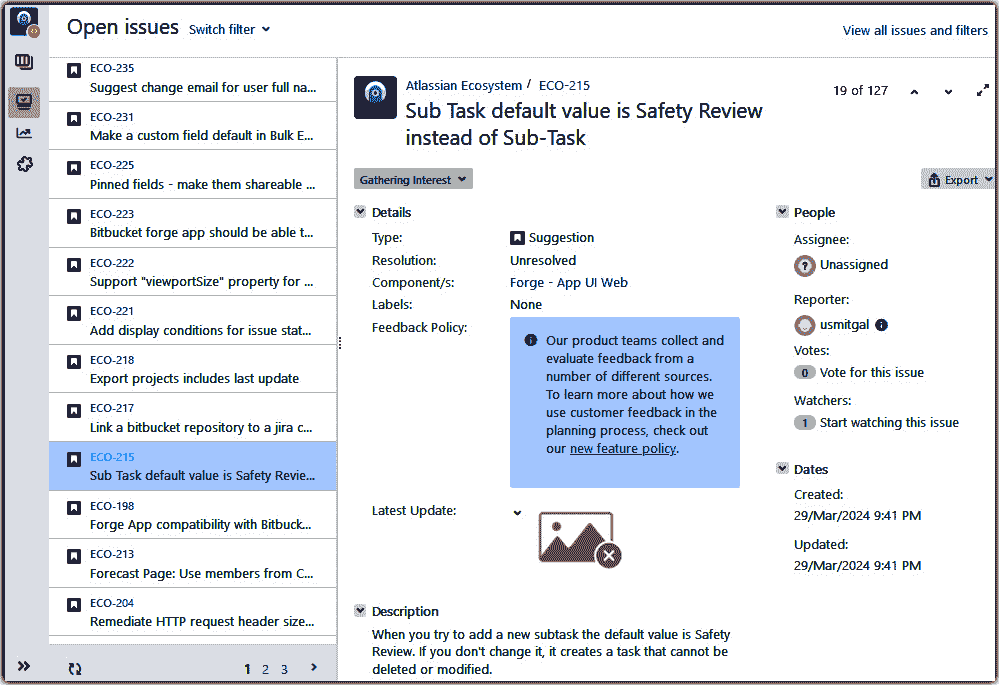
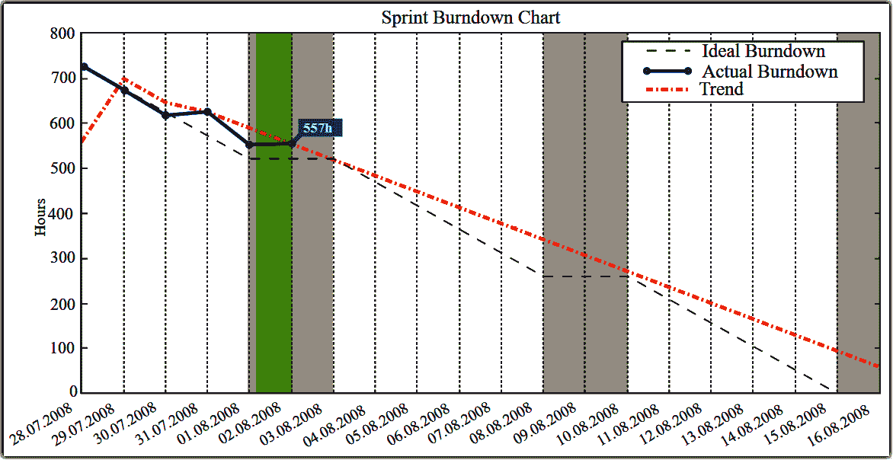
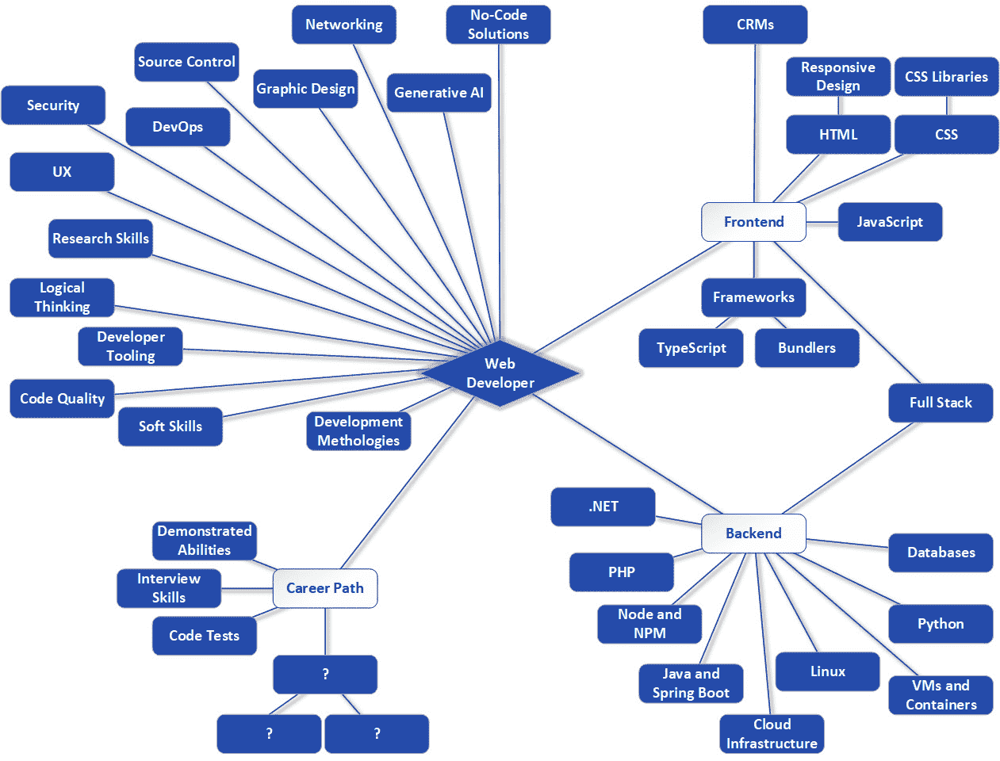

# 第十一章：复习软技能（它们让你难以否认）

我们已经花了很多时间讨论网络开发的各个方面，如何在这个领域找到工作，以及一些有助于你职业成长的发展话题。但还有另一组你需要意识到的事情，以便享受一段富有成效的职业生涯。这些就是我们所说的软技能。

什么是软技能？这些包括你的态度、如何有效地与他人沟通、与同事适当社交、持续增长你的技术知识以及软件开发方法。这些不是技术性质的东西，你通常不会在书籍或课堂上学习它们。你往往是从他人的例子中学习，有时是通过试错。我的目标是，希望尽可能多地从那个方程式中消除错误！

软技能不仅能帮助你获得工作并成为优秀的员工，而且对事业发展至关重要。即使是最优秀的技术人员，如果缺乏软技能，也可能会在职业发展的某个阶段停滞不前。随着你攀登职业阶梯，这些技能变得越来越重要，但它们始终很有价值，从第一级开始就是如此！

在本章中，我们将涵盖以下内容：

+   团队中无“我”

+   学习永无止境

+   超越烟雾信号，用良好的沟通技巧

+   探索敏捷软件开发方法

# 团队中无“我”

我可以把整个这一节简化成七个字：

*成为人们愿意* *与之共事的人*。

这听起来很简单，猜猜看？实际上*确实*很简单！当然，简单并不一定意味着容易。但让我们先来谈谈简单的那部分。

成为人们愿意与之共事的人意味着很多，但主要意味着成为一个友好且乐于助人的人，一个可以信赖的人，能够愉快地完成任务。然而，这并不意味着你必须是一个外向、好交际的人。不；你可以保持安静和内向，但仍然被视为一个友好的人可以与之互动。

在面试过程中，这一点很重要，因为那时你正在尝试推销自己。你将被评判的一个方面是，你是否看起来像知道如何与他人良好合作的人。这是面试的文化适应方面。我们几乎总是需要与他人合作，所以我们会希望享受这样做，或者至少不介意这样做。因此，你必须在面试中留下好印象。

尤其要注意，大部分时间要保持微笑，与人交谈时看着他们的眼睛，给予他们应得的关注，因为他们实际上是在评判你，并且通常与他们保持当下。你想要的是专注而不是分心，你应该以热情回答问题。

当然，这一切在你得到这份工作之后也同样适用！你必须记住，正如俗话所说，“团队中没有‘我’”，这意味着你需要确保你周围的人感到舒适。永远不要把工作带回家，因为这可能会影响你的家庭生活；同样，也不要把个人问题带到工作中。人们通常不喜欢有人把所有问题都推给他们。

被视为团队玩家的最好方式之一是，无论何时何地，你都能帮助他人。让我们稍微谈谈这一点。

## 在你能帮助的地方帮助

当然，做一个团队玩家不仅仅是做一个友好的面孔。始终是人们可以寻求帮助并愿意花时间协助的人。有时候很难记住，如果你帮助某人完成工作，那么你仍然为雇主提供了服务。当然，我们需要找到一个平衡点，因为我们都有自己的任务要完成，所以你必须小心不要给予自己太多。

起初，你可能没有太多可以提供给经验更丰富的人。但你会惊讶地发现，仅仅友好和可接近就能让人们来寻求帮助。这是有道理的：如果你知道角落里那个脾气暴躁的人可能知道答案，你可能会更愿意花更多时间与资历较浅的人一起解决问题，因为那个人并不容易相处。

但也要记住，即使你可能不知道得太多，这并不意味着你不能帮助。有时候，只是那第二双眼睛稍微改变一下你的视角，这就是你解决问题所需要的。即使如此，也要记住我们关于橡皮鸭调试和第十章中 Stack Overflow 的讨论？有时候，仅仅是在那里听某人解释问题，就是他们自己解决问题所需要的，所以你只是通过做一个好的倾听者就为他们提供了帮助！

当然，这不仅仅是关于倾听；有时候你也需要给予反馈。你如何做这一点也是成为一个优秀团队成员的一部分。

## 在批评时保持善良

最终，在你的职业生涯中，你将不得不对某人进行批评。更确切地说，你将需要批评他们的工作。当这一时刻到来时，你很可能已经有人批评过你的工作，如果你有，记住你的感受。那个人能否以建设性和友好的方式提出批评？希望如此，因为这就是目标。

很不幸，许多技术人员中存在一种常见的态度，认为直言不讳是首选的，如果有人感到冒犯，他们只需要变得更坚强。至少对我来说，我非常不同意这种观点。诚然，诚实至关重要。但诚实并不意味着刻薄，至少它不应该这样。

仔细选择你的用词。与其说“这个课程结构没有意义”，你可以说些像“啊，我明白了你在这里的意图，以及你为什么选择这样做，但我想知道，你有没有考虑过用 X 来做？”这样的话语表达了你对他们的工作的担忧，同时又不那么尖锐。当然，你应该很明显地知道，你永远不应该说出“这个课程结构很愚蠢”这样的话，但大多数人都能做到这一点。更微妙、更严厉的语言更难识别和避免，但保持当下，专注于你所说的话和方式，是达到这一目标的方法。

你有时可能会出错。如果发生了这种情况，不要犹豫，立即或稍后（如果你需要一些时间来意识到你的错误，这将是另一个话题）道歉。

## 承担责任

几乎没有什么能比我看到我的团队成员不承担他们的行为责任——尤其是他们的错误——更让我感到沮丧的了。在我看来，这根本不专业，甚至可能被视为不成熟的表现。没有人喜欢承认自己犯了错误，但这就是负责任、成熟的职业人士所做的事情。

当你不可避免地犯错——相信我，我们**所有人**都会犯错——你应该承担责任。站起来，说“是的，我犯了错误”，然后制定一个纠正错误的计划。这满足了人们依赖你的需求。依赖那些犯错并承担责任的人是容易的，但依赖那些推卸责任的人是不可能的。

在这里，你也需要走一条细线。显然，有时你会因为无法预见的情况或他人的行为而犯错，表达这些是合理的事情，但这也可能被视为试图逃避责任。我能给出的最好建议是，只要你在后面跟着说“是的，我犯了 X 错误，但这是因为 Y 和 Z 因素”，这就是可以接受的。这告诉人们，是的，也许你的表现并不完美，但存在外部因素。而且无论如何，**你**将承担起纠正情况的责任。这表明你不会把自己置于团队之上，并且可以信赖。

另一个让人们愿意与你一起工作的原因是，你不是等待事情发生，而是通过主动行动自己让事情发生。

## 主动

我的妻子，一位职业厨师，有一句话：“如果你有时间闲站着，那么你就有时间打扫。”这在厨房里很适用，因为保持干净的环境是一个大问题（实际上，对所有的人来说都是一个健康问题！），但稍作调整，它同样适用于网络开发环境！

在那个背景下，这意味着你可以选择成为那种坐着等待别人告诉你该做什么、该建造什么的人，或者你可以主动寻找机会，并积极投入其中。

也许你可以花些时间清理你的 CI/CD 配置文件。或者也许你可以编写一些关于你支持的应用程序配置参数的文档。或者你可能查看一些写得不太好的代码，并对其进行**重构**，这里的重构意味着重写它，使其更好（更干净、更简单、更健壮），而不改变其功能。你可能查看优化网站上使用的图片以提高加载速度，或者你可能实现一个管理功能，以便能够更好地记录发生的错误。

重点不在于你具体做什么，而仅仅是这样一个想法：你应该四处看看，看看有什么需要完成的事情，然后去做，或者至少，*提出*去做的意愿。不一定总是最好的主意就是独自去做一堆工作，但你当然可以举手说“嘿，看起来我们应该做 X，我现在有些空闲时间，我可以去做吗？”。为了安全起见，你可以从你的上级那里获得支持，但你很快会发现，大多数人对于这样的请求都非常开放（否则他们会将你引导到更高优先级的工作，这同样很好）。

大多数人都欣赏那些不简单地等待事情发生和被告知该做什么的人，因为这可以减轻他们的负担，无论是完成任务还是确定他们应该做什么。当然，你有时会有空闲时间，显然，在大多数情况下，会有某人指导你的工作。但，正如俗话所说，闲着的手是魔鬼的游乐场。所以，当有时间的时候，总是寻找方法来抵御那只长角的生物，让自己对团队有用和高效。这是赢得人们对你积极感情的一种可靠方式。

当然，如果没有最后一点考虑：诚实，那么几乎这一切都没有意义。

## 总是诚实，这是不变的真理。

之前我提到了批评，以及有些人给出批评时非常直率和直接。我谈到了这可能会损害团队凝聚力，因为它可能会让人感到不舒服。但残酷的本质中有一个好的原则：诚实。虽然过于直率可能会让你陷入不友善的境地，但诚实是一种在任何时候都应该被重视的品质。

当然，在任何情况下，你都不应该直接撒谎；这一点我希望是显而易见的！你可能认为你在用谎言保护自己，但你所做的实际上只是确保如果你被发现，你将永远不会被信任。你也没有给你的队友提供他们需要的信息来正确处理情况，这往往会产生滚雪球效应：随着时间的推移，问题会变得更糟。

还要记住，正如《星际迷航：下一代》中著名的船长让-吕克·皮卡德所说：“遗漏的谎言仍然是谎言。”有时你必须向高层传达坏消息，你可能不愿意这样做，因为你知道，不幸的是，有时传信者会受到惩罚，正如俗话（某种程度上！）所说。然而，作为一个负责任的团队成员意味着传达这些消息，以便决策者拥有他们做出决策所需的所有信息。但再次强调，学会减轻打击可能会非常有帮助。告诉经理项目有失败的风险可能是准确的，但可能不会受到欢迎。相反，你或许可以说，虽然有一些延误，项目面临的风险水平有所上升，但正在采取措施应对这一风险。只要这个声明是真实的，这可能听起来会更好一些。

但也可能存在一些情况，现实情况不允许你减轻打击。例如，你可能不得不告诉经理，项目无法按时完成，而且没有任何办法可以避免这种情况。这当然不是一件容易告诉负责人的事情，但作为团队的一员和承担责任的一个方面，正如俗话所说，“直言不讳”。你只需勇敢地站出来，传达消息，也许会因此受到责备。

即使如此，也要注意你表达消息的方式。如果你只是脱口而出“这个项目注定要失败！”即使这可能是真的，这可能对任何人都没有帮助。相反，你或许可以说些像“鉴于我们当前的时间表和资源水平，我看不出我们能够将这个项目成功完成的途径”这样的话。

## 在不过度社交的情况下保持社交

现代世界几乎是由社交媒体定义的。从 X（前身为 Twitter）到 Instagram、Facebook、TikTok 以及许多其他平台，如今人们比以往任何时候都更愿意分享自己的生活。这可以是一件美妙的事情：我们得以接触到不同的观点和其他的生活经历，当然，我们也很容易得到娱乐！

但社交媒体也可以帮助你寻找工作和职业发展。正如在第*第九章*中讨论的那样，LinkedIn 等网站在寻找工作和建立人脉方面可以提供极大的帮助。但无论是 LinkedIn、Snapchat 还是其他平台，你必须小心分享的内容，因为正如人们所说，互联网永远不会忘记。你发布的内容几乎可以被任何人找到，如果它不是令人满意的，可能会对你的职业前景以及职业发展产生负面影响。

这里没有明确的规则，因为很难确定什么可能对任何其他人构成问题。我认为最好的建议是简单地小心行事，在你发布任何内容之前，问问自己：这会让我看起来正面吗？这是我愿意向雇主解释的事情吗？明确来说，并不是所有公司都会查看你的社交媒体。但如今，你永远无法确定谁会查看，所以最好还是谨慎行事。

把这些放在一边，社交媒体也可以为你带来好处。例如，如果你经常与其他开发者互动，甚至有时与知名开发者互动，你就有机会学习和可能获得一个机会。与某人的积极互动可以在你寻找工作时为你提供帮助。关于特定技术的诚实、开放和富有成效的辩论可能会让你引起注意。

为了提供一些背景，很多很多年前，我被邀请写我的第一本书主要是因为我在社交媒体上的对话。一位出版商注意到了我展示自己的方式，对我进行了一些研究，发现了我的一些文章，认为我可能成为一名优秀的作家。这并不是我追求的，甚至我也没有真正考虑过，但你永远不会知道一次良好的社交互动可能会引导你走向一条意想不到的道路。

最后，记住除非明确授权，否则你在网上不代表你的雇主发言。在讨论中透露关于你的工作情况时要小心。例如，在网上就某个技术职位与他人辩论，甚至用一般性术语使用你的工作经验，是完全可以接受的，但通常在网上过度批评你的雇主并不是一个好主意。透露太多关于公司如何运作的具体信息不仅可能会受到批评，还可能变成法律问题。你的观点是你自己的，你有权表达它们，但当你将这些观点与你的工作生活结合时，你必须小心。一般来说，越少明确与你的雇主相关联的言论越好。如果你*必须*在公开讨论中涉及工作内容，尽可能将其概括，以便传达你的观点，同时不透露任何你的雇主可能不希望公开的信息。

核心原则是将社交媒体视为对你有益的事物，但同时也需要谨慎对待。就像大多数事情一样，努力在完全不参与和过度分享你整个生活之间找到平衡，可能是一个好的普遍准则。记住，你发布的内容可能随时被任何人看到，所以如果你没有正确使用社交媒体，你可能会发现你的团队关系意外地受到了负面影响。

与团队融合的另一部分涉及继续提升你的技术技能。特别是在这个快速变化的领域，你将别无选择，只能持续学习，所以现在让我们来讨论一下。

# 学习永无止境

在*第一章*中，我提到“学会学习”是这个领域的关键要求。然而，在大多数情况下，仅仅依靠实际工作时间是不够的。简单的事实是，软件开发，包括网页开发，变化的步伐如此之快，以至于如果你稍微离开一段时间，你很快就会落后。

在我开始的时候，网站是简单的东西。它只是普通的 HTML、CSS 和 JS。你可以很容易地查看任何网站的源代码，看看事情是如何完成的。没有真正的工具需要学习，你只需要打开记事本或你手头上的任何文本编辑器，然后开始修改。那是在 90 年代早期到中期。

不久之后，像 jQuery 这样的库出现了，然后你必须学习这些。框架开始出现，比如 Struts 和**JavaServer Faces**（**JSF**）。尽管这些是 Java 特定的，不是前端库，但它们在相对较小和非常大的程度上改变了你开发应用程序的方式。再次，跟上是一个挑战。

大概在 2010 年左右，我可以说，新的框架、工具包、库、开发者工具和编写前端和后端代码的所有新方法开始爆炸式增长。在某个时候，几乎不可能知道一切。

但你仍然需要尝试并做到这一点：知道一切！

## 专业化与泛化

自然，你永远不可能知道一切。如果你花时间学习 React，那么你可能对 Angular 不太了解（尽管它们在概念上有相当大的重叠，所以至少了解一个会让你在另一个方面有优势）。如果你专注于 Node 作为后端代码，那么你可能对 Java 不太了解。这始终是一个权衡，因为，与漫威电影宇宙中的奇异博士不同，你可能没有阿加摩托之眼来有效地给自己无限的学习时间！

一些开发者是专家。他们会专注于一个或两个关键技术或技术领域（前端与后端是一个常见的划分），并且对其他方面的了解不多。如果你发现自己对一组特定的技术感兴趣，这是完全可以接受的。只要它们有需求，你很可能能够找到有限范围内的有利可图的就业机会。

即使你选择了专业，仍然非常有帮助，甚至可以说是预期的，你将拥有一些超出你专业范围的知识。所以，虽然你可以专注于几件事，但你仍然需要花时间学习这些事情之外的东西，至少是为了为你的专业提供背景。这意味着你必须找出如何学习新事物。

然而，其他开发者——包括我自己——采取不同的策略，更喜欢成为通才。我们追求广度和深度的结合，对许多事物有合理的了解，但并不一定是任何领域的专家（在现实中，我们通常倾向于有几个“最爱”，我们对这些领域是专家，但随着我们使用它们的程度不同，我们擅长的技能可能会略有变化）。在就业方面，这通常是一条更好的道路，因为你不会根据你的技能集人为地限制你可以申请的工作。这不仅对就业通常更好，而且只要你是一个欣赏挑战并享受更广泛任务混合的人，这也通常会更有趣。

所以，无论你将自己视为通才还是专家，以下两点都是需要记住的：

+   尽可能多地学习尽可能多的知识，至少要了解尽可能多的主题的背景，但如果你想成为专家，可能需要专注于几个领域

+   找出你学习最好、最有效的方法

最后一点很重要，因为我们对学习的方式和效率并不相同。你必须找出你个人的学习风格。

## 确定你的学习风格

那么，哪种学习方法最适合你，效率最高？是简单地阅读技术新闻网站吗？或者可能是博客文章？自我导向的学习网站呢？你需要视频还是阅读就足够了？你需要动手经验，还是只需通过观察就能像海绵一样吸收知识？

对我来说，我发现阅读比我观看视频更有效，例如，然后立即实验我所学的知识。我认为这可能是因为我在阅读时更能控制节奏，但我不确定。原因并不重要，重要的是理解什么（通常）对我最好，但我必须随着时间的推移来找出这一点。

虽然没有简单的方法来确定你的学习风格，但我可以提供一些一般性的建议，这应该会有所帮助：

+   *尝试不同的方法*：这一点相当明显，但有时人们认为他们已经知道了自己的学习风格，从而错过了对他们来说更有效的方法。尝试各种学习格式。阅读书籍或文章，观看 YouTube 上的教程视频，参加研讨会或课程，或者简单地做实际的项目，然后注意你在每种方法中的感受以及你在之后保留知识的程度。

+   *自我反思*：尝试每种方法后，反思几个关键方面。首先，你是否在整个过程中都保持专注，还是你的思绪飘忽不定？显然，能够保持专注对于有效的学习是必要的。接下来是记忆。当你回想起你（据说）学到了什么时，你能回忆起多少？记得越多越好（尽管要记住，很少有人能记住每一个细节，所以在评估时要对自己宽容一些）。你是否能够通过，比如，用新知识编写一个小应用程序等方式，将知识实际应用到实践中？我们获得的信息往往在我们使用它之前不会在我们的脑海中巩固，所以这是一个关键问题。

+   *反馈分析*：如果可能的话，在学习任何给定方法的过程中，对你的进度进行反馈。例如，如果你是通过参加在线培训课程来学习的，看看是否有评估或测验来衡量你在学习过程中的理解程度。如果你真的在学习，那么你应该通常能够在这样的测验中做得很好。

+   *舒适与挑战*：确定你是否更喜欢在舒适或具有挑战性的环境中学习。有些人可能在更加轻松、自我调节、独立的环境中表现得更好。但其他人可能需要课堂的结构和互动，例如，通过课堂引导来完成工作。两者本身并没有本质上的优劣，关键是哪种最适合你。

+   *实践学习*：构建东西是网络开发领域的一个基本要求。除非你是一个真正非凡的学习者，否则不这样做将是必要的。当你学习和构建东西时，无论是工作中的真实项目还是个人项目，关注通过实践学习而不是仅仅消费信息，然后相应地调整你的时间。

+   *社区学习*：有些人可能更适应群体环境，而且通过这种方式学习效果更好，与他人之间的互动对他们的帮助很大。寻找你可以协作学习的地方，无论是教室、在线聊天室还是讨论论坛，看看这种互动是否能够提升你的学习效果。

+   *复杂度变化*：看看你的大脑在简单任务和主题与复杂任务和主题之间的表现如何。有些人可能通过阅读教程等方式学习更直接的主题效果更好，但对于更复杂的话题，他们需要亲身体验才能深入理解。

+   *一致性及适应性*：追踪你随时间对每种方法的坚持程度。你可能一开始用视频教程学得很好，但发现你的兴趣衰减得比阅读要快，因此你需要根据发现的情况进行调整。

+   *时间管理*：当然，如果你找不到学习的时间，那么这一切都没有太大意义，因此考虑每种学习风格如何融入你的日程安排是很值得的。任何形式的无间断学习几乎总是比不断被打断要好，因此确保你能抽出足够无间断的时间是至关重要的。

+   *反馈循环*：在选择了方法之后，定期回顾你的选择，不要假设曾经对你最有效的方法现在仍然有效。同时也要注意，学习风格可能会演变，今天有效的方法明天可能就不那么有效了。我之前提到，我最好是在能独自阅读的时候学习，但曾经有一段时间我认为在课堂环境中我表现得更好。

还要记住，拥有多种学习风格偏好而不是单一的最佳选择并不罕见。你当然可以混合各种风格，创建一个既能让你保持参与感又能有效学习的个性化学习策略。

我已经多次提到将知识以实用方式应用于实践，我想在此基础上进一步探讨个人项目这一概念。

## 构建个人项目

我总是强烈鼓励的一点，无论你想要成为专家还是通才，无论你偏好的学习风格如何，就是花一些个人时间专注于实验你的宠物项目。

无论你建造什么，只要你能建造出点什么。然而，当你选择一个项目时，一个明确的要求是，它必须是你感兴趣的东西。对我来说，编写一个计算汽车燃油压缩比的软件不会引起我的兴趣，因为我从未是汽车爱好者。但一个可以记录我的复古游戏收藏的项目，从开始到结束都会让我感兴趣！任何既能带来一点挑战又不会成为巨大时间陷阱的东西，因为毕竟，我们谈论的是你的个人时间，你应该始终将其视为宝贵。

除了选择你感兴趣的项目外，你还需要选择一个难度适中、既有挑战性又不会让你感到沮丧的项目。当然，这可能会有些棘手，尤其是在早期，你没有很多经验来判断某件事是否困难。

既然如此，我将建议一种我总是推荐，几乎将其视为一种神奇子弹类型的项目！

### 一种神奇的个人项目类型：游戏！

我几乎推荐给人们的另一种不同类型的项目是编写游戏。当大多数人可能不会成为专业游戏开发者时，这听起来可能有些奇怪。但原因是我自己编写了这么多游戏，我了解这样一个项目能带来什么。

编写游戏需要你涉及计算机科学中的许多主题，包括算法、网络（取决于游戏类型）、人工智能、数据结构、优化、调试等等。当你制作游戏时，无论涉及什么技术，你都会面临在构建任何其他软件、网站或网络应用时可能会遇到的大量相同类型的问题。

游戏也可以用任何技术编写，这使得它们非常适合进行实验。我曾用 BASIC、C/C++、Java、Pascal、PHP、HTML/CSS/JS、React 和 Vue 编写过游戏。甚至在高中时，我还用 COBOL 编写过一款游戏！

也许游戏项目最好的事情就是游戏本身就是，按照设计，是乐趣！因此，它们在构建时也应该是有趣的，对吧？结果证明它们确实是……或者至少可以是。就像任何项目一样，你必须平衡挑战，不要让自己发疯。

就像我的一位经理曾经说过，你不需要一开始就建造泰姬陵。这对游戏项目来说也是真的，或者对任何其他类型的游戏来说也是如此。如果你一开始就试图建造《魔兽世界》，你肯定会失败，因为那是一款高度复杂的游戏。但是，如果你首先只建造一个你只需四处走动的游戏，那么，这就是基础！你可以在那个基础上添加敌人来战斗，施放法术，以及你想象中的任何其他东西。

此外，为了学习而进行的游戏项目不需要原创，甚至不需要*优秀*！事实上，我经常建议人们简单地复制他们喜欢的游戏，最好是简单的，如果他们真的喜欢复杂的，那么至少将其简化到最基本的部分开始。你可以尝试制作一个模仿 Frogger 或 Pac-Man 的游戏，只用方块和圆形代替真实图形。即使看起来不好，它仍然可以是一个完全功能性的游戏，你可以通过构建它来学习（当然，如果你在练习你的图形设计技能，那么也许你会在图形上花些时间）。

然而，当你制作游戏时，考虑你正在实施的概念以及它们如何与你日常的工作相关。如果你知道你需要学习 React 来工作，那么就用 React 来构建游戏。如果你知道你需要使用 Redux 与 React 进行状态管理，那么即使在游戏中它可能不是你的首选，也要这样做。从某种意义上说，让游戏成为构建游戏的游戏！使用你将在工作中需要的工具、技术和技巧来构建游戏。

即使没有人看到你的游戏，那也完全没问题。它完全可以只为你自己。而且你可能甚至永远不会自己玩它。但再次强调，如果你从经验中学习，它最终不需要很好或很有趣，我保证你将从这些类型的项目中学习，有时甚至没有意识到。

但也许你*会*想向某人展示。毕竟，你可能会正确地为自己的工作以及从中学到的东西感到自豪，并想炫耀一下。与他人的互动是沟通的领域，这也是我们在本章中关注的另一种软技能，所以让我们接下来谈谈这一点。

# 超越烟雾信号，用良好的沟通技巧

作为团队的一员工作自然意味着能够有效地沟通，无论是书面形式还是面对面，无论是设计会议、演示还是任何其他我们需要向他人表达想法的情况。当做得好的时候，它会在团队中培养凝聚力，这转化为更好的表现。

良好沟通技巧的一些方面相对明显。例如，保持语气专业是大多数人天生就理解的事情。在专业环境中讲笑话是可以接受的，但引用像艾迪·墨菲、安德鲁“骰子”克莱、戴夫·查佩尔、理查德·普赖尔和里基·杰尔维斯这样的材料可能不太合适（即使你觉得很有趣）。

然而，其他方面可能稍微难以把握。以下是一些需要记住的关键点：

+   *清晰和简洁*：在这里我要坦白：在办公室里，我以“长邮件”著称。我喜欢给出全面、完整的解释，尽量减少对谈话对象所知内容的假设。作为一个一般概念，这并不是一个坏的方法。然而，简洁也是一种不错的方法。无论是书面还是其他形式的沟通，都应该尽可能清晰和简洁。人们的时间很宝贵，所以你希望快速切入要点。然而，你必须小心不要走得太远，否则你可能会遗漏人们需要的信息。这是我仍在努力提高的技能！

+   *积极倾听*：当直接与某人交谈时，与他们以及他们所说的话互动，不要立即得出结论或做出回应。这并不总是容易，因为人类是情感动物，而那些情感往往会影响我们的思考大脑。但是，这样做会显示出你对谈话对象的尊重，以及通常会导致双方对讨论的问题或想法有更深入的理解。

+   *同理心和理解*：在与他人互动的任何形式中，始终都要练习同理心和理解！这其中的一个重要部分是尊重他人的观点。特别是在今天多元化的工作场所，你必须不断地试图了解他人的立场，并在讨论和解决问题的过程中努力找到共同点。这其中的另一个重要部分是当人们提出“愚蠢”的问题时。俗话说，唯一愚蠢的问题是那个你没有问的问题，我完全同意这个观点。永远不要因为觉得自己可能问了一个愚蠢的问题而感到羞愧，相反，当别人向你提出这样的问题时，要友好地对待他们。尽你所能帮助他们，不要评判，即使是对自己也是如此！

+   *一致性和开放性沟通*：定期的沟通往往更好，因为它促进了人与人之间的关系。毕竟，沟通就像其他任何技能一样，需要练习才能随着时间的推移而提高。它还有助于避免误解，或者更确切地说，当风险不是很高且可以更容易地纠正时，它允许误解发生。

+   *书面沟通技巧*：具体到书面沟通方法，如电子邮件、报告和文档，由于它们的性质，你有时间把它们做好，所以利用好这个机会！多次阅读和重读你所写的内容。使用你所能获得的任何校对工具，并努力使其尽可能直接和富有信息量。正如小说家常说的，不要害怕“杀死你的宠儿”。这意味着，在你重读时，不要害怕删除那些没有带来价值的词语。仅仅因为花时间写了它们，并不意味着它们最终必须存在！

+   *非言语沟通*：始终记住，并非所有的沟通都是直接的。注意自己的肢体语言和语调，以及他人的肢体语言和语调，可以产生强大的洞察力。这些往往能传达比言语更多的信息，并在理解对话的完整背景中至关重要。例如，如果你在描述你解决编码问题的方法，而与你交谈的人将双臂交叉抱在胸前，这可能表明他们对你所说的话不感兴趣。然而，肢体语言并不是一门精确的科学，所以你不能将这样的信号视为绝对的，但根据这个线索，你可能会决定稍微改变你的方法。关于肢体语言，有整本书可以提供大量有用的信息。你可以考虑的一本好书是芭芭拉·派斯和艾伦·派斯合著的《身体语言 definitive 书》。

+   *反馈（给予和接收）*：建设性的反馈对于成长和改进至关重要，这双向都适用。愿意接受反馈显然有助于你自我改进，并以建设性和非个人化的方式给予反馈是关键沟通技能。始终记住要批评观点而不是人。例如，“我不确定这种方法会产生积极的结果”比“我不确定你在这里选择了正确的方法”要好一些，因为前者强调了方法，而后者强调了有人犯错的观念。

+   *冲突解决*：无论你多么努力，你当然有时会遇到与人的分歧，以及那些不太容易相处的人。以冷静的态度和关注解决方案而不是责备来处理这些人，可以维持积极的工作环境。走正道是一项需要练习的技能，因为，再次强调，我们是情感动物，我们的第一反应往往是情绪化地反应。你必须练习对抗这种反应，即使对方没有回应，也要保持理智和礼貌。

+   *文化敏感性*：在全球化工作环境中——这在 IT 领域尤为常见——对沟通风格中的文化差异有所了解和敏感至关重要。有趣的是，我在写这本书的时候遇到了这个问题。尽管我是美国人，但 Packt 不是一家美国公司，所以有几回，我以一种对美国以外的人来说不太清楚的方式说话，或者使用了无法完全翻译的流行文化引用。你必须始终检查自己，因为虽然不被理解是一回事，但你很容易冒犯那些可能有不同生活观和价值观的人，这是一个更大的问题。

+   *正确利用沟通渠道和技术*：有效地使用沟通工具，无论是电子邮件、消息应用还是传统的电话。始终选择适合你需求的技术。如果你有一个不需要立即回答的问题，那么使用电子邮件。如果你需要立即回答但不是特别关键，那么使用像 Microsoft Teams 或 Discord 这样的消息应用可能更受欢迎。我认为现在很多人更喜欢除了大量打电话之外的其他技术，所以将其保留在更关键的情况下（除非，当然，你知道你正在给某人打电话，这个人只是喜欢一点对话，在这种情况下，与这个人建立联系可能是有利的）。

+   *量身定制信息*：始终牢记你的受众！你与技术人员的沟通方式往往与与高级领导沟通的方式不同。首先，他们的关注点不同。高级领导可能只需要了解问题的概要以及未纠正的后果，而技术人员则需要更多细节来提出解决方案。当然，如果你在给与你有更广泛个人关系的人写信，那么你可能比其他人稍微不那么正式（但仍然在公司时间内保持专业界限）。

+   *持续改进*：始终寻找提高你沟通技巧的方法。利用雇主可能提供的任何培训机会，或者只是寻找 YouTube 上的专家视频，以获取你可以实施的特定建议。没有人是完美的——包括我，正如我之前提到的——但我们所有人唯一不变的是需要不断地评估和改进自己。

最后我想提到的一点是，这是一个相对普遍的想法，我已经稍微提到过，但可能需要更多的关注，那就是思想市场。

## 在思想市场中购物

**思想市场**是一个隐喻，描述了关于思想进行开放、公共讨论的需求。目标是确定不同思想、意识形态和观点的真实性和价值。我们不是在谈论法律法庭意义上的真实；相反，这是指人们经常会持有相互冲突的观点，我们的任务是公开、诚实地审查它们，摒弃被认为没有价值的思想，保留被认为具有高价值的思想，或者，正如经常发生的那样，在飞行中将思想融合成新的东西。

思想市场的理念要求人们能够毫无恐惧地表达自己，而且表达的思想将不受不适当的限制地进行辩论和挑战。最终，那些群体认为最“真实”的思想——其中“真实”被定义为大多数群体都认同的思想——将被视为最有益的，并将战胜其他思想，这是一种非常自然且富有成效的方式来完成技术和非技术任务。

为了举一个相对具体的例子，假设你正在启动一个新项目，你正在尝试确定使用哪个前端框架。你可能支持 React，而另一个人可能支持 Angular。你会阐述你的立场并解释为什么你认为 React 是最好的选择。也许你会提出一些论点，比如它的用户基础比 Angular 大，有更多开发者资源支持它，以及它的相对简单性将使项目开发更快。Angular 的支持者可能会就这些论点进行辩论，无论是绝对意义上还是与 Angular 本身相比较。

在某种意义上，思想市场的辩论可能包括你们两个都去创建一个原型来展示你偏好的方法。我以前就遇到过这种情况，当时我支持一种使用当时一些新技术的方法，包括 AJAX 和基于服务的架构。这些想法当时还不常见，但我看到了它们的实用性。然而，当时的另一位架构师更喜欢一个叫做 Flex 的工具，这是 Adobe 的一个现在已经停止生产的产品。

我们编写了一份文档来描述我们的方法和背后的理由。然后我们花了几天时间使用我们选择的技术构建了一个演示应用程序。最终，我们所有人都聚在一起——我自己、另一位架构师、一些其他开发人员和我们的经理——我们展示了我们的成果。那天房间里有些争论，但最终，不说自吹自擂，我的方法胜出，从那时起，它就成了我们公司以及外部开发应用程序的标准方式（而 Flex 则走向了灭绝！）。

这种情况展示了思想市场是如何运作的。我和另一位架构师从未激烈争论，我们从未互相攻击。我们当然会指出对方方法的缺陷以及我们自己的方法如何优于对方，但这就是它应该工作的方式。每个人都得到了表达自己想法和捍卫自己观点的机会，但最终，市场决定了哪个更有价值。

没有任何东西可以在没有相互尊重、承认自己的观点不是唯一，以及愿意说它们可能甚至不是最好的情况下工作。这里没有需要学习的特殊技能，只是拥有一定程度的智力成熟度。没有人通常喜欢犯错或发现自己的观点不如他人，但这就是世界运作的方式，你必须接受它。我能给出的最好建议是尽量保持情绪不参与其中。还有，尽量不要对你的想法产生情感依恋。只要每个人都站在同一起跑线上，以相同的方式处理事情，那么，如前所述，你将会“攻击”事物而不是人，这通常允许大多数人控制自己的情绪。

我想在软技能领域讨论的最后一个话题可能有些牵强，但说实话，我认为它与之前的话题紧密相连，尤其是从沟通技巧开始。这个话题是开发方法，但主要是被称为敏捷（Agile）的东西。

# 探索敏捷软件开发方法

当我们开发任何类型的软件，包括网站时，我们使用所谓的**方法**。这是一个华丽的说法，意思是说，我们有一个定义好的方法来完成我们的工作（因为另一种选择就是随意地开始编写代码，这很少会有好结果）。今天，最受欢迎的开发方法是被称为敏捷的方法。

但在我们可以谈论敏捷之前，你必须对之前的情况有所了解——让人们意识到敏捷可能是一个更好的方法的东西——那就是另一个被称为**瀑布（Waterfall）**的方法。

## 在桶中翻过瀑布：瀑布方法

在瀑布方法中，在开始构建任何东西之前，你会花费大量时间进行设计。这涉及到花费大量时间与客户交谈，了解他们的需求，并批判性地编写描述将要构建的内容及其构建方式的文档。实际上，文档是区分瀑布模型和敏捷方法的主要因素之一。

在瀑布模型中，你会创建以下类型的文档：

+   **业务需求文档**（**BRD**）：这是一份概述项目高层次业务目标的文档。这种类型的文档以非技术术语编写，因为它关注的是从业务角度构建的事物应该做什么，其范围是什么，预期的利益是什么。

+   **功能需求文档**（**FRD**），有时也称为**系统需求规范**（**SRS**）：这类文档详细描述了软件将做什么，通常包括用户故事和用例。

+   **技术需求文档**（**TRD**），有时也称为**软件设计文档**（**SDD**）：这是一份包含指定技术方向的文档，例如整体架构、技术栈、数据库设计、要构建的模块、要提供的服务接口等等。这是最终开发者将基于其编写代码的文档。

+   还有其他类型的文档，没有特定的名称（或者至少没有缩写），包括用户手册，用于描述如何使用产品；系统管理手册，解释系统管理员应该如何完成任务；项目计划，描述项目完成所需完成的主要里程碑和任务，包括估计、日期和每个任务的负责人；以及风险管理计划，概述潜在的风险和应对策略。

这些文档，以及可能的其他文档，是瀑布模型的输出，最重要的是，它们是在前期完成的。在所有文档都编写、审查、修订并获得批准之前，不会开始任何开发工作。如果这需要一年的时间，那么在这一年里，除了可能的一些原型和设计样本之外，不会编写任何代码。

初看之下，这似乎是合理的，不是吗？人们在开始构建之前需要知道他们要构建什么，对吧？而且，每个人都应该对最终目标和实现这一目标的步骤有一个清晰的了解，这是不是很有道理？

但问题有两个方面。首先，编写所有这些文档所需的时间在某种意义上是“浪费”的，因为开发通常要等到文档完成才开始。显然，这意味着在过程后期，没有人能看到任何东西，甚至长时间内看不到一个部分构建的系统。其次——这可能是更大的问题——无论你的文档过程有多好，人们往往不知道他们需要什么！或者，随着产品的开发，他们有时会意识到他们最初没有正确指定的事情，因为他们看到了产品的一部分完成。

不幸的是，在瀑布模型中，通常使用产品的人直到产品完成（或者至少大部分完成）之前什么也看不到，这时进行更改，尤其是那些代表对整个产品支撑核心内容进行核心更改的情况，成本非常高，有时甚至不可能。如果需要花费一年来编写所有文档，然后再花费一年来构建它，那么直到接近两年后，没有人会看到文档是否与实际情况相符，这时可能已经无法进行更改，所以现在你花费了所有的时间、金钱和努力，最终得到的东西可能因为各种原因而无法满足需求。

由于这些原因，瀑布模型在很大程度上已经不再受欢迎。它并没有完全消失，一些公司仍然在使用它，并且在某些情况下，如果前期设计更容易进行，它可能是有益的，因为它允许你更好地估计项目的时间表，使事情更加可预测。然而，对于大多数项目来说，它已经让位于敏捷方法论，所以现在让我们来谈谈敏捷。

## 在你的开发项目中实践敏捷

与瀑布模型是按顺序进行的过程（先文档化然后开发）不同，**敏捷**方法论是迭代的、增量的，并且通常是并行的。敏捷方法不倾向于一开始就设计好所有内容并花费大量时间编写文档，而是倾向于构建项目的小部分，然后根据需要迭代更新，使其逐渐接近最终所需的状态。然后，项目的下一小部分可以开始（或者根据资源可用性，可能同时开发两个小部分，但无论如何都是一个迭代和增量的过程）。

### 敏捷的目标

敏捷的概念始于 2001 年的敏捷宣言，由一群软件开发者制定。这份文件描述了敏捷软件开发的关键原则。

敏捷宣言中描述了四个核心价值观：

+   **优先考虑个人和交互而非流程和工具**：而不是严格遵循特定的工具，强调的是人的技能、团队合作和沟通。这种价值观强调了协作和基于团队的方法的重要性——你知道的，软技能！

+   **优先考虑工作软件而非全面的文档**：这一价值观将重点放在交付功能软件上，而不是花费大量时间详细记录每个细节，尤其是在瀑布模型中，通常在前期就完成。这并不意味着文档是不必要的。相反，这意味着生产工作软件是优先级更高的任务，是衡量进度更好的标准。

+   **优先考虑客户协作而非合同谈判**：在整个开发过程中让客户作为积极参与者是这一价值观的核心。它强调了客户反馈和适应他们不断变化的需求（或理解）的重要性，而不是仅仅依赖于最初的合同条款。

+   **优先响应变化而非遵循稳固的计划**：这一价值观解释了我们应该如何在整个开发过程中拥抱变化，而不是僵化地坚持预先定义的计划。这意味着要灵活和适应性强，以确保最终产品满足客户和市场的不断变化的需求。

除了核心价值观之外，敏捷宣言还描述了十二条原则，这些原则详细阐述了核心价值观：

+   **客户满意度**：看到持续交付即使是小功能片段的客户往往更满意。

+   **欢迎变化的需求**：敏捷方法将变化的需求视为一种优势，而不是问题，这使客户能够更快地适应市场，以获得竞争优势。

+   **频繁交付工作软件**：你越频繁地交付功能片段，对客户就越有利，即使整个产品尚未完成，他们也可以使用这些功能片段。

+   **利益相关者和开发者之间的紧密、日常合作**：这有助于做出更好的决策，并确保不断变化的目标保持一致。

+   **围绕有动力的个人构建项目**：当你为团队提供他们所需的环境和支持，并信任他们完成任务时，他们往往表现得更好，并且能够获得更多的个人满足感。

+   **传达信息的最高效和最有效的方法**：面对面的交流往往是最有效的，但在现代虚拟化的世界中，只要团队拥有良好的沟通技巧，他们也可以有效地远程工作。

+   **将正在工作的软件作为衡量进度的首要标准**：这一点不言自明，并且已经被讨论过了。毕竟，你可以把其他所有事情都做得很好，但如果交付的产品实际上无法工作，那么这几乎无关紧要，对吧？

+   **敏捷过程促进可持续开发**：当正确使用敏捷方法时，利益相关者、开发者和用户应该能够无限期地保持恒定的速度。

+   **持续关注技术卓越和良好设计**：这有助于通过在整个过程中建立坚实的基础来增强敏捷性。

+   **简单性**：最大化未完成工作的艺术是至关重要的！毕竟，未开发的代码是没有错误的，所以不过度设计是一个关键的技术目标，而不仅仅是做敏捷开发时如此。

+   **最佳架构、需求和设计**：自我组织的团队往往能产生更好的成果。

+   **团队定期反思其表现**：团队应定期审视他们所做的工作、如何完成这些工作以及事情是如何进展的，并根据需要调整流程以支持持续的过程改进。

这些价值观和原则，以及敏捷方法，对软件（包括网站）的创建方式产生了深远的影响。它们增强了团队动态，并让利益相关者在整个迭代过程中参与到过程中。

我提到的那次迭代支持敏捷的主要目标之一，即适应变化。这是通过开发小型单元和更大项目的一部分，并且关键的是尽可能快地将它们展示给人们来实现的。这样，如果设计不正确，无论是由于业务所有者不知道他们确切需要什么，开发者误解了需求，还是其他任何原因，只损失了两周的努力（而且在大多数情况下，并不是完全损失）。你可以迭代地重新设计屏幕，直到它满足需求，同时适应任何需求的变化。

这只有在人们之间有持续的合作时才能奏效，这也是为什么我把这种关于开发方法（主要是敏捷方法）的讨论称为“软技能”。我承认我在这里稍微拉伸了定义，但我认为我可以这样做，因为如果你不与人携手合作，敏捷方法就无法发挥作用！如果你不持续沟通，不进行思想上的来回交流，那么敏捷方法就会瓦解，而做这些事情在我的书中无疑是软技能。

同样地，在开发过程中的客户反馈是使这一过程得以顺利进行的关键组成部分。在敏捷开发中，这是通过称为**冲刺**的迭代来实现的。我将在下一节中详细介绍冲刺，但简而言之，它们是一段时间——比如说两周——在这个时间段内完成一小部分工作。也许在某个特定的冲刺中，你会实现最终需要的五十个功能中的一个或两个，例如。目标是确保在每个冲刺结束时都有可以部署并且理想情况下可以实际使用的成果，这样客户就可以立即从你所构建的内容中获得好处，即使不是整个项目的全部好处。他们可以亲身体验并看到所开发的内容可能并不是他们真正需要的，这可以反馈到过程中并影响你在下一个冲刺中的工作。请注意，在每次冲刺后部署绝对不是敏捷的必要要求，但目标是每个冲刺结束时都可以进行部署。

敏捷开发的另一个好处是，由于必要性，测试在整个过程中进行。当构建一个屏幕时，可以在构建另一个屏幕的同时对其进行测试。与瀑布模型不同，在瀑布模型中，测试几乎是在结束时才完成的，在敏捷开发中，你也不需要像在瀑布模型中那样等到最后才能发现错误。

敏捷开发也将重点——以及很大程度上，控制权——转移到了开发团队。通常情况下，会有一个**待办事项列表**；也就是说，一个需要完成的任务列表。这个待办事项列表可以通过利益相关者进行**整理**，这意味着它可以按照优先级顺序排列（通常，待办事项列表顶部的条目被认为是最重要的）。最终，开发团队决定在每个冲刺中完成什么，在**冲刺计划**会议期间从待办事项列表中提取条目。在那里，他们估算每个条目的工作量，然后决定他们认为在下个冲刺中可以完成多少条目。有时并非所有条目都能完成，有时会有额外的时间，这时可以即时将待办事项列表中的下一个条目添加到冲刺中。有时，由于各种原因，可能会忽略待办事项列表的顺序（例如，如果有一个团队知道在待办事项列表的较后部分容易完成的条目，但他们想将其拉入冲刺以填补一些空白）。

还要注意，在这所有过程中，文档被弱化。当然，在大多数情况下，仍然存在文档，但它是在代码的基础上即时构建的，很大程度上与代码结合。它通常存在于构建每个部分所使用的票据中，而不是作为独立的工件，尽管这取决于特定组织如何实施敏捷。这里有一个常见的线索：敏捷的实施方式不止一种，没有真正标准的“正确”方式。团队会调整其某些方面以满足他们的需求。在我的项目中，我们倾向于选择四周的冲刺，例如。有些团队不做冲刺回顾会议（在冲刺结束后，你向利益相关者展示你的工作，讨论冲刺中做得好和不好的地方以及如何改进下一个冲刺）而有些团队则严格遵守。这一切都是通用的。

所有这些因素加在一起，使得敏捷比瀑布方法更不可预测。你通常不知道开始时需要多少个冲刺，也不会对你正在构建的内容有一个清晰的了解，除非是一些基本内容。如果听起来像是混乱，那它确实如此！但这是可控的混乱，这种混乱允许更早地将工作代码展示给人们，这可能是敏捷的主要好处。

敏捷方法的实施方式可能因组织而异，但大多数实施方式都倾向于共享一些关键概念，从冲刺开始。

### 理解敏捷的核心概念

如前所述，敏捷使用冲刺的概念，这是小的时间单位——通常是两周——在这里进行开发。通常发生的情况是，人们设计应用程序的一小部分，可能是许多屏幕中的一个。随着设计师和/或分析师仅就冲刺中技术人员需要实施的具体任务编写足够的文档，这产生了一定程度的文档，但远少于瀑布方法中典型的文档。

通常，在冲刺期间，每天都会有一个**每日站立会议**。在某些情况下，这非常直接——目的是使这次会议非常简短和直接，人们倾向于在站立时这样做。在会议期间，每个人都会快速讨论他们昨天做了什么，今天计划做什么，以及他们是否有任何阻碍或问题阻碍了他们的进展（站立会议的领导者，即**Scrum Master**，会尝试通过将他们与解决该问题的正确人员联系起来来帮助他们解决问题）。

敏捷与 Scrum 的比较

我在这里省略了一个应该解释的术语。Scrum 是一种特定的敏捷开发形式，并且可能是最普遍的形式，以至于人们倾向于互换使用这两个术语。主要区别在于，虽然敏捷是一套关于软件开发的一般哲学和方法，但 Scrum 将敏捷细化成特定的角色（如 Scrum 大师）、特定的仪式（如每日站立会议）和特定的工件，例如冲刺待办事项，我将在稍后讨论。尽管如此，有时也会使用其他敏捷形式，包括极限编程和精益软件开发。因此，请记住，敏捷并不等同于 Scrum，但也要记住，在大多数情况下，由于它的普及，敏捷和 Scrum 在礼貌的对话中可以互换使用。

但人们如何知道他们应该做什么工作呢？为此，通常会使用像 Jira（[`www.atlassian.com/software/jira`](https://www.atlassian.com/software/jira)）这样的跟踪系统（参见*图 11.1*）。对于该屏幕，将开启一个工单并包含设计细节。然后，冲刺开始，开发者“领取”该工单进行处理。在接下来的两周内，他们开发该工单，通常与设计师（有时是业务分析师）来回沟通。但最终，在两周冲刺结束时，目标是屏幕——仅此屏幕——应该处于可部署状态。理想情况下，它应该完全完成且正确无误，但这基本上是目标：部署它并找出问题！

图 11.1：Jira 工单系统

如果进行更改，通常会开启一个新的工单，并在下一个冲刺中进行处理。同时，下一个屏幕可能由另一位开发者以相同的方式进行处理。

随着工作的完成，通常会生成一个**燃尽图**，其示例可以在*图 11.2*中看到。X 轴表示时间，通常标记为天数或冲刺，如果需要查看整体进度视图。Y 轴表示剩余的工作量，最常见的是工单或**故事点**，它们是对工单相对难度和耗时程度的估计（估计为 10 个故事点的工单，一般来说，应该被认为比估计为 5 个故事点的工单难度和时间消耗高出一倍）。

图 11.2：燃尽图示例

此图表通常还会包含一个理想的燃尽线，它从 Y 轴的顶部开始，到冲刺或项目的结束日期结束为零。最后，通常还会有一条实际的燃尽线，它显示了实际完成的工作进度，从完成的总工作量开始，随着项目的完成而向下倾斜。这两条线可以帮助您看到在冲刺期间您计划要做的事情和实际完成的事情之间的关系。

尽管如此，你通常会发现这两种方法，**瀑布**和**敏捷**，可以在一定程度上结合，从而实现两者的最佳效果。

## 混合**瀑布**和**敏捷**

当你结合**瀑布**和**敏捷**方法时，目标是强调每种方法的优点，同时减轻另一种方法的缺点。由于两种方法都有其优点和缺点，目标是尽可能多地获得优点，尽可能少地获得缺点，这可能导致一种比单独使用任何一种方法都更好的方法。

在混合方法中，有一些前期设计和文档工作——比单纯的敏捷方法要多，但一旦开始编码，它就采取了一种更敏捷和迭代的做法，即你以冲刺为单位工作；你可能在每个冲刺后发布，并且可能比单纯的瀑布方法更能适应变化。

通常，在混合方法中，有一些里程碑是单纯的敏捷方法中不会出现的。例如，你可能会一开始就声明目标是在六个两周冲刺后发布。这个里程碑是一个具体的团队目标，而不是他们只是迭代直到感觉软件可以完全发布，或者在每个冲刺后发布。

虽然**敏捷**方法倾向于最小化文档，而**瀑布**方法则强调文档，但混合方法寻求找到一个平衡点。这意味着你可能会看到一些文档，例如 BRD（业务需求文档），但可能没有 TRD（技术需求文档）。被认为最关键的文档可能像瀑布方法一样在前期详细构建，但其他所有内容都可以最小化构建并保留在工单中。

客户参与是另一个不同点。与瀑布方法中在开发接近尾声时才向客户展示你已构建的内容不同，也不像敏捷方法中那样让他们看到每个构建的部分，你可能会只在预定义的检查点展示你已构建的内容。例如，如果你要构建一百个屏幕，你可能将它们分组为离散的功能块，每个组可能有十几个屏幕，并使用每个组作为检查点来展示你已构建的内容。

混合方法还可以更好地管理风险。任何开发项目都涉及某种形式的风险，无论是时间损失还是金钱损失，如果最终产品不符合客户需求。这种风险在**敏捷**方法中通常更大，因为与瀑布方法不同，在项目开始时并没有那么多的精力用于正确地详细说明一切。但是，在开始敏捷项目之前进行一些前期工作可以帮助降低一些风险，因为你在那个阶段更有可能捕捉到基本问题，这些问题在后期往往更难解决且成本更高。同样，敏捷对变化响应能力更强，这意味着在中间阶段发现的问题不会像瀑布方法那样对整个项目构成风险。

使用混合方法仍然需要一流的沟通技巧（看，那些软技能又出现了！）并允许团队进行定制。事实上，因为它结合了两种方法，所以根据团队的需求和愿望定制方法可能更加重要，这里的团队指的是开发团队加上利益相关者。这种定制的一部分也是确保方法与组织的文化相一致。一些公司本质上是更加灵活的，而另一些则更加僵化，所以你有必要调整你的混合方法以符合整体的企业心态。

最后，无论你使用瀑布模型、敏捷方法还是混合方法，沟通和与人们紧密合作是关键！在敏捷或混合方法中，这些软技能将得到大量的锻炼（在瀑布模型中较少，但确实仍然很多），所以在开始项目之前理解这一点很重要。

# 检查路线图

现在几乎要结束了；在这之后，只需再有一章！在*图 11*.3 中，你可以看到更新的网络开发者路线图：

图 11.3：填入更多方框的路线图

好吧，这次只有一个方框——**开发方法**——但这意味着你知道下一章将要展开什么，因为只剩下三个方框未打开（尽管它们是什么的神秘性令人兴奋，不是吗？）。所以，现在不要减速，只需再有一章就结束了！

# 摘要

在本章中，我们讨论了所谓的“软技能”——这些技能本质上是非技术性的，但与技术技能一样重要。这包括如何成为一个好的团队成员，在保持开放和诚实的同时对他人友好，即使在提出批评时也是如此。我们讨论了社交可以是一种优势，但你必须谨慎并设定界限，尤其是在社交媒体方面。

我们还讨论了成为一名优秀的网络开发者的一部分是持续学习，但并非每个人都能以相同的方式学习，所以你必须进行自我反思以确定你的首选学习风格。我们讨论了将你的学习应用于个人项目，如果不是必须的，那么至少是一个好主意，特别是游戏尤其是一种很好的——尽管出乎意料——项目类型，可以用来实现这一点。

然后，我们探讨了如何建立有效的沟通技巧；例如，如何简洁但诚实地撰写电子邮件，直接的口头交流有很多层次，包括肢体语言，以及关于思想市场以及如何尊重地成功导航它的内容。

最后，我们探讨了开发方法，特别关注敏捷方法。你看到了敏捷方法如何涉及大量的软技能（尤其是沟通技能），为什么它比瀑布模型更有益，以及为什么混合方法通常被认为是最佳选择。

在下一章——也是最后一章中，我们将在某种程度上扩展持续学习的主题，因为我知道在这个工作领域，这一点尤为重要。希望我能给你提供更多关于如何确保你的技能永不陈旧，并且始终保持最新和最重要的是，具有市场价值的指导。
