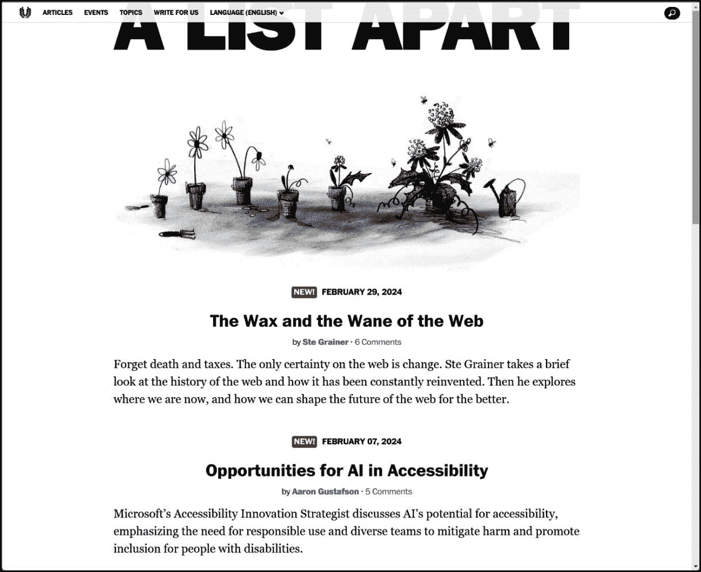
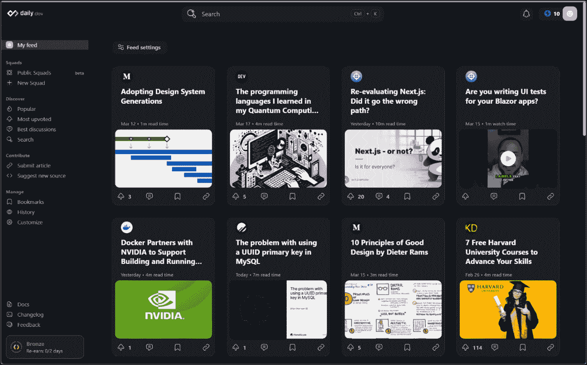
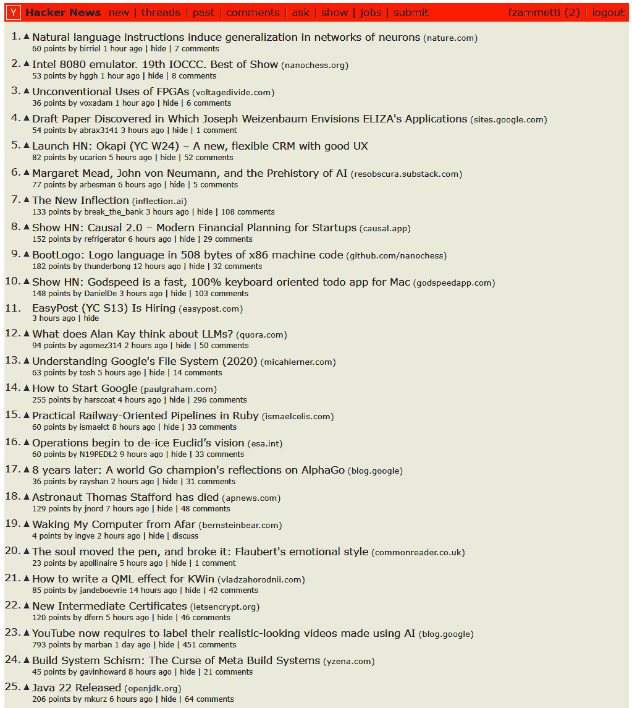
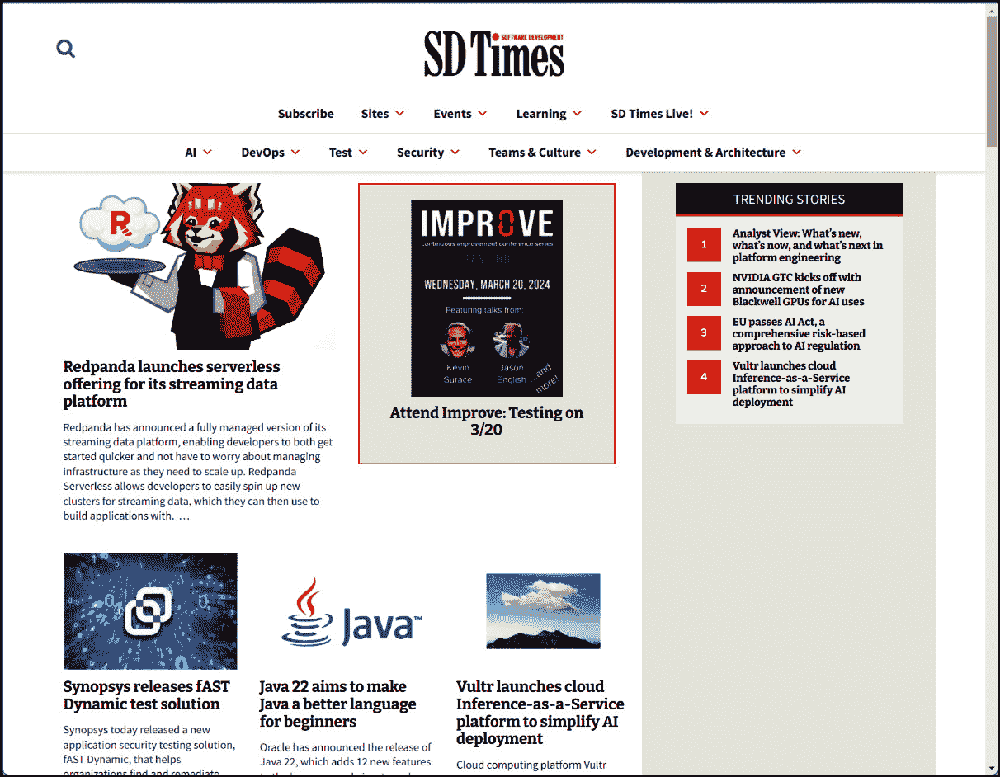
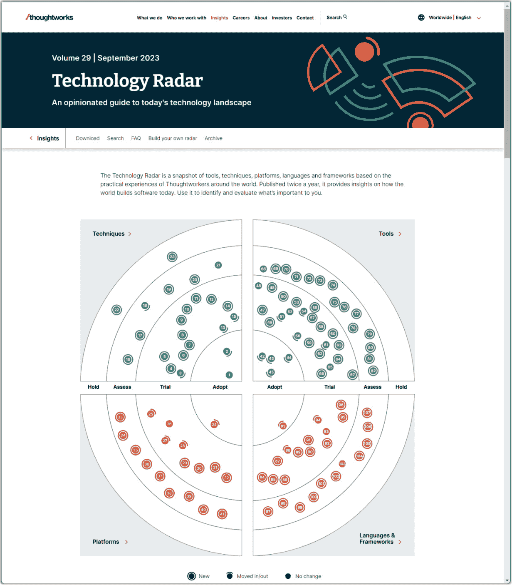
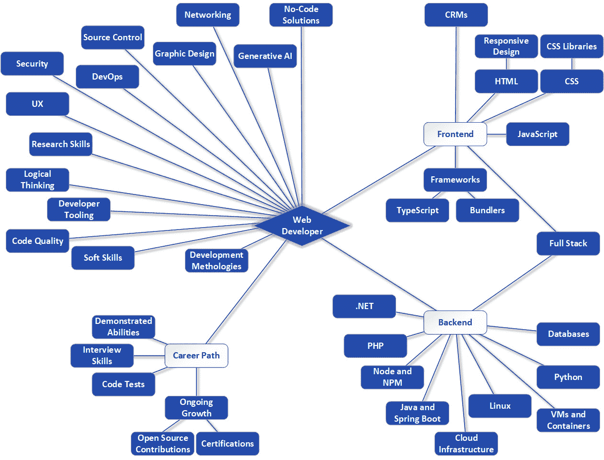

# 12

# 发展你的职业生涯

在上一章中，我们讨论了软技能，那些至少在大部分情况下不是技术性的东西。你学习了如何发展这些技能和品质，以及它们如何能帮助你实现职业抱负。

从某种意义上说，本章是上一章的延伸。然而，我们不会专注于软技能，而是主要关注你可以做些什么来提升你的技术能力。这将着眼于一件事情：发展你的职业生涯。

思考如何提升自己很重要，尤其是如果你有超越仅仅获得初级网络开发者工作的抱负。因此，在本章中，你将了解一些你可能随着成长而寻求的更高级别的职位，以及你可以如何发展技能以达到那里。这包括追求认证、为开源项目做出贡献以学习和展示你的能力，以及侧项目的想法，这也是我在上一章中提到过的（所以如果你在寻找我认为最重要的那件事，那可能是一个很好的指标：在两章中都提到了它！）。我还会讨论你可以如何跟上行业的变化，这是至关重要的。

将所有这些放在一起，我将尝试给你提供一些指导，如果你遵循这些指导，应该能够跟上行业——以及我们中的任何一个人都能做到的——并在追求攀登网络开发者职业阶梯的过程中不断提升你的技能集。

在本章中，我们将涵盖以下内容：

+   ABC – 永远在编码！

+   查看源代码是你的朋友

+   认证你的伟大

+   跟上潮流

+   以回馈来获得回报

+   求之不得的职位

# ABC – 永远在编码！

在电影《格伦加里·格伦罗斯》中，这是一部关于销售阴暗、残酷一面的电影，由亚历克·鲍德温扮演的角色布莱克给出了一个关于“永远在成交”这个短语相当著名的演讲。他在黑板上通过解释它为“ABC”来阐述这个短语。在那个电影的背景下，它讨论的是一个优秀的销售人员总是试图成交，总是试图推动最后一点，让潜在买家咬钩并最终达成交易。

在网络开发的背景下，我扮演着布莱克的角色，并将 ABC 重新定义为“永远在编码”！

这是一个足够简单的概念：网络开发是一个发展非常迅速的领域。实际上，快到我们对此有很多笑话。一个星期是聚光灯下的框架，下个星期可能就禁止使用了。好吧，我在这里稍微夸张了一点，但一旦你做了很长时间，你就会开始意识到这并不像你希望的那样夸张，有时甚至更夸张！跟上变化对任何人来说都是一项任务，相信我！

这意味着，如果你不小心，你拥有的技能很快就会变得不那么吸引人。这也意味着，如果你一段时间内不使用特定的技能，它们往往会退化。我在 80 年代花了大约六年的时间只做汇编语言编程，这是一种非常低级的语言，看起来像这样：

```js
JSR $E544
SEI
LDA #$7F
STA $DC0D
LDA #$01
STA $D01A
LDX #>IRQ
STX $0315
CLI
RTS
IRQ INC $D019
LDX #$00
LOOP LDA COLOR,X
STA $D020
LDY DELAY,X
LOOP2 DEY
BNE LOOP2
INX
CPX #$08
BNE LOOP
JMP $EA31
COLOR .BYTE 6,$E,3,1,1,3,$E,6
DELAY .BYTE 1,9,8,9,9,8,8,9
```

现在，听着，你甚至**根本**不需要理解那个！但问题是：**我也一样**！我**确实**写了那段代码！问题是，我差不多有 30 年没有做过汇编语言编程了，所以那些技能早已从我的大脑中消失。现在对我来说，它**几乎**就是乱码，因为一些汇编语言的知识仍然在我脑海中飘荡，但它已经很接近乱码了！

如果我在过去几十年里一直在做汇编语言，那么情况就会非常不同。那些技能会在我脑海中保持新鲜，这会像以前一样成为第二本能。所以，窍门是 ABC：始终在编码！

现在，自然的问题是要编写什么代码，而在你的职业生涯早期，简单的答案就是**任何东西**！我在上一章也说过这样的话，但那里是在学习的大背景下，以及通过实践学习通常是巩固大脑中知识的最有效方式。但即使你不学习新技能，保持旧技能也很重要。虽然汇编语言是我一生中可能永远都不需要在其职业生涯中使用的语言（而且我在自己的项目中做它的可能性也很低），但练习任何类型的编码都能保持更通用的“编程技能”新鲜。

事情就是这样：**特定**的技能可以允许其逐渐消失，但关于如何编程以及如何编写代码的一般知识，是你不能允许其消失的东西。我知道的避免这种情况的最好方法就是始终不断编码。

在上一章中，我谈到了个人项目和游戏是如何保持你的编码能力强大，甚至可能扩展它们的绝佳选择。虽然我坚持认为游戏是一个极好的选择，但这绝对不是唯一的选择。只要编码**任何东西**，几乎无关紧要。我建议的另一种可能性是**PIM**，即**个人信息管理器**。这是一个允许你存储、管理和利用重要个人信息的应用程序，通常是像联系人、约会和笔记这样的东西。我非常喜欢这个想法，事实上，我在我的许多书中都使用了这样的项目，如图*图 12**.1*所示：


图 12.1：多年来我编写的几个 PIM 应用的拼贴

这是一个不错的选择，因为，就像游戏一样，你将不得不面对许多不同的编程主题，而且它们可以用任何技术来完成。你可以当然地用 React 和 Node、Angular 和 Java 来构建，或者只用纯 HTML + CSS + JS 加上客户端数据存储。或者，用 Python 来做，拥有一个纯文本界面。如果你喜欢，你可以将其托管在云服务提供商那里，或者在自己的家庭服务器上。它可以在任何技术组合中工作，并且挑战性足够，可以在不过度困难的情况下保持你的技能敏锐。

但再次强调，这只是其中一个想法。希望你已经开始意识到你喜欢编码和构建网站，解决问题，以及所有与之相关的事情。如果你是这样的话，那么找到持续编码的方法，无论是从事一个项目还是另一个项目，可能不会那么困难。而且，这一切都不必公之于众！没有什么规定你必须与任何人分享你的工作，或者在你编写之后使用它。事实上，你甚至不必*完成*一个项目！我的私人源代码库中充满了半途而废的项目和因为各种原因中途放弃的想法，而大多数开发者都是这样。

但你知道吗？我经常回到那些项目上，因为我意识到其中的一些部分仍然很有价值。即使它们没有完成，我从它们中获得了新技术方面的经验，尝试了新的技术和想法，并且在处理它们的过程中，我的技能也得到了一般性的提升，这就是 ABC 的全部内容。

当然，编写代码只是保持技能敏锐的一部分。阅读代码同样重要，而且我发现许多开发者现在忘记了或忽略了这些，我之前提到过，但值得再次提及，那就是好的“查看源代码”。

# 查看源代码是你的朋友

有一个常见的说法，对于一个开发者来说，*阅读*代码和编写代码一样重要。事实上，许多人会说它*更重要*。也有人说过，大多数开发者花在阅读代码上的时间比编写代码的时间还要多——无论是理解他们必须支持的现有代码库，阅读自己的代码以记住他们是如何做的，还是阅读他人的代码以学习，这是一项独特的技能。

观察他人是如何做事的是一个特别有价值的练习。诚然，这并不总是容易的，因为你不可避免地会遇到你不知道的事情，无论是技术、风格、新库还是其他什么。这可能是一个令人沮丧的练习，但它太有价值了，不能让它阻止你。

之前，我提到了“查看源代码”选项，这是网络浏览器几十年来一直有的功能。这是开发者有时会忘记存在的东西！在一定程度上，这是因为浏览器开发者工具已经取代了查看源代码，但无论你具体如何做，我泛泛地谈论的是查看他人工作的想法。

当你访问一个网站并看到一些酷炫的东西时，在大多数情况下，你可以使用“查看源代码”或开发者工具来检查代码。现在，这并不像以前那么准确，因为现代的开发者技术。在 90 年代末/21 世纪初的早期，查看源代码很棒，因为你得到的是纯净的、未触动的 HTML、CSS 和 JS。没有神秘感；所有这些都展现在你面前，供你检查和学习。

这在意义上仍然是正确的，因为 HTML、CSS 和 JS 是网络上的通用语言。无论你使用什么开发者工具、库、框架或工具包来构建网站，最终都会归结为 HTML、CSS 和 JS。尽管浏览器运行的最终代码可能有许多不同的抽象，但最终仍然归结为这三个。

但如今，浏览器用来显示网页的最终形式可能与开发者所写的内容大相径庭，这要归因于那些抽象。例如，如果他们用 TypeScript 开发了网页，那么最终生成的 JS 代码有时看起来会截然不同。或者，如果他们使用了 Angular 或 React，那么他们所写的代码与在浏览器中运行的代码几乎毫无相似之处。还有被称为**混淆器**的工具，它们明确地试图使代码看起来尽可能不同，并且明确地更难以阅读。还有压缩器（称为**最小化器**），它们试图最小化代码的大小，以使页面加载更高效，但这也会使代码更难阅读。因此，代码有时是无意中难以阅读，有时是有意为之，但最终使得“查看源代码”不如以前那么有用。

尽管如此，即使通过查看混淆后的代码，有时也能获得有价值的见解。即使你无法完全确定导致特定效果的精确代码，例如，你仍然可能能够获得关于它是如何实现的概念性理解，而这通常正是你真正想要的。

虽然现代代码可能难以阅读，但有一些需要注意的事项可以帮助你。其中最主要的是所谓的**源映射**。这些是特殊的文件，可以在压缩或混淆 JS 时，或者在从 TypeScript 转换为 JS 时成为输出的一部分，提供一种将文件内的代码映射回其原始源代码的方法，就像在浏览器中看到的那样。它们通过在代码查看器或调试器中显示原始源代码，使得开发者能够更容易地检查代码，即使浏览器（或 Node，或另一个运行时环境）中运行的代码是经过最小化或转换的版本。这种在运行时代码和原始源代码之间的映射对于调试目的和从中学习至关重要。

很遗憾，源映射是完全可选的，因此无法保证它们一定会存在。但如果有，你最终会得到一个名为`example.min.js`的文件中的最终代码，它可能看起来像这样：

```js
function a(a,b){return a+b}function s(a,b){return a-b}
//# sourceMappingURL=example.min.js.map
```

这可以像网页中的任何 JS 文件一样使用，如下面的简单 HTML 所示：

```js
<html>
  <head>
    <title>Example</title>
    <script type="text/javascript" src="img/example.min.js"></script>
  </head>
  <body>
    <script>
      document.write(a(2, 2));
      document.write("<br>");
      document.write(s(10, 5));
    </script>
  </body>
</html>
```

对于这次讨论来说，这并不重要，但为了避免你感到困惑，`document.write()`是一个将内容写入 HTML 文档当前位置的函数。所以，在这种情况下，它写出了调用`a(2, 2)`的结果，然后是一个`<br>`标签以跳到下一行，然后是调用`s(10, 5)`的输出。

现在，`example.min.js`中的 JS 代码实际上看起来并不糟糕！你可以从中看出你有两个函数，`a()`和`s()`，其中`a()`用于添加两个数字，而`s()`用于减去两个数字（这就是为什么页面上分别写有 4 和 5 的原因）。在现代开发工具中，你最终得到这样简单且易于理解的东西是很少见的。

但请注意第二行，那是一条注释。这是魔法调料：它为开发者工具提供了一个连接，将这个最小化代码与特定的`example.min.js`源映射文件之间的链接。源映射文件可能看起来像这样：

```js
{
  "version": 3,
  "file": "example.min.js",
  "sources": ["example.js"],
  "names": ["a", "s"],
  "mappings": "AAAA,SAASA,IAAT,GAAUA,EAAGA,QAAQC,IAAI,CAACC,CAAD,CAAK,CALZ,CAQA,IAAI,CAACC,CAAD,CAAK,EAAIC,CAAC"
}
```

不要担心这些意味着什么，因为作为人类，你通常不需要直接查看源映射文件。这不是为我们准备的；它是为工具准备的。当这些工具处理这个文件时，结果就是在浏览器开发者工具中，你现在将能够有效地访问原始源文件。这是因为源映射文件知道如何，在某种意义上，将最小化版本转换为原始源文件，如下所示：

```js
function a(a, b) {
  return a + b;
}
function s(a, b) {
  return a – b;
}
```

在*图 12.2*中，你可以看到为这个示例加载的文件列表，其中包括`example.js`（你可以通过在本书的代码目录中运行`npx` http-server 来尝试这个示例；它将启动一个服务器，然后你可以使用显示的 URL 访问它，此时你将能够自己看到开发者工具中的相同内容，如这些页面所示）：


图 12.2：浏览器开发者工具中源映射的示例

这让你能够兼得两者之优！你可以使用所有那些花哨的新框架、库和工具包，以及你想要的任何优秀的最小化/混淆工具，同时仍然能够有效地调试你的实时代码。而且它还允许其他人从你的代码中作为学习经验获得价值。

虽然“查看源代码”对于了解他人是如何做的是非常有价值的，但它不仅仅是为了这个目的。它还允许你“像黑客一样思考”，以找出你工作中存在的安全漏洞。

## 思考像黑客一样

我所说的“像黑客一样思考”是指你可以使用“查看源代码”和浏览器开发者工具来戴上你的“白帽子”，并找出你自己的代码中的漏洞。

黑客的类型

黑客——那些寻找网站和应用程序安全漏洞的人——有多种类型，通常用“帽子颜色”来表示。白帽黑客，也称为“道德黑客”，是指那些在法律范围内，并得到目标方的同意，明确意图寻找和披露漏洞的人。这些人通常被公司雇佣来寻找他们网站中的缺陷。黑帽黑客是指那些将技能用于非法或恶意目的的人。他们的动机通常涉及经济利益、间谍活动，或者仅仅是制造混乱。灰帽黑客介于两者之间，他们寻找漏洞的目的是披露它们，而不是为了恶意目的而利用它们，但他们并不以目标方的同意或事先了解为目标。公司通常对灰帽黑客有着爱恨交加的关系，因为虽然有人像那样发现问题并在黑帽黑客之前通知公司是好事，但接到一个未经请求的报告仍然让人感到不安。

你必须改变你的思维方式来做这件事，看待代码不是看它是什么，而是看你能用它做什么。例如，你能找到在调用你的 REST API 时使用的嵌入在代码中的密码吗？这是一个非常明显的安全问题；然而，这通常不会那么容易，所以你将不得不从侧面开始考虑。比如，你能看到可能能够黑客攻击代码，向服务器调用添加一些恶意的 SQL——换句话说，就是 SQL 注入攻击的地方吗？

只要这是你自己的代码，这一切都无可厚非。但没有什么能阻止你戴上灰帽，看看别人的代码。正如前一个注意事项中提到的，你必须小心，因为并非每个公司都会欣赏你这样做。但这对你的学习经验仍然很有帮助，因为你可以开始看到你应该在自己的工作中避免的模式。看到别人的错误是件有价值的事情！

不要害怕深入研究并看看别人是如何做到的；无论出于安全目的与否，这是底线。查看源代码的功能就是为了让你这样做，现代浏览器中提供的更高级的开发工具也是如此。利用它们，如果你花时间去做，你可以学到很多东西。

你可以增强你的技能以及你的就业能力，另一种方式是通过认证，那些声称告诉别人你所知道的光鲜亮丽的（如今往往是虚拟的）纸张。让我们看看这些是什么！

# 证明你的伟大

证书，那些（有时）闪闪发光的纸张，挂在墙上（有时），是向世界宣告“我对 X 了如指掌！”的方式，其中 X 是某种技术或技能。它们就像大学学位，但不需要坐在教室里。你看，你可以去参加，比如，网页开发的考试，如果你通过了，你将获得一份证书，意在表明你在网页开发方面已经达到了一定的技能水平。

可用的证书有成百上千种。有些由私人公司（可能大多数都是）管理，针对的是它们主要收入来源的特定技术，有些由政府机构管理，还有些由整个商业模式就是提供认证考试的组织管理。它们涵盖了从云计算到网络安全、网络、人工智能和机器学习、数据管理和分析以及项目管理等各种主题。

有些证书是免费的，但大多数需要付费才能获得。多少钱？从几十美元到几千美元不等。有些证书实际上非常容易；考试相当表面化，不需要深入的知识。其他一些证书——比如思科公司进行的网络测试——因其非常困难且需要实际操作演示你的技能而臭名昭著。

但在你考虑获得任何类型的证书之前，问一个简单的问题是有价值的：它真的值得花费时间、金钱和精力吗？

## 它们值得获得吗？

技术界的人士与证书的关系一直有点爱恨交加，而且随着时间的推移，对它们的态度也在变化。20-30 年前，几乎任何证书都有价值。它们在求职时使你脱颖而出，因为并不是每个人都拥有它们。在那个时代，花几百甚至几千美元收集几个证书是帮助你的脚进入门槛的好方法，或者可能帮助你加薪或晋升。

现在，情况并不那么明确。有些人对证书几乎不抱任何期望，因为最终，如果你是那种知道如何学习和考试的人，他们认为你可能在没有任何实际经验的情况下获得许多证书。

为了具体说明这一点，大约 25 年前，我获得了 Novell 管理员认证，Novell 是一个已经消失的操作系统，曾经在大数据中心中相当流行。我当然知道 Novell 的基础知识，并且有一些实际操作经验，但我根本不具备成为真实生产 Novell 系统管理员的资格。尽管如此，我还是买了一本学习书籍，翻来覆去地读了几遍，并设法通过了考试，因为我一直很擅长在考试中复述信息。所以，实际上，这个认证从未真正表明我对 Novell 的真实知识水平；它更多地只是显示了我学习和通过考试的能力。

不幸的是，这就是如今一些人看待*任何*认证的方式。但我认为这是不公平的，因为并非所有认证都是平等的。有些，比如 Novell 测试，只需要基本知识和经验的人就能通过，但像思科测试这样的考试则不行。那些要求你真正了解你的知识，并且能够以实际方式展示出来。

作为一般性的说法，随着时间的推移，认证的重要性会降低，因为你的过去经验，从某种意义上说，成为了你的认证。如果你实际上已经构建了一个或多个复杂的网站，那么这向我——作为招聘经理——展示的你所知道的内容，比任何认证都要好。

所以，这听起来可能有些矛盾，而且从某种意义上说，确实如此！这里存在一种紧张感。

一方面，如果你正在尝试找到第一份工作，并且没有很多经验可以展示，那么我会说认证有一些价值。它们对每个面试官的价值可能都不一样，但对于那些更看重它们的人来说，这可能是被雇佣和不被雇佣的区别。我会说，不要在这些认证上花费过多的时间和金钱；寻找那些（a）不太昂贵，并且（b）你可以根据你所*真正*知道的内容通过，而不需要大量学习时间的认证。

另一方面，随着你积累了一些实际工作经验，我个人观点——我相信我不孤单——是不要过分重视认证。偶尔有针对性地追求一个认证可能仍然是有意义的，比如如果你正在寻找换工作，并且想要尽可能多的证据来证明你能胜任新工作。但“收集认证”——只是不断地获取它们，认为它们*可能*对你的职业生涯有好处——可能是一种浪费时间和金钱的行为。可能更好的做法是花时间构建东西，通过实践来积累经验，这样你就有更多展示你技能的证据。

就其价值而言，在我职业生涯的早期，我经历了一段收集认证的阶段。最后一次统计，我拥有大约 90 种不同的认证。虽然其中一些，比如 Novell 的认证，并没有真正反映我当时的知识和能力，但很多确实是如此。但无论如何，简单的事实是，它们对我的职业生涯没有任何实质性的好处。它们没有帮助我得到第一份工作（在那之前我没有任何工作），也没有帮助我在后来获得任何大的薪资增长（尽管证明我在工作中的能力确实做到了）。我是否觉得那些时间和金钱都值得？不，我老实说并不觉得。尽管如此，我认为我确实从为它们所做的学习中学习到了一些东西，从这个意义上说，我可能确实得到了一些好处，但不足以证明时间和金钱的投入是合理的。

因此，如果你决定追求认证，我认为进行有针对性的追求是明智之举；这正是那个轶事的意义所在。

假设你决定追求认证，无论是为了得到第一份工作还是为了后来的某个原因。鉴于现在有如此多的认证，你该如何选择追求哪些呢？让我们来看看目前最受欢迎的一些认证，看看获得它们需要什么，以及哪些可能对你最有益。

## 要追求的具体认证

确定哪些认证对大多数人来说更有内在价值是一个非常困难的任务。这大部分取决于意见和主观衡量标准。尽管如此，当人们讨论它们时，一些认证确实往往浮出水面。以下是我根据一些在线研究认为最有价值获得、按类别划分的认证列表。

### 通用网络开发

这些认证显示了网络开发者可能需要具备的多种领域的技能：

+   *Adobe 认证专家（ACE）网络专家*：由 Adobe 管理，它专注于 Adobe 的网页设计和开发工具，非常适合前端开发者（[`learning.adobe.com/certification.html`](https://learning.adobe.com/certification.html)）

+   *认证网络专业人士（CWP）*：由国际网络协会认证，它提供网页设计、电子商务和网页开发的专业化（[`iwanet.org/profdevel`](https://iwanet.org/profdevel)）

+   *全栈网络开发者纳米学位*：由 Udacity 这个培训平台管理，它涵盖了前端和后端技能、数据库管理和 API 使用（[`www.udacity.com/course/full-stack-web-developer-nanodegree--nd0044`](https://www.udacity.com/course/full-stack-web-developer-nanodegree--nd0044)）

+   *Oracle 认证专业 Java SE 程序员*：由 Oracle 管理，它验证了在 Java（后端开发的一种常见语言）方面的专业知识（[`education.oracle.com/oracle-certification-path/pFamily_48`](https://education.oracle.com/oracle-certification-path/pFamily_48)）

+   *认证响应式网页设计师 (CRWD) (Certified Responsive Web Designer)*：由 freeCodeCamp，一个学习平台，管理，确认在创建响应式、用户友好型网页设计方面的技能（[`www.freecodecamp.org/learn/2022/responsive-web-design`](https://www.freecodecamp.org/learn/2022/responsive-web-design)）

### 云计算

云计算认证通常是坚实的，对很多人来说具有相当的意义：

+   *AWS 认证开发者助理 (AWS Certified Developer Associate)*：由亚马逊管理，涉及在 AWS 上开发和维护应用程序（[`aws.amazon.com/certification/certified-developer-associate`](https://aws.amazon.com/certification/certified-developer-associate)）

+   *亚马逊网络服务认证解决方案架构师 (AWS Certified Solutions Architect)*：由亚马逊管理，专注于在 AWS 上设计分布式系统（[`aws.amazon.com/certification/certified-solutions-architect-associate`](https://aws.amazon.com/certification/certified-solutions-architect-associate)）

+   *微软认证 Azure 开发者助理 (Microsoft Certified Azure Developer Associate)*：由微软管理，针对开发者设计、构建、测试和维护 Azure 上的云解决方案（[`learn.microsoft.com/en-us/credentials/certifications/azure-developer`](https://learn.microsoft.com/en-us/credentials/certifications/azure-developer)）

+   *谷歌认证专业云架构师 (Google Certified Professional Cloud Architect)*：由谷歌管理，专注于设计和管理谷歌云上的解决方案，包括人工智能和机器学习解决方案（[`cloud.google.com/learn/certification/cloud-architect`](https://cloud.google.com/learn/certification/cloud-architect)）

### 网络安全

网络安全是当今一个关键话题，无论你是直接寻找网络安全工作，还是只想表明，作为一名网页开发者，你对这个重要话题有很好的掌握：

+   *认证信息系统安全专业员 (CISSP)*：由 ISC2 管理，是针对对信息安全职业认真负责的 IT 专业人士的高级认证（[`www.isc2.org/certifications/cissp`](https://www.isc2.org/certifications/cissp)）

+   *认证信息系统安全管理员 (CISM) (Certified Information Security Manager)*：由 ISACA 管理，专注于信息安全的管理和治理（[`www.isaca.org/credentialing/cism`](https://www.isaca.org/credentialing/cism)）

+   *认证网络应用安全测试员 (C-WAST) (Certified Web Application Security Tester)*：由 Udemy，一个教育平台，管理，专注于识别和减轻网络应用漏洞（[`www.udemy.com/course/certified-web-application-tester/?couponCode=24T5FS31824`](https://www.udemy.com/course/certified-web-application-tester/?couponCode=24T5FS31824)）

+   *GIAC 网络应用渗透测试员 (GWAPT) (GIAC Web Application Penetration Tester)*：由 GIAC 认证管理，验证网络应用安全测试和渗透测试的技能（[`www.giac.org/certifications/web-application-penetration-tester-gwapt`](https://www.giac.org/certifications/web-application-penetration-tester-gwapt)）

### 网络

正如你所知，网络对于成为一名网页开发者至关重要，尽管这些认证对于网页开发者来说可能过于高级，但它们确实是获得大量认可的认证示例：

+   *思科认证网络助理 (CCNA)*：由思科管理，是一个入门级认证，涵盖基本的网络安全概念 ([`www.cisco.com/c/en/us/training-events/training-certifications/certifications/associate/ccna.html`](https://www.cisco.com/c/en/us/training-events/training-certifications/certifications/associate/ccna.html))

+   *思科认证网络专业人士 (CCNP)*：由思科管理，涵盖更高级的网络安全主题，需要更深入的知识和理解网络解决方案 ([`www.cisco.com/c/en/us/training-events/training-certifications/certifications/professional/ccnp-enterprise.html`](https://www.cisco.com/c/en/us/training-events/training-certifications/certifications/professional/ccnp-enterprise.html))

### 数据管理和分析

处理数据通常是软件开发的一个重要部分，因此处理这些技能的认证具有一定的内在价值：

+   *认证数据专业人士 (CDP)*：由职业信息网站 O*NET 管理，是一个针对数据专业人士的全面认证项目 ([`www.onetonline.org/link/certinfo/12605-B`](https://www.onetonline.org/link/certinfo/12605-B))

+   *微软认证数据分析师助理*：由微软管理，专注于在微软 Power BI 中转换、分析和可视化数据所需的技能 ([`learn.microsoft.com/en-us/credentials/certifications/power-bi-data-analyst-associate`](https://learn.microsoft.com/en-us/credentials/certifications/power-bi-data-analyst-associate))

### 人工智能和机器学习

正如你所知，人工智能和机器学习是庞大且不断发展的领域，因此，这些领域的认证自然具有一些内在意义：

+   *微软认证 Azure AI 工程师助理*：由微软管理，专注于使用认知服务、机器学习和知识挖掘来设计和实施微软人工智能解决方案 ([`learn.microsoft.com/en-us/credentials/certifications/azure-ai-engineer`](https://learn.microsoft.com/en-us/credentials/certifications/azure-ai-engineer))

+   *IBM 数据科学专业人士证书*：由 IBM 和 Coursera（一个学习平台）管理，涵盖数据科学、机器学习和人工智能，使用各种工具和技术 ([`www.coursera.org/professional-certificates/ibm-data-science`](https://www.coursera.org/professional-certificates/ibm-data-science))

### 项目管理

就像网络一样，这些认证通常不是作为网页开发者所希望追求的。但你知道吗？有些人最终会意识到他们更喜欢项目管理方面而不是开发方面，所以了解在那个时刻可能感兴趣的认证，或者只是如果你想拥有更广泛的专长基础，这是很好的：

+   *项目管理专业 (PMP)*：由 PMI 管理并在全球范围内得到认可，它表明你有能力领导项目团队并实现项目目标([`www.pmi.org/certifications/project-management-pmp`](https://www.pmi.org/certifications/project-management-pmp))

+   *认证 ScrumMaster (CSM)*：由 Scrum Alliance 管理，它专注于敏捷项目管理，特别是在软件开发中，以及如何作为 Scrum Master，即领导每日站立会议和其他敏捷项目方面的活动([`www.scrumalliance.org/get-certified/scrum-master-track/certified-scrummaster`](https://www.scrumalliance.org/get-certified/scrum-master-track/certified-scrummaster))

我会说，获得这些认证中的任何一个都会让简历看起来很好，有助于帮助你找到第一份工作，并且可能在将来提升你的职业生涯中带来一些好处。我肯定会说，截至写作之时，这些认证可能比大多数其他认证更能得到更多人的认可，所以如果你要获得任何认证，我建议你应该把它们放在你的清单的前列或接近前列。

因此，你获得了一些认证，找到了你的第一份工作，你知道你应该始终如一地编码以保持你的技能敏锐。你还能做些什么来确保和提升你的职业生涯？这全部关乎关注行业中的动态，关注他人正在做什么，并尽可能从他们那里学习。让我们来谈谈一些实现这一目标的策略。

# 跟随潮流

IT 领域，尤其是网络开发，是一个不断变化、不断扩大的领域，每次转身都有新事物要学习。跟上所有这些实际上是一项全职工作。我们在前几章中讨论了几种你可以用来跟上潮流的方法，比如聚会和会议，但好消息是，网络本身提供了大量的资源，让你可以在家中舒适地完成这些。

现在有很多网站你可以经常访问，以获取最新的技术新闻、趋势、观点，以及介绍最新和最好的产品。当然，有些网站比其他网站更好，所以试图找到最好的可能很困难。但不用担心，这正是我在这里的原因！

以下是我个人认为最有价值的网站之一。毫无疑问，还有其他好的网站，但如果你经常访问这些网站——我个人喜欢几乎每天浏览它们——我认为你会对自己有所帮助，并对行业的发展有一个良好的感觉。关注整个行业的重要性不容忽视，因为它能让你深入了解他人正在做什么，以及你应该关注哪些技术，所以这绝对是你时间的宝贵利用，尤其是有这些好网站的情况下。

## A List Apart

A List Apart ([`alistapart.com`](https://alistapart.com)) 是一个专门为那些制作网站的人——无论是设计师还是开发者——提供新闻的网站。它的文章侧重于网络标准和最佳实践，对任何网络开发者来说都很有价值。在 A List Apart 上，你可以找到从编码到设计、用户体验、内容策略以及行业和流程新闻的各种主题。



图 12.3：A List Apart

## Daily.dev

Daily.dev ([`app.daily.dev`](https://app.daily.dev)) 是另一个“聚合”网站，它提供了一个易于使用、简洁的界面，链接到其他人的内容。你将找到各种主题和文章类型，但所有内容都侧重于软件开发。虽然这里对 Web 开发给予了大量关注，但并非唯一。



图 12.4：Daily.dev

作为额外的好处，Daily.dev 使提交内容变得容易，所以如果你有灵感，这是一个向世界介绍你可能会在某个时候撰写的任何文章的好网站！

## dZone

截至撰写本文时，已有超过一百万的开发者成为 dZone ([`dzone.com/`](https://dzone.com/)) 的成员，这意味着它是今天专业开发者的一个显赫的编程新闻中心。该网站涵盖了从敏捷到云技术、DevOps、大数据、ML/Al、性能调优等各个方面。它是从行业各个角落获取最新洞察的有价值来源，对初学者和经验丰富的开发者都同样有益。


图 12.5：dZone

## Hacker News (Y Combinator)

Hacker News，有时被称为 Y Combinator ([`news.ycombinator.com`](https://news.ycombinator.com))，类似于 Reddit，但专门针对开发者！Hacker News 是开发者、技术和科学新闻中最知名和最受尊敬的网站之一。它是一个非常简洁的网站，可能看起来不是那么美观，但速度非常快，导航也很容易。它是保持最新信息的最优秀资源之一，并且经常是行业讨论的场所。例如，数百名开发者参与了 2017 年 2 月 28 日大规模 AWS S3 故障的实时讨论。虽然其中一些文章可能更偏向理论性和教育性，但其他文章，比如那篇，会变成任何人都可以阅读并参与的实时讨论。



图 12.6：Hacker News

## InfoQ

InfoQ ([`www.infoq.com`](https://www.infoq.com))的口号是“促进专业软件开发中知识和创新的传播”，从其主页上一瞥可以看出，它非常认真地遵循这一信条，为你提供了一系列优秀的文章。虽然我认为我可能会说 InfoQ 倾向于更多经验丰富的开发者，但它仍然为其他技能水平的人提供了可以从中获得的东西。它还提供了指向演示文稿和播客的链接，其中许多在占用你一些时间的同时提供了巨大的价值。


图 12.7：InfoQ

## SD Times

SD Times ([`sdtimes.com`](https://sdtimes.com))，即软件开发时报，是一种为各种开发者制作的数字报纸。其内容涵盖包括 DevOps、测试、安全、团队和文化以及系统架构在内的多个主题。它当然提供新闻，但除此之外，还提供特定主题的网络研讨会、白皮书和播客。你可能会因为主页看起来似乎没有太多内容而被误导，但稍微向下滚动并探索菜单，你会发现实际上有很多内容。



图 12.8：SD Times

## 技术雷达

最后，如果你在寻找一个关于你应该关注的正在兴起的热门技术的优秀图形表示，那么技术雷达([`www.thoughtworks.com/radar`](https://www.thoughtworks.com/radar))是一个很好的选择。这是 Thoughtworks 的产品，它是一家知名的技术咨询公司，技术雷达展示了语言和框架、技术、工具和平台，以及你是否应该——在专家的意见中——继续使用它们（因为它们可能正在从开发者的脑海中消失），评估它们是否适合你的使用，以试验模式使用它们，或者直接采用它们。换句话说：它试图给你一个关于当前热门、即将到来或正在消失的技术概念。鉴于这个网站的明显主观性质，你当然需要自己评估它所说的内容。但一个知名且普遍受到尊重的、肯定知道自己在做什么的群体提供这种指导，可以是一个非常宝贵的资源。



图 12.9：技术雷达

阅读新闻网站非常有价值，在这个领域你几乎*必须*这样做。但你可以做的一件事——而且在我看来，只要可能，你就应该这样做——是寻找将你的技能用于实际的方式，以构建和展示你的能力。虽然这对你有明显的益处，但它也对他人有益，所以这是一个双赢的局面！现在让我们看看你可以如何实现这一点。

# 回馈以获得回报

在我多年的开发者/架构师/领导/技术经理生涯中，我逐渐明白的一点是，当你帮助他人时，你几乎总是会在过程中帮助到自己。这可以以多种形式出现。帮助同事解决问题往往能让你获得之前没有的洞察力。教导他人有助于巩固你自己的知识。而且当你为项目做出贡献时，你会在获得技术利益的同时，获得成就感。

因此，我总是寻找可以“回馈”他人的方式。我说“回馈”，因为我们所有人都依赖他人，无论是他们教导我们、帮助我们解决问题，还是仅仅创建了我们所依赖的软件和工具。寻找机会自己去做同样的事情是提升你的技能集和其他无形品质的绝佳方式。

让我们谈谈一些你可能考虑的回馈方式。当然，哪种方式适合你，你需要自己发现，这绝对不是一份详尽的清单。但希望这能给你一些关于你可以做的事情的想法。

## 开源贡献

最好的——也是最容易的——回馈方式之一是向开源项目（通常使用缩写**FOSS**，代表**free/open-source software**，我将在下面这样做）做出贡献。你当然可以开始自己的项目；这没有什么错，而且它有很多好处。但在这里，我专注于寻找你喜欢的项目并向它们做出贡献。

许多开发者对参与项目感到紧张，尤其是在他们自己的学习初期，因为他们认为他们可能没有任何可以贡献的东西。让我向你保证，这是错误的！开源项目通常需要人们做一些不需要高技术技能的事情。例如，文档是许多项目所缺乏的，而且项目的维护者都乐于有人帮助他们。

事实上，你的相对缺乏经验实际上可能是一种祝福：编写更简单的“入门”文档，就像一个新用户需要的那样，你可能可以处理，因为你必须自己经历那个学习过程才能写出这样的文档。你可能会节省其他人通过这样的贡献来熟悉情况的时间，这肯定是一件有价值的事情。

没有获取权限的必要——你只需开始写作！你很可能会需要克隆项目的仓库，正如在*第四章*中讨论的那样。这将在你的机器上创建一个本地副本，你可以开始修改而不会对现有项目的代码造成任何风险。如果事情不顺利，那也无关紧要；你总是可以克隆一个新的副本并重新开始，无损无损。

但最终，当你取得了良好的进展时，当你认为文档准备就绪时，你可以发送一个 pull request（假设项目正在使用 GitHub）。当然，没有保证它会被接受，或者他们不会回送一些关于他们希望看到的内容的评论。但很多时候，你会得到一个巨大的“谢谢！”以及立即的接受。

查看项目的现有错误并提交修复方案是另一种伟大的贡献方式。显然，对于项目来说，解决错误是件好事，但对于你来说也是极好的，因为它不仅帮助你学习项目的代码库，以便你将来可以做出更多贡献，而且意味着你在阅读代码并从中学习，所以自私地说，这将极大地对你有益。而且你不需要一开始就解决最棘手的错误！找到那些看起来比较简单的错误，甚至“愚蠢”的事情，比如屏幕上的标签可能有拼写错误，也可以让你入门。

最终，你可以看看一个项目，想想“好吧，我能添加什么功能，我认为人们会喜欢？”然后就去实现它。当你达到这个阶段时，你可能想要在论坛或邮件列表或 Discord 的消息列表上进行一些讨论——无论项目成员如何沟通——以获得一定程度的支持，这样你就不会在最终没有机会被接受的事情上浪费很多时间（再次强调，构建这个功能的经验本身也可能对你有益，所以也要记住这一点）。了解你不会开始做某个项目成员已经在做的事情也是好的。

可能项目的网站有点不足。在这种情况下，你可能会提出建立一些更稳健的东西。在这方面，事情与过去略有不同，因为大多数开源项目都托管在 GitHub 等网站上，它们可能没有自己独特的网站，就像几年前那样常见。但事实仍然是，项目通常会想要有自己的“面孔”，即使它们托管在 GitHub 上，提出建立这样的网站——以及可能提出一些设计理念或原型来证明这一点——也可能是有价值的。

你也可以仅仅通过成为**SME**（行业专家）或**subject matter expert**（主题领域专家）来参与开源项目。如果你对项目非常了解，你可以开始帮助在论坛上遇到问题的用户。这种贡献不仅会被项目的用户所欣赏，也会被维护者所欣赏，因为他们可以更多地专注于编写代码而不是帮助人们。

从根本上说，开源（FOSS）的一切都是关于社区，所以找到你可以帮助社区的方式就是关键。无论是文档、编码还是仅仅回答问题，这些都算数。

## 展示

另一种回馈的方式是在用户组、聚会等活动上进行展示。这将帮助你巩固你的技术知识，因为当然，你需要学习和准备你的展示，并准备好回答问题。但这也带来了一个好处，那就是让你在公众面前讲话的经验，这是一个非常有价值的技能。

你真正需要做的只是选择一个你自信的题目，并找到一个合适的群体进行展示。网站 [meetup.com](http://meetup.com) 是一个很好的资源。你可能想要从小规模开始，所以找到处理你想要展示的题目的较小、本地群体，并直接联系组织者。这些人通常很乐意有人愿意进行展示，因为否则他们必须自己付出努力去寻找人。让人们的任务变得更简单总是好事！

如果你以前从未做过演讲，一开始可能会非常紧张。在大众面前讲话，无论大小，都会让人感到害怕。就像大多数事情一样，你做得越多，就会越习惯，所以我建议，全力以赴！面对紧张，克服它！

话虽如此，如何做一个好的演讲呢？以下是一些一般性的指导原则，可以帮助你做到这一点：

+   假设你已经在像 Microsoft PowerPoint 这样的软件中制作了幻灯片，每张幻灯片只包含一个主题。你想要确保不要一次性给观众提供过多的信息，过于密集的幻灯片正是如此。

+   展示，而不仅仅是讲述。这不仅是演讲的建议，也是虚构写作的建议。如果你能展示一段代码的结果，那么就展示，而不是简单地告诉你的观众它能做什么。

+   不要简单地阅读你的幻灯片！这是一个非常普遍的问题，而且很快就会被注意到。你的观众自己完全可以看懂幻灯片；你的工作是当他们阅读时，对幻灯片上的内容进行扩展。

+   与前一点相辅相成：每张幻灯片限制在一句话或两句话以内。再次强调，过于密集的幻灯片只会分散观众的注意力。他们是在听你讲话，而不是阅读一大堆文字。你只需要一或两句话来概括你要讲的内容就足够了。

+   一般而言，每张幻灯片应该对应一到两分钟的时间。演讲，就像故事一样，应该保持一个合理的节奏。当然，会有例外，但保持这个速度是一个很好的通用准则。

+   当可能的时候，使用图形。正如人们所说，一张图片胜过千言万语。一个好的图像、图表或截图可以比一大堆文字（无论是打印的还是口头的）更好地讲述一个故事，尽管有时——每个实例都必须根据其自身优点来审视——但这是一个普遍的准则。

+   如果可能的话，在你的演讲中设置一到两个“哇！”的时刻。这可能是接近结尾，你以某种方式将你所说的内容综合在一起，或者它可能是正好在开始时，你展示了一些令人印象深刻的内容，你将讨论这些内容。或者它可能是在中间的一两个时刻。无论如何，这是一个很好的方式来吸引和保持观众的兴趣，让他们感觉自己的时间花得很值得。

当然，练习！许多人喜欢在镜子前做演讲；其他人则更喜欢让他们的伴侣听他们演讲。甚至在网上有地方可以让你在“人”面前练习，甚至在 VR 中！这样一个网站是 [`virtualorator.com`](https://virtualorator.com)，它允许你在与真实环境非常相似的模拟环境中练习，前提是你有适当的 VR 设备。

## 博客

你还可以做的是写独立文章——就像我们今天所说的博客。例如 [medium.com](http://medium.com) 这样的网站使得这一过程变得非常简单，并且在这个过程中你可能会赚到一些钱。

开始使用就像注册一个账户一样简单，然后开始输入！你需要对你所写的任何主题进行所有适当的研究，如果需要的话，创建示例，并学会在发布之前编辑和审查你的作品。但除了你自己的动力和动机之外，实际上没有真正的入门障碍。

Medium 并不是唯一这样的网站，你甚至不必使用这样的网站。你可以自己托管你的文章，也许使用 WordPress 这样的东西，或者从头开始创建自己的网站，这有一个好处，就是可以展示你能做什么。最大的区别是，使用像 Medium 这样的网站可能会更快地将你的作品展示给更多的人，因为技术读者在那里聚集，从某种意义上说，而如果你有自己的网站，你需要自己进行广告和宣传。你可以从 Medium 开始，建立一些了解你作品的观众，然后迁移到你的网站。

在撰写此类文章时，以下是一些需要注意的事项：

+   无论你认为你做得有多好，都不可避免地会有**某人**会批评你的作品。这就是我们生活在这个世界中的现实。所以，当它来临时，做好准备，培养出厚脸皮，看看批评中是否有任何有价值的东西。可能有一些真理被一些不友善的话语所包裹，如果你能找到它（当然，总会有一些人只是为了恶意而恶意，所以你还需要学会如何和何时简单地忽略人们）。

+   记住，你的文章不一定需要很大或宏伟才能给人们带来价值。有时，仅仅几段文字就足以让某人有一个“啊哈！”的时刻，他们会像感谢你写了一本完整的书一样感谢你。

+   选择你热爱的主题。人们通常能感觉到一个作家是在例行公事还是在真正地兴奋于他们所写的内容。做后者，因为这样总是表现得更好。

## 技术审稿人为作者

另一种回馈的方式是成为像这本书一样的书籍的技术审稿人！

每当一位作者撰写技术书籍时，他们需要有人审阅并确保他们没有犯任何技术错误。写一本书并不容易，相信我，无论你多么努力，通常总有一些事情做得不对。也许有你不了解的操作系统之间的差异。也许有你在编写示例代码时没有使用的库的不同版本，这破坏了那些示例。也许你并没有像你认为的那样清楚地解释某些事情。所有这些就是技术审稿人发挥作用的地方。

担任技术审稿人需要你阅读、测试并寻找读者可能遇到的问题。有时，你可能需要成为书中主题的专家，但通常，如果你不是专家可能反而更好。这是因为从逻辑上讲，大多数技术书籍的读者都是在尝试学习，而不是那些已经在某个特定主题上成为专家的人。考虑到这一点，因此，一个技术审稿人可能也不是（尽管，当然，你总是会被期望在进入时拥有*一些*知识——这很大程度上取决于特定出版社如何处理事情）。

如何成为一名技术审稿人？嗯，基本上有三种方式。一种是你可能是一个被发现并接触的人。例如，如果你已经写了很多关于 React 的文章，那么正在编写 React 书籍的出版社可能会注意到你，并接触你，认识到你是一个知道自己在做什么的人。另一种方式是认识作者。作者经常被问到是否认识可以作为技术审稿人的人，所以如果你有一个强大的网络，那么你可能会被你认识的人询问，他们正在写书。第三种方式是直接接触出版社！访问他们的网站，寻找编辑或可能是收购人员的联系方式，并发送一封邮件说明你感兴趣成为技术审稿人。你可能不会立即成功，但你也可能发现自己被添加到一份名单中，稍后会被联系。

我还会给你一个额外的第四种方法：阅读现有的书籍，寻找错误，并将错误数据发送给出版社。这不仅会磨练你的技术审稿人技能，并帮助作者和出版社，而且如果你提交了很多，可能会引起注意，这可能会带来未来的机会。

## 自己写书

当然，在某个时候，你可能会超越博主或技术审稿人的角色，决定自己写一本书可能是一件你想做的事情。

例如，Packt 这样的出版社对新作者非常开放，所以如果你认为你可能想尝试，那么绝对值得一试。如果你已经有一些写作，出版社可能会注意到你，并接触你，但你也可以自己主动接触他们。大多数，如果不是所有出版社，都在他们的网站上提供了指导，说明如何向他们提交书籍提案。通常，这涉及到提交一些关于你想写什么的概述信息，而且通常，他们还会想要一个粗略的大纲，以展示这本书将是什么样的。

实际上，这有点像钓鱼：你把你的提案当作诱饵扔进水里，然后等待咬钩！一旦有反应，那么艰苦的工作就开始了！

虽然这是一项艰巨的工作，但它对你有很大的好处。首先，鉴于这是任何书籍的关键要求之一，学习和练习如何清晰地表达自己是一个好处。另一个好处是，作为作者，人们期望你非常了解你写的内容，但由于没有人知道一切，你可能需要在写作过程中进行一些研究并学习相关知识。

此外，在你的简历上写上你写过一本书或两本书，看起来也不算太差！

此外，如果你最终写出一本畅销书，还可以获得一些非常不错的经济收益。自从互联网成为今天这个样子以来，出版行业已经变得有些艰难，但人们仍然在阅读，甚至经常更喜欢书籍，所以这些山丘上仍然可能蕴藏着金子。但即使你不通过写书致富，从书中获得的除了金钱之外的好处也可以使它成为一种值得的经历。只是记住，这将是一大堆艰苦的工作，所以要做好准备。但只要你有这个准备，就去尝试吧，我说！

## 导师

你可以回馈社会的最后一种方式是成为导师。我更专注于成为导师，因为成为教师通常需要标准化的资格证书、学位和其他认证。然而，成为导师通常不需要。

你可以辅导谁呢？嗯，实际上可以是任何人，但一个很好的可能性是你镇上的老年人。也许你附近有一个老年人中心，或者一个活跃的老年人中心。这些地方有时会有夜间的课程，供想学习技术技能的人参加。现在，可能对网络开发学习的需求不会太多，但你永远不知道！即使没有，教人们如何一般地使用电脑，以及如何使用万维网，对他们来说可能非常有价值，同时也能帮助你确保自己掌握了基础知识。

你有时可以通过频繁访问在线社交网站，这些网站上有的人在讨论网络开发，并寻找那些自己也在寻求帮助的人，来进入导师的角色。有时，你会看到有人直接寻求导师，有人指导他们的学习。加入他们并主动提出帮助他们！

还有一些专门用于寻找和成为导师的网站。一个例子是[mentorcruise.com](http://mentorcruise.com)。虽然你可以在该网站上成为导师并赚取一些钱，但通常这只是一个次要的考虑因素，因为帮助人们才是首要的。然而，成为导师需要投入时间，所以你必须确保自己准备好了。这可能需要很多时间，也可能不需要太多时间；这完全取决于你达成的安排。

这一部分的主旨是，当你帮助他人时，你以各种方式帮助自己。是的，这可能以额外收入的形式出现，但这并不是全部。这实际上关于帮助他人带来的积极感受，以及帮助他人带来的技能和知识的好处。

但无论你选择是否指导他人，这些都可能随着时间的推移推动你建立自己的职业生涯，通过不断晋升到各种职位来提升自己。让我们来谈谈你可能渴望的一些职位。

# 值得追求的高级职位

成为网页开发者本身就是一个很好的目标。你可能会发现它完全值得并令人满意。多年前，我有一位经理愿意接受工资**削减**，只是为了能回到只做程序员的岗位，因为他喜欢这份工作的编程部分，但发现他真的很讨厌管理部分。

另一方面，有些人发现他们喜欢管理他人，指导项目，以及做经理和高层通常做的事情。也许在你成为网页开发者一段时间后，你会环顾四周，开始思考，“我可能已经准备好迎接新的挑战了。”

幸运的是，如果网页开发者想要的话，他们可以在职业生涯中通过几个高级阶段，一直晋升到像首席信息官这样的高管职位。为了给你一个关于你潜在职业发展路径中可能遇到的工作类型的想法，让我们来看看你可能会遇到的一些最常见的职位名称。

明确地说，在这个领域（或实际上任何其他领域）取得进步并没有一个确定的指南！但鉴于对各种角色及其要求的普遍了解，我们可以总结出一些一般性的建议，这些建议应该有助于你晋升到每个新的职位。

## 高级开发者

在获得足够的实践经验后，网页开发者可以晋升到高级职位，在那里他们将专注于更复杂的项目，并开始成为初级开发者的导师，从技术角度一般性地领导开发工作。

这个职位的要求可能包括以下内容：

+   在各种语言和框架中拥有更高级的编程技能。

+   对软件开发方法论的深刻理解，并能够应用它们。

+   除了编程之外，对行业工具的实践经验，如数据库管理和性能优化，是必须的。

为了晋升到这个职位，可能需要采取以下一些行动：

+   开始指导初级开发者，以展示你的领导力和沟通技巧。寻找你可以帮助他人的机会。

+   承担更复杂的工作，以展示你的问题解决和项目管理能力。当系统中的某个挑战性部分出现时，主动提出去做，并掌控这项工作。

+   展示对新技术的持续学习，以保持最新并增加对组织的价值。当关于如何做事的决定正在被做出时，提出新的想法和技术，在它们**合理**的地方提出。

## 技术负责人

在这个角色中，你将负责监督项目在广泛的技术方面的技术细节，确保开发团队能够满足项目的技术需求和标准。在此阶段，你还将作为开发团队和管理层之间的一种桥梁。高级开发人员和首席开发人员之间的区别通常非常微小，通常在某个组织中可能只存在其中一个角色。

这个角色的要求可能包括以下内容：

+   在高级角色中领导开发项目的证明经验

+   在多个项目中展示解决问题的能力、技术能力和团队管理技能

+   能够将业务需求转化为技术解决方案的能力是必要的

要晋升到这个角色，可能需要采取以下一些行动：

+   努力证明你能够在不同部门之间工作，与其他团队沟通以促进项目执行的顺畅。展示你能够将所有部件组合在一起是关键。

+   倡导代码质量、测试和维护的最佳实践。成为提升你参与项目质量的一名领导者。

+   有效地管理项目时间和交付成果，以展示组织能力。你不必亲自担任项目经理，但你确实需要与项目经理紧密合作，帮助组织你们共同工作的项目，以展示你能够履行这些职责。

## 架构师

无论软件、Web 还是系统架构师，架构师负责项目的整体设计和架构，关注可扩展性、安全性和与其他系统的集成等问题。他们做出高级设计选择，并设定技术标准，包括要使用的工具、要构建的平台以及要遵守的编码标准。通常，在这个阶段，你将停止日常编码，尽管许多架构师仍然会抽出一些时间进行少量编码，但你将花费更多时间在图表、文档和会议等方面。

这个角色的要求可能包括以下内容：

+   对系统设计、架构模式和最佳实践的深入理解

+   在多个项目中展示设计可扩展、安全、稳健系统的经验

+   了解各种架构风格、框架以及其他项目构建的基础技术

要晋升到这个角色，可能需要采取以下一些行动：

+   设计和实施与业务目标一致的系统，证明有战略思维。在项目工作中，寻找可以提出建议的机会，这些建议将主动让业务利益相关者感到高兴，解决他们可能甚至没有意识到的问题。

+   领导架构审查和决策过程。让自己参与到决策会议中，并且不要害怕发表意见！

+   为组织的科技路线图和创新战略做出贡献。展示你理解业务及其对技术的需求是关键所在。

## 开发经理

这通常是开发者达到的第一个纯粹的管理职位，涉及监督多个开发团队，管理预算，并确保项目时间表得到遵守。开发经理处理他们团队的技术和人员管理，但依赖其他人处理许多日常技术细节。然而，一个开发经理必须有一个良好的技术基础，以便能够有效地与团队沟通。

本职工作的要求可能包括以下内容：

+   强有力的领导力和有效的人员管理技能

+   预算和资源配置经验

+   精通项目管理方法和工具

为了晋升到这个职位，可能需要采取以下一些行动：

+   发展和指导团队，建立一个强大的部门。寻找机会，提出重组团队以提高效率的方法。

+   与其他部门建立关系，以使开发工作与业务需求相一致。是的，我们在这里实际上是在谈论建立人脉，因为拥有一个可以求助并能良好合作的人脉网络表明你已经准备好担任这个职位。

## 工程总监

在这个层面，一个人负责监督组织内的所有工程或开发活动，为开发部门设定战略方向，并与其他高管紧密合作，确保技术项目与业务目标一致。这通常不是一个高级管理职位，但在这个职位上的人肯定会花很多时间与高管交流。

本职工作的要求可能包括以下内容：

+   战略规划和执行技能

+   在管理大型和多元化的技术团队方面拥有丰富的经验

+   对核心业务有深入的理解，并能够将技术与公司目标对齐

为了晋升到这个职位，可能需要采取以下一些行动：

+   制定支持业务目标的长远科技战略。这表明你在全局范围内，从高层次思考整个业务及其运作。

+   促进技术实践中的创新和持续改进。你需要不仅提出建议，而且要抓住每一个机会推动事情发生。

+   管理利益相关者关系，并有效地沟通科技战略。这意味着确保业务和技术人员都满意，并且朝着同一个方向努力。

## 技术副总裁

技术副总裁（VP of technology）的角色更为广泛，可能涵盖几个部门、技术领域或业务线。这个角色需要领导大型团队，并对公司的技术方向和愿景负责。在这里，你肯定已经脱离了技术实施的角色。相反，你是在决定大量人群将做什么。

该角色的要求可能包括以下内容：

+   在高级技术领导角色中的经验（这一点不容置疑）

+   不仅对业务有深入理解，还对业务运营的行业和市场趋势有深刻理解

+   在长时间内领导大规模技术项目和转型的能力

为了晋升到这个角色，可能需要采取以下一些行动：

+   推动技术愿景并确保其与整体商业战略相结合。在这个阶段，你是思想领袖，当人们决定将资源投向何处时，他们会向你寻求意见。

+   领导并激励不同领域的庞大技术团队。你不仅仅是象征性的角色，激发人们是这份工作的一部分！

+   建立强大的技术管理治理和流程。例如，监管问题成为你工作中的一大重要部分，这取决于行业。

## 首席技术官（CTO）

这是我们的首次进入 C 级管理层，这是对那些头衔以首席或 C 开头的任何人的俗称。他们是公司的执行之一。CTO 负责公司的技术路线图，专注于整合新技术，监督工程部门，并做出与公司战略目标一致的决定。在某种程度上，这更像是一个商业角色，而不是技术角色，尽管组织的整体规模是决定这一程度的重要因素。

该角色的要求可能包括以下内容：

+   创新性技术解决方案的业绩记录

+   强大的商业和技术战略规划

+   在战略层面领导技术的经验

为了晋升到这个角色，可能需要采取以下一些行动：

+   旨在定义和推动公司的技术议程，以促进创新和增长。现在是时候制定宏伟愿景了，这些目标将影响整个公司。

+   建立并维护与合作伙伴、供应商和行业领导者的高级关系。在某种程度上，像 CTO 这样的高管职位全在于关系，无论是在公司内部还是外部。

+   在高级别确保技术职能与商业目标一致。任何不利于公司整体目标的事情，你都应该努力去解决。

## 首席信息官（CIO）

与 CTO 相比，CIO 显然有更多的业务导向。他们管理组织的整体 IT 基础设施和为支持业务目标提供的服务。CIO 在全球层面上参与战略规划，决定技术投资，并确保公司的技术基础设施支持其整体业务目标。

此角色的要求可能包括以下内容：

+   丰富的 IT 管理和战略规划经验

+   深入理解技术如何影响商业的各个方面

+   强大的领导能力、财务知识和战略业务规划技能

为晋升到这一角色应采取的行动包括以下内容：

+   监督公司的技术基础设施，确保其符合战略业务目标。此时你很可能已经达到 CTO 级别，所以这实际上是一个在那一职位上做得好的问题。

+   制定和实施与公司目标一致的 IT 政策和系统。你现在真正掌舵了，所以你必须有一个清晰的愿景，知道事情应该如何进行，并推动你下面的人实施它。

+   领导数字化转型项目并管理组织的 IT 投资。寻找可以从技术角度彻底改变做事方式的机会，并在合理的情况下进行转型（当然，不要只是为了做事而做事！）。

通过这些角色过渡需要不断发展的技术专长、领导能力、战略思维以及对技术和商业的深入了解，尤其是在职位越高时这一点越重要。在技术和管理各个方面积累经验、建立人脉、持续学习和紧跟行业变化对于晋升到这些高级职位至关重要，同样重要的是坚实的沟通和人际交往能力。

注意，这些头衔在不同的组织中可能并不相同，有些可能根本不存在，而有些可能没有在这里展示。但这些相当典型，应该能为你提供可能经历的进步的好主意。

要通过这些工作，你必须不仅在技术能力上出类拔萃，还要培养强大的领导力、战略思维和商业技能。建立人脉、追求持续教育机会和紧跟行业变化在从网络开发者到 CIO 的职业道路上也发挥着关键作用。

# 审查路线图

就这样！你做到了！你已经发现了所有的方块，如图*12*.10 所示：



图 12.10：完成的路线图

最后三个部分——**持续成长**、**开源贡献**和**认证**——标志着路线图的结束。你现在可以看到成为现代网络开发者所需的所有要素，以及你需要培养的所有技能和能力，以便在这个行业中拥有一个有成效的职业生涯。恭喜！这是一段漫长的旅程，但也是收获颇丰的！

# 摘要

在本章中，我们探讨了一些你可以用来提升职业生涯的方法。我们讨论了 ABC 理念——始终在编码——对于保持你的技能敏锐和新鲜的重要性。我们讨论了认证可能（或可能不）在说服人们相信你的知识方面具有价值。我们还介绍了一些你可以经常访问的网站，以保持你对所有最新行业新闻和事件的了解。

我们讨论了你可以通过帮助他人来“回馈”社会，在这个过程中，帮助自己学习和保持敏锐的方法。最后，我们探讨了你可能有的职业目标，你可能会追求的角色，以及它们的要求，以及（一些）实现它们所需的东西。

呼——亲爱的读者，你做到了！你已经完成了整本书！我希望，到这一点，你对作为一名有抱负的网络开发者需要具备的素质有了清晰的认识，并且我希望我已经能够与你一起建立起一个坚实的知识基础，让你能够构建一个成功的职业生涯。最重要的是，我希望我至少在你心中培养了一种“嘿，这实际上可能很有趣，也很充实！”的感觉，因为我相信，如果你决定这是你的道路，那可能就是真的。

祝你在旅途中一切顺利，希望不久的将来能与你并肩作战！
