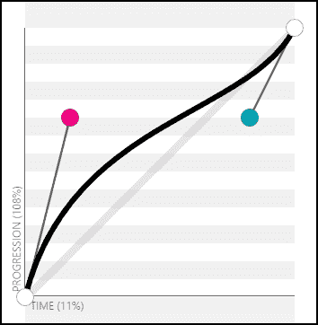
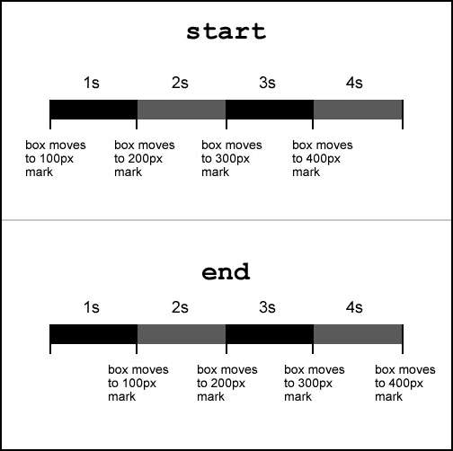
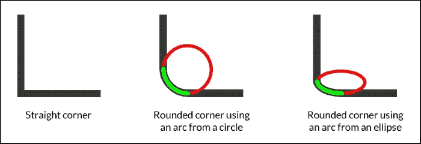
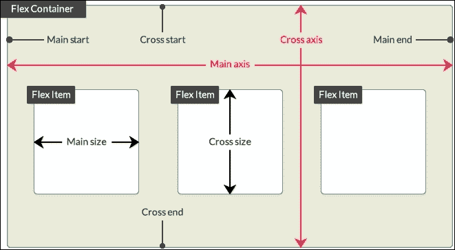

# 第四章 CSS 属性 - 第一部分

CSS 属性是标记语言（HTML、SVG、XML 等）中元素的特性，它们控制其样式和/或表现。这些特性是 W3C 不断发展的标准的一部分。

一个 CSS 属性的简单例子是`border-radius`：

```js
input {
 border-radius: 100px;
}
```

CSS 属性的数量多得令人难以置信，学习它们所有几乎是不可能的。更不用说，还有一些 CSS 属性需要供应商前缀（`-webkit-`、`-moz-`、`-ms-`等等），这使得这个方程式变得更加复杂。

供应商前缀是添加到 CSS 属性（有时也是 CSS 值）开头的简短 CSS 片段。这些代码片段直接与浏览器制造商的公司（“供应商”）或浏览器的 CSS 引擎相关。

有四个主要的 CSS 前缀：`-webkit-`、`-moz-`、`-ms-`和`-o-`。它们在这里解释：

+   `-webkit-`：这指的是 Safari 的引擎，Webkit（Google Chrome 和 Opera 过去也使用这个引擎）

+   `-moz-`：这代表 Mozilla，它是 Firefox 的创造者

+   `-ms-`：这代表 Microsoft，它是 Internet Explorer 的创造者

+   `-o-`：这代表 Opera，但仅针对旧版本的浏览器

Google Chrome 和 Opera 都支持`-webkit-`前缀。然而，这两个浏览器已经不再使用 Webkit 引擎了。它们的引擎被称为 Blink，由 Google 开发。

一个带有前缀的 CSS 属性的简单例子是`column-gap`：

```js
.column {
 -webkit-column-gap: 5px;
 -moz-column-gap: 5px;
  column-gap: 5px;
}
```

知道哪些 CSS 属性需要前缀是徒劳的。这就是为什么保持对[CanIUse.com](http://CanIUse.com)的持续关注很重要。然而，使用`Autoprefixer`或`-prefix-free`等工具自动化前缀过程，或者在预处理器中使用 mixin 等，也同样重要。

然而，供应商前缀不在本书的范围内，所以我们讨论的属性不包含任何供应商前缀。如果您想了解更多关于供应商前缀的信息，您可以访问**Mozilla 开发者网络**（**MDN**）[`tiny.cc/mdn-vendor-prefixes`](http://tiny.cc/mdn-vendor-prefixes)。

让我们开始滚动 CSS 属性的参考。

# 动画

与需要第三方应用程序和插件的 Flash 旧时代不同，今天我们可以仅通过 CSS 实现几乎相同的事情，具有更少的开销，更好的性能，以及更大的可扩展性。

忘记插件和第三方软件！我们需要的只是一个文本编辑器，一些想象力，以及一点耐心来理解 CSS 带来的动画概念。

## 基础标记和 CSS

在我们深入所有动画属性之前，我们将使用以下标记和动画结构作为我们的基础：

**HTML**：

```js
<div class="element"></div>
```

**CSS**:

```js
.element {    
  width: 300px;
  height: 300px;
}
@keyframes fadingColors {
  0% {
    background: red;
  }
  100% {
    background: black;
  }
}
```

在示例中，我们只会看到`.element`规则，因为 HTML 和`@keyframes fadingColors`将保持不变。

### 小贴士

`@keyframes` 声明块是一个可以应用于任何元素的定制动画。当应用时，元素的背景将从红色变为黑色。

好的，让我们来做这个。

### animation-name

`animation-name` CSS 属性是我们想要执行的 `@keyframes` at 规则的名称，它看起来是这样的：

```js
animation-name: fadingColors;
```

#### 描述

在 HTML 和 CSS 基础示例中，我们的 `@keyframes` at 规则有一个动画，背景颜色从红色变为黑色。那个动画的名字是 `fadingColors`。

因此，我们可以这样调用动画：

**CSS**:

```js
.element {    
  width: 300px;
  height: 300px;
 animation-name: fadingColors;
}
```

这是一个使用长语的合法规则。显然，它没有任何问题。问题是，除非我们添加 `animation-duration`，否则动画不会运行。

### animation-duration

`animation-duration` CSS 属性定义了动画完成一个周期所需的时间，它看起来是这样的：

```js
animation-duration: 2s;
```

#### 描述

我们可以指定单位，使用 `s` 表示秒或使用 `ms` 表示毫秒。指定一个单位是必需的。指定 `0s` 的值意味着动画实际上永远不会运行。

然而，由于我们确实想让动画运行，我们这样做：

**CSS**:

```js
.element {
  width: 300px;
  height: 300px;
  animation-name: fadingColors;
 animation-duration: 2s;
}
```

如前所述，这将使一个盒子在 `2` 秒内从其红色背景变为黑色，然后停止。

### animation-iteration-count

`animation-iteration-count` CSS 属性定义了动画应该播放的次数，它看起来是这样的：

```js
animation-iteration-count: infinite;
```

#### 描述

这里有两个值：`infinite` 和一个 *数字*，例如 `1`、`3` 或 `0.5`。不允许使用负数。

将以下代码添加到前面的示例中：

**CSS**:

```js
.element {
  width: 300px;
  height: 300px;
  animation-name: fadingColors;
  animation-duration: 2s;
 animation-iteration-count: infinite;
}
```

这将使一个盒子从其红色背景变为黑色，然后再次从红色背景开始，并再次变为黑色，无限循环。

### animation-direction

`animation-direction` CSS 属性定义了动画在周期之后应该播放的方向，它看起来是这样的：

```js
animation-direction: alternate;
```

#### 描述

有四个值：`normal`、`reverse`、`alternate` 和 `alternate-reverse`。

+   `normal`：这使得动画向前播放。这是默认值。

+   `reverse`：这使得动画向后播放。

+   `alternate`：这使得动画在第一个周期中向前播放，然后在下一个周期中向后播放，然后再向前播放，以此类推。此外，时间函数也会受到影响，所以如果我们有 `ease-out`，当反向播放时，它会被 `ease-in` 替换。

    我们将在一分钟内查看这些时间函数。

+   `alternate-reverse`：这与 `alternate` 相同，但动画从结束处开始向后播放。

在我们当前的例子中，我们有一个连续的动画。然而，当从黑色（动画的结束）变为红色（动画的开始）时，背景颜色有一个“硬停止”。

让我们创建一个更“流畅”的动画，通过让黑色背景淡入红色，然后红色再淡入黑色，没有任何硬停止。基本上，我们正在尝试创建一个“脉冲”效果：

**CSS**:

```js
.element {    
  width: 300px;
  height: 300px;
  animation-name: fadingColors;
  animation-duration: 2s;
  animation-iteration-count: infinite;
 animation-direction: alternate;
}
```

### animation-delay

`animation-delay` CSS 属性允许我们定义动画应该何时开始。这意味着一旦动画被应用到元素上，它将在开始运行之前遵守延迟。

它看起来像这样：

```js
animation-delay: 3s;
```

#### 描述

我们可以使用 `s` 表示秒或使用 `ms` 表示毫秒来指定单位。指定单位是必需的。

允许使用负值。请考虑使用负值意味着动画应该立即开始，但它将在动画中开始时处于中间位置，持续时间为负值的相反时间。

谨慎使用负值。

**CSS**:

```js
.element {    
  width: 300px;
  height: 300px;
  animation-name: fadingColors;
  animation-duration: 2s;
  animation-iteration-count: infinite;
  animation-direction: alternate;
 animation-delay: 3s;
}
```

这将使动画在 3 秒后开始。

### animation-fill-mode

`animation-fill-mode` CSS 属性定义了在动画执行时间之外应用于元素的哪些值。基本上，是在动画执行时间之外。

它看起来像这样：

```js
animation-fill-mode: none;
```

#### 描述

有四个值：`none`、`forwards`、`backwards` 和 `both`。

+   `none`：在动画前后不应用任何样式。

+   `forwards`：动画元素将保留最后一个关键帧的样式。这是最常用的值。

+   `backwards`：动画元素将保留第一个关键帧的样式，并且在 `animation-delay` 期间这些样式将保持不变。这可能是最不常用的值。

+   `both`：动画元素在开始动画之前将保留第一个关键帧的样式，在动画完成后将保留最后一个关键帧的样式。在许多情况下，这几乎与使用 `forwards` 相同。

之前的属性更适合用于有结束和停止的动画。在我们的例子中，我们使用的是淡入/脉冲动画，所以最好的属性是 `none`。

**CSS**:

```js
.element {
  width: 300px;
  height: 300px;
  animation-name: fadingColors;
  animation-duration: 2s;
  animation-iteration-count: infinite;
  animation-direction: alternate;
  animation-delay: 3s;
 animation-fill-mode: none;
}
```

### animation-play-state

`animation-play-state` CSS 属性定义了动画是正在运行还是暂停，看起来像这样：

```js
animation-play-state: running;
```

#### 描述

有两个值：`running` 和 `paused`。这些值是自我解释的。

**CSS**:

```js
.element {    
  width: 300px;
  height: 300px;
  animation-name: fadingColors;
  animation-duration: 2s;
  animation-iteration-count: infinite;
  animation-direction: alternate;
  animation-delay: 3s;
  animation-fill-mode: none;
 animation-play-state: running;
}
```

在这种情况下，将 `animation-play-state` 定义为 `running` 是多余的，但我列出它是为了举例。

### animation-timing-function

`animation-timing-function` CSS 属性定义了动画在其周期中速度应该如何进展，看起来像这样：

```js
animation-timing-function: ease-out;
```

对于 **Bézier** 曲线（我们将在下一分钟看到 Bézier 曲线是什么），有五个预定义的值，也称为缓动函数：`ease`、`ease-in`、`ease-out`、`ease-in-out` 和 `linear`。

#### ease

`ease` 函数在开始时急剧加速，并在周期中间开始减速，看起来像这样：

```js
animation-timing-function: ease;
```

#### ease-in

`ease-in` 函数开始缓慢加速，直到动画突然结束，看起来像这样：

```js
animation-timing-function: ease-in;
```

#### ease-out

`ease-out` 函数开始迅速，并逐渐减速到结束，看起来像这样：

```js
animation-timing-function: ease-out;
```

#### ease-in-out

`ease-in-out` 函数开始时速度较慢，在周期中间变得很快。然后它开始减速，直到周期结束。它看起来是这样的：

```js
animation-timing-function:ease-in-out;
```

#### 线性

`linear` 函数具有恒定的速度。不会发生任何类型的加速度。它看起来是这样的：

```js
animation-timing-function: linear;
```

现在，缓动函数建立在名为贝塞尔曲线的曲线上，可以使用 `cubic-bezier()` 函数或 `steps()` 函数调用。

#### cubic-bezier()

`cubic-bezier()` 函数允许我们创建自定义的加速度曲线。大多数用例都可以从我们刚才提到的已定义的缓动函数（`ease`, `ease-in`, `ease-out`, `ease-in-out` 和 `linear`）中受益，但如果你愿意尝试新事物，`cubic-bezier()` 是你的最佳选择。

这就是贝塞尔曲线的样子：



##### 参数

`cubic-bezier()` 函数接受四个参数，如下所示：

```js
animation-timing-function: cubic-bezier(x1, y1, x2, y2);
```

X 和 Y 代表 *x* 和 *y* 轴。每个轴后面的数字 `1` 和 `2` 代表控制点。`1` 代表从左下角开始的控制点，而 `2` 代表右上角的控制点。

##### 描述

让我们用 `cubic-bezier()` 函数来表示所有五个预定义的缓动函数：

+   `ease`: `animation-timing-function: cubic-bezier(.25, .1, .25, 1);`

+   `ease-in`: `animation-timing-function: cubic-bezier(.42, 0, 1, 1);`

+   `ease-out`: `animation-timing-function: cubic-bezier(0, 0, .58, 1);`

+   `ease-in-out`: `animation-timing-function: cubic-bezier(.42, 0, .58, 1);`

+   线性: `animation-timing-function: cubic-bezier(0, 0, 1, 1);`

我不确定你是否和我一样，但我更喜欢使用预定义的值。

现在，我们可以开始调整和测试每个值到小数点后，保存它，并等待实时刷新完成其工作。然而，如果你问我，这太浪费时间了去测试。

### 小贴士

惊人的 Lea Verou 创建了最好的用于处理贝塞尔曲线的 Web 应用程序。你可以在 [cubic-bezier.com](http://cubic-bezier.com) 找到它。这是处理贝塞尔曲线最简单的方法。我强烈推荐这个工具。

之前展示的贝塞尔曲线图像来自 [cubic-bezier.com](http://cubic-bezier.com) 网站。

让我们在我们的例子中添加 `animation-timing-function`：

**CSS**:

```js
.element {    
  width: 300px;
  height: 300px;
  animation-name: fadingColors;
  animation-duration: 2s;
  animation-iteration-count: infinite;
  animation-direction: alternate;
  animation-delay: 3s;
  animation-fill-mode: none;
  animation-play-state: running;
 animation-timing-function: ease-out;
}
```

#### steps()

`steps()` 时间函数并不非常常用，但如果你对 CSS 动画感兴趣，了解它是如何工作的则是必须的。

它看起来是这样的：

```js
animation-timing-function: steps(6);
```

当我们想要动画执行一个定义的步骤数时，这个函数非常有用。

在我们的当前例子中添加 `steps()` 函数后，它看起来是这样的：

**CSS**:

```js
.element {    
  width: 300px;
  height: 300px;
  animation-name: fadingColors;
  animation-duration: 2s;
  animation-iteration-count: infinite;
  animation-direction: alternate;
  animation-delay: 3s;
  animation-fill-mode: none;
  animation-play-state: running;
 animation-timing-function: steps(6);
}
```

这使得盒子从红色淡出到黑色，反之亦然，需要六个步骤。

##### 参数

我们可以使用 `steps()` 函数的两个可选参数：`start` 和 `end`。

+   `start`: 这将使动画在每个步骤的开始运行。这将使动画立即开始。

+   `end`: 这将使动画在每个步骤的末尾运行。如果没有声明任何内容，这是默认值。这将在动画开始前给予一个短暂的延迟。

##### 描述

在我们的当前示例中添加 `steps()` 函数后，它看起来是这样的：

**CSS**:

```js
.element {
  width: 300px;
  height: 300px;
  animation-name: fadingColors;
  animation-duration: 2s;
  animation-iteration-count: infinite;
  animation-direction: alternate;
  animation-delay: 3s;
  animation-fill-mode: none;
  animation-play-state: running;
 animation-timing-function: steps(6, start);
}
```

承认，当我们添加 `steps()` 函数时，示例中的脉冲效果并不太明显。然而，你可以在 Louis Lazarus 的这个笔上更清楚地看到它，当鼠标悬停在盒子上时，在 [`tiny.cc/steps-timing-function`](http://tiny.cc/steps-timing-function)

这是一张来自 Stephen Greig 在 *Smashing Magazine* 文章中的图片，解释了 `steps()` 函数中的 `start` 和 `end`：



此外，`steps()` 函数有两个预定义值：`step-start` 和 `step-end`。

+   `step-start`：这与 `steps(1, start)` 相同。这意味着每次变化都发生在每个间隔的开始。

+   `step-end`：这与 `steps(1, end)` 相同。这意味着每次变化都发生在每个间隔的末尾。

**CSS**:

```js
.element {
  width: 300px;
  height: 300px;
  animation-name: fadingColors;
  animation-duration: 2s;
  animation-iteration-count: infinite;
  animation-direction: alternate;
  animation-delay: 3s;
  animation-fill-mode: none;
  animation-play-state: running;
 animation-timing-function: step-end;
}
```

### animation

`animation` CSS 属性是 `animation-name`、`animation-duration`、`animation-timing-function`、`animation-delay`、`animation-iteration-count`、`animation-direction`、`animation-fill-mode` 和 `animation-play-state` 的简写。

它看起来是这样的：

```js
animation: fadingColors 2s;
```

#### 描述

要使简单的动画工作，我们需要至少两个属性：`animation-name` 和 `animation-duration`。

如果你觉得所有这些属性让你感到不知所措，放松一下。让我帮你简单分解它们。

使用 `animation` 长格式，代码将如下所示：

**CSS**:

```js
.element {    
  width: 300px;
  height: 300px;
 animation-name: fadingColors;
 animation-duration: 2s;
}
```

使用 `animation` 简写，这是推荐的语法，代码将如下所示：

**CSS**:

```js
.element {    
  width: 300px;
  height: 300px;
 animation: fadingColors 2s;
}
```

这将使一个盒子在 2 秒内从红色背景变为黑色，然后停止。

## 最终 CSS 代码

让我们看看所有动画属性在一个最终的示例中是如何表现的，这个示例展示了长格式和简写样式。

### 长格式

```js
.element {
  width: 300px;
  height: 300px;
  animation-name: fadingColors;
  animation-duration: 2s;
  animation-iteration-count: infinite;
  animation-direction: alternate;
  animation-delay: 3s;
  animation-fill-mode: none;
  animation-play-state: running;
  animation-timing-function: ease-out;
}
```

### 简写样式

```js
.element {
  width: 300px;
  height: 300px;
  animation: fadingColors 2s infinite alternate 3s none running ease-out; 
}
```

### 小贴士

`animation-duration` 属性将始终首先考虑，而不是 `animation-delay`。所有其他属性可以在声明中按任何顺序出现。

这里是一个在 **CodePen** 上的演示：[`tiny.cc/animation`](http://tiny.cc/animation)

# 背景

CSS 背景属性处理 HTML 元素上的背景效果显示。

## background-attachment

`background-attachment` CSS 属性定义了元素的背景相对于其包含父元素如何滚动，它看起来是这样的：

```js
background-attachment: fixed;
```

### 描述

有三个值：`scroll`、`fixed` 和 `local`。

+   `scroll`：背景在其容器内不移动

+   `fixed`：背景始终固定在视口中，不受任何影响

+   `local`：背景在其容器和视口中滚动

**CSS**:

```js
.scroll {
  background-attachment: scroll;
}
.fixed {
  background-attachment: fixed;
}
.local {
  background-attachment: local;
}
```

这里是一个在 CodePen 上的演示：[`tiny.cc/css-background`](http://tiny.cc/css-background)

## background-blend-mode

`background-blend-mode` CSS 属性指定了元素的背景图像应该如何与其背景颜色混合，它看起来是这样的：

```js
background-blend-mode: multiply;
```

### 描述

有 18 种可能的混合模式值：

+   `color`: 顶部颜色的色调和饱和度占主导地位，但底部颜色的亮度被添加。灰度级别被保留。

+   `color-burn`: 最终颜色是通过取底部颜色并取反，将值除以顶部颜色，然后取反该值得到的。

+   `color-dodge`: 最终颜色是除以顶部颜色的倒数得到的底部颜色。

+   `darken`: 最终颜色是每个通道中每个颜色最暗值的组合。

+   `difference`: 最终颜色是通过从背景图像和背景颜色的较亮颜色中减去较暗颜色得到的。

+   `exclusion`: 结果类似于 `difference`，但对比度较低。

+   `hard-light`: 如果底部颜色较暗，则结果是 `multiply`。然而，如果底部颜色较亮，则结果是 `screen`。

+   `hue`: 取顶部颜色的色调，以及底部颜色的饱和度和亮度。

+   `inherit`: 最终颜色继承其父容器的混合模式。

+   `initial`: 这是默认值，没有任何混合。

+   `lighten`: 结果是每个通道中每个颜色的最亮值。

+   `luminosity`: 结果是顶部颜色的亮度，以及底部颜色的色调和饱和度。

+   `multiply`: 乘以顶部和底部颜色。这与在半透明胶片上打印颜色并将它们一层层叠放的效果相同。

+   `normal`: 最终颜色是顶部的颜色，无论其下是什么颜色。

+   `overlay`: 如果底部颜色较暗，则最终颜色为 `multiply`。如果底部颜色较亮，则为 `screen`。

+   `saturation`: 最终颜色是顶部颜色的饱和度加上底部颜色的色调和亮度。

+   `screen`: 对顶部和底部颜色取反，相乘，然后取反最终颜色。

+   `soft-light`: 与 `hard-light` 属性相同，但更柔和，就像将散射光指向最终颜色。

在以下示例中，我们将声明两个背景，一个图像和一个颜色，然后对它们应用混合模式：

**CSS 长格式**:

```js
.element {
  width: 500px;
  height: 500px;
  background-image: url('../images/image.jpg');
  background-color: red;
 background-blend-mode: multiply;
}
```

**CSS 短格式**:

```js
.element {
  width: 500px;
  height: 500px;
  background-image: url(../images/image.jpg) red;
 background-blend-mode: multiply;
}
```

### 小贴士

注意，在第二个示例中，图像的路径不在引号内。单引号 `''` 或双引号 `""` 是可选的。

CSS-Tricks 有一个很好的 Pen 展示了所有这些混合模式。然而，我对其进行了改进。

所以，查看所有混合模式的 CodePen 示例 [`tiny.cc/background-blend-mode`](http://tiny.cc/background-blend-mode)

## background-clip

`background-clip` CSS 属性有助于定义元素背景是否延伸到其边框下方，其外观如下：

```js
background-clip: border-box;
```

### 描述

有四个值：`inherit`、`border-box`、`padding-box` 和 `content-box`。

#### 继承

这取自其父元素的值。

#### border-box

这使得背景覆盖整个容器，包括边框。

#### padding-box

这使得背景只延伸到边框开始的地方。

#### content-box

它的工作方式类似于 `border-box`，但它将考虑任何填充，从而在边框和背景之间创建一个间隙。

**CSS**：

```js
.element {
  background-clip: border-box;
}
```

这里是一个在 CodePen 上的演示：[`tiny.cc/background-clip`](http://tiny.cc/background-clip)

## background-color

`background-color` CSS 属性定义了元素的实心背景颜色，其外观如下：

```js
background-color: red;
```

### 描述

此外，`transparent` 在 CSS 中实际上是一种颜色。

### 提示

如果我们想要设置渐变背景颜色，我们必须使用 `background-image` 属性。这是因为渐变实际上是图像。

颜色值可以使用以下任何一种方法定义：

+   命名颜色

+   十六进制

+   RGB 和 RGBa

+   HSL 和 HSLa

**CSS**：

```js
/*Named Color*/
.element {
  background-color: red;
}
/*HEX*/
.element {
  background-color: #f00;
}
/*RGB*/
.element {
  background-color: rgb(255,0,0);
}
/*RGBa*/
.element {
  /*Background has 50% opacity*/
  background-color: rgba(255, 0, 0, .5);
}
/*HSL*/
.element {
  background-color: hsl(0, 100%, 50%);
}
/*HSLa*/
.element {
  /*Background has 50% opacity*/
  background-color: hsla(0, 100%, 50%, .5);
}
```

## background-image

`background-image` CSS 属性在元素的背景中设置图像或渐变，其外观如下：

```js
background-image: url(../images/background.jpg);
```

或者，它也可以是这样的：

```js
background-image: linear-gradient(red, orange);
```

### 描述

此属性支持 JPG、PNG、GIF、SVG 和 WebP 图像格式。

我们也可以使用 `none` 值来声明图像的缺失。

一个元素也可以在单个声明中使用多个背景图像。

当涉及到渐变时，有两种样式：**线性**和**径向**。

#### 线性

它的语法是 `linear-gradient`。这些渐变可以垂直、水平或对角延伸。

#### 径向

它的语法是 `radial-gradient`。这些渐变本质上是圆形的，默认情况下，它们将适应元素的尺寸。例如，如果元素是一个完美的正方形，它将创建一个完美的圆形径向渐变。然而，如果元素是一个矩形，那么径向渐变将看起来像一个椭圆形。

我们可以在渐变中添加我们想要的或需要的任意多的颜色。除非这是绝对必要的，否则我建议您避免这样做，因为它可能会对浏览器性能产生负面影响。

此外，为了让我们对渐变有更多的控制，我们可以定义渐变颜色的停止位置，以便下一个颜色可以开始。这被称为**颜色停止**。颜色停止可以用像素或百分比定义。百分比更常用，因为它的相对性质有助于保持渐变的完整性和比例。

**CSS**：

```js
/*Graphic file*/
.element {
  background-image: url(../images/bg-texture.jpg);
}
/*Multiple images*/
.element {
  background-image:
    url(../images/bg-icon.svg),
    url(../images/bg-texture.jpg);
}
/*Linear gradient*/
.element {
  background-image: linear-gradient(red, orange);
}
/*Linear Gradient with color stops*/
.element {
  background-image: linear-gradient(red 40px, orange 25%, green);
}
/*Radial gradient*/
.element {
  background-image: radial-gradient(red, orange);
}
/*Radial gradient with color stops*/
.element {
  background-image: radial-gradient(red 40px, orange 25%, green);
}
```

## background-origin

`background-origin` CSS 属性定义了背景如何在元素内部渲染，其外观如下：

```js
background-origin: border-box;
```

### 描述

此属性的工作方式与 `background-clip` CSS 属性类似，但与 `background-origin` 不同的是，背景是缩放而不是裁剪。

有四个值：`border-box`、`padding-box`、`content-box` 和 `inherit`。

+   `border-box`：背景延伸到容器的边缘，但在边框下方

+   `padding-box`：背景延伸到与边框边缘对齐

+   `content-box`：背景在内容框内渲染

+   `inherit`：这是默认值

**CSS**：

```js
.element {
  background-origin: border-box;
}
```

这里是一个在 CodePen 上的演示：[`tiny.cc/background-origin`](http://tiny.cc/background-origin)

### background-position

`background-position` CSS 属性允许我们在其父容器内放置背景（图像或渐变），其外观如下：

```js
background-position: 10px 50%;
```

#### 描述

我们可以使用三种不同类型的价值：预定义的 *关键词*，*百分比*，和 *长度*。

#### 预定义关键词

值如 `left`, `right`, `top`, 和 `bottom` 是预定义的关键词。

#### 百分比

值如 `5%` 和 `80%`.

#### 长度

值如 `15px` `130px`.

此属性需要您声明两个值：第一个值与 *x* 轴（水平）相关，第二个值与 *y* 轴（垂直）相关。

默认值是 `0 0`；这与 `left top` 完全相同。

**CSS**:

```js
/*Default values*/
.element {
  background-position: 0 0;
}
/*Keyword values*/
.element {
  background-position: right bottom;
}
/*Percentages values*/
.element {
  background-position: 5% 80%;
}
/*Length values*/
.element {
  background-position: 15px 130px;
}
```

这里是一个在 CodePen 上的演示：[`tiny.cc/background-position`](http://tiny.cc/background-position)

### background-repeat

`background-repeat` CSS 属性有两个功能：

1.  定义背景图像是否重复

1.  确定背景图像的重复方式

它看起来像这样：

```js
background-repeat: no-repeat;
```

或者，它也可能看起来像这样：

```js
background-repeat-x: repeat;
```

#### 描述

此属性仅在 `background-image` 已声明时才有效。

有四个值：`repeat`, `repeat-x`, `repeat-y`, 和 `no-repeat`.

+   `repeat`: 背景图像将在 *x* 和 *y* 轴上重复。这将完全填充容器。这是默认值。

+   `repeat-x`: 背景图像将在 *x* 轴上重复，因此，水平方向上。

+   `repeat-y`: 背景图像将在 *y* 轴上重复，因此，垂直方向上。

+   `no-repeat`: 背景图像不会重复，并且只会显示一个实例。

**CSS**:

```js
/*Default value*/
.repeat { background-repeat: repeat; }
/*Repeat horizontally*/
.repeat-x { background-repeat: repeat-x; }
/*Repeat vertically*/
.repeat-y { background-repeat: repeat-y; }
/*No repeat*/
.no-repeat { background-repeat: no-repeat; }
```

这里是一个在 CodePen 上的演示：[`tiny.cc/background-repeat`](http://tiny.cc/background-repeat)

### background-size

`background-size` CSS 属性定义了背景图像的大小，其外观如下：

```js
background-size: contain;
```

#### 描述

有五个值：一个 *长度* 值，一个 *百分比* 值，`auto`，`contain`，和 `cover`。

#### 长度值

这是我们使用以下单位之一时：`px`, `em`, `in`, `mm`, `cm`, `vw`, 等等。

#### 百分比值

这是我们使用百分比如 `50%`, `85%`, 等等情况。

#### auto

此值在相应的方向（水平或垂直）上缩放图像，以保持其宽高比，不变形。

#### contain

此值确保图像可以完全在其父容器内看到。图像的边缘不会溢出；它是“包含”的。

#### cover

此值缩放图像并取最长的维度（水平或垂直）。它确保图像完全覆盖该维度。如果容器和图像有不同的宽高比，则可能会发生溢出。

当声明背景的大小，我们可以使用一个或两个值。第一个值是 *宽度*，第二个值是背景图像的 *高度*。

使用一个值意味着第二个值设置为 `auto`。当使用两个值时，我们定义背景图像的 `width` 和 `height` 值。

我们可以使用我们想要的任何度量单位。像素、百分比和`auto`值是最常用的。

我们甚至可以在同一个容器中组合多个图像。背景缩写属性是处理这种情况的最佳方式。

**CSS**:

```js
.contain {
  background-size: contain;
}
.cover {
  background-size: cover;
}
.auto {
  background-size: auto;
}
.multiple {
  background-image: 
    url(../images/image-1.jpg),
    url(../images/image-2.jpg);
  background-size: 150px 100px, cover;
}
```

这里是一个在 CodePen 上的演示：[`tiny.cc/background-size`](http://tiny.cc/background-size)

### 背景

`background` CSS 属性是一个缩写，我们可以列出所有背景值。

我经常看到许多开发者编写长格式来声明单个值，例如颜色。以下是一个例子：

```js
background-color: red;
```

虽然这完全没问题，但我更喜欢为几乎所有事情使用缩写版本：

```js
background: red;
```

这更易于扩展，因为如果我们需要添加任何其他值，我们只需要将新值添加到这个声明中，而不是单独编写一个。然而，最终，这还是取决于个人风格。

**CSS**:

```js
/*BG color*/
.element { background: red; }
/*BG color and image*/
.element { background: url(../images/bg.png) red; }
/*BG color, image and position*/
.element { background: url(../images/bg.png) 50% 50% red; }
/*BG color, image, position and do not repeat*/
.element { background: url(../images/bg.png) 50% 50% red no-repeat; }
/*BG color, image, position, do not repeat and size*/
.element { background: url(../images/bg.png) 50% 50% / contain red no-repeat; }
/*BG color, image, position, do not repeat, size and clip*/
.element { background: url(../images/bg.png) 50% 50% / contain red no-repeat content-box; }
/*BG color, image, position, do not repeat, size, clip and attachment*/
.element { background: url(../images/bg.png) 50% 50% / contain red no-repeat content-box fixed; }
```

# 盒模型

在网络中，每个元素都是一个正方形，因此它具有固有的特性：宽度、高度、填充、边框和边距。所有这些特性加在一起，构成了盒模型。

不可一世的盒模型是 CSS 行业中最常讨论的主题之一，因为 IE6 和 IE7 在当年是最受欢迎的浏览器。然而，它们在解释这个简单的 CSS 概念上存在重大问题。这意味着网页设计师和开发者不得不想出各种技巧来解决这个问题。至少在大多数情况下，那些日子已经过去了。

让我们继续讨论盒模型属性。

## 宽度

`width` CSS 属性指定了元素内容区域的宽度，其形式如下：

```js
width: 10px;
```

或者，它也可能看起来像这样：

```js
width: 10px 50px;
```

### 描述

内容区域位于元素的填充、边框和边距内部。

让我们讨论最常用的值和关键字：*长度值*、*百分比值*、`auto`、`max-content`、`min-content`和`fit-content`。

#### 长度值

这基本上是我们使用以下单位之一时的情况：`px`、`em`、`in`、`mm`、`cm`、`vw`等等。

#### 百分比值

这是我们使用百分比的时候，比如`50%`、`85%`等等。

#### auto

这是一个关键字值，允许浏览器选择元素的宽度。

#### max-content

这是一个关键字值，使容器宽度与其内容相匹配。

#### min-content

这是一个关键字值，根据其内容使容器尽可能小。

#### fit-content

这是一个关键字值，使容器宽度与其内容相匹配。这对于具有未知或可变宽度的容器效果很好。

你可以在 MDN 上找到更多信息：[`tiny.cc/mdn-width`](http://tiny.cc/mdn-width)

**CSS**:

```js
/*max-content*/
.element {
  width: max-content;
}
/*min-content*/
.element {
  width: min-content;
}
/*fit-content*/
.element {
  width: fit-content;
}
```

这里是一个在 CodePen 上的演示：[`tiny.cc/width`](http://tiny.cc/width)

## 高度

`height` CSS 属性指定了元素内容区域的高度，其形式如下：

```js
height: 200px;
```

### 描述

*内容区域*位于元素的填充、边框和边距内部。

最常用的值是长度值、百分比值和 `inherit`。

#### 长度值

这基本上是我们使用以下单位之一时的情况：`px`、`em`、`in`、`mm`、`cm`、`vw` 等等。

#### 百分比值

这是我们使用百分比的情况，例如 `50%`、`85%` 等等。

#### inherit

使用这个关键字，元素将继承其父容器的高度。

你可以在 MDN 上找到更多信息：[`tiny.cc/mdn-height`](http://tiny.cc/mdn-height)

**CSS**:

```js
/*Length value*/
.element {
  height: 200px;
}
/*Percentage value*/
.element {
  height: 50%;
}
/*Inherit value*/
.element {
  height: inherit;
}
```

## padding

`padding` CSS 属性在元素的内部四侧创建空间，在其内容与边缘之间，其外观如下：

```js
padding: 10px;
```

或者，它也可以是这样的：

```js
padding: 10px 15px;
```

### 描述

边框和边距在内容区域之外，并且不受填充的影响。

`padding` 属性是 `padding-top`、`padding-right`、`padding-bottom` 和 `padding-left` 的简写。我们可以使用一个、两个、三个或所有四个值。

+   **一个值**：这意味着所有四侧都有相同的值。

+   **两个值**：第一个值用于顶部和底部。第二个值用于左侧和右侧。

+   **三个值**：第一个值用于顶部。第二个值用于左侧和右侧。第三个值用于底部。

+   **四个值**：第一个值用于顶部。第二个是用于右侧。第三个是用于底部。第四个是用于左侧。

不允许使用负值。

**CSS**:

```js
/*Shorthand, ONE value: all four sides have the same padding*/
.element { padding: 10px; }
/*Shorthand, TWO values: Top & Bottom - Left & Right*/
.element { padding: 10px 15px; }
/*Shorthand, THREE values: Top - Left & Right - Bottom*/
.element { padding: 10px 15px 20px; }
/*Shorthand, FOUR values: Top - Right - Bottom - Left*/
.element { padding: 10px 15px 20px 25px; }
/*Longhand, all values. They can go in any order*/
.element {
  padding-top: 10px;
  padding-right: 15px;
  padding-bottom: 20px;
  padding-left: 25px;
}
```

## margin

`margin` CSS 属性定义了一个元素的一侧、两侧、三侧或所有四侧的外部空间，其外观如下：

```js
margin: 10px;
```

或者，它也可以是这样的：

```js
margin: 10px 15px;
```

### 描述

`margin` 属性是 `margin-top`、`margin-right`、`margin-bottom` 和 `margin-left` 的简写。就像 `padding` 一样，我们可以使用一个、两个、三个或所有四个值。

+   **一个值**：这意味着所有四侧都有相同的填充。

+   **两个值**：第一个值用于顶部和底部。第二个值用于左侧和右侧。

+   **三个值**：第一个值用于顶部。第二个值用于左侧和右侧。第三个值用于底部。

+   **四个值**：第一个值用于顶部。第二个值用于右侧。第三个值用于底部。第四个值用于左侧。

允许使用负值。

**CSS**:

```js
/*Shorthand, ONE value: all four sides have the same padding*/
.element { margin: 10px; }
/*Shorthand, TWO values: Top & Bottom - Left & Right*/
.element { margin: 10px 15px; }
/*Shorthand, THREE values: Top - Left & Right - Bottom*/
.element { margin: 10px 15px 20px; }
/*Shorthand, FOUR values: Top - Right - Bottom - Left*/
.element { margin: 10px 15px 20px 25px; }
/*Longhand, all values. They 1can go in any order*/
.element {
  margin-top: 10px;
  margin-right: 15px;
  margin-bottom: 20px;
  margin-left: 25px;
}
```

### 边距合并

边距有一个特定的行为。如果有两个堆叠的元素具有顶部和底部边距，则边距不会相加。相反，只考虑较大的值。

例如，我们有一个 `<h1>` 标题和一个 `<p>` 段落。标题的底部边距为 `20px`，而段落的顶部边距为 `10px`。

我们的感觉立即告诉我们总边距是 `30px`，但实际上，因为垂直边距会合并，只有最大的值会被考虑，在这种情况下，是 `20px`。

原因在于，许多元素，如我们示例中的标题和段落，都有顶部和底部边距。因此，合并边距允许内容和布局保持一致性，避免在堆叠元素之间创建不希望的多余空间。

这也很好，因为它节省了我们为每个具有顶部和底部边距的堆叠元素“抵消”边距的精力，再次避免创建那些额外空间。

我认为，合并边距是 CSS 边距属性的一个编辑功能。我希望前面的解释有助于理解这种行为。

这里是一个 CodePen 上的演示：[`tiny.cc/collapsing-margins`](http://tiny.cc/collapsing-margins)

## 边框

`border` CSS 属性是一个简写属性，用于定义元素的边框厚度、样式和颜色。

`border`属性及其所有姐妹属性（`border-width`、`border-style`和`border-color`）及其变体都是不言自明的，因此不需要像先前属性那样有“描述”部分。

前面的 CSS 示例将有助于阐明这些属性的使用。

### 边框宽度

这是边框的厚度。可以使用`px`或`em`声明，但`px`会产生更可控的结果。

### 边框样式

这定义了线的类型或根本不显示线。它支持以下值：`dashed`、`dotted`、`double`、`groove`、`hidden`、`inset`、`none`、`outset`、`ridge`和`solid`。

### 边框颜色

这定义了线的颜色。它支持所有颜色模式：十六进制、RGB、RGBa、HSL、HSLs 和颜色名称。

请记住，所有 HTML 元素都是正方形，因此我们可以使用`border-top-color`、`border-right-color`、`border-bottom-color`或`border-left-color`来定位元素的任何一边。

简写值中的值的顺序不影响输出。

在以下示例中，*简写语法*中的顶部规则与*长写语法*中的底部规则达到完全相同的效果：

**CSS**:

```js
/*Shorthand*/
.element-shorthand {
  border: 10px solid green;
}
/*Longhand*/
.element-longhand {
  /*Width*/
  border-top-width: 10px;
  border-right-width: 10px;
  border-bottom-width: 10px;
  border-left-width: 10px;

  /*Style*/
  border-top-style: solid;
  border-right-style: solid;
  border-bottom-style: solid;
  border-left-style: solid;

  /*Color*/
  border-top-color: green;
  border-right-color: green;
  border-bottom-color: green;
  border-left-color: green;
}
```

## 盒子模型

`box-sizing` CSS 属性允许我们通过默认方式更改浏览器理解盒子模型的方式，其语法如下：

```js
box-sizing: border-box;
```

### 描述

有两个值：`content-box`和`border-box`。

#### content-box

这是默认值。填充、边框和边距值添加到元素的最终宽度和高度。这个值很少使用，正是因为我刚才描述的行为。

#### border-box

另一方面，由于这个值改变了盒子模型，填充和边框不会添加到元素的最终宽度和高度，而只会添加到边距。

**CSS**:

```js
/*Padding, border and margin are added to the element's dimensions*/
.element {
  box-sizing: content-box;
}
/*Padding and border are not added to the element's dimensions, only margin*/
.element {
  box-sizing: border-box;
}
/*Always start your CSS with this rule*/
*, *:before, *:after {
  box-sizing: border-box;
}
```

这里是一个 CodePen 上的演示：[`tiny.cc/box-sizing`](http://tiny.cc/box-sizing)

## 最大高度

`max-height` CSS 属性定义了元素的最大的高度，其语法如下：

```js
max-height: 150px;
```

### 描述

`max-height`属性覆盖了`height`属性。不允许使用负值。

最常用的值是长度值和百分比值。

#### 长度值

这是我们使用以下单位之一的情况：`px`、`em`、`in`、`mm`、`cm`、`vw`等。

#### 百分比值

这是我们使用百分比的情况，例如`50%`、`85%`等。

您可以在 MDN 上找到更多关于 MDN 的信息，链接为[`tiny.cc/mdn-max-height`](http://tiny.cc/mdn-max-height)。

**CSS**:

```js
/*Length value*/
.element {
  height: 75px;
  /*This property overrides height*/
  max-height: 150px;
}
/*Percentage value*/
.element {
  max-height: 65%;
}
```

## max-width

`max-width` CSS 属性定义了元素的宽度最大值，它看起来是这样的：

```js
max-width: 75px;
```

### 描述

`max-width`属性覆盖了`width`属性。不允许使用负值。

最常用的值是长度值和百分比值。

#### 长度值

这是我们使用以下单位之一的情况：`px`、`em`、`in`、`mm`、`cm`、`vw`等。

#### 百分比值

这是我们使用百分比的情况，例如`50%`、`85%`等。

您可以在 MDN 上找到更多关于 MDN 的信息，链接为[`tiny.cc/mdn-max-width`](http://tiny.cc/mdn-max-width)。

**CSS**:

```js
/*Length value*/
.element {
  width: 150px;
  /*This property overrides width*/
  max-width: 75px;
}
/*Percentage value*/
.element {
  max-width: 65%;
}
```

## min-height

`min-height` CSS 属性定义了元素的最小高度，它看起来是这样的：

```js
min-height: 300px;
```

### 描述

`min-height`属性覆盖了`height`和`max-height`属性。不允许使用负值。

最常用的值是长度值和百分比值。

#### 长度值

这是我们使用以下单位之一的情况：`px`、`em`、`in`、`mm`、`cm`、`vw`等。

#### 百分比值

这是我们使用百分比的情况，例如`50%`、`85%`等。

您可以在 MDN 上找到更多关于 MDN 的信息，链接为[`tiny.cc/mdn-min-height`](http://tiny.cc/mdn-min-height)。

**CSS**:

```js
/*Length value*/
.element {
  height: 75px;
  max-height: 150px;
  /*This property overrides height and max-height*/
  min-height: 300px;
}
/*Percentage value*/
.element {
  min-height: 65%;
}
```

## min-width

`min-width` CSS 属性定义了元素的宽度最小值，它看起来是这样的：

```js
min-widht: 300px;
```

### 描述

`min-width`属性覆盖了`width`和`max-width`属性。

不允许使用负值。

最常用的值是长度值和百分比值。

#### 长度值

这是我们使用以下单位之一的情况：`px`、`em`、`in`、`mm`、`cm`、`vw`等。

#### 百分比值

这是我们使用百分比的情况，例如`50%`、`85%`等。

您可以在 MDN 上找到更多关于 MDN 的信息，链接为[`tiny.cc/mdn-min-width`](http://tiny.cc/mdn-min-width)。

**CSS**:

```js
/*Length value*/
.element {
  width: 150px;
  max-width: 75px;
  /*This property overrides width and max-width*/
  min-width: 300px;
}
/*Percentage value*/
.element {
  min-width: 65%;
}
```

## object-fit

`object-fit` CSS 属性定义了替换元素如何适应其内容框，它看起来是这样的：

```js
object-fit: cover;
```

### 描述

替换元素是一个 HTML 元素，其内容和尺寸是内在的（由元素本身定义），而不是由 CSS 或其上下文或周围环境定义。

替换元素的例子有``、`<video>`、`<audio>`、`<canvas>`、`<iframe>`、`<textarea>`、`<object>`、`<input>`、`<button>`、`<br>`和`<hr>`。

现在，替换元素最重要的特性之一是我们不能通过 CSS 使用`:before`或`:after`伪元素选择器向它们应用生成内容。

当我们想要一组缩略图具有相同的宽度和高度，但又不扭曲图像时，这个属性会很有用。然而，缩略图的图像是由用户上传的，这意味着上传的图像可以是各种尺寸和不同的宽高比。`object-fit` CSS 属性可以帮助我们在这种情况下控制缩略图。

### 提示

替换元素内部的内容默认在水平和垂直方向上居中。然而，可以使用`object-position`属性重新定位内容。

有四个关键字值：`contain`、`cover`、`fill`、`none`和`scale-down`。

#### contain

替换元素内部内容的宽高比被保留。此内容尽可能放大，直到达到其宽度和高度定义的最大尺寸。由于宽高比的保护，可能会看到一些“未填充”的元素区域。

#### 覆盖

替换元素内部内容的宽高比被保留。此内容尽可能放大，直到它完全填充或“覆盖”整个内容框。

#### 填充

替换元素内部内容的宽高比不一定被保留。这意味着当填充整个内容框时，替换元素的内容在放大或缩小过程中可能会被拉伸或缩小。

#### 无

不进行缩放。

#### 缩小

这相当于声明了`none`或`contain`。这里的想法是，浏览器将尝试确定替换元素内部内容的最大具体尺寸，以便使其适合其内容框，同时保留替换元素内部内容的宽高比。

**CSS**:

```js
img {
  width: 15em;
  height: 25em;
 object-fit: contain;
}
```

这里是一个 CodePen 上的演示：[`tiny.cc/object-fit-position`](http://tiny.cc/object-fit-position)

## object-position

`object-position` CSS 属性定义了替换元素内容的定位，其外观如下：

```js
object-position: right bottom;
```

### 描述

如对象-fit CSS 属性的提示所述，默认情况下，替换元素的 内容放置在内容框的中心，即 50% 50%。

现在，此属性的行为类似于`background-position` CSS 属性。这意味着我们可以声明一个或两个值。

值可以是`top`、`right`、`bottom`或`left`等关键字值的长度或百分比。允许使用负值。

**CSS**:

```js
img {
  width: 15em;
  height: 25em;
  object-fit: contain;
 object-position: right bottom;
}
```

这里是一个 CodePen 上的演示：[`tiny.cc/object-fit-position`](http://tiny.cc/object-fit-position)

# 边框半径

使用此属性，我们不仅可以制作圆角，还可以制作圆形、椭圆形和其他有趣的形状。

我承认“圆角”这个术语比“边框半径”要少一些晦涩。

## border-radius

`border-radius` CSS 属性允许我们在几乎任何 HTML 元素上制作圆角，其外观如下：

```js
border-radius: 20px;
```

### 描述

`border-radius`属性也是`border-top-left-radius`、`border-top-right-radius`、`border-bottom-right-radius`和`border-bottom-left-radius`属性的简写语法。

使用圆形或椭圆形，我们可以创建圆角：



有两个值：一个*长度*值和一个*百分比*值。

#### 长度值

这时我们会使用以下单位之一：`px`、`em`、`in`、`mm`、`cm`、`vw`等等。

#### 百分比值

这时我们会使用百分比，如`50%`、`85%`等等。

我们可以在同一个声明中使用一个、两个、三个或四个值。我们还可以使用斜杠符号"`/`"来分隔值组。

### 小贴士

有时，某些浏览器的背景颜色或纹理会“溢出”到圆角上。使用`background-clip`来解决这个问题。

**CSS**:

```js
/*Longhand*/
.element {
  border-top-left-radius: 20px;
  border-top-right-radius: 20px;
  border-bottom-right-radius: 20px;
  border-bottom-left-radius: 20px;
}
/*Shorthand*/
.element { border-radius: 20px; }
/*Two values: top-left-and-bottom-right - top-right-and-bottom-left*/
.element-1 { border-radius: 70px 7px; }
/*Three values: top-left - top-right-and-bottom-left - bottom-right*/
.element-2 { border-radius: 70px 7px 20px; }
/*Four values: top-left - top-right - bottom-right - bottom-left*/
.element-3 { border-radius: 70px 7px 20px 150px; }
/*Values divided with a slash "/" symbol */
.element-4 { border-radius: 70px 7px/20px 30px; }
/*Circle*/
.element-5 { border-radius: 200px; }
/*Ellipse*/
.element-6 { height: 100px; border-radius: 100%; }
/*Pill*/
.element-7 { height: 100px; border-radius: 100px; }
/*Half Pill: top-left - top-right - bottom-right - bottom-left*/
.element-8 { height: 100px; border-radius: 100px 0 0 100px; }
```

这里是一个 CodePen 中的演示：[`tiny.cc/css-border-radius`](http://tiny.cc/css-border-radius)

# 单位

CSS 单位是一种数据类型，我们可以用它来定义测量值，它看起来像这样：

```js
max-height: 150px;
```

或者，它也可以这样：

```js
transform: rotate(45deg);
```

数字和单位之间没有空格。

在大多数情况下，数字`0`（零）后面不需要单位。

如下所述，有几种长度单位类型。

## 相对长度单位

它们依赖于另一个元素的长度（通常是一个 DOM 中的父元素）与所讨论的元素直接相关。当其他元素的长度发生变化时，所讨论的元素的长度保持定义的比例。换句话说，没有必要再次声明子元素的长度。

### 描述

如果我们想要构建可伸缩的系统，相对单位总是最好的选择。在单个元素中设置值，然后修改该单个元素以影响整个系统可以节省大量时间和许多麻烦。

#### ex

`ex`后缀代表一个元素的 x-height。`ex` CSS 单位指的是小写字母*x*的高度。这个高度取决于字体。换句话说，如果我们使用 Arial 而不是使用 Verdana，即使值相同，高度也可能不同。

**CSS**:

```js
.element {
  padding: 2ex;
}
```

#### ch

`ch`后缀代表字符。`ch` CSS 单位指的是字符`0`（零）的宽度。这个宽度取决于字体。换句话说，如果我们使用 Arial 而不是使用 Verdana，即使值相同，宽度也可能不同。

**CSS**:

```js
.element {
  padding: 2ch;
}
```

#### em

`em`后缀代表字母*m*的发音，它代表了印刷和排版行业中小写*m*的宽度。在 CSS 中，`em`单位代表一个元素的`font-size`属性的计算。

这个单位可以与许多 CSS 属性一起使用，但最常见的使用是定义`font-size`元素。

然而，许多网页设计师和开发者更喜欢使用`rem`单位来避免`em`单位在嵌套元素（3-4 或更多级别）中存在的继承问题。

**CSS**:

```js
.element {
  font: 1.5em Arial, Helvetica, san-serif;
}
```

#### rem

`rem` 后缀表示术语 *根元素* 的缩写。`rem` CSS 单位表示标记文档中根元素的字体大小。标记文档不仅是一个 HTML 文档；它还可以是 XML、SVG 或其他基于标记的文档。

在本指南中，我们指的是 HTML 文档，既然如此，根元素就是 `<html>` 元素。

一种非常常见的做法是将 `<html>` 元素的字体大小设置为 `62.5%`。这样，当我们为其他元素设置字体大小时，我们仍然可以以像素为单位思考，但用 `rem` 单位来保持相对字体大小，以便在响应式项目中放大或缩小文档。

**CSS**:

```js
html {
  font-size: 62.5%;
}
h1 {
  /*It's the same as 22px*/
  font-size: 2.2rem;
}
```

#### 百分比符号

`%` 符号就是它所暗示的，百分比。在 CSS 中，`em` 单位和百分比单位会产生相同的结果。百分比值，如其他相对单位一样，依赖于另一个值，通常是父元素的值。

与所有其他相对单位一样，百分比和响应式网页设计是相辅相成的。

**CSS**:

```js
.element {
  margin: 0 1%;
}
```

## 视口相对长度单位

这些单位与视口相关。如果视口的尺寸发生变化，使用视口相对长度值的属性将适应视窗的新尺寸。

### 描述

这些单位对我来说是救星。它们在响应式世界中实现了我们对字体所期望的功能：根据视口的宽度或高度放大或缩小。

让我们来了解一下。

#### vh

`vh` 后缀表示 *视口高度*。`vh` CSS 单位与视口的高度相关。`vh` 的值是视口高度的 1/100。

例如，如果我们将一个元素的 `font-size` 声明为 `1vh`，而浏览器窗口大小为 `500px`，那么字体大小就是 `5px`。

**CSS**:

```js
.element {
  font-size: 1vh;
}
```

#### vw

`vw` 后缀表示 *视口宽度*。`vw` CSS 单位与视口的宽度相关。`vw` 的值是视口宽度的 1/100。

例如，如果我们将一个元素的 `font-size` 声明为 `1vh`，而浏览器窗口大小为 `1400px`，那么字体大小就是 `14px`。

**CSS**:

```js
.element {
  font-size: 1vw;
}
```

#### vmin

`vmin` 后缀表示 *视口最小值*。`vmin` CSS 单位与视口的最小值相关，无论是其高度还是宽度。`vmin` 的值是视口最短边的 1/100。

例如，如果我们将一个元素的 `font-size` 声明为 `1vmin`，而浏览器的视口大小为 600 × 800，那么字体大小就是 `6px`。

**CSS**:

```js
.element {
  font-size: 1vmin;
}
```

#### vmax

`vmax` 后缀表示视口最大值。`vmax` CSS 单位与视口的最大值相关，无论是其高度还是宽度。`vmax` 的值是视口最长边的 1/100。

例如，如果我们将一个元素的 `font-size` 声明为 `1vmax`，而浏览器的视口大小为 600 × 800，那么字体大小就是 `8px`。

**CSS**:

```js
.element {
  font-size: 1vmax;
}
```

## 绝对长度单位

这些单位代表元素的物理尺寸。CSS 中的一些单位来自印刷世界，尽管它们不常用，但了解它们是很重要的。

### 描述

这些类型的单位直接与物理测量相关。当输出环境已知时，例如在打印中，它们工作得最好。

最常用的绝对单位是像素(`px`)。像素被熟知为屏幕上的单个点。问题是，那个点的尺寸没有行业标准。

换句话说，标准 LED/LCD 显示器（例如，显示器或电视）上的像素大小与高密度屏幕上的像素大小不同。即使是高密度屏幕之间的像素大小也不同。

让我们看看每个缩写的含义，并在本节末尾，我们将能够看到一个包含所有单位的单一示例。

#### cm

`cm`后缀代表*厘米*。

#### mm

`mm`后缀代表*毫米*。

#### in

`in`后缀代表*英寸*。

#### pc

`pc`后缀代表*派卡*。

#### pt

`pt`后缀代表*点*。

#### px

`px`后缀代表*像素*。

**CSS**:

所有以下值代表类似于`16px`字体大小的单位，但使用不同的长度单位。

```js
/*Centimeter*/
.element { font-size: .43cm; }
/*Millimeter*/
.element { font-size: 4.3mm; }
/*Inch*/
.element { font-size: .17in; }
/*Pica*/
.element { font-size: 1pc; }
/*Point*/
.element { font-size: 12pt; }
/*Pixel*/
.element { font-size: 16px; } 
```

## 角度数据类型

这些单位代表角度值。

### 描述

这些单位在需要通过`transform`属性旋转元素时使用。

除了`deg`数据类型外，其他角度数据类型的单位并不常见。

让我们来看看它们。

#### deg

`deg`后缀代表*度*。

#### grad

`grad`后缀代表*梯度*。

#### rad

`rad`后缀代表*弧度*。

#### turn

`turn`后缀不是一个缩写；它是实际单词*转*。一个完整圆周有一个转，所以如果我们想要将一个水平矩形旋转 90 度使其垂直，我们将定义它为`.25turn`，因为它是一个完整转的四分之一。

**CSS**:

所有以下值代表类似于元素 90 度转动的单位，但使用不同的角度数据类型：

```js
/*Degrees*/
.element { transform: rotate(90deg); }
/*Gradians*/
.element { transform: rotate(100grad); }
/*Radians*/
.element { transform: rotate(89.535rad); }
/*Turn*/
.element { transform: rotate(.25turn); }
```

## 分辨率单位

这些单位代表任何给定输出或设备上像素的屏幕密度。与相对和绝对单位不同，必须在值`0`（零）后添加单位。

### 描述

当我们需要考虑密度屏幕时，分辨率单位将为我们做大量工作。它们用于媒体查询。

让我们看看它们是如何工作的。

#### dpi

`dpi`后缀代表*每英寸点数*。屏幕通常包含 72 或 96 dpi，而打印文档的 dpi 则大得多。1 英寸=2.54 厘米，因此`1dpi`≈ `0.39dpcm`。

#### dpcm

`dpcm`后缀代表*每厘米点数*。1 英寸=2.54 厘米，因此`1dpcm`≈ `2.54dpi`。

#### dppx

`dppx`后缀代表*每像素点数*。`1dppx` = `96dpi`，由于 CSS 像素的 1:96 固定比率。

**CSS**:

```js
/**@2x pixel ratio**/
/*Dots per inch*/
@media (min-resolution: 192dpi) { ... }
/*Dots per centimeter*/
@media (min-resolution: 75.5906dpcm) { ... }
/*Dots per pixel*/
@media (min-resolution: 2dppx) { ... }
```

## 持续时间单位

这些单位代表动画的持续时间，无论是秒还是毫秒。

### 描述

这些单位相当直接，仅在 CSS 动画中使用。

### 小贴士

你可能会认为，因为所有其他单位都使用两个、三个或四个字母的缩写（如`px`、`dip`、`dpcm`等）。始终记住：在声明秒单位时，只使用一个`s`。使用`sec`或`secs`是不正确的。

#### ms

`ms`后缀代表*毫秒*。`1000ms` = 1 秒。

#### s

`s`后缀代表*秒*。`1s` = 1000 毫秒。

**CSS**:

```js
/*Milliseconds*/
.element { animation-duration: 3ms; }
.element { transition: .003s; }

/*Seconds*/
.element { animation-duration: 3s; }
.element { transition: 3000ms; }
```

## 列

CSS 列是流畅地分配长字符串内容并保持可伸缩性的最灵活方式。如果内容增长或减少，它将自动在声明的列的可用空间中重新流动。

虽然不一定是最理想的选择，但实际元素，如 DIV，也可以通过 CSS 的`columns`属性分布在列中。

让我们深入探讨。

### column-count

`column-count` CSS 属性定义了元素列的数量，其外观如下：

```js
column-count:3;
```

#### 描述

我们可以使用一个*数字*值或关键字`auto`。

当我们使用`auto`关键字时，我们让浏览器决定在可用空间内可以容纳多少列。这是一个非常强大且稳健的响应式布局解决方案。但是，为了使此功能正常工作，我们需要声明`column-width`。

**CSS**:

```js
/*Let the browser decide*/
.element {
 column-count: auto;
  column-width: 200px;
}
/*Specific number of columns*/
.element {
 column-count: 3;
}
```

### column-fill

`column-fill` CSS 属性控制内容如何在列之间分配，其外观如下：

```js
column-fill: balance;
```

#### 描述

有两个关键字：`auto`和`balance`。

+   `auto`：这意味着内容将按顺序填充。基本上，当空间变得可用时，内容将开始填充它。这使得父容器垂直增长，使列变高以适应内容。

+   `balance`：这意味着内容将在可用列中均匀分布。为了使此功能正常工作，我们需要在父容器上声明一个高度。这将确保列具有特定的高度。问题是，如果父容器变得太小，内容将不断流向父容器外部。

**CSS**:

```js
/*Balance*/
.element {
 column-fill: balance;
  column-count: 4;
  height: 400px;
}
/*Auto*/
.element {
 column-fill: auto;
  column-count: 4;
}
```

### column-gap

`column-gap` CSS 属性定义了列之间的空间。在编辑术语中，这个空间是“边距”，其外观如下：

```js
column-gap: 50px;
```

#### 描述

有两个值：`auto`关键字和一个*长度*值。

+   `auto`：这是规范中定义的默认值，即`1em`。

+   `长度值`：我们使用`px`或`em`来定义这个值。

**CSS**:

```js
/*Auto = 1em*/
.element {
 column-gap: auto;
  column-count: 4;
}
/*Length value: px or em*/
.element {
 column-gap: 50px;
  column-count: 4;
}
```

### column-rule

`column-rule` CSS 属性创建或绘制一条垂直线，这条线“分隔”了列，其外观如下：

```js
column-rule: 2px solid black;
```

#### 描述

我们可以定义`column-rule` CSS 属性的三个方面：厚度或`width`；`style`，这是与`border-style`属性相同的样式；和`color`。

`column-rule` CSS 属性是以下属性的简写：

+   `column-rule-width`：这可以是一个长度值（一个数字），或者我们可以使用以下任何关键字：`thin`、`medium`或`thick`。

+   `column-rule-style`：这可以是任何`border-style`值，例如`dotted`、`dashed`、`inset`等。

+   `column-rule-color`：这是一个以任何格式定义的颜色：`HEX`、`RGB` 或 `HSL`。它还支持 alpha 通道，因此允许 `RGBa` 和 `HSLa`。

**CSS**:

```js
/*Length, solid line and RGBa*/
.element {
  column-gap: auto;
  column-count: 4;
 column-rule: 2px solid rgba(0, 0, 0, .3);
}
/*Keyword, dotted and color name*/
.element {
  column-gap: 50px;
  column-count: 4;
 column-rule: thick dotted black;
}
```

### column-rule-color

`column-rule-color` CSS 属性定义了列之间的分隔线的颜色。

颜色可以用任何格式定义：`HEX`、`RGB` 或 `HSL`。它还支持 alpha 通道，因此允许 `RGBa` 和 `HSLa`。

**CSS**:

```js
.element {
  column-rule-color: red;
}
```

### column-rule-style

`column-rule-style` CSS 属性定义了列之间的分隔线的样式。

它可以是任何 `border-style` 值，例如，`dotted`、`dashed`、`inset` 等。

**CSS**:

```js
.element {
  column-rule-style: dotted;
}
```

### column-rule-width

`column-rule-width` CSS 属性定义了列之间分隔线的厚度（宽度）。

它可以是长度值（一个数字），或者我们可以使用以下任何关键字：`thin`、`medium` 或 `thick`。

**CSS**:

```js
.element {
  column-rule-width: 5px;
}
```

### column-span

`column-span` CSS 属性将一个本应像列一样行为的元素变成一个跨越所有列的元素。该元素仍然是“列”，但现在它扩展了列的全宽，就像一个块元素。

有两个值，`none` 和 `all`，它们是自我解释的。

**CSS**:

```js
.element {
  column-span: all;
}
```

这里是一个在 CodePen 上的演示：[`tiny.cc/column-span`](http://tiny.cc/column-span)

### column-width

`column-width` CSS 属性定义了列的宽度。

当我们定义列的宽度时，浏览器会根据可用空间自动添加或删除列。

例如，如果我们说我们的列宽度是 `200px`，而父容器是 `800px`，那么浏览器将包括三列（考虑到默认的 `column-gap` 为 `1em`）。然而，如果容器至少 `450px` 宽，浏览器将适应两列。

**CSS**:

```js
/*em value*/
.element {
  column-width: 10em;
}
/*px value*/
.element {
  column-width: 200px;
}
```

### columns

`columns` CSS 属性是我们可以用来自定义 `column-width` 和 `column-count` 的缩写。

它可以在同一个声明中接受一个或两个值。值的顺序无关紧要，但声明 `column-width` 首先然后 `column-count` 第二是个好习惯。

**CSS**:

```js
/*column-width and then column-count*/
.element {
  columns: 300px 2;
}
```

# 弹性框（flexbox）

当涉及到在容器中排列元素时，Flexbox 是最有用的 CSS 模块之一。Flexbox 允许元素根据可用空间增长或缩小，以保持布局的完整性。

使用 Flexbox 是在基于浮动布局之后下一步，不仅因为它更容易操作，更容易理解其概念，而且还可能减少标记和 CSS。

### 小贴士

Flexbox 的一个强大伙伴是网格布局（Grid Layout），它仍处于早期开发阶段，浏览器支持有限。由于网格布局超出了本节范围，你可以在 Rachel Andrew 的项目网站 Grid By Example 上了解更多信息，网址为 [`gridbyexample.com/`](http://gridbyexample.com/)

在我们深入研究 Flexbox 属性之前，以下图表将帮助我们理解术语和方向：



让我们深入了解 Flexbox 属性。

## flex-grow

这个属性定义了 flex 项目相对于其他 flex 项目通过 flex 增长因子应该增长多少，其表现形式如下：

```js
flex--grow: 2;
```

### 描述

flex 增长因子是一个没有单位的数字。负值无效。

只要还有空间，flex 项目就会根据定义的增长因子增长。它可以在主轴或交叉轴上增长，具体取决于由`flex-direction`属性定义的方向，我们稍后会讨论这个属性。

**CSS**:

```js
/*First flex item will take 1 unit of the available space*/
.element-1 { flex-grow: 1; }
/*Second and third flex items will take 2 units of the available space*/
.element-2 { flex-grow: 2; }
.element-3 { flex-grow: 2; }
/*Fourth flex item will take 1 unit of the available space*/
.element-4 { flex-grow: 1; }
```

## flex-shrink

这个属性定义了 flex 项目相对于其他 flex 项目通过 flex 收缩因子应该收缩多少，其表现形式如下：

```js
flex-shrink: 1;
```

### 描述

flex 收缩因子是一个没有单位的数字。负值无效。

这在所有 flex 项目的总和超过 flex 容器大小时使用。这可以是水平方向或垂直方向（主轴或交叉轴）。通过将 flex 收缩因子分配给一个或多个 flex 项目，我们可以使它们适应 flex 容器的大小。

**CSS**:

```js
/*First flex item will take 1 unit of the available space*/
.element-1 { flex-shrink: 1; }
/*Second and third flex items will take 2 units of the available space*/
.element-2 { flex-shrink: 2; }
.element-3 { flex-shrink: 2; }
/*Fourth flex item will take 1 unit of the available space*/
.element-4 { flex-shrink: 1; }
```

## flex-basis

这个属性定义了 flex 项目的初始宽度，其表现形式如下：

```js
flex-basis: 200px;
```

### 描述

flex-basis 接受一个带有绝对或相对长度单位（`px`、`em`、`%`等）或`content`关键字的长度值。

当使用`content`时，容器将适应其内部的内容。负值无效。

**CSS**:

```js
/*Both elements will be 50% wide*/
```

```js
/*Both elements will be 50% wide*/
.a { flex-grow: 1; }
.b { flex-grow: 1; }

/*First element WILL NOT grow and has a fixed width of 200px if there's enough space*/  
.a {
  flex-grow: 0;
  flex-basis: 200px;
}
/*Second element WILL grow and has a minimum width of 200px if there's enough space*/
.b {
  flex-grow: 1;
  flex-basis: 200px;
}
/*First element WILL grow and has a minimum width of 200px if there's enough space*/
 .a {
  flex-grow: 1;
  flex-basis: 200px;
}
/*Second element:
  - WILL NOT grow
  - WILL shrink if the container is smaller than 400px
  - It has a minimum width of 200px if there's enough space*/
.b {
  flex-grow: 0;
  flex-shrink: 1;
  flex-basis: 200px;
}
```

## flex-direction

`flex-direction` CSS 属性定义了 flex 容器内 flex 项目的方向，其表现形式如下：

```js
flex-direction: column;
```

### 描述

这个属性设置 flex 项目可以布局的方向，要么是水平方向的`row`，要么是垂直方向的`column`。

有四个值：两个用于水平，两个用于垂直：

#### row

这在水平轴上布局 flex 项目。这是默认值。

当 flex 项目使用`row`进行布局时，它们从左到右堆叠在一起。

#### row-reverse

这与`row`相同，但方向相反。当 flex 项目使用`row-reverse`进行布局时，它们从右到左堆叠在一起。

#### column

这在垂直轴上布局 flex 项目。

当 flex 项目使用`column`进行布局时，它们从上到下堆叠在一起。

#### column-reverse

这与`column`相同，但方向相反。

当 flex 项目使用`column-reverse`进行布局时，它们从下到上堆叠在一起。

### 提示

`flex-direction`属性应用于 flex 容器，而不是 flex 项目。

**CSS**:

```js
/*Horizontal axis: row*/
.flex-container { flex-direction: row; }
/*Horizontal axis: row-reverse*/
.flex-container { flex-direction: row-reverse; }
/*Vertical axis: column*/
.flex-container { flex-direction: column; }
/*Vertical axis: column*/
.flex-container { flex-direction: column-reverse; }
```

## flex-wrap

`flex-wrap` CSS 属性定义了当容器变得太小时，flex 项目是否应该换行，其表现形式如下：

```js
flex-wrap: wrap;
```

### 描述

这个属性接受三个关键字值之一：`nowrap`、`wrap`和`wrap-reverse`。

#### nowrap

这是默认值。它告诉 flex 项目不要换行。

#### wrap

这告诉 flex 元素进行换行。

#### wrap-reverse

这告诉 flex 元素进行换行，但方向相反。

### 提示

`flex-wrap` 属性应用于弹性容器，而不是弹性项。

**CSS**:

```js
.flex-container {
  flex-wrap: wrap;
}
```

## flex-flow

`flex-flow` CSS 属性是 `flex-direction` 和 `flex-wrap` 属性的简写，其形式如下：

```js
flex-flow: row wrap-reverse;
```

### 描述

我们现在知道 `flex-direction` 属性定义了弹性项的方向，是列还是行。

相反，`flex-wrap` 属性定义了当容器变得太小时，弹性项是否应该换行。

我们可以指定一个或两个值。顺序不会影响结果。

`flex-direction` 属性可以取其任何可用值：`row`（默认值）、`row-reverse`、`column` 或 `column-reverse`。

`flex-wrap` 属性可以取其任何可用值：`nowrap`（默认值）、`wrap` 或 `wrap-reverse`。

### 小贴士

`flex-flow` 属性应用于弹性容器，而不是弹性项。

**CSS**:

```js
/*Main axis and elements will wrap from bottom to top*/
.flex-container {
  flex-direction: row;
  flex-wrap: wrap-reverse;
}
/*Above rule is the same as this rule*/
.flex-container { flex-flow: row wrap-reverse; }
/*Main axis and flex items will wrap from top to bottom*/
.flex-container { flex-flow: row-reverse wrap; }
/*Cross axis, wrapping doesn't happen on column layout*/
.flex-container { flex-flow: column; }
```

## align-content

`align-content` CSS 属性在交叉轴上有额外空间时，将弹性容器内的行对齐，其形式如下：

```js
align-content: center;
```

### 描述

有六个值：`flex-start`、`flex-end`、`center`、`space-around`、`space-between` 和 `stretch`。

#### flex-start

这将行组合到容器的开始位置。

#### flex-end

这将行组合到容器的末尾位置。

#### center

这将行组合到容器的中心。

#### space-around

这将在容器中均匀分布行，但第一行放置在容器的开始处，最后一行放置在容器的末尾。

#### space-between

这将在容器中均匀分布行，并且每行之间有相等的空间。

#### stretch

这是默认值。行将均匀拉伸以填充整个容器。

### 小贴士

`align-content` 属性应用于弹性容器，而不是弹性项。

**CSS**:

```js
/*All lines at the top*/
.flex-container { align-content: flex-start; }
/*All lines at the bottom*/
.flex-container { align-content: flex-end; }
/*All lines at the center*/
.flex-container { align-content: center; }
/*Evenly spaced lines. The top one touches the top edge; the bottom one touches the bottom edge*/
.flex-container { align-content: space-around; }
/*Evenly spaced lines, even the top and bottom ones*/
.flex-container { align-content: space-between; }
/*Lines will stretch to fill all the available space*/
.flex-container { align-content: stretch; }
```

## align-items

`align-items` CSS 属性设置弹性容器内弹性元素的默认对齐方式，其形式如下：

```js
align-items: center;
```

### 描述

此属性接受五个值：`flex-start`、`flex-end`、`center`、`baseline` 和 `stretch`。

#### flex-start

这将弹性元素对齐到容器的开始位置。

#### flex-end

这将弹性元素对齐到容器的末尾。

#### center

这将弹性元素对齐到容器的中心，并且同时将它们对齐到它们的中心。

#### baseline

这将弹性元素对齐到每个弹性元素内的文本基线。

#### stretch

这将弹性元素拉伸以填充整个父容器。

### 小贴士

`align-items` 属性应用于弹性容器，而不是弹性项。

**CSS**:

```js
/*Align items to the beginning*/
.flex-container { align-items: flex-start; }
/*Align items to the end*/
.flex-container { align-items: flex-end; }
/*Align items to the center*/
.flex-container { align-items: center; }
/*Align items to their text baseline*/
.flex-container { align-items: baseline; }
/*Make items stretch and fill the parent container*/
.flex-container { align-items: stretch; }
```

## align-self

`align-self` CSS 属性将特定弹性项在其父容器内对齐，其形式如下：

```js
align-self: flex-start;
```

### 描述

此属性接受与 `align-items` 相同的精确值，结果也相同：`flex-start`、`flex-end`、`center`、`baseline` 和 `stretch`。

#### flex-start

这将弹性元素对齐到容器的开始位置。

#### flex-end

这将 flex 元素对齐到容器的末尾。

#### center

这将 flex 元素对齐到容器的中心。

#### baseline

这将 flex 元素对齐到每个 flex 元素内的文本基线。

#### stretch

这将 flex 元素拉伸以填充整个父容器。

**CSS**:

```js
/*Align the flex item to the top*/
.element { align-self: flex-start; }
/*Align the flex item to the bottom*/
.element { align-self: flex-end; }
/*Align the flex item to the center*/
.element { align-self: center; }
/*Align the flex items to their text baseline*/
.element { align-self: baseline; }
/*Make the flex item stretch*/
.element { align-self: stretch; }
```

## order

`order` CSS 属性用于改变同一父容器内 flex 元素的默认顺序，其表现形式如下：

```js
order: 3;
```

### Description

默认情况下，flex 元素按照它们在源（HTML）中出现的顺序显示。`order` 属性允许我们改变显示顺序，同时保持它们的源顺序。该属性接受一个不带单位的 *数字* 值。

顺序以逻辑方式定义：数字越低，顺序越靠前。具有相同数字的项目将根据源文档进行布局。

起始数字是 `0`（零），不是 1。允许负值。

**CSS**:

```js
/*The default order of all elements has been altered,
  however, their source order remains the same.*/
.element-1 { order: 3; }
.element-2 { order: 0; }
.element-3 { order: -1; }
.element-4 { order: 2; }
```

## justify-content

`justify-content` CSS 属性仅在 flex 元素上起作用。它允许浏览器根据它们的主轴在 flex 元素之间和周围分配空间。

### Description

该属性支持五个关键字值：`flex-start`、`flex-end`、`center`、`space-between` 和 `space-around`。

#### flex-start

这是默认值。它将元素分组并定位到容器的开头。

#### flex-end

这将元素分组并定位到容器的末尾。

#### center

这会将元素分组并定位到容器的中心。

#### space-between

这沿着容器分布和定位元素，并均匀地分配空间。

第一个和最后一个 flex 元素分别紧贴容器的左侧和右侧。换句话说，第一个和最后一个 flex 元素接触容器的左右边缘。

#### space-around

与 `space-between` 属性类似，这沿着容器分布和定位元素，并均匀地分配空间。

然而，第一个和最后一个 flex 元素不接触左右边缘。

**CSS**:

```js
.flex-container {
  display: flex;
 justify-content: space-between;
}
```

## flex

`flex` CSS 属性是声明 `flex-grow`、`flex-shrink` 和 `flex-basis` 值的简写。建议您按照以下顺序声明值。

**CSS**:

```js
/*Apply flexbox to the parent container*/
.flex-container { display: flex; }
/*Flex items create 4 containers, each of different size. 
  Each container grows/shrinks proportional to the
flex growth/shrink factorsand the browser automatically
calculates the flex-basis*/
.element-1 { flex: 1 4 auto; }
.element-2 { flex: 2 3 auto; }
.element-3 { flex: 3 2 auto; }
.element-4 { flex: 4 1 auto; }
```

# Summary

这就是您开始关于 CSS 属性的第一章的方式！我们学习了 CSS 属性和供应商前缀是什么。

现在，随着动画属性变得清晰，我们可以开始为我们的网站和应用制作出色的交互。我们还可以处理所有背景功能，无论是定位还是混合模式，以创建无需依赖任何图像编辑器的精美视觉效果。

Box Model 概念是我们更容易解决的问题，特别是知道传统 IE 浏览器的影响越来越小。这很大程度上取决于我们如何处理 CSS 单位，因为我们需要了解哪些单位在不同用例和需求中工作得最好。

我们了解到 CSS 列是一个很好的工具，可以分配长字符串文本。而且强大的 Flexbox 是在容器中排列元素的必备特性。

改善我们的排版和转换是下一章节中众多有趣特性的一部分。

准备好！
