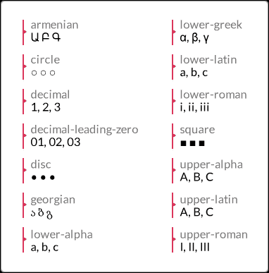
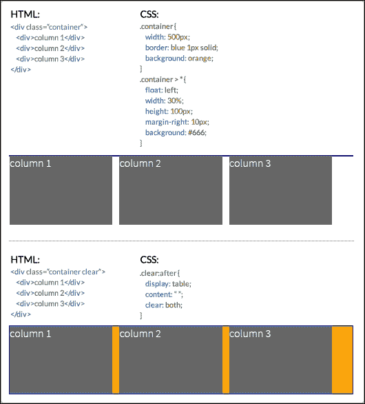
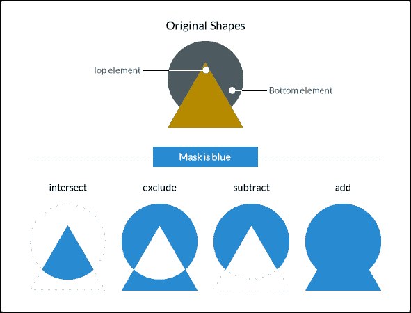

# 第六章 CSS 属性 – 第三部分

现在我们完成了 CSS 属性的第二部分，让我们以第三部分的内容来结束。

让我们来做这件事。

# 页面框

页面框是由两部分组成的正方形/矩形区域：*页面区域* 和 *页边距区域*。

页面区域是内容所在的地方，所有元素都进行布局。页边距区域位于页面区域周围，是透明的。如果我们给页面区域添加背景颜色，它将覆盖页面区域和页边距区域。

页面框的大小不能修改。但如果我们计划修改页面框的一些属性，我们需要在 `@page` 规则中包含它们。

让我们来看看。

## bleed

`bleed` CSS 属性也称为 *CSS at-rule 描述符*。它定义了页面应该溢出或超出页面框的多少。此属性仅在已使用 `marks` 属性启用标记的情况下才有效，我们将在下一部分看到。

### 描述

`bleed` 属性仅支持长度值：`px`、`em`、`in`、`mm`、`cm`、`vw` 等。

**CSS**:

```js
@page {
  bleed: 5mm;
}
```

## marks

`marks` CSS 属性，也称为 *CSS at-rule 描述符*，定义了应在页面框外渲染和打印的标记类型。

由于标记是在页面框外打印的，因此页面需要稍微大一点，以便有空间打印标记。

### 描述

`marks` 属性支持三个关键字值：`crop`、`cross` 和 `none`。

+   `crop`：裁剪标记定义了页面应该被裁剪的位置

+   `cross`：交叉标记用于对齐页面

+   `none`：标记将不会显示

**CSS**:

```js
@page {
  marks: crop cross;
}
```

# 列表

CSS 列表是网页设计中最多变的元素之一。除了用于创建列表之外，它们还用于导航、布局、幻灯片、轮播图等。

让我们看看它们的属性。

## list-style

`list-style` CSS 属性是 `list-style-type`、`list-style-image` 和 `list-style-position` 属性的缩写。这些属性实际上是 `list-style` CSS 属性支持的值。我们将在下一部分看到所有这些属性。

### 描述

`list-style` 属性支持一个、两个或三个值，顺序不限。如果没有声明值，它将使用其默认值。

**CSS**:

```js
/*Default values*/
ul { list-style: disc outside none; }
/*One value, the other two are default*/
ul { list-style: circle; }
/*Two values, the other one is defaults*/
ul { list-style: lower-roman inside; }
/*Three values*/
ul { list-style: decimal outside url(../images/list-bullet.png); }
```

## list-style-type

`list-style-type` CSS 属性定义了列表将使用的图形或标记（也称为 **项目符号**）。标记的颜色由应用到的元素的文本颜色决定。

### 描述

`list-style-type` 属性支持许多值，但我们将列出最常用的 15 个：`armenian`、`circle`、`decimal`、`decimal-leading-zero`、`disc`、`georgian`、`lower-alpha`、`lower-greek`、`lower-latin`、`lower-roman`、`none`、`square`、`upper-alpha`、`upper-latin` 和 `upper-roman`。

这里有一个截图，除了 `none` 值以外的所有值：



**CSS**:

```js
/*Style: 01, 02, 03...*/
ul { list-style-type: decimal-leading-zero; }
/*Style: α, β, γ...*/
ul { list-style-type: lower-greek; }
/*Style: A, B, C...*/
ul { list-style-type: upper-latin; }
```

## list-style-position

`list-style-position` CSS 属性定义了标记的位置。

### 描述

`list-style-position` 属性支持两个关键字值：`inside` 和 `outside`。

#### 内部

当应用 `inside` 值时，标记将出现在文本内部。如果有换行，标记将被左对齐，不会像传统列表那样“突出”。

#### 外部

默认值是 `outside`。当应用此值（或没有应用，因为它是默认值）时，标记将出现在文本外部。如果有换行，标记将出现在文本块外部。它将“突出”出来，就像在传统列表中一样。

**CSS**:

```js
ul {
  list-style-position: inside;
}
```

## 列表样式图像

`list-style-image` CSS 属性允许我们用自定义图像替换默认标记。

### 描述

`list-style-image` 属性支持一个关键字值和一个函数：`none` 和 `url()`。

+   `none`: 不使用图像替换标记

+   `url()`: 它用于定义替换标记的图像的路径

**CSS**:

```js
ul {
  list-style-image: url(../images/list-bullet.png);
}
```

这里有一个包含所有 HTML 列表的 CodePen 示例：[`tiny.cc/html-lists`](http://tiny.cc/html-lists)

# 计数器

通过 `<ul>`、`<ol>`、`<dl>` 标签的传统列表在样式标记方面并不太灵活。有时，我们必须依赖额外的标记来完成一些基本的自定义样式。

与此同时，CSS 计数器将样式列表（或任何元素）提升到了一个全新的定制和样式水平。

虽然 CSS 计数器不仅依赖于我们接下来将要看到的属性，还依赖于 `content` 属性和 `:before` 伪元素。

让我们来看看使 CSS 计数器如此出色的属性。

## counter-reset

`counter-reset` CSS 属性通过提供一个名称来重置计数器，其外观如下：

```js
counter-reset: basic-counter;
```

### 描述

`counter-reset` 属性有两个作用：重置计数器并为计数器定义一个名称。该名称稍后将被我们稍后看到的 `counter-increment` 和 `counter()`/`counters()` 函数使用。

我必须承认，如果用`counter-reset`来设置计数器的名称，这个术语并不像它应该的那样直观。如果问我，像`counter-name`这样的术语会更合适。

该属性支持两个值：一个 *名称* 和一个 *数字*。

我们可以在同一个声明中引用多个计数器重置。

#### 名称

我们需要给重置计数器一个名称。这个值是必需的。可以是任何名称，但需要遵守以下条件：

+   它可以以字母、下划线 "`_`" 或连字符 "`-`" 开头

+   它可以以连字符 "`-`" 字符开头，但不能以两个连续的连字符开头

+   名称不能只是一个连字符"`-`"；至少需要一个额外的字符，但不能是数字，因为这将解释为“减 1”(`-1`)

+   它不能以数字或像 `#`、`$`、`!` 等特殊字符开头

#### 数字

这是计数器重置到的数字。如果没有声明值，默认值是`0`（零）。

此值是可选的，除非我们想要从不同于 `1` 的数字开始列表。请特别注意此值，因为列表中的第一个数字不是在此值中声明的数字。

如果我们将值设置为 `1`，列表从 `2` 开始。如果我们留空值，它默认为 `0`（零），列表从 `1` 开始。负值是有效的。

**CSS**:

```js
/*Define a name and counter reset to 0*/
ul { counter-reset: basic-counter; }
/*The counter will start at 3*/
ul { counter-reset: basic-counter 2; }
/*Multiple counters in a single declaration*/
ul { counter-reset: basic-counter-A, basic-counter-B 2; }
```

## counter-increment

`counter-increment` CSS 属性增加一个或多个计数器的值，其外观如下：

```js
counter-increment: basic-counter 2;
```

### 描述

这个属性与 `counter-reset` CSS 属性一起使用。这是因为 `counter-reset` 属性中指定的名称在 `counter-increment` CSS 属性中使用。

作为复习，请记住计数器名称也将由 `counter()`/`counters()` 函数使用。

我们可以在同一个声明中声明多个计数器增量。多个计数器之间用空格分隔。此属性支持两个值：一个 *名称* 和一个 *数字*。

#### name

它可以是任何名称，但需要遵守以下条件：

+   它可以以字母、下划线 "`_" 或连字符 "`-`" 开头

+   它可以以连字符 "`-`" 字符开头，但名称开头不能有两个连续的连字符

+   名称不能只是连字符 "`-`"；至少需要更多字符，但不能是数字，因为这将解释为 "`minus 1`" (`-1`)。

+   它不能以数字或特殊字符如 `#`、`$`、`!` 等开头。

#### number

这是计数器重置到的数字。如果没有声明值，默认值为 `0`（零）。此值是可选的，除非我们想要从不同于 `1` 的数字开始列表。

现在，`number` 值定义了每个计数器将有的增量数量。例如，如果我们声明 `2`，那么计数器将是 `2`、`4`、`6` 等等。如果我们声明 `3`，那么计数器将是 `3`、`6`、`9` 等等。

如果我们没有声明值，默认增量将是 `1`，例如 `1`、`2`、`3` 等等。

负值是有效的。如果我们声明 `-2`，那么计数器将是 `-2`、`-4`、`-6` 等等。

**CSS**:

```js
/*First, define a name and counter reset to 0 with counter-reset*/
ul { counter-reset: basic-counter; }
/*Then, invoque the counter name and increment every element by 2 (2, 4, 6, and so on.)*/
ul li { counter-increment: basic-counter 2; }
/*Multiple counters*/
ul li { counter-increment: basic-counter 2 roman-numeral-counter; }
```

这里是一个在 CodePen 上的演示：[`tiny.cc/css-counters`](http://tiny.cc/css-counters)

# 投影阴影

有三种方法可以创建深度效果：使用灯光、阴影或两者结合。

让我们看看我们是如何为我们的容器创建阴影的。

## box-shadow

`box-shadow` CSS 属性在元素上创建一个或多个阴影，其外观如下：

```js
box-shadow: 10px 10px 13px 5px rgba(0, 0, 0, .5) inset;
```

### 描述

`box-shadow` 属性在同一声明中支持三个、四个、五个或六个值：四个 *长度* 值、一个 *颜色* 值和 *关键字* `inset`。

#### 长度值

当我们使用长度值时，我们使用以下单位之一：`px`、`em`、`in`、`mm`、`cm`、`vw` 等等。

四个长度值如下：

+   第一个值是阴影的水平偏移。负值是有效的。此值是必需的。

+   列表中的第二个值是用于阴影的垂直偏移。负值有效。此值是必需的。

+   列表中的第三个值是用于阴影的模糊半径。值越大，阴影扩散得越广，但同时也越透明。负值无效。此值是必需的。

+   列表中的第四个值是用于阴影的大小（或“扩散半径”）。负值有效。此值是可选的。

#### 颜色值

这是列表中的第五个值。它支持所有颜色模式：`HEX`、`RGB`、`RGBa`、`HSL`、`HSLs`和*颜色名称*。

此值是可选的。如果没有指定颜色，则由浏览器决定使用哪种颜色。某些浏览器甚至可能在没有颜色值的情况下根本不显示阴影。

*颜色*值可以放在声明开始或结束处，但不能放在长度值之间；否则，`box-shadow`属性将不起作用。

#### inset

列表中的第六个值是`inset`。它创建容器内的阴影，就像背景一样。然而，如果实际上有背景颜色或图像，`inset`阴影将位于其上方但内容下方，不影响容器子元素的布局。

此值是可选的。如果没有声明此值，阴影默认显示在元素外部。

此值可以放在声明开始或结束处，但不能放在长度值之间；否则，`box-shadow`属性将不起作用。

**CSS**:

```js
/*Left 10px, top 10px, blur 13px, spread 5px, RGBa mode, inside the element*/
.element {
  box-shadow: 10px 10px 13px 5px rgba(0, 0, 0, .5) inset;
}
```

# 显示和可见性

显示属性是网页设计和开发中最广泛使用的 CSS 功能之一。

让我们来检查一下。

## all

`all` CSS 属性将元素属性重置为其默认值，其外观如下：

```js
all: initial;
```

### 描述

唯一不重置的属性是`direction`和`unicode-bidi`属性，它们控制文本方向。这很重要，因为文本方向是理解内容所必需的。如果这些属性被`all`属性重置，则文本将按照相反的方向运行，完全破坏信息。

此属性支持三个关键字值：`initial`、`inherit`和`unset`。

+   `initial`: 这将更改元素或其父元素的属性，将其更改为它们的初始值。

+   `inherit`: 这将更改元素或其父元素的属性，将其更改为父值。

+   `unset`: 这将更改元素或其父元素的属性，如果这些属性是可继承的，则将其更改为父值，否则将更改为它们的初始值。

**CSS**:

```js
/*Change an element's properties to their initial value*/
.element { all: initial; }
/*Inherit all the initial properties of the parent container*/
.element { all: inherit; }
/*Change the parent's properties to its parent values if inheritable*/
.parent-container { all: unset; }
```

## clear

`clear` CSS 属性指定元素哪一侧，或两侧，不应*浮动*，其外观如下：

```js
clear: both;
```

### 描述

当使用`clear`属性时，它清除特定的框，而不是其子元素。如果我们想清除其子元素，我们必须在它们上声明`clear`属性。

当处理基于浮动的网格时，此属性对布局至关重要。这是因为浮动元素被移出文档流。因此，其父容器不会考虑它们，其高度也不再由这些浮动元素决定。

因此，向父元素的`:after`伪元素添加清除声明（带有`display`和`content`属性）"*告诉*"父元素考虑浮动元素，因此父容器的高度现在由最高的浮动子元素决定。让我们看看下面的图片：



这里是一个 CodePen 上的演示：[`tiny.cc/clearing-floats`](http://tiny.cc/clearing-floats)

`clear` CSS 属性支持四个值：`left`、`right`、`both`和`none`。

+   `left`: 这意味着不允许向左浮动元素。

+   `right`: 这意味着不允许向右浮动元素。

+   `both`: 这意味着不允许左右两侧的浮动元素。

+   `none`: 这是默认值。不执行清除操作，允许两侧都有浮动元素。

**CSS**:

```js
/*Float an element to the left*/
.element-a { float: left; }
/*Float an element to the right*/
.element-b { float: right; }
/*Clear the floats on the parent container*/
.parent-container:after {
  content: '';
  display: table;
  clear: both;
}
```

## display

`display` CSS 属性定义了元素（框）应在页面上如何显示或不应显示。它看起来像这样：

```js
display: block;
```

### 描述

此属性接受大约 25 个关键字值；其中一些非常晦涩且很少使用。让我们关注最相关的 15 个：

+   `block`

+   `flex`

+   `grid`

+   `inline`

+   `inline-block`

+   `inline-flex`

+   `none`

+   `table`

+   `table-cell`

+   `table-column`

+   `table-column-group`

+   `table-footer-group`

+   `table-header-group`

+   `table-row`

+   `table-row-group`

+   `block`: 将元素显示为块级元素，就像`<div>`标签或`<h1>`元素一样。

+   `flex`: 将元素显示为块级元素，并根据`Flexbox`模型布局其内容。

+   `grid`: 将元素显示为块级元素，并根据`Grid`模型布局其内容。

+   `inline`: 将元素显示为内联级元素，就像链接`<a>`元素一样。

+   `inline-block`: 将元素显示为内联块级元素，就像列表`<li>`元素一样。

+   `inline-flex`: 将元素显示为内联元素，并根据`Flexbox`模型布局其内容。

+   `none`: 隐藏元素在浏览器中的渲染。尽管如此，元素仍然存在于标记中。当此值应用于元素时，浏览器不会渲染该元素及其所有子元素。

#### 表相关值

在以下列表中，所有`table-related`值都映射到一个 HTML 元素。因此，当这些值应用于元素时，它们使该元素表现得像`table-related`元素。让我们看看属性：

+   table = `<table>`

+   table-cell = `<td>`

+   table-column = `<col>`

+   table-column-group = `<colgroup>`

+   table-footer-group = `<tfoot>`

+   table-header-group = `<thead>`

+   table-row = `<tr>`

+   table-row-group = `<tbody>`

访问 MDN 以获取所有显示值的列表：[`tiny.cc/mdn-display`](http://tiny.cc/mdn-display)

**CSS**:

```js
/*Make an element display like a block level element*/
.element { display: block; }
/*Make an element display like a <table> element*/
.element { display: table; }
/*Make an element display like an inline-block element - <li>*/
.element { display: inline-block; }
/*Hide an element an its children*/
.element { display: none; }
```

## 透明度

The `opacity` CSS property defines the transparency (opacity) of an element, and it looks like this:

```js
opacity: .55;
```

### 描述

当`opacity`属性应用于一个元素时，该元素及其子元素都会受到影响。

该属性支持从 0.0（零）到 1.0 的数值范围，默认值为 1.0。值为 0 表示完全透明，即 0%不透明，值为 1 表示 100%不透明，没有任何透明度。允许使用小数。

该属性的行为与 RGBa 和 HSLa 颜色模式中使用的 alpha 通道值相同。

**CSS**:

```js
/*Make an element 55% opaque. This affects its children as well*/
.element { opacity: .55; }
/*Makes shadow 20% opaque. Same effect as in RGBa and HSLa color modes.*/
.element { box-shadow: 0 0 5px rgba(0, 0, 0, .2); }
```

## `filter`

The `filter` CSS property allows us to apply visual effects to an `img` element or to the `background` or `border` properties, and it looks like this:

```js
filter: blur(10px);
```

### 描述

CSS 滤镜的一些例子包括模糊、将彩色图像转换为灰度或棕褐色，或改变其透明度。

### 小贴士

This `filter` property is not the same as Microsoft's proprietary `filter` property that only IE supports. Unlike Microsoft's proprietary filters, which are not part of a standard, this CSS `filter` property is part of a work in progress of the W3C.

该属性支持 11 个值。这些值被称为 CSS 函数。可以在同一个选择器中声明多个函数，用空格分隔。

让我们看看列表：

+   `blur()`

+   `brightness()`

+   `contrast()`

+   `drop-shadow()`

+   灰度

+   `hue-rotate()`

+   `invert()`

+   `opacity()`

+   `saturate()`

+   `sepia()`

+   `url()`

#### `blur()`

这会产生一种**模糊**效果。值以长度值（`px`、`em`、`in`、`mm`、`cm`、`vw`等）声明。值越高，模糊效果越强烈（反之亦然）。

不允许使用百分比和负值，但允许使用小数。

#### `brightness()`

这会修改图像的照明。值以百分比或没有单位的数字声明，例如，10%和 0.5%。

值为 100%保持元素不变，值为 0%使元素完全变黑。允许使用大于 100%的值，以产生更强烈的效果。值没有上限。

然后，值为 1 保持元素不变；值为 0 使元素完全变黑。允许使用大于 1 的值，以产生更强烈的效果。值没有上限。

#### 对比度

这会修改元素的对比度。值以百分比或没有单位的数字声明，例如，10%和 0.5%。

值为 100%保持元素不变，值为 0%使元素完全变黑。允许使用大于 100%的值，以产生更强烈的效果。值没有上限。

然后，值为 1 保持元素不变；值为 0 使元素完全变黑。允许使用大于 1 的值，以产生更强烈的效果。值没有上限。负值无效，允许使用小数。

#### drop-shadow()

这将在元素下方添加一个阴影。

此函数几乎与`box-shadow`属性完全相同，但有两个不同之处：`drop-shadow()`函数不支持`spread-radius`属性或`inset`值。

请参阅`box-shadow`属性以获取所有值的详细描述。

此外，一些浏览器在使用此函数时实际上会提供硬件加速，这最终会提高性能。你知道的，我们能做的任何提高性能的事情都是加分项。

#### grayscale()

这将元素转换为灰度。值声明为不带单位的*百分比*或*数字*，例如，10%和 0.5%。

0%的值不会改变元素；100%的值将元素转换为灰度。不允许超过 100%的值。

0 的值不会改变元素，而 1 的值将元素转换为灰度。不允许超过 1 的值。负值无效，允许使用小数。

#### hue-rotate()

这将对元素应用色调旋转。它接受一个*角度*值。

角度值定义了元素样本将修改到的颜色轮上的度数。然而，如果没有最大值，如果值大于`360deg`，旋转将只是循环。例如，如果我们声明`380deg`，那么它等同于`20deg`。

#### invert()

`invert()`函数反转元素的颜色。如果用于图像，它会使图像看起来像负片。

100%的值完全反转元素的颜色；0%的值不会改变元素。不允许超过 100%的值。

1 的值完全反转元素的颜色，而 0 的值不会改变元素。不允许超过 1 的值。

负值无效，允许使用小数。

#### opacity()

它定义了元素的透明度（不透明度）。当此函数应用于元素时，元素及其子元素都会受到影响。

此函数支持从 0（零）到 1 的数值范围，这是默认值。0 是完全透明的，就像 0%不透明一样，而 1 是 100%不透明，没有任何透明度。

负值无效，允许使用小数。

#### saturate()

它影响元素的饱和度级别。值声明为不带单位的*百分比*或*数字*，例如，10%和 0.5%。

元素的默认饱和度值为 100%，或使用无单位数字时的 1。

0%的值完全去饱和元素（它移除所有颜色，使元素变为灰度）；100%的值不会改变元素。允许超过 100%的值，创建更强烈的效果。

0 的值完全去饱和元素（它移除所有颜色，使元素变为灰度），而 1 的值不会改变元素。允许超过 1 的值，创建更强烈的效果。

#### sepia()

这会将元素转换为棕褐色——想象一下灰度图像，但以棕色色调呈现。

值为 100% 完全将元素转换为棕褐色；值为 0% 保持元素不变。不允许超过 100% 的值。

值为 1 完全将元素转换为棕褐色；值为 0 保持元素不变。不允许超过 1 的值。负值无效。

#### url()

它接受一个 XML 文件的位置，该文件包含应用于元素的 SVG 过滤器。URL 可以包含指向 SVG 中特定过滤元素的锚点。

**CSS**:

```js
/*Blur*/
.element { filter: blur(10px); }
/*Brightness*/
.element { filter: brightness(20%); }
/*Contrast*/
.element { filter: contrast(10); }
/*Drop shadow*/
.element { filter: drop-shadow(5px 5px 3px rgba(0, 0, 0, .5)); }
/*Grayscale*/
.element { filter: grayscale(.8); }
/*Hue rotation*/
.element { filter: hue-rotate(80deg); }
/*Invert*/
.element { filter: invert(1); }
/*Opacity*/
.element { filter: opacity(.2); }
/*Saturation*/
.element { filter: saturate(300%); }
/*Sepia*/
.element { filter: sepia(100%); }
/*URL*/
.element { filter: url(/images/file.svg#blur); }
/*Multiple filters for a single element*/
.element { filter: sepia(100%) saturate(200%) hue-rotate(50deg); }
```

## overflow

`overflow` CSS 属性定义了块级元素应该如何处理超出其边界的内容（“溢出”），其外观如下：

```js
overflow: auto;
```

### 描述

`overflow` 属性的一个特性是它用于清除浮动，并使父容器垂直扩展以包裹浮动元素。这是通过使用以下任何值（除了 `visible`）来实现的。

然而，有一个警告。当使用先前的技术时，可能会有意想不到的效果。例如，如果一个子元素有 `box-shadow`，阴影可能会被裁剪/隐藏。

为了使内容溢出，父容器需要具有固定高度，或者内容需要应用 `white-space: nowrap;` 声明。

该属性支持四个关键字值：`auto`、`hidden`、`scroll` 和 `visible`。

+   `auto`：只有当需要时才会创建水平和垂直滚动条。换句话说，如果内容在任何方向上超出容器，浏览器将在一个或两个轴上创建滚动条。

+   `hidden`：这将裁剪/隐藏元素之外的内容。不会生成滚动条。这个值在清除浮动时非常受欢迎。再次提醒，使用此值时要小心。

+   `scroll`：即使内容没有超出容器，也会创建水平和垂直滚动条。

+   `visible`：这是默认值。不裁剪/隐藏任何内容，也不生成滚动条。

**CSS**:

```js
/*Scroll bars are generated if the content needs them*/
.element {
  white-space: nowrap;
  overflow: auto;
}
/*Clearing floats. Be careful with this technique*/
.parent-container { overflow: hidden; }
```

## overflow-x

`overflow-x` CSS 属性的行为与 `overflow` 属性相同，其外观如下：

```js
overflow-x: auto;
```

### 描述

不同之处在于 `overflow-x` 属性处理的是 *X* 轴（水平）上的溢出。请参考 `overflow` 的描述，因为值是相同的。

**CSS**:

```js
.element {
  white-space: nowrap;
  overflow-x: auto;
}
```

## overflow-y

`overflow-y` CSS 属性的行为类似于 `overflow` 属性，其外观如下：

```js
overflow-y: auto;
```

### 描述

不同之处在于 `overflow-y` 属性处理的是 *Y* 轴（垂直）上的溢出。请参考 `overflow` 的先前描述，因为值是相同的。

**CSS**:

```js
.element {
  height: 100px;
  overflow-y: auto;
}
```

## visibility

`visibility` CSS 属性定义了元素是否可见，其外观如下：

```js
visibility: hidden;
```

### 描述

在隐藏元素方面，`visibility` 属性类似于 `display: none;`，区别在于使用 `visibility` 属性隐藏元素时，该元素占据的空间仍然会影响布局。它只是“*不可见*”。使用 `display: none;`，就像元素根本不存在一样。

`visibility` CSS 属性是不可继承的；换句话说，即使它们的父容器不可见，我们仍然可以使子元素可见。它也可以用于隐藏表格中的行和列。

这个属性支持三个不同的关键字值：`collapse`、`hidden`和`visible`。

+   `collapse`：这个属性仅用于表格元素，用于删除行或列。然而，折叠/隐藏的元素仍然会影响布局，因为它们仍然占据着它们的空间。如果在这个值用于除表格元素之外的元素上，它们将被视为使用了 `hidden` 值。

+   `hidden`：这个属性用于视觉上隐藏一个元素。然而，任何隐藏的元素仍然会影响布局，因为它们仍然占据着它们的空间。

+   `visible`：这是默认值。它使一个元素可见。

**CSS**：

```js
/*Hide an element*/
.element { visibility: hidden; }
/*Parent container visible while child heading is visible*/
.parent-container { visibility: hidden; }
.parent-container h1 { visibility: visible; }
/*Hide table elements*/
tr { visibility: collapse; }
tfoot { visibility: collapse; }
```

## z-index

`z-index` CSS 属性定义了元素的堆叠顺序。可以这样想：元素有时会重叠，就像桌子上的一叠扑克牌。位于堆叠顶部的牌具有最高的 `z-index`，位于底部的牌具有最低的 `z-index`。

为了使这个属性生效，元素必须有一个声明了任何不同于 `static` 值的 `position` 属性。

### 描述

`z-index` 属性接受两个值：一个*数字*和一个*关键字*值。

+   **数值类型**：这也可以称为一个“**整数**”。它只是一个没有单位的数字。

+   **auto**：这是默认值。元素的堆叠顺序与它们的父元素相同。

**CSS**：

```js
/*Set all cards to relative position so z-index can work*/
.card { position: relative; }
/*The Ace card sits on top of the pile*/
.card.ace { z-index: 2; }
/*The Five card sits at the bottom of the pile*/
.card.five { z-index: 0; }
/*The Queen card sits in between the Ace and the Five*/
.card.queen { z-index: 1; }
```

# 遮罩和裁剪

这两个特性允许我们隐藏元素的一部分，以便显示背景图像或颜色，或者给元素一个特殊的形状。这两个术语可能有点令人困惑，所以让我们简要地描述每个术语：

+   **裁剪**是通过向量或路径完成的，因为这项 CSS 功能是从 SVG 规范中借鉴的。它创建了一个元素与其背景之间的实边。

+   另一方面，**遮罩**使用图像/位图。使用图像，我们可以有“*羽化*”或模糊的边缘，而使用裁剪则有直边。

让我们来看看这些属性。

## mask

`mask` CSS 属性是 `mask-clip`、`mask-composite`、`mask-image`、`mask-mode`、`mask-origin`、`mask-position`、`mask-repeat` 和 `mask-size` 属性的缩写。我们将在稍后更详细地了解每个属性。`mask` 属性看起来是这样的：

```js
mask: url(../images/mask.png) 50% 50% / contain no-repeat border-box;
```

### 描述

所有先前属性的组合被称为一个“*遮罩层*”。

建议使用简写语法而不是单个特定属性，因为简写语法会将未声明的属性重置为其初始值。这很有用，因为它使得在层叠中稍后覆盖值变得更容易，从而避免了特定性问题以及潜在的使用 `!important` 指令。

此外，`mask-clip` 和 `mask-origin` 使用 `geometry` 值。如果我们只声明一个值，那么这两个属性都将使用该值。如果有两个值，`mask-clip` 将使用第一个值，而 `mask-origin` 将使用第二个值。

如我之前提到的，CSS 蒙版使用图像，这意味着我们可以使用 `linear-gradient()` CSS 函数引用具有透明度的位图/光栅文件或具有背景渐变的背景。我们甚至可以通过在同一个声明中引用多个图像来创建蒙版。

有两种类型的蒙版：*alpha* 蒙版和 *亮度* 蒙版。我们将在稍后了解每种类型蒙版的内容。

**CSS**:

```js
/*Mask referencing a bitmap file.
We are specifying: mask-image mask-position / mask-size mask-repeat mask-clip
*/
.element {
  mask: url(../images/mask.png) 50% 50% / contain no-repeat border-box;
}
/*Mask using the CSS linear-gradient property*/
.element {
  mask: linear-gradient(black 5%, transparent);
}
/*Mask created by declaring multiple masks*/
.element {
  mask:
    url(../images/mask.png) 50% 50% / contain no-repeat border-box,
    linear-gradient(white 5%, transparent);
}
```

## mask-clip

`mask-clip` CSS 属性确定元素受蒙版影响的区域，其外观如下：

```js
mask-clip: padding-box;
```

### 描述

这个属性类似于 `background-clip` CSS 属性。有关更多信息，请参阅第四章，*CSS 属性 - 第一部分*。

同一个声明中可以存在多个以逗号分隔的关键字值。每个值代表 `mask-image` 属性逗号分隔值中的相应图像。

它支持四个关键字值：`border-box`、`content-box`、`padding-box` 和 `no-clip`。

+   `border-box`：这是默认值。如果元素有任何边框，它们将通过蒙版可见。

+   `content-box`：只有元素内容区域内的部分通过蒙版可见。

+   `padding-box`：如果元素有任何填充，它将通过蒙版可见。

+   `no-clip`：内容不会被 *裁剪*。

**CSS**:

```js
/*Padding box clipping*/
.element { mask-clip: padding-box; }
/*Multiple values*/
.element { mask-clip: padding-box, border-box; }
```

## mask-composite

`mask-composite` CSS 属性定义了如何将具有不同形状的多个蒙版组合或 *合成* 成单个蒙版，其外观如下：

```js
mask-composite: intersect;
```

### 描述

`mask-composite` 属性在 `mask-image` 被使用并且至少声明了两个蒙版图像时起作用。同一个声明中可以存在多个以逗号分隔的关键字值。每个值代表 `mask-image` 属性逗号分隔值中的相应图像。

`mask-composite` CSS 属性支持四个关键字值：`add`、`subtract`、`exclude` 和 `intersect`。

例如，想象一个三角形覆盖在圆形的一部分上，其中三角形在上，圆形在下；不同的 *合成* 类型会形成不同形状的蒙版：



+   `intersect`：蒙版的形状是三角形和圆形重叠的部分，或 *交集*。其余的形状将被丢弃。

+   `exclude`：三角形和圆形相交的部分被丢弃，其余的元素构成了蒙版。

+   `subtract`：由于三角形位于上方，它将 *裁剪* 或 *裁剪* 圆形，从而留下一个 **吃豆人** 形状的蒙版。

+   `add`：三角形与圆形融合，形成一个单一形状，该形状将用作蒙版。

**CSS**:

```js
/*Intersect the masks*/
.element { mask-composite: intersect; }
/*Multiple values*/
.element { mask-composite: intersect, exclude; }
```

## mask-image

`mask-image` CSS 属性定义了在给定元素上用作蒙版层的图像或图像，其形式如下：

```js
mask-composite: intersect;
```

### 描述

`mask-image` 属性还可以引用 SVG 文件中的 `<mask>` 元素。多个值以逗号分隔。图像可以是位图文件、SVG，甚至是图像的 CSS 渐变。

**CSS**:

```js
/*Mask referencing a bitmap*/
.element { mask-image: url(../images/mask.png); }
/*Mask using a CSS gradient*/
.element { mask-image: linear-gradient(black 5%, transparent); }
/*Mask referencing an SVG <mask>*/
.element { mask-image: url(../images/file.svg#mask); }
/*Multiple values*/
.element { mask-image: url(../images/mask.png), linear-gradient(black 5%, transparent); }
```

## mask-mode

`mask-mode` CSS 属性定义了蒙版层是 `alpha` 蒙版还是 `luminance` 蒙版。这些术语是实际的关键字值，其形式如下：

```js
mask-mode: alpha;
```

### 描述

同一个声明中可以存在多个以逗号分隔的关键字值。每个值代表 `mask-image` 属性逗号分隔值中对应的图像。

#### Alpha 蒙版

Alpha 蒙版使用图像的 *alpha 通道*。透明部分将被覆盖；不透明部分将显示出来。当然，图像上的半透明区域将被部分覆盖。

#### 亮度蒙版

亮度蒙版使用图像的 *亮度值*。在用作蒙版的图像上，*白色*的部分将显示出来。黑色部分将被隐藏。灰色区域部分覆盖图像。

**CSS**:

```js
/*Alpha mask*/
.element { mask-mode: alpha; }
/*Multiple values*/
.element { mask-mode: alpha, luminance; }
```

## mask-origin

`mask-origin` CSS 属性定义了蒙版层相对于元素框从左上角开始的位置或位置，其形式如下：

```js
mask-mode: alpha;
```

### 描述

`mask-origin` 属性的工作方式与 `background-origin` 属性类似。有关更多信息，请参阅第四章，*CSS 属性 - 第一部分*。

现在，此属性可以在 HTML 和 SVG 元素中使用。然而，有些关键字值适用于一个，但在另一个中不起作用。

同一个声明中可以存在多个以逗号分隔的关键字值。每个值代表 `mask-image` 属性逗号分隔值中对应的图像。

HTML 关键字值是 `border-box`、`padding-box`、`margin-box` 和 `content-box`。

SVG 关键字值是 `view-box`、`fill-box` 和 `stroke-box`。

+   `border-box`：原点从边框框的左上角开始。应用蒙版时将包括边框和任何填充（如果声明了），但不会超出该边框。

+   `padding-box`：原点从填充框的左上角开始。应用蒙版时将包括填充，但如果声明了边框，则不包括任何边框。

+   `margin-box`：原点从边框框的左上角开始。应用蒙版时将包括边距、边框和填充（如果声明了）。

+   `content-box`：原点从内容框的左上角开始。它只包括 *内容* 区域。不考虑边距、填充或边框。

+   `view-box`: 它使用最近的 SVG 视口作为参考框。

+   `fill-box`: 遮罩的位置相对于**对象边界框**。

+   `stroke-box`: 遮罩的位置相对于**描边边界框**。

**CSS**：

```js
/*Content box origin; the mask will exclude borders and paddings*/
.element { mask-origin: content-box; }
/*Multiple values*/
.element { mask-origin: border-box, padding-box; }
```

## mask-position

`mask-position` CSS 属性定义了遮罩的起始位置，其外观如下：

```js
mask-position: right top;
```

### 描述

该属性的工作方式与`background-position`属性类似。有关更多信息，请参阅第四章，*CSS 属性 - 第一部分*。

同一个声明中可以存在多个以逗号分隔的关键字值。每个值代表`mask-image`属性逗号分隔值中对应的图像。

`mask-position` CSS 属性支持几种类型的值：四个**关键字**值，`top`、`right`、`bottom`和`left`；一个**长度**值，`px`、`em`、`in`、`mm`、`cm`、`vw`等等；以及一个**百分比**值，如 50%、85%等等。

**CSS**：

```js
/*Keyword values*/
.element { mask-position: right top; }
/*Length and Percentage values*/
.element { mask-position: 50px 25%; }
/*Multiple values*/
.element { mask-position: right top, 50% 50%; }
```

## mask-repeat

`mask-repeat` CSS 属性定义了遮罩层是否重复，其外观如下：

```js
mask-repeat: space;
```

### 描述

该属性的工作方式与`background-repeat`属性类似。有关更多信息，请参阅第四章，*CSS 属性 - 第一部分*。

同一个声明中可以存在多个以逗号分隔的关键字值。每个值代表`mask-image`属性逗号分隔值中对应的图像。

它支持六个关键字值：`repeat`、`no-repeat`、`repeat-x`、`repeat-y`、`space`和`round`。

+   `repeat`: 遮罩将在**X**轴和**Y**轴上重复。这是默认值。

+   `no-repeat`: 遮罩在任何轴向上都不会重复。遮罩图像只显示一次。

+   `repeat-x`: 遮罩在**X**轴（水平方向）上重复。

+   `repeat-y`: 遮罩在**Y**轴（垂直方向）上重复。

+   `space`: 遮罩在**X**轴和**Y**轴上尽可能多次重复，而不会被裁剪或切割。

+   `round`: 与`space`值类似，不同之处在于遮罩图像会按指定方向进行缩放以适应。

**CSS**：

```js
/*Space out the mask without clipping it*/
.element { mask-repeat: space; }
/*Repeat the mask in the X-axis (horizontally)*/
.element { mask-repeat: repeat-x; } 
/*Multiple values*/
.element { mask-repeat: space, repeat-x; }
```

## mask-size

`mask-size` CSS 属性定义了遮罩图像的尺寸或大小，其外观如下：

```js
mask-size: contain;
```

### 描述

`mask-size`属性的工作方式与`background-size`属性类似。有关更多信息，请参阅第四章，*CSS 属性 - 第一部分*。

同一个声明中可以存在多个以逗号分隔的关键字值。每个值代表`mask-image`属性逗号分隔值中对应的图像。

`mask-position` CSS 属性支持几种类型的值：一个**长度**值，一个**百分比**值，以及三个**关键字**值。

+   `长度值`：这是当我们使用以下单位之一时：`px`、`em`、`in`、`mm`、`cm`、`vw`等等。

+   `百分比值`：这是当我们使用百分比，如 50%、85%等等时。

+   `contain`：此选项将图像遮罩缩放，而不扭曲其宽高比，以适应元素的宽度和高度的最大值。

+   `cover`：此选项将图像遮罩缩放并扭曲（如果需要），以适应元素的宽度和高度的最大值。如果图像遮罩在宽度和高度上更大，它将被裁剪。

+   `auto`：此选项将图像遮罩缩放至图像固有比例的实际大小，而不会扭曲图像。

**CSS**:

```js
.element {
  mask-size: contain;
}
```

## mask-type

`mask-type` CSS 属性专门用于 SVG 文件。它指定 SVG `<mask>` 元素是 *alpha* 遮罩还是 *luminance* 遮罩。

关于 *alpha* 和 *luminance* 遮罩的定义，请参考 `mask-mode` 属性。

## mask-border

`mask-border` CSS 属性是 `mask-border-source`、`mask-border-mode`、`mask-border-slice`、`mask-border-width`、`mask-border-outset` 和 `mask-border-repeat` 属性的缩写。其外观如下：

```js
mask-border: url(../images/border-image-mask.png) 15 / 15px stretch and so on;
```

### 描述

建议使用缩写，因为未声明的任何值都将设置为它们的初始值，这使得在以后覆盖时更加容易，从而最小化了 `!important` 指令的使用。

**CSS**:

```js
.element {
  mask-border: url(../images/border-image-mask.png) 15 / 15px stretch;
}
```

## mask-border-source

`mask-border-source` CSS 属性定义了一个要在 `border-image` 声明中使用的图像。

**CSS**:

```js
/*Border image referencing a bitmap file*/
.element { mask-border-image: url(../images/border-image-mask.png); }
/*Border image using a CSS gradient*/
.element { mask-border-image: linear-gradient(red, transparent); }
```

## mask-border-mode

`mask-border-mode` CSS 属性定义了用于遮罩的图像是 *alpha* 遮罩还是 *luminance* 遮罩。

关于 *alpha* 和 *luminance* 遮罩的定义，请参考 `mask-mode` 属性。

**CSS**:

```js
.element {
  mask-border-mode: luminance;
}
```

## mask-border-slice

`mask-border-slice` CSS 属性用于将图像切割成九部分，其外观如下：

```js
mask-border-slice: 40;
```

### 描述

想象这个例子：取一个正方形图像，画两条垂直线和两条水平线。我们最终在图像上得到九个部分，就像 **井字棋** 一样。

此属性支持一个、两个、三个或四个关键字偏移值：`top`、`right`、`bottom`、`left` 和 `fill`。这些值（除了 `fill`）可以使用不带单位的 *number* 值或使用 50%、85% 等的 *percentage* 值声明。

如果声明了一个值，则所有四边都采用该值。如果声明了两个值，则第一个值用于顶部和底部边，第二个值用于左侧和右侧边。如果声明了三个值，则第一个值用于顶部边，第二个值用于左侧和右侧边，第三个值用于底部边。如果声明了四个值，则它们分别对应顶部、右侧、底部和左侧边。

### 小贴士

当使用位图图像遮罩声明无单位值时，该值被解释为像素。

#### fill

默认情况下，图像遮罩的中心会被丢弃并视为空白。如果存在此值，则中心将被考虑，并成为遮罩的一部分。

**CSS**:

```js
/*All sides are offset by 40*/
.element { mask-border-slice: 40; }
/*Top & bottom and left & right values*/
.element { mask-border-slice: 20% 30%; }
/*Make the center of the image part of the mask with top & bottom, and left & right offsets*/
.element { mask-border-slice: fill 40 25; }
```

## mask-border-width

`mask-border-width` CSS 属性缩放由 `mask-border-slices` 属性创建的遮罩图像切片，其外观如下：

```js
mask-border-width: auto;
```

### 描述

该 `mask-border-width` 属性支持一个、两个、三个或四个关键字偏移值：`top`、`right`、`bottom`、`left` 和 `auto`。除了 `auto` 之外，这些值可以使用不带单位的 *number* 值或使用如 50%、85% 等的 *percentage* 值来声明。

如果声明了一个值，则所有四个边都采用该值。如果声明了两个值，则第一个值用于顶部和底部边，第二个值用于左侧和右侧边。如果声明了三个值，则第一个值用于顶部边，第二个值用于左侧和右侧边，第三个值用于底部边。如果声明了四个值，它们分别对应顶部、右侧、底部和左侧边。

#### auto

它使遮罩边框使用图像切片的内联宽度和高度。浏览器将决定是否需要使用这个内联宽度和高度。

**CSS**:

```js
.element {
  mask-border-width: auto;
}
```

## mask-border-outset

`mask-border-outset` CSS 属性定义了边框遮罩图像区域超出其边框框的量，其外观如下：

```js
mask-border-outset: 10px;
```

### 描述

该属性支持一个、两个、三个或四个关键字外延值：`top`、`right`、`bottom` 和 `left`。这些值可以使用不带单位的 *number* 值或使用 `px`、`em`、`in`、`mm`、`cm`、`vw` 等单位的 *length* 值来声明。不带单位的 *number* 值是元素 `border-width` 属性的乘数。

如果声明了一个值，则所有四个边都采用该值。如果声明了两个值，则第一个值用于顶部和底部边，第二个值用于左侧和右侧边。如果声明了三个值，则第一个值用于顶部边，第二个值用于左侧和右侧边，第三个值用于底部边。如果声明了四个值，它们分别对应顶部、右侧、底部和左侧边。

**CSS**:

```js
/*All four sides have the same value*/
.element { mask-border-outset: 10px; }
/*Top & bottom and left & right values*/
.element { mask-border-outset: 2 6; }
/*Top, left & right, and bottom values*/
.element { mask-border-outset: 5 20px 2; }
```

## mask-border-repeat

`mask-border-repeat` CSS 属性定义了图像蒙版如何缩放和铺贴（重复）在元素的所有四个边和中心周围，其外观如下：

```js
mask-border-repeat: repeat;
```

### 描述

`mask-border-repeat` 属性支持一个或两个关键字值。这些值是：`repeat`、`round`、`stretch` 和 `space`。

#### repeat

遮罩边框图像是平铺（重复）的。在特定情况下，图像蒙版可以在边缘被裁剪，只显示其中的一部分。

#### round

这与 `repeat` 的作用方式类似；区别在于图像蒙版被缩放到正好适合分配的距离，而不会裁剪图像蒙版。

#### stretch

这是默认值。图像蒙版被拉伸以完全填充区域。

#### space

与 `repeat` 类似，但不同之处在于，如果区域没有被完整的图像蒙版填满，它将分配围绕瓦片的空间。

**CSS**:

```js
.element {
  mask-border-repeat: repeat;
}
```

## clip-path

`clip-path` CSS 属性用于部分或完全隐藏元素的一部分，其外观如下：

```js
clip-path: url(..images/file.svg#clipping-path);
```

### 描述

我们可以说`clip-path`是一种*遮罩*形式。区别在于裁剪使用矢量图形进行裁剪，而不是位图/光栅图像。

这个矢量图形可以是*基本形状*或*SVG 路径*。

### 小贴士

注意：由于 SVG 的特性和限制不佳，`clip` CSS 属性现在已被弃用。当前的广泛支持的`clip-path`属性是 SVG 规范的一部分，并且已被 CSS 遮罩模块采用。

`clip-path` CSS 属性与`shape-outside`属性结合可以创建令人惊叹的布局。通过这种组合，我们可以使一个段落围绕一个裁剪元素“*弯曲*”，其基本形状也是一个曲线或圆形。

该属性支持四个值：三个*函数*：`url()`、一个*形状*、一个*几何框*，以及一个*关键字*值`none`。

#### url()

这个 CSS 函数指向一个 SVG `clipPath` 元素，该元素将被用作裁剪路径。

**CSS**：

```js
/*Clipping path referenced from an external SVG file*/
.element { clip-path: url(..images/file.svg#clipping-path); }
/*Clipping path referenced from an embedded SVG*/
.element { clip-path: url(#clipping-path); }
```

#### circle()

这个 CSS 函数声明一个圆作为裁剪路径。此函数接受两个参数：一个*形状半径*和一个*位置*。

+   **形状半径**：它定义了圆的半径。它支持*长度*、*百分比*和两个*关键字*值。不允许使用负值。

    两个关键字值是：`closest-side`或`farthest-side`。

    +   `closest-side`：这是默认值。如果没有声明此值，浏览器将取圆的中心到其最近边的长度，并基于该距离创建一个圆。这样，圆永远不会溢出或超出内容，它总是完整的。

    +   `farthest-side`：此值将通过从中心到最远边的长度创建一个圆。这意味着如果元素有一边比另一边长，圆将溢出或溢出到对面。

+   **位置**：它定义了圆的位置。位置值由`at`词 precede。如果没有声明此值，圆将位于元素的中心。此参数的值与`background-position`属性的值相同。

**CSS**：

```js
/*Circle 150px wide and tall with location*/
.element { clip-path: circle(150px at 0 50%); }
/*Circle without location is centered on the element*/
.element { clip-path: circle(150px); }
/*Circle defaults to closest-side and is centered on the element*/
.element { clip-path: circle(); }
```

#### ellipse()

这个 CSS 函数声明一个椭圆作为裁剪路径。它接受与`circle()`函数相同的参数；唯一的区别是它接受两个半径值，`rx`和`ry`，用于形状半径而不是一个。`rx`代表*X*轴，`ry`代表*Y*轴。

**CSS**：

```js
/*Ellipse with location*/
.element { clip-path: ellipse(200px 100px at 0 50%); }
/*Ellipse without location is centered*/
.element { clip-path: ellipse(200px 100px); }
/*No value makes an ellipse that is as wide an tall as the element*/
.element { clip-path: ellipse(); }
```

#### inset()

这个 CSS 函数在元素内部定义一个矩形形状。它可以接受一个、两个、三个或四个偏移值。其语法与`margin`属性的语法相同。

它支持*长度*和*百分比*值。

此外，`inset()`函数还支持一个可选的`border-radius`值。此值必须在声明任何*长度*或*百分比*之前，由术语`round` precede。

**CSS**：

```js
/*Inset clip path where all four offset sides have the same distance*/
.element { clip-path: inset(20px); }
/*Inset clip path with border-radius declared*/
.element { clip-path: inset(5% 20px 10% 40px round 20px); }
```

#### polygon()

这个 CSS 函数用于声明更多种类的形状，通常是不同于正方形、圆形或椭圆的不规则形状。

*坐标对* 用于声明多边形的点；每一对指定一个点的位置。第一个参数表示 X 位置，第二个参数表示 Y 位置坐标。浏览器会自动关闭第一个和最后一个坐标点。坐标值用逗号分隔，并支持 *长度* 或 *百分比* 值。

现在，手动创建多边形不仅是一项重大任务，而且可能非常耗时。最好的解决方案是使用工具进行创建过程：

+   Bennet Feely 的 *Clippy* ([`bennettfeely.com/clippy/`](http://bennettfeely.com/clippy/))

+   *裁剪路径* *生成器* ([`cssplant.com/clip-path-generator`](http://cssplant.com/clip-path-generator))

**CSS**:

```js
/*This polygon has 3 pairs of coordinates so it creates a triangle-shaped clipping path*/
.element { clip-path: polygon(0 0, 0 100%, 100% 0); }
/*Custom polygon (a star) from Bennett Feely's, Clippy tool*/
.element { clip-path: polygon(50% 0%, 63% 38%, 100% 38%, 69% 59%, 82% 100%, 50% 75%, 18% 100%, 31% 59%, 0% 38%, 37% 38%); }
```

#### none

没有创建裁剪路径。

# 图像渲染和方向

确保图像正确显示不仅是设计师的责任，我们作为网页设计师和开发者也有权决定图像在特定情况下的行为和显示方式。

让我们看看如何使用 CSS 改变图像的方向和渲染质量。

## image-orientation

`image-orientation` CSS 属性定义了我们可以对图像应用的旋转，其外观如下：

```js
image-orientation: flip;
```

### 描述

许多图像包含有关拍照时使用的设置的详细信息，例如 ISO 速度、光圈、快门速度、相机型号、白平衡、日期和时间等。这些信息被称为 **EXIF 数据**，CSS 使用这些数据用于图像方向的目的。它还支持在单个声明中包含一个或两个值。

`image-orientation` 属性支持两个关键字值和一个 *角度* 值：`from-image`、`flip` 和一个 *角度* 值。

+   `from-image`：图像使用图像中包含的 EXIF 数据进行旋转。

+   `flip`：图像水平翻转；它被反射。这个值应该跟在 *角度* 值之后。

+   `角度值`：这定义了应用于图像的旋转。它使用一个数字后跟 `deg` 单位。这个值应该在 `flip` 关键字值之前。

**CSS**:

```js
/*Flip the image horizontally*/
img { image-orientation: flip; }
/*Rotate the image 180 degrees and flip it horizontally*/
img { image-orientation: 180deg flip; }
/*Follow the orientation from the EXIF information in the image*/
img { image-orientation: from-image; }
```

## image-rendering

`image-rendering` CSS 属性定义了浏览器应使用哪种算法来渲染缩放图像，其外观如下：

```js
image-rendering: pixelated;
```

### 描述

`image-rendering` CSS 属性适用于缩小或放大的图像。此属性支持三个关键字值：`auto`、`crisp-edges` 和 `pixelated`。

+   `auto`：这是默认值。当图像放大或缩小时，此属性会 *平滑* 或模糊图像以保留最佳外观。然而，有时这可能会产生不期望的结果，具体取决于图像类型。

+   `crisp-edges`：此属性不对图像应用任何平滑或模糊。它保留了其对比度、边缘和颜色。此属性专门为像素艺术创建。

+   `pixelated`：此属性仅适用于通过**最近****邻**算法缩放的图像，这使得图像看起来像是用大像素制作的。这在放大类似棋盘、棋盘或二维码的**棋盘**图案时很有用。

**CSS**：

```js
/*Good for checkered patterns or QR codes*/
img { image-rendering: pixelated; }
/*Exclusively for pixel art*/
img { image-rendering: crisp-edges; }
```

# 用户界面

以下属性直接与用户体验设计相关，但位于前端。在任何构建的开始阶段解决以下属性可以大有裨益。

让我们来看看它们。

## `cursor`

`cursor` CSS 属性定义了指针的样式，其外观如下：

```js
cursor: pointer;
```

### 描述

`cursor` 属性旨在仅在悬停状态下工作；此属性不打算替换指针在其**正常**状态下的样式。

所有操作系统都有许多类型的指针，用于各种行为，所以每当我们需要某种动作时，可能已经存在一个相应的指针。

我们还可以使用自定义指针。请注意以下注意事项：

+   建议指针图像为 32 x 32 像素。

+   在自定义图像（或图像）无法加载的情况下，需要声明一个内置指针作为后备。

+   IE 的旧版本需要自定义指针图像的绝对路径。

+   我们可以使用 `.cur` 或 `.png` 文件作为自定义指针。然而，旧版 IE 只支持 `.cur` 扩展名。

`cursor` CSS 属性可以在同一声明中接受一个或多个值。

此属性支持以下值：一个 `URL`、`X` 和 `Y` 坐标以及 32 个关键字值。

#### 一个 URL（或 URI）

URL 用于自定义指针。它是图像的路径。可以在同一声明中定义多个 URL。因此，可以使用多个自定义指针。如果声明多个 URL，则值以逗号分隔。

在 URL 声明之后，必须声明一个本地非 URL 值。这样，如果所有其他方法都失败，用户仍然可以使用指针。此值是可选的。

#### X 和 Y 坐标

`X` 和 `Y` 坐标用于将自定义指针与正确的热点对齐。这些坐标只是两个没有单位的数字，仅由空格分隔。

不允许使用负数，值范围从 `0` 到 `32`。

#### 32 个关键字值

关键字值使用操作系统或浏览器本地的指针。实际上，对于任何指针动作都有相应的指针。

这里是 32 个关键字值的列表：

+   `alias`

+   `all-scroll`

+   `auto`

+   `cell`

+   `col-resize`

+   `context-menu`

+   `copy`

+   `crosshair`

+   `default`

+   `e-resize`

+   `ew-resize`

+   `help`

+   `move`

+   `n-resize`

+   `ne-resize`

+   `nesw-resize`

+   `no-drop`

+   `none`

+   `not-allowed`

+   `ns-resize`

+   `nw-resize`

+   `nwse-resize`

+   `pointer`

+   `progress`

+   `row-resize`

+   `s-resize`

+   `se-resize`

+   `sw-resize`

+   `text`

+   `vertical-text`

+   `w-resize`

+   `wait`

最常用的值包括 `default`、`move`、`pointer` 和 `text`：

+   `default`：这设置了默认指针。这是我们所有人都知道的箭头指针。

+   `move`：这设置了**移动**指针。它看起来像一个大加号，四个端点都有箭头。

+   `pointer`：这设置指针为“手”图标。

+   `text`：这设置文本指针。它通常看起来像带衬线的字母"I"但更高。

在这里查看所有光标的动作：[`tiny.cc/cursor`](http://tiny.cc/cursor)

**CSS**:

```js
/*Custom cursor with absolute path and coordinates*/
.element { cursor: url(/images/cursor.cur) 10 10, default; }
/*Multiple custom cursors with coordinates*/
.element { cursor: url(/images/cursor-1.png) 5 5, url(/images/cursor-2.png) 0 0, default; }
/*Assign a pointer on the <button> and <select> elements*/
button,
select { cursor: pointer; }
```

## pointer-events

`pointer-events` CSS 属性控制文档中的元素何时可以成为鼠标/触摸事件的目标，其外观如下：

```js
pointer-events: none;
```

### 描述

`pointer-events`的一个特殊性如下所示：假设我们有两个容器，它们有相当大的重叠。如果我们将`pointer-events: none;`应用于顶部的元素，点击/触摸就会穿过该元素并针对下方的元素内容。基本上，即使我们点击/触摸顶部的元素，我们也可以选择下方的元素内容。

这个属性支持十个关键字值。然而，只有两个与 HTML 相关；其余的都是 SVG 规范的一部分，这超出了本指南的范围。

与 HTML 相关的值是`none`和`auto`。

#### none

不会有鼠标/触摸事件作用于该元素。然而，如果元素有`pointer-events`设置为不同值的后代，这些后代元素将触发鼠标事件。

#### auto

这是默认值。这相当于没有声明`pointer-events`。

更多关于 MDN 的信息可以在以下链接找到：[`tiny.cc/mdn-pointer-events`](http://tiny.cc/mdn-pointer-events)

**CSS**:

```js
/*Clicking/tapping on the element won't work*/
.element { pointer-events: none; }
/*Restore the default clicking/tapping behavior to the element*/
.element { pointer-events: auto; }
```

## outline

`outline` CSS 属性在元素周围创建一个边框，以提供视觉提示，表明它处于活动状态或已获得焦点。

这个属性是`outline-color`、`outline-width`和`outline-style`属性的简写。为了方便，建议在声明`outline`时始终使用这个简写，而不是单独的属性。

`outline`和`border`之间的区别在于`outline`不占用空间；它是在内容之上创建的，因此布局永远不会受到影响。

然而，声明`outline`值与声明`border`值完全相同。

### 描述

`outline` CSS 属性支持三个用长写属性表示的值：颜色、宽度和样式。所有三个值都是必需的，可以在声明中按任何顺序出现。

+   `color`：这映射到`outline-color`属性。它是轮廓的颜色。它支持所有颜色模式：`HEX`、`RGB`、`RGBa`、`HSL`、`HSLs`和颜色名称。

+   `width`：这映射到`outline-width`属性。它是轮廓的厚度。它支持任何长度值，例如`px`、`em`、`in`、`mm`、`cm`、`vw`等等。百分比值无效。

+   `style`：这映射到`outline-style`属性。它表示要使用的线的类型。它接受与`border`相同的值：`dashed`、`dotted`、`double`、`groove`、`hidden`、`inset`、`none`、`outset`、`ridge`和`solid`。

**CSS**:

```js
.element {
  outline: dotted 2px rgba(0, 0, 0, .5);
}
```

# 三维

CSS 的功能令人惊叹；我们不仅可以用 CSS 做出惊人的动画，CSS 还可以处理三维设计。

让我们来看看那些使我们能够做到这一点的属性。

## 视点

`perspective` CSS 属性定义了屏幕和用户在 *Z* 轴之间的距离，其外观如下：

```js
perspective: 300px;
```

### 描述

请记住，`perspective` 属性应用于父元素，以便启用一个 3D 画布或空间，其中其子元素将移动。

该属性接受一个关键字值 `normal` 和一个长度值。

#### normal

父元素上没有定义透视。

#### 长度值

这时我们会使用以下单位之一：`px`、`em`、`in`、`mm`、`cm`、`vw` 等等。

值越低，元素在 *Z* 轴上移动得越近。因此，透视效果越明显。值越高，透视效果越不强烈。

**CSS**:

```js
/*Enable perspective for child elements by applying it on the parent container*/
.parent-container { perspective: 300px; }
/*Child element will move in a 3D plane*/
.parent-container .element { transform: rotateX(170deg); }
```

## 视点原点

`perspective-origin` CSS 属性定义了元素在 3D 空间中 *X* 和 *Y* 轴的原点，其外观如下：

```js
Perspective-origin: 24% center;
```

### 描述

这就是 `perspective` 属性所使用的所谓**消失点**。`perspective-origin` 属性支持三种类型的值组合：一个长度值、一个百分比值，以及 *X* 和 *Y* 轴上的五个关键字值。

#### 长度值

这时我们会使用以下单位之一：`px`、`em`、`in`、`mm`、`cm`、`vw` 等等。

#### 百分比值

这时我们会使用百分比，如 50%、85% 等等。

#### 关键字值

五个关键字值是 `top`、`right`、`bottom`、`left` 和 `center`。

**CSS**:

在 `perspective` 示例中的先前 CSS 上添加：

```js
/*Enable perspective for child elements by applying it on the parent container*/
/*The origin of the perspective X and Y-axis*/
.parent-container {
  perspective: 300px;
  perspective-origin: 24% center;
}
/*Child element will move in a 3D plane*/
.parent-container .element { transform: rotateX(170deg); }
```

## backface-visibility

`backface-visibility` CSS 属性定义了面向观察者的元素的背面是否可见，其外观如下：

```js
backface-visibility: hidden;
```

### 描述

`backface-visibility` 属性支持两个自解释的关键字值：`visible` 和 `hidden`。

**CSS**:

```js
And finalizing the prior example from the perspective-origin example:
/*Enable perspective for child elements by applying it on the parent container*/
/*The origin of the perspective X and Y-axis*/
.parent-container {
  perspective: 300px;
  perspective-origin: 24% center;
}
/*Child element will move in a 3D plane*/
/*The backside of the element will not be visible*/
.parent-container .element {
  transform: rotateX(170deg);
  backface-visibility: hidden;
}
```

# 摘要

这就是 CSS 属性章节的全部内容，相当刺激吧？

在最后一章中，我们学习了如何处理页面框的属性，如出血和印刷标记。我们还了解到，HTML 列表用于许多其他事物，如菜单、导航、幻灯片放映等，以及其他事物，如 CSS 计数器和如何为列表标记创建自定义样式。

使用 `box-shadow` 属性创建具有阴影效果的深度感相当简单。只是不要过度使用。然后我们学习了显示和可见性，这是 CSS 中最重要的特性之一。在本节中，我们学习了如何清除浮动元素，以及如何对图像和元素应用过滤器。

元素遮罩和裁剪实际上并不难，我们可以根据具体情况使用位图或矢量图。这使我们更好地理解了如何处理图像及其方向。

然后我们讨论了一些用户界面特性，比如创建自定义光标或根据上下文改变默认光标。

最后，我们学习了 3D 属性，如`透视`和`背面可见性`，这些属性使我们能够仅使用 CSS 就完成一些相当酷的事情。

下一章关于 CSS 函数的内容将把我们迄今为止所看到的内容提升到一个新的可能性水平。

让我们飞吧。
