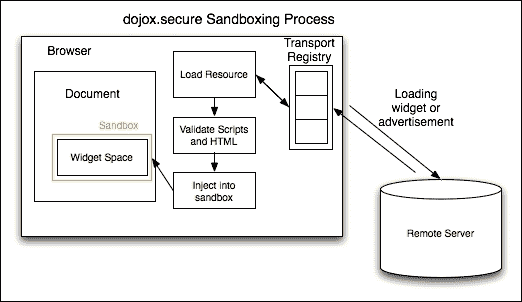
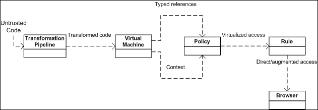

# 第十一章. 扩展 JavaScript 和 ECMAScript 6

ECMA 262 是一个定义 JavaScript 语言核心特性的标准。由该标准定义的语言称为 **ECMAScript**。JavaScript 是 ECMAScript 的一个实现。它在客户端的网页浏览器中运行，而 Node.js 在服务器端运行。ECMAScript 6 于 2015 年 6 月发布。ES6 是从 2009 年发布的 ES5 的一次重大更新。

可以从 [`people.mozilla.org/~jorendorff/es6-draft.html`](https://people.mozilla.org/~jorendorff/es6-draft.html) 获取 ES6 语言规范的完整语言规范草案。

# 兼容性和目标

ES6 兼容性图表显示了当前浏览器支持 ES6 的哪些功能。它还链接了所有列出的功能到它们的规范指南。

### 注意

应注意，一些功能可能不符合其确切规范。在 Chrome 中工作时要记得启用实验性 JavaScript 标志。


参考：使用 ECMAScript 6 今天

ECMA6 脚本有以下主要目标：

+   默认导出

+   模块的静态结构

+   支持异步和同步加载

+   用于模块之间的依赖关系

# JavaScript 子集和扩展

子集主要为了安全目的而定义；使用安全语言子集编写的脚本即使其源代码不可信，例如广告服务器，也可以安全执行。其中一些子集将在后面进行描述。

随着 JavaScript 的持续发展和允许显式扩展，发布了新版本。许多功能被标准化。这些扩展与现代浏览器（如 Firefox 和 Chrome）兼容。然而，非标准扩展的实现可能需要一个外部编译器，因为这些功能目前正在主要的 JavaScript 引擎中更新。

## JavaScript 子集

如前所述，为了执行不可信代码的安全性，我们在 JavaScript 中使用子集。例如，当我们有一个信用卡检查脚本，其中信用卡号被发送到远程服务器时，为了这种类型的信息安全，我们使用子集。通过定义子集，我们检查了一个我们严格不允许的程序的行为。这意味着我们为一定量的代码使用子集，而代码的其他部分被省略。

JavaScript 子集有两个目标：

+   应将子集构造添加以最大化 JavaScript 构造的使用范围

+   它用于扩展分析以适应变化

这些子集的定义出于各种原因。

**优点**：这是一个子集，它是用于脚本最佳和值得部分的语言的一部分。这个子集的主要目标是净化和简化代码，使脚本更容易理解。优点子集没有 `eval()` 函数。它还消除了 `continue` 和 `with` 语句。它不包括函数定义语句，只使用函数定义表达式来定义函数。使用函数定义语句定义函数后，它不再使用函数定义语句。

### 注意

在子集的花括号中，我们有一个循环和条件语句的主体。如果主体中只有一个语句，那么它不会允许省略括号。

### 安全子集

有各种安全子集的实现。其中一些在这里简要描述。

#### ADsafe

**ADsafe** ([`www.adsafe.org/`](http://www.adsafe.org/)) 是最早提出的安全主题之一。它由 Douglas Crockford 提出并创建。ADsafe 使用工具，如 **JSLint** ([`www.jslint.com/`](http://www.jslint.com/)) 来验证不安全的代码。它强制执行良好的编程实践，因此不安全代码正确执行的可能性要高得多。它阻止脚本访问全局变量或直接访问 DOM。相反，它允许脚本访问 ADsafe 对象，该对象提供对安全 API 的访问和间接访问 DOM 元素。ADsafe 不更改脚本，不会影响其功能。它使我们能够快速确定脚本是否可以放置在页面上。它还作为一个基础，有助于开发其他安全子集。

#### Dojox

**dojox.secure** 工具 ([`dojotoolkit.org/reference-guide/1.10/dojox/secure.html`](https://dojotoolkit.org/reference-guide/1.10/dojox/secure.html)) 是一个受 ADsafe 启发的安全子集。它是 **Dojo** 工具包 ([`dojotoolkit.org`](http://dojotoolkit.org)) 的扩展，由 Kris Zyp 开发。它完全集成了确保不受信任的代码、内容、广告和来自不同域的小部件安全执行和加载的组件。它提供了一个沙盒环境，并限制了用于交互的 DOM 元素：



#### Caja

**Caja** ([`developers.google.com/caja/`](https://developers.google.com/caja/)) 是由 Google 提供动力的开源安全子集。Caja（在西班牙语中意为“**盒子**”）进一步定义了两个子集：

+   **Cajita**（在西班牙语中意为“**小盒子**”）是一个狭窄的子集，就像 ADsafe 和 dojox.secure 一样。

+   **Valija**（在西班牙语中意为“**手提箱**”）是一个更广泛的子集，并且与严格模式的 ECMAScript（移除了 `eval()` 方法）非常相似。

Caja 是一个编译工具，它将 HTML、CSS 和 JS 等第三方内容转换为安全代码，这使得代码更容易嵌入到网站中。

#### FBJS

**FBJS**([`github.com/facebook/fbjs`](https://github.com/facebook/fbjs))是 Facebook 使用的 JavaScript 安全子集。它允许在安全环境中执行不受信任的代码。它通过转换代码来确保安全性。在转换过程中，所有顶级标识符都被添加了模块特定的前缀。添加模块特定前缀可以防止查询任何全局标识符。例如，你正在开发一个具有`xyz123` ID 的应用程序，代码中有一个`foo()`函数。它最终会变成`xyz123_foo()`。甚至对`eval()`的函数调用也会被重定向到一个不存在的函数。

#### 微软的 web sandbox

微软的**Web Sandbox**([`www.websandbox.org/`](http://www.websandbox.org/))定义了一个广泛的、安全的 JavaScript、HTML 和 CSS 子集。沙盒通过实现宿主虚拟化来提供安全性和可扩展性。不受信任的代码在虚拟机中执行，而不是直接在浏览器中运行。虚拟机将不受信任的代码隔离，防止它与虚拟机外的元素交互。让我们看一下以下块图：



微软的 Web Sandbox

## JavaScript 扩展

已经编码了许多新的和有用的功能。它们将在 ES6 的发布中得到标准化。ES6 计划于 2015 年 6 月正式发布。然而，许多功能和扩展已经在 Firefox 和 Chrome 上可用（为了访问一些 ES6 功能，必须将实验性 JavaScript 标志打开）。我们将在本章的其余部分讨论主要功能。

## Const

它的工作方式类似于`var`变量关键字。为了声明一个常量，我们使用`const`这个词。为了使用赋值，我们必须声明常量。

### 注意

使用 const 声明的值不能被重新声明、重新定义或重新初始化。JavaScript 通过 math 对象提供了 8 个常量。其中之一是 PI。我们无法使用 const 重新初始化 PI。

## Let

`Let`关键字用于变量的块作用域。变量在代码的开始处声明，而不是在函数的开始处：

```js
var name = "john";
console.log(name);
```

在前面的例子中，`john`这个名字是控制台中记录的名字的值。JavaScript 中的声明被移动到顶部。在函数作用域中声明的或初始化的变量的位置并不重要，它们将默认提升到顶部。JavaScript 的默认行为是将变量声明移动到顶部。

提升是 JavaScript 的默认行为，将变量声明移动到顶部。

JavaScript 中的变量是函数作用域的。这意味着，变量在整个函数中都是可用的，即使它们是在嵌套的代码块中声明的。以下是一个简短的例子，我们将记录客户端（即 Chrome、Firefox 等）控制台中的输出：

```js
var name = "john";
(function () {
  // var name = undefined;
  if (!name)
  { var name = "jane"; }
  console.log(name); // "jane"
}());
```

从前面的例子中，用于在控制台中登录的名字的值是`jane`。

ES6 使用 `let` 来处理这个问题。`let` 和 `var` 非常相似。唯一的区别是 `let` 是块作用域的，而 `var` 是函数作用域的。我们可以使用 `let` 重新编写之前的例子，如下所示：

```js
var name = "john";
(function () {
  // var name = undefined;
  if (!name) {
    let name = "jane";
  }
  console.log(name); // "john"
}());
```

注意，尽管在函数内部 `name` 的值是 `jane`，但使用 `let` 关键字将其作用域设置为全局，并且 `name` 的默认值是 `john`。因此，`john` 被记录在客户端控制台中。

### 注意

如果我们将一个变量声明为常量，给它赋一些值，然后在其他地方使用相同的常量改变它的值，那么它的新值将被忽略。像变量一样，我们可以在脚本中的任何地方添加常量而不会破坏代码。

## 解构赋值

我们可以使用一条命令将多个值赋给函数中的变量。

## For each

属性值的迭代是通过这个循环完成的。属性名的迭代也已经完成。

## 迭代器

下一个方法的对象被返回。返回的对象具有 `_iterator_` 属性。迭代器用于 `iteratable` 对象。

## 生成器

对象的生成在这里完成。每当函数调用 `this` 方法时，都会返回一个生成对象。使用 `yield` 关键字指定函数的当前执行。

## 数组

在数组中有相同值的 `iteratable` 对象可以通过使用数组来简写。

## 生成器表达式

函数被简写为多个 `try-catch` 表达式。返回的是用 `{}` 包裹的生成对象，而不是用 `[]`。我们用这个来将多个值赋给函数中的变量。

# 作用域变量和常量

当我们声明一个变量时，它就具有局部作用域和全局作用域。我们可以在脚本中的任何地方定义一个变量。当我们用 JavaScript 声明一个变量时，我们可以在声明时或之后给它赋值。以下是一个示例：

```js
_xyz123; // variable declared without assigning a value to it
varabc = "Star"; //variable declared while assigning a value to it
```

在 JavaScript 中，变量是通过查询中的美元符号定义的。在 JavaScript 中，我们使用 `var` 关键字动态创建变量。每个变量都有一个与之关联的名称和值。这些值可以是任何类型，例如 `number`、`array`、`string` 等。变量名可以是字符和数字的组合。以下是一个示例：

```js
(a==undefined){
a=5}
```

在函数外部声明的变量是一个**全局变量**，具有全局作用域。这意味着它可以从脚本中的任何地方访问。

我们也可以使用 `const` 关键字声明一个变量为常量。常量变量的值是恒定的。

可以使用 `const` 关键字定义常量，如下所示：

```js
Const a=5;
```

### 注意

`const` 和 `let` 关键字以类似的方式工作，因为它们都是块作用域的。然而，在 `const` 的情况下，值不能被重新声明、重新定义或重新初始化。简而言之，`const` 值是只读的。

这里有一个工作示例：

```js
const PI = 3.14159265359;

console.log("value of PI = " + PI); //value of PI = 3.14159265359

PI = 3.1415; //<------- Can not re-assign value to PI

console.log("value of PI = " + PI); //value of PI = 3.14159265359

const PI = 2.0312; //<------- Can not re-initialize value of PI

console.log("value of PI = " + PI); //Uncaught TypeError: Identifier 'PI' has already been declared

var PI = 9.2144; //<------- Can not re-declare value of PI

console.log("value of PI = " + PI); //Uncaught TypeError: Identifier 'PI' has already been declared.
```

类变量在类中声明，而不是在任何类的任何方法中声明，而局部变量存在于任何类的任何方法中。

# 简短函数

简短函数，也称为**表达式闭包**，是 JavaScript 中使用简单函数的技术。它用于在事件中省略函数的花括号；它返回一个 `true` 或 `false` 语句。同样，如果你省略 `return` 关键字，它也会发送完全相同的结果。

表达式将在你的脚本中的参数列表之后快速评估，通过省略花括号和 `return` 关键字。

这里有一个示例：

```js
Let student=function(a)
A+1, yes
Function()
True,no
```

它的行为类似于函数。它们通过花括号和 `return` 语句定义。当我们要将函数作为参数传递给另一个函数时，这非常有用。

# 多重捕获子句

在 JavaScript 中，`try/catch` 语句用于处理 `try` 代码块中存在的异常。

## try 子句

在 `try` 块中，执行要评估的语句。

### 提示

如果你想故意抛出异常，我们将使用 `throw` 语句。这将中止剩余语句的执行，并将控制权转移到 `catch` 块。

## catch 子句

在检查 `try` 块中的语句并遇到错误后，将调用异常块。如果遇到的异常与 `catch` 块中处理的异常相同，则控制立即转移到 `catch` 块，并执行 `catch` 块内的语句。

在错误语句之后呈现的语句将**不会**执行，除非 `finally` 块中有 `return` 语句。

### 提示

一个好的做法是，如果我们预计可能会发生任何异常，首先使用条件 `catch` 子句。无条件 `catch` 子句放在最后，以处理所有剩余的异常：

```js
try {
  demotrycatchfunction(); // may throw any type of exceptions
}
catch (e) {
  if (e instanceofReferenceError) {
    // statements to handle ReferenceErrorexceptions
  } else if (e instanceofSyntaxError
) {
  // statements to handle SyntaxError exceptions
  }
  else if (e instanceofEvalError) {
    // statements to handle EvalError exceptions
  }
  else {
    // statements to handle any unspecified exceptions
    logMyError(e); // pass the exception object to the error handler
  }
}
```

## finally 子句

无论是否发生异常，此块都将执行末尾存在的语句。`finally` 块中的语句无论是否发生错误都会执行。`finally` 块通常包含必须执行的代码。因此，我们通常在 `finally` 块中释放资源并关闭连接。编写简单的 `try-catch-finally` 块的语法如下：

```js
try {
  //try code - This is the Code block to try
}
catch(error) {
  //catch code – This is the Code block that handle errors
}
finally {
  //finally code - This is the Code block to be executed regardless of try catch results
}
```

我们也可以用嵌套的 `catch` 块来写，如下所示：

```js
try {
  //do something
}
catch (Exception e) {
  try {
    //do something with little likeliness of output
  }
  catch (Exception ex) {
    try {
      //do the minimum acceptable
    }
    catch (Exception e1) {
      //More try catches?
    }
  }
}
```

这里有一个示例，展示了多重 `catch` 子句的工作原理：

```js
functionCheckEligibility(Age) {
  var result;
  try { //try block
    if (Age < 16 { //condition to be tested
    throw new Error("Children below the age of 16 are not allowed. Parent Supervision needed!"); //incase of false result, an error will be raised
    }
  result = age;
  }
  catch (e) { //catch block
    console.log(e.toString()); //error is converted to string and logged into the console
    throw e; //Uncaught Error
  }
  finally { // finally block - It will run in the end regardless of the try, catch results
    console.log("Age doesn't matter!"); 
  }

  return result;
};
```

让我们传递 14 作为函数的参数，如下所示：

```js
CheckEligibility(14);
```

输出将如下所示：

```js
Children below the age of 16 are not allowed. Parent Supervision needed!
```

### 注意

在 `try-catch` 语句中，我们必须至少有一个 `finally` 或 `try-catch` 块。`try` 不一定需要一个 `catch` 子句。如果一个 `try` 语句不包含至少一个 `catch` 块，它必须包含一个 `finally` 块。与 `try-catch-finally` 一起的可能异常处理子句是 `try-catch`、`try-finally` 或 `try-catch-finally` 子句。

# E4X – ECMAScript for XML

它是 JavaScript 对 XML 扩展的支持的扩展。通过使用 E4x，它通过 DOM 接口提供了对 XML 文档的便捷访问。它是一种在**Rhino**和**SpiderMonkey**中使用的服务器端技术，因为这些是所有浏览器都提供的强大扩展。

在 E4X 之前，读取和写入 XML 非常困难且耗时。在 JavaScript 中，E$X 提供 XML 文档作为 XML 对象，它将 XML 片段表示为`xmlList`。E4X 支持特殊的 XML 对象。这种技术在客户端编程中得到了应用。

下面是一个示例：

```js
varstudent=<student>
<studentInfo>
<name>Ali</name></studentInfo>
</student>
```

如果我们将此 XML 输入到我们的 JavaScript 代码中，E4X 解释器将将其作为脚本中的 XML 对象处理。

# ECMAScript 6 特性

ECMAScript 6，也称为**ECMAScript 2015**，是 ECMAScript 标准的最新形式。ES6 是对语言的重大升级，也是自 2011 年 6 月发布 ES5.1 以来的第一次语言更新。

ES6 的一些新特性包括：

+   箭头函数

+   类

+   增强对象字面量

+   解构赋值

+   扩展参数处理

+   生成器

+   模块

+   代理

我们将在接下来的章节中查看所有这些函数。

## 箭头函数

箭头函数也称为**肥箭头函数**。它是一个函数，类似于我们在 C#、Java 和 Coffee Script 中使用的函数。箭头支持语句和表达式体。箭头的词法与其周围的代码相似。这在函数中是不一样的。

如其名所示，箭头函数使用更短的语法，即箭头（`=>`），用于定义和语法。

例如，看看下面的示例：

```js
// An empty arrow function returns undefined
let empty =()=>{};

(()=>"pine")()// returns "pine"

var simple = a => a >20?20: a;
simple(20);// 20
simple(10);// 10

let max =(a, b)=> a > b ?a : b;

// Easy array filtering, mapping, ...

varsampleArray=[7,4,1,0,3,5,11];
var sum =sampleArray.reduce((a, b)=> a + b);// The answer is 29
var even =sampleArray.filter(v => v %2==0);// The answer is [4, 0]
var odd =sampleArray.filter(v => v %2!=0);// The answer is [7, 1, 3, 5, 11]
var double =sampleArray.map(v => v *2);// The answer is[14, 8, 2, 0, 6, 10, 22]
```

与函数表达式相比，箭头函数表达式或肥箭头函数在语法上更短。箭头函数用于绑定 this 的值。（它不绑定自己的`arguments`、`super`、`this`或`new.target`）。箭头函数是无名的。

`yield`关键字用于`暂停`和`恢复`生成器函数（使用带星号的`function*`关键字定义的返回`Generator`对象的生成器函数）。

## 类

ES6 类的语法比基于原型的面向对象模式的区域语法糖更简单、更容易使用。这是一种语法糖。一次性声明使类模式更容易使用，并简化了类模式的使用。类支持构造函数、实例、基于原型的继承、静态方法和超类调用。

下面是一个在 ES6 和 ES5 中编写类的示例：

```js
//ES5
functionsomeES5Class(fname, age) { // standard way to create an object prototype i.e. constructor function
  this.fname = fname;
  this.age = age;
}

someES5Class.prototype.sayName = function() { //prototype property enables us to add new functions to an existing prototype
  console.log(this.fname);
}

someES5Class.prototype.sayAge = function() { //prototype property enables us to add new functions to an existing prototype
  console.log(this.age);
}

varmyInstance = new someES5Class('Talha', 25); //new keyword is used with a constructor function to create new objects from the same prototype
myInstance.sayName(); //the new method can then be called as a regular member
myInstance.sayAge();

/*Output:
Talha
25*/

//ES6
classsomeES6Class { // ES6 class
  constructor(fname, age) { // a constructor is defined with default parameters
    this.fname = fname;
    this.age = age;
  }

  sayName() { //functions can be added to the class
    console.log(this.fname);
  }

  sayAge() { //functions can be added to the class
    console.log(this.age);
  }
}

varmyInstance = new someES6Class('Talha', 25); //new keyword is used to create new objects from the class
myInstance.sayName(); //functions are the class members and can be called directly
myInstance.sayAge();
/*Output:
Talha
25*/
```

## 增强对象字面量

对象字面量是 JavaScript 中最流行的模式之一。JSON 基于对象字面量。其受欢迎的原因在于它提供了一种非常快速、简洁、整洁的方式来执行`key:value`赋值、定义方法、评估表达式和进行超类调用。ES6 以各种方式扩展了对象字面量语法。这使得它们更有用。这里解释了对象字面量的两种扩展类型。

### 属性初始化简写

在 ECMAScript 5 中，对象字面量是一组以逗号分隔的 `name:value` 对。在初始化属性值时，存在重复的可能性。

这里有一个例子：

```js
functioncreateStudent(StudentID, name, class) {
  return {
    StudentID: StudentID,
    name: name,
    class: class,
  };
}
```

在前面的例子中，`createStudent()` 函数创建了一个 `student` 对象，其 `name` 和 `class` 属性与函数参数相似。这导致了 `name` 和 `class` 属性的重复，尽管它们的行为不同。

为了纠正这一点，ECMAScript 6 中引入了初始化器简写属性。这消除了属性名和局部变量之间重复的所有可能性。

例如，`createStudent()` 可以修改如下：

```js
functioncreateStudent(StudentID, name, class) {
  return {
    StudentID,
    name,
    class,
  };
}
```

如果属性名将与属性值相同，则可以简单地包含属性名而不加冒号和值。

如果对象字面量的属性没有值，JavaScript 引擎会在周围搜索具有相同名称的变量。如果搜索过程成功，则将值分配给对象字面量中的相同属性名。

### 方法初始化器简写

随着 ECMAScript 6 的出现，许多事情得到了改进，使得网页开发者的工作变得更加简单。对象字面量中编写方法的语法得到了极大的改善。在 ECMAScript 5 中，我们需要指定一个名称并立即编写完整的函数定义。

这里有一个例子：

```js
varcustomer = {
  name: "Samantha",
  logName: function() {
    console.log(this.name);
  }
};
```

在 ECMAScript 6 中，语法变得更容易编写。冒号和函数关键字已被移除。相同的示例可以重写如下：

```js
varcustomer = {
  name: "Samantha",
  logName() {
    console.log(this.name);
  }
};
person.logName();varobject = {
  // __prototype__
  __prototype__: theProtoTypeObj,
  // Shorthand for 'handler: handler'
  handler,
  // Methods
  toString() {
    // Super calls
    return "x " + super.toString();
  },
  // Dynamic property names
  [ 'property_' + (() => 20)() ]: 20
};
```

## 模板字符串

模板字符串通过语法糖增强了 ECMAScript，用于构建字符串。这个组件类似于 Perl、Python 等语言中的字符串插入高亮。你同样可以添加一个标签来允许重用字符串开发，避免和防止注入攻击或从字符串内容构建复杂的数据结构。它们还使我们能够创建**领域特定语言**（**DSLs**）以安全的方式处理内容。

与向 JavaScript 字符串添加更多扩展功能不同，模板字符串提供了一种全新的字符串插值方法。

### 基础知识

模板字符串的最简单格式如下：

```js
literal${substitution_variable}literal
```

这是模板字符串的最基本形式，它执行替换操作。

模板字符串用反引号（`` ` ``）而不是单引号或双引号括起来。这里有一个例子：

```js
letbasic_string = `Kung Fu Panda`;

console.log(basic_string);               // "Kung Fu Panda"
console.log(typeofbasic_string);        // "string"
console.log(basic_string.length);        // 13
```

在这个例子中，`basic_string` 变量包含一个简单的 JavaScript 字符串。模板字符串语法仅用于创建字符串值，然后将其分配给 `basic_string`。

如果需要在字符串中使用反引号，则可以使用反斜杠（`\`）进行转义：

```js
letbasic_string = `\`Kung Fu\` Panda.`;      // `Kung Fu' Panda
```

### 多行字符串

在这种类型的字符串中，我们可以在单行代码中添加多行。要在字符串中插入新行，我们必须在字符串中手动包含 `\n`，如下所示：

```js
letmultiline_string = "Kung Fu Panda, \n\
Releasing in 2016";

console.log(multiline_string);
```

这的结果是：

```js
Kung Fu Panda
Releasing in 2016
```

我们需要小心空格，因为反引号内的空格被认为是字符串的一部分。所有在第二行之前的空格都被认为是字符串的一部分。

## 解构赋值

在 JavaScript 中，*解构*意味着模式匹配。在 ES6 中，我们可以在对象和数组中进行高效的模式匹配。以前，这是一个漫长且复杂的过程。以下是一些在客户端控制台编写的有效示例。

从对象和数组中获取数据在 JavaScript 中非常常见。对象属性通常存储在局部变量中以实现即时访问。让我们看看以下代码片段：

```js
var settings = {
  replay: true,
  save: false
};

// later

varlocalReplay = options.replay,
localSave = options.save;
```

ES6 通过引入解构赋值使这变得更加容易，它遍历一个对象或数组，并将指定的值存储在局部变量中。它允许使用模式匹配来绑定对象和数组。

### 数组解构

所有变量可以一次性初始化和交换，而不是传统的创建临时变量的方式：

```js
var [ first, last ] = ["one", "hundred"] // initialize
console.log(first + " to " + last); // one to hundred

[first, last] = [last, first] // variable swapping
console.log(first + " to " + last); // hundred to one
```

使用数组解构可以轻松地从函数返回多个值。我们不必围绕一个对象进行包装。要跳过变量，可以留空数组元素的位子：

```js
function dob() {
  return [29, "November", 1990, "Thursday"];
}
var [date, month, year, day] = dob();
console.log("My date of birth is on " + date + " " + month); // My date of birth is on 29 November
```

### 对象解构

由于解构，变量也可以从函数返回的对象中初始化，即使对象嵌套很深。

解构允许变量从具有深层嵌套对象的函数返回的对象中初始化。就像数组解构一样，我们可以跳过不需要的变量。以下是有效代码片段：

```js
function dob() {
  return {
    date: 29,
    month: "November",
    year: 1990,
    time: {
      hour: 12, // nested
      minute: 35,
      meridian: "AM"
    }
  };
}

var { date: d, month: m, time : { hour: h, meridian: p } } = dob();
// h is the nested property while year and minute is skipped

console.log("I was born on " + d + " " + m + " at " + h + " " + p); // I was born on 29 November at 12 AM
```

## 扩展参数处理

函数是任何语言的一个重要和基本的部分。ES6 在函数方面引入了许多增量改进。这使得它们更不容易出错，并且更强大。

函数允许传递任意数量的参数，无论函数定义中参数的数量是多少。这些参数可以传递给函数的三种类型如下：

+   默认值

+   剩余参数

+   展开运算符

### 默认参数

ES6 允许我们设置默认参数。具有默认值的参数被认为是可选的。它将尾随参数绑定到一个数组上：

```js
function multiply(x, y) {
  y = typeofy !== 'undefined' ?  y : 1;

  returnx*y;
}

multiply(10);
```

### 剩余参数

剩余参数取代了`arguments`的需要，并更直接地解决了常见情况。剩余参数由三个点（`…`）在参数之前表示。

这里有一个展示剩余参数的例子：

```js
//Rest Parameter
function sum(…nums) {
  var result = 0;
  nums.forEach(function(number) {
    result += number;
  });
  return result;
}
console.log(sum(1)); // 1
console.log(sum(1, 2, 3)); // 6 
```

命名参数变成一个包含剩余参数的数组。添加多个命名参数可能会导致语法错误。

### 展开运算符

展开运算符与剩余参数非常相似，但它允许我们将数组拆分为单独的参数，然后作为单独的参数传递给函数。

这里有一个展示展开运算符的例子：

```js
//Spread Operator
functionsum2(a, b, c) {
  return a + b + c;
}
varargs = [1, 2];
console.log(sum(…args, …args, 3)); // 6
```

这里有一个展示默认、剩余和展开参数使用的例子：

```js
function sum() {
  return ;
}
console.log(sum(
(1, 2)
//Spread Operator

//Rest Parameter
//Default Parameter Values
//Default Parameter Values
functioninc(num, increment = 1) {
  returnnum + increment;
}
console.log(inc(2, 2)); // 4
console.log(inc(4)); // 5
```

## 绑定

`let` 关键字是一个新的 `var`。`let` 关键字的声明语法与 `var` 相同。您基本上可以用 `let` 替换 `var` 来声明一个变量，但保持其作用域在当前代码中：

```js
functiongetCuisine(condition) {

  if (condition) {
    letcuisine = "Mediterranean";

    // other code

    returncuisine;
  }
  else {

    // cuisine does not exist here

    return null;
  }

  // cuisine does not exist here
}
```

使用 `const` 定义的变量被认为是常量，因此一旦设置值后就不能更改。因此，每个 `const` 变量都必须进行初始化：

```js
// Valid constant
const ITEMS = 10;

// Syntax error: missing initialization
const ITEM;
```

## 迭代器和 for...of 操作符

我们使用迭代器来允许自定义对象的迭代方法/行为，例如 CLRIE 可数或 Java Iterable。将 `for..in` 操作符泛化到基于自定义迭代器的迭代，使用 `for..of`。迭代器是 ECMAScript 6 的一个重要特性。当与新的数组方法和新的集合类型（例如集合和映射）结合使用时，迭代器对于数据的高效处理变得更加重要。

斐波那契数，或斐波那契排列，是伴随的整数序列中的数：

```js
let fibonacci = {
  [Symbol.iterator]() {
    let x = 0, y = 1;
    return {
      next() {
        [x, y] = [y, x + y];
        return { done: false, value: y }
      }
    }
  }
}

for (vari of fibonacci) {
  // truncate the sequence at 3000
  if (i> 3000)
  break;
  console.log(i);
}
```

## 生成器

自定义迭代器是一个有用的工具，但它需要仔细编程，以便可以显式地维护其内部状态。ES6 引入了生成器，它提供了一个强大的替代方案。生成器允许我们通过编写单个函数来创建迭代算法。这个单函数能够维护其自己的状态。

`生成器` 是一个返回迭代器的函数。`生成器` 函数通过在函数关键字后嵌入一个星号 (`*`) 来表示。如果一个普通函数包含一个 `yield` 表达式并使用 `function*` 语法，它就变成了一个生成器。

### 小贴士

在 `function` 关键字和星号之间是否有空格无关紧要。

在生成器函数中使用 `yield` 关键字来指示在调用 `next()` 方法时迭代器必须返回的特性。因此，如果您需要为 `next()` 的每次递进调用返回唯一值：

我们可以将之前的迭代器示例转换为使用生成器，如下所示：

```js
let fibonacci = {
  *[Symbol.iterator]() {
    let prex = 0, cury = 1
    for (;;) {
      [ prex, cury ] = [ cury, prex+curv ] = [
        yield cury
    }
  }
}

for (let ni of fibonacci) {
  if (ni> 3000)
  break
  console.log(ni)
}
```

## 更好的 Unicode 支持

ES6 支持 Unicode，包括字符串中的新 Unicode 字面量形式，新的 `RegExp u` 模式来处理代码点，以及新的 API 来处理 21 位代码点级别的字符串。这些更新使我们能够在 JavaScript 中创建全局应用程序。ECMAScript 6 强制字符串使用 UTF 编码。

支持的 Unicode 示例如下：

```js
// same as ECMAScript 5
"▯".length == 2

// new RegExpbehaviour, opt-in 'u'
"▯".match(/./u)[0].length == 2

// new form
"\u{1D306}"=="▯"=="\uD834\uDF06"

// new String ops
"▯".codePointAt(0) == 0x20BB7

// for-of iterates code points
for(var c of "▯") {
  console.log(c);
}
```

## 模块

ECMAScript 6 允许我们在模块之间导出和导入符号，而不会污染全局命名空间。它为组件定义提供了额外的模块支持。运行时行为由宿主定义的默认加载器定义。它是一个隐式异步模型；除非必要的模块可用并处理，否则不会执行任何代码：

```js
export function sum(x, y, {
  return x + y
}

console.log("4π = " + math.sum(math.pi, math.pi, math.pi, math.pi));

console.log("2π = " + sum(pi, pi));
```

一些额外的功能包括 `export default` 和 `export *`，如下代码片段所示：

```js
exportvar e = 2.71828182846;

export default function(x) {
  returnMath.log(x);
}
console.log("2π = " + ln(e)*pi*2);
```

## 模块加载器

模块加载器主要用于解析模块指定符、加载模块等。它们负责下载所需的模块并异步绑定它们。这揭示了客户端脚本的依赖关系。构造函数是`Reflect.Loader`。

模块加载器支持：

+   编译钩子

+   嵌套虚拟化

+   动态加载

+   全局命名空间隔离

+   状态隔离

### 加载器方法

+   `System.module(source, options?)`：这个方法用于评估源中的 JavaScript 代码到一个模块（通过保证非并发地交付和返回）

+   `System.set(name, module)`：这个方法用于注册由`System.module()`创建的模块

+   `System.define(name, source, options?)`：这个方法用于评估源中的模块代码并注册结果

我们可以配置默认模块加载器，并构建新的加载器来评估和加载隔离或受限上下文中的代码：

```js
System.import('libraries/math').then(function(mx) {
  console.log("π = " + (mx.pi));
});

// Create execution sandboxes – new Loaders
var loader = new Loader({
  global: fixup(window)
});
loader.eval("console.log('live to code!');");

// Directly manipulate module cache
System.get('jquery');
System.set('jquery', Module({$: $}));
```

## 集合

**集合**在 JavaScript 中用于创建任何类型的唯一值集合。在值集合中，你也可以添加和移除值。集合中没有直接访问值的方式，它们是数组类型。

在 ECMAScript 6 中，集合是存储数据的一种新的高效方式。JavaScript 数组与其他编程语言的数组类似，具有索引。通过使用这些数组，你可以提取双倍和三倍数据，也可以堆叠数据。JavaScript 中有许多新的集合类型。以下是一些示例：

+   集合

+   映射

+   WeakMap

+   WeakSet

### 集合

一个`set`有一个唯一的值集合。集合的唯一值也是对象引用类型。集合中的值不能重复。在从`set`访问值之前，你需要检查这些值是否存在。

我们可以在`set`中添加值，也可以检查`set`中值的数量。以下是一个示例：

```js
Var students=new set();
Students.add(10);
Students.add("Ali");
```

### 映射

`map`对象是一个`键/值`映射。`map`中的任何值都可以用作键或值。元素可以在`map`中以插入顺序迭代，并返回一个包含值或键的数组。`map`有两个属性：

+   `Map.length`：返回`map`中元素的数量

+   `Map.prototype`：`Map.prototype`属性代表`map`构造函数的原型

这里是`map`对象的一些方法。

#### Map.prototype.clear()

`clear()`方法用于从`map`对象中移除所有元素。

##### 返回值

它不返回任何内容。

##### 参数

没有输入参数。

##### 描述

使用此函数后，我们在 map 上初始化的所有内容都将被清除。该函数没有参数，也不返回任何内容，因为它会清除所有内容。

这里是这个方法的示例：

```js
varmyMap=newMap();
myMap.set("pine","apple");
myMap.set(1,"apple");

myMap.size;// 2
myMap.has("cone");// will return false

myMap.has("pine")// will return true
```

#### Map.prototype.delete()

`delete()`方法用于从`Map`对象中移除指定的元素。

##### 返回值

如果 map 对象中的组件存在并且已被移除，则返回`true`。如果组件不存在，则返回`false`。

##### 参数

需要一个键。这里的键基本上是要移除的元素。

##### 描述

这与 `map.prototype.clear()` 不同，因为它明确地删除了特定的元素，而不是删除映射上的每个元素。我们传递一个键（要删除的元素），函数根据键返回 `true` 或 `false`。

这里是此方法的示例：

```js
varmyMap=newMap();
myMap.set("pine","apple");

myMap.delete("apple");// Returns true. Successfully removed.
myMap.has("apple");// Returns false. The "apple" element is no longer present.
```

#### `Map.prototype.entries()`

此函数用于告诉我们映射上元素的键和值。

##### 返回值

它返回一个包含映射上每个元素键和值的新的 `iterator` 对象。

##### 参数

没有输入参数。

##### 描述

此函数用于让我们了解映射上组件的键和值。

这里是此方法的示例：

```js
varmyMap=newMap();
myMap.set("0","pine");
myMap.set(1,"apple");
myMap.set({},"cone");

varmapIter=myMap.entries();

console.log(mapIter.next().value);// ["0", "pine"]
console.log(mapIter.next().value);// [1, "apple"]
console.log(mapIter.next().value);// [Object, "cone"]
```

#### `Map.prototype.forEach()`

`forEach` 方法在映射对象中的每个键/值对上执行给定的回调一次。

##### 返回值

它不返回任何内容。

##### 参数

有三个参数：元素 `value`、元素 `key` 和正在遍历的 `map` 对象。

##### 描述

`forEach` 策略对指南中实际存在的每个键执行给定的回调一次。它不针对已删除的键进行构造。不过，它会对可用的值执行；然而，它们具有定义的值。

这里是此方法的示例：

```js
functionlogMapElements(value, key, map) {
  console.log("m["+ key +"] = "+ value);
}
Map([["foo",3],["apple",{}],["cone", undefined]]).forEach(logMapElements);
// logs:
// "m[pine] = 3"
// "m[apple] = [object Object]"
// "m[cone] = undefined"
```

#### `Map.prototype.get()`

使用 `get()` 方法返回映射中的特定元素。

##### 返回值

它返回用作参数的键（仅在映射中找到时）；否则，它返回错误信息。

##### 参数

它需要一个从映射中返回的键。

##### 描述

我们输入一个想要在映射中找到的键，函数返回它。当我们要获取元素的值时使用。

这里是此方法的示例：

```js
varmyMap=newMap();
myMap.set("apple","pine");

myMap.get("apple");// Returns "apple".
myMap.get("cone");// Returns undefined.
```

#### `Map.prototype.has()`

如果元素存在，则函数返回 `true`（布尔值），如果不存在，则返回 `false`。

##### 返回值

如果在 `map` 对象中存在具有指定键的组件，则返回 `true`。如果没有找到，则返回 `false`。

##### 参数

需要一个键。

##### 描述

我们在函数中传递一个键来检查某个元素是否存在于映射中。如果元素存在，则返回 `true`；否则，返回 `false`。

这里是此方法的示例：

```js
varmyMap=newMap();
myMap.set("apple","pine");

myMap.has("apple");// returns true
myMap.has("cone");// returns false
```

#### `Map.prototype.keys()`

它返回映射中每个元素的键。

##### 返回值

它返回一个新对象，该对象包含映射上所有元素的键。

##### 参数

没有输入参数。

##### 描述

`keys()` 策略返回另一个 `iterator` 对象，该对象包含 `map` 对象中每个组件的键，按插入顺序排列。

此方法的示例如下：

```js
varmyMap=newMap();
myMap.set("0","pine");
myMap.set(1,"apple");
myMap.set({},"cone");

varmapIter=myMap.keys();

console.log(mapIter.next().value);// "0"
console.log(mapIter.next().value);// 1
console.log(mapIter.next().value);// Object
```

#### `Map.prototype.set()`

这是向映射中添加新元素的程序。

##### 返回值

它返回 `map` 对象。

##### 参数

这是将要添加到映射中的元素的键。

##### 描述

`set()` 策略将具有预定键和值的另一个组件包含到 `map` 对象中。

此方法的示例如下：

```js
varmyMap=newMap();

// Add new elements to the map
myMap.set("apple","pine");
myMap.set(1,"pineapple");

// Update an element in the map
myMap.set("apple","custard");
```

#### `Map.prototype.values()`

这是获取包含每个元素值的新的对象的方法。

##### 返回值

它返回一个对象，该对象包含映射上所有组件的值。

##### 参数

没有输入参数。

##### 描述

`values()` 技术返回另一个 `iterator` 对象，该对象包含 `map` 对象中每个组件的值，以插入顺序返回。

这里是这个方法的例子：

```js
varmyMap = new Map();

varkeyObj = {},
keyFunc = function () {},
keyString = "This is a sample string";

// setting the values
myMap.set(keyString, "value associated to 'This is a sample string'");
myMap.set(keyObj, "value associated to a keyObj");
myMap.set(keyFunc, "value associated to a keyFunc");

myMap.size; // 3

// getting the values
myMap.get(keyString);    // "value associated to 'This is a sample string'"
myMap.get(keyObj);       // "value associated to a keyObj"
myMap.get(keyFunc);      // "value associated to a keyFunc"

myMap.get("a string");   // "value associated to 'This is a sample string'"
// because keyString === 'a string'
myMap.get({});           // undefined, because keyObj !== {}
myMap.get(function() {}) // undefined, because keyFunc !== function () {}
```

### WeakMap

它与 map 相同，但有一些区别。它只接受对象作为键。不允许在 `WeakMap` 中使用原始数据类型。由于 `WeakMap` 不引用像键一样的对象，因此没有垃圾回收。由于这些差异，没有方法可以访问 `WeakMap` 中的键。

### 注意

`WeakMap` 中的键不可枚举，这意味着没有方法可以给你一个键的列表。`WeakMap` 中有大小属性可用。

这里有一个例子：

```js
varmyWeakMap1 = new WeakMap(),
myWeakMap2 = new WeakMap(),
varo1 = {},
o2 = function(){},
o3 = window;

myWeakMap1.set(o1, 37);
myWeakMap1.set(o2, "pineapple");
myWeakMap2.set(o1, o2); 
myWeakMap2.set(o3, undefined);
myWeakMap2.set(myWeakMap1, myWeakMap2);

myWeakMap1.get(o2); // "pineapple"
myWeakMap2.get(o2); // undefined, because there is no value for o2 on myWeakMap2
myWeakMap2.get(o3); // undefined, because that is the set value

myWeakMap1.has(o2); // will return true
myWeakMap2.has(o2); // will return false
myWeakMap2.has(o3); // will return true

myWeakMap1.has(o1); // will return true
myWeakMap1.delete(o1);
myWeakMap1.has(o1); // will return false
```

#### WeakMap.prototype.clear()

这用于从 `WeakMap` 中移除所有元素。现在已过时，但仍然在一些浏览器中使用。

##### 返回值

它返回要从中删除的 `WeakMap` 对象的键。

##### 参数

这是需要从 `WeakMap` 对象中删除的元素的键。

##### 描述

这里有一个例子：

```js
varwm = new WeakMap();
varobject = {};

wm.set(object, "pine");
wm.set(window, "apple");

wm.has(object); // will return true
wm.has(window); // will return true

wm.clear();

wm.has(object)  // will return false
wm.has(window)  // will return false
```

#### WeakMap.prototype.delete()

此方法用于从 `WeakMap` 中删除特定对象。

##### 返回值

如果 `WeakMap` 对象中的元素已成功删除，则返回 `true`。

##### 参数

这是需要从 `WeakMap` 对象中删除的元素的键。

##### 描述

`delete()` 方法从 `WeakMap` 对象中删除指定的元素。

这里有一个例子：

```js
varwm = new WeakMap();
wm.set(window, "pineapple");

wm.delete(window); // Returns true. Successfully removed.

wm.has(window);    // Returns false. The window object is no longer in the WeakMap.
```

#### WeakMap.prototype.get()

此方法用于从 `WeakMap` 中检索特定对象。

##### 返回值

它返回与指定键关联的元素，如果键在 `WeakMap` 对象中找不到，则返回 `undefined`。

##### 参数

这是返回自 `WeakMap` 对象的元素的键。

##### 描述

返回 `WeakMap` 对象中元素的键。

这里有一个例子：

```js
varwm = new WeakMap();
wm.set(window, "pine");

wm.get(window); // Returns "pine".
wm.get("apple");  // Returns undefined.
```

#### WeakMap.prototype.has()

此方法用于检查指定对象是否存在于 `WeakMap` 中。

##### 返回值

如果 `WeakMap` 对象中存在具有指定键的元素，则返回 `true`；否则返回 `false`。

##### 参数

它是要在 `WeakMap` 对象中测试是否存在的关键的键。

##### 描述

`has()` 方法返回一个布尔值，指示具有指定键的元素是否存在于 `WeakMap` 对象中。

这里有一个例子：

```js
varwm = new WeakMap();
wm.set(window, "pine");

wm.has(window); // returns true
wm.has("apple");  // returns false
```

#### WeakMap.prototype.set()

此方法用于将对象添加到特定位置。

##### 返回值

`WeakMap` 对象。

##### 参数

+   `Key`：要添加到 `WeakMap` 对象中的元素的键

+   `Value`：要添加到 `WeakMap` 对象中的元素的值

##### 描述

`set()` 方法向 `WeakMap` 对象添加具有指定键和值的新元素。

这里有一个例子：

```js
varwm = new WeakMap();
varobject = {};

// Add new elements to the WeakMap
wm.set(object, "pine").set(window, "apple"); // chainable

// Update an element in the WeakMap
wm.set(object, "cone");
```

### Weakset

这是一个不阻止其元素被垃圾回收的对象集合。在 `WeakSet` 中没有循环、迭代和学习。它有三个方法。

#### WeakSet.prototype.add(someValue)

此方法将新对象追加到 `WeakSet` 的末尾。

##### 返回

`WeakSet.prototype.add(someValue)` 方法返回 `Nothing`

##### 参数

要添加到 `WeakSet` 集合中的对象。

##### 描述

`add()` 方法将新对象追加到 `WeakSet` 对象的末尾。

下面是这个方法的示例：

```js
varmyWeakSet=newWeakSet();

myWeakSet.add(window);// add the window object to the WeakSet created above

myWeakSet.has(window);// will return true
```

#### WeakSet.prototype.delete(someValue)

此方法从 `WeakSet` 中删除指定的对象。

##### 返回

如果在 `WeakSet` 中找到值并将其删除，则返回 `true`。如果找不到值，则返回 `false`。

##### 参数

要删除的值作为参数发送。

##### 描述

`delete()` 策略从 `WeakSet` 对象中移除预定义的元素。在我们需要从 `WeakSet` 中删除某些元素时使用。

此方法的示例如下：

```js
varmyWeakSet=newWeakSet();
varmyObject={};

myWeakSet.add(window);

myWeakSet.delete(myObject);// Will return false
myWeakSet.delete(window);// Will return true.

myWeakSet.has(window);// Will return false.
```

#### WeakSet.prototype.has(someValue)

如果对象存在于 `WeakSet` 中，则此方法将返回 `true`；否则返回 `false`。

##### 返回

如果 `WeakSet` 对象中存在具有预定义值的组件，则返回 `true`；否则返回 `false`。

##### 参数

需要一个要搜索的值。

##### 描述

`has()` 技术返回一个布尔值，表明项目是否存在于 `WeakSet` 中。

下面是这个方法的示例：

```js
varws=newWeakSet();
varobject={};
ws.add(window);

mySet.has(window);  // will return true
mySet.has(object);  // will return false
```

它只有任意值。在 `WeakSet` 对象中以弱引用方式持有对象的引用。它们也可以是垃圾收集器。由于垃圾收集器，`WeakSet` 中没有当前对象的列表。这些对象是不可枚举的。

这里有一个例子：

```js
// Sets
varmySet = new Set();
mySet.add("apple").add("candy");
mySet.size === 2;
mySet.has("hello") === false;

// Maps
varmyMap = new Map();
myMap.set("boy", 27);
myMap.set(f, 25);
myMap.get(f) == 25;

// Weak Maps
varmyWeakMap = new WeakMap();
myWeakMap.set(s, { extra: 99 });
myWeakMap.size === undefined

// Weak Sets
varmyWeakSet = new WeakSet();
myWeakSet.add({ data: 99 });
```

## 代理

代理允许以广泛的行为创建对象，这些行为可用于宿主对象。它们可用于对象虚拟化、拦截、日志/分析等。代理为开发者提供了前所未有的对象控制能力，以及定义新交互模式的无限可能性。

这里有一个例子：

```js
vartargetObject = {};
varhandlerObject = {
  get: function (receiver, book) {
    return `Title, ${name}!`;
  }
};

varproxyObject = new Proxy(target, handler);
proxyObject.world === 'Lahore!';

// Proxying a function object
vartargetObject = function () { return 'Target, I am'; };
varhandlerObject = {
  apply: function (receiver, ...args) {
    return 'Le proxy';
  }
};

var p = new Proxy(target, handler);
p() === 'Le proxy';
```

## 符号

符号是一种独特类型，可以用作对象属性的标识符。符号对象是对符号原始数据类型的隐式对象包装。

这里是如何创建一个新的原始符号：

```js
var symb = Symbol(); 
```

或者

```js
var symb = Symbol('abc');
```

以下代码创建了两个新的符号。`Symbol('abc')` 并不强制将 `abc` 转换为对象，而是创建了一个新的独立对象。

```js
Symbol('abc') === Symbol('abc'); //false
```

使用 `Symbol()` 与 `new` 关键字会抛出类型错误。

```js
var symb = new Symbol(); // TypeError
```

这防止了创建显式的符号包装对象而不是新的符号值。在 ES5 之前，仅支持在原始数据类型周围创建显式包装对象。然而，出于历史原因，仍然可以创建新的原始包装对象，如 new Boolean、new `String` 和 new `Number`。

如果需要创建符号包装对象，可以使用 `Object()` 函数：

```js
var symb = Symbol("abc");
typeof symb;     // "symbol" 
var symbObj = Object(symb);
typeof symbObj;  // "object"
```

`Object.getOwnPropertySymbols()` 方法返回一个符号数组，并允许您在给定的对象上找到符号属性。

这里有一个例子：

```js
varSomeClass = (function() {

  var key = Symbol("key");

  functionSomeClass(privateData) {
    this[key] = privateData;
  }

  SomeClass.prototype = {
    doStuff: function() {
      ... this[key] ...
    }
  };

  returnSomeClass;
})();

var c = new SomeClass("bye")
c["key"] === undefined
```

### 注意

ECMAScript 6 标准使用特殊的符号表示法来表示符号，例如在标识符前加上 `@@`，如 `@@create`。

## 可继承的内置对象

在 ECMAScript 6 中，Date、Array 和 DOM 元素等内置对象可以被继承。名为 `Ctor` 的对象构造现在使用两个阶段：

+   调用 `Ctor[@@create]` 以分配对象并安装任何特殊行为

+   在新实例上调用构造函数以初始化它

已知的 `@@create` 符号可通过 `Symbol.create` 获取。内置对象现在明确公开它们的 `@@create` 语法。

以下是一个示例：

```js
// Pseudo-code of Array
classSomeArray {
  constructor(...args) { /* ... */ }
  static [Symbol.create]() {

  }
}

// User code of Array subclass
classSomeArray extends Array {
  constructor(...args) { super(...args); }
}

// Two-phase 'new':
// 1) Call @@create to allocate object
// 2) Invoke constructor on new instance
vararr = new SomeArray();
arr[1] = 123;
arr.length == 1
```

## `Promises`

ECMAScript 6 引入了 `promise`。这是一个用于异步编程的库。它是对未来可能可用值的顶级表示。许多现有的 JavaScript 库已经使用了 `promise`。

在 ES6 中提到的关于 `promise` 的某些方法。

### Promise.All()

此方法返回一个 `promise`，一旦可迭代参数中的所有 `promise` 都已解决，它就会解决。在拒绝的情况下，它返回第一个被拒绝的 `promise` 的原因。

#### 返回

`Promise.All()` 方法返回空值。

#### 参数

一个 `iterable` 对象，例如一个数组。

#### 描述

`Promises` 返回一个值数组的结果。如果数组中的任何值不是 `promise`，则使用 `Promise.resolve` 转换它。如果传递的任何 `promise` 被拒绝，则所有 `promise` 都会被拒绝，并返回一个 `promise` 拒绝的原因。它丢弃所有其他 `promise`，无论它们是否已解决。如果传递一个空数组，则此方法立即解决。

以下是一个此方法的示例：

```js
varprom1 = 6000;
varprom2 = new Promise(function(resolve, reject) {
  setTimeout(resolve, 100, "Here");
}); 

Promise.all([prom1, prom2]).then(function(values) {
  console.log(values); // [6000, "Here"]
});
```

### Promise.prototype.catch()

此方法仅在对象被拒绝的情况下使用。它的工作方式与 `promise.prototype.then()` 相同。

#### 返回

`promise.prototype.catch()` 方法返回空值。

#### 参数

+   **一个拒绝的**: 当 `promise` 被拒绝时调用的 `function`。此函数有一个参数，即拒绝的原因。

#### 描述

`catch()` 方法返回一个 `promise` 并处理拒绝的情况。它的行为类似于调用 `Promise.prototype.then(undefined, onRejected)`。

以下是一个此方法的示例：

```js
varprom1= new Promise(function(resolve, reject) {
  resolve('This was Successful!!');
});

prom1.then(function(value) {
  console.log(value); // "This was Successful!!"
  throw 'oh, no!';
}).catch(function(e) {
  console.log(e); // "Error found"
}).then(function() {
  console.log('Catch Done!');
}, function () {
  console.log('Not fired due to the catch');
});
```

### `Promise.resolve(value)`

此方法返回一个 `promise` 对象，该对象由指定的值解决。如果该值关联到一个 `then` 方法，则返回的 `promise` 将移动到 `then` 方法，采用其最终状态。否则，返回的 `promise` 将以指定的值实现。

#### 返回

使用给定值的 `promise` 对象。

#### 参数

让我们看看以下参数及其用法：

+   `onFulfilled`: 当 `Promise` 被实现时调用的 `function`

+   `onRejected`: 当 `promise` 被拒绝时调用的 `function`

#### 描述

`Promise.resolve(value)` 系统返回一个 `Promise` 对象，该对象根据给定的质量确定。如果质量是一个可 `then` 的（即，有一个 `then` 方法），则返回的 `promise` 将会 *跟随* 那个可 `then` 的，采用其可能的状态。

`then()` 技术返回一个 `Promise`。它接受两个参数：成功和失败实例的回调能力。

##### 使用 then 方法

此方法的示例如下：

```js
varprom1=newPromise(function(resolve, reject) {
  resolve("This was a Success!");
  // or
  // reject ("Error Found Try Again!");
});

prom1.then(function(value) {
  console.log(value);//This was a Success!
},function(reason){
  console.log(reason);// Error Found Try Again!
});
```

##### 链式调用

由于 `then()` 方法返回一个 `Promise`，您可以轻松地链式调用 `then`：

```js
varp2=newPromise(function(resolve, reject) {
  resolve(1);
});

p2.then(function(value) {
  console.log(value);// 1
  return value +1;
}).then(function(value) {
  console.log(value);// 2
});

p2.then(function(value) {
  console.log(value);// 1
});
```

您还可以使用链式调用在另一个函数之上实现一个基于承诺的 API 的函数：

```js
functionfetch_current_data() {
  returnfetch("current-data.json").then((response)=> {
    if(response.headers.get("content-type")!="application/json") {
      thrownewTypeError();
    }
    var j =response.json();
    // maybe do something with j
    return j;// fulfillment value given to user of
    // fetch_current_data().then()
  });
}
```

### Promise.reject(value)

此函数返回一个承诺对象，该对象因传递的值/原因而被拒绝。

#### 返回值

`Promise.reject()` 方法返回一个简单的输出，说明拒绝的原因。

#### 参数

这个承诺被拒绝的原因。

#### 描述

静态 `Promise.reject()` 函数能力返回一个被拒绝的 `Promise`。为了故障排除和特定错误查找，将原因设置为错误实例很有帮助。

此方法的示例如下：

```js
Promise.reject("Testing Promise reject").then(function(reason) {
  // not called
},function(reason) {
  console.log(reason);// "Testing Promise reject"
});

Promise.reject(newError("fail")).then(function(error) {
  // not called
},function(error) {
  console.log(error);// Stacktrace
});
```

### Promise.race(value)

此函数返回一个承诺，其解决或拒绝的方式与可迭代中传递的承诺相同，使用该承诺的值或原因。

#### 返回值

`Promise.race()` 函数返回一个承诺。

#### 参数

一个可迭代的对象，例如一个数组。

#### 描述

`race` 函数返回一个 `Promise`，其解决的方式与最初传递的 `Promise` 相同。它确定或拒绝，哪个先发生。

此方法的示例如下：

```js
varmyPromise1=newPromise(function(resolve, reject) {
  setTimeout(resolve,800,"first");
});
varmyPromise2=newPromise(function(resolve, reject) {
  setTimeout(resolve,300,"second");
});

Promise.race([myPromise1,myPromise2]).then(function(value) {
  console.log(value);// "second"
  // Both resolve, but myPromise2 is faster
});
```

## 核心数学库 API

ECMAScript 6 对预构建库进行了几个新的扩展，包括核心 `Math` 库、`数组`、`字符串` 辅助工具和用于复制的 `Object.assign`。这些新方法有助于加快执行过程，从而提高可能执行计算和字符串操作的应用程序的性能。它还提高了必须执行许多计算和字符串操作的应用程序的速度。

包括核心数学库、数组转换辅助工具、字符串辅助工具和用于复制的 `Object.assign` 在内的许多新库增加。以下是一个使用核心数学库 API 的示例：

```js
Number.EPSILON
Number.isInteger(Infinity) // will return false
Number.isNaN("NaN") // will return false

Math.acosh(3) // 1.762747174039086
Math.hypot(3, 4) // 5
Math.imul(Math.pow(2, 32) - 1, Math.pow(2, 32) - 2) // 2

"Neptune".includes("cd") // This will return false
"Mars".repeat(4) // This will be "MarsMarsMarsMars"

Array.from(document.querySelectorAll('*')) // Returns a real Array
Array.of(1, 2, 3) // Similar to new Array(...), but without special one-arg behavior
[0, 0, 0].fill(2, 1) // [0,2,2]
[24, 14, 23, 57, 89, 75, 33].find(x => x == 33) // 33
[24, 14, 23, 57, 89, 75, 33].findIndex(x => x == 14) // 1
[1, 2, 3, 4, 5].copyWithin(3, 0) // [1, 2, 3, 1, 2]
["x", "y", "z"].entries() // iterator [0, "x"], [1,"y"], [2,"z"]
["x", "y", "z"].keys() // iterator 0, 1, 2
```

## 二进制和八进制字面量

ECMAScript 6 引入了二进制和八进制字面量表示法，用于二进制（b）和八进制（o）。这两种表示法与十六进制字面量表示法类似，需要在值前添加 `0x` 或 `0X`。

新的八进制字面量格式以 `0o` 或 `0O` 开头，而新的二进制字面量格式以 `0b` 或 `0B` 开头。每种字面量类型必须后跟一个或多个数字；八进制为 0-7，二进制为 0-1。以下是一个示例：

```js
// ECMAScript 6
varvalue11 = 0o65;      // 53 in decimal
varvalue22 = 0b100;     // 4 in decimal

0b111110111 === 503 // will return true
0o767 === 503 // will return true
```

## 反射 API

`reflect` 对象是一个包含与反射 API 相关的函数的单个对象。正如其名所示，它仅仅是对象的反射，以便可以密切观察它们，无论对象是由谁创建的。`reflect` 对象不是一个 `function` 对象。它没有 `constructor` 方法。它不能作为一个函数调用，因为它没有 `call` 方法。

Reflect API 被认为是 Proxy API 的逆操作。

这里是 `reflect` 对象具有的方法列表。

### Reflect.get(target, prop, [receiver])

此方法允许您获取对象的属性。此方法也与属性访问器语法类似。

#### 返回值

`reflect` 对象返回属性的值。

#### 参数

参数是获取属性的 target 对象、属性名称和值。

#### 描述

静态 `Reflect.get()` 方法的工作方式类似于从对象中获取属性（`target[propertyKey]`）作为一个函数。

获取方法的示例如下：

```js
// Object
varobject={a:4,b:5};
Reflect.get(object,"b");// 5

// Array
Reflect.get(["first","second"],1);// "second", since array starts with 0 index

// Proxy with a get handler
var x ={p:9};
varobject=newProxy(x, {
  get(a,b,c){returnb +"meow";}
});
Reflect.get(object,"woof");// "woofbar"
```

### Reflect.set(target, prop, value, [receiver])

此方法允许您设置对象的属性。此方法也与属性访问器语法类似。

#### 返回值

`Reflect.set(target, prop, value, [receiver]` 返回一个布尔值，指示属性设置是否成功。

#### 参数

参数是目标对象、属性名称、要设置的值和接收者。

#### 描述

静态 `Reflect.set()` 策略的工作方式类似于在项上设置属性。

此方法的示例如下所示：

```js
// Object
varobject={};
Reflect.set(object,"property","value");// will return true
object.property;// "value"

// Array
vararr=["cow","cow","cow"];
Reflect.set(arr,1,"goat");// will return true
arr[1];// "goat"

// It can truncate an array.
Reflect.set(arr,"length",1);// will return true
arr;// ["goat"];

// With just one argument, propertyKey and value are "undefined".
varobject={};
Reflect.set(object);// will return true
Reflect.getOwnPropertyDescriptor(object,"undefined");
// { value: undefined, writable: true, enumerable: true, configurable: true }
```

### Reflect.has(target, prop)

此方法允许您检查一个对象是否具有特定的属性。此方法与 in 操作符类似。

#### 返回值

`Reflect.has(target, prop)` 返回一个布尔值，指示目标是否具有属性。

#### 参数

将目标对象和属性键（要检查的属性名称）传递。

#### 描述

静态 `Reflect.has()` 技术作为函数类似于 in 操作符。

此方法的示例如下所示：

```js
Reflect.has({a:0},"a");// will return true
Reflect.has({a:0},"b");// will return false

// returns true for properties in the prototype chain
Reflect.has({a:0},"toString");

// Proxy with .has() handler method
object=newProxy({}, {
  has(s,d){returns.startsWith("cat");}
});
Reflect.has(object,"catastrophe");// will return true
Reflect.has(object,"camel");// will return false
```

### Reflect.apply(target, receiver, args)

此方法用于使用指定的一组参数调用目标函数。

#### 返回值

`Reflect.apply(target, receiver, args)` 方法不返回任何内容。

#### 参数

要调用的目标函数。`thisArgument` 和 `ArgumentList` 作为参数传递。

#### 描述

静态 `Reflect.apply()` 技术使用指定的参数调用目标函数。

此方法的示例如下所示：

```js
Reflect.apply(Math.floor, undefined,[3.999]);
// 3;

Reflect.apply(String.fromCharCode, undefined,[80, 97, 107, 105, 115, 116, 97, 110]);
// "Pakistan"

Reflect.apply("".charAt,"stars",[2]);
// "a"
```

### Reflect.construct(target, args)

此方法允许您使用多个参数调用 `constructor` 函数。它就像调用 new 函数（…args）一样。

#### 返回值

`Reflect.construct(target, args)` 不返回任何内容。

#### 参数

要调用的目标函数、参数列表和新目标（要使用的构造函数）是参数。

#### 描述

`Reflect.construct` 方法允许您使用可变数量的内容（这也可以使用与 new 操作符结合的展开运算符来实现）来构造构造函数。

此方法的示例如下所示：

使用 `Reflect.construct()`:

```js
var d =Reflect.construct(Date,[2015,1,5]);
dinstanceofDate;// will return true
d.getFullYear();// 2015
```

使用 `newTarget`:

```js
functionmyConstructor(){}
var result =Reflect.construct(Array,[],myConstructor);

Reflect.getPrototypeOf(result);// myConstructor.prototype
Array.isArray(result);// will return true
```

### Reflect.getOwnPropertyDescriptor(target, prop)

此方法类似于 `Object.getOwnPropertyDescriptor()`。如果该属性存在于对象上，此方法将返回该属性的属性描述符；否则，返回 undefined。这两个方法之间的唯一区别是处理非对象目标的方式。

#### 返回值

`Reflect.getOwnPropertyDescriptor(target, prop)` 方法返回一个属性描述符对象。

#### 参数

要查找属性的目标对象和属性键（要应用的属性名称）是参数。

#### 描述

`Reflect.getOwnPropertyDescriptor` 系统在属性存在于对象的情况下返回给定属性的属性描述符，如果属性不存在，则返回 undefined。与 `Object.getOwnPropertyDescriptor()` 的主要区别是处理非对象目标的方式。

此方法的示例如下：

使用 `Reflect.getOwnPropertyDescriptor()`：

```js
Reflect.getOwnPropertyDescriptor({a:"bye"},"a");
// {value: "bye", writable: true, enumerable: true, configurable: true}

Reflect.getOwnPropertyDescriptor({x:"bye"},"y");
// undefined

Reflect.getOwnPropertyDescriptor([],"length");
// {value: 0, writable: true, enumerable: false, configurable: false}
```

与 `Object.getOwnPropertyDescriptor()` 的区别：

如果此方法的第一个参数不是对象（原始类型），则会导致 `TypeError`。在 `Object.getOwnPropertyDescriptor` 中，非对象第一个参数最初会被强制转换为对象：

```js
Reflect.getOwnPropertyDescriptor("woof",0);
// TypeError: "woof" is not non-null object

Object.getOwnPropertyDescriptor("dummy",0);
// { value: "d", writable: false, enumerable: true, configurable: false }
```

### Reflect.defineProperty(target, prop, desc)

此方法类似于 `Object.defineProperty()`。此方法允许我们修改对象的属性。`Object.defineProperty()` 方法在属性成功定义后返回一个对象，如果属性定义不成功则返回类型错误。`Reflect.defineProperty()` 方法如果属性成功定义则返回 `true`，否则返回 `false`。

#### 返回值

`Reflect.defineProperty(target, prop, desc)` 方法返回一个布尔值，表明属性是否被有效定义。

#### 参数

目标对象、属性键和属性是参数。

#### 描述

`Reflect.defineProperty` 技巧允许精确地扩展或更改对象上的属性。对于更微妙的部分，请参阅比较的 `Object.defineProperty`。`Object.defineProperty` 在属性成功定义后返回对象，如果属性定义不成功则抛出 `TypeError`。`Reflect.defineProperty` 再次，基本上返回一个布尔值，表明属性是否被有效定义。

此方法的示例如下：

使用 `Reflect.defineProperty()`：

```js
http://haseeb.deeurl.com/client-demos/everydayadvice/v3/={};
Reflect.defineProperty(object,"x",{value:7});// will return true
object.x;// 7
```

检查属性定义是否成功：

在 `Object.defineProperty` 中，如果成功则返回对象，否则抛出 `TypeError`，您会使用 `try...catch` 块来捕获定义属性时发生的任何错误。由于 `Reflect.defineProperty` 返回一个布尔成功状态，您在这里可以使用 `if...else` 块：

```js
if(Reflect.defineProperty(target, property, attributes)) {
  // will return success
}
else{
  // will return failure
}
```

### Reflect.getPrototypeOf(target)

此方法返回指定对象的原型。它与 `Object.getPrototypeOf()` 方法类似。

#### 返回值

`Reflect.getPrototypeOf(target)` 方法返回对象的原型或 null。

#### 参数

我们需要原型目标对象作为参数传入。

#### 描述

静态`Reflect.getPrototypeOf()`方法与`Object.getPrototypeOf()`相同的技术。它返回预定项的模型（即内部`[[Prototype]]`属性的估计）。

此方法的示例如下：

```js
Reflect.getPrototypeOf({});// Object.prototype
Reflect.getPrototypeOf(Object.prototype);// will return null
Reflect.getPrototypeOf(Object.create(null));// will return null
```

### Reflect.setPrototypeOf(target, newProto)

此方法将对象的原型设置为另一个对象或 null。此方法与`Object.setPrototypeOf()`方法相同。

#### 返回值

`Reflect.setPrototypeOf(target, newProto)`方法返回一个布尔值，表明模型是否被有效设置。

#### 参数

目标对象和原型是参数。

#### 描述

`Reflect.setPrototypeOf`方法更改指定对象的原型（即内部`[[Prototype]]`属性的值）。

此方法的示例如下：

```js
Reflect.setPrototypeOf({},Object.prototype);// will return true
Reflect.setPrototypeOf({},null);// will return true

Reflect.setPrototypeOf(Object.freeze({}),null);// will return false

var target ={};
varprototype=Object.create(target);
Reflect.setPrototypeOf(target,prototype);// will return false
```

### Reflect.deleteProperty(target, prop)

此方法用于从对象中删除属性。此方法类似于 delete 操作符作为函数。

#### 返回值

`Reflect.deleteProperty(target, prop)`方法返回一个布尔值，告诉我们属性是否被删除。

#### 参数

目标对象和要删除的属性名称是参数。

#### 描述

`Reflect.deleteProperty`方法允许你在对象上删除属性。它返回一个布尔值，表示属性是否成功移除，无论该属性是否被有效定义。它与非严格 delete 操作符几乎相同。

此方法的示例如下：

```js
varobject={a:11,b:12};
Reflect.deleteProperty(object,"a");// will return true
object;// { y: 12 }

vararr=[11,12,13,14,15];
Reflect.deleteProperty(arr,"3");// will return true
arr;// [11, 12, 13, , 15]

// Returns true if no such property exists
Reflect.deleteProperty({},"bar");// will return true

// Returns false if a property is unconfigurable
Reflect.deleteProperty(Object.freeze({bar:1}),"bar");// will return false
```

### Reflect.enumerate(target)

此方法返回一个包含目标对象枚举自有和继承属性的迭代器。

#### 返回值

返回一个包含目标对象枚举自有和获取属性的迭代器。

#### 参数

函数中传入的目标对象用于获取属性。

#### 描述

`Reflect.enumerate()`方法返回一个包含目标对象的枚举自有和继承属性的迭代器。

此方法的示例如下：

```js
varobject={a:98,b:99};

for(var name ofReflect.enumerate(object)) {
  console.log(name);
}
// logs "a" and "b"
```

### Reflect.preventExtensions(target)

这与`Object.preventExtensions()`相同方法。它阻止我们向对象添加更多属性（扩展）。

#### 返回值

返回一个布尔值，表明目标是否被有效设置为防止扩展。

#### 参数

我们需要防止扩展的目标对象。

#### 描述

静态`Reflect.preventExtensions()`方法阻止新属性始终被添加到对象中（即，抵消对项目的未来增强）。它类似于`Object.preventExtensions()`，但有一些区别。

此方法的示例如下：

```js
varblank={};
Reflect.isExtensible(blank);// === will return true

Reflect.preventExtensions(blank);
Reflect.isExtensible(blank);// === will return false
```

### Reflect.isExtensible(target)

此方法允许我们检查是否可以向对象添加新属性，或者对象是否可扩展。此方法类似于`Object.isExtensible()`方法。

#### 返回值

一个布尔值，指示目标是否可扩展。

#### 参数

需要检查其可扩展性的目标对象。

#### 描述

静态 `Reflect.isExtensible()` 技术确定一个项是否可扩展（是否可以向它添加新属性）。它类似于 `Object.isExtensible()`，但有一些区别。

此方法的示例如下：

```js
var blank ={};
Reflect.isExtensible(blank);
```

前面的函数将返回 `true`。

### `Reflect.ownKeys(target)`

此方法返回对象的自身属性键。

#### 返回值

`Reflect.ownKeys(target)` 方法返回目标对象的一个数组。

#### 参数

从中获取键的目标对象。

#### 描述

静态 `Reflect.set()` 策略的工作方式类似于在对象上设置属性。

这里是此方法的示例：

```js
Reflect.ownKeys({a:5,b:6,c:7});
Reflect.ownKeys([]);

varsymbol=Symbol.for("dirt");
varsymbolb=Symbol.for("sky");
varobject={[symbol]:0,"string":0,"99":0,"4":0,
[symbolb]:0,"100":0,"-7":0,"second string":0};
Reflect.ownKeys(object);
```

## 尾调用

尾调用位置中的调用不会在没有限制的情况下增长堆栈。这有助于在无界输入的情况下使递归算法安全且可靠。

### 示例

以下函数生成传递给它的任何数字的阶乘。函数末尾有一个尾调用，它调用了函数本身。以前，我们可能会得到堆栈溢出错误，但 ES6 对处理任意输入是安全的。

如果输出超出范围，它将简单地显示无穷大：

```js
function factorial(n, acc) {
 'use strict';
 if (n <= 1) return acc;
 return factorial(n - 1, n * acc);
}
console.log(factorial(5, 1)); //120
console.log(factorial(200, 1)); //Infinity

// Stack overflow in most implementations today,
// but safe on arbitrary inputs in ES6
console.log(factorial(10000000, 1));
```
