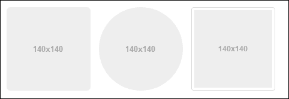
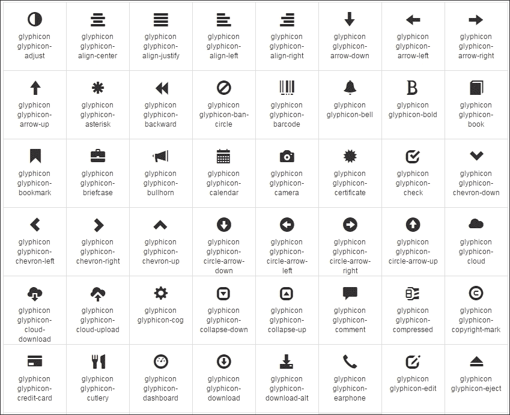
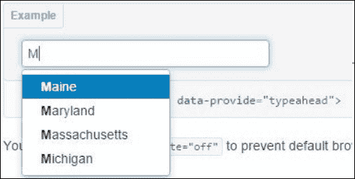
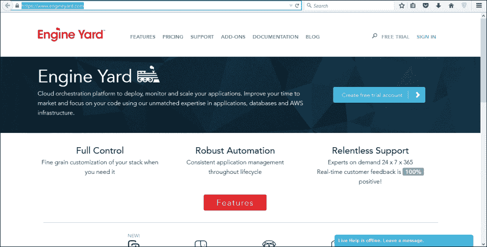
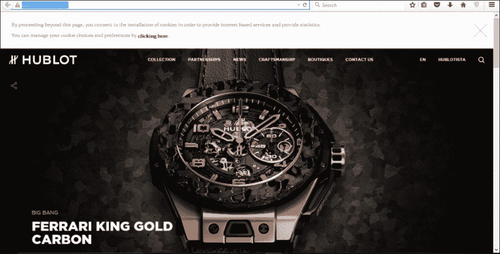

# 第十三章. Bootstrap – 精美的 CSS 前端框架

**Bootstrap** 是一个使用 HTML 和 CSS 开发网站和应用程序的前端框架和开源工具。

**Twitter Blueprint** 是 Bootstrap 的初始名称。Mark Otto 和 Jacob Thornton 开发了 Bootstrap，并使用 Twitter 作为框架以保持一致性。根据 Twitter 开发者 Mark Otto 的说法：

> *"我和一小群开发者聚在一起设计和构建一个新的内部工具，并看到了做更多事情的机会。在这个过程中，我们看到了自己构建了一个比另一个内部工具更实质性的东西。几个月后，我们最终有了 Bootstrap 的早期版本，作为在公司内部记录和共享常见设计模式和资源的方式。"*

Bootstrap 的第一个官方版本发布于 2011 年 8 月 19 日。目前有三个版本的 Bootstrap。然而，Bootstrap 4 已经宣布，但其最终版本尚未发布。

# Bootstrap 基础介绍

Bootstrap 与包括 Firefox、Opera、Internet Explorer、Google Chrome 和 Safari 浏览器在内的许多最新版本的网页浏览器兼容。

## HTML5 doctype 简介

要开始使用 Bootstrap，必须在每个 bootstrap 项目中包含以下 HTML5 doctype 的代码：

```js
<!DOCTYPE html>
<html lang="en">
  ... 
</html>
```

## 移动优先

Bootstrap 非常适合移动设备。移动优先样式都包含在一个库中，而不是分散在各种文件中。为了准确渲染和触摸缩放，请将 viewport 元标签添加到 `<head>` 中：

```js
<meta name="viewport" content="width=device-width, initial-scale=1.0">
```

可以通过将 viewport 元标签中的属性 user-scalable 设置为 no 来禁用缩放，如下所示：

```js
<meta name="viewport" content="width=device-width, initial-scale=1.0, maximum-scale=1.0, user-scalable=no">
```

## 响应式图片

可以使用简单的类来使图片响应各种屏幕尺寸，如下所示：

```js

```

## 容器

在 bootstrap 中，所有网页内容和网格系统都被包裹在一个主容器内。这些容器不可嵌套。

容器有两种类型，如下所示：

+   响应式固定宽度容器，例如：

    ```js
    <div class="container"></div>
    ```

+   响应式全宽度容器，例如：

    ```js
    <div class="container-fluid"></div>
    ```

# 开始使用

现在是时候开始您的第一个 Bootstrap 项目或网站了。您可以从各种来源获取 Bootstrap。为了快速入门，这里有一些您可以使用来获取 Bootstrap 的资源。

## GitHub 项目

Bootstrap 是 Twitter 创始人发起的开源项目。您可以从他们的 GitHub 仓库或您喜欢的任何命令行界面下载它。

## 下载 Bootstrap

您可以从以下链接轻松下载 Bootstrap：[`github.com/twbs/bootstrap/releases/download/v3.3.5/bootstrap-3.3.5-dist.zip`](https://github.com/twbs/bootstrap/releases/download/v3.3.5/bootstrap-3.3.5-dist.zip)

## 使用 bower 安装

您可以使用以下命令使用 `bower` 安装 Bootstrap：

```js
$ bower install bootstrap

```

## 使用 npm 安装

您可以使用以下命令使用 `npm` 安装 Bootstrap：

```js
$ npm install bootstrap

```

## 使用 composer 安装

您可以使用以下命令使用 `composer` 安装 Bootstrap：

```js
$ composer require twbs/bootstrap

```

# 布局

布局帮助您定义网站的标准结构或骨架。有三种类型的布局：

+   固定布局

+   流体布局

+   响应式布局

固定布局不会随着屏幕尺寸的变化而改变，所有样式都是静态的。流体布局使得`div`元素在无法适应查看屏幕宽度时流向底部。响应式布局会密切关注并响应屏幕尺寸的调整。以下章节中描述了这些选项的使用方法。

## 固定布局

网站的固定布局有一个常宽度的包装器（它包裹或包含所有列），即无论屏幕分辨率多小或多宽，都不能更改。包装器或容器不能移动，并设置为固定位置。许多网页设计师更喜欢固定布局的原因在于其使用和定制的简便性。

## 描述

在固定布局中，列宽是固定的，不能更改。为您的网站声明固定布局的语法如下：

```js
<body>
  <div class="container"> <!--This line is for declaring fixed layouts-->
  </div>
</body>
```

在前面的代码中，`container`类内部的所有内容将固定在执行此代码的每个设备上。

## 流体布局

流体布局就像液体一样，在运行时根据用户的屏幕分辨率调整自己。此类布局的组件主要包含百分比宽度，因此能够有效地调整到用户的屏幕。此类布局更易于用户使用，使网站看起来更好。它还提高了可访问性和界面。

## 描述

流体布局根据接收到的屏幕分辨率使用预定义的百分比宽度来自动调整。为您的网站声明流体布局的语法如下：

```js
<div class="container-fluid"> <!--declaration of a fluid container-->
  <div class="row-fluid">
    <div class="span3"> <!--spans 3 columns -->
      <!--Sidebar content-->
    </div>
    <div class="span5"> <!--spans 5 columns -->
      <!--Body content-->
    </div>
  </div>
</div>
```

Bootstrap 的网格系统允许页面最多有 12 列。

在前面的示例中，`span3`组合了三列，`span5`组合了五列，它们共同完成整个页面，根据屏幕分辨率调整布局。

## 响应式布局

响应式布局根据条件数量为网站提供设计，这些条件包括比例、宽度、显示类型等。此类布局会自动调整和适应任何屏幕尺寸，从而为用户提供更好的可访问性和最佳观看体验。

## 描述

响应式布局在网页设计师中越来越流行，因为它们在定制和实施方面提供了更少的麻烦。

以下示例代码展示了如何使用元标签以及 Bootstrap 样式表来包含响应式特性：

```js
<meta name="viewport" content="width=device-width, initial-scale=1.0">
<link href="assets/css/bootstrap-responsive.css" rel="stylesheet">
```

## 支持的设备

为了在不同的设备上提供有效的布局，Bootstrap 可以在一个文件中支持许多媒体查询。以下表格显示了支持的设备范围：

| 标签 | 布局宽度 | 列宽度 | 间隙宽度 |
| --- | --- | --- | --- |
| **大屏幕** | 1200px 及以上 | 70px | 30px |
| **默认** | 980px 及以上 | 60px | 20px |
| **纵向平板** | 768px 及以上 | 42px | 20px |
| **手机到平板** | 767px 及以下 | 流体列，无固定宽度可用 |
| **手机** | 480px 及以下 | 流体列，无固定宽度可用 |

参考来源：[`getbootstrap.com/css/#grid-options`](http://getbootstrap.com/css/#grid-options)

# 网格系统

使用行和列创建特定大小的网格并添加数据。以下是一些需要记住的指南：

+   使用`.container(fixed-width)`或`.container-fluid(full-width)`方法放置行，以实现准确的对齐。

+   横向的列组可以使用行创建。在列中插入数据，并且只有列可以是行的直接子元素。

填充用于列创建间隙。这种缓冲在`.lines`的第一和最后一部分通过负边距来平衡。通过指定列数来启动列。一行中不能启动超过 12 列，所有额外的列都将跳转到新的一行。网格类适用于屏幕宽度大于或等于断点大小的设备，并覆盖针对较小设备的网格类。

## 网格选项速查表

以下表格显示了 Bootstrap 网格系统可以用于多个设备的几种有效方法：

|   | 大型设备（>=1200 px） | 中型设备（>=992 px） | 小型设备（如平板电脑）（>=768px） | 超小设备（如手机）（<768px） |
| --- | --- | --- | --- | --- |
| **网格行为** | 默认折叠，在断点以上水平排列 | 总是水平排列 |
| **最大容器宽度** | 1170px | 970px | 750px | 无（自动） |
| **类前缀** | `.col-lg-` | `.col-md-` | `.col-sm-` | `.col-xs-` |
| **列数** | 12 |
| **最大列宽** | 95px | 78px | 60px | 自动 |
| **间隙宽度** | 350px（每列两侧各 15px） |
| **可嵌套** | 是 |
| **偏移量** | 是 |
| **列排序** | 是 |

来源：[www.getbootstrap.com/css/](http://www.getbootstrap.com/css/)

## 媒体查询

媒体查询帮助网站根据屏幕大小调整样式。我们可以在我们的`LESS`文件中使用媒体查询来创建网格系统中的关键断点。观察速查表，我们可以编写媒体查询。让我们看看以下代码片段：

```js
/* Large Device (>=1200 px) */
 @media (min-width: @screen-lg-min) { ... }

/*Medium Devices (>=992 px)*/
@media (min-width: @screen-md-min) { ... }

/* Small Devices such as Tablets (>=768px) */
@media (min-width: @screen-sm-min) { ... }

/* Extra small devices such as Phones (<768px)*/
/* No media query as this is the default*/
```

我们偶尔会扩展这些媒体查询，包括最大宽度以限制 CSS 适用于更窄的设备集：

```js
/* Large Device (>=1200 px) */
@media (min-width: @screen-lg-min) { ... }

/*Medium Devices (>=992 px)*/
@media (min-width: @screen-md-min) and (max-width: @screen-md-max) { ... }

/* Small Devices such as Tablets (>=768px) */
@media (min-width: @screen-sm-min) and (max-width: @screen-sm-max) { ... }

/* Extra small devices such as Phones (<768px)*/
@media (max-width: @screen-xs-max) { ... }
```

## 响应式列重置

我们需要这些类型的列，因为在网格中，由于数据量的不同，并非所有列都以相同的对齐方式结束。然而，响应式列将确保一切完美对齐。让我们看看以下代码片段：

```js
<div class="row">
<div class="col-xs-6 col-sm-3" style="background-color:pink">.col-xs-6 .col-sm-3</div>

  <div class="col-xs-6 col-sm-3" style="background-color:brown;">.col-xs-6 .col-sm-3</div></div>
  <!-- Add the extra clearfix for only the required viewport -->

  <div class="clearfix visible-xs-block"></div>

  <div class="col-xs-6 col-sm-3" style="background-color:orange;>.col-xs-6 .col-sm-3</div>
  <div class="col-xs-6 col-sm-3" style="background-color:black;>.col-xs-6 .col-sm-3</div>
</div>
```

## 偏移列

有时，我们需要放置一个列或从一些空闲空间偏移处开始一个列。因此，我们设置一个偏移量，从列需要开始的地方：

```js
<div class="row">
  <div class="col-md-4">.col-md-4</div>
  <div class="col-md-4 col-md-offset-4">.col-md-4 .col-md-offset-4</div>
</div>

<div class="row">
  <div class="col-md-3 col-md-offset-3">.col-md-3 .col-md-offset-3</div>
  <div class="col-md-3 col-md-offset-3">.col-md-3 .col-md-offset-3</div>
</div>
<div class="row">
  <div class="col-md-6 col-md-offset-3">.col-md-6 .col-md-offset-3</div>
</div>
```

## 嵌套列

如其名所示，嵌套列是在列中嵌入列的一种方式。让我们看看以下代码片段：

```js
<div class="row">
  <div class="col-md-9">
    Level 1: .col-md-9
    <div class="row">
      <div class="col-md-6">
        Level 2: .col-md-6
      </div>
      <div class="col-md-6">
        Level 2: .col-md-6
      </div>
    </div>
  </div>
</div>
```

## 列排序

列排序也可以通过将列向右或向左移动来改变。以下代码显示了如何移动列：

```js
<div class="row">
  <div class="col-md-9 col-md-push-3">.col-md-9 .col-md-push-3</div> 
  <div class="col-md-3 col-md-pull-9">.col-md-3 .col-md-pull-9</div> 
</div>
```

## LESS 变量和混入

LESS 混入（mixins）和变量用于通过变量和混入提供的特定值快速实例化布局。

## 混入

混入（mixins）主要用于与网格变量（grid variables）一起使用，为单个元素提供 CSS 样式。

### 描述

如其名所示，混入（mixins）是一种将一组属性从一个规则集包含或混合到另一个规则集中的方法。以下示例显示了 `make-row()` 混入：

```js
make-row (@gutter: grid-gutter-width) {
  margin-left : (@gutter / -2);
  margin-right : (@gutter/ -2);
  &: extend( .clearfix all);
}
```

`make-row()` 混入为包含所有列的包装元素生成样式。它使用 `@gutter` 参数的值来计算行的左右边距。

## 变量

媒体查询点（media query point）从哪里开始浮动列，列的总数和间隙宽度由变量确定。这些信息由变量提供，以生成预定义的网格类，以及用于自定义混入（custom mixins）。

### 描述

变量与混入（mixins）一起使用，以生成单个元素的样式。

以下代码块预定义了一些在混入（mixins）中用作默认值的变量：

```js
//Number of columns in the grid.
@grid-columns: 12;

//padding between columns. Divided in half for left and right.
@grid-gutter-width: 30px;
//point at which the navbar collapses.
@grid-float-breakpoint: 768px;
```

# 字体排印

**字体排印**是安排字体元素的艺术和技术，使书面语言在显示时易于阅读、可读且吸引人，使用标题、粗体字体、斜体字体、粗体字体、列表等。

## 标题

在 Bootstrap 中，从 `h1` 到 `h6` 的所有标题都可用。标题主要用于突出讨论中的主要主题。标题文本应包含在适当的 HTML 标题标签之间，例如 `<h1> 这里是标题文本 </h1>`。标题的大小随着标题数字的增加而减小，提供了突出主要主题和子主题的功能。这种技术有助于为网站管理适当的设计。

这里有一些关于如何使用标题的示例：

```js
<h1> This is a Bootstrap heading H1</h1>
<h2> This is a Bootstrap heading H2</h2>
<h3> This is a Bootstrap heading H3</h3>
<h4> This is a Bootstrap heading H4</h4>
<h5> This is a Bootstrap heading H5</h5>
<h6> This is a Bootstrap heading H6</h6>
```

## 正文

所有与字体排印和设计相关的 HTML 标签都必须包含在 `body` 标签内，例如文本、超链接、图像、表格、列表等。以下代码显示了一个段落标签，它显示了段落中的文本：

```js
<p>...</p>
```

## 领头正文

领头类（lead class）有助于使标签内的文本突出。其声明方法如下所述：

```js
<p class="lead">...</p>
```

## 着重号

着重号基本上将文本的大小和字体与其在文档中的重要性相关联。例如，较大的文本比较小的文本或斜体文本更重要，或者斜体文本可能包含来自其他资源的引用。

## 小文本

`small` 标签内的文本主要减小到原始大小的 85%。这种技术主要用于降低文本的重要性：

```js
<small>...</small>
```

## 粗体文本

`strong` 标签内的文本通过使其更大和更粗来提高其可见性。这有助于在文档中增加文本的强调：

```js
<strong>...</strong>
```

## 斜体文本

`em` 标签内的文本将被设置为斜体。这种技术主要用于表示参考文献，以及其他许多用途：

```js
<em>...</em>
```

## 对齐

对齐是一种基本技术，用于将段落对齐到屏幕的左侧、右侧或居中，无论屏幕分辨率如何：

```js
<p class="text-left">Text here will be left-aligned</p>
<p class="text-center"> Text here will be center-aligned </p>
<p class="text-right"> Text here will be right-aligned </p>
```

## 缩写

HTML 定制的 `<abbr>` 元素可以使用以下语法使用，如下面的代码片段所示。

## 基本版

`<abbr>` 标签显示文本的较小版本，当鼠标悬停在其上时将展开：

```js
<abbr title="attribute">Here is an example of an attribute tag</abbr>
```

此代码的输出将显示 attr 缩写。

## 首字母缩略词

**首字母缩略词**与基本缩写具有相同的功能，但文本较小：

```js
<abbr title="HyperText Markup Language" class="initialism">HTML using Initialism</abbr>
```

## 地址

地址标签用于容纳与地址相关的所有文本。以下示例显示了格式：

```js
<address> …
  <strong>Packt PublishingPublishing.</strong><br>
  Berwick House, <br>
  35 Livery St, <br>
  Birmingham B3 2PB,<br> 
  United Kingdom <br>
  <abbr title="Phone">P:</abbr> +44 121 265 6484
</address>
```

## 块引用

**块引用**主要用于引用其他来源的文本。它们与段落标签一起使用，以引用段落：

```js
<blockquotes> … </blockquotes>
```

# 表格

表格用于以有组织的形式清晰地显示内容，以便数据易于访问和阅读。

| # | 类别 | 项目 | 项目 ID |
| --- | --- | --- | --- |
| 1 | 服装 | 蓝衬衫 | `App_BlueShirt` |
| 2 | 服装 | 白大褂 | `App_WhiteCoat` |
| 3 | 配件 | 皮带 | `Acc_LeatherBelt` |

## 基本版

在前面的表格中，是带有轻量填充和仅水平分隔符的 Bootstrap 表格的基本版本。其语法如下：

```js
<table class="table"> ... </table>
```

## 斑马纹行

斑马纹行的结构与基本表格相同，其样式类似于斑马线的条纹，即浅色和深色交替的行：

```js
<table class="table table-striped"> ... </table>
```

## 有边框的表格

此类将表格转换为具有可见边界的等分。每个部分包含一个单一值：

```js
<table class="table table-bordered"> ... </table>
```

## 悬停行

此类添加了突出显示鼠标悬停行的功能：

```js
<table class="table table-hover"> ... </table>
```

## 紧凑行

通过减少行之间的填充，可以实现更紧凑和更小的表格版本：

```js
<table class="table table-condensed"> ... </table>
```

## 上下文类

当上下文类应用于表格行或单元格时，它们将具有预定义的颜色。以下是一些可用的类：

+   `.active`: 此类将悬停颜色应用于表格行

+   `.success`: 此类将绿色应用于表格行

+   `.info`: 此类将蓝色应用于表格行

+   `.warning`: 此类将黄色应用于表格行

+   `.danger`: 此类将红色应用于表格行

我们可以将整个行或单个单元格设置为显示特定颜色，以表示特定的信息。以下是如何实现此功能的示例：

```js
<!-- Contextual classes when applied on rows -->
<tr class="active">...</tr>
<tr class="success">...</tr>
<tr class="warning">...</tr>
<tr class="danger">...</tr>

<!-- Contextual classes when applied on cells (`td` or `th`) -->
<tr> <td class="active">...</td>
<td class="success">...</td>
<td class="warning">...</td>
<td class="danger">...</td> </tr>
```

## 响应式表格

响应式表格在小设备上会自动调整以水平滚动。差异仅在小型设备上可见：

```js
<div class="table-responsive">
  <table class="table"> ... </table>
</div>
```

# 列表

列表用于按特定顺序分组数据，或者可以取消分组以按顺序显示数据。

列表可以是以下类型：

+   `无序列表`

+   `有序列表`

+   `无样式`

+   `内联`

+   `描述`

## 无序列表

无序列表是一组项目集合，其中项目的顺序无关紧要。以下是无序列表的语法：

```js
<ul>
  <li>...</li>
  <li>...</li>
</ul>
```

## 有序列表

有序列表是一组项目，其中顺序很重要。以下是有序列表的语法：

```js
<ol>
  <li>...</li>
  <li>...</li>
</ol>
```

## 无样式列表

无样式列表可以通过移除左外边距和默认列表样式来有序或无序。以下是无样式列表的语法：

```js
<ul class="list-unstyled">
  <li>...</li>
  <li>...</li>
</ul>
```

## 内联列表

内联列表将列表的所有项目排列成一行或一行。以下是内联列表的语法：

```js
<ul class="list-inline">
  <li>...</li>
  <li>...</li> 
</ul>
```

## 描述列表

描述列表包含列表项及其描述。以下是描述列表的语法：

```js
<dl>
  <dt>...</dt>
  <dd>...</dd>
</dl>
```

## 水平描述

水平描述类与描述列表类做同样的事情，唯一的区别在于列表项的相应描述在同一行中的位置。以下是水平描述列表的语法：

```js
<dl class="dl-horizontal">
  <dt>...</dt>
  <dd>...</dd>
</dl>
```

# Bootstrap 中的表单

表单元素是 Bootstrap 中用于使导航和 GUI 更具吸引力和满足感的各种元素。使用各种文本框、按钮等可以产生更好的输出。

表单有三种布局类型：

+   垂直表单

+   内联表单

+   水平表单

## 垂直表单

垂直表单是 Bootstrap 表单的默认布局。这里使用的属性是 `role`，其值设置为 `form`，以提供更好的可访问性和自动默认样式。该语法的格式如下：

```js
<form role="form"> … </form>
```

## 内联表单

许多时候，我们也会遇到表单元素内联且单行左对齐的情况。内联表单需要为 `<form>` 元素添加 `form-inline` 类。该语法的格式如下：

```js
<form class="form-inline" role="form"> … </form>
```

## 水平表单

水平表单是这一组中最巧妙的，在网页上广泛用于收集网站用户的资料。这种表单的外观和性能是它区别于其他两种表单类型的地方。这种表单将标签和表单控件组水平对齐。

水平表单需要为 `<form>` 元素添加 `form-horizontal` 类。此外，标签需要为 `<label>` 元素添加 `control-label` 类。语法如下：

```js
<form class="form-horizontal" role="form"> … </form>
```

## Bootstrap 中表单的输入

所有 HTML 支持的输入类型在 Bootstrap 中都可以使用，这使得有 HTML 背景的人可以轻松掌握这些概念。如文本区域、密码、单选按钮、复选框等输入都在 Bootstrap 中得到支持。

简单文本框作为输入方式的语法如下：

```js
<input type="text" class="form-control" placeholder="Text input" id ="txtName">
```

如果我们想要文本被修改为不显示实际输入的字母，则可以使用 `input` 类型的 `password`。使用 `input` 类型作为 `password` 的语法如下：

```js
<input type="password" class="form-control" placeholder="Text input" id="txtPassword">
```

## 文本区域

文本区域是用户输入文本的区域；它可以容纳从少量单词到大量段落的文本。文本区域的语法如下：

```js
<textarea class="form-control" rows="44"></textarea>
```

前一行告诉控件文本区域必须跨越四行。

## 帮助文本

`help` 块为表单控件提供块级帮助文本：

```js
<span class="help-block">  </span>
```

## 复选框

`checkbox` 控制为相关选项组分配一个框，用户可以通过点击框来选择。当用户需要只从给定选项中选择时，会使用此功能。添加复选框的语法如下：

```js
<div class="checkbox">    </div>
```

添加禁用复选框的语法如下：

```js
<div class="checkbox disabled">    </div>
```

## 选择列表

`select` 类控制触发一个下拉菜单，其中包含一组选项，一次只能选择一个。其语法如下：

```js
<select class="form-control"> … </form>
```

## 单选按钮

`radio` 类控制与 `checkbox` 控制执行相同的功能，但用户一次只能选择一个选项。其语法如下：

```js
<div class="radio"> … </div>
```

添加禁用 `radio` 类的语法如下：

```js
<div class="radio disabled">    </div>
```

## 静态控制

`static` 类控制允许用户在其对应标签旁边插入文本。可以使用 `"form-control-static"` 类在段落标签内添加文本到表单标签旁边。必须使用 `form-static-control` 类。

以下示例插入静态文本——“Web 开发者参考指南”：

```js
<p class="form-control-static">Web Developer's Reference Guide<p> 
```

## 输入焦点

`input` 类允许输入字段在页面加载时自动聚焦。其语法如下：

```js
<input class="form-control" id="focusedInput" type="text" value="...">
```

## 禁用输入

`disabled` 属性禁用特定文本框中的输入，无法点击或使用。要使用此功能，可以将 `disabled` 属性添加到 `<fieldset>` 标签以禁用其所有控件。

## 验证状态

这些类在从服务器返回消息时为输入控件赋予意义，例如字段被留空或输入了错误的组合。

可以通过添加 `.has-success`、`.has-warning` 或 `.has-error` 到类中来使用验证状态。以下代码显示了这一点：

```js
<div class="form-group has-success"> … </div>
<div class="form-group has-warning"> … </div>
<div class="form-group has-error"> … </div>
```

## 控件尺寸

用户可以轻松设置各种列的高度以满足其需求。

我们可以使用类如 `.input-lg` 和 `.col-lg-*` 等轻松设置高度和宽度：

```js
<input class="form-control input-lg" type="text" placeholder=".input-lg">
<div class="col-xs-2"> … </div>
```

# 图片

我们可以通过添加类到 `` 元素来使用内置 CSS 样式进行图像处理：

```js


```

以下代码将创建以下图像：



### 注意

注意，Internet Explorer 8 不支持图像的圆角。

## 图标（Glyphicons）

**Glyphicon** 是用于帮助用户理解功能意义的小图标。例如，电子邮件将有一个信封图标，搜索将有一个放大镜图标，等等。以下图中显示了某些 Glyphicons：



更多 250 个以字体格式存在的 Glyphicons 在 **Glyphicon Halflings** 集中。以下是向 Bootstrap 添加 Glyphicons 的方法：

```js
<span class="glyphicon glyphicon-search"></span>
```

### 注意

所有可用的 Glyphicons 都可以在 [`getbootstrap.com/components/`](http://getbootstrap.com/components/) 找到。

# 导航元素

Bootstrap 支持多种类型的导航元素，可以使用以下代码描述：

## 标签页

`tab` 类在导航栏上创建小标签页，每个标签页提供链接到不同的页面：

```js
<ul class="nav nav-tabs"> … </ul>
```

标签基本上是链接到其他页面或网站的链接；因此，`tab` 类应该在链接标签内声明，如前述代码所示。

## 药丸

`pill` 类与 `tab` 类具有相同的功能，唯一的区别在于样式。标签现在看起来像药丸：

```js
<ul class="nav nav-pills"> … </ul>
```

## 对齐

添加一个额外的 `nav-justified` 类会允许标签或药丸根据屏幕分辨率自动调整自身。标签或药丸被赋予相等的宽度：

```js
<ul class="nav nav-tabs nav-justified"> … </ul>
```

## 禁用链接

在导航栏中的标签或药丸上添加 `disabled` 类会移除悬停状态，禁用链接访问：

```js
<ul class="nav nav-pills">
  ...
   <li class="disabled"><a href="#">Disabled link</a></li>
  ...
</ul>
```

### 注意

请记住将实际链接放在 `#` 的位置。

# 导航栏

Bootstrap 中的导航帮助用户在网站中导航。它允许快速访问用户经常访问的链接。

## 默认

使用 `.navbar` 和 `.navbar-default` 包含在导航标签中创建一个简单的导航栏，使用 `navbar` 类：

```js
<nav class="navbar navbar-default" role="navigation">
```

要制作一个可伸缩、响应式的菜单栏，当在移动设备上显示时可以折叠成下拉菜单，请使用以下类来包装栏：

```js
<div class="navbar-header">
```

## 表单

您还可以通过添加 `.navbar-form` 类将表单放入导航栏中：

```js
<form class="navbar-form navbar-left" role="search">
```

## 按钮

与 `navbar` 类类似，`.navbar-btn` 在栏中添加一个按钮，可以执行许多有用的功能：

```js
<button type="button" class="btn btn-default navbar-btn"> … </button>
```

## 文本

通过添加 `.navbar-text` 类，我们还可以在导航栏中添加文本：

```js
<p class="navbar-text"> … </p>
```

## 非导航链接

`navbar-link` 类允许我们添加标准链接，这些链接不在 `navbar` 导航组件中：

```js
<p class="navbar-text navbar-right">
  <a href="#" class="navbar-link"></a>
</p>
```

## 固定到顶部

在 `<nav>` 标签内添加 `navbar-fixed-top` 类允许 `navbar` 在页面顶部动态定位。以下是其语法：

```js
<nav class="navbar navbar-default navbar-fixed-top" role="navigation">
```

## 固定到底部

`navbar-fixed-bottom` 类允许导航栏位于页面底部。以下是其语法：

```js
<nav class="navbar navbar-default navbar-fixed-bottom" role="navigation">
```

## 静态顶部

`navbar-static-top` 类为导航栏添加了一个新功能，允许元素随页面滚动。以下是其语法：

```js
<nav class="navbar navbar-default navbar-static-top" role="navigation">
```

## 倒置导航栏

`navbar-inverse` 类仅更改导航栏的颜色，并将其变为相反的颜色。例如，`navbar` 获得黑色背景和白色文本：

```js
<nav class="navbar navbar-inverse" role="navigation">
```

# 面板

面板是包含纯文本的简单框。面板主要用于以视觉上吸引人的方式展示重要信息。

## 基本

一个基本面板由一个包含一些文本的单个框组成。其声明方法如下：

```js
<div class="panel panel-default"> … </div>
```

## 标题

`panel-heading` 类在基本面板上方添加了一个额外的框，其中包含其标题或标题。这两个框默认颜色不同。以下是语法：

```js
<div class="panel-heading">This is a Panel Heading</div>
```

## 页脚

`panel-footer` 类在基本面板下方添加一个框，其中也包含某种文本。以下是语法：

```js
<div class="panel-footer">This is a Panel Footer</div>
```

## 组

`panel-group` 类下的面板被分组在一起。以下是语法：

```js
<div class="panel-group">
```

# 面包屑

面包屑作为帮助工具，跟踪您访问不同页面所采取的路径。使用面包屑，您可以知道网站中页面的当前位置。

面包屑用于在导航层次结构中找到当前页面的路径。

这里是一个示例代码：

```js
<ol class="breadcrumb">
  <li><a href="#">Home</a></li>
  <li><a href="#">Library</a></li>
  <li class="active">Data</li>
</ol>
```

# 标签和徽章

标签和徽章提供帮助工具，通过计数或显示网站加载状态等方式跟踪渐进因素，如数值指标、计数、百分比等。

## 标签

标签与不同的标题或标题相关联，有助于记录计数或提供提示等。标签可以声明如下：

```js
<h3>This is an example Heading<span class="label label-default">This is an example label</span></h3>
```

## 徽章

徽章与标签相同，唯一的区别是形状。徽章比标签有更多的曲线形状。它们主要用于通知用户新更改、未读电子邮件等。让我们看看以下代码片段：

```js
<a href="#">Check EMailsEMails <span class="badge">4545</span></a>
```

# 分页

**分页**是将数据分组到各个页面上的操作，就像教科书一样，通常将相同重要性的数据发布在同一页面上以更好地访问。分页具有高度的可扩展性，提供更大的点击区域，不易错过。分页可以与表格一起使用，对于分页搜索结果非常有用。

## 默认

以下是一个基本的 Bootstrap 分页示例：

```js
<ul class="pagination">
    <li>
      <a href="#" aria-label="Previous">
        <span aria-hidden="true">&laquo;</span>
      </a>
    </li>
    <li><a href="#">1</a></li>
    <li><a href="#">2</a></li>
    <li><a href="#">3</a></li>
    <li><a href="#">4</a></li>
    <li><a href="#">5</a></li>
    <li>
      <a href="#" aria-label="Next">
        <span aria-hidden="true">&raquo;</span>
      </a>
    </li>
</ul>
```

在 `<li>` 中添加 `.active` 将突出显示当前页面链接：

```js
<li class='active'><a href="#">3</a></li>
```

在 `<li>` 中添加 `.disabled` 将禁用页面链接并使其不可点击：

```js
<li class='disabled'><a href="#">3</a></li>
```

## 分页器

下一页和上一页链接用于分页以快速访问。分页器主要用于简单的网站，如杂志、报纸或博客等。以下是语法：

```js
<ul class="pager"> … </ul>
```

# 进度条

基本进度条是一个根据进度水平填充的矩形条。这些条主要用于显示关于动作的当前进度。

创建进度条的代码如下：

```js
<div class="progress">
  <div class="progress-bar" role="progressbar" aria-valuenow="505"
      aria-valuemin="0" aria-valuemax="100" style="width:505%">
  </div>
</div>
```

### 注意

更多信息请访问：[`www.w3schools.com/bootstrap/bootstrap_progressbars.asp`](http://www.w3schools.com/bootstrap/bootstrap_progressbars.asp)。

# 高级 Bootstrap/JavaScript 插件

Bootstrap 可以从强大的 JavaScript 库中受益，以在网页上显示各种类型的动态内容。Bootstrap 插件需要 jQuery 作为依赖项。这些包括按钮、下拉菜单、工具提示、警告、标签页等。我们现在将介绍如何使用它们。

## 按钮

在 Bootstrap 中，按钮可以用于各种组合。

## 基本

`btn-group` 类生成一个默认的灰色按钮，具有曲线边缘，当用户点击时可以触发任何功能：

```js
<div class="btn-group"> … </div>
```

## 按钮工具栏

`btn-toolbar` 类将所有包含在 `btn-toolbar` 类中的按钮组合在一起：

```js
<div class="btn-toolbar" role="toolbar"> … </div>
```

## 尺寸

`sizing` 类用于一次性调整按钮组的大小，只需添加 `btn-group-*`。

声明如下所示：

```js
<div class="btn-group btn-group-lg">...</div>    //large
<div class="btn-group">...</div>    //normal
<div class="btn-group btn-group-sm">...</div>    //small
<div class="btn-group btn-group-xs">...</div>    //extra small
```

## 嵌套

通过在 `btn-group` 中放置一系列按钮来创建下拉菜单，如下所示：

```js
<div class="btn-group" role="group" aria-label="...">
  <button type="button" class="btn btn-default">Alpha</button>
  <button type="button" class="btn btn-default">Beta</button>
  <button type="button" class="btn btn-default">Gamma</button

  <div class="btn-group" role="group">
    <button type="button" class="btn btn-default dropdown-toggle" data-toggle ="dropdown"> List of Top Publishers</button>
    <ul class="Top Publishers">
    <li><a href="https://www.packtpub.com/"> Packt Publishing</a></li>
    <li><a href="http://www.oreilly.com/"> O'Reilly</a></li>
    </ul>
  </div>
</div>
```

## 垂直变化

`btn-group-vertical`类以垂直方式排列一组按钮。以下是语法：

```js
<div class="btn-group-vertical"> ... </div>
```

## 水平居中链接变体

`btn-group-justified`类允许按钮组根据任何屏幕分辨率进行调整，并为按钮提供相等的宽度。以下是语法：

```js
<div class="btn-group btn-group-justified"> ... </div>
```

## 下拉菜单

当用户点击下拉菜单中的按钮时，会触发下拉菜单。下拉菜单主要用于访问相关链接。

## 单按钮

`btn btn-default dropdown-toggle`类将按钮转换为简单的下拉菜单。其声明如下所示：

```js
<button type="button" class="btn btn-default dropdown-toggle" data-toggle="dropdown">
  <span class="caret"></span>
</button>
```

## 分离按钮

`btn btn-danger`类不会将按钮完全转换为下拉菜单，而是将按钮分成两部分，其中一部分执行简单的按钮功能，另一部分成为下拉菜单：

```js
<div class="btn-group">
  <button type="button" class="btn btn-danger">Action</button>

<button type="button" class="btn btn-danger dropdown-toggle" data-toggle="dropdown">
  <span class="caret"></span>
  <span class="sr-only">Toggle for Dropdown</span>
  </button>
</div>
```

## 工具提示

工具提示是在指针悬停在元素上时弹出的小框。

要创建工具提示，请将`data-toggle="tooltip"`属性添加到元素上。要将`data-toggle="tooltip"`属性添加到元素上以创建工具提示，请使用`title`属性指定显示在工具提示内的文本：

```js
<a href="#" data-toggle="tooltip" title="Tooltip">…</a>
```

## 定位

定位工具用于定位工具提示的弹出框，例如，当框可能出现在元素的顶部、底部、左侧或右侧时：

这里是定位到顶部的语法：

```js
<a href="#" data-toggle="tooltip" data-placement="top" title="Tooltip">Tooltip at the top</a>
```

这里是定位到底部的语法：

```js
<a href="#" data-toggle="tooltip" data-placement="bottom" title="Tooltip"> Tooltip at the bottom</a>
```

这里是定位到元素左侧的语法：

```js
<a href="#" data-toggle="tooltip" data-placement="left" title="Tooltip">Tooltip at the left</a>
```

这里是定位到元素右侧的语法：

```js
<a href="#" data-toggle="tooltip" data-placement="right" title="Tooltip"> Tooltip at the right</a>
```

### 注意

记得将实际的链接放在`#`的位置。

## 弹出框

弹出框和工具提示具有相同的功能，唯一的区别是，对于弹出框要出现，元素需要被用户点击。它们用于呈现有关元素的附加信息。

## 基本创建

可以使用以下代码生成弹出框：

```js
<a href="#" data-toggle="popover" title="Popover Header" data-content="Some content inside the popover">Toggle popover</a>
```

## 定位

可以使用以下代码将弹出框定位在元素的顶部、底部、左侧或右侧：

这里是定位弹出框到顶部的语法：

```js
<a href="#" title="Header" data-toggle="popover" data-placement="top" data-Content="Content"> Popover at the top </a>
```

这里是定位到底部的语法：

```js
<a href="#" title="Header" data-toggle="popover" data-placement="bottom" data-content="Content"> Popover at the bottom </a>
```

这里是定位到左侧的语法：

```js
<a href="#" title="Header" data-toggle="popover" data-placement="left" data-content="Content"> Popover at the leftleft</a>
```

这里是定位到右侧的语法：

```js
<a href="#" title="Header" data-toggle="popover" data-placement="right" data-content="Content">PopoverPopover at the right </a>
```

### 注意

记得将实际的链接放在`#`的位置。

## 关闭

`popover`类允许在点击其他地方时关闭弹出框：

```js
<a href="#" title="Dismissible popover" data-toggle="popover" data-trigger="focus" data-content="Click anywhere in the document to close the popover">Click here to close popover</a>
```

## 警告

Bootstrap 提供了显示警告消息的实用功能。其声明的代码如下。Bootstrap 还允许您为警告消息分配不同的颜色，以表示不同的情况。Bootstrap 需要 jQuery，并且在此语法中的`$`表示我们正在调用 jQuery。让我们看看以下代码：

```js
<button type="button" class="close" data-dismiss="alert" aria label="Close"> <span aria-hidden="true">&times;</span> </button>
```

警告的语法如下：

```js
$().alert():
```

它监听具有`data-dismiss-alert`的数据元素上的点击事件。语法如下：

```js
$().alert('close'):
```

这将从 DOM 中移除一个警告。如果元素包含`.fade`和`.in`类，它将淡出。

## 选项卡

标签页用于导航栏，以提供快速访问不同的链接或页面。标签页需要单独激活，如下所示：

```js
<div class="container">
  <h1>Alpha Zoo</h1>
  <ul class="nav nav-tabs">
    <li class="active">
    <li><a href="#">Exhibit A to Exhibit H</a></li>
    <li><a href="#">Exhibit I to Exhibit M</a></li>
    <li><a href="#">Exhibit N to Exhibit Y</a></li>
    <li><a href="#">Mini Aquarium</a></li>
    <li><a href="#">Alpha Aviary</a></li>
    <li><a href="#">Adopt an animal for just $4</a></li>
  </ul>
  <br>
  <p>Welcome to our Zoo! We take pride in the happy animals we house.</p>
</div>
```

我们可以使用 `fade` 类在查看后淡出标签页的内容：

```js
<div class="tab-content">
  <div role="tabpanel" class="tab-pane fade in active" id="homepage">...</div>
  <div role="tabpanel" class="tab-pane fade" id="profile">...</div>
  <div role="tabpanel" class="tab-pane fade" id="posts">...</div>
  <div role="tabpanel" class="tab-pane fade" id="settings">...</div>
</div>
```

## 折叠面板

许多时候，我们会遇到需要在单个页面内管理大量信息的场景。将所有这些内容放在一个页面上可能会导致创建一个非常长的页面，对于使用网站的人来说，上下滚动可能会很令人沮丧。折叠小部件用于解决这个问题，因为它们在网站上用于管理大量内容和导航列表。它们基本上是可折叠的面板，其中放置了信息。使用 Bootstrap 折叠插件，创建折叠面板非常简单。

以下代码创建了一个具有面板组件的折叠面板：

```js
<div class="panel-group" id="accordion">
  <H1> Welcome to Alpha Zoo </H1>
  <p>Welcome to our Zoo! We take pride in the happy animals we house.</p>
  <div class="panel panel-default">
    <div class="panel-heading">
      <h4 class="panel-title">
        <a data-toggle="collapse" data-parent="#accordion" href="#collapse1">
        Exhibit A to Exhibit H</a>
      </h4>
    </div>
    <!--Data for Panel 1-->
    <div id="collapse1" class="panel-collapse collapse in">
      <div class="panel-body">
        These exhibits are for animals from the tropical regions of the planet. Take a guided tour through Exhibit A, our largest exhibit housing our bengal tigers Uri and Kayla with their cubs at exhibit A or simply feed our talking toucan Charlie in Exhibit D.
        <a href='#'> See more</a>
      </div>
    </div>
  </div>
  <!--Data for Panel 2-->
  <div class="panel panel-default">
    <div class="panel-heading">
      <h4 class="panel-title">
        <a data-toggle="collapse" data-parent="#accordion" href="#collapse2">
        Exhibit I to Exhibit M</a>
      </h4>
    </div>
    <div id="collapse2" class="panel-collapse collapse">
      <div class="panel-body">
        This is the second panel. The content for the second panel will go in here.
      </div>
    </div>
  </div>
</div>
```

## 模态框

模态框插件是显示在页面顶部的弹出窗口或框。一个模态框看起来像这样：

## 模态框大小

模态对话框有两种大小。小型模态框可用于处理小型功能，而大型模态框可用于提示大型数据集。

### 小型

`modal-dialog modal-sm` 类创建一个小型模态框。以下是语法：

```js
<div class="modal-dialog modal-sm">
```

### 大型

`modal-dialog modal-lg` 类创建一个大型模态框。以下是语法：

```js
<div class="modal-dialog modal-lg">
```

## 媒体对象

媒体对象是抽象的对象样式，可用于制作博客评论或其他描述性缩略图：

+   `.media`: 这个类将 `media` 对象浮动到内容块的右侧或左侧

+   `.media-list`: 这个类形成了一个无序列表的项目：

    ```js
    <div class="media">
      <a class="pull-left" href="#">
        
      </a>
      <div class="media-body">
        <h4 class="media-heading">This is the Main Media heading </h4>
      </div>
    <div>

    <ul class="media-list">
      <li class="media">
        <a class="pull-left" href="#">
          
        </a>
        <div class="media-body">
          <h4 class="media-heading">This is a Media heading </h4>
          <!-- Nested media object -->
        </div>
      </li>
    </ul>
    ```

## 轮播图

轮播图插件允许您在查看每个元素的同时使元素在圆形中移动。

轮播图通过循环显示组件。以下代码可以创建一个动物照片的轮播图：

```js
<div id="myCarousel" class="carousel slide" data-ride="carousel"> <!-- Indicators --> 

<ol class="carousel-indicators">
  <li data-target="#myCarousel" data-slide-to="0" class="active"></li>
  <li data-target="#myCarousel" data-slide-to="1"></li>
  <li data-target="#myCarousel" data-slide-to="2"></li>
  <li data-target="#myCarousel" data-slide-to="3"></li>
</ol>
<!-- Wrapper for slides -->

  <div class="carousel-inner" role="listbox">
    <div class="item active">
      
    </div>
    <div class="item">
      
    </div>
    <div class="item">
      
    </div>
    <div class="item">
      
    </div>
  </div>

  <!-- Left and right controls -->

  <a class="left carousel-control" href="#myCarousel" role="button" data-slide="prev">
    <span class="glyphicon glyphicon-chevron-left" aria-hidden="true"></span>
    <span class="sr-only">Previous</span>
  </a>
  <a class="right carousel-control" href="#myCarousel" role="button" data-slide="next">
    <span class="glyphicon glyphicon-chevron-right" aria-hidden="true"></span>
    <span class="sr-only">Next</span>
  </a></div>
```

## Typehead

Typehead 只是一种文本框的另一种形式，它会在用户在文本框中输入文本时提供文本预测，如果编程为提前输入美国各州的状态，它可能看起来像这样：



## 如何创建 typehead

以下代码显示了您如何创建一个简单的 typehead 文本框：

```js
<input type="text" data-provide="typeahead">
```

## 通过 JavaScript 使用 typehead

我们可以使用以下代码调用 typehead：

```js
$('.typeahead').typeahead()
```

对于完整的实现，请访问 [`twitter.github.io/typeahead.js/examples/`](https://twitter.github.io/typeahead.js/examples/)。

## Scrollspy

**Scrollspy** 插件允许导航目标在用户上下滚动时自动更新自己。

Scrollspy 可以帮助在随机滚动时识别您到达的页面部分，使查找所需数据变得更加容易。Scrollspy 插件通常可以通过两种方式激活，我们现在将看到。

## 通过数据属性激活 Scrollspy

数据属性允许通过向元素添加 `<data-spy ="scroll"` 来监视特定元素：

```js
<body data-spy="scroll" data-target=".navbar">...</body>
```

## 通过 JavaScript 激活 Scrollspy

Scrollspy 也可以通过选择元素并执行`scrollspy()`函数由 JavaScript 触发：

```js
$('#navbar').scrollspy()
```

## Affix

**affix**插件用于将元素锁定在页面上的某个区域。

affix 插件可以通过数据属性或 JavaScript 激活。affix 插件用于在网站上放置社交图标，它们被锁定在一个位置，以便用户随时访问。

## 通过数据属性激活 affix 插件

使用以下方法激活`affix`工具：

```js
<div data-spy="affix" data-offset-top="200">...</div>
```

## 通过 JavaScript 激活 affix 插件

我们还可以通过以下代码手动使用 JavaScript 激活`affix`工具：

```js
$('#navbar').affix()
```

# 自定义 Bootstrap

由于 Bootstrap 是一个非常庞大的项目，包括所有其仓库实际上并非必需，即使你包括了它们，这也可能给你的网站带来巨大的负载，使其变得缓慢并影响用户体验。为了获取适合你特定需求的 Bootstrap 引擎，请访问 [`getbootstrap.com/customize/`](http://getbootstrap.com/customize/) 并导入具有所需设置的样式文件。你还可以在先前的链接中导入现有的设置文件，在 GUI 中添加或删除选项，并获取一个无需编写任何代码的更新版本。

# 使用 Bootstrap 构建的网站

WordPress 已经存在，许多大型网站和公司都在使用它。Twitter 的网站本身就是用 Bootstrap 制作的。看看一些使用 Bootstrap 框架构建的著名网站：

+   [`www.engineyard.com/`](https://www.engineyard.com/)

+   [`www.hublot.com/en/`](http://www.hublot.com/en/)

+   [`www.fliplingo.com`](https://www.fliplingo.com)

# Bootstrap 资源

互联网上充满了 Bootstrap 资源；以下是一些：

+   [www.wrapbootstrap.com](http://www.wrapbootstrap.com): 你可以在 **WrapBootstrap** 上购买或出售。这是一个大型的高质量模板和主题市场。

+   [www.bootswatch.com](http://www.bootswatch.com): *Bootstrap 主题* 在 MIT 许可下发布，并由 GitHub 上的社区维护。主题是为 Bootstrap 的最新版本构建的。

+   [www.startbootstrap.com](http://www.startbootstrap.com): **Startbootstrap** 是学习和开发 Bootstrap 的简单方法，因为它包含数千个启动主题和模板，甚至包括 Bootstrap 3。

+   [`themes.getbootstrap.com`](http://themes.getbootstrap.com/): 这些是 Bootstrap 的创建者提供的官方 *Bootstrap 主题* 和模板，包括仪表板、管理员界面和营销网站。

这里还有一些 Bootstrap 的资源，但还有很多。你可以浏览这些网站，并获取更多关于 Bootstrap 的工作和复杂性的知识：

+   [`expo.getbootstrap.com/`](http://expo.getbootstrap.com/)

+   [`bootstrapbay.com/blog/built-with-bootstrap/`](https://bootstrapbay.com/blog/built-with-bootstrap/)

+   [`builtwithbootstrap.com/`](http://builtwithbootstrap.com/)

+   [`getbootstrap.com/getting-started/#examples`](http://getbootstrap.com/getting-started/#examples)

### 注意

目前，Bootstrap 4 alpha 版本已经发布。所有 JavaScript 插件都已重写为 ECMAScript6，完全从 LESS 迁移到 SASS，并且已放弃对 IE8 的支持。

这里是官方博客文章：[`blog.getbootstrap.com/2015/08/19/bootstrap-4-alpha/`](http://blog.getbootstrap.com/2015/08/19/bootstrap-4-alpha/)
