# 第一章. WebStorm 入门

WebStorm 是由 JetBrains 为客户端和服务器端 Web 开发设计的完整 JavaScript **集成开发环境**（**IDE**）。它基于 IntelliJ IDEA 构建；WebStorm 继承了所有其功能和特性，您可以使用面向 Web 的语言，如 JavaScript、HTML 和 CSS，以及利用对开发者至关重要的能力，如重构、调试和版本控制管理。此外，WebStorm 原生支持 Node.js，并包含来自先前版本的一些创新，如对 AngularJS、CoffeeScript 和 TypeScript、LESS 和 SASS 的支持，以及其他优秀功能。

本书旨在帮助您了解 WebStorm 10 提供的新功能，并使用 WebStorm 利用前沿的 Web 技术。您将看到如何开发高质量的 Web 应用程序，并发现 Web 开发过程中的最佳实践和节省时间的技巧。最终，您将获得所有改变您 Web 开发体验所需的技能。

在本章中，您将执行以下操作：

+   查看 WebStorm 10 的新功能

+   安装和配置 WebStorm

+   熟悉 WebStorm 的工作空间

+   设置和运行一个简单的项目

+   探索 WebStorm 的设置和偏好

# WebStorm 10 的新功能有哪些？

WebStorm 倾向于不断改进，因此不断吸收前沿技术，而第 10 版则非常具有代表性，带来了用于全面 Web 开发的令人印象深刻的先进功能：

+   **改进的 JavaScript 支持**：在这个版本的 WebStorm 中，JavaScript 的支持得到了改进，适用于大型项目，具有更快的代码高亮和自动完成功能，增强了 ECMAScript 2015 支持，等等。

+   **TypeScript**：这个 WebStorm 的新版本支持 1.4 和 1.5 版本，并内置了编译器

+   **Spy-js 改进**：WebStorm 10 增加了创建应用程序依赖图和跟踪编译为 JavaScript 的语言的可能性

+   **Grunt**：您可以在 WebStorm 中轻松导航和编辑作业。Grunt 集成已重新设计，无论您是否决定为项目使用 Grunt 或 Gulp，都能提供一致的用户体验

+   **实时 Dart 分析视图**：您现在可以通过 Dart Analysis Server 对代码进行即时分析。所有结果将直接在编辑器中显示。

在撰写本书时，JetBrains 已经准备发布 WebStorm 11，它将带来一些酷炫的功能，例如 Yeoman 集成、高级 NPM 集成、Webpack 支持、AngularJS 2 支持，以及改进的 JSX 支持等。

# 安装 WebStorm

我相信您已经对这些功能感到好奇，现在渴望尝试 WebStorm 10 来利用它们。我们需要安装 IDE。您可以直接在 WebStorm 网站上找到下载包：[`www.jetbrains.com/webstorm/`](https://www.jetbrains.com/webstorm/)。

WebStorm 最强大的优势之一是它是跨平台的。您可以在以下操作系统上运行 WebStorm：

+   OS X 10.5 或更高版本，包括 10.10

+   Microsoft Windows 8/7/Vista/2003/XP (包括 64 位)

+   GNU/Linux 带有 GNOME 或 KDE 桌面

此外，您的机器应该具有以下配置，以便无痛苦地运行 IDE：

+   至少 512 MB 的 RAM（建议 1 GB 的 RAM）

+   Intel Pentium III/800 MHz 或更高（或兼容）

+   最小屏幕分辨率为 1024 x 768

+   Oracle (Sun) JDK 1.6+

根据操作系统，安装过程略有不同，但仍然很简单。

在 Mac 机器上，您应该：

1.  将下载的`WebStorm-10*.dmg`磁盘映像文件挂载为系统中的另一个磁盘。

1.  将 WebStorm 复制到您的`Applications`文件夹。

在 Windows 机器上，您应该：

1.  运行下载的`WebStorm-10*.exe`文件，该文件将启动安装向导。

1.  按照向导建议的所有步骤进行操作。

在 Linux 机器上，您应该：

1.  使用以下命令解压缩下载的`WebStorm-10*.tar.gz`文件：

    ```js
    tar xfz WebStorm-10*.tar.gz

    ```

1.  将提取或解压缩的存档文件夹移动到所需位置。

1.  从 bin 子目录中运行`WebStorm.sh`。

## 配置 WebStorm

为了完成安装并开始使用 IDE，您需要配置一些设置。

首先，建议您从先前的版本导入设置。然而，由于我们假设您是 WebStorm 的新用户，请点击以下截图所示的**我没有 WebStorm 的先前版本或我不想导入设置**按钮：

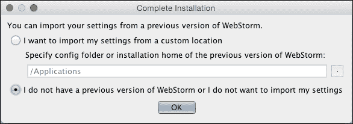

然后，您会看到一个**WebStorm 许可证激活**对话框的弹出窗口，在那里您可以激活您的许可证（如果有的话），购买它，或运行 30 天的 WebStorm 试用版。阅读许可证协议并接受所有条款。以下截图显示了这一点：

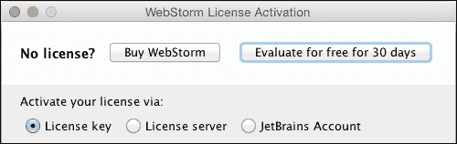

当您完成许可证后，在**WebStorm 初始配置**对话框中，您可以设置**快捷键方案**，这取决于您的习惯，**IDE 主题**，以及您更喜欢的**编辑器颜色和字体**——深色或浅色。使用**点击预览**部分来评估您设置的主题和颜色是否符合您的需求和偏好。本书中的快捷键基于**Mac OS X 10.5+**方案。以下截图恰当地捕捉了这次讨论：

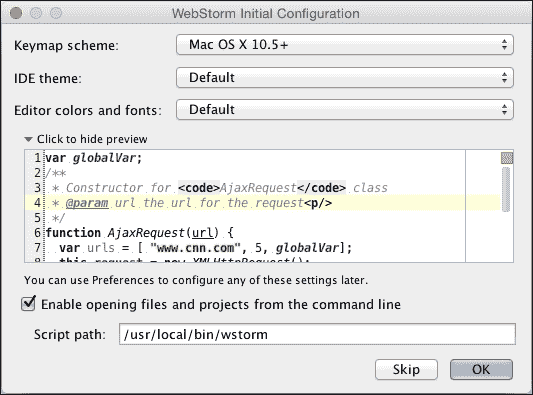

# 用户界面

现在我们已经安装了 WebStorm，所以是时候探索其界面了——当你开发 Web 应用时应该停留的世界。理解界面对于你在 WebStorm 中得心应手并高效、愉快地使用它是必要的。

## 在开始之前

第一次运行 WebStorm 或之后，当没有打开项目时，你将看到一个如下所示的欢迎屏幕：

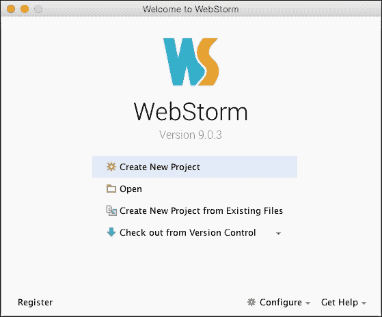

你可以创建一个新项目、打开一个现有项目、从版本控制系统检出代码，或者从**配置**下拉列表中选择要执行的操作设置。为了熟悉 WebStorm 用户界面，让我们创建一个新、简单的 HTML 项目。

## 创建新项目

要创建一个新项目，请按照以下步骤操作：

1.  点击**创建新项目**按钮，将打开**新项目**对话框。

1.  给我们的项目起一个名字，例如，`MyFirstWebProject`，并指定项目文件所在的文件夹，可以是手动指定，也可以通过点击浏览（**…**）按钮选择文件夹。

1.  然后，将**项目类型**字段保留为**空项目**值——目前我们只是沉浸于界面，并不创建真正有用的东西——并点击**确定**按钮。以下截图展示了这些步骤：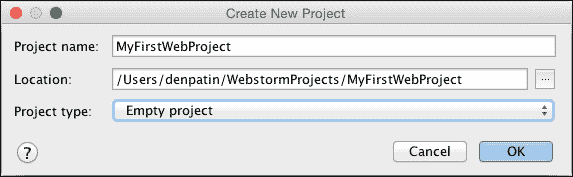

## WebStorm 工作区

WebStorm 主窗口打开。它可以直观地分为七个逻辑部分，如下面的截图所示：

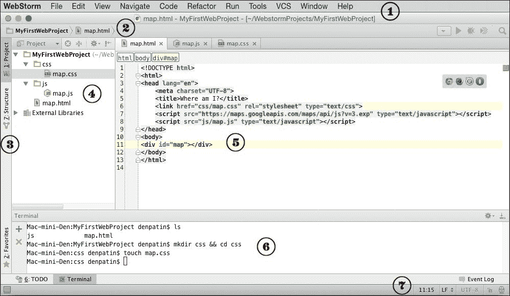

不仅仅简单介绍它们，让我们创建一个非常简单但相当有趣的项目——使用谷歌地图自动定位你。在前面展示的图片中，你可以看到我们即将完成的效果。因此，完成本节后，你将拥有相同的视图。

现在，你所看到的是以下内容：

+   **菜单栏**（**1**），其中包含许多选项，包括标准的**文件**、**编辑**、**视图**选项以及 WebStorm 特定的**代码**、**重构**、**运行**和**版本控制**选项。

+   主窗口分为两个明显可区分的部分：

    +   左侧的**项目工具面板**（**4**），在这里你可以看到你的项目结构和文件。你现在只看到一个带有项目名称的行，但在图片中，你已能看到我们项目的层次结构。项目工具面板与另一个界面元素相关联，即**工具标签**（**3**），我稍后会对其进行描述。

    +   右侧的**编辑面板**（**5**），在这里你将输入你的代码。

+   在这两个面板稍上方，你可以找到**导航工具栏**（**2**）。目前，它只有一个带有典型文件夹图标的前缀`MyFirstWebProject`和右箭头形状的后缀，但在图像中，有三个面包屑，每个面包屑代表下一个层次级别。导航工具栏非常适合快速导航和更好地理解项目文件层次结构。

+   在这两个面板的底部，你可以找到**状态栏**（**7**），其中包含一些辅助信息，例如表示编辑器中当前光标位置（以`行:列`格式）、行结束类型（Windows 风格的、Mac 风格的等等）、在编辑器中编码当前文件等等。

你的项目目前还是空的。让我们开始工作！通过在**项目**工具窗口中右键单击项目名称，向项目中添加一个 HTML 文件，并将其命名为`map.html`或简单地命名为`map`。这在上面的截图中有展示：

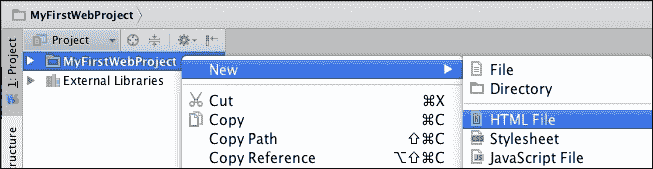

### 注意

注意，明确指出扩展名是可选的，因为它会根据所选字段的类型自动添加。

在编辑器中，你看到简单的 HTML5 起始代码。在那里，让我们标明地图将显示的位置。它将是一个具有`map` ID 的简单`div`元素：

```js
<div id="map"></div>
```

### 注意

我建议你在至少前几章中避免简单地复制任何代码，这样你才能深刻感受到 WebStorm 为你提供的优势。

在`body`部分，开始输入`<div>`。当你输入每个符号时，你会看到 WebStorm 在当前内容内建议合适的标签。你可以用鼠标浏览下拉标签列表，并用*Enter*键选择一个标签，就像你可以添加属性到标签一样。当你输入`>`时，你会发现如果它是一个成对标签，WebStorm 会自动关闭该标签。你应该注意到 WebStorm 将光标直接放在你将进一步写入标签或属性值的地方；这稍微节省了一些时间。当你使用 WebStorm 工作时，不需要保存你的文件；默认情况下，当你更改框架时，它会监视文件的变化并自动保存它们。这种行为可以在**首选项** | **外观和行为** | **系统设置**对话框中设置/修改。

现在我们需要 JavaScript 代码来渲染地图。要添加它，首先在项目根目录下创建一个新的目录，名为`js`，并在其中添加一个 JavaScript 文件，名为`map.js`。它将在新标签页中打开，并包含关于作者和创建时间的注释。用以下代码填充该文件：

```js
var map;

function initialize() {
    var mapOptions = {
        zoom: 10
    };
    map = new google.maps.Map(document.getElementById('map'), mapOptions);
    if(navigator.geolocation) {
        navigator.geolocation.getCurrentPosition(function(position) {
            var pos = new google.maps.LatLng(position.coords.latitude, position.coords.longitude);
            var infowindow = new google.maps.InfoWindow({
                map: map,
                position: pos,
                content: 'I am here!'
            });
            map.setCenter(pos);
        }, function() {
            handleNoGeolocation(true);
        });
    } else {
        handleNoGeolocation(false);
    }
}

function handleNoGeolocation(errorFlag) {
    if (errorFlag) {
        var content = 'Error: The Geolocation service failed.';
    } else {
        var content = 'Error: Your browser doesn\'t support geolocation.';
    }
    var options = {
        map: map,
        position: new google.maps.LatLng(60, 105),
        content: content
    };
    var infowindow = new google.maps.InfoWindow(options);
    map.setCenter(options.position);
}

google.maps.event.addDomListener(window, 'load', initialize);
```

我们刚刚创建的代码使用了 Google Maps API 的功能，在 HTML 页面上渲染地图，定位你，并在那里显示**我在这里！**的消息。

现在，让我们关注一个更多的工作区元素。它位于 IDE 的几乎底部（6）。这让你想起了什么吗？是的，它是你操作系统的标准终端，集成到了 WebStorm 中。你可以通过点击左下角的 **终端** 按钮，或者在点击  图标时，从下拉选项列表中选择 **终端** 选项来激活它，如下面的截图所示：

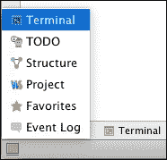

终端打开后，你可以像使用操作系统内置的终端一样使用它。我希望你通过 WebStorm 终端创建一个名为 `css` 的目录来保存 `map.css` 文件。只需执行以下命令，`css` 目录和 `map.css` 文件就会出现在 **项目** 工具面板中：

```js
$ mkdir css
$ cd css

```

现在，你将有一个名为 `css` 的新目录。在这个文件夹中，从上下文对话框或 **文件** | **新建** 菜单创建一个名为 `map.css` 的新 CSS 文件。使用终端而不是上下文菜单操作，或者反之，没有优势。你使用哪种方式取决于你，但既然我们正在探索一个对你来说新的工具，WebStorm，我将尽可能使用其界面。

现在在项目结构层次中双击 `map.css` 文件，并填充以下代码：

```js
html, body, #map {
    height: 100%;
    margin: 0;
    padding: 0
}
```

现在我们需要添加最后的润色——我们应该告诉 HTML 使用我们的 CSS 和 JavaScript 文件，并指出 Google Maps API 的位置。我们可以通过简单地添加链接和脚本标签到 `head` 部分来实现。就像之前描述的那样，你可以使用 WebStorm 的代码补全功能来加快你的代码输入。现在我想提到一个在这里非常关键的功能（我们将在下一章详细讨论 WebStorm 的智能代码补全）。它涉及到那些指向其他项目文件的属性——在我们的例子中，是 `src` 和 `href` 属性。没有必要手动搜索这些标签要指向的文件（在大型项目中这一点尤其值得赞赏）——WebStorm 会为你完成所有这些。当你已经在引号之间并等待输入属性值时，只需简单地按 *Ctrl* + *Space*（在 Windows 上）/ *Ctrl* + *Space*（在 Mac 上），WebStorm 就会显示在这个上下文中可能的所有文件。如果文件太多，你可以简单地开始输入文件名，WebStorm 的智能补全也会发挥作用。当然，这只是 WebStorm 可以提供的一小部分。你将在下一章熟悉一系列智能技术。

因此，生成的 HTML 代码如下：

```js
<!DOCTYPE html>
<html>
<head lang="en">
    <meta charset="UTF-8">
    <title>Where am I?</title>
    <link href="css/map.css" rel="stylesheet" type="text/css">
    <script src="img/js?v=3.exp" type="text/javascript"></script>
    <script src="img/map.js" type="text/javascript"></script>
</head>
<body>
<div id="map"></div>
</body>
</html>
```

最后但同样重要的界面元素是工具标签页（3），我之前已经提到过，但现在，我们才能看到使用它的好处。之前，我们在**项目**标签页，在那里我们可以看到文件和目录层次结构。切换到**结构**标签页，对于每个文件——`map.html`、`map.js`和`map.css`——你将看到以下内容：

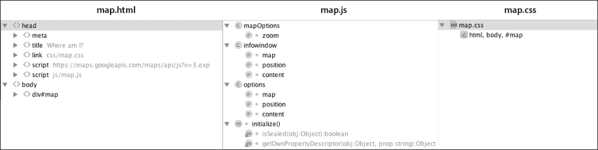

这也是一个层次结构，但不是文件系统元素的层次结构；这是一个基于内容层次的。对于 HTML，这意味着标签层次结构；对于 CSS，所有样式都被列举出来；对于 JavaScript，你可以看到所有具有参数的对象和函数的信息。此外，点击任何一行会直接将你带到代码中该行元素声明或存在的地方。

哇，你的第一个 WebStorm 项目已经准备好了！现在，是时候运行我们的页面了。

## 运行应用程序

你还记得任何 IDE 的目的是尽可能多地自己执行操作，以便你只需专注于设计项目和编写代码，而不是执行大量琐碎但数量众多的操作吗？这意味着大多数时候，你将停留在 IDE 的四个墙壁之内，几乎在内部执行所有操作。如果你需要在 IDE 之外执行某些操作，考虑一下是否可以通过 IDE 执行它。然而，有一件事你需要离开 IDE——那就是你的浏览器。你需要看到你的结果，不是吗？但即使在这种情况下，WebStorm 也帮助你。当你输入 HTML 代码时，你注意到编辑器右上角有一个浏览器图标列表面板吗？这里是面板的样子：


是的，每个图标都是一个浏览器可执行文件的快捷方式，如果你点击任何一个，相应的浏览器就会打开当前页面。请注意，只有安装的浏览器才会打开。

你的当前位置在地址`http://localhost:63342/MyFirstWebProject/map.html`处打开页面。如果你看到一个空白页面，不要害怕。首先，你需要允许浏览器获取你的位置，因为它会询问你。然后，你将看到一个地图，其中你的位置会用文字**我在这里**来表示。

剩下的唯一问题是，`localhost`词后面的那个奇怪的数字是什么？WebStorm 提供了在默认端口`63342`上运行的简单 HTTP 服务器的功能。你可以在 IDE 设置中更改端口。

# 设置和偏好

到现在为止，我们将要讨论的是在 WebStorm 本身中自定义某些内容，而不是在代码中，所以我必须告诉你 WebStorm 提供的各种设置。

有两个类似但独立的设置窗口：

+   整个 IDE 的设置

+   当前项目的设置

对于第一种情况，要打开设置窗口，你可以简单地按*Ctrl* + *Alt* + *S*（Windows）或*⌘* + *,*（Mac），然后你会看到以下屏幕：

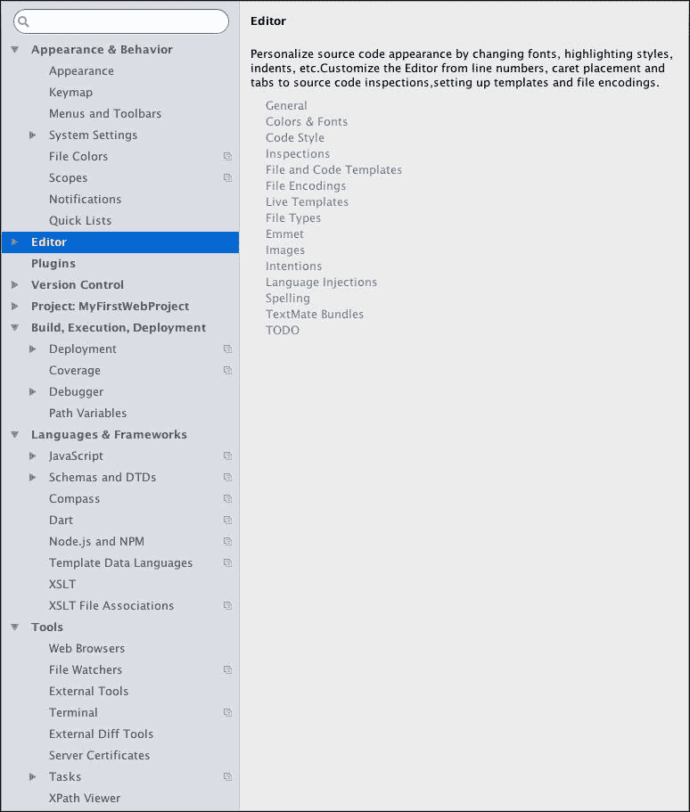

要访问项目设置，选择**文件** | **默认设置**，你将得到类似于 WebStorm 设置的界面，但可配置的选项列表较少。

### 注意

我应该立即说明，设置并不是每天都需要关注的事情，所以你不需要把它看作是必须完全配置的东西——在大多数情况下，一切都已经调整好了；此外，如果需要配置，它将以信息气泡的形式弹出，并提供直接链接到设置的链接。

如果你需要配置某些内容，你需要快速找到必要的设置。为此，开始在搜索字段中键入其名称，随着你键入，第一个匹配的设置会被突出显示，并显示相应的页面。

但让我们进一步浏览设置。我并不是要描述所有的设置，但我仍然会涵盖最重要的那些。

## 主题和颜色

在初始配置阶段，你选择了你希望 IDE 拥有的主题和颜色。也许在编程过程中，你意识到你最好使用另一个主题和/或颜色。

如果你想要更改 IDE 的主题，请进入**外观与行为**部分的**外观**子部分。在那里，你会找到一个**主题**下拉列表，你可以更改当前的主题，如下面的截图所示：

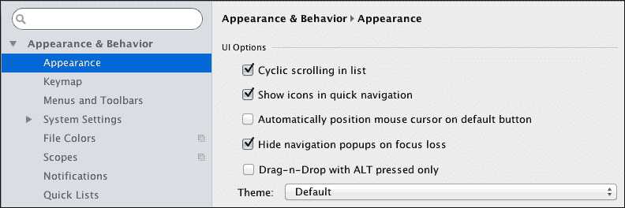

如果你想要更改 IDE 中某个部分的颜色，你可以进入**编辑器**部分的**颜色与字体**子部分，并尝试那里提供的各种参数，以找到适合你的那些。你可以通过点击**应用**按钮实时观察变化。以下截图很好地展示了这一讨论：

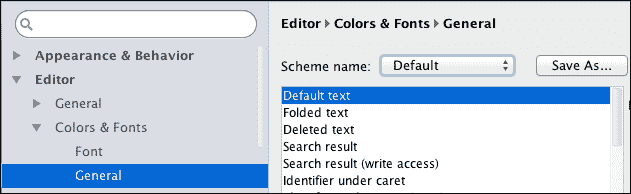

## 键映射

键映射是开发者必须知道并熟练掌握的东西，因为使用快捷键的熟练程度与开发速度直接成正比。很明显，每个人在每种情况下都有自己的键组合偏好。因此，IDE 应该考虑到定制键映射的必要性，以适应更多的开发者。

WebStorm 为你提供了全面的关键映射管理，你可以在**外观与行为**部分的**键映射**子部分访问它。对于 IDE 内部可访问的每个菜单项和命令，你都有机会更改默认的键组合。当然，WebStorm 会通过警告消息防止你覆盖和覆盖已存在的组合。

要添加新的快捷键或更改现有的快捷键，你只需要选择你要处理的选项，然后点击**移除**或/和**添加键盘快捷键**按钮——根据你的意图而定。然后，简单地按下你想要为某个动作设置的组合，这样就完成了。

这对那些从一种操作系统迁移到另一种操作系统或从一种 IDE 迁移到 WebStorm 的用户来说是个好消息。如果你已经习惯了之前工作区特定的快捷键映射，你需要首先检查**快捷键映射**选项列表，在那里你可以可靠地找到一个能满足你的选项。这些选项包括 Emacs、Visual Studio、Eclipse、NetBeans、Mac OS X、Linux、Windows 等等。

## 代码样式

在**编辑器**部分的**代码样式**子部分，你可以看到使用 WebStorm 编写代码时可以自定义每种语言的样式的可能性：JavaScript、CoffeeScript、CSS、Haml、JSON、Dart、XML、YAML 等等。

你可以更改的语言设置不计其数。你可以设置缩进大小、缩进类型，如果你使用制表符，还可以设置其大小，决定是否放置空格，如何执行换行，以及许多其他方面。在每种语言的定制面板上，你可以预览如果你更改了某些设置后你会得到什么。

## 语言与框架

在设置中有一个**语言与框架**部分，负责考虑使用的科技。在这里，你可以指定必要框架和语言解释器的可执行文件，设置运行时的默认参数，为它们添加包，等等。以下截图很好地概括了讨论内容：

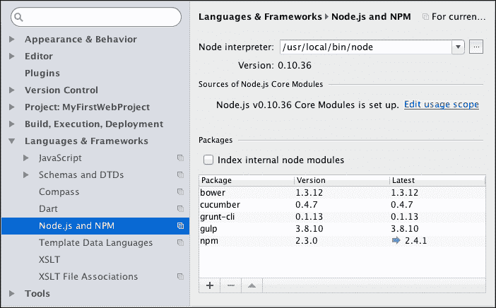

## 插件

插件是 WebStorm 的重要组成部分，因为它们可以显著扩展 IDE 的核心功能。

### 注意

有选择性地安装插件，不要逐个安装。记住，你安装的插件越多，启动 IDE 所需的时间就越长，性能也会越差。但不要害怕安装插件——每个插件只会为你的 IDE 启动时间增加几十毫秒，除非你只安装必要的插件，否则你不会体验到性能下降。对于性能来说，10-15 个插件已经足够，也足以满足典型项目需求。

你可以在**首选项**窗口的**插件**部分管理插件，如下面的截图所示：

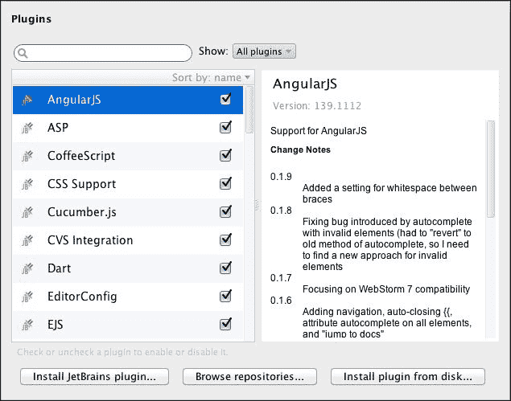

已经勾选的插件已经安装并可在 IDE 内部访问。如果你需要更多插件，有两种获取方式。你可以在线仓库中浏览它们，或者直接从磁盘安装已下载或已构建的插件。

**安装 JetBrains 插件…**窗口和**浏览仓库…**窗口之间的区别是，后者允许你安装在线仓库中可用的任何插件，无论是第三方还是 JetBrains 的。

在插件的安装过程中没有关于它的内容。你只需要找到你想要的，然后简单地点击**从磁盘安装插件…**按钮。

## 版本控制

任何开发过程，无论是网页、桌面还是其他任何形式，没有版本控制都是不可想象的。这促使集成开发环境（IDEs）整合各种版本控制系统，WebStorm 也不例外。WebStorm 不仅支持**Git**、**Subversion**、**Mercurial**、**CVS**和**Perforce**，还提供了与 GitHub 账户的绑定。此外，WebStorm 还提供了所谓的“本地历史记录”功能，通过 IDE 跟踪代码的任何更改，无需使用专门的版本控制系统。尽管这些版本控制系统之间存在差异，但 WebStorm 允许您以类似的方式使用它们。当然，作为一个 IDE，WebStorm 处理了许多问题，因此处理版本控制系统变得可视化，甚至比通过标准命令行还要简单。

您可以决定哪些操作需要确认（如下面的图像所示），指定哪些可以在后台运行，配置要忽略的内容，管理历史缓存处理等等。然后，您将能够仅通过快捷键就巧妙地管理您的版本控制系统。**版本控制**在下面的屏幕截图中展示：

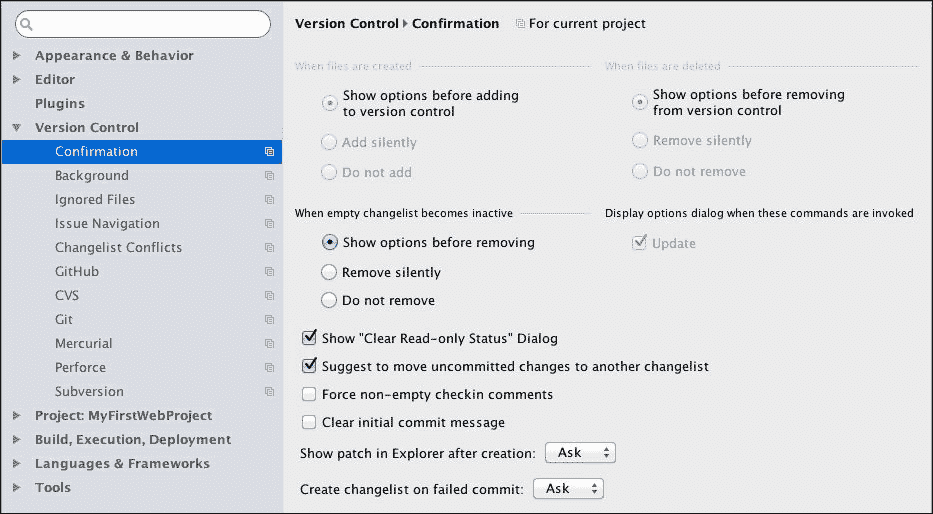

## Proxy

您可能需要在工作中使用 WebStorm。许多公司都在使用内部网络，所以您可能会发现，没有代理，您将无法执行大多数面向互联网的操作。还可能有其他一些因素阻止您在互联网上舒适地工作。因此，让我们学习如何在 WebStorm 中设置代理。

不要手动搜索代理设置的位置，让我们查询搜索框，输入单词`proxy`。它将立即显示代理设置的位置，并且只过滤出包含`proxy`的菜单部分。此外，它还会突出显示包含单词`proxy`的所有参数，这样我们就可以快速找到我们正在寻找的内容。

对于代理处理连接来说是一件小事。您需要填写此处显示的空白字段，然后点击**应用**按钮：

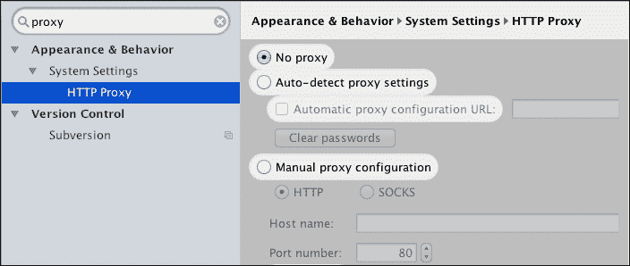

# 摘要

在本章中，您学习了如何安装并准备 WebStorm 以进行开发过程。我们实现了一个简单的 Web 应用程序，并通过我们创建的文件和执行的操作的例子，仔细审查了 WebStorm 界面以及自定义其最重要元素的方法。

在下一章中，我们将发现一些最基本且智能的功能，这些功能可以极大地提高您的效率，从而使 WebStorm 真正成为网页开发的利器。
