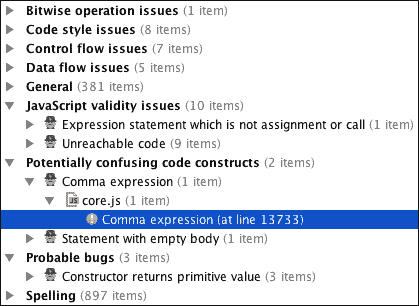

# 第二章. 使用智能功能提高效率

在上一章中，您开始了熟悉 WebStorm 世界的旅程。您不仅了解了一些基本的东西，而且还使用几个功能创建了一个简单的项目，因此您现在有了使用 WebStorm 的第一手基本经验，现在是时候更进一步，培养您的技能了。

在本章中，我们将处理一些真正智能的功能，这些功能将使您能够从根本上改变您对 Web 开发的看法，并学习如何从 WebStorm 中获得最大收益。在本章中，我们将研究以下内容：

+   语法高亮

+   飞行中的代码分析

+   智能代码功能

+   多选功能

+   重构功能

+   高级导航

# 语法高亮

语法高亮功能是任何代码编辑器必须擅长的一项核心功能，因为即使是十几行未着色的代码也可能令人困惑，甚至令人烦恼。此外，您可以看到 WebStorm 如何执行高亮显示：


WebStorm 不仅整洁地突出显示代码，还提供了一组灵活的设置来做到这一点。这意味着您能够完全根据您的偏好自定义代码外观的每一个细节。您能够自定义 JavaScript、CoffeeScript 和 TypeScript、CSS 和 SASS/SCSS、JSON 和 XML 和 YAML 等的突出显示。

要配置语法高亮，请打开**首选项**窗口，然后转到**编辑器**部分的**颜色与字体**子部分，并选择要自定义其代码样式的语言或技术：


对于每个代码单元——关键词、标签、数字和单词、注释、标点符号、变量和函数声明——您都可以更改其外观——粗体或斜体，前景和背景颜色，字体效果等等。在配置面板下方，您可以找到一个预览面板，您可以在其中实时观察您所做的所有更改。此外，如果您知道您想自定义的代码单元是什么，但不知道它的名称，您只需在预览面板中单击任何符号或单词，它就会自动在选择代码单元名称的列表中选中，以及相同类型的所有单元都会闪烁，这样您就可以看到您选择了什么。

自定义后，您可以保存所有设置为新方案，以便这些设置可以应用于未来的项目，以及这个项目。为此，您只需单击设置上方的**另存为...**按钮，并为这个新的代码样式方案命名。

WebStorm 还能够检测您在特定上下文中使用的语言，并相应地突出显示代码。例如，如果您在 HTML 文件中编写 JavaScript 代码，WebStorm 将能够检测到这一点并正确地突出显示您的代码。

# 飞行中的代码分析

WebStorm 将在代码即时执行静态代码分析。编辑器将根据使用的语言和指定的规则检查代码，并在你输入时突出显示警告和错误。这是一个非常强大的功能，意味着你不需要外部代码检查器，并且可以快速捕获大多数错误，从而使像 JavaScript 这样的动态和复杂语言更加可预测和易于使用。

运行时错误和任何其他错误，如语法或性能，是两个需要考虑的因素。要调查第一个，你需要测试或调试器，而且很明显，它们几乎与 IDE 本身没有什么共同之处（尽管，当这些功能集成到 IDE 中时，这种协同作用会更好，但这不是重点）。你也可以用同样的方式检查第二种类型的错误，但这方便吗？想象一下，你需要在写下下一行代码后运行测试。这行不通！使用某种能够关注并分析每个输入的单词，以便在执行代码之前通知你可能的性能问题和错误、代码风格和工作流程问题、各种验证问题、警告死代码和其他可能的执行问题，不是更有效率和有帮助吗？WebStorm 是最适合这项工作的。它对代码的每一行、每个单词进行深度分析。此外，你不需要在 WebStorm 扫描你的代码时打断你的开发过程；这是即时进行的，因此被称为：


WebStorm 还允许你按需获取完整的检查报告。要获取它，请转到菜单：**代码** | **检查代码**。它会弹出**指定检查范围**对话框，你可以定义你想要检查的确切内容，然后点击**确定**。根据所选内容和大小，你可能需要等待一段时间，直到进程完成，你将看到详细的结果，其中终端窗口位于：



如果需要，你可以展开所有项目。在检查结果列表的右侧，你可以看到一个解释窗口。要跳转到有错误的代码行，你只需点击必要的项目，然后你会翻转到相应的行。

除了简单地指示某个问题所在的位置，WebStorm 还明确地建议了消除这个问题的方法。你甚至不需要自己做出任何更改——WebStorm 已经提供了快速解决方案，你只需点击即可，它们将立即插入到代码中：


我们将在第七章中更深入地探讨代码分析和质量，*分析和调试你的代码*。

# 智能代码功能

作为一款**集成开发环境**（**IDE**）并且倾向于智能，WebStorm 提供了一组非常强大的功能，您可以使用这些功能显著提高效率并节省大量时间。

最有用且热门的功能之一是代码补全。WebStorm 持续分析并处理整个项目的代码，并智能地建议当前上下文中适当的代码片段，甚至更多——在方法名称旁边，您还可以找到这些方法的用法。当然，代码补全本身并不是一项新鲜的创新，但 WebStorm 在执行它时比其他 IDE 更智能。WebStorm 可以自动完成许多事情：类和函数名称、关键字和参数、类型和属性、标点符号，甚至文件路径。

默认情况下，代码补全功能是开启的。要调用它，只需开始输入一些代码。例如，在下面的图像中，您可以看到 WebStorm 如何建议对象方法：


您可以使用鼠标或*上*和*下*箭头键在建议列表中导航。然而，列表可能非常长，这使得浏览起来不太方便。为了减少列表长度并仅保留当前上下文中适当的内容，请继续输入下一个字母。除了仅输入方法的初始连续字母外，您还可以从方法名称的中间输入某些内容，或者甚至使用驼峰式风格，这通常是输入真正长方法名称最快的方式：


由于某种原因，代码补全可能无法自动工作。要手动调用它，请按 Mac 上的*Ctrl* + *Space*或 Windows 上的*Ctrl* + *Space*。

要插入建议的方法，按*Enter*键；要将当前光标位置旁边的字符串替换为建议的方法，按*Tab*键。如果您希望该功能还能为该方法安排正确的语法环境，请按 Mac 上的*Shift* + *⌘* + *Enter*或 Windows 上的*Ctrl* + *Shift* + *Enter*，将插入缺失的括号和/或新行，直到达到当前代码语言的样式标准。

# 多选功能

使用多选（或简称为多选）功能，您可以同时将光标放置在几个位置，当您输入代码时，它将应用于所有这些位置。例如，您需要为每个表格单元格添加不同的背景颜色，然后使它们的宽度为二十像素。在这种情况下，您不需要重复执行这些相同的任务，只需在`<td>`标签后放置光标，按*Alt*键，并将光标放入您打算应用样式的每个`<td>`标签：


现在您可以开始输入必要的属性了——它是`bgcolor`。请注意，WebStorm 即使在您没有在单行输入任何内容的情况下，也会在这里执行智能代码补全。您会得到`bgcolor`属性的空值，稍后您将单独填写它们。您还需要更改宽度，以便继续输入。由于单元格宽度被设置为固定大小，因此只需添加`width`属性的值即可。以下图像显示了示例：


此外，多选功能可以选择相同值或独立单词，也就是说，您不需要将光标放在多个位置。让我们通过另一个示例来查看这个功能。比如说，您改变了主意，决定将几个连续单元格的背景色改为边框色。您可能会立刻想到使用简单的替换功能，但您不需要替换所有属性出现，只需几个连续的即可。为此，您可以将光标放在您将要执行更改的第一个属性上，然后在 Mac 上多次点击*Ctrl* + *G*或在 Windows 上点击*Alt* + *J*，直到您需要。一个接一个地，相同的属性将被选中，您可以将`bgcolor`属性替换为`bordercolor`：


您也可以通过在 Mac 上点击*Ctrl* + *command* + *G*或在 Windows 上点击*Ctrl* + *Alt* + *Shift* + *J*来选择任何单词的所有出现。

要退出多选模式，您必须点击不同的位置或使用*Esc*键。

# 重构功能

在整个开发过程中，您几乎不可避免地需要使用重构。而且，您的代码库越大，控制代码就越困难。当您需要重构某些代码时，您很可能会遇到一些问题，例如命名遗漏或没有考虑到函数的使用。您已经了解到 WebStorm 执行彻底的代码分析，因此它理解什么与什么相关联，如果发生某些变化，它会收集它们并决定在其余代码中可以执行什么，不可以执行什么。让我们尝试一个简单的例子。

在一个大的 HTML 文件中，您有以下的行：

```js
<input id="search" type="search" placeholder="search" />
```

在一个大的 JavaScript 文件中，您还有另一个：

```js
var search = document.getElementById('search');
```

你决定将输入元素的`id`属性值重命名为`search_field`，因为它更不容易引起混淆。你可以在这里简单地重命名它，但之后你将不得不手动查找代码中所有`search`单词的出现。很明显，这个单词相当常见，所以你将花费大量时间识别当前上下文中合适的用法或不合适的用法。而且，你很可能忘记一些重要的事情，甚至还需要更多时间来调查问题。相反，你可以将这个任务委托给 WebStorm。选择要重构的代码单元（在我们的例子中，是`id`属性的`search`值），然后在 Mac 上点击*Ctrl* + *T*或在 Windows 上点击*Ctrl* + *Alt* + *Shift* + *T*（或者简单地点击**重构**菜单项）来调用**重构此**对话框。在那里，选择**重命名…**项，并输入所选代码单元的新名称（在我们的例子中是`search_field`）。要仅预览重构过程中将发生的事情，请点击**预览**按钮，所有要应用的变化将显示在底部。你可以遍历层次树，通过点击**执行重构**按钮应用更改，或者不应用。如果你需要预览，可以简单地点击**重构**按钮。你将看到`id`属性得到了`search_field`值，而不是类型或占位符值，即使它们具有相同的值，在 JavaScript 文件中你也得到了`getElementById('search_field')`。

### 注意

注意，尽管 WebStorm 可以执行各种智能任务，但它仍然是一个程序，并且所谓的“人工智能不完善”可能会引起一些问题，因此在执行重构时你应该始终保持谨慎。特别是，手动检查`var`声明，因为 WebStorm 有时也会将这些更改应用到它们上，但由于作用域的原因，这并不总是必要的。

当然，这仅仅是你通过重构能够实现的一小部分功能。重构功能允许你执行的基本操作如下：


上一张截图中的元素解释如下：

+   **重命名…**：你已经熟悉了这种重构。再次强调，使用它你可以重命名代码单元，WebStorm 会自动修复代码中所有对这些代码单元的引用。快捷键是*Shift* + *F6*。

+   **更改签名…**：此功能用于更改函数名称，以及添加/删除、重新排序或重命名函数参数，即更改函数签名。快捷键是 Mac 上的*⌘* + *F6*，Windows 上的*Ctrl* + *F6*。

+   **移动…**：此功能使你能够在项目中移动文件或目录，并且它同时修复代码中对这些项目元素的引用，因此你不需要手动修复它们。快捷键是*F6*。

+   **复制…**：使用此功能，您可以复制文件、目录或甚至一个类及其结构，从一个地方复制到另一个地方。快捷键是*F5*。

+   **安全删除…**：这个功能非常有用。它允许你安全地从项目中删除任何代码或整个文件。在执行此重构时，你会被问及是否需要检查注释和字符串或所有文本文件中所需代码片段的出现。快捷键是 Mac 上的*⌘* + *delete*，Windows 上的*Alt* + *Delete*。

+   **变量…**：此重构功能在所选语句或表达式的结果处声明一个新变量。当意识到某个表达式的出现次数太多，可以将其转换为变量，并且表达式可以初始化它时，这可能很有用。快捷键是 Mac 上的*Alt* + *⌘* + *V*，Windows 上的*Ctrl* + *Alt* + *V*。

+   **参数…**：当你需要向某个方法添加新参数并适当地更新其调用时，使用此功能。快捷键是 Mac 上的*Alt* + *⌘* + *P*，Windows 上的*Ctrl* + *Alt* + *P*。

+   **方法…**：在此重构过程中，所选代码块经过分析，通过分析检测到输入和输出变量，提取的函数将输出变量作为返回值。快捷键是 Mac 上的*Alt* + *⌘* + *M*，Windows 上的*Ctrl* + *Alt* + *M*。

+   **内联…**：内联重构与提取方法重构相反——它用它们的初始化器替换多余的变量，使代码更加紧凑和简洁。快捷键是 Mac 上的*Alt* + *⌘* + *N*，Windows 上的*Ctrl* + *Alt* + *N*。

# 高级导航

导航是任何 IDE 中最重要的功能之一，因为如果你不能快速找到或切换到你想要的任何东西，那么使用这样的程序几乎没有理由，因为没有节省时间的方面。

在一定程度上，我们检查了 WebStorm 提供的某些导航功能。它们是菜单面板、导航工具栏和工具标签。一切都很好，但我们仍然需要执行很多鼠标移动才能到达代码中的必要位置。我们将通过一些这些强大的导航工具来查看 WebStorm 如何帮助我们与代码一起工作。我们将根据它们可以帮助我们执行的动作类型来查看它们。

## 文件导航

这是一组快捷键，帮助我们高效地处理文件：

+   要导航到项目中的文件，在 Mac 上按*Shift* + *⌘* + *O*，在 Windows 上按*Ctrl* + *Shift* + *N*。

+   要在编辑器中打开的文件之间导航，在 Mac 上按*Ctrl* + *Tab*，在 Windows 上按*Alt* + *Tab*。

+   要查看最近打开的文件，在 Mac 上按*⌘* + *E*，在 Windows 上按*Ctrl* + *E*。要查看最近更新的文件，在 Mac 上按*Shift* + *⌘* + *E*，在 Windows 上按*Ctrl* + *Shift* + *E*。

+   要导航到项目中的类，在 Mac 上按*⌘* + *O*，在 Windows 上按*Ctrl* + *N*。

## 代码导航

这些快捷键旨在帮助我们导航并在源代码上快速执行任务：

+   要弹出文件的结构视图，请按 Mac 上的 *⌘* + *F12* 或 Windows 上的 *Ctrl* + *F12*。

+   要获取所选类的层次结构，请按 Mac 上的 *Ctrl* + *H* 或 Windows 上的 *Ctrl* + *H*。

+   要导航到项目中的声明，请按 Mac 上的 *⌘* + *B* 或 Windows 上的 *Ctrl* + *B*。

+   要导航到下一个方法，请按 Mac 上的 *⌘* + *O* 或 Windows 上的 *Alt* + 向下箭头键。要导航到上一个方法，请按 Mac 上的 *⌘* + *O* 或 Windows 上的 *Alt* + 向上箭头键。

+   如果您需要复制当前行，请按 Mac 上的 *Ctrl* + *D* 或 Windows 上的 *Alt* + *D*。

+   如果您需要注释/取消注释行，请按 Mac 上的 *⌘* + */* 或 Windows 上的 *Ctrl* + */*。

+   如果您需要将行移动到代码中的另一个位置，请按 Mac 上的 *Shift* + *⌘* + 向下/向上箭头或 Windows 上的 *Ctrl* + *Shift* + 向下/向上箭头。移动时也会保持语法正确性。

## 搜索导航

我们可以使用搜索导航快速找到项目中所需的内容：

+   要在路径中查找内容，请按 Mac 上的 *Shift* + *⌘* + *F* 或 Windows 上的 *Ctrl* + *Shift* + *F*。要在路径中替换内容，请按 Mac 上的 *Shift* + *⌘* + *R* 或 Windows 上的 *Ctrl* + *Shift* + *R*。

+   要查找所选代码片段的所有用法，请按 *Alt* + *F7*。要查找当前文件中选定代码片段的用法，请按 Mac 上的 *⌘* + *F7* 或 Windows 上的 *Ctrl* + *F7*。

+   要打开最后使用的工具窗口，请按 *F12*。要关闭当前活动的工具窗口，请按 *Shift* + *Esc*。

### 注意

要获取有关快捷键的更多信息，请阅读在线文档：[`www.jetbrains.com/webstorm/help/keyboard-shortcuts-and-mouse-reference.html`](https://www.jetbrains.com/webstorm/help/keyboard-shortcuts-and-mouse-reference.html).

### 小贴士

**下载示例代码**

您可以从您在 [`www.packtpub.com`](http://www.packtpub.com) 购买的所有 Packt 书籍的账户中下载示例代码文件。如果您在其他地方购买了这本书，您可以访问 [`www.packtpub.com/support`](http://www.packtpub.com/support) 并注册以将文件直接通过电子邮件发送给您。

# 摘要

在本章中，您学习了 WebStorm 的最显著特点，这些特点是提高您构建 Web 应用程序效率的核心组成部分。

在下一章中，我们将看到如何借助项目模板构建简单的网页，并使用版本控制系统（VCS）和文件监视器。
