# 第七章 分析和调试您的代码

在上一章中，我们学习了如何使用网络技术创建原生移动应用程序，以及如何借助模板快速创建项目。在本章中，我们将探讨 WebStorm 如何帮助我们分析和调试代码。

我们现在将关注代码质量工具，如 Code Inspector、Code Style 和 Code Linters，这些工具将帮助我们编写高质量的代码。我们还将学习如何在 IDE 中直接调试代码。在本章中，我们将涵盖以下主题：

+   理解代码检查

+   什么是代码风格？

+   使用不同的代码质量工具

+   调试您的代码

# 代码检查

WebStorm 配备了一个强大、快速且多功能的代码分析工具。此工具不仅检测编译器和运行时错误，还检测不同的代码低效。在您编码时，它会建议修正和改进。它可以检测的一些常见错误包括：不可达代码、未使用代码、未本地化的字符串、未解析的方法、内存泄漏和拼写错误。

检查可以通过多种方式执行：

+   分析所有打开的文件，所有代码问题都会在编辑器中突出显示。状态在编辑器的右侧可见。在文件顶部和滚动条上有一个总结，当点击时会带您到代码行。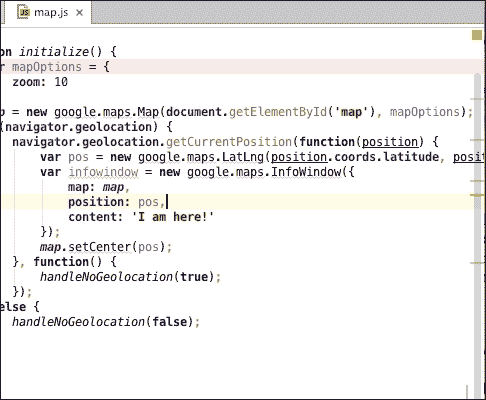

+   以批量模式运行分析将在指定范围内运行检查器。范围可以是任何一组文件，从当前选定的文件到整个项目。要运行批量模式，请选择**代码** | **检查代码…**，并在打开的对话框中指定范围。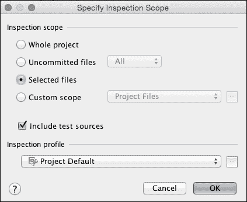

    在指定检查对话框中，我们还可以指定我们想要使用的**检查配置文件**。配置文件代表一组我们希望我们的代码与之检查的规则。目前，我们将保留默认设置，并点击**确定**。WebStorm 将运行检查，然后以以下截图所示的方式显示总结对话框：

    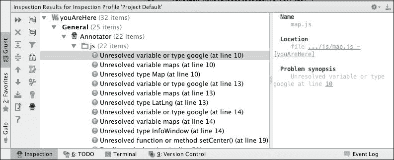

+   在指定范围内运行单个代码检查——在此模式下，WebStorm 允许我们在所选范围内检查特定问题。要访问对话框，请打开**代码** | **按名称运行检查**，并在该对话框中选择您想要运行的检查，如以下截图所示：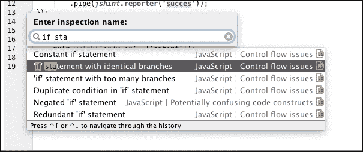

    这将打开范围对话框，在这里我们可以选择要应用此检查的代码。WebStorm 随后带我们到总结页面，类似于批量部分。

WebStorm 在检查代码时使用配置文件，因此您可以指定您想要搜索和报告的问题类型。它还允许您在应用程序或项目级别定义配置文件，并将创建的配置文件与团队的其他成员共享。所有配置文件设置都可以在**首选项** | **编辑器** | **检查**页面找到。

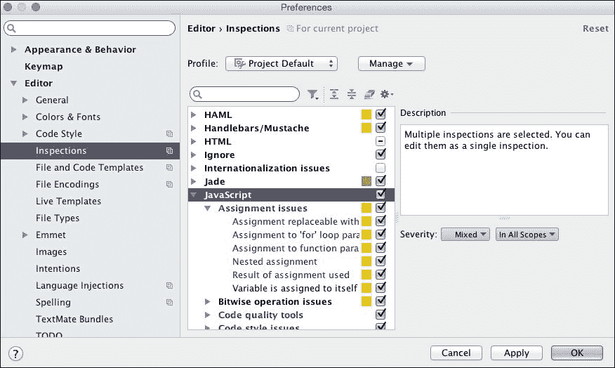

在本节中，我们关注了代码的执行和性能；在下一节中，我们将关注代码的外观。

# 代码风格

**代码风格**可以被视为一组特定的规则，这些规则规定了源代码的布局。它包括缩进、空白的使用、变量名、关键字等使用的样式。WebStorm 允许您管理应用于特定文件类型的方案。要访问对话框，请转到**首选项** | **编辑器** | **代码风格**。

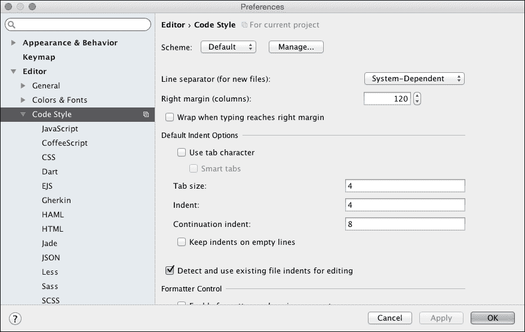

显示的第一页用于设置当前项目的通用样式，如下所示：

+   **行分隔符**用于列和换行

+   **默认缩进选项**

+   **格式化控制** 用于使用注释来开启/关闭代码风格

+   **EditorConfig** 通过通用的 `.editorconfig` 文件来控制样式，该文件可以与项目共享

我们还可以设置特定语言的代码风格，以使编辑器符合我们的需求。要更改这些设置，我们需要从预览屏幕中的菜单中选择所需的语言。

WebStorm 还允许您通过选择**代码** | **重新格式化代码**来快速将代码风格应用于打开的文件。它根据文件扩展名应用必要的规则。

这些工具有助于使您的代码外观保持一致，并且借助**EditorConfig**文件，您可以将您的样式与团队中的多个成员共享。将此类文件包含在项目的 Git 仓库中是一种良好的实践。

# 代码质量工具

WebStorm 允许我们使用各种代码质量工具来确保我们的代码没有常见的错误和不一致之处。WebStorm 10 支持与以下工具集成：

+   JSLint

+   JSHint

+   Closure Linter

+   JSCS

+   ESLint

它与 JSLint 和 JSHint 一起打包，但其余的则需要通过 NPM 或其他安装程序安装。我们将重点关注 JSCS 和前面列表中的前两个工具，因为这些是最常见的，并且不同工具之间的工作流程非常相似。

## JSLint

要使用 JSLint 工具，请在**设置** | **语言和框架** | **JavaScript** | **代码质量工具** | **JSLint** 页面上启用它，并选择所需的设置。在导航到复杂的设置页面时，使用内置的搜索是一种良好的实践。

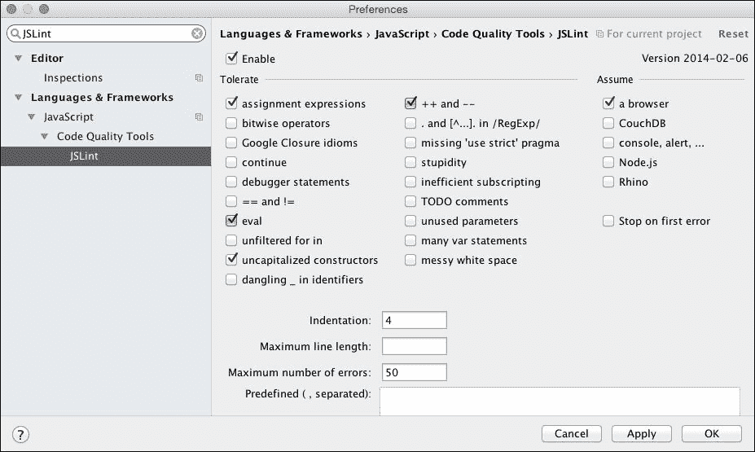

一旦我们启用并配置了 JSLint，它将自动检查所有打开的 JS 文件，并使用指定的设置，错误将像代码检查消息一样显示。

## JSHint

JSHint 是 WebStorm 内置的另一款代码质量工具。设置页面可在**设置** | **语言和框架** | **JavaScript** | **代码质量工具** | **JSHint**中找到。

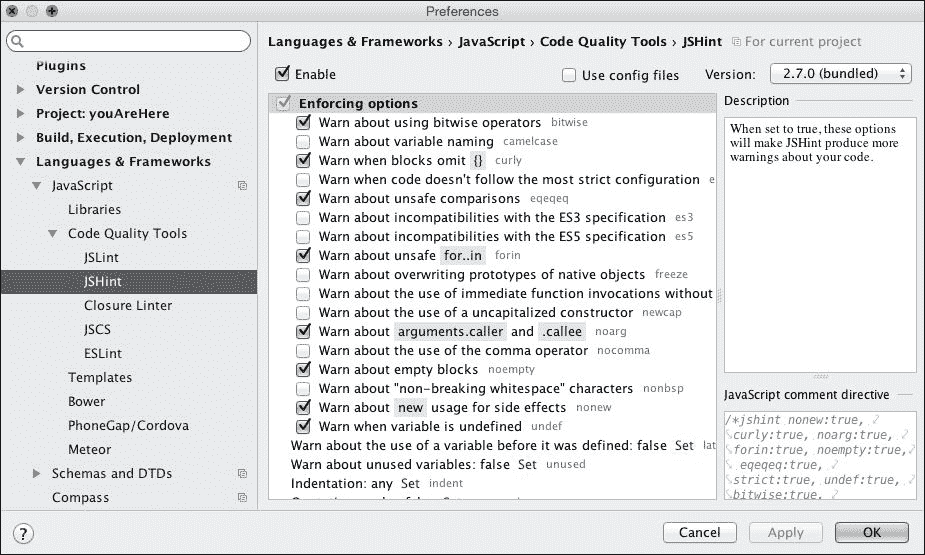

JSHint 设置可以通过设置页面配置，或者通过使用特殊的 `.jshintrc` 配置文件来实现。再次强调，将此类文件包含在您的仓库中是一种良好的实践。

## JSCS

JSCS 是一些大型框架（如 jQuery、Bootstrap 和 Angular）中使用的流行代码检查器之一。它不像之前的工具那样随 WebStorm 一起打包，因此我们必须首先安装它。我们将使用内置的 NPM 安装程序，并执行以下步骤：

1.  打开 **首选项** | **语言与框架** | **Node.js 和 NPM 页面** | **包安装** 对话框，搜索 `jscs` 并全局安装。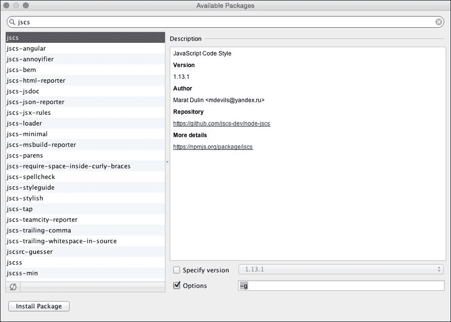

1.  安装完成后，设置页面可以在 **设置** | **语言与框架** | **JavaScript** | **代码质量工具** | **JSCS** 中找到。

1.  在此页面上，从全局 Node 文件夹中选择包以及用于规则的配置文件或预设。与之前的工具不同，没有选项可以单独定义规则。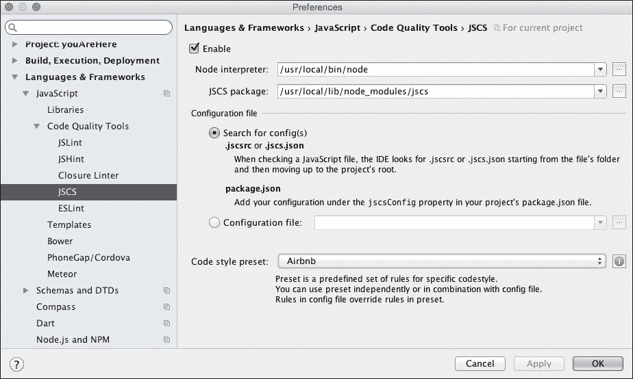

对于这个演示，我们将使用一组流行的规则，即由 **Airbnb** 定义的规则。

现在您已经学会了如何在代码运行之前进行检查，我们将深入调试的世界，看看 WebStorm 如何帮助我们理解并修复正在运行的代码。

# 调试您的代码

在开始之前，我们需要做的第一件事是安装和配置 Chrome 浏览器扩展。此扩展使 WebStorm 能够与浏览器通信，因此我们可以在 IDE 内直接调试应用程序。

Chrome 浏览器扩展可在 **Chrome 网上应用店** 中找到，名为 **JetBrains IDE Support**。因此，我们需要从那里添加，如下面的截图所示：

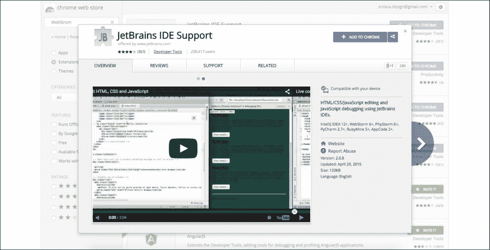

现在我们已经安装了扩展，我们可以开始学习如何调试我们的代码。为了能够在代码运行时进行调试，我们需要启动一个调试会话。有几种启动调试会话的方法。在本节中，我们将了解 WebStorm 中的一些调试方法。

## 从浏览器初始化调试会话

首先，我们需要在 WebStorm 中打开项目，并设置一些断点。在我们开始之前，我们需要从 GitHub 导入为这个目的创建的项目。因此，按照上一节中给出的说明，从 [`github.com/srosca/webstorm_essentials_debugging.git`](https://github.com/srosca/webstorm_essentials_debugging.git) 的 Git 仓库创建一个项目。下载并打开项目后，运行 `npm install` 以安装所有必需的依赖项。

### 注意

一切安装完成后，请确保使用 Grunt 任务运行器或通过在终端中输入 `grunt serve` 来启动服务器。

打开 `fib.js` 文件，您可以在右侧单击以设置断点；这将看起来像一个红色圆点。我们将在 `fib` 函数内的第 58 行设置断点，以检查内部发生的情况。

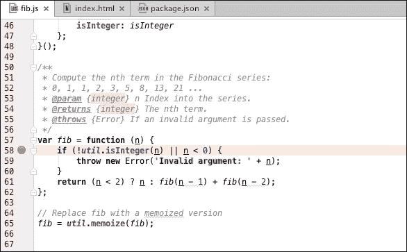

执行以下步骤：

1.  打开 Chrome 浏览器，将其指向 `http://localhost:9000/index.html` 以打开文件。

1.  在浏览器中，从 **上下文** 菜单中选择 WebStorm 中的 **inspect**。这创建了一个临时的调试会话，并将 Chrome 与 WebStorm 连接起来。

1.  您现在将在浏览器中看到一条消息 **JetBrains IDE 支持正在调试此选项卡**，在 WebStorm 中，调试部分带有消息 **连接到 JetBrains Chrome 扩展**。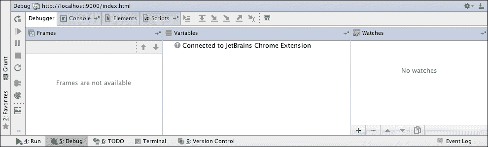

调试部分分为四个选项卡：

+   **调试器**：此选项卡显示与调试部分相关的信息，如 **调用栈**、**变量** 和 **监视**

+   **控制台**：此选项卡显示控制台输出

+   **元素**：此选项卡显示 DOM 树

+   **脚本**：此选项卡显示已加载的脚本

现在我们已经将 WebStorm 和 Chrome 连接起来，我们需要在 Chrome 中刷新页面，以便它停在断点处。浏览器现在显示我们的页面在调试器内部已暂停：

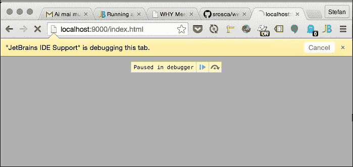

WebStorm IDE 现在将跳转到执行暂停的行，并在 **调试器** 部分显示相关信息。**调用栈** 面板将显示导致当前点的调用栈。**变量** 面板允许您检查应用程序中存储的值，包括局部作用域和全局作用域。在 **监视** 面板中，我们可以评估当前上下文中的各种变量和表达式。这些面板中显示的信息会随着应用程序中的每个步骤而更新。

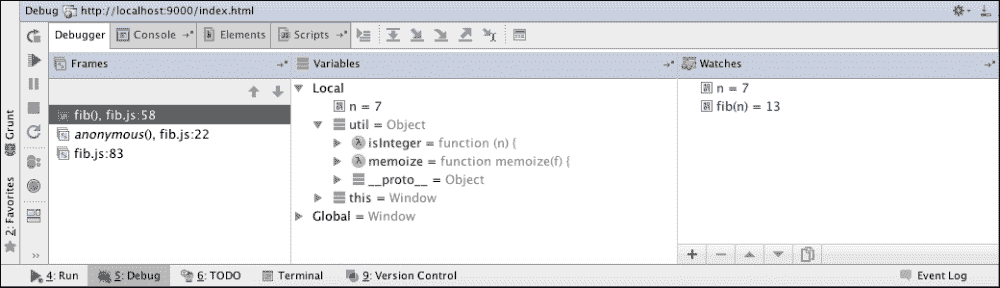

当执行暂停时，我们可以导航程序执行。导航可以通过 **运行** 菜单或使用以下快捷键来控制：

+   **单步执行（F8）**：在当前文件中跳到下一行

+   **进入（F7）**：跳到下一个执行的行，这可能是在单独的文件中

+   **退出（Shift + F8）**：跳到当前方法返回后的第一行执行的行

+   **运行到光标处（Alt + F9）**：运行到光标所在的行

+   **恢复程序（F9）**：恢复程序执行

虽然临时调试会话对于快速调试很有用，但有时我们需要将调试运行保存为配置，以便更容易运行。转到 **运行** | **编辑配置** 以打开 **运行/调试配置** 窗口，然后单击加号。然后选择 **JavaScript 调试**。为您的配置设置一个名称，输入 URL：`http://localhost:9000/index.html`，然后单击 **确定**。

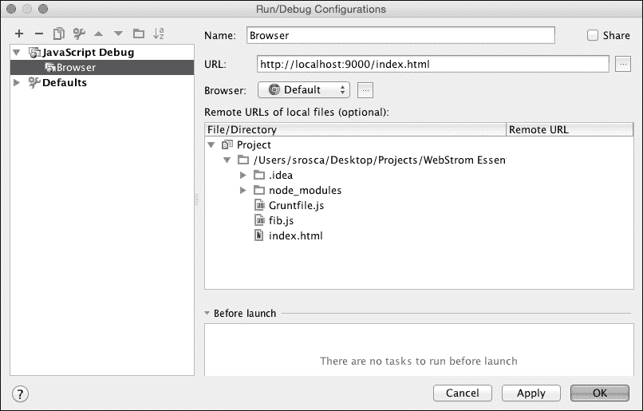

这创建了一个配置，可以通过从运行工具栏中选择调试图标轻松运行，如下面的截图所示：

一旦运行此操作，调试会话的控制方式与上一节完全相同。

我们还可以在 Node.js 内部调试我们的代码，因此我们需要为 Node.js 环境创建一个调试配置。为此，从 **运行/调试配置** 界面中选择 **Node.js**，然后选择您想要调试的 JavaScript 文件。

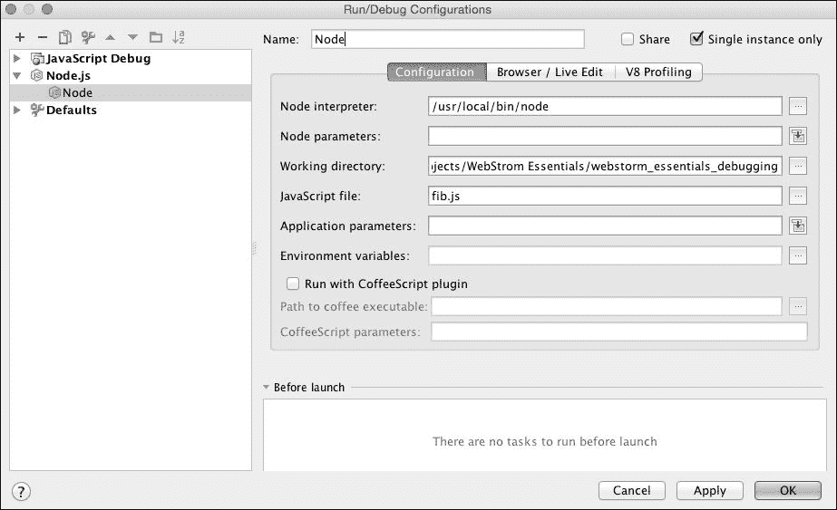

现在，我们可以运行调试会话针对节点环境。其余的显示和控制与之前的示例相同。

调试是理解代码执行的最强大方式之一，而 WebStorm 能够直接在创建代码的环境中（即 IDE）调试代码，这是一个极其宝贵的优势。

# 摘要

在本章中，您已经学会了分析和调试您的代码。您安装并配置了一些最常用的代码质量工具，并在您的代码上使用了它们。您还学会了调试代码并快速找到问题。这些是让您更好地理解代码执行的基本步骤，通过遵循一些简单的规则，您可以确保代码的表现和外观都很出色。

在下一章中，我们将看到 WebStorm 如何帮助您测试代码，以确保我们做出的任何更改都不会破坏我们的代码。我们将深入探讨一些当下最常用的开发实践：TDD 和 BDD。
