# 第八章. 测试你的应用程序

在上一章中，我们了解了分析和调试代码的过程。我们学习了如何使用代码检查器、代码风格检查器和代码质量工具。

在本章中，我们将了解 WebStorm 如何帮助我们测试代码以确保其按预期执行。我们将学习如何配置测试运行器、在 IDE 内运行测试以及使用以下框架：

+   Karma

+   Jasmine

+   Node 单元

+   Mocha

+   Cucumber.js

+   Wallaby.js

### 注意

在开始之前，请注意，本章中解释的过程可能看起来有些重复。然而，在生产环境中情况并非如此，因为你通常只使用一个框架。在 WebStorm 中，当使用多个测试框架时，差异主要在语法层面。

# Karma

Karma 是由 AngularJS 团队创建的测试运行器，它帮助我们针对多个浏览器运行测试。它启动你选择的浏览器，加载你指定的文件，并报告测试结果。Karma 支持多个测试框架，因此你可以使用 Jasmine、Mocha 等编写测试。

在开始之前，你需要全局安装命令行界面，这样你就可以直接运行 Karma，而无需进入 `node_modules` 文件夹。在终端中运行以下命令：

```js
npm install -g karma-cli

```

一旦全局安装了 CLI，你就可以从 GitHub 下载示例章节。因此，使用 Git 仓库 [`github.com/srosca/webstorm_essentials_testing.git`](https://github.com/srosca/webstorm_essentials_testing.git) 作为源创建一个新的项目。

下载项目后，你需要将 Karma 作为开发依赖项安装：

```js
npm install karma --save-dev

```

现在，你可以在项目中初始化 Karma。为此，请在终端中运行以下命令：

```js
karma init

```

你将需要回答几个配置项目的问题。使用以下选项回答它们：

+   **你想使用哪个测试框架？**

    **Jasmine**—使用 Jasmine 作为测试框架

+   **你想要使用 Require.js 吗？**

    **no**—因为我们不想使用 `Require.js`

+   **你想要自动捕获任何浏览器吗？**

    **Chrome**—因为我们想从一开始就使用 Chrome，请输入空字符串以跳到后续问题

+   **你的源文件和测试文件的位置在哪里？**

    **fib.js**—测试我们的文件

    **test/jasmine/*.spec.js**—我们将把所有测试文件都保存在名为 `test/jasmine` 的文件夹中，文件名以 `spec` 结尾

    你需要再次输入一个空字符串来进入下一个问题

+   **是否应该排除之前模式中包含的任何文件？**

    留空此选项

+   **你想要 Karma 监视所有文件并在更改时运行测试吗？**

    **yes**—因为我们想监视更改并自动运行测试

完成这些后，你将创建一个`karma.conf`文件，该文件保存了项目的设置。此外，根据我们的选择，Karma 会安装所需的依赖项：`karma-chrome-launcher`、`karma-jasmine`和`jasmine-core`。

你现在可以创建一个**运行/调试配置**来在 WebStorm 中运行 Karma。导航到**运行** | **编辑配置**，然后从图标或按*Ctrl* + *N*键可访问的**添加新配置**菜单中选择**Karma**。

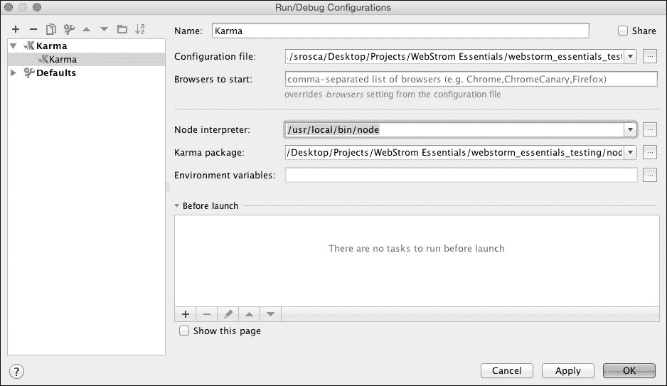

在配置屏幕（如前面的截图所示），你需要选择`karma.config.js`文件的路径、node 和 Karma。WebStorm 会自动获取这些信息。

现在我们可以开始编写代码的测试了。我们将首先研究的框架之一是 Jasmine。

# Jasmine

Jasmine 是一个用于测试 JavaScript 代码的行为驱动开发框架。它设计在任意 JavaScript 平台上运行，不依赖于任何其他框架或 DOM，并且具有易于阅读的明显语法。

在我们开始之前，安装 WebStorm 的 Jasmine JavaScript 库会有所帮助。我们可以使用自动完成和语法高亮。转到**首选项** | **JavaScript** | **库**屏幕，并选择**下载**。

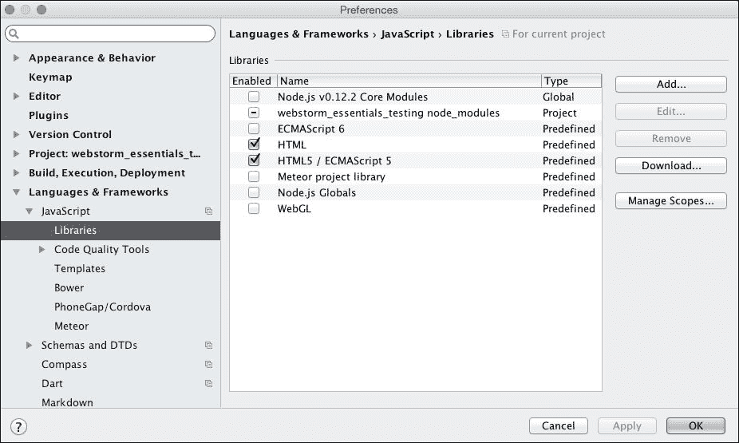

在新屏幕中，选择**TypeScript 社区占位符**并搜索**jasmine**，然后选择**下载并安装**。


现在你已经设置了库，可以开始了。首先，你需要创建一个`test`文件夹，在`test`文件夹内创建一个`jasmine`文件夹，并在`jasmine`文件夹中创建一个`fib.spec.js`文件。按照惯例，测试使用被测试文件名后跟`.spec.js`。在实践中，测试文件直接放在`test`文件夹中，但我们创建了`jasmine`文件夹，以便更容易使用多个框架。

创建文件后，你需要用以下代码填充它：

```js
(function () {
    'use strict';

    describe('Tests', function () {

        it('True should be truthy', function () {
           expect(true).toBeTruthy();
        });

        it('True should fail falsy', function () {
            expect(true).toBeFalsy();
        });
    });
})();
```

这段简单的代码将执行一些简单的测试来检查一切是否正常。你现在可以从**运行**菜单、工具栏或使用快捷键*Shift* + *W*启动 Karma。这将启动 Karma 并在运行部分显示结果。

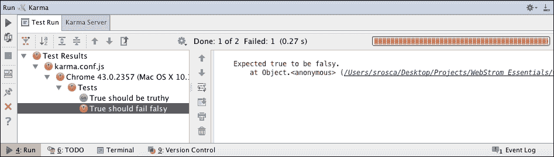

这些测试只是一个简单的例子，以确保一切设置正确。如果你能看到与前面的截图相同的结果，我们现在可以进入下一步，测试我们的 Fibonacci 函数。在编写测试时，持续模式运行测试是一个好习惯。我们可以通过从运行部分切换自动运行来实现。这相当于监视模式，每次我们更改文件时都会自动运行测试。

你首先需要删除我们之前做的演示测试，然后从全局对象中获取`fib`函数。最后，你将测试一些预定义的值的结果。你还需要通过验证当前结果是否等于前两个结果的和来检查递归是否正常工作。最终的代码应该看起来像这样：

```js
(function () {
    'use strict';

    var fib = window.fib;

    describe('Fibonacci', function () {

        it('Should return the term at the given position', function () {
            expect(fib(0)).toEqual(0);
            expect(fib(1)).toEqual(1);
            expect(fib(2)).toEqual(1);
            expect(fib(3)).toEqual(2);
            expect(fib(4)).toEqual(3);
            expect(fib(8)).toEqual(21);
            expect(fib(9)).toEqual(34);
            expect(fib(51)).toEqual(20365011074);
        });

        it('Should return the value as the sum of previous values', function(){
            expect(fib(0) + fib(1)).toEqual(fib(2));
            expect(fib(1) + fib(2)).toEqual(fib(3));
            expect(fib(10) + fib(11)).toEqual(fib(12));
            expect(fib(2500) + fib(2499)).toEqual(fib(2501));
        });

    });
})();
```

如果你已经切换到自动运行模式，那么你的运行部分应该在你完成它们时显示结果。如果一切顺利，所有测试应该通过。

在这个例子中，你已经创建了一个测试来检查你的函数在 Jasmine 和 Karma 的帮助下正确计算值。在下一节中，我们将使用另一个测试框架：Nodeunit。

# Nodeunit

Nodeunit 是一个用于测试 Node.js 代码的框架。它的主要重点是创建一种简单的方式来测试为 node 编写的代码。它的一些主要功能如下：

+   简单易用

+   能够从模块导出测试

+   支持 Node.js 和浏览器

+   允许使用模拟和存根

在编写测试之前，你需要将 Nodeunit 作为开发依赖项安装。在终端中运行以下命令：

```js
npm install nodeunit --save-dev

```

一旦安装了包，就在测试目录中的新`nodeunit`文件夹内创建一个`fib.spec.js`文件。文件创建后，添加以下代码：

```js
(function () {
    'use strict';

    var fibModule = require('./../../fib.js');
    var fib = fibModule.fib;

    exports.term = function (test) {
        test.equal(fib(0),0, 'Fibonacci 0 is 0');
        test.equal(fib(1),1, 'Fibonacci 1 is 1');
        test.equal(fib(2),1, 'Fibonacci 2 is 1');
        test.equal(fib(3),2, 'Fibonacci 3 is 2');
        test.equal(fib(4),3, 'Fibonacci 4 is 3');
        test.equal(fib(8),21, 'Fibonacci 8 is 21');
        test.equal(fib(9),34, 'Fibonacci 9 is 34');
        test.equal(fib(51),20365011074, 'Fibonacci 51 is 20365011074');
        test.done();
    };

    exports.recursion = function (test) {
        test.equal(fib(2),fib(0) + fib(1), 'Fibonacci 2 is  fib 0 + fib 1');
        test.equal(fib(3),fib(1) + fib(2), 'Fibonacci 3 is  fib 1 + fib 2');
        test.equal(fib(12),fib(10) + fib(11), 'Fibonacci 12 is fib 10 + fib 11');        test.equal(fib(2501),fib(2499) + fib(2500), 'Fibonacci 2501 is  fib 2499 + fib 2500');

        test.done();
    };
})();
```

测试与 Jasmine 部分中的测试类似，但使用 Nodeunit 语法编写。要运行它们，你需要创建另一个运行配置，但这次选择 Nodeunit 作为起点。从**运行**|**编辑配置**菜单打开配置屏幕，并填写必要的设置。使用已安装的包作为**Nodeunit**模块，**目录中的所有文件**作为**运行**，以及`test/nodeunit`作为**目录**。

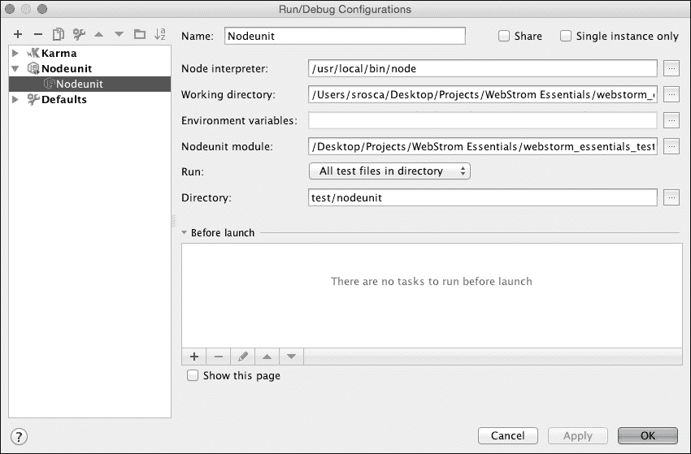

一旦创建了配置，你就可以像上一节那样运行测试，无论是从工具栏还是**运行**菜单。这将显示运行部分和测试结果，如下面的截图所示：

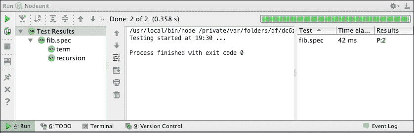

如你所见，在创建和运行测试的工作流程在框架之间非常相似，唯一的区别在于我们编写的语法。接下来，我们将看到另一个框架：Mocha。

# Mocha

Mocha 是一个用于测试 Node.js 和浏览器代码的框架。它是一个更复杂的框架，具有更多功能。它允许用户使用 BDD、TDD、exports 等多种语法编写测试。Mocha 中的测试是顺序运行的，这允许更灵活和准确的报告，并且异常被正确映射到测试用例。

再次强调，在编写测试之前，我们需要通过在终端中运行以下命令将 Mocha 作为开发依赖项安装：

```js
npm install mocha --save-dev

```

现在，在`test`目录中的新`mocha`文件夹内创建一个`fib.spec.js`文件。文件创建后，你需要填写以下测试：

```js
(function () {
    'use strict';
    var assert = require("assert");

    var fibModule = require('./../../fib.js');
    var fib = fibModule.fib;

    suite('Fibonacci', function () {test('Should return the term at the given position', function () {
            assert.equal(fib(0), 0);
            assert.equal(fib(1),1);
            assert.equal(fib(2),1);
            assert.equal(fib(3),2);
            assert.equal(fib(4),3);
            assert.equal(fib(8),21);
            assert.equal(fib(9),34);
            assert.equal(fib(51),20365011074);
        });

        test('Should return the value as the sum of previous values', function () {
            assert.equal(fib(0) + fib(1), fib(2));
            assert.equal(fib(1) + fib(2), fib(3));
            assert.equal(fib(10) + fib(11), fib(12));
            assert.equal(fib(2500) + fib(2499), fib(2501));
        });
    });

})();
```

正如你所见，差异仅在语法层面。测试的逻辑保持不变。现在你已经创建了测试，创建一个运行配置，这次选择 **Mocha** 作为模板。


选择 **Mocha** 包，选择用户界面为 **tdd**，测试目录，然后保存配置，如前述截图所示。这允许我们在运行部分运行 Mocha 测试并查看结果。

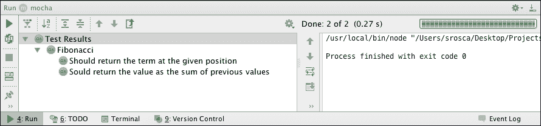

接下来，我们将关注一个尝试使用更易于人类阅读的方式来编写测试的框架。

# Cucumber.js

Cucumber.js 是一个在 Node.js 和浏览器中运行的 BDD 框架。它使用一种易于理解的语法——Gherkin 语言，该语言被描述为一种业务可读的、特定领域的语言。

你将在 Cucumber 中编写的测试包括两种类型的文件：

+   使用 Gherkin 编写的功能文件

+   使用 JavaScript 或 CoffeeScript 编写的支持文件

在编写测试之前，首先要做的事情之一是运行以下命令，将 Cucumber.js 作为开发依赖项安装：

```js
npm install cucumber -save-dev

```

一旦安装了包，你需要创建文件夹结构；因此，在 `test` 文件夹内创建一个 `cucumber` 文件夹。在 `cucumber` 文件夹内，创建功能文件 `fib.feature`，并填充以下代码：

```js
Feature: User can calculate the nth term in the Fibonacci seriesAs a user
  I want to calculate the nth term in the Fibonacci series
  So that I know what the value is

  Scenario Outline: Value calculated for <number>
    Given I have a <number> as n
    When I pass n to the fib function
    Then It calculate the <result> as value of the nth term

    Examples:
      |number |result |
      |0      |0      |
      |1      |1      |
      |2      |1      |
      |3      |2      |
      |4      |3      |
      |8      |21     |
      |9      |34     |
      |51     |20365011074 |
```

正如你所见，Gherkin 语法侧重于用户故事，而不是技术实现。这将在我们即将创建的支持文件中处理。这些文件将放置在 `cucumber` 文件夹内的 `step_definitions` 文件夹中。在这个文件夹中，创建 `fib.steps.js` 文件，并填充以下代码：

```js
'use strict';
var assert = require('assert');

var fibModule = require(process.cwd() + '/../fib.js');
var fib = fibModule.fib;
var n, result;

module.exports = function() {

    this.Given(/^I have a (\d+) as n$/, function(number, callback)
{
        n = parseInt(number, 10);
        callback();
    });

    this.When(/^I pass n to the fib function$/, function(callback)
{
        result = fib(n);
        callback();
    });

    this.Then(/^It calculate the (\d+) as value of the nth term$/, function(value , callback) {
        assert.equal(result, value, 'fib of ' + n +'should be ' + value );
        callback();
    });

};
```

正如你所见，在这个文件中，我们将功能文件中的步骤转换为技术实现。

现在你已经创建了所有文件，你可以创建一个运行配置，就像上一节中那样，但这次选择 `Cucumber.js` 作为模板。

你需要将 **功能文件或目录** 填充为我们创建的 `fib.feature` 文件，并指定从 `node_modules/.bin/` 文件夹到 `Cucumber.js` 文件的可执行路径。

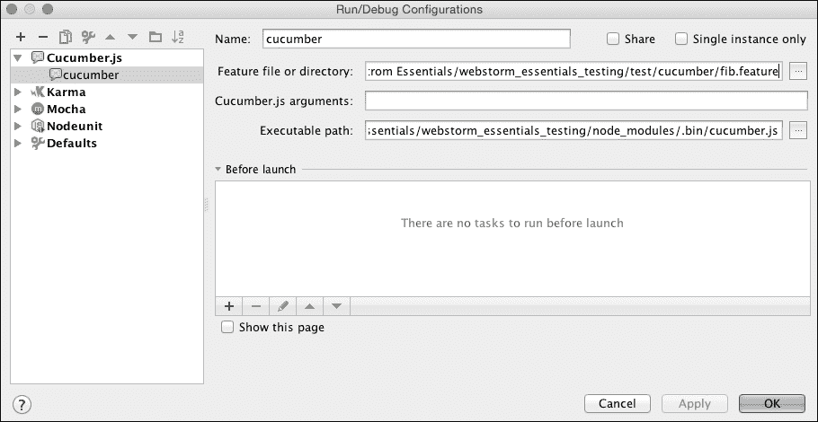

执行这些步骤后，你将创建一个新的运行配置，可以从工具栏或 **运行** 菜单启动，如以下截图所示：

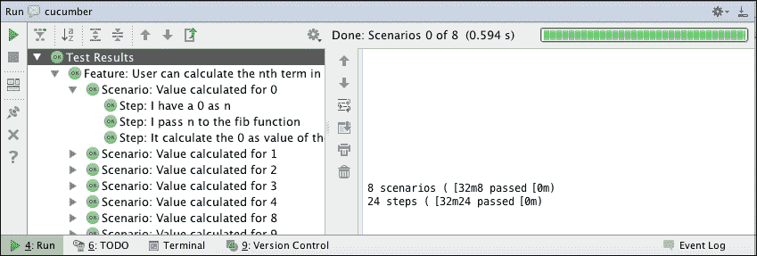

在运行部分，你可以看到按功能和场景分组的测试运行结果。正如你所见，Cucumber 框架更注重以易于阅读和转换为业务需求的语法创建测试。

接下来，我们将关注一个智能测试运行器，它以巧妙的方式运行并显示结果：直接在你的代码中。

# Wallaby.js

Wallaby.js 是一个以创新方式运行测试的测试运行器。测试以连续模式运行，并且当你在代码中更改代码时，Wallaby.js 会直接在你的代码编辑器中报告代码覆盖率和结果。

在使用 Wallaby.js 之前，你需要从 [`wallabyjs.com/`](http://wallabyjs.com/) 的产品页面下载插件。

下载插件后，从 **首选项** | **插件** 对话框安装它，并选择 **从磁盘安装插件…**，如图所示：

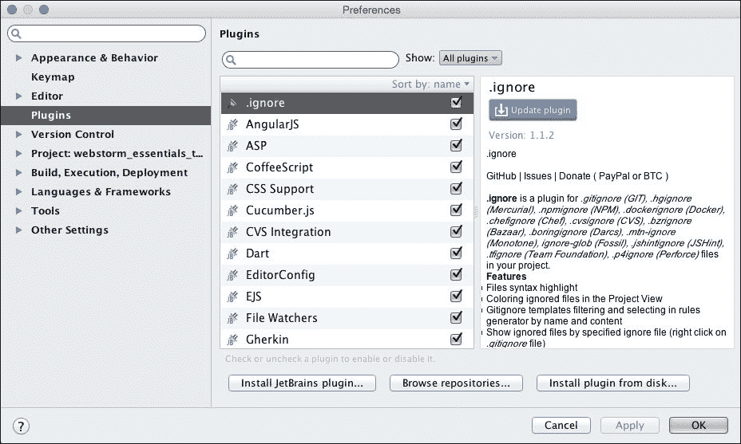

按照安装下载的插件的步骤操作，并重新启动 WebStorm。由于 Wallaby.js 是一个付费插件，重启后，你将被提示输入许可证或使用试用模式。

一旦安装完成，你需要创建一个简单的配置文件来指定你正在使用的文件。在项目根目录下创建一个`wallaby.js`文件，并填写以下代码：

```js
module.exports = function (wallaby) {
  return {
    files: ['fib.js'],
    tests: ['test/jasmine/*.spec.js']
  };
};
```

你将使用我们在上一节中已经定义的 Jasmine 测试。现在创建一个运行配置来运行 **wallaby**。使用已知的步骤，基于 **Wallaby.js** 模板创建一个配置：


你需要指定你在上一步中创建的 `wallaby.js` 配置文件。

当你从工具栏或从**运行**菜单运行项目时，你将在运行部分看到一些详细信息，但这次结果和代码覆盖率将以彩色方块的形式直接显示在你的测试文件和源代码中。

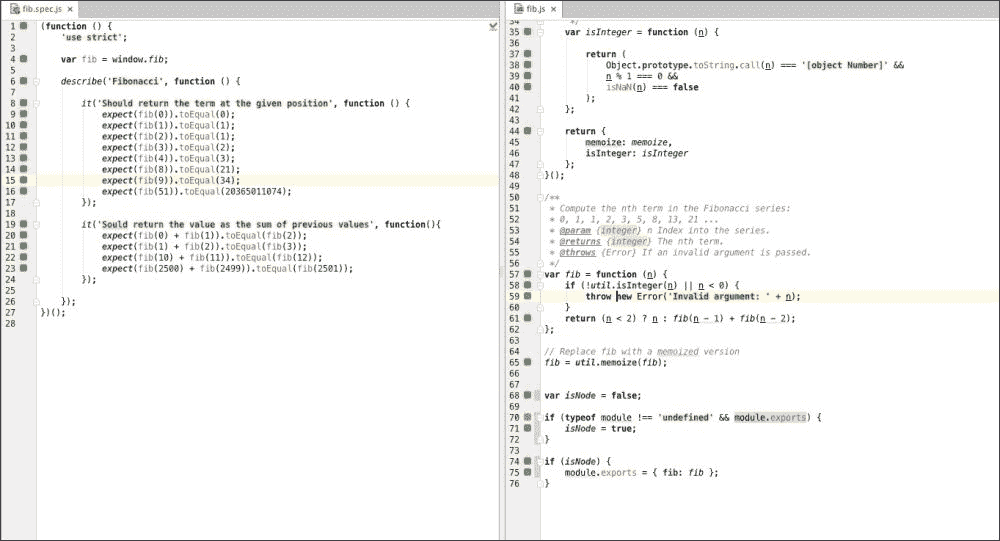

此外，如果你将其中一个测试更改为失败，失败将显示在代码行中，这样你可以轻松地看到问题是什么。

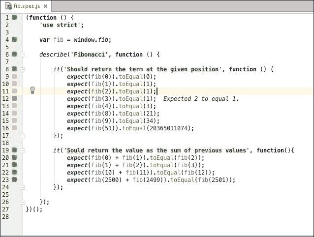

如你所见，Wallaby.js 带来的一个主要优势是你可以快速看到结果，直接在代码中。这样，你可以快速做出更改，而无需在工具之间跳转。

# 摘要

在本章中，我们专注于测试我们的代码。我们使用了一些流行的测试运行器和测试框架，这样我们就可以轻松地看到代码中的问题。

在下一章和最后一章中，我们将看到一些将提高我们生产力的 WebStorm 功能：实时编辑、TODO 功能、Emmet 等。
